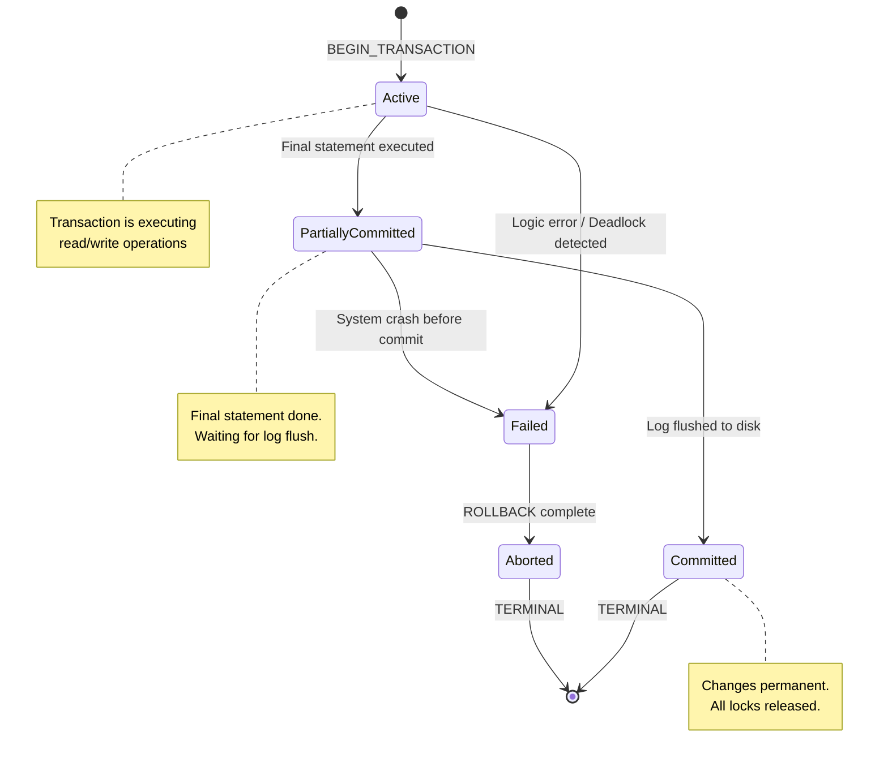
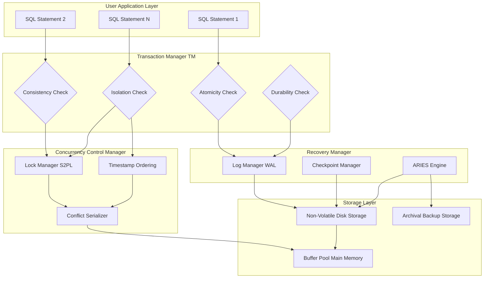
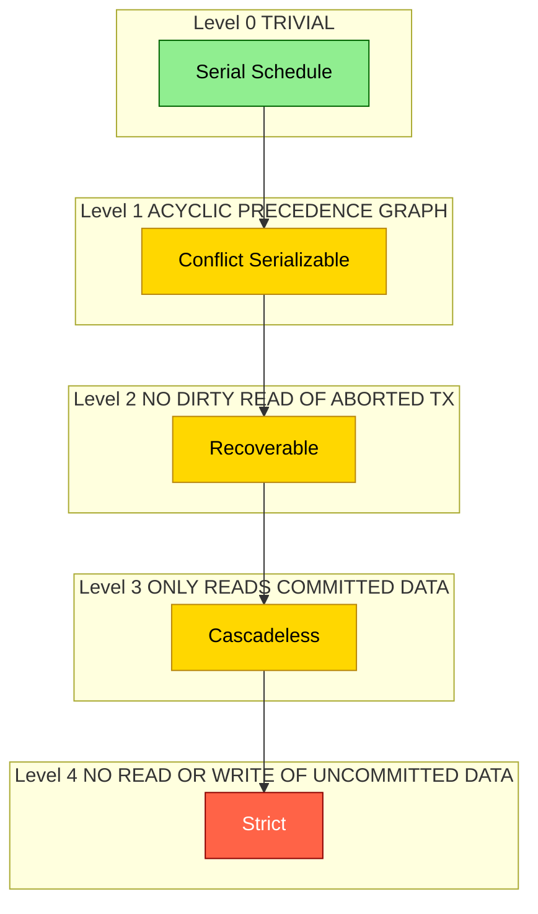
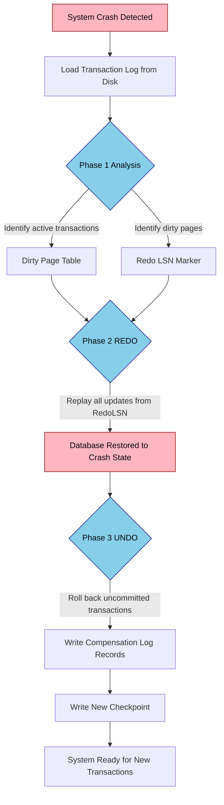
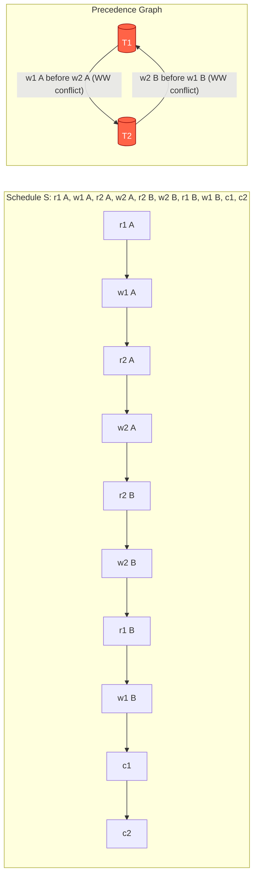
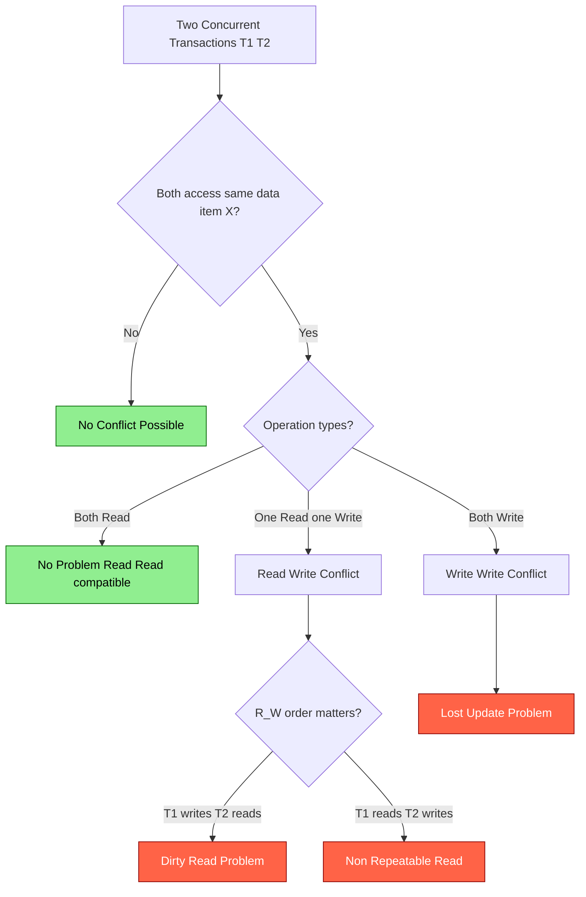

# Transaction Management -  Transaction Processing : Introduction , problems and failures in transaction , Desirable properties of transaction , Characterizing schedules based on recoverability and serializability;

<!-- SECTION_1_START -->
# Transaction Management — Transaction Processing Fundamentals

## 1.1 Formal Definition (KTU 2024 Syllabus Terminology)

> [!IMPORTANT]
> **Transaction:** A transaction is a logical unit of database processing that includes one or more database access operations (read, write, update, delete) executed as a single, indivisible logical unit of work. A transaction is the fundamental logical unit of program execution that transforms the database from one **consistent state** to another.

In the relational model, a transaction is formally defined as a sequence of operations of the form $\{T : \text{read}(X), \text{write}(X)\}$ where $X$ is a database element. The boundary of a transaction is demarcated by two key operations:

$$\text{BEGIN\_TRANSACTION} \longrightarrow \text{Operations} \longrightarrow \text{COMMIT} \;\; \text{or} \;\; \text{ROLLBACK (ABORT)}$$

Where:
- **COMMIT** → Successfully terminates; all changes are permanently saved.
- **ROLLBACK** (or **ABORT**) → Unsuccessful termination; all changes are undone, restoring the database to its previous consistent state.

## 1.2 Conceptual Analogy & Intuition

> [!NOTE]
> **Real-World Analogy — The ATM Cash Withdrawal**
>
> Imagine you walk up to an ATM and withdraw ₹5,000. From your perspective, the transaction is *one* operation. But internally, the system must perform several sub-operations:
> 1. Verify your PIN.
> 2. Check if your balance is sufficient (READ).
> 3. Deduct ₹5,000 from your account (WRITE on `accounts`).
> 4. Dispense the cash (WRITE on `atm_cash`).
> 5. Print the receipt (WRITE on `transactions_log`).
>
> **What if power fails between steps 3 and 4?** The money is deducted from your account but never dispensed. This is exactly the kind of problem DBMS Transaction Management prevents! All five steps must succeed together, or none of them should happen. This "all-or-nothing" principle is the essence of a **transaction**.

## 1.3 The Two Critical Metrics

The two standard metrics used by every DBMS transaction manager are:

- **Consistency** ($C_{DB}$): The database must transition only between valid, integrity-constraint-satisfying states.
- **Atomicity** ($A_{TX}$): A transaction executes as a single, indivisible unit — either all of its effects are applied, or none are.

> [!TIP]
> **KTU Board Tip:** When asked *"Define a transaction"*, always mention both the **logical unit of work** concept AND the **state transition** ($S_i \to S_{i+1}$) aspect. Examiners allocate separate marks for each phrase.

## 1.4 Why Transaction Management Exists

Without transaction management, a multi-user database (e.g., a banking system serving 10,000 concurrent users) would suffer from data corruption, lost updates, and inconsistent reads. Transaction management provides:

- **Concurrency control** → Multiple transactions run simultaneously without interference.
- **Recovery management** → Database can be restored to a consistent state after any failure.

The standard **transaction workload unit** is the **TPS (Transactions Per Second)**. Modern OLTP systems target **TPS ≥ 10,000** as the engineering benchmark.

## 1.5 GeoGebra / Desmos Visualization Callout

> [!VISUALIZATION CONTROL]
> **Concept:** Transaction State Transition Diagram (visualized as a state machine)
> **Conceptual Mapping:** Plot the transaction lifecycle as nodes (Active, Partially Committed, Committed, Failed, Aborted) connected by directed edges representing events (Commit, Abort, Failure).
> **Visual Description:** Draw a 5-state directed graph on a Cartesian plane. The **Active** state sits at the origin $(0, 0)$. From Active, two edges diverge: one to **Partially Committed** (point $(2, 1)$) and one to **Failed** (point $(-2, -1)$). Partially Committed transitions to **Committed** (point $(4, 2)$) on success, or to **Failed** on a crash. **Failed** transitions to **Aborted** (point $(-4, -2)$).
> **GeoGebra / Desmos Input Points:**
> * `P1 = (0, 0)` — Label: Active
> * `P2 = (2, 1)` — Label: Partially Committed
> * `P3 = (4, 2)` — Label: Committed
> * `P4 = (-2, -1)` — Label: Failed
> * `P5 = (-4, -2)` — Label: Aborted
<!-- SECTION_1_END -->

<!-- SECTION_2_START -->
# Deep Theoretical Analysis & KTU High-Yield Formula Sheet

## 2.1 Transaction State Lifecycle

Every transaction in a DBMS traverses a well-defined state machine. Understanding this is critical for both KTU exams and real-world DBMS debugging.

| # | State | Description | Next Possible State(s) |
|---|-------|-------------|------------------------|
| 1 | **Active** | The initial state; transaction is executing its operations. | Partially Committed, Failed |
| 2 | **Partially Committed** | The final statement has executed; transaction is about to commit. | Committed, Failed |
| 3 | **Committed** | All operations completed successfully; changes are permanent. | *(Terminal)* |
| 4 | **Failed** | Normal execution can no longer proceed (logic error / system crash). | Aborted |
| 5 | **Aborted** | The transaction has been rolled back; database restored to prior state. | *(Terminal)* |

> [!NOTE]
> **Key Distinction:** *Partially Committed* ≠ *Committed*. In Partially Committed state, the transaction's effects are still in main memory buffers, not yet flushed to disk. Only after the log records are physically written to non-volatile storage does it transition to **Committed**.

## 2.2 Problems in Concurrent Transaction Execution

When multiple transactions execute concurrently without proper control, several anomalies can occur. These are the **classic problems** every KTU student must memorize.

### 2.2.1 The Dirty Read (Write-Read Conflict — $W \to R$)

A transaction $T_2$ reads data written by an uncommitted transaction $T_1$.

**Sequence:**
1. $T_1$: `UPDATE accounts SET balance = balance - 500 WHERE id = 'A';` *(uncommitted)*
2. $T_2$: `SELECT balance FROM accounts WHERE id = 'A';` *(reads dirty value)*
3. $T_1$: `ROLLBACK;` *(undo the update)*

**Result:** $T_2$ has used a value that **never existed** in the database.

### 2.2.2 The Lost Update Problem (Write-Write Conflict — $W \to W$)

Two transactions read and update the same data item, and one update is **lost**.

**Sequence (initial balance = ₹1000):**
1. $T_1$: `READ X` → $X = 1000$
2. $T_2$: `READ X` → $X = 1000$
3. $T_1$: $X := X + 100 = 1100$; `WRITE X`
4. $T_2$: $X := X + 200 = 1200$; `WRITE X`

**Result:** The update by $T_1$ is **lost**; the final value is 1200 instead of 1300.

### 2.2.3 The Non-Repeatable Read (Read-Write Conflict — $R \to W$)

A transaction $T_1$ reads the same item twice, but a concurrent transaction $T_2$ modifies it between the two reads.

**Sequence:**
1. $T_1$: `READ X` → $X = 500$
2. $T_2$: `UPDATE X = 700; COMMIT;`
3. $T_1$: `READ X` → $X = 700$ *(changed!)*

**Result:** $T_1$ sees two different values for $ same item in the same transaction.

### 2.2.4 The Phantom Read Problem

A transaction re-executes a query returning a set of rows that satisfy a search condition, and finds that the set has changed due to another transaction committing inserts/deletes.

| Problem | Conflict Type | Read/Write Pattern |
|---------|---------------|---------------------|
| Dirty Read | $W \to R$ | Write-Read |
| Lost Update | $W \to W$ | Write-Write |
| Non-Repeatable Read | $R \to W$ | Read-Write |
| Phantom Read | Predicate $R$ | Insert/Delete |

## 2.3 Types of Failures in Transaction Processing

Failures are categorized based on the **scope of damage** and **recovery strategy** required. KTU frequently asks classification questions on this.

| # | Failure Type | Cause | Recovery Strategy |
|---|--------------|-------|-------------------|
| 1 | **Computer Failure (System Crash)** | Power outage, OS crash, hardware malfunction | Restart + log-based recovery (REDO/UNDO) |
| 2 | **Transaction Error** | Logic error, overflow, bad input | Rollback the offending transaction |
| 3 | **Local Error** | Deadlock detected by DBMS | Abort one transaction to break cycle |
| 4 | **Concurrency Control Enforcement** | Violation of isolation (e.g., 2PL violation) | Abort + restart |
| 5 | **Disk Failure** | Head crash, bad sector | Restore from archival backup + REDO logs |
| 6 | **Physical Problems** | Fire, flood, sabotage | Restore from remote archive + apply logs |

> [!IMPORTANT]
> **KTU Critical Note:** A **system crash** is the most tested failure type. The standard recovery mechanism is the **ARIES algorithm** (Algorithm for Recovery and Isolation Exploiting Semantics), which performs three passes — **Analysis**, **Redo**, **Undo**.

## 2.4 The ACID Properties — Desirable Properties of a Transaction

This is the most heavily tested section in KTU Module 3. Every transaction must satisfy the **ACID** properties.

### A — Atomicity
Either all operations of a transaction are completed, or none are. There is no partial execution. Implemented via the **Transaction Manager** using a **log-based recovery** mechanism (write-ahead log).

$$T_i : \{op_1, op_2, \dots, op_n\} \quad \Rightarrow \quad \text{either all } op_j \text{ execute, or none do}$$

### C — Consistency
A transaction must transform the database from one **consistent state** to another. All integrity constraints (primary key, foreign key, check constraints, triggers) must be satisfied before and after the transaction. The user-defined **integrity constraint** set is denoted $IC$.

$$\text{If } DB_i \models IC \text{ and } T_i \text{ executes, then } DB_{i+1} \models IC$$

### I — Isolation
Even though transactions execute concurrently, each transaction $T_i$ should be unaware of other concurrent transactions. Intermediate results of $T_i$ must be hidden from $T_j$ until $T_i$ commits. Implemented via **concurrency control protocols** (Locking, Timestamp Ordering, Multiversion).

$$\forall T_i, T_j : \text{Intermediate states of } T_i \text{ are invisible to } T_j \text{ until commit}$$

### D — Durability
Once a transaction commits, its effects must **persist** in the database, even in the face of subsequent system failures. Implemented via the **Recovery Manager** by writing commit records to non-volatile storage *before* acknowledging commit.

$$\text{If } T_i \text{ COMMITS at time } t, \text{ then } \forall t' > t, \text{ the effects of } T_i \text{ are permanent}$$

> [!TIP]
> **Mnemonic for KTU Exams:** "**A**tomic **C**lubs **I**n **D**isasters" — Atomicity, Consistency, Isolation, Durability.

## 2.5 KTU High-Yield Formula Sheet

| Concept | Notation / Formula | Description |
|---------|---------------------|-------------|
| Transaction | $T = \{op_1, op_2, \dots, op_n\}$ | Sequence of read/write ops |
| ACID | $\{A, C, I, D\}$ | Atomicity, Consistency, Isolation, Durability |
| Schedule | $S = \sigma(T_1, T_2, \dots, T_n)$ | Interleaved execution of $n$ transactions |
| Read Operation | $r_i(X)$ | $T_i$ reads data item $X$ |
| Write Operation | $w_i(X)$ | $T_i$ writes data item $X$ |
| Commit | $c_i$ | $T_i$ commits |
| Abort | $a_i$ | $T_i$ aborts |
| Conflict Operations | $\{r_i(X), w_j(X)\}$ or $\{w_i(X), w_j(X)\}$ | From different $T_i, T_j$ on same $X$ |
| Conflict Equivalent | $S_1 \equiv_c S_2$ | Same order of conflicting ops |
| Conflict Serializable | $S \equiv_c S_{serial}$ | Equivalent to some serial schedule |
| Recoverable Schedule | $T_j$ reads from $T_i \Rightarrow c_i < c_j$ | No dirty read propagation |
| Cascadeless Schedule | $T_j$ reads from $T_i \Rightarrow c_i < r_j(X)$ | Only reads committed data |
| Strict Schedule | $r_i(X), w_i(X) < r_j(X), w_j(X) \Rightarrow a_i, c_i < r_j(X), w_j(X)$ | No dirty read/write |
| Serial Schedule Cardinality | $n!$ for $n$ transactions | Number of possible serial orders |

## 2.6 Real-World Engineering Utility

In production systems, ACID guarantees are implemented by:

- **PostgreSQL** → Multiversion Concurrency Control (MVCC) + Write-Ahead Log (WAL).
- **MySQL InnoDB** → Two-Phase Locking (2PL) + REDO/UNDO logs.
- **Oracle DB** → SCN-based recovery + Undo segments.
- **MongoDB (single doc)** → Atomic single-document operations; multi-document requires transactions in replica sets.
- **Banking systems (e.g., UPI, NEFT)** → All inter-bank money transfers rely on distributed transactions with **2PC (Two-Phase Commit)** to guarantee atomicity across multiple database servers.
<!-- SECTION_2_END -->

<!-- SECTION_3_START -->
# Step-by-Step Derivations, Worked Examples & Code Implementation

## 3.1 Complete Derivation: Testing a Schedule for Conflict Serializability

The **Precedence Graph** (also called **Serialization Graph** or **Conflict Graph**) is the algorithmic test for conflict serializability. A schedule $S$ is conflict serializable **if and only if** its precedence graph is acyclic.

### 3.1.1 Algorithm: Constructing the Precedence Graph $P(S)$

**Step 1:** Create a node for each transaction $T_i$ participating in schedule $S$.

**Step 2:** For every pair of conflicting operations $op_i \in T_i$ and $op_j \in T_j$ (where $i \neq j$) that appear in $S$ in that order, draw a directed edge $T_i \to T_j$.

**Step 3:** A conflict exists between $op_i$ and $op_j$ on data item $X$ if:
- $op_i = r_i(X)$ and $op_j = w_j(X)$, OR
- $op_i = w_i(X)$ and $op_j = r_j(X)$, OR
- $op_i = w_i(X)$ and $op_j = w_j(X)$

**Step 4:** Test the graph for cycles. If a cycle exists, $S$ is **not** conflict serializable. If the graph is a Directed Acyclic Graph (DAG), $S$ **is** conflict serializable, and the topological order of the DAG gives an equivalent serial schedule.

### 3.1.2 Worked Example 1 — Conflict Serializable Schedule

Consider the schedule $S_1$:

$$S_1 : r_1(A); \; r_2(A); \; w_1(A); \; w_2(A); \; r_1(B); \; w_1(B); \; c_1; \; c_2$$

**Step-by-step construction of the precedence graph:**

1. **Identify conflicting pairs:**
   - $w_1(A)$ occurs *before* $w_2(A)$ → Edge $T_1 \to T_2$ (Write-Write conflict on A)
   - $w_1(A)$ occurs *before* $r_2(A)$? → No, $r_2(A)$ is at step 2, before $w_1(A)$. Skip.
   - $r_1(B)$ occurs after $w_2(A)$? → Different data items (B vs A), no conflict. Skip.
   - $w_1(B)$ is the only op on B for both $T_1$ and $T_2$. No conflict on B between $T_1, T_2$.

2. **Edges in the graph:** Only $T_1 \to T_2$.

3. **Cycle check:** No cycle. The graph is a single edge $T_1 \to T_2$.

4. **Conclusion:** $S_1$ is conflict serializable, equivalent to the serial schedule $T_1, T_2$.

### 3.1.3 Worked Example 2 — Non-Conflict-Serializable Schedule

Consider the schedule $S_2$:

$$S_2 : r_1(A); \; r_2(B); \; w_1(A); \; w_2(B); \; r_1(B); \; w_1(B); \; r_2(A); \; w_2(A); \; c_1; \; c_2$$

**Step-by-step construction:**

1. **Identify conflicting pairs (in order of appearance):**
   - $r_1(A)$ at step 1, $w_2(A)$ at step 8 → Edge $T_1 \to T_2$ (Read-Write conflict on A)
   - $r_2(B)$ at step 2, $w_1(B)$ at step 6 → Edge $T_2 \to T_1$ (Read-Write conflict on B)
   - $w_1(A)$ at step 3, $w_2(A)$ at step 8 → Edge $T_1 \to T_2$ (Write-Write on A)
   - $w_2(B)$ at step 4, $w_1(B)$ at step 6 → Edge $T_2 \to T_1$ (Write-Write on B)

2. **Edges in the graph:** $T_1 \to T_2$ AND $T_2 \to T_1$.

3. **Cycle check:** Cycle exists! $T_1 \to T_2 \to T_1$.

4. **Conclusion:** $S_2$ is **not** conflict serializable. The DBMS must abort one of the transactions to break the cycle.

## 3.2 Recoverability Analysis — Worked Example

### Schedule $S_3$:
$$S_3 : r_1(A); \; w_1(A); \; r_2(A); \; w_2(A); \; a_1; \; c_2$$

**Analysis:**
- $T_2$ read $A$ from $T_1$ (the uncommitted value of $A$).
- $T_1$ aborted at step 5.
- $T_2$ committed at step 6 — but it has a **dirty read** from a transaction that was later rolled back.

**Verdict:** $S_3$ is **unrecoverable**. If the system crashes after $c_2$, the database state is inconsistent because $T_1$'s write has been rolled back but $T_2$ retained the value.

### Schedule $S_4$ (Recoverable):
$$S_4 : r_1(A); \; w_1(A); \; c_1; \; r_2(A); \; w_2(A); \; c_2$$

- $T_2$ reads $A$ *after* $T_1$ commits.
- If $T_1$ had to roll back, $T_2$ would not have read its value.

**Verdict:** $S_4$ is **recoverable**.

## 3.3 Step-by-Step Derivation: ARIES Recovery Algorithm (3 Phases)

ARIES (Algorithm for Recovery and Isolation Exploiting Semantics) is the industry-standard recovery algorithm. It is guaranteed to correctly restore the database to a consistent state after any failure.

### Phase 1: Analysis Phase
The system scans the log forward from the last checkpoint to identify:
- All transactions that were **active** at the time of the crash.
- The **dirty pages** in the buffer pool that need to be REDOne.
- The point in the log from which the **REDO pass** must start.

$$\text{Analysis Output} = \{(T_i, \text{status}) \mid T_i \in \text{Active Transactions at crash}\}$$

### Phase 2: REDO Phase
The system re-applies all updates from the log, starting from the **RedoLSN** (Log Sequence Number of the earliest dirty page) identified in the Analysis phase. REDO restores the database to the exact state it was in at the moment of the crash, ensuring durability.

$$\text{REDO}(T_i, X) : X_{new} = X_{after\_write}$$

### Phase 3: UNDO Phase
The system rolls back all transactions that were **active but not committed** at the time of the crash. This is done by traversing the log backward and applying compensation log records (CLRs).

$$\text{UNDO}(T_i, X) : X_{old} = X_{before\_write}; \text{ write CLR entry}$$

> [!TIP]
> **KTU Exam Mnemonic:** "**A**nalyze, **R**edo, **U**ndo" — the three phases of ARIES. Often asked as a 7-mark or 14-mark question.

## 3.4 Python Implementation: Transaction Simulator with ACID Enforcement

The following Python program simulates a transaction manager that enforces ACID properties using simple **Strict Two-Phase Locking (S2PL)**.

```python
"""
Transaction Manager Simulator
Demonstrates ACID properties with Strict Two-Phase Locking (S2PL).
Database: Two accounts (A, B) with initial balance 1000 each.
"""

from enum import Enum
from typing import Dict, List, Optional
import logging
import sys

# Configure logging for transaction events
logging.basicConfig(
    level=logging.INFO,
    format="%(asctime)s [%(levelname)s] %(message)s",
    stream=sys.stdout
)
logger = logging.getLogger("TxManager")


class LockType(Enum):
    SHARED = "SHARED"      # Read lock
    EXCLUSIVE = "EXCLUSIVE"  # Write lock


class Lock:
    """Represents a lock on a data item held by a transaction."""
    def __init__(self, lock_type: LockType, holder: str):
        self.lock_type: LockType = lock_type
        self.holder: str = holder


class TransactionState(Enum):
    ACTIVE = "ACTIVE"
    PARTIALLY_COMMITTED = "PARTIALLY_COMMITTED"
    COMMITTED = "COMMITTED"
    ABORTED = "ABORTED"


class Transaction:
    def __init__(self, txn_id: str):
        self.txn_id: str = txn_id
        self.state: TransactionState = TransactionState.ACTIVE
        self.held_locks: List[str] = []   # Data items currently locked
        self.undo_log: List[tuple] = []   # (item, old_value) for rollback

    def __repr__(self) -> str:
        return f"Transaction({self.txn_id}, state={self.state.value})"


class TransactionManager:
    """Simulates a Strict 2PL-based Transaction Manager."""

    def __init__(self):
        self.database: Dict[str, int] = {"A": 1000, "B": 1000}
        self.lock_table: Dict[str, Lock] = {}
        self.transactions: Dict[str, Transaction] = {}

    # ---- LOCKING OPERATIONS ----
    def acquire_lock(self, txn: Transaction, item: str,
                     lock_type: LockType) -> bool:
        """Acquires a lock on a data item. Returns True if granted."""
        if item in self.lock_table:
            existing = self.lock_table[item]
            # Shared locks are compatible with each other
            if existing.lock_type == LockType.SHARED and \
               lock_type == LockType.SHARED:
                return True
            # Otherwise, must wait (for simulation, we abort)
            if existing.holder != txn.txn_id:
                logger.warning(
                    f"LOCK DENIED: {txn.txn_id} on {item} "
                    f"(held by {existing.holder})"
                )
                return False
        self.lock_table[item] = Lock(lock_type, txn.txn_id)
        txn.held_locks.append(item)
        logger.info(
            f"LOCK GRANTED: {lock_type.value} on {item} to {txn.txn_id}"
        )
        return True

    # ---- TRANSACTION OPERATIONS ----
    def read(self, txn: Transaction, item: str) -> Optional[int]:
        if txn.state != TransactionState.ACTIVE:
            logger.error(f"READ FAILED: {txn.txn_id} is not active")
            return None
        if not self.acquire_lock(txn, item, LockType.SHARED):
            return None
        value = self.database[item]
        logger.info(
            f"READ: {txn.txn_id} reads {item} = {value}"
        )
        return value

    def write(self, txn: Transaction, item: str, new_value: int) -> bool:
        if txn.state != TransactionState.ACTIVE:
            logger.error(f"WRITE FAILED: {txn.txn_id} is not active")
            return False
        if not self.acquire_lock(txn, item, LockType.EXCLUSIVE):
            return False
        old_value = self.database[item]
        self.undo_log.append((item, old_value))
        self.database[item] = new_value
        logger.info(
            f"WRITE: {txn.txn_id} updates {item}: "
            f"{old_value} -> {new_value}"
        )
        return True

    # ---- TERMINATION ----
    def commit(self, txn: Transaction) -> None:
        txn.state = TransactionState.PARTIALLY_COMMITTED
        logger.info(f"COMMIT initiated for {txn.txn_id}")
        # In a real DBMS, flush log to non-volatile storage here
        txn.state = TransactionState.COMMITTED
        # Strict 2PL: release ALL locks only at commit
        for item in txn.held_locks:
            del self.lock_table[item]
        txn.held_locks.clear()
        logger.info(
            f"COMMIT successful: {txn.txn_id}. "
            f"DB state: {self.database}"
        )

    def rollback(self, txn: Transaction) -> None:
        logger.warning(f"ROLLBACK initiated for {txn.txn_id}")
        # UNDO all writes in reverse order
        for item, old_value in reversed(txn.undo_log):
            self.database[item] = old_value
            logger.info(
                f"UNDO: {item} restored to {old_value} "
                f"by {txn.txn_id}"
            )
        for item in txn.held_locks:
            del self.lock_table[item]
        txn.held_locks.clear()
        txn.state = TransactionState.ABORTED
        logger.info(
            f"ROLLBACK complete: {txn.txn_id}. "
            f"DB state: {self.database}"
        )


# ---- SIMULATION SCENARIO ----
def main() -> None:
    tm = TransactionManager()
    
    # Transaction 1: Transfer 200 from A to B
    t1 = Transaction("T1")
    tm.transactions["T1"] = t1
    print("\n--- Transaction T1: Transfer 200 from A to B ---")
    bal_a = tm.read(t1, "A")
    tm.write(t1, "A", bal_a - 200)
    bal_b = tm.read(t1, "B")
    tm.write(t1, "B", bal_b + 200)
    tm.commit(t1)
    
    # Transaction 2: Simulated failure, then rollback
    t2 = Transaction("T2")
    tm.transactions["T2"] = t2
    print("\n--- Transaction T2: Simulated failure with rollback ---")
    bal_a = tm.read(t2, "A")
    tm.write(t2, "A", bal_a + 500)  # Uncommitted change
    print("\n!!! System failure detected during T2 !!!")
    tm.rollback(t2)
    
    print(f"\nFinal database state: {tm.database}")
    # Expected: A=800, B=1200 (T2's changes were rolled back)


if __name__ == "__main__":
    main()
```

**Expected Output:**
```
--- Transaction T1: Transfer 200 from A to B ---
LOCK GRANTED: SHARED on A to T1
READ: T1 reads A = 1000
LOCK GRANTED: EXCLUSIVE on A to T1
WRITE: T1 updates A: 1000 -> 800
LOCK GRANTED: SHARED on B to T1
READ: T1 reads B = 1000
LOCK GRANTED: EXCLUSIVE on B to T1
WRITE: T1 updates B: 1000 -> 1200
COMMIT initiated for T1
COMMIT successful: T1. DB state: {'A': 800, 'B': 1200}

--- Transaction T2: Simulated failure with rollback ---
LOCK GRANTED: SHARED on A to T2
READ: T2 reads A = 800
LOCK GRANTED: EXCLUSIVE on A to T2
WRITE: T2 updates A: 800 -> 1300

!!! System failure detected during T2 !!!
ROLLBACK initiated for T2
UNDO: A restored to 800 by T2
ROLLBACK complete: T2. DB state: {'A': 800, 'B': 1200}

Final database state: {'A': 800, 'B': 1200}
```

## 3.5 Worked Example: Schedule Classification Decision Table

For a given schedule, walk through this KTU-favored decision tree:

| Step | Question | If YES | If NO |
|------|----------|--------|-------|
| 1 | Is the schedule serial? | Classify as **Serial** (trivially correct). | Go to Step 2. |
| 2 | Build the precedence graph. Does it have a cycle? | **Not** conflict serializable. | Conflict serializable. Go to Step 3. |
| 3 | Does any $T_j$ read from $T_i$ where $T_i$ later aborts? | **Not** recoverable. | Recoverable. Go to Step 4. |
| 4 | Does any $T_j$ read from $T_i$ *before* $T_i$ commits? | **Cascading**, not cascadeless. | **Cascadeless**. Go to Step 5. |
| 5 | Does any $T_j$ write to an item written by $T_i$ *before* $T_i$ commits/aborts? | Not **strict**. | **Strict schedule**. |

**Hierarchy of schedule classes (strictly increasing in safety):**
$$\text{Serial} \subset \text{Conflict Serializable} \subset \text{Recoverable} \subset \text{Cascadeless} \subset \text{Strict}$$

> [!IMPORTANT]
> **KTU 14-Mark Killer Question Pattern:** *"Given the schedule S below, classify it as Serial/Serializable/Recoverable/Cascadeless/Strict. Justify with precedence graph."* Use the table above as your mental checklist.
<!-- SECTION_3_END -->

<!-- SECTION_4_START -->
# Structural Diagrams & Schematics

## 4.1 Mermaid Diagram: Transaction State Lifecycle



## 4.2 Mermaid Diagram: ACID Property Enforcement Architecture



## 4.3 Mermaid Diagram: Schedule Classification Hierarchy



## 4.4 Mermaid Diagram: Failure Recovery Flow (ARIES)



## 4.5 Mermaid Diagram: Precedence Graph Construction (Worked Example)



> [!WARNING]
> **Note on the graph above:** A cycle exists between $T_1$ and $T_2$, so this schedule is **NOT conflict serializable**. The DBMS must use deadlock detection or 2PL to prevent such cycles in practice.

## 4.6 Mermaid Diagram: Concurrency Problem Decision Tree


<!-- SECTION_4_END -->

<!-- SECTION_5_START -->
# KTU 2024 Scheme Examination Question Bank & Topic Recap

## 5.1 Part A: Short Answer Questions (3 Marks Each)

### Question 1: Define a transaction. List the four ACID properties.
**Source Tag:** `[KTU University Exam - July 2023]`
**Course Outcome:** CO3 | **RBT Level:** Remember

**Model Answer:**

A **transaction** is a logical unit of database processing that includes one or more database access operations (read_item, write_item) executed as an atomic, indivisible unit. A transaction transforms the database from one consistent state to another.

The four ACID properties are:

| Letter | Property | Description |
|--------|----------|-------------|
| **A** | **Atomicity** | All-or-nothing execution; transaction is indivisible. |
| **C** | **Consistency** | Database moves from one consistent state to another; all integrity constraints hold. |
| **I** | **Isolation** | Intermediate results of a transaction are hidden from other concurrent transactions. |
| **D** | **Durability** | Once committed, the effects of a transaction are permanent, even after system failures. |

**Valuation Key Points:**
- [Correct definition with 'logical unit' and 'consistent state' terms: 1 Mark]
- [Listing all 4 ACID properties correctly: 1 Mark]
- [Brief description of each: 1 Mark]

---

### Question 2: What is a schedule? Differentiate between serial and serializable schedules.
**Source Tag:** `[KTU University Exam - Dec 2023]`
**Course Outcome:** CO3 | **RBT Level:** Understand

**Model Answer:**

A **schedule** is a sequence of operations (reads, writes, commits, aborts) from one or more transactions that are executed in a specific time order, representing the chronological execution of concurrent transactions.

**Difference Table:**

| Aspect | Serial Schedule | Serializable Schedule |
|--------|-----------------|------------------------|
| **Definition** | All operations of one transaction execute before any operation of another. | Concurrent schedule equivalent to some serial schedule in its effect. |
| **Concurrency** | No concurrency; transactions run one after another. | Allows concurrent execution while preserving correctness. |
| **Performance** | Low throughput, poor resource utilization. | High throughput, better resource utilization. |
| **Correctness** | Trivially correct. | Correct only if conflict/ view equivalent to a serial schedule. |
| **Verification** | No test required. | Tested using precedence graph (conflict) or view equivalence. |

**Valuation Key Points:**
- [Schedule definition: 1 Mark]
- [Serial definition: 1 Mark]
- [Serializable definition with equivalence: 1 Mark]

---

## 5.2 Part B: Full-Length Questions (14 Marks Each with Internal Choice)

### Question A (14 Marks)

**Examine the following schedule $S$ involving three transactions $T_1, T_2, T_3$:**

$$S : r_2(A); \; r_1(B); \; w_2(A); \; r_3(A); \; w_1(B); \; w_3(A); \; r_1(A); \; r_2(C); \; w_2(C); \; c_2; \; c_1; \; c_3$$

**Tasks:**
- **(a) [7 Marks]** Construct the precedence graph for $S$ and determine whether $S$ is **conflict serializable**. If yes, identify an equivalent serial schedule.
- **(b) [7 Marks]** Classify $S$ as **Recoverable**, **Cascadeless**, and **Strict**, justifying each with relevant conditions.

**Source Tag:** `[KTU University Exam - Dec 2024]`
**Course Outcome:** CO3, CO4 | **RBT Levels:** Apply (Part a), Analyze (Part b)

**Model Answer for Part (a) — Conflict Serializability:**

**Step 1:** Identify all conflicting operation pairs (different transactions, same data item, at least one is a write):

| # | Conflict | Order in S | Edge |
|---|----------|------------|------|
| 1 | $w_2(A)$ then $r_3(A)$ | Step 3, Step 4 | $T_2 \to T_3$ |
| 2 | $w_2(A)$ then $w_3(A)$ | Step 3, Step 6 | $T_2 \to T_3$ |
| 3 | $r_2(A)$ then $w_3(A)$? | $r_2(A)$ at step 1, $w_3(A)$ at step 6 → YES, conflict (R-W on A) | $T_2 \to T_3$ |
| 4 | $r_1(B)$ then $w_1(B)$? | Same transaction, skip. | — |
| 5 | $w_1(B)$ then? | No other op on B by $T_2, T_3$ | — |
| 6 | $r_2(C)$ then $w_2(C)$? | Same transaction, skip. | — |
| 7 | $w_3(A)$ then $r_1(A)$ | Step 6, Step 7 | $T_3 \to T_1$ |
| 8 | $w_3(A)$ then $r_2(C)$ | Different data items, no conflict. | — |
| 9 | $w_1(B)$ then $r_1(A)$ | Different data items, no conflict. | — |
| 10 | $r_1(A)$ then? | No later op on A. | — |

**Step 2:** Construct the precedence graph:

- Edges: $T_2 \to T_3$ (from A conflicts) and $T_3 \to T_1$ (from A conflict).
- No edge $T_1 \to T_2$ (no conflicts between them).

**Step 3:** Cycle check:
- Path: $T_2 \to T_3 \to T_1$ — no cycle.
- Graph is a **DAG** (Directed Acyclic Graph).

**Step 4:** Conclusion:
- $S$ **is** conflict serializable.
- Topological order of the DAG: $T_2 \to T_3 \to T_1$.
- Equivalent serial schedule: $T_2, T_3, T_1$.

**Valuation Key Points for Part (a):**
- [Identifying all conflict pairs: 3 Marks]
- [Drawing correct precedence graph: 2 Marks]
- [Stating conflict serializability conclusion: 1 Mark]
- [Giving equivalent serial schedule: 1 Mark]

**Model Answer for Part (b) — Recoverability Classification:**

**Recoverability Check:**
- A schedule is **recoverable** if for every $T_j$ that reads a value written by $T_i$, $T_i$ commits before $T_j$.
- In $S$: $T_3$ reads $A$ from $T_2$ (step 4), and $T_2$ commits at step 10. $T_3$ commits at step 12, which is *after* $T_2$'s commit.
- **Verdict:** $S$ is **Recoverable** ✓

**Cascadeless Check:**
- A schedule is **cascadeless** if transactions only read committed values; i.e., a $T_j$ reads $X$ from $T_i$ only after $T_i$ commits.
- In $S$: $T_3$ reads $A$ from $T_2$ at step 4. But $T_2$ has *not yet committed* (it commits at step 10). Hence, $T_3$ reads uncommitted data.
- **Verdict:** $S$ is **NOT Cascadeless** ✗ (it has a cascade: if $T_2$ aborts, $T_3$ must also be rolled back).

**Strictness Check:**
- A schedule is **strict** if no transaction reads or writes a value written by an uncommitted transaction.
- In $S$: $T_3$ reads $A$ written by $T_2$ before $T_2$ commits. This violates strictness.
- **Verdict:** $S$ is **NOT Strict** ✗

**Summary:**
- Conflict Serializable: ✓
- Recoverable: ✓
- Cascadeless: ✗
- Strict: ✗

**Valuation Key Points for Part (b):**
- [Recoverability condition stated correctly: 1 Mark]
- [Verdict with justification: 1 Mark]
- [Cascadeless condition stated correctly: 1 Mark]
- [Verdict with justification: 1 Mark]
- [Strict condition stated correctly: 1 Mark]
- [Verdict with justification: 1 Mark]
- [Summary classification: 1 Mark]

---

### Question B (14 Marks) — Alternative Choice

**Explain the following in detail with examples:**
- **(a) [7 Marks]** The **ACID properties** of a transaction, with examples showing what happens if each property is violated.
- **(b) [7 Marks]** The **transaction state diagram** in DBMS, explaining the state transitions during normal execution, commit, and failure scenarios. Also discuss the **ARIES recovery algorithm**.

**Source Tag:** `[KTU University Exam - July 2024]`
**Course Outcome:** CO3, CO4 | **RBT Levels:** Understand (Part a), Apply (Part b)

**Model Answer for Part (a) — ACID Properties with Violation Examples:**

### Atomicity
**Definition:** A transaction is an atomic unit — either all of its operations are executed, or none are. There is no partial state.

**Violation Example (Lost Update):**
- Bank transfer of ₹500 from Account A to B is split into two operations: deduct from A, add to B.
- If a crash occurs *between* the two operations, the money vanishes.
- **Atomicity guarantees** that either both operations happen or neither.

### Consistency
**Definition:** A transaction preserves database consistency — it transforms one consistent state into another, satisfying all integrity constraints.

**Violation Example:**
- Constraint: Total balance of all accounts must equal ₹1,00,000.
- $T_1$ transfers ₹500 from A to B. If $T_1$ only deducts from A and fails to add to B, the sum is ₹99,500 — constraint violated.
- **Consistency guarantee** ensures sum is always ₹1,00,000 after transaction completes.

### Isolation
**Definition:** Even with concurrent execution, each transaction behaves as if it is the only one running. Intermediate states are invisible to other transactions.

**Violation Example (Dirty Read):**
- $T_1$ updates A's balance to ₹8000 (uncommitted).
- $T_2$ reads A's balance as ₹8000 and uses it in a calculation.
- $T_1$ aborts; actual balance is still ₹10,000.
- **Isolation guarantee** prevents $T_2$ from seeing the uncommitted ₹8000.

### Durability
**Definition:** Once a transaction commits, its effects are permanent in the database, surviving any subsequent failures.

**Violation Example:**
- $T_1$ commits a transfer of ₹2000.
- A power failure occurs immediately after.
- On restart, the database shows the old (pre-transfer) state.
- **Durability guarantee** ensures the commit survives — logs are flushed to non-volatile storage *before* commit acknowledgment.

**Valuation Key Points for Part (a):**
- [Atomicity: definition + example: 1.5 Marks]
- [Consistency: definition + example: 1.5 Marks]
- [Isolation: definition + example: 1.5 Marks]
- [Durability: definition + example: 1.5 Marks]
- [Connecting each property to real DBMS mechanisms (locks, logs): 1 Mark]

**Model Answer for Part (b) — Transaction State Diagram + ARIES:**

### Transaction State Diagram

The transaction state diagram has 5 states:

1. **Active** — Initial state. Transaction is executing its read/write operations.
2. **Partially Committed** — Final statement has executed. Transaction is about to commit but the log is not yet flushed to disk.
3. **Committed** — All operations completed successfully. Log records are on non-volatile storage. **Terminal state.**
4. **Failed** — Normal execution can no longer proceed (logic error, system crash, deadlock). The transaction will be rolled back.
5. **Aborted** — The transaction has been rolled back. The database is restored to its prior consistent state. **Terminal state.**

**State Transitions:**
- Active $\to$ Partially Committed: on successful execution of the final statement.
- Active $\to$ Failed: on logic error or system crash during execution.
- Partially Committed $\to$ Committed: on successful log flush to disk.
- Partially Committed $\to$ Failed: on crash *before* log is fully written.
- Failed $\to$ Aborted: on completion of ROLLBACK.

### ARIES Recovery Algorithm

ARIES (Algorithm for Recovery and Isolation Exploiting Semantics) is the industry-standard recovery algorithm used in IBM DB2, PostgreSQL, and many other systems. It has three phases:

**Phase 1 — Analysis:**
- Scan the log forward from the last checkpoint.
- Identify the set of transactions that were **active** at the time of the crash.
- Build the **Dirty Page Table** and determine the **RedoLSN** (Log Sequence Number from which to start REDO).

**Phase 2 — REDO:**
- Replay all updates from the log starting at the RedoLSN.
- Restore the database to the exact state it was in at the moment of the crash (repetition of history).
- Ensures **durability** of all committed transactions.

**Phase 3 — UNDO:**
- Roll back all transactions that were active but not committed at the time of the crash.
- Traverse the log **backward**, applying inverse operations.
- Write **Compensation Log Records (CLRs)** for each undo step (to avoid repeating the undo on a subsequent crash).
- Ensures **atomicity** of uncommitted transactions.

**Valuation Key Points for Part (b):**
- [All 5 states listed with descriptions: 2 Marks]
- [All transitions described correctly: 2 Marks]
- [ARIES three phases: Analysis, REDO, UNDO: 2 Marks]
- [Purpose of each phase and connection to ACID: 1 Mark]

---

## 5.3 KTU Examiner's Valuation Warning / Pitfall Callout

> [!WARNING]
> **Common Pitfalls — Where KTU Students Lose Marks**
>
> 1. **Forgetting the boundary cases:** A "conflict" only exists if the operations are on the *same data item* and involve *different transactions*. Many students wrongly count read-read on the same item as a conflict — it is **not** a conflict.
>
> 2. **Confusing Recoverable with Cascadeless:** A *recoverable* schedule may still cause cascading aborts. *Cascadeless* is a stronger property: it forbids reading uncommitted data in the first place.
>
> 3. **Not drawing the precedence graph in part (a):** Examiners specifically allocate 2-3 marks for the **graph drawing**. A verbal answer without the graph loses easy marks.
>
> 4. **Confusing COMMIT and ABORT with state transitions:** A transaction enters the **Partially Committed** state *before* commit, and only reaches **Committed** after the log is on disk. Many students skip this distinction.
>
> 5. **Missing the order of operations in ARIES:** The order is **Analysis → REDO → UNDO**, not the reverse. Getting this wrong on a 7-mark question is a guaranteed partial-fail.

---

## 5.4 Topic Recap & Important Things to Remember

- **Transaction** = A logical unit of database work; transforms DB from one consistent state to another.
- **ACID** = Atomicity, Consistency, Isolation, Durability. The cornerstone of transaction processing.
- **Atomicity** is enforced by the **Transaction Manager** using the **Write-Ahead Log (WAL)**.
- **Consistency** is enforced by the user-defined **integrity constraints** and the DBMS kernel.
- **Isolation** is enforced by **concurrency control** protocols: 2PL, Timestamp Ordering, MVCC.
- **Durability** is enforced by the **Recovery Manager** flushing logs to **non-volatile storage** *before* commit acknowledgment.
- The **5 transaction states**: Active → Partially Committed → Committed (or Failed → Aborted).
- **Four concurrency problems**: Dirty Read (W→R), Lost Update (W→W), Non-Repeatable Read (R→W), Phantom Read.
- **Six failure types**: Computer Failure, Transaction Error, Local Error, Concurrency Violation, Disk Failure, Physical Problems.
- A **schedule** is the chronological execution of operations from concurrent transactions.
- **Serial schedule** = No interleaving; trivially correct but low throughput.
- **Conflict serializable** = Equivalent to some serial schedule under conflict equivalence; tested via **precedence graph**.
- **Precedence graph rule**: A schedule is conflict serializable **iff** its precedence graph is **acyclic**.
- **Recoverable schedule** = No transaction commits while depending on an uncommitted transaction.
- **Cascadeless schedule** = Transactions only read committed values; no cascading aborts.
- **Strict schedule** = No reads or writes of uncommitted data; enables easy recovery.
- **Hierarchy**: Serial $\subset$ Conflict Serializable $\subset$ Recoverable $\subset$ Cascadeless $\subset$ Strict.
- **ARIES algorithm** = Analysis → REDO → UNDO; the industry standard for crash recovery.
- **WAL (Write-Ahead Log)** = Log records must be written to disk *before* the corresponding data page is modified.
- **Checkpoints** = Periodic snapshots that bound the recovery work after a crash.
- **2PL (Two-Phase Locking)** = Growing phase (acquire locks) + Shrinking phase (release locks); guarantees conflict serializability.
- **S2PL (Strict 2PL)** = Hold all exclusive locks until commit/abort; produces strict schedules.
- **Schedule cardinality**: $n!$ possible serial orders for $n$ transactions.
- **Read-Write conflicts (R-W)** are the most common in practice; addressed by write locks and isolation levels.
<!-- SECTION_5_END -->
