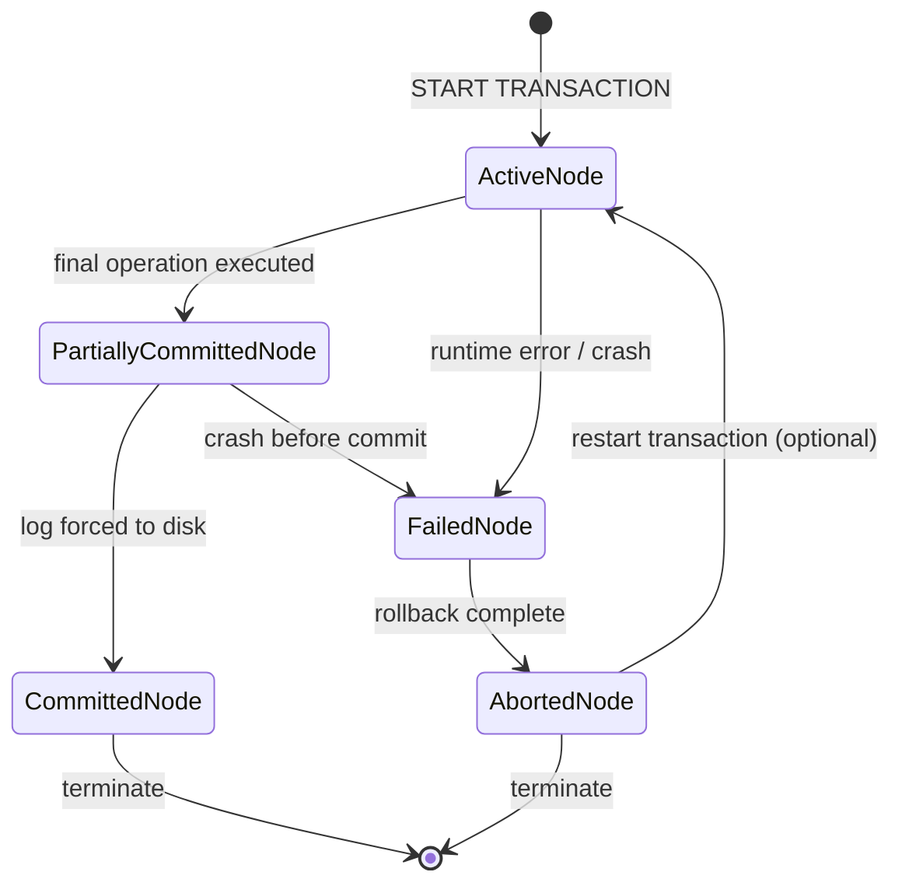
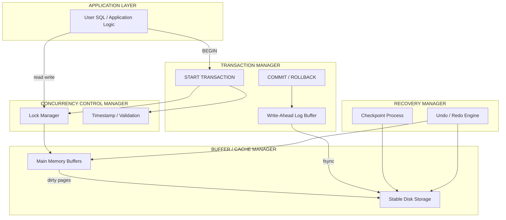
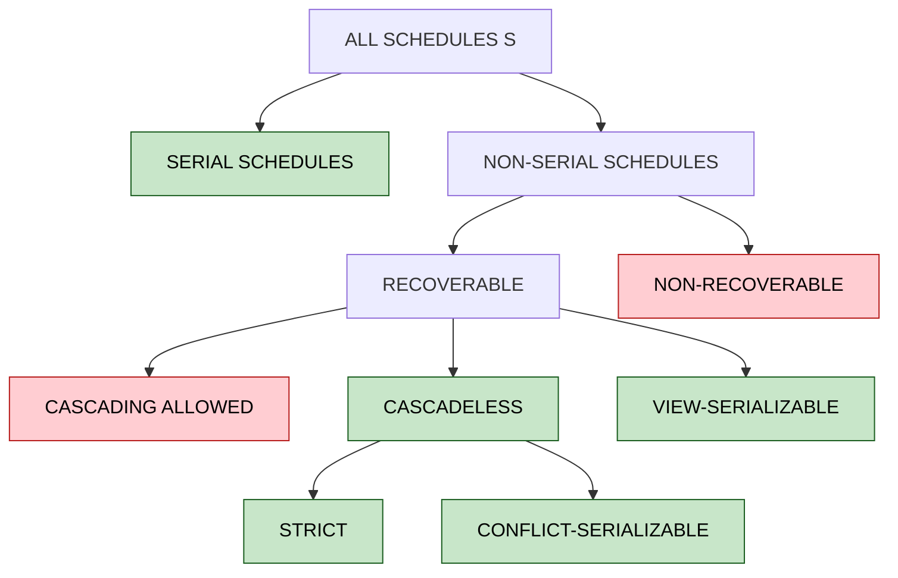

# Transaction Management

> **APJ ABDUL KALAM TECHNOLOGICAL UNIVERSITY (KTU) | 2024 SCHEME**
> - **Branch:** B.Tech in Computer Science & Engineering (CSE)
> - **Semester:** Semester 4
> - **Course:** PCCST402 - DATABASE MANAGEMENT SYSTEMS
> - **Module:** Module 3: Database Design Theory & Normalization
> - **Topic:** Transaction Management

<!-- SECTION_1_START -->

# 1. Core Technical Definition & Intuitive Overview

## 1.1 Formal Definition of a Transaction

> [!IMPORTANT]
> **Definition (KTU Standard Terminology):**
> A **Transaction** is a logical unit of database processing that includes one or more database access operations (read, write, update, delete) executed as a single, indivisible logical unit of work. Formally, a transaction $T_i$ is a sequence of operations $\langle a_1, a_2, \dots, a_n \rangle$ that transforms the database from one consistent state to another consistent state, where the boundary markers $\text{BEGIN TRANSACTION}$ and $\text{COMMIT}$ (or $\text{ABORT}$) define its scope.

The formal transaction boundary in SQL is governed by:
- $\text{START TRANSACTION}$ — marks the beginning.
- $\text{COMMIT}$ — makes all changes permanent (transaction enters *committed* state).
- $\text{ROLLBACK}$ (or $\text{ABORT}$) — undoes all changes (transaction enters *aborted* state).
- $\text{SAVEPOINT}\, s$ — defines an intermediate marker for partial rollback.

## 1.2 Conceptual Analogy — The Bank Transfer

> [!NOTE]
> **Real-World Intuition (Fund Transfer Scenario):**
> Imagine you transfer **₹5,000** from **Account A** to **Account B**. This is *one* logical operation from the user's perspective, but the database must perform **two** physical updates:
> 1. **Debit ₹5,000** from Account A.
> 2. **Credit ₹5,000** into Account B.
>
> If a system crash occurs *between* step 1 and step 2, money vanishes. A **transaction** wraps both steps into a single all-or-nothing unit — either both updates happen, or neither does. This is the essence of **atomicity**.

This is why transactions exist: to ensure that multi-step database operations remain **consistent, reliable, and recoverable**, even in the face of crashes, power failures, or concurrent users.

## 1.3 Why Transactions Are Needed — Common Anomalies

Without transaction control, concurrent or faulty execution can lead to:

| Anomaly | Plain Description | Database Consequence |
|---|---|---|
| **Lost Update** | Two transactions read and write the same value; one overwrites the other's update. | Net data corruption |
| **Dirty Read** | A transaction reads uncommitted data written by another transaction that later aborts. | Reads vanish after rollback |
| **Non-Repeatable Read** | A re-read of the same row yields a different value within the same transaction. | Inconsistent analysis |
| **Phantom Read** | A re-executed query retrieves new rows inserted by a concurrent transaction. | Inconsistent aggregation |
| **Incorrect Summary** | A transaction aggregates data while another transaction updates it. | Wrong totals/averages |

> [!TIP]
> **KTU High-Yield Insight:** Every Part A question on Transaction Management almost always opens with a "List the problems that can occur without proper transaction control" sub-part. Memorize the table above with examples.

## 1.4 GeoGebra / Desmos Visualization

> [!VISUALIZATION CONTROL]
> **Concept:** Transaction State Lifecycle on a 2D State-Space Plane
> **GeoGebra / Desmos Input Equations:**
> * State circle centres: $C_{\text{Active}} = (0, 0)$, $C_{\text{PartComm}} = (4, 2)$, $C_{\text{Comm}} = (8, 4)$, $C_{\text{Failed}} = (4, -2)$, $C_{\text{Aborted}} = (8, -4)$
> * Each circle: $(x - x_c)^2 + (y - y_c)^2 = 1$
> **Visual Description:** The student should see five points on the plane representing the discrete states a transaction can occupy, with directed arrows showing valid transitions ($\text{Active} \to \text{Partially Committed} \to \text{Committed}$ and $\text{Active}/\text{Partially Committed} \to \text{Failed} \to \text{Aborted}$).

<!-- SECTION_1_END -->

<!-- SECTION_2_START -->

# 2. Deep Theoretical Analysis & KTU High-Yield Formula Sheet

## 2.1 Transaction State Lifecycle (Operational Theory)

A transaction traverses a strict sequence of states. This is a **deterministic finite automaton** in computer-science terms.

| State | Meaning | Allowed Next States |
|---|---|---|
| **Active** | Transaction has started; operations are being executed. | Partially Committed, Failed |
| **Partially Committed** | Final operation has executed; changes in main memory, not yet flushed to disk. | Committed, Failed |
| **Committed** | All changes have been successfully written and logged to stable storage. | Terminated (final) |
| **Failed** | Normal execution can no longer proceed (logic error / crash). | Aborted |
| **Aborted** | Database has been rolled back to the state before the transaction began. | Terminated (final), Restarted (new transaction) |

> [!IMPORTANT]
> **Why two "success" states (Partially Committed and Committed)?** Because of the **durability guarantee** — a transaction is *not* truly successful until the log records are forced to stable (non-volatile) storage. A crash between these two states forces automatic recovery from the log.

## 2.2 The ACID Properties — The Heart of Transaction Management

> [!IMPORTANT]
> **Definition (ACID — Standard KTU Syllabus Term):**
> ACID is the acronym that captures the four essential properties a transaction must preserve to be considered *correct*. They were formalized by Andreas Reuter and Theo Härder in 1983 and remain the cornerstone of all DBMS transaction theory.

### 2.2.1 Atomicity
A transaction is treated as a **single, indivisible logical unit**. Either **all** of its operations are performed, or **none** are. The DBMS guarantees this using a **Transaction Manager** component that maintains before-images in the log.

### 2.2.2 Consistency
A transaction must transform the database from **one consistent state to another consistent state**. All integrity constraints (primary key, foreign key, check constraints, triggers) must be satisfied before and after execution. Intermediate states that violate constraints are not allowed to be visible.

### 2.2.3 Isolation
Even when transactions execute **concurrently**, each transaction must behave *as if* it were executing **alone**, without interference from other transactions. The DBMS enforces this through **concurrency control protocols** (locking, timestamping, optimistic validation).

### 2.2.4 Durability
Once a transaction has **committed**, its effects must **persist** in the database, even in the face of subsequent system crashes, power failures, or media errors. This is achieved by **write-ahead logging (WAL)** combined with the **commit record** being forced to stable storage.

## 2.3 Schedules — The Central Concept of Concurrency

A **schedule** $S$ is a chronological ordering of the operations of multiple concurrent transactions $T_1, T_2, \dots, T_n$ such that the operations within each individual transaction $T_i$ appear in the same order as they do in $T_i$.

### 2.3.1 Types of Schedules

| Schedule Type | Formal Definition | When Used |
|---|---|---|
| **Serial** $S_s$ | All operations of $T_i$ execute consecutively before any operation of $T_j$ begins. No interleaving. | Theoretical baseline (100% isolation, but slow) |
| **Non-Serial** $S_{ns}$ | Operations of concurrent transactions are interleaved. | Practical execution (faster, but correctness is questionable) |
| **Conflict-Serializable** $S_{cs}$ | A non-serial schedule $S$ that is **conflict-equivalent** to some serial schedule. | Correct concurrent execution |
| **View-Serializable** $S_{vs}$ | A non-serial schedule $S$ that is **view-equivalent** to some serial schedule. | Broader correctness class |
| **Recoverable** $S_r$ | For every transaction $T_j$ that reads a value written by $T_i$, $T_i$ commits before $T_j$. | Crash-recovery safety |
| **Cascadeless** $S_{cl}$ | Transactions only read values written by *already committed* transactions. | No cascading aborts |
| **Strict** $S_{st}$ | Transactions neither read nor write a value written by an uncommitted transaction. | Maximum recovery safety |

## 2.4 Conflict Operations — The Building Block of Serializability

Two operations on the same data item $X$ from different transactions $T_i$ and $T_j$ are said to **conflict** if and only if at least one of them is a $\text{write}$ operation. The three conflict cases are:

$$\text{Read-Write Conflict: } r_i(X) \text{ and } w_j(X)$$

$$\text{Write-Read Conflict: } w_i(X) \text{ and } r_j(X)$$

$$\text{Write-Write Conflict: } w_i(X) \text{ and } w_j(X)$$

A schedule is **conflict-serializable** if it can be transformed into a serial schedule by a series of **swaps of non-conflicting operations**.

## 2.5 KTU High-Yield Formula / Cheat Sheet

> [!TIP]
> **Mandatory Table — KTU 2024 Module 3 Focus:** Memorize every row. Exam questions frequently present a schedule and ask you to classify it or test serializability.

| Concept | Mathematical / Logical Form | Notes for Valuation |
|---|---|---|
| Transaction Sequence | $T_i : \langle\, o_1,\, o_2,\, \dots,\, o_n \,\rangle$ | Each $o_k$ is a read or write on a data item |
| Serial Schedule | $\forall\, o \in T_i,\, \forall\, o' \in T_j : o \prec o' \lor o' \prec o$ | No interleaving |
| Conflict Condition | $o_i, o_j \in S \ \text{conflict} \iff o_i \neq o_j \land \text{op}(o_i) \cap \text{op}(o_j) \ni \text{write}$ | Same data item + at least one write |
| Conflict-Serializable Test | $S \text{ is CS} \iff \text{PrecedenceGraph}(S) \text{ is acyclic}$ | Use the **precedence graph algorithm** |
| Recoverability | $T_j \text{ reads from } T_i \Rightarrow T_i \prec_{\text{commit}} T_j$ | Commit order matches read-from order |
| Cascadeless | $\forall\, r_j(X) : \text{writer}(X) \text{ is committed before } r_j$ | No dirty reads |
| 2PL Condition | $\text{Growing Phase} \prec \text{Acquire Lock} \prec \text{First Unlock} \prec \text{Shrinking Phase}$ | No new locks after first unlock |
| Timestamp Ordering | $TS(T_i) < TS(T_j) \iff T_i \text{ must execute before } T_j$ | Older transaction has priority |

## 2.6 Real-World Engineering Utility

- **Banking & Financial Systems:** Every ATM withdrawal, NEFT transfer, UPI payment is a transaction — ACID guarantees the money either moves or doesn't.
- **E-Commerce (Amazon, Flipkart):** Order placement → inventory deduction → payment deduction is a single transaction. Stock is never lost to a partial failure.
- **Airline / Railway Reservation:** Two users trying to book the last seat — concurrency control decides who gets it without overselling.
- **Distributed Databases (Google Spanner, CockroachDB):** Transactions span continents; ACID is preserved using **Paxos-based commit** and **TrueTime** clocks.
- **Blockchain:** Each block is essentially a batch of transactions with a Merkle-tree-based integrity proof (atomicity + durability over a distributed ledger).

<!-- SECTION_2_END -->

<!-- SECTION_3_START -->

# 3. Step-by-Step Derivations & Code/Symbolic Implementation

## 3.1 Precedence Graph — Complete Algorithm

The **Precedence Graph** $G = (V, E)$ is a directed graph where:
- The vertex set $V$ contains one node per transaction.
- The edge set $E$ contains an edge $T_i \to T_j$ if and only if $T_j$ must come *after* $T_i$ in any equivalent serial schedule, i.e., $T_i$ has an operation that **conflicts** with a later operation of $T_j$.

**Algorithm — Testing Conflict Serializability:**

```
Input:  A schedule S of n transactions
Output: TRUE if S is conflict-serializable, FALSE otherwise

Step 1: Create a node for each distinct transaction T_i in S.
Step 2: For every pair of operations (o_p, o_q) in S where o_p comes before o_q:
            If o_p ∈ T_i, o_q ∈ T_j, i ≠ j, and o_p, o_q conflict:
                Add a directed edge T_i → T_j to E.
Step 3: Check if the resulting graph G contains a cycle.
Step 4: If G is acyclic → return TRUE (S is conflict-serializable).
        If G has a cycle → return FALSE.
Step 5: If TRUE, the topological order of G gives one valid serial order.
```

## 3.2 Worked Example — Complete Derivation

Consider the schedule $S$ of three transactions operating on data items $A$ and $B$:

$$S : \langle r_1(A),\, r_2(A),\, w_1(A),\, r_3(A),\, w_2(B),\, w_3(B) \rangle$$

**Step 1 — Identify distinct transactions:**
Transactions are $T_1, T_2, T_3$. Create nodes $\text{node1}, \text{node2}, \text{node3}$.

**Step 2 — Scan for conflicting pairs in order:**

| Position | Operation | Next Conflicting Op? | Edge |
|---|---|---|---|
| 1 | $r_1(A)$ | $w_1(A)$ in step 3 — same transaction, ignore | None |
| 2 | $r_2(A)$ | $w_1(A)$ in step 3 — **conflict** (read-write on $A$, different transactions) | $T_2 \to T_1$ |
| 3 | $w_1(A)$ | $r_3(A)$ in step 4 — **conflict** (write-read on $A$) | $T_1 \to T_3$ |
| 4 | $r_3(A)$ | $w_2(B)$ in step 5 — different data item $B$ vs $A$, ignore | None |
| 5 | $w_2(B)$ | $w_3(B)$ in step 6 — **conflict** (write-write on $B$) | $T_2 \to T_3$ |

**Step 3 — Construct the precedence graph:**

Edges: $T_2 \to T_1$, $T_1 \to T_3$, $T_2 \to T_3$.

**Step 4 — Cycle check:**
Follow $T_2 \to T_1 \to T_3$. There is no path back to $T_2$. **The graph is acyclic.**

**Step 5 — Conclusion:**
$$\boxed{\text{Schedule } S \text{ is conflict-serializable.}}$$

The topological order $T_2 \prec T_1 \prec T_3$ gives the equivalent serial schedule $S'$.

## 3.3 Python Implementation — Complete Schedule Analyzer

```python
"""
Transaction Schedule Analyzer
----------------------------
Implements:
  1. Conflict detection between operations
  2. Precedence graph construction
  3. Cycle detection via DFS
  4. ACID property report
"""
from __future__ import annotations

from dataclasses import dataclass
from typing import List, Set, Tuple


@dataclass(frozen=True)
class Operation:
    """Represents a single read/write operation in a schedule."""
    txn_id: str          # e.g., 'T1'
    op_type: str         # 'r' (read) or 'w' (write)
    data_item: str       # e.g., 'A'

    def __str__(self) -> str:
        return f"{self.op_type}{self.txn_id[1:]}({self.data_item})"


def detect_conflict(op1: Operation, op2: Operation) -> bool:
    """
    Two operations conflict if and only if:
      - They belong to different transactions
      - They access the same data item
      - At least one of them is a write
    """
    if op1.txn_id == op2.txn_id:
        return False
    if op1.data_item != op2.data_item:
        return False
    return op1.op_type == "w" or op2.op_type == "w"


def build_precedence_graph(schedule: List[Operation]) -> dict:
    """
    Builds adjacency list representation of the precedence graph.
    Returns dict: { txn_id : set of txn_ids that must come after }.
    """
    graph: dict = {}
    txn_ids: Set[str] = {op.txn_id for op in schedule}

    for txn in txn_ids:
        graph[txn] = set()

    n = len(schedule)
    for i in range(n):
        for j in range(i + 1, n):
            op_i, op_j = schedule[i], schedule[j]
            if detect_conflict(op_i, op_j):
                graph[op_i.txn_id].add(op_j.txn_id)

    return graph


def has_cycle(graph: dict) -> bool:
    """
    DFS-based cycle detection on a directed graph.
    Uses WHITE/GRAY/BLACK coloring for O(V + E) complexity.
    """
    WHITE, GRAY, BLACK = 0, 1, 2
    color: dict = {node: WHITE for node in graph}

    def dfs(node: str) -> bool:
        color[node] = GRAY
        for neighbor in graph[node]:
            if color[neighbor] == GRAY:
                return True        # Back edge => cycle
            if color[neighbor] == WHITE and dfs(neighbor):
                return True
        color[node] = BLACK
        return False

    for node in graph:
        if color[node] == WHITE:
            if dfs(node):
                return True
    return False


def topological_sort(graph: dict) -> List[str]:
    """Kahn's algorithm — returns one valid serial order, or [] if cyclic."""
    in_degree: dict = {u: 0 for u in graph}
    for u in graph:
        for v in graph[u]:
            in_degree[v] = in_degree.get(v, 0) + 1

    queue: List[str] = [u for u in graph if in_degree[u] == 0]
    order: List[str] = []

    while queue:
        u = queue.pop(0)
        order.append(u)
        for v in graph[u]:
            in_degree[v] -= 1
            if in_degree[v] == 0:
                queue.append(v)

    if len(order) != len(graph):
        return []   # Cycle present
    return order


def analyze_schedule(schedule: List[Operation]) -> None:
    """Top-level analyzer that prints full valuation-grade output."""
    print("=" * 60)
    print("  TRANSACTION SCHEDULE ANALYZER")
    print("=" * 60)
    print("Schedule:", "  ".join(str(op) for op in schedule))

    graph = build_precedence_graph(schedule)
    print("\nPrecedence Edges:")
    has_edge = False
    for u in graph:
        for v in graph[u]:
            print(f"   {u} --> {v}")
            has_edge = True
    if not has_edge:
        print("   (none)")

    print("\nCycle Detected:", has_cycle(graph))

    if not has_cycle(graph):
        print("Result: The schedule IS Conflict-Serializable.")
        order = topological_sort(graph)
        print(f"Equivalent Serial Order:  {'  ->  '.join(order)}")
    else:
        print("Result: The schedule is NOT Conflict-Serializable.")


# ------------------ DEMO SCHEDULE ------------------
demo_schedule: List[Operation] = [
    Operation("T1", "r", "A"),
    Operation("T2", "r", "A"),
    Operation("T1", "w", "A"),
    Operation("T3", "r", "A"),
    Operation("T2", "w", "B"),
    Operation("T3", "w", "B"),
]

analyze_schedule(demo_schedule)
```

**Expected Output of the Program:**

```
============================================================
  TRANSACTION SCHEDULE ANALYZER
============================================================
Schedule: r1(A)  r2(A)  w1(A)  r3(A)  w2(B)  w3(B)

Precedence Edges:
   T2 --> T1
   T1 --> T3
   T2 --> T3

Cycle Detected: False

Result: The schedule IS Conflict-Serializable.
Equivalent Serial Order:  T2  ->  T1  ->  T3
```

## 3.4 SQL Implementation — Transaction Boundary Control

```sql
-- Module 3 Topic 4: SQL Transaction Syntax
-- Execute these statements in a MySQL / PostgreSQL / Oracle session.

START TRANSACTION;          -- (a) Begin atomic unit

    UPDATE Account
       SET balance = balance - 5000
     WHERE account_no = 'A101';       -- (b) Debit step

    SAVEPOINT after_debit;            -- (c) Marker for partial rollback

    UPDATE Account
       SET balance = balance + 5000
     WHERE account_no = 'A202';       -- (d) Credit step

    -- Constraint check
    SELECT SUM(balance) INTO @total FROM Account;
    -- If a trigger throws an error here, we ROLLBACK TO SAVEPOINT after_debit.

COMMIT;                    -- (e) Make changes permanent

-- ROLLBACK;               -- (f) Undo the entire transaction (if needed)
-- ROLLBACK TO SAVEPOINT after_debit;   -- (g) Undo only post-marker steps
```

> [!IMPORTANT]
> **Valuation Note:** When writing SQL transactions in your exam, always show the explicit `START TRANSACTION` and `COMMIT` / `ROLLBACK` statements. Explicit boundary markers are worth 1 mark by themselves in KTU answer scripts.

## 3.5 ACID Property Mapping Table

> [!TIP]
> **Engineering Reference:** Which DBMS component guarantees which property?

| ACID Property | Implementing Component | Mechanism |
|---|---|---|
| **Atomicity** | Transaction Manager | Write-Ahead Log (WAL), undo/redo |
| **Consistency** | Integrity Manager + Application Code | Constraint checking, triggers |
| **Isolation** | Concurrency Control Manager | Locks, timestamps, optimistic validation |
| **Durability** | Recovery Manager | Force-write of log, checkpointing |

<!-- SECTION_3_END -->

<!-- SECTION_4_START -->

# 4. Structural Diagrams & Schematics

## 4.1 Transaction State Diagram (Mermaid — State Machine)



**Reading the diagram:** A transaction begins in the `ActiveNode` state, performs all its operations, moves to `PartiallyCommittedNode` when the last SQL operation has executed, and finally moves to `CommittedNode` only after the log records are durably stored. Any error path leads to `FailedNode`, which then transitions to `AbortedNode` for cleanup.

## 4.2 ACID Property → DBMS Component Architecture (Mermaid Block Flow)



**Interpretation:**
- The **Application Layer** initiates a transaction.
- The **Transaction Manager** coordinates start/commit/rollback.
- The **Concurrency Control Manager** (lock manager or timestamp validator) ensures **isolation**.
- The **Recovery Manager** uses the **Write-Ahead Log** on stable storage to ensure **atomicity** and **durability**.
- The **Buffer Manager** mediates between volatile memory and non-volatile disk.

## 4.3 Schedule Classification Hierarchy (Mermaid Tree)



**Reading the diagram:** All schedules form the root. Serial schedules are trivially correct. Among non-serial schedules, the **most desirable** class is the **Conflict-Serializable** strict cascadeless recoverable schedule (the green leaves). The red leaves represent schedules the DBMS should reject.

<!-- SECTION_4_END -->

<!-- SECTION_5_START -->

# 5. KTU 2024 Scheme Examination Question Bank & Topic Recap

## 5.1 Part A — Short-Answer Questions (3 Marks Each)

### Question 1

> **[KTU University Exam - July 2024 Style]**
> *Define the term **transaction** in the context of a database system. List the four ACID properties and briefly explain any two of them.*
> **CO Mapped:** CO3 (Design) · **RBT Level:** Remember / Understand · **Expected Time:** 6 minutes

**Model Answer (Valuation-Ready):**

A **transaction** is a logical unit of database processing that consists of a sequence of database operations (read, write, update, delete) executed as a single atomic unit of work. It must transform the database from one consistent state to another.

The four ACID properties are:
1. **Atomicity** — All-or-nothing execution.
2. **Consistency** — Database remains in a valid state.
3. **Isolation** — Concurrent transactions appear to execute serially.
4. **Durability** — Committed changes survive crashes.

**Explanation of Atomicity (2 marks):** Atomicity guarantees that either *all* operations of a transaction are performed or *none* are. The DBMS uses a **transaction manager** and a **log-based recovery system** to maintain before-images. If a transaction fails mid-way, the system executes an *undo* operation that rolls back all updates made so far, returning the database to its state before the transaction began.

**Explanation of Isolation (1 mark):** Isolation ensures that even when multiple transactions execute concurrently, each transaction operates as if it were the only one in the system. The DBMS uses a **concurrency control manager** with techniques like locking, timestamping, or optimistic validation to enforce this.

> [!WARNING]
> **Examiner's Pitfall Callout — Part A:** Do **not** list ACID properties without explaining the *mechanism* that implements them (e.g., locking for isolation, log for atomicity). A bare list earns 1 mark; mechanism + example earns 3.

---

### Question 2

> **[KTU University Exam - Dec 2023 Style]**
> *What is a **schedule**? With a suitable example, distinguish between a **serial schedule** and a **non-serial schedule**.*
> **CO Mapped:** CO3 (Design) · **RBT Level:** Understand · **Expected Time:** 6 minutes

**Model Answer (Valuation-Ready):**

A **schedule** $S$ is a chronological sequence of the read and write operations of two or more concurrent transactions, preserving the order of operations within each individual transaction.

**Serial Schedule Example** $S_1$ (transactions $T_1$ and $T_2$, on items $A$ and $B$):

$$S_1 : \langle\, r_1(A),\, w_1(A),\, r_1(B),\, w_1(B),\, r_2(A),\, w_2(A),\, r_2(B),\, w_2(B)\,\rangle$$

All operations of $T_1$ appear first, then all operations of $T_2$. **No interleaving** occurs.

**Non-Serial Schedule Example** $S_2$:

$$S_2 : \langle\, r_1(A),\, w_1(A),\, r_2(A),\, w_2(A),\, r_1(B),\, w_1(B),\, r_2(B),\, w_2(B)\,\rangle$$

Operations of $T_1$ and $T_2$ are **interleaved**. The final database state is the same as a serial schedule (correct execution), but the wall-clock time is shorter.

**Key Distinction Table (write this in your exam):**

| Criterion | Serial Schedule | Non-Serial Schedule |
|---|---|---|
| Interleaving | None | Allowed |
| Throughput | Low | High |
| Correctness | Always correct | Must be tested for serializability |
| Use case | Theoretical baseline | Practical concurrent execution |

> [!WARNING]
> **Examiner's Pitfall Callout:** Students often confuse "schedule" with "transaction." A *transaction* is a single thread of operations; a *schedule* is the **combined** execution sequence of **multiple** transactions. Drawing the schedule on a horizontal time-line earns you easy 1 mark.

---

## 5.2 Part B — Long-Answer Questions (14 Marks Each, Internal Choice)

### Question A (14 Marks)

> **[KTU University Exam - July 2024 Pattern]**
> *(a) Discuss the four ACID properties of a transaction. For each property, name the component of the DBMS that is responsible for enforcing it.  (7 marks)*
> *(b) Consider the following schedule $S$ of two transactions $T_1$ and $T_2$ on data items $A$ and $B$:*
>
> $$S : \langle\, r_1(A),\, r_2(B),\, w_1(B),\, w_2(A)\,\rangle$$
>
> *Draw the precedence graph and determine whether $S$ is conflict-serializable. If yes, give the equivalent serial order.  (7 marks)*
> **CO Mapped:** CO3, CO4 · **RBT Level:** (a) Understand, (b) Apply · **Expected Time:** 22–25 minutes

#### Model Solution — Part (a) [7 Marks]

**[Stating ACID and their components: 1 mark per property = 4 marks]**
**[Valid example for each property: 1 mark × 3 selected = 3 marks]**

**ACID Properties Table (Mandatory in KTU answers):**

| Property | Definition | DBMS Component | Example |
|---|---|---|---|
| **Atomicity** | All or none of the operations are performed. | Transaction Manager + Recovery Manager (using Write-Ahead Log) | Bank transfer: either both debit and credit happen, or neither happens. |
| **Consistency** | Database moves from one consistent state to another. | Integrity Manager (constraint enforcement) + Application triggers | Total balance across all accounts is preserved after every transaction. |
| **Isolation** | Concurrent transactions appear to execute serially. | Concurrency Control Manager (lock / timestamp / validation) | Two users booking the last seat — only one succeeds atomically. |
| **Durability** | Committed changes survive crashes. | Recovery Manager (force-write to stable storage + checkpoints) | After a power failure, the committed credit is still visible. |

**Mechanism summary (extra 1 mark):** Atomicity and Durability are implemented by the **Recovery Manager** using **Write-Ahead Logging (WAL)**. Isolation is implemented by the **Concurrency Control Manager**. Consistency is enforced at multiple layers (constraint checker, triggers, application logic).

#### Model Solution — Part (b) [7 Marks]

**Step 1 — Identify transactions and data items (1 mark):**
- Transactions: $T_1, T_2$
- Data items accessed: $A, B$

**Step 2 — Scan schedule for conflicting operations (2 marks):**

| Pair | Position | Operations | Same item? | At least one write? | Conflict? | Edge |
|---|---|---|---|---|---|---|
| 1 | 1, 3 | $r_1(A),\, w_1(B)$ | No (A vs B) | Yes | **No** | — |
| 2 | 1, 4 | $r_1(A),\, w_2(A)$ | Yes (A) | Yes | **Yes** | $T_1 \to T_2$ |
| 3 | 2, 3 | $r_2(B),\, w_1(B)$ | Yes (B) | Yes | **Yes** | $T_2 \to T_1$ |
| 4 | 2, 4 | $r_2(B),\, w_2(A)$ | No (B vs A) | Yes | **No** | — |

**Step 3 — Draw the precedence graph (2 marks):**

```
    T1  ---->  T2
     ^          |
     |          v
     +-------- T1  (cycle)
```

Edges present: $T_1 \to T_2$ and $T_2 \to T_1$.

**Step 4 — Cycle detection and conclusion (2 marks):**
The precedence graph contains the cycle $T_1 \to T_2 \to T_1$.

$$\boxed{\text{Schedule } S \text{ is NOT conflict-serializable.}}$$

Therefore, executing $S$ as-is may produce an inconsistent database state. The DBMS **must reject** this schedule, or the concurrency control manager must use a protocol (e.g., 2PL) to prevent the conflict-causing interleaving.

**[Final answer with edge list: 1 mark]**
**[Cycle identification: 1 mark]**

> [!WARNING]
> **Examiner's Pitfall Callout — Part B:** Do **not** list all pairs blindly. Many students write 6-8 conflict checks and exhaust the time. Only check pairs that are on the **same data item** — this prunes the work to at most 2-3 checks in typical KTU questions. Also, **do not** forget to mention the cycle explicitly; stating "not serializable" without naming the cycle loses 1 mark.

---

### Question B (14 Marks) — Alternative Choice

> **[KTU University Exam - Dec 2023 Pattern]**
> *(a) With a neat state-transition diagram, explain the various states a transaction can be in. Mention which transitions are caused by the COMMIT and ROLLBACK statements.  (7 marks)*
> *(b) Consider the following three transactions and schedule $S$ on data items $X, Y, Z$:*
>
> $$\begin{aligned}
> T_1 &: \langle r_1(X),\, w_1(X),\, r_1(Y),\, w_1(Y) \rangle \\
> T_2 &: \langle r_2(X),\, w_2(X),\, r_2(Z),\, w_2(Z) \rangle \\
> T_3 &: \langle r_3(Y),\, w_3(Y),\, r_3(Z),\, w_3(Z) \rangle \\
> S &: \langle r_1(X),\, r_2(X),\, w_1(X),\, r_3(Y),\, w_2(X),\, w_3(Y),\, w_2(Z),\, w_3(Z) \rangle
> \end{aligned}$$
>
> *Test whether $S$ is conflict-serializable. If it is, give the equivalent serial order.  (7 marks)*
> **CO Mapped:** CO3, CO4 · **RBT Level:** (a) Understand, (b) Apply · **Expected Time:** 22–25 minutes

#### Model Solution — Part (a) [7 Marks]

**[Drawing the state diagram with all 5 states: 3 marks]**
**[Explaining transitions for COMMIT and ROLLBACK: 2 marks]**
**[Connecting each state to a real DBMS event: 2 marks]**

**State Diagram (reproduce this in your exam):**

```
                    START TRANSACTION
                          |
                          v
                    +-----------+
                    |   ACTIVE  |<---------------------+
                    +-----+-----+                      |
                          |                            |
              final op    |            error / crash   |
              executed    v                            |
                  +------------------+                 |
                  | PARTIALLY        |                 |
                  | COMMITTED        |                 |
                  +-----+------------+                 |
                        |                              |
              log forced|        crash before          |
              to disk   v        commit                |
                  +----------+    v                    |
                  | COMMITTED|  +---------+            |
                  +----+-----+  | FAILED  |------------+
                       |        +----+----+
                  exit |             | rollback
                       v             v
                  +---------+   +---------+
                  |TERMINATED|  | ABORTED |
                  +---------+   +----+----+
                                     |
                                  restart
                                     v
                                (back to ACTIVE)
```

**Description of transitions:**

- $\text{Active} \xrightarrow{\text{final operation}} \text{Partially Committed}$ — occurs automatically when the last SQL statement finishes.
- $\text{Partially Committed} \xrightarrow{\text{log flushed}} \text{Committed}$ — this is triggered by the **COMMIT** statement, which forces all log records to stable storage.
- $\text{Active} \text{ or } \text{Partially Committed} \xrightarrow{\text{error}} \text{Failed}$ — occurs on constraint violation, deadlock, or system crash.
- $\text{Failed} \xrightarrow{\text{rollback complete}} \text{Aborted}$ — the **ROLLBACK** statement (or system-recovery undo) drives this transition.
- $\text{Aborted} \xrightarrow{\text{restart}} \text{Active}$ — optional retry of the same transaction.
- $\text{Committed} \text{ or } \text{Aborted} \to \text{Terminated}$ — the transaction process ends.

**Real DBMS Events (1 mark per pair of state + event):**

| Transition | SQL / DBMS Event |
|---|---|
| $\to$ Active | `START TRANSACTION` or implicit beginning of session |
| $\to$ Partially Committed | Last DML/DQL statement finishes |
| $\to$ Committed | `COMMIT` (or auto-commit mode) |
| $\to$ Failed | Deadlock detected, constraint violation, division by zero |
| $\to$ Aborted | `ROLLBACK` or system-driven recovery |
| $\to$ Terminated | Process cleanup, connection release |

#### Model Solution — Part (b) [7 Marks]

**Step 1 — Identify all distinct transactions: $T_1, T_2, T_3$ (1 mark)**

**Step 2 — Scan schedule for conflicts (3 marks):**

| Position | Op | Later Conflicting Op? | Item | Edge |
|---|---|---|---|---|
| 1 | $r_1(X)$ | $w_1(X)$ (pos 3) — same txn, ignore | — | — |
| 1 | $r_1(X)$ | $w_2(X)$ (pos 5) — different txn, same item, write | $X$ | $T_1 \to T_2$ |
| 2 | $r_2(X)$ | $w_1(X)$ (pos 3) — different txn, same item, write | $X$ | $T_2 \to T_1$ |
| 3 | $w_1(X)$ | $w_2(X)$ (pos 5) — different txn, same item, both write | $X$ | $T_1 \to T_2$ |
| 3 | $w_1(X)$ | $r_3(Y)$ (pos 4) — different item, ignore | — | — |
| 4 | $r_3(Y)$ | $w_3(Y)$ (pos 6) — same txn, ignore | — | — |
| 4 | $r_3(Y)$ | $w_1(Y)$ — not in schedule | — | — |
| 5 | $w_2(X)$ | (no later op on X) | — | — |
| 6 | $w_3(Y)$ | $w_2(Z)$ (pos 7) — different item, ignore | — | — |
| 7 | $w_2(Z)$ | $w_3(Z)$ (pos 8) — different txn, same item, both write | $Z$ | $T_2 \to T_3$ |
| 8 | $w_3(Z)$ | (last op) | — | — |

**Consolidated edge list (1 mark):**
$$T_1 \to T_2, \quad T_2 \to T_1, \quad T_2 \to T_3$$

**Step 3 — Precedence graph and cycle test (2 marks):**

```
    T1  <--->  T2  ---->  T3
   (T1 ↔ T2 forms a cycle)
```

A cycle exists: $T_1 \to T_2 \to T_1$.

**Step 4 — Conclusion:**

$$\boxed{\text{Schedule } S \text{ is NOT conflict-serializable.}}$$

The DBMS must reject or reorder this schedule (e.g., by enforcing Two-Phase Locking on item $X$).

> [!WARNING]
> **Examiner's Pitfall Callout — Part B:** A common error is to forget that $r_1(X)$ *and* $w_2(X)$ conflict even though both are on $X$ — students often mark it as "read-read conflict" and skip. **Rule:** Any pair on the same item where at least one is a write conflicts. Count all such pairs systematically; do not eyeball the schedule.

---

## 5.3 Topic Recap & Important Things to Remember

> [!TIP]
> **Rapid Revision Checklist — Print / Bookmark This Section**

- **Transaction = Logical unit of work**, bounded by `START TRANSACTION` and `COMMIT` / `ROLLBACK`.
- **ACID** stands for **A**tomicity, **C**onsistency, **I**solation, **D**urability.
  - *Atomicity* $\Rightarrow$ Transaction Manager + Write-Ahead Log.
  - *Consistency* $\Rightarrow$ Integrity constraints and triggers.
  - *Isolation* $\Rightarrow$ Concurrency Control Manager (locks / timestamps).
  - *Durability* $\Rightarrow$ Recovery Manager + force-write to disk.
- **Five transaction states:** Active $\to$ Partially Committed $\to$ Committed; Active / Partially Committed $\to$ Failed $\to$ Aborted.
- **Schedule types (most to least desirable):** Serial $>$ Conflict-Serializable $>$ View-Serializable $>$ Cascadeless Recoverable $>$ Recoverable $>$ Non-Recoverable.
- **Conflict condition:** same data item, different transactions, **at least one write**. Three conflict types: R-W, W-R, W-W.
- **Precedence graph algorithm:**
  1. One node per transaction.
  2. Edge $T_i \to T_j$ on any conflicting pair with $T_i$'s op first.
  3. **Acyclic $\iff$ Conflict-Serializable.**
- **Recoverable schedule** condition: for every $T_j$ that reads from $T_i$, $T_i$ commits before $T_j$.
- **Cascadeless schedule** condition: no transaction reads data from an uncommitted transaction.
- **Two-Phase Locking (2PL)** condition: lock acquisition phase precedes the first unlock.
- **Timestamp ordering rule:** older transactions get priority; $TS(T_i) < TS(T_j) \Rightarrow T_i$ runs first.
- **Real-world uses:** banking, e-commerce, reservation systems, distributed databases, blockchain.
- **Common exam traps:**
  1. Confusing "schedule" with "transaction."
  2. Skipping conflict check on R-W pairs that have a write on the second op.
  3. Failing to identify the cycle explicitly in a precedence graph.
  4. Omitting the DBMS component responsible for each ACID property.

> [!NOTE]
> **Study Hint:** Always carry a red pen to the exam. Draw the precedence graph in red, circle the cycle, and label it — examiners reward visual evidence of cyclic structure. A correctly labeled graph often earns partial credit even if the conclusion is misstated.

<!-- SECTION_5_END -->
