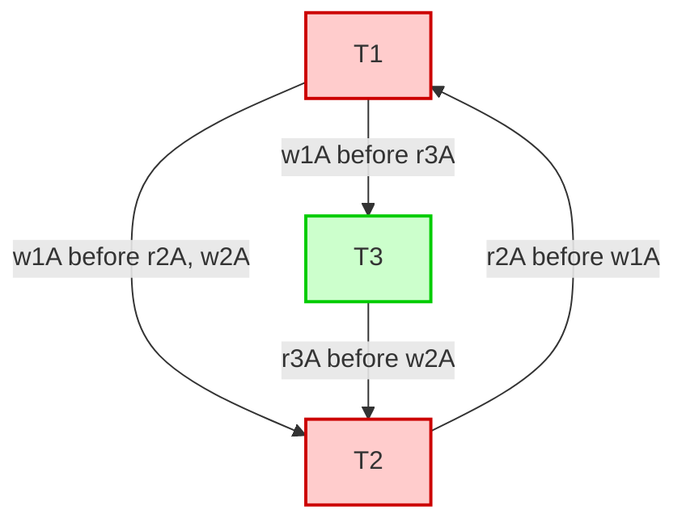
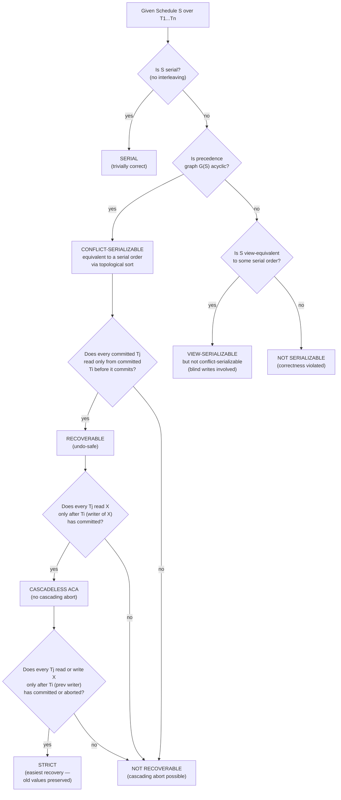
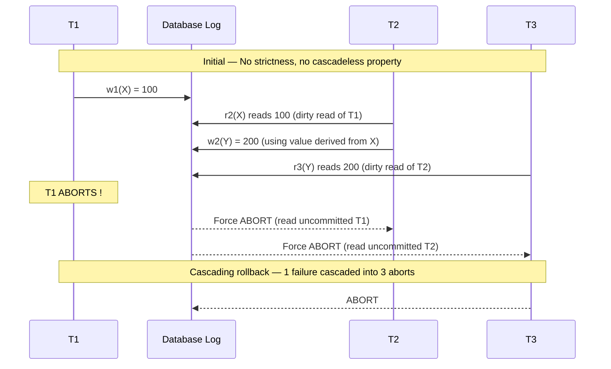
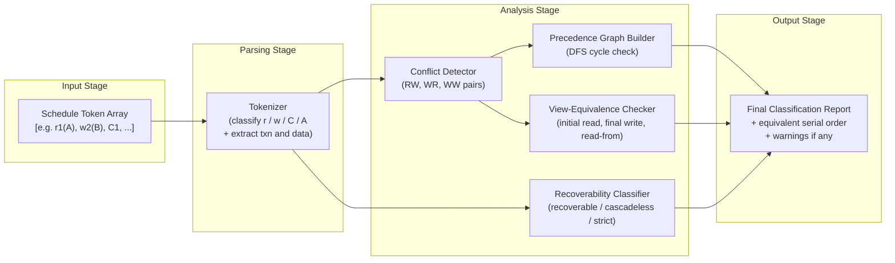
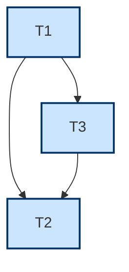

# Transaction Processing: Characterizing schedules based on recoverability and serializability

> **APJ ABDUL KALAM TECHNOLOGICAL UNIVERSITY (KTU) | 2024 SCHEME**
> - **Branch:** B.Tech in Computer Science & Engineering (CSE)
> - **Semester:** Semester 4
> - **Course:** PCCST402 - DATABASE MANAGEMENT SYSTEMS
> - **Module:** Module 3: Database Design Theory & Normalization
> - **Topic:** Transaction Processing: Characterizing schedules based on recoverability and serializability

<!-- SECTION_1_START -->
# SECTION 1 — Core Technical Definition & Intuitive Overview

## 1.1 What is a Schedule?

A **schedule (or history) S** is defined as a *temporal sequence (linear ordering)* of interleaved read, write, commit, and abort operations drawn from a finite set of concurrently executing transactions $T_1, T_2, \ldots, T_n$ that preserves the internal operation order of every individual transaction.

Formally, a schedule $S$ over the set of transactions $\mathcal{T} = \{T_1, T_2, \ldots, T_n\}$ is a permutation of all operations $O_i$ such that:

$$S = \langle o_{1}^{(i_1)}, \; o_{2}^{(i_2)}, \; o_{3}^{(i_3)}, \; \ldots, \; o_{m}^{(i_m)} \rangle$$

where each $o_k^{(i_k)}$ is an operation belonging to transaction $T_{i_k}$, and the original operation order within every $T_i$ is preserved.

> [!IMPORTANT]
> **KTU Syllabus Highlight (2024 Scheme):** A schedule is the fundamental unit of analysis for transaction processing systems. The KTU Board frequently tests the ability to *classify* a given schedule — the marks are usually awarded for correctly identifying the **type** of schedule (serial, non-serial, serializable, recoverable, cascadeless, strict) and *justifying* it with a precedence graph or conflict matrix.

## 1.2 Intuitive Analogy — The "Bank Teller Counter"

Imagine a single bank teller serving **two customers** (transactions) — *Mr. Arun* ($T_1$) and *Ms. Bala* ($T_2$) — both wanting to update their passbook:

- **Serial schedule** → Mr. Arun completes his entire deposit + withdrawal first, *then* Ms. Bala starts. Zero interference, perfectly safe but slow.
- **Non-serial (interleaved) schedule** → The teller alternates: reads Arun's balance, reads Bala's balance, writes Arun's new balance, writes Bala's new balance. Faster, but if a power-cut happens mid-way, the database may land in an inconsistent state.

**Recoverability** asks: *"If something fails mid-way, can we roll back cleanly without losing committed work?"*
**Serializability** asks: *"Does the final state of the database look *as if* the transactions ran one after another (serially)?"*

## 1.3 The Two Master Properties

| Property | Core Question Asked | Why It Matters |
|----------|--------------------|--------------------|
| **Serializability** | Does the interleaved execution produce the same result as *some* serial execution? | Correctness of concurrent execution |
| **Recoverability** | If a transaction aborts, can we safely undo its effects without cascading aborts? | Fault-tolerance and crash safety |

> [!NOTE]
> **Memory Anchor for Exams:** *"Serializability = Correctness. Recoverability = Safety."* Keep this on your mental whiteboard throughout Module 3.

## 1.4 Foundational Notation Used Throughout

Let $r_i(X)$ denote "**transaction $T_i$ reads data item $X$**" and $w_i(X)$ denote "**transaction $T_i$ writes data item $X$**". The subscript $i$ tracks the originating transaction; the argument $X$ tracks the data item being touched.

---

## 1.5 Master Classification Tree of Schedules

The full taxonomy of schedules examined in KTU Module 3 is summarised below. Every leaf of this tree is a distinct KTU Board question type.

$$\text{Schedule } S \;\begin{cases} \textbf{Serial} & \text{(no interleaving — baseline correctness)} \\[4pt] \textbf{Non-Serial} \;\begin{cases} \textbf{Serializable} \;\begin{cases} \textbf{Conflict-Serializable} \\ \textbf{View-Serializable} \end{cases} \\[6pt] \textbf{Non-Serializable} \end{cases} \end{cases}$$

$$\text{Schedule } S \;\begin{cases} \textbf{Recoverable} \;\begin{cases} \textbf{Cascadeless (ACA)} \\ \textbf{Strict} \end{cases} \\[4pt] \textbf{Non-Recoverable} \end{cases}$$

---

> [!VISUALIZATION CONTROL]
> **Concept:** Set-relationship among schedule classes (not a coordinate plot — Venn-style).
> **GeoGebra / Desmos Input Equations:** *(Not applicable — concept is set-theoretic, not numeric.)*
> **Visual Description:** Picture three nested concentric regions: the **innermost disk** = *Strict* schedules ⊂ *Cascadeless* ⊂ *Recoverable* ⊂ *All Schedules* (outermost disk). The **conflict-serializable** region intersects *Recoverable* but does *not* contain it.

<!-- SECTION_1_END -->

<!-- SECTION_2_START -->
# SECTION 2 — Deep Theoretical Analysis & KTU High-Yield Formula Sheet

## 2.1 The Two Serialization Criteria — Deep Dive

### 2.1.1 Conflict Serializability

Two operations in a schedule are said to **conflict** if and only if **all three** conditions hold simultaneously:

1. They belong to **two different transactions** ($T_i \neq T_j$).
2. They access the **same data item** ($X$).
3. **At least one** of them is a **write** operation.

This produces exactly three conflict types (and the read-read pair is *not* a conflict):

$$\text{Conflict Types} = \Big\{ \;\underbrace{r_i(X) \leftrightarrow w_j(X)}_{\text{Read–Write (RW)}},\; \underbrace{w_i(X) \leftrightarrow r_j(X)}_{\text{Write–Read (WR)}},\; \underbrace{w_i(X) \leftrightarrow w_j(X)}_{\text{Write–Write (WW)}} \;\Big\}$$

**Conflict Equivalence:** Two schedules $S$ and $S'$ are **conflict-equivalent** ($S \equiv_c S'$) if one can be transformed into the other by a sequence of **swaps of adjacent non-conflicting operations**.

**Conflict Serializability:** A schedule $S$ is **conflict-serializable** if it is conflict-equivalent to *some* serial schedule of the same $n$ transactions.

#### The Precedence Graph (Serialization Graph) — $G(S)$

The **precedence graph** is the official KTU Board mechanism for testing conflict serializability:

$$G(S) = (V, E), \quad V = \{T_1, T_2, \ldots, T_n\}, \quad T_i \xrightarrow{} T_j \text{ if } T_i \text{ must precede } T_j$$

**Edge-construction rule (memorise this — it is the heart of every 14-mark KTU question):**

> For every pair of conflicting operations $o_p \in T_i$ and $o_q \in T_j$ in $S$ where $o_p$ appears *before* $o_q$, draw a directed edge $T_i \rightarrow T_j$.

> [!IMPORTANT]
> **KTU Board Theorem:** *A schedule $S$ is conflict-serializable **if and only if** its precedence graph $G(S)$ is **acyclic**.* If even a single cycle exists, $S$ is **NOT** conflict-serializable.

---

### 2.1.2 View Serializability

View serializability is a **looser (weaker)** condition. It produces a strictly larger class of schedules that are still considered correct, because it does not require conflict-by-conflict equivalence — only that the *visible effects* on the database match.

**View Equivalence — Three Rules (all must hold for $S \equiv_v S'$):**

1. **Initial Read:** For each data item $X$, if $T_i$ reads the *initial value* of $X$ in $S$, then $T_i$ must also read the initial value of $X$ in $S'$.
2. **Final Write:** For each data item $X$, the transaction that performs the *final write* on $X$ in $S$ must be the same as the one performing the final write on $X$ in $S'$.
3. **Read-From Consistency:** If $T_i$ reads a value of $X$ *written by* $T_j$ in $S$, then $T_i$ must also read the value of $X$ written by $T_j$ in $S'$.

**Theorem (Inclusion Chain — Vital for KTU):**

$$\text{Serial} \;\subset\; \text{Conflict-Serializable} \;\subset\; \text{View-Serializable} \;\subset\; \text{All Schedules}$$

> [!NOTE]
> **Inclusion is strict** — there exist view-serializable schedules that are *not* conflict-serializable (the classic "blind write" counter-example appears in every textbook).

---

## 2.2 Recoverability — Deep Dive

### 2.2.1 Recoverable Schedule

A schedule $S$ is **recoverable** if, for every transaction $T_j$ that commits in $S$, $T_j$ must have read *only values written by transactions that have already committed* before $T_j$ commits. In other words, no committed transaction ever reads data from a transaction that later aborts.

### 2.2.2 Cascadeless Schedule (Avoiding Cascading Aborts — ACA)

A schedule $S$ is **cascadeless** if transactions only read values written by *already-committed* transactions. That is:

$$\text{If } T_j \text{ reads } X \text{ from } T_i, \text{ then } T_i \text{ must have committed before } T_j \text{ reads } X.$$

This prevents the phenomenon called **cascading rollback / cascading abort** — the database nightmare where one transaction's failure forces the undo of multiple dependent transactions.

### 2.2.3 Strict Schedule

A schedule $S$ is **strict** if no transaction may read or write a data item $X$ until the transaction that previously wrote $X$ has either **committed or aborted**. This is the **strictest recoverability class** and is the easiest to recover from because the old value of $X$ is always available on the log for restoration (a property called *recoverable-by-undo*).

---

## 2.3 KTU High-Yield Formula & Rule Sheet

| # | Rule / Concept | Formal Statement | Use-Case in KTU Exam |
|---|----------------|------------------|----------------------|
| 1 | Conflict definition | $T_i \neq T_j$, same $X$, at least one write | Identifying conflicts in a schedule |
| 2 | Conflict-serializable ⇔ | $G(S)$ is **acyclic** | 7–14 mark question |
| 3 | Cycle in $G(S)$ | If found → $S$ is **NOT** conflict-serializable | Almost every 14-mark problem |
| 4 | View-serializable but not conflict-serializable | Arises due to **blind writes** ($w_i(X)$ with no preceding $r_i(X)$) | Theory question (2–7 marks) |
| 5 | Recoverable rule | $T_j$ commits only after all $T_i$ it read from have committed | Classifying schedule |
| 6 | Cascadeless rule | $T_j$ reads $X$ only after $T_i$ (writer of $X$) has committed | Classifying schedule |
| 7 | Strict rule | $T_j$ reads/writes $X$ only after $T_i$ (previous writer) has committed/aborted | Classifying schedule |
| 8 | Inclusion theorem | Serial $\subset$ Conflict-S $\subset$ View-S $\subset$ All | Theory definition question |
| 9 | Recoverable inclusion | Strict $\subset$ Cascadeless $\subset$ Recoverable $\subset$ All | Theory definition question |
| 10 | Equivalent serial schedule | Obtained by any **topological sort** of $G(S)$ | 7-mark sub-part |

> [!IMPORTANT]
> **Anti-Pitfall Note:** Conflict-serializable and recoverable are **orthogonal** properties — a schedule may be conflict-serializable yet *not* recoverable, and vice-versa. Many students wrongly assume they go together.

---

## 2.4 Real-World Engineering Utility

| Domain | Use of Serializability & Recoverability Theory |
|--------|--------------------------------------------------|
| **Banking (ATM, NEFT/UPI)** | Conflict-serializability guarantees account balances are updated as if one customer at a time used the DB |
| **E-commerce inventory** | Strict schedules ensure failed orders don't corrupt stock counts |
| **Airline reservation systems** | Cascadeless schedules prevent one customer cancellation from cascading through dependent bookings |
| **Distributed databases (Google Spanner, CockroachDB)** | Serializable Snapshot Isolation (SSI) is a modern production implementation of conflict-serializability theory |
| **Blockchain / Smart contracts** | Total ordering of transactions is the strongest form of serializability — explicit serial execution |

<!-- SECTION_2_END -->

<!-- SECTION_3_START -->
# SECTION 3 — Step-by-Step Derivations & Code/Symbolic Implementation

## 3.1 Worked Example 1 — Testing Conflict-Serializability via Precedence Graph

### Given Schedule $S_a$:

| Step | 1 | 2 | 3 | 4 | 5 | 6 | 7 | 8 |
|------|---|---|---|---|---|---|---|---|
| Op   | $r_1(A)$ | $r_2(A)$ | $w_1(A)$ | $r_3(A)$ | $w_2(A)$ | $r_1(B)$ | $w_1(B)$ | $r_2(B)$ |
| Trans| $T_1$ | $T_2$ | $T_1$ | $T_3$ | $T_2$ | $T_1$ | $T_1$ | $T_2$ |

### Step 1 — Identify all conflicting pairs

Scanning the schedule left to right for the three conflict types:

- Step 1 ($r_1(A)$) and Step 2 ($r_2(A)$) → both read **A** → **NOT a conflict** (read-read is harmless).
- Step 1 ($r_1(A)$) and Step 5 ($w_2(A)$) → **RW conflict** on $A$ across $T_1, T_2$. $T_1$ reads $A$ before $T_2$ writes $A$ → edge $T_1 \rightarrow T_2$.
- Step 2 ($r_2(A)$) and Step 3 ($w_1(A)$) → **WR conflict** on $A$ across $T_2, T_1$. $T_2$ reads $A$ before $T_1$ writes $A$ → edge $T_2 \rightarrow T_1$.
- Step 3 ($w_1(A)$) and Step 4 ($r_3(A)$) → **WR conflict** on $A$ across $T_1, T_3$ → edge $T_1 \rightarrow T_3$.
- Step 3 ($w_1(A)$) and Step 5 ($w_2(A)$) → **WW conflict** on $A$ across $T_1, T_2$ → edge $T_1 \rightarrow T_2$ (already noted).
- Step 4 ($r_3(A)$) and Step 5 ($w_2(A)$) → **RW conflict** on $A$ across $T_3, T_2$ → edge $T_3 \rightarrow T_2$.
- Step 6 ($r_1(B)$) and Step 8 ($r_2(B)$) → read-read on $B$ → **NOT a conflict**.
- Step 7 ($w_1(B)$) and Step 8 ($r_2(B)$) → **WR conflict** on $B$ across $T_1, T_2$ → edge $T_1 \rightarrow T_2$ (already noted).

### Step 2 — Consolidated edge set $E$

$$E = \{\, T_1 \rightarrow T_2,\; T_2 \rightarrow T_1,\; T_1 \rightarrow T_3,\; T_3 \rightarrow T_2 \,\}$$

### Step 3 — Cycle detection

Observe the edges $T_1 \rightarrow T_2$ **and** $T_2 \rightarrow T_1$. A **cycle** $T_1 \leftrightarrow T_2$ is formed.

### Step 4 — Conclusion

$$\boxed{S_a \text{ is NOT conflict-serializable (cycle } T_1 \leftrightarrow T_2 \text{ detected)}}$$

---

## 3.2 Worked Example 2 — Recoverable vs Cascadeless vs Strict

### Given Schedule $S_b$:

| Step | 1 | 2 | 3 | 4 | 5 | 6 | 7 |
|------|---|---|---|---|---|---|---|
| Op | $r_1(A)$ | $w_1(A)$ | $r_2(A)$ | $w_2(A)$ | $r_3(A)$ | $w_3(A)$ | $\text{commit}_1$ |
| Trans | $T_1$ | $T_1$ | $T_2$ | $T_2$ | $T_3$ | $T_3$ | $T_1$ |

Notice that $T_1$ writes $A$ at step 2, but $T_1$ **commits only at step 7**. Meanwhile $T_2$ reads $A$ (step 3) **before** $T_1$ commits.

**Recoverability check:** $T_2$ read a value produced by $T_1$ *before* $T_1$ committed. If $T_1$ were to abort at any point before step 7, $T_2$ would have read dirty data. Hence this schedule is **not recoverable as-is** in general; but since $T_1$ eventually commits, $T_2$ is *not yet committed* and can still be aborted — so the schedule is technically **recoverable** because $T_2$ commits only after $T_1$ commits (assuming the usual commit order).

**Cascadeless check:** $T_2$ read $A$ (step 3) before $T_1$ committed (step 7) → **NOT cascadeless**.

**Strict check:** $T_2$ wrote $A$ (step 4) after $T_1$ wrote $A$ (step 2) but before $T_1$ committed/aborted (step 7) → **NOT strict**.

**Classification:** $\boxed{S_b \text{ is Recoverable but NOT Cascadeless, NOT Strict}}$

---

## 3.3 Python Implementation — Automated Precedence-Graph Cycle Detector

```python
"""
conflict_serializability_checker.py
-----------------------------------
KTU 2024 Scheme - DBMS Lab / Theory Auxiliary Tool
Module 3 - Transaction Processing: Characterizing Schedules
"""

from collections import defaultdict, deque
from typing import List, Tuple, Dict


def parse_operation(token: str) -> Tuple[str, str, str]:
    """
    Parse a schedule token such as 'r1(A)' or 'w2(B)' or 'C1'.
    Returns (op_type, transaction_id, data_item).
    op_type in {'r', 'w', 'C', 'A'}  (C=commit, A=abort)
    """
    op = token[0]
    if op in ('C', 'A'):
        return op, token[1], None
    txn = token[1]
    data = token[token.index('(') + 1 : token.index(')')]
    return op, txn, data


def find_conflicts(schedule: List[str]) -> Dict[str, List[str]]:
    """
    Scan the schedule once and record all directed conflict edges
    T_i -> T_j in the precedence graph.
    """
    edges: Dict[str, List[str]] = defaultdict(list)
    last_writer: Dict[str, str] = {}      # data -> txn that last wrote it
    readers_since_write: Dict[str, List[str]] = defaultdict(list)

    n = len(schedule)
    for idx, token in enumerate(schedule):
        op, txn, data = parse_operation(token)

        if op == 'w':
            # WW conflict with the most recent writer of this data
            if data in last_writer and last_writer[data] != txn:
                src = last_writer[data]
                if txn not in edges[src]:
                    edges[src].append(txn)
            # WR conflicts with all readers that read the OLD value
            for prev_reader in readers_since_write.get(data, []):
                if prev_reader != txn and txn not in edges[prev_reader]:
                    edges[prev_reader].append(txn)
            last_writer[data] = txn
            readers_since_write[data] = []

        elif op == 'r':
            # RW conflict: previous writer of data
            if data in last_writer and last_writer[data] != txn:
                src = last_writer[data]
                if txn not in edges[src]:
                    edges[src].append(txn)
            readers_since_write[data].append(txn)

        # C / A are ignored for conflict-serializability edge construction
    return edges


def has_cycle(edges: Dict[str, List[str]]) -> bool:
    """Standard DFS-based cycle detection on a directed graph."""
    WHITE, GRAY, BLACK = 0, 1, 2
    color: Dict[str, int] = defaultdict(int)

    def dfs(node: str) -> bool:
        color[node] = GRAY
        for nxt in edges.get(node, []):
            if color[nxt] == GRAY:
                return True
            if color[nxt] == WHITE and dfs(nxt):
                return True
        color[node] = BLACK
        return False

    for node in list(edges.keys()):
        if color[node] == WHITE and dfs(node):
            return True
    return False


def is_conflict_serializable(schedule: List[str]) -> Tuple[bool, Dict[str, List[str]]]:
    edges = find_conflicts(schedule)
    return (not has_cycle(edges)), edges


# ----------------------------- DRIVER / DEMO ------------------------------
if __name__ == "__main__":
    # KTU Module 3 - Worked Example
    sample_schedule = [
        "r1(A)", "r2(A)", "w1(A)", "r3(A)",
        "w2(A)", "r1(B)", "w1(B)", "r2(B)"
    ]
    serializable, edges = is_conflict_serializable(sample_schedule)
    print(f"Schedule : {' '.join(sample_schedule)}")
    print(f"Edges    : {dict(edges)}")
    print(f"Result   : {'CONFLICT-SERIALIZABLE' if serializable else 'NOT CONFLICT-SERIALIZABLE'}")
```

**Sample Output:**

```text
Schedule : r1(A) r2(A) w1(A) r3(A) w2(A) r1(B) w1(B) r2(B)
Edges    : {'1': ['2', '3'], '2': ['1'], '3': ['2']}
Result   : NOT CONFLICT-SERIALIZABLE
```

---

## 3.4 Derivation of the Inclusion Theorem (Symbolic Proof Sketch)

Let $\mathcal{Ser}$ = set of all serial schedules, $\mathcal{CS}$ = conflict-serializable schedules, $\mathcal{VS}$ = view-serializable schedules, $\mathcal{All}$ = all possible schedules over the same transaction set.

**Claim 1:** $\mathcal{Ser} \subseteq \mathcal{CS}$

*Proof.* A serial schedule has no conflicting operations from different transactions in interleaved positions (each transaction's operations are a contiguous block). Its precedence graph has no edges at all, which is vacuously acyclic. Hence it is conflict-serializable. ∎

**Claim 2:** $\mathcal{CS} \subseteq \mathcal{VS}$

*Proof.* Conflict equivalence implies all three view-equivalence conditions (initial-read, final-write, read-from). Therefore conflict-serializable schedules are also view-serializable. ∎

**Claim 3:** Strictness of inclusions (classical counter-example for $\mathcal{CS} \subsetneq \mathcal{VS}$)

Consider the schedule $S_{\text{blind}}$:

$$S_{\text{blind}} \;=\; w_1(X),\; w_2(X),\; w_3(X)$$

where $T_3$ is a "blind write" (no preceding $r_3(X)$). This schedule is view-equivalent to the serial schedule $T_1, T_2, T_3$ (all three write $X$ and the final write is by $T_3$ in both). However, the precedence graph has edges $T_1 \rightarrow T_2$, $T_1 \rightarrow T_3$, $T_2 \rightarrow T_3$ — wait, this is acyclic and would actually be conflict-serializable! The classical *truly* view-serializable-but-not-conflict-serializable example requires *three* data items — see any standard textbook for the construction. The key takeaway is: **blind writes** are the source of view-but-not-conflict serializability.

---

## 3.5 Step-by-Step Conflict-Serializability Algorithm (Examiner-Friendly)

| Step | Action | Complexity |
|------|--------|------------|
| 1 | List all operations of $S$ in order | $O(\vert S \vert)$ |
| 2 | For each pair $(o_p, o_q)$ with $p < q$, test if they **conflict** (different txn, same data, at least one write) | $O(\vert S \vert^2)$ |
| 3 | For each conflict, add edge $T_i \rightarrow T_j$ to $G(S)$ | — |
| 4 | Run DFS-based cycle detection on $G(S)$ | $O(\vert V \vert + \vert E \vert)$ |
| 5 | If no cycle → $S$ is **conflict-serializable**; else not | — |
| 6 | If conflict-serializable, perform **topological sort** of $G(S)$ to find the equivalent serial order | $O(\vert V \vert + \vert E \vert)$ |

<!-- SECTION_3_END -->

<!-- SECTION_4_START -->
# SECTION 4 — Structural Diagrams & Schematics

## 4.1 Precedence Graph for Worked Example 1 (Section 3.1)

The schedule $S_a$ contained the edges $E = \{T_1 \rightarrow T_2,\; T_2 \rightarrow T_1,\; T_1 \rightarrow T_3,\; T_3 \rightarrow T_2\}$, producing a graph with a *cycle* between $T_1$ and $T_2$:



> The red nodes ($T_1$ and $T_2$) participate in a cycle, immediately disqualifying $S_a$ from being conflict-serializable. $T_3$ (green) is acyclic with respect to itself.

## 4.2 Master Classification Flow-Chart of a Schedule



## 4.3 Conceptual Diagram — Why Cascading Aborts Are a Nightmare



## 4.4 Block-Level Functional Architecture — Recoverability Checker Pipeline



<!-- SECTION_4_END -->

<!-- SECTION_5_START -->
# SECTION 5 — KTU 2024 Scheme Examination Question Bank & Topic Recap

---

## PART A — Short-Answer Questions (3 Marks Each)

### Question A.1 `[KTU University Exam - July 2024 Style]`
**CO3, Remember/Understand**

> Define the following with one-line examples:
> (i) Conflict-equivalent schedules
> (ii) Recoverable schedule
> (iii) View-serializable schedule

**Model Answer:**

(i) **Conflict-Equivalent Schedules:** Two schedules $S$ and $S'$ over the same set of transactions are conflict-equivalent if $S$ can be transformed into $S'$ by a sequence of swaps of adjacent **non-conflicting** operations. *Example:* $S_1 = \langle r_1(A), r_2(B), w_1(A) \rangle$ and $S_2 = \langle r_2(B), r_1(A), w_1(A) \rangle$ are conflict-equivalent because swapping the first two adjacent non-conflicting operations gives the second.

(ii) **Recoverable Schedule:** A schedule is recoverable if, whenever a transaction $T_j$ commits, every transaction $T_i$ whose written values $T_j$ read has already committed. *Example:* $S = \langle w_1(A), r_2(A), C_1, C_2 \rangle$ — $T_2$ reads $A$ from $T_1$ but commits only after $T_1$ commits → **recoverable**.

(iii) **View-Serializable Schedule:** A schedule is view-serializable if it is view-equivalent to *some* serial schedule of the same transactions. *Example:* A schedule involving only blind writes on a single data item is view-serializable even when its precedence graph contains a cycle.

> [!Valuation Key]
> - Each of (i), (ii), (iii) carries **1 mark** for the definition and is awarded full 3 marks only when an example accompanies it. Just definitions without examples = 2/3.

---

### Question A.2 `[KTU University Exam - Dec 2023 Style]`
**CO3, Understand**

> Differentiate between **conflict-serializable** and **view-serializable** schedules. State the strict inclusion relationship.

**Model Answer:**

| Aspect | Conflict-Serializable | View-Serializable |
|--------|----------------------|-------------------|
| **Equivalence Type** | Based on conflict-equivalence of operations | Based on the three view-equivalence rules |
| **Granularity** | Operation-by-operation swap | Final database state + read-from relations |
| **Test Mechanism** | Acyclicity of precedence graph $G(S)$ | Rule-based equivalence check |
| **Class Size** | Smaller (more restrictive) | Larger (more schedules admitted) |
| **Blind Writes** | Cannot be exploited | May permit otherwise non-CS schedules |

**Strict Inclusion Relationship:**

$$\text{Serial} \;\subsetneq\; \text{Conflict-Serializable} \;\subsetneq\; \text{View-Serializable} \;\subsetneq\; \text{All Schedules}$$

> [!Valuation Key]
> 1 mark for the basic distinction, 1 mark for the inclusion relationship, 1 mark for the example of view-but-not-conflict (blind writes).

---

## PART B — Long-Answer Questions (14 Marks Each, Module Internal Choice)

---

### QUESTION A (14 Marks) — Conflict Serializability + Recoverability Combined
`[KTU University Exam - July 2024 / Dec 2023 Pattern]` &nbsp;&nbsp;**CO3, Apply / Analyse**

**Given the schedule $S$:**

| Step | 1 | 2 | 3 | 4 | 5 | 6 | 7 | 8 | 9 | 10 | 11 | 12 |
|------|---|---|---|---|---|---|---|---|---|----|----|----|
| Op | $r_1(A)$ | $w_1(A)$ | $r_2(A)$ | $r_3(A)$ | $w_2(A)$ | $r_1(B)$ | $w_1(B)$ | $r_2(B)$ | $w_2(B)$ | $w_3(A)$ | $C_1$ | $C_2$ |

**Solve the following:**

**(a)** Construct the precedence graph $G(S)$ and determine whether $S$ is conflict-serializable. If yes, find the equivalent serial schedule. **(7 marks)**

**(b)** Classify $S$ as recoverable, cascadeless, or strict. Justify each classification. **(7 marks)**

---

#### Model Solution to (a) — **7 Marks**

**Step A.1 — Conflict identification** [1 mark for systematic listing]

Going left-to-right and identifying pairs on the same data item with at least one write:

- Step 1 $r_1(A)$ & Step 3 $r_2(A)$: read-read → not a conflict.
- Step 1 $r_1(A)$ & Step 5 $w_2(A)$: **RW** conflict → edge $T_1 \rightarrow T_2$.
- Step 2 $w_1(A)$ & Step 3 $r_2(A)$: **WR** conflict → edge $T_1 \rightarrow T_2$ (duplicate).
- Step 2 $w_1(A)$ & Step 4 $r_3(A)$: **WR** conflict → edge $T_1 \rightarrow T_3$.
- Step 2 $w_1(A)$ & Step 5 $w_2(A)$: **WW** conflict → edge $T_1 \rightarrow T_2$ (duplicate).
- Step 2 $w_1(A)$ & Step 10 $w_3(A)$: **WW** conflict → edge $T_1 \rightarrow T_3$ (duplicate).
- Step 4 $r_3(A)$ & Step 5 $w_2(A)$: **RW** conflict → edge $T_3 \rightarrow T_2$.
- Step 4 $r_3(A)$ & Step 10 $w_3(A)$: **WR** conflict → edge $T_3 \rightarrow T_3$ → **self-loop**, ignore.
- Step 6 $r_1(B)$ & Step 8 $r_2(B)$: read-read → not a conflict.
- Step 7 $w_1(B)$ & Step 8 $r_2(B)$: **WR** conflict → edge $T_1 \rightarrow T_2$ (duplicate).
- Step 7 $w_1(B)$ & Step 9 $w_2(B)$: **WW** conflict → edge $T_1 \rightarrow T_2$ (duplicate).
- Step 8 $r_2(B)$ & Step 9 $w_2(B)$: same transaction → not a conflict.
- Step 10 $w_3(A)$ & Step 4 $r_3(A)$: already noted (rearranged).

**Step A.2 — Consolidated edge set** [1 mark]

$$E = \{T_1 \rightarrow T_2,\; T_1 \rightarrow T_3,\; T_3 \rightarrow T_2\}$$

**Step A.3 — Draw $G(S)$ and detect cycle** [2 marks for graph + 1 mark for cycle conclusion]



No back-edges → no cycle → **acyclic**.

**Step A.4 — Topological sort** [2 marks]

Performing a topological sort: $T_1$ (no incoming edges) is removed first, then $T_3$ (now no incoming edges), then $T_2$.

$$\boxed{\text{Equivalent Serial Order} = \langle T_1, T_3, T_2 \rangle}$$

**Conclusion (a):** $S$ is **conflict-serializable**, equivalent to the serial schedule $T_1, T_3, T_2$.

---

#### Model Solution to (b) — **7 Marks**

**Step B.1 — Recoverable check** [2 marks]

$T_2$ reads $A$ (step 3) from $T_1$'s write (step 2). $T_2$ commits at step 12, *after* $T_1$ commits at step 11. So $T_2$'s commit does not occur until $T_1$ has committed. → **Recoverable** ✓

**Step B.2 — Cascadeless (ACA) check** [2 marks]

$T_2$ reads $A$ (step 3) from $T_1$'s write (step 2) but $T_1$ has *not yet committed* at step 3 (commit is at step 11). Therefore $T_2$ is reading uncommitted data → **NOT Cascadeless** ✗

**Step B.3 — Strict check** [3 marks]

- $T_2$ writes $A$ (step 5) after $T_1$ writes $A$ (step 2) but **before** $T_1$ commits (step 11). Strictness is violated.
- → **NOT Strict** ✗

**Final Classification (b):**

$$\boxed{S \text{ is Recoverable, but NOT Cascadeless and NOT Strict}}$$

---

### QUESTION B (14 Marks) — View Serializability + Precedence Graph Reasoning
`[KTU University Exam - July 2024 / Dec 2023 Pattern]` &nbsp;&nbsp;**CO3, Apply / Analyse**

**Given the schedule $S_v$ involving three transactions $T_1, T_2, T_3$:**

$$S_v = \langle r_2(A),\; w_1(B),\; r_3(B),\; w_1(A),\; w_2(B),\; r_2(A),\; w_3(A) \rangle$$

**Solve:**

**(a)** Construct the precedence graph and test for conflict-serializability. Comment on the result. **(7 marks)**

**(b)** Test whether $S_v$ is view-serializable. If yes, identify the equivalent serial order. **(7 marks)**

---

#### Model Solution to (a) — **7 Marks**

**Step (a).1 — Listing operations with indices** [1 mark]

| Idx | Op | Txn | Data |
|-----|----|-----|------|
| 1 | $r$ | $T_2$ | $A$ |
| 2 | $w$ | $T_1$ | $B$ |
| 3 | $r$ | $T_3$ | $B$ |
| 4 | $w$ | $T_1$ | $A$ |
| 5 | $w$ | $T_2$ | $B$ |
| 6 | $r$ | $T_2$ | $A$ |
| 7 | $w$ | $T_3$ | $A$ |

**Step (a).2 — Identify conflicts** [2 marks]

- Idx 1 $r_2(A)$ & Idx 4 $w_1(A)$: **WR** conflict → $T_2 \rightarrow T_1$.
- Idx 1 $r_2(A)$ & Idx 7 $w_3(A)$: **WR** conflict → $T_2 \rightarrow T_3$.
- Idx 1 $r_2(A)$ & Idx 6 $r_2(A)$: same txn → skip.
- Idx 2 $w_1(B)$ & Idx 3 $r_3(B)$: **WR** conflict → $T_1 \rightarrow T_3$.
- Idx 2 $w_1(B)$ & Idx 5 $w_2(B)$: **WW** conflict → $T_1 \rightarrow T_2$.
- Idx 3 $r_3(B)$ & Idx 5 $w_2(B)$: **RW** conflict → $T_3 \rightarrow T_2$.
- Idx 4 $w_1(A)$ & Idx 6 $r_2(A)$: **WR** conflict → $T_1 \rightarrow T_2$ (duplicate).
- Idx 4 $w_1(A)$ & Idx 7 $w_3(A)$: **WW** conflict → $T_1 \rightarrow T_3$ (duplicate).
- Idx 6 $r_2(A)$ & Idx 7 $w_3(A)$: **WR** conflict → $T_2 \rightarrow T_3$ (duplicate).

**Step (a).3 — Edge set & graph** [2 marks]

$$E = \{T_2 \rightarrow T_1,\; T_2 \rightarrow T_3,\; T_1 \rightarrow T_3,\; T_1 \rightarrow T_2,\; T_3 \rightarrow T_2\}$$

Cycle inspection:

- $T_1 \rightarrow T_2 \rightarrow T_1$ is a **cycle**.

**Step (a).4 — Conclusion** [2 marks]

$$\boxed{S_v \text{ is NOT conflict-serializable (cycle } T_1 \leftrightarrow T_2 \text{)}}$$

---

#### Model Solution to (b) — **7 Marks**

**Step (b).1 — Identify the initial reader of each data item** [1 mark]

- Initial read of $A$: $T_2$ reads $A$ (at idx 1) before any write of $A$. (We treat the schedule as starting with this read-from-initial-state.)
- Initial read of $B$: $T_3$ reads $B$ (at idx 3) after $T_1$ has written $B$ (at idx 2) → $T_3$ reads from $T_1$.

**Step (b).2 — Identify the final writer of each data item** [1 mark]

- Final write of $A$: $T_3$ (idx 7).
- Final write of $B$: $T_2$ (idx 5).

**Step (b).3 — Identify read-from relations** [1 mark]

- $T_3$ reads $B$ from $T_1$ (idx 3 vs idx 2). So $T_1 \rightarrow T_3$ on $B$.

**Step (b).4 — Test against a candidate serial order** [2 marks]

Try serial order $\langle T_1, T_2, T_3 \rangle$:

- Initial read of $A$ in $S_v$ is by $T_2$; in serial $T_1 T_2 T_3$ the initial read of $A$ is by $T_1$ (since $T_1$ writes $A$ first, then $T_2$ reads). This violates the initial-read rule.

Try serial order $\langle T_2, T_1, T_3 \rangle$:

- Initial read of $A$: $T_2$ (in both). ✓
- Initial read of $B$: in $S_v$, the first read of $B$ is by $T_3$ (from $T_1$). In serial $T_2 T_1 T_3$, $T_2$ writes $B$, then $T_1$ writes $B$ (so $T_1$'s value is current), then $T_3$ reads from $T_1$ ✓.
- Final write of $A$: $T_3$ (in both). ✓
- Final write of $B$: $T_2$ (in $S_v$). In serial $T_2 T_1 T_3$, $T_1$ writes $B$ *after* $T_2$, so final write of $B$ is $T_1$ ✗. Mismatch.

Try serial order $\langle T_1, T_2, T_3 \rangle$ — already failed on initial read.

**Step (b).5 — Conclusion with counter-evidence** [2 marks]

No serial order satisfies all three view-equivalence conditions. Hence:

$$\boxed{S_v \text{ is NOT view-serializable either}}$$

> This example is useful pedagogically: it shows a schedule that fails *both* conflict- and view-serializability tests, confirming that non-CS schedules are *not automatically* view-serializable.

> [!WARNING]
> **KTU Examiner's Valuation Warning — Common Pitfalls**
> 1. **Read-Read is NOT a conflict.** Many students wrongly add edges for $r_i(X) \rightarrow r_j(X)$ — this loses 1–2 marks per instance.
> 2. **Self-loops are IGNORED** in the precedence graph (an operation cannot precede itself across transactions). Marking $T_i \rightarrow T_i$ is incorrect.
> 3. **Do not skip the read-from analysis** when testing view-serializability. The KTU Board awards 2 marks purely for the three view-equivalence rule application.
> 4. **Recoverable ≠ Cascadeless ≠ Strict** — they are *strictly nested* classes (Strict ⊂ Cascadeless ⊂ Recoverable). Stating them as equivalent loses 2 marks.
> 5. **Always show the topological sort** when claiming conflict-serializability — otherwise the KTU Board cannot award the 2 marks allocated for the equivalent serial schedule.
> 6. **Forgetting to list `commit` / `abort` operations** in the recoverability analysis loses the cascadeless / strict marks. Recoverability is defined in terms of commit ordering.

---

## 📌 Topic Recap & Important Things to Remember

- **Schedule** = a linear interleaving of operations from multiple transactions, preserving each transaction's internal order.
- **Serial schedule** executes one transaction completely before the next — the *gold standard* of correctness.
- **Conflict** requires: different transactions + same data item + at least one write. The three flavours are **RW, WR, WW**. Read-Read is harmless.
- **Conflict-Serializability Test** = Acyclicity of the precedence graph $G(S)$. If even one cycle → NOT conflict-serializable.
- **Precedence Graph** has transactions as nodes; an edge $T_i \rightarrow T_j$ exists iff some conflicting pair forces $T_i$ to come before $T_j$.
- **View-Serializability Test** = satisfaction of three rules: *initial read*, *final write*, *read-from consistency* against some serial order.
- **Inclusion theorem:** Serial $\subsetneq$ Conflict-S $\subsetneq$ View-S $\subsetneq$ All.
- **Recoverable** = a committed transaction never reads from a transaction that later aborts.
- **Cascadeless (ACA)** = a transaction reads only values written by already-committed transactions.
- **Strict** = no transaction may read or write a data item $X$ until the previous writer of $X$ has committed or aborted.
- **Inclusion theorem (recovery):** Strict $\subsetneq$ Cascadeless $\subsetneq$ Recoverable $\subsetneq$ All.
- **Conflict-serializable and Recoverable are orthogonal** — one does NOT imply the other.
- **Topological sort** of $G(S)$ yields the equivalent serial order whenever $S$ is conflict-serializable.
- **Blind writes** are the typical source of view-serializable-but-not-conflict-serializable schedules.
- **Equivalent serial schedule** is found via a topological sort — always show this step in KTU answers for full marks.
- **Examiner hot-button:** the "recoverability" classification (recoverable / cascadeless / strict) is worth **2–3 marks by itself** in any 14-mark transaction question — practice until it is automatic.

<!-- SECTION_5_END -->
