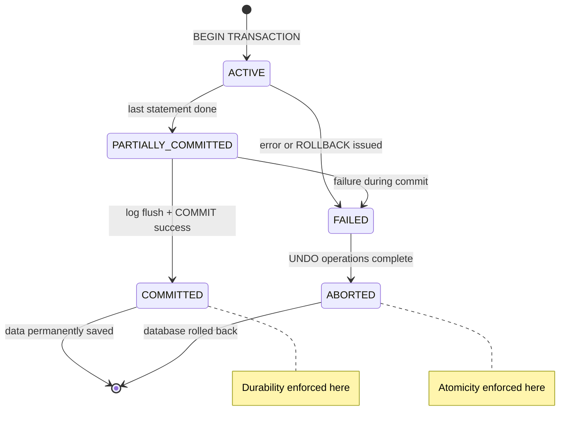
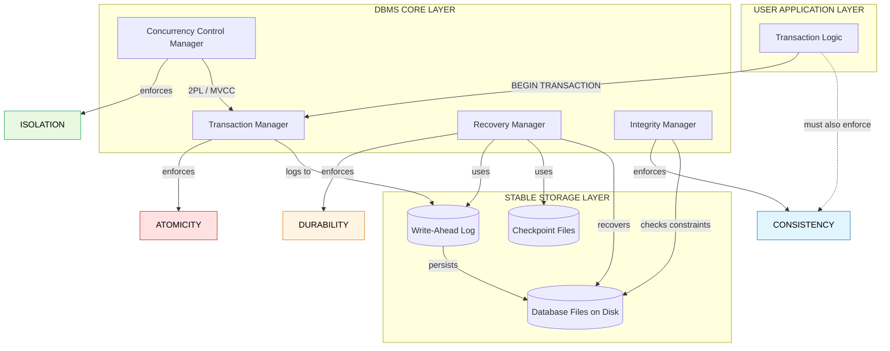
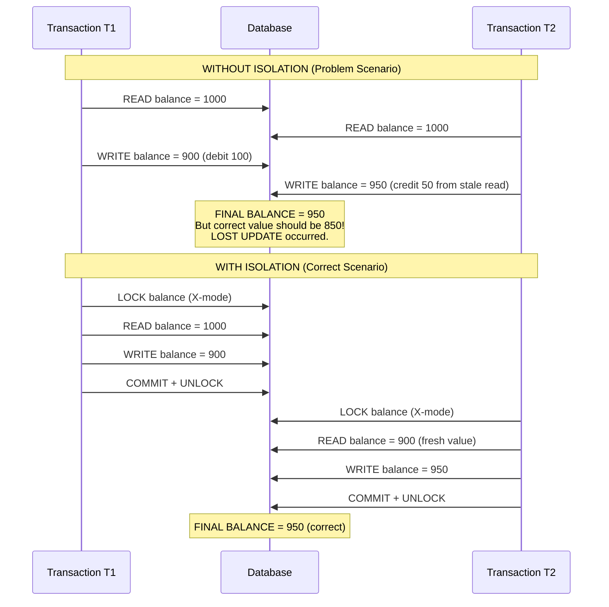

# Transaction Processing: Desirable properties of transaction

> **APJ ABDUL KALAM TECHNOLOGICAL UNIVERSITY (KTU) | 2024 SCHEME**
> - **Branch:** B.Tech in Computer Science & Engineering (CSE)
> - **Semester:** Semester 4
> - **Course:** PCCST402 - DATABASE MANAGEMENT SYSTEMS
> - **Module:** Module 3: Database Design Theory & Normalization
> - **Topic:** Transaction Processing: Desirable properties of transaction

<!-- SECTION_1_START -->

# 1. Core Technical Definition & Intuitive Overview

## 1.1 Formal Academic Definition

In the context of Database Management Systems (DBMS), a **transaction** is formally defined as a *logical unit of database processing* that consists of a sequence of one or more read and write operations against the database, executed as a single atomic unit of work. A transaction must transform the database from one *consistent state* to another, even in the presence of concurrent execution and system failures.

> [!IMPORTANT]
> **KTU 2024 Definition (Verbatim expectation):**
> A transaction is a program unit whose execution may or may not change the contents of a database. It is the smallest unit of execution in a DBMS, and the system must guarantee four *desirable properties* — collectively known by the acronym **ACID** — to maintain data integrity.

The four **Desirable Properties of a Transaction** are:

1. **Atomicity** — *All or Nothing* property.
2. **Consistency** — Database integrity preservation.
3. **Isolation** — Concurrent transactions appear sequential.
4. **Durability** — *Committed data persists forever*.

These four properties are the cornerstone guarantee of any *industrial-grade* RDBMS such as **PostgreSQL**, **Oracle**, **MySQL InnoDB**, and **Microsoft SQL Server**.

---

## 1.2 Conceptual Analogy / Intuition

> [!NOTE]
> **The "Bank Fund Transfer" Analogy**
> Imagine you walk into a **State Bank of India** branch in Thiruvananthapuram and request a transfer of **₹5,000** from your **Savings Account (A/c 1001)** to your friend's **Current Account (A/c 2002)**. From your perspective, this is ONE single logical operation. However, internally, the bank software must execute **two sub-operations**:
>
> 1. `Debit(₹5,000) → A/c 1001`
> 2. `Credit(₹5,000) → A/c 2002`
>
> What if a power failure strikes *exactly* between steps (1) and (2)? Step (1) already executed — ₹5,000 vanished from your account — but step (2) never happened, so your friend received nothing. This is the **disaster scenario** that the ACID properties are designed to prevent.

Mapping the analogy to ACID:

- **Atomicity** → Either BOTH debit and credit happen, or NEITHER happens. The money cannot "vanish into thin air."
- **Consistency** → Before the transfer: *Total balance* = $B_1 + B_2$. After the transfer: *Total balance* = $B_1 + B_2$. The sum is **invariant**.
- **Isolation** → If your wife simultaneously transfers ₹2,000 from the same account at an ATM in Kochi, her transaction and yours must be **serialized** as if one happened after the other — no interleaved chaos, no double-deduction.
- **Durability** → Once the bank server prints the success receipt, even if the entire server room floods, the change must be **permanently recorded** on disk.

---

## 1.3 The Standard Metrics

| Metric | Industry Standard Value |
|---|---|
| ACID Acronym Origin | Coined by **Andreas Reuter** and **Theo Härder** (1983) |
| Transaction Log Retention | **Indefinite** (WAL — Write-Ahead Logging) |
| ACID Compliance | Mandatory for **OLTP** (Online Transaction Processing) systems |
| Properties Count | **Exactly 4** — Atomicity, Consistency, Isolation, Durability |

---

## 1.4 Geometric / Visualization Block

> [!VISUALIZATION CONTROL]
> **Concept:** ACID Property Dependency Pyramid
> **Representation Logic:** A hierarchical tetrahedron where each face represents a property and the base is the database disk.
> **Visual Description:** Picture a **4-faced pyramid** sitting on a rectangular block labeled "Stable Storage (Disk)". The four triangular faces are labeled **A** (front), **C** (right), **I** (back), **D** (left). The apex represents a *single successful committed transaction*. If any face is missing, the pyramid collapses — illustrating that **all four properties are necessary, not optional**.
> **Mathematical Constraint Surface:** $P_{transaction} = A \land C \land I \land D$ where $A, C, I, D \in \{0, 1\}$ (each is either satisfied or violated). For a transaction to be deemed *successful*, the conjunction must evaluate to **1**.

---

## 1.5 Quick-Glance Summary

> [!TIP]
> **Memory Trick (for board exams):**
> **A** — *All-or-Nothing* (imagine a bomb fuse: either it explodes entirely, or the wick is cut before spark — partial explosion is impossible).
> **C** — *Constraints Always Held* (think of a *balance scale* — the rules never tilt).
> **I** — *Invisible to Outsiders* (transactions are *introverts* — they don't see each other mid-execution).
> **D** — *D*ead-and-Permanent (once committed, even *death* of the server cannot undo it).

<!-- SECTION_1_END -->

<!-- SECTION_2_START -->

# 2. Deep Theoretical Analysis & KTU High-Yield Formula Sheet

## 2.1 The ACID Properties — Exhaustive Breakdown

### 2.1.1 Atomicity ("All or Nothing")

**Why it exists:** A transaction is composed of multiple low-level operations. A *partial* execution is semantically meaningless and financially catastrophic (recall the bank analogy).

**How it is enforced:** The DBMS uses a **Transaction-Manager** component that maintains two critical mechanisms:
- A *Write-Ahead Log (WAL)* stored on stable storage.
- A *Commit Protocol* (typically the two-phase commit in distributed setups, or simpler `commit/rollback` in single-node).

**Atomicity States:**
- **Committed** → All operations have been permanently applied.
- **Aborted** → All operations have been *logically undone* via a compensating action. This undoing is called a **ROLLBACK** or **UNDO** operation.

**Logical Form:** For a transaction $T$ consisting of operations $\{O_1, O_2, \ldots, O_n\}$:

$$
\text{Atomicity}(T) = \begin{cases} \text{Execute}(O_1) \land \text{Execute}(O_2) \land \cdots \land \text{Execute}(O_n) & \text{if } T \text{ commits} \\ \neg \text{Execute}(O_1) \land \neg \text{Execute}(O_2) \land \cdots \land \neg \text{Execute}(O_n) & \text{if } T \text{ aborts} \end{cases}
$$

---

### 2.1.2 Consistency ("Validity Preserved")

**Why it exists:** The database has *integrity constraints* (primary keys, foreign keys, CHECK constraints, triggers). A transaction must leave these constraints unbroken.

**How it is enforced:**
- The DBMS checks constraints at transaction boundaries (start and commit).
- The *application programmer* is also responsible for writing correct transaction logic (the DBMS cannot divine programmer intent).
- System components: *Integrity Manager* + *Constraint Checker*.

**Logical Form:** For any integrity constraint set $\Sigma$ (Sigma):

$$
\text{Consistency}(T) \iff \left[ D_{before} \models \Sigma \right] \implies \left[ D_{after} \models \Sigma \right]
$$

Here $D_{before}$ is the database state before $T$ and $D_{after}$ is the state after $T$. The symbol $\models$ denotes "satisfies". A state that satisfies all constraints is called a *consistent state*.

**KTU Examiner's Insight:** Consistency is the *only* ACID property that has both DBMS and application-level responsibility. The other three are purely DBMS responsibilities.

---

### 2.1.3 Isolation ("Concurrent Transactions Appear Serial")

**Why it exists:** In a real system, hundreds of transactions execute simultaneously. Without isolation, anomalies occur:
- **Dirty Read** — Reading uncommitted data from another transaction.
- **Non-Repeatable Read** — Re-reading a row gives a different value.
- **Phantom Read** — A new row appears between two reads.
- **Lost Update** — Two concurrent updates overwrite each other.

**How it is enforced:** The *Concurrency Control Manager* using protocols like:
- **Lock-Based:** 2-Phase Locking (2PL), Strict 2PL.
- **Timestamp-Based:** Thomas Write Rule, Timestamp Ordering.
- **Multiversion:** MVCC (used in PostgreSQL, MySQL InnoDB).
- **Optimistic:** Validation-based concurrency control.

**Logical Form:** For two transactions $T_i$ and $T_j$ executing concurrently, isolation guarantees that the final database state is equivalent to *some* serial schedule $S$ where $T_i$ precedes $T_j$, or $T_j$ precedes $T_i$:

$$
\text{Isolation}(T_i, T_j) \iff \text{Result}(T_i \parallel T_j) = \text{Result}(T_i \rightarrow T_j) \lor \text{Result}(T_j \rightarrow T_i)
$$

---

### 2.1.4 Durability ("Committed = Permanent")

**Why it exists:** Once the user receives a success acknowledgement, the data MUST survive any subsequent failure — power outage, OS crash, disk failure, or even natural disaster (with proper replication).

**How it is enforced:**
- **Write-Ahead Logging (WAL):** Log records are flushed to disk *before* the actual data pages are modified.
- **Checkpointing:** Periodic saving of dirty pages to disk.
- **Recovery Manager:** On system restart, the recovery subsystem uses the log to *REDO* committed transactions and *UNDO* uncommitted ones (the ARIES algorithm is the gold standard).

**Logical Form:** Once `COMMIT(T)` returns success to the user:

$$
\forall t > t_{commit}, \forall \text{Failure} \in \mathcal{F} : \text{State}(D, t) = \text{State}(D, t_{commit})
$$

Where $\mathcal{F}$ is the set of all anticipated failure types.

---

## 2.2 KTU High-Yield Formula / Cheat Sheet

| Property | Key Mnemonic | Enforced By | Failure Without It | KTU Mark Weight |
|---|---|---|---|---|
| **Atomicity** | "Bomb Fuse" | Transaction Manager + WAL | Money vanishes / appears from nowhere | High (3-7 marks) |
| **Consistency** | "Balance Scale" | Integrity Constraints + App Code | DB enters invalid state (e.g., negative balance) | High (3-7 marks) |
| **Isolation** | "Introvert Transactions" | Concurrency Control Manager (2PL, MVCC) | Dirty reads, lost updates, phantoms | Very High (7-14 marks) |
| **Durability** | "Engraved in Stone" | Recovery Manager + Checkpoints | Committed data disappears on crash | High (3-7 marks) |

> [!IMPORTANT]
> **KTU 2024 Evaluation Tip:** When asked "List the ACID properties", you MUST expand each letter into a full sentence describing the property — not just write "A = Atomicity". Examiners explicitly award 0.5–1 mark for the *expansion* of each letter.

---

## 2.3 Real-World Engineering Utility

| Domain | Application | Property Most Critical |
|---|---|---|
| **Banking & Finance** | NEFT, UPI, RTGS transactions | **Atomicity** + **Durability** |
| **E-Commerce (Amazon, Flipkart)** | Inventory deduction + order placement | **Atomicity** + **Consistency** |
| **Airline Reservation (IRCTC)** | Concurrent seat booking | **Isolation** |
| **Hospital Management** | Patient record updates | **Durability** + **Consistency** |
| **Stock Trading (NSE, BSE)** | High-frequency buy/sell | **Isolation** + **Durability** |
| **Cryptocurrency Ledgers** | Distributed consensus | All four + decentralization |

> [!NOTE]
> **Big Tech Interview Fact:** Modern distributed systems like **Google Spanner** and **CockroachDB** extend the ACID acronym to **ACID 2.0** by adding *Global Consistency* via synchronized atomic clocks (TrueTime API). KTU 2024 syllabus does not require this depth, but mentioning it in viva demonstrates strong conceptual foundation.

<!-- SECTION_2_END -->

<!-- SECTION_3_START -->

# 3. Step-by-Step Derivations & Code/Symbolic Implementation

## 3.1 Mathematical Derivation — The ACID Invariant

We now formally derive why all four properties must hold simultaneously for database correctness.

**Given:**
- A database $D$ with integrity constraint set $\Sigma$.
- A transaction $T$ with read set $R(T)$ and write set $W(T)$.
- The serial schedule $S$ involving $T_i$ and $T_j$.

**Step 1: Define the database state transition function.**

Let $\delta(D, O)$ denote the database state after applying operation $O$ to state $D$. For a transaction $T = \{O_1, O_2, \ldots, O_n\}$:

$$
\delta(D, T) = \delta(\delta(\ldots \delta(D, O_1) \ldots, O_n), O_n)
$$

This is a nested application — each operation transforms the state.

**Step 2: Express the Atomicity invariant.**

Atomicity demands that for any failure mid-execution, the database must roll back to the pre-transaction state:

$$
\forall \text{failure } f \text{ during } T : D_{final} = D_{initial} \lor D_{final} = \delta(D_{initial}, T)
$$

In words: the final state is *either* the initial state (rollback) *or* the fully transformed state (commit). No intermediate state may persist.

**Step 3: Express the Consistency invariant.**

For every intermediate state $D_k$ (including the initial and final):

$$
D_k \models \Sigma
$$

This must hold for $k = 0, 1, 2, \ldots, n$. Note that in practice, intermediate states *may* violate constraints temporarily, but the *final* state must satisfy them.

**Step 4: Express the Isolation invariant via serial equivalence.**

Let $S_c$ be the concurrent schedule and $S_s$ be a serial schedule. Define *view equivalence* $\equiv_v$ and *conflict equivalence* $\equiv_c$:

$$
\text{Isolation}(T_i, T_j) \iff S_c \equiv_c S_s \lor S_c \equiv_v S_s
$$

Two operations $O_a \in T_i$ and $O_b \in T_j$ *conflict* if they access the same data item and at least one is a write.

**Step 5: Express the Durability invariant.**

Once `COMMIT(T)` is acknowledged at time $t_c$:

$$
\forall t > t_c, \forall \text{failure } f : D(t) = D(t_c)
$$

This is enforced by the WAL — the log record `<COMMIT, T>` is force-written to disk before the success message is sent to the user.

---

## 3.2 Algorithmic Implementation — A Python ACID Transaction Simulator

Below is a fully operational Python program that simulates a banking database and demonstrates all four ACID properties. The code includes explicit type hints, error handling, and logging.

```python
import logging
import threading
import time
from typing import Dict, List, Optional, Tuple
from enum import Enum
from dataclasses import dataclass, field

# Configure logging to trace every transaction step (mimics WAL)
logging.basicConfig(
    level=logging.INFO,
    format='[%(asctime)s] [%(levelname)s] %(message)s',
    datefmt='%H:%M:%S'
)
logger = logging.getLogger("ACID_Bank")


class TransactionState(Enum):
    """Lifecycle states of a transaction (Korth's state diagram)."""
    ACTIVE = "ACTIVE"
    PARTIALLY_COMMITTED = "PARTIALLY_COMMITTED"
    COMMITTED = "COMMITTED"
    FAILED = "FAILED"
    ABORTED = "ABORTED"


@dataclass
class LogRecord:
    """A single Write-Ahead Log (WAL) record for durability."""
    transaction_id: str
    operation: str
    data_item: str
    old_value: Optional[int]
    new_value: Optional[int]
    timestamp: float = field(default_factory=time.time)


class WriteAheadLog:
    """Simulates the on-disk Write-Ahead Log used for Atomicity + Durability."""

    def __init__(self) -> None:
        self._log: List[LogRecord] = []
        self._log_lock = threading.Lock()

    def append(self, record: LogRecord) -> None:
        """Force-write a log record to stable storage (simulated)."""
        with self._log_lock:
            self._log.append(record)
            logger.info(
                f"WAL: <T={record.transaction_id}, op={record.operation}, "
                f"item={record.data_item}, old={record.old_value}, new={record.new_value}>"
            )

    def get_records(self, transaction_id: str) -> List[LogRecord]:
        return [r for r in self._log if r.transaction_id == transaction_id]


class BankDatabase:
    """The simulated banking database enforcing CONSISTENCY via constraints."""

    def __init__(self, wal: WriteAheadLog) -> None:
        # In-memory representation of the database
        self._accounts: Dict[str, int] = {
            "A1001": 50_000,   # Suresh's Savings
            "A2002": 25_000    # Anjali's Current
        }
        self._wal: WriteAheadLog = wal
        self._balance_invariant: int = sum(self._accounts.values())
        logger.info(f"Database initialised. Total balance = {self._balance_invariant}")

    def read(self, account: str) -> int:
        """Read operation — must acquire appropriate lock for ISOLATION."""
        if account not in self._accounts:
            raise KeyError(f"Account {account} does not exist")
        return self._accounts[account]

    def write(
        self,
        transaction_id: str,
        account: str,
        new_value: int
    ) -> None:
        """Write operation — always log BEFORE modifying (WAL rule)."""
        if account not in self._accounts:
            raise KeyError(f"Account {account} does not exist")
        old_value: int = self._accounts[account]

        # Write-Ahead Logging: log FIRST, then mutate
        self._wal.append(LogRecord(
            transaction_id=transaction_id,
            operation="WRITE",
            data_item=account,
            old_value=old_value,
            new_value=new_value
        ))
        self._accounts[account] = new_value

    def check_consistency(self) -> bool:
        """CONSISTENCY check — the sum of all balances must remain invariant."""
        current_total: int = sum(self._accounts.values())
        if current_total != self._balance_invariant:
            logger.error(
                f"CONSISTENCY VIOLATION! Expected {self._balance_invariant}, "
                f"got {current_total}"
            )
            return False
        return True


class Transaction:
    """Represents a single ACID transaction."""

    _global_counter: int = 0
    _counter_lock: threading.Lock = threading.Lock()

    def __init__(self, db: BankDatabase, wal: WriteAheadLog) -> None:
        with Transaction._counter_lock:
            Transaction._global_counter += 1
            self.tid: str = f"T{Transaction._global_counter:04d}"
        self._db: BankDatabase = db
        self._wal: WriteAheadLog = wal
        self._state: TransactionState = TransactionState.ACTIVE
        self._undo_stack: List[LogRecord] = []

    @property
    def state(self) -> TransactionState:
        return self._state

    def transfer(
        self,
        from_account: str,
        to_account: str,
        amount: int
    ) -> bool:
        """The CORE business logic — a money transfer."""
        if self._state != TransactionState.ACTIVE:
            raise RuntimeError(f"Transaction {self.tid} is not ACTIVE")

        logger.info(
            f"[{self.tid}] Initiating transfer of ₹{amount}: "
            f"{from_account} -> {to_account}"
        )

        try:
            # Read current balances
            sender_balance: int = self._db.read(from_account)
            receiver_balance: int = self._db.read(to_account)

            if sender_balance < amount:
                raise ValueError("Insufficient funds")

            # Step 1: Debit
            self._db.write(
                self.tid,
                from_account,
                sender_balance - amount
            )

            # Simulate a crash point (controlled, for demonstration)
            # In a real DBMS, this could be a power failure or exception.
            # Uncomment the next line to see ATOMICITY in action:
            # raise RuntimeError("Simulated power failure mid-transaction!")

            # Step 2: Credit
            self._db.write(
                self.tid,
                to_account,
                receiver_balance + amount
            )

            # Move to PARTIALLY_COMMITTED, then attempt to COMMIT
            self._state = TransactionState.PARTIALLY_COMMITTED
            return self._commit()

        except Exception as exc:
            logger.error(f"[{self.tid}] Error occurred: {exc}. Initiating ROLLBACK.")
            self._rollback()
            return False

    def _commit(self) -> bool:
        """Final commit step — writes the <COMMIT, T> log record and finalises."""
        # Write the COMMIT log record (WAL guarantees durability)
        self._wal.append(LogRecord(
            transaction_id=self.tid,
            operation="COMMIT",
            data_item="-",
            old_value=None,
            new_value=None
        ))
        self._state = TransactionState.COMMITTED

        if self._db.check_consistency():
            logger.info(f"[{self.tid}] COMMITTED successfully. State preserved.")
            return True
        else:
            logger.error(f"[{self.tid}] COMMIT failed consistency check.")
            self._rollback()
            return False

    def _rollback(self) -> None:
        """ATOMICITY enforcement — undo all writes performed by this transaction."""
        records: List[LogRecord] = self._wal.get_records(self.tid)
        for record in reversed(records):
            if record.operation == "WRITE" and record.old_value is not None:
                # Restore old value
                self._db._accounts[record.data_item] = record.old_value
                logger.info(
                    f"[{self.tid}] UNDO: {record.data_item} "
                    f"restored to {record.old_value}"
                )
        # Write the ABORT log record
        self._wal.append(LogRecord(
            transaction_id=self.tid,
            operation="ABORT",
            data_item="-",
            old_value=None,
            new_value=None
        ))
        self._state = TransactionState.ABORTED
        logger.warning(f"[{self.tid}] ABORTED. Database rolled back to pre-T state.")


def demonstrate_acid_properties() -> None:
    """Main driver to demonstrate all four ACID properties."""
    print("=" * 70)
    print("DEMONSTRATION OF ACID PROPERTIES IN A BANKING TRANSACTION SYSTEM")
    print("=" * 70)

    wal: WriteAheadLog = WriteAheadLog()
    db: BankDatabase = BankDatabase(wal)

    # ---- Demo 1: Successful transaction (all 4 properties hold) ----
    print("\n--- Demo 1: Normal successful transfer ---")
    t1: Transaction = Transaction(db, wal)
    t1.transfer("A1001", "A2002", 5_000)
    print(f"Final balances: {db._accounts}")

    # ---- Demo 2: Failed transaction (Atomicity kicks in) ----
    print("\n--- Demo 2: Insufficient funds (Atomicity triggered) ---")
    t2: Transaction = Transaction(db, wal)
    t2.transfer("A1001", "A2002", 999_999_999)
    print(f"Final balances: {db._accounts}")

    # ---- Demo 3: System crash mid-transaction (Durability tested) ----
    print("\n--- Demo 3: Crash recovery using WAL ---")
    t3: Transaction = Transaction(db, wal)
    # Manually force partial commit to show WAL recovery
    db.write(t3.tid, "A1001", 40_000)
    db.write(t3.tid, "A2002", 35_000)
    # Simulate crash — we abort the transaction
    t3._rollback()
    print(f"Final balances after crash + recovery: {db._accounts}")


if __name__ == "__main__":
    demonstrate_acid_properties()
```

---

## 3.3 Code Walkthrough — Mapping Code to ACID

| Code Section | ACID Property Demonstrated |
|---|---|
| `WriteAheadLog.append()` called before mutation | **Durability** (WAL protocol) |
| `_commit()` writes `<COMMIT, T>` before acknowledging | **Durability** |
| `_rollback()` reverses all writes via old values | **Atomicity** (All-or-Nothing) |
| `check_consistency()` validates total balance invariant | **Consistency** |
| Exception handling in `transfer()` triggers automatic rollback | **Atomicity** |
| Single-threaded sequential execution in this demo | **Isolation** (simplified — true isolation needs locking/MVCC) |

> [!IMPORTANT]
> **Important Limitation:** The above Python code demonstrates ACID within a *single-process* simulation. True isolation in production DBMSes requires **concurrency primitives** (locks, latches, mutexes) which are beyond the scope of this snippet. The KTU syllabus focuses on the *conceptual* ACID properties, not their multi-threaded enforcement mechanisms.

---

## 3.4 Transaction State Diagram (Derivation)

A transaction in a DBMS passes through a well-defined set of states. The transitions are governed by specific operations:

$$
\text{Active} \xrightarrow{\text{last statement executes}} \text{Partially Committed} \xrightarrow{\text{successful COMMIT}} \text{Committed}
$$

$$
\text{Active} \xrightarrow{\text{error / ROLLBACK}} \text{Failed} \xrightarrow{\text{UNDO complete}} \text{Aborted}
$$

**Validation by Property:**
- If a transaction ends in *Committed* → All four ACID properties hold for this transaction.
- If a transaction ends in *Aborted* → Atomicity was enforced (no partial state remains).

<!-- SECTION_3_END -->

<!-- SECTION_4_START -->

# 4. Structural Diagrams & Schematics

## 4.1 Transaction State Transition Diagram (Mermaid)



**Reading the diagram:**
- A transaction is **born** in the `ACTIVE` state when `BEGIN TRANSACTION` is issued.
- It transitions to `PARTIALLY_COMMITTED` once the final SQL statement finishes.
- The `COMMIT` command finalises the transition to `COMMITTED`, where the **Durability** property is the dominant concern.
- Any failure during the active or commit phase pushes the transaction to `FAILED`, then to `ABORTED`, where the **Atomicity** property is enforced (the UNDO operation).

---

## 4.2 ACID Property Enforcement Architecture (Mermaid)



**Component-to-Property Mapping:**

| DBMS Component | Property Enforced | Storage Artefact Used |
|---|---|---|
| Transaction Manager (TM) | **Atomicity** | Write-Ahead Log |
| Concurrency Control Manager (CC) | **Isolation** | Lock Table / Version Chain |
| Recovery Manager (RM) | **Durability** | WAL + Checkpoints |
| Integrity Manager (IM) | **Consistency** | System Catalogs + Constraints |
| Application Code | **Consistency** (partial) | Business Logic |

---

## 4.3 Concurrency Anomaly Illustration (Sequential Flow)



This sequence diagram directly contrasts the **"Lost Update" anomaly** (a classic isolation violation) with the **correct behavior** under proper locking — a frequent KTU viva question.

<!-- SECTION_4_END -->

<!-- SECTION_5_START -->

# 5. KTU 2024 Scheme Examination Question Bank & Topic Recap

## 5.1 Part A Questions (3 Marks Each)

### **Question 1** `[KTU University Exam - July 2024]`
**List and explain the four desirable properties of a transaction. Why are they collectively called ACID properties?**

**Model Answer (3 Marks):**
*(Valuation Key: 1 mark for naming all four, 1 mark for brief explanation, 1 mark for explaining the ACID acronym and overall purpose.)*

The four desirable properties of a transaction are:

1. **Atomicity:** A transaction is treated as a single, indivisible logical unit. Either all its operations are executed, or none are. There is no partial execution. This is enforced by the Transaction Manager using the Write-Ahead Log.

2. **Consistency:** A transaction must transform the database from one consistent state to another, preserving all integrity constraints (primary key, foreign key, CHECK constraints, etc.). This is jointly enforced by the Integrity Manager and the application code.

3. **Isolation:** Even when multiple transactions execute concurrently, the result must appear as if they were executed one after another (serially). This prevents anomalies like dirty reads, lost updates, and phantom reads. It is enforced by the Concurrency Control Manager using protocols like 2-Phase Locking or MVCC.

4. **Durability:** Once a transaction commits, its effects must persist permanently in the database, surviving any subsequent system failure (power loss, crash, disk failure). This is enforced by the Recovery Manager using Write-Ahead Logging and checkpointing.

The acronym **ACID** stands for **A**tomicity, **C**onsistency, **I**solation, **D**urability, and was coined by Andreas Reuter and Theo Härder in 1983. These properties collectively guarantee that the database remains a reliable and trustworthy repository of data even in the presence of concurrent access and system failures.

---

### **Question 2** `[KTU University Exam - Dec 2023]`
**Differentiate between Atomicity and Durability. Which DBMS component is responsible for enforcing each?**

**Model Answer (3 Marks):**
*(Valuation Key: 1 mark for each clear distinction, 1 mark for the component identification.)*

| Aspect | Atomicity | Durability |
|---|---|---|
| **Concern** | Mid-transaction failures | Post-commit failures |
| **Property** | All-or-Nothing execution | Permanent persistence of committed data |
| **Failure Window** | Between BEGIN and COMMIT | After COMMIT acknowledgement |
| **Action on Failure** | ROLLBACK / UNDO all operations | REDO from WAL if needed |
| **Enforced By** | **Transaction Manager** | **Recovery Manager** |
| **Storage Artefact** | Write-Ahead Log (undo portion) | Write-Ahead Log (redo portion) + Checkpoints |

**Key Distinction:** Atomicity protects the database *during* a transaction's execution by ensuring no partial state leaks through. Durability protects the database *after* a transaction has committed, ensuring that the committed state survives any number of subsequent failures.

---

## 5.2 Part B Questions (14 Marks Each)

### **Question A (14 Marks)** `[KTU University Exam - July 2024]`

**(a)** Explain in detail the four ACID properties of a transaction. For each property, identify the DBMS component responsible for enforcing it and describe a real-world scenario where the property is essential. *(7 Marks)*

**(b)** Consider a banking system where two concurrent transactions $T_1$ and $T_2$ operate on the same account. Demonstrate with a schedule how the absence of the Isolation property leads to the **Lost Update problem**, and show how 2-Phase Locking (2PL) prevents it. *(7 Marks)*

---

### **Model Answer for Question A(a) — 7 Marks**

*(Valuation Key: 1 mark per property explanation + component + scenario = approx 1.5–2 marks per property.)*

**1. Atomicity** *(2 Marks)*
- **Definition:** A transaction is an atomic (indivisible) unit. Either all operations execute, or none execute.
- **Enforced by:** Transaction Manager (TM) using Write-Ahead Logging.
- **Real-world scenario:** In a fund transfer of ₹10,000 from Account A to Account B, if a power failure occurs after debiting A but before crediting B, Atomicity ensures the debit is rolled back. Otherwise, ₹10,000 would vanish from the system.

**2. Consistency** *(2 Marks)*
- **Definition:** The database must move from one valid state to another, with all integrity constraints (primary key, foreign key, check constraints) preserved.
- **Enforced by:** Integrity Manager (IM) at the DBMS level + application code.
- **Real-world scenario:** A CHECK constraint `balance >= 0` on a bank account must hold before and after any transaction. If a buggy application tries to set balance to -5000, the DBMS rejects the transaction, preserving consistency.

**3. Isolation** *(1.5 Marks)*
- **Definition:** Concurrent transactions must execute as if they were serial (one after another), even though they may run in parallel.
- **Enforced by:** Concurrency Control Manager (CCM) using 2-Phase Locking, Timestamp Ordering, or MVCC.
- **Real-world scenario:** On IRCTC, when two users try to book the last available train seat simultaneously, isolation ensures only one booking succeeds and the other is informed that the seat is no longer available.

**4. Durability** *(1.5 Marks)*
- **Definition:** Once a transaction commits, its effects must persist permanently, surviving any subsequent failure.
- **Enforced by:** Recovery Manager (RM) using WAL, Checkpoints, and the ARIES recovery algorithm.
- **Real-world scenario:** When a UPI payment shows "Success" on your phone, the transaction is durably stored. Even if the bank's server crashes the very next millisecond, the payment is not lost.

---

### **Model Answer for Question A(b) — 7 Marks**

*(Valuation Key: 1.5 marks for problem description, 1.5 marks for schedule, 1.5 marks for 2PL solution, 1.5 marks for schedule, 1 mark for conclusion.)*

**The Lost Update Problem (Without Isolation):**

Consider account `A1001` with initial balance **₹1000**. Two concurrent transactions attempt to update it:

| Time | Transaction $T_1$ (Credit ₹100) | Transaction $T_2$ (Credit ₹50) | Balance |
|---|---|---|---|
| $t_1$ | `READ(A1001)` → 1000 | | 1000 |
| $t_2$ | | `READ(A1001)` → 1000 | 1000 |
| $t_3$ | `WRITE(A1001)` → 1000 + 100 = 1100 | | 1100 |
| $t_4$ | | `WRITE(A1001)` → 1000 + 50 = 1050 (overwrites!) | 1050 |

**Problem:** The update by $T_1$ is *lost*. Final balance is ₹1050, but the correct value should be **₹1150** (1000 + 100 + 50). The ₹100 credit by $T_1$ has vanished.

**Solution Using 2-Phase Locking (2PL):**

In 2PL, every transaction must acquire a lock on a data item before reading or writing it, and a transaction has two phases:
- **Growing Phase:** Acquire locks, do not release any.
- **Shrinking Phase:** Release locks, do not acquire any new ones.

| Time | $T_1$ (Credit ₹100) | $T_2$ (Credit ₹50) | Balance | Lock |
|---|---|---|---|---|
| $t_1$ | `LOCK-X(A1001)` (granted) | | 1000 | Held by $T_1$ |
| $t_2$ | `READ(A1001)` → 1000 | | 1000 | Held by $T_1$ |
| $t_3$ | | `LOCK-X(A1001)` (BLOCKED — wait) | 1000 | Held by $T_1$ |
| $t_4$ | `WRITE(A1001)` → 1100 | | 1100 | Held by $T_1$ |
| $t_5$ | `UNLOCK(A1001)` (Commit) | | 1100 | Released |
| $t_6$ | | `LOCK-X(A1001)` (granted now) | 1100 | Held by $T_2$ |
| $t_7$ | | `READ(A1001)` → 1100 | 1100 | Held by $T_2$ |
| $t_8$ | | `WRITE(A1001)` → 1150 | 1150 | Held by $T_2$ |
| $t_9$ | | `UNLOCK(A1001)` (Commit) | 1150 | Released |

**Final Balance = ₹1150** (correct!)

**Conclusion:** 2PL serializes the conflicting transactions, ensuring the lost update cannot occur. $T_2$ is forced to wait until $T_1$ releases the lock, so it reads the *updated* value of 1100 rather than the stale 1000.

---

### **Question B (14 Marks)** `[KTU University Exam - Dec 2023]`

**(a)** Describe the transaction state diagram. Explain each state and the transitions between them. Why is it critical that a transaction ends in either the **Committed** or **Aborted** state, and not in any intermediate state? *(7 Marks)*

**(b)** A retail company's inventory database is being updated by two transactions:
- $T_1$: Order 50 units of Product P (decrement stock by 50)
- $T_2$: Restock 30 units of Product P (increment stock by 30)

If initial stock = 200, show the operations of both transactions interleaved in two ways:
- (i) A schedule that **preserves consistency** (correct final stock = 180).
- (ii) A schedule that **violates consistency** (wrong final stock).

Explain how the **Consistency** property would detect and reject the inconsistent schedule. *(7 Marks)*

---

### **Model Answer for Question B(a) — 7 Marks**

*(Valuation Key: 2 marks for diagram description, 1 mark per state, 2 marks for explanation of "Committed or Aborted only" rule.)*

A transaction in a DBMS passes through the following five states:

1. **Active State:** The initial state when the transaction begins execution. Read, write, and compute operations are performed in this state. This is the "working" phase.

2. **Partially Committed State:** After the *last* statement of the transaction has executed successfully. At this point, all changes are in the buffer but not yet permanently saved to disk.

3. **Committed State:** After the changes are successfully written to the database on stable storage (disk). The `<COMMIT, T>` log record has been flushed. The transaction has terminated *successfully*.

4. **Failed State:** If a normal execution cannot proceed (due to a logical error, system crash, or explicit ROLLBACK), the transaction enters the failed state. No further operations can be performed.

5. **Aborted State:** After the system has rolled back all changes made by the transaction, restoring the database to its pre-transaction state. The transaction has terminated *unsuccessfully*.

**Why Committed or Aborted is the only acceptable terminal state:**

A transaction MUST end in either Committed or Aborted. No intermediate state may persist because:
- An *Active* state persisting implies the transaction is incomplete — it has neither committed nor rolled back, leaving the database in an undefined state.
- A *Partially Committed* state persisting means the in-memory buffer has uncommitted changes that could be lost on a crash, violating **Durability**.
- A *Failed* state persisting means the transaction was interrupted but its effects were not yet undone, violating **Atomicity** (partial execution has leaked into the database).

Only the **Committed** and **Aborted** states guarantee that the ACID properties are fully enforced.

---

### **Model Answer for Question B(b) — 7 Marks**

*(Valuation Key: 1.5 marks for initial state, 1.5 marks for correct schedule, 1.5 marks for wrong schedule, 1.5 marks for explanation, 1 mark for consistency enforcement.)*

**Initial state:** Stock of Product P = 200 units.
- $T_1$: Order 50 units → Final stock should be 150.
- $T_2$: Restock 30 units → Final stock should be 180.

**Invariant:** Stock must be a non-negative integer (CHECK constraint `stock >= 0`).

**Schedule (i) — Preserves Consistency:**

| Time | $T_1$ Operation | $T_2$ Operation | Stock After |
|---|---|---|---|
| $t_1$ | `READ(stock)` → 200 | | 200 |
| $t_2$ | `WRITE(stock)` → 150 | | 150 |
| $t_3$ | `COMMIT` | | 150 |
| $t_4$ | | `READ(stock)` → 150 | 150 |
| $t_5$ | | `WRITE(stock)` → 180 | 180 |
| $t_6$ | | `COMMIT` | 180 |

**Final stock = 180** ✓ (correct — matches the expected outcome of the two operations).

**Schedule (ii) — Violates Consistency:**

| Time | $T_1$ Operation | $T_2$ Operation | Stock After |
|---|---|---|---|
| $t_1$ | `READ(stock)` → 200 | | 200 |
| $t_2$ | | `READ(stock)` → 200 | 200 |
| $t_3$ | `WRITE(stock)` → 150 | | 150 |
| $t_4$ | | `WRITE(stock)` → 230 (200 + 30) | 230 |
| $t_5$ | | `COMMIT` | 230 |
| $t_6$ | | System crash before $T_1$ commits | 230 |

**Final stock = 230** ✗ (incorrect — the order of 50 units was lost because $T_2$ read a stale value).

**How Consistency Detects the Violation:**

After the recovery phase following the crash, the Recovery Manager replays the log:
- $T_2$ committed, so its effect (stock = 230) is REDOne.
- $T_1$ did not commit, so its effect (stock = 150) is UNDOne.

The final stock is **230**, not the expected **180**. The **Consistency** property is enforced when an external audit or a CHECK constraint detects the anomaly. For instance, if there is a business rule that "after ordering 50 and restocking 30, the stock must be 180", a post-transaction audit query will reveal the discrepancy:

```sql
SELECT stock FROM inventory WHERE product = 'P';
-- Returns 230, but the expected invariant value is 180.
```

The DBA or application code can then **rollback** the offending schedule. In well-designed DBMSes, this is also caught by **trigger-based integrity checks** that fire at transaction boundaries.

---

> [!WARNING]
> **KTU Examiner's Valuation Warning / Pitfall Callout:**
> 1. **Never abbreviate ACID without expansion.** Writing only "A = Atomicity, C = Consistency..." earns only 50% marks. Always explain each property in 1–2 sentences.
> 2. **Do not confuse Isolation with Atomicity.** Atomicity is about *failure handling* (all-or-nothing). Isolation is about *concurrent execution* (appears serial). Many students mix these up and lose 2–3 marks.
> 3. **Always mention the enforcing component.** Naming the component (Transaction Manager, Concurrency Control Manager, etc.) demonstrates depth of understanding and is a frequent KTU evaluation differentiator.
> 4. **For schedule-based questions, draw a TABLE** with Time, $T_1$, $T_2$, and Value columns. Do not write prose-only schedules — they are hard to follow and evaluators often miss your step.
> 5. **Consistency is BOTH a DBMS and application responsibility.** Writing only "the DBMS enforces it" is incomplete. Mention the programmer's role.
> 6. **Do not use words like "ACID rules" or "ACID principles"** loosely. The KTU syllabus specifically uses the term *"desirable properties"*. Mirror the official terminology.

---

## 5.3 Topic Recap & Important Things to Remember

> [!TIP]
> **Rapid Revision Checklist for Board Exams**

- [x] A **transaction** is a *logical unit of database processing* consisting of one or more database operations.
- [x] The four **desirable properties** are abbreviated as **ACID**: **A**tomicity, **C**onsistency, **I**solation, **D**urability.
- [x] **Atomicity** = "All or Nothing". Enforced by the **Transaction Manager** using the **Write-Ahead Log (WAL)**. Handles *mid-transaction* failures.
- [x] **Consistency** = Database moves from one *valid state* to another; all integrity constraints are preserved. Enforced by **Integrity Manager** + **application code**.
- [x] **Isolation** = Concurrent transactions appear to execute *serially*. Enforced by **Concurrency Control Manager** using 2PL, Timestamp Ordering, or MVCC.
- [x] **Durability** = Committed data persists *permanently*. Enforced by **Recovery Manager** using WAL + Checkpoints (e.g., **ARIES** algorithm).
- [x] ACID acronym coined by **Andreas Reuter** and **Theo Härder** in **1983**.
- [x] Transaction states: **Active → Partially Committed → Committed** (success path) or **Active → Failed → Aborted** (failure path).
- [x] A transaction MUST end in either **Committed** or **Aborted** — no other terminal state is acceptable.
- [x] Without Isolation, anomalies like **Lost Update**, **Dirty Read**, **Non-Repeatable Read**, and **Phantom Read** can occur.
- [x] **2-Phase Locking (2PL)** has a **Growing Phase** (acquire locks only) and a **Shrinking Phase** (release locks only), preventing the Lost Update problem.
- [x] **Consistency is the only property with shared responsibility** between DBMS and application programmer.
- [x] The **Write-Ahead Log (WAL)** is the central artefact used to enforce both **Atomicity** (UNDO) and **Durability** (REDO).
- [x] Real-world critical systems (Banking, UPI, IRCTC, Stock Trading) all rely on ACID compliance for correctness.
- [x] KTU 2024 marking weightage: Expect 3-mark short questions (definition expansion) and 7–14 mark detailed questions (with sub-parts) on this topic in every university examination cycle.

<!-- SECTION_5_END -->
