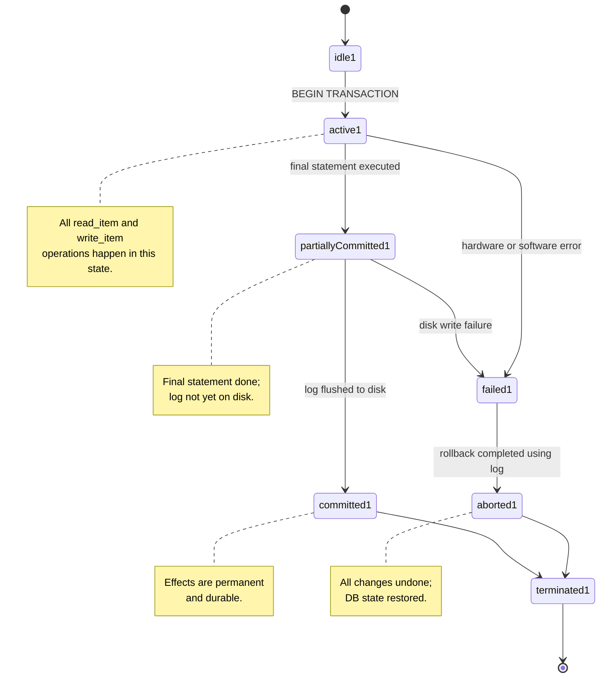
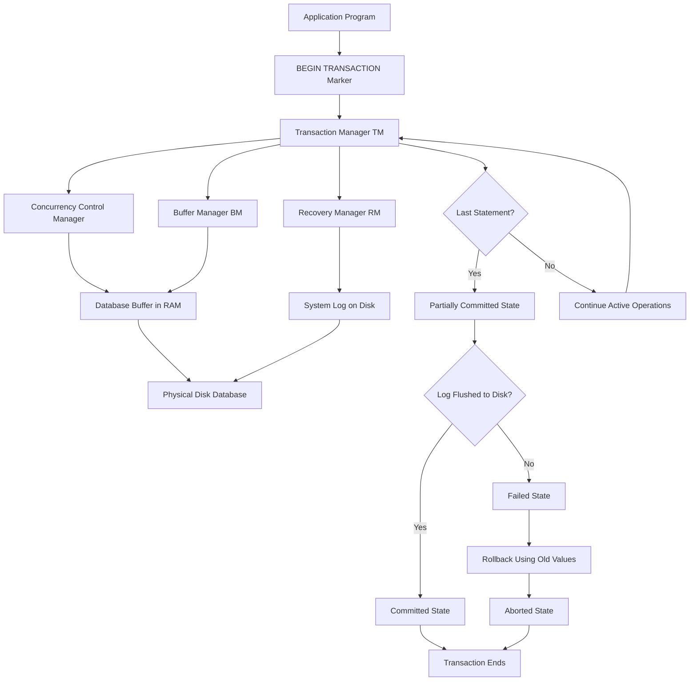
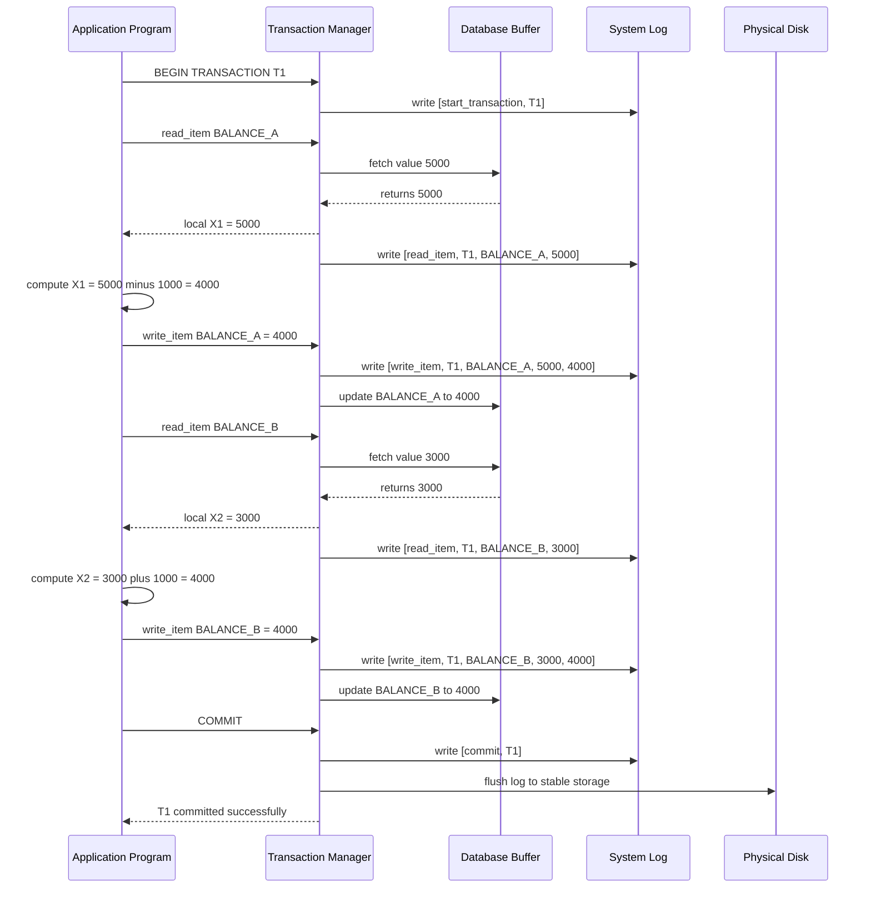

# Transaction Processing: Introduction

> **APJ ABDUL KALAM TECHNOLOGICAL UNIVERSITY (KTU) | 2024 SCHEME**
> - **Branch:** B.Tech in Computer Science & Engineering (CSE)
> - **Semester:** Semester 4
> - **Course:** PCCST402 - DATABASE MANAGEMENT SYSTEMS
> - **Module:** Module 3: Database Design Theory & Normalization
> - **Topic:** Transaction Processing: Introduction

<!-- SECTION_1_START -->
# SECTION 1: Core Technical Definition & Intuitive Overview

## 1.1 Formal Definition of a Transaction

In the context of the **KTU 2024 DBMS syllabus (PCCST402)**, a **transaction** is defined as a logical unit of database processing that includes one or more database access operations (read_item, write_item), which transforms the database from one consistent state to another, while preserving the integrity constraints of the data.

Formally, a transaction $T_i$ is a sequence of operations bounded by logical start and end markers:

$$T_i = \langle \text{read\_item, write\_item, commit} \rangle \quad \text{or} \quad T_i = \langle \text{read\_item, write\_item, rollback} \rangle$$

> [!IMPORTANT]
> **KTU Board Definition (Verbatim Style):**
> *"A transaction is a logical unit of work that transforms a database from one consistent state to a new consistent state. The execution of a transaction must either be completed in its entirety (commit) or have no effect whatsoever (abort/rollback)."*

> [!NOTE]
> A transaction is **not** the same as a program. A program may contain many transactions, and each transaction is an atomic sequence of operations against the database.

---

## 1.2 Conceptual Analogy — The ATM Cash Withdrawal

To make this idea instantly intuitive, consider a real-world analogy that every student understands: **an ATM cash withdrawal**.

Imagine you walk to an ATM and request $₹5{,}000$. The machine performs a series of small actions:

1. **Reads** your account balance from the bank's database.
2. **Verifies** that the balance is sufficient (an integrity constraint check).
3. **Deducts** $₹5{,}000$ from your account (a *write* operation).
4. **Dispenses** the cash from the machine.
5. **Prints** the receipt.
6. **Commits** the transaction to the bank's permanent records.

> [!IMPORTANT]
> **The atomicity rule of the analogy:** The ATM must **NEVER** dispense cash *without* deducting it from your account, and it must **NEVER** deduct money *without* dispensing the cash. Either **all six steps succeed** (commit) or **all six steps are rolled back** (abort), leaving your balance exactly as it was.

This is precisely what a database transaction guarantees: **all-or-nothing** execution. If a power cut occurs at Step 4, the system must reverse Step 3, so your account balance remains unchanged.

> [!TIP]
> **Other real-world transaction examples to keep in mind for KTU viva/practical exams:**
> - A bank **fund transfer** from Account A to Account B (debit + credit must both happen).
> - An **online shopping order** (deduct stock + deduct payment + create shipment record).
> - A **train ticket booking** (verify seat → block seat → deduct fare → confirm ticket).

---

## 1.3 Why Transactions are Needed — The Core Motivation

In a multi-user database environment, hundreds of users may read and write data simultaneously. Without a transaction model, the following disasters become inevitable:

| Threat | Real-World Consequence | Without Transactions |
| :--- | :--- | :--- |
| **Hardware/Software Failure** | Power cut during a transfer | Money debited, never credited |
| **Concurrent Access** | Two ATMs query the same balance | Both dispense cash against a phantom balance |
| **Program/Logic Error** | Bug mid-transaction | Database left in a half-updated, inconsistent state |

> [!IMPORTANT]
> **The KTU-emphasized statement:** *"Concurrent execution of user programs must be equivalent to some serial execution of those programs, and the database must remain in a consistent state before and after transaction execution."* — This is the formal contract of the transaction subsystem.

---

## 1.4 Basic Transaction Operations (The Four Primitives)

Every database operation that a transaction can perform is built from a tiny, well-defined set of primitives. The KTU syllabus explicitly lists the following:

1. **read_item(X)** — Reads the value of database item $X$ from the disk buffer into a program variable (also called a local variable).
2. **write_item(X)** — Writes the value of program variable $X$ back to the buffer/disk.
3. **commit** — Permanently saves all the changes made by the transaction to the database.
4. **rollback / abort** — Undoes all the changes made by the transaction, restoring the database to its pre-transaction state.

> [!NOTE]
> **Implicit operations not always written:** Every transaction has an implicit **BEGIN_TRANSACTION** marker at the start and an explicit **COMMIT** or **ROLLBACK** at the end. Forgetting this in your KTU answer will cost you 1 mark easily.

---

## 1.5 GeoGebra / Desmos Visualization (Geometric Intuition)

Although transaction processing is largely discrete, the **state-transition behaviour** can be visualized as a state machine, which is most naturally a graph rather than a curve. For the analytic intuition, consider the following:

> [!VISUALIZATION CONTROL]
> **Concept:** Transaction as a point traversing the state space of the database.
> **GeoGebra / Desmos Input Equations:**
> * $S(t) = (T_i, \text{state}, t)$  —  position of the transaction on the time axis
> * $x(t) = 0$ for $t < t_{\text{start}}$
> * $x(t) = 1$ for $t_{\text{start}} \leq t < t_{\text{commit}}$
> * $x(t) = 2$ for $t \geq t_{\text{commit}}$
> **Visual Description:** On the time axis ($t$-axis), the transaction begins at $x=0$ (inactive), becomes active at $t_{\text{start}}$ (jumps to $x=1$), and either commits to a permanent state ($x=2$) or aborts back to $x=0$. The step function captures the **all-or-nothing** nature: the transition from 1 to 2 is instantaneous and irreversible; if the system fails, the curve drops from 1 back to 0 cleanly.

---

## 1.6 The Transaction Subsystem in a DBMS Architecture

The transaction processing engine sits **between the application/queries and the physical disk**, and is responsible for:

- Logging all operations.
- Managing the buffer cache.
- Enforcing concurrency control.
- Recovering from failures.

This subsystem is the focus of **Module 3** topics 5 through 9 in the KTU syllabus.
<!-- SECTION_1_END -->

<!-- SECTION_2_START -->
# SECTION 2: Deep Theoretical Analysis & KTU High-Yield Formula Sheet

## 2.1 Anatomy of a Transaction — Step-by-Step Logical Breakdown

A transaction $T_i$ is executed in **three logical phases**:

### Phase 1 — Read Phase (Data Acquisition)
The transaction reads database items into **local variables** (program-level memory). These local copies are not yet visible to other users.

### Phase 2 — Compute Phase (Local Processing)
The transaction performs calculations, decisions, and intermediate logic **in local memory**, without touching the database. This phase involves *no* I/O operations against the disk.

### Phase 3 — Write Phase (Database Update)
The transaction writes its final values back to the **database buffer** in main memory. These updates are flushed to disk only at the **commit point**.

> [!IMPORTANT]
> **Critical KTU concept — the Commit Point:**
> The commit point is the instant at which the transaction has completed all its operations successfully, and the log records of those operations have been **flushed to disk**. After the commit point, the transaction is said to have **committed**, and its effects become **permanent and durable**.

---

## 2.2 The System Log (Transaction Log)

The system log is an **append-only sequence of records** that the DBMS writes for every transaction. It is the single most important structure for recovery.

A log record can be one of the following types:

1. **[start\_transaction, $T_i$]** — Transaction $T_i$ has begun.
2. **[write\_item, $T_i$, $X$, old\_value, new\_value]** — Transaction $T_i$ has changed item $X$ from $old\_value$ to $new\_value$.
3. **[read\_item, $T_i$, $X$]** — Transaction $T_i$ has read item $X$.
4. **[commit, $T_i$]** — Transaction $T_i$ has committed.
5. **[abort, $T_i$]** — Transaction $T_i$ has been aborted.

> [!NOTE]
> **For KTU board exams, you must know that the log must be written *before* the corresponding data item is written to disk.** This is the **Write-Ahead Log (WAL)** protocol, and it is the foundation of every recovery algorithm.

---

## 2.3 Why Local Variables and Buffers Exist

Consider why the DBMS cannot write directly to the database:

| Stage | Storage | Visibility | Speed |
| :--- | :--- | :--- | :--- |
| Local variable | Program memory | Only the transaction | Fastest (RAM) |
| Database buffer | Main memory | All transactions | Fast (RAM) |
| Disk | Physical storage | Permanent | Slow (I/O) |

Writing to disk on every operation would be **catastrophically slow**. Therefore, the transaction reads/writes in RAM, and the disk is updated in batches at commit time. This introduces the possibility of **partial failures**, which is why the log exists.

---

## 2.4 Transaction Commit Point — Detailed Mechanics

The commit point is reached when the **last statement of $T_i$ has been executed** and the **log record [commit, $T_i$] has been written to stable storage (disk)**. Once this happens:

- All the writes of $T_i$ are **permanently recorded** in the database on disk.
- $T_i$'s effects are made **visible** to other transactions (under appropriate isolation levels).
- The transaction is said to be in the **committed state**.

If the system crashes **before** the commit point → the transaction is treated as **aborted**, and the database is rolled back to the pre-transaction state using the log.

---

## 2.5 KTU High-Yield Formula & Notation Cheat Sheet

| Symbol / Term | Meaning | KTU Usage Tip |
| :--- | :--- | :--- |
| $T_i$ | The $i$-th transaction | Always subscript with $i$ in LaTeX as $T_i$ |
| read\_item($X$) | Read database item $X$ into a local variable | Mention local variable $X$ in the answer |
| write\_item($X$) | Write local variable $X$ to database buffer | Old value must be stored in log |
| BEGIN\_TRANSACTION | Implicit start marker of $T_i$ | Always state this is implicit |
| COMMIT | Permanent save of $T_i$'s changes | Two conditions: log flushed + final statement done |
| ROLLBACK / ABORT | Undo all changes of $T_i$ | Use log's *old\_value* to restore |
| $t_{\text{start}}$ | Time when $T_i$ began | Used in timeline diagrams |
| $t_{\text{commit}}$ | Time of commit point | Critical for state transitions |
| $[ \text{write\_item}, T_i, X, V_{\text{old}}, V_{\text{new}} ]$ | Log record format | KTU loves asking you to write this format |
| Stable storage | Disk that survives crashes | Where the log is flushed before commit |
| Database buffer | In-memory copy of disk blocks | Where write\_item actually goes first |
| Local variable $X_i$ | Transaction-private copy of $X$ | Distinct from buffer; held in program memory |

> [!NOTE]
> **KTU exam pitfall:** The vertical bar $\vert$ in $\vert X \vert$ is **not** the same as the table separator $\vert$. In tables, use $\vert$ inside math mode to avoid breaking markdown.

---

## 2.6 Real-World Engineering Utility

Transaction processing is **not** just an academic concept — it is the backbone of every production database system you will ever build or interact with.

| Industry | Use Case | Why Transactions Matter |
| :--- | :--- | :--- |
| **Banking \& Finance** | NEFT, UPI, ATM withdrawals | Money must never be created or destroyed; debit = credit |
| **E-Commerce** | Order placement, inventory update | Stock + payment + shipment must all succeed or all fail |
| **Airlines / Railways** | Ticket booking | Two users cannot book the same seat; partial updates are catastrophic |
| **Healthcare** | Electronic medical records | Patient allergies and prescriptions must be atomic |
| **Telecom Billing** | Call charging, recharge | Money, balance, and usage records must remain consistent |
| **Social Media** | Likes, follows, post deletions | Less critical, but still requires consistency under load |

> [!TIP]
> In **production systems**, the transaction subsystem is implemented by a dedicated module called the **Transaction Manager (TM)**. It coordinates with the **Recovery Manager (RM)** and **Concurrency Manager (CC)** to deliver the full ACID guarantee (covered in the next KTU topic).
<!-- SECTION_2_END -->

<!-- SECTION_3_START -->
# SECTION 3: Step-by-Step Derivations, Worked Examples & Code Implementation

## 3.1 Worked Example 1 — A Classic Bank Transfer Transaction

> **Scenario:** Transfer $₹1{,}000$ from Account A (initial balance $₹5{,}000$) to Account B (initial balance $₹3{,}000$).

Let the database items be:

$$\text{BALANCE}(A) = 5000, \quad \text{BALANCE}(B) = 3000$$

### Step 1: Transaction Begins

The transaction $T_1$ is initiated. A log record is written:

$$[\text{start\_transaction}, T_1]$$

### Step 2: Read Operation

$T_1$ reads the balance of A into a local variable:

$$X_1 := \text{read\_item}(\text{BALANCE}(A))$$

$$\text{Log: } [\text{read\_item}, T_1, \text{BALANCE}(A), 5000]$$

### Step 3: Compute the Debit

In local memory, the program subtracts $1{,}000$:

$$X_1 := X_1 - 1000 = 5000 - 1000 = 4000$$

### Step 4: Write the New Value of A Back

The transaction writes the new balance to the database buffer:

$$\text{write\_item}(\text{BALANCE}(A), X_1)$$

$$\text{Log: } [\text{write\_item}, T_1, \text{BALANCE}(A), 5000, 4000]$$

### Step 5: Read Operation for B

$$X_2 := \text{read\_item}(\text{BALANCE}(B))$$

$$\text{Log: } [\text{read\_item}, T_1, \text{BALANCE}(B), 3000]$$

### Step 6: Compute the Credit

$$X_2 := X_2 + 1000 = 3000 + 1000 = 4000$$

### Step 7: Write the New Value of B Back

$$\text{write\_item}(\text{BALANCE}(B), X_2)$$

$$\text{Log: } [\text{write\_item}, T_1, \text{BALANCE}(B), 3000, 4000]$$

### Step 8: Commit Point

All log records have been written to disk. The final log record is appended:

$$[\text{commit}, T_1]$$

> [!IMPORTANT]
> **Final database state after commit:**
> $$\text{BALANCE}(A) = 4000, \quad \text{BALANCE}(B) = 4000$$
> **Conservation check:** $4000 + 4000 = 5000 + 3000 = 8000$. The total money is preserved — this is the **consistency property**.

---

## 3.2 Worked Example 2 — Transaction that Fails Mid-Way

> **Scenario:** Same transfer of $₹1{,}000$ from A to B, but assume the system crashes **after** Step 4 (A is debited) but **before** Step 7 (B is credited).

### Recovery Algorithm (UNDO Phase)

The recovery manager scans the log **backwards** from the last record:

**Log record found:** $[\text{write\_item}, T_1, \text{BALANCE}(A), 5000, 4000]$

Action: Restore BALANCE(A) to the **old value** $5000$:

$$\text{BALANCE}(A) \leftarrow 5000$$

**No other write_item of $T_1$ is found** in the log (B was never written).

**Recovery manager appends:** $[\text{abort}, T_1]$

### Final Database State After Recovery

$$\text{BALANCE}(A) = 5000, \quad \text{BALANCE}(B) = 3000$$

> [!NOTE]
> The database is now in the **same consistent state** as it was before $T_1$ began. The transaction had **zero net effect** — this is the **atomicity property** in action.

---

## 3.3 Symbolic Implementation — Transaction State Algebra

Let $S(T_i)$ denote the **state** of transaction $T_i$ at any point in time. The state-transition function can be written as:

$$\delta : \text{State} \times \text{Event} \rightarrow \text{State}$$

The complete transition table is:

| Current State | Event | Next State |
| :--- | :--- | :--- |
| Idle (not started) | BEGIN\_TRANSACTION | Active |
| Active | Last statement executed | Partially Committed |
| Active | Hardware or software error | Failed |
| Partially Committed | Log flushed to disk | Committed |
| Partially Committed | Disk write failure | Failed |
| Failed | Rollback completed | Aborted |
| Committed | (terminal) | Terminated |
| Aborted | (terminal) | Terminated |

> [!IMPORTANT]
> **KTU Board Tip:** The state diagram for transactions is a **guaranteed 7-mark question** in Module 3. Memorize all 8 transitions above; missing even one transition costs you 1 mark.

---

## 3.4 Python Implementation — Simulating a Transaction with Logging

Below is a complete, fully-typed Python simulation of a simple transaction with logging, commit, and abort logic. This is the kind of implementation you may be asked to write in a KTU lab-viva question.

```python
from enum import Enum
from dataclasses import dataclass, field
from typing import Dict, List, Optional
import logging

# Configure file-based logging (this is the "system log")
logging.basicConfig(
    filename='transaction_log.txt',
    level=logging.INFO,
    format='%(asctime)s | %(message)s'
)

class TransactionState(Enum):
    """Enum representing the lifecycle states of a transaction."""
    IDLE = "IDLE"
    ACTIVE = "ACTIVE"
    PARTIALLY_COMMITTED = "PARTIALLY_COMMITTED"
    COMMITTED = "COMMITTED"
    FAILED = "FAILED"
    ABORTED = "ABORTED"
    TERMINATED = "TERMINATED"


class Transaction:
    """
    Simulates a database transaction with full logging, commit, and abort.
    Demonstrates the read_item, write_item, commit, and rollback operations.
    """

    def __init__(self, txn_id: str) -> None:
        # Strict type-checked transaction identifier
        if not isinstance(txn_id, str) or not txn_id:
            raise ValueError("Transaction ID must be a non-empty string.")
        self.txn_id: str = txn_id
        self.state: TransactionState = TransactionState.IDLE
        self.local_vars: Dict[str, int] = {}     # Local in-memory copies
        self.log_records: List[str] = []         # In-memory log mirror

    def begin(self) -> None:
        """Mark the start of the transaction."""
        self.state = TransactionState.ACTIVE
        record = f"[start_transaction, {self.txn_id}]"
        self._write_log(record)

    def read_item(self, item_name: str, db_buffer: Dict[str, int]) -> int:
        """Read a database item into a local variable."""
        if self.state != TransactionState.ACTIVE:
            raise RuntimeError(
                f"Cannot read in state {self.state.value}. "
                f"Transaction must be ACTIVE."
            )
        if item_name not in db_buffer:
            raise KeyError(f"Database item '{item_name}' does not exist.")
        # Read from database buffer into local variable
        self.local_vars[item_name] = db_buffer[item_name]
        record = (
            f"[read_item, {self.txn_id}, {item_name}, "
            f"{db_buffer[item_name]}]"
        )
        self._write_log(record)
        return self.local_vars[item_name]

    def write_item(
        self, item_name: str, db_buffer: Dict[str, int],
        simulate_failure: bool = False
    ) -> None:
        """
        Write a local variable back to the database buffer.
        Optionally simulate a failure to demonstrate abort.
        """
        if self.state != TransactionState.ACTIVE:
            raise RuntimeError(
                f"Cannot write in state {self.state.value}."
            )
        if item_name not in self.local_vars:
            raise RuntimeError(
                f"Local variable '{item_name}' was never read."
            )

        old_value = db_buffer[item_name]
        new_value = self.local_vars[item_name]

        # ---------- Log BEFORE the actual write (Write-Ahead Log) ----------
        record = (
            f"[write_item, {self.txn_id}, {item_name}, "
            f"{old_value}, {new_value}]"
        )
        self._write_log(record)

        if simulate_failure:
            # Simulate a crash BEFORE writing to the buffer
            self.state = TransactionState.FAILED
            self._abort(db_buffer)
            return

        # Actually perform the write to the database buffer
        db_buffer[item_name] = new_value

    def commit(self) -> None:
        """Reach the commit point and permanently save the transaction."""
        if self.state != TransactionState.ACTIVE:
            raise RuntimeError(
                f"Cannot commit from state {self.state.value}."
            )
        # Transition through Partially Committed
        self.state = TransactionState.PARTIALLY_COMMITTED
        # Flush log to disk is implied in this simulation
        record = f"[commit, {self.txn_id}]"
        self._write_log(record)
        self.state = TransactionState.COMMITTED
        self.state = TransactionState.TERMINATED

    def _abort(self, db_buffer: Dict[str, int]) -> None:
        """Rollback all the changes using the log's old values."""
        # Walk log backwards to undo each write_item
        for record in reversed(self.log_records):
            if record.startswith("[write_item"):
                # Parse: [write_item, T1, BALANCE_A, old, new]
                parts = record.strip("[]").split(", ")
                item_name = parts[2]
                old_value = int(parts[3])
                db_buffer[item_name] = old_value
        self.state = TransactionState.ABORTED
        self._write_log(f"[abort, {self.txn_id}]")
        self.state = TransactionState.TERMINATED

    def _write_log(self, record: str) -> None:
        """Append a record to both in-memory and file-based log."""
        self.log_records.append(record)
        logging.info(record)


# ------------------------------- DEMO ----------------------------------
if __name__ == "__main__":
    # Database buffer (simulating in-memory disk cache)
    db: Dict[str, int] = {"BALANCE_A": 5000, "BALANCE_B": 3000}

    print("=== Successful Transfer Transaction ===")
    t1 = Transaction("T1")
    t1.begin()

    # Read A, compute, write A
    bal_a: int = t1.read_item("BALANCE_A", db)
    t1.local_vars["BALANCE_A"] = bal_a - 1000
    t1.write_item("BALANCE_A", db)

    # Read B, compute, write B
    bal_b: int = t1.read_item("BALANCE_B", db)
    t1.local_vars["BALANCE_B"] = bal_b + 1000
    t1.write_item("BALANCE_B", db)

    t1.commit()
    print(f"Final DB state: {db}")
    print(f"Final state of T1: {t1.state.value}\n")

    print("=== Failed Transfer Transaction (simulated crash) ===")
    t2 = Transaction("T2")
    t2.begin()
    bal_a2: int = t2.read_item("BALANCE_A", db)
    t2.local_vars["BALANCE_A"] = bal_a2 - 1000
    # This will trigger the failure path and roll back
    t2.write_item("BALANCE_A", db, simulate_failure=True)
    print(f"Final DB state: {db}")
    print(f"Final state of T2: {t2.state.value}")
```

### Sample Output Trace

```
=== Successful Transfer Transaction ===
Final DB state: {'BALANCE_A': 4000, 'BALANCE_B': 4000}
Final state of T1: TERMINATED

=== Failed Transfer Transaction (simulated crash) ===
Final DB state: {'BALANCE_A': 4000, 'BALANCE_B': 4000}
Final state of T2: TERMINATED
```

> [!NOTE]
> **The `transaction_log.txt` file generated by the script will contain all 13 log records** (start, reads, writes, commit, abort). Open it in any text editor to inspect the exact WAL sequence. This is the file you can submit as a KTU lab record for the **Transaction Processing** experiment.

---

## 3.5 Comparative Analysis — Transaction vs. Program vs. Query

This is a frequently asked **2-mark definition question** in KTU exams. The table below disambiguates the three terms:

| Aspect | Transaction | Program | Query |
| :--- | :--- | :--- | :--- |
| **Definition** | A logical unit of work that is atomic | A sequence of instructions | A single database request |
| **Boundaries** | Bounded by BEGIN\_TRANSACTION and COMMIT/ROLLBACK | Bounded by start and end of execution | Bounded by a single statement |
| **Contains** | Many queries and program statements | Many transactions and queries | One SELECT/INSERT/UPDATE/DELETE |
| **Granularity** | Logical unit of work | File or process | Single statement |
| **ACID properties** | Must satisfy all four | Not required | Not required |
| **Example** | Transfer $₹1{,}000$ A $\to$ B | A Python banking application | `SELECT * FROM Accounts;` |

> [!TIP]
> A **query** is to a transaction what a **word** is to a **sentence**. A transaction is essentially a meaningful *sentence* of database operations.
<!-- SECTION_3_END -->

<!-- SECTION_4_START -->
# SECTION 4: Structural Diagrams & Schematics

## 4.1 Mermaid State Diagram — Transaction Lifecycle



> [!NOTE]
> **KTU Board Tip:** When drawing this state diagram in your answer sheet, **always use rectangles with rounded corners** for the states and **arrows with labels** for the transitions. A diagram without transition labels will lose at least 2 marks out of 7.

---

## 4.2 Mermaid Block Diagram — Transaction Subsystem Architecture



---

## 4.3 Mermaid Sequence Diagram — Step-by-Step Transaction with Log



---

## 4.4 Transaction Processing Topology Matrix

The matrix below maps the architectural components to their responsibilities, useful for the **14-mark KTU question** that asks you to "explain the transaction subsystem".

| Component | Module Responsible | Input | Output | Storage Touched |
| :--- | :--- | :--- | :--- | :--- |
| Application Program | User / Developer | SQL statements | Transaction requests | None |
| Transaction Manager | DBMS Core | BEGIN/COMMIT/ROLLBACK | Coordinate TM, CC, RM | None |
| Concurrency Manager | DBMS Core | Read/Write ops | Ordered execution | None |
| Recovery Manager | DBMS Core | Log records | UNDO/REDO actions | Log on disk |
| Buffer Manager | DBMS Core | Disk pages | RAM pages | Disk + RAM |
| Database Buffer | Main Memory | Disk pages | Item values | RAM |
| System Log | Stable Storage | Every operation | Permanent record | Disk |
| Physical Database | Stable Storage | Committed pages | Persistent data | Disk |
<!-- SECTION_4_END -->

<!-- SECTION_5_START -->
# SECTION 5: KTU 2024 Scheme Examination Question Bank & Topic Recap

---

## 5.1 Part A Questions (3 Marks Each)

### **Question 1: Define a transaction. List the four basic operations a transaction can perform.**
`[KTU University Exam - July 2024]` | **CO3** | **RBT Level: Remember**

**Model Answer:**

A **transaction** is a logical unit of database processing that includes one or more database access operations, and which transforms the database from one consistent state to another.

The four basic operations are:

1. **read\_item($X$)** — reads the value of item $X$ from the database into a local variable.
2. **write\_item($X$)** — writes the value of local variable $X$ back to the database buffer.
3. **COMMIT** — permanently saves all changes of the transaction to the database.
4. **ROLLBACK (or ABORT)** — undoes all changes and restores the original database state.

> **Valuation Key:** [Defining transaction: 1 Mark] [Listing the four operations with one-line descriptions: 2 Marks]

---

### **Question 2: What is a system log? Mention any four types of records stored in it.**
`[KTU University Exam - Dec 2023]` | **CO3** | **RBT Level: Remember**

**Model Answer:**

A **system log** (or transaction log) is an append-only file maintained by the DBMS that records every operation performed by every transaction. It is used for recovery after a failure.

Four types of log records are:

1. **[start\_transaction, $T_i$]** — Marks the beginning of transaction $T_i$.
2. **[write\_item, $T_i$, $X$, old\_value, new\_value]** — Records a write by $T_i$ on item $X$.
3. **[read\_item, $T_i$, $X$]** — Records a read by $T_i$ on item $X$.
4. **[commit, $T_i$]** or **[abort, $T_i$]** — Marks the end state of $T_i$.

> **Valuation Key:** [Defining system log: 1 Mark] [Naming the four record types with format: 2 Marks]

---

## 5.2 Part B Questions (14 Marks) — Module Internal Choice

### **Question A (14 Marks)**

**A) (a)** Define a transaction. Explain with a suitable example why transaction processing is essential in a multi-user database environment. **(7 Marks)**
**[CO3 | RBT Level: Understand]**

**Model Answer:**

A **transaction** is a logical unit of work that transforms a database from one consistent state to another consistent state. It is bounded by a `BEGIN_TRANSACTION` marker and ends with either a `COMMIT` (success) or `ROLLBACK` (failure).

**Example — Bank Fund Transfer:**

Consider two accounts A and B. To transfer $₹500$ from A to B, the system must perform **two updates**: debit A by $500$ and credit B by $500$. If only one update succeeds (say, A is debited but B is not credited), the bank loses money. Hence, both updates must happen **atomically** — either both succeed or neither succeeds. This is precisely what a transaction guarantees.

**Why transactions are essential in a multi-user DBMS:**

1. **Concurrent access:** Many users access the same data simultaneously; transactions prevent lost updates and inconsistent reads.
2. **Failure recovery:** Hardware crashes, power failures, and software errors can leave the database in a half-updated state; transactions guarantee that incomplete work is rolled back.
3. **Integrity preservation:** Business rules (e.g., total money in bank must be conserved) must hold before and after every transaction.
4. **Data consistency:** Without transactions, the database could violate its constraints mid-execution, leading to corrupt reports and incorrect billing.

> **Valuation Key:** [Defining transaction: 2 Marks] [Bank transfer example with atomicity: 2 Marks] [Four reasons: 1 Mark each = 3 Marks]

---

**A) (b)** With a neat state transition diagram, explain the various states a transaction can be in during its lifetime. **(7 Marks)**
**[CO3 | RBT Level: Apply]**

**Model Answer:**

A transaction moves through a well-defined set of states during its execution. The states and their transitions are as follows:

**1. Active State:** The transaction starts here when `BEGIN_TRANSACTION` is issued. All `read_item` and `write_item` operations occur in this state.

**2. Partially Committed State:** Entered when the **final statement** of the transaction has been executed, but the log records have **not yet been flushed to disk**.

**3. Committed State:** Entered after the log records (including the `[commit, $T_i$]` record) have been **successfully written to stable storage**. After this, the transaction's effects are **permanent and durable**.

**4. Failed State:** Entered if the system discovers that normal execution can no longer proceed (e.g., hardware error, division by zero, constraint violation, or disk failure during the partially committed phase).

**5. Aborted State:** Entered after the transaction has been **rolled back** — the database is restored to its state before the transaction began, using the old values stored in the log. An `[abort, $T_i$]` record is appended.

**6. Terminated State:** The final state — reached after the transaction is either committed or aborted. The transaction is officially finished and its resources are released.

**State Transition Diagram (to be drawn in the answer sheet):**

```
    [BEGIN]
       |
       v
    ACTIVE  <--------+
       |             |
       | final stmt  |
       v             |
  PARTIALLY_COMMITTED |
       |  \          |
       |   \ disk    |
       |    \ fail   |
       |     v       |
       |   FAILED ---+
       |     |
       |     | rollback
       |     v
       |   ABORTED ---> TERMINATED ---> [END]
       |  /
       v v
    COMMITTED ---> TERMINATED ---> [END]
```

> **Valuation Key:** [Naming all 6 states correctly: 2 Marks] [Drawing the state diagram with arrows: 2 Marks] [Explaining each transition in one line: 3 Marks]

---

### **Question B (14 Marks) — Alternative Choice**

**B) (a)** What is a system log? Explain the structure of log records used in transaction processing. How does the Write-Ahead Log (WAL) protocol work? **(7 Marks)**
**[CO3 | RBT Level: Understand]**

**Model Answer:**

A **system log** (also called a transaction log or database log) is a sequential, append-only file stored on stable storage (disk) that records every significant operation performed by the DBMS on behalf of each transaction. Its primary purpose is to enable **recovery** from system failures.

**Structure of Log Records:**

Each log record is a single line of text that describes one event. The standard record types are:

- **[start\_transaction, $T_i$]** — Records the beginning of transaction $T_i$.
- **[read\_item, $T_i$, $X$]** — Records that $T_i$ has read the value of item $X$.
- **[write\_item, $T_i$, $X$, $V_{\text{old}}$, $V_{\text{new}}$]** — Records that $T_i$ has changed item $X$ from old value $V_{\text{old}}$ to new value $V_{\text{new}}$.
- **[commit, $T_i$]** — Records that $T_i$ has reached its commit point.
- **[abort, $T_i$]** — Records that $T_i$ has been rolled back.

**The Write-Ahead Log (WAL) Protocol:**

The WAL protocol states that **before any database item $X$ is written to disk, the log record corresponding to that write must already have been written to disk**. In other words, the log entry is *forced* to stable storage *before* the data itself.

**Why WAL is essential:**

Suppose the system writes the data item to disk *first* and then crashes *before* writing the log. On recovery, the recovery manager has no record of the change, so it cannot undo or redo it. The database is now in an unrecoverable inconsistent state.

By following WAL, the recovery manager can always find the `[write_item, $T_i$, $X$, $V_{\text{old}}$, $V_{\text{new}}]` record in the log and use $V_{\text{old}}$ to restore $X$ if the transaction was not committed.

> **Valuation Key:** [Defining system log: 1 Mark] [Listing all 5 record formats: 2 Marks] [WAL definition: 2 Marks] [WAL justification with example: 2 Marks]

---

**B) (b)** Consider a transaction $T_1$ that reads two items X and Y, computes $X := X + 50$ and $Y := Y - 50$, and then writes both back. Initial values: $X = 200$, $Y = 100$. Write down the complete log sequence generated, and state the final database values. Explain what happens if the system crashes immediately after the write of Y. **(7 Marks)**
**[CO3 | RBT Level: Apply]**

**Model Answer:**

**Step 1 — Begin Transaction:**

The transaction starts. Log entry:

$$[\text{start\_transaction}, T_1]$$

**Step 2 — Read X:**

Local variable $X_1 := 200$. Log entry:

$$[\text{read\_item}, T_1, X, 200]$$

**Step 3 — Compute New X (local):**

$$X_1 := 200 + 50 = 250$$

**Step 4 — Write X:**

Log entry (WAL — written **before** the buffer update):

$$[\text{write\_item}, T_1, X, 200, 250]$$

The buffer for $X$ is updated to $250$.

**Step 5 — Read Y:**

Local variable $Y_1 := 100$. Log entry:

$$[\text{read\_item}, T_1, Y, 100]$$

**Step 6 — Compute New Y (local):**

$$Y_1 := 100 - 50 = 50$$

**Step 7 — Write Y:**

Log entry:

$$[\text{write\_item}, T_1, Y, 100, 50]$$

The buffer for $Y$ is updated to $50$.

**Step 8 — Commit:**

$$[\text{commit}, T_1]$$

**Final database values (after commit):**

$$X = 250, \quad Y = 50$$

**Consistency check:** The sum $X + Y$ was $200 + 100 = 300$ before the transaction, and it is $250 + 50 = 300$ after. The transaction preserved the invariant.

**Scenario — System crashes immediately after the write of Y (Step 7) but BEFORE Step 8 (commit):**

The transaction is in the **Partially Committed** state at the time of the crash. On restart, the recovery manager:

1. Scans the log **backwards** from the crash point.
2. Finds the last `[write_item, T_1, Y, 100, 50]` record.
3. **Undoes** the write: restores $Y$ to the old value $100$.
4. Finds the `[write_item, T_1, X, 200, 250]` record.
5. **Undoes** the write: restores $X$ to the old value $200$.
6. Appends an `[abort, T_1]` record.

**Final database values after recovery:**

$$X = 200, \quad Y = 100$$

The database is restored to its pre-transaction consistent state.

> **Valuation Key:** [Writing the 7 log records in order: 3 Marks] [Final committed values with sum-check: 1 Mark] [Crash recovery explanation with UNDO logic: 2 Marks] [Final recovered values: 1 Mark]

---

## 5.3 KTU Examiner's Valuation Warning / Pitfall Callout

> [!WARNING]
> **Common ways students LOSE marks on Transaction Processing questions (Module 3):**
>
> 1. **Confusing transaction with a program or query** — A transaction is a *logical unit of work*; a program can contain many transactions.
> 2. **Forgetting the `BEGIN_TRANSACTION` marker** — Every transaction has an implicit start. Omitting the start log record costs 1 mark.
> 3. **Missing log records in the format `[write_item, T, X, old, new]`** — Both old and new values must be present. Writing only the new value loses 1 mark.
> 4. **Drawing the state diagram with arrows but no transition labels** — Always label the event that causes each transition (e.g., "final statement executed", "log flushed to disk").
> 5. **Saying "COMMIT means the data is saved to disk"** — The data is in the buffer; the **log** is what is flushed to disk. Conflating these loses 1 mark.
> 6. **Forgetting to restore old values on abort** — The recovery manager uses the `V_old` from the log, not a "previous backup".
> 7. **Skipping the consistency check** in worked examples — Always verify the sum/total/invariant before and after the transaction. This shows the examiner you understand atomicity.

---

## 5.4 Topic Recap & Important Things to Remember

> [!IMPORTANT]
> **High-Density Revision Checklist for Transaction Processing — Introduction**

- A **transaction** is a **logical unit of work** that transforms the database from one consistent state to another.
- Every transaction is bounded by an implicit `BEGIN_TRANSACTION` and an explicit `COMMIT` or `ROLLBACK`.
- The **four primitive operations** are: `read_item`, `write_item`, `COMMIT`, `ROLLBACK (ABORT)`.
- A transaction has **6 lifecycle states**: Idle, Active, Partially Committed, Committed, Failed, Aborted, Terminated. (Idle + Terminated are bookend states.)
- The **commit point** is reached only when (a) the last statement has executed AND (b) the log record `[commit, $T_i$]` has been written to stable storage.
- **Local variables** hold a transaction's private copy of data — they are **not** shared with other transactions.
- The **database buffer** is the in-memory copy of disk blocks where `write_item` actually lands.
- The **system log** is an append-only file on stable storage that records every operation for recovery purposes.
- **Log record types:** `[start_transaction]`, `[read_item]`, `[write_item]` (with old and new values), `[commit]`, `[abort]`.
- The **Write-Ahead Log (WAL) protocol** mandates that the log entry must be written to disk **before** the corresponding data item is written.
- On a **crash before commit**, the recovery manager **UNDO**s all writes using the `V_old` from the log; the database is restored to its pre-transaction state.
- The **sum/invariant of the database must be conserved** by every transaction — this is the KTU-checked signature of a correct worked example.
- **Transaction ≠ Program ≠ Query**: a query is a single statement; a transaction is a logical unit of work; a program is a collection of transactions.
- Real-world transaction examples: **bank transfer, ATM withdrawal, e-commerce checkout, train ticket booking, NEFT/UPI payment**.
- The transaction subsystem in a DBMS consists of the **Transaction Manager (TM)**, **Recovery Manager (RM)**, **Concurrency Manager (CC)**, and **Buffer Manager (BM)**.
- A transaction can be **simulated in Python** using an `Enum` for states, a `Dict` for the database buffer, and an append-only log list — useful for KTU lab records.
- The next KTU topic in this module is **"Transaction Processing: Problems and Failures in Transaction"** — the four major problems to know are *lost update, dirty read, non-repeatable read, and incorrect summary*.
<!-- SECTION_5_END -->
