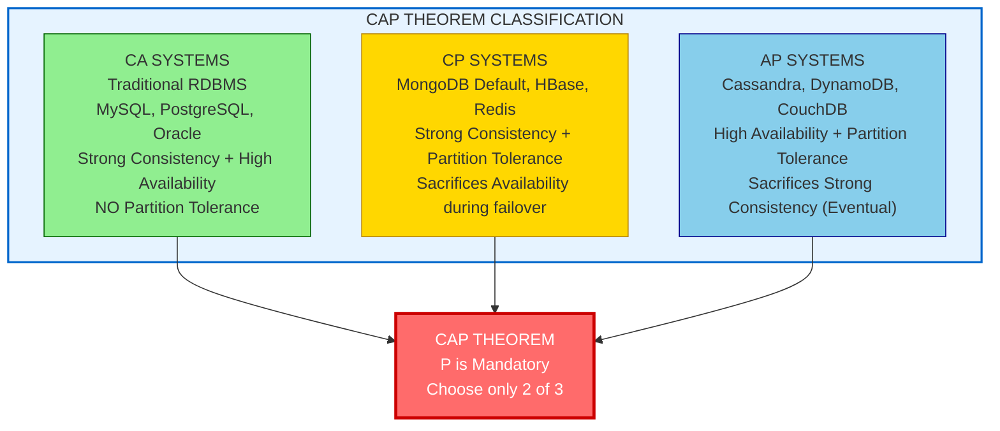
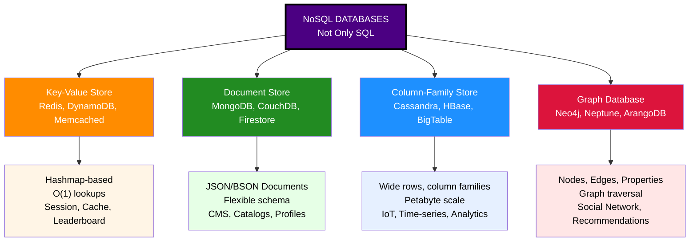
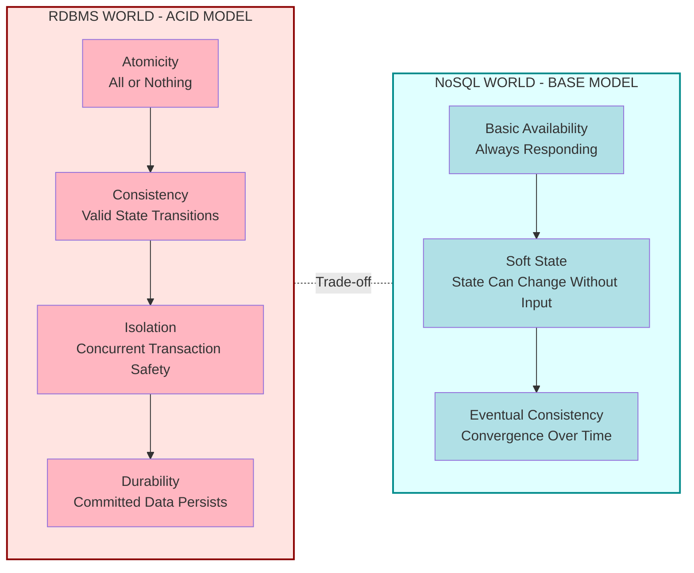
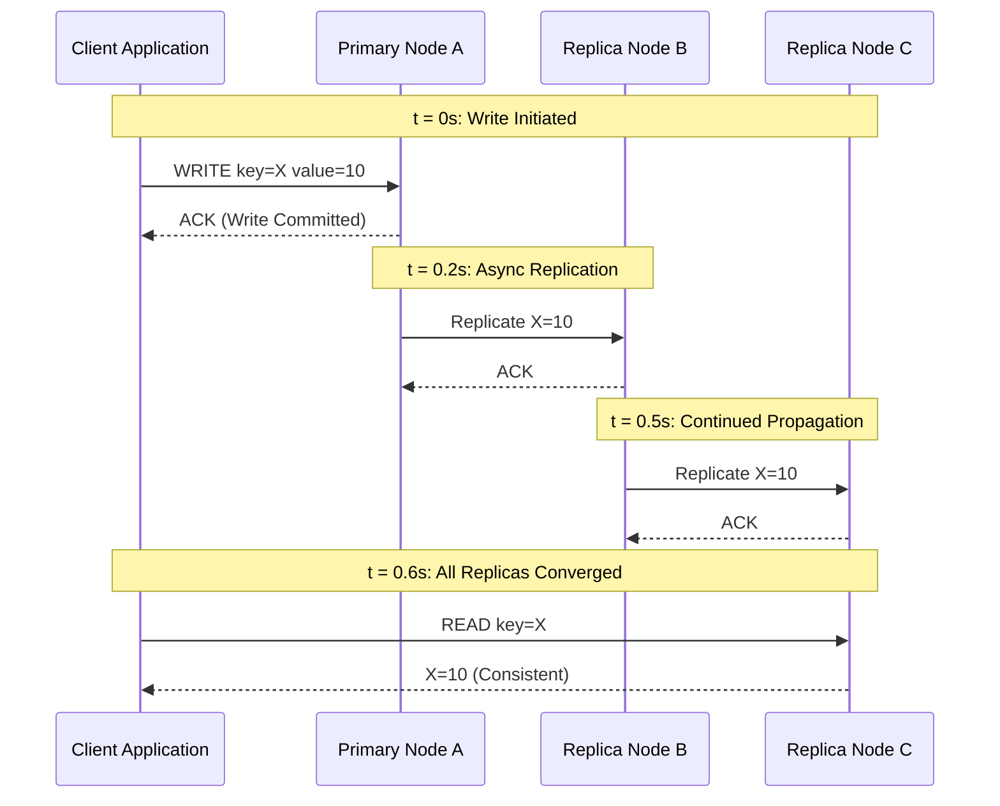
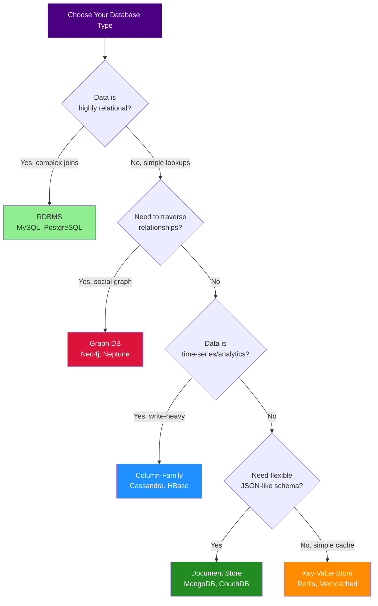

# Introduction To NoSQL Concepts  - types of NoSQL databases- CAP Theorem- BASE properties-  Use Cases and limitations of NoSQL.

<!-- SECTION_1_START -->

# Module 4: Introduction to NoSQL Concepts

## 1. Core Technical Definition & Intuitive Overview

### Formal Academic Definition
**NoSQL (Not Only SQL)** is a class of database management systems that diverge from the traditional relational model to provide flexible, horizontally scalable, and schema-less data storage. Formally, NoSQL databases are defined as *non-relational, distributed, often open-source database systems designed to handle large volumes of unstructured, semi-structured, or rapidly evolving data by relaxing the rigid ACID properties in favor of scalability, performance, and flexibility.*

> [!IMPORTANT]
> **KTU 2024 Syllabus Highlight:** The term NoSQL was first coined by **Carlo Strozzi in 1998** and popularized by **Johan Oskarsson** during a meetup organized by Rackspace in 2009 to discuss distributed, non-relational databases. NoSQL is **NOT** a replacement for SQL — it complements it for specific use cases.

### Conceptual Analogy / Intuition
Imagine a massive library:
- A **SQL database** is like a library where every book must fit a strict pre-defined cataloging system (tables, rows, columns, foreign keys). Adding a new "book type" requires altering the entire system schema.
- A **NoSQL database** is like a modern digital archive where each "item" can be self-describing — a video file, a tweet, a JSON profile, or a sensor reading — all can coexist without enforcing a rigid structure. The system **scales horizontally** by simply adding more servers (commodity hardware) rather than upgrading one giant server (vertical scaling).

> [!NOTE]
> **Core Distinction:** SQL = **Vertical Scaling** (Scale Up). NoSQL = **Horizontal Scaling** (Scale Out across clusters of commodity machines).

### The Four Pillars Driving NoSQL Adoption
1. **Volume** — Petabytes of data generated by IoT, social media, and analytics.
2. **Velocity** — Real-time streaming data at millions of operations per second.
3. **Variety** — Structured, semi-structured, and unstructured data coexisting.
4. **Variability** — Schema evolution on-the-fly without downtime.

These four "V"s are the **Big Data** characteristics that traditional RDBMS struggles to handle.

### Categories of NoSQL Data Models (High-Level Preview)
| NoSQL Type | Data Storage Format | Best Suited For |
|------------|-------------------|-----------------|
| Key-Value | Pairs of unique keys and values | Caching, session management |
| Document | JSON / BSON / XML documents | Content management, catalogs |
| Column-Family | Columns grouped into column families | Analytics, time-series |
| Graph | Nodes, edges, and properties | Social networks, recommendation engines |

### Physical Constants & Standards
- **BASE** — Basic Availability, Soft state, Eventual consistency (the NoSQL counterpart to ACID).
- **CAP** — Consistency, Availability, Partition tolerance (the impossibility theorem by **Eric Brewer, 2000**).
- **WORA** — Write Once, Read Many (common in column stores).

> [!VISUALIZATION CONTROL]
> **Concept:** Scalability Comparison (SQL vs NoSQL)
> **GeoGebra / Desmos Input Equations:**
> * Vertical Line: $x = 1$ (SQL — single powerful server)
> * Horizontal Line: $y = n$ (NoSQL — n commodity nodes)
> **Visual Description:** Plot a coordinate system where the X-axis represents "Data Volume" and Y-axis represents "Query Throughput". Observe how SQL throughput saturates quickly (vertical scaling ceiling), while NoSQL throughput grows linearly (horizontal scaling).

---

<!-- SECTION_1_END -->

<!-- SECTION_2_START -->

## 2. Deep Theoretical Analysis & KTU High-Yield Formula Sheet

### 2.1 Classification of NoSQL Databases — Detailed Taxonomy

#### **A. Key-Value Stores**
- **Data Model:** A simple associative array / hashmap. The key is a unique identifier; the value is an opaque blob (string, JSON, binary).
- **Architecture:** In-memory or on-disk hash tables distributed across nodes using **consistent hashing**.
- **Operations:** `GET(key)`, `PUT(key, value)`, `DELETE(key)`.
- **Examples:** Redis, Amazon DynamoDB, Memcached, Riak.
- **Strengths:** Lightning-fast lookups (sub-millisecond), ideal for session storage and caching layers.
- **Weaknesses:** No complex querying, no joins, no secondary indexes (in most implementations).

#### **B. Document Stores**
- **Data Model:** Documents stored in semi-structured formats like **JSON, BSON, or XML**. Each document can have a different schema.
- **Architecture:** Documents are indexed by a unique key; fields can be indexed independently.
- **Operations:** CRUD operations, plus rich querying (MongoDB Query Language, MQL).
- **Examples:** MongoDB, CouchDB, Amazon DocumentDB, Firebase Firestore.
- **Strengths:** Flexible schema, ideal for hierarchical data (user profiles, blog posts, product catalogs).
- **Weaknesses:** No ACID transactions across documents (in early versions; modern MongoDB supports them).

#### **C. Column-Family (Wide-Column) Stores**
- **Data Model:** Data is organized into **row keys, column families, and column qualifiers** (a sparse, multi-dimensional map). Each row can have different columns.
- **Architecture:** Inspired by **Google BigTable (2006)**. Data is partitioned by row key and stored in SSTables (Sorted String Tables) for fast range scans.
- **Operations:** `Get(row, column_family, column)`, range scans, batched writes.
- **Examples:** Apache Cassandra, HBase, ScyllaDB, Google BigTable.
- **Strengths:** Excellent for write-heavy workloads and time-series data; petabyte-scale storage.
- **Weaknesses:** Limited querying; no joins; no aggregate functions in pure form.

#### **D. Graph Databases**
- **Data Model:** Built on **graph theory** with **nodes** (entities), **edges** (relationships), and **properties** (key-value attributes on both).
- **Architecture:** Optimized for traversing relationships using index-free adjacency.
- **Operations:** Pattern matching, shortest path, subgraph extraction.
- **Examples:** Neo4j, Amazon Neptune, ArangoDB, JanusGraph.
- **Strengths:** Exceptional performance for deeply relational queries (degrees of separation in social networks).
- **Weaknesses:** Not suitable for transactional data; poor at bulk data processing.

> [!NOTE]
> **KTU High-Yield Point:** Of the four types, the **2024 Scheme question bank** most frequently tests Document Stores (MongoDB) and Key-Value stores, followed by Column-Family and Graph databases.

### 2.2 The CAP Theorem (Brewer's Theorem)

#### Formal Statement
> *"In any distributed shared-data system, you can simultaneously guarantee at most **two** out of the following three properties: **C**onsistency, **A**vailability, and **P**artition tolerance."*

Since network partitions are an **inevitable reality** in distributed systems, the practical choice is between **CP** and **AP** systems.

#### The Three Properties

1. **Consistency (C):** Every read receives the **most recent write** or an error. All nodes see the same data at the same time. (Linearizable consistency.)
2. **Availability (A):** Every request receives a (non-error) response — even if the data may not be the latest. The system remains operational 100% of the time.
3. **Partition Tolerance (P):** The system continues to function despite arbitrary network partitions (message loss between nodes). Partition tolerance is **non-negotiable** in any real distributed system.

> [!IMPORTANT]
> **Why Partition Tolerance is Mandatory:** In a distributed system spanning multiple data centers or cloud regions, network failures are guaranteed to occur. A system that cannot tolerate partitions is essentially a single-node system and thus not truly distributed.

#### The CAP Triangle — System Classification

| System Class | Sacrifices | Examples |
|--------------|-----------|----------|
| **CA** (Consistency + Availability) | Cannot tolerate partitions — single-site databases | Traditional RDBMS (PostgreSQL, MySQL) |
| **CP** (Consistency + Partition tolerance) | Sacrifices availability during partitions | HBase, MongoDB (default config), Redis (with replication) |
| **AP** (Availability + Partition tolerance) | Sacrifices strong consistency (offers eventual consistency) | Cassandra, DynamoDB, CouchDB, Riak |

> [!WARNING]
> **KTU Examiner Insight:** A common student mistake is to label MongoDB as "AP". In its **default configuration**, MongoDB is actually **CP** (it pauses writes during a primary failure to elect a new primary). It is AP only when configured with `w:1` write concern and read preference for secondary nodes.

#### Extended CAP — PACELC Theorem
A more nuanced extension by **Daniel Abadi (2012)**:
- **If** Partition occurs → choose between **A**vailability or **C**onsistency.
- **E**lse (no partition) → choose between **L**atency or **C**onsistency.

This means even in normal operation, the system trades off latency for consistency (or vice versa).

### 2.3 BASE Properties (The NoSQL ACID Alternative)

While RDBMS adheres to **ACID** (Atomicity, Consistency, Isolation, Durability), NoSQL systems embrace **BASE**:

| BASE Property | Meaning | Real-World Analogy |
|---------------|---------|---------------------|
| **B**asic **A**vailability | The system guarantees a response to every query — it may not be the latest data, but it is always available. | A news website that shows yesterday's headline if the live feed is down. |
| **S**oft State | The state of the system may change over time, even without new input, due to eventual consistency propagation. | Your email's "read" status may take seconds to sync across all your devices. |
| **E**ventual Consistency | Given enough time (and no further writes), all replicas will converge to the same value. | DNS updates propagating across the internet within 24–48 hours. |

> [!NOTE]
> **ACID vs BASE Comparison Table (High-Yield for KTU):**

| Aspect | ACID (RDBMS) | BASE (NoSQL) |
|--------|--------------|--------------|
| Consistency Model | Strong, immediate | Eventual |
| Availability | May sacrifice during failures | Always available |
| Transaction Scope | Multi-row, multi-table | Limited or single-document |
| Performance | Optimized for complex queries | Optimized for throughput |
| Use Case | Banking, ERP, inventory | Social media, IoT, analytics |
| Schema | Rigid, predefined | Flexible, schema-less |

### 2.4 NoSQL Use Cases and Limitations

#### **Primary Use Cases**
- **Big Data Analytics** — Columnar NoSQL stores like Cassandra handle petabyte-scale analytical queries.
- **Real-Time Web Applications** — Document stores like MongoDB power catalogs, user profiles, and content management.
- **Social Networks** — Graph databases model friend/follower relationships and recommendation engines.
- **IoT and Time-Series Data** — Wide-column stores ingest millions of sensor readings per second.
- **Caching Layers** — Key-Value stores like Redis accelerate web apps by 10x–100x.
- **Content Management** — Document databases store heterogeneous articles, images, and metadata.

#### **Key Limitations**
1. **No Standardized Query Language** — Each NoSQL database has its own API/DSL (MongoDB's MQL, Cassandra's CQL, etc.).
2. **Weaker Consistency Guarantees** — Eventual consistency may be unacceptable for financial applications.
3. **Lack of Mature Tools** — Mature tooling (reporting, BI, backup) is still emerging compared to RDBMS.
4. **Limited Transaction Support** — Multi-document ACID transactions were absent in early NoSQL systems.
5. **Schema Flexibility Trade-off** — Schema-less design can lead to data quality issues and lack of constraints.
6. **Open-Source Fragmentation** — Many projects lack commercial-grade support and long-term stability guarantees.
7. **Not a Universal Replacement** — For complex joins, aggregations, and OLAP workloads, SQL databases still dominate.

### KTU Formula Sheet / Cheat Sheet

| Concept | Formula / Definition | Unit / Notation |
|---------|---------------------|-----------------|
| CAP Theorem | $C + A + P \leq 2$ | Boolean (True/False) |
| Sharding Key Distribution | $H(k) \mod N$ | Hash modulo N nodes |
| Replication Factor | $RF = \frac{\text{Number of Copies}}{\text{Original Copies}}$ | Integer $\geq 1$ |
| Quorum Read | $R + W > N$ (for strong consistency) | Integer |
| Eventual Consistency Time | $T_{ec} \approx \text{latency} \times \log(N)$ | Seconds |
| Horizontal Scalability | $T(n) = T_0 + \frac{L}{n}$ (Amdahl's law) | Throughput vs nodes |
| Brewer's Trade-off | $\text{Properties guaranteed} = \min(2, 3 - P)$ | Cardinality |

> [!IMPORTANT]
> **Quorum Rule of Thumb (KTU Favorite):** For $N$ replicas, set Write Quorum $W$ and Read Quorum $R$ such that $R + W > N$ to ensure strong consistency. Common setting: $N = 3, W = 2, R = 2$.

---

<!-- SECTION_2_END -->

<!-- SECTION_3_START -->

## 3. Step-by-Step Derivations, Code & Symbolic Implementation

### 3.1 Detailed CAP Theorem Proof (Brewer's Intuition)

**Step 1: Assume a partition occurs.** Node A and Node B are disconnected by a network failure.

**Step 2: A client writes "X = 10" to Node A.**

**Step 3: Another client reads from Node B.**

Two design choices emerge:

- **Choose Consistency:** Node B must either return an error (sacrificing **Availability**) or block the read until the partition heals.
- **Choose Availability:** Node B returns its last known value (e.g., "X = 5"), but it is **stale** (sacrificing **Consistency**).

**Conclusion:** You cannot guarantee both C and A during a partition. Therefore, in a distributed system that must tolerate partitions (P), you must choose **one of the other two**.

### 3.2 Worked Example: Quorum Calculation

**Problem:** A Cassandra cluster has $N = 5$ replicas. Determine the minimum write quorum $W$ to guarantee strong consistency with a read quorum of $R = 3$.

**Step 1:** Apply the quorum rule: $R + W > N$

**Step 2:** Substitute the known values: $3 + W > 5$

**Step 3:** Solve for $W$: $W > 2$, so the minimum integer satisfying this is $W = 3$.

**Conclusion:** A write must be acknowledged by at least 3 of 5 replicas, and a read must contact at least 3 replicas, to guarantee that the read set overlaps with the latest write.

### 3.3 Python Implementation: Simulating Eventual Consistency

```python
import time
import random
from typing import Dict, List

class NoSQLReplicatedStore:
    """
    Simulates a distributed key-value store with eventual consistency.
    Demonstrates BASE properties across multiple replicas.
    """

    def __init__(self, node_ids: List[str], propagation_delay_range: tuple = (0.1, 0.5)):
        self.nodes: Dict[str, Dict[str, str]] = {
            node_id: {} for node_id in node_ids
        }
        self.node_ids = node_ids
        self.delay_range = propagation_delay_range

    def write(self, key: str, value: str, origin_node: str) -> None:
        """
        Writes to the origin node synchronously, then asynchronously propagates
        to all other replicas after a simulated network delay.
        """
        # 1. Write to origin node immediately
        self.nodes[origin_node][key] = value
        print(f"[WRITE] Node '{origin_node}' committed: {key} = {value}")

        # 2. Schedule asynchronous propagation to other replicas
        for other_node in self.node_ids:
            if other_node != origin_node:
                delay = random.uniform(*self.delay_range)
                # In a real system, this would be an async network call
                # For simulation, we use time.sleep to mimic the delay
                time.sleep(delay)
                self.nodes[other_node][key] = value
                print(f"[REPLICATE] Node '{other_node}' updated after {delay:.2f}s: {key} = {value}")

    def read(self, key: str, from_node: str) -> str:
        """
        Reads from a specific node. May return stale data during the
        consistency window (demonstrates EVENTUAL CONSISTENCY).
        """
        value = self.nodes[from_node].get(key, "NOT_FOUND")
        print(f"[READ] Node '{from_node}' returns: {key} = {value}")
        return value

    def check_consistency(self, key: str) -> bool:
        """Verifies if all replicas have converged to the same value."""
        values = {node: store.get(key) for node, store in self.nodes.items()}
        unique_values = set(v for v in values.values() if v is not None)
        is_consistent = len(unique_values) <= 1
        print(f"[CONSISTENCY CHECK] {key} -> Values across nodes: {values} | Consistent: {is_consistent}")
        return is_consistent


# ---------------------------------------------------------------
# DEMO EXECUTION
# ---------------------------------------------------------------
if __name__ == "__main__":
    # 1. Initialize a 3-node cluster
    cluster = NoSQLReplicatedStore(node_ids=["NodeA", "NodeB", "NodeC"])

    # 2. Simulate a write to NodeA
    cluster.write("user:101:name", "Ananya_Krishnan", origin_node="NodeA")

    # 3. Immediately read from NodeB (may see stale data)
    print("\n--- Immediate read (before propagation completes) ---")
    cluster.read("user:101:name", from_node="NodeB")

    # 4. Wait for eventual consistency
    time.sleep(1.0)
    print("\n--- Read after propagation delay ---")
    cluster.read("user:101:name", from_node="NodeB")

    # 5. Final consistency verification
    print("\n--- Final Cluster Consistency ---")
    cluster.check_consistency("user:101:name")
```

**Expected Output (Sample):**
```text
[WRITE] Node 'NodeA' committed: user:101:name = Ananya_Krishnan
[REPLICATE] Node 'NodeB' updated after 0.18s: user:101:name = Ananya_Krishnan
[REPLICATE] Node 'NodeC' updated after 0.31s: user:101:name = Ananya_Krishnan
[READ] Node 'NodeB' returns: user:101:name = Ananya_Krishnan
[CONSISTENCY CHECK] user:101:name -> Consistent: True
```

### 3.4 Comparative Lab Matrix: NoSQL vs RDBMS Selection

| Parameter | SQL (RDBMS) | NoSQL | Selection Indicator |
|-----------|-------------|-------|---------------------|
| Data Volume | GB to a few TB | TB to PB | Pick NoSQL for >10 TB |
| Schema | Fixed, predefined | Dynamic, flexible | Pick NoSQL for evolving schemas |
| Transaction Integrity | Full ACID | Limited / eventual | Pick SQL for financial data |
| Read/Write Speed | Thousands QPS | Millions QPS | Pick NoSQL for high throughput |
| Query Complexity | Complex joins, aggregations | Limited, single-document | Pick SQL for analytics |
| Scaling Pattern | Vertical (scale-up) | Horizontal (scale-out) | Pick NoSQL for cloud-native apps |
| Data Relationships | Foreign keys, joins | Denormalized / graph traversal | Pick SQL for normalized OLTP |

### 3.5 Mathematical Derivation: Sharding and Consistent Hashing

In horizontal scaling, data is partitioned across $N$ nodes. The simplest strategy is **modular hashing**:

$$
\text{Node} = H(\text{key}) \mod N
$$

where $H$ is a hash function (e.g., SHA-256, MD5). However, this approach suffers from **massive re-sharding** when $N$ changes. **Consistent hashing** solves this by mapping both keys and nodes onto a circular hash ring of size $2^{32}$ or $2^{64}$, requiring only $K/N$ keys to be remapped on a node addition/removal.

---

<!-- SECTION_3_END -->

<!-- SECTION_4_START -->

## 4. Structural Diagrams & Schematics

### 4.1 The CAP Triangle — System Classification Map



### 4.2 NoSQL Database Types — Hierarchical Architecture



### 4.3 ACID vs BASE — Sequential Processing Topology



### 4.4 Eventual Consistency — Data Propagation Flow



### 4.5 NoSQL Use Case Decision Matrix



---

<!-- SECTION_4_END -->

<!-- SECTION_5_START -->

## 5. KTU 2024 Scheme Examination Question Bank & Topic Recap

### Part A Questions (3 Marks Each)

**Q1. [KTU University Exam - Dec 2023]**
**Define NoSQL databases. List any two advantages of NoSQL over RDBMS.** *(CO1, Remember)*

**Model Answer:**
NoSQL (Not Only SQL) refers to a class of non-relational database management systems designed to handle large volumes of unstructured and semi-structured data with flexible schemas, horizontal scalability, and relaxed consistency guarantees.

**Two advantages over RDBMS:**
1. **Horizontal Scalability:** NoSQL databases scale out by adding commodity servers, whereas RDBMS typically scales vertically by upgrading hardware.
2. **Schema Flexibility:** NoSQL allows dynamic schemas — fields can vary across records without ALTER TABLE operations, enabling rapid application evolution.

*(Expected length: 3-4 lines. Marks awarded: [Definition: 1 Mark] + [Each advantage: 1 Mark])*

---

**Q2. [KTU University Exam - July 2024]**
**Explain the BASE properties of NoSQL databases.** *(CO1, Understand)*

**Model Answer:**
BASE stands for **Basic Availability, Soft state, and Eventual consistency**. It is the relaxation of ACID properties adopted by NoSQL systems:
- **Basic Availability:** The system guarantees a response to every request, even if the data is not the most recent.
- **Soft State:** The system's state may change over time without new input due to asynchronous replication.
- **Eventual Consistency:** All replicas will converge to the same value given enough time without further writes.

*(Expected length: 5-6 lines with all three expansions.)*

---

### Part B Questions (14 Marks) — ESE Module Internal Choice

#### **Question A (14 Marks)** [KTU University Exam - Dec 2023]

**(a)** With a neat diagram, explain the **CAP Theorem**. Discuss how the three properties (Consistency, Availability, Partition Tolerance) cannot be simultaneously guaranteed in a distributed database system. *(7 Marks, CO1, Understand)*

**(b)** Differentiate between **ACID and BASE** properties. State the type of applications that would prefer BASE over ACID with two real-world examples. *(7 Marks, CO2, Apply)*

**Model Solution:**

**(a) CAP Theorem Explanation [7 Marks]:**
- **Statement [1 Mark]:** The CAP theorem (formulated by Eric Brewer in 2000) states that a distributed shared-data system can simultaneously guarantee at most two out of the three properties: Consistency, Availability, and Partition Tolerance.
- **Definitions [2 Marks]:** Consistency means every read returns the most recent write. Availability means every request receives a non-error response. Partition tolerance means the system continues to function despite network partitions.
- **Diagram [2 Marks]:** A triangle with vertices labeled C, A, P, with shaded regions showing CA, CP, and AP systems.
- **Why Partition Tolerance is Mandatory [1 Mark]:** Network failures are inevitable in distributed systems, so P must be assumed.
- **Trade-off Explanation [1 Mark]:** During a partition, the system must choose between returning consistent data (sacrificing availability) or remaining available with potentially stale data (sacrificing consistency).

**Valuation Key:** [Statement: 1 Mark] [Three definitions: 2 Marks] [Triangle diagram: 2 Marks] [Mandatory P explanation: 1 Mark] [Trade-off example: 1 Mark]

**(b) ACID vs BASE Comparison [7 Marks]:**
- **ACID [2 Marks]:** Atomicity (all-or-nothing transactions), Consistency (valid state transitions), Isolation (concurrent transaction safety), Durability (committed data persists).
- **BASE [2 Marks]:** Basic Availability, Soft state, Eventual consistency.
- **Comparison Table [2 Marks]:**
- **Applications preferring BASE [1 Mark]:** Social media platforms (Facebook, Twitter), IoT sensor data ingestion, real-time analytics dashboards, e-commerce product catalogs with millions of SKUs.

> [!WARNING]
> **KTU Examiner's Pitfall Callout:** Do NOT confuse ACID's "Consistency" with CAP's "Consistency". ACID Consistency refers to **database constraint integrity**, while CAP Consistency refers to **linearizable read/write semantics across distributed nodes**. Writing the wrong definition will cost you 2 marks.

---

#### **Question B (14 Marks)** [KTU University Exam - July 2024] — Alternative Choice

**(a)** Classify the **four major types of NoSQL databases** with one real-world example for each. Explain the data model and a suitable use case for each. *(7 Marks, CO1, Understand)*

**(b)** Discuss the **key use cases and limitations** of NoSQL databases. Justify when a project should choose NoSQL over traditional RDBMS. *(7 Marks, CO2, Apply)*

**Model Solution:**

**(a) Four Types of NoSQL Databases [7 Marks]:**

| Type | Data Model | Example | Use Case | Marks |
|------|------------|---------|----------|-------|
| **Key-Value** | Hashmap of unique keys to opaque values | Redis | Session caching, shopping cart | 1.5 |
| **Document** | JSON/BSON semi-structured documents | MongoDB | Content management, user profiles | 1.5 |
| **Column-Family** | Sparse multi-dimensional map with column families | Cassandra | IoT time-series, log analytics | 2.0 |
| **Graph** | Nodes, edges, and properties | Neo4j | Social network friend graphs, fraud detection | 2.0 |

**Valuation Key:** [Each type correctly explained with model + example + use case: ~1.75 Marks each]

**(b) Use Cases and Limitations [7 Marks]:**

**Use Cases [3.5 Marks]:**
1. Big data analytics at petabyte scale (Cassandra, HBase).
2. Real-time web applications with flexible schemas (MongoDB).
3. Social network relationship modeling (Neo4j).
4. IoT sensor data ingestion and time-series storage.
5. Caching and session management layers (Redis).

**Limitations [3.5 Marks]:**
1. Lack of standardized query language across vendors.
2. Weaker consistency (eventual consistency may be unacceptable for banking).
3. Limited or no multi-document ACID transactions.
4. Immature tooling for reporting, BI, and backup.
5. Schema-less design can lead to data quality issues.
6. Not suitable for complex joins and OLAP aggregations.

---

> [!WARNING]
> **KTU Examiner's Valuation Warning / Pitfall Callout:**
> - **Do NOT** write "MongoDB is an AP system" without specifying the configuration. By default, MongoDB is **CP**; it is AP only with specific write/read concerns.
> - **Do NOT** state "NoSQL is faster than SQL" as a blanket statement. NoSQL is faster for **specific workloads** (write-heavy, high-throughput). For complex relational queries, SQL is often faster.
> - **Always** mention the CAP trade-off explicitly in your answers — vague answers like "NoSQL is scalable" without referencing the CAP triangle will not fetch full marks.
> - **Avoid** confusing "Partition Tolerance" with "Data Partitioning/Sharding". They are entirely different concepts.

---

### Topic Recap & Important Things to Remember

> [!IMPORTANT]
> **Rapid Revision Checklist for KTU 2024 Module 4:**

- **NoSQL Definition:** Non-relational, distributed, schema-flexible databases designed for horizontal scalability. Coined by Carlo Strozzi (1998), popularized in 2009.
- **Four Big Data V's:** Volume, Velocity, Variety, Variability — the driving forces behind NoSQL adoption.
- **Four NoSQL Types:** Key-Value, Document, Column-Family, Graph — each optimized for different data shapes and access patterns.
- **CAP Theorem (Brewer, 2000):** $C + A + P \leq 2$. Since P is mandatory, systems are classified as **CA, CP, or AP**.
- **CA Systems:** Traditional RDBMS (MySQL, PostgreSQL). Not truly distributed.
- **CP Systems:** MongoDB (default), HBase, Redis Cluster. Sacrifices availability during partitions.
- **AP Systems:** Cassandra, DynamoDB, CouchDB. Sacrifices strong consistency for availability.
- **BASE Properties:** **B**asic **A**vailability, **S**oft state, **E**ventual consistency — the NoSQL counterpart to ACID.
- **ACID vs BASE:** ACID = strong consistency, rigid transactions, vertical scaling. BASE = eventual consistency, flexible schema, horizontal scaling.
- **PACELC Extension:** If Partition → choose A or C; Else (no partition) → choose Latency or Consistency.
- **Quorum Rule:** $R + W > N$ ensures strong consistency in replicated systems.
- **Key Use Cases:** Big data analytics, real-time web apps, social networks, IoT, caching, content management.
- **Key Limitations:** No standard query language, weaker consistency, limited transactions, schema-less risks, immature tooling, not a universal replacement.
- **High-Yield Examples:** Redis (KV), MongoDB (Doc), Cassandra (Column), Neo4j (Graph).
- **Eventual Consistency:** All replicas converge to the same value given enough time and no further writes.
- **Consistent Hashing:** Minimizes data reshuffling when nodes are added/removed in a distributed cluster.

---

<!-- SECTION_5_END -->
