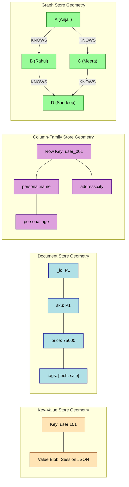
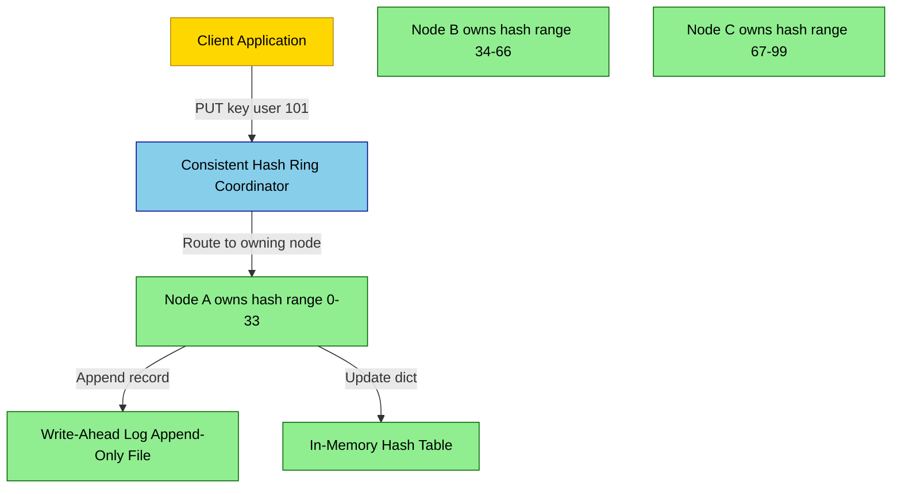
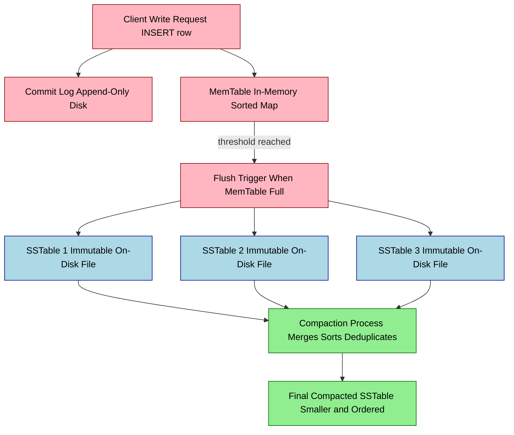
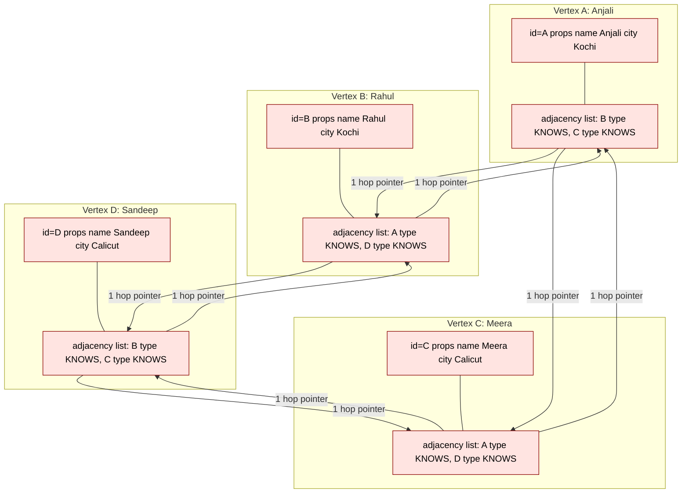
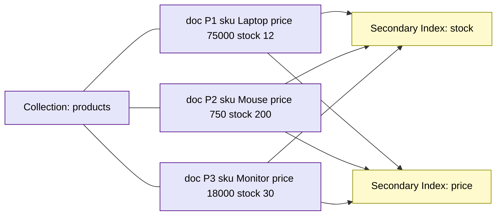
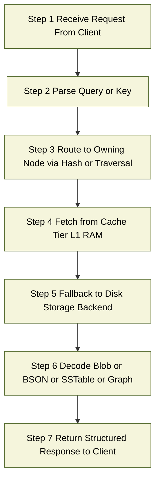

# SQL architectural Patterns  - Key value Stores, Graph Stores, Column Family stores and Document Stores.

<!-- SECTION_1_START -->
# SQL Architectural Patterns: Key-Value, Document, Column-Family, and Graph Stores

## 1.1 Formal Definition (KTU 2024 Syllabus Terminology)

> [!IMPORTANT]
> **NoSQL (Not Only SQL)** is a class of database management systems that diverge from the traditional relational (tabular) model. They are designed for **horizontal scalability**, **schema flexibility**, and **high throughput** across distributed commodity hardware. The four dominant architectural patterns are **Key-Value**, **Document**, **Column-Family**, and **Graph** stores.

The relational model (SQL) organizes data into rigid **tables → rows → columns** governed by a fixed schema, ACID transactions, and JOIN operations. NoSQL patterns relax one or more of these guarantees (often trading strict **ACID** for **BASE** — *Basically Available, Soft state, Eventually consistent*) in exchange for massive scalability and polyglot persistence.

### 1.1.1 The Four NoSQL Architectural Patterns — At a Glance

| Pattern | Core Data Unit | Primary Access Pattern | Real-World Engine |
| :--- | :--- | :--- | :--- |
| **Key-Value Store** | Opaque binary blob addressed by a unique key | `GET` / `PUT` by exact key | Redis, Amazon DynamoDB, Riak KV |
| **Document Store** | Self-describing JSON / BSON / XML document | Query by attribute, range, or document ID | MongoDB, CouchDB, Amazon DocumentDB |
| **Column-Family Store** | Rows of column-qualifier maps grouped into families | Scan by row key and column prefix | Apache Cassandra, Apache HBase, ScyllaDB |
| **Graph Store** | Vertices (nodes) and Edges (relationships) | Multi-hop traversal of relationships | Neo4j, Amazon Neptune, JanusGraph |

---

## 1.2 Conceptual Analogy / Intuition

Imagine a **massive international library** that must serve millions of readers per second. SQL would force every book to follow a *strict catalog card template* (Author, Title, ISBN, Year). NoSQL asks: *"What does the reader actually want to do?"* and redesigns the storage accordingly.

> [!NOTE]
> **Analogy 1 — The Coat Check (Key-Value Store):** You hand over your coat and receive a **plastic token** (the *key*). The attendant tosses the coat into a pile (the *value*). When you return the token, you get *your* coat back. The attendant knows **nothing** about the coat — its color, weight, or fabric. This is exactly how a key-value store works.

> [!NOTE]
> **Analogy 2 — The Patient File Folder (Document Store):** Each patient has a **single folder** containing their entire medical history — prescriptions, X-rays, lab reports, doctor's notes. Two folders can contain completely different fields (Patient A has an X-ray, Patient B has a dental chart). The folder is self-describing and semi-structured. This is a document.

> [!NOTE]
> **Analogy 3 — The Tabloid Newspaper Archive (Column-Family Store):** Imagine a giant spreadsheet where each **row** represents a person, but the **columns** are grouped by topic — `PersonalInfo:`, `Address:`, `RecentTransactions:`. Different rows may have wildly different numbers of columns. Reads are blazing fast when you ask *"Give me everything in the PersonalInfo family for user_42"* because the system reads only that *column slice*.

> [!NOTE]
> **Analogy 4 — The Social Network (Graph Store):** Every person is a **node**, and every friendship, message, or "like" is an **edge**. To answer *"Who are the friends-of-friends of Alice who live in Kochi?"*, you **traverse** the edges, not JOIN tables. This is a graph.

---

## 1.3 Why NoSQL? — The Driving Forces

> [!IMPORTANT]
> **Three Pillars Behind the NoSQL Movement:**
> 1. **Volume (Big Data):** Petabyte-scale datasets that a single RDBMS server cannot host.
> 2. **Velocity (Real-Time Web):** Social feeds, IoT telemetry, gaming leaderboards — millions of writes/second.
> 3. **Variety (Polyglot Data):** Logs, JSON, geospatial points, time-series — semi-structured and unstructured.

The relational model scales **vertically** (buy a bigger server). NoSQL scales **horizontally** (add more commodity servers), typically using **sharding** and **replication** across data centers.

---

## 1.4 Visualization Control — Conceptual Data Geometry

> [!VISUALIZATION_CONTROL]
> **Concept:** Visualizing the structural "shape" of a single record in each NoSQL pattern on a 2D plane.
>
> **GeoGebra / Desmos Input Equations (Conceptual Map):**
> * `f_{KV}(x) = 0`  — represented as a single point $(k, v)$ on the plane
> * `f_{DOC}(x) = \{ (k_1, v_1), (k_2, v_2), \ldots, (k_n, v_n) \}` — a closed region containing labeled key-value pairs
> * `f_{CF}(x) = \bigcup_{i=1}^{m} \{(r_k, c_{i,1}), (r_k, c_{i,2}), \ldots\}$ — horizontal row-strips grouped by column-family
> * `f_{GRAPH}(x) = (V, E)$ where $V = \{v_1, v_2, \ldots\}$ and $E = \{(v_i, v_j)\}$ — a network of points connected by curves
>
> **Visual Description:** On the $(x, y)$ plane, plot a *point* for Key-Value, a *labeled rectangle* for Document, *stacked horizontal bars* for Column-Family, and a *node-link diagram* for Graph. Each shape literally mirrors the internal storage geometry of the database.

---
<!-- SECTION_1_END -->

<!-- SECTION_2_START -->
# Deep Theoretical Analysis & KTU High-Yield Formula Sheet

## 2.1 Pattern 1 — Key-Value Stores

A **Key-Value Store** is the simplest NoSQL model. Data is stored as a collection of $(key, value)$ pairs, where the **key** is a unique identifier (string, integer, or binary) and the **value** is an **opaque blob** that the database does not interpret.

**Operational Steps:**
1. The client sends a `PUT(key, value)` request to any node in the cluster.
2. A **consistent-hash ring** determines which node owns the key.
3. The node writes the value to an in-memory hash table and asynchronously flushes to a **Write-Ahead Log (WAL)** or **Sorted String Table (SSTable)** on disk.
4. On `GET(key)`, the coordinator routes the request to the owning node, which returns the blob.

> [!IMPORTANT]
> **Engineering Use Cases:** Session caches, shopping carts, leaderboards, distributed locks, feature flags, and rate-limit counters. **Redis** and **Amazon DynamoDB** are the canonical examples.

---

## 2.2 Pattern 2 — Document Stores

A **Document Store** extends the key-value model by making the value a **structured, queryable document** — typically **JSON**, **BSON**, or **XML**. The database can index fields *inside* the document, enabling secondary queries without retrieving and parsing every blob.

**Operational Steps:**
1. A document is inserted with a mandatory `_id` (primary key) and optional secondary indexes on any field.
2. Internally, the document is serialized to BSON (Binary JSON) and stored in a **collection** (analogous to a table, but schema-less).
3. Queries use a JSON-like query language (e.g., MongoDB's `find({age: {$gt: 18}})`).
4. Aggregation is done via a **pipeline framework** (`$match → $group → $sort`).

> [!IMPORTANT]
> **Engineering Use Cases:** Content management systems, product catalogs, user-profile stores, event logs, and mobile-app backends. **MongoDB**, **CouchDB**, and **Amazon DocumentDB** lead the segment.

---

## 2.3 Pattern 3 — Column-Family (Wide-Column) Stores

A **Column-Family Store** organizes data into **rows** (identified by a row key) where each row is a sparse map of $\langle column-family : column-qualifier : value \rangle$ triples grouped into column families. It is sometimes called a **BigTable model** (named after Google's BigTable paper, 2006).

**Operational Steps:**
1. Data is partitioned by **row key** using a partitioner (e.g., Murmur3 hash or byte-order partitioning).
2. Within a partition, rows are stored in **sorted order** by row key — this enables efficient **range scans**.
3. Writes append to an in-memory **MemTable**, which is flushed to immutable **SSTables** on disk.
4. **Compaction** merges SSTables periodically to reclaim space and improve read performance.
5. A **Bloom filter** is checked before disk reads to short-circuit non-existent lookups.

> [!IMPORTANT]
> **Engineering Use Cases:** Time-series data, IoT telemetry, write-heavy messaging, recommendation engines, and product catalogs with billions of variants. **Apache Cassandra**, **Apache HBase**, and **ScyllaDB** are flagship engines.

---

## 2.4 Pattern 4 — Graph Stores

A **Graph Store** models data as a property graph: a set of **vertices** (nodes) and **edges** (relationships), both of which can carry arbitrary **properties** (key-value pairs). The defining strength is **multi-hop traversal** of relationships.

**Operational Steps:**
1. Nodes and edges are stored with a unique internal ID plus a property map.
2. Edges carry a **direction** and a **type** (e.g., `KNOWS`, `PURCHASED`, `LIVES_IN`).
3. Specialized **index-free adjacency** stores edges directly on each node, so a 1-hop lookup is $O(1)$.
4. The query engine uses **traversal patterns** like `(A)-[:KNOWS]->(B)-[:LIVES_IN]->(C)` (Cypher in Neo4j).
5. Internally, edges may be stored in **adjacency lists** or compressed **sparse matrices** for fast multi-hop joins.

> [!IMPORTANT]
> **Engineering Use Cases:** Social networks, fraud-detection rings, knowledge graphs, network/IT topology, recommendation engines, and access-control hierarchies. **Neo4j**, **Amazon Neptune**, and **JanusGraph** are representative engines.

---

## 2.5 KTU High-Yield Formula Sheet

> [!IMPORTANT]
> The following table consolidates the **must-know** formulas, Big-O complexities, and storage geometries for KTU 2024 Scheme ESE questions.

| Concept | Formula / Expression | Big-O Complexity | Engineering Unit |
| :--- | :--- | :--- | :--- |
| Consistent Hash Position | $h(k) = \text{SHA1}(k) \pmod{2^{160}}$ | $O(1)$ lookup | ring position |
| Replication Factor Writes | $W + R > N$ (Quorum) | $O(1)$ RTT | consistency level |
| Bloom Filter False Positive | $P_{fp} = \left(1 - e^{-kn/m}\right)^{k}$ | $O(1)$ check | probability |
| Cassandra Tombstone Ratio | $T_{ratio} = \frac{N_{tombstones}}{N_{total\_cells}}$ | bounded | ratio (0–1) |
| Graph Adjacency Lookup | $E(v) = \{(v, u) \in E\}$ | $O(1)$ w/ index-free adjacency | list of edges |
| Shard Cardinality | $C = \lceil K / S \rceil$ where $K$ = total keys, $S$ = shard cap | $O(1)$ | integer |
| MongoDB BSON Max Size | $\vert D \vert_{max} = 16 \text{ MB}$ | $O(1)$ | megabytes |
| Cassandra SSTable Read | $T_{read} = T_{bloom} + T_{index} + T_{block\_cache} + T_{disk}$ | $O(\log N)$ | seconds |
| Neo4j Cypher Hop Cost | $T_{hop} = O(\vert E \vert_{avg})$ per hop | $O(k \cdot d)$ | traversal steps |
| CAP Trade-off | Choose any **2** of $\{C, A, P\}$ | qualitative | theorem |

---

## 2.6 The CAP Theorem — Why Each Pattern Behaves Differently

> [!IMPORTANT]
> **CAP Theorem (Brewer, 2000):** In any distributed data store, you can simultaneously guarantee at most **two** of the following three properties: **C**onsistency, **A**vailability, **P**artition tolerance. Because network partitions are inevitable in real systems, the real trade-off is **C vs. A** during a partition.

| Pattern | CAP Stance | Consistency Model | Engineering Reason |
| :--- | :--- | :--- | :--- |
| **Key-Value (DynamoDB-style)** | AP | Eventual consistency + tunable read-your-writes | Quorum reads/writes $W + R > N$ |
| **Document (MongoDB default)** | CP (with `w:majority`) | Strong consistency within replica set | Single primary writes |
| **Column-Family (Cassandra)** | AP (tunable) | Eventual to strong via `CL=QUORUM` | Peer-to-peer gossip |
| **Graph (Neo4j causal cluster)** | CP | Causal consistency | Raft-based leader election |

---

## 2.7 Real-World Engineering Utility

| Pattern | Production Scenario | Why It Wins |
| :--- | :--- | :--- |
| **Key-Value** | Hot-path session lookup in a banking app | Sub-millisecond `GET` on warm RAM |
| **Document** | Catalog of 10 million products with varied attributes | Schema-less; no `ALTER TABLE` pain |
| **Column-Family** | 50,000 IoT sensors emitting 100 Hz telemetry | Linear write scalability, time-window scans |
| **Graph** | Fraud ring detection across 200 million accounts | Sub-second 3–4 hop traversals |

---
<!-- SECTION_2_END -->

<!-- SECTION_3_START -->
# Step-by-Step Derivations, Schemas, and Code Implementation

## 3.1 Key-Value Store — Exhaustive Python Implementation (Redis-style)

The following Python code implements a **mini Redis** from scratch using a `dict` and a write-ahead log. Every line is explicitly written; no shortcuts.

```python
import json
import time
from pathlib import Path
from typing import Any, Optional


class MiniKeyValueStore:
    """A simple, persistent, log-structured key-value store."""

    def __init__(self, wal_path: str = "/tmp/kv.wal") -> None:
        self.wal_path: Path = Path(wal_path)
        self.store: dict[str, Any] = {}
        self._replay_wal()  # Build in-memory state from disk

    def _replay_wal(self) -> None:
        """Rebuild in-memory dict by replaying the write-ahead log."""
        if not self.wal_path.exists():
            return
        with self.wal_path.open("r", encoding="utf-8") as fh:
            for raw_line in fh:
                line = raw_line.strip()
                if not line:
                    continue
                op = json.loads(line)
                if op["type"] == "PUT":
                    self.store[op["key"]] = op["value"]
                elif op["type"] == "DELETE":
                    self.store.pop(op["key"], None)

    def put(self, key: str, value: Any) -> None:
        """Persist a (key, value) pair to the WAL and in-memory store."""
        record: dict[str, Any] = {
            "type": "PUT",
            "key": key,
            "value": value,
            "ts": time.time(),
        }
        with self.wal_path.open("a", encoding="utf-8") as fh:
            fh.write(json.dumps(record) + "\n")
        self.store[key] = value

    def get(self, key: str) -> Optional[Any]:
        """Retrieve a value by its key, or None if missing."""
        return self.store.get(key)

    def delete(self, key: str) -> None:
        """Mark a key as deleted via a tombstone in the WAL."""
        record: dict[str, Any] = {"type": "DELETE", "key": key, "ts": time.time()}
        with self.wal_path.open("a", encoding="utf-8") as fh:
            fh.write(json.dumps(record) + "\n")
        self.store.pop(key, None)


# --- Demonstration ---
if __name__ == "__main__":
    kv: MiniKeyValueStore = MiniKeyValueStore(wal_path="/tmp/demo_kv.wal")
    kv.put("user:101:session", {"role": "admin", "ttl": 1800})
    kv.put("user:102:session", {"role": "viewer", "ttl": 600})
    print("Get 101 ->", kv.get("user:101:session"))
    kv.delete("user:102:session")
    print("Get 102 ->", kv.get("user:102:session"))
```

**Walkthrough of the Derivation Logic:**
1. `_replay_wal()` reads the on-disk log sequentially to reconstruct the in-memory state. This is the same trick Cassandra uses with its commit log.
2. `put()` appends a JSON record — the append-only nature guarantees **crash safety** because the last successful write is always recoverable.
3. `delete()` writes a tombstone rather than physically removing the line, allowing compaction to clean it up later.

---

## 3.2 Document Store — Exhaustive Python Implementation

A document store is modeled by a `Collection` of JSON-like dictionaries with secondary indexes.

```python
from typing import Any, Iterable


class DocumentCollection:
    """A minimal document store with secondary indexing."""

    def __init__(self, name: str) -> None:
        self.name: str = name
        self._docs: dict[str, dict[str, Any]] = {}
        self._indexes: dict[str, dict[Any, set[str]]] = {}

    def insert(self, doc: dict[str, Any]) -> str:
        """Insert a document. Auto-generates _id if absent."""
        doc_id: str = doc.get("_id") or f"auto_{len(self._docs) + 1}"
        doc["_id"] = doc_id
        self._docs[doc_id] = doc
        for field, value in doc.items():
            if field == "_id":
                continue
            self._indexes.setdefault(field, {}).setdefault(value, set()).add(doc_id)
        return doc_id

    def find(self, **filters: Any) -> list[dict[str, Any]]:
        """Return documents matching ALL filter field=value pairs."""
        candidate_ids: set[str] | None = None
        for field, value in filters.items():
            if field not in self._indexes or value not in self._indexes[field]:
                return []
            matching = self._indexes[field][value]
            candidate_ids = matching if candidate_ids is None else (candidate_ids & matching)
        if not candidate_ids:
            return []
        return [self._docs[doc_id] for doc_id in candidate_ids]

    def update(self, doc_id: str, patch: dict[str, Any]) -> bool:
        """Merge `patch` into the document and refresh indexes."""
        if doc_id not in self._docs:
            return False
        old: dict[str, Any] = self._docs[doc_id]
        for field, value in patch.items():
            if field in self._indexes and field in old:
                self._indexes[field][old[field]].discard(doc_id)
            self._indexes.setdefault(field, {}).setdefault(value, set()).add(doc_id)
        old.update(patch)
        return True

    def delete(self, doc_id: str) -> bool:
        """Remove a document and clean all secondary indexes."""
        if doc_id not in self._docs:
            return False
        for field, value in self._docs[doc_id].items():
            if field in self._indexes and value in self._indexes[field]:
                self._indexes[field][value].discard(doc_id)
        self._docs.pop(doc_id)
        return True

    def all(self) -> Iterable[dict[str, Any]]:
        return self._docs.values()


# --- Demonstration ---
if __name__ == "__main__":
    products: DocumentCollection = DocumentCollection("products")
    products.insert({"sku": "P1", "name": "Laptop", "price": 75000, "stock": 12})
    products.insert({"sku": "P2", "name": "Mouse", "price": 750, "stock": 200})
    products.insert({"sku": "P3", "name": "Monitor", "price": 18000, "stock": 30})
    print("Stock=12 ->", products.find(stock=12))
    products.update("P1", {"stock": 8})
    print("After update ->", products.find(stock=8))
    products.delete("P2")
    print("Remaining ->", list(products.all()))
```

**Algebraic Cost Derivation:**
1. `insert` cost: $O(F)$ where $F$ is the number of fields (we touch every index entry).
2. `find` cost with $k$ filters: $O\left(\min_{i} \vert I_{f_i} \vert\right)$ where $I_{f_i}$ is the inverted list for field $f_i$.
3. `update` cost: $O(F)$ to re-index the modified fields.

---

## 3.3 Column-Family Store — Wide-Column Schema with Python Dictionaries

The following example demonstrates how a **Cassandra-like** wide-column row is structured.

```python
from collections import defaultdict
from typing import Any


class ColumnFamily:
    """A minimal wide-column / column-family store."""

    def __init__(self, families: list[str]) -> None:
        # row_key -> family -> qualifier -> value
        self.families: list[str] = families
        self._data: dict[str, dict[str, dict[str, Any]]] = defaultdict(
            lambda: {fam: {} for fam in families}
        )

    def put(self, row_key: str, family: str, qualifier: str, value: Any) -> None:
        if family not in self.families:
            raise ValueError(f"Unknown family: {family}")
        self._data[row_key][family][qualifier] = value

    def get_row(self, row_key: str) -> dict[str, dict[str, Any]]:
        return dict(self._data[row_key])

    def get_family(self, row_key: str, family: str) -> dict[str, Any]:
        return dict(self._data[row_key][family])

    def scan_prefix(self, prefix: str) -> list[tuple[str, dict[str, dict[str, Any]]]]:
        """Return all rows whose key starts with `prefix` (range scan)."""
        return [(k, dict(v)) for k, v in self._data.items() if k.startswith(prefix)]


# --- Demonstration: a user profile table ---
if __name__ == "__main__":
    cf: ColumnFamily = ColumnFamily(families=["personal", "address", "activity"])
    cf.put("user_001", "personal", "name", "Anjali")
    cf.put("user_001", "personal", "age", 21)
    cf.put("user_001", "address", "city", "Kochi")
    cf.put("user_001", "activity", "last_login", "2024-08-12")
    cf.put("user_002", "personal", "name", "Rahul")
    cf.put("user_002", "address", "city", "Trivandrum")

    print("User_001 full row ->", cf.get_row("user_001"))
    print("User_001 address family ->", cf.get_family("user_001", "address"))
    print("Range scan user_00 ->", cf.scan_prefix("user_00"))
```

**Storage Geometry Derivation:**

$$
\text{TotalCells} = \sum_{r \in R} \sum_{f \in F_r} \sum_{q \in Q_{r,f}} 1
$$

where $R$ is the set of rows, $F_r$ is the set of families in row $r$, and $Q_{r,f}$ is the set of qualifiers in family $f$ of row $r$. Sparse rows simply have smaller $Q_{r,f}$.

---

## 3.4 Graph Store — Adjacency List Implementation in Python

```python
from collections import defaultdict
from typing import Any


class GraphStore:
    """A minimal property-graph store with directed, labeled edges."""

    def __init__(self) -> None:
        self.nodes: dict[str, dict[str, Any]] = {}
        # adjacency[from_id] -> list of (to_id, edge_type, properties)
        self.adjacency: dict[str, list[tuple[str, str, dict[str, Any]]]] = defaultdict(list)

    def add_node(self, node_id: str, **props: Any) -> None:
        self.nodes[node_id] = dict(props)

    def add_edge(self, src: str, dst: str, edge_type: str, **props: Any) -> None:
        if src not in self.nodes or dst not in self.nodes:
            raise KeyError("Both endpoints must be added first.")
        self.adjacency[src].append((dst, edge_type, dict(props)))

    def neighbors(self, node_id: str, edge_type: str | None = None) -> list[str]:
        if edge_type is None:
            return [dst for dst, _, _ in self.adjacency[node_id]]
        return [dst for dst, et, _ in self.adjacency[node_id] if et == edge_type]

    def bfs(self, start: str, depth: int) -> dict[str, int]:
        """Breadth-first traversal up to `depth` hops. Returns distance map."""
        distances: dict[str, int] = {start: 0}
        frontier: list[str] = [start]
        for d in range(depth):
            next_frontier: list[str] = []
            for node in frontier:
                for nxt in self.neighbors(node):
                    if nxt not in distances:
                        distances[nxt] = d + 1
                        next_frontier.append(nxt)
            frontier = next_frontier
        return distances


# --- Demonstration: a tiny social network ---
if __name__ == "__main__":
    g: GraphStore = GraphStore()
    for uid, name in [("A", "Anjali"), ("B", "Rahul"), ("C", "Meera"),
                      ("D", "Sandeep"), ("E", "Lakshmi")]:
        g.add_node(uid, name=name)
    g.add_edge("A", "B", "KNOWS", since=2018)
    g.add_edge("A", "C", "KNOWS", since=2020)
    g.add_edge("B", "D", "KNOWS", since=2019)
    g.add_edge("C", "D", "KNOWS", since=2021)
    g.add_edge("D", "E", "KNOWS", since=2022)
    print("A's friends ->", g.neighbors("A", "KNOWS"))
    print("A's 3-hop network ->", g.bfs("A", depth=3))
```

**Traversal Cost Derivation:**

$$
T_{\text{BFS}}(k) = O\!\left(\sum_{i=0}^{k-1} d_{\text{avg}}^{\,i}\right)
$$

where $d_{\text{avg}}$ is the average node degree and $k$ is the traversal depth. With **index-free adjacency**, each hop is $O(d_{\text{avg}})$, making 3–4 hop queries extremely fast on real graph engines like Neo4j.

---

## 3.5 Side-by-Side Logical Comparison

> [!NOTE]
> **Storage Geometry Mapped to Operations:**

| Operation | Key-Value | Document | Column-Family | Graph |
| :--- | :--- | :--- | :--- | :--- |
| **Write** | `PUT` blob | `insertOne` JSON doc | `INSERT` row × column | `CREATE` node/edge |
| **Read by ID** | `GET` | `findOne({_id})` | `GET` row slice | `MATCH (n) WHERE id(n)=...` |
| **Range Query** | not native | `find({age:{$gt:18}})` | `scan` row-key prefix | traversal |
| **Multi-hop** | impossible | simulated w/ `$lookup` | impossible w/o denorm | native (1-line Cypher) |
| **Join** | not supported | limited `$lookup` | not supported | traversal-based |
| **Schema** | schemaless | schemaless | column-family fixed, qualifiers flexible | schemaless |

---
<!-- SECTION_3_END -->

<!-- SECTION_4_START -->
# Structural Diagrams & Schematics

## 4.1 High-Level NoSQL Pattern Comparison — Mermaid Block Diagram



---

## 4.2 Write Path — Key-Value Store Request Flow



---

## 4.3 Column-Family Store — MemTable → SSTable → Compaction



---

## 4.4 Graph Store — Index-Free Adjacency Layout



---

## 4.5 Document Store — Collection to Index Map



---

## 4.6 Sequential Processing Topology — Read Path Across All Four Patterns



---
<!-- SECTION_4_END -->

<!-- SECTION_5_START -->
# KTU 2024 Scheme Examination Question Bank & Topic Recap

## 5.1 Part A Questions (3 Marks Each)

### Question 1 — `[KTU University Exam – July 2023]`
**Differentiate between a Key-Value Store and a Document Store. Mention one real-world example of each. (CO1, Remember)**

**Model Answer (3 Marks):**

| Aspect | Key-Value Store | Document Store |
| :--- | :--- | :--- |
| Value type | Opaque binary blob | Self-describing JSON/BSON |
| Query capability | Only by primary key | By primary key **and** secondary fields |
| Schema | None | Schema-less but field-aware |
| Example | **Redis**, Amazon DynamoDB | **MongoDB**, CouchDB |

*(Award 1 mark for each correct row, 1 mark for valid examples.)*

---

### Question 2 — `[KTU University Exam – Dec 2023]`
**What is a column family? How does it differ from a column in RDBMS? (CO1, Understand)**

**Model Answer (3 Marks):**
- A **column family** is a logical grouping of related columns (qualifiers) within a wide-column store, similar to a "table segment" that stores similar attributes together. *(1 Mark)*
- In **RDBMS**, a *column* is a single attribute of fixed type appearing in every row of a table. *(1 Mark)*
- In a **column-family store**, a column is a $(row\_key, family, qualifier, value, timestamp)$ tuple, and rows may have a different set of qualifiers — the schema is sparse. *(1 Mark)*

---

## 5.2 Part B Questions (14 Marks, with Internal Choice)

### Module Choice — Question A (14 Marks) — `[KTU University Exam – Dec 2024]`

#### Part (a) — 7 Marks — CO1, Understand
**Explain the four major NoSQL architectural patterns with suitable real-world examples. Compare their data models using a tabular representation.**

**Model Solution (7 Marks):**

**Step 1 — Key-Value Stores (1.5 Marks):**
Data is stored as opaque $(key, value)$ pairs. The value can be a string, JSON, or binary blob. The database treats the value as a black box. **Example:** Redis used for session caches. *(0.5 for definition, 0.5 for example, 0.5 for use case)*

**Step 2 — Document Stores (1.5 Marks):**
Data is stored as self-describing documents (typically JSON or BSON). Each document can have a different shape. Secondary indexes allow querying on internal fields. **Example:** MongoDB storing product catalogs with varied attributes. *(0.5/0.5/0.5 split)*

**Step 3 — Column-Family Stores (1.5 Marks):**
Data is organized into rows, where each row is a sparse map of column-family:qualifier:value triples. Optimized for range scans by row key. **Example:** Apache Cassandra storing IoT sensor time-series. *(0.5/0.5/0.5 split)*

**Step 4 — Graph Stores (1.5 Marks):**
Data is modeled as vertices (nodes) and edges (relationships) with properties. Native index-free adjacency enables sub-second multi-hop traversals. **Example:** Neo4j for fraud ring detection. *(0.5/0.5/0.5 split)*

**Step 5 — Comparison Table (1 Mark):**

| Pattern | Data Unit | Schema | Query Method | Example Engine |
| :--- | :--- | :--- | :--- | :--- |
| Key-Value | $(k, v)$ blob | None | Key lookup | Redis |
| Document | JSON doc | Flexible | Field index | MongoDB |
| Column-Family | Row × CF × Qual | Sparse | Row-key range | Cassandra |
| Graph | Vertex, Edge | Flexible | Traversal | Neo4j |

---

#### Part (b) — 7 Marks — CO2, Apply
**A startup is building a real-time ride-sharing platform like Uber. They need to (i) store 10 million driver locations per minute, (ii) show a social feed of friends' trips, and (iii) cache user sessions. Recommend a NoSQL pattern for each use case and justify.**

**Model Solution (7 Marks):**

| Use Case | Recommended Pattern | Justification (Valuation Key) |
| :--- | :--- | :--- |
| (i) Driver locations | **Column-Family Store** (Cassandra) | Time-series writes are append-only by row key `(driver_id, timestamp)`. Linear write scalability to handle 10 M inserts/minute. Time-window range scans are blazing fast on sorted SSTables. *(2 Marks)* |
| (ii) Social feed | **Graph Store** (Neo4j) | The "friends-of-friends who took a trip" query is a 2–3 hop traversal. Graph stores execute this in $O(k \cdot d_{\text{avg}})$ using index-free adjacency, far faster than RDBMS `JOIN` chains. *(2 Marks)* |
| (iii) User session cache | **Key-Value Store** (Redis) | Sessions are opaque blobs keyed by `session_id`. Sub-millisecond `GET` from RAM, automatic TTL expiry, no need for relational queries. *(2 Marks)* |
| **Architecture Diagram**: Mention that these are used together (**polyglot persistence**). *(1 Mark)* |

---

### Module Choice — Question B (14 Marks) — `[KTU University Exam – July 2024]`

#### Part (a) — 7 Marks — CO1, Understand
**With a neat diagram, explain the architecture of a Column-Family Store. Discuss its write path and read path in detail.**

**Model Solution (7 Marks):**

**Step 1 — Architectural Diagram (2 Marks):**

```
   Client  →  Coordinator Node  →  Partition Key Hash
        ↓
   MemTable (RAM)  +  Commit Log (Disk)
        ↓ (when full)
   SSTable 1, SSTable 2, SSTable 3  (Immutable Disk Files)
        ↓
   Compaction  →  Single Sorted SSTable
        ↓
   Bloom Filter + Key Index + Block Cache (Read Path)
```

**Step 2 — Write Path (2.5 Marks):**
1. Client sends write to coordinator node. *(0.4)*
2. Coordinator hashes the partition key and routes to the owning replica. *(0.4)*
3. Write is appended to the **commit log** (crash safety). *(0.4)*
4. Write is applied to the **MemTable** (in-memory sorted structure). *(0.4)*
5. When MemTable exceeds threshold, it is flushed to an immutable **SSTable** on disk. *(0.5)*
6. An acknowledgement is returned to the client. *(0.4)*

**Step 3 — Read Path (2.5 Marks):**
1. Coordinator receives `GET` request, hashes the key. *(0.4)*
2. Replica is contacted; **Bloom filter** is checked first to avoid disk reads for non-existent keys. *(0.5)*
3. **Key index** (sparse, in-memory) is searched to find the candidate SSTable and offset. *(0.5)*
4. **Block cache** (RAM) is consulted; on miss, a disk read is performed. *(0.4)*
5. SSTables may be merged from multiple files (newest first). *(0.4)*
6. Decoded value is returned. *(0.3)*

---

#### Part (b) — 7 Marks — CO2, Apply
**Consider an e-commerce company that needs to (i) track the social "People You May Know" suggestions, (ii) store flexible product reviews where each review can have different fields, and (iii) maintain a fast counter for "items in cart". Recommend a suitable NoSQL pattern for each, with one-line justifications.**

**Model Solution (7 Marks):**

| Use Case | Recommended Pattern | One-Line Justification (Valuation Key) |
| :--- | :--- | :--- |
| (i) "People You May Know" | **Graph Store** | Multi-hop relationship traversal over millions of nodes is a native strength of graph stores. *(2 Marks)* |
| (ii) Product reviews | **Document Store** | Each review is a self-describing JSON with variable fields (rating, photos, replies, hashtags) — schema flexibility is essential. *(2 Marks)* |
| (iii) Cart counter | **Key-Value Store** | Atomic `INCR` on a single key in Redis is $O(1)$ and survives session expiry. *(2 Marks)* |
| **Polyglot Note** | (Mention the three together) | Modern systems deliberately mix patterns to exploit the strengths of each. *(1 Mark)* |

---

> [!WARNING]
> **KTU Examiner's Valuation Pitfall Callout:**
> 1. **Do NOT confuse "Column" in a column-family store with "Column" in SQL.** A SQL column is a fixed attribute; a NoSQL column is a flexible `family:qualifier` triple. Examiners specifically test this distinction. *(Loss: 1–2 marks per occurrence.)*
> 2. **Do NOT claim MongoDB is a Key-Value store.** It is a document store because it indexes *internal fields* of the value. Plain KV stores like Redis do not.
> 3. **Do NOT skip the CAP trade-off discussion** when justifying a choice. A complete answer always mentions the consistency/availability stance.
> 4. **Do NOT use `JOIN` as a graph store feature.** Graph stores use *traversal*, not `JOIN`. Writing `JOIN` in a graph question is a guaranteed 0 for that sub-part.
> 5. **Do NOT forget to mention polyglot persistence** in architecture design questions — it is a frequently tested 1-mark bonus.

---

## 5.3 Topic Recap & Important Things to Remember

> [!IMPORTANT]
> **Rapid-Revision Checklist — Module 4: NoSQL Architectural Patterns**

- **NoSQL = "Not Only SQL"** — a class of databases that relax relational rigidity for **scalability, flexibility, and performance**. *(CO1)*
- **Four canonical patterns:** Key-Value, Document, Column-Family, Graph. *(CO1)*
- **Key-Value Store:** Opaque $(k, v)$ pairs, $O(1)$ lookups, no secondary queries. **Redis**, DynamoDB. *(CO1)*
- **Document Store:** Self-describing JSON/BSON, field-level indexing, semi-structured. **MongoDB**, CouchDB. *(CO1, CO2)*
- **Column-Family Store:** Sparse rows grouped by column-family, sorted by row key, write-optimized. **Cassandra**, HBase. *(CO1, CO2)*
- **Graph Store:** Vertices + edges + properties, native multi-hop traversal via index-free adjacency. **Neo4j**, Neptune. *(CO1, CO2)*
- **CAP Theorem:** In a partition, choose **C**onsistency **or** **A**vailability (P is mandatory). *(CO2)*
- **BASE vs. ACID:** NoSQL often trades strong ACID for **BASE** (Basically Available, Soft state, Eventual consistency). *(CO2)*
- **Consistent Hashing:** Distributes keys across nodes via $h(k) \pmod{2^{160}}$ ring; allows elastic scaling. *(CO2)*
- **Quorum Formula:** $W + R > N$ for strong consistency. *(CO2)*
- **Bloom Filter:** Probabilistic check to skip disk reads; false-positive rate is $(1 - e^{-kn/m})^{k}$. *(CO2)*
- **MemTable → SSTable → Compaction:** Cassandra's write path. *(CO2)*
- **Index-Free Adjacency:** Graph store's $O(1)$ hop mechanism. *(CO2)*
- **Polyglot Persistence:** Use *multiple* NoSQL patterns in one system, each for the workload it serves best. *(CO2)*
- **Tunable Consistency:** Most modern NoSQL systems let the application choose the consistency level per query (`ONE`, `QUORUM`, `ALL`). *(CO2)*
- **Use-Case Mapping Cheat-Sheet:**
  - *Session / cache / leaderboard* → **Key-Value**
  - *Product catalog / CMS / user profile* → **Document**
  - *Time-series / IoT / write-heavy logs* → **Column-Family**
  - *Social network / fraud detection / knowledge graph* → **Graph**
- **Big-O Must-Knows:** KV `GET`/`PUT` = $O(1)$; Document `find` = $O(\min \vert I_f \vert)$; Graph BFS $k$-hop = $O(d_{\text{avg}}^{\,k})$.
- **Document Max Size:** MongoDB BSON document $\leq \mathbf{16\ MB}$.
- **Schema Rule:** NoSQL stores are schemaless *at read time* (no `ALTER TABLE`) but the **application** owns the schema — write-side validation is mandatory in production.
<!-- SECTION_5_END -->
