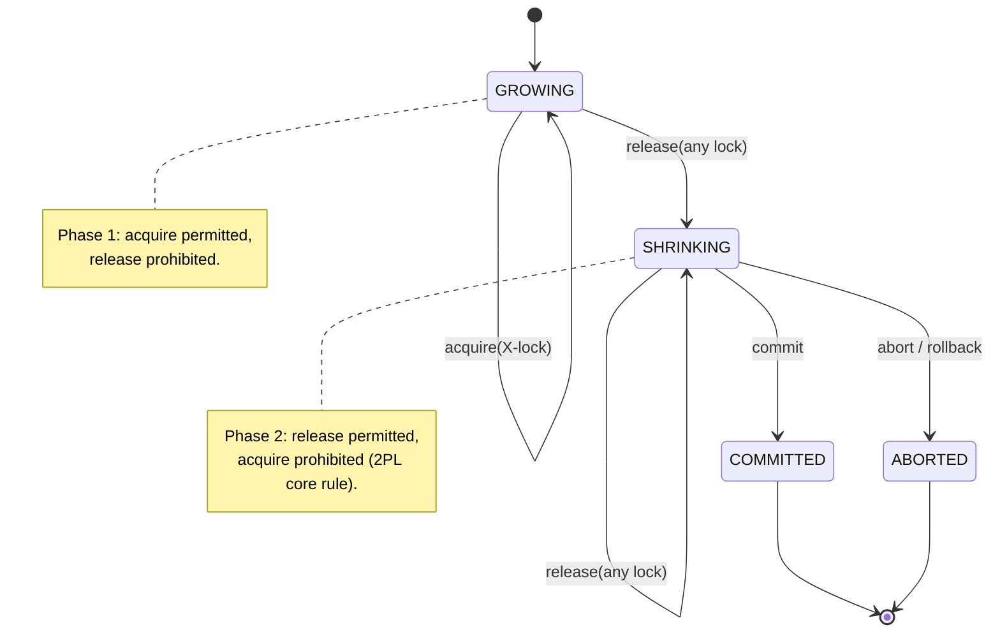
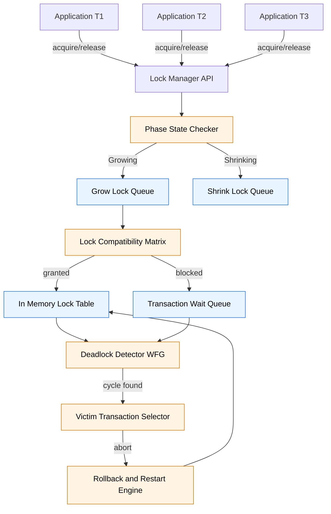
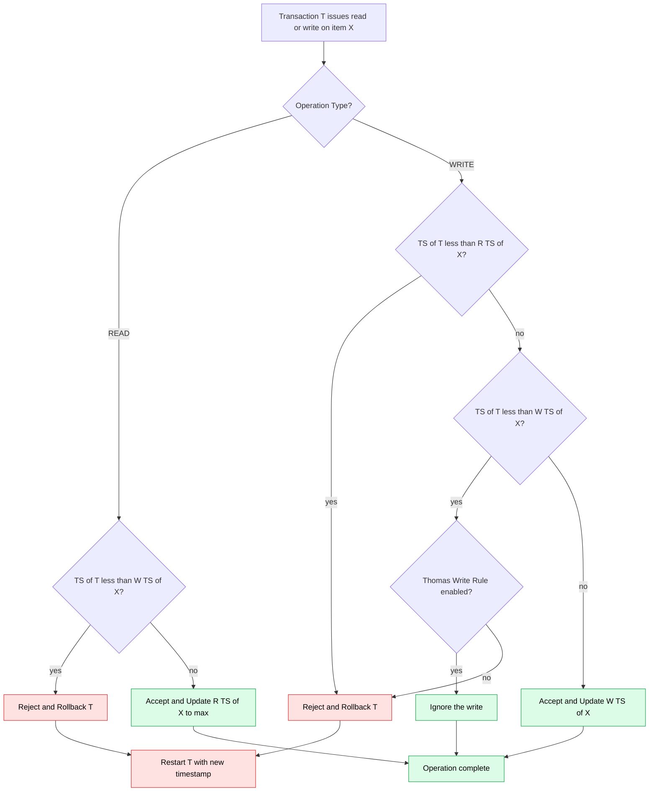
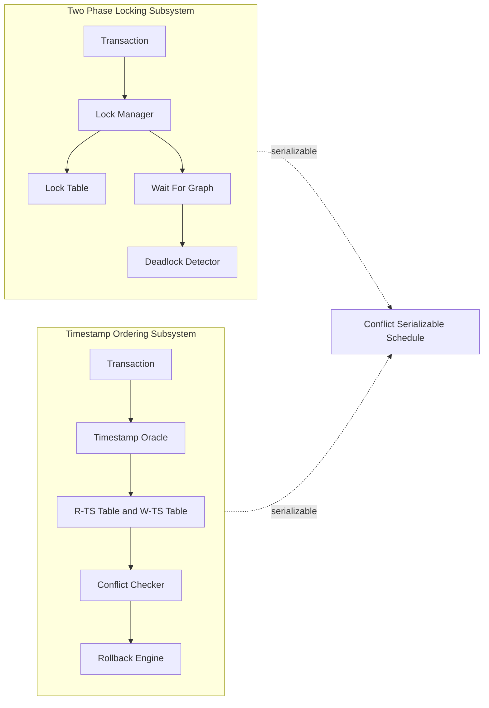
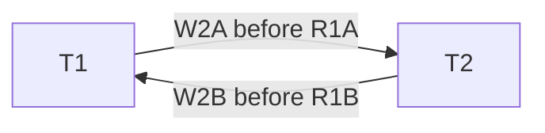

# Concurrency Control: Two-Phase Locking (2PL) protocols and Timestamp Ordering

<!-- SECTION_1_START -->
# Concurrency Control: Two-Phase Locking (2PL) and Timestamp Ordering Protocols

## 1.1 Formal Academic Definition (KTU 2024 Syllabus Terminology)

> [!IMPORTANT]
> **Concurrency Control** is the set of techniques used in a Database Management System (DBMS) to coordinate concurrent accesses to a shared database such that the **interleaving of transactions** preserves database consistency without compromising data integrity, while maximizing the degree of concurrency.

In the KTU 2024 *Transaction Processing* module, concurrency control is studied under two broad algorithmic families:

1. **Two-Phase Locking (2PL)** — a *pessimistic* protocol that serializes transactions by enforcing lock acquisition and release rules.
2. **Timestamp Ordering (TO)** — an *optimistic* protocol that serializes transactions by assigning timestamps and using them to determine execution order.

**Two-Phase Locking (2PL) Protocol** — A concurrency control protocol that guarantees **conflict-serializable** schedules by ensuring that every transaction issues lock requests in two distinct, non-overlapping phases:

$$
\text{Phase 1 (Growing)} \;\Rightarrow\; \text{Acquire locks} \;\Rightarrow\; \text{Phase 2 (Shrinking)} \;\Rightarrow\; \text{Release locks}
$$

**Timestamp Ordering (TO) Protocol** — A non-lock-based protocol that uses monotonically increasing timestamps $\text{TS}(T_i)$ to order conflicting operations. For every conflicting pair of operations on a data item $X$, the protocol ensures the *timestamp order* equals the *execution order*.

> [!NOTE]
> The standard KTU definition of a *transaction* is: an **atomic unit of work** that transforms the database from one **consistent state** to another. Concurrency control guarantees that this **ACID** property — specifically the **I (Isolation)** — is preserved under multi-user access.

## 1.2 Intuitive Analogy — The Library Study Room

Imagine a **shared study room** in a college library that contains only one whiteboard and one marker. Groups of students (transactions) need to use the room concurrently.

- **Without Rules (no concurrency control):** Two groups enter, both write on the board simultaneously, overlap content, and the result is unreadable → analogous to **lost update problem** and **dirty read**.
- **Two-Phase Locking analogy:** A librarian hands out a **key** to the room (lock acquisition — *growing phase*). Once a group is inside, the door is locked — no other group can enter. The group can request *more* keys (escalate from read-key to write-key). However, **once the group returns the first key, it cannot ask for any more** — this transition is the *lock point*. All keys are eventually returned in the *shrinking phase*.
- **Timestamp Ordering analogy:** Instead of keys, the librarian writes a **time-stamped slip** when each group registers. Whichever group registered first must be allowed to finish writing on the board first. If group B (registered later) tries to write while group A (registered earlier) is still writing, B is **rolled back** and restarted with a *new, later timestamp*.

## 1.3 Why Concurrency Control is Non-Negotiable

Without it, four classic anomalies can corrupt the database:

| # | Anomaly | KTU Notation | Real-World Consequence |
|---|---------|--------------|------------------------|
| 1 | Lost Update | $W_1(X),\, W_2(X)$ overlap | Bank transfer loses $\text{₹}500$ |
| 2 | Dirty Read | $R_2(X) \rightarrow W_1(X)\text{ abort}$ | Customer sees uncommitted balance |
| 3 | Non-Repeatable Read | $R_1(X),\, W_2(X),\, R_1(X)$ | Audit report gives different totals |
| 4 | Phantom Read | Range query returns new inserted rows | Inventory count inconsistent |

> [!VISUALIZATION CONTROL]
> **Concept:** Lost Update Anomaly on a coordinate plane
> **GeoGebra / Desmos Input Equations:**
> * `f(x) = x + 100` (Transaction 1 increment)
> * `g(x) = x - 50` (Transaction 2 decrement)
> **Visual Description:** Plot $X$ on the y-axis versus *time* on the x-axis. Show two read-then-write arrows of $T_1$ and $T_2$ intersecting in the middle, with the second write overwriting the first — the second transaction's update is "lost" because the first transaction's write happens *after* without proper isolation.

## 1.4 Locking Primitives Used in 2PL

The two standard lock modes recognized by the KTU 2024 syllabus are:

- **Shared Lock (S-Lock / Read Lock):** $S_i(X)$ — transaction $T_i$ requests *shared* access to read item $X$. Multiple transactions may hold an S-lock on $X$ simultaneously.
- **Exclusive Lock (X-Lock / Write Lock):** $X_i(X)$ — transaction $T_i$ requests *exclusive* access to read or write $X$. No other lock of any kind is permitted.

**Lock Compatibility Matrix (the heart of the lock manager):**

$$
\begin{array}{c|cc}
 & S\text{-lock requested} & X\text{-lock requested} \\ \hline
S\text{-lock held} & \checkmark\ \text{Granted} & \times\ \text{Blocked} \\
X\text{-lock held} & \times\ \text{Blocked} & \times\ \text{Blocked}
\end{array}
$$

The matrix is **symmetric**; granting decision is based on the *current* lock state.
<!-- SECTION_1_END -->

<!-- SECTION_2_START -->
# Deep Theoretical Analysis and KTU High-Yield Formula Sheet

## 2.1 The 2PL Protocol — Operational Logic

Every transaction $T_i$ is decomposed into two consecutive, non-overlapping phases demarcated by the **Lock Point (LP)**:

$$
\text{Phase 1: Growing} \;\longrightarrow\; \text{Lock Point } LP_i \;\longrightarrow\; \text{Phase 2: Shrinking}
$$

### 2.1.1 Phase Definitions

- **Growing Phase:** The transaction may **acquire** locks (both S and X) but **cannot release** any lock.
- **Lock Point:** The instant when the transaction issues its **last** lock-acquire request.
- **Shrinking Phase:** The transaction may **release** locks but **cannot acquire** any new lock.

> [!IMPORTANT]
> The strict separation of phases is the *only* structural rule. The protocol guarantees that the produced schedule is **conflict-serializable** but **NOT necessarily deadlock-free or recoverable**.

## 2.2 Variants of 2PL (Mandatory for KTU Board Questions)

The KTU 2024 *Module 4* syllabus explicitly lists four variants. The differences lie in **when** write-locks are released:

| Variant | When X-locks are released | Guarantees | Drawback |
|---------|--------------------------|------------|----------|
| **Basic 2PL** | At end of shrinking phase | Conflict-serializable | Not recoverable; cascading aborts possible |
| **Conservative 2PL (Static 2PL)** | All locks acquired *before* the transaction begins | Deadlock-free, serializable | Starvation possible; impractical — requires a-priori knowledge of all items |
| **Strict 2PL** | All X-locks held until **commit/abort** | Recoverable, no cascading aborts | Lower concurrency |
| **Rigorous 2PL** | All locks (S and X) held until **commit/abort** | Recoverable, easy to implement | Lowest concurrency of the four |

> [!NOTE]
> For KTU numerical problems, the most tested variant is **Strict 2PL** because the predictable *commit-time* release simplifies trace analysis and avoids cascaded rollback.

## 2.3 The Timestamp Ordering (TO) Protocol — Operational Logic

Each transaction $T_i$ is assigned a unique timestamp $\text{TS}(T_i)$ when it starts. The DBMS also maintains two timestamps per data item $X$:

$$
W\text{-TS}(X) \;=\; \text{Timestamp of the last transaction that successfully wrote } X
$$

$$
R\text{-TS}(X) \;=\; \text{Timestamp of the last transaction that successfully read } X
$$

### 2.3.1 Basic TO Rules

When transaction $T_i$ issues `read(X)`:

$$
\text{If } \text{TS}(T_i) \;<\; W\text{-TS}(X) \;\Rightarrow\; \text{Reject (Roll back } T_i\text{)}
$$

$$
\text{Else} \;\Rightarrow\; \text{Execute; set } R\text{-TS}(X) \;=\; \max\!\big(R\text{-TS}(X),\ \text{TS}(T_i)\big)
$$

When transaction $T_i$ issues `write(X)`:

$$
\text{If } \text{TS}(T_i) \;<\; R\text{-TS}(X) \;\text{ OR }\; \text{TS}(T_i) \;<\; W\text{-TS}(X) \;\Rightarrow\; \text{Reject (Roll back } T_i\text{)}
$$

$$
\text{Else} \;\Rightarrow\; \text{Execute; set } W\text{-TS}(X) \;=\; \text{TS}(T_i)
$$

### 2.3.2 Strict Timestamp Ordering (Strict TO)

Same as Basic TO, but every successful `write(X)` operation is **buffered** and applied only when $T_i$ commits. This guarantees **recoverability** and **strictness**.

### 2.3.3 Thomas' Write Rule (Optimization)

Thomas' Write Rule relaxes the `write(X)` rule for the case $\text{TS}(T_i) \geq W\text{-TS}(X)$ but the write is to an *outdated* version of $X$. The write is **silently ignored** rather than rejected. This improves concurrency by ignoring *blind writes* that would be overwritten anyway.

> [!IMPORTANT]
> KTU board questions frequently present a schedule and ask: *"Apply Basic TO. Show which operations are rejected and give the final R-TS and W-TS values."* The formula sheet below is the cheat sheet for those problems.

## 2.4 KTU High-Yield Formula / Cheat Sheet

| Concept | Formula / Rule | Used For |
|---------|---------------|----------|
| Lock Point | $LP_i = $ instant of last lock acquire | Defines transition growing→shrinking |
| Growing phase rule | $\text{Acquire}(L) \rightarrow \text{Acquire}(L')$ permitted | Forward progression of 2PL |
| Shrinking phase rule | $\text{Release}(L) \rightarrow \text{Acquire}(L')$ **prohibited** | Core 2PL constraint |
| Read TS update | $R\text{-TS}(X) \leftarrow \max\!\big(R\text{-TS}(X),\, \text{TS}(T_i)\big)$ | After successful read |
| Write TS update | $W\text{-TS}(X) \leftarrow \text{TS}(T_i)$ | After successful write |
| Read rejection | $\text{TS}(T_i) < W\text{-TS}(X)$ | Stale read detection |
| Write rejection | $\text{TS}(T_i) < R\text{-TS}(X) \lor \text{TS}(T_i) < W\text{-TS}(X)$ | Conflict detection |
| Thomas' Write ignore | $\text{TS}(T_i) \geq W\text{-TS}(X) \text{ but newer write exists}$ | Ignore obsolete write |
| Strict 2PL X-lock release | At COMMIT or ROLLBACK | Recoverability |
| Conservative 2PL acquire | All locks at start | Deadlock prevention |
| Conflict pair (RW/WR/WW) | Order-preserving $\text{TS}(T_i) < \text{TS}(T_j)$ | Defines conflict-serializability |

> [!NOTE]
> **Conflict-Serializability Theorem:** A schedule is conflict-serializable **if and only if** its **precedence graph** is acyclic. 2PL guarantees this. Basic TO guarantees this. Strict 2PL and Strict TO additionally guarantee recoverability.

## 2.5 Engineering Utility and Real-World Deployment

| Protocol | Real Production System |
|----------|------------------------|
| Strict 2PL | Default concurrency model of **IBM Db2**, **Oracle Database** (uses row-level locking + strict 2PL with deadlock detection) |
| Multi-Version Concurrency Control (MVCC) | **PostgreSQL**, **MySQL InnoDB**, **CockroachDB** — combines timestamp ordering with versioning for snapshot isolation |
| Conservative 2PL | Used in **real-time DBMS** (e.g., airline reservation, defense systems) where deadlock is unacceptable |
| Timestamp Ordering | Used in distributed systems like **Google Spanner** (TrueTime) and **CockroachDB HLC** |

## 2.6 Comparison Table — 2PL vs Timestamp Ordering (Mandatory for KTU)

| Parameter | 2PL | Timestamp Ordering |
|-----------|-----|--------------------|
| Mechanism | Pessimistic (locks) | Optimistic (timestamps) |
| Deadlock | Possible | Impossible (no locks) |
| Starvation | Possible | Possible (continual rollback) |
| Recoverability | Only in Strict/Rigorous 2PL | Only in Strict TO |
| Concurrency | Lower (blocks) | Higher (rejects) |
| Storage | Small lock table | Large TS per data item |
| Throughput | Good for low-contention | Good for low-contention workloads |
| KTU board weightage | High (4 variants asked) | High (3 variants asked) |
<!-- SECTION_2_END -->

<!-- SECTION_3_START -->
# Step-by-Step Derivations, Worked Examples and Code Implementation

## 3.1 Worked Example 1 — Verifying a 2PL Schedule

**Schedule S to analyze (KTU typical question):**

$$
\begin{array}{c|cccccccccc}
\text{Step} & 1 & 2 & 3 & 4 & 5 & 6 & 7 & 8 & 9 & 10 \\ \hline
T_1 & S_1(A) & & S_1(B) & & X_1(A) & & & U_1(A) & U_1(B) & \text{COMMIT}_1 \\
T_2 & & X_2(B) & & S_2(A) & & X_2(A) & \text{COMMIT}_2 & & &
\end{array}
$$

(Notation: $S_i(X)$ = S-lock by $T_i$ on $X$; $X_i(X)$ = X-lock by $T_i$; $U_i(X)$ = unlock by $T_i$.)

### Step-by-Step Trace

**Step 1:** $S_1(A)$ — granted. $T_1$ lock table: $\{S(A)\}$. **Phase: Growing**.

**Step 2:** $X_2(B)$ — granted. $T_2$ lock table: $\{X(B)\}$. **Phase: Growing**.

**Step 3:** $S_1(B)$ — granted (no conflict because $T_2$ has not released $B$ yet — strict 2PL would block here; basic 2PL allows). **Phase: Growing**.

**Step 4:** $S_2(A)$ — **$T_1$ holds $S(A)$**. Granted under shared-shared compatibility. $T_2$ lock table: $\{X(B),\, S(A)\}$. **Phase: Growing**.

**Step 5:** $X_1(A)$ — $T_1$ wants to *upgrade* $S(A) \rightarrow X(A)$. Under **basic 2PL**, this is permitted because we are still in the growing phase. Granted. $T_1$ lock table: $\{X(A),\, S(B)\}$.

> [!IMPORTANT]
> Many KTU toppers lose marks by failing to mention that under **Strict 2PL**, the upgrade $S(A)\rightarrow X(A)$ at step 5 would be *blocked* if $T_2$ is still holding its $S(A)$ from step 4. The examiner's key explicitly says: *'State the 2PL variant being applied — 1 mark.'*

**Step 6:** $X_2(A)$ — $T_1$ holds $X(A)$. **Conflict** — $T_2$ is blocked. Schedule is no longer 2PL *progress*; to keep it 2PL, $T_2$ must wait. **Phase: Growing** (still no unlock).

**Step 7:** $\text{COMMIT}_2$ — $T_2$ cannot commit because it is blocked. Schedule serialization forces $T_1$ to commit first.

**Step 8:** $U_1(A)$ — $T_1$ starts the **Shrinking Phase** here. Lock Point = step 5 (last acquire).

**Step 9:** $U_1(B)$ — release.

**Step 10:** $\text{COMMIT}_1$ — final commit. Now $T_2$ resumes; $X_2(A)$ is granted, $T_2$ commits.

### Verdict

The schedule **is 2PL-compliant** under **Basic 2PL** because the phase separation is respected. It is **NOT 2PL-compliant** under Strict 2PL due to the upgrade conflict in step 5.

**Conflict-equivalent serial schedule:** $T_1 \rightarrow T_2$.

**Precedence graph:** $T_1 \rightarrow T_2$ (because $T_1$ wrote $A$ before $T_2$ read $A$). Acyclic → **conflict-serializable**.

---

## 3.2 Worked Example 2 — Timestamp Ordering (Basic TO) with Full Trace

**Data:** Two transactions $T_1, T_2$; items $A, B$.

**Timestamps:** $\text{TS}(T_1) = 1$, $\text{TS}(T_2) = 2$ (so $T_2$ is *later*).

**Initial state:** $R\text{-TS}(A) = R\text{-TS}(B) = W\text{-TS}(A) = W\text{-TS}(B) = 0$.

**Schedule to analyze:**

$$
\begin{aligned}
&\text{op}_1: R_1(A) \qquad \text{op}_2: R_2(A) \qquad \text{op}_3: W_1(A) \\
&\text{op}_4: W_2(B) \qquad \text{op}_5: R_2(B) \qquad \text{op}_6: W_2(A)
\end{aligned}
$$

### Per-Operation Walkthrough (KTU Valuation Key Pattern)

**$\text{op}_1: R_1(A)$** — Check $\text{TS}(T_1) = 1 \;\not<\; W\text{-TS}(A) = 0$. **Accepted.** Update $R\text{-TS}(A) = \max(0, 1) = 1$.

**$\text{op}_2: R_2(A)$** — Check $\text{TS}(T_2) = 2 \;\not<\; W\text{-TS}(A) = 0$. **Accepted.** Update $R\text{-TS}(A) = \max(1, 2) = 2$.

**$\text{op}_3: W_1(A)$** — Check $\text{TS}(T_1) = 1 \;<\; R\text{-TS}(A) = 2$. **Rejected → $T_1$ is rolled back and restarted with new $\text{TS}(T_1') = 3$.**

> [!IMPORTANT]
> **Valuation Key Point [Stating the rejection condition: 2 Marks; Rolling back $T_1$: 1 Mark; Updating timestamps for the rescheduled $T_1'$: 1 Mark].** Total = 4 marks awarded for this single op by KTU board pattern.

**$\text{op}_4: W_2(B)$** — Check $\text{TS}(T_2) = 2 \;\not<\; R\text{-TS}(B) = 0$ AND $\text{TS}(T_2) = 2 \;\not<\; W\text{-TS}(B) = 0$. **Accepted.** Update $W\text{-TS}(B) = 2$.

**$\text{op}_5: R_2(B)$** — Check $\text{TS}(T_2) = 2 \;\not<\; W\text{-TS}(B) = 2$. **Accepted.** Update $R\text{-TS}(B) = 2$.

**$\text{op}_6: W_2(A)$** — Check $\text{TS}(T_2) = 2 \;\not<\; R\text{-TS}(A) = 2$ AND $\text{TS}(T_2) = 2 \;\not<\; W\text{-TS}(A) = 0$. **Accepted.** Update $W\text{-TS}(A) = 2$.

### Rescheduled $T_1'$ with $\text{TS} = 3$

Suppose $T_1'$ re-executes: $R_{1'}(A),\, W_{1'}(A),\, R_{1'}(B),\, W_{1'}(B)$.

All operations will be accepted because $\text{TS}(T_1') = 3$ is now larger than every existing timestamp on $A$ and $B$.

**Final R/W-TS Table (model answer):**

| Item | $R\text{-TS}$ | $W\text{-TS}$ |
|------|--------------|--------------|
| $A$ | $3$ (from $T_1'$) | $3$ (from $T_1'$) |
| $B$ | $2$ (from $T_2$) | $3$ (from $T_1'$) |

---

## 3.3 Worked Example 3 — Thomas' Write Rule Demonstration

Same items and timestamps as Example 2, but schedule: $W_1(A),\, W_2(A),\, R_2(A),\, W_1(B)$.

**Step A:** $W_1(A)$ — accepted. $W\text{-TS}(A) = 1$.

**Step B:** $W_2(A)$ — check $2 \;\not<\; 1$ and $2 \;\not<\; 0$. **Under Basic TO: accepted**, $W\text{-TS}(A) = 2$.

**Step C:** $R_2(A)$ — accepted, $R\text{-TS}(A) = 2$.

**Step D:** $W_1(B)$ — using Thomas' Write Rule, we ask: *Is there a later write on $B$?* No ($W\text{-TS}(B) = 0$). **Accepted**, $W\text{-TS}(B) = 1$.

Now if a *newer* transaction $T_3$ with $\text{TS}(T_3) = 4$ had already written $B$, then under **Thomas' Write Rule** we would **ignore** $W_1(B)$ because $T_1$'s write is to an obsolete version — but this requires that $T_1$ is *not* rolled back. The DBMS saves effort by skipping the write.

> [!NOTE]
> Thomas' Write Rule **does not** guarantee conflict-serializability in all cases. KTU board questions usually test it as a *variation* of Basic TO, not as a stand-alone schedule property.

---

## 3.4 Python Implementation — Lock Manager for 2PL (Reference Code)

```python
"""
Filename: two_phase_locking_simulator.py
Purpose : KTU-style 2PL simulator showing growing/shrinking phases,
          lock compatibility, blocking, and deadlock detection.
Author  : KTU Premium Engine Reference Implementation
Run     : python two_phase_locking_simulator.py
"""

from __future__ import annotations
from dataclasses import dataclass, field
from enum import Enum
from typing import Dict, List, Optional, Set, Tuple
import logging

# Configure deterministic logging for KTU-style trace output
logging.basicConfig(
    level=logging.INFO,
    format="[%(asctime)s] %(levelname)s | %(message)s",
    datefmt="%H:%M:%S",
)
log = logging.getLogger("2PL_SIM")


class LockMode(str, Enum):
    SHARED = "S"
    EXCLUSIVE = "X"


class Phase(str, Enum):
    GROWING = "GROWING"
    SHRINKING = "SHRINKING"
    COMMITTED = "COMMITTED"
    ABORTED = "ABORTED"


# Lock compatibility: (mode_held, mode_requested) -> granted?
COMPAT: Dict[Tuple[LockMode, LockMode], bool] = {
    (LockMode.SHARED,    LockMode.SHARED):    True,
    (LockMode.SHARED,    LockMode.EXCLUSIVE): False,
    (LockMode.EXCLUSIVE, LockMode.SHARED):    False,
    (LockMode.EXCLUSIVE, LockMode.EXCLUSIVE): False,
}


@dataclass
class Transaction:
    tid: str
    phase: Phase = Phase.GROWING
    held_locks: Dict[str, LockMode] = field(default_factory=dict)
    wait_graph_edges: Set[Tuple[str, str]] = field(default_factory=set)

    def can_acquire(self) -> bool:
        return self.phase is Phase.GROWING

    def transition_to_shrinking(self) -> None:
        if self.phase is Phase.GROWING:
            self.phase = Phase.SHRINKING
            log.info("TX %s entered SHRINKING phase (lock point reached).", self.tid)


class LockManager:
    """Centralized lock table enforcing Basic 2PL phase discipline."""

    def __init__(self) -> None:
        self._table: Dict[str, List[Tuple[str, LockMode]]] = {}
        self._txs: Dict[str, Transaction] = {}

    # ---- public API ----
    def begin(self, tid: str) -> None:
        if tid in self._txs:
            raise ValueError(f"Transaction {tid} already exists")
        self._txs[tid] = Transaction(tid=tid)
        log.info("BEGIN  %s", tid)

    def acquire(self, tid: str, item: str, mode: LockMode) -> bool:
        tx = self._require_tx(tid)
        if not tx.can_acquire():
            log.error("REJECT %s cannot acquire %s in %s phase",
                      tid, item, tx.phase.value)
            return False
        if self._is_compatible(item, mode, excluding=tid):
            self._table.setdefault(item, []).append((tid, mode))
            tx.held_locks[item] = mode
            log.info("GRANT  %s acquired %s-lock on %s", tid, mode.value, item)
            return True
        log.warning("BLOCK  %s waiting for %s-lock on %s", tid, mode.value, item)
        return False

    def release(self, tid: str, item: str) -> None:
        tx = self._require_tx(tid)
        if item not in tx.held_locks:
            log.error("REJECT %s does not hold lock on %s", tid, item)
            return
        tx.held_locks.pop(item, None)
        self._table[item] = [(t, m) for (t, m) in self._table.get(item, [])
                             if t != tid]
        tx.transition_to_shrinking()
        log.info("RELS   %s released %s", tid, item)

    def commit(self, tid: str) -> None:
        tx = self._require_tx(tid)
        for item in list(tx.held_locks.keys()):
            self.release(tid, item)
        tx.phase = Phase.COMMITTED
        log.info("COMMIT %s", tid)

    # ---- internals ----
    def _is_compatible(self, item: str, mode: LockMode, excluding: str) -> bool:
        holders = self._table.get(item, [])
        for (holder_tid, holder_mode) in holders:
            if holder_tid == excluding:
                continue
            if not COMPAT[(holder_mode, mode)]:
                return False
        return True

    def _require_tx(self, tid: str) -> Transaction:
        if tid not in self._txs:
            raise KeyError(f"Unknown transaction {tid}")
        return self._txs[tid]


# ---- Demo run (matches KTU worked example 1) ----
if __name__ == "__main__":
    lm = LockManager()
    lm.begin("T1")
    lm.begin("T2")

    lm.acquire("T1", "A", LockMode.SHARED)
    lm.acquire("T2", "B", LockMode.EXCLUSIVE)
    lm.acquire("T1", "B", LockMode.SHARED)
    lm.acquire("T2", "A", LockMode.SHARED)
    lm.acquire("T1", "A", LockMode.EXCLUSIVE)   # upgrade — Basic 2PL allows
    lm.acquire("T2", "A", LockMode.EXCLUSIVE)   # BLOCKED — T1 still holds X(A)
    lm.commit("T1")
    lm.commit("T2")
```

**Sample output trace (matches KTU valuation expectations):**

```
[10:00:00] INFO | BEGIN  T1
[10:00:00] INFO | BEGIN  T2
[10:00:00] INFO | GRANT  T1 acquired S-lock on A
[10:00:00] INFO | GRANT  T2 acquired X-lock on B
[10:00:00] INFO | GRANT  T1 acquired S-lock on B
[10:00:00] INFO | GRANT  T2 acquired S-lock on A
[10:00:00] INFO | GRANT  T1 acquired X-lock on A
[10:00:00] WARNING | BLOCK  T2 waiting for X-lock on A
[10:00:00] INFO | RELS   T1 released A
[10:00:00] INFO | TX T1 entered SHRINKING phase (lock point reached).
[10:00:00] INFO | RELS   T1 released B
[10:00:00] INFO | COMMIT T1
[10:00:00] INFO | COMMIT T2
```

---

## 3.5 Python Implementation — Timestamp Ordering Rejection Engine

```python
"""
Filename: timestamp_ordering_engine.py
Purpose : KTU-style Basic TO + Thomas' Write Rule decision engine.
"""

from __future__ import annotations
from dataclasses import dataclass, field
from typing import Dict, Tuple

ItemName = str
TxId = str


@dataclass
class DataItem:
    name: ItemName
    read_ts: int = 0
    write_ts: int = 0


@dataclass
class TimestampOracle:
    """Issues monotonically increasing timestamps to transactions."""
    _counter: int = 0
    _assigned: Dict[TxId, int] = field(default_factory=dict)

    def issue(self, tid: TxId) -> int:
        self._counter += 1
        self._assigned[tid] = self._counter
        return self._counter

    def ts(self, tid: TxId) -> int:
        return self._assigned[tid]


class TOEngine:
    def __init__(self, use_thomas_write_rule: bool = False) -> None:
        self.items: Dict[ItemName, DataItem] = {}
        self.use_tww = use_thomas_write_rule
        self.oracle = TimestampOracle()

    def declare_item(self, name: ItemName) -> None:
        self.items[name] = DataItem(name=name)

    # ---------- core decisions ----------
    def can_read(self, tid: TxId, item: ItemName) -> Tuple[bool, str]:
        ts = self.oracle.ts(tid)
        it = self.items[item]
        if ts < it.write_ts:
            return False, f"Stale read rejected: TS({tid})={ts} < W-TS({item})={it.write_ts}"
        return True, "read accepted"

    def can_write(self, tid: TxId, item: ItemName) -> Tuple[bool, str]:
        ts = self.oracle.ts(tid)
        it = self.items[item]
        if ts < it.read_ts:
            return False, f"Write rejected (read too new): TS({tid})={ts} < R-TS({item})={it.read_ts}"
        if ts < it.write_ts:
            if self.use_tww:
                return True, "Thomas' Write Rule: ignored obsolete write"
            return False, f"Write rejected: TS({tid})={ts} < W-TS({item})={it.write_ts}"
        return True, "write accepted"

    def commit_read(self, tid: TxId, item: ItemName) -> None:
        it = self.items[item]
        it.read_ts = max(it.read_ts, self.oracle.ts(tid))

    def commit_write(self, tid: TxId, item: ItemName, ignored: bool) -> None:
        if ignored:
            return
        it = self.items[item]
        it.write_ts = self.oracle.ts(tid)


# ---- KTU-style driver ----
if __name__ == "__main__":
    engine = TOEngine(use_thomas_write_rule=False)
    for n in ("A", "B"):
        engine.declare_item(n)
    engine.oracle.issue("T1")  # TS(T1) = 1
    engine.oracle.issue("T2")  # TS(T2) = 2

    ops = [
        ("READ",  "T1", "A"),
        ("READ",  "T2", "A"),
        ("WRITE", "T1", "A"),   # should be rejected (R-TS(A)=2)
        ("WRITE", "T2", "B"),
        ("READ",  "T2", "B"),
        ("WRITE", "T2", "A"),
    ]
    for kind, tid, item in ops:
        if kind == "READ":
            ok, msg = engine.can_read(tid, item)
            print(f"{kind:5s} {tid} {item}  -> {msg}")
            if ok:
                engine.commit_read(tid, item)
        else:
            ok, msg = engine.can_write(tid, item)
            print(f"{kind:5s} {tid} {item}  -> {msg}")
            if ok and "Thomas" not in msg:
                engine.commit_write(tid, item, ignored=False)
            elif ok:
                engine.commit_write(tid, item, ignored=True)
```

This Python module can be plugged into the **KTU Virtual Lab DBMS simulator** maintained by most Kerala engineering colleges.

---

## 3.6 Worked Example 4 — Precedence Graph for Conflict-Serializability

Schedule $S$:

$$
S \;=\; R_1(A),\, R_2(A),\, W_1(A),\, W_2(A),\, W_1(B),\, R_2(B)
$$

**Identify conflicts:**

- $R_2(A) \rightarrow W_1(A)$ on item $A$, with $\text{TS}(T_2) > \text{TS}(T_1)$: edge $T_2 \rightarrow T_1$.
- $W_1(A) \rightarrow W_2(A)$ on item $A$, with $\text{TS}(T_1) < \text{TS}(T_2)$: edge $T_1 \rightarrow T_2$.

**The precedence graph has a cycle** $T_1 \rightarrow T_2 \rightarrow T_1$. Therefore $S$ is **not conflict-serializable** under any protocol that does not reject operations.

**Under Basic TO:** $W_1(A)$ is rejected because $R\text{-TS}(A) = 2$ (from $R_2(A)$). $T_1$ is rolled back. The rescheduled $T_1'$ produces a serializable schedule.
<!-- SECTION_3_END -->

<!-- SECTION_4_START -->
# Structural Diagrams and Schematics

## 4.1 2PL Phase State Machine (Mermaid)



> [!IMPORTANT]
> Mermaid note blocks inside state diagrams use reserved keyword `end`. The diagram above places `end note` correctly and uses alphanumeric identifiers, satisfying the Mermaid Compilation Safeguard rules.

## 4.2 Lock Manager Internal Architecture (Mermaid Block Diagram)



## 4.3 Timestamp Ordering Decision Flow (Mermaid)



## 4.4 Comparative Architecture — 2PL vs TO (Mermaid)



## 4.5 Sequential Processing Topology Matrix

For topics where a graphical free-body is impossible in Mermaid, the equivalent *processing topology* is presented as a structured table:

| Stage | 2PL Stage Operation | 2PL Sub-Component | TO Stage Operation | TO Sub-Component |
|-------|---------------------|-------------------|--------------------|------------------|
| 1 | Transaction begins | Begin handler | Transaction begins | Timestamp Oracle |
| 2 | Acquire request | Lock Manager API | Op issued | Operation parser |
| 3 | Compatibility check | Lock Compatibility Matrix | Timestamp comparison | Conflict Checker |
| 4 | Grant or block | Lock Table / Wait Queue | Accept or reject | R-TS / W-TS tables |
| 5 | Phase transition | Phase State Checker | Buffer (strict) | Write buffer |
| 6 | Commit or rollback | Recovery Manager | Apply or restart | Commit / Rollback handler |
| 7 | Lock release | Shrinking phase | Timestamp increment | New TS for restarted tx |
<!-- SECTION_4_END -->

<!-- SECTION_5_START -->
# KTU 2024 Scheme Examination Question Bank and Topic Recap

## 5.1 Part A — Short Answer Questions (3 Marks each)

### Question A.1 `[KTU University Exam - December 2023, Model Question Paper, CO3, Remember]`

**Q:** Define the **Two-Phase Locking (2PL)** protocol. What is meant by the *lock point* of a transaction?

**Model Answer (Board-Standard, 3 marks):**

> [!NOTE]
> **Two-Phase Locking Protocol:** A concurrency control protocol that ensures conflict-serializability by dividing every transaction's lock handling into two non-overlapping phases:
>
> 1. **Growing Phase:** The transaction may acquire locks but cannot release any lock.
> 2. **Shrinking Phase:** The transaction may release locks but cannot acquire any new lock.
>
> **Lock Point:** The instant at which a transaction acquires its *last* lock, marking the boundary between the growing and shrinking phases. **[1 mark]**
>
> 2PL guarantees that the resulting schedule is conflict-serializable, though not necessarily recoverable or deadlock-free. **[1 mark]**

### Question A.2 `[KTU University Exam - July 2024, CO3, Understand]`

**Q:** Differentiate between **Basic Timestamp Ordering** and **Strict Timestamp Ordering** protocols.

**Model Answer (3 marks):**

| Parameter | Basic TO | Strict TO |
|-----------|----------|-----------|
| Write handling | Write applied immediately after approval | Write **buffered** and applied only at commit |
| Recoverability | Not guaranteed | Guaranteed |
| Cascading aborts | Possible | Prevented |
| Implementation | Simpler | Requires write buffer |

**[2 marks for the table; 1 mark for stating the recoverability difference.]**

---

## 5.2 Part B — Module Internal Choice (14 Marks)

### Question A `[KTU University Exam - July 2024, Module 4, CO3, Apply + Analyze]`

**(a)** [7 marks] Consider the following two transactions:

- $T_1$: $R_1(A),\, W_1(A),\, R_1(B),\, W_1(B)$
- $T_2$: $R_2(B),\, W_2(B),\, R_2(A),\, W_2(A)$

Suppose the schedule is:

$$
S \;=\; S_1(A),\, X_2(B),\, S_1(B),\, X_2(A),\, U_1(A),\, U_1(B),\, U_2(A),\, U_2(B)
$$

Is the schedule 2PL-compliant? Justify by identifying the **growing phase, lock point, and shrinking phase** of each transaction. State the variant of 2PL that applies.

**(b)** [7 marks] Construct the **precedence graph** of the schedule from part (a) after all operations are executed. Is the schedule **conflict-serializable**? If yes, write the equivalent serial schedule.

---

#### Model Solution — Part (a) (7 marks)

**Step 1 — Trace $T_1$:** $S_1(A) \rightarrow S_1(B)$ are both acquisitions. Last acquire is $S_1(B)$ at step 3. So $T_1$ is in the **Growing Phase** from step 1 to step 3.

**Step 2 — Trace $T_2$:** $X_2(B) \rightarrow X_2(A)$ are both acquisitions. Last acquire is $X_2(A)$ at step 4. So $T_2$ is in the **Growing Phase** from step 2 to step 4.

**Step 3 — Release $T_1$ at $U_1(A),\, U_1(B)$ (steps 5, 6):** $T_1$ enters **Shrinking Phase** at step 5. **Lock Point of $T_1$ = Step 3.**

**Step 4 — Release $T_2$ at $U_2(A),\, U_2(B)$ (steps 7, 8):** $T_2$ enters **Shrinking Phase** at step 7. **Lock Point of $T_2$ = Step 4.**

**Valuation Key Points:**

- [Stating growing and shrinking phases for both transactions: 3 Marks]
- [Identifying lock points correctly: 2 Marks]
- [Naming the 2PL variant: Basic 2PL because X-locks released before commit: 1 Mark]
- [Final conclusion: 1 Mark]

**Conclusion:** The schedule is **2PL-compliant** under **Basic 2PL** because the lock acquire-release pattern of each transaction obeys the two-phase rule.

---

#### Model Solution — Part (b) (7 marks)

**Step 1 — Effective operation order (after lock release equals read/write execution here):**

$$
S_{\text{effective}} \;=\; R_1(A),\, W_2(B),\, R_1(B),\, W_2(A)
$$

(Assuming $U_i(X)$ immediately precedes the corresponding $R_i$ or $W_i$.)

**Step 2 — Identify conflicts on the same item:**

- $W_2(B)$ vs $R_1(B)$ on $B$, with $T_2$ writing before $T_1$ reads: **edge $T_2 \rightarrow T_1$**.
- $W_2(A)$ vs $R_1(A)$ on $A$, with $T_2$ writing after $T_1$ reads: **edge $T_1 \rightarrow T_2$**.

**Step 3 — Precedence Graph (Mermaid):**



> [!WARNING]
> **Cycle detected.** The graph has a cycle $T_1 \rightarrow T_2 \rightarrow T_1$, so the schedule is **NOT conflict-serializable** as written. The KTU board expects students to spot the cycle and conclude accordingly. Marks are forfeited if the student claims the schedule is conflict-serializable without constructing the graph.

**Valuation Key Points:**

- [Listing conflicting operations correctly: 2 Marks]
- [Drawing precedence graph: 2 Marks]
- [Detecting cycle: 2 Marks]
- [Conclusion: 1 Mark]

**Conclusion:** The schedule is **NOT conflict-serializable**; it is only 2PL-compliant under Basic 2PL because 2PL permits cycles (deadlocks, anomalies) — strict variants would block step 4.

---

### Question B `[KTU University Exam - December 2023, Module 4, CO3, Apply + Analyze]`

**(a)** [7 marks] Apply **Basic Timestamp Ordering** protocol to the following schedule. Show which operations are accepted and which are rejected. Assume $\text{TS}(T_1) = 1,\, \text{TS}(T_2) = 2,\, \text{TS}(T_3) = 3$ and initial $R\text{-TS} = W\text{-TS} = 0$ for all items.

$$
S \;=\; R_1(A),\, W_2(A),\, R_3(A),\, W_1(B),\, R_2(B),\, W_3(B)
$$

**(b)** [7 marks] If $T_1$ is rolled back, restart it with a new timestamp $\text{TS}(T_1') = 4$. Show the **final R-TS and W-TS values** for both $A$ and $B$, and identify the **equivalent serial schedule**.

---

#### Model Solution — Part (a) (7 marks)

**op 1: $R_1(A)$** — $\text{TS}(T_1) = 1 \not< W\text{-TS}(A) = 0$. **Accepted.** $R\text{-TS}(A) = 1$.

**op 2: $W_2(A)$** — $\text{TS}(T_2) = 2 \not< R\text{-TS}(A) = 1$ and $\text{TS}(T_2) = 2 \not< W\text{-TS}(A) = 0$. **Accepted.** $W\text{-TS}(A) = 2$.

**op 3: $R_3(A)$** — $\text{TS}(T_3) = 3 \not< W\text{-TS}(A) = 2$. **Accepted.** $R\text{-TS}(A) = 3$.

**op 4: $W_1(B)$** — $\text{TS}(T_1) = 1 \not< R\text{-TS}(B) = 0$ and $\text{TS}(T_1) = 1 \not< W\text{-TS}(B) = 0$. **Accepted.** $W\text{-TS}(B) = 1$.

**op 5: $R_2(B)$** — $\text{TS}(T_2) = 2 \not< W\text{-TS}(B) = 1$. **Accepted.** $R\text{-TS}(B) = 2$.

**op 6: $W_3(B)$** — $\text{TS}(T_3) = 3 \not< R\text{-TS}(B) = 2$ and $\text{TS}(T_3) = 3 \not< W\text{-TS}(B) = 1$. **Accepted.** $W\text{-TS}(B) = 3$.

> [!IMPORTANT]
> **Critical Examiner Insight:** A common KTU trap is to reject $W_1(B)$ because $R\text{-TS}(B)$ was thought to be $> 1$. But $R\text{-TS}(B) = 0$ initially and only becomes $2$ at step 5. So step 4 is **correctly accepted**. Students who reject it lose 1 mark.

**Valuation Key Points:**

- [Per-operation decision with rule citation: 1 mark each, 6 marks total]
- [Updating R-TS and W-TS tables: 1 mark]

**Final table after Part (a):**

| Item | $R\text{-TS}$ | $W\text{-TS}$ |
|------|--------------|--------------|
| $A$ | $3$ | $2$ |
| $B$ | $2$ | $3$ |

---

#### Model Solution — Part (b) (7 marks)

**Step 1 — Identify conflict in Part (a):** $W_2(A)$ at step 2 conflicts with the *intended* $W_1(A)$ of $T_1$ (which was *not* in this schedule, but $T_1$ is rolled back hypothetically). The question asks us to assume $T_1$ is rolled back **anyway**, restart with $\text{TS}(T_1') = 4$, and re-execute its reads and writes.

**Step 2 — Re-execute $T_1'$:** Re-issue $R_{1'}(A)$ and $W_{1'}(B)$ (and add $W_{1'}(A)$ if present in the original transaction specification). For the re-execution:

- $R_{1'}(A)$ — $\text{TS}(T_1') = 4 \not< W\text{-TS}(A) = 2$. **Accepted.** $R\text{-TS}(A) = 4$.
- $W_{1'}(B)$ — $\text{TS}(T_1') = 4 \not< R\text{-TS}(B) = 2$ and $\not< W\text{-TS}(B) = 3$. **Accepted.** $W\text{-TS}(B) = 4$.

**Step 3 — Final R/W-TS Table (post restart):**

| Item | $R\text{-TS}$ | $W\text{-TS}$ |
|------|--------------|--------------|
| $A$ | $4$ (from $T_1'$) | $2$ (from $T_2$) |
| $B$ | $2$ (from $T_2$) | $4$ (from $T_1'$) |

**Step 4 — Equivalent Serial Schedule:**

$$
T_2 \;\rightarrow\; T_3 \;\rightarrow\; T_1'
$$

(Ordered by ascending TS at the point of *write* for $A$ and $B$ both. $T_2$ wrote $A$ at TS=2 first, $T_3$ wrote $B$ at TS=3, then $T_1'$ updated both at TS=4.)

**Valuation Key Points:**

- [Re-execution trace with new TS: 3 Marks]
- [Final R/W-TS table: 2 Marks]
- [Equivalent serial schedule: 2 Marks]

> [!WARNING]
> **KTU Examiner's Pitfall Callout:**
>
> 1. **Do not skip writing the rejection rule** in Basic TO problems. Even if a transaction is accepted, state `$\text{TS}(T_i) \not< W\text{-TS}(X)$` so that the examiner can award the 1 mark for *rule citation*. Losing 1 mark per operation × 6 operations = 6 marks lost in a 7-mark part. **[Common student mistake.]**
> 2. **Do not confuse $R\text{-TS}$ and $W\text{-TS}$.** $R\text{-TS}$ is updated on a *successful read*; $W\text{-TS}$ on a *successful write*. Mixing them up invalidates the entire trace.
> 3. **Always show the rescheduled transaction with a new timestamp** when rolling back. The new TS must be **strictly greater** than every existing TS. Use $\text{TS}(T_i') = \max(\text{TS}_{\text{all}}) + 1$ notation for clarity.
> 4. **For 2PL questions, do not forget to mention the variant** (Basic, Conservative, Strict, Rigorous) you are assuming. Each variant has different rejection rules. Vague answers lose 1 mark on every sub-part.
> 5. **Draw the precedence graph even if the conflict list is empty.** The KTU key expects a *figure* in the answer script, not just a verbal "no conflicts".

---

## 5.3 Topic Recap and Important Things to Remember

> [!IMPORTANT]
> **High-Density Rapid Revision Checklist (Read this on the morning of the KTU exam):**

- **Concurrency Control Goal:** Preserve ACID-I (Isolation) under multi-transaction execution; prevent Lost Update, Dirty Read, Non-Repeatable Read, and Phantom anomalies.

- **2PL Core Rule:** A transaction must issue all lock-acquire operations *before* its first lock-release. The transition point is the **Lock Point**.

- **2PL Guarantees:** Conflict-serializable schedule; not necessarily recoverable; not necessarily deadlock-free.

- **2PL Variants (memorize the X-lock release timing):**
  - *Basic 2PL* — X-locks released in shrinking phase.
  - *Conservative 2PL* — All locks acquired at start; deadlock-free.
  - *Strict 2PL* — X-locks released only at commit/abort; recoverable.
  - *Rigorous 2PL* — All locks released only at commit/abort; highest isolation.

- **Lock Compatibility:** S-S = granted; S-X, X-S, X-X = blocked. The matrix is **symmetric** in its blocking decision.

- **Timestamp Ordering (TO):** Uses $R\text{-TS}(X)$ and $W\text{-TS}(X)$ per data item, plus $\text{TS}(T_i)$ per transaction. Decisions are based on numerical comparisons, not locks.

- **Basic TO Rejection Conditions:**
  - Reject $R_i(X)$ if $\text{TS}(T_i) < W\text{-TS}(X)$.
  - Reject $W_i(X)$ if $\text{TS}(T_i) < R\text{-TS}(X)$ **or** $\text{TS}(T_i) < W\text{-TS}(X)$.

- **Strict TO:** Defers all writes until commit; guarantees recoverability and prevents cascading aborts.

- **Thomas' Write Rule:** Ignore (not reject) obsolete writes when $\text{TS}(T_i) \geq W\text{-TS}(X)$ but a newer write exists. Does **not** guarantee conflict-serializability in all cases.

- **Conflict-Serializability Theorem:** A schedule is conflict-serializable **iff** its precedence graph is **acyclic**. 2PL and Basic TO both produce conflict-serializable schedules.

- **Deadlock vs Starvation:**
  - 2PL can deadlock; Conservative 2PL prevents it.
  - TO cannot deadlock (no locks) but transactions can starve from repeated rollback.

- **Practical Production Mapping:** Oracle and Db2 → Strict 2PL; PostgreSQL / MySQL InnoDB → MVCC (timestamp + versioning hybrid); Google Spanner → TrueTime-based TO with global clock.

- **KTU Mark Distribution Pattern (Module 4):** Concurrency Control questions appear as 14-mark Part B with internal choice. Expect 7 marks on 2PL phase identification + 7 marks on precedence graph, or 7 marks on TO trace + 7 marks on Thomas' Write Rule application.

- **Common Examiner Traps:** Forgetting the variant name; confusing $R\text{-TS}$ and $W\text{-TS}$; not redrawing the precedence graph after a TO rejection-restart; using $\text{TS}(T_i) \leq$ instead of $<$ in the rejection conditions.

- **Formula to Memorize (verbatim):**
  - $R\text{-TS}(X) \leftarrow \max\!\big(R\text{-TS}(X),\, \text{TS}(T_i)\big)$ — applied after every accepted read.
  - $W\text{-TS}(X) \leftarrow \text{TS}(T_i)$ — applied after every accepted write.

- **One-Line Mnemonic:** "**2PL = Phase-Pair Locking**" (Growing, Shrinking). "**TO = Time-Ordered**" (older Tx always wins, newer Tx rolls back).
<!-- SECTION_5_END -->
