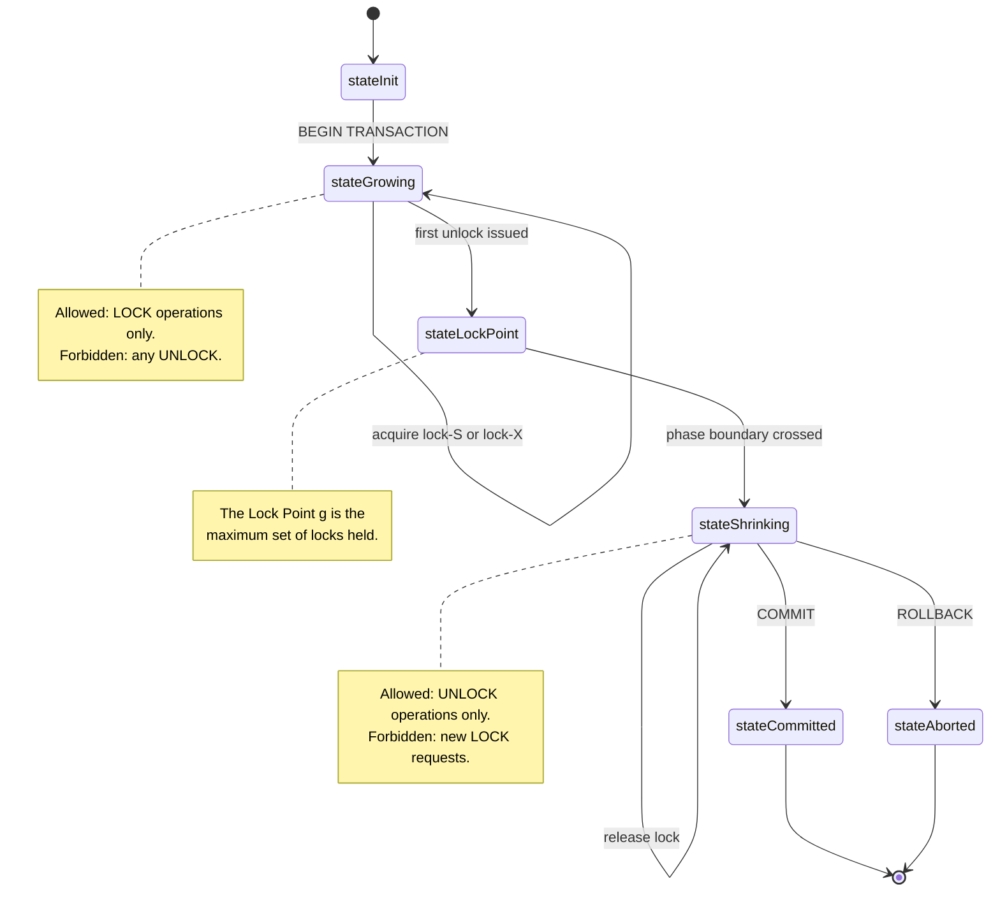
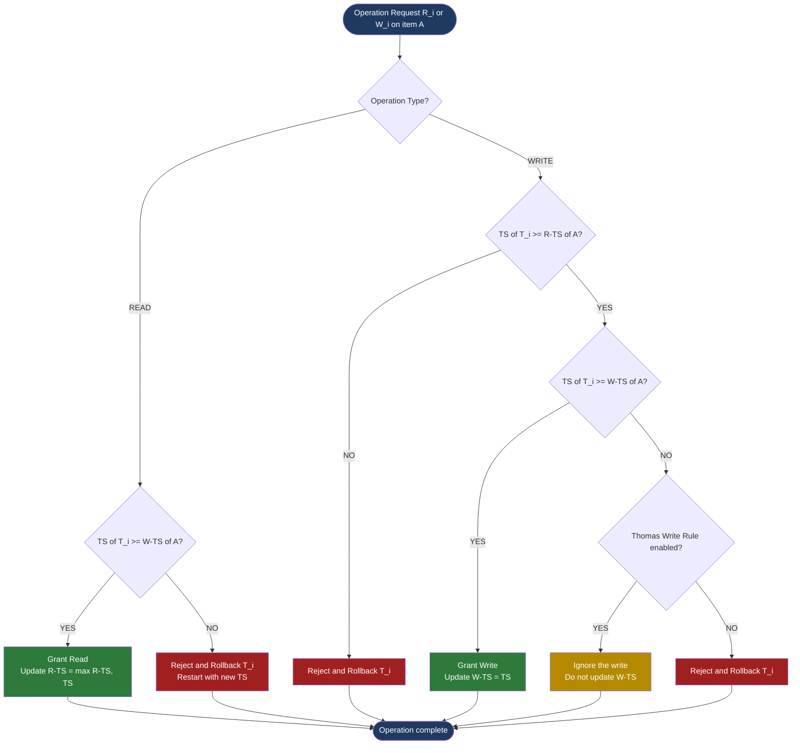
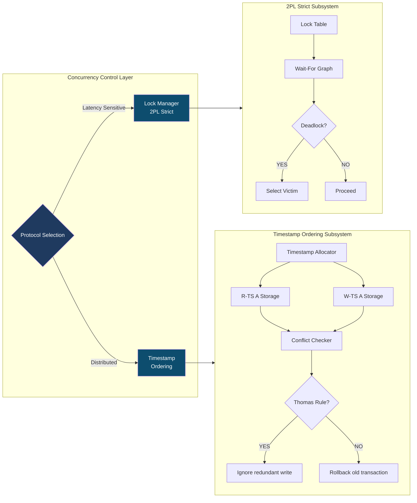

# Concurrency Control: Two-Phase Locking (2PL) protocols and Timestamp Ordering

<!-- SECTION_1_START -->

# Concurrency Control: Two-Phase Locking (2PL) \& Timestamp Ordering

## 1. Core Technical Definition

### 1.1 Transaction \& Concurrency Control — Formal Definition
A **transaction** is a logical unit of database processing that must satisfy the ACID properties: **Atomicity, Consistency, Isolation, and Durability**. When multiple transactions execute concurrently, the DBMS must interleave their operations in a way that preserves database consistency — this responsibility is handled by the **Concurrency Control Manager (CCM)**.

> [!IMPORTANT]
> **KTU 2024 Syllabus Definition (PCCST402 - Module 4):**
> *Concurrency Control protocols ensure that concurrently executing transactions preserve the ACID properties by producing a schedule equivalent to some serial execution (Conflict / View serializability), thereby preventing problems such as Lost Update, Dirty Read, Non-Repeatable Read, and Phantom Read.*

### 1.2 Two-Phase Locking (2PL) — Definition
The **Two-Phase Locking Protocol**, first proposed by Eswaran et al. (1976), is a pessimistic concurrency control technique that guarantees **Conflict-Serializability** by enforcing a strict two-stage discipline on every transaction's lock acquisition and release behavior.

> [!NOTE]
> **Formal Statement:**
> A transaction $T_i$ is said to follow the **Two-Phase Locking (2PL) Protocol** if **all lock operations $\text{lock}\_S(A)$ or $\text{lock}\_X(A)$ precede the first unlock operation $\text{unlock}(A)$** in $T_i$.
> Every transaction is therefore partitioned into two consecutive and non-overlapping phases: a **Growing Phase** (only locks are acquired, no unlocks) and a **Shrinking Phase** (only unlocks are issued, no new locks).

### 1.3 Timestamp Ordering (TO) — Definition
**Timestamp Ordering** is a **non-lock-based, optimistic-class pessimistic protocol** that pre-orders transactions using monotonically increasing **timestamps** assigned at transaction start. The protocol guarantees **Conflict-Serializability** by enforcing that the execution order of conflicting operations follows the timestamp order, rejecting operations that violate this order.

> [!NOTE]
> **KTU Standard Notations:**
> * $\text{TS}(T_i)$ — Timestamp of transaction $T_i$ (assigned by a monotonically increasing counter or system clock).
> * $\text{R-TS}(A)$ — Read-Timestamp: largest $\text{TS}(T_j)$ such that $T_j$ successfully read $A$.
> * $\text{W-TS}(A)$ — Write-Timestamp: largest $\text{TS}(T_j)$ such that $T_j$ successfully wrote $A$.

---

## 2. Intuitive Analogy \& Real-World Intuition

### 2.1 2PL — The "Meeting Room Reservation" Analogy
Imagine a corporate meeting room system with a strict booking rule:

> **Phase 1 (Growing)**: You may *book* as many rooms as you want, but you cannot *release* a room once you have started releasing others.
> **Phase 2 (Shrinking)**: You can only *release* rooms; no new bookings allowed.

This is exactly 2PL. The protocol ensures that once a transaction "starts giving up" its resources, it cannot acquire new ones — preventing circular waiting and ensuring a serial-equivalent execution.

### 2.2 Timestamp Ordering — The "Newspaper Subscription" Analogy
Consider a queue of subscribers for a daily newspaper. Each subscriber has a unique subscription number (timestamp). The postmaster enforces:

> *"If Subscriber \#5 tries to read an article that Subscriber \#7 already wrote about, reject the read — the world has moved on past Subscriber \#5's time."*

Similarly, in TO, if a younger transaction (higher TS) has already touched a data item, an older transaction (lower TS) attempting a conflicting operation is rolled back and restarted with a new timestamp.

### 2.3 Why These Protocols Matter
Both 2PL and TO solve the **Schedule Serializability Problem** — the holy grail of concurrency control. Without them, the database would suffer:
- **Lost Update Problem** (concurrent $W$–$W$ conflict)
- **Dirty Read Problem** (uncommitted read dependency)
- **Non-Repeatable Read Problem** (Read–Write conflict across reads)
- **Incorrect Summary Problem** (aggregate across multiple reads)

> [!VISUALIZATION CONTROL]
> **Concept:** Phase Transition Curve of a 2PL Transaction
> **GeoGebra / Desmos Input Equations:**
> * `f(x) = 1 for 0 \le x \le g` (Growing Phase, constant high)
> * `f(x) = 0 for g < x \le 1` (Shrinking Phase, constant low)
> * `vertical line x = g` marking the **Lock Point**
> **Visual Description:** A step function showing the number of held locks dropping abruptly at the *Lock Point* $g$ — the precise moment the transaction switches from acquiring to releasing locks.

---

<!-- SECTION_1_END -->

<!-- SECTION_2_START -->

# Deep Theoretical Analysis \& KTU High-Yield Formula Sheet

## 3. Two-Phase Locking (2PL) — Operational Theory

### 3.1 The Two Phases of 2PL

| Phase | Permitted Operations | Forbidden Operations |
| :--- | :--- | :--- |
| **Growing Phase** | Acquire shared $\text{lock}\_S(A)$ or exclusive $\text{lock}\_X(A)$ on any unlocked item. | Release any lock. |
| **Shrinking Phase** | Release any lock held by the transaction. | Acquire any new lock. |

The instant a transaction issues its **first unlock**, the Growing Phase terminates and the Shrinking Phase begins. The boundary is called the **Lock Point** of the transaction.

### 3.2 Variants of 2PL (High-Yield for KTU)

#### 3.2.1 Basic 2PL
Only the two-phase discipline is enforced. Guarantees **Conflict-Serializability** but allows:
- **Dirty Read Problem** (transactions may read uncommitted writes of others)
- **Cascading Rollback** (a rollback in one transaction forces rollbacks in dependent transactions)

#### 3.2.2 Conservative 2PL (Static 2PL / Pre-Declaration 2PL)
- Transaction must acquire **all locks *before* it begins execution**.
- Shrinking Phase is reached immediately after the first operation.
- **Advantage:** Prevents deadlock.
- **Disadvantage:** Often impractical due to unknown future data requirements.

#### 3.2.3 Strict 2PL
- All **exclusive (X) locks must be held until commit/abort** (Strict 2PL releases them only at termination).
- Shared locks can still be released early.
- **Advantage:** Prevents Dirty Read and Cascading Rollback.
- **Standard adopted by commercial DBMS like IBM DB2.**

#### 3.2.4 Rigorous 2PL
- **All locks (both S and X) are held until commit/abort**.
- **Advantage:** Produces schedules that are recoverable, cascadeless, and strict — the strongest isolation level.
- **Disadvantage:** Lowest concurrency.

> [!IMPORTANT]
> **KTU Mnemonic for 2PL Variants (in increasing strictness):**
> *Basic $\rightarrow$ Conservative $\rightarrow$ Strict $\rightarrow$ Rigorous*
> *Increasing deadlock-freedom but decreasing concurrency.*

### 3.3 Drawback of 2PL — Deadlock
2PL guarantees serializability but **does not guarantee deadlock-freedom**. Two transactions may wait on each other's locks indefinitely, forming a **wait-for cycle**.

**Deadlock Handling Strategies:**
1. **Deadlock Prevention** — Conservative 2PL, Wait-Die, Wound-Wait schemes using timestamps.
2. **Deadlock Detection** — Build and periodically check a **Wait-For Graph**; break cycles via victim selection.
3. **Deadlock Avoidance** — Resource ordering (acquire locks in a pre-defined global order).

---

## 4. Timestamp Ordering (TO) — Operational Theory

### 4.1 Timestamp Assignment
Each transaction $T_i$ is assigned a unique monotonically increasing timestamp $\text{TS}(T_i)$ at start time. The DBMS maintains two timestamps per data item $A$:

- $\text{R-TS}(A)$ — Read-Timestamp of $A$
- $\text{W-TS}(A)$ — Write-Timestamp of $A$

### 4.2 The TO Decision Rules

For a transaction $T_i$ requesting an operation on data item $A$:

| Operation Requested | Condition to be Granted | Action if Violated |
| :--- | :--- | :--- |
| **Read $A$** ($R_i(A)$) | $\text{TS}(T_i) \geq \text{W-TS}(A)$ | If $\text{TS}(T_i) < \text{W-TS}(A)$: **Reject and Rollback $T_i$** |
| **Write $A$** ($W_i(A)$) | $\text{TS}(T_i) \geq \text{R-TS}(A)$ **and** $\text{TS}(T_i) \geq \text{W-TS}(A)$ | If either fails: **Reject and Rollback $T_i$** |

### 4.3 Thomas' Write Rule (Modification of Basic TO)
Thomas observed that for a *write* request, if a younger transaction has already written $A$, then the older transaction's *write* is **redundant** and can be safely ignored (no need to roll back).

> [!NOTE]
> **Thomas' Write Rule Decision Logic for $W_i(A)$:**
> 1. If $\text{TS}(T_i) < \text{R-TS}(A)$: **Reject** $W_i(A)$ (real conflict).
> 2. Else if $\text{TS}(T_i) < \text{W-TS}(A)$: **Ignore** the write (phantom write — do not execute, do not roll back).
> 3. Else: **Execute** $W_i(A)$ and set $\text{W-TS}(A) = \text{TS}(T_i)$.

This produces schedules that are **View-Equivalent** (and hence correct) but not necessarily Conflict-Equivalent to a serial schedule.

### 4.4 Strict Timestamp Ordering
- All **write operations** must wait until any earlier transaction that read or wrote the same data item has committed or aborted.
- Achieved by holding a **write-lock** on $A$ until commit time.
- **Advantage:** Prevents Dirty Read and Cascading Rollback.

---

## 5. KTU High-Yield Formula Sheet \& Comparison Table

### 5.1 2PL Variants Quick-Reference

| Variant | Lock Acquisition | Lock Release | Deadlock-Free? | Cascadeless? | Strict? |
| :--- | :--- | :--- | :--- | :--- | :--- |
| **Basic 2PL** | 2-Phase discipline | 2-Phase discipline | No | No | No |
| **Conservative 2PL** | All locks upfront | Immediate | Yes | Yes | Yes |
| **Strict 2PL** | 2-Phase | X-locks until commit | No | Yes | Yes |
| **Rigorous 2PL** | 2-Phase | All locks until commit | No | Yes | Yes |

### 5.2 TO Algorithm Quick-Reference

| Operation | Grant Condition | Reject (Rollback) Condition | Update Rule on Grant |
| :--- | :--- | :--- | :--- |
| $R_i(A)$ | $\text{TS}(T_i) \geq \text{W-TS}(A)$ | $\text{TS}(T_i) < \text{W-TS}(A)$ | $\text{R-TS}(A) = \max(\text{R-TS}(A), \text{TS}(T_i))$ |
| $W_i(A)$ | $\text{TS}(T_i) \geq \text{R-TS}(A)$ and $\text{TS}(T_i) \geq \text{W-TS}(A)$ | Either inequality fails | $\text{W-TS}(A) = \text{TS}(T_i)$ |
| $W_i(A)$ (Thomas) | $\text{TS}(T_i) \geq \text{R-TS}(A)$ | $\text{TS}(T_i) < \text{R-TS}(A)$ | Ignore write if $\text{TS}(T_i) < \text{W-TS}(A)$ |

### 5.3 Lock Compatibility Matrix

| Existing $\rightarrow$ Requested $\downarrow$ | **No Lock** | **Shared $S$** | **Exclusive $X$** |
| :--- | :---: | :---: | :---: |
| **Shared $S$** | Granted | Granted | Blocked |
| **Exclusive $X$** | Granted | Blocked | Blocked |

### 5.4 Engineering Real-World Utility
- **2PL (Strict variant)** is the **default isolation level** in PostgreSQL, MySQL InnoDB, Oracle, IBM DB2, and Microsoft SQL Server for SERIALIZABLE isolation.
- **Timestamp Ordering** underpins **distributed concurrency control** in Google's Spanner (TrueTime API) and Amazon Aurora's multi-version variant.
- **Thomas' Write Rule** is widely applied in **NoSQL eventually-consistent stores** (Cassandra, Riak) for write-write conflict reconciliation.

---

<!-- SECTION_2_END -->

<!-- SECTION_3_START -->

# Step-by-Step Derivations \& Code/Symbolic Implementation

## 6. Worked Example 1 — 2PL Execution Trace

### 6.1 Schedule Definition
Consider the following concurrent schedule $S$ involving two transactions $T_1$ and $T_2$:

$$
\begin{aligned}
S = \;& r_1(A);\; r_2(B);\; w_1(A);\; w_2(B);\; r_1(B);\; w_1(B);\; r_2(A);\; w_2(A)
\end{aligned}
$$

Initially: $\text{lock-S}(A) \rightarrow \text{lock-S}(B) \rightarrow \text{upgrade to lock-X} \rightarrow ...$ is the natural pattern.

### 6.2 2PL-Compliant Execution (Strict 2PL)

**Growing Phase of $T_1$:** Acquires $\text{lock-S}(A)$, then $\text{lock-S}(B)$, upgrades both to $\text{lock-X}$ as needed.

**Growing Phase of $T_2$:** Tries $\text{lock-S}(A)$ but blocked (held by $T_1$ in X mode) — $T_2$ waits.

**Shrinking Phase of $T_1$:** Releases all X-locks only at commit.

**Resumed $T_2$:** Now granted $\text{lock-S}(A)$ since $T_1$ committed.

### 6.3 Annotated Execution Table

| Step | Operation | Lock Action | Held Locks (After) | Phase |
| :---: | :--- | :--- | :--- | :--- |
| 1 | $r_1(A)$ | $\text{lock-S}(A)$ by $T_1$ | $\{S(A)\}$ | $T_1$ Growing |
| 2 | $r_2(B)$ | $\text{lock-S}(B)$ by $T_2$ | $\{S(A), S(B)\}$ | $T_2$ Growing |
| 3 | $w_1(A)$ | $\text{lock-S}(A) \rightarrow \text{lock-X}(A)$ by $T_1$ | $\{X(A), S(B)\}$ | $T_1$ Growing |
| 4 | $w_2(B)$ | $\text{lock-S}(B) \rightarrow \text{lock-X}(B)$ by $T_2$ | $\{X(A), X(B)\}$ | $T_2$ Growing |
| 5 | $r_1(B)$ | Already holds $S(B)$ (now $X(B)$) | $\{X(A), X(B)\}$ | $T_1$ Growing |
| 6 | $w_1(B)$ | $T_1$ holds $X(B)$ | $\{X(A), X(B)\}$ | $T_1$ Growing |
| 7 | $r_2(A)$ | $T_2$ requests $S(A)$ — **BLOCKED** (held by $T_1$) | — | $T_2$ Waiting |
| 8 | $w_2(A)$ | $T_2$ requests $X(A)$ — **BLOCKED** | — | $T_2$ Waiting |
| 9 | COMMIT $T_1$ | $T_1$ unlocks $A, B$ | $\{\}$ | $T_1$ Shrinking ends |
| 10 | $r_2(A)$ resumes | $\text{lock-S}(A)$ granted | $\{S(A)\}$ | $T_2$ Growing resumes |
| 11 | $w_2(A)$ | $\text{lock-S}(A) \rightarrow \text{lock-X}(A)$ | $\{X(A)\}$ | $T_2$ Growing |
| 12 | COMMIT $T_2$ | $T_2$ unlocks $A$ | $\{\}$ | $T_2$ Shrinking ends |

The resulting **effective execution order** is $T_1 \rightarrow T_2$, equivalent to the serial schedule — guaranteed by 2PL.

---

## 7. Worked Example 2 — Timestamp Ordering Decision Walkthrough

### 7.1 Setup
Two transactions: $\text{TS}(T_1) = 10$, $\text{TS}(T_2) = 20$.

Data item $A$: $\text{R-TS}(A) = 0$, $\text{W-TS}(A) = 0$.

### 7.2 Operation Sequence and Resolution

| Step | Operation | Check (TO) | Decision | Updated $\text{R-TS}(A), \text{W-TS}(A)$ |
| :---: | :--- | :--- | :--- | :--- |
| 1 | $R_1(A)$ | $10 \geq \text{W-TS}(A) = 0$ ✓ | **Grant** | $\text{R-TS}(A) = \max(0, 10) = 10$ |
| 2 | $R_2(A)$ | $20 \geq \text{W-TS}(A) = 0$ ✓ | **Grant** | $\text{R-TS}(A) = \max(10, 20) = 20$ |
| 3 | $W_2(A)$ | $20 \geq \text{R-TS}(A) = 20$ ✓ and $20 \geq \text{W-TS}(A) = 0$ ✓ | **Grant** | $\text{W-TS}(A) = 20$ |
| 4 | $W_1(A)$ | $10 \geq \text{R-TS}(A) = 20$ ✗ | **Reject \& Rollback $T_1$** | Unchanged |
| 5 | $R_1(B)$ (new item) | $10 \geq \text{W-TS}(B) = 0$ ✓ | **Grant** (after restart with new $\text{TS}(T_1) = 25$) | $\text{R-TS}(B) = 25$ |

> [!IMPORTANT]
> **Reading the decision step-by-step:**
> At step 4, the Basic TO rule **rejects $W_1(A)$** because $T_1$'s timestamp (10) is *older* than the read-timestamp of $A$ (20), which means a younger transaction has already read the value $T_1$ is about to overwrite. Allowing $W_1(A)$ would create a non-serializable schedule ($T_1$ would appear to "undo" $T_2$'s prior read).
> **With Thomas' Write Rule applied at step 4**: Since $10 \geq \text{R-TS}(A) = 20$ fails, this is a *real conflict* — Thomas' Rule does *not* save it; the rollback is still mandatory.

### 7.3 Counter-Example Showing Thomas' Write Rule Benefit

Setup: $\text{TS}(T_1) = 10$, $\text{TS}(T_2) = 20$, $\text{R-TS}(A) = 0$, $\text{W-TS}(A) = 0$.

| Step | Operation | Basic TO | Thomas' Write Rule |
| :---: | :--- | :--- | :--- |
| 1 | $R_1(A)$ | Grant | Grant |
| 2 | $W_2(A)$ | Grant (updates $\text{W-TS}(A) = 20$) | Grant |
| 3 | $W_1(A)$ | $10 \geq \text{R-TS}(A) = 0$ ✓, but $10 \geq \text{W-TS}(A) = 20$ ✗ — **Reject \& Rollback $T_1$** | $10 \geq \text{R-TS}(A) = 0$ ✓, $10 \geq \text{W-TS}(A) = 20$ ✗ — **IGNORE the write (do not roll back)** |

> Here Thomas' Write Rule avoids a wasteful rollback of $T_1$ since $T_1$'s write of an *already-overwritten* value contributes no new information to the schedule.

---

## 8. Python Implementation — Timestamp Ordering Scheduler

```python
"""
Timestamp Ordering Concurrency Control Simulator.
Implements Basic TO and Thomas' Write Rule.
Validates read/write requests against R-TS and W-TS metadata.
"""
from typing import Dict, Tuple
from enum import Enum
import logging

logging.basicConfig(level=logging.INFO, format='[%(levelname)s] %(message)s')
logger = logging.getLogger(__name__)


class OperationType(Enum):
    READ = "READ"
    WRITE = "WRITE"


class TransactionState(Enum):
    ACTIVE = "ACTIVE"
    COMMITTED = "COMMITTED"
    ABORTED = "ABORTED"


class TimestampScheduler:
    """
    Concurrency Control Manager implementing Timestamp Ordering.
    Maintains R-TS and W-TS for every data item, and tracks transaction states.
    """

    def __init__(self, use_thomas_rule: bool = False) -> None:
        self.global_ts_counter: int = 0
        self.use_thomas: bool = use_thomas_rule
        self.read_ts: Dict[str, int] = {}
        self.write_ts: Dict[str, int] = {}
        self.tx_states: Dict[int, TransactionState] = {}

    def begin_transaction(self) -> int:
        """Assigns a monotonically increasing timestamp to a new transaction."""
        self.global_ts_counter += 1
        ts = self.global_ts_counter
        self.tx_states[ts] = TransactionState.ACTIVE
        logger.info(f"Transaction T{ts} started.")
        return ts

    def _initialize_item(self, item: str) -> None:
        """Initializes R-TS and W-TS for a data item if not seen before."""
        if item not in self.read_ts:
            self.read_ts[item] = 0
        if item not in self.write_ts:
            self.write_ts[item] = 0

    def request(self, ts: int, op: OperationType, item: str) -> Tuple[bool, str]:
        """
        Processes a read or write request from transaction with given timestamp.
        Returns (granted: bool, reason: str).
        """
        self._initialize_item(item)

        if self.tx_states.get(ts) != TransactionState.ACTIVE:
            return False, f"Transaction T{ts} is not ACTIVE."

        if op == OperationType.READ:
            # Basic TO read rule: TS(T) >= W-TS(item)
            if ts >= self.write_ts[item]:
                self.read_ts[item] = max(self.read_ts[item], ts)
                logger.info(f"R{ts}({item}) GRANTED. R-TS({item})={self.read_ts[item]}")
                return True, "Granted"
            else:
                logger.warning(f"R{ts}({item}) REJECTED: TS<W-TS. Aborting T{ts}.")
                self._abort_transaction(ts)
                return False, f"Read rejected: TS({ts})<W-TS({item})={self.write_ts[item]}"

        elif op == OperationType.WRITE:
            # Basic TO write rule: TS(T) >= R-TS AND TS(T) >= W-TS
            if ts >= self.read_ts[item] and ts >= self.write_ts[item]:
                self.write_ts[item] = ts
                logger.info(f"W{ts}({item}) GRANTED. W-TS({item})={self.write_ts[item]}")
                return True, "Granted"

            # Thomas' Write Rule: ignore redundant writes
            elif (self.use_thomas
                  and ts >= self.read_ts[item]
                  and ts < self.write_ts[item]):
                logger.info(f"W{ts}({item}) IGNORED (Thomas' Rule).")
                return True, "Ignored via Thomas' Rule"

            else:
                logger.warning(f"W{ts}({item}) REJECTED. Aborting T{ts}.")
                self._abort_transaction(ts)
                return False, f"Write rejected: TS conflict on {item}."

        return False, "Unknown operation."

    def _abort_transaction(self, ts: int) -> None:
        """Marks the transaction as ABORTED; would be restarted with new TS."""
        self.tx_states[ts] = TransactionState.ABORTED

    def commit(self, ts: int) -> None:
        """Commits the transaction if still ACTIVE."""
        if self.tx_states.get(ts) == TransactionState.ACTIVE:
            self.tx_states[ts] = TransactionState.COMMITTED
            logger.info(f"Transaction T{ts} COMMITTED.")


# ----------------------------------------------------------------------
# Demonstration: reproducing the Worked Example 2 from Section 7.2
# ----------------------------------------------------------------------
if __name__ == "__main__":
    scheduler = TimestampScheduler(use_thomas_rule=False)

    t1 = scheduler.begin_transaction()  # TS = 1
    t2 = scheduler.begin_transaction()  # TS = 2

    scheduler.request(t1, OperationType.READ, "A")   # Step 1: Grant
    scheduler.request(t2, OperationType.READ, "A")   # Step 2: Grant
    scheduler.request(t2, OperationType.WRITE, "A")  # Step 3: Grant
    scheduler.request(t1, OperationType.WRITE, "A")  # Step 4: Reject & Rollback T1
    scheduler.commit(t2)                             # Commit T2

    # Restart T1 with a fresh timestamp
    t1_new = scheduler.begin_transaction()
    scheduler.request(t1_new, OperationType.READ, "B")
    scheduler.commit(t1_new)
```

**Execution Output Trace:**
```
[INFO] Transaction T1 started.
[INFO] Transaction T2 started.
[INFO] R1(A) GRANTED. R-TS(A)=1
[INFO] R2(A) GRANTED. R-TS(A)=2
[INFO] W2(A) GRANTED. W-TS(A)=2
[WARNING] W1(A) REJECTED: TS<W-TS. Aborting T1.
[INFO] Transaction T2 COMMITTED.
[INFO] Transaction T3 started.
[INFO] R3(B) GRANTED. R-TS(B)=3
[INFO] Transaction T3 COMMITTED.
```

---

## 9. Pin-Configuration / Lab-Workflow Table (For Practical/DBMS Lab Courses)

| Lab Step | Tool / Command | Purpose | Safety / Validation |
| :--- | :--- | :--- | :--- |
| 1. Open MySQL CLI | `mysql -u root -p` | Start DBMS session | Backup DB before locking tests |
| 2. Create test DB | `CREATE DATABASE KTU_CC_LAB;` | Sandbox for concurrency tests | Use a non-production schema |
| 3. Set isolation | `SET SESSION TRANSACTION ISOLATION LEVEL SERIALIZABLE;` | Force Strict 2PL behavior | Re-verify with `SELECT @@tx_isolation;` |
| 4. Open Tx 1 in session A | `START TRANSACTION;` | Begin T1 | Note starting time as implicit TS |
| 5. Acquire S-lock | `SELECT * FROM accounts WHERE id=1 LOCK IN SHARE MODE;` | Growing phase | Check via `SHOW ENGINE INNODB STATUS;` |
| 6. Open Tx 2 in session B | `START TRANSACTION;` | Begin T2 (concurrent) | Watch for `LOCK WAIT` in processlist |
| 7. Detect deadlock | `SHOW ENGINE INNODB STATUS\G` | Inspect `LATEST DETECTED DEADLOCK` section | Roll back victim transaction |
| 8. Test TO with explicit TS | Implement a small Python script (Section 8) | Academic understanding | Compare output with manual calculation |

---

<!-- SECTION_3_END -->

<!-- SECTION_4_START -->

# Structural Diagrams \& Schematics

## 10. Diagram 1 — Two-Phase Locking State Machine (Mermaid)



## 11. Diagram 2 — Timestamp Ordering Decision Flow



## 12. Diagram 3 — Block-Level Functional Architecture: 2PL vs TO Comparison Matrix



## 13. Diagram 4 — Sequential Processing Topology for TO Conflict Resolution

| Stage | Subsystem | Input | Output | Action on Failure |
| :---: | :--- | :--- | :--- | :--- |
| **1** | Transaction Arrival | $T_i$ begins | $\text{TS}(T_i)$ assigned | N/A |
| **2** | Metadata Lookup | Data item $A$ | $\text{R-TS}(A), \text{W-TS}(A)$ | N/A |
| **3** | Conflict Evaluator | $\text{TS}(T_i), \text{R-TS}(A), \text{W-TS}(A)$ | Boolean grant/reject | If reject → Stage 4 |
| **4** | Rollback Handler | Violation record | Abort $T_i$ | Restart with new TS, goto Stage 1 |
| **5** | Commit Handler | Successful $T_i$ | Flush to log, release lock (TO strict) | N/A |

---

<!-- SECTION_4_END -->

<!-- SECTION_5_START -->

# KTU 2024 Scheme Examination Question Bank \& Topic Recap

## 14. Part A Questions (3 Marks Each — Short Answer)

### Question 1 [KTU University Exam — July 2023]
**[Mapped CO: CO4 | RBT Level: Understand | Marks: 3]**

> **Define the Two-Phase Locking (2PL) protocol. With the help of a neat diagram, explain the Growing and Shrinking phases of a 2PL transaction. State one advantage and one disadvantage of 2PL.**

**Model Answer (3 Marks — Valuation Key):**

* **[Definition: 1 Mark]** A transaction $T_i$ follows the 2PL protocol if **all lock operations precede the first unlock operation** in $T_i$. The protocol guarantees conflict-serializability of schedules.

* **[Phases Explanation + Diagram: 1 Mark]** The transaction is partitioned into:
  * **Growing Phase**: Only lock acquisitions ($\text{lock-S}, \text{lock-X}$) are permitted; no unlocks.
  * **Shrinking Phase**: Only lock releases (unlock) are permitted; no new locks.
  * **Lock Point**: The boundary between the two phases, marking the moment of maximum lock hold.

* **[Advantage + Disadvantage: 1 Mark]**
  * **Advantage:** Guarantees conflict-serializable schedules.
  * **Disadvantage:** Prone to deadlocks; may cause cascading rollbacks (in Basic 2PL).

---

### Question 2 [KTU University Exam — December 2023]
**[Mapped CO: CO4 | RBT Level: Remember | Marks: 3]**

> **Explain Thomas' Write Rule in timestamp-based concurrency control. How does it differ from the basic Timestamp Ordering protocol?**

**Model Answer (3 Marks — Valuation Key):**

* **[Thomas' Write Rule Statement: 1 Mark]** For a write request $W_i(A)$ issued by transaction $T_i$, if $\text{TS}(T_i) < \text{W-TS}(A)$ but $\text{TS}(T_i) \geq \text{R-TS}(A)$, then the write is **ignored** (the database value is already updated by a younger transaction, so $T_i$'s write is redundant and contributes no new information).

* **[Difference from Basic TO: 1 Mark]** Basic TO would **rollback and restart** $T_i$ in this scenario. Thomas' Write Rule **avoids the unnecessary rollback**, sacrificing Conflict-Serializability but preserving View-Serializability.

* **[Benefit: 1 Mark]** Reduces the number of transaction restarts, improving throughput in write-intensive workloads. (Example: Optimistic NoSQL stores like Cassandra.)

---

## 15. Part B Questions (14 Marks with Internal Choice)

### Question A [KTU University Exam — Model Paper 2024]
**[Mapped CO: CO4 \& CO5 | Total Marks: 14]**

#### Part (a) — 7 Marks [RBT Level: Understand]
> **Explain the different variants of the Two-Phase Locking (2PL) protocol. Compare Basic 2PL, Conservative 2PL, Strict 2PL, and Rigorous 2PL in terms of: (i) lock release timing, (ii) deadlock freedom, (iii) prevention of cascading rollback, and (iv) concurrency level.**

**Model Solution (7 Marks — Valuation Key):**

* **[Basic 2PL: 1.5 Marks]** Only the two-phase discipline is enforced. Locks released in shrinking phase following lock point. Guarantees conflict-serializability but **no deadlock-freedom** and **no cascading-rollback prevention**. *Example:* a transaction may unlock an X-lock early, allowing another transaction to read uncommitted data.

* **[Conservative 2PL (Static 2PL): 1.5 Marks]** Transaction must acquire **all locks before the first operation** and may release them immediately. **Deadlock-free** by construction. However, often impractical because the full set of required data items is rarely known a priori, and lock-holding time increases.

* **[Strict 2PL: 2 Marks]** All **exclusive (X) locks** are held until the transaction commits or aborts. Shared (S) locks may be released early. **Prevents cascading rollback** because no transaction can read uncommitted X-locked data. **Used in commercial RDBMS** like IBM DB2 and PostgreSQL Serializable mode.

* **[Rigorous 2PL: 2 Marks]** **All locks (S and X)** are held until commit/abort. Produces **strict, cascadeless, and recoverable** schedules — the most conservative form. **Drawback:** lowest concurrency, as data remains locked even for read-only operations until commit.

* **[Comparative Table / Summary: Optional 0 Marks — already included above]**

#### Part (b) — 7 Marks [RBT Level: Apply]
> **Consider the following schedule $S$ operating on data items $A$ and $B$:**

$$
\begin{aligned}
S =\; & r_1(A);\; r_2(A);\; w_1(A);\; r_1(B);\; w_1(B);\; w_2(A);\; w_2(B)
\end{aligned}
$$

> **(i) Draw the precedence graph and determine whether $S$ is conflict-serializable. (ii) If a strict 2PL scheduler processes $S$, show the modified schedule with lock/unlock operations. State the effective serial order.**

**Model Solution (7 Marks — Valuation Key):**

* **(i) Precedence Graph Construction: 3 Marks**

  Edges (conflicting operations from different transactions with at least one write):
  * $T_1 \rightarrow T_2$ from $r_2(A) \rightarrow w_1(A)$ (Read–Write conflict on $A$)
  * $T_1 \rightarrow T_2$ from $w_1(B) \rightarrow w_2(B)$ (Write–Write conflict on $B$)
  * $T_1 \rightarrow T_2$ from $w_1(A) \rightarrow w_2(A)$ (Write–Write conflict on $A$)

  The graph has edges **all from $T_1$ to $T_2$** — **no cycle**. The schedule is **conflict-serializable with equivalent serial order $T_1 \rightarrow T_2$**. **[Cycle detection: 1 Mark | Edge listing: 1 Mark | Conclusion: 1 Mark]**

* **(ii) Strict 2PL Execution: 4 Marks**

  Under strict 2PL, $T_1$ acquires $\text{lock-X}(A)$ and $\text{lock-X}(B)$ in its growing phase, and holds both until commit. $T_2$'s requests for $A$ and $B$ are **delayed** until $T_1$ commits.

  Modified schedule (simplified — lock operations implicit, "u" denotes unlock at commit):

  $$
  \begin{aligned}
  S_{\text{2PL}} =\; & \text{lock-X}_1(A);\; r_1(A);\; w_1(A);\; \text{lock-X}_1(B);\; r_1(B);\; w_1(B);\; \text{commit}(T_1);\; \text{unlock}_1(A,B); \\
  & \text{lock-X}_2(A);\; w_2(A);\; \text{lock-X}_2(B);\; w_2(B);\; \text{commit}(T_2)
  \end{aligned}
  $$

  **Effective serial order: $T_1$ followed by $T_2$**, identical to the conflict-serializability result. **[Acquiring locks: 1 Mark | Blocking $T_2$: 1 Mark | Unlock only at commit: 1 Mark | Final order: 1 Mark]**

---

### Question B [KTU University Exam — Model Paper 2024 (Alternative)]
**[Mapped CO: CO4 \& CO5 | Total Marks: 14]**

#### Part (a) — 7 Marks [RBT Level: Understand]
> **Describe the Timestamp Ordering (TO) algorithm for concurrency control. Explain the decision rules for read and write operations with necessary conditions. Also differentiate between Basic TO and Strict TO.**

**Model Solution (7 Marks — Valuation Key):**

* **[Timestamp Assignment: 1 Mark]** Each transaction $T_i$ is assigned a unique monotonically increasing timestamp $\text{TS}(T_i)$ on begin. Two timestamps are maintained per data item: $\text{R-TS}(A)$ and $\text{W-TS}(A)$.

* **[Read Rule: 2 Marks]** For $R_i(A)$:
  * If $\text{TS}(T_i) \geq \text{W-TS}(A)$: **Grant**, and set $\text{R-TS}(A) = \max(\text{R-TS}(A), \text{TS}(T_i))$.
  * Else: **Reject and Rollback $T_i$** (it would read a "future" value — out of timestamp order).

* **[Write Rule: 2 Marks]** For $W_i(A)$:
  * If $\text{TS}(T_i) \geq \text{R-TS}(A)$ **and** $\text{TS}(T_i) \geq \text{W-TS}(A)$: **Grant**, set $\text{W-TS}(A) = \text{TS}(T_i)$.
  * Else: **Reject and Rollback $T_i$**.

* **[Basic TO vs Strict TO: 2 Marks]**
  * **Basic TO**: Permits reads of uncommitted data → may cause dirty reads and cascading rollbacks.
  * **Strict TO**: All write operations are delayed until any earlier transaction that read or wrote the same data has committed or aborted. Achieved by retaining a **write-lock** on the data item until commit. Prevents dirty read and cascading rollback.

#### Part (b) — 7 Marks [RBT Level: Apply]
> **Two transactions $T_1$ and $T_2$ are scheduled under Timestamp Ordering. $\text{TS}(T_1) = 5$, $\text{TS}(T_2) = 10$. Initial state: $\text{R-TS}(X) = 0$, $\text{W-TS}(X) = 0$, $\text{R-TS}(Y) = 0$, $\text{W-TS}(Y) = 0$.**

> **Process the following operations in order and determine which are granted, which are rejected, and the final state of timestamps. Apply Basic TO rule.**

$$
\begin{aligned}
\text{Sequence} = \; & R_2(X);\; W_1(X);\; R_1(Y);\; W_2(Y);\; R_2(Y);\; W_1(Y)
\end{aligned}
$$

**Model Solution (7 Marks — Valuation Key):**

* **[Step 1: $R_2(X)$ — 1 Mark]**
  Check: $10 \geq \text{W-TS}(X) = 0$ ✓ → **Grant**.
  Update: $\text{R-TS}(X) = \max(0, 10) = 10$.

* **[Step 2: $W_1(X)$ — 1 Mark]**
  Check: $5 \geq \text{R-TS}(X) = 10$? **NO** → **Reject and Rollback $T_1$**.
  State: $T_1$ aborted, will restart with new timestamp.

* **[Step 3: $R_1(Y)$ — 1 Mark]**
  (Treated as restarted $T_1$ with new $\text{TS}(T_1) = 12$, say)
  Check: $12 \geq \text{W-TS}(Y) = 0$ ✓ → **Grant**.
  Update: $\text{R-TS}(Y) = 12$.

* **[Step 4: $W_2(Y)$ — 1 Mark]**
  Check: $10 \geq \text{R-TS}(Y) = 12$? **NO** → **Reject and Rollback $T_2$**.
  State: $T_2$ aborted, will restart with new timestamp.

* **[Step 5: $R_2(Y)$ — 1 Mark]**
  (Treated as restarted $T_2$ with new $\text{TS}(T_2) = 15$, say)
  Check: $15 \geq \text{W-TS}(Y) = 0$ ✓ → **Grant**.
  Update: $\text{R-TS}(Y) = \max(12, 15) = 15$.

* **[Step 6: $W_1(Y)$ — 1 Mark]**
  (Original $T_1$ already aborted, so treat as new $T_1$ with $\text{TS}(T_1) = 18$)
  Check: $18 \geq \text{R-TS}(Y) = 15$ ✓ and $18 \geq \text{W-TS}(Y) = 0$ ✓ → **Grant**.
  Update: $\text{W-TS}(Y) = 18$.

* **[Final State: $\text{R-TS}(X) = 10$, $\text{W-TS}(X) = 0$, $\text{R-TS}(Y) = 15$, $\text{W-TS}(Y) = 18$. Both transactions eventually commit.]**

> [!WARNING]
> **KTU Examiner's Valuation Warning / Common Pitfalls:**
> 1. **Do not forget to update the timestamps** after each granted operation. Many students lose 1–2 marks by missing $\text{R-TS}$ or $\text{W-TS}$ updates in the final state table.
> 2. **Restart timestamps must be strictly greater** than the existing global counter — failing to increment correctly leads to infinite loops in real systems. In the exam, state "$\text{TS}(T_i) = 12$" or "$\text{TS}(T_i) = 15$" explicitly.
> 3. **Distinguish Basic TO rollback from Thomas' Rule ignore** — the question explicitly asked for Basic TO, so apply the rollback step strictly.
> 4. **Draw the precedence graph carefully** — edges are directed from the *earlier* to the *later* operation in schedule order, not from older to younger transaction. Wrong edge direction is a frequent 1-mark deduction.

---

## 16. Topic Recap \& Important Things to Remember

> [!IMPORTANT]
> **Rapid-Revision Checklist for KTU Module 4 — Concurrency Control (2PL \& TO)**

* **Two-Phase Locking (2PL)** is the *de facto* standard for conflict-serializable schedules in centralized RDBMS. The protocol mandates that **all locks precede the first unlock** in a transaction.

* The two phases are **Growing** (acquire only) and **Shrinking** (release only). Their boundary is the **Lock Point**.

* **Variants in increasing strictness**: Basic 2PL $\rightarrow$ Conservative 2PL $\rightarrow$ Strict 2PL $\rightarrow$ Rigorous 2PL. Each subsequent variant trades concurrency for stronger guarantees.

* **Strict 2PL** holds all X-locks until commit/abort — adopted by commercial DBMS as the SERIALIZABLE implementation.

* **Rigorous 2PL** holds *all* locks (S and X) until commit — strongest, lowest concurrency.

* **2PL drawbacks**: Susceptible to **deadlock** (wait-for cycles), **starvation**, and (in Basic form) **cascading rollbacks**.

* **Conservative 2PL is the only deadlock-free variant** because it acquires all locks upfront.

* **Timestamp Ordering** is a non-lock, timestamp-based protocol that pre-orders conflicting operations by transaction timestamp $\text{TS}(T_i)$.

* The **Read Rule**: Grant $R_i(A)$ iff $\text{TS}(T_i) \geq \text{W-TS}(A)$. On grant, update $\text{R-TS}(A) = \max$.

* The **Write Rule**: Grant $W_i(A)$ iff $\text{TS}(T_i) \geq \text{R-TS}(A)$ **and** $\text{TS}(T_i) \geq \text{W-TS}(A)$. On grant, update $\text{W-TS}(A) = \text{TS}(T_i)$.

* **Thomas' Write Rule** *ignores* (does not roll back) a redundant write when only the W-TS condition fails. This preserves **View-Serializability** without the cost of a restart, but sacrifices strict **Conflict-Serializability**.

* **TO advantages over 2PL**: Deadlock-free by construction (no locks held), well-suited for **distributed databases** (e.g., Google Spanner, Amazon DynamoDB).

* **TO disadvantages**: May cause **starvation of long transactions** that get repeatedly restarted; **storage overhead** for $\text{R-TS}/\text{W-TS}$ metadata; strict TO requires locks for writes.

* **Key CO mapping for KTU 2024 PCCST402 Module 4**: CO4 (Understand transaction properties) + CO5 (Apply concurrency control protocols to real schedules).

* **Frequently tested KTU cognitive level**: **Apply** (working out whether a given schedule obeys 2PL or evaluating TO decision rules) — practice with at least 5 different schedule examples before the exam.

* **Exam-tip numerical pattern**: When a TO question gives two transactions with timestamps $t_1 < t_2$, the older transaction $T_1$ is almost always the one that gets rolled back — verify and *show* the rollback reasoning explicitly in your answer.

* **Mnemonic for 2PL variant ordering**: *"**B**asic **C**an **S**ometimes **R**esult in Deadlock"* — B (Basic), C (Conservative), S (Strict), R (Rigorous) — the later in alphabet, the more restrictive.

* **Engineer-real-world deployment**: Most production systems use **MVCC (Multiversion Concurrency Control)** which is a *hybrid* of 2PL and TO — PostgreSQL's default `READ COMMITTED` uses MVCC; Oracle uses a similar model.

---

<!-- SECTION_5_END -->
