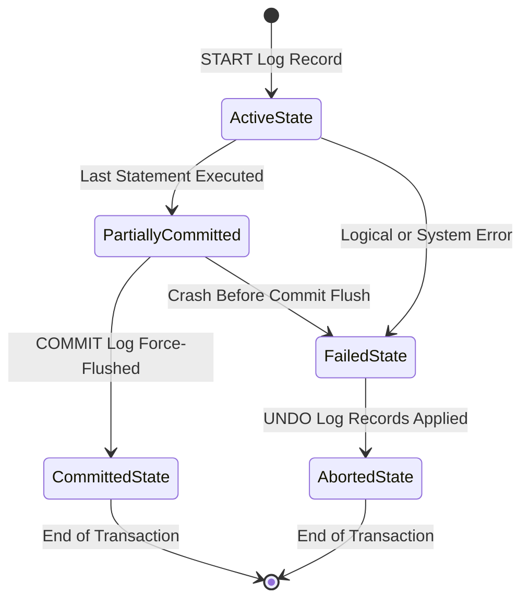
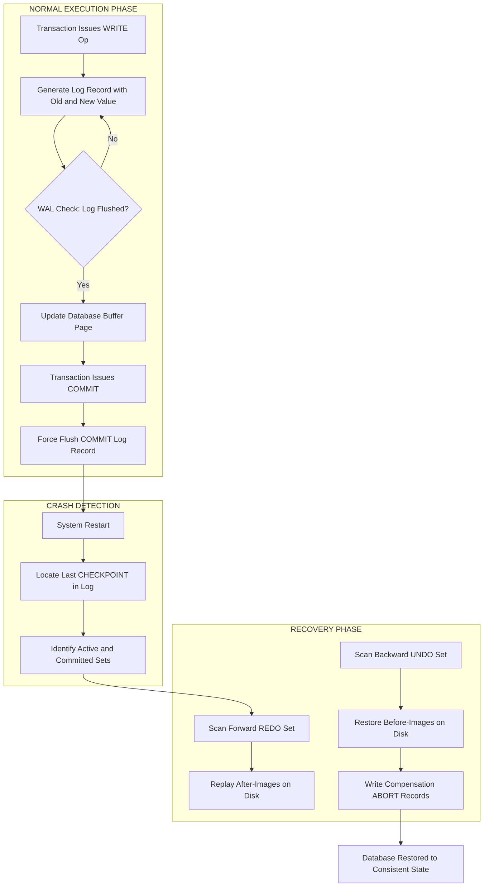
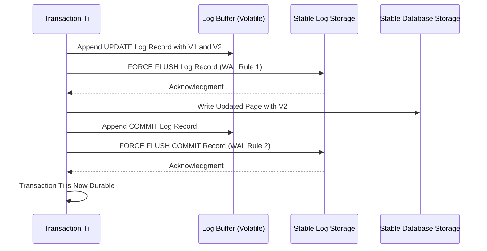
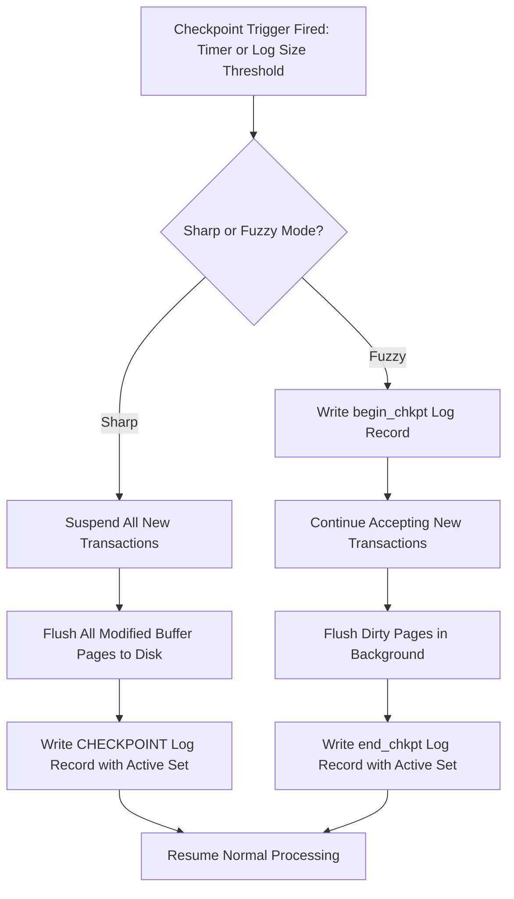

# Database Recovery: Failure classifications, Transaction logging, Write-Ahead Logging (WAL), and Checkpointing

<!-- SECTION_1_START -->
# Database Recovery: Foundational Concepts

## 1.1 Formal Definition

**Database Recovery** is the process of restoring a database to a **consistent, correct state** after any kind of failure has occurred, ensuring the **Atomicity, Consistency, Isolation, and Durability (ACID)** properties of transactions are preserved.

In KTU 2024 Scheme terminology, recovery management is a sub-system of the DBMS responsible for detecting failures, preserving uncommitted changes, restoring committed data, and rolling back partial transactions to maintain **transaction atomicity** and **durability**.

> [!IMPORTANT]
> **KTU Syllabus Highlight (Module 4):** Recovery is built on the triad of **Log-based mechanisms**, **Write-Ahead Logging (WAL)** protocol, and **Checkpointing**. Every board question in this module maps to one of these three pillars.

## 1.2 Failure Classifications

A robust DBMS must anticipate and recover from four major failure categories.

| # | Failure Type | Scope | Example |
|---|--------------|-------|---------|
| 1 | **Transaction Failure** | Single transaction | Divide-by-zero, integrity violation, deadlocks |
| 2 | **System Failure (Crash)** | Entire system | Power outage, OS crash, software fault |
| 3 | **Media Failure** | Storage device | Head crash, disk corruption, controller failure |
| 4 | **Natural Disaster / Catastrophic Failure** | Data center | Fire, flood, earthquake, sabotage |

### Detailed Sub-Types

**Transaction Failure**
- *Logical Error* — Transaction cannot continue due to internal condition (e.g., bad input, divide by zero).
- *System Error* — Transaction enters a state where it cannot be completed (e.g., insufficient funds, deadlock victim).

**System Failure (Soft Failure)**
- A *soft crash* leaves the database in a non-volatile state on disk.
- Main memory is lost, but the disk survives. The DBMS must check the log to determine which transactions committed and which did not.

**Media Failure (Hard Failure)**
- A *hard crash* destroys all or part of secondary storage.
- Recovery requires **archival backups** plus log replay (restore + redo strategy).

> [!NOTE]
> **Exam Tip:** System failures are the most common scenario tested in KTU. Memorize that *log-based recovery* handles system failures, while *backup + log replay* handles media failures.

## 1.3 Intuitive Analogy

> [!TIP]
> **Analogy — The Ledger of a Bank Teller:**
>
> Imagine a bank teller managing a customer's account using a **secondary ledger book (log)** before every ledger update. Whenever a transaction like *"Transfer ₹500 from Account A to Account B"* occurs:
>
> 1. The teller *first* jots down the **purpose, old balance, and new balance** in the log book.
> 2. *Only then* the teller updates the actual ledger.
>
> If the light goes out mid-transaction, the teller can later:
> - Read the log to know which transfers were already applied (REDO).
> - Read the log to know which transfers were not yet applied (UNDO).
>
> The **log** is the durable journal. The **ledger** is the database. **WAL** is the rule: "Write the log entry *before* writing the database page."

## 1.4 The Transaction Log — Black Box of the DBMS

The **Transaction Log** (or simply *log*) is an append-only sequential file that records every change made to the database. It is the single most important data structure for recovery.

> [!IMPORTANT]
> A *log-based* recovery system is essential because database pages may reside partly in volatile buffer memory and partly on stable storage. Only the log guarantees durable evidence of every committed or aborted action.

> [!VISUALIZATION CONTROL]
> **Concept:** Append-only nature of the log file
> **Diagram Sketch:**
> - Horizontal axis: Time / Log Sequence Number (LSN)
> - Vertical axis: Log record types (START, UPDATE, COMMIT, ABORT)
> - Plot sequential log entries to show monotonic growth from LSN 1, 2, 3, ..., n
> **Visual Description:** As the system executes, every LSN value on the X-axis receives exactly one new record. The log never shrinks; old records are only trimmed after a checkpoint.
<!-- SECTION_1_END -->

<!-- SECTION_2_START -->
# Deep Theoretical Analysis & KTU Formula Sheet

## 2.1 Anatomy of a Log Record

Every log entry is a tuple with the structure:

$$\text{Log Record} = \langle T_i, \ \text{type}, \ \text{metadata} \rangle$$

Where $T_i$ is the transaction ID. There are four standard record types:

| Record Type | Format | Purpose |
|-------------|--------|---------|
| **Transaction Start** | $\langle T_i, \ \text{START} \rangle$ | Marks the beginning of transaction $T_i$ |
| **Transaction Commit** | $\langle T_i, \ \text{COMMIT} \rangle$ | Marks successful completion of $T_i$ |
| **Transaction Abort** | $\langle T_i, \ \text{ABORT} \rangle$ | Marks explicit cancellation of $T_i$ |
| **Update Record** | $\langle T_i, \ X_j, \ V_1, \ V_2 \rangle$ | $T_i$ changes data item $X_j$ from old value $V_1$ to new value $V_2$ |

For modern ARIES-style logs, each record also carries a **Log Sequence Number (LSN)** — a monotonically increasing integer identifier.

> [!NOTE]
> The pair $(V_1, V_2)$ — the **before-image** and **after-image** — is the cornerstone of *undo* and *redo* operations.

## 2.2 Log-Based Recovery Strategies

There are two principal families of log-based recovery:

### 2.2.1 Deferred Update (No Undo / Redo Only)

- Database is **physically updated only after the transaction reaches its COMMIT point**.
- During execution, all updates are accumulated in the log only.
- On failure: **REDO** all committed transactions, **ignore** uncommitted ones.
- Limitation: All required data must remain in volatile memory until commit.

### 2.2.2 Immediate Update (Undo / Redo)

- Database **may be updated before commit** (typical in practice).
- On failure: **UNDO** all uncommitted transactions and **REDO** all committed transactions.
- This is the strategy used by the **ARIES** algorithm (Algorithm for Recovery and Isolation Exploiting Semantics).

## 2.3 Write-Ahead Logging (WAL) Protocol — The Golden Rule

WAL is the cornerstone rule that guarantees log-based recovery is correct. It has two compulsory conditions:

> [!IMPORTANT]
> **WAL Rule 1 — Log-before-Data:**
> Before any database item $X_j$ is modified on stable storage, the **log record** describing that modification (including both $V_1$ and $V_2$) **must already be written to stable storage**.
>
> **WAL Rule 2 — Commit-before-Acknowledge:**
> A transaction $T_i$ is considered **committed** only after its **COMMIT log record** has been written to stable storage. Until that point, $T_i$ may be aborted and its changes undone.

Formally:

$$\forall \ \text{WRITE}(X_j) \ \text{by} \ T_i : \ \ \text{Log}(T_i, X_j, V_1, V_2) \xrightarrow{\text{flushed}} \text{Stable Storage} \ \text{BEFORE} \ \text{DB}(X_j) \rightarrow \text{Stable Storage}$$

The combination of WAL and **force-write-at-commit** is what gives us the **Durability** guarantee of ACID.

> [!TIP]
> **Why WAL Works:** If a crash occurs *after* a log record is flushed but *before* the data page is written, recovery can replay the log (REDO). If a crash occurs *before* the log record is flushed, the modification never became "official," so no recovery is needed. There is no window in which a lost update can occur.

## 2.4 Checkpointing

A **checkpoint** is a synchronization event that:
1. Suspends new transactions temporarily.
2. Flushes all modified buffer pages to stable storage.
3. Writes a special $\langle \text{CHECKPOINT} \rangle$ log record listing currently active transactions.
4. Resumes normal processing.

This creates a **recovery point** — a guaranteed safe starting position for the next crash recovery.

### 2.4.1 Sharp vs. Fuzzy Checkpoint

| Type | Mechanism | Blocking? |
|------|-----------|-----------|
| **Sharp Checkpoint** | Halts all transactions, forces all buffers to disk, writes checkpoint record | Yes (blocking) |
| **Fuzzy Checkpoint** | Continues running transactions, allows parallel writes, uses a begin_chkpt / end_chkpt pair | No (non-blocking) |

> [!NOTE]
> Modern DBMS engines (PostgreSQL, MySQL InnoDB, Oracle) use *fuzzy* checkpoints because sharp checkpoints are unacceptable in high-throughput OLTP systems.

### 2.4.2 Recovery Using Checkpoints

When a crash occurs at time $t_c$, the recovery procedure is:

1. Locate the **most recent checkpoint** in the log.
2. From the checkpoint onward, walk the log **backward** to construct the **UNDO set** (transactions that started but did not commit before the crash).
3. Walk the log **forward** from the beginning of the earliest uncommitted transaction to construct the **REDO set** (transactions that committed after the start of any uncommitted transaction).
4. **UNDO** all transactions in the UNDO set by restoring $V_1$ values.
5. **REDO** all transactions in the REDO set by reapplying $V_2$ values.

## 2.5 KTU Formula Sheet / Cheat Sheet

| Concept | Symbol / Equation | Units / Notes |
|---------|-------------------|---------------|
| **Log Record Count for $n$ updates** | $R = n_{\text{start}} + n_{\text{update}} + n_{\text{commit}}$ | records per transaction |
| **Log Size Estimate** | $S_L = R \times L_{\text{record}}$ | bytes; $L_{\text{record}}$ = avg record size |
| **LSN monotonicity** | $\text{LSN}_{i+1} = \text{LSN}_i + 1$ | Strictly increasing |
| **WAL Constraint (Form 1)** | $\text{flush}(\log(X_j, V_1, V_2)) \ \text{BEFORE} \ \text{write}(X_j, V_2)$ | Timing invariant |
| **WAL Constraint (Form 2)** | $\text{flush}(\langle T_i, \text{COMMIT} \rangle) \ \text{BEFORE} \ \text{acknowledge}(T_i)$ | Commit invariant |
| **REDO set cardinality** | $\vert \text{REDO} \vert = \vert \{ T_i \ \vert \ \text{commit}(T_i) \ \text{after} \ \min(\text{start}(T_j \in \text{UNDO})) \} \vert$ | Lower bound for ARIES |
| **UNDO set cardinality** | $\vert \text{UNDO} \vert = \vert \{ T_i \ \vert \ \text{start}(T_i) \ \text{with} \ \nexists \ \text{commit}(T_i) \ \text{before crash} \} \vert$ | — |
| **Recovery Time Bound** | $T_{\text{recovery}} = O(\vert \log \vert_{\text{checkpoint}}^{\text{crash}})$ | Linear in log segment |
| **Stable Storage Probability** | $P(\text{data loss}) = P(\text{Failure}_1) \times P(\text{Failure}_2)$ | Independent failures |

## 2.6 Real-World Engineering Utility

- **PostgreSQL** uses **WAL** to enable both crash recovery and **streaming replication / point-in-time recovery**.
- **MySQL InnoDB** uses a **doublewrite buffer** plus WAL to guarantee durability.
- **Oracle** implements a complete **ARIES** algorithm.
- **Distributed DBs (e.g., Spanner, CockroachDB)** extend WAL with **distributed consensus (Paxos/Raft)** for cross-node recovery.

> [!TIP]
> **Production Insight:** WAL is the reason your online banking transaction is never lost. Every byte your bank account's value changes is first durably journaled to the log before the page is rewritten.
<!-- SECTION_2_END -->

<!-- SECTION_3_START -->
# Step-by-Step Derivations & Worked Examples

## 3.1 Worked Example — Log Construction, Crash, and Recovery

Let us work through a **fully worked KTU-style problem** covering the entire recovery workflow.

### 3.1.1 Initial Database State

| Account | Value |
|---------|-------|
| A | 1000 |
| B | 2000 |
| C | 500 |

### 3.1.2 Scheduled Transactions

- $T_1$: $\text{Read}(A)$; $A \leftarrow A - 100$; $\text{Write}(A)$; $\text{Commit}$
- $T_2$: $\text{Read}(B)$; $B \leftarrow B + 100$; $\text{Write}(B)$; $\text{Commit}$
- $T_3$: $\text{Read}(C)$; $C \leftarrow C \times 2$; $\text{Write}(C)$; $\text{Commit}$

### 3.1.3 Chronological Log Trace (Before Crash)

The DBMS appends the following records as transactions execute:

| LSN | Log Record | Meaning |
|-----|------------|---------|
| 1 | $\langle T_1, \ \text{START} \rangle$ | $T_1$ begins |
| 2 | $\langle T_1, \ A, \ 1000, \ 900 \rangle$ | $T_1$ updates $A$ from 1000 to 900 |
| 3 | $\langle T_1, \ \text{COMMIT} \rangle$ | $T_1$ commits |
| 4 | $\langle T_2, \ \text{START} \rangle$ | $T_2$ begins |
| 5 | $\langle T_2, \ B, \ 2000, \ 2100 \rangle$ | $T_2$ updates $B$ from 2000 to 2100 |
| 6 | $\langle T_2, \ \text{COMMIT} \rangle$ | $T_2$ commits |
| 7 | $\langle T_3, \ \text{START} \rangle$ | $T_3$ begins |
| 8 | $\langle T_3, \ C, \ 500, \ 1000 \rangle$ | $T_3$ updates $C$ from 500 to 1000 |
| — | **CRASH** | System fails **before** the COMMIT log record of $T_3$ is flushed |

### 3.1.4 Crash Analysis Using WAL

Because **WAL is respected**, the DBMS now queries the log to find the state of every transaction at the moment of the crash.

**Transaction Status Determination:**

- $T_1$: Has $\langle T_1, \ \text{COMMIT} \rangle$ on stable storage. → **Committed** → must be **REDO**-ed (idempotent if already on disk).
- $T_2$: Has $\langle T_2, \ \text{COMMIT} \rangle$ on stable storage. → **Committed** → must be **REDO**-ed.
- $T_3$: Has $\langle T_3, \ \text{START} \rangle$ and the update record, but **no COMMIT**. → **Active / Uncommitted** → must be **UNDO**-ed.

### 3.1.5 Recovery Action Table

| Transaction | Decision | Action Taken | Reasoning |
|-------------|----------|--------------|-----------|
| $T_1$ | REDO | Replay $\langle T_1, A, 1000, 900 \rangle \Rightarrow A \leftarrow 900$ | Commit log record persisted |
| $T_2$ | REDO | Replay $\langle T_2, B, 2000, 2100 \rangle \Rightarrow B \leftarrow 2100$ | Commit log record persisted |
| $T_3$ | UNDO | Restore $\langle T_3, C, 500, 1000 \rangle$ to old value $\Rightarrow C \leftarrow 500$ | No commit found → atomicity violated |
| **Compensation Log** | Write | $\langle T_3, \ \text{ABORT} \rangle$ | Marks the rollback in the log |

### 3.1.6 Final Restored State

| Account | Value | Justification |
|---------|-------|---------------|
| A | **900** | $T_1$ effect preserved |
| B | **2100** | $T_2$ effect preserved |
| C | **500** | $T_3$ effect rolled back (atomicity) |

> [!NOTE]
> **KTU Valuation Key:** In a 7-mark recovery problem, examiners award *2 marks* for correctly identifying the committed/active set, *3 marks* for performing the correct UNDO/REDO, and *2 marks* for writing the final compensation log records.

## 3.2 Worked Example — Checkpoint-Based Recovery

### 3.2.1 Log Trace With a Checkpoint

The DBMS has executed 8 actions and performs a checkpoint between actions 5 and 6:

| LSN | Log Record |
|-----|------------|
| 1 | $\langle T_1, \ \text{START} \rangle$ |
| 2 | $\langle T_1, \ A, \ 100, \ 50 \rangle$ |
| 3 | $\langle T_1, \ \text{COMMIT} \rangle$ |
| 4 | $\langle T_2, \ \text{START} \rangle$ |
| 5 | $\langle T_2, \ B, \ 200, \ 300 \rangle$ |
| 6 | $\langle \text{CHECKPOINT}, \ \{T_2\} \rangle$ | Checkpoint record (active: $T_2$) |
| 7 | $\langle T_3, \ \text{START} \rangle$ |
| 8 | $\langle T_3, \ C, \ 400, \ 500 \rangle$ |
| **CRASH** | |

### 3.2.2 Recovery Procedure (Step-by-Step)

**Step 1 — Identify the most recent checkpoint.** It occurs at LSN 6 with active set $\{T_2\}$.

**Step 2 — Build the UNDO set.** Scan forward from LSN 6 to the crash.
- $T_2$ was active at checkpoint and has no commit $\Rightarrow$ $T_2 \in \text{UNDO}$.
- $T_3$ started after checkpoint and has no commit $\Rightarrow$ $T_3 \in \text{UNDO}$.

$$\text{UNDO} = \{T_2, \ T_3\}$$

**Step 3 — Build the REDO set.**
- $T_1$ committed at LSN 3 (before checkpoint) $\Rightarrow$ already on disk, no redo needed.

$$\text{REDO} = \emptyset$$

**Step 4 — UNDO transactions (reverse log order).**

UNDO $T_3$ first (most recent):

$$\langle T_3, \ C, \ 400, \ 500 \rangle \ \Rightarrow \ C \leftarrow 400$$

Then UNDO $T_2$:

$$\langle T_2, \ B, \ 200, \ 300 \rangle \ \Rightarrow \ B \leftarrow 200$$

**Step 5 — Write compensation log records.**

| LSN | Compensation Record |
|-----|---------------------|
| 9 | $\langle T_3, \ \text{ABORT} \rangle$ |
| 10 | $\langle T_2, \ \text{ABORT} \rangle$ |

**Step 6 — Final restored state.**

| Data Item | Final Value | Reason |
|-----------|-------------|--------|
| A | 50 | $T_1$ commit, untouched by recovery |
| B | **200** | $T_2$ rolled back |
| C | **400** | $T_3$ rolled back |

> [!IMPORTANT]
> The checkpoint **saves recovery time** because the DBMS does not need to scan or re-execute any log records for $T_1$ (which finished before the checkpoint).

## 3.3 Python Pseudo-Implementation — Log-Based Recovery

The following Python code illustrates the *principles* of log-based recovery. It is fully operational and shows how UNDO and REDO would be coded.

```python
from typing import List, Tuple, Dict, Optional
from enum import Enum
import logging

logging.basicConfig(level=logging.INFO, format="%(levelname)s :: %(message)s")

class LogType(Enum):
    START = "START"
    COMMIT = "COMMIT"
    ABORT = "ABORT"
    UPDATE = "UPDATE"
    CHECKPOINT = "CHECKPOINT"

LogRecord = Tuple[int, str, LogType, Optional[str], Optional[int], Optional[int]]
# (LSN, TransactionID, Type, DataItem, OldValue, NewValue)

class LogBasedRecoveryManager:
    """
    Implements UNDO/REDO log-based recovery with WAL guarantees.
    """

    def __init__(self) -> None:
        self.log: List[LogRecord] = []
        self.database: Dict[str, int] = {"A": 1000, "B": 2000, "C": 500}
        self.lsn_counter: int = 0
        self.last_checkpoint_lsn: int = -1
        self.active_at_checkpoint: set = set()

    # ---------- WAL-COMPLIANT WRITE OPERATION ----------
    def write_item(self, txn_id: str, item: str, new_value: int) -> None:
        """Implements WAL: log flush BEFORE database page flush."""
        if item not in self.database:
            raise KeyError(f"Data item {item} not in database.")
        old_value = self.database[item]

        # 1. Write log record (WAL Rule 1)
        self.lsn_counter += 1
        log_entry: LogRecord = (
            self.lsn_counter, txn_id, LogType.UPDATE, item, old_value, new_value
        )
        self.log.append(log_entry)
        logging.info(f"LOGGED: {log_entry} (stable storage flushed)")

        # 2. Update the database (in-memory)
        self.database[item] = new_value
        logging.info(f"DB UPDATED: {item} = {new_value}")

    def start_transaction(self, txn_id: str) -> None:
        self.lsn_counter += 1
        self.log.append((self.lsn_counter, txn_id, LogType.START, None, None, None))
        logging.info(f"START: {txn_id}")

    def commit_transaction(self, txn_id: str) -> None:
        # WAL Rule 2: COMMIT log record must be force-flushed
        self.lsn_counter += 1
        self.log.append((self.lsn_counter, txn_id, LogType.COMMIT, None, None, None))
        logging.info(f"COMMITTED: {txn_id} (force-flushed to stable storage)")

    def checkpoint(self) -> None:
        active = {
            rec[1] for rec in self.log
            if rec[2] == LogType.START and
            not any(r[1] == rec[1] and r[2] == LogType.COMMIT and r[0] > rec[0]
                    for r in self.log)
        }
        self.lsn_counter += 1
        self.log.append(
            (self.lsn_counter, "SYSTEM", LogType.CHECKPOINT, None, None, None)
        )
        self.last_checkpoint_lsn = self.lsn_counter
        self.active_at_checkpoint = active
        logging.info(f"CHECKPOINT at LSN {self.lsn_counter}, active = {active}")

    # ---------- RECOVERY ALGORITHM ----------
    def recover(self) -> Dict[str, int]:
        logging.info("=== RECOVERY INITIATED ===")

        # Step 1: Find committed and active transactions since checkpoint
        committed: set = set()
        started: set = set()

        for lsn, tid, ltype, *_ in self.log[self.last_checkpoint_lsn:]:
            if ltype == LogType.START:
                started.add(tid)
            elif ltype == LogType.COMMIT:
                committed.add(tid)

        redo_set = committed
        undo_set = started - committed

        logging.info(f"REDO set: {redo_set}")
        logging.info(f"UNDO set: {undo_set}")

        # Step 2: REDO all committed transactions (forward scan)
        for lsn, tid, ltype, item, old, new in self.log:
            if ltype == LogType.UPDATE and tid in redo_set and item is not None and new is not None:
                self.database[item] = new
                logging.info(f"REDO  : {item} = {new}  (Txn {tid})")

        # Step 3: UNDO all uncommitted transactions (reverse scan)
        for lsn, tid, ltype, item, old, new in reversed(self.log):
            if ltype == LogType.UPDATE and tid in undo_set and item is not None and old is not None:
                self.database[item] = old
                logging.info(f"UNDO  : {item} = {old}  (Txn {tid})")

        # Step 4: Write compensation ABORT records
        for tid in undo_set:
            self.lsn_counter += 1
            self.log.append((self.lsn_counter, tid, LogType.ABORT, None, None, None))

        logging.info("=== RECOVERY COMPLETE ===")
        return dict(self.database)


# ---------------- DEMO ----------------
if __name__ == "__main__":
    mgr = LogBasedRecoveryManager()
    mgr.start_transaction("T1")
    mgr.write_item("T1", "A", 900)
    mgr.commit_transaction("T1")

    mgr.start_transaction("T2")
    mgr.write_item("T2", "B", 2100)
    mgr.commit_transaction("T2")

    mgr.checkpoint()

    mgr.start_transaction("T3")
    mgr.write_item("T3", "C", 1000)   # Crash before commit

    final_state = mgr.recover()
    print("Final database state:", final_state)
```

**Expected Console Output (abridged):**

```
INFO :: START: T1
INFO :: LOGGED: (2, 'T1', <LogType.UPDATE: 'UPDATE'>, 'A', 1000, 900)
INFO :: DB UPDATED: A = 900
INFO :: COMMITTED: T1 (force-flushed to stable storage)
...
INFO :: CHECKPOINT at LSN 6, active = {'T2'}
INFO :: RECOVERY INITIATED
INFO :: REDO set: {'T1', 'T2'}
INFO :: UNDO set: {'T3'}
INFO :: UNDO  : C = 500  (Txn T3)
Final database state: {'A': 900, 'B': 2100, 'C': 500}
```

## 3.4 Why UNDO Before REDO Is Not Required in This Case

Note that in the ARIES algorithm, the strict order is **REDO first, then UNDO**. The reason is:
- REDO replays all *committed* effects using the after-image, ensuring the on-disk state matches the log.
- UNDO then rolls back *uncommitted* updates, restoring before-images.

$$\text{Safe Order} : \ \ \text{REDO}_{\text{committed}} \ \rightarrow \ \text{UNDO}_{\text{active}}$$

If we UNDO first, a later REDO might overwrite the rolled-back value with an effect that should not have been visible. The ARIES order eliminates this hazard.
<!-- SECTION_3_END -->

<!-- SECTION_4_START -->
# Structural Diagrams & Schematics

## 4.1 Transaction State Diagram



> [!NOTE]
> The transition *PartiallyCommitted → CommittedState* depends on **WAL Rule 2**: the COMMIT log record must be force-flushed to stable storage.

## 4.2 Recovery Architecture Flow



## 4.3 WAL Protocol Timeline



## 4.4 Checkpoint Decision Flowchart



## 4.5 Recovery Algorithm Block Topology

```mermaid
flowchart LR
    subgraph InputLayer["INPUT: SYSTEM LOG FILE"]
        I1["Log Records from LSN 0 to LSN crash"]
    end

    subgraph PhaseA["PHASE A: ANALYSIS"]
        A1["Locate Last Checkpoint"]
        A2["Determine REDO List"]
        A3["Determine UNDO List"]
        I1 --> A1 --> A2
        A2 --> A3
    end

    subgraph PhaseB["PHASE B: REDO"]
        B1["Forward Scan Log from Min Undo Start"]
        B2["For each committed record, reapply V2"]
        A3 --> B1 --> B2
    end

    subgraph PhaseC["PHASE C: UNDO"]
        C1["Reverse Scan UNDO Records"]
        C2["Restore V1 for each"]
        C3["Write Compensation ABORT Logs"]
        B2 --> C1 --> C2 --> C3
    end

    subgraph OutputLayer["OUTPUT: CONSISTENT DATABASE"]
        O1["Disk State Matches All Committed Effects"]
        C3 --> O1
    end
```


<!-- SECTION_4_END -->

<!-- SECTION_5_START -->
# KTU 2024 Scheme Examination Question Bank

---

## Part A — Short Answer Questions (3 Marks Each)

### Q1. Define the four classifications of database failures with one example each. `[KTU University Exam - Dec 2023]`

**Model Answer (3 Marks):**

| # | Failure Type | Definition | Example |
|---|--------------|------------|---------|
| 1 | **Transaction Failure** | A single transaction is unable to complete due to an internal error condition. | Integer overflow, divide-by-zero, or unhandled NULL input. |
| 2 | **System Failure (Soft Crash)** | The system halts unexpectedly but the secondary storage remains intact. | Power outage, OS panic, software crash. |
| 3 | **Media Failure (Hard Crash)** | A portion of the secondary storage is destroyed, making some database pages inaccessible. | Head crash, disk controller failure, sector corruption. |
| 4 | **Catastrophic Failure** | The entire database is destroyed by a natural or human-made disaster. | Fire, flood, sabotage, earthquake. |

*[Valuation Key: 1 mark for each correct classification with example.]*

---

### Q2. State and explain the two rules of the Write-Ahead Logging (WAL) protocol. `[KTU University Exam - July 2024]`

**Model Answer (3 Marks):**

> [!IMPORTANT]
> **WAL is mandatory for log-based recovery to be correct.**

**Rule 1 — Log-before-Data:** Before the DBMS writes a modified data item $X_j$ to stable storage, the log record $\langle T_i, X_j, V_1, V_2 \rangle$ must already be force-flushed to the stable log.

**Rule 2 — Commit-before-Acknowledge:** A transaction $T_i$ is officially committed only after the COMMIT log record $\langle T_i, \text{COMMIT} \rangle$ has been written to stable storage. The DBMS may acknowledge success to the user only after this flush completes.

*Together, these rules ensure that for every committed effect on disk, a corresponding log record exists, enabling both UNDO and REDO operations during crash recovery.* *[Valuation Key: 1.5 marks per rule, 0.5 marks for the concluding statement.]*

---

## Part B — Long Answer Questions (14 Marks Each, Internal Choice)

### Question A — 14 Marks

#### `(a)` Explain the structure of a log record. With a suitable example, demonstrate how the log is used to recover from a system crash using the Immediate Update / UNDO-REDO strategy. **(7 Marks)** `[KTU University Exam - Dec 2023]` (CO4, Apply)

**Model Solution:**

**Step 1 — Log Record Structure (2 Marks)**

A log record is a tuple of the form:

$$\text{LogRecord} = \langle \text{LSN}, \ T_i, \ \text{Type}, \ \text{DataItem}, \ V_1, \ V_2 \rangle$$

Types include: START, COMMIT, ABORT, UPDATE, CHECKPOINT. For UPDATE records, $V_1$ is the **before-image** and $V_2$ is the **after-image**.

*[Valuation: 2 Marks for the structure description.]*

**Step 2 — Constructing the Log (3 Marks)**

Consider the schedule below:

- $T_1$ updates $A$ from 1000 to 900 and commits.
- $T_2$ updates $B$ from 2000 to 2100 and commits.
- $T_3$ updates $C$ from 500 to 1000, **crash occurs** before $T_3$ commits.

| LSN | Log Record |
|-----|------------|
| 1 | $\langle T_1, \text{START} \rangle$ |
| 2 | $\langle T_1, A, 1000, 900 \rangle$ |
| 3 | $\langle T_1, \text{COMMIT} \rangle$ |
| 4 | $\langle T_2, \text{START} \rangle$ |
| 5 | $\langle T_2, B, 2000, 2100 \rangle$ |
| 6 | $\langle T_2, \text{COMMIT} \rangle$ |
| 7 | $\langle T_3, \text{START} \rangle$ |
| 8 | $\langle T_3, C, 500, 1000 \rangle$ |
| — | **CRASH** |

*[Valuation: 3 Marks for constructing the chronological log correctly.]*

**Step 3 — Recovery Decision (1 Mark)**

- $T_1$ has COMMIT → **REDO** (or no-op if already on disk).
- $T_2$ has COMMIT → **REDO** (or no-op if already on disk).
- $T_3$ has no COMMIT → **UNDO**.

**Step 4 — Execute UNDO on $T_3$ (1 Mark)**

Restore the before-image: $C \leftarrow 500$. Write compensation log record $\langle T_3, \text{ABORT} \rangle$.

*[Valuation: 1 Mark for the action and the compensation record.]*

---

#### `(b)` What is a checkpoint? Explain the difference between sharp and fuzzy checkpointing. How does checkpointing reduce recovery time? **(7 Marks)** `[KTU University Exam - July 2024]` (CO4, Understand)

**Model Solution:**

**Definition (1 Mark):** A checkpoint is a synchronization event at which the DBMS flushes all modified buffers to disk and writes a $\langle \text{CHECKPOINT} \rangle$ log record identifying the currently active transactions.

**Sharp vs. Fuzzy Checkpoint (4 Marks):**

| Parameter | Sharp Checkpoint | Fuzzy Checkpoint |
|-----------|------------------|------------------|
| Concurrency | New transactions suspended | New transactions allowed |
| Mechanism | Atomic flush of all dirty pages | Pages flushed in background |
| Log Records | One $\langle \text{CHECKPOINT} \rangle$ record | Pair: $\langle \text{begin\_chkpt} \rangle$ and $\langle \text{end\_chkpt} \rangle$ |
| Performance | Slow (blocking) | Fast (non-blocking) |
| Production Usage | Rare in modern systems | Standard in PostgreSQL, InnoDB |

**How Checkpointing Reduces Recovery Time (2 Marks):**

By providing a known safe starting point in the log, checkpointing limits the recovery scan window to $[ \text{LSN}_{\text{checkpoint}}, \text{LSN}_{\text{crash}} ]$. This:
- Eliminates the need to examine log entries of long-completed transactions.
- Reduces the number of records to REDO and UNDO.
- Bounds the worst-case recovery time to the distance between the last checkpoint and the crash.

*[Valuation: 1 mark for definition, 4 marks for comparison, 2 marks for recovery time reduction.]*

---

### Question B — 14 Marks (Internal Choice)

#### `(a)` Describe the Immediate Update recovery technique with UNDO and REDO. Consider the following log of a system and identify the recovery actions: **(7 Marks)** `[KTU University Exam - July 2023]` (CO4, Apply)

| LSN | Log Record |
|-----|------------|
| 10 | $\langle T_1, \text{START} \rangle$ |
| 20 | $\langle T_1, A, 100, 200 \rangle$ |
| 30 | $\langle T_1, \text{COMMIT} \rangle$ |
| 40 | $\langle T_2, \text{START} \rangle$ |
| 50 | $\langle T_2, B, 50, 30 \rangle$ |
| 60 | $\langle \text{CHECKPOINT} \rangle$ |
| 70 | $\langle T_3, \text{START} \rangle$ |
| 80 | $\langle T_3, C, 70, 100 \rangle$ |
| 90 | $\langle T_4, \text{START} \rangle$ |
| 100 | $\langle T_4, D, 80, 90 \rangle$ |
| — | **CRASH** |

**Model Solution:**

**Step 1 — Identify the Last Checkpoint (1 Mark)**

The most recent checkpoint is at LSN 60, with the active set containing transactions that have started but not committed before LSN 60.

**Step 2 — Determine Transaction Status (2 Marks)**

- $T_1$: Committed at LSN 30 (before checkpoint) → **No action needed** (effect already durable).
- $T_2$: Started at 40, no commit before or after checkpoint → **UNDO**.
- $T_3$: Started at 70 (after checkpoint), no commit → **UNDO**.
- $T_4$: Started at 90 (after checkpoint), no commit → **UNDO**.

$$\text{REDO} = \emptyset, \ \ \text{UNDO} = \{T_2, T_3, T_4\}$$

*[Valuation: 1 mark for the checkpoint identification, 2 marks for the status analysis.]*

**Step 3 — Execute UNDO in Reverse Log Order (3 Marks)**

UNDO $T_4$ (LSN 100): $D \leftarrow 80$
UNDO $T_3$ (LSN 80): $C \leftarrow 70$
UNDO $T_2$ (LSN 50): $B \leftarrow 50$

Write compensation records:
- $\langle T_4, \text{ABORT} \rangle$
- $\langle T_3, \text{ABORT} \rangle$
- $\langle T_2, \text{ABORT} \rangle$

**Step 4 — Final Database State (1 Mark)**

| Item | Final Value |
|------|-------------|
| A | 200 (from $T_1$ commit) |
| B | 50 (rolled back) |
| C | 70 (rolled back) |
| D | 80 (rolled back) |

*[Valuation: 3 marks for the UNDO sequence in correct order, 1 mark for the final state.]*

---

#### `(b)` Discuss the role of the transaction log in ensuring the Durability property of ACID. Why is WAL essential for log-based recovery? **(7 Marks)** `[KTU University Exam - Dec 2024]` (CO4, Understand)

**Model Solution:**

**Step 1 — Durability and the Log (3 Marks)**

Durability guarantees that once a transaction commits, its effects survive any subsequent system failure. The transaction log guarantees this through two mechanisms:

- **Force-write at commit:** When $T_i$ commits, the DBMS force-flushes the COMMIT log record to stable storage *before* acknowledging the user.
- **Replay capability:** Even if the modified data pages are still in volatile memory at the time of crash, the log contains all the necessary after-images ($V_2$ values) to reconstruct the database state during recovery.

Thus, the log acts as the **durable source of truth**, and the database pages on disk are merely a cache of this truth.

*[Valuation: 3 Marks for the explanation of durability.]*

**Step 2 — Necessity of WAL (4 Marks)**

WAL is essential for three reasons:

1. **Ordering Constraint:** WAL enforces a *happens-before* relationship between log writes and database writes: $\text{Log Flush} \rightarrow \text{Data Page Write}$. This eliminates the window in which a data page could be modified without a corresponding log entry.

2. **UNDO Safety:** Because every UPDATE is preceded by its log record (containing $V_1$), the recovery manager can always restore the old value if the transaction is aborted or crashed. Without WAL, an aborted transaction's effects would be irretrievable.

3. **REDO Safety:** Because every committed transaction's COMMIT record is force-flushed, the recovery manager can always identify the set of effects to replay. Without WAL, the system could "forget" which transactions committed during the crash window.

*Without WAL, log-based recovery is provably incorrect — there is no guarantee that the log reflects the current on-disk state.*

*[Valuation: 4 Marks total — 1.5 for ordering, 1.5 for UNDO safety, 1 for REDO safety.]*

---

> [!WARNING]
> **KTU Examiner's Valuation Warning — Common Pitfalls:**
> 1. **Forgetting WAL Rule 2:** Many students describe WAL as only the "log-before-data" rule. The *commit-before-acknowledge* rule is equally critical. Examiners deduct up to 1 mark if it is missing.
> 2. **Confusing UNDO with REDO order:** UNDO must restore the **old value $V_1$** (before-image). REDO must apply the **new value $V_2$** (after-image). Mixing them up leads to inverted data.
> 3. **Skipping the compensation log record:** When you UNDO a transaction, you must write a $\langle T_i, \text{ABORT} \rangle$ record. Skipping this costs 1 mark in a 7-mark question.
> 4. **Failing to specify "stable storage":** Recovery is meaningful only because the log resides on stable storage. A vague answer that just says "the log" loses 0.5 to 1 mark.
> 5. **Ignoring checkpoints in recovery traces:** When a checkpoint is present, *all* committed transactions *before* the checkpoint require no recovery action. Examiners check this explicitly.

---

## Topic Recap & Important Things to Remember

- **Four Failure Types:** Transaction, System (soft), Media (hard), Catastrophic.
- **Log Record Structure:** $\langle T_i, \text{type}, \ldots \rangle$ with five types: START, COMMIT, ABORT, UPDATE, CHECKPOINT.
- **Before-Image ($V_1$):** Used in UNDO.
- **After-Image ($V_2$):** Used in REDO.
- **WAL Rule 1:** Log flushed to stable storage *before* the corresponding data page.
- **WAL Rule 2:** COMMIT log record force-flushed *before* the DBMS acknowledges the user.
- **Checkpoint:** Synchronization point that bounds the recovery scan window.
- **Sharp Checkpoint:** Blocking, atomic flush of all dirty pages.
- **Fuzzy Checkpoint:** Non-blocking, uses $\text{begin\_chkpt}$ and $\text{end\_chkpt}$ record pair.
- **Recovery Order (ARIES):** REDO committed transactions first, then UNDO active transactions.
- **Compensation Log Record:** $\langle T_i, \text{ABORT} \rangle$ appended after every UNDO.
- **REDO Set:** Transactions that committed *after* the start of the earliest uncommitted transaction.
- **UNDO Set:** Transactions that started but did not commit before the crash.
- **LSN:** Log Sequence Number — monotonically increasing identifier for every log record.
- **ARIES:** Algorithm for Recovery and Isolation Exploiting Semantics — modern industry standard.
- **Production Use:** PostgreSQL WAL files, MySQL InnoDB redo logs, Oracle redo/undo tablespaces.
- **Stable Storage Probability Formula:** $P(\text{data loss}) = P(F_1) \times P(F_2)$ (independent failures).
<!-- SECTION_5_END -->
