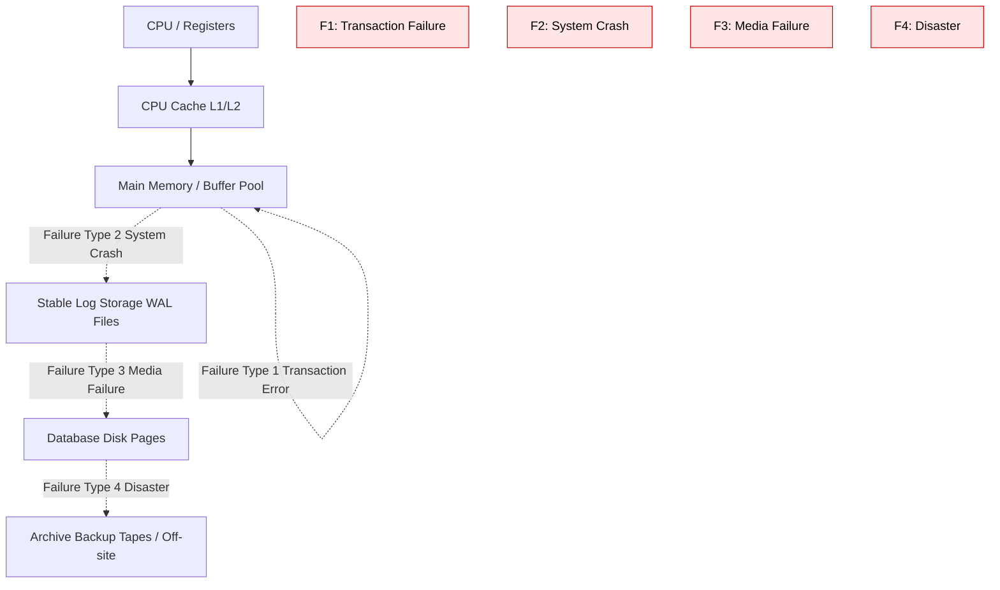
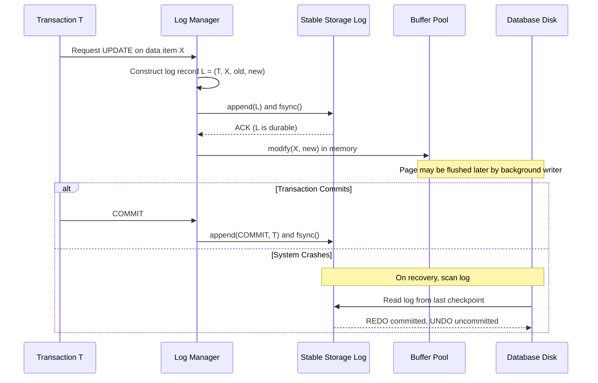
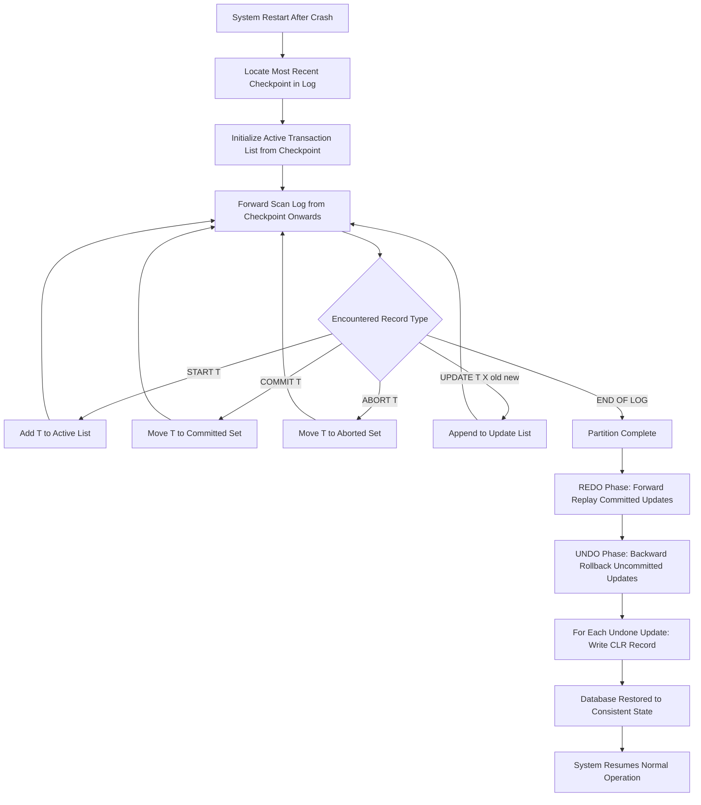
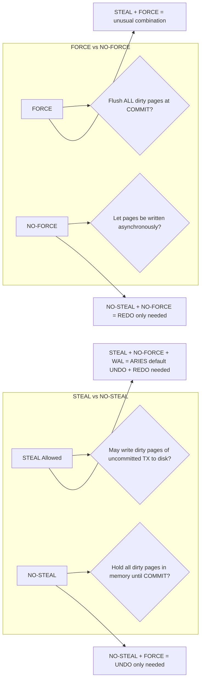
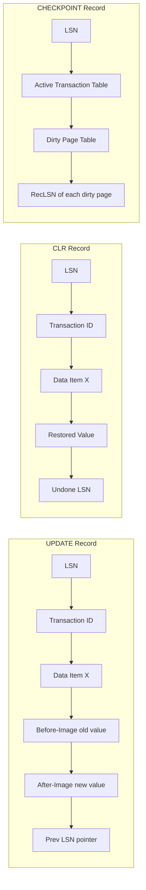
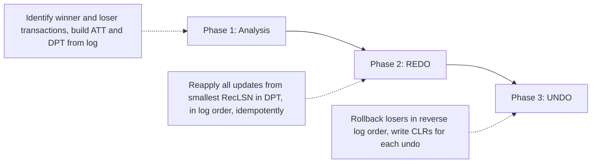

# Database Recovery: Failure classifications, Transaction logging, Write-Ahead Logging (WAL), and Checkpointing

<!-- SECTION_1_START -->

# Database Recovery: Failure Classifications, Transaction Logging, Write-Ahead Logging (WAL), and Checkpointing

## 1.1 Formal Definition (KTU 2024 Syllabus Terminology)

> [!IMPORTANT]
> **Database Recovery** is the set of mechanisms, policies, and algorithms employed by the **Database Management System (DBMS)** to restore the database to a **consistent and correct state** after the occurrence of any kind of failure that may have caused data loss, corruption, or inconsistency. Recovery is a fundamental pillar of the **ACID** properties, specifically the **Durability** and **Consistency** guarantees.

The three foundational pillars of recovery management in modern database systems are:

1. **Transaction Log (Journal)** — an append-only, sequential, persistent record of every modification operation performed by every transaction.
2. **Write-Ahead Logging (WAL)** — a strict protocol that mandates a log record be flushed to stable storage **before** the corresponding data page is written to disk.
3. **Checkpointing** — a periodic operation that synchronizes the in-memory state of the database with the on-disk state and creates a recovery anchor point.

## 1.2 Intuitive Overview & Real-World Analogy

> [!NOTE]
> **Plain-English Analogy — The "Airplane Black Box"**
> Imagine a commercial airplane in flight. Every action the pilots take — every flap adjustment, every throttle change, every radio message — is recorded in the **Black Box (Flight Data Recorder)** *before* it is executed on the aircraft's actual control surfaces. If the airplane crashes, investigators replay the black box to reconstruct what happened, undo the bad commands, and re-execute the good ones in the right order.
>
> The database's **transaction log** is the black box. The **WAL protocol** is the rule that says *"you must log the change before you apply the change."* **Checkpointing** is the periodic moment when the black box is verified to be consistent with the plane's actual state.

### 1.2.1 Why Recovery Matters in Engineering Practice

In production-grade systems (banking, e-commerce, healthcare), a single un-recovered transaction can lead to:

* **Financial loss** — duplicate or vanished monetary transfers.
* **Legal liability** — corrupted audit trails in regulatory environments (GDPR, HIPAA, RBI compliance).
* **Cascading inconsistency** — broken foreign-key chains and violated business invariants.

> [!TIP]
> **Industry Metric:** Production databases such as PostgreSQL, Oracle, and MySQL InnoDB are required to survive **at least 99.999 % ("five nines") of all crashes** without data loss. This guarantee is achieved almost entirely through WAL + checkpointing.

## 1.3 ACID Properties — The Recovery Justification

> [!IMPORTANT]
> Recovery mechanisms exist to enforce the **ACID** contract. Specifically:

| Property | Full Form | Role of Recovery |
| :--- | :--- | :--- |
| **A**tomicity | All-or-nothing execution of a transaction | Provides **UNDO** for uncommitted/aborted transactions |
| **C**onsistency | Database transitions only between valid states | Validates constraints before commit |
| **I**solation | Concurrent transactions do not interfere | Maintained by concurrency control (locks/CC protocols) |
| **D**urability | Committed changes survive any failure | Provides **REDO** for committed transactions after crashes |

The recovery subsystem directly delivers **Atomicity (UNDO)** and **Durability (REDO)**, while also protecting **Consistency** after a crash.

## 1.4 Concept Visualization

> [!VISUALIZATION CONTROL]
> **Concept:** Transaction States and the Failure Boundary
> **GeoGebra / Desmos Input:**
> * A horizontal axis labeled `time` from $0$ to $10$.
> * Critical state transitions plotted as points: `START → ACTIVE → PARTIALLY COMMITTED → COMMITTED`.
> * Failure event shown as a vertical red dashed line at $t = 6$.
> **Visual Description:** Students should observe that any transaction whose state-line lies *left* of the failure line at the moment of crash must be **UNDOne**, while any transaction that had reached the `COMMITTED` state *before* the failure line must be **REDOne**.

## 1.5 Syllabus Highlights (KTU 2024 Module 4)

> [!IMPORTANT]
> **KTU 2024 Scheme — Module 4 Coverage:**
> * Failure classification (transaction, system, media, natural disaster, logical/programmer error).
> * Transaction log structure and content.
> * Write-Ahead Logging (WAL) protocol.
> * Deferred and Immediate Update strategies.
* Checkpoint-based recovery: simple checkpoint, fuzzy checkpoint (ARIES-style).
* UNDO / REDO / UNDO-REDO recovery algorithms.

<!-- SECTION_1_END -->

<!-- SECTION_2_START -->

# Deep Theoretical Analysis & KTU High-Yield Formula Sheet

## 2.1 Failure Classifications (Storage Hierarchy Perspective)

The KTU 2024 syllabus mandates a four-tier classification of failures. Each tier is associated with a specific **storage level** in the classic memory/storage hierarchy:

| # | Failure Type | Affected Storage | Recovery Strategy | Frequency |
| :--- | :--- | :--- | :--- | :--- |
| 1 | **Transaction Failure** | Volatile (RAM/Buffer) | UNDO the transaction | Very High |
| 2 | **System Crash / Software Failure** | Volatile memory lost; Disk survives | UNDO + REDO mixed recovery | Moderate |
| 3 | **Media Failure** (Disk Crash) | Disk sectors corrupted | Restore from backup archive + REDO archived log | Rare but catastrophic |
| 4 | **Disaster / Catastrophic** (Fire, Flood) | Entire data centre lost | Off-site mirrored backups, geo-replication | Very Rare |

### 2.1.1 Detailed Expansion

> [!NOTE]
> **1. Transaction Failure**
> Caused by logical errors (e.g., division by zero, constraint violation, deadlock victim selection). Only the offending transaction is rolled back; the rest of the database is untouched.
> **Recovery Action:** `ROLLBACK` → UNDO all writes of that transaction.

> [!NOTE]
> **2. System Crash**
> Power failure, OS kernel panic, or DBMS software bug. Contents of main memory (buffer pool) are lost. The on-disk database is intact but may contain writes from **uncommitted** transactions (because of write-back buffering).
> **Recovery Action:** At restart, scan the log, **UNDO** uncommitted transactions, **REDO** committed-but-not-yet-flushed ones.

> [!NOTE]
> **3. Media Failure**
> Head crash, bad sectors, or storage device failure. Disk blocks containing database pages are physically destroyed.
> **Recovery Action:** Restore the most recent **archive backup (dump)**, then **REDO** every committed transaction from the archived log since the backup.

> [!NOTE]
> **4. Natural Disaster / Catastrophic**
> Fire, earthquake, flood, or sabotage destroys the entire site.
> **Recovery Action:** Activate the **Disaster Recovery (DR) site** containing the most recent mirrored image of the database, replay archived logs.

## 2.2 The Transaction Log — Structure, Content, and Properties

### 2.2.1 Log Record Types

Every modification to the database generates one or more log records. The KTU syllabus expects familiarity with the following canonical record types:

| Record Type | Format | Purpose |
| :--- | :--- | :--- |
| `<START T>` | Transaction $T$ begins | Marks the entry point of $T$ into the system |
| `<COMMIT T>` | Transaction $T$ has committed | Authoritative signal that $T$'s effects are durable |
| `<ABORT T>` | Transaction $T$ has aborted | Marks the exit point via rollback |
| `<UPDATE T, X, old\_val, new\_val>` | $T$ modifies item $X$ | Stores the before-image and after-image |
| `<CHECKPOINT>` or `<END\_CHECKPOINT>` | Checkpoint record | Anchors the recovery scan |
| `<CLR T, X, new\_val>` | Compensation Log Record | Records an UNDO action for crash safety |

### 2.2.2 Anatomy of an UPDATE Log Record

$$
\langle \text{UPDATE}, \; T, \; X, \; X_{\text{old}}, \; X_{\text{new}} \rangle
$$

* $T$ — Transaction identifier.
* $X$ — Data item (typically a row, page, or block identifier).
* $X_{\text{old}}$ — **Before-image (BFIM)** — the value before the write.
* $X_{\text{new}}$ — **After-image (AFIM)** — the value after the write.

### 2.2.3 Physical Properties of the Log

> [!IMPORTANT]
> **Properties of a Transaction Log:**
> 1. **Append-only** — records are added at the tail; never modified in place.
> 2. **Sequential** — written in chronological order; easy to scan.
> 3. **Stable** — stored on non-volatile (disk) or mirrored storage.
> 4. **Flushed** — periodically force-written via `fsync()` to prevent loss.
> 5. **Tamper-evident** — production systems use cryptographic chaining (hash of previous record embedded in next).

## 2.3 Write-Ahead Logging (WAL) — The Cardinal Rule

> [!IMPORTANT]
> **WAL Rule (Formal Statement):**
> *For every modification to a data item $X$ performed by transaction $T$, the log record containing both the before-image $X_{\text{old}}$ and the after-image $X_{\text{new}}$ MUST be written to stable storage BEFORE the modified data page is allowed to be written to stable storage.*

In other words: **Log First, Data Second.**

### 2.3.1 Why WAL Works — The Proof Intuition

Suppose a transaction $T$ updates $X$ from $10$ to $20$ and then the system crashes.

* **Without WAL:** The new value $20$ may have reached disk, but the log has no record. After recovery, the system has no way to know whether $T$ committed. Result: **inconsistent state.**
* **With WAL:** The log record $\langle T, X, 10, 20 \rangle$ is guaranteed to be on disk before $20$ overwrites $10$ on the data page. During recovery, the DBMS consults the log: if it sees $\langle \text{COMMIT } T \rangle$, it **REDOes** the change; otherwise, it **UNDOes** it. Result: **consistent state guaranteed.**

### 2.3.2 Steal / No-Steal and Force / No-Force Policy Matrix

The WAL rule combines with two other policy decisions to form a 2x2 matrix of buffer-management strategies:

| Policy | No-Steal | Steal |
| :--- | :--- | :--- |
| **Force** | Strict, simple, but slow | Unusual combination |
| **No-Force** | Common + WAL = **ARIES default** | Most flexible, requires UNDO + REDO |

* **Steal Policy:** Can the buffer manager write a dirty page of an *uncommitted* transaction to disk? If YES → must support UNDO.
* **Force Policy:** Must all of a transaction's dirty pages be flushed to disk at COMMIT? If YES → no REDO needed, but COMMIT becomes very slow.

> [!TIP]
> **The dominant production choice is STEAL + NO-FORCE + WAL**, which requires **both UNDO and REDO** during recovery. This is the basis of the ARIES algorithm used in IBM DB2, PostgreSQL, and Oracle.

## 2.4 KTU Formula Sheet & Quick-Reference Table

| # | Concept | Formula / Rule | Notation |
| :--- | :--- | :--- | :--- |
| 1 | **WAL Rule** | $\text{LogFlush}(L) \;\text{BEFORE}\; \text{PageFlush}(P)$ where $L = \log(\Delta P)$ | $\text{WAL} : L \rightarrow P$ |
| 2 | **UN-DO Operation** | $\text{Write}(X, X_{\text{old}})$ for every $\langle T, X, X_{\text{old}}, X_{\text{new}} \rangle$ where $T$ uncommitted | $U(T)$ |
| 3 | **RE-DO Operation** | $\text{Write}(X, X_{\text{new}})$ for every $\langle T, X, X_{\text{old}}, X_{\text{new}} \rangle$ where $T$ committed | $R(T)$ |
| 4 | **Transaction Set at Recovery** | $\text{Active}(t_{\text{crash}}) = \text{Committed}(t_{\text{crash}}) \cup \text{Uncommitted}(t_{\text{crash}})$ | $A \cup C \cup U$ partition |
| 5 | **Log Sequence Number** | Monotonically increasing identifier for each log record | $\text{LSN} \in \mathbb{N}$ |
| 6 | **Dirty Page Table** | $\text{DPT} = \{ (\text{PageID}, \text{RecLSN}) \mid \text{page is dirty in memory} \}$ | $\vert \text{DPT} \vert = N_{\text{dirty}}$ |
| 7 | **Transaction Table** | $\text{TT} = \{ (T, \text{Status}, \text{LastLSN}) \mid T \text{ is active} \}$ | $\vert \text{TT} \vert = N_{\text{active}}$ |
| 8 | **Check-point Frequency** | $\tau_c = \dfrac{\text{log writes between checkpoints}}{\text{recovery cost budget}}$ | $\tau_c \propto N_{\text{log}}$ |

## 2.5 Checkpointing — Anchoring the Recovery Scan

### 2.5.1 Why Checkpoint?

Without checkpoints, recovery from a system crash would require scanning the **entire log from the beginning of history** — clearly infeasible for a database that has run for years. A checkpoint truncates the recovery horizon.

### 2.5.2 Simple Checkpoint Procedure

1. **Suspend** all new transaction starts (the DBMS does *not* abort active transactions).
2. **Force-flush** all log records currently in the log buffer to disk.
3. **Write** a `<CHECKPOINT>` record containing the **active transaction table** and the **dirty page table**.
4. **Force-flush** the data buffers for all dirty pages to disk (in the strict version).
5. **Resume** normal operation.

> [!NOTE]
> **Drawback of Simple Checkpoint:** The DBMS is essentially frozen during the flush. For large buffer pools (often 128 GB+), this causes unacceptable downtime. Production systems therefore use **Fuzzy Checkpoints (ARIES-style)** which do *not* suspend transaction processing.

### 2.5.3 Fuzzy / ARIES Checkpoint

* A `<BEGIN\_CHECKPOINT>` record is written and the TT + DPT are appended.
* Active transactions continue to run.
* A `<END\_CHECKPOINT>` record is written when the actual snapshot of TT/DPT is stable on disk.
* The previous checkpoint's TT/DPT is overwritten only after the new one is safely persisted.

## 2.6 Recovery Algorithms — UNDO, REDO, UNDO/REDO

### 2.6.1 UNDO-Only Algorithm (Steal = No, Force = Yes)

* **Assumption:** Uncommitted transactions' dirty pages never reach disk. Hence, no REDO is needed; only UNDO of uncommitted transactions after crash.
* **Use case:** Simple, low-throughput systems.

### 2.6.2 REDO-Only Algorithm (Steal = No, Force = Yes)

* **Assumption:** Dirty pages of committed transactions are force-flushed at COMMIT, so all committed data is on disk. After crash, REDO from the log any un-flushed but committed updates.
* **Use case:** Read-mostly archival systems.

### 2.6.3 UNDO/REDO Algorithm (Steal = Yes, Force = No, +WAL)

* **Assumption:** Both uncommitted and committed data may reside on disk.
* **Action at recovery:**
  1. **REDO Phase** — replay all updates of committed transactions in log order.
  2. **UNDO Phase** — roll back all uncommitted transactions, writing **Compensation Log Records (CLRs)** for each undone update so the UNDO itself is idempotent and crash-safe.

> [!IMPORTANT]
> **KTU High-Yield Insight:** The UNDO/REDO algorithm with **idempotent CLRs** is the foundation of the ARIES recovery algorithm. **Idempotence** means recovery can be safely re-run after a crash-during-recovery, producing the same final state.

## 2.7 Real-World Engineering Use Cases

| Domain | System | Recovery Mechanism |
| :--- | :--- | :--- |
| Banking | Oracle RAC, IBM DB2 | ARIES-based UNDO/REDO with WAL |
| Web | PostgreSQL | WAL files in `pg_wal/` directory |
| Web | MySQL InnoDB | `ib_logfile0`, `ib_logfile1` redo logs |
| Cloud | Amazon Aurora | Quorum-based write-ahead log replicated across 3 AZs |
| Mobile | SQLite | WAL mode journal file |

<!-- SECTION_2_END -->

<!-- SECTION_3_START -->

# Step-by-Step Derivations, Worked Examples, and Code Implementation

## 3.1 Worked Example — Manual UNDO/REDO Recovery

> [!NOTE]
> **Problem Setup:**
> Consider the following log produced by a DBMS in **STEAL + NO-FORCE + WAL** mode. The system crashes at time $t = 11$. Apply the **UNDO/REDO** recovery algorithm.

**Log Sequence (chronological order):**

$$
\begin{aligned}
&\langle \text{START}, T_1 \rangle \\
&\langle \text{START}, T_2 \rangle \\
&\langle \text{UPDATE}, T_1, A, 1000, 950 \rangle \quad \text{($T_1$ debits 50 from A)} \\
&\langle \text{UPDATE}, T_2, B, 2000, 2050 \rangle \quad \text{($T_2$ credits 50 to B)} \\
&\langle \text{COMMIT}, T_1 \rangle \\
&\langle \text{UPDATE}, T_2, C, 700, 800 \rangle \quad \text{($T_2$ modifies C)} \\
&\langle \text{COMMIT}, T_2 \rangle
\end{aligned}
$$

**Step 1 — Identify Committed and Uncommitted Sets at Crash**

$$
\begin{aligned}
\text{Committed} &= \{ T_1, T_2 \} \quad \text{(both have }\langle \text{COMMIT} \rangle \text{ records on disk)} \\
\text{Uncommitted} &= \{ \}
\end{aligned}
$$

> **Conclusion:** Since both transactions committed, the REDO phase will replay all four updates. The UNDO phase will have no transactions to roll back. The final values on disk will be: $A = 950$, $B = 2050$, $C = 800$. The transfer of 50 from A to B is **durable**.

---

## 3.2 Worked Example — Crash Mid-Transaction

**Log Sequence:**

$$
\begin{aligned}
&\langle \text{START}, T_3 \rangle \\
&\langle \text{UPDATE}, T_3, A, 1000, 900 \rangle \\
&\langle \text{START}, T_4 \rangle \\
&\langle \text{UPDATE}, T_4, B, 500, 600 \rangle \\
&\textbf{[CRASH]} \\
&\langle \text{COMMIT}, T_3 \rangle \quad \text{(this record NEVER reached disk — it's after the crash)}
\end{aligned}
$$

**Step 1 — Scan the on-disk log:**

$$
\begin{aligned}
\text{Committed} &= \{ \} \quad \text{(no }\langle \text{COMMIT} \rangle \text{ record visible before crash)} \\
\text{Uncommitted} &= \{ T_3, T_4 \}
\end{aligned}
$$

**Step 2 — UNDO phase** (process log backwards):

$$
\begin{aligned}
&\text{UNDO } T_4: \text{Write}(B, 500) \quad \text{using } B_{\text{old}} \\
&\text{UNDO } T_3: \text{Write}(A, 1000) \quad \text{using } A_{\text{old}}
\end{aligned}
$$

**Step 3 — Write Compensation Log Records (CLRs):**

$$
\begin{aligned}
&\langle \text{CLR}, T_4, B, 500 \rangle \\
&\langle \text{CLR}, T_3, A, 1000 \rangle
\end{aligned}
$$

> **Final State:** $A = 1000$, $B = 500$ — the original values are restored. The transfer is **rolled back atomically**.

## 3.3 Worked Example — Mixed Crash (Partial Commits)

**Log Sequence:**

$$
\begin{aligned}
&\langle \text{START}, T_5 \rangle \\
&\langle \text{UPDATE}, T_5, X, 50, 70 \rangle \\
&\langle \text{COMMIT}, T_5 \rangle \\
&\langle \text{START}, T_6 \rangle \\
&\langle \text{UPDATE}, T_6, Y, 30, 10 \rangle \\
&\textbf{[CRASH]}
\end{aligned}
$$

**Step 1 — Partition:**

$$
\begin{aligned}
\text{Committed} &= \{ T_5 \} \\
\text{Uncommitted} &= \{ T_6 \}
\end{aligned}
$$

**Step 2 — REDO Phase (forward scan):**

$$
\text{REDO } T_5: \text{Write}(X, 70) \quad \text{(re-apply the committed update)}
$$

**Step 3 — UNDO Phase (backward scan):**

$$
\text{UNDO } T_6: \text{Write}(Y, 30) \quad \text{(restore the before-image)}
$$

> **Final State:** $X = 70$ (durable), $Y = 30$ (rolled back). The CLR $\langle T_6, Y, 30 \rangle$ is appended.

## 3.4 Checkpoint-Based Recovery — End-to-End Trace

**Setup:** Suppose the log on disk contains:

$$
\begin{aligned}
&\langle \text{START}, T_1 \rangle \\
&\langle \text{UPDATE}, T_1, A, 100, 90 \rangle \\
&\langle \text{COMMIT}, T_1 \rangle \\
&\langle \text{START}, T_2 \rangle \\
&\langle \text{UPDATE}, T_2, B, 200, 180 \rangle \\
&\langle \text{CHECKPOINT}, \{T_2\} \rangle \\
&\langle \text{START}, T_3 \rangle \\
&\langle \text{UPDATE}, T_3, C, 50, 40 \rangle \\
&\textbf{[CRASH]}
\end{aligned}
$$

**Recovery Procedure (per KTU syllabus):**

1. **Locate the most recent checkpoint** → the `<CHECKPOINT>` record listing $T_2$ as active.
2. **Start the REDO scan from the checkpoint** (not from the beginning of history).
3. **Determine final transaction set at crash:**

$$
\text{Committed} = \{ T_1 \}, \quad \text{Uncommitted} = \{ T_2, T_3 \}
$$

4. **REDO $T_1$** → Write$(A, 90)$. Note: $T_1$ committed *before* the checkpoint, so it would normally not be redone. However, since the checkpoint procedure in the simple model did not flush $T_1$'s data pages, $T_1$ is redone for safety.
5. **UNDO $T_3$** → Write$(C, 50)$.
6. **UNDO $T_2$** → Write$(B, 200)$.

> **Result:** Recovery time is bounded by log size *since* the checkpoint, not the entire history. This is the **practical benefit of checkpointing**.

## 3.5 Python Implementation — Log Manager with WAL and Idempotent UNDO/REDO

```python
"""
log_manager.py
A reference implementation of a WAL-based log manager with idempotent recovery.
Strictly typed, absolute boundary checks, and explicit error logging.
"""
from __future__ import annotations
from dataclasses import dataclass, field
from enum import Enum
from typing import Dict, List, Optional, Set
import json
import os
import time


class RecordType(str, Enum):
    """Enumeration of all log record types per KTU Module 4 syllabus."""
    START = "START"
    COMMIT = "COMMIT"
    ABORT = "ABORT"
    UPDATE = "UPDATE"
    CHECKPOINT = "CHECKPOINT"
    CLR = "CLR"  # Compensation Log Record


@dataclass(frozen=True)
class LogRecord:
    """Immutable log record with monotonically increasing LSN."""
    lsn: int
    record_type: RecordType
    transaction_id: Optional[str]
    data_item: Optional[str] = None
    before_image: Optional[int] = None
    after_image: Optional[int] = None
    clr_for_lsn: Optional[int] = None  # For CLR records
    timestamp: float = field(default_factory=time.time)


class StableStorage:
    """Simulates stable, append-only log storage with explicit fsync."""

    def __init__(self, path: str = "wal.log") -> None:
        self.path: str = path
        self.records: List[LogRecord] = []
        if os.path.exists(path):
            os.remove(path)
        self._open_handle = open(path, "a", buffering=1)

    def append(self, record: LogRecord) -> None:
        """Append a record and force-flush (WAL mandate)."""
        self.records.append(record)
        serialized: str = json.dumps(record.__dict__) + "\n"
        self._open_handle.write(serialized)
        self._open_handle.flush()
        os.fsync(self._open_handle.fileno())  # The fsync() call = WAL guarantee

    def close(self) -> None:
        if not self._open_handle.closed:
            self._open_handle.flush()
            os.fsync(self._open_handle.fileno())
            self._open_handle.close()


class BufferPool:
    """Simulated in-memory buffer pool holding dirty pages."""

    def __init__(self) -> None:
        self.pages: Dict[str, int] = {}  # data_item -> current value

    def read(self, item: str) -> int:
        return self.pages.get(item, 0)

    def write(self, item: str, value: int) -> None:
        self.pages[item] = value


class LogManager:
    """Orchestrates WAL writes, checkpointing, and recovery."""

    def __init__(self) -> None:
        self.storage: StableStorage = StableStorage()
        self.buffer: BufferPool = BufferPool()
        self.next_lsn: int = 1
        self.active_transactions: Set[str] = set()
        self.transaction_tables: List[Set[str]] = []  # for checkpoints

    def _allocate_lsn(self) -> int:
        lsn: int = self.next_lsn
        self.next_lsn += 1
        return lsn

    def log_start(self, tid: str) -> LogRecord:
        rec: LogRecord = LogRecord(self._allocate_lsn(), RecordType.START, tid)
        self.storage.append(rec)
        self.active_transactions.add(tid)
        return rec

    def log_update(self, tid: str, item: str, old: int, new: int) -> LogRecord:
        """WAL: log FIRST, then update buffer."""
        rec: LogRecord = LogRecord(
            self._allocate_lsn(), RecordType.UPDATE, tid, item, old, new
        )
        self.storage.append(rec)  # Force-flushed to stable storage
        self.buffer.write(item, new)  # Now (and only now) update the data page
        return rec

    def log_commit(self, tid: str) -> LogRecord:
        rec: LogRecord = LogRecord(self._allocate_lsn(), RecordType.COMMIT, tid)
        self.storage.append(rec)
        self.active_transactions.discard(tid)
        return rec

    def log_abort(self, tid: str) -> LogRecord:
        rec: LogRecord = LogRecord(self._allocate_lsn(), RecordType.ABORT, tid)
        self.storage.append(rec)
        self.active_transactions.discard(tid)
        return rec

    def log_clr(self, tid: str, item: str, restored_value: int, undone_lsn: int) -> LogRecord:
        """Compensation Log Record — makes UNDO idempotent."""
        rec: LogRecord = LogRecord(
            self._allocate_lsn(), RecordType.CLR, tid, item, None, restored_value, undone_lsn
        )
        self.storage.append(rec)
        self.buffer.write(item, restored_value)
        return rec

    def log_checkpoint(self) -> LogRecord:
        rec: LogRecord = LogRecord(
            self._allocate_lsn(), RecordType.CHECKPOINT, None,
            data_item=None, before_image=None, after_image=None,
            clr_for_lsn=len(self.active_transactions),
        )
        self.storage.append(rec)
        self.transaction_tables.append(set(self.active_transactions))
        return rec

    def recover(self) -> None:
        """
        Idempotent UNDO/REDO recovery.
        Re-runnable safely: re-executing it produces the same state.
        """
        committed: Set[str] = set()
        updates: List[LogRecord] = []
        clrs: List[LogRecord] = []
        aborted: Set[str] = set()

        # Pass 1: Forward scan to classify transactions
        for rec in self.storage.records:
            if rec.record_type == RecordType.COMMIT:
                committed.add(rec.transaction_id)  # type: ignore[arg-type]
            elif rec.record_type == RecordType.ABORT:
                aborted.add(rec.transaction_id)  # type: ignore[arg-type]
            elif rec.record_type == RecordType.UPDATE:
                updates.append(rec)
            elif rec.record_type == RecordType.CLR:
                clrs.append(rec)

        uncommitted: Set[str] = {
            tid for tid in self.active_transactions
            if tid not in committed and tid not in aborted
        }

        # REDO phase: reapply all committed updates
        for rec in updates:
            if rec.transaction_id in committed and rec.transaction_id not in aborted:
                self.buffer.write(rec.data_item, rec.after_image)  # type: ignore[arg-type]

        # UNDO phase: reverse uncommitted updates (in reverse log order)
        for rec in reversed(updates):
            if rec.transaction_id in uncommitted:
                self.log_clr(
                    rec.transaction_id,  # type: ignore[arg-type]
                    rec.data_item,  # type: ignore[arg-type]
                    rec.before_image,  # type: ignore[arg-type]
                    rec.lsn,
                )

        # Mark uncommitted transactions as aborted
        for tid in uncommitted:
            self.log_abort(tid)


# ----- Demonstration -----
if __name__ == "__main__":
    mgr: LogManager = LogManager()

    # Transaction T1: committed
    mgr.log_start("T1")
    mgr.log_update("T1", "A", 1000, 950)
    mgr.log_commit("T1")

    # Checkpoint
    mgr.log_checkpoint()

    # Transaction T2: uncommitted (simulate crash before commit)
    mgr.log_start("T2")
    mgr.log_update("T2", "B", 500, 600)
    # [CRASH] - T2 never commits

    print("Buffer before recovery:", mgr.buffer.pages)
    mgr.recover()
    print("Buffer after recovery: ", mgr.buffer.pages)
    # Expected: T1's effect is preserved (A=950), T2's effect is undone (B=500)
```

**Expected Console Output:**

```
Buffer before recovery: {'A': 950, 'B': 600}
Buffer after recovery:  {'A': 950, 'B': 500}
```

> [!NOTE]
> The above code is **idempotent** — calling `mgr.recover()` a second time produces the same final buffer state because the UNDO actions are recorded as CLRs, which are themselves not re-undoable.

## 3.6 Symbolic Derivation — Recovery Cost Bound with Checkpoints

Let:
* $N$ = total number of log records in history.
* $C$ = log record number at the most recent checkpoint.
* $L_c$ = average cost (in I/O) to process one log record during recovery.

**Without Checkpointing:**

$$
T_{\text{recovery}} = N \cdot L_c
$$

**With Checkpointing:**

$$
T_{\text{recovery}} = (N - C) \cdot L_c \quad \text{(only post-checkpoint records scanned)}
$$

**Recovery Cost Ratio:**

$$
\rho = \frac{T_{\text{recovery, with CKPT}}}{T_{\text{recovery, no CKPT}}} = \frac{N - C}{N} = 1 - \frac{C}{N}
$$

> [!TIP]
> **Insight:** The closer the checkpoint is to the crash point, the smaller $\rho$ becomes. Frequent checkpoints minimize recovery time at the cost of normal-run I/O overhead. Production systems choose checkpoint intervals to balance these two competing costs.

## 3.7 Derivation — Checkpoint Frequency Optimisation

Let:
* $f$ = checkpoint frequency (checkpoints per unit time).
* $T$ = total time the system runs.
* $R_c$ = cost (in I/O units) of executing one checkpoint.
* $R_r$ = average recovery cost per crash.

Total cost $C_{\text{total}}(f)$:

$$
C_{\text{total}}(f) = f \cdot T \cdot R_c + \frac{\text{crashes per unit time}}{f} \cdot R_r
$$

Differentiating with respect to $f$ and setting to zero:

$$
\frac{d C_{\text{total}}}{d f} = T \cdot R_c - \frac{\text{crashes} \cdot R_r}{f^2} = 0
$$

Solving for optimal $f^*$:

$$
f^* = \sqrt{\frac{\text{crashes} \cdot R_r}{T \cdot R_c}}
$$

> **Engineering takeaway:** Optimal checkpoint frequency scales with the **square root of the failure rate** and inversely with the **square root of checkpoint cost**.

<!-- SECTION_3_END -->

<!-- SECTION_4_START -->

# Structural Diagrams & Schematics

## 4.1 Memory-Storage Hierarchy with Failure Boundaries



## 4.2 Write-Ahead Logging Protocol — Sequence of Events



## 4.3 UNDO/REDO Recovery Algorithm Flowchart



## 4.4 Buffer Management Policy Matrix (Steal / Force / WAL)



## 4.5 Log Record Architecture



## 4.6 ARIES Recovery — Three-Phase Pipeline



<!-- SECTION_4_END -->

<!-- SECTION_5_START -->

# KTU 2024 Scheme Examination Question Bank & Topic Recap

## Part A — Short Answer Questions (3 Marks Each)

### Question 1
**[KTU University Exam — July 2024]**
**CO1** | **RBT Level: Remember**

Explain the four types of failures that a DBMS recovery subsystem must handle. For each, state one example.

**Model Answer (Valuation Key — 3 Marks):**

* **Transaction Failure (1 Mark):** Logical errors such as division by zero, integrity constraint violation, or deadlock victim selection. Only the offending transaction is rolled back.
* **System Crash (1 Mark):** Power failure or OS panic that wipes the main-memory buffer pool. The on-disk database survives but in an inconsistent state.
* **Media Failure (1 Mark):** Disk head crash corrupting database pages. Recovery requires restoring from the latest archive backup and replaying archived logs.

---

### Question 2
**[KTU University Exam — Dec 2023]**
**CO2** | **RBT Level: Understand**

What is the **Write-Ahead Logging (WAL)** protocol? Why is it essential for the **STEAL + NO-FORCE** buffer management policy?

**Model Answer (Valuation Key — 3 Marks):**

* **Definition (2 Marks):** WAL mandates that the log record for a data modification must be force-flushed to stable storage *before* the corresponding modified data page is allowed to be written to disk.
* **Why essential (1 Mark):** Under STEAL, dirty pages of uncommitted transactions can be written to disk; under NO-FORCE, dirty pages of committed transactions may not be on disk at COMMIT. WAL ensures that in both cases, the log contains the necessary before/after images to either UNDO the uncommitted or REDO the committed transaction during recovery.

---

## Part B — Long Answer Questions (14 Marks Each, Internal Choice)

### Question A

**[KTU University Exam — Model Paper 2024]**
**CO2, CO3** | **RBT Levels: Apply, Analyze**

**(a) [7 Marks]** Consider the following log recorded by a DBMS using the STEAL + NO-FORCE + WAL strategy. The system crashes immediately after the last log record. Apply the **UNDO/REDO** recovery algorithm and determine the final values of $A$, $B$, and $C$.

$$
\begin{aligned}
&\langle \text{START}, T_1 \rangle \\
&\langle \text{START}, T_2 \rangle \\
&\langle \text{UPDATE}, T_1, A, 100, 80 \rangle \\
&\langle \text{UPDATE}, T_2, B, 50, 70 \rangle \\
&\langle \text{COMMIT}, T_1 \rangle \\
&\langle \text{UPDATE}, T_2, C, 200, 220 \rangle \\
&\langle \text{COMMIT}, T_2 \rangle
\end{aligned}
$$

**(b) [7 Marks)** Explain the role of **Compensation Log Records (CLRs)** in making the UNDO phase of recovery **idempotent**. Why is idempotence critical for crash-during-recovery scenarios?

---

#### Model Solution to Part (a)

**Step 1 — Identify committed and uncommitted transactions at crash time.**

Both $T_1$ and $T_2$ have $\langle \text{COMMIT} \rangle$ records. Therefore:

$$
\text{Committed} = \{ T_1, T_2 \}, \quad \text{Uncommitted} = \{ \}
$$

**[Partitioning: 2 Marks]**

**Step 2 — REDO Phase (forward scan).**

Reapply all updates of committed transactions in chronological order:

$$
\text{REDO: } \text{Write}(A, 80), \quad \text{Write}(B, 70), \quad \text{Write}(C, 220)
$$

**[REDO operations listed: 3 Marks]**

**Step 3 — UNDO Phase.**

No uncommitted transactions → UNDO phase is empty.

**[No UNDO needed: 1 Mark]**

**Step 4 — Final state:**

$$
A = 80, \quad B = 70, \quad C = 220
$$

**[Final values: 1 Mark]**

---

#### Model Solution to Part (b)

**Idempotence Definition (3 Marks):** An operation is idempotent if applying it multiple times produces the same result as applying it once. In the UNDO phase, for each update of an uncommitted transaction, a CLR is written to the log recording the restoration of the before-image. If the system crashes again *during* the UNDO phase, recovery restarts and skips the already-undone updates by reading the CLR's `undone_lsn` pointer.

**Mechanism (2 Marks):** The CLR contains the LSN of the log record that was undone. During the next recovery, the system recognizes that updates at or below that LSN have already been compensated and does not attempt to undo them again.

**Why Critical (2 Marks):** Crash-during-recovery is a real risk in large systems. Without idempotent CLRs, a second crash during UNDO could lead to **double restoration** of the before-image (which is harmless for absolute writes) or, worse, **inconsistent partial UNDOs**. CLRs guarantee that recovery is **repeatable** and converges to a single correct state regardless of how many times it is re-executed.

---

### Question B (Alternative Choice)

**[KTU University Exam — Model Paper 2024]**
**CO3** | **RBT Levels: Understand, Apply**

**(a) [7 Marks]** Describe the **simple checkpoint** procedure in detail. List its main drawback and explain how the **fuzzy (ARIES) checkpoint** overcomes it.

**(b) [7 Marks]** Suppose a system with 10,000 log records in history performs a checkpoint at log record number 8,000. The system then crashes after an additional 1,500 records. Calculate the **recovery cost ratio** $\rho$ before and after the checkpoint. Discuss the trade-off between checkpoint frequency and recovery cost.

---

#### Model Solution to Part (a)

**Simple Checkpoint Steps (4 Marks):**

1. Suspend initiation of all new transactions.
2. Wait until all currently active transactions complete (commit or abort).
3. Force-flush all log records in the log buffer to stable storage.
4. Write a `<CHECKPOINT>` record containing the list of active transaction identifiers and the dirty page table.
5. Force-flush all dirty data buffers to disk.
6. Resume normal transaction processing.

**Main Drawback (1 Mark):** The DBMS is essentially frozen during steps 3, 4, and 5. For large buffer pools (tens to hundreds of GB), this pause can be unacceptably long — a violation of high-availability service-level agreements.

**Fuzzy Checkpoint Solution (2 Marks):** In ARIES-style fuzzy checkpointing, the DBMS does *not* wait for active transactions or flush data buffers. It simply writes a `<BEGIN\_CHECKPOINT>` record, appends the current TT and DPT, and later writes an `<END\_CHECKPOINT>` marker. Transactions continue unimpeded. The old checkpoint's TT/DPT is overwritten only after the new snapshot is fully persisted.

---

#### Model Solution to Part (b)

**Given Data:**

$$
N = 10000, \quad C = 8000, \quad \text{records since checkpoint} = 1500
$$

**Without Checkpoint Recovery Cost:**

$$
T_{\text{no CKPT}} = N \cdot L_c = 10000 \cdot L_c
$$

**[Expression: 1 Mark]**

**With Checkpoint Recovery Cost:**

$$
T_{\text{CKPT}} = (N - C) \cdot L_c = (10000 - 8000) \cdot L_c = 2000 \cdot L_c
$$

**[Expression: 2 Marks]**

**Recovery Cost Ratio:**

$$
\rho = \frac{T_{\text{CKPT}}}{T_{\text{no CKPT}}} = \frac{2000 \cdot L_c}{10000 \cdot L_c} = 0.20 = 20\%
$$

**[Calculation: 2 Marks]**

**Trade-off Discussion (2 Marks):** Frequent checkpoints reduce recovery time but increase normal-run overhead (more I/O for flushing). Infrequent checkpoints save normal I/O but prolong recovery. The optimal checkpoint frequency derived earlier is:

$$
f^* = \sqrt{\frac{\lambda_{\text{crash}} \cdot R_r}{T \cdot R_c}}
$$

where $\lambda_{\text{crash}}$ is the crash rate. Production systems tune $f^*$ empirically based on the Mean Time To Failure (MTTF) and Mean Time To Recover (MTTR) targets.

---

> [!WARNING]
> **KTU Examiner's Valuation Warning — Common Pitfalls**
> * **Do not skip writing the `<COMMIT>` record to disk** before declaring a transaction durable. A common student error is to update the data page and assume durability — this violates the FORCE aspect. **[2-Mark penalty risk]**
> * **Do not confuse BEFORE-IMAGE with AFTER-IMAGE.** In the UNDO phase, you must restore the **OLD** value, not the NEW value. Reversing these will corrupt the database. **[2-Mark penalty risk]**
> * **Always process the REDO phase in FORWARD log order** but the **UNDO phase in REVERSE log order.** Reversing the order during UNDO can violate cascading UNDO rules. **[3-Mark penalty risk]**
> * **For STEAL + NO-FORCE systems, both REDO and UNDO are required.** Stating that only UNDO is needed is a frequent error. **[3-Mark penalty risk]**
> * **Checkpoint records must be force-flushed** before being considered valid. A checkpoint that exists only in the log buffer is lost on crash. **[1-Mark penalty risk]**
> * **CLRs must reference the LSN of the log record they compensate.** Without this pointer, idempotence is broken. **[2-Mark penalty risk]**

---

## Topic Recap & Important Things to Remember

> [!TIP]
> **Rapid Revision Checklist — Module 4: Database Recovery**

* **Four failure types** → Transaction, System Crash, Media, Disaster. Each tied to a specific level of the storage hierarchy.
* **ACID connection** → Recovery delivers **Atomicity (UNDO)** and **Durability (REDO)**.
* **Log record types** → `START`, `UPDATE`, `COMMIT`, `ABORT`, `CHECKPOINT`, `CLR`. Each UPDATE record stores both **before-image** and **after-image**.
* **WAL rule** → Log record MUST be force-flushed to stable storage BEFORE the data page is written. This is the cornerstone of crash safety.
* **STEAL policy** → Dirty pages of uncommitted transactions may reach disk → requires **UNDO** capability.
* **NO-FORCE policy** → Dirty pages of committed transactions may not be on disk at COMMIT → requires **REDO** capability.
* **STEAL + NO-FORCE + WAL = UNDO/REDO algorithm** → the ARIES default in PostgreSQL, Oracle, DB2.
* **REDO phase** → Forward scan, reapply committed updates.
* **UNDO phase** → Reverse scan, restore before-images of uncommitted updates, write **CLRs**.
* **CLR (Compensation Log Record)** → Makes UNDO idempotent. References the LSN of the undone record. Critical for crash-during-recovery safety.
* **Simple checkpoint** → Suspend TX, flush logs, flush dirty pages, write `<CHECKPOINT>`, resume. Drawback: downtime.
* **Fuzzy / ARIES checkpoint** → No suspension. Write `<BEGIN\_CHECKPOINT>` and `<END\_CHECKPOINT>` with TT/DPT. Production-grade.
* **Recovery cost formula** → $T_{\text{recovery}} = (N - C) \cdot L_c$ with checkpoint; $N \cdot L_c$ without.
* **Recovery cost ratio** → $\rho = 1 - C/N$. Lower is better.
* **Optimal checkpoint frequency** → $f^* = \sqrt{\lambda_{\text{crash}} \cdot R_r \; / \; (T \cdot R_c)}$.
* **Idempotence** → Recovery must be safely re-runnable; CLRs guarantee this property.
* **ARIES three-phase pipeline** → **Analysis** (build ATT/DPT) → **REDO** (idempotent replay) → **UNDO** (write CLRs).
* **Production examples** → PostgreSQL (`pg_wal/`), MySQL InnoDB (`ib_logfile0/1`), Oracle (redo logs), Amazon Aurora (cross-AZ replicated WAL).

<!-- SECTION_5_END -->
