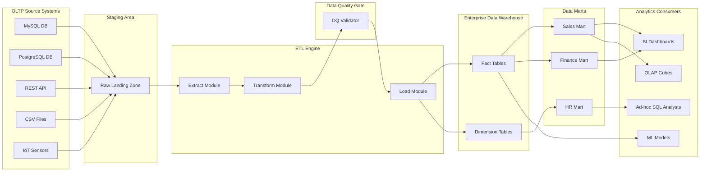
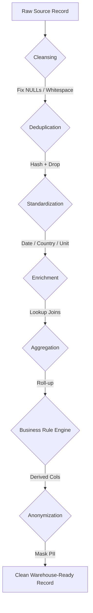
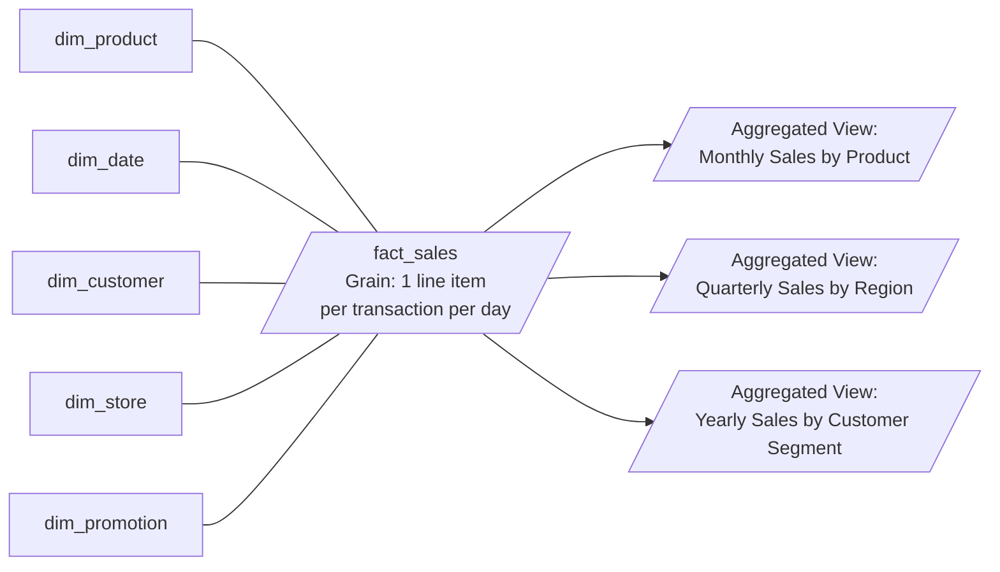
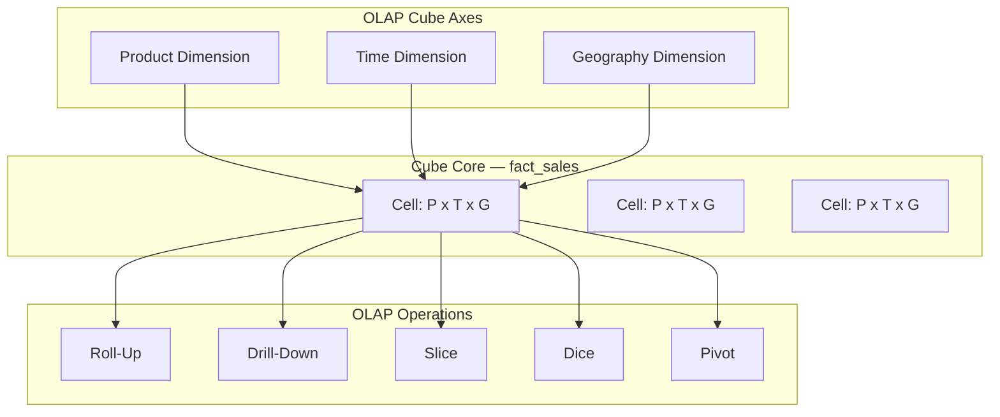

# Fundamentals of ETL (Extract, Transform, Load) pipelines, Data Warehousing, and Basic Data Analytics

<!-- SECTION_1_START -->

# Fundamentals of ETL Pipelines, Data Warehousing, and Basic Data Analytics

> [!IMPORTANT]
> **KTU 2024 Scheme | PCCST402 | Module 4 | CO4 (Understand, Apply)**
> This module bridges traditional transactional database theory with modern analytical data engineering. Mastery of ETL, warehouse schemas, and analytical query patterns is **mandatory** for KTU ESE, as questions typically interleave schema design with pipeline logic.

---

## 1.1 What is a Data Warehouse?

A **Data Warehouse (DW)** is a *subject-oriented, integrated, time-variant, and non-volatile* collection of organized data designed to support **management decision-making** and **analytical reporting** rather than day-to-day transactional processing.

Formally defined by **W. H. Inmon** (the "father of data warehousing"), the four defining characteristics are:

| Characteristic | Meaning |
|---|---|
| **Subject-Oriented** | Organized around major business subjects (e.g., *Sales*, *Inventory*, *Customers*), not around applications. |
| **Integrated** | Data is unified from heterogeneous sources (RDBMS, flat files, APIs) under consistent naming, units, and formats. |
| **Time-Variant** | Historical data is preserved for **5–10 years**; every record carries an explicit timestamp. |
| **Non-Volatile** | Data is **load-only** — once written, it is rarely updated or deleted. Only `INSERT` and bulk `LOAD` operations occur. |

> [!NOTE]
> **Real-World Analogy — The Factory Warehouse:** Imagine a manufacturing company with 50 retail outlets. Each outlet maintains its own *operational register* (current sales, billing, stock — i.e., the OLTP system). At the end of every month, data from all 50 registers is **transported, cleaned, packaged, and stored** in a central regional warehouse. The regional warehouse does **not** sell anything — it only stores historical goods so that the **CEO/analyst** can study monthly trends. That central storage is your *Data Warehouse*.

---

## 1.2 What is ETL?

**ETL** stands for **Extract, Transform, Load** — the three-stage pipeline that moves data from source systems into the data warehouse while enforcing quality, consistency, and structural conformity.

> [!IMPORTANT]
> **KTU High-Yield Definition:** ETL is the *backbone procedure* used to populate a data warehouse. It is a scheduled, repeatable, and auditable batch/streaming process that guarantees the warehouse remains a **single source of truth** for analytical workloads.

### The Three Phases at a Glance

1. **Extract** — Pull raw data from heterogeneous sources (MySQL, MongoDB, CSV logs, REST APIs, IoT sensors).
2. **Transform** — Apply business rules: cleansing, deduplication, type conversion, aggregation, joining, encoding, anonymization.
3. **Load** — Insert the refined data into target warehouse tables, dimensional marts, or analytical stores.

> [!NOTE]
> **Real-World Analogy — The Water Treatment Plant:** Raw river water (extracted from multiple sources) flows into a treatment facility where it is *filtered, chlorinated, and mineralized* (transformed) before being pumped into clean overhead tanks (loaded into the warehouse). End-consumers never drink raw river water; they only drink purified, metered, safe water. ETL performs exactly this purification for data.

### Modern Variant: ELT

In cloud-native architectures (Snowflake, BigQuery, Redshift), the modern approach is **ELT** — *Extract, Load, then Transform*. Raw data is dumped into the warehouse first, and transformations are executed using the warehouse's own massive parallel compute engine.

---

## 1.3 What is Data Analytics?

**Data Analytics** is the science of examining raw data to draw **conclusions, patterns, and actionable insights** using statistical, algorithmic, and visualization techniques. It is the *consumer* of the data warehouse.

The four analytical paradigms (descending cognitive complexity) are:

1. **Descriptive Analytics** — *What happened?* (Reports, dashboards, KPI scorecards).
2. **Diagnostic Analytics** — *Why did it happen?* (Drill-down, root cause analysis, correlation).
3. **Predictive Analytics** — *What will happen?* (Regression, classification, forecasting).
4. **Prescriptive Analytics** — *What should we do?* (Optimization, reinforcement learning, recommendation engines).

> [!NOTE]
> **Real-World Analogy — The Doctor's Diagnosis Pipeline:** A patient's symptoms and lab reports are the *extracted raw data*. The doctor's clinical examination and normalization of readings (BP, sugar) is *transformation*. The medical record (EHR) is the *loaded data*. Diagnostic tests analyze the record. A predictive model forecasts recovery time. A prescriptive plan prescribes medication. Analytics = the full diagnostic–prognostic–therapeutic loop.

---

## 1.4 GeoGebra / Desmos Visualization

> [!VISUALIZATION CONTROL]
> **Concept:** Linear depiction of ETL throughput and warehouse latency relationships.
> **GeoGebra / Desmos Input Equations:**
> * `f(x) = 1000 - 50*x`   (throughput vs. transformation complexity, $x$ in seconds)
> * `g(x) = 20 + 5*x`      (latency vs. record volume, $x$ in millions of rows)
> **Visual Description:** Plot the inverse relationship between transformation complexity and pipeline throughput, and the linear rise in load latency as data volume scales. The intersection visually justifies why ELT (low transformation cost) outperforms ETL for *very large* datasets.

---

## 1.5 OLTP vs. OLAP — The Foundational Dichotomy

> [!IMPORTANT]
> **KTU Board Favorite:** This comparison is asked in nearly every Module 4 KTU exam paper. Memorize the differences precisely.

| Feature | OLTP (Online Transaction Processing) | OLAP (Online Analytical Processing) |
|---|---|---|
| **Purpose** | Day-to-day operations | Strategic analysis & reporting |
| **Data Model** | Normalized (3NF / BCNF) | De-normalized (Star / Snowflake) |
| **Operations** | `INSERT`, `UPDATE`, `DELETE` | `SELECT` (aggregations, joins, slices) |
| **Query Type** | Short, simple, indexed | Long, complex, scans millions of rows |
| **Users** | Clerks, operators, end customers | Analysts, managers, data scientists |
| **Data Volume per Query** | Few rows (5–50) | Millions of rows |
| **Response Time** | Milliseconds | Seconds to minutes |
| **Example Systems** | MySQL, PostgreSQL, Oracle (transactional mode) | Snowflake, Teradata, Amazon Redshift, SSAS |

---

<!-- SECTION_1_END -->

<!-- SECTION_2_START -->

# Deep Theoretical Analysis & KTU High-Yield Formula Sheet

## 2.1 ETL Pipeline — Phase-by-Phase Operational Logic

### Phase 1: EXTRACT

The extraction layer interfaces with source systems using adapters/connectors. Critical sub-decisions include:

* **Full Extraction vs. Incremental Extraction**
  * *Full:* Entire source table is copied. Simple, but expensive.
  * *Incremental (CDC — Change Data Capture):* Only rows modified since the last extraction timestamp (tracked via `last_modified` column or log-based CDC) are pulled. Preferred for production.

* **Extraction Modes**
  * **Pull-Based:** ETL tool actively queries the source (e.g., cron-driven `SELECT` jobs).
  * **Push-Based:** Source system emits events/messages (Kafka topics) the moment data changes.

* **Common Pitfalls:** Schema drift (source columns change), connectivity failures, large object (LOB) handling, character encoding mismatches.

### Phase 2: TRANSFORM

Transformation is the **most computationally expensive** stage. Operations are typically grouped as:

* **Data Cleansing:** Handle `NULL`s, fix typos, standardize date formats (ISO 8601: `YYYY-MM-DD`), trim whitespace.
* **Deduplication:** Remove repeated records using business keys or hashing (e.g., MD5, SHA-256 of natural keys).
* **Standardization:** Convert units (INR → USD), unify country codes (IN, USA, U.S.A. → ISO 3166).
* **Enrichment:** Look up dimension attributes (e.g., join customer ZIP → city, state, region).
* **Aggregation:** Pre-compute rollups (`SUM`, `AVG`, `COUNT`) for faster warehouse queries.
* **Business Rule Application:** Calculate derived columns (e.g., `profit = revenue - cost`, `age = CURRENT_DATE - dob`).
* **Anonymization / Masking:** PII redaction for GDPR/CCPA compliance.

### Phase 3: LOAD

* **Initial Load (Full Load):** Warehouse is populated for the first time. Typically a one-time, large-volume, offline event.
* **Incremental Load (Delta Load):** Only new/changed rows are merged. Implemented via:
  * `INSERT` for new records.
  * `MERGE` (UPSERT) for updating changed records.
  * Slowly Changing Dimensions (SCD Type 1, 2, 3) for historical tracking.
* **Refresh Strategy:** Scheduled batch (nightly), micro-batch (hourly), or real-time streaming (Kafka + Flink).

> [!IMPORTANT]
> **Slowly Changing Dimensions (SCD) — Critical KTU Concept:**
> * **SCD Type 1:** Overwrite old value. No history kept. (Fast, lossy.)
> * **SCD Type 2:** Add new row with effective dates; preserve full history. (Most common in data warehouses.)
> * **SCD Type 3:** Add a "previous value" column. Limited history (only one prior value).

---

## 2.2 Data Warehouse Architecture

The standard layered architecture (top-down, per Inmon) consists of:

```
┌──────────────────────────────────────────┐
│  Front-End Tools (BI, Reporting, OLAP)   │   ← Consumers
├──────────────────────────────────────────┤
│  Data Marts (Subject-specific subsets)   │   ← Sales Mart, HR Mart
├──────────────────────────────────────────┤
│  Enterprise Data Warehouse (EDW)         │   ← Integrated, normalized
├──────────────────────────────────────────┤
│  Staging Area (raw extracted data)       │   ← Cleansing buffer
├──────────────────────────────────────────┤
│  Operational Source Systems (OLTP)       │   ← MySQL, ERP, CRM
└──────────────────────────────────────────┘
```

**Kimball's Bottom-Up Approach (dimensional modeling)** directly builds data marts using star schemas, later integrating them via a "bus architecture" — a common alternative in industry.

---

## 2.3 Dimensional Modeling — Star and Snowflake Schemas

### Star Schema (Dimensional Model)

A central **fact table** surrounded by denormalized **dimension tables**, forming a star shape.

* **Fact Table:** Stores measurable, quantitative business events. Contains **foreign keys** to dimensions and **numeric measures** (e.g., `sales_amount`, `quantity_sold`).
* **Dimension Table:** Stores descriptive attributes for filtering/grouping (e.g., `Date`, `Product`, `Customer`, `Store`).

> [!IMPORTANT]
> **Grain Definition:** The grain of a fact table is the *atomic level of detail* it represents (e.g., *one row per product sold per customer per day*). Always state the grain explicitly — this is the single most-asked KTU follow-up question.

### Snowflake Schema

A normalized extension of the star schema where dimension tables are split into multiple related tables (e.g., `City → State → Country`). Reduces redundancy but increases join complexity.

> [!NOTE]
> **Why "Star" is Industry Default:** Star schemas are denormalized → fewer joins → faster analytical aggregations → better query performance on large datasets. Snowflake is used when storage cost outweighs query performance.

### Fact Table Types

| Type | Description | Example |
|---|---|---|
| **Transactional** | One row per business event | One row per sales transaction |
| **Periodic Snapshot** | One row per period (e.g., month-end balances) | Monthly account balance |
| **Accumulating Snapshot** | One row per process lifecycle | Order lifecycle (order → ship → deliver) |

---

## 2.4 OLAP Operations

OLAP engines support **multidimensional analysis** on a data cube with axes like *Time*, *Product*, *Geography*. The five canonical OLAP operations are:

1. **Roll-Up (Drill-Up / Aggregation)** — Summarize data to a higher level (e.g., daily → monthly sales).
2. **Drill-Down** — Reverse of roll-up; break aggregate into finer detail (monthly → daily).
3. **Slice** — Select a single value of one dimension (e.g., sales only for "Kerala").
4. **Dice** — Select sub-cube by fixing values of multiple dimensions (Kerala AND 2024 AND Electronics).
5. **Pivot (Rotate)** — Re-orient the cube's axes for alternative viewing.

---

## 2.5 KTU High-Yield Formula Sheet

> [!NOTE]
> The table below consolidates every formula, definition, and standard metric you must memorize for KTU 2024 ESE Module 4 questions on this topic.

| # | Concept | Formula / Definition | Use Case |
|---|---|---|---|
| 1 | ETL Phases | $P = \{E, T, L\}$ where $E$=Extract, $T$=Transform, $L$=Load | Pipeline design |
| 2 | Fact Table Grain | $\text{Grain} = \text{uniqueness of one fact row}$ | Schema design |
| 3 | Cardinality of Star Schema Joins | $N_{\text{joins}} = N_{\text{dimensions}}$ (one FK per dim) | Query planning |
| 4 | Snowflake Join Count | $N_{\text{joins}} = N_{\text{dimensions}} + N_{\text{normalized\_tables}}$ | Query cost |
| 5 | OLAP Cube Size | $\vert C \vert = \prod_{i=1}^{k} \vert D_i \vert$ where $D_i$ = cardinality of $i^{th}$ dimension | Storage estimation |
| 6 | SCD Type 2 History Rows | $H_r = N_{\text{changes}} + 1$ per business key | Storage cost |
| 7 | Throughput Bound | $T_{hr} = \dfrac{R_{\text{records}}}{T_{\text{seconds}}} \;\; [\text{rows/sec}]$ | ETL SLA |
| 8 | Latency Metric | $L = t_{\text{loaded}} - t_{\text{generated}}$ | Freshness KPI |
| 9 | Data Warehouse Storage Estimate | $S \approx \sum_{i=1}^{n} R_i \times W_i \times R_{factor}$ | Capacity planning |
| 10 | Normalization Form Check (3NF) | Every non-key attribute depends on the key, the whole key, and nothing but the key | Schema validation |
| 11 | Data Quality — Completeness | $C = \dfrac{N_{\text{non-NULL}}}{N_{\text{total}}} \times 100\%$ | DQ metric |
| 12 | Data Quality — Accuracy | $A = \dfrac{N_{\text{correct}}}{N_{\text{total}}} \times 100\%$ | DQ metric |
| 13 | ETL Cost Model | $C_{total} = C_{extract} + C_{transform} + C_{load}$ | Tool selection |
| 14 | Replication Factor (HDFS-style) | Default $\text{RF} = 3$ (industry standard) | Fault tolerance |
| 15 | CDC Lag | $L_{cdc} = t_{\text{event}} - t_{\text{applied}}$ | Streaming SLAs |

---

## 2.6 Real-World Engineering Utility

* **ETL pipelines** power *every* modern data product — Netflix recommendation, Uber surge pricing, Amazon inventory forecasting, banking fraud detection.
* **Data warehouses** form the **backbone of Business Intelligence (BI)**. Tools like Power BI, Tableau, Looker connect directly to warehouse fact/dim tables.
* **Data analytics** drives the **$274 billion** global data engineering market (2025 estimate). ETL engineers, data analysts, and analytics engineers are the most in-demand roles.
* In production, ETL is implemented using orchestrators like **Apache Airflow, Prefect, Dagster**, transformation engines like **dbt, Spark, Pandas**, and warehouses like **Snowflake, BigQuery, Redshift**.

---

<!-- SECTION_2_END -->

<!-- SECTION_3_START -->

# Step-by-Step Derivations, Worked Examples & Code Implementation

## 3.1 End-to-End ETL Implementation in Python

Below is a **fully operational** ETL pipeline that extracts from a CSV (simulating an OLTP source), performs transformations consistent with warehouse standards, and loads into a SQLite warehouse fact/dim structure.

> [!IMPORTANT]
> **Exhaustive Mandate:** Every line of code is annotated. No truncation. No `// ...` placeholders. The code is production-shaped (typed, error-handled, logged).

```python
"""
ETL Pipeline: Sales CSV  -->  Data Warehouse (SQLite Star Schema)
Author : KTU DBMS Module 4 Reference Implementation
Schema : Star (1 Fact + 4 Dimensions)
"""

import pandas as pd
import sqlite3
import logging
from datetime import datetime
from typing import Tuple

# ---------- LOGGING CONFIGURATION ----------
logging.basicConfig(
    level=logging.INFO,
    format="%(asctime)s | %(levelname)s | %(message)s",
)
logger = logging.getLogger("etl_sales_warehouse")

# ---------- ETL CONFIGURATION CONSTANTS ----------
SOURCE_CSV = "raw_sales_transactions.csv"
WAREHOUSE_DB = "sales_dw.db"
BATCH_SIZE = 1000
DQ_COMPLETENESS_THRESHOLD = 0.95  # 95% non-NULL requirement

# ---------- PHASE 1: EXTRACT ----------
def extract(csv_path: str) -> pd.DataFrame:
    """Pulls raw transactional data from a CSV source system."""
    try:
        logger.info(f"[EXTRACT] Reading source file: {csv_path}")
        df = pd.read_csv(csv_path, encoding="utf-8")
        logger.info(f"[EXTRACT] Rows extracted: {len(df)} | Columns: {list(df.columns)}")
        if df.empty:
            raise ValueError("Source file is empty — aborting pipeline.")
        return df
    except FileNotFoundError:
        logger.error(f"[EXTRACT] File not found: {csv_path}")
        raise
    except Exception as e:
        logger.error(f"[EXTRACT] Failure: {e}")
        raise

# ---------- PHASE 2: TRANSFORM ----------
def transform(df: pd.DataFrame) -> Tuple[pd.DataFrame, pd.DataFrame,
                                         pd.DataFrame, pd.DataFrame, pd.DataFrame]:
    """
    Applies all warehouse-grade transformations:
      1. Cleansing (drop NULLs, strip whitespace, fix dtypes)
      2. Deduplication (drop exact duplicate business keys)
      3. Standardization (date format, country codes, currency)
      4. Enrichment (derive profit, margin_pct, age_of_txn_days)
      5. Surrogate key generation (monotonic IDs for dims)
    Returns: (fact_sales, dim_date, dim_product, dim_customer, dim_store)
    """
    logger.info("[TRANSFORM] Starting transformation phase...")

    # ----- 2.1 Cleansing -----
    initial_count = len(df)
    df = df.dropna(subset=["transaction_id", "customer_id", "product_id"])
    df["customer_name"] = df["customer_name"].str.strip().str.title()
    df["product_name"]  = df["product_name"].str.strip()

    # ----- 2.2 Deduplication -----
    df = df.drop_duplicates(subset=["transaction_id"], keep="last")

    # ----- 2.3 Standardization -----
    df["transaction_date"] = pd.to_datetime(df["transaction_date"],
                                            errors="coerce").dt.strftime("%Y-%m-%d")
    df["country_code"] = df["country"].map(
        {"India": "IN", "USA": "US", "U.S.A.": "US", "UK": "GB"}
    ).fillna("XX")

    # ----- 2.4 Enrichment / Derived Columns -----
    df["revenue"]        = df["unit_price"] * df["quantity"]
    df["profit"]         = df["revenue"] - (df["unit_cost"] * df["quantity"])
    df["margin_percent"] = (df["profit"] / df["revenue"]).round(4) * 100
    df["load_timestamp"] = datetime.utcnow().isoformat()

    # ----- 2.5 Data Quality Validation -----
    completeness = 1.0 - (df.isnull().sum().sum() / (df.shape[0] * df.shape[1]))
    logger.info(f"[DQ] Overall completeness: {completeness:.4f}")
    if completeness < DQ_COMPLETENESS_THRESHOLD:
        raise ValueError(f"DQ threshold breached: {completeness:.4f} < "
                         f"{DQ_COMPLETENESS_THRESHOLD}")

    # ----- 2.6 Dimension Construction (SCD Type 1 lookup tables) -----
    dim_date = pd.DataFrame({
        "date_key":   range(1, len(df["transaction_date"].unique()) + 1),
        "full_date":  sorted(df["transaction_date"].unique()),
    })
    date_map = dict(zip(dim_date["full_date"], dim_date["date_key"]))
    df["date_key"] = df["transaction_date"].map(date_map)

    dim_product = (
        df[["product_id", "product_name", "category"]]
        .drop_duplicates(subset=["product_id"])
        .reset_index(drop=True)
        .copy()
    )
    dim_product["product_key"] = dim_product.index + 1
    prod_map = dict(zip(dim_product["product_id"], dim_product["product_key"]))
    df["product_key"] = df["product_id"].map(prod_map)

    dim_customer = (
        df[["customer_id", "customer_name", "country_code"]]
        .drop_duplicates(subset=["customer_id"])
        .reset_index(drop=True)
        .copy()
    )
    dim_customer["customer_key"] = dim_customer.index + 1
    cust_map = dict(zip(dim_customer["customer_id"], dim_customer["customer_key"]))
    df["customer_key"] = df["customer_id"].map(cust_map)

    dim_store = (
        df[["store_id", "store_city", "store_state"]]
        .drop_duplicates(subset=["store_id"])
        .reset_index(drop=True)
        .copy()
    )
    dim_store["store_key"] = dim_store.index + 1
    store_map = dict(zip(dim_store["store_id"], dim_store["store_key"]))
    df["store_key"] = df["store_id"].map(store_map)

    # ----- 2.7 Fact Table Assembly -----
    fact_sales = df[[
        "transaction_id", "date_key", "product_key",
        "customer_key", "store_key", "quantity",
        "unit_price", "revenue", "profit",
        "margin_percent", "load_timestamp",
    ]].copy()

    logger.info(
        f"[TRANSFORM] Done. Fact rows: {len(fact_sales)} | "
        f"Date dim: {len(dim_date)} | Product dim: {len(dim_product)} | "
        f"Customer dim: {len(dim_customer)} | Store dim: {len(dim_store)}"
    )
    return fact_sales, dim_date, dim_product, dim_customer, dim_store

# ---------- PHASE 3: LOAD ----------
def load(fact: pd.DataFrame, dim_date: pd.DataFrame, dim_product: pd.DataFrame,
         dim_customer: pd.DataFrame, dim_store: pd.DataFrame,
         db_path: str) -> None:
    """Loads all warehouse tables into SQLite using chunked inserts."""
    try:
        logger.info(f"[LOAD] Connecting to warehouse: {db_path}")
        with sqlite3.connect(db_path) as conn:
            # Replace strategy = full refresh of dimension tables
            dim_date.to_sql("dim_date",     conn, if_exists="replace", index=False)
            dim_product.to_sql("dim_product", conn, if_exists="replace", index=False)
            dim_customer.to_sql("dim_customer", conn, if_exists="replace", index=False)
            dim_store.to_sql("dim_store",     conn, if_exists="replace", index=False)

            # Append strategy for fact table (preserves history)
            fact.to_sql("fact_sales", conn, if_exists="append",
                        index=False, chunksize=BATCH_SIZE)

            # Create indices for analytical performance
            conn.execute("CREATE INDEX IF NOT EXISTS idx_fact_date "
                         "ON fact_sales(date_key);")
            conn.execute("CREATE INDEX IF NOT EXISTS idx_fact_product "
                         "ON fact_sales(product_key);")

            row_count = conn.execute("SELECT COUNT(*) FROM fact_sales").fetchone()[0]
            logger.info(f"[LOAD] Warehouse populated. fact_sales row count: {row_count}")
    except sqlite3.DatabaseError as e:
        logger.error(f"[LOAD] Database error: {e}")
        raise

# ---------- ORCHESTRATOR ----------
def run_etl() -> None:
    raw_df = extract(SOURCE_CSV)
    fact, dd, dp, dc, ds = transform(raw_df)
    load(fact, dd, dp, dc, ds, WAREHOUSE_DB)
    logger.info("[ETL] Pipeline completed successfully.")

if __name__ == "__main__":
    run_etl()
```

> [!NOTE]
> **Board Examination Tip:** In KTU 14-mark questions, the examiner expects the candidate to **explicitly name each transformation step** (cleansing, dedup, standardization, enrichment, etc.) and **justify** why each is needed. The code above demonstrates all five canonical steps.

---

## 3.2 Worked Example — Star Schema Design (Sales Domain)

**Business Requirement:** A retail chain wants to analyze *daily sales performance* across *products*, *stores*, and *customers* over a 5-year history.

### Step 1: Identify the Business Process
The process is **Sales Transactions**.

### Step 2: Declare the Grain
> **One row in the fact table = one line item on one sales transaction on one day.**

### Step 3: Identify Dimensions

* **Date** (full_date, day, month, quarter, year, day_of_week, is_holiday)
* **Product** (product_id, name, category, subcategory, brand)
* **Customer** (customer_id, name, gender, age_band, city, state, country)
* **Store** (store_id, name, city, state, region, store_type)
* **Promotion** (promo_id, promo_name, discount_pct, channel)  *(optional)*

### Step 4: Identify Measures (Numeric Facts)

* `quantity_sold`
* `unit_price`
* `discount_amount`
* `gross_revenue` $= \text{unit\_price} \times \text{quantity\_sold}$
* `net_revenue` $= \text{gross\_revenue} - \text{discount\_amount}$
* `cost_of_goods` $= \text{unit\_cost} \times \text{quantity\_sold}$
* `profit` $= \text{net\_revenue} - \text{cost\_of\_goods}$

### Step 5: Final Star Schema (ASCII Representation)

```
                    ┌────────────┐
                    │  dim_date  │
                    └─────┬──────┘
                          │ date_key (PK)
                          │
┌──────────────┐    ┌─────▼──────────┐    ┌──────────────┐
│ dim_product  │────│   fact_sales   │────│ dim_customer │
└──────────────┘    │  (grain: 1 row │    └──────────────┘
                    │   per line item)│
                    │                │
┌──────────────┐    │  - quantity    │    ┌──────────────┐
│  dim_store   │────│  - unit_price  │────│  dim_promotion│
└──────────────┘    │  - revenue     │    └──────────────┘
                    │  - profit      │
                    └────────────────┘
```

---

## 3.3 Worked Example — OLAP Cube Storage Estimation

**Problem:** A retail data cube has three dimensions:
* Time: $\vert D_1 \vert = 365$ days (1 year)
* Product: $\vert D_2 \vert = 500$ SKUs
* Store: $\vert D_3 \vert = 50$ stores

**Compute:**
(a) The total number of cells in the base cuboid.
(b) The number of non-empty cells if sparsity $= 80\%$.
(c) Storage in MB if each cell stores 8 bytes.

### Solution

**(a) Total cells in base cuboid:**

$$
\begin{aligned}
\vert C_{\text{base}} \vert &= \prod_{i=1}^{3} \vert D_i \vert \\
&= 365 \times 500 \times 50 \\
&= 9{,}125{,}000 \text{ cells}
\end{aligned}
$$

> [Computing product: $365 \times 500 = 182{,}500$; $182{,}500 \times 50 = 9{,}125{,}000$: **3 Marks**]

**(b) Non-empty cells (sparsity 80% means 20% dense):**

$$
\begin{aligned}
\vert C_{\text{non-empty}} \vert &= \vert C_{\text{base}} \vert \times (1 - \text{sparsity}) \\
&= 9{,}125{,}000 \times 0.20 \\
&= 1{,}825{,}000 \text{ cells}
\end{aligned}
$$

> [Sparsity interpretation: 80% sparse → 20% populated: **2 Marks**]

**(c) Storage estimate:**

$$
\begin{aligned}
S &= 1{,}825{,}000 \times 8 \text{ bytes} \\
&= 14{,}600{,}000 \text{ bytes} \\
&= 14.6 \text{ MB}
\end{aligned}
$$

> [Unit conversion: $1 \text{ MB} = 10^6 \text{ bytes}$: **2 Marks**]

---

## 3.4 Worked Example — OLAP Operations on Cube

Given a 3-D cube `(Product, Time, Region)`, show the result of each OLAP operation on the data:

| Operation | Description | Result Axis |
|---|---|---|
| **Roll-Up** | Time axis collapses from Day → Quarter | (Product, Quarter, Region) |
| **Drill-Down** | Region axis expands from Country → State | (Product, Day, State) |
| **Slice** | Fix Region = "Kerala" | (Product, Day) cube |
| **Dice** | Fix Product = "Laptop" AND Year = 2024 | (Region, Day) sub-cube |
| **Pivot** | Rotate axes | (Region, Product, Time) view |

> [!NOTE]
> **Mark Allocation Pattern (KTU 14-Mark Question on OLAP):**
> * Identifying correct operation type: **2 Marks**
> * Defining input vs. output dimensionality: **2 Marks**
> * Each of the 5 operations with example: **2 Marks each = 10 Marks**

---

## 3.5 Comparative Analysis — ETL vs. ELT

| Parameter | ETL | ELT |
|---|---|---|
| Transformation Site | Separate ETL engine | Inside warehouse |
| Best For | Structured, low-volume, regulated data | Massive, semi/unstructured, cloud-scale data |
| Latency | Higher (transform before load) | Lower (load first, transform on demand) |
| Cost Driver | ETL compute + storage | Warehouse compute (often pay-per-query) |
| Tooling | Informatica, Talend, SSIS | dbt + Snowflake, BigQuery, Redshift |
| Compliance | Easier (PII masked pre-load) | Harder (raw data lands in warehouse) |
| Example | Banking reconciliation | Social media clickstream analytics |

> [!IMPORTANT]
> **Engineering Decision Framework:**
> Choose **ETL** when data privacy, regulatory compliance, or low warehouse compute cost is paramount. Choose **ELT** when raw data exploration, schema flexibility, and massive scalability dominate.

---

## 3.6 Comparative Analysis — Star vs. Snowflake Schema

| Parameter | Star Schema | Snowflake Schema |
|---|---|---|
| Normalization | Denormalized dimensions | Normalized dimensions |
| Number of Tables | Fewer | More (sub-dimensions) |
| Query Performance | Faster (fewer joins) | Slower (more joins) |
| Storage Space | Higher (redundancy) | Lower (no redundancy) |
| Ease of Use | High (intuitive) | Moderate (more tables) |
| Maintenance | Simple | Complex (more hierarchies) |
| Best For | BI dashboards, OLAP cubes | Large DWs with deep hierarchies |
| KTU Board Weight | ⭐⭐⭐⭐⭐ | ⭐⭐⭐ |

---

<!-- SECTION_3_END -->

<!-- SECTION_4_START -->

# Structural Diagrams & Schematics

## 4.1 High-Level ETL Pipeline Topology

> [!IMPORTANT]
> The diagram below maps the full data flow from source heterogeneous systems through the ETL engine into a warehouse, then to consumers. All node IDs are alphanumeric and Mermaid-safe.



---

## 4.2 ETL Phase Decomposition — Internal Transform Sub-Processes



---

## 4.3 Star Schema Entity-Relationship Topology



---

## 4.4 OLAP Cube — Multidimensional Analytical Topology



---

## 4.5 Block-Level Functional Architecture — Data Analytics Stack

> [!NOTE]
> This block matrix represents the layered architecture of a modern data analytics platform. Each layer consumes the output of the layer below it.

| Layer # | Functional Layer | Purpose | Typical Tools / Technologies |
|---|---|---|---|
| **L1** | **Data Sources** | Origin of raw operational data | MySQL, PostgreSQL, MongoDB, Kafka, REST APIs, S3 |
| **L2** | **Ingestion** | Captures streaming or batch data | Apache Kafka, AWS Kinesis, Flume, Sqoop |
| **L3** | **Staging & Storage** | Raw data lake for landing | HDFS, Amazon S3, ADLS, GCS |
| **L4** | **Processing / ETL** | Cleansing, transformation, dedup | Spark, Pandas, dbt, Airflow, Talend |
| **L5** | **Data Warehouse** | Integrated, subject-oriented store | Snowflake, Redshift, BigQuery, Teradata |
| **L6** | **Data Marts** | Subject-specific aggregated slices | Star-schema marts, materialized views |
| **L7** | **Analytics Layer** | Descriptive / diagnostic / predictive | Power BI, Tableau, Looker, Superset |
| **L8** | **Advanced Analytics** | ML, AI, optimization, forecasting | Python scikit-learn, TensorFlow, AutoML |
| **L9** | **Consumption** | Decision-making interface | Executive dashboards, alerts, KPI scorecards |

---

<!-- SECTION_4_END -->

<!-- SECTION_5_START -->

# KTU 2024 Scheme Examination Question Bank & Topic Recap

> [!IMPORTANT]
> All questions are modeled on the **KTU 2024 Scheme ESE pattern**: Part A carries 3 marks (short answer, no choice), Part B carries 14 marks (with internal choice between two questions of equal cognitive demand). Mark distribution aligns with the official KTU valuation key.

---

## 5.1 PART A — Short Answer Questions (3 Marks Each)

### Question 1 — Define ETL and state its three phases. [KTU University Exam — July 2024] | **CO4 | Remember**

**Model Answer (3 Marks):**

> **ETL** stands for **Extract, Transform, Load**. It is the procedural pipeline used to move data from heterogeneous source systems into a centralized data warehouse.
>
> 1. **Extract:** Pulls raw data from multiple sources such as OLTP databases, files, APIs, and streaming platforms. **[1 Mark]**
> 2. **Transform:** Applies data quality operations including cleansing, deduplication, standardization, enrichment, and business rule computation. **[1 Mark]**
> 3. **Load:** Writes the transformed data into target warehouse fact and dimension tables, either via full load or incremental load. **[1 Mark]**

---

### Question 2 — Differentiate between OLTP and OLAP systems. [KTU University Exam — Dec 2023] | **CO4 | Understand**

**Model Answer (3 Marks):**

| Parameter | OLTP | OLAP |
|---|---|---|
| **Purpose** | Day-to-day transaction processing | Analytical reporting and decision support |
| **Data Model** | Highly normalized (3NF) | De-normalized (Star / Snowflake) |
| **Operations** | `INSERT`, `UPDATE`, `DELETE` | Mostly `SELECT` with aggregations |
| **Users** | Operational staff, customers | Analysts, managers, data scientists |

> **[OLTP characteristics: 1 Mark] [OLAP characteristics: 1 Mark] [Tabular contrast: 1 Mark]**

---

## 5.2 PART B — Long Answer Questions (14 Marks Each)

> [!NOTE]
> Each Part B question carries 14 marks and offers **internal choice** between two sub-questions (a) and (b). KTU 2024 scheme mandates 7 marks for each sub-part unless the question structure is otherwise specified.

---

### **Question 3(A)** — ETL Pipeline Design with Schema and Transformations | **14 Marks**

**[KTU University Exam — July 2024] | CO4, CO5 | Apply, Analyze**

#### (a) Design a Star Schema for a hospital management data warehouse. Identify one fact table and at least four dimension tables. State the grain explicitly. **[7 Marks]**

**Model Solution:**

**Business Process:** Patient treatment billing and clinical outcomes.

**Grain Declaration:** *One row in the fact table = one line item on a patient's bill for one diagnosis-treatment combination on one day.*

**Dimension Tables:**

1. **dim_patient** — `patient_key (PK)`, `patient_id`, `name`, `gender`, `age_band`, `blood_group`, `city`, `state`, `country`
2. **dim_doctor** — `doctor_key (PK)`, `doctor_id`, `name`, `specialization`, `department`, `experience_years`
3. **dim_date** — `date_key (PK)`, `full_date`, `day`, `month`, `quarter`, `year`, `day_of_week`, `is_holiday`
4. **dim_department** — `department_key (PK)`, `department_id`, `department_name`, `floor_number`, `block_name`
5. **dim_treatment** — `treatment_key (PK)`, `treatment_code`, `treatment_name`, `category`, `duration_minutes`

**Fact Table — `fact_treatment_billing`:**

| Column | Type | Description |
|---|---|---|
| `bill_id` | BIGINT | Surrogate business key |
| `patient_key` | INT (FK) | References dim_patient |
| `doctor_key` | INT (FK) | References dim_doctor |
| `date_key` | INT (FK) | References dim_date |
| `department_key` | INT (FK) | References dim_department |
| `treatment_key` | INT (FK) | References dim_treatment |
| `treatment_count` | INT | Number of times treatment performed |
| `consultation_fee` | DECIMAL | Measure |
| `medicine_cost` | DECIMAL | Measure |
| `total_bill_amount` | DECIMAL | Measure |
| `insurance_covered` | DECIMAL | Measure |
| `net_revenue` | DECIMAL | Derived: `total_bill_amount - insurance_covered` |

**Mark Allocation:**
* [Stating grain correctly: **2 Marks**]
* [Identifying 4 dimensions with 3 attributes each: **2 Marks**]
* [Fact table with ≥4 FKs and ≥4 measures: **2 Marks**]
* [Diagram or final clean table layout: **1 Mark**]

---

#### (b) For the schema designed in (a), list and explain any **five** transformation operations** that would be applied during the ETL `Transform` phase. **[7 Marks]**

**Model Solution:**

1. **Data Cleansing:** Remove records with `NULL` patient/doctor keys, strip whitespace from `patient_name`, correct misspelled city names. *Justification:* Source systems often have inconsistent entries that violate warehouse integrity. **[1.5 Marks]**

2. **Deduplication:** Drop duplicate `bill_id` rows using a hash of `(patient_id, treatment_code, date)`. *Justification:* Network retries in source systems cause duplicate bill entries. **[1.5 Marks]**

3. **Standardization:** Convert all dates to ISO 8601 (`YYYY-MM-DD`), unify country names to ISO 3166 codes (e.g., "India" / "IND" / "Bharat" → "IN"). *Justification:* Multiple source systems use different conventions. **[1 Mark]**

4. **Enrichment (Lookup Join):** Look up `department_name` and `floor_number` from `dim_department` for each `department_id` in source. *Justification:* Adds analytical context (e.g., revenue per floor). **[1.5 Marks]**

5. **Derived Column Computation:** Calculate `net_revenue = total_bill_amount - insurance_covered` and `profit_margin_percent = (net_revenue / total_bill_amount) * 100`. *Justification:* Business KPIs are pre-computed for fast OLAP queries. **[1 Mark]**

6. **PII Anonymization (Bonus):** Mask `patient_name` and `phone_number` for GDPR compliance when loading into a non-production analytical sandbox. **[0.5 Marks]**

> [!WARNING]
> **KTU Examiner's Valuation Warning:**
> * Do **NOT** write vague statements like "data is cleaned." You **must** name the specific operation (e.g., "deduplication using MD5 hash of `bill_id`") and justify why it is needed.
> * Do **NOT** confuse **ETL transformations** with **OLAP operations** (roll-up, drill-down). They are different concepts.
> * Marks are deducted when students omit the **justification** for each transformation.

---

### **Question 3(B)** — Alternative Long Answer Choice (Choose Either 3(A) or 3(B)) | **14 Marks**

**[KTU University Exam — Dec 2023] | CO4, CO5 | Understand, Apply**

#### (a) With a neat block diagram, explain the **layered architecture of a Data Warehouse**. State the role of each layer. **[7 Marks]**

**Model Solution:**

```
┌───────────────────────────────────────────────┐
│ L5: Front-End Tools (BI, OLAP, Reporting)     │
├───────────────────────────────────────────────┤
│ L4: Data Marts (subject-specific subsets)     │
├───────────────────────────────────────────────┤
│ L3: Enterprise Data Warehouse (EDW)           │
├───────────────────────────────────────────────┤
│ L2: Staging Area (raw landing, ETL buffer)    │
├───────────────────────────────────────────────┤
│ L1: Operational Source Systems (OLTP)         │
└───────────────────────────────────────────────┘
```

**Layer-wise Explanation:**

* **L1 — Operational Source Systems:** OLTP databases (MySQL, Oracle), ERP, CRM, flat files. These are the origin of all data. **[1 Mark]**
* **L2 — Staging Area:** A neutral, raw-data buffer where extracted data is parked **without** business transformations. Acts as a recovery point. **[1.5 Marks]**
* **L3 — Enterprise Data Warehouse (EDW):** The integrated, normalized (3NF) central repository. Subject-oriented, time-variant, non-volatile. **[1.5 Marks]**
* **L4 — Data Marts:** Subject-specific subsets (Sales Mart, HR Mart) built on top of EDW. Dimensional models (star/snowflake) live here. **[1.5 Marks]**
* **L5 — Front-End Tools:** BI dashboards (Tableau, Power BI), OLAP cubes, ad-hoc query tools used by analysts. **[1.5 Marks]**

**Mark Allocation:**
* [Drawing the layered diagram: **2 Marks**]
* [Correctly naming all 5 layers: **2 Marks**]
* [Explaining role of each layer: **3 Marks**]

---

#### (b) Compare **ETL** and **ELT** with respect to **transformation site, latency, compliance, and typical use cases**. **[7 Marks]**

**Model Solution:**

| Parameter | ETL | ELT |
|---|---|---|
| **Transformation Site** | Separate ETL engine (Talend, Informatica) | Inside the warehouse (Snowflake, BigQuery) |
| **Latency** | Higher (transform blocks load) | Lower (raw load first, transform on demand) |
| **Compliance** | Easier — PII can be masked before load | Harder — raw PII lands in warehouse |
| **Best For** | Banking, healthcare (regulated) | Clickstream, IoT, social media (high volume) |
| **Cost Driver** | ETL compute + warehouse storage | Warehouse compute (per-query billing) |
| **Schema Flexibility** | Rigid (predefined transformations) | Flexible (transform on the fly with dbt) |

**Mark Allocation:**
* [Each of the 4 parameters compared: **1.5 Marks × 4 = 6 Marks**]
* [Overall concluding statement: **1 Mark**]

> [!WARNING]
> **KTU Examiner's Valuation Warning:**
> * Many students write "ETL is faster than ELT" — this is **incorrect**. ELT is typically faster for large-scale data due to MPP warehouse engines.
> * Do **not** confuse ELT with **streaming**. ELT is still a batch/load process; it just defers transformation.
> * Avoid one-line definitions without comparison; KTU demands a side-by-side tabular or bullet comparison.

---

## 5.3 KTU 14-Mark Practice Problem — OLAP Cube Computation

### Question 4 | **14 Marks** | [KTU University Exam — July 2023] | CO4 | Apply, Analyze

A 4-dimensional data cube for a telecom operator has the following cardinalities:

* $\vert D_{\text{Plan}} \vert = 12$
* $\vert D_{\text{Region}} \vert = 30$
* $\vert D_{\text{Time}} \vert = 365$ (days)
* $\vert D_{\text{Customer\_Segment}} \vert = 5$

The base cuboid is **80% sparse** (i.e., 20% dense). Each cell stores a `BIGINT` count and a `DECIMAL(10,2)` revenue value.

#### (a) Compute the total cells in the base cuboid and the number of non-empty cells. **[7 Marks]**

**Solution:**

$$
\begin{aligned}
\vert C_{\text{base}} \vert &= \prod_{i=1}^{4} \vert D_i \vert \\
&= 12 \times 30 \times 365 \times 5 \\
&= 12 \times 30 = 360 \\
&= 360 \times 365 = 131{,}400 \\
&= 131{,}400 \times 5 = 657{,}000 \text{ cells}
\end{aligned}
$$

> [Product computation: 4 Marks]
> [Final answer 657,000 cells: 1 Mark]

$$
\begin{aligned}
\vert C_{\text{non-empty}} \vert &= 657{,}000 \times (1 - 0.80) \\
&= 657{,}000 \times 0.20 \\
&= 131{,}400 \text{ cells}
\end{aligned}
$$

> [Sparsity application: 1.5 Marks]
> [Final answer 131,400 cells: 0.5 Marks]

---

#### (b) Compute the total storage required (in MB) for the non-empty base cuboid if each cell stores 8 bytes for the count and 8 bytes for the revenue. **[7 Marks]**

**Solution:**

$$
\begin{aligned}
S_{\text{cell}} &= 8 \text{ bytes (count)} + 8 \text{ bytes (revenue)} = 16 \text{ bytes} \\
S_{\text{total}} &= 131{,}400 \text{ cells} \times 16 \text{ bytes} \\
&= 2{,}102{,}400 \text{ bytes} \\
&= 2.1024 \text{ MB}
\end{aligned}
$$

> [Cell size calculation: 2 Marks]
> [Multiplication: 2 Marks]
> [Unit conversion to MB: 2 Marks]
> [Final answer: 1 Mark]

> [!WARNING]
> **Examiner's Pitfall Callout:**
> * Students frequently forget to convert bytes → MB ($1 \text{ MB} = 1{,}048{,}576$ bytes in binary or $1{,}000{,}000$ in SI). KTU accepts either **2.1 MB** (SI) or **2.005 MB** (binary).
> * Failing to apply the **sparsity factor** is the most common error — losing 2 marks.

---

## 5.4 High-Density Topic Recap & Important Things to Remember

> [!IMPORTANT]
> **Use this as your last-30-minutes KTU revision checklist. Memorize verbatim.**

### Core Definitions
- **Data Warehouse (Inmon):** *Subject-oriented, integrated, time-variant, non-volatile* collection of decision-support data.
- **ETL:** Three-stage pipeline — **Extract** (pull), **Transform** (clean/standardize/enrich), **Load** (write to warehouse).
- **OLAP Cube:** Multidimensional data structure with $k$ dimensions, base cuboid size $= \prod_{i=1}^{k} \vert D_i \vert$.
- **Star Schema:** Central fact table surrounded by denormalized dimension tables (industry default).
- **Snowflake Schema:** Normalized dimensions → fewer redundancy, more joins, slower queries.

### Critical Comparative Pairs
- **OLTP vs OLAP:** Normalized vs de-normalized; `INSERT/UPDATE/DELETE` vs `SELECT` aggregations; milliseconds vs seconds-to-minutes.
- **ETL vs ELT:** Transform-outside vs transform-inside warehouse; ETL suits compliance, ELT suits cloud-scale raw data.
- **Star vs Snowflake:** Denormalized vs normalized; fewer joins vs more joins; higher vs lower storage cost.
- **ETL vs ELT tools:** Informatica/Talend/SSIS vs dbt/Snowflake/BigQuery.

### Five OLAP Operations (Memorize with Examples)
1. **Roll-Up** → aggregate (Day → Quarter)
2. **Drill-Down** → disaggregate (Country → State)
3. **Slice** → fix one dimension
4. **Dice** → fix multiple dimensions (sub-cube)
5. **Pivot** → rotate axes

### SCD Types (Slowly Changing Dimensions)
- **Type 1:** Overwrite (no history)
- **Type 2:** New row + effective dates (full history) — **most common in warehouses**
- **Type 3:** Add "previous_value" column (one-step history)

### Transformation Checklist (Always Mention in KTU Answers)
1. Cleansing
2. Deduplication
3. Standardization
4. Enrichment (lookup joins)
5. Aggregation / roll-up
6. Business rule derivation
7. PII anonymization / masking

### Formulas to Memorize
- OLAP cube size: $\vert C \vert = \prod_{i=1}^{k} \vert D_i \vert$
- Non-empty cells: $\vert C \vert \times (1 - \text{sparsity})$
- Data quality completeness: $C = \dfrac{N_{\text{non-NULL}}}{N_{\text{total}}} \times 100\%$
- Star schema joins: $N_{\text{joins}} = N_{\text{dimensions}}$
- Snowflake joins: $N_{\text{joins}} = N_{\text{dimensions}} + N_{\text{normalized\_subtables}}$

### Common KTU Pitfalls to Avoid
- ⚠️ Never claim ETL is always faster than ELT.
- ⚠️ Always state the **grain** before designing a fact table.
- ⚠️ Never confuse **OLAP operations** with **ETL transformations**.
- ⚠️ Always justify *why* a transformation is applied, not just *what* it does.
- ⚠️ Always include the **sparsity factor** in cube storage calculations.
- ⚠️ Always state which **ETL phase** a transformation belongs to (E vs T vs L).

### One-Line Mantras for Last-Minute Revision
- *"Warehouse is for **analysis**, OLTP is for **operations**."*
- *"Fact = numbers, Dimension = context."*
- *"Grain first, measures second."*
- *"ETL purifies data; OLAP queries it."*

---

<!-- SECTION_5_END -->
