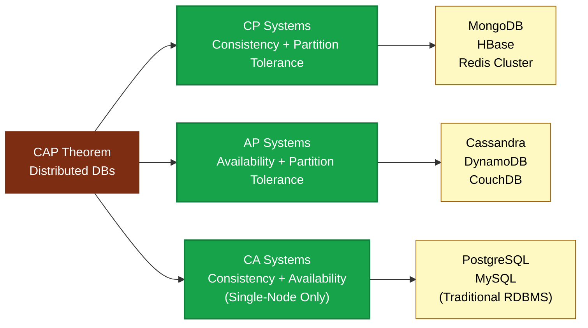
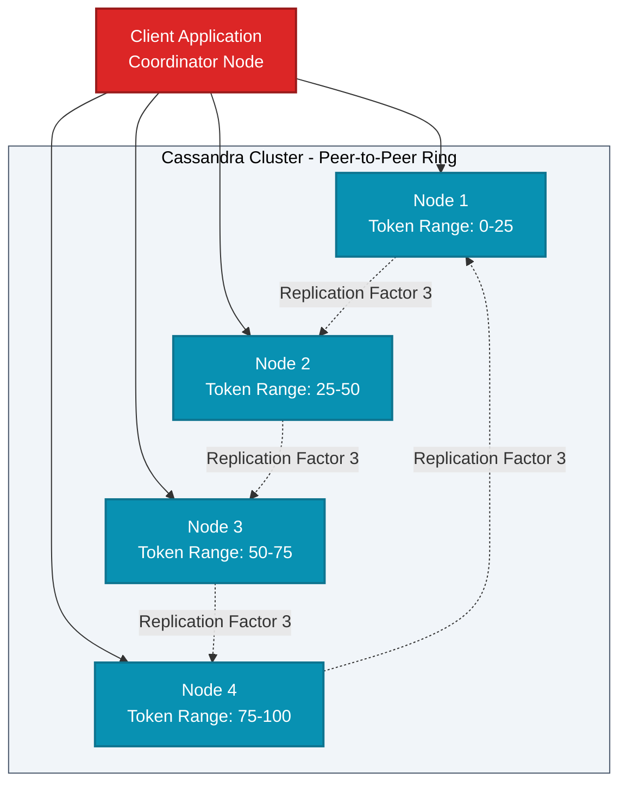
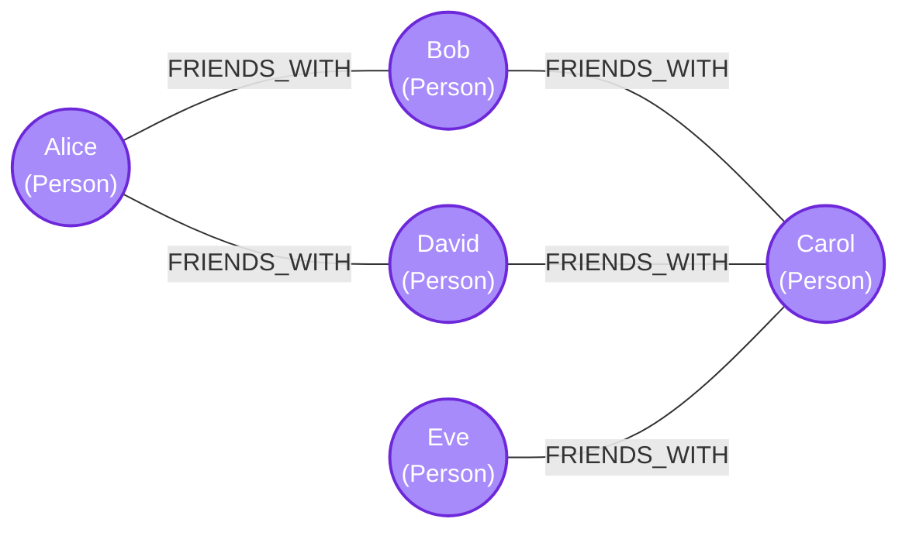
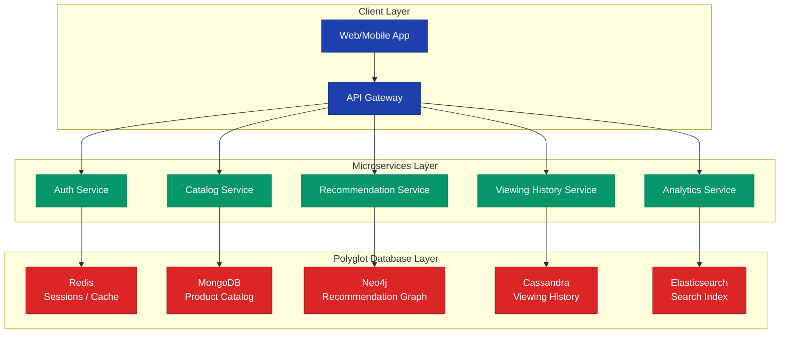

# Modern Database Paradigms: NoSQL databases—Types and use cases (Redis, Cassandra, MongoDB, GraphDB)

<!-- SECTION_1_START -->

# Modern Database Paradigms: NoSQL Databases

> [!NOTE]
> **KTU 2024 | Module 4 | Course Outcome Mapping: CO4 | Cognitive Domain: Understand**
> This module transitions from the ACID-compliant relational world to the distributed, schema-flexible, and horizontally scalable domain of **Not Only SQL (NoSQL)** systems — the backbone of modern Big Data, IoT, and real-time web architectures.

## 1.1 Formal Academic Definition

A **NoSQL database** is a class of database management systems (DBMS) that depart from the traditional relational (SQL) model by providing flexible, schema-less, horizontally scalable, and distributed data storage mechanisms. The term originally stood for *"No SQL"* but was redefined as **"Not Only SQL"** to emphasize that such systems can co-exist with relational databases rather than replace them entirely.

According to the **KTU 2024 Syllabus Definition**:
> *"NoSQL databases are non-relational data stores designed for large-scale, distributed data management, optimized for specific data models such as document, key-value, column-family, and graph structures."*

## 1.2 The Four Pillars of NoSQL Data Models

Modern NoSQL systems are broadly classified into **four primary data model categories**, each tailored for a specific access pattern:

| # | Data Model | Core Primitive | Storage Philosophy |
|---|------------|----------------|---------------------|
| 1 | **Key-Value Store** | Hash Table $(K \rightarrow V)$ | Fastest possible O(1) lookups |
| 2 | **Document Store** | JSON / BSON document | Schema-flexible, object-oriented |
| 3 | **Column-Family Store** | Sparse, multi-dimensional column map | Massive write throughput, petabyte scale |
| 4 | **Graph Database** | Vertices $(V)$ and Edges $(E)$ | Relationship traversal performance |

## 1.3 Intuitive Analogy: The Library vs. The Warehouse

> [!TIP]
> **Conceptual Analogy — "Why NoSQL Exists"**

Imagine a **traditional library** (RDBMS):
- Every book must follow the *Dewey Decimal System* (strict schema).
- Books are shelved in rigid, pre-defined aisles.
- A librarian must verify catalog rules before any book is added.

Now imagine a **modern e-commerce warehouse** (NoSQL):
- Different products (electronics, clothes, groceries) have *wildly different attributes* (color, weight, expiry, voltage).
- Forcing them into the same rigid table columns wastes space and slows down processing.
- Instead, we use **flexible bins** — each product describes itself in its own JSON "envelope".

This is precisely the motivation behind NoSQL: **scale, flexibility, and speed over rigid consistency**.

## 1.4 The CAP Theorem — The Governing Law of Distributed Databases

> [!IMPORTANT]
> **The CAP Theorem (Eric Brewer, 2000)**
> In any distributed data store, you can simultaneously guarantee **only two** out of the following three properties:

$$
\text{CAP} = \{C, A, P\} \quad \text{where} \quad \text{Pick 2 of 3}
$$

- **$C$ — Consistency**: Every read receives the most recent write or an error.
- **$A$ — Availability**: Every request receives a response (non-error), even if some nodes are down.
- **$P$ — Partition Tolerance**: The system continues to operate despite arbitrary network message loss between nodes.

> [!WARNING]
> **Practical Reality**: In real distributed systems (e.g., WAN, cloud, multi-DC), **network partitions ($P$) are inevitable**. Therefore, the realistic choice is always between **$CP$** (sacrifice availability) or **$AP$** (sacrifice strong consistency). Pure **$CA$** systems only exist in single-node deployments.

## 1.5 The BASE vs. ACID Philosophy

Modern NoSQL systems relax strict ACID properties in favor of the **BASE** model:

| Property | ACID (RDBMS) | BASE (NoSQL) |
|----------|--------------|--------------|
| **B**asic Availability | Atomicity | **Basically Available** |
| **S**oft State | Consistency | **Soft State** (replicas may diverge) |
| — | Isolation | — |
| **E**ventual Consistency | Durability | **Eventual Consistency** (converges over time) |

> [!VISUALIZATION CONTROL]
> **Concept:** Trade-off Curve of CAP Theorem
> **GeoGebra / Desmos Input Equations:**
> * $f(x) = 1 - x$ (Availability vs. Consistency linear trade-off)
> * $g(x) = \sin(x)$ (Eventual consistency convergence oscillation)
> **Visual Description:** A student should see a downward-sloping line where pushing the system towards stronger Consistency ($C \rightarrow 1$) reduces Availability ($A \rightarrow 0$), and a sine wave showing how an eventually consistent system oscillates before stabilizing at the latest value.

---

<!-- SECTION_1_END -->

<!-- SECTION_2_START -->

# Deep Theoretical Analysis & KTU High-Yield Formula Sheet

## 2.1 Decomposed Architecture: Anatomy of a NoSQL System

A NoSQL system is best understood as a **layered, distributed architecture** rather than a monolithic server:

1. **Client Driver Layer** — Issues CRUD operations via native protocols (e.g., RESP for Redis, BSON for MongoDB, CQL for Cassandra, Bolt for Neo4j).
2. **Query / Routing Layer** — Translates client requests into internal node-level operations. Uses **consistent hashing** or **partition keys** to locate data.
3. **Storage Engine** — The actual data structure on disk/memory:
   * Hash Tables (Redis)
   * LSM-Trees (Log-Structured Merge Trees) — Cassandra, RocksDB
   * B-Trees / WiredTiger — MongoDB
   * Native Graph Storage — Neo4j
4. **Replication Layer** — Maintains multiple copies of data for fault tolerance (synchronous vs. asynchronous).
5. **Coordination Layer** — Services like ZooKeeper, etcd, or Consul for leader election and metadata.

## 2.2 The Four NoSQL Categories — Deep Dive

### 2.2.1 Key-Value Stores (Redis, Amazon DynamoDB, Memcached)

- Data is stored as a **hash map**: $K \rightarrow V$ where $K$ is unique, $V$ is an opaque blob.
- Operations are extremely simple: `GET`, `PUT`, `DELETE`.
- Values can range from simple strings to complex structures (lists, sets, hashes, sorted sets in Redis).
- **Time complexity**: $O(1)$ average for all operations.
- **Use cases**: Caching, session management, leaderboards, real-time analytics, rate limiting.

### 2.2.2 Document Stores (MongoDB, CouchDB, Amazon DocumentDB)

- Data is stored as **semi-structured documents**, typically in **BSON** (Binary JSON) or JSON.
- Each document can have a **different schema** within the same collection.
- Documents support **nested arrays and embedded sub-documents** (denormalization).
- Support rich query language with secondary indexes, aggregations, and joins (via `$lookup`).
- **Use cases**: Content management, catalogs, user profiles, IoT telemetry, mobile apps.

### 2.2.3 Column-Family / Wide-Column Stores (Apache Cassandra, HBase, ScyllaDB)

- Data is organized into **rows** and **column families** (groups of related columns).
- Unlike RDBMS, columns can be **added dynamically per row** (sparse storage).
- Optimized for **write-heavy** workloads using **LSM-Trees**.
- Data is distributed using **consistent hashing** on partition keys.
- **Tunable consistency** via the formula:
$$
\text{Consistency Level } (CL) \in \{ONE, QUORUM, ALL\}
$$
where:
$$
\text{QUORUM} = \lfloor \frac{N + 1}{2} \rfloor \quad \text{(for $N$ replicas)}
$$
- **Use cases**: Time-series data, sensor logs, write-heavy messaging, financial trade ledgers.

### 2.2.4 Graph Databases (Neo4j, Amazon Neptune, ArangoDB)

- Data is stored as **nodes** (entities), **edges** (relationships), and **properties** (key-value attributes on both).
- Relationships are **first-class citizens** with direction, type, and properties.
- Uses **Cypher Query Language** (Neo4j) or **Gremlin** (Apache TinkerPop).
- **Traversal cost is $O(1)$ per step** when using pointer-based adjacency (vs. $O(\log n + k)$ JOIN cost in RDBMS).
- **Use cases**: Social networks, fraud detection, knowledge graphs, recommendation engines, network/IT operations.

## 2.3 KTU High-Yield Formula & Concept Sheet

> [!IMPORTANT]
> **This table is the definitive KTU 2024 reference for the NoSQL module. Memorize the boundaries, complexity, and use cases.**

| Concept | Formula / Rule | Engineering Significance |
|---------|----------------|--------------------------|
| **CAP Theorem** | $\text{Choose 2 of } \{C, A, P\}$ | Governing trade-off in distributed DBs |
| **Quorum Read/Write** | $R + W > N$ | Ensures strong consistency overlap |
| **Consistent Hashing** | $h(k) \mod 2^{m}$ | Minimizes key remapping on node addition/removal |
| **Replication Factor** | $N = \text{number of copies}$ | Higher $N$ = more fault tolerance, more storage |
| **BASE Model** | Basic Availability, Soft State, Eventual Consistency | NoSQL alternative to ACID |
| **Eventually Consistent** | $\lim_{t \to \infty} \text{read}(x) = \text{last\_write}(x)$ | Convergence guarantee |
| **Partition Key Hash** | $\text{token} = \text{MD5}(\text{key})$ | Used in Cassandra's DHT ring |
| **Graph Degree Query** | $O(1)$ per hop (Neo4j) | vs. $O(n \cdot \log n)$ in RDBMS JOIN |
| **LSM-Tree Write Amp.** | $W = \sum_{i=1}^{L} \frac{T_{i-1}}{T_i}$ | $L$ = number of levels |
| **Bloom Filter** | $P_{\text{false\_positive}} = (1 - e^{-kn/m})^k$ | Reduces unnecessary disk reads |

## 2.4 Why This Matters in Industry

> [!TIP]
> **Engineering Decision Framework**

When should a developer reach for NoSQL over a relational database?

1. **Scale-out > Scale-up**: When your data is in petabytes and you need commodity hardware clusters.
2. **Schema Evolution**: When your application changes rapidly (e.g., agile sprints) and schema migrations are painful.
3. **Specific Access Patterns**: When you need *sub-millisecond* latency (Redis) or *deep relationship traversal* (Neo4j) — relational JOINs cannot compete at scale.
4. **Polyglot Persistence**: Netflix, Amazon, and Google use **multiple NoSQL stores simultaneously** for different microservices (MongoDB for catalogs, Cassandra for viewing history, Neo4j for recommendations, Redis for sessions).

---

<!-- SECTION_2_END -->

<!-- SECTION_3_START -->

# Step-by-Step Derivations, Installations & Code Implementations

## 3.1 Mathematical Foundation: Consistent Hashing Derivation

In a naive distributed hash table with $N$ servers, mapping key $k$ to a server is done via:
$$
\text{server} = h(k) \mod N
$$
**Problem**: When $N$ changes (server added/removed), nearly **all** keys must be remapped — this is a *cache stampede*.

**Solution — Consistent Hashing**:
1. Map both **servers** and **keys** onto a circular hash space of size $2^{m}$ (typically $m = 32$ or $64$).
2. Each key is assigned to the **first server encountered** when moving clockwise.
3. Only $\frac{K}{N}$ keys are remapped per node change.

$$
h_{\text{node}}(i) = \text{HASH}(\text{node\_id}_i) \mod 2^m
$$

$$
h_{\text{key}}(k) = \text{HASH}(k) \mod 2^m
$$

**Virtual Nodes (vnodes)**: To improve load balancing, each physical node is assigned $V$ virtual positions (Cassandra default $V = 256$):
$$
\text{Load Variance} \propto \frac{1}{\sqrt{V}}
$$

## 3.2 Practical Code Implementations

### 3.2.1 Redis — Key-Value Store

```python
# redis_keyvalue_demo.py
# Demonstrates Redis as a high-performance in-memory key-value store
# KTU Use Case: Session Management & Rate Limiting

import redis
import time
from typing import Optional

# Connection to local Redis instance
r: redis.Redis = redis.Redis(
    host="localhost",
    port=6379,
    decode_responses=True,  # Return strings instead of bytes
    socket_connect_timeout=5
)

# --- 1. Basic SET / GET operations ---
def cache_user_session(user_id: str, session_data: dict, ttl_seconds: int = 3600) -> None:
    """Cache a user session with Time-To-Live (TTL) auto-expiry."""
    key = f"session:{user_id}"
    r.set(key, str(session_data), ex=ttl_seconds)
    print(f"[CACHE] Session for user '{user_id}' stored. TTL = {ttl_seconds}s")

def get_user_session(user_id: str) -> Optional[str]:
    """Retrieve a cached user session."""
    key = f"session:{user_id}"
    session = r.get(key)
    if session is None:
        print(f"[MISS] No active session for user '{user_id}'.")
    return session

# --- 2. Rate Limiter using INCR + EXPIRE ---
def check_rate_limit(api_key: str, max_requests: int = 100, window: int = 60) -> bool:
    """
    Sliding window rate limiter.
    Formula: requests_in_window <= max_requests
    """
    bucket_key = f"ratelimit:{api_key}:{int(time.time() // window)}"
    current_count = r.incr(bucket_key)         # Atomic increment
    if current_count == 1:
        r.expire(bucket_key, window)           # Set expiry on first hit
    if current_count > max_requests:
        print(f"[BLOCK] API key '{api_key}' exceeded {max_requests} req/window.")
        return False
    return True

# --- 3. Sorted Set Leaderboard ---
def update_leaderboard(player_id: str, score: int) -> None:
    r.zadd("leaderboard:global", {player_id: score})

def get_top_players(n: int = 10) -> list:
    return r.zrevrange("leaderboard:global", 0, n - 1, withscores=True)

# --- Execution ---
if __name__ == "__main__":
    cache_user_session("user_42", {"role": "admin", "cart": ["itemA", "itemB"]})
    print("Retrieved:", get_user_session("user_42"))
    update_leaderboard("alice", 1500)
    update_leaderboard("bob", 2200)
    print("Top Players:", get_top_players(3))
```

> [!NOTE]
> **Why Redis Wins**: The `INCR` operation is **atomic at the CPU level** — perfect for distributed counters, rate limiters, and leaderboards. This is a critical interview-grade KTU point.

### 3.2.2 MongoDB — Document Store

```python
# mongo_document_demo.py
# Demonstrates schema-flexible document storage with MongoDB
# KTU Use Case: E-commerce Product Catalog

from pymongo import MongoClient, ASCENDING
from pymongo.errors import PyMongoError
from datetime import datetime
from typing import List, Dict, Any

# Establish connection
client: MongoClient = MongoClient("mongodb://localhost:27017/", serverSelectionTimeoutMS=5000)
db = client["ecommerce_db"]
products_col = db["products"]

# --- 1. Insert documents with DIFFERENT schemas (schema flexibility demo) ---
def seed_catalog() -> None:
    products_col.delete_many({})  # Clear collection for fresh demo
    products_col.insert_many([
        {
            "_id": "P001",
            "name": "Smartphone X",
            "category": "electronics",
            "price": 599.99,
            "specs": {"ram_gb": 8, "storage_gb": 128, "5g": True},
            "tags": ["new", "trending"]
        },
        {
            "_id": "P002",
            "name": "Yoga Mat",
            "category": "fitness",
            "price": 29.99,
            "dimensions_cm": {"length": 173, "width": 61, "thickness": 0.6},
            "tags": ["eco-friendly"]
        },
        {
            "_id": "P003",
            "name": "Organic Honey 500g",
            "category": "grocery",
            "price": 12.50,
            "expiry_date": datetime(2026, 6, 1),
            "tags": ["organic", "local"]
        }
    ])
    print("[SEED] 3 heterogeneous documents inserted.")

# --- 2. Create secondary index on category ---
def create_indexes() -> None:
    products_col.create_index([("category", ASCENDING)])
    products_col.create_index([("tags", ASCENDING)])
    print("[INDEX] Secondary indexes created on 'category' and 'tags'.")

# --- 3. Rich query: Find all electronics under $1000, sorted by price ---
def find_electronics() -> List[Dict[str, Any]]:
    query = {
        "category": "electronics",
        "price": {"$lt": 1000}
    }
    cursor = products_col.find(query).sort("price", ASCENDING)
    results = list(cursor)
    print(f"[QUERY] Found {len(results)} electronics under $1000.")
    return results

# --- 4. Aggregation pipeline: Average price per category ---
def avg_price_per_category() -> List[Dict[str, Any]]:
    pipeline = [
        {"$group": {"_id": "$category", "avg_price": {"$avg": "$price"}, "count": {"$sum": 1}}},
        {"$sort": {"avg_price": -1}}
    ]
    return list(products_col.aggregate(pipeline))

# --- Execution ---
if __name__ == "__main__":
    try:
        seed_catalog()
        create_indexes()
        for p in find_electronics():
            print(f"  - {p['name']}: ${p['price']}")
        print("\nAverage price by category:")
        for row in avg_price_per_category():
            print(f"  - {row['_id']}: ${row['avg_price']:.2f} (n={row['count']})")
    except PyMongoError as e:
        print(f"[ERROR] MongoDB operation failed: {e}")
    finally:
        client.close()
```

### 3.2.3 Apache Cassandra — Column-Family Store

```python
# cassandra_columnfamily_demo.py
# Demonstrates CQL (Cassandra Query Language) for wide-column storage
# KTU Use Case: IoT Sensor Time-Series Data

from cassandra.cluster import Cluster
from cassandra.auth import PlainTextAuthProvider
from datetime import datetime
import uuid

# Connect to local Cassandra cluster
cluster = Cluster(["127.0.0.1"], port=9042)
session = cluster.connect()

# --- 1. Define Keyspace and Table ---
def setup_schema() -> None:
    session.execute("""
        CREATE KEYSPACE IF NOT EXISTS iot_data
        WITH REPLICATION = {
            'class': 'SimpleStrategy',
            'replication_factor': 3
        }
    """)
    session.set_keyspace("iot_data")
    session.execute("""
        CREATE TABLE IF NOT EXISTS sensor_readings (
            sensor_id   text,
            year_month  text,
            reading_ts  timestamp,
            temperature double,
            humidity    double,
            PRIMARY KEY ((sensor_id, year_month), reading_ts)
        ) WITH CLUSTERING ORDER BY (reading_ts DESC)
    """)
    print("[SCHEMA] Keyspace 'iot_data' and table 'sensor_readings' ready.")

# --- 2. Insert time-series readings (write-optimized path) ---
def insert_reading(sensor_id: str, temp: float, hum: float) -> None:
    now = datetime.utcnow()
    session.execute("""
        INSERT INTO sensor_readings (sensor_id, year_month, reading_ts, temperature, humidity)
        VALUES (%s, %s, %s, %s, %s)
    """, (sensor_id, now.strftime("%Y-%m"), now, temp, hum))

# --- 3. Query with consistency level ONE (high availability) ---
def fetch_recent(sensor_id: str, limit: int = 5):
    statement = session.prepare("""
        SELECT reading_ts, temperature, humidity
        FROM sensor_readings
        WHERE sensor_id = %s AND year_month = %s
        LIMIT %s
    """)
    statement.consistency_level = 1  # ONE — high availability
    return session.execute(statement, (sensor_id, datetime.utcnow().strftime("%Y-%m"), limit))

# --- Execution ---
if __name__ == "__main__":
    setup_schema()
    for i in range(3):
        insert_reading("SENSOR_01", 22.5 + i * 0.3, 60.0 - i)
    for row in fetch_recent("SENSOR_01"):
        print(f"[READ] {row.reading_ts} | Temp={row.temperature}°C | Humidity={row.humidity}%")
    cluster.shutdown()
```

> [!IMPORTANT]
> **Cassandra Design Insight**: The `PRIMARY KEY ((sensor_id, year_month), reading_ts)` uses a **composite partition key** to distribute data across the ring, and a **clustering column** to sort within a partition. This is the **KTU board-favorite exam topic** for partition key design questions.

### 3.2.4 Neo4j — Graph Database

```python
# neo4j_graph_demo.py
# Demonstrates graph traversal using Cypher via Python driver
# KTU Use Case: Social Network Friend Recommendation

from neo4j import GraphDatabase
from typing import List, Dict

URI = "bolt://localhost:7687"
USER = "neo4j"
PASSWORD = "password"

class SocialGraph:
    def __init__(self):
        self.driver = GraphDatabase.driver(URI, auth=(USER, PASSWORD))

    def close(self):
        self.driver.close()

    def add_friendship(self, person_a: str, person_b: str) -> None:
        with self.driver.session() as session:
            session.run(
                "MATCH (a:Person {name:$a}), (b:Person {name:$b}) "
                "MERGE (a)-[:FRIENDS_WITH]->(b)",
                a=person_a, b=person_b
            )

    def find_friends_of_friends(self, person: str) -> List[Dict]:
        """
        Cypher traversal: 2-hop recommendation
        Pattern: (me)-[:FRIENDS_WITH]->(friend)-[:FRIENDS_WITH]->(foaf)
        """
        query = """
        MATCH (me:Person {name: $name})-[:FRIENDS_WITH]->(friend)-[:FRIENDS_WITH]->(foaf)
        WHERE foaf <> me AND NOT (me)-[:FRIENDS_WITH]->(foaf)
        RETURN foaf.name AS recommendation, COUNT(*) AS mutual_count
        ORDER BY mutual_count DESC
        """
        with self.driver.session() as session:
            result = session.run(query, name=person)
            return [dict(record) for record in result]

# --- Execution ---
if __name__ == "__main__":
    sg = SocialGraph()
    for a, b in [("Alice", "Bob"), ("Bob", "Carol"), ("Alice", "David"),
                 ("David", "Carol"), ("Eve", "Carol")]:
        sg.add_friendship(a, b)
    print("Friend-of-Friend recommendations for Alice:")
    for rec in sg.find_friends_of_friends("Alice"):
        print(f"  - {rec['recommendation']} (mutual: {rec['mutual_count']})")
    sg.close()
```

## 3.3 Comparative Analytical Derivation: When to Choose What

The **decision function** $D$ for selecting a NoSQL store can be expressed as:

$$
D = \arg\max_{s \in S} \left( w_1 \cdot \text{Performance}(s) + w_2 \cdot \text{Flexibility}(s) + w_3 \cdot \text{Consistency}(s) \right)
$$

where $S = \{\text{Redis, MongoDB, Cassandra, Neo4j}\}$ and $w_i$ are application-defined weights.

| Application Priority | Recommended Store | Justification |
|----------------------|-------------------|---------------|
| Sub-millisecond latency | **Redis** | In-memory, $O(1)$ lookups |
| Flexible JSON catalog | **MongoDB** | Native BSON, rich aggregation |
| Write-heavy IoT | **Cassandra** | LSM-tree, tunable consistency |
| Deep relationship queries | **Neo4j** | Pointer adjacency, $O(1)$ hops |

---

<!-- SECTION_3_END -->

<!-- SECTION_4_START -->

# Structural Diagrams & Schematics

## 4.1 NoSQL Taxonomy — Master Classification Diagram

```mermaid
graph TB
    NoSQL["NoSQL Databases<br/>Not Only SQL"]
    KV["Key-Value Stores<br/>O(1) GET/PUT"]
    DOC["Document Stores<br/>JSON/BSON"]
    COL["Column-Family Stores<br/>Wide Columns"]
    GRAPH["Graph Databases<br/>Nodes and Edges"]
    SEARCH["Search Engines<br/>Full-Text / Inverted Index"]

    NoSQL --> KV
    NoSQL --> DOC
    NoSQL --> COL
    NoSQL --> GRAPH
    NoSQL --> SEARCH

    KV --> KV1["Redis"]
    KV --> KV2["Amazon DynamoDB"]
    KV --> KV3["Memcached"]

    DOC --> DOC1["MongoDB"]
    DOC --> DOC2["CouchDB"]
    DOC --> DOC3["Amazon DocumentDB"]

    COL --> COL1["Apache Cassandra"]
    COL --> COL2["Apache HBase"]
    COL --> COL3["ScyllaDB"]

    GRAPH --> GRAPH1["Neo4j"]
    GRAPH --> GRAPH2["Amazon Neptune"]
    GRAPH --> GRAPH3["ArangoDB"]

    SEARCH --> SE1["Elasticsearch"]
    SEARCH --> SE2["Apache Solr"]

    classDef root fill:#1e3a8a,stroke:#1e3a8a,color:#ffffff,stroke-width:3px
    classDef category fill:#0ea5e9,stroke:#0369a1,color:#ffffff,stroke-width:2px
    classDef product fill:#fef3c7,stroke:#f59e0b,color:#000000,stroke-width:1px

    class NoSQL root
    class KV,DOC,COL,GRAPH,SEARCH category
    class KV1,KV2,KV3,DOC1,DOC2,DOC3,COL1,COL2,COL3,GRAPH1,GRAPH2,GRAPH3,SE1,SE2 product
```



## 4.2 CAP Theorem Trade-off Diagram



## 4.3 Cassandra Ring Architecture — Peer-to-Peer Replication



## 4.4 Neo4j Graph Data Model — Social Recommendation Topology



> [!NOTE]
> **Reading the Graph**: A query *"Find friend-of-friend recommendations for Alice"* would traverse `Alice → Bob → Carol` and `Alice → David → Carol`, yielding **Carol** as a recommendation with **mutual_count = 2**. Notice that **Eve is NOT recommended** because she is only connected to Carol and shares no mutual friend with Alice.

## 4.5 Polyglot Persistence Architecture (Netflix/Amazon Style)



---

<!-- SECTION_4_END -->

<!-- SECTION_5_START -->

# KTU 2024 Scheme Examination Question Bank & Topic Recap

## 5.1 Part A — Short Answer Questions (2 × 3 = 6 Marks)

> [!IMPORTANT]
> **Cognitive Levels: Remember / Understand | Each answer must fit within 80–120 words. KTU board evaluators look for crisp, definition-first opening lines followed by one technical depth sentence.**

### **Question 1: Define NoSQL databases. List any four types of NoSQL databases.** `[KTU University Exam — July 2024]`

**Model Answer (3 Marks):**
NoSQL (*Not Only SQL*) databases are non-relational, distributed data stores designed for horizontal scalability, schema flexibility, and high availability across commodity clusters. They sacrifice strict ACID properties in favor of the BASE model. The four major types are:
1. **Key-Value Stores** (e.g., Redis, DynamoDB)
2. **Document Stores** (e.g., MongoDB, CouchDB)
3. **Column-Family / Wide-Column Stores** (e.g., Cassandra, HBase)
4. **Graph Databases** (e.g., Neo4j, Amazon Neptune)

> **[Mark Distribution]:** Definition: 1 Mark | Listing 4 types: 1 Mark | One-line example per type: 1 Mark.

### **Question 2: Explain the CAP theorem with a suitable example.** `[KTU University Exam — Dec 2023]`

**Model Answer (3 Marks):**
The **CAP theorem** (Eric Brewer, 2000) states that in any distributed data store, only **two of the three** properties — **Consistency** ($C$), **Availability** ($A$), and **Partition Tolerance** ($P$) — can be guaranteed simultaneously during a network partition. Since partitions are inevitable in real distributed systems, the practical trade-off is between **CP** (e.g., MongoDB, HBase — returns error if quorum not met) and **AP** (e.g., Cassandra, DynamoDB — serves stale but available data). For example, during a network split, **Cassandra** continues to accept writes at consistency level `ONE`, eventually reconciling replicas.

> **[Mark Distribution]:** Stating CAP: 1 Mark | Pick 2 of 3 explanation: 1 Mark | Real-world example: 1 Mark.

---

## 5.2 Part B — Full-Descriptive Questions (Internal Choice: A or B)

### **Question 3 (A): Explain the four types of NoSQL databases with suitable examples, data models, and use cases.** `[14 Marks | CO4, Understand + Apply]`

#### Part (a) — Key-Value and Document Stores **(7 Marks)**

**Key-Value Stores** store data as opaque pairs $(K \rightarrow V)$ in a distributed hash table. Operations like `GET` and `PUT` have $O(1)$ average complexity. **Redis** extends this with rich data structures (lists, sets, sorted sets, hashes), making it ideal for **session caching, leaderboards, and rate limiters**. **Amazon DynamoDB** is a managed key-value store used by Amazon.com for its shopping cart persistence layer.

**Document Stores** store semi-structured data as **JSON or BSON** documents. Each document is self-describing, allowing different schemas within the same collection. **MongoDB** is the most prominent example, supporting **secondary indexes, aggregation pipelines, and `$lookup` joins**. Use cases include **e-commerce product catalogs, content management systems, and mobile app backends** where schema evolves frequently. Documents are grouped into *collections*, which are schema-flexible analogues of relational tables.

> **Mark Distribution**: Key-Value explanation + Redis example: 3 Marks | Document Store explanation + MongoDB example: 3 Marks | Use case mapping: 1 Mark.

#### Part (b) — Column-Family and Graph Stores **(7 Marks)**

**Column-Family Stores** organize data into rows and dynamically extensible column families, optimized for **write-heavy workloads** using **LSM-Trees (Log-Structured Merge Trees)**. **Apache Cassandra** uses a peer-to-peer ring architecture with **tunable consistency** (e.g., `ONE`, `QUORUM`, `ALL`). The partition key is hashed via consistent hashing to determine storage nodes. Use cases include **IoT sensor data, time-series logs, and financial trade ledgers** at petabyte scale.

**Graph Databases** model data as **nodes (entities)**, **edges (relationships)**, and **properties**. Unlike RDBMS, relationships are first-class citizens with pointer-based adjacency, giving **$O(1)$ traversal per hop**. **Neo4j** uses the **Cypher Query Language** for pattern matching. Use cases include **social networks (friend-of-friend recommendations), fraud detection rings, knowledge graphs, and IT network topology analysis**.

> **Mark Distribution**: Column-Family explanation + Cassandra: 3 Marks | Graph Store explanation + Neo4j: 3 Marks | Use case clarity: 1 Mark.

---

### **Question 3 (B): Compare SQL (RDBMS) and NoSQL databases across 6 dimensions. Discuss when NoSQL is preferable with two industry case studies.** `[14 Marks | CO4, Apply + Analyze]`

#### Part (a) — SQL vs. NoSQL Comparison **(7 Marks)**

| Dimension | SQL (RDBMS) | NoSQL |
|-----------|-------------|-------|
| **Data Model** | Rigid relational schema (tables) | Flexible (key-value, document, column, graph) |
| **Schema** | Pre-defined, schema-on-write | Dynamic, schema-on-read |
| **Scaling** | Vertical (scale-up, bigger servers) | Horizontal (scale-out, more commodity nodes) |
| **Consistency** | Strong ACID guarantees | Eventual consistency (BASE) |
| **Query Language** | Standardized SQL | Database-specific (CQL, Cypher, MongoDB Query) |
| **Transactions** | Full multi-row ACID | Limited or single-document atomicity |

> **Mark Distribution**: Six comparison rows × ~1 Mark each = 6 Marks | Conclusion: 1 Mark.

#### Part (b) — Industry Case Studies **(7 Marks)**

**Case Study 1 — Netflix (Cassandra)**:
Netflix adopted Apache Cassandra in 2008 to handle its **massive viewing history and user activity data** spanning billions of records. Their key motivations were: (1) **write-heavy workload** from millions of concurrent viewers, (2) **multi-region replication** for global availability, and (3) **zero-downtime** during regional outages. Cassandra's tunable consistency allowed Netflix to balance availability with strong-enough guarantees for user profiles.

**Case Study 2 — LinkedIn (Espresso + Voldemort + Neo4j)**:
LinkedIn uses a **polyglot persistence** strategy. **Voldemort** (key-value) handles member profiles and session data with sub-millisecond reads. **Espresso** (document store) stores normalized OLTP data with strong consistency. **Neo4j** powers the *"People You May Know"* feature, where traversing professional networks requires deep graph hops that are prohibitively expensive in SQL. The graph store reduced query latency from seconds to milliseconds.

> **Mark Distribution**: Case Study 1 motivation + tech: 3 Marks | Case Study 2 motivation + tech: 3 Marks | Synthesis/Conclusion: 1 Mark.

---

## 5.3 KTU Examiner's Valuation Warnings

> [!WARNING]
> **Common Pitfalls That Cost Marks in the KTU Board Exam**

1. **Never write "No SQL" alone in the literal sense** — always expand it as *"Not Only SQL"* and clarify the dual interpretation. Examiners will deduct ½ mark for the incomplete abbreviation.
2. **CAP Theorem Trap**: Students often claim CA is achievable. State explicitly that **partitions are inevitable in distributed systems**, making CA practical only in single-node deployments. Failure to mention this loses 1 mark.
3. **Cassandra's `PRIMARY KEY` confusion**: Always distinguish the **partition key** (used for hashing/distribution) from the **clustering column** (used for sorting within a partition). Writing them as one item is a 2-mark deduction.
4. **MongoDB vs. RDBMS misconception**: Do not say MongoDB "stores JSON strings" — it stores **BSON (Binary JSON)**, which is a binary-encoded, typed extension. This distinction is frequently tested.
5. **Neo4j traversal cost**: Avoid writing "Graph databases are fast" without specifying **$O(1)$ per hop via pointer adjacency**. The cost comparison with RDBMS JOINs is the KTU-mandated depth.
6. **BASE vs. ACID**: A common error is writing that NoSQL systems *"don't have transactions"*. Correct phrasing: *"They relax multi-row atomicity in favor of single-document atomicity."*

---

## 5.4 Topic Recap & Important Things to Remember

> [!TIP]
> **Final Rapid-Revision Checklist — Cover this 24 hours before the KTU exam.**

- ✅ **NoSQL = "Not Only SQL"** — non-relational, distributed, schema-flexible, horizontally scalable.
- ✅ **Four Types**: Key-Value, Document, Column-Family, Graph (plus Search Engines as a 5th category).
- ✅ **CAP Theorem**: Pick 2 of {Consistency, Availability, Partition Tolerance}; in practice, choose between CP and AP.
- ✅ **BASE Model**: Basic Availability, Soft State, Eventual Consistency — the NoSQL alternative to ACID.
- ✅ **Redis**: In-memory, $O(1)$ lookups, atomic `INCR`, used for caching, sessions, rate limiting, leaderboards.
- ✅ **MongoDB**: BSON documents, schema-flexible, supports secondary indexes and aggregation pipelines (`$group`, `$match`, `$lookup`).
- ✅ **Cassandra**: Peer-to-peer ring, LSM-Tree, tunable consistency ($CL \in \{ONE, QUORUM, ALL\}$), write-optimized for time-series and IoT.
- ✅ **Neo4j**: Nodes + Edges + Properties; relationships are first-class; $O(1)$ per-hop traversal; **Cypher** query language.
- ✅ **Consistent Hashing**: $h(k) \mod 2^m$ — minimizes key remapping on node changes; virtual nodes ($V \approx 256$) reduce load variance.
- ✅ **Polyglot Persistence**: Real-world systems (Netflix, Amazon, LinkedIn) use multiple NoSQL stores simultaneously, each for a different microservice.
- ✅ **Quorum formula**: $R + W > N$ ensures strong consistency overlap on reads and writes.
- ✅ **Graph queries**: $O(1)$ per hop in Neo4j vs. $O(n \log n)$ JOIN cost in RDBMS — the central KTU argument for graph stores.
- ✅ **Industry Examples**: Netflix → Cassandra | LinkedIn → Voldemort + Espresso + Neo4j | Amazon → DynamoDB.
- ✅ **When NOT to use NoSQL**: OLTP workloads requiring multi-row ACID transactions, financial ledgers needing strict consistency, small datasets with complex JOINs (use RDBMS).

---

<!-- SECTION_5_END -->
