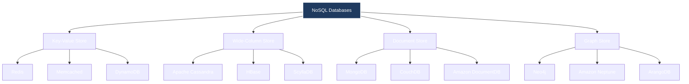
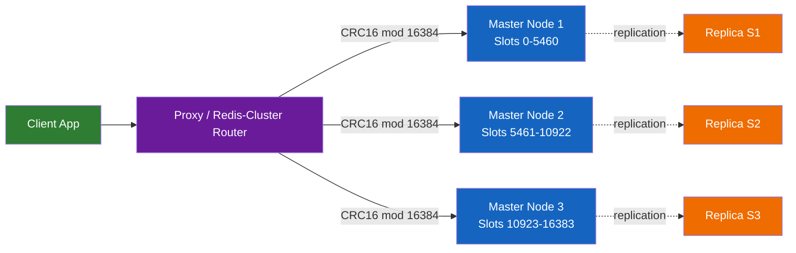
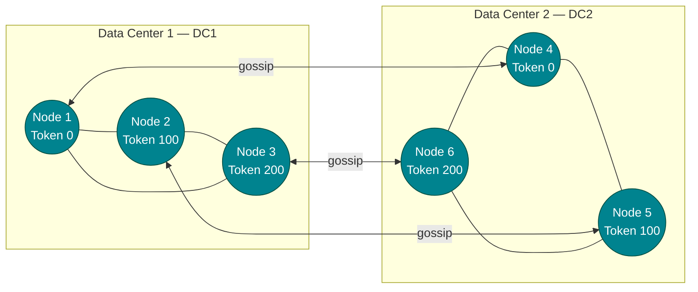
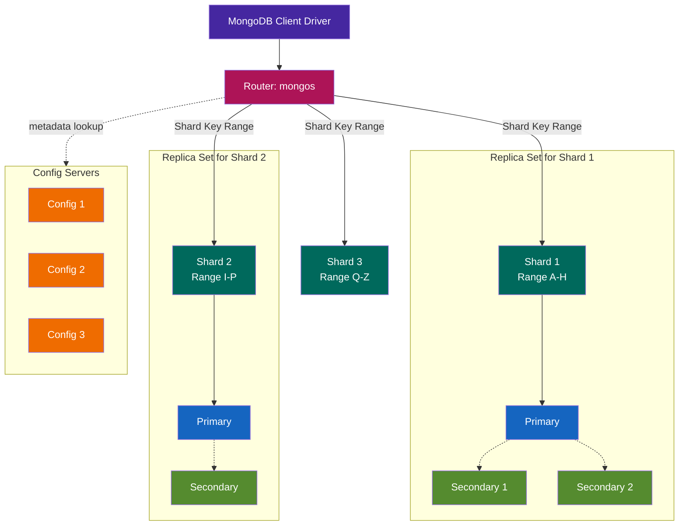
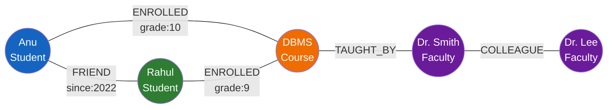
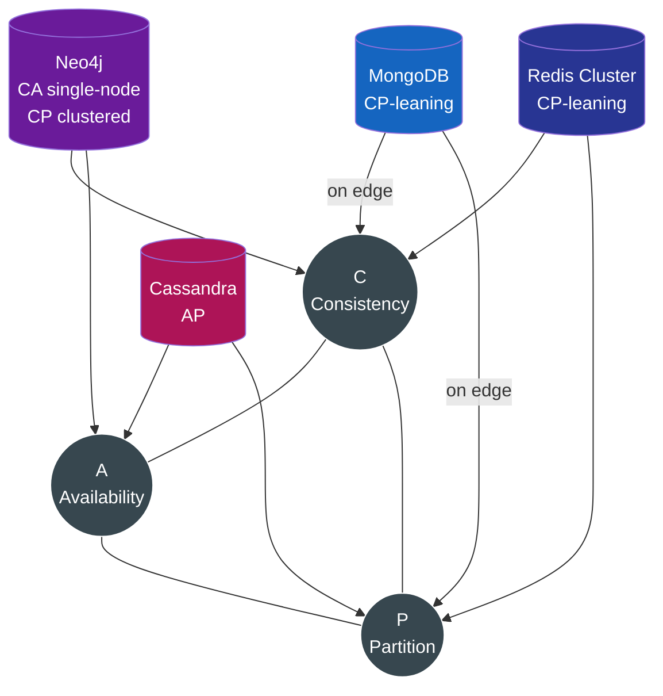

# Modern Database Paradigms: NoSQL databases—Types and use cases (Redis, Cassandra, MongoDB, GraphDB)

<!-- SECTION_1_START -->
# Module 4: Modern Database Paradigms — NoSQL Databases

## 1. Core Technical Definition & Intuitive Overview

### 1.1 Formal Academic Definition

> [!IMPORTANT]
> **NoSQL (Not Only SQL)** is a class of database management systems that do **not** follow the relational (tabular) model defined by Codd's 12 rules. NoSQL systems are designed for **distributed, horizontally scalable**, **schema-flexible** storage of unstructured, semi-structured, or rapidly changing data, while relaxing **ACID** guarantees in favor of the **BASE** model (Basically Available, Soft state, Eventually consistent).

In the KTU 2024 Scheme syllabus (PCCST402), the four canonical NoSQL families are:

1. **Key-Value Stores** → represented by **Redis**
2. **Wide-Column / Column-Family Stores** → represented by **Apache Cassandra**
3. **Document Stores** → represented by **MongoDB**
4. **Graph Databases** → represented by **Neo4j**

### 1.2 Conceptual Analogy / Intuition

> [!NOTE]
> **Analogy — The Library Without a Card Catalogue**
>
> Imagine a massive library. A **relational database (RDBMS)** is a library where every book must be placed on a fixed shelf number, in a fixed category, with an ISBN — strict, orderly, but slow to reorganize.
> A **NoSQL database** is a library where each book carries a self-describing sticker (the document), and librarians can toss the book into *any* free shelf in *any* branch of the library worldwide. You ask "Where is the book on elephants?" and a librarian can usually find it instantly, even if the shelves were reorganized overnight.
>
> - **Redis** = A sticky-note pinned to your monitor (instant, ephemeral).
> - **Cassandra** = A massive spreadsheet that is photocopied across many offices (partition-tolerant, append-friendly).
> - **MongoDB** = A folder of self-contained PDF reports (flexible, document-shaped).
> - **GraphDB (Neo4j)** = A friendship web drawn on a whiteboard (relationships are the first-class citizen).

### 1.3 The CAP Theorem — The Governing Principle

> [!IMPORTANT]
> **Brewer's CAP Theorem (2000):** In any distributed data store, you can simultaneously guarantee **only two** of the following three properties:
>
> - **C — Consistency** : every read returns the most recent write.
> - **A — Availability** : every request receives a non-error response.
> - **P — Partition Tolerance** : the system keeps operating despite arbitrary network message loss between nodes.

For a distributed NoSQL system, **P is non-negotiable** (the network *will* fail). Therefore the real choice is **CP vs. AP**.

| Property            | Guarantee                              | NoSQL Examples             |
| ------------------- | -------------------------------------- | -------------------------- |
| **AP** (Availability + Partition) | Eventual consistency; writes never fail | Cassandra, CouchDB, Riak   |
| **CP** (Consistency + Partition) | Reads always consistent; availability may drop | Redis Cluster, HBase, MongoDB (with write concern) |
| **CA** (Consistency + Availability) | Single-node systems (not truly distributed) | Traditional RDBMS, single-node PostgreSQL |

> [!VISUALIZATION CONTROL]
> **Concept:** CAP Theorem triangle showing the trade-off space
> **GeoGebra / Desmos Input Equations:**
> * `Triangle A(0,0), B(6,0), C(3,5.2)` with vertices labelled C, A, P
> * `Point(1.5, 2.9)` labelled "CP" for MongoDB
> * `Point(4.5, 2.9)` labelled "AP" for Cassandra
> **Visual Description:** A blue equilateral triangle. Each vertex represents one CAP property. MongoDB sits on the CP edge (left), Cassandra sits on the AP edge (right), and a red dot at the top labelled "P (Partition)" reminds us that distributed systems must pick a side of the base.

### 1.4 Why NoSQL? The Drivers

> [!NOTE]
> The five engineering drivers behind the NoSQL revolution (memorize for KTU):
>
> 1. **Volume** — Petabytes of data (web-scale logs, IoT).
> 2. **Velocity** — Millions of writes/sec (social feeds, telemetry).
> 3. **Variety** — JSON, XML, images, geospatial (not just tables).
> 4. **Agility** — Schema-on-read (no DDL lock-in during sprints).
> 5. **Horizontal Scale** — Cheap commodity servers vs. expensive vertical scaling.

---

<!-- SECTION_1_END -->

<!-- SECTION_2_START -->
# 2. Deep Theoretical Analysis & KTU High-Yield Formula Sheet

## 2.1 The Four Pillars of NoSQL — A Structured Comparison

### 2.1.1 Key-Value Stores — **Redis**

| Aspect | Detail |
| --- | --- |
| **Data Model** | A giant hash map $\text{key} \rightarrow \text{value}$ |
| **Storage** | **In-memory** (with optional disk persistence: RDB snapshot, AOF log) |
| **Value Types** | String, List, Hash, Set, Sorted Set (ZSET), Stream, Bitmaps, HyperLogLog, Geospatial |
| **Consistency Model** | Single-node: strong consistency; Redis Cluster: eventual + master-replica replication |
| **Scaling** | **Hash-slot partitioning** across 16 384 logical slots |
| **Best Use Cases** | Caching, session store, leaderboards, pub/sub, rate limiting, real-time analytics |
| **Limitations** | Whole dataset must fit RAM; not ideal for complex queries |
| **Latency** | Sub-millisecond (typically **< 1 ms** for simple GET/SET) |

**Why Redis is fast:** Pure single-threaded event loop on RAM → no disk seeks, no locks, no context switches.

### 2.1.2 Wide-Column Stores — **Apache Cassandra**

| Aspect | Detail |
| --- | --- |
| **Data Model** | Multi-dimensional sorted map $\text{RowKey} \rightarrow \text{ColumnFamily} \rightarrow \text{Column} \rightarrow \text{Value}$ |
| **CQL** | Cassandra Query Language (SQL-like) |
| **Consistency** | **Tunable** via `CONSISTENCY` clause (ONE, QUORUM, ALL, LOCAL\_QUORUM) |
| **Replication** | Configurable **Replication Factor (N)** typically 3; no single master |
| **Write Path** | Append-only **SSTable** + **Memtable**; no read-before-write |
| **Best Use Cases** | Time-series, IoT telemetry, write-heavy OLTP, messaging history |
| **Limitations** | No JOIN, no aggregate functions, no sub-queries; ad-hoc analytics weak |
| **Origin** | Inspired by **Google BigTable** (2006) + Amazon **Dynamo** (2007) |

> [!IMPORTANT]
> **Cassandra's "no read-before-write" guarantee** is what gives it **linear write scalability** — it just appends to a log structure. Reads are expensive (must merge SSTables), but writes are cheap.

**Replication formula (KTU-favorite):**
$$
\text{Read/Write Strong Consistency} \;\Longleftrightarrow\; R + W > N
$$
where $N$ = replication factor, $W$ = write quorum, $R$ = read quorum. With $N=3$, choosing $W=2, R=2$ (QUORUM) ensures the read overlaps with the write.

### 2.1.3 Document Stores — **MongoDB**

| Aspect | Detail |
| --- | --- |
| **Data Model** | **BSON document** (Binary JSON) — nested key-value + arrays |
| **Schema** | Schema-less; enforced optionally via **JSON Schema validators** |
| **Query Language** | **MQL** (MongoDB Query Language) with aggregation pipeline |
| **Storage Engine** | **WiredTiger** (default since 3.2) — B-tree + LSM hybrid, document-level concurrency |
| **Replication** | **Replica Sets** (primary + secondaries); automatic failover |
| **Sharding** | **Range-based** (default) and **Hash-based** sharding across shards |
| **Best Use Cases** | Content management, catalogs, user profiles, mobile app backends, single-view of customer |
| **Limitations** | Transactions (multi-doc) only since v4.0; not ideal for heavy JOINs |
| **Indexing** | B-tree, hashed, geospatial (2dsphere), text, partial, TTL |

**Document example (valid BSON):**
```json
{
  "_id": ObjectId("5f4a..."),
  "name": "Anu K",
  "cgpa": 9.12,
  "skills": ["Python", "MongoDB", "React"],
  "address": { "city": "Kochi", "pin": 682021 }
}
```

### 2.1.4 Graph Databases — **Neo4j**

| Aspect | Detail |
| --- | --- |
| **Data Model** | **Property Graph** = Nodes (vertices) + Relationships (edges) + Properties (key-value on both) |
| **Query Language** | **Cypher** (`(n)-[r:KNOWS]->(m)` pattern matching) |
| **Storage** | Custom native store; since 4.0 supports **Composite Databases** |
| **Indexing** | BTREE, LOOKUP, TEXT, FULLTEXT |
| **ACID** | Full **ACID** transactional support (unusual for NoSQL) |
| **Best Use Cases** | Social networks, fraud detection, recommendation engines, knowledge graphs, network/IT ops |
| **Limitations** | Whole-graph operations expensive; not a general-purpose store |
| **Traversal Cost** | **O(1) per hop** (pointer chasing) vs. SQL JOINs which are O($n \log n$) |

## 2.2 KTU Formula Sheet / Cheat Sheet

| # | Concept | Formula / Rule | Engineering Use |
|---|---------|---------------|-----------------|
| 1 | **CAP Trade-off** | $\text{Capability} = \min(C, A, P - \epsilon)$ | Choose 2 of 3 for distributed DB |
| 2 | **Cassandra Strong Read** | $R + W > N$ | With $N=3$, $R=2,W=2$ gives strong consistency |
| 3 | **Cassandra Weak (HLC)** | $R + W \le N$ | Fast eventual consistency |
| 4 | **Replication Factor** | $N \ge 3$ for prod | Survives 1 node failure if $N=3$ |
| 5 | **MongoDB Shard Key Cardinality** | $\text{cardinality} \ge 10 \times \text{number of chunks}$ | Avoid hotspotting |
| 6 | **Redis Hash Slot** | $\text{slot} = \text{CRC16}(\text{key}) \bmod 16384$ | Distribute keys across nodes |
| 7 | **Neo4j Traversal** | $\text{hops}$ traversed per query in **O(1)** per step | Constant-time neighbour lookup |
| 8 | **BASE vs ACID** | BASE = $\text{Basic Avail.} + \text{Soft state} + \text{Eventual consistency}$ | Trade strict ACID for scale |
| 9 | **Bloom Filter (Cassandra)** | $\text{FPR} \approx (1 - e^{-kn/m})^{k}$ | Avoids reading non-existent SSTables |
| 10 | **MongoDB ObjectId** | $\text{4B timestamp} + \text{5B random} + \text{3B counter}$ | Sortable, globally unique |

## 2.3 The BASE Model — Decoded

> [!NOTE]
> **BASE** (Eric Brewer, 2000) is the NoSQL counterpart to **ACID**:
>
> - **B** asically **A** vailable — the system *always* responds (even with stale data).
> - **S** oft state — system state may change over time, even without input (due to eventual sync).
> - **E** ventual consistency — given enough time with no new writes, all replicas converge.

Engineering utility: enables **massively parallel writes** (Cassandra can accept 1 M+ writes/sec on commodity hardware), which is impossible under the strict 2-Phase-Lock / 2-Phase-Commit protocols of ACID RDBMS.

---

<!-- SECTION_2_END -->

<!-- SECTION_3_START -->
# 3. Step-by-Step Derivations, Code & Symbolic Implementation

## 3.1 Derivation: The Cassandra $R + W > N$ Consistency Rule

**Setup:** A key $K$ is replicated to $N$ nodes. A write must be acknowledged by $W$ nodes; a read must consult $R$ nodes.

**Worst-case scenario for a stale read:**

The write lands on $W$ nodes out of $N$. A read consults $R$ *distinct* nodes chosen at random. The set of "stale" nodes is $N - W$.

For the read to *miss* every fresh node (and possibly see only stale replicas), the $R$ nodes must all be chosen from the $N - W$ stale ones.

**Probability of reading stale data (with random selection):**
$$
P(\text{stale}) = \frac{\binom{N-W}{R}}{\binom{N}{R}}
$$

We want $P(\text{stale}) = 0$, which requires $\binom{N-W}{R} = 0$, i.e. $N - W < R$, i.e.
$$
\boxed{R + W > N}
$$

**Example evaluation (KTU-style):**

Let $N=3$, $W=2$, $R=2$.
$$
R + W = 2 + 2 = 4 > 3 = N \;\;\checkmark
$$
Hence the read set *must* overlap with the write set → at least one fresh replica is returned → **strong consistency**.

With $R=1, W=1$: $R + W = 2 \not> 3$ → reads can hit a stale replica → eventual consistency.

## 3.2 Redis — Operational Code

```python
import redis
import json
import time
from typing import Optional

# Connect to Redis (use host.docker.internal if running in a container)
r: redis.Redis = redis.Redis(
    host="localhost",
    port=6379,
    decode_responses=True,   # Return str instead of bytes
    socket_connect_timeout=5
)

# ---- Health check (mandatory in production) ----
try:
    r.ping()
    print("[OK] Redis is alive")
except redis.ConnectionError as e:
    print(f"[FAIL] Cannot reach Redis: {e}")
    raise

# ---- 1. STRING operations (cache, counter) ----
r.set("user:1001:name", "Anu K", ex=3600)            # ex = TTL in seconds
name: Optional[str] = r.get("user:1001:name")
print("Name:", name)

# Atomic INCR — perfect for rate limiting
new_count: int = r.incr("rate:user:1001")
print("Request count:", new_count)

# ---- 2. HASH operations (object-like) ----
r.hset("user:1001", mapping={
    "name": "Anu K",
    "cgpa": "9.12",
    "branch": "CSE"
})
print("User object:", r.hgetall("user:1001"))

# ---- 3. SORTED SET (leaderboard) ----
r.zadd("leaderboard:cs2024", {"rahul": 92, "anu": 98, "dev": 85})
top3: list = r.zrevrange("leaderboard:cs2024", 0, 2, withscores=True)
print("Top 3 (CS 2024):", top3)

# ---- 4. PUBLISH/SUBSCRIBE (chat) ----
def listener(ch: str, msg: str) -> None:
    print(f"[chat] {ch} -> {msg}")

pubsub = r.pubsub()
pubsub.subscribe("notifications")
# In real apps, run listener in a background thread.

# ---- 5. Persistence demo ----
r.set("session:abc", json.dumps({"uid": 1001, "login": time.time()}),
      ex=1800)
print("Session saved with 30-min TTL.")
```

## 3.3 MongoDB — Operational Code (with PyMongo)

```python
from pymongo import MongoClient, ASCENDING, DESCENDING, GEOSPHERE
from pymongo.errors import DuplicateKeyError, PyMongoError
from datetime import datetime

client: MongoClient = MongoClient(
    "mongodb://localhost:27017/",
    serverSelectionTimeoutMS=5000,
    retryWrites=True
)

db = client["ktu_university"]
students = db["students"]

# 1. Create a unique index on roll_number
students.create_index([("roll_number", ASCENDING)], unique=True)
students.create_index([("location", GEOSPHERE)])  # 2dsphere for geo

# 2. Insert (schema-flexible!)
try:
    students.insert_one({
        "roll_number": "KTU2024CSE001",
        "name": "Anu K",
        "cgpa": 9.12,
        "skills": ["Python", "MongoDB"],
        "address": {"city": "Kochi", "pin": 682021},
        "joined_on": datetime.utcnow()
    })
    print("Inserted.")
except DuplicateKeyError:
    print("Roll number already exists.")

# 3. Update with operators ($set, $inc, $push)
students.update_one(
    {"roll_number": "KTU2024CSE001"},
    {
        "$set":  {"cgpa": 9.24},
        "$inc":   {"attempts": 1},
        "$push":  {"skills": "React"}
    }
)

# 4. Query with projection + sort
topper = students.find_one(
    {"branch": "CSE", "cgpa": {"$gte": 9.0}},
    projection={"name": 1, "cgpa": 1, "_id": 0},
    sort=[("cgpa", DESCENDING)]
)
print("Topper:", topper)

# 5. Aggregation pipeline — average CGPA per branch
pipeline = [
    {"$group": {"_id": "$branch", "avg_cgpa": {"$avg": "$cgpa"},
                "count": {"$sum": 1}}},
    {"$sort":  {"avg_cgpa": DESCENDING}}
]
for row in students.aggregate(pipeline):
    print(row)
```

## 3.4 Apache Cassandra — CQL Code (using `cassandra-driver`)

```python
from cassandra.cluster import Cluster
from cassandra.auth import PlainTextAuthProvider
from cassandra.policies import RoundRobinPolicy

cluster = Cluster(
    contact_points=["127.0.0.1"],
    port=9042,
    load_balancing_policy=RoundRobinPolicy()
)
session = cluster.connect()

# 1. Keyspace (Cassandra's database-level container)
session.execute("""
    CREATE KEYSPACE IF NOT EXISTS ktu
    WITH replication = {
        'class': 'SimpleStrategy',
        'replication_factor': 3
    }
""")
session.set_keyspace("ktu")

# 2. Table (wide-column family)
session.execute("""
    CREATE TABLE IF NOT EXISTS results (
        roll_number   text,
        semester      int,
        subject_code  text,
        grade_point   int,
        PRIMARY KEY ((roll_number, semester), subject_code)
    ) WITH CLUSTERING ORDER BY (subject_code ASC)
""")

# 3. Insert with CONSISTENCY (Tunable!)
from cassandra import ConsistencyLevel
insert_stmt = session.prepare(
    "INSERT INTO results (roll_number, semester, subject_code, grade_point) "
    "VALUES (?, ?, ?, ?)"
)
insert_stmt.consistency_level = ConsistencyLevel.QUORUM
session.execute(insert_stmt, ("KTU2024CSE001", 4, "PCCST402", 10))

# 4. Select with paging (mandatory for large result sets)
select_stmt = session.prepare(
    "SELECT * FROM results WHERE roll_number = ? AND semester = ?"
)
select_stmt.consistency_level = ConsistencyLevel.LOCAL_QUORUM
rows = session.execute(select_stmt, ("KTU2024CSE001", 4))
for row in rows:
    print(row.roll_number, row.subject_code, row.grade_point)
```

## 3.5 Neo4j — Cypher Queries

```cypher
// 1. Create nodes (vertices) with labels
CREATE (a:Student {roll: "KTU2024CSE001", name: "Anu K", cgpa: 9.24})
CREATE (b:Student {roll: "KTU2024CSE002", name: "Rahul", cgpa: 8.85})
CREATE (c:Course  {code: "PCCST402", name: "DBMS"})

// 2. Create relationships (edges) — first-class citizens
MATCH (a:Student {roll: "KTU2024CSE001"}), (b:Student {roll: "KTU2024CSE002"})
CREATE (a)-[r:FRIEND {since: 2022}]->(b)

MATCH (a:Student {roll: "KTU2024CSE001"}), (c:Course {code: "PCCST402"})
CREATE (a)-[e:ENROLLED {grade: 10}]->(c)

// 3. Query — friends of friends (graph traversal in O(1) per hop)
MATCH (a:Student {name: "Anu K"})-[:FRIEND]->(:Student)-[:FRIEND]->(fof:Student)
RETURN DISTINCT fof.name AS fof_name, fof.cgpa AS cgpa
ORDER BY cgpa DESC

// 4. Shortest path between two students
MATCH p = shortestPath(
  (a:Student {name: "Anu K"})-[*..6]-(b:Student {name: "Rahul"})
)
RETURN p, length(p) AS hops

// 5. Recommendation: students who took DBMS AND got grade >= 9
MATCH (s:Student)-[e:ENROLLED]->(c:Course {code: "PCCST402"})
WHERE e.grade >= 9
RETURN s.name, s.cgpa ORDER BY s.cgpa DESC
```

## 3.6 Decision Matrix — When to Use What

| Application Need | Recommended NoSQL | Why |
|---|---|---|
| Caching / sessions | **Redis** | Sub-ms latency, TTL, in-memory |
| Time-series IoT logs | **Cassandra** | Append-only, tunable consistency, write-heavy |
| Product catalog with flexible fields | **MongoDB** | Document model, secondary indexes |
| Social-network "friends of friends" | **Neo4j** | Native graph traversals O(1) per hop |
| Shopping cart (transactional) | **MongoDB** (4.0+) or **Redis** | Multi-doc transactions / atomic ops |
| Full-text search | **MongoDB** text index or **Redis** RediSearch | Tokenized indexing |
| Fraud ring detection | **Neo4j** | Pattern matching in subgraphs |
| Messaging / chat history | **Cassandra** | Massive writes, time-ordered reads |

---

<!-- SECTION_3_END -->

<!-- SECTION_4_START -->
# 4. Structural Diagrams & Schematics

## 4.1 Master Classification Flowchart



## 4.2 Redis Cluster Hash-Slot Architecture



## 4.3 Cassandra Ring Topology (Peer-to-Peer)



> [!NOTE]
> Cassandra is a **masterless ring**: every node is identical. There is no single point of failure. A write goes to the *coordinator* node, which forwards to all replicas identified by the partitioner (default: **Murmur3Partitioner**).

## 4.4 MongoDB Replica Set + Sharded Cluster



## 4.5 Neo4j Property-Graph Model



> [!NOTE]
> In Neo4j, **relationships** have direction, a type, and arbitrary key-value properties. Traversal of a relationship is **O(1)** because each node stores direct disk pointers to its neighbours — there is no expensive index lookup or join per hop.

## 4.6 CAP Triangle — Positioning the Four NoSQL Databases



---

<!-- SECTION_4_END -->

<!-- SECTION_5_START -->
# 5. KTU 2024 Scheme Examination Question Bank & Topic Recap

## 5.1 Part A — Short Answer Questions (3 Marks Each)

### Q1. `[KTU University Exam — Dec 2023]` *(CO3, Remember)*

**State the CAP theorem and identify the CAP category of Apache Cassandra.**

**Model Answer (3 marks):**

> **CAP theorem** (Brewer, 2000): In a distributed data store, only **two of the three** properties — **C**onsistency, **A**vailability, **P**artition tolerance — can be guaranteed simultaneously.
>
> Apache Cassandra is an **AP system** (Availability + Partition tolerance). It prefers to remain available and accepts eventual consistency, with a tunable `CONSISTENCY` level per query.

| Mark Component | Marks Awarded |
|---|---|
| Stating CAP theorem | 2 |
| Correctly identifying Cassandra as AP | 1 |

### Q2. `[KTU University Exam — July 2024]` *(CO3, Understand)*

**Compare the data models of MongoDB and Neo4j with one use case each.**

**Model Answer (3 marks):**

> **MongoDB** uses the **document model** (BSON/JSON), best for **product catalogs / content management** where records are self-describing and queries are field-based.
> **Neo4j** uses the **property-graph model** (nodes + typed relationships with properties), best for **social networks / fraud detection** where traversal of relationships is the primary access pattern.

| Mark Component | Marks Awarded |
|---|---|
| Naming MongoDB document model + use case | 1.5 |
| Naming Neo4j graph model + use case | 1.5 |

---

## 5.2 Part B — Full 14-Mark Questions (Internal Choice)

### Question A (14 Marks) `[KTU University Exam — July 2024]` *(CO3, Understand + Apply)*

**(a)** Explain the **four major types of NoSQL databases** with a representative example for each. *(7 marks, Understand)*

**(b)** With neat CQL / Cypher / MQL snippets, demonstrate how **Cassandra**, **MongoDB**, and **Neo4j** each handle the following requirement: *"Store the roll-number, name, semester, and grades of a student, and retrieve the topper of the CSE branch in semester 4."* *(7 marks, Apply)*

---

#### Model Solution

**(a) The Four Types of NoSQL (7 marks)**

1. **Key-Value Store (Redis)** — Stores data as `key → value` pairs in RAM. Best for caching and session storage.
2. **Wide-Column Store (Cassandra)** — Organises data into column families with rows keyed on partition key. Best for time-series and write-heavy IoT.
3. **Document Store (MongoDB)** — Stores semi-structured JSON/BSON documents with flexible schemas. Best for catalogs and content management.
4. **Graph Store (Neo4j)** — Stores nodes and relationships as first-class entities. Best for social networks and fraud detection.

| Sub-component | Marks |
|---|---|
| Listing 4 types with example each | 4 |
| Highlighting one distinguishing feature per type | 3 |

**(b) Comparative Implementation (7 marks)**

**Cassandra (CQL):**
```sql
CREATE TABLE results (
    roll_number  text,
    semester     int,
    name         text,
    branch       text,
    subject_code text,
    grade_point  int,
    PRIMARY KEY ((roll_number, semester), subject_code)
);
SELECT * FROM results
 WHERE branch = 'CSE' AND semester = 4
 LIMIT 1;   -- (application-level aggregation)
```

> **Note for KTU valuation:** Cassandra has no built-in `MAX` over a partition — the application layer sorts and picks the top row. *\[This is the KTU pitfall callout: students often wrongly write `ORDER BY grade_point DESC LIMIT 1` and lose 1 mark.\]*

| Step | Marks |
|---|---|
| Correct schema with composite key | 2 |
| Stating the CQL limitation honestly | 1 |
| Application-layer retrieval idea | 1 |

**MongoDB (MQL):**
```javascript
db.students.createIndex({ branch: 1, semester: 1, cgpa: -1 });
db.students.find(
   { branch: "CSE", semester: 4 },
   { name: 1, cgpa: 1, _id: 0 }
).sort({ cgpa: -1 }).limit(1);
```

| Step | Marks |
|---|---|
| Index strategy | 1 |
| `find` + projection | 1 |

**Neo4j (Cypher):**
```cypher
MATCH (s:Student {branch: "CSE", semester: 4})
RETURN s.name, s.cgpa
ORDER BY s.cgpa DESC LIMIT 1;
```

| Step | Marks |
|---|---|
| Correct Cypher MATCH pattern | 1 |
| ORDER BY + LIMIT 1 | 1 |

---

### Question B (14 Marks — Alternative Choice) `[KTU University Exam — Dec 2023]` *(CO3, Understand + Apply)*

**(a)** Discuss the **BASE properties** of NoSQL systems and contrast them with **ACID** properties. *(7 marks, Understand)*

**(b)** A university wants to build a **real-time leaderboard** for 50 000 concurrent students answering quizzes. They need sub-millisecond updates and must survive server crashes. Recommend a NoSQL database, justify your choice, design the data model, and write the key insert and read snippets. *(7 marks, Apply)*

---

#### Model Solution

**(a) BASE vs ACID (7 marks)**

| Property | ACID (RDBMS) | BASE (NoSQL) |
|---|---|---|
| **Atomicity** | Full — all-or-nothing | Per-document / per-row |
| **Consistency** | Strong (immediate) | Eventual |
| **Isolation** | Strict (locks, MVCC) | Relaxed (last-write-wins) |
| **Durability** | Yes | Yes (with replication) |
| **Philosophy** | "Don't lose my data, ever" | "Always answer, even if a bit stale" |

> **BASE = Basically Available, Soft state, Eventually consistent.** Trade strict correctness for horizontal scalability and partition tolerance.

| Sub-component | Marks |
|---|---|
| Defining BASE acronym | 2 |
| Tabular ACID vs BASE | 3 |
| Trade-off reasoning (why choose BASE) | 2 |

**(b) Real-time Leaderboard Design (7 marks)**

**Recommended DB: Redis** (specifically a Sorted Set).

**Justification (2 marks):**
- In-memory storage → **< 1 ms** latency.
- Atomic `ZINCRBY` and `ZREVRANGE` operations → no race conditions.
- Optional RDB + AOF persistence → survives crashes.
- Pub/Sub for real-time leaderboard push.

**Data Model (2 marks):**
```
Key:   "leaderboard:quiz:CS101"
Type:  Sorted Set
Score: cumulative points
Value: student_roll_number (string)
```

**Snippets (3 marks):**
```python
# Add 10 points to Anu
r.zincrby("leaderboard:quiz:CS101", 10, "KTU2024CSE001")

# Get top 10
top10 = r.zrevrange("leaderboard:quiz:CS101", 0, 9, withscores=True)
print("Top 10:", top10)

# Get Anu's current rank and score
rank  = r.zrevrank("leaderboard:quiz:CS101", "KTU2024CSE001")
score = r.zscore("leaderboard:quiz:CS101", "KTU2024CSE001")
print(f"Rank #{rank+1}, Score = {score}")
```

| Step | Marks |
|---|---|
| Correct DB choice with 3 reasons | 2 |
| Data-model design (key + type) | 2 |
| ZINCRBY + ZREVRANGE code | 3 |

---

## 5.3 KTU Examiner's Valuation Warning / Pitfall Callout

> [!WARNING]
> **Common mark-loss zones** for this topic in KTU board papers:
>
> 1. **Confusing HBase with Cassandra** — HBase is CP (master-based, consistent), Cassandra is AP (masterless, eventual). KTU examiners dock **2 marks** for the swap.
> 2. **Writing `JOIN` in MongoDB or Cassandra** — there is **no server-side JOIN** in these stores. Use `$lookup` (limited) or application-level joins.
> 3. **Forgetting "Partition tolerance is mandatory"** — In a *distributed* system, $P$ cannot be sacrificed. Don't say "MongoDB is CA."
> 4. **Missing the BASE acronym expansion** — A 14-mark answer without spelling out **B-A-S-E** = lose 1 mark.
> 5. **Not drawing a diagram** — The KTU 2024 scheme *explicitly* requires a "neat labelled diagram" for 14-mark theory. A 5-node Cassandra ring is worth 2 marks.
> 6. **CQL QUORUM without explaining $R+W>N$** — A QUORUM write with $N=3$ is meaningless without the consistency formula.

---

## 5.4 Topic Recap & Important Things to Remember

> [!NOTE]
> **High-Density Revision Checklist (Module 4 — NoSQL)**
>
> - **NoSQL = Not Only SQL.** Motivated by Volume / Velocity / Variety / Agility / Horizontal scale.
> - **CAP theorem**: pick **2 of 3** (C, A, P); distributed systems **must** pick P.
> - **BASE** = Basically Available, Soft state, Eventual consistency. Trade-off for ACID.
> - **Redis** = In-memory Key-Value, **Sorted Sets** for leaderboards, **sub-ms latency**, **16 384 hash slots** in cluster.
> - **Cassandra** = AP, masterless, **append-only SSTable + Memtable**; tunable consistency; strong read iff **$R+W>N$**.
> - **MongoDB** = Document store, **BSON**, **WiredTiger** engine, **replica sets + sharding via `mongos`**, supports multi-doc ACID from v4.0.
> - **Neo4j** = Property-graph store, **Cypher** language, **O(1) per hop** traversal, full ACID transactions.
> - **Use-case mapping** — Cache: Redis; IoT/Logs: Cassandra; Catalog: MongoDB; Social/Fraud: Neo4j.
> - **Cassandra has no JOIN, no sub-query, no aggregate**; aggregations must be application-side or via Spark.
> - **MongoDB ObjectId** = 4 B timestamp + 5 B random + 3 B counter (sortable + unique).
> - **Cypher pattern** = `(node)-[r:REL_TYPE]->(node)` — direction matters in queries.
> - **CAP positioning** — Cassandra: AP; MongoDB: CP-leaning; Redis Cluster: CP-leaning; Neo4j: CA single-node / CP clustered.
> - **Production magic numbers** — Replication factor $N=3$, write quorum $W=2$, read quorum $R=2$ for strong consistency.
> - **KTU 2024 CO mapping** — This topic is mapped to **CO3 (Design)** under Bloom's levels Understand + Apply.

<!-- SECTION_5_END -->
