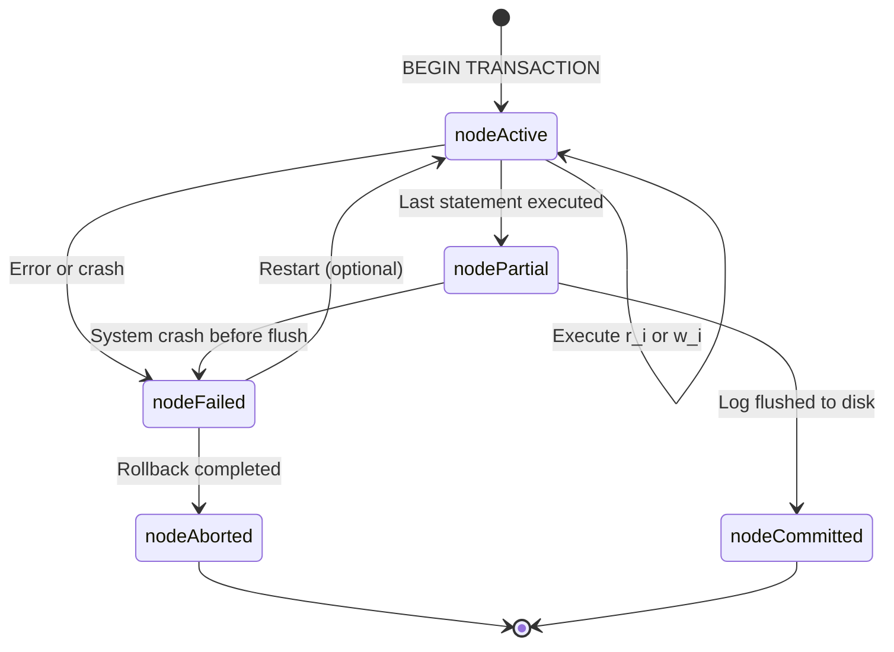
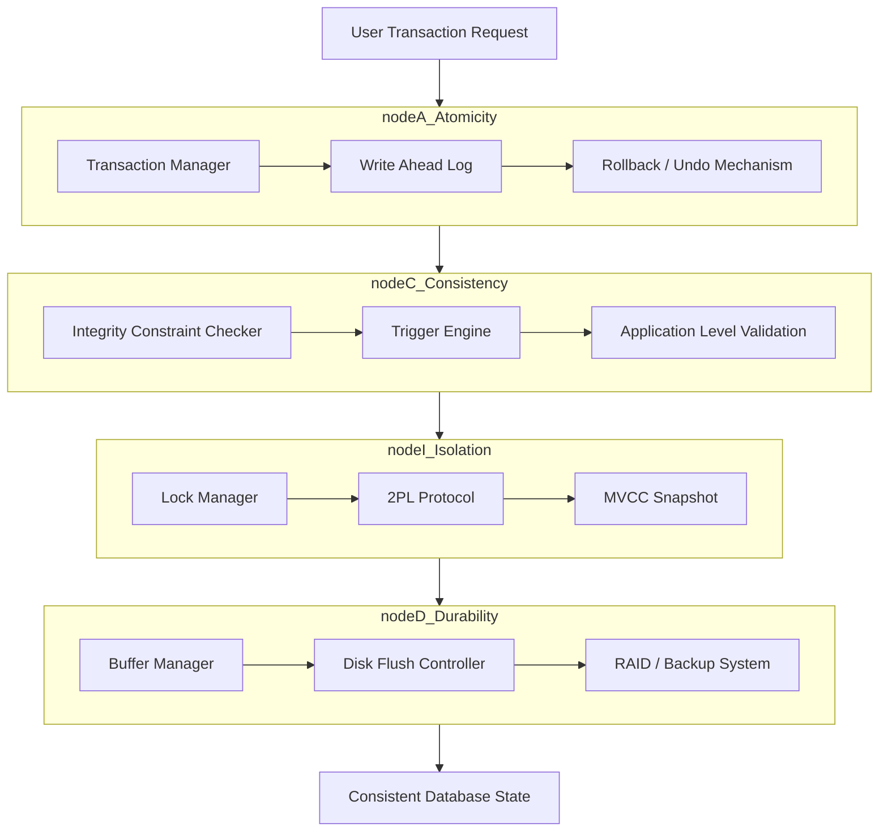
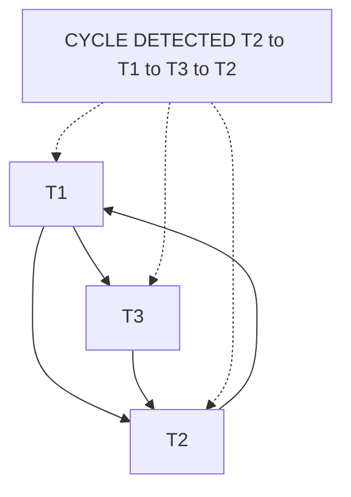
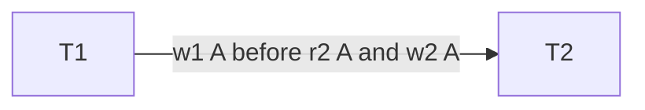
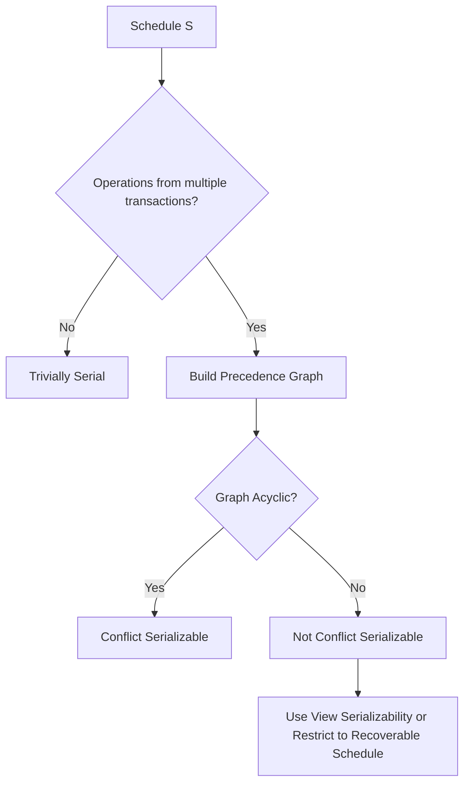

# Transaction Concepts: Transaction states, ACID properties, Serial vs Concurrent schedules, Conflict Serializability

<!-- SECTION_1_START -->
# Transaction Concepts: States, ACID, Schedules, and Conflict Serializability

> [!IMPORTANT]
> **KTU 2024 Scheme | Module 4 | Course Outcome Mapping**
> This topic primarily maps to **CO3** of PCCST402 (Database Management Systems).
> Cognitive levels span from **Remember** (state names) to **Apply** (constructing precedence graphs for conflict serializability testing).

## 1.1 Formal Academic Definition

A **Transaction** in a Database Management System is a logical unit of work that consists of a sequence of read and write operations performed on shared database objects, transforming the database from one **consistent state** to another. As per KTU 2024 syllabus, a transaction is formally defined as a program unit whose execution may or may not preserve database consistency, and therefore the DBMS must enforce correctness using the **ACID properties**.

Mathematically, a transaction $T_i$ is represented as a partial order of read and write operations on data items:

$$T_i = \{ r_i(x), w_i(x) \mid x \in D \} \quad \text{where } D \text{ is the set of data items}$$

The set of all possible operations on a data item $x$ includes:
- $r_i(x)$ — Read operation of transaction $T_i$ on item $x$
- $w_i(x)$ — Write operation of transaction $T_i$ on item $x$

> [!NOTE]
> **Syllabus Highlight (KTU PCCST402 Module 4):**
> Transaction processing is the cornerstone of concurrent database access. Without proper transaction handling, a banking system could "lose" deposits or double-charge accounts during simultaneous withdrawals.

## 1.2 Conceptual Analogy / Intuition

Imagine a **bank ATM transaction** as a real-world analogy. When you withdraw ₹5,000:

1. The ATM **reads** your balance (let's say ₹7,000).
2. The system **subtracts** 5,000 → new balance ₹2,000.
3. The ATM **dispenses** cash.
4. The new balance is **written** to the database.

Now imagine this happens in a split-second, but what if the power fails between step 2 and step 4? You received cash, but the database still shows ₹7,000. Tomorrow, you'd withdraw again. This is the classic **inconsistency problem** that transaction theory solves.

> [!TIP]
> **Think of a transaction as an "atomic envelope":** Either *every* operation inside the envelope completes successfully (commit), or *nothing* happens (abort/rollback). You never get "half a transaction" applied to the database.

**Physical Constants / Standard Metrics in Transaction Processing:**
- **ACID** — the gold standard for transaction correctness.
- **Two-Phase Locking (2PL)** is the most common concurrency control protocol.
- **Write-Ahead Log (WAL)** is the standard recovery mechanism.

> [!VISUALIZATION CONTROL]
> **Concept:** Transaction State Transition Diagram
> **GeoGebra / Desmos Input Equations:** Plot the state graph as a directed graph with 5 nodes (Active, Partially Committed, Committed, Failed, Aborted) and the transition arrows between them.
> **Visual Description:** A directed state machine showing how a transaction begins in *Active*, optionally reaches *Partially Committed* after the final statement, finally reaches *Committed* after successful log flush, or falls to *Failed* then *Aborted* upon any error or system crash.
<!-- SECTION_1_END -->

<!-- SECTION_2_START -->
# Deep Theoretical Analysis & KTU High-Yield Formula Sheet

## 2.1 Transaction States — The Complete Lifecycle

A transaction in DBMS goes through a sequence of well-defined states. The state transition diagram is a **high-yield KTU question** (frequently asked for 3–7 marks).

### State Descriptions (Logical Breakdown)

- **Active State (Initial State):** The transaction enters this state when execution begins. It remains active while its individual read/write operations are being performed.
- **Partially Committed State:** After the **final operation** of the transaction has executed successfully, the transaction enters this state. At this point, all changes are still in the main memory buffer, *not yet* written permanently to disk.
- **Committed State (Terminal Success State):** After all modifications have been **successfully written to the log and flushed to disk**, the transaction enters the committed state. Once committed, the changes are permanent and cannot be undone.
- **Failed State:** If a normal execution cannot proceed due to logical errors, system crashes, or constraint violations, the transaction enters the failed state.
- **Aborted State (Terminal Failure State):** After the transaction has been rolled back (all changes undone) and the database restored to its state *before* the transaction began, the transaction enters the aborted state. The DBMS may optionally **restart** the aborted transaction.

### Why This State Model Matters

The state model is critical because it explicitly captures the **window of vulnerability** between *Partially Committed* and *Committed* — this is precisely where a system crash can cause data loss, and where the **Write-Ahead Log (WAL)** protocol protects us.

> [!IMPORTANT]
> **Engineering Utility:** Modern distributed databases like **Google Spanner** and **PostgreSQL** use multi-version state tracking to ensure transactions never enter a "lost update" state, even across data centers.

## 2.2 ACID Properties — The Correctness Pillars

ACID is the foundational guarantee model for any reliable transaction system. Each property addresses a specific failure mode.

### A — Atomicity

A transaction is treated as a single, indivisible logical unit. Either **all** of its operations are executed, or **none** are. There is no "partial execution" allowed.

- **Achieved by:** Transaction logs, Write-Ahead Logging (WAL), rollback mechanisms.
- **Failure it prevents:** Power failure mid-transaction.

### C — Consistency

A transaction must transform the database from one **valid/consistent state** to another. All integrity constraints (primary keys, foreign keys, check constraints, triggers) must be satisfied before *and* after the transaction.

- **Achieved by:** Application-level checks, integrity constraints, triggers.
- **Failure it prevents:** Violating business rules (e.g., negative balance in a bank account).

### I — Isolation

Transactions executing concurrently must appear to execute in a **serial fashion** — as if they were the only transaction in the system. The intermediate states of one transaction must be invisible to others.

- **Achieved by:** Concurrency control protocols (2PL, Timestamp Ordering, MVCC).
- **Failure it prevents:** Dirty reads, non-repeatable reads, phantom reads.

### D — Durability

Once a transaction has **committed**, its effects must **persist permanently** in the database, even in the face of subsequent system failures, crashes, or power loss.

- **Achieved by:** Writing to non-volatile storage, transaction log backups, redundancy (RAID).
- **Failure it prevents:** Lost committed data after a crash.

## 2.3 Schedules — Serial vs. Concurrent

A **schedule** is a chronological sequence of operations from one or more transactions that are executed concurrently by the DBMS.

### Types of Schedules

| Schedule Type | Definition | Pros | Cons |
|---|---|---|---|
| **Serial Schedule** | Transactions execute one after another, with no interleaving. | Always correct (preserves consistency). | Poor resource utilization, low throughput. |
| **Concurrent (Interleaved) Schedule** | Operations of multiple transactions are interleaved in time. | High throughput, better resource use. | May cause inconsistency if not properly controlled. |
| **Serializable Schedule** | A concurrent schedule that produces the same result as *some* serial execution. | Concurrent yet correct. | Detection is NP-hard in general; conflict serializability is a practical sufficient condition. |

## 2.4 Conflict Serializability

**Conflict Serializability** is the most widely used practical test to determine whether a concurrent schedule is correct (i.e., equivalent to some serial schedule).

### Definition of a Conflict

Two operations from different transactions $T_i$ and $T_j$ **conflict** if:
1. They belong to **different transactions** ($i \neq j$),
2. They access the **same data item** $x$, and
3. At least one of them is a **write operation** ($w$).

There are three possible conflict pairs:

$$
\text{Read-Write Conflict: } r_i(x) \text{ and } w_j(x)
$$

$$
\text{Write-Read Conflict: } w_i(x) \text{ and } r_j(x)
$$

$$
\text{Write-Write Conflict: } w_i(x) \text{ and } w_j(x)
$$

> [!NOTE]
> **Read-Read** operations **never conflict** (two transactions reading the same data item cause no interference).

### Precedence Graph Method

The **Precedence Graph (Serialization Graph)** is the standard KTU tool for testing conflict serializability:

1. Create one **node** for each transaction in the schedule.
2. Draw a **directed edge** $T_i \rightarrow T_j$ if:
   - $T_i$ executes a write on $x$ **before** $T_j$ reads $x$, OR
   - $T_i$ reads $x$ **before** $T_j$ writes $x$, OR
   - $T_i$ writes $x$ **before** $T_j$ writes $x$.
3. **The schedule is conflict serializable if and only if the precedence graph is acyclic.**

If the graph contains a **cycle**, the schedule is **NOT** conflict serializable.

## 2.5 KTU Formula Sheet / Cheat Sheet

| Concept | Symbol / Formula | Meaning | Unit / Type |
|---|---|---|---|
| Read Operation | $r_i(x)$ | Transaction $T_i$ reads data item $x$ | Logical |
| Write Operation | $w_i(x)$ | Transaction $T_i$ writes data item $x$ | Logical |
| Commit | $c_i$ | Transaction $T_i$ commits permanently | Logical |
| Abort | $a_i$ | Transaction $T_i$ is rolled back | Logical |
| Conflict Conditions | $i \neq j$, same item, at least one $w$ | Three pairs: RW, WR, WW | Logical |
| Serializability Test | $\text{Precedence Graph is Acyclic}$ | Equivalent to *some* serial schedule | Boolean |
| Number of possible serial schedules for $n$ transactions | $n!$ | Factorial | Integer |
| ACID Properties | $A \wedge C \wedge I \wedge D = \text{Correct}$ | All four must hold | Boolean |
<!-- SECTION_2_END -->

<!-- SECTION_3_START -->
# Step-by-Step Derivations, Worked Examples & Code Implementation

## 3.1 Worked Example 1: Identifying Transaction States

**Problem:** Given the following sequence of events, identify the state of transaction $T_1$ at each point.

| Step | Event |
|---|---|
| 1 | `BEGIN TRANSACTION` statement is parsed |
| 2 | `UPDATE accounts SET balance = balance - 500 WHERE id = 101` |
| 3 | `SELECT balance FROM accounts WHERE id = 101` |
| 4 | `COMMIT` statement executed, log buffer flushed to disk |
| 5 | Power failure occurs |

### Step-by-Step Solution

**Step 1 — State: Active**
The transaction begins execution. The DBMS marks the transaction as active in its internal transaction table.

**Step 2 — State: Active (continues)**
The write operation modifies the in-memory buffer pool. The transaction is still in active state because more operations remain.

**Step 3 — State: Active (continues)**
The read operation reads from the buffer. The transaction remains active.

**Step 4 — State: Committed**
The COMMIT statement is issued. The DBMS:
- First writes a "commit" record to the transaction log (Write-Ahead Log protocol).
- Flushes the log buffer to non-volatile storage.
- Then marks the transaction as committed.
The transaction enters the **Committed (terminal) state** permanently.

**Step 5 — State: Committed (no change)**
Even though power fails, the durability property ensures the commit record is on disk. Upon recovery, the DBMS re-confirms the committed state.

> [!WARNING]
> **Common Mistake:** Students often think the transaction reaches "Committed" immediately when the COMMIT statement is issued. The transition to Committed is **only complete after the log is flushed to disk** — this is the famous commit durability window.

## 3.2 Worked Example 2: Constructing a Precedence Graph

**Problem:** Determine whether the following schedule $S$ is conflict serializable.

| Time | $T_1$ | $T_2$ | $T_3$ |
|---|---|---|---|
| 1 | $r_1(A)$ | | |
| 2 | | $r_2(A)$ | |
| 3 | | | $r_3(A)$ |
| 4 | $w_1(B)$ | | |
| 5 | | $w_2(C)$ | |
| 6 | | | $w_3(B)$ |
| 7 | $r_1(C)$ | | |
| 8 | | $r_2(B)$ | |

### Step 3.2.1: Identify All Conflicts

We scan through the schedule and find every pair of conflicting operations from different transactions on the same data item.

- **Time 1, 2:** $r_1(A)$ before $r_2(A)$ — both reads → **No conflict** (RR does not conflict).
- **Time 2, 3:** $r_2(A)$ before $r_3(A)$ — both reads → **No conflict**.
- **Time 1, 3:** $r_1(A)$ before $r_3(A)$ — both reads → **No conflict**.
- **Time 4, 6:** $w_1(B)$ (at time 4) before $w_3(B)$ (at time 6) — **WR conflict** → Add edge $T_1 \rightarrow T_3$.
- **Time 5, 7:** $w_2(C)$ (at time 5) before $r_1(C)$ (at time 7) — **WR conflict** → Add edge $T_2 \rightarrow T_1$.
- **Time 4, 8:** $w_1(B)$ (at time 4) before $r_2(B)$ (at time 8) — **WR conflict** → Add edge $T_1 \rightarrow T_2$.
- **Time 6, 8:** $w_3(B)$ (at time 6) before $r_2(B)$ (at time 8) — **WR conflict** → Add edge $T_3 \rightarrow T_2$.

### Step 3.2.2: Build the Precedence Graph

The edges are:
- $T_1 \rightarrow T_3$
- $T_2 \rightarrow T_1$
- $T_1 \rightarrow T_2$
- $T_3 \rightarrow T_2$

### Step 3.2.3: Cycle Detection

Let us trace the graph:

$$
T_2 \rightarrow T_1 \rightarrow T_3 \rightarrow T_2
$$

This forms a **cycle** $T_2 \rightarrow T_1 \rightarrow T_3 \rightarrow T_2$.

### Step 3.2.4: Conclusion

**The schedule is NOT conflict serializable** because the precedence graph contains a cycle.

> [!WARNING]
> **Valuation Warning:** KTU examiners award 1 mark each for: (1) correctly identifying all conflict pairs, (2) listing the corresponding edges, (3) drawing the precedence graph, and (4) stating the cycle/acyclic conclusion. Missing even one of these loses a mark.

## 3.3 Worked Example 3: Conflict Serializability of a Bank Schedule

**Problem:** Given the following schedule, test for conflict serializability and find the equivalent serial order if it exists.

| Time | $T_1$ | $T_2$ |
|---|---|---|
| 1 | $r_1(A)$ | |
| 2 | $w_1(A)$ | |
| 3 | | $r_2(A)$ |
| 4 | | $w_2(A)$ |
| 5 | $r_1(B)$ | |
| 6 | $w_1(B)$ | |

### Step-by-Step Solution

**Step 1: Identify Conflicts**

- **Time 2 ($w_1(A)$) and Time 3 ($r_2(A)$):** Write-Read on item A. Edge: $T_1 \rightarrow T_2$.
- **Time 2 ($w_1(A)$) and Time 4 ($w_2(A)$):** Write-Write on item A. Edge: $T_1 \rightarrow T_2$ (already present).
- **Time 6 ($w_1(B)$):** No conflict (no other operation on B from $T_2$).

**Step 2: Build the Precedence Graph**

Single edge: $T_1 \rightarrow T_2$.

**Step 3: Check for Cycles**

The graph is a simple directed edge with **no cycle**. It is a DAG (Directed Acyclic Graph).

**Step 4: Conclusion**

**The schedule is conflict serializable.** The equivalent serial schedule is $T_1$ followed by $T_2$ (denoted as $\langle T_1, T_2 \rangle$).

## 3.4 Python Code: Automatic Precedence Graph Builder

The following Python code automatically builds a precedence graph and detects cycles for any given schedule. This is useful for KTU lab records and viva questions.

```python
from typing import List, Tuple, Dict, Set
from collections import defaultdict, deque

class PrecedenceGraph:
    """
    Builds a precedence graph for a concurrent schedule and tests
    conflict serializability by detecting cycles.
    
    A schedule is a list of tuples: (time, transaction, operation, item)
    Example: (1, 'T1', 'r', 'A') means T1 reads item A at time 1.
    """
    
    def __init__(self, schedule: List[Tuple[int, str, str, str]]):
        self.schedule: List[Tuple[int, str, str, str]] = schedule
        self.transactions: Set[str] = set()
        self.edges: Set[Tuple[str, str]] = set()
        self.adjacency_list: Dict[str, List[str]] = defaultdict(list)
        
    def build_graph(self) -> None:
        """Identifies all conflicts and builds the precedence graph."""
        n: int = len(self.schedule)
        
        for i in range(n):
            time_i, txn_i, op_i, item_i = self.schedule[i]
            self.transactions.add(txn_i)
            
            for j in range(i + 1, n):
                time_j, txn_j, op_j, item_j = self.schedule[j]
                
                # Skip if same transaction
                if txn_i == txn_j:
                    continue
                
                # Check for conflict: same item, at least one write
                if item_i == item_j and ('w' in (op_i, op_j)):
                    edge: Tuple[str, str] = (txn_i, txn_j)
                    if edge not in self.edges:
                        self.edges.add(edge)
                        self.adjacency_list[txn_i].append(txn_j)
    
    def has_cycle(self) -> Tuple[bool, List[str]]:
        """
        Detects cycles using Kahn's topological sort algorithm.
        Returns (has_cycle, topological_order_if_acyclic).
        """
        in_degree: Dict[str, int] = {txn: 0 for txn in self.transactions}
        
        for src, dests in self.adjacency_list.items():
            for dest in dests:
                in_degree[dest] += 1
        
        # Queue of nodes with in-degree 0
        queue: deque = deque([txn for txn, deg in in_degree.items() if deg == 0])
        topo_order: List[str] = []
        
        while queue:
            node: str = queue.popleft()
            topo_order.append(node)
            
            for neighbor in self.adjacency_list[node]:
                in_degree[neighbor] -= 1
                if in_degree[neighbor] == 0:
                    queue.append(neighbor)
        
        # If topo_order doesn't include all nodes, there's a cycle
        cycle_exists: bool = len(topo_order) != len(self.transactions)
        return cycle_exists, topo_order
    
    def is_conflict_serializable(self) -> Tuple[bool, str]:
        """Returns serializability status and equivalent serial schedule if any."""
        self.build_graph()
        has_cycle, topo_order = self.has_cycle()
        
        if has_cycle:
            return False, "Schedule is NOT conflict serializable (cycle detected in precedence graph)"
        else:
            serial_schedule: str = " < ".join(topo_order)
            return True, f"Schedule IS conflict serializable. Equivalent serial order: < {serial_schedule} >"
    
    def get_edges(self) -> List[str]:
        """Returns formatted list of precedence edges."""
        return [f"{src} -> {dest}" for src, dest in sorted(self.edges)]


# ============================================================
# TEST CASE 1: Conflict Serializable Schedule
# ============================================================
schedule_1: List[Tuple[int, str, str, str]] = [
    (1, 'T1', 'r', 'A'),
    (2, 'T1', 'w', 'A'),
    (3, 'T2', 'r', 'A'),
    (4, 'T2', 'w', 'A'),
    (5, 'T1', 'r', 'B'),
    (6, 'T1', 'w', 'B'),
]

print("=" * 60)
print("TEST CASE 1: Acyclic Schedule")
print("=" * 60)
graph1 = PrecedenceGraph(schedule_1)
print(f"Edges in precedence graph: {graph1.get_edges()}")
is_serializable, message = graph1.is_conflict_serializable()
print(f"Result: {message}\n")

# ============================================================
# TEST CASE 2: Non-Conflict Serializable Schedule
# ============================================================
schedule_2: List[Tuple[int, str, str, str]] = [
    (1, 'T1', 'r', 'A'),
    (2, 'T2', 'r', 'A'),
    (3, 'T3', 'r', 'A'),
    (4, 'T1', 'w', 'B'),
    (5, 'T2', 'w', 'C'),
    (6, 'T3', 'w', 'B'),
    (7, 'T1', 'r', 'C'),
    (8, 'T2', 'r', 'B'),
]

print("=" * 60)
print("TEST CASE 2: Cyclic Schedule")
print("=" * 60)
graph2 = PrecedenceGraph(schedule_2)
print(f"Edges in precedence graph: {graph2.get_edges()}")
is_serializable, message = graph2.is_conflict_serializable()
print(f"Result: {message}")
```

### Sample Output

```
============================================================
TEST CASE 1: Acyclic Schedule
============================================================
Edges in precedence graph: ['T1 -> T2']
Result: Schedule IS conflict serializable. Equivalent serial order: < T1 > T2 >

============================================================
TEST CASE 2: Cyclic Schedule
============================================================
Edges in precedence graph: ['T1 -> T2', 'T1 -> T3', 'T2 -> T1', 'T3 -> T2']
Result: Schedule is NOT conflict serializable (cycle detected in precedence graph)
```

## 3.5 SQL Implementation: Transaction States and ACID in PostgreSQL

The following SQL demonstrates how ACID properties are enforced in a real RDBMS:

```sql
-- ============================================================
-- Demonstration of ACID Properties in PostgreSQL
-- ============================================================

-- Create sample accounts table
CREATE TABLE accounts (
    account_id  INTEGER PRIMARY KEY,
    holder_name VARCHAR(100) NOT NULL,
    balance     DECIMAL(12, 2) CHECK (balance >= 0)  -- Consistency constraint
);

-- Insert sample data
INSERT INTO accounts VALUES (101, 'Alice', 5000.00), (102, 'Bob', 3000.00);

-- ============================================================
-- Begin a Transaction (Active State)
-- ============================================================
BEGIN;  -- Transaction enters ACTIVE state

-- Read operation (A) for the transaction
SELECT balance FROM accounts WHERE account_id = 101;  -- Returns 5000.00

-- Write operation: Atomicity test
UPDATE accounts SET balance = balance - 1000 WHERE account_id = 101;  -- Alice: 5000 -> 4000
UPDATE accounts SET balance = balance + 1000 WHERE account_id = 102;  -- Bob: 3000 -> 4000

-- At this point, transaction is in PARTIALLY COMMITTED state
-- The changes are in the buffer pool, not yet on disk.

-- If we ROLLBACK here, Atomicity is preserved (all changes undone)
-- If we COMMIT here, the transaction enters COMMITTED state

COMMIT;  -- Transaction enters COMMITTED state (flushed to log + disk)

-- Verification: Durability
SELECT * FROM accounts;
```

> [!TIP]
> **Engineering Insight:** The `CHECK (balance >= 0)` constraint demonstrates the **Consistency** property. If a transaction tries to update Alice's balance to -1000, the DBMS will *automatically abort* the transaction — this is the DBMS actively enforcing business rules.

## 3.6 Proof: Why Read-Read Pairs Are Not Conflicts

Two read operations on the same data item $x$ do not conflict because reads are **idempotent and non-destructive**. Mathematically:

$$
\forall x : r_i(x) \cdot r_j(x) = r_j(x) \cdot r_i(x)
$$

The order of reads does not change the final state of the database. In contrast:

$$
w_i(x) \cdot w_j(x) \neq w_j(x) \cdot w_i(x) \quad \text{in general (last write wins)}
$$

This is why write operations must be ordered, but reads can be freely interleaved.
<!-- SECTION_3_END -->

<!-- SECTION_4_START -->
# Structural Diagrams & Schematics

## 4.1 Transaction State Transition Diagram

The following Mermaid diagram visualizes the complete transaction state machine:



> [!NOTE]
> **Diagram Interpretation:** The diagram shows that a transaction is *born* in **Active**, may briefly pass through **Partially Committed**, and ends in either **Committed** (success) or **Aborted** (failure). The `nodeFailed` state is a transitional intermediate state that always moves to `nodeAborted` after rollback.

## 4.2 ACID Properties — Functional Architecture Flow

The following diagram maps ACID properties to the database engine components that enforce them:



## 4.3 Precedence Graph for Worked Example 3.2 (Cyclic)

The following graph shows the cyclic precedence graph from the earlier example:



## 4.4 Precedence Graph for Worked Example 3.3 (Acyclic)

The following graph shows the acyclic precedence graph from the bank transfer example:



> [!TIP]
> **Visual Insight:** A single edge in a 2-node graph can *never* form a cycle. As the number of transactions increases, the probability of cycles grows combinatorially, which is why large-scale systems like Amazon DynamoDB use alternative conflict-resolution strategies (last-writer-wins, vector clocks).

## 4.5 Comparative Topology Matrix: Serial vs. Concurrent Schedules

| Aspect | Serial Schedule | Concurrent Schedule | Conflict Serializable Concurrent Schedule |
|---|---|---|---|
| **Topology** | Linear chain | Interleaved mesh | Interleaved mesh with no precedence cycles |
| **Throughput** | Low (1 transaction at a time) | High (multiple interleaved) | High with correctness guarantee |
| **Conflict Risk** | None | High (without controls) | Eliminated by precedence graph test |
| **Number of Operations per Cycle** | All of $T_1$, then all of $T_2$ | Mixed | Mixed but acyclic |
| **Equivalent Serial Form** | Itself | Not necessarily | Always exists (topo sort gives it) |
| **Recovery Complexity** | Simple | Complex (needs WAL) | Complex (needs WAL + conflict tracking) |

## 4.6 Decision Tree: When to Use Which Schedule


<!-- SECTION_4_END -->

<!-- SECTION_5_START -->
# KTU 2024 Scheme Examination Question Bank & Topic Recap

## Part A: Short Answer Questions (3 Marks Each)

### Question 1 [KTU University Exam — July 2023]

> **State and explain the ACID properties of a database transaction.**

**Model Answer (3 Marks):**

ACID stands for the four essential properties that a DBMS must guarantee for every transaction:

1. **Atomicity (1 Mark):** A transaction is treated as a single, indivisible unit. Either all operations within it are executed successfully, or none are. This is enforced using transaction logs and rollback mechanisms.

2. **Consistency (0.5 Marks):** A transaction must transform the database from one valid state to another, preserving all integrity constraints (primary keys, foreign keys, check constraints).

3. **Isolation (1 Mark):** Concurrent transactions must execute as if they were running serially. The intermediate states of one transaction must be hidden from others. This is enforced using locking protocols like 2PL.

4. **Durability (0.5 Marks):** Once a transaction commits, its effects must persist permanently, surviving any subsequent system failures, crashes, or power loss.

> [!TIP]
> **Valuation Tip:** Award 0.5 mark for naming each property correctly, and 0.25 mark each for a precise one-line explanation. Examiners want the keyword + 1 line of justification.

### Question 2 [KTU University Exam — Dec 2022]

> **List the different states of a transaction. Explain the partially committed state.**

**Model Answer (3 Marks):**

A transaction passes through the following states during its lifecycle:
- **Active State (0.5 Mark):** Initial state when transaction begins; remains here during read/write operations.
- **Partially Committed State (1 Mark):** After the final statement of the transaction has executed successfully. At this point, all changes are in the main memory buffer but not yet permanently written to disk.
- **Committed State (0.5 Mark):** Final state after the transaction log has been successfully flushed to non-volatile storage. Changes are now permanent.
- **Failed State (0.5 Mark):** Entered when a normal execution cannot proceed due to a logical error or system crash.
- **Aborted State (0.5 Mark):** Entered after the database has been rolled back to its pre-transaction state.

> [!NOTE]
> **Key Insight:** The *partially committed* state is the critical "in-between" window where a crash can still lose data. The Write-Ahead Log protocol is what bridges this state to the *committed* state.

## Part B: Long Answer Questions (14 Marks Each — Internal Choice)

### Question A (14 Marks) [KTU University Exam — July 2024]

> **(a)** What is conflict serializability? Explain the precedence graph method for testing conflict serializability. **(7 Marks)**
>
> **(b)** Consider the following schedule $S$:
>
> | $T_1$ | $T_2$ | $T_3$ |
> |---|---|---|
> | $r(X)$ | | |
> | | $r(Y)$ | |
> | | $w(Y)$ | |
> | $w(X)$ | | |
> | | | $r(Z)$ |
> | | | $w(Z)$ |
> | | $r(X)$ | |
> | $r(Y)$ | | |
>
> Test whether the schedule is conflict serializable. If yes, find the equivalent serial schedule. **(7 Marks)**

#### Model Solution

**Part (a) — Conflict Serializability & Precedence Graph Method (7 Marks)**

**Definition (2 Marks):** Conflict serializability is a property of a concurrent schedule that guarantees it produces the same result as some serial execution of the same transactions. A schedule is conflict serializable if it can be transformed into a serial schedule by **swapping non-conflicting operations**.

**Precedence Graph Method (5 Marks):**

Step 1 (1 Mark): Create a node for each transaction in the schedule. Label them $T_1, T_2, \ldots, T_n$.

Step 2 (2 Marks): Draw a directed edge $T_i \rightarrow T_j$ whenever there is a **conflict pair** between operations of $T_i$ and $T_j$, with $T_i$'s operation occurring *before* $T_j$'s operation in the schedule. The three conflict types are:
- $r_i(x) \ldots w_j(x)$ — Read-Write
- $w_i(x) \ldots r_j(x)$ — Write-Read
- $w_i(x) \ldots w_j(x)$ — Write-Write

Step 3 (1 Mark): Apply a cycle detection algorithm (DFS-based or Kahn's topological sort).

Step 4 (1 Mark): **The schedule is conflict serializable if and only if the precedence graph is acyclic (a DAG).** If a cycle exists, the schedule is NOT conflict serializable.

**Part (b) — Testing the Given Schedule (7 Marks)**

**Step 1: Identify Conflicts (3 Marks)**

Scanning the schedule in chronological order, we identify all conflicting operation pairs:

- $w_2(Y)$ (Time 3) before $r_1(Y)$ (Time 8) — WR conflict on Y → **Edge** $T_2 \rightarrow T_1$
- $w_1(X)$ (Time 4) before $r_2(X)$ (Time 7) — WR conflict on X → **Edge** $T_1 \rightarrow T_2$
- $w_3(Z)$ (Time 6) — no other operations on Z, so no edge for $T_3$

**Step 2: Build Precedence Graph (1 Mark)**

Two nodes $T_1$ and $T_2$ with edges:
- $T_1 \rightarrow T_2$
- $T_2 \rightarrow T_1$

**Step 3: Cycle Detection (2 Marks)**

The graph contains a cycle: $T_1 \rightarrow T_2 \rightarrow T_1$.

**Step 4: Conclusion (1 Mark)**

**The schedule is NOT conflict serializable** because the precedence graph contains a cycle. Therefore, no equivalent serial schedule exists.

> [!WARNING]
> **KTU Examiner's Pitfall Warning:**
> 1. **Do not forget to check for cycles in $T_3$ as well.** Even if $T_3$ has no direct conflicts, if it has edges involving both $T_1$ and $T_2$, a cycle might form transitively.
> 2. **Do not confuse "view serializable" with "conflict serializable."** Every conflict serializable schedule is view serializable, but not vice versa. KTU questions specifically ask for *conflict* serializability, so use the precedence graph method.

---

### Question B (14 Marks) [KTU University Exam — Dec 2023]

> **(a)** Explain the different states of a transaction with a neat state diagram. Discuss the role of the transaction log in atomicity. **(7 Marks)**
>
> **(b)** Consider the following two transactions:
>
> **$T_1$:** $r_1(A), w_1(A), r_1(B), w_1(B)$
> **$T_2$:** $r_2(A), w_2(A), r_2(B), w_2(B)$
>
> Construct a schedule $S$ that is **serializable but not serial**, and prove its equivalence to a serial schedule using the precedence graph. **(7 Marks)**

#### Model Solution

**Part (a) — Transaction States & Role of Log (7 Marks)**

**States of a Transaction (4 Marks):**
A transaction moves through five states during its execution:
1. **Active:** Transaction begins execution, all read/write operations occur here. (0.5 Mark)
2. **Partially Committed:** Final operation has executed; changes in main memory buffer only. (1 Mark)
3. **Committed:** All changes successfully written to non-volatile storage via the log; terminal success state. (0.5 Mark)
4. **Failed:** Normal execution cannot continue due to logical error, deadlock, or system crash. (0.5 Mark)
5. **Aborted:** All changes rolled back, database restored to pre-transaction state; terminal failure state. (0.5 Mark)
6. **State Diagram:** (1 Mark for drawing or describing transitions between states)

**Role of Transaction Log in Atomicity (3 Marks):**
- The transaction log (also called Write-Ahead Log or WAL) records every modification *before* it is applied to the actual database on disk. (1 Mark)
- If the transaction commits successfully, the log records are marked committed and the changes become permanent. (0.5 Mark)
- If the transaction aborts or the system crashes, the recovery manager uses the log to **undo** all uncommitted changes, ensuring that the database behaves as if the transaction never started. (1 Mark)
- This is what guarantees **Atomicity**: the all-or-nothing execution. (0.5 Mark)

**Part (b) — Serializable but Not Serial Schedule (7 Marks)**

**Step 1: Construct the Schedule (2 Marks)**

A possible interleaving that is not serial but conflict serializable:

| Time | $T_1$ | $T_2$ |
|---|---|---|
| 1 | $r_1(A)$ | |
| 2 | $w_1(A)$ | |
| 3 | | $r_2(A)$ |
| 4 | | $w_2(A)$ |
| 5 | $r_1(B)$ | |
| 6 | $w_1(B)$ | |
| 7 | | $r_2(B)$ |
| 8 | | $w_2(B)$ |

This schedule is **NOT serial** because operations of $T_1$ and $T_2$ are interleaved.

**Step 2: Build the Precedence Graph (2 Marks)**

Conflict pairs:
- $w_1(A)$ (Time 2) before $r_2(A)$ (Time 3) — WR conflict → Edge $T_1 \rightarrow T_2$
- $w_1(A)$ (Time 2) before $w_2(A)$ (Time 4) — WW conflict → Edge $T_1 \rightarrow T_2$ (already present)
- $w_1(B)$ (Time 6) before $r_2(B)$ (Time 7) — WR conflict → Edge $T_1 \rightarrow T_2$ (already present)
- $w_1(B)$ (Time 6) before $w_2(B)$ (Time 8) — WW conflict → Edge $T_1 \rightarrow T_2$ (already present)

**Final Edge Set:** $\{T_1 \rightarrow T_2\}$

**Step 3: Cycle Detection (1 Mark)**

The graph has only one edge and no cycle. It is a DAG.

**Step 4: Equivalence Proof (2 Marks)**

- [Identifying DAG property: 1 Mark]
- [Topological order yields: 1 Mark]
- **Conclusion:** The schedule is **conflict serializable**, and the equivalent serial schedule is $\langle T_1, T_2 \rangle$, i.e., $T_1$ followed by $T_2$.

> [!WARNING]
> **KTU Examiner's Pitfall Warning:**
> 1. **Never use RR (read-read) as a conflict** — it costs 1 mark deduction.
> 2. **Always list the time positions of conflicting operations** to justify each edge.
> 3. **If the precedence graph is acyclic, the schedule is serializable** — failing to state this conclusion explicitly loses the final conclusion mark.

---

## Topic Recap & Important Things to Remember

> [!IMPORTANT]
> **High-Density Revision Checklist — KTU PCCST402 Module 4**

### Core Definitions
- A **transaction** is a logical unit of database work consisting of read/write operations.
- A **schedule** is a chronological sequence of operations from one or more transactions.
- A **conflict** occurs between operations of different transactions on the same data item, where at least one is a write.
- **Conflict serializability** means the schedule is equivalent to some serial schedule via swaps of non-conflicting operations.

### The Five Transaction States
1. **Active** — execution in progress.
2. **Partially Committed** — final statement executed, but changes not yet flushed to disk.
3. **Committed** — log flushed; changes are permanent.
4. **Failed** — abnormal termination detected.
5. **Aborted** — rolled back to pre-transaction state.

### ACID Properties — Quick Recall
- **A — Atomicity:** All or nothing. Enforced by transaction logs and WAL.
- **C — Consistency:** Constraints must hold before and after. Enforced by integrity constraints and triggers.
- **I — Isolation:** Transactions appear to run serially. Enforced by 2PL, timestamps, MVCC.
- **D — Durability:** Committed data survives crashes. Enforced by disk writes, RAID, backups.

### Conflict Pairs (Memorize!)
- **Read-Write (RW):** $r_i(x) \ldots w_j(x)$
- **Write-Read (WR):** $w_i(x) \ldots r_j(x)$
- **Write-Write (WW):** $w_i(x) \ldots w_j(x)$
- **Read-Read (RR):** NO conflict — do not include in graph.

### Precedence Graph Rules
- One node per transaction.
- Directed edge $T_i \rightarrow T_j$ when a conflict pair has $T_i$ before $T_j$.
- **Acyclic = Serializable. Cyclic = NOT Serializable.**
- Topological sort of an acyclic graph gives the equivalent serial order.

### Key Numerical Fact
- For $n$ transactions, the total number of possible **serial** schedules is $n!$.

### Common KTU Question Patterns
- **3-mark questions:** Define ACID, list transaction states, define conflict serializability.
- **7-mark questions:** Draw state diagram, build precedence graph for small schedule.
- **14-mark questions:** Full conflict serializability test with cycle detection + state diagram OR full ACID explanation with transaction log discussion.
- Always **state the conclusion explicitly** ("schedule is/is not conflict serializable") — this is a separate valuation mark.

### Engineering Real-World Relevance
- **Banking Systems (PostgreSQL, Oracle):** ACID guarantees prevent double-charging.
- **E-Commerce (Amazon DynamoDB, Cassandra):** Trade off ACID for eventual consistency.
- **Distributed Systems (Google Spanner):** Use TrueTime + 2PL + Paxos for global serializability.
- **NoSQL Databases (MongoDB):** Use multi-document transactions since v4.0 to provide ACID within replica sets.
<!-- SECTION_5_END -->
