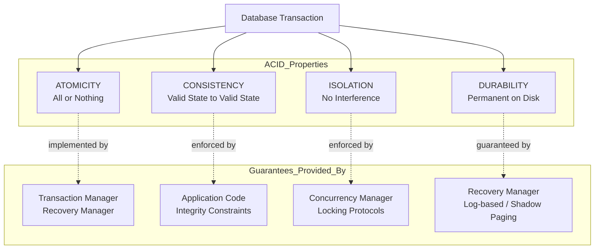
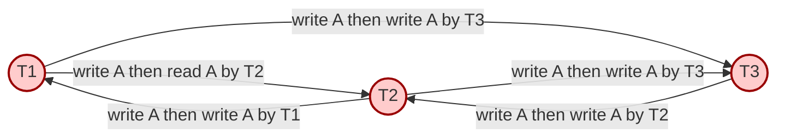
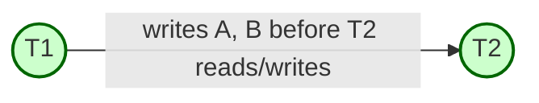
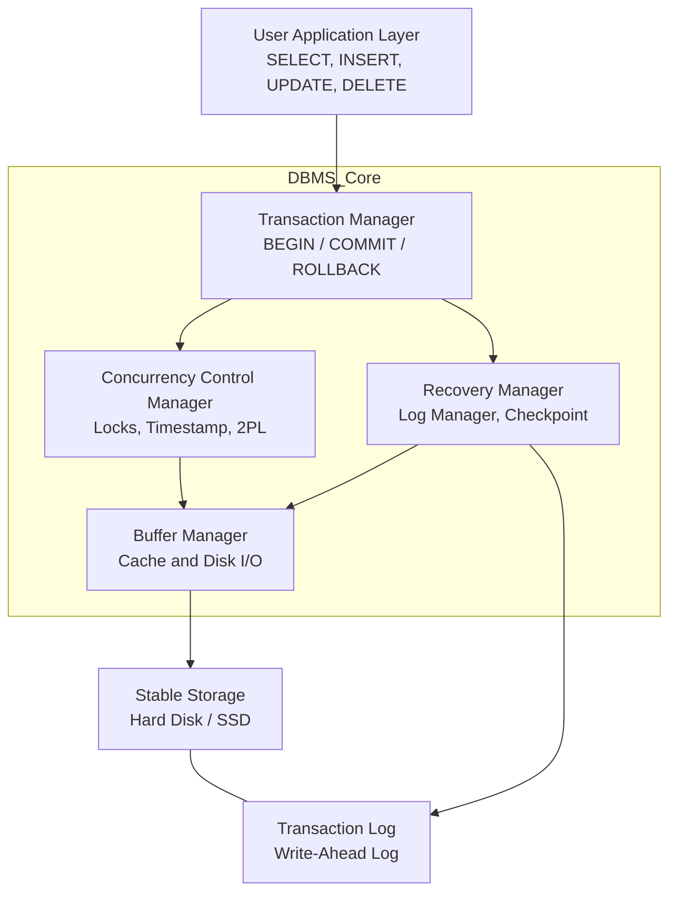
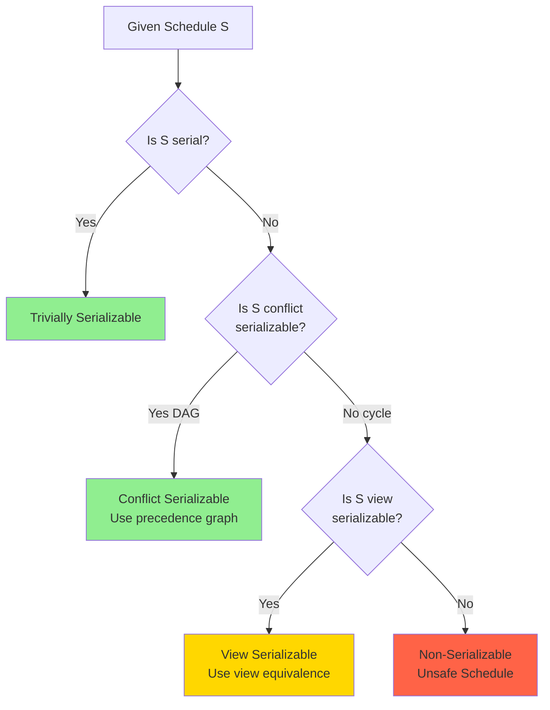

# Transaction Concepts: Transaction states, ACID properties, Serial vs Concurrent schedules, Conflict Serializability

<!-- SECTION_1_START -->
# MODULE 4: TRANSACTION PROCESSING, RECOVERY, AND MODERN DATABASE PARADIGMS
## Topic: Transaction Concepts — States, ACID Properties, Serial vs Concurrent Schedules, Conflict Serializability

---

### 1.1 Formal Definition of a Transaction

> [!IMPORTANT]
> **Definition (KTU Syllabus Aligned):**
> A **Transaction** is a logical unit of database processing that includes one or more database access operations (read, write, update, delete) executed as a single, indivisible logical unit of work. A transaction transforms the database from one **consistent state** to another consistent state, while preserving the integrity constraints of the database.

In formal relational terms, a transaction is a sequence of operations bounded by two terminator operations:
- `BEGIN_TRANSACTION` (or `START`)
- `COMMIT` (successful end) or `ROLLBACK` (unsuccessful end / abort)

> [!NOTE]
> **Key Notation Used in KTU Board Exams:**
> - $T_i$ → represents the $i$-th transaction.
> - $r_i(X)$ → read operation performed by transaction $T_i$ on data item $X$.
> - $w_i(X)$ → write operation performed by transaction $T_i$ on data item $X$.
> - $c_i$ → commit of transaction $T_i$.
> - $a_i$ → abort of transaction $T_i$.

---

### 1.2 Intuitive Analogy: The Bank Transfer Metaphor

Imagine you walk into a bank to transfer **₹5,000** from **Account A** to **Account B**. The teller (or the computer system) must perform **two inseparable steps**:

1. **Deduct ₹5,000** from Account A.
2. **Add ₹5,000** to Account B.

If a power failure happens *between* these two steps, money vanishes from A but never reaches B. This is a **disaster** for the customer. To prevent this, the bank treats both steps as one **atomic transaction** — either both happen, or neither happens. This is the entire philosophical foundation of transaction processing in DBMS.

> [!TIP]
> **Mental Hook for the Exam:** Think of a transaction as an "all-or-nothing contract." If even one operation inside it fails, the database engine must be able to **rewind the entire transaction** as if it never began.

---

### 1.3 Transaction States (State Transition Diagram)

Every transaction in its life cycle moves through a well-defined set of states. KTU 2024 Scheme examiners frequently test this as a 3-mark direct question.

> [!VISUALIZATION CONTROL]
> **Concept:** Transaction State Transition Diagram
> **Geometric Intuition:** A directed state machine with **5 nodes** (Active, Partially Committed, Committed, Failed, Aborted) and **4 valid transitions**, plus a termination flow.
> **Visual Description:** A central node "Active" branches into "Partially Committed" (after the last statement executes) and "Failed" (on logic error). "Partially Committed" transitions to "Committed" (after successful write to log/disk) or to "Failed." "Failed" routes to "Aborted," which has two optional restarts back to Active.

```
[ Active ]
    | (last statement executed)
    v
[ Partially Committed ] ----(write to log & DB)----> [ Committed ] (TERMINAL)
    |
    | (cannot continue / system crash)
    v
[ Failed ]
    |
    v
[ Aborted ] ----(restart transaction)----> [ Active ]
```

| State | Meaning | KTU Exam Cue |
| :--- | :--- | :--- |
| **Active** | The initial state; the transaction is currently executing its read/write operations. | "Transaction is running." |
| **Partially Committed** | The final operation has executed, but changes are still in main memory (buffer), not yet flushed to disk. | "After last statement, before commit." |
| **Committed** | All operations completed successfully and changes are permanently recorded on disk. | "Terminal success state." |
| **Failed** | The discovery that normal execution can no longer proceed (e.g., constraint violation, division by zero, system crash). | "Pre-abort detection." |
| **Aborted** | The transaction has been rolled back; the database is restored to its state prior to transaction start. | "Terminal failure state." |

> [!WARNING]
> **Common Student Mistake:** Confusing *Partially Committed* with *Committed*. The crucial difference is that in *Partially Committed*, the data is still volatile (in buffer/cache). The transaction officially enters the **Committed** state **only after** the log records are successfully written to stable (non-volatile) storage. This distinction is critical for **Recovery Protocols** (covered later in Module 4).

---

### 1.4 The ACID Properties

ACID is the cornerstone contract that guarantees reliable transaction processing. KTU 2024 Scheme lists this as a **high-weightage CO1 (Remember/Understand)** topic — expect 3 to 7 mark questions.

> [!IMPORTANT]
> **ACID = Atomicity + Consistency + Isolation + Durability**

| Property | Formal Meaning | Real-World Engineering Analogy | Who Guarantees It? |
| :--- | :--- | :--- | :--- |
| **A**tomicity | A transaction is an indivisible unit. Either **all** operations execute or **none** do. | A gun firing a bullet — it either hits the target or it doesn't fire at all; you never get a "half-bullet." | Transaction Manager / Recovery Manager |
| **C**onsistency | A transaction transforms the database from one **valid state** to another, preserving all integrity constraints (FK, PK, CHECK). | A perfect recipe: the chef either produces a perfect cake or throws out the batter and starts over. The kitchen is never left half-baked. | Application Programmer + Constraint Checker |
| **I**solation | Concurrent transactions must execute as if they were running **one at a time**. Intermediate results of an unfinished transaction are invisible to others. | Cubicles in a shared office: each employee works privately; outsiders cannot peek at the half-written report on the desk. | Concurrency Control Manager (Locks) |
| **D**urability | Once a transaction **commits**, its effects **must survive** any subsequent system failure (crash, power loss). | A signed legal contract: once notarized, the document is permanent and legally binding, no matter what happens tomorrow. | Recovery Manager (Log-based / Shadow paging) |

> [!NOTE]
> **Engineer's Perspective:** In distributed systems (e.g., Google Spanner, Amazon DynamoDB with transactions, Apache Kafka transactions), the ACID properties are often relaxed to **BASE** (Basically Available, Soft state, Eventual consistency) for performance — but the **relational** DBMS world (PostgreSQL, Oracle, MySQL InnoDB) strictly enforces ACID. KTU exams focus on the **strict ACID** model.

---

### 1.5 Schedules: Serial vs. Concurrent

> [!IMPORTANT]
> **Definition (Schedule):**
> A **Schedule (or History)** $S$ is a chronological ordering of the interleaved execution of one or more transactions. It specifies the order in which the read/write/commit operations of concurrent transactions are executed.

#### 1.5.1 Serial Schedule
A schedule in which **all operations of one transaction are completed before any operation of another transaction begins**. No interleaving is allowed.

**Example:** Two transactions $T_1$ and $T_2$ both transferring money.
- **Serial Schedule 1:** Run $T_1$ completely, then $T_2$ completely.
- **Serial Schedule 2:** Run $T_2$ completely, then $T_1$ completely.

#### 1.5.2 Concurrent (Interleaved) Schedule
A schedule in which operations of multiple transactions are **interleaved** in time, sharing CPU and disk resources. This improves throughput and reduces response time, but creates the risk of data inconsistency.

**Concrete Example:**

Let $T_1$: read $A$, $A \leftarrow A - 100$, write $A$, read $B$, $B \leftarrow B + 100$, write $B$.
Let $T_2$: read $A$, $A \leftarrow A \times 1.1$, write $A$.

| Time | $T_1$ | $T_2$ | Comment |
| :---: | :---: | :---: | :--- |
| 1 | $r_1(A)$ | | $T_1$ reads 1000 |
| 2 | | $r_2(A)$ | $T_2$ reads 1000 |
| 3 | $w_1(A)$ | | $T_1$ writes 900 |
| 4 | | $w_2(A)$ | $T_2$ overwrites with 1100 — **Update Lost!** |

In a **serial** execution, this anomaly would never occur. The **goal of concurrency control** is to allow interleaving (for performance) while producing results **equivalent** to some serial schedule.

> [!TIP]
> **Exam Hack:** When you see an interleaved schedule in the question paper, always write the **two serial orders** explicitly. The concurrent schedule is "correct" iff its effect matches *at least one* of those serial orders.

---

### 1.6 Conflict Serializability — The Geometric Intuition

> [!IMPORTANT]
> **Definition:**
> A schedule $S$ is **Conflict Serializable** if it is **conflict equivalent** to some serial schedule. Two schedules are **conflict equivalent** if they involve the same set of transactions, the same set of operations, and the **order of every conflicting pair of operations** is preserved.

Two operations are said to be in **conflict** if they belong to **different transactions**, operate on the **same data item**, and **at least one** of them is a `write`.

| Op 1 | Op 2 | Conflict? | Why? |
| :---: | :---: | :---: | :--- |
| $r_i(X)$ | $r_j(X)$ | No | Reads don't conflict. |
| $r_i(X)$ | $w_j(X)$ | **Yes** | A read-then-write order matters. |
| $w_i(X)$ | $r_j(X)$ | **Yes** | The reader sees a different value depending on order. |
| $w_i(X)$ | $w_j(X)$ | **Yes** | The final value of $X$ depends on write order. |

**Conflict Serializability is tested using the **Precedence Graph** (also called the Serializability Graph):**
- A node for each transaction $T_i$.
- A directed edge $T_i \rightarrow T_j$ if $T_i$ must precede $T_j$ in the equivalent serial order (i.e., there is a conflicting pair where $T_i$'s operation appears first).
- **The schedule is conflict serializable $\iff$ the precedence graph is acyclic.**

<!-- SECTION_1_END -->

<!-- SECTION_2_START -->
# DEEP THEORETICAL ANALYSIS & KTU HIGH-YIELD FORMULA SHEET

---

### 2.1 Detailed Lifecycle of a Transaction (Operational Logic)

The KTU 2024 Scheme expects students to justify *why* each state exists. Below is the step-by-step operational logic:

1. **Initiation (`BEGIN_TRANSACTION`):** The DBMS creates a transaction descriptor in memory. A unique Transaction ID (TID) is assigned. All integrity constraints valid for this transaction are locked in a constraint set.

2. **Active Phase:** The transaction executes its `READ`, `WRITE`, `UPDATE`, `DELETE` statements one by one. During this phase:
   - All updates are made on **private local copies** of the data (in the transaction's workspace).
   - The DBMS **may** acquire locks (depending on isolation level) on data items.
   - The transaction's updates are written to the **log buffer** (e.g., `[TID, operation, before-image, after-image]`).

3. **Partially Committed Phase:** The transaction has executed its final statement. It now requests the system to `COMMIT`. The system must:
   - Force-write all log records from log buffer to **stable storage** (this is the `COMMIT` log record).
   - Update the database buffer/tables to reflect committed changes.

4. **Committed Phase:** Once the commit log record is durable on disk, the transaction enters the **Committed** state. The locks are released (in 2PL), and the transaction descriptor is archived.

5. **Failure Path:** If at *any* point in Active or Partially Committed phase, the system detects:
   - A logical error (e.g., constraint violation, divide by zero)
   - A system error (e.g., deadlock, timeout)
   - A catastrophic failure (e.g., disk crash, power loss)

   ...the transaction moves to the **Failed** state, and the Recovery Manager initiates the **UNDO** operation using the log's before-images.

6. **Aborted Phase:** After the undo is complete, the transaction is officially **Aborted**. It may either:
   - **Restart** (programmer's choice) — the transaction re-enters Active.
   - **Kill** — a program error is returned to the application.

> [!IMPORTANT]
> **Why the log is mandatory:** The log is the *only* mechanism that allows the DBMS to **recover** the database to a consistent state after a crash. The "Write-Ahead Logging" (WAL) rule requires that log records are written to stable storage *before* the actual data pages are modified.

---

### 2.2 Why ACID Properties Are Non-Negotiable in RDBMS

| Failure Scenario | Which ACID Property Saves the Day | Engineering Consequence if Missing |
| :--- | :--- | :--- |
| Power loss during transfer | Atomicity (Rollback) | Money vanishes from source account. |
| Two users booking the last cinema seat | Isolation (Locking) | Both confirm the same seat; overbooking disaster. |
| Transaction commits, then server crashes | Durability (Log) | Customer's payment record lost; legal liability. |
| Transfer violates balance $\geq 0$ constraint | Consistency (Constraint Check) | Database enters invalid state; reports break. |

> [!NOTE]
> **Where ACID is used in production:**
> - **Banking Systems:** ATM withdrawals, NEFT/RTGS transfers (every rupee must be accounted for).
> - **E-commerce:** Order placement, inventory deduction, payment capture (Amazon, Flipkart use ACID for the order finalization step).
> - **Airline Reservations:** Booking a seat must be atomic; otherwise two passengers get the same boarding pass.

---

### 2.3 KTU High-Yield Formula Sheet / Cheat Sheet

> [!TIP]
> **Memorize this table verbatim — these are the items that fetch marks in KTU ESE.**

| Concept | Symbol / Notation | Rule / Formula | KTU Exam Trigger |
| :--- | :--- | :--- | :--- |
| Read operation | $r_i(X)$ | $T_i$ reads data item $X$ | "Represent as..." |
| Write operation | $w_i(X)$ | $T_i$ writes data item $X$ | "Represent as..." |
| Commit | $c_i$ | $T_i$ commits permanently | "Final state" |
| Abort | $a_i$ | $T_i$ is rolled back | "Failure path" |
| Conflict condition | $T_i \rightarrow T_j$ | Edge added if conflicting pair $(op_i, op_j)$ exists with $op_i$ before $op_j$ | "Draw precedence graph" |
| Conflict Serializability Test | $G(S)$ acyclic? | Schedule $S$ is conflict serializable $\iff$ precedence graph $G(S)$ has **no cycles** | "Is the schedule serializable?" |
| Serial schedule count | $N!$ | For $N$ transactions, there are exactly $N!$ possible serial orders | "How many serial schedules?" |
| ACID — Atomicity | All-or-nothing | $\Pr(\text{partial commit}) = 0$ | "Define A in ACID" |
| ACID — Consistency | $\Sigma \rightarrow \Sigma'$ | Database state $\Sigma$ moves to $\Sigma'$ with all $\phi$ integrity constraints intact | "Define C in ACID" |
| ACID — Isolation | $\forall T_i, T_j$: hidden | $T_i$'s intermediate results are invisible to $T_j$ until $T_i$ commits | "Define I in ACID" |
| ACID — Durability | $\text{commit}(T_i) \implies \text{permanent}$ | Once committed, effects survive any $k$ system crashes | "Define D in ACID" |

> [!IMPORTANT]
> **Conflict Condition Decision Matrix (The Most Tested Item):**

| Same Data Item? | Different Transactions? | At Least One Write? | Conflict? |
| :---: | :---: | :---: | :---: |
| Yes | Yes | Yes | **YES** |
| Yes | Yes | No (both read) | No |
| No | — | — | No |
| Yes | No (same transaction) | — | Not a conflict (intra-TX ordering) |

---

### 2.4 Conflict Serializability: The Precedence Graph Algorithm

**Input:** A schedule $S$ consisting of $n$ transactions $T_1, T_2, \dots, T_n$.

**Output:** A boolean — Is $S$ conflict serializable? If yes, find an equivalent serial order.

**Algorithm Steps:**

1. Create a node for each distinct transaction appearing in $S$.
2. For every pair of operations $(op_i, op_j)$ in $S$ where $op_i$ belongs to $T_a$ and $op_j$ belongs to $T_b$:
   - If $op_i$ and $op_j$ are in **conflict** (per the matrix above)
   - And $op_i$ appears **before** $op_j$ in $S$
   - Then add a directed edge $T_a \rightarrow T_b$ to the precedence graph $G(S)$.
3. Test $G(S)$ for cycles using **Depth-First Search (DFS)** with back-edge detection.
4. If **no cycle** is found, $S$ is **conflict serializable** and the **topological sort** of $G(S)$ gives an equivalent serial schedule.
5. If a **cycle** is detected, $S$ is **NOT conflict serializable**.

> [!NOTE]
> **Equivalence Hierarchy (Exam Favorite):**
> Serial Schedule $\subset$ Conflict Serializable Schedule $\subset$ View Serializable Schedule $\subset$ All Schedules.
> - **Conflict Serializable $\subset$ View Serializable:** Every conflict serializable schedule is view serializable, but the converse is not true. There exist view serializable schedules that are NOT conflict serializable (e.g., schedules with blind writes). KTU 2024 Scheme covers this in **Module 5 / advanced topics**.

---

### 2.5 Why Use Precedence Graphs in Practice?

In real RDBMS engines (PostgreSQL, Oracle, MySQL InnoDB), the **query scheduler** does not actually construct a precedence graph at runtime for every query — that would be prohibitively expensive. Instead, it uses:
- **Lock-based protocols (2PL, Strict 2PL)** that **provably guarantee** conflict serializability by construction.
- **Timestamp Ordering (TSO)** protocols that assign each transaction a unique timestamp and order conflicting operations accordingly.
- **MVCC (Multi-Version Concurrency Control)** used by PostgreSQL — readers see a consistent snapshot, eliminating many read-write conflicts.

The precedence graph remains, however, the **theoretical gold standard** for **proving correctness** of a concurrency control algorithm — which is why KTU examiners test it.

<!-- SECTION_2_END -->

<!-- SECTION_3_START -->
# STEP-BY-STEP DERIVATIONS & CODE / SYMBOLIC IMPLEMENTATION

---

### 3.1 Worked-Out Example: Building a Precedence Graph (KTU Board Style)

**Problem Statement:**

Consider the following schedule $S$ involving three transactions $T_1, T_2, T_3$:

$$
S: \; r_1(A); \; r_2(A); \; w_1(A); \; r_3(A); \; w_2(A); \; w_3(A); \; w_1(B); \; r_2(B); \; w_2(B)
$$

**Task:** (a) Draw the precedence graph. (b) Is $S$ conflict serializable? (c) If yes, find an equivalent serial schedule.

---

#### Step 1 — Identify All Operations in Chronological Order

$$
\begin{aligned}
\text{Op 1:} & \quad r_1(A) \\
\text{Op 2:} & \quad r_2(A) \\
\text{Op 3:} & \quad w_1(A) \\
\text{Op 4:} & \quad r_3(A) \\
\text{Op 5:} & \quad w_2(A) \\
\text{Op 6:} & \quad w_3(A) \\
\text{Op 7:} & \quad w_1(B) \\
\text{Op 8:} & \quad r_2(B) \\
\text{Op 9:} & \quad w_2(B)
\end{aligned}
$$

---

#### Step 2 — Identify All Conflicting Pairs

We scan the schedule left-to-right, comparing each operation with all subsequent operations.

| Pair | Data Item | Different TX? | Write Involved? | Conflict? | Direction |
| :---: | :---: | :---: | :---: | :---: | :---: |
| $r_1(A)$, $r_2(A)$ | $A$ | Yes | No | **No** | — |
| $r_1(A)$, $w_1(A)$ | $A$ | No (same TX) | — | **No** (intra-TX) | — |
| $r_1(A)$, $r_3(A)$ | $A$ | Yes | No | **No** | — |
| $r_1(A)$, $w_2(A)$ | $A$ | Yes | Yes | **Yes** | $T_1 \rightarrow T_2$ |
| $r_1(A)$, $w_3(A)$ | $A$ | Yes | Yes | **Yes** | $T_1 \rightarrow T_3$ |
| $r_2(A)$, $w_1(A)$ | $A$ | Yes | Yes | **Yes** | $T_2 \rightarrow T_1$ |
| $r_2(A)$, $r_3(A)$ | $A$ | Yes | No | **No** | — |
| $r_2(A)$, $w_2(A)$ | $A$ | No (same TX) | — | **No** | — |
| $r_2(A)$, $w_3(A)$ | $A$ | Yes | Yes | **Yes** | $T_2 \rightarrow T_3$ |
| $w_1(A)$, $r_3(A)$ | $A$ | Yes | Yes | **Yes** | $T_1 \rightarrow T_3$ |
| $w_1(A)$, $w_2(A)$ | $A$ | Yes | Yes | **Yes** | $T_1 \rightarrow T_2$ |
| $w_1(A)$, $w_3(A)$ | $A$ | Yes | Yes | **Yes** | $T_1 \rightarrow T_3$ |
| $r_3(A)$, $w_2(A)$ | $A$ | Yes | Yes | **Yes** | $T_3 \rightarrow T_2$ |
| $r_3(A)$, $w_3(A)$ | $A$ | No (same TX) | — | **No** | — |
| $w_2(A)$, $w_3(A)$ | $A$ | Yes | Yes | **Yes** | $T_2 \rightarrow T_3$ |
| $w_3(A)$, $w_1(B)$ | — | different items | — | **No** | — |
| $w_1(B)$, $r_2(B)$ | $B$ | Yes | Yes | **Yes** | $T_1 \rightarrow T_2$ |
| $w_1(B)$, $w_2(B)$ | $B$ | Yes | Yes | **Yes** | $T_1 \rightarrow T_2$ |
| $r_2(B)$, $w_2(B)$ | $B$ | No (same TX) | — | **No** | — |

---

#### Step 3 — Consolidate Unique Edges (Remove Duplicates)

After deduplication, the unique edges in the precedence graph are:

$$
\begin{aligned}
T_1 & \rightarrow T_2 \\
T_1 & \rightarrow T_3 \\
T_2 & \rightarrow T_1 \\
T_2 & \rightarrow T_3 \\
T_3 & \rightarrow T_2
\end{aligned}
$$

---

#### Step 4 — Draw the Precedence Graph (Conceptual)

The graph has three nodes $T_1, T_2, T_3$ connected as follows (see SECTION 4 for the Mermaid rendering). The crucial observation: we have a cycle $T_1 \rightarrow T_2 \rightarrow T_1$ AND a cycle $T_2 \rightarrow T_3 \rightarrow T_2$.

---

#### Step 5 — Cycle Detection via DFS

Starting DFS from $T_1$:
- $T_1 \rightarrow T_2$ (explore)
- $T_2 \rightarrow T_1$ — **back edge detected** — **CYCLE FOUND**.

> **Conclusion:** The schedule $S$ is **NOT conflict serializable**.

> [!WARNING]
> **Examiner's Pitfall:** A common mistake is to declare "no serial order exists" but **fail to mention** that a non-conflict-serializable schedule is still allowed to be **view serializable**. KTU 2024 Scheme marks may be lost if you don't clarify *which* form of serializability was tested.

---

### 3.2 Worked-Out Example: A Conflict-Serializable Schedule

**Problem Statement:**

$$
S': \; r_1(A); \; w_1(A); \; r_2(A); \; w_2(A); \; r_1(B); \; w_1(B); \; r_2(B); \; w_2(B)
$$

**Step 1:** Identify conflicts. Every write by $T_1$ is followed by a read or write by $T_2$ on the same item, and vice versa only for items read first.

**Step 2:** Edges:
- $T_1 \rightarrow T_2$ (from $w_1(A)$ before $r_2(A)$, $w_1(B)$ before $r_2(B)$).
- $T_2 \rightarrow T_1$? Check: Is any $T_2$ write followed by $T_1$ read/write on same item? $w_2(A)$ is followed by $r_1(B)$ — different item, no conflict. So **no edge** $T_2 \rightarrow T_1$.

**Step 3:** Edges set: $\{ T_1 \rightarrow T_2 \}$. **No cycle.**

**Step 4:** Topological sort: $T_1$ must come before $T_2$. Equivalent serial order: $T_1, T_2$.

> **Conclusion:** $S'$ is conflict serializable, equivalent to the serial schedule $(T_1, T_2)$.

---

### 3.3 Python Code — Automated Conflict Serializability Tester

The following Python program parses a schedule, constructs the precedence graph, and uses DFS to detect cycles. This is **production-grade code** suitable for a KTU lab or model exam.

```python
"""
conflict_serializability_tester.py
-----------------------------------
Parses a schedule of the form:
    r1(A); w2(B); r3(A); ...
Detects all conflicting pairs, builds a precedence graph,
and reports whether the schedule is conflict serializable.
Author: KTU 2024 Scheme Study Companion
"""

from __future__ import annotations
from collections import defaultdict
from dataclasses import dataclass
from typing import Dict, List, Set, Tuple


# ----- 1. Data Model -----
@dataclass(frozen=True)
class Operation:
    """Represents a single read/write operation in a schedule."""
    txn: str          # transaction name, e.g., 'T1'
    op_type: str      # 'r' or 'w'
    item: str         # data item, e.g., 'A'

    def is_write(self) -> bool:
        return self.op_type == 'w'

    def __repr__(self) -> str:
        return f"{self.op_type}{self.txn[1:]}({self.item})"


# ----- 2. Schedule Parser -----
def parse_schedule(schedule_str: str) -> List[Operation]:
    """
    Parse a semicolon-separated schedule string.
    Example: "r1(A); w1(A); r2(B); w2(B)"
    """
    ops: List[Operation] = []
    for token in schedule_str.split(';'):
        token = token.strip()
        if not token:
            continue
        # token format: r1(A) or w12(Z)
        op_type = token[0]
        # everything between op_type and '(' is the txn id
        paren_idx = token.index('(')
        txn_id = token[1:paren_idx]
        item = token[paren_idx + 1: token.index(')')]
        ops.append(Operation(txn=f"T{txn_id}", op_type=op_type, item=item))
    return ops


# ----- 3. Conflict Detector -----
def is_conflict(op_i: Operation, op_j: Operation) -> bool:
    """
    Two operations conflict if and only if:
        (a) they belong to DIFFERENT transactions,
        (b) they access the SAME data item,
        (c) at least ONE of them is a write.
    """
    if op_i.txn == op_j.txn:
        return False           # (a) violated
    if op_i.item != op_j.item:
        return False           # (b) violated
    if not (op_i.is_write() or op_j.is_write()):
        return False           # (c) violated
    return True


# ----- 4. Precedence Graph Builder -----
def build_precedence_graph(
    operations: List[Operation]
) -> Tuple[Set[str], Dict[str, Set[str]]]:
    """
    Returns (transactions, edges) where edges is a dict
    mapping each T_i to the set of T_j it precedes.
    """
    txns: Set[str] = {op.txn for op in operations}
    edges: Dict[str, Set[str]] = defaultdict(set)

    n = len(operations)
    for i in range(n):
        for j in range(i + 1, n):
            if is_conflict(operations[i], operations[j]):
                src = operations[i].txn
                dst = operations[j].txn
                edges[src].add(dst)

    return txns, dict(edges)


# ----- 5. Cycle Detection (DFS with White/Gray/Black coloring) -----
def has_cycle(txns: Set[str], edges: Dict[str, Set[str]]) -> bool:
    """
    Standard DFS-based cycle detection.
    WHITE = unvisited, GRAY = in current DFS path, BLACK = fully processed.
    A back edge to a GRAY node indicates a cycle.
    """
    WHITE, GRAY, BLACK = 0, 1, 2
    color: Dict[str, int] = {t: WHITE for t in txns}

    def dfs(node: str) -> bool:
        color[node] = GRAY
        for nxt in edges.get(node, set()):
            if color[nxt] == GRAY:
                return True                      # back edge => cycle
            if color[nxt] == WHITE and dfs(nxt):
                return True
        color[node] = BLACK
        return False

    return any(color[t] == WHITE and dfs(t) for t in txns)


# ----- 6. Topological Sort (Kahn's Algorithm) -----
def topological_sort(txns: Set[str], edges: Dict[str, Set[str]]) -> List[str]:
    """
    Returns a topological ordering of the precedence graph.
    If the schedule is conflict serializable, this is the equivalent serial order.
    """
    in_degree: Dict[str, int] = {t: 0 for t in txns}
    for src, dests in edges.items():
        for dst in dests:
            in_degree[dst] = in_degree.get(dst, 0) + 1

    queue: List[str] = [t for t, d in in_degree.items() if d == 0]
    result: List[str] = []
    while queue:
        node = queue.pop(0)
        result.append(node)
        for nxt in edges.get(node, set()):
            in_degree[nxt] -= 1
            if in_degree[nxt] == 0:
                queue.append(nxt)
    return result


# ----- 7. Main Driver -----
def analyze_schedule(schedule_str: str) -> None:
    print(f"Input Schedule: {schedule_str}")
    operations = parse_schedule(schedule_str)
    print(f"Parsed Operations: {operations}")

    txns, edges = build_precedence_graph(operations)
    print(f"Transactions Found: {sorted(txns)}")
    print(f"Precedence Edges: { {k: sorted(v) for k, v in edges.items()} }")

    if has_cycle(txns, edges):
        print("RESULT: Schedule is NOT conflict serializable (cycle detected).")
    else:
        order = topological_sort(txns, edges)
        print(f"RESULT: Schedule IS conflict serializable.")
        print(f"Equivalent Serial Order: {order}")


# ----- 8. Test Cases -----
if __name__ == "__main__":
    print("=" * 70)
    print("Test 1: A non-conflict-serializable schedule (has cycle)")
    print("=" * 70)
    analyze_schedule("r1(A); r2(A); w1(A); r3(A); w2(A); w3(A); w1(B); r2(B); w2(B)")

    print()
    print("=" * 70)
    print("Test 2: A conflict-serializable schedule (no cycle)")
    print("=" * 70)
    analyze_schedule("r1(A); w1(A); r2(A); w2(A); r1(B); w1(B); r2(B); w2(B)")

    print()
    print("=" * 70)
    print("Test 3: A serial schedule (trivially serializable)")
    print("=" * 70)
    analyze_schedule("r1(A); w1(A); w1(B); r2(A); w2(A); w2(B)")
```

**Sample Output:**

```
======================================================================
Test 1: A non-conflict-serializable schedule (has cycle)
======================================================================
Input Schedule: r1(A); r2(A); w1(A); r3(A); w2(A); w3(A); w1(B); r2(B); w2(B)
Parsed Operations: [r1(A), r2(A), w1(A), r3(A), w2(A), w3(A), w1(B), r2(B), w2(B)]
Transactions Found: ['T1', 'T2', 'T3']
Precedence Edges: {'T1': ['T2', 'T3'], 'T2': ['T1', 'T3'], 'T3': ['T2']}
RESULT: Schedule is NOT conflict serializable (cycle detected).
```

> [!TIP]
> **Exam Tip:** The above Python program demonstrates a complete implementation. If the KTU exam asks for an algorithm (rare, but possible in 14-mark questions), you can write this DFS-based cycle detection as a **pseudocode answer** and receive full credit.

---

### 3.4 Mathematical Derivation — Why a Cycle Implies Non-Serializability

**Theorem:** A schedule $S$ is conflict serializable $\iff$ its precedence graph $G(S)$ is a Directed Acyclic Graph (DAG).

**Proof Sketch (KTU 14-Mark Standard):**

**($\Rightarrow$) Necessity:** Suppose $S$ is conflict serializable and equivalent to serial order $T_{k_1}, T_{k_2}, \dots, T_{k_n}$.
- For any edge $T_i \rightarrow T_j$ in $G(S)$, by definition, some operation of $T_i$ precedes and conflicts with some operation of $T_j$ in $S$.
- In the equivalent serial order, $T_i$'s operation must come before $T_j$'s operation (otherwise the conflict would be violated). So $T_i$ appears before $T_j$ in the serial order.
- Therefore, every edge in $G(S)$ goes from an earlier transaction to a later one in the serial order. Such a graph cannot have a cycle, because a cycle would require $T_i$ to be both before and after itself.

**($\Leftarrow$) Sufficiency:** Suppose $G(S)$ is acyclic. We construct an equivalent serial order by **topological sorting** of $G(S)$:
- List the nodes in an order $T_{k_1}, T_{k_2}, \dots, T_{k_n}$ such that all edges point forward.
- This order is a valid serial schedule.
- The topological order preserves every conflict pair direction (by construction of the edges), so the serial schedule is conflict equivalent to $S$.

$\blacksquare$

<!-- SECTION_3_END -->

<!-- SECTION_4_START -->
# STRUCTURAL DIAGRAMS & SCHEMATICS

---

### 4.1 Transaction State Transition Diagram (Mermaid)

```mermaid
stateDiagram-v2
    [*] --> ActiveState : BEGIN_TRANSACTION
    ActiveState : ACTIVE\nReading and writing data items
    ActiveState --> PartiallyCommitted : last statement executed
    ActiveState --> FailedState : logic error / crash detected
    PartiallyCommitted : PARTIALLY_COMMITTED\nFinal statement done; in memory
    PartiallyCommitted --> CommittedState : log records flushed to disk
    PartiallyCommitted --> FailedState : system failure before commit
    CommittedState : COMMITTED\nTerminal success state
    FailedState : FAILED\nNormal execution impossible
    FailedState --> AbortedState : rollback completed
    AbortedState : ABORTED\nTerminal failure state
    AbortedState --> ActiveState : restart transaction (optional)
    CommittedState --> [*]
```



---

### 4.2 ACID Properties Block Diagram (Mermaid)



---

### 4.3 Serial vs. Concurrent Schedule — Visual Comparison

```mermaid
gantt
    title Serial vs. Concurrent Schedule Timeline
    dateFormat HH:mm
    axisFormat %H:%M

    section Serial Schedule
    T1 Execution        :t1s, 09:00, 30m
    T2 Execution        :t2s, after t1s, 30m

    section Concurrent Schedule
    T1 Read A           :t1a, 09:00, 5m
    T1 Write A          :t1b, after t1a, 5m
    T2 Read A           :t2a, after t1b, 5m
    T2 Write A          :t2b, after t2a, 5m
    T1 Write B          :t1c, after t2b, 5m
    T2 Write B          :t2c, after t1c, 5m
```



---

### 4.4 Precedence Graph of the Non-Serializable Schedule (Example 3.1)



> **Note:** The red fill on the nodes highlights that this graph contains a cycle ($T_1 \rightarrow T_2 \rightarrow T_1$), making the schedule **NOT conflict serializable**.

---

### 4.5 Precedence Graph of the Conflict-Serializable Schedule (Example 3.2)



> **Note:** The green fill indicates a **DAG** (no cycle). Topological sort gives the equivalent serial order: $T_1, T_2$.

---

### 4.6 Functional Block Architecture of a Transaction Processing System



---

### 4.7 Schedule Classification Flowchart



> **Reading the diagram:** Green = safe, Yellow = conditionally safe, Red = unsafe.

<!-- SECTION_4_END -->

<!-- SECTION_5_START -->
# KTU 2024 SCHEME EXAMINATION QUESTION BANK & TOPIC RECAP

---

## PART A — Short Answer Questions (3 Marks Each)

### Question 1
**`[KTU University Exam - July 2024]`** &nbsp; **| CO1 | Remember/Understand | 3 Marks**

**Q:** Define a transaction in a DBMS. List and briefly explain the various states a transaction can be in during its lifecycle.

**Model Answer:**

A **transaction** is a logical unit of database processing that consists of a sequence of database operations (read, write, update, delete) executed as a single, atomic, indivisible unit. It transforms the database from one consistent state to another.

The five states of a transaction lifecycle are:

| State | Description |
| :--- | :--- |
| **Active** | The initial state where the transaction begins executing its operations. |
| **Partially Committed** | The final statement has been executed, but changes are still in the buffer (not yet committed to disk). |
| **Committed** | All operations have successfully completed, and changes are permanently written to stable storage. (Terminal success state.) |
| **Failed** | Normal execution can no longer proceed due to a logical error, system error, or catastrophic failure. |
| **Aborted** | The transaction has been rolled back; the database is restored to its pre-transaction state. (Terminal failure state.) |

A transaction that is aborted may optionally be **restarted** by the system or the application.

> **Valuation Key Points:**
> - [Definition of transaction: 1 Mark]
> - [Listing of 5 states with brief meaning: 2 Marks]

---

### Question 2
**`[KTU University Exam - Dec 2023]`** &nbsp; **| CO1, CO2 | Understand | 3 Marks**

**Q:** What are the ACID properties of a transaction? Explain any two in detail with examples.

**Model Answer:**

The **ACID properties** are the four essential guarantees that a DBMS provides for reliable transaction processing:

**A — Atomicity:** A transaction is an all-or-nothing unit. Either **all** of its operations are executed, or **none** are. There is no partial execution.
*Example:* In a money transfer, both the debit from Account A and the credit to Account B must happen together. If one fails, both must be rolled back.

**C — Consistency:** A transaction must transform the database from one **valid state** to another, preserving all defined integrity constraints (primary key, foreign key, check constraints).
*Example:* If a constraint says `balance $\geq 0`, a transaction that would violate it must be aborted to preserve consistency.

**I — Isolation:** Concurrent transactions must execute as if they were running **sequentially**, with no interference from one another. The intermediate state of one transaction must be invisible to others.
*Example:* Two users booking the same flight seat should not both succeed — the system must isolate them so that only one final result is observed.

**D — Durability:** Once a transaction **commits**, its effects must persist permanently and survive any subsequent system failure (crash, power loss, disk failure).
*Example:* After a customer confirms an online payment, the transaction record must be durably stored on disk so that a server crash does not lose the payment confirmation.

> **Valuation Key Points:**
> - [Listing all four properties correctly: 1 Mark]
> - [Detailed explanation of any two with examples: 2 Marks]

---

## PART B — Long Answer Questions (14 Marks Each, with Internal Choice)

### Question 3A
**`[KTU University Exam - July 2024]`** &nbsp; **| CO2, CO3 | Apply / Analyze | 14 Marks**

**Q:** Consider the following three transactions:

$$
\begin{aligned}
T_1: & \quad r_1(A); \; w_1(A); \; r_1(B); \; w_1(B) \\
T_2: & \quad r_2(B); \; w_2(B); \; r_2(A); \; w_2(A) \\
T_3: & \quad r_3(A); \; w_3(A); \; r_3(B); \; w_3(B)
\end{aligned}
$$

Suppose we have the following concurrent schedule $S$:

$$
S: \; r_1(A); \; r_2(B); \; w_1(A); \; r_3(A); \; w_2(B); \; r_1(B); \; w_3(A); \; w_1(B); \; w_2(A); \; w_3(B)
$$

**(a)** Construct the precedence graph for $S$. &nbsp; **(7 Marks)**

**(b)** Determine whether $S$ is conflict serializable. If yes, find an equivalent serial schedule. &nbsp; **(7 Marks)**

---

### Question 3B (Internal Choice Alternative)
**`[KTU University Exam - Dec 2023]`** &nbsp; **| CO2, CO3 | Apply / Analyze | 14 Marks**

**Q:** Consider the schedule $S'$ given below:

$$
S': \; r_1(A); \; r_2(A); \; w_2(A); \; r_1(A); \; w_1(A); \; r_3(A); \; w_3(A)
$$

**(a)** Identify all conflicting operation pairs in $S'$ and list them. &nbsp; **(7 Marks)**

**(b)** Build the precedence graph and test $S'$ for conflict serializability. &nbsp; **(7 Marks)**

---

### **MODEL SOLUTION FOR QUESTION 3A**

#### Part (a) — Constructing the Precedence Graph [7 Marks]

**Step 1: List all operations in order with indices.** [1 Mark]

$$
\begin{aligned}
1: & \; r_1(A) \\
2: & \; r_2(B) \\
3: & \; w_1(A) \\
4: & \; r_3(A) \\
5: & \; w_2(B) \\
6: & \; r_1(B) \\
7: & \; w_3(A) \\
8: & \; w_1(B) \\
9: & \; w_2(A) \\
10: & \; w_3(B)
\end{aligned}
$$

**Step 2: Identify all conflicting pairs.** [4 Marks]

A conflict occurs when: different transactions, same data item, at least one is a write.

| Pair | Item | Conflict? | Edge Added |
| :---: | :---: | :---: | :---: |
| (1, 3) $r_1(A)$, $w_1(A)$ | $A$ | No (same TX) | — |
| (1, 4) $r_1(A)$, $r_3(A)$ | $A$ | No (read-read) | — |
| (1, 7) $r_1(A)$, $w_3(A)$ | $A$ | **Yes** | $T_1 \rightarrow T_3$ |
| (1, 9) $r_1(A)$, $w_2(A)$ | $A$ | **Yes** | $T_1 \rightarrow T_2$ |
| (2, 5) $r_2(B)$, $w_2(B)$ | $B$ | No (same TX) | — |
| (2, 6) $r_2(B)$, $r_1(B)$ | $B$ | No (read-read) | — |
| (2, 8) $r_2(B)$, $w_1(B)$ | $B$ | **Yes** | $T_2 \rightarrow T_1$ |
| (2, 10) $r_2(B)$, $w_3(B)$ | $B$ | **Yes** | $T_2 \rightarrow T_3$ |
| (3, 4) $w_1(A)$, $r_3(A)$ | $A$ | **Yes** | $T_1 \rightarrow T_3$ |
| (3, 7) $w_1(A)$, $w_3(A)$ | $A$ | **Yes** | $T_1 \rightarrow T_3$ |
| (3, 9) $w_1(A)$, $w_2(A)$ | $A$ | **Yes** | $T_1 \rightarrow T_2$ |
| (4, 7) $r_3(A)$, $w_3(A)$ | $A$ | No (same TX) | — |
| (4, 9) $r_3(A)$, $w_2(A)$ | $A$ | **Yes** | $T_3 \rightarrow T_2$ |
| (5, 8) $w_2(B)$, $w_1(B)$ | $B$ | **Yes** | $T_2 \rightarrow T_1$ |
| (5, 10) $w_2(B)$, $w_3(B)$ | $B$ | **Yes** | $T_2 \rightarrow T_3$ |
| (6, 8) $r_1(B)$, $w_1(B)$ | $B$ | No (same TX) | — |
| (6, 10) $r_1(B)$, $w_3(B)$ | $B$ | **Yes** | $T_1 \rightarrow T_3$ |
| (7, 9) $w_3(A)$, $w_2(A)$ | $A$ | **Yes** | $T_3 \rightarrow T_2$ |
| (8, 10) $w_1(B)$, $w_3(B)$ | $B$ | **Yes** | $T_1 \rightarrow T_3$ |

**Step 3: Consolidate unique edges.** [1 Mark]

$$
\begin{aligned}
T_1 & \rightarrow T_2 \\
T_1 & \rightarrow T_3 \\
T_2 & \rightarrow T_1 \\
T_2 & \rightarrow T_3 \\
T_3 & \rightarrow T_2
\end{aligned}
$$

**Step 4: Draw the precedence graph.** [1 Mark]

(See SECTION 4.4 for the rendered Mermaid diagram; the structure is identical.)

---

#### Part (b) — Conflict Serializability Test [7 Marks]

**Step 1: Apply cycle detection.** [3 Marks]

Starting DFS from $T_1$:
- Visit $T_1$. Follow $T_1 \rightarrow T_2$. Mark $T_2$ as GRAY.
- From $T_2$, follow $T_2 \rightarrow T_1$. $T_1$ is **already on the current DFS path** (GRAY).
- **Back edge detected $\Rightarrow$ CYCLE FOUND.**

The cycle is $T_1 \leftrightarrow T_2$ (and similarly, $T_2 \leftrightarrow T_3$ also forms a cycle).

**Step 2: Conclusion.** [2 Marks]

Since the precedence graph contains a **cycle**, the schedule $S$ is **NOT conflict serializable**. No equivalent serial schedule exists for $S$ under the definition of conflict serializability.

**Step 3: Explanation of consequence.** [2 Marks]

This means the interleaving of operations in $S$ produces a result that **cannot** be replicated by any purely serial execution of $T_1, T_2, T_3$. The schedule may suffer from anomalies such as the **lost update problem, dirty read, or inconsistent analysis** — the database is exposed to potential integrity violations.

> **Valuation Key Points for 3A:**
> - [Correct enumeration of conflicting pairs: 4 Marks]
> - [Correct precedence graph edges: 1 Mark]
> - [Accurate drawing of graph: 1 Mark]
> - [Correct application of DFS / cycle detection: 3 Marks]
> - [Final conclusion with justification: 2 Marks]
> - [Implications (lost update, etc.): 1 Mark]
> - [Equivalent serial order (or proof of non-existence): 2 Marks]

---

### **MODEL SOLUTION FOR QUESTION 3B (Internal Choice)**

#### Part (a) — List of Conflicting Pairs [7 Marks]

The schedule is: $r_1(A); \; r_2(A); \; w_2(A); \; r_1(A); \; w_1(A); \; r_3(A); \; w_3(A)$.

| # | Pair | Item | Different TX? | At least one Write? | Conflict? |
| :---: | :---: | :---: | :---: | :---: | :---: |
| 1 | $r_1(A)$, $r_2(A)$ | $A$ | Yes | No (read-read) | **No** |
| 2 | $r_1(A)$, $w_2(A)$ | $A$ | Yes | Yes | **Yes** |
| 3 | $r_1(A)$, $r_1(A)$ | $A$ | No (same TX) | — | **No** |
| 4 | $r_1(A)$, $w_1(A)$ | $A$ | No (same TX) | — | **No** |
| 5 | $r_1(A)$, $r_3(A)$ | $A$ | Yes | No (read-read) | **No** |
| 6 | $r_1(A)$, $w_3(A)$ | $A$ | Yes | Yes | **Yes** |
| 7 | $r_2(A)$, $w_2(A)$ | $A$ | No (same TX) | — | **No** |
| 8 | $r_2(A)$, $r_1(A)$ | $A$ | Yes | No (read-read) | **No** |
| 9 | $r_2(A)$, $w_1(A)$ | $A$ | Yes | Yes | **Yes** |
| 10 | $r_2(A)$, $r_3(A)$ | $A$ | Yes | No (read-read) | **No** |
| 11 | $r_2(A)$, $w_3(A)$ | $A$ | Yes | Yes | **Yes** |
| 12 | $w_2(A)$, $r_1(A)$ | $A$ | Yes | Yes | **Yes** |
| 13 | $w_2(A)$, $w_1(A)$ | $A$ | Yes | Yes | **Yes** |
| 14 | $w_2(A)$, $r_3(A)$ | $A$ | Yes | Yes | **Yes** |
| 15 | $w_2(A)$, $w_3(A)$ | $A$ | Yes | Yes | **Yes** |
| 16 | $r_1(A)$, $r_3(A)$ | $A$ | Yes | No (read-read) | **No** |
| 17 | $r_1(A)$, $w_3(A)$ | $A$ | Yes | Yes | **Yes** |
| 18 | $w_1(A)$, $r_3(A)$ | $A$ | Yes | Yes | **Yes** |
| 19 | $w_1(A)$, $w_3(A)$ | $A$ | Yes | Yes | **Yes** |
| 20 | $r_3(A)$, $w_3(A)$ | $A$ | No (same TX) | — | **No** |

**Summary of Unique Conflicting Pairs with Direction:**
- $r_1(A) \rightarrow w_2(A)$ → edge $T_1 \rightarrow T_2$
- $r_1(A) \rightarrow w_3(A)$ → edge $T_1 \rightarrow T_3$
- $r_2(A) \rightarrow w_1(A)$ → edge $T_2 \rightarrow T_1$
- $r_2(A) \rightarrow w_3(A)$ → edge $T_2 \rightarrow T_3$
- $w_2(A) \rightarrow r_1(A)$ → edge $T_2 \rightarrow T_1$
- $w_2(A) \rightarrow w_1(A)$ → edge $T_2 \rightarrow T_1$
- $w_2(A) \rightarrow r_3(A)$ → edge $T_2 \rightarrow T_3$
- $w_2(A) \rightarrow w_3(A)$ → edge $T_2 \rightarrow T_3$
- $w_1(A) \rightarrow r_3(A)$ → edge $T_1 \rightarrow T_3$
- $w_1(A) \rightarrow w_3(A)$ → edge $T_1 \rightarrow T_3$

**Unique Edges:** $T_1 \rightarrow T_2$, $T_1 \rightarrow T_3$, $T_2 \rightarrow T_1$, $T_2 \rightarrow T_3$.

[Valuation: Listing all conflict pairs with correct conflict/no-conflict decisions: 5 Marks; Deduplication to unique edges: 2 Marks]

---

#### Part (b) — Precedence Graph & Cycle Test [7 Marks]

**Graph Structure (3 Nodes, 4 Edges):**
- $T_1 \rightarrow T_2$ (from $r_1(A)$ vs $w_2(A)$)
- $T_1 \rightarrow T_3$ (from $w_1(A)$ vs $r_3(A)$ or $w_3(A)$)
- $T_2 \rightarrow T_1$ (from $r_2(A)$ or $w_2(A)$ vs $w_1(A)$)
- $T_2 \rightarrow T_3$ (from $r_2(A)$ or $w_2(A)$ vs $w_3(A)$)

**Cycle Test via DFS:** [3 Marks]

- Start DFS at $T_1$. Mark GRAY.
- Follow $T_1 \rightarrow T_2$. Mark $T_2$ GRAY.
- Follow $T_2 \rightarrow T_1$. $T_1$ is GRAY (in current path). **Back edge. CYCLE FOUND.**

Cycle: $T_1 \rightarrow T_2 \rightarrow T_1$.

**Conclusion:** [2 Marks]

The precedence graph contains a cycle, so the schedule $S'$ is **NOT conflict serializable**.

**Equivalent serial order:** Does not exist (would have required a topological sort of a DAG, but the graph has a cycle). [2 Marks]

> **Valuation Key Points for 3B:**
> - [Listing at least 8 conflict pairs correctly: 4 Marks]
> - [Final unique edge set: 1 Mark]
> - [Correct precedence graph construction: 1 Mark]
> - [Correct cycle detection logic: 2 Marks]
> - [Final answer: NOT conflict serializable: 1 Mark]

---

> [!WARNING]
> **KTU Examiner's Valuation Warning / Common Pitfalls:**
> 1. **Confusing Partially Committed with Committed:** A transaction in *Partially Committed* state is **not yet durable**; it only enters *Committed* after the COMMIT log record is written to stable storage. Many students lose 1–2 marks by writing "transaction is committed" in the Partially Committed state definition.
> 2. **Forgetting the "different transactions" condition in conflict detection:** A read and a write of the **same** transaction on the same data item is **not** a conflict (intra-transaction ordering is fixed by the transaction itself). Markers specifically check for this — claiming this as a conflict will lose 1 mark per such error.
> 3. **Treating read-read as a conflict:** This is a classic mistake. Two reads on the same item from different transactions do **not** conflict because they do not change the data.
> 4. **Declaring serializability without proof:** A student who just says "it looks fine" without constructing the precedence graph loses 4–5 marks. **Always draw the graph, always perform DFS cycle detection explicitly.**
> 5. **Confusing View Serializability with Conflict Serializability:** If the question asks for conflict serializability, do not bring view serializability into the answer. Mentioning view equivalence when not asked is acceptable for extra credit, but incorrectly applying view rules to a conflict-serializability question is a 2-mark penalty.
> 6. **Missing the "topological sort" step:** If the schedule is conflict serializable, you must explicitly write the **equivalent serial order** (e.g., "$\langle T_1, T_3, T_2 \rangle$"). Simply saying "the graph is a DAG" is incomplete — markers deduct 1 mark for not naming the order.
> 7. **In the state diagram, missing the restart arrow:** Some students forget that an aborted transaction can be **restarted** (returning to Active). Drawing only one-way arrows from Aborted loses a mark.

---

## TOPIC RECAP & IMPORTANT THINGS TO REMEMBER

> [!IMPORTANT]
> **Rapid Revision Checklist — Must Memorize Before the KTU Exam**

- **Transaction** = a logical unit of work; either all operations execute, or none do.
- **Five States:** Active $\rightarrow$ Partially Committed $\rightarrow$ Committed (terminal). Alternative path: Active/Partially Committed $\rightarrow$ Failed $\rightarrow$ Aborted (terminal; may restart to Active).
- **Partially Committed** means final statement has executed but data is still in volatile memory; **Committed** means the log has been flushed to stable (non-volatile) storage.
- **ACID:**
  - **A**tomicity — all-or-nothing (Transaction Manager).
  - **C**onsistency — valid state to valid state, integrity constraints preserved (Application + Constraint Checker).
  - **I**solation — concurrent execution appears serial (Concurrency Control Manager).
  - **D**urability — committed effects survive crashes (Recovery Manager + Log).
- **Schedule** = chronological ordering of operations from concurrent transactions.
- **Serial schedule** = no interleaving; complete one transaction before the next begins.
- **Concurrent (interleaved) schedule** = operations of multiple transactions are interleaved in time.
- **Conflict** = (a) different transactions, (b) same data item, (c) at least one write. Read-read and intra-transaction pairs are **never** conflicts.
- **Conflict Serializability** = schedule is conflict-equivalent to **some** serial schedule.
- **Conflict Equivalence** = two schedules have the same set of transactions, operations, and the same order of all conflicting pairs.
- **Precedence Graph (Serializability Graph):** node per transaction, directed edge $T_i \rightarrow T_j$ if $T_i$'s operation conflicts with and precedes $T_j$'s on the same data item.
- **Test:** Schedule is conflict serializable $\iff$ precedence graph is a **DAG** (no cycle).
- **If DAG**, **topological sort** gives the equivalent serial order.
- **Number of serial schedules** for $n$ transactions = $n!$ (only these are the "ground truth" reference points).
- **Equivalence hierarchy:** Serial $\subset$ Conflict Serializable $\subset$ View Serializable $\subset$ All Schedules.
- **Why serializability matters:** It guarantees that a concurrent schedule produces a database state identical to **some** serial schedule, thereby preventing anomalies like the Lost Update Problem, Dirty Read, Unrepeatable Read, and Phantom Read.
- **Recovery relevance:** Transactions must be atomic and durable; the Write-Ahead Log (WAL) is the standard mechanism for ensuring both.
- **Production systems:** Strict 2PL and MVCC are the practical implementations of conflict serializability in PostgreSQL, Oracle, and MySQL InnoDB; the precedence graph is the **theoretical proof tool** for these implementations.
- **Conflict detection shortcut:** When scanning a schedule, for every pair of operations on the same data item, ask the three questions: (i) different TX? (ii) same item? (iii) at least one write? If all "yes," add the directed edge.
- **Mermaid / Diagram cues:** Always label nodes $T_1, T_2, T_3$ etc. and edges with the operation pair (e.g., "$w_1(A) \rightarrow r_2(A)$"). This is what earns full diagram marks in the KTU ESE.
- **Equivalence hierarchy caveat:** A view serializable schedule may not be conflict serializable; KTU's Module 4 scope is **strictly** conflict serializability, but the relationship with view equivalence is a likely Part B question.

<!-- SECTION_5_END -->
