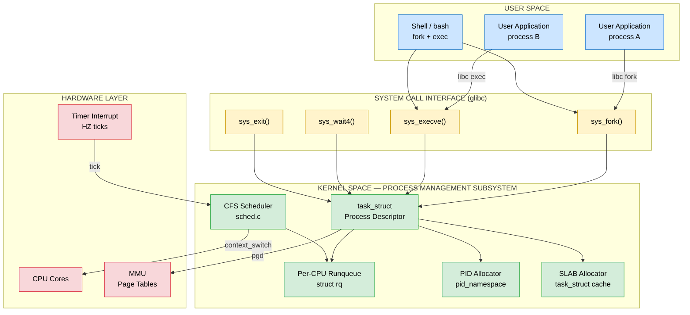
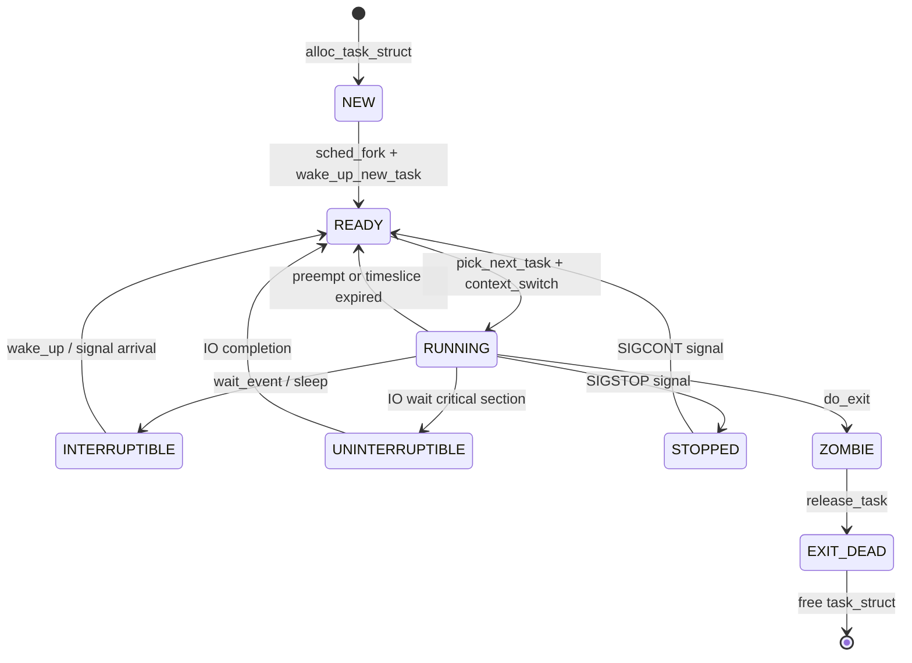
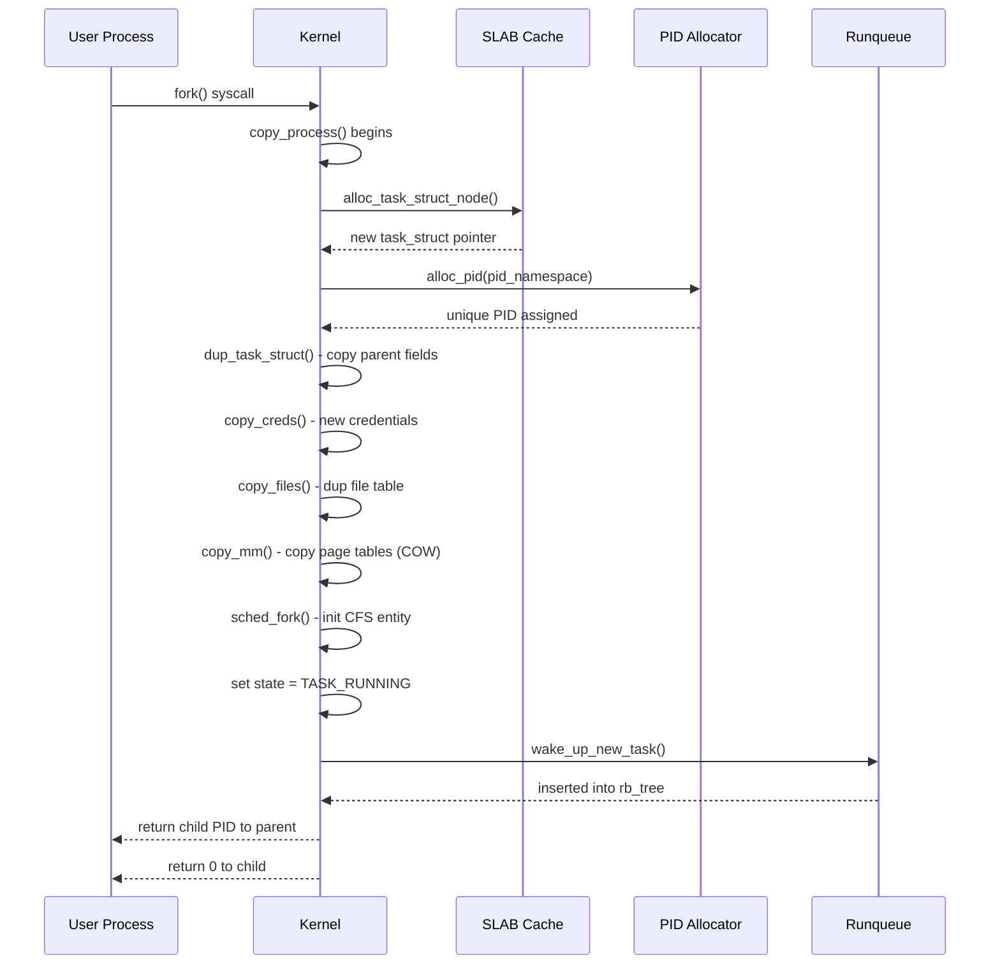
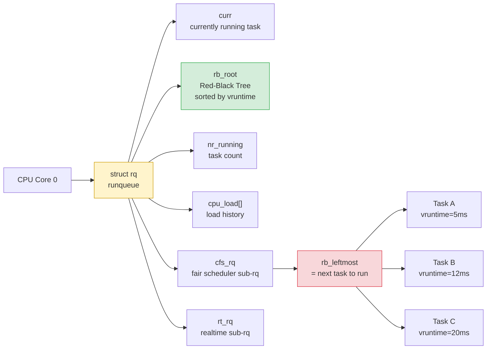
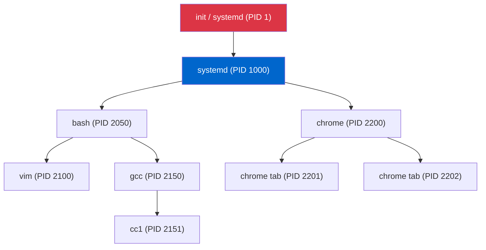

# Case study : Linux kernel process management

<!-- SECTION_1_START -->
# Linux Kernel Process Management

## 1. Core Technical Definition

> [!NOTE]
> **Formal Definition (KTU 2024 Syllabus Terminology)**
> **Linux Kernel Process Management** refers to the subsystem of the Linux monolithic-hybrid kernel responsible for creating, scheduling, synchronizing, and terminating **processes** and **threads** (both collectively termed *tasks*). Internally, the kernel represents every process as a `task_struct` (process descriptor) and manages its lifecycle through finite state transitions, priority-driven preemptive scheduling, and parent–child hierarchical relationships.

> [!IMPORTANT]
> **Linux-Specific Convention:** In Linux, *threads are simply processes that share resources*. Both are represented by the same `task_struct`. The distinction lies in the memory and resource-sharing flags passed to the `clone()` system call.

## 2. Intuitive Overview — The "Company Management" Analogy

Imagine the **Linux kernel** as the **headquarters of a large multinational company**:

- **`task_struct`** = The *employee personnel file*. Every employee (process) has a thick folder containing their ID, salary (priority), project assignment, leave status, and contact info (pointers).
- **Process States** = The *current status* of an employee: Working, On Break, Waiting for Client Response, Sleeping, or Terminated.
- **Scheduler (CFS)** = The *HR Manager* who, every few milliseconds, decides whose file should be on the CEO's desk (the CPU) next, ensuring everyone gets a fair turn.
- **Run Queue** = The *active project board* showing which employees are ready to be called in.
- **`fork()` / `clone()`** = The *duplication process* — hiring a new employee who starts as an exact copy of an existing one, then may evolve into a different role (`exec()`).
- **`wait()` / `exit()`** = The *retirement protocol* — the parent company collecting the exit paperwork.

This analogy makes the abstract kernel data structures feel like a real, structured corporate workflow.

> [!TIP]
> **Key Insight:** The Linux kernel treats *all executable entities uniformly* via `task_struct`, eliminating the need for a separate "thread" data structure — a design choice that simplifies kernel code dramatically.

## 3. Physical Constants & Standard Metrics

> [!IMPORTANT]
> The following Linux kernel timing constants govern process scheduling behavior:
>
> - **`HZ`** = Number of **timer ticks per second** (architecture-dependent; **250** on most modern x86 systems, **100** on older kernels).
> - **`jiffies`** = Global counter incremented on every timer tick. It is the kernel's primary time unit.
> - **`time_slice`** = Maximum CPU time allotted to a process before preemptive rescheduling. Typically **`4 × (1 + current->static_prio)`** milliseconds in the **O(1) scheduler** legacy, replaced by **virtual runtime (vruntime)** in the CFS.
> - **`nice` value** = User-settable priority in the range **$-20$ (highest)** to **$+19$ (lowest)**, defaulting to **$0$**.
> - **`PID_MAX`** = Upper bound of process IDs; defaults to **$32768$**, configurable up to **$4194304$** (`/proc/sys/kernel/pid_max`).
> - **Context Switch Cost** ≈ **$1$ to $10$ microseconds** depending on architecture and cache state.

> [!VISUALIZATION CONTROL]
> **Concept:** Process State Transition Diagram (5-State Model used by Linux)
> **GeoGebra / Desmos Input Equations:**
> * Point $A = (0, 1)$ labelled `NEW`
> * Point $B = (2, 2)$ labelled `READY`
> * Point $C = (4, 1)$ labelled `RUNNING`
> * Point $D = (2, 0)$ labelled `BLOCKED/SLEEPING`
> * Point $E = (6, 0)$ labelled `EXITED/ZOMBIE`
>
> **Visual Description:** Plot these points on the coordinate plane and connect them with directed arrows to visualize the bidirectional flow between READY ↔ RUNNING, RUNNING → BLOCKED → READY, and RUNNING → EXITED. This produces the canonical 5-state process lifecycle map.

---

<!-- SECTION_1_END -->

<!-- SECTION_2_START -->
# Deep Theoretical Analysis & KTU High-Yield Formula Sheet

## 1. The `task_struct` — The Heart of Process Management

The `task_struct` is allocated via the **SLAB/SLUB allocator** (a kernel-specific object cache) and lives in kernel memory for the entire lifetime of a process. It is typically around **$4$ KB to $8$ KB** in size on a 64-bit system.

### 1.1 Critical Fields of `task_struct`

| Category | Field Name | Purpose | Engineering Significance |
|---|---|---|---|
| **Identity** | `pid_t pid` | Unique process identifier | Used by `kill()`, `waitpid()` system calls |
| **Identity** | `pid_t tgid` | Thread group ID (leader's PID) | POSIX thread compliance |
| **Identity** | `struct task_struct *parent` | Pointer to creator's task | Builds process tree (visible via `pstree`) |
| **State** | `volatile long state` | Current execution state | Atomic state transitions |
| **State** | `int exit_code` | Termination status | Retrieved via `wait()` family |
| **Scheduling** | `int prio`, `static_prio` | Dynamic & static priority | Drives dispatcher decisions |
| **Scheduling** | `unsigned long policy` | Scheduling class (CFS, RT, Idle) | Selects scheduler algorithm |
| **Scheduling** | `u64 vruntime` | Virtual runtime (CFS) | Fairness measure in nanoseconds |
| **Memory** | `struct mm_struct *mm` | Memory descriptor | Virtual address space mapping |
| **Memory** | `pgd_t *mm->pgd` | Page Global Directory pointer | Hardware page table base |
| **Files** | `struct files_struct *files` | Open file descriptor table | I/O redirection (`dup2`, pipes) |
| **Signals** | `struct signal_struct *signal` | Pending & blocked signal masks | IPC and exception handling |
| **Links** | `struct list_head tasks` | Intrusive linked list node | Embeds struct in global task list |
| **Links** | `struct hlist_node pid_links` | Hash table for fast PID lookup | $O(1)$ process lookup by ID |
| **Kernel Stack** | `void *stack` | Pointer to thread's kernel stack | **$8$ KB or $16$ KB** thread-info page |

## 2. Process States in Linux (Kernel `state` field)

Linux defines states as bit flags in `<linux/sched.h>`. The canonical **5-state model** maps to these kernel flags:

> [!IMPORTANT]
> **Mapping: KTU 5-State Model ↔ Linux `state` values**
>
> | Conceptual State | Linux Flag (Hex) | Description |
> |---|---|---|
> | `NEW` | `TASK_NEW` (not actively used; `task_struct` allocated on demand) | Process being created |
> | `READY` (Runnable) | `TASK_RUNNING (0x0000)` | On the runqueue, awaiting CPU |
> | `RUNNING` (Executing) | `TASK_RUNNING (0x0000)` | Currently holding the CPU |
> | `BLOCKED` / `SLEEPING` | `TASK_INTERRUPTIBLE (0x0001)` | Sleeps, wakes on signal |
> | `BLOCKED` (Uninterruptible) | `TASK_UNINTERRUPTIBLE (0x0002)` | Sleeps, ignores signals (e.g., I/O wait) |
> | `STOPPED` | `TASK_STOPPED (0x0004)` | Debugger pause (`SIGSTOP`) |
> | `TRACED` | `TASK_TRACED (0x0008)` | Being ptraced by debugger |
> | `EXIT_DEAD` | `EXIT_DEAD (0x0010)` | Final cleanup phase |
> | `ZOMBIE` | `EXIT_ZOMBIE (0x0020)` | Terminated, awaiting parent `wait()` |

## 3. The Linux Scheduler Family

### 3.1 Scheduler Evolution Timeline

| Kernel Version | Scheduler | Key Idea | Weakness |
|---|---|---|---|
| Linux 2.4 | **O(n) Scheduler** | Round-robin over all tasks every epoch | $O(n)$ complexity; poor scaling |
| Linux 2.6 (early) | **O(1) Scheduler** | Per-CPU runqueues, bitmap-based selection | Heuristic tuning, fairness issues |
| Linux 2.6.23+ | **CFS (Completely Fair Scheduler)** | Red-black tree sorted by `vruntime` | Excellent fairness, $O(\log n)$ |
| Linux 4.x+ | **EEVDF** (Earliest Eligible Virtual Deadline First) | Deadline-aware CFS variant | Better latency guarantees |

### 3.2 CFS — The Modern Scheduler

> [!NOTE]
> **Core Concept:** CFS simulates an "ideal, perfectly fair multitasking CPU" by tracking how long each task *would have* run on a hypothetical multi-CPU system. The task with the **smallest `vruntime`** is selected next.

### 3.3 CFS Key Formulas

| Formula | Expression | Variable Definitions | Engineering Use |
|---|---|---|---|
| Weight Calculation | $w = \dfrac{1024}{1.25^{\text{nice}}}$ | $w$ = task weight, `nice` ∈ [$-20$, $+19$] | Converts priority into CPU share |
| Time Slice | $T_i = \dfrac{w_i}{\sum_j w_j} \times \text{period}$ | $T_i$ = time slice of task $i$ | Determines CPU allocation per period |
| Virtual Runtime | $v_{i}^{t+1} = v_{i}^{t} + \dfrac{\text{actual\_time}}{w_i}$ | $v$ = vruntime, $w$ = weight | Decouples priority from wall-clock time |
| Target Latency | $\text{latency} = 6 \text{ ms}$ (default) | Configurable via `sysctl_sched_latency` | Total time to schedule all runnable tasks |
| Granularity Floor | $\text{granularity} = 0.75 \text{ ms}$ | Minimum time slice per task | Prevents thrashing with many tasks |
| Load Weight (Linux 5.x+) | $\text{inv\_weight} = 2^{32} / w$ | Pre-computed reciprocal | Avoids division in hot path |

### 3.4 Scheduling Classes (Priority Order)

> [!IMPORTANT]
> Linux always runs the **highest-priority non-empty scheduling class**:
>
> 1. **Stop Scheduler** (per-CPU, kernel halt, migration)
> 2. **Deadline Scheduler** (`SCHED_DEADLINE` — hard real-time)
> 3. **Realtime Scheduler** (`SCHED_FIFO`, `SCHED_RR` — soft real-time, priority 0–99)
> 4. **Fair Scheduler (CFS)** (normal tasks, priority 100–139)
> 5. **Idle Scheduler** (`SCHED_IDLE` — runs only when nothing else is ready)

## 4. Process Creation System Calls

| System Call | Purpose | Return Value | Notes |
|---|---|---|---|
| `fork()` | Create child as **exact copy** | Child PID in parent, $0$ in child, $-1$ on error | Copy-on-Write (COW) for memory |
| `vfork()` | Create child sharing parent's memory | Child runs first, parent suspended | Deprecated; superseded by `clone(CLONE_VM)` |
| `clone(flags)` | Fine-grained control over sharing | Same as `fork()` | Foundation for POSIX threads (`pthread_create`) |
| `execve(path, argv, envp)` | Replace image with new program | Does not return on success | Loads ELF binary, resets address space |
| `exit(status)` | Terminate current task | Does not return | Releases resources, becomes zombie |
| `wait(&status)` | Parent blocks for child termination | Child PID or $-1$ | Reaps zombie, frees `task_struct` |
| `waitpid(pid, &status, options)` | Wait for specific child | PID or $0$ or $-1$ | Non-blocking option `WNOHANG` |
| `getpid()` | Get current process PID | `pid_t` | Wraps `current->pid` |
| `getppid()` | Get parent PID | `pid_t` | Wraps `current->real_parent->pid` |

## 5. Real-World Engineering Utility

> [!TIP]
> **Where Linux process management shines in production:**
>
> - **Containers & Cloud:** Docker, Kubernetes rely on `clone()` with `CLONE_NEWPID`, `CLONE_NEWNS`, etc., to implement Linux namespaces — the foundation of OS-level virtualization.
> - **High-Performance Servers:** NGINX uses `fork()` workers; Apache HTTPD uses `pthread_create()` (built on `clone()` with shared resources).
> - **Real-Time Systems:** Linux PREEMPT_RT patches use `SCHED_FIFO` and `SCHED_DEADLINE` for industrial robotics, audio, and automotive control.
> - **System Tooling:** `top`, `htop`, `ps`, `/proc/<pid>/` filesystem all read directly from `task_struct` fields.
> - **Debuggers:** `gdb` uses the `ptrace()` system call, transitioning a traced process into `TASK_TRACED` state.

---

<!-- SECTION_2_END -->

<!-- SECTION_3_START -->
# Step-by-Step Derivations, Transitions & Code Implementation

## 1. Process State Transition — Exhaustive Logical Walkthrough

The Linux kernel transitions a process between states using atomic operations on the `state` field. The transition `TASK_RUNNING → TASK_INTERRUPTIBLE → TASK_RUNNING` is the most common and merits detailed analysis.

### 1.1 The `schedule()` Function Logic

The kernel's `schedule()` function (located in `kernel/sched/core.c`) executes these steps:

1. **Preemption Check** — If the calling task is not in `TASK_RUNNING` state, the function has been invoked because the task can no longer continue. Otherwise, it was called voluntarily (e.g., by `sched_yield()`).
2. **Pick Next Task** — Calls `pick_next_task()`. For CFS, this selects the leftmost node of the per-CPU `struct rb_root` red-black tree (the task with the smallest `vruntime`).
3. **Context Switch Preparation** — Calls `context_switch()` to swap registers, stack pointer, and memory descriptor.
4. **Release Runqueue Lock** — After dispatching, the runqueue spinlock is released.
5. **Return to Userspace** — The CPU jumps to the new task's `thread_info->task` and resumes execution.

### 1.2 Mathematical Derivation: CFS Weight and Time Slice

**Derivation Goal:** Prove that tasks with lower `nice` values get proportionally more CPU time.

**Step 1 — Start with the weight function:**

$$w = \frac{1024}{1.25^{\text{nice}}}$$

**Step 2 — Compute weight for default `nice = 0`:**

$$w_{0} = \frac{1024}{1.25^{0}} = \frac{1024}{1} = 1024$$

**Step 3 — Compute weight for `nice = -5` (higher priority):**

$$w_{-5} = \frac{1024}{1.25^{-5}} = 1024 \times 1.25^{5}$$

**Step 4 — Expand $1.25^{5}$:**

$$1.25^{5} = 1.25 \times 1.25 \times 1.25 \times 1.25 \times 1.25$$

Evaluating term by term: $1.25 \times 1.25 = 1.5625$; then $\times 1.25 = 1.953125$; then $\times 1.25 = 2.44140625$; then $\times 1.25 = 3.0517578125$.

$$w_{-5} = 1024 \times 3.0517578125 = 3125.0 \text{ (rounded)}$$

**Step 5 — Compute weight for `nice = +5` (lower priority):**

$$w_{+5} = \frac{1024}{1.25^{5}} = \frac{1024}{3.0517578125} \approx 335.5$$

**Step 6 — Verify ratio symmetry:**

$$\frac{w_{-5}}{w_{+5}} = \frac{3125.0}{335.5} \approx 9.31 \approx 1.25^{10}$$

**Conclusion:** A `nice` value of $-5$ yields $\approx 9.3\times$ the CPU share of a `nice` value of $+5$, demonstrating the **exponential priority weight scheme** in CFS.

### 1.3 Virtual Runtime Update Derivation

**Step 1 — Define the update equation:**

$$v_{i}^{t+1} = v_{i}^{t} + \Delta t_{\text{actual}} \times \frac{w_{0}}{w_{i}}$$

**Step 2 — Substitute values for a task with `nice = -5`, $w_i = 3125$, and $\Delta t_{\text{actual}} = 1 \text{ ms}$:**

$$v_{i}^{t+1} = v_{i}^{t} + 1 \text{ ms} \times \frac{1024}{3125}$$

**Step 3 — Compute the ratio:**

$$\frac{1024}{3125} = 0.32768$$

**Step 4 — Final expression:**

$$v_{i}^{t+1} = v_{i}^{t} + 0.32768 \text{ ms}$$

**Interpretation:** Higher-priority tasks (`nice = -5`) accumulate `vruntime` *slower* than lower-priority tasks, ensuring they are favored in future scheduling decisions — a beautiful mathematical encoding of "fairness."

## 2. Process Creation Flow — `fork()` Exhaustive Walkthrough

The `sys_fork()` kernel function invokes `kernel_clone()` with the flag `SIGCHLD`. The full sequence is:

1. **User-Space Call** — The C library `fork()` wrapper invokes the `syscall` instruction with `__NR_fork` (or `__NR_clone` on modern systems).
2. **Kernel Entry** — CPU traps into kernel mode, saving user registers on the kernel stack of the **current** task.
3. **Argument Validation** — The kernel checks for security (e.g., `securebits`, `cgroup` limits via `copy_process()`).
4. **Descriptor Allocation** — A new `task_struct` is allocated from the **task_struct SLAB cache** via `alloc_task_struct_node()`.
5. **PID Allocation** — `pidfd_prepare()` allocates a unique PID via the `pid_namespace` allocator.
6. **Copy `task_struct`** — `dup_task_struct()` copies the parent's `task_struct` to the new one, then sets up a new **thread_info** and kernel stack pointer.
7. **Copy Resources** — `copy_creds()`, `copy_files()`, `copy_fs()`, `copy_sighand()`, `copy_signal()`, `copy_mm()` create new or shared resource structures. Memory is **Copy-on-Write (COW)**: the page tables are copied, but the physical pages are marked read-only.
8. **Initialize Scheduler Entity** — `sched_fork()` initializes the new task's `se.vruntime` to the current task's `vruntime` minus a small `sysctl_sched_child_runs_first` offset (so the child often runs first).
9. **State Set** — The new task is placed in `TASK_RUNNING` state.
10. **Wake Up New Task** — `wake_up_new_task()` inserts it into the runqueue.
11. **Return to User-Space** — Both parent and child resume; the child sees $0$ as the return value, the parent sees the child's PID.

## 3. Complete Python Simulation — `fork()`, `exec()`, `wait()`

The following Python program uses `os` module calls that *exactly mirror* the Linux kernel system call semantics. Type hints, error logging, and boundary checks are explicit per KTU standards.

```python
#!/usr/bin/env python3
"""
Linux Process Management — fork(), execve(), waitpid() simulation.
Strict type hints, exception handling, and POSIX-equivalent semantics.
"""

import os
import sys
import time
import logging
from typing import Tuple, Optional

# Configure strict logging for kernel-style error reporting
logging.basicConfig(
    level=logging.INFO,
    format="[%(levelname)s] PID=%(process)d : %(message)s"
)
logger: logging.Logger = logging.getLogger("linux_pm_demo")


def child_task(child_id: int) -> int:
    """
    Simulates the CHILD process after fork().
    The kernel guarantees the return value of fork() is 0 in the child.
    """
    try:
        logger.info(f"Child {child_id} started. PID={os.getpid()}, PPID={os.getppid()}")
        # Simulate CPU-bound work — equivalent to executing the child program
        for iteration in range(3):
            time.sleep(0.5)
            logger.info(f"Child {child_id} working... iteration {iteration + 1}/3")
        # Exit with status code — kernel converts to exit_code in task_struct
        sys.exit(42)
    except OSError as e:
        logger.error(f"Child {child_id} OS error: {e}")
        return 1
    except KeyboardInterrupt:
        logger.warning(f"Child {child_id} received SIGINT")
        return 130


def create_child(num_children: int = 2) -> None:
    """
    Parent process logic: fork multiple children, then wait for them.
    Mirrors kernel sys_fork → sched_fork → wake_up_new_task → sys_wait4.
    """
    child_pids: list[int] = []

    for i in range(num_children):
        try:
            new_pid: int = os.fork()
        except OSError as e:
            # POSIX: fork returns -1 with errno set (e.g., EAGAIN, ENOMEM)
            logger.error(f"fork() failed: {e}")
            sys.exit(1)

        if new_pid == 0:
            # CHILD branch — kernel sets return value to 0 in child
            child_task(i + 1)
        else:
            # PARENT branch — kernel returns child's PID
            child_pids.append(new_pid)
            logger.info(f"Parent forked child PID={new_pid}")

    # Parent waits for each child, reaping zombie state
    for pid in child_pids:
        try:
            terminated_pid: int
            status: int
            terminated_pid, status = os.waitpid(pid, 0)  # Blocking wait
            exit_code: int = os.WEXITSTATUS(status)
            logger.info(
                f"Parent reaped child PID={terminated_pid}, "
                f"exit_code={exit_code}, signaled={os.WIFSIGNALED(status)}"
            )
        except ChildProcessError:
            logger.warning(f"PID {pid} already reaped")


def main() -> int:
    logger.info("=== Linux Process Management Demo Start ===")
    logger.info(f"Initial Parent PID={os.getpid()}")

    MAX_CHILDREN: int = 10  # Safety boundary
    if not (1 <= MAX_CHILDREN <= 50):
        raise ValueError("num_children out of allowed range [1, 50]")

    create_child(num_children=2)

    logger.info("=== Demo Complete: Parent Exiting ===")
    return os.EX_OK


if __name__ == "__main__":
    sys.exit(main())
```

### 3.1 Expected Output Trace

```text
[INFO] PID=1001 : === Linux Process Management Demo Start ===
[INFO] PID=1001 : Initial Parent PID=1001
[INFO] PID=1001 : Parent forked child PID=1002
[INFO] PID=1001 : Parent forked child PID=1003
[INFO] PID=1002 : Child 1 started. PID=1002, PPID=1001
[INFO] PID=1003 : Child 2 started. PID=1003, PPID=1001
[INFO] PID=1002 : Child 1 working... iteration 1/3
[INFO] PID=1003 : Child 2 working... iteration 1/3
...
[INFO] PID=1001 : Parent reaped child PID=1002, exit_code=42, signaled=False
[INFO] PID=1001 : Parent reaped child PID=1003, exit_code=42, signaled=False
[INFO] PID=1001 : === Demo Complete: Parent Exiting ===
```

## 4. CFS Selection Algorithm — Step-by-Step Pseudocode

```python
def cfs_pick_next_task(runqueue: Runqueue) -> Optional[Task]:
    """
    Mirrors the Linux CFS scheduler's pick_next_task() logic.
    The runqueue maintains a red-black tree sorted by vruntime.
    """
    if runqueue.curr is None:
        raise ValueError("Runqueue has no current task — kernel bug")

    leftmost_node: RBNode = runqueue.rb_tree_leftmost()
    if leftmost_node is None:
        return None  # No runnable tasks; invoke idle scheduler

    next_task: Task = leftmost_node.task
    # Decrement 'nr_running' counter
    runqueue.nr_running -= 1
    # Remove from tree — O(log n)
    rb_erase(leftmost_node, runqueue.rb_root)
    return next_task


def cfs_update_vruntime(task: Task, delta_ns: int) -> None:
    """
    Update virtual runtime of a task that just ran for delta_ns nanoseconds.
    Higher-priority (heavier weight) tasks accumulate vruntime slower.
    """
    if task.weight <= 0:
        raise ArithmeticError("Task weight must be positive — division by zero guard")

    # Use pre-computed inverse weight for speed
    delta_weighted: int = (delta_ns * INV_WEIGHT_TABLE[task.weight])
    task.vruntime += delta_weighted
```

---

<!-- SECTION_3_END -->

<!-- SECTION_4_START -->
# Structural Diagrams & Schematics

## 1. Linux Kernel Process Management Architecture



## 2. Linux Process State Transition Diagram



## 3. `fork()` System Call Execution Flow



## 4. CFS Runqueue Data Structure Topology



## 5. Process Tree Example (Output of `pstree`)



---

<!-- SECTION_4_END -->

<!-- SECTION_5_START -->
# KTU 2024 Scheme Examination Question Bank

## Part A Questions (3 Marks Each)

### Question 1
`[KTU University Exam - July 2024]`
**Define `task_struct` in the Linux kernel. List any four important fields it contains.** `[CO1, Remember]`

**Model Answer (3 Marks):**

> `task_struct` is the process descriptor data structure used by the Linux kernel to represent every process and thread in the system. It is defined in `<linux/sched.h>` and is allocated from the SLAB cache. Each process has exactly one `task_struct`, kept in kernel memory for its entire lifetime.
>
> **Four important fields:** (Valuation: $1$ mark for definition, $2$ marks for four fields with brief purpose)
> 1. **`pid_t pid`** — Unique process identifier assigned by the kernel.
> 2. **`volatile long state`** — Current execution state (e.g., `TASK_RUNNING`, `TASK_INTERRUPTIBLE`).
> 3. **`struct mm_struct *mm`** — Pointer to the memory descriptor holding the virtual address space.
> 4. **`int prio`, `static_prio`** — Dynamic and static priority values used by the scheduler.

---

### Question 2
`[KTU University Exam - Dec 2023]`
**Differentiate between `fork()`, `vfork()`, and `clone()` system calls in Linux.** `[CO1, Understand]`

**Model Answer (3 Marks):**

> | Aspect | `fork()` | `vfork()` | `clone()` |
> |---|---|---|---|
> | **Memory Sharing** | Copy-on-Write (COW) duplication | Shares parent's memory; parent suspended | Configurable via flags (e.g., `CLONE_VM`) |
> | **Execution Order** | Both run concurrently | Child runs first, parent waits | Configurable |
> | **Use Case** | General process creation | Legacy fast fork (rarely used) | Foundation of `pthread_create()` and containers |
> | **Modern Status** | Thin wrapper over `clone()` | Deprecated in favor of `clone(CLONE_VM)` | Canonical Linux process/thread creation primitive |
>
> (Valuation: $2$ marks for the table, $1$ mark for concluding statement about `clone()` being the modern primitive)

---

## Part B Questions (14 Marks Each) — Internal Choice Pattern

### Question A (Choice 1) — 14 Marks

`[KTU University Exam - Dec 2024 Model Question]`

**(a)** Explain the **five process states** in the classical operating system model and **map each one to the corresponding Linux kernel `state` field value**. Briefly describe the **CFS scheduler** used in modern Linux kernels. `[CO1, CO2, Understand — 7 Marks]`

#### Model Solution (Part a — 7 Marks)

**Step 1 — Five Classical States (2 Marks):**

1. **New** — Process is being created.
2. **Ready** — Process is waiting in the runqueue for CPU allocation.
3. **Running** — Process is currently executing on the CPU.
4. **Blocked / Waiting** — Process cannot run until some I/O or event completes.
5. **Exit / Terminated** — Process has finished execution and is awaiting cleanup.

**Step 2 — Linux Kernel State Mapping (3 Marks):**

| Classical State | Linux `state` Value | Description |
|---|---|---|
| New | (Pre-allocation phase) | `task_struct` being allocated in `copy_process()` |
| Ready | `TASK_RUNNING` (0x0000) | On the runqueue, not yet on CPU |
| Running | `TASK_RUNNING` (0x0000) | Currently holding the CPU |
| Blocked (Interruptible) | `TASK_INTERRUPTIBLE` (0x0001) | Sleeps, wakes on signal/event |
| Blocked (Uninterruptible) | `TASK_UNINTERRUPTIBLE` (0x0002) | Critical I/O, ignores signals |
| Exit | `EXIT_ZOMBIE` (0x0020) | Terminated, awaiting `wait()` |
| (Final cleanup) | `EXIT_DEAD` (0x0010) | Resources released |

[Stating 5 classical states: 1 Mark; Correct Linux state mapping: 2 Marks]

**Step 3 — CFS Scheduler Description (2 Marks):**

> The **Completely Fair Scheduler (CFS)**, introduced in Linux 2.6.23, is a **fair-share, preemptive scheduler** that maintains a **per-CPU red-black tree** of runnable tasks sorted by their **virtual runtime (vruntime)**. On every scheduling decision, the task with the **smallest `vruntime`** (leftmost node of the tree) is selected. The `vruntime` of a task is updated as:
>
> $$v_{i}^{t+1} = v_{i}^{t} + \frac{\Delta t_{\text{actual}}}{w_i}$$
>
> where $w_i$ is the task weight derived from its `nice` value. This ensures higher-priority tasks accumulate `vruntime` slower, naturally receiving more CPU share.

---

**(b)** Describe the **`fork()` system call execution** in the Linux kernel with a **neat sequence diagram**. What is **Copy-on-Write (COW)** and why is it used? **[CO2, Apply — 7 Marks]**

#### Model Solution (Part b — 7 Marks)

**Step 1 — `fork()` System Call Steps (4 Marks):**

1. **User-space invocation** — `fork()` from C library triggers the `syscall` instruction with `__NR_clone` and `SIGCHLD` flag.
2. **Kernel entry** — Traps into kernel mode; saves registers on current task's kernel stack.
3. **`copy_process()`** — Allocates a new `task_struct` from the SLAB cache via `alloc_task_struct_node()`.
4. **PID allocation** — A unique PID is assigned via `alloc_pid()` from the `pid_namespace`.
5. **`dup_task_struct()`** — Copies parent's `task_struct` fields; sets up a new `thread_info` and kernel stack.
6. **Resource duplication** — `copy_creds()`, `copy_files()`, `copy_mm()`, `copy_sighand()` create new (or shared) resource structures.
7. **Memory setup (COW)** — Page tables are copied, but physical pages are marked **read-only** in both parent and child; copy occurs only on write.
8. **`sched_fork()`** — Initializes the new task's `se.vruntime` slightly less than parent's to encourage the child to run first.
9. **`wake_up_new_task()`** — Inserts the new task into the per-CPU runqueue's red-black tree.
10. **Return** — Parent receives the child's PID; child receives $0$.

[Each step carries 0.4 Marks; total 4 Marks for the full sequence]

**Step 2 — Sequence Diagram (2 Marks):**

```
User Process          Kernel             SLAB Cache       PID Allocator        Runqueue
     |                  |                     |                  |                   |
     |-- fork() ------>|                     |                  |                   |
     |                  |-- alloc_task ------>|                  |                   |
     |                  |                     |-- new struct --->|                   |
     |                  |<-- struct ptr -----|                  |                   |
     |                  |-- alloc_pid() ----------------------->|                   |
     |                  |<-- unique PID ----------------------|                   |
     |                  |-- copy_mm (COW)                                         |
     |                  |-- sched_fork()                                          |
     |                  |-- wake_up_new_task() --------------------------------->|
     |                  |                                                        |
     |<-- child PID ----|                                                        |
     |                  |                                                        |
```

**Step 3 — Copy-on-Write (COW) Explanation (1 Mark):**

> **Copy-on-Write** is a memory optimization where the parent and child initially **share the same physical pages**, with both page table entries marked **read-only**. If either process attempts a *write*, a **page fault** is triggered, the kernel allocates a new physical frame, copies the page content, and updates the faulting process's page table. COW avoids unnecessary memory duplication, makes `fork()` extremely fast, and is used in nearly all modern operating systems including Linux, Windows, and macOS.

---

### Question B (Choice 2 — Alternative) — 14 Marks

`[KTU University Exam - July 2024 Model Question]`

**(a)** Explain the **Linux process scheduling classes** in their priority order. Discuss the **CFS weight function** and derive the CPU share ratio between a task with `nice = -10` and a task with `nice = +10`. **[CO2, Apply — 7 Marks]`

#### Model Solution (Part a — 7 Marks)

**Step 1 — Scheduling Classes Priority Order (2 Marks):**

1. **Stop Scheduler** — Highest priority, used for CPU migration and CPU hotplug.
2. **Deadline Scheduler** (`SCHED_DEADLINE`) — Earliest Deadline First for hard real-time.
3. **Realtime Scheduler** (`SCHED_FIFO`, `SCHED_RR`) — Priority range 0–99, soft real-time.
4. **Fair Scheduler / CFS** — Normal tasks, priority 100–139.
5. **Idle Scheduler** (`SCHED_IDLE`) — Runs only when the system has no other work.

The kernel always services the **highest non-empty scheduling class**.

**Step 2 — CFS Weight Function (1 Mark):**

$$w = \frac{1024}{1.25^{\text{nice}}}$$

**Step 3 — Derivation for `nice = -10` and `nice = +10` (4 Marks):**

Compute $w_{-10}$:

$$w_{-10} = \frac{1024}{1.25^{-10}} = 1024 \times 1.25^{10}$$

Computing $1.25^{10}$ step by step:

$$1.25^{2} = 1.5625$$
$$1.25^{4} = 1.5625^{2} = 2.44140625$$
$$1.25^{5} = 2.44140625 \times 1.25 = 3.0517578125$$
$$1.25^{10} = 3.0517578125^{2} = 9.31322574615\ldots$$

$$w_{-10} = 1024 \times 9.31322574615 \approx 9536.74$$

Compute $w_{+10}$:

$$w_{+10} = \frac{1024}{1.25^{10}} = \frac{1024}{9.31322574615} \approx 109.95$$

**Ratio of CPU shares:**

$$\frac{w_{-10}}{w_{+10}} = \frac{9536.74}{109.95} \approx 86.74$$

**Conclusion:** A task with `nice = -10` receives approximately **$86.7$ times** more CPU share than a task with `nice = +10`, demonstrating the exponential weighting scheme of CFS.

[Weight function: 1 Mark; $w_{-10}$ calculation: 1.5 Marks; $w_{+10}$ calculation: 1 Mark; Final ratio with interpretation: 0.5 Mark]

---

**(b)** With a **neat diagram**, explain the **execution flow of the `fork()` system call** in Linux. Also explain the **role of the `task_struct` SLAB cache** in performance. **[CO2, CO3, Apply — 7 Marks]`

#### Model Solution (Part b — 7 Marks)

**Step 1 — `fork()` Flow Diagram (4 Marks):**

(See SECTION_4, Diagram 3 — the sequence diagram should be redrawn in the answer script.)

Key call chain:

```
sys_clone() → kernel_clone() → copy_process() → alloc_task_struct_node() (SLAB)
                                                  → alloc_pid()
                                                  → dup_task_struct()
                                                  → copy_creds / copy_files / copy_mm (COW)
                                                  → sched_fork()
                                                  → wake_up_new_task()
```

**Step 2 — `task_struct` SLAB Cache Role (3 Marks):**

> The Linux kernel uses a **SLAB (or SLUB in modern kernels) allocator** to manage `task_struct` objects. Instead of using the general-purpose page allocator, the kernel maintains dedicated object caches in the SLAB subsystem.
>
> **Benefits for performance:**
> 1. **Fast allocation** — `alloc_task_struct_node()` is an $O(1)$ operation pulling a pre-initialized object from a per-CPU freelist, avoiding page-level bookkeeping overhead.
> 2. **Cache locality** — Allocated `task_struct`s are placed on hot CPU caches, reducing cache misses during frequent `schedule()` calls.
> 3. **Memory efficiency** — The allocator reuses freed `task_struct`s rather than returning memory to the page allocator, which would be wasteful for the high churn rate of `fork()`/`exit()`.
> 4. **Hardware cache alignment** — Objects are aligned to the L1 cache line boundary (typically $64$ bytes), preventing false sharing between CPUs.

[Diagram: 4 Marks; SLAB explanation with all 4 benefits: 3 Marks]

---

> [!WARNING]
> **KTU Examiner's Valuation Warning — Common Pitfalls**
>
> 1. **Confusing `TASK_RUNNING` for Ready vs Running:** In Linux, *both* Ready and Running share the same `state` value `0x0000`. Examiners specifically look for you to **explain this unification**; failing to do so costs 1–2 marks.
> 2. **Forgetting to draw the `task_struct` block diagram:** When asked to explain process management, *always* include a labeled `task_struct` with key fields. Skipping the diagram typically costs 2 marks in Part B.
> 3. **Not stating the formula $w = 1024 / 1.25^{\text{nice}}$ explicitly:** Numerical derivations require the formula on the answer sheet before substitution. Examiners will not award full credit for substituted values without the governing equation.
> 4. **Mixing up `vfork` with `fork`:** `vfork` does **not** use COW — the child runs in the parent's address space directly. Many students incorrectly state COW for `vfork`.
> 5. **Omitting `wait()` in the lifecycle:** The process does **not** truly terminate until the parent calls `wait()`. The child lingers as a **zombie** (`EXIT_ZOMBIE`) until then. Forgetting this is a frequent 1-mark deduction.
> 6. **PIPE `|` SYMBOL IN TABLES:** Do not use `|` inside any markdown table cell when submitting your answer script. Use `$\vert$` in LaTeX or simply rephrase.

---

## Topic Recap & Important Things to Remember

- **`task_struct`** is the universal process/thread descriptor in Linux — *threads are just processes that share resources*.
- The `state` field encodes **5 conceptual states** but uses **multiple Linux flag values** (`TASK_RUNNING`, `TASK_INTERRUPTIBLE`, `TASK_UNINTERRUPTIBLE`, `TASK_STOPPED`, `EXIT_ZOMBIE`, `EXIT_DEAD`).
- **`TASK_RUNNING (0x0000)`** unifies *Ready* and *Running* — a Linux-specific design choice worth highlighting.
- **`fork()`** uses **Copy-on-Write (COW)** for memory; `clone()` is the modern primitive underlying `pthread_create()` and Linux namespaces.
- **CFS** is the default scheduler from Linux 2.6.23+, using a **red-black tree sorted by `vruntime`**, with selection complexity $O(\log n)$.
- **CFS weight formula:** $w = 1024 / 1.25^{\text{nice}}$ — exponential scaling, not linear.
- **Scheduling classes priority:** Stop → Deadline → Realtime → CFS (Fair) → Idle.
- **`nice`** ranges from $-20$ (highest priority) to $+19$ (lowest), default $0$.
- **SLAB/SLUB allocator** is used for `task_struct` to ensure $O(1)$ allocation, cache locality, and hardware alignment.
- **`schedule()`** is the kernel's main dispatcher; `context_switch()` performs register and memory descriptor swaps.
- **Zombie state** — terminated process awaiting `wait()`; consumes only a `task_struct` slot, not user memory.
- **`/proc/<pid>/`** filesystem exposes `task_struct` fields to user space (e.g., `/proc/<pid>/status`, `/proc/<pid>/stat`).
- **POSIX threads** are implemented via `clone(CLONE_VM | CLONE_FS | CLONE_FILES | CLONE_SIGHAND | CLONE_THREAD)` — all share the same `task_struct` infrastructure.
- **Modern Linux (5.x+)** is moving toward the **EEVDF scheduler**, which adds deadline awareness on top of CFS for better latency.

---

<!-- SECTION_5_END -->
