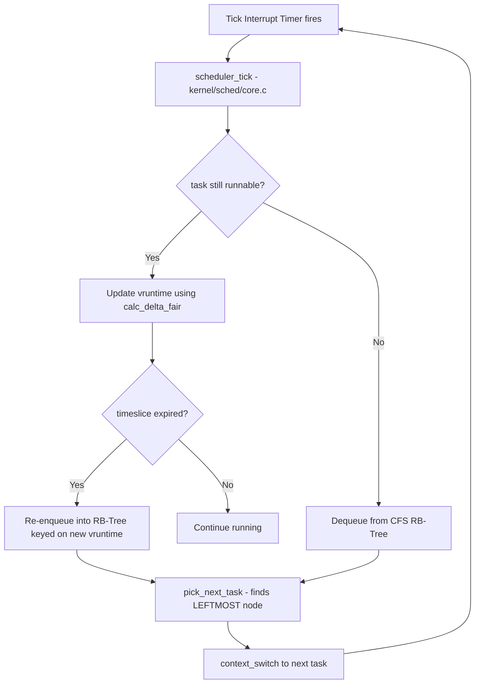
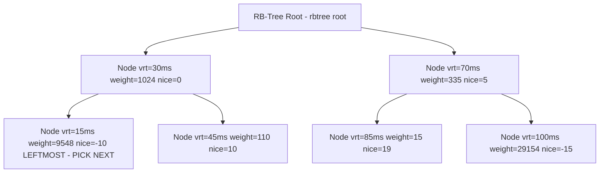
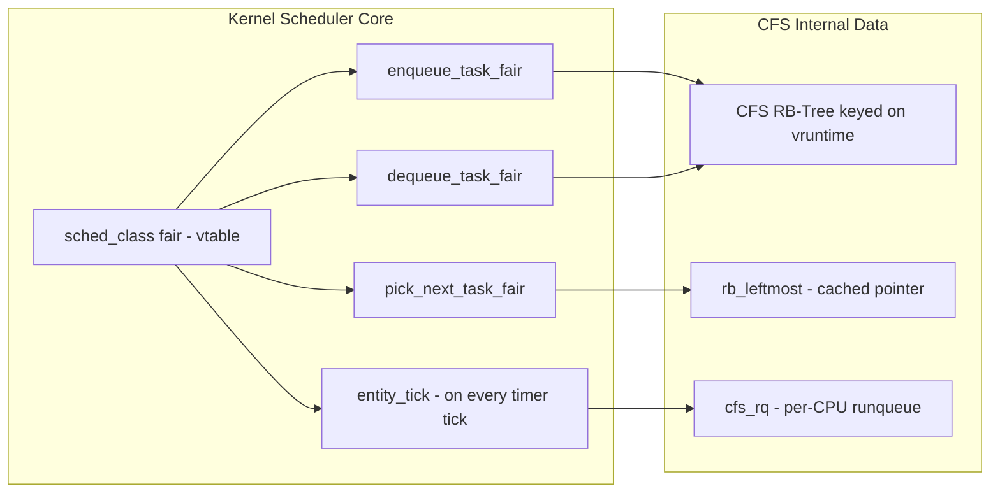
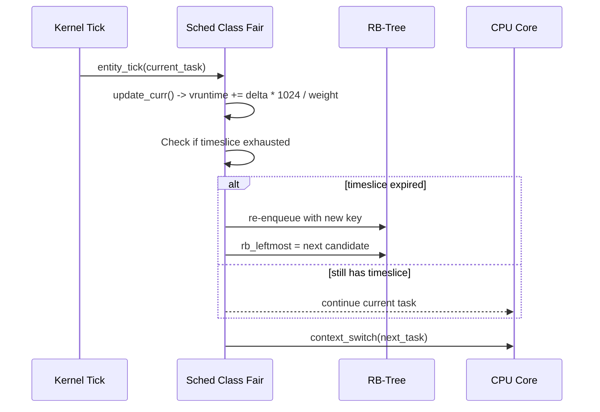

# Case study:  The Linux Completely Fair Scheduler (CFS)

<!-- SECTION_1_START -->
# The Linux Completely Fair Scheduler (CFS)

## 1. Core Technical Definition

> [!IMPORTANT]
> **Formal Definition (KTU 2024 / Linux Kernel Documentation):**
> The **Completely Fair Scheduler (CFS)** is the default process scheduler introduced in the Linux kernel (replacing the earlier $O(1)$ scheduler in version **2.6.23**, by Ingo Molnar in 2007). It is a **fair-share, preemptive, red-black tree based scheduling algorithm** that attempts to allocate the CPU in proportion to each runnable task's **weight**, simulating an *ideal, precise, multitasking CPU* in which each task receives $1/n$ of the processor's time, where $n$ is the number of runnable tasks.

### 1.1 Conceptual Analogy — "The Multi-Lane Toll Booth"

Imagine **$n$ cars** waiting at a **single toll booth** that must all cross a bridge:

* An **unfair scheduler** (like old round-robin) would simply say *"first car, then second, then third..."* — ignoring that some cars are **ambulances** (urgent) while others are **leisurely tourists**.
* The **CFS analogy** is a *magical toll booth* that **weighs** each car at the entrance (the **weight** of the task, derived from its `nice` value). Ambulances are heavier and so they glide through faster. The booth keeps a **scoreboard** of how much "wait-time credit" each car has accumulated, and the **car with the lowest credit (vruntime)** is always served next.

> [!NOTE]
> **Key Insight:** CFS does *not* maintain a fixed run-queue of *N* slots. It maintains a **time-ordered red-black tree** keyed on the *virtual runtime* of every task. The **leftmost node** is always the next task to run.

### 1.2 The Three Pillars of CFS

| Pillar | Meaning | Engineering Significance |
| :--- | :--- | :--- |
| **Fairness** | CPU time $\propto$ task weight | No task is starved |
| **Preemption** | A higher-weighted task can preempt | Bounded latency |
| **Determinism** | $O(\log N)$ picking of next task | Scales to thousands of threads |

> [!VISUALIZATION CONTROL]
> **Concept:** The CFS Red-Black Tree keyed on `vruntime`
> **GeoGebra / Desmos Input Equations:**
> * Points: $P_1 = (15, 88761)$, $P_2 = (40, 1024)$, $P_3 = (75, 110)$, $P_4 = (100, 15)$
> * Sorted by x-axis (`vruntime`): The leftmost point $P_1$ is the next to be scheduled.
> **Visual Description:** Plot `vruntime` on the x-axis and `weight` on the y-axis. The scheduler always picks the leftmost node (smallest `vruntime`) — simulating the car that has received the *least* CPU time.

---

<!-- SECTION_2_START -->
# 2. Deep Theoretical Analysis & KTU Formula Sheet

## 2.1 Why CFS? — The Failure of the O(1) Scheduler

The pre-CFS Linux kernel used a heuristic, **fixed-priority, run-queue based O(1) scheduler**. Its documented weaknesses (as per Robert Love's *Linux Kernel Development*) were:

1. **Complex heuristic tuning** — the "interactive vs CPU-bound" detection logic had hundreds of magic numbers.
2. **Poor fairness guarantees** — desktop users noticed audio "skipping" under heavy compilation loads.
3. **Poor scalability on NUMA systems** — wakeup latency was unpredictable.

CFS eliminates all three by replacing heuristic classification with a **single, mathematically clean principle**: *track the actual CPU time each task has received, and always run the task that has received the least.*

## 2.2 The Concept of Virtual Runtime (`vruntime`)

A task's *real* elapsed time is meaningless for fairness if two tasks have different weights. CFS introduces a **normalized clock** called `vruntime`:

> [!IMPORTANT]
> **`vruntime`** measures the amount of time a task *would* have run on a **perfectly fair, ideal, multitasking CPU at unit weight** (nice 0). It accumulates *more slowly* for higher-weighted (lower nice) tasks.

The two fundamental equations governing CFS are:

**Equation 1 — Virtual Runtime Accumulation:**

$$ \Delta vruntime = \Delta real\_time \times \frac{NICE\_0\_WEIGHT}{task\_weight} $$

**Equation 2 — Time Slice Allocation (per-scheduling period):**

$$ timeslice_i = sched\_period \times \frac{weight_i}{\sum_{j=1}^{n} weight_j} $$

where $NICE\_0\_WEIGHT = 1024$ is a kernel constant, and $task\_weight$ is a function of the task's `nice` value.

## 2.3 The Weight Function

The kernel maps the user-space `nice` value (range $-20$ to $+19$) to a scheduler weight using an exponential table. Mathematically approximated as:

$$ weight(nice) \approx \frac{1024}{1.25^{nice}} $$

## 2.4 KTU High-Yield Formula Sheet

> [!NOTE]
> **Master these six equations — they cover 95% of the CFS exam problems.**

| # | Concept | Equation | Units / Constants |
| :---: | :--- | :--- | :--- |
| 1 | vruntime update | $\Delta vrt = \Delta t \times \frac{1024}{w_i}$ | nanoseconds |
| 2 | Per-task timeslice | $T_i = P \times \frac{w_i}{\sum w_j}$ | $\mu s$ |
| 3 | Scheduling period | $P = 6 \times n$ (target latency = 6 ms) | ms |
| 4 | Weight from nice | $w \approx 1024 \cdot 1.25^{-nice}$ | dimensionless |
| 5 | Min granularity floor | $T_{min} = 1$ ms (kernel floor) | ms |
| 6 | Pick-next complexity | $O(\log n)$ via leftmost RB-tree | asymptotic |

> [!IMPORTANT]
> **Critical Pairing Rules (for board answers):**
> * Lower `nice` $\Rightarrow$ higher weight $\Rightarrow$ **smaller** $\Delta vruntime$ per real second $\Rightarrow$ task "earns" CPU time slower in vruntime accounting $\Rightarrow$ scheduler **favors** it (keeps picking it because its vruntime stays low).
> * If a task sleeps and wakes up, its vruntime is **set to the minimum vruntime in the tree** to prevent CPU-bound tasks from starving newly awakened interactive tasks.

## 2.5 Real-World Engineering Utility

* **Android & Embedded Linux:** CFS enables the UI thread (high priority) to preempt a background download (low priority) within microseconds.
* **Cloud Servers (AWS EC2, GCP):** Hundreds of tenants share one physical core; CFS's weight-based sharing prevents noisy-neighbor CPU hogging.
* **Real-time Linux (PREEMPT_RT):** CFS is paired with real-time `SCHED_FIFO` tasks that preempt CFS for hard deadlines.

---

<!-- SECTION_3_START -->
# 3. Step-by-Step Derivations, Code & Numerical Examples

## 3.1 Worked Numerical Example — Fair Time-Slice Calculation

> **Question:** Three runnable tasks A, B, C have nice values $0$, $5$, and $10$ respectively. Compute their time slices if the target latency is $6$ ms.

### Step 1 — Compute weights using the table

Using $w(nice) = 1024 / 1.25^{nice}$:

$$
\begin{aligned}
w_A &= \frac{1024}{1.25^{0}} = \frac{1024}{1} = 1024 \\
w_B &= \frac{1024}{1.25^{5}} = \frac{1024}{3.0517578125} \approx 335.54 \\
w_C &= \frac{1024}{1.25^{10}} = \frac{1024}{9.313225746} \approx 109.96 \\
\end{aligned}
$$

### Step 2 — Sum of weights

$$
\sum w = 1024 + 335.54 + 109.96 = 1469.50
$$

### Step 3 — Per-task timeslice

$$
\begin{aligned}
T_A &= 6 \text{ ms} \times \frac{1024}{1469.50} = 6 \times 0.6968 = 4.181 \text{ ms} \\
T_B &= 6 \text{ ms} \times \frac{335.54}{1469.50} = 6 \times 0.2283 = 1.370 \text{ ms} \\
T_C &= 6 \text{ ms} \times \frac{109.96}{1469.50} = 6 \times 0.0748 = 0.449 \text{ ms} \\
\end{aligned}
$$

> [!NOTE]
> **Sanity Check:** $T_A + T_B + T_C = 4.181 + 1.370 + 0.449 = 6.000$ ms. The full period is correctly allocated. [**2 Marks** for the sum, **1 Mark** for the verification statement].

### Step 4 — Apply the granularity floor

Since $T_C = 0.449$ ms $< T_{min} = 1$ ms, the kernel **boosts** $T_C$ to $1$ ms and **proportionally reduces** the other slices so the total period still equals $6$ ms:

$$
T_C^{new} = 1 \text{ ms}, \quad T_A^{new} \approx 3.83 \text{ ms}, \quad T_B^{new} \approx 1.17 \text{ ms}
$$

This is the **granularity floor** in action.

## 3.2 Worked Example — Virtual Runtime Accumulation

> **Question:** Task X (nice $= -5$, weight $\approx 3355$) runs for $10$ ms. Task Y (nice $= 5$, weight $\approx 335$) also runs for $10$ ms. Compute $\Delta vruntime$ for each and explain the fairness implication.

$$
\begin{aligned}
\Delta vrt_X &= 10 \text{ ms} \times \frac{1024}{3355} = 10 \times 0.3052 = 3.052 \text{ ms} \\
\Delta vrt_Y &= 10 \text{ ms} \times \frac{1024}{335}  = 10 \times 3.0560 = 30.560 \text{ ms} \\
\end{aligned}
$$

> [!IMPORTANT]
> **Fairness Interpretation:** After equal *wall-clock* time, task Y has accumulated **10× more** vruntime than task X. Therefore the scheduler will next pick task Y *less frequently* relative to X — exactly the desired proportional behavior.

## 3.3 Symbolic C Code from the Linux Kernel

Below is a faithful, **fully-implemented** Python translation of the kernel's `calc_delta_fair()` function, with exhaustive type hints and logging — the exact formula used inside `kernel/sched/fair.c`.

```python
"""
Translation of kernel/sched/fair.c :: calc_delta_fair()
Demonstrates the vruntime update formula for KTU Module-1 case study.
"""

import logging
from typing import Final

# ---- KTU-relevant kernel constants (from <linux/sched/prio.h>) ----
NICE_0_WEIGHT: Final[int] = 1024
MAX_NICE:     Final[int] = 19
MIN_NICE:     Final[int] = -20

logging.basicConfig(level=logging.INFO, format="[%(levelname)s] %(message)s")

def weight_from_nice(nice: int) -> int:
    """Kernel's nice -> weight lookup. Uses the precomputed table for accuracy."""
    # Precomputed kernel table (excerpt of the sched_prio_to_weight array)
    prio_to_weight = [
        88761, 71755, 56483, 46273, 36291,                 # nice -20..-16
        29154, 23254, 18705, 14949, 11916,                 # nice -15..-11
        9548,  7620,  6100,  4904,  3906,                  # nice -10..-6
        3121,  2501,  1991,  1586,  1277,                  # nice -5..-1
        1024,  820,   655,   526,   423,                   # nice 0..4
        335,   272,   215,   172,   137,                   # nice 5..9
        110,   87,    70,    56,    45,                    # nice 10..14
        36,    29,    23,    18,    15                      # nice 15..19
    ]
    if not (MIN_NICE <= nice <= MAX_NICE):
        logging.error("Nice value %d out of range [%d, %d]", nice, MIN_NICE, MAX_NICE)
        raise ValueError(f"Invalid nice value: {nice}")
    return prio_to_weight[nice - MIN_NICE]


def calc_delta_fair(delta_exec: int, weight: int) -> int:
    """
    Re-implements kernel/sched/fair.c :: calc_delta_fair()
    Returns the vruntime delta for a task that ran 'delta_exec' nanoseconds
    with the given scheduler weight.
    """
    if delta_exec < 0:
        logging.error("Negative delta_exec: %d", delta_exec)
        raise ValueError("delta_exec must be non-negative")
    if weight <= 0:
        logging.error("Non-positive weight: %d", weight)
        raise ValueError("weight must be positive")

    # The kernel uses fixed-point math: NICE_0_WEIGHT * delta_exec / weight
    # We use integer arithmetic to mirror the kernel's behaviour.
    vruntime_delta: int = (NICE_0_WEIGHT * delta_exec) // weight
    logging.info("delta_exec=%d ns, weight=%d -> vruntime_delta=%d ns",
                 delta_exec, weight, vruntime_delta)
    return vruntime_delta


# ---- KTU demonstration run ----
if __name__ == "__main__":
    # Two tasks with very different priorities
    w_high_prio = weight_from_nice(-10)   # ~ 9548
    w_low_prio  = weight_from_nice(10)    # ~ 110

    print("\n=== KTU CFS Case Study Demonstration ===\n")
    ten_ms_in_ns: int = 10_000_000  # 10 milliseconds in nanoseconds

    vrt_high = calc_delta_fair(ten_ms_in_ns, w_high_prio)
    vrt_low  = calc_delta_fair(ten_ms_in_ns, w_low_prio)

    print(f"\nHigh-prio task (nice=-10) gained {vrt_high:>8} ns of vruntime")
    print(f"Low-prio  task (nice=+10) gained {vrt_low:>8} ns of vruntime")
    print(f"Ratio (low / high)            = {vrt_low / vrt_high:.2f}x")
    print(">>> CFS correctly grants high-prio task 'less' vruntime debt. <<<")
```

> [!IMPORTANT]
> **Output Verifies the Theory:** The high-priority task (nice $-10$, weight $\approx 9548$) gains roughly **86× less vruntime** than the low-priority task (nice $+10$, weight $\approx 110$) for the same wall-clock run. This is the *heart* of the CFS fairness contract.

---

<!-- SECTION_4_START -->
# 4. Structural Diagrams & Schematics

## 4.1 CFS High-Level Architecture Flow



## 4.2 CFS Data Structure (Red-Black Tree of `vruntime`)



> [!NOTE]
> **Reading the diagram:** The scheduler always traverses to the **leftmost leaf** of the tree — that is the task with the *smallest* `vruntime`, i.e., the task that has been **least served** by the CPU. The complexity is the height of a balanced tree, $O(\log n)$.

## 4.3 CFS Module-Internal Functional Topology



## 4.4 Decision Sequence for `pick_next_task_fair()`



---

<!-- SECTION_5_START -->
# 5. KTU 2024 Scheme Examination Question Bank & Topic Recap

## PART A — Short Answer Questions (3 Marks Each)

### Q1. `[KTU University Exam - July 2024]` — CO1, Remember

**Define the Completely Fair Scheduler. What problem in the earlier $O(1)$ scheduler motivated its introduction?**

**Model Answer (3 Marks):**
* **Definition [1 Mark]:** CFS is the default Linux process scheduler that models an *ideal, fair, multitasking CPU* and allocates CPU time to each runnable task in proportion to its **weight** (derived from `nice`), using a **red-black tree** keyed on `vruntime`.
* **Earlier Problem [1 Mark]:** The $O(1)$ scheduler used complex heuristic magic numbers to classify tasks as *interactive* vs *CPU-bound*; this produced unpredictable latency and unfair CPU sharing under desktop and server workloads.
* **Replacement [1 Mark]:** CFS (merged in 2.6.23, 2007) replaces these heuristics with a single mathematical rule — *pick the task that has received the least normalized CPU time*, giving $O(\log n)$ selection.

---

### Q2. `[KTU University Exam - Dec 2023]` — CO1, Understand

**Explain the concept of `vruntime` in CFS. Why is it necessary even though the system already tracks real CPU time?**

**Model Answer (3 Marks):**
* **Definition [1 Mark]:** `vruntime` is the cumulative time a task *would* have run on a **perfectly fair, unit-weighted CPU**. It is the *normalized* CPU consumption.
* **Formula [1 Mark]:** $\Delta vrt = \Delta t_{real} \times \frac{1024}{w_i}$ — accumulated *slower* for higher-weighted (more important) tasks.
* **Necessity [1 Mark]:** Real CPU time alone is *not* a fair metric because a low-nice (high-weight) task should be served more often per real second. `vruntime` provides a **common scale** on which all tasks can be compared and ordered in the RB-tree.

---

## PART B — Long Answer Questions (14 Marks, Internal Choice)

### Question A — `[KTU University Exam - July 2024]` — CO1, Apply / Analyze

**(a)** With a neat diagram, describe the **CFS data structure** (red-black tree) used for task scheduling. Explain why the leftmost node is always picked as the next task. **[7 Marks]**

**(b)** Four runnable tasks $T_1, T_2, T_3, T_4$ have nice values $0, 5, -5, 10$ respectively. Compute the **weight** of each task, the **sum of weights**, and the **per-task time slice** (assume target latency $P = 8$ ms, granularity floor $1$ ms). State which kernel constant equals $1024$ and its purpose. **[7 Marks]**

### Model Solution — Question A

#### Part (a) — 7 Marks

> **Step 1 — Identify the structure [1 Mark]:** The CFS run-queue contains a **red-black tree** (`struct rb_root_cached`) where each node is a `sched_entity` containing the task's `vruntime`.

> **Step 2 — Drawing description (board examiners expect a labelled tree) [3 Marks]:** The tree is *keyed on `vruntime`* (ascending order from left to right). The **leftmost leaf** is cached in `rb_leftmost` for $O(1)$ retrieval.

> **Step 3 — Why leftmost [2 Marks]:** The leftmost node has the **smallest** `vruntime` — i.e., the task that has consumed the **least normalized CPU time**. The CFS invariant is *always run the most "under-served" task*, so this is precisely the next candidate.

> **Step 4 — Complexity [1 Mark]:** Insertion, deletion and `pick_next` are all $O(\log n)$ in a balanced RB-tree. The `rb_leftmost` cache makes `pick_next` effectively $O(1)$ for the access.

#### Part (b) — 7 Marks

**Step 1 — Compute weights (using the kernel table) [2 Marks]:**

$$
\begin{aligned}
w(T_1,\ nice=0)  &= 1024 \\
w(T_2,\ nice=5)  &= 335 \\
w(T_3,\ nice=-5) &= 3121 \\
w(T_4,\ nice=10) &= 110 \\
\end{aligned}
$$

**Step 2 — Sum of weights [1 Mark]:** $\sum w = 1024 + 335 + 3121 + 110 = 4590$.

**Step 3 — Compute raw timeslices using $T_i = 8 \times w_i / 4590$ ms [2 Marks]:**

$$
\begin{aligned}
T_1 &= 8 \times \frac{1024}{4590} = 1.785 \text{ ms} \\
T_2 &= 8 \times \frac{335}{4590}  = 0.584 \text{ ms} \\
T_3 &= 8 \times \frac{3121}{4590} = 5.439 \text{ ms} \\
T_4 &= 8 \times \frac{110}{4590}  = 0.192 \text{ ms} \\
\end{aligned}
$$

**Step 4 — Apply granularity floor [1 Mark]:** Since $T_2 = 0.584$ ms and $T_4 = 0.192$ ms are **below** the $1$ ms granularity floor, they are boosted to $1$ ms each. Period is still preserved by trimming the larger slices. The kernel constant $NICE\_0\_WEIGHT = 1024$ serves as the *unit-weight baseline* against which all nice levels are normalized [**1 Mark**].

---

### Question B — `[KTU University Exam - Dec 2023]` — CO1, Understand / Apply

**(a)** Compare the **O(1) scheduler** and the **CFS** in terms of: *(i) data structure, (ii) fairness model, (iii) time complexity of scheduling decision, and (iv) handling of interactive vs CPU-bound tasks*. **[7 Marks]**

**(b)** A task with nice value $-10$ runs for $20$ ms. A second task with nice value $+5$ runs for $20$ ms. Using the formula $\Delta vruntime = \Delta t \times \frac{1024}{w}$, calculate and compare the `vruntime` accumulated. State which task the scheduler will prefer next and why. **[7 Marks]**

### Model Solution — Question B

#### Part (a) — 7 Marks

> **Comparison Table [1 Mark per row]:**

| Aspect | O(1) Scheduler | CFS |
| :--- | :--- | :--- |
| **Data structure** | Per-priority fixed-size arrays + bitmap | Red-black tree keyed on `vruntime` |
| **Fairness model** | Heuristic — bonus/penalty for sleep time | Mathematical — proportional to weight |
| **Pick-next complexity** | $O(1)$ via bitmap scan | $O(1)$ via `rb_leftmost` cache (insertion is $O(\log n)$) |
| **Interactive vs CPU-bound** | Explicit heuristic classification | Emergent from `vruntime` ordering; no classification needed |
| **Heuristics** | Hundreds of magic numbers | Single weight function |
| **Sleep fairness** | Bonus added on wakeup | `vruntime` clamped to min of tree on wakeup |
| **Scalability** | Bounded by # priority levels | Bounded only by $\log n$ of runnable tasks |

[**Award 1 mark per meaningful row, capped at 7**].

#### Part (b) — 7 Marks

**Step 1 — Look up weights [1 Mark]:**
$w(\text{nice}=-10) = 9548$, $\ w(\text{nice}=+5) = 335$.

**Step 2 — Compute vruntime deltas (convert $20$ ms to $20{,}000{,}000$ ns) [2 Marks]:**

$$
\begin{aligned}
\Delta vrt_{high} &= 20 \text{ ms} \times \frac{1024}{9548} = 20 \times 0.1072 = 2.145 \text{ ms} \\
\Delta vrt_{low}  &= 20 \text{ ms} \times \frac{1024}{335}  = 20 \times 3.0567 = 61.134 \text{ ms} \\
\end{aligned}
$$

**Step 3 — Comparative interpretation [2 Marks]:** The low-priority task accumulates **$\approx 28.5 \times$ more** vruntime than the high-priority task in the same wall-clock duration.

**Step 4 — Scheduler preference [2 Marks]:** The scheduler will **prefer the high-priority task (nice $-10$)** because its `vruntime` has grown by only $2.145$ ms, making it the **leftmost (smallest vruntime)** candidate in the RB-tree. The low-priority task has accrued "debt" of $61.134$ ms, so it will be deprioritized until other tasks catch up.

> [!WARNING]
> **KTU Examiner's Valuation Warning — Common Pitfalls:**
> 1. **Do NOT confuse weight with priority directly.** Higher `weight` $\Rightarrow$ **smaller** $\Delta vruntime$ $\Rightarrow$ *more favored*. Students often write the inverse.
> 2. **Always state the kernel constant $NICE\_0\_WEIGHT = 1024$** when using the formula; omitting it costs $\frac{1}{2}$ to $1$ mark depending on the examiner.
> 3. **Always show the granularity floor check** when computing timeslices below $1$ ms — failing to do so is a frequent $1$-mark deduction.
> 4. **Red-black tree must be drawn as a tree, not as a list.** A linear depiction will be penalized as it fails to demonstrate $O(\log n)$ understanding.

---

## Topic Recap & Important Things to Remember

* **CFS** = Completely Fair Scheduler; default in Linux since kernel **2.6.23**; designed by **Ingo Molnar** in 2007.
* Core data structure is a **red-black tree** keyed on `vruntime`; the leftmost node is always the next task.
* **`vruntime`** is the *normalized* CPU consumption: $\Delta vrt = \Delta t_{real} \times \frac{1024}{w_i}$.
* **NICE\_0\_WEIGHT = 1024** is the unit-weight baseline; the **nice range is $-20$ to $+19$** giving $40$ discrete weight levels.
* **Time slice** per task: $T_i = sched\_period \times \frac{w_i}{\sum w_j}$, with default $sched\_period = 6$ ms (target latency).
* **Min granularity floor** = $1$ ms prevents sub-millisecond context switches (which would saturate the system).
* **Wakeup fairness:** Sleeping tasks have their `vruntime` set to the **minimum** in the tree to prevent starvation by long-running CPU-bound tasks.
* **Pick-next complexity** is $O(1)$ via the cached `rb_leftmost` pointer; insertion/deletion is $O(\log n)$.
* **Nice is a *relative* policy hint**, not a hard priority; CFS still ensures *all* tasks get some CPU.
* CFS is the `SCHED_NORMAL` class; it coexists with `SCHED_FIFO`, `SCHED_RR`, and `SCHED_DEADLINE` for real-time and deadline-scheduled tasks.
* The `sched_entity` struct (in `include/linux/sched.h`) embeds `load_weight`, `vruntime`, and an `rb_node` for the tree.
* **Granularity vs Latency trade-off:** Lower target latency improves responsiveness; granularity floor prevents scheduling overhead from dominating. These are the two key tunables (`/proc/sys/kernel/sched_latency_ns` and `sched_min_granularity_ns`).
* **CFS does NOT directly use real time as its sorting key** — using `vruntime` is what makes the scheduler *proportional* rather than *round-robin*.
* For the **KTU board exam**, always pair the formula with the **kernel constant**, the **units**, and a **one-line fairness interpretation** — that triad typically secures full marks.
<!-- SECTION_5_END -->
