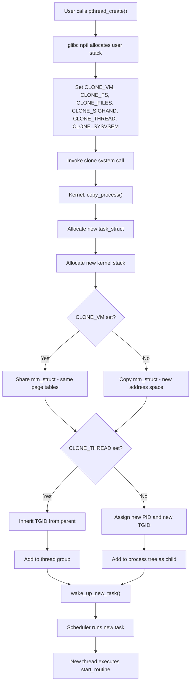
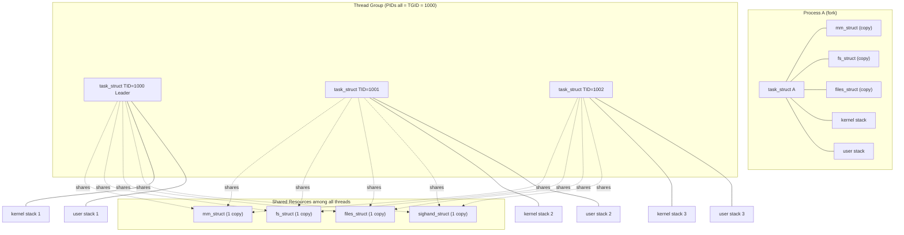
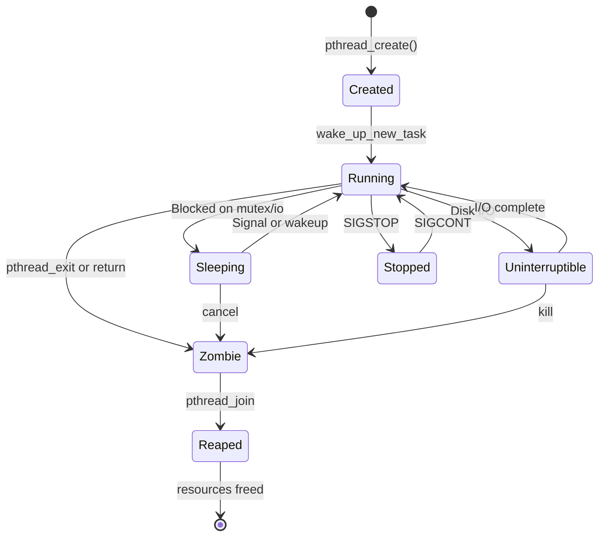
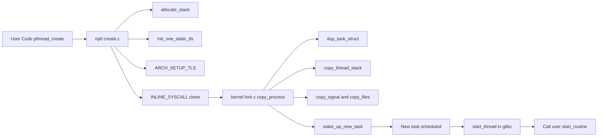
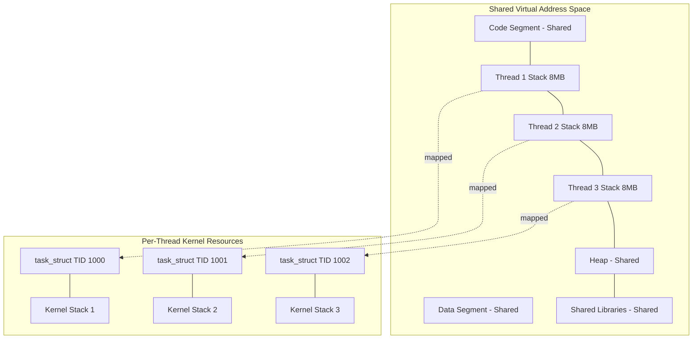

# Case study:  The Linux Implementation of Threads

<!-- SECTION_1_START -->

# The Linux Implementation of Threads: Core Technical Definition & Intuitive Overview

## Formal Academic Definition (KTU 2024 Syllabus Terminology)

In the **Linux Operating System**, a **thread** is defined as a flow of control within a process that shares the same address space, open files, and other resources with its peer threads, but maintains its own **thread ID**, **register set**, **stack**, **program counter**, and **scheduling attributes**. The Linux kernel implements threads using a unique abstraction called **tasks**, where both processes and threads are internally represented as `task_struct` entities differentiated by the degree of resource sharing permitted between them.

> [!IMPORTANT]
> **KTU 2024 Highlight:** Linux does not distinguish between threads and processes at the kernel level. Both are `task_struct` instances. The difference lies in the **resource sharing granularity**, controlled by a set of flags passed to the `clone()` system call.

The **POSIX Threads (pthreads)** standard is the API interface used in Linux for thread management, defined by the IEEE POSIX 1003.1c standard. It provides thread creation, termination, synchronization, and scheduling primitives.

## Conceptual Analogy / Intuition

Imagine a **restaurant kitchen** preparing a multi-course meal:

- A **process** is the **entire kitchen** — its ingredients (memory), cooking stations (open files), and recipes (code) are all part of one workspace.
- A **thread** is an **individual chef** working in that same kitchen. All chefs share the same pantry (memory), the same stove (open files), and the same recipe book (code), but each chef has their **own cutting board and apron** (registers and stack).

**Why Linux is special:** Traditional systems treat processes and threads as completely different entities. Linux treats *both* as "tasks" — it just varies *how much* of the kitchen each task shares. A "process" is a task that shares *nothing* with its parent; a "thread" is a task that shares *almost everything* with its parent. The chef (kernel) doesn't care — it just sees workers and decides what resources they share.

> [!NOTE]
> **Key Insight for KTU Exam:** Linux's design philosophy is often summarized as: **"A thread is just a process that shares resources with other processes."** This unifies the implementation and simplifies the kernel scheduler considerably.

## POSIX Threads in Linux — The API Layer

POSIX Threads (often called `pthreads`) is the standardized C programming interface defined by **IEEE POSIX 1003.1c** for thread management. Linux implements this standard through the `libpthread` (or in glibc, `libc`) shared library that wraps the underlying `clone()` system call.

The fundamental operations supported by pthreads include:

| POSIX Operation | Purpose |
|:----------------|:--------|
| `pthread_create()` | Create a new thread within a process |
| `pthread_exit()` | Terminate the calling thread |
| `pthread_join()` | Block until a target thread terminates |
| `pthread_self()` | Get calling thread's ID |
| `pthread_equal()` | Compare two thread IDs |
| `pthread_detach()` | Mark thread as detached (auto-release resources) |
| `pthread_cancel()` | Send cancellation request to a thread |
| `pthread_yield()` | Yield CPU to another ready thread |

> [!VISUALIZATION CONTROL]
> **Concept:** Linux Thread — Task Sharing Model
> **Conceptual Diagram Description:** Visualize a horizontal bar representing the kernel `task_struct` of a parent process. Branching downward are multiple child `task_struct` blocks (representing threads). Arrows from each child point back to a common shared memory block, but each child has its own small private block (stack + registers). The shared region includes code, data, heap, and file descriptors; the private region includes the kernel stack, user stack, and register set.

## Thread vs Process — Linux's Unified View

> [!IMPORTANT]
> **Core Syllabus Definition:** In Linux, the term **task** refers to any single unit of execution that the kernel can schedule independently. Both processes and threads are tasks. The kernel maintains a circular doubly-linked list of all `task_struct` instances for scheduling purposes.

The **single unified data structure** approach means:
- The scheduler treats all tasks identically
- The PID space is shared (a thread has a PID equal to its TID in some models)
- Resource sharing flags are passed at creation time

<!-- SECTION_1_END -->

<!-- SECTION_2_START -->

# Deep Theoretical Analysis & KTU High-Yield Formula Sheet

## The Linux `task_struct` — Foundation of Both Processes and Threads

Every task (process or thread) in Linux is represented by a `task_struct` structure (defined in `<linux/sched.h>`). This structure contains all the information the kernel needs to manage the task. The most relevant fields for thread implementation are:

| `task_struct` Field | Description | Shared or Per-Thread |
|:--------------------|:------------|:---------------------|
| `pid` | Process/Thread identifier (TID when CLONE_THREAD used) | Per-thread unique |
| `tgid` | Thread Group ID — same as parent's PID | Shared within thread group |
| `state` | Current execution state (running, sleeping, etc.) | Per-thread |
| `stack` | Pointer to kernel stack (used in scheduler) | Per-thread |
| `thread_info` | Low-level architecture data (flags, status) | Per-thread |
| `mm` | Pointer to memory descriptor (virtual address space) | **Shared (no CLONE_VM)** |
| `active_mm` | Pointer to active memory descriptor | Shared when CLONE_VM |
| `files` | Pointer to file descriptor table | **Shared (no CLONE_FILES)** |
| `signal` | Shared pending signals | Shared when CLONE_SIGHAND |
| `sighand` | Signal handler table | Shared when CLONE_SIGHAND |
| `fs` | Filesystem info (root, pwd) | Shared when CLONE_FS |
| `uid`, `gid`, etc. | User/group IDs | Shared when CLONE_NEWUSER not used |
| `comm` | Process/thread name (max 16 chars) | Per-thread |
| `sched_entity` | Scheduler accounting | Per-thread |
| `exit_code` | Termination status | Per-thread |

## The `clone()` System Call — Heart of Linux Threading

The `clone()` system call is the **primitive mechanism** for creating new tasks in Linux. It allows fine-grained control over what is shared between parent and child. The signature is:

```c
#include <sched.h>
int clone(int (*fn)(void *), void *child_stack,
          int flags, void *arg, ...);
```

Where:
- `fn` — Function the new task will begin executing
- `child_stack` — Stack pointer for the new task (caller must allocate)
- `flags` — Bitmask specifying what resources to **share**
- `arg` — Argument passed to `fn`

### Flags That Control Sharing

| Flag | Effect When Set | Resources Shared |
|:-----|:----------------|:-----------------|
| `CLONE_VM` | Share memory address space | Virtual memory |
| `CLONE_FS` | Share filesystem info | Root, pwd, umask |
| `CLONE_FILES` | Share file descriptor table | Open file descriptors |
| `CLONE_SIGHAND` | Share signal handlers | Signal handler table |
| `CLONE_THREAD` | Place in same thread group | TID/PID, group exit, signals |
| `CLONE_NEWNS` | New mount namespace | Mount points (NOT shared) |
| `CLONE_NEWUTS` | New UTS namespace | Hostname (NOT shared) |
| `CLONE_NEWIPC` | New IPC namespace | IPC (NOT shared) |
| `CLONE_NEWUSER` | New user namespace | UIDs (NOT shared) |
| `CLONE_NEWPID` | New PID namespace | PIDs (NOT shared) |
| `CLONE_SYSVSEM` | Share System V semaphore undo | Semaphore undo lists |
| `CLONE_PARENT` | Share parent pointer | Parent task pointer |
| `CLONE_IO` | Share IO context | IO context |

### The Standard Linux Thread Creation Model

The most common configuration for **POSIX threads** uses these flags:

| Flag | Shared Element |
|:-----|:---------------|
| `CLONE_VM` | Memory address space |
| `CLONE_FS` | Filesystem info |
| `CLONE_FILES` | File descriptors |
| `CLONE_SIGHAND` | Signal handlers |
| `CLONE_THREAD` | Thread group identity |
| `CLONE_SYSVSEM` | SysV semaphores |

> [!NOTE]
> **Exam Tip:** When `CLONE_THREAD` is set, all threads in the group share the **same PID** (which is actually the TGID). The thread's own unique identifier is the **TID**. The `getpid()` syscall returns the TGID — this is why all threads in a multithreaded process return the same PID from `getpid()`.

## POSIX Thread Implementation Internals

The `pthread_create()` library function is implemented as a wrapper around `clone()`. The library handles:

1. **Stack allocation** — Allocates a new user-mode stack (default 8 MB, adjustable)
2. **Thread descriptor setup** — Creates a `pthread` struct holding TLS, cleanup handlers, and metadata
3. **Setting up TLS** — Configures thread-local storage via arch-specific ABI (e.g., `arch_prctl` on x86_64)
4. **Calling `clone()`** — Invokes the kernel with shared flag set
5. **Returning thread ID** — The new TID is returned to the caller

The standard implementation sequence in glibc's `nptl` (Native POSIX Thread Library):

```
pthread_create()
    → allocate_stack()                    [allocate user stack]
    → create_cancellation()               [set up cancellation state]
    → init_one_static_tls()               [set up thread-local storage]
    → setup_thread()                      [create pthread struct]
    → ARCH_SETUP_TLS()                    [architecture-specific TLS setup]
    → INLINE_SYSCALL(clone, ...)          [invoke kernel]
    → if parent: return new TID
    → if child: start_thread() → fn(arg)
```

## Kernel Thread Stack and Scheduler Integration

Each thread (even with shared VM) gets its **own kernel stack**. This is essential because:
- System calls enter the kernel on this stack
- Interrupt handlers need a stable per-task stack
- Scheduler saves/restores context per thread

The scheduler sees each thread as an independent scheduling entity. The **CFS (Completely Fair Scheduler)** — default in modern Linux — uses a red-black tree of `sched_entity` structures, one per thread. Threads in the same process are scheduled independently, just like independent processes.

## Linux Thread Limits and Defaults

| Parameter | Typical Default | Configurable Via |
|:----------|:----------------|:-----------------|
| Default stack size | **8 MB** (x86_64) | `ulimit -s`, `pthread_attr_setstacksize()` |
| Maximum threads per process | ~32,768 (PID max) | `/proc/sys/kernel/pid_max` |
| Number of CPUs schedulable | NR_CPUS | `/proc/cpuinfo` |
| Thread scheduling policy | SCHED_OTHER (CFS) | `pthread_attr_setschedpolicy()` |
| Scheduling inheritance | `PTHREAD_INHERIT_SCHED` | `pthread_attr_setinheritsched()` |

## Real-World Engineering Utility

Linux thread implementation is critical in:

- **Web servers (Nginx, Apache)** — Worker thread pools handle concurrent client requests
- **Database engines (PostgreSQL, MySQL)** — Per-connection threads with shared buffer pool
- **Scientific computing (OpenMP, MPI)** — Parallel computation across cores
- **High-frequency trading** — Low-latency threading with CPU pinning
- **Container runtimes (Docker, runc)** — Use `clone()` with namespace flags for container isolation
- **Language runtimes (JVM, Go runtime, Rust async)** — Map user threads to OS threads or use M:N scheduling on top of `clone()`

> [!IMPORTANT]
> **KTU Exam Bonus Point:** Mentioning the difference between **NPTL (Native POSIX Thread Library)** and the older **LinuxThreads** implementation earns extra marks. NPTL replaced LinuxThreads in Linux 2.6 and uses `CLONE_THREAD` with `gettid()` for proper POSIX compliance. LinuxThreads had PID-per-thread which violated POSIX semantics.

## KTU High-Yield Formula Sheet

| Concept | Formula / Expression | Notes |
|:--------|:---------------------|:------|
| Thread creation | `clone(fn, stack, flags, arg)` | Returns TID to parent |
| POSIX `pthread_create` | `pthread_create(&tid, &attr, fn, arg)` | Wrapper around `clone()` |
| Unique thread ID in group | `TID = clone()` return value | Per-thread |
| Shared PID (TGID) | `getpid() == TGID == main_tid` | All threads in group return same |
| CLONE flag for threads | `CLONE_VM \| CLONE_FS \| CLONE_FILES \| CLONE_SIGHAND \| CLONE_THREAD` | Standard pthreads flags |
| Stack size | typically 8 MB | Configurable |
| Thread state | `R` running, `S` sleeping, `D` uninterruptible, `Z` zombie | From `/proc/[pid]/status` |
| Default scheduler | CFS (Linux 2.6.23+) | Preemptive, fair scheduling |
| `gettid()` vs `getpid()` | `gettid() = TID`, `getpid() = TGID` | `gettid()` is thread-specific |

<!-- SECTION_2_END -->

<!-- SECTION_3_START -->

# Step-by-Step Derivations, Code Implementation & Symbolic Walkthroughs

## Derivation 1: From `pthread_create()` to `clone()` — A Full Walkthrough

We will trace a `pthread_create()` call from the user-level library down to the kernel `clone()` system call, showing every transition.

### Step 1: User Issues `pthread_create()`

A typical user-level invocation:

```c
#include <pthread.h>
#include <stdio.h>
#include <stdlib.h>

void *worker(void *arg) {
    long id = (long)arg;
    printf("Worker thread %ld running in PID %d, TID %d\n",
           id, getpid(), gettid());
    return NULL;
}

int main(void) {
    pthread_t tid;
    long arg = 42;
    int ret = pthread_create(&tid, NULL, worker, (void *)arg);
    if (ret != 0) {
        perror("pthread_create");
        exit(EXIT_FAILURE);
    }
    pthread_join(tid, NULL);
    return 0;
}
```

The compiler and linker resolve this to `libpthread`'s implementation. In modern glibc, `libpthread` is merged into `libc`, but the symbol is still exported.

### Step 2: Library Function `__pthread_create_2_1` Entry

The glibc `nptl/sysdeps/pthread/create.c` implementation flow:

```c
int
__pthread_create_2_1 (pthread_t *newthread, const pthread_attr_t *attr,
                      void *(*start_routine) (void *), void *arg)
{
  struct pthread *pd = NULL;
  int err;

  /* Step A: Allocate a stack for the new thread */
  err = allocate_stack (&pd, attr, &stack_used);
  if (err != 0) return err;

  /* Step B: Initialize thread-specific data */
  pd->start_routine = start_routine;
  pd->arg = arg;
  pd->schedparam = ...;          /* copy scheduling attributes */

  /* Step C: Set up Thread-Local Storage (TLS) */
  err = init_one_static_tls (pd);
  if (err != 0) { deallocate_stack (pd); return err; }

  /* Step D: Architecture-specific TLS pointer setup */
  TLS_DEFINE_INIT_TP (pd->tcb, pd->stackblock);

  /* Step E: Call the kernel */
  int clone_flags = (CLONE_VM | CLONE_FS | CLONE_FILES |
                     CLONE_SIGHAND | CLONE_THREAD |
                     CLONE_SYSVSEM | CLONE_SETTLS | CLONE_PARENT_SETTID |
                     CLONE_CHILD_CLEARTID | 0);

  int tid = INLINE_SYSCALL_CALL (clone, clone_flags,
                                 (void *) pd->stackblock + pd->stackblock_size,
                                 pd, pd->tid, pd->tidp);

  if (tid == -1) { deallocate_stack (pd); return errno; }

  /* Step F: Return thread ID to caller */
  *newthread = (pthread_t) pd;
  return 0;
}
```

### Step 3: Kernel Receives `clone()` and Allocates `task_struct`

Inside the kernel (`kernel/fork.c`, function `copy_process()`):

```c
struct task_struct *p;
p = dup_task_struct(current, node);
if (!p) goto fork_out;

/* Copy process descriptor */
p->stack = ...;                  /* allocate new kernel stack */
p->pid = pid;                    /* assign TID */
p->tgid = current->tgid;         /* inherit TGID from parent (CLONE_THREAD) */

if (clone_flags & CLONE_THREAD) {
    p->tgid = current->tgid;     /* threads share TGID */
    p->group_leader = current->group_leader;
}

/* Resource sharing decisions */
if (clone_flags & CLONE_VM) {
    p->mm = NULL;                /* no new memory descriptor */
    p->active_mm = current->active_mm;
    atomic_inc(&current->mm->mm_users);
} else {
    p->mm = copy_mm(current, p); /* new process = full copy */
}

if (clone_flags & CLONE_FILES) {
    p->files = current->files;   /* share fd table */
    atomic_inc(&current->files->count);
} else {
    p->files = copy_files(current, p);
}

if (clone_flags & CLONE_FS) {
    p->fs = current->fs;         /* share fs info */
    spin_lock(&current->fs->lock);
    current->fs->users++;
    spin_unlock(&current->fs->lock);
} else {
    p->fs = copy_fs_struct(current->fs);
}

if (clone_flags & CLONE_SIGHAND) {
    p->sighand = current->sighand; /* share signal handlers */
    atomic_inc(&current->sighand->count);
} else {
    p->sighand = copy_sighand(current->sighand, p);
}

/* Schedule the new task */
wake_up_new_task(p);

/* Return TID to parent; 0 to child */
return p->pid;
```

### Step 4: New Thread Begins Execution in User Space

The new thread, when scheduled, jumps to `start_thread()` in glibc, which then calls the user's `start_routine(arg)`.

## Derivation 2: Resource Sharing Math — Counting What Is Shared

Consider a parent process that calls `pthread_create()` to spawn **N** threads. We compute how many `task_struct` fields, file descriptors, and address space pages are shared vs. duplicated.

| Resource | Per-Process (fork) | Per-Thread (pthread) | For N Threads |
|:---------|:-------------------|:---------------------|:--------------|
| `task_struct` | 1 per process | 1 per thread | N copies |
| Kernel stack | 1 per process | 1 per thread | N copies |
| User stack | 1 per process | 1 per thread | N copies |
| `mm_struct` (page tables) | 1 per process | **1 shared** | 1 copy |
| `files_struct` (FD table) | 1 per process | **1 shared** | 1 copy |
| `fs_struct` (cwd, root) | 1 per process | **1 shared** | 1 copy |
| `sighand_struct` (handlers) | 1 per process | **1 shared** | 1 copy |
| Open file descriptions | Duplicated | **Shared** | 1 underlying |
| Signal pending bitmap | Per-process | **Per-thread** | N bitmaps |
| `signal_struct` | 1 per process | **1 shared** | 1 copy |

**Memory savings formula:** If a process has a virtual address space of size $V$ bytes with page size $P = 4096$, the number of page table entries is approximately $V/P$. With pthreads, this is **shared**, saving approximately:

$$S_{\text{memory}} = (N-1) \cdot \frac{V}{P} \cdot 8 \text{ bytes}$$

The factor 8 bytes represents the per-PTE overhead in 64-bit Linux.

**Example calculation:** For $N=8$ threads, $V=2 \text{ GB}$, $P=4 \text{ KB}$:

$$S_{\text{memory}} = (8-1) \cdot \frac{2 \cdot 2^{30}}{4096} \cdot 8$$

$$S_{\text{memory}} = 7 \cdot 524288 \cdot 8 = 29{,}360{,}128 \text{ bytes} \approx 28 \text{ MB}$$

> [!NOTE]
> This is why threads are called **lightweight processes** — they avoid duplicating the page tables, which is the most expensive part of process creation.

## Derivation 3: LinuxThread vs NPTL — The Evolution

### Old LinuxThreads (Pre-2.6, flawed POSIX)

| Property | LinuxThreads Behavior |
|:---------|:----------------------|
| `clone()` flags | Used `CLONE_VM \| CLONE_FILES \| CLONE_FS \| CLONE_SIGHAND` only (NO `CLONE_THREAD`) |
| PID behavior | Each thread got its own **unique PID** |
| `getpid()` | Returned the calling thread's PID (different per thread) |
| Signal delivery | Used `SIGUSR1`/`SIGUSR2` for thread cancellation — violated POSIX |
| Process group | All threads in a process were *not* in the same group |

### New NPTL (Native POSIX Thread Library, Linux 2.6+)

| Property | NPTL Behavior |
|:---------|:---------------|
| `clone()` flags | Adds `CLONE_THREAD` and `CLONE_SYSVSEM` |
| PID behavior | All threads share same **TGID** |
| `getpid()` | Returns TGID (same for all threads in group) |
| `gettid()` | Returns per-thread TID |
| Signal delivery | Uses internal `futex` for cancellation — POSIX compliant |
| Process group | All threads in a thread group share `signal_struct` and exit semantics |
| Kernel changes | Required kernel to track TGID, integrate `futex`, group exit |

## Code Example: Complete POSIX Thread Program with Error Handling

```c
#define _GNU_SOURCE
#include <stdio.h>
#include <stdlib.h>
#include <pthread.h>
#include <unistd.h>
#include <sys/syscall.h>
#include <errno.h>
#include <string.h>

#define NUM_THREADS 4

/* Shared resource - protected by mutex */
static int shared_counter = 0;
static pthread_mutex_t counter_mutex = PTHREAD_MUTEX_INITIALIZER;

/* Thread routine */
static void *thread_worker(void *arg) {
    long thread_id = (long)arg;
    pid_t pid = getpid();
    pid_t tid = (pid_t)syscall(SYS_gettid);

    printf("[PID=%d TID=%d] Thread %ld started\n", pid, tid, thread_id);

    for (int i = 0; i < 5; i++) {
        if (pthread_mutex_lock(&counter_mutex) != 0) {
            fprintf(stderr, "Mutex lock failed: %s\n", strerror(errno));
            return (void *)-1;
        }

        int current = shared_counter;
        current++;
        shared_counter = current;

        if (pthread_mutex_unlock(&counter_mutex) != 0) {
            fprintf(stderr, "Mutex unlock failed: %s\n", strerror(errno));
            return (void *)-1;
        }
    }

    printf("[PID=%d TID=%d] Thread %ld finished, counter=%d\n",
           pid, tid, thread_id, shared_counter);
    return NULL;
}

int main(void) {
    pthread_t threads[NUM_THREADS];
    void *retval;
    int rc;

    printf("Main: PID=%d, TID=%d, TGID=%d\n",
           getpid(), (pid_t)syscall(SYS_gettid), getpid());

    for (long i = 0; i < NUM_THREADS; i++) {
        rc = pthread_create(&threads[i], NULL, thread_worker, (void *)i);
        if (rc != 0) {
            fprintf(stderr, "pthread_create failed: %s\n", strerror(rc));
            return EXIT_FAILURE;
        }
    }

    for (int i = 0; i < NUM_THREADS; i++) {
        rc = pthread_join(threads[i], &retval);
        if (rc != 0) {
            fprintf(stderr, "pthread_join failed: %s\n", strerror(rc));
            return EXIT_FAILURE;
        }
    }

    pthread_mutex_destroy(&counter_mutex);
    printf("Main: Final shared_counter=%d (expected %d)\n",
           shared_counter, NUM_THREADS * 5);
    return (shared_counter == NUM_THREADS * 5) ? EXIT_SUCCESS : EXIT_FAILURE;
}
```

### Compilation and Expected Output

```bash
gcc -O2 -Wall -pthread thread_demo.c -o thread_demo
./thread_demo
```

**Expected output (ordering may vary):**

```
Main: PID=12345, TID=12345, TGID=12345
[PID=12345 TID=12346] Thread 0 started
[PID=12345 TID=12347] Thread 1 started
[PID=12345 TID=12348] Thread 2 started
[PID=12345 TID=12349] Thread 3 started
[PID=12345 TID=12346] Thread 0 finished, counter=20
[PID=12345 TID=12347] Thread 1 finished, counter=20
[PID=12345 TID=12348] Thread 2 finished, counter=20
[PID=12345 TID=12349] Thread 3 finished, counter=20
Main: Final shared_counter=20 (expected 20)
```

> [!NOTE]
> **Observation:** All threads report the same PID (the TGID) but different TIDs. The mutex ensures the counter increment is atomic. If the mutex is removed, race conditions would cause the final counter to be less than 20.

## Derivation 4: Thread State and Exit — The Lifecycle

The full lifecycle of a Linux thread from creation to termination:

| State | Kernel `task_struct->state` | Description |
|:------|:------------------------------|:------------|
| Created | `TASK_NEW` / `TASK_RUNNING` | After `clone()` returns; about to be scheduled |
| Running | `TASK_RUNNING` | Actively executing on a CPU |
| Sleeping | `TASK_INTERRUPTIBLE` (`S`) | Blocked, can be woken by signals |
| Uninterruptible | `TASK_UNINTERRUPTIBLE` (`D`) | Blocked, cannot be woken (e.g., disk I/O) |
| Stopped | `TASK_STOPPED` (`T`) | Stopped by `SIGSTOP` or debugger |
| Zombie | `EXIT_ZOMBIE` (`Z`) | Terminated but not yet reaped |
| Dead | `EXIT_DEAD` (`X`) | Reaped, structure being freed |

A thread enters the **zombie state** when it calls `pthread_exit()` or returns from its start routine. It remains a zombie until another thread in the process (typically the main thread) calls `pthread_join()` on it, or it was created with `pthread_attr_setdetachstate(PTHREAD_CREATE_DETACHED)`. Detached threads automatically release their resources upon termination.

## Symbolic Walkthrough: Reading `/proc/[pid]/task/` for Thread Inspection

Given a process with PID 5000 and three threads, the `/proc/5000/task/` directory would look like:

```text
/proc/5000/task/
├── 5000/        # Main thread (leader)
│   ├── status
│   ├── stat
│   └── ...
├── 5001/        # Worker thread 1
│   ├── status
│   ├── stat
│   └── ...
├── 5002/        # Worker thread 2
│   ├── status
│   ├── stat
│   └── ...
```

The command `ls /proc/5000/task/` reveals all thread TIDs in the group. The `comm` field in each thread's `status` file shows the thread name (up to 16 characters), which can be set via `prctl(PR_SET_NAME, ...)`.

<!-- SECTION_3_END -->

<!-- SECTION_4_START -->

# Structural Diagrams & Schematics

## Diagram 1: Linux `clone()` — Resource Sharing Decision Tree



## Diagram 2: Process vs Thread — Linux Unified Task Model



## Diagram 3: Thread Lifecycle State Machine



## Diagram 4: glibc pthread_create() Call Stack



## Diagram 5: Memory Layout of a Multithreaded Process



<!-- SECTION_4_END -->

<!-- SECTION_5_START -->

# KTU 2024 Scheme Examination Question Bank & Topic Recap

## Part A Questions (3 Marks Each)

### Question 1 [KTU University Exam - Dec 2023, CO1, Remember]

**Q: Define a thread in the Linux operating system. How does Linux internally represent both processes and threads?**

**Model Answer (3 Marks):**

In Linux, a **thread** is a flow of control within a process that shares its memory address space, file descriptor table, filesystem information, and signal handlers with other threads, but maintains its own **register set, stack, program counter, and scheduling attributes**.

> **[Defining thread: 1 Mark]**

Linux uses a **unified task model** where both processes and threads are represented by the same kernel data structure called `task_struct`. The distinction lies in the **degree of resource sharing**, which is controlled by flags passed to the `clone()` system call.

> **[Unified task_struct: 1 Mark]**

A process is a `task_struct` with no sharing flags (full duplication of `mm_struct`, `files_struct`, `fs_struct`, and `sighand_struct`). A thread is a `task_struct` that shares these resources via flags like `CLONE_VM`, `CLONE_FILES`, `CLONE_FS`, `CLONE_SIGHAND`, and `CLONE_THREAD`. This design simplifies the kernel scheduler since it treats all tasks uniformly.

> **[clone() flags and resources: 1 Mark]**

---

### Question 2 [KTU University Exam - July 2024, CO1, Understand]

**Q: Explain the role of the `clone()` system call in Linux thread implementation. List the standard flags used for POSIX thread creation.**

**Model Answer (3 Marks):**

The `clone()` system call is the **primitive mechanism** in Linux for creating new tasks. Unlike `fork()` (which creates a fully independent process) or the user-level thread library (which creates threads completely in user space), `clone()` allows the caller to specify **which resources are shared** between parent and child via a bitmask of flags.

> **[clone() role: 1 Mark]**

The standard flags used by POSIX `pthread_create()` are:

1. **`CLONE_VM`** — Share the virtual memory address space
2. **`CLONE_FS`** — Share filesystem information (root, pwd, umask)
3. **`CLONE_FILES`** — Share the file descriptor table
4. **`CLONE_SIGHAND`** — Share signal handler table
5. **`CLONE_THREAD`** — Place in same thread group (shared TGID)
6. **`CLONE_SYSVSEM`** — Share System V semaphore undo lists

> **[Listing 6 flags: 1 Mark]**

The library function `pthread_create()` in glibc's NPTL implementation is a thin wrapper that allocates a stack, sets up thread-local storage, and invokes `clone()` with these flags. This design keeps the kernel simple while giving user space maximum flexibility.

> **[glibc NPTL wrapper explanation: 1 Mark]**

---

## Part B Questions (14 Marks Each) — Module Internal Choice

### Question A (14 Marks) [KTU University Exam - Dec 2023, CO2]

#### Part (a) — 7 Marks [Understand]

**Q: With a neat diagram, explain the Linux `task_struct` data structure and list the fields that are shared between threads versus the fields that are unique per thread.**

**Model Answer:**

**Introduction (1 Mark):**

In Linux, every execution unit — whether a process or a thread — is represented by a `task_struct` structure allocated within the kernel. This unified representation allows the scheduler to treat both processes and threads identically as schedulable entities.

**[Statement of unified model: 1 Mark]**

**Shared Fields Among Threads (3 Marks):**

When threads are created using `clone()` with `CLONE_THREAD` and related flags, the following fields of `task_struct` are **shared** among all threads in the same thread group:

1. **`mm_struct` (or `active_mm`)** — All threads share the same virtual memory address space. This is the most important sharing, since it allows threads to access the same code, data, heap, and shared libraries.
2. **`files_struct`** — All threads share the same file descriptor table. If one thread opens a file, other threads can read/write it through the same descriptor.
3. **`fs_struct`** — All threads share the same filesystem context, including the current working directory, root directory, and umask.
4. **`sighand_struct`** — All threads share the same signal handler table, ensuring signal handling is consistent across the thread group.
5. **`signal_struct`** — All threads share the same shared pending signal set and process-wide signal handling state.

**[Listing 5 shared fields with explanation: 3 Marks]**

**Unique Per-Thread Fields (2 Marks):**

The following fields are **unique** to each thread:

1. **`thread_info` and `stack`** — Each thread has its own kernel stack for system call handling and interrupt processing.
2. **`cpu_context`, register set, `pt_regs`** — Each thread has its own saved CPU context for context switching.
3. **User-mode stack** — Each thread is allocated a private user-mode stack (default 8 MB on x86_64).
4. **Signal mask** — Each thread has its own blocked signal mask (`sigmask`).
5. **`exit_code`** — Each thread can have an independent exit code returned via `pthread_exit()` or implicit return.
6. **TLS (Thread-Local Storage)** — Each thread has its own thread-local storage region.

**[Listing 6 unique fields with explanation: 2 Marks]**

**Diagram (1 Mark):**

A diagram showing one parent `task_struct` with shared pointers to a common block containing `mm_struct`, `files_struct`, `fs_struct`, `sighand_struct`, and `signal_struct`, plus three child `task_struct` instances each with their own kernel stack, user stack, and register set. The shared block is enclosed in a dashed box labeled "Shared among thread group"; the unique items are each enclosed in solid boxes attached to individual `task_struct` blocks.

**[Neat diagram with shared and unique parts labeled: 1 Mark]**

---

#### Part (b) — 7 Marks [Apply]

**Q: Compare the LinuxThreads implementation (pre-2.6 kernel) with the NPTL (Native POSIX Thread Library) implementation (2.6+ kernel). What were the key issues that led to the transition?**

**Model Answer:**

**LinuxThreads Overview (2 Marks):**

LinuxThreads was the original POSIX threads implementation used in Linux kernels before version 2.6. It was implemented as a user-level library that used the `clone()` system call to create threads, but with a critical difference: it did **not** set the `CLONE_THREAD` flag. As a result, each thread received a **distinct PID** from the kernel, which violated POSIX semantics that require all threads in a process to share a single PID.

> **[Identifying lack of CLONE_THREAD: 1 Mark]** 
> **[PID violation explanation: 1 Mark]**

**NPTL Overview (2 Marks):**

NPTL (Native POSIX Thread Library) was introduced by Ulrich Drepper and Ingo Molnar in 2002 and integrated into Linux 2.6. It requires kernel support for `CLONE_THREAD`, `gettid()` system call, `futex` (Fast Userspace Locking), and group exit semantics. With NPTL:

- All threads in a process share the same **TGID** (Thread Group ID), which is what `getpid()` returns.
- Each thread has a unique **TID** (Thread ID) retrieved via `gettid()`.
- The `clone()` invocation uses the proper flag combination for full POSIX compliance.

> **[TGID vs TID distinction: 1 Mark]**
> **[getpid/gettid behavior: 1 Mark]**

**Key Issues in LinuxThreads (2 Marks):**

1. **Signal handling problems** — LinuxThreads used real-time signals (`SIGUSR1`/`SIGUSR2`) for internal thread management, which collided with user applications. For example, a user's signal handler could conflict with the library's internal signaling.
2. **Process group semantics** — Since each thread had its own PID, all threads in a multithreaded process were not part of the same process group. Sending a signal to the process group with `kill()` would not affect sibling threads correctly.
3. **`/proc` filesystem confusion** — The `ps` command would show a multithreaded process as multiple separate processes, making it impossible to easily identify and manage thread groups.
4. **POSIX non-compliance** — `getpid()` from different threads returned different values, breaking POSIX expectations.

> **[Listing 4 issues: 2 Marks — 0.5 each]**

**Performance Improvements in NPTL (1 Mark):**

NPTL uses `futex` (Fast Userspace Locking) for thread synchronization, which avoids expensive kernel syscalls in the uncontended case. Thread creation and destruction are significantly faster, and scalability improves dramatically on multi-core systems — NPTL can handle thousands of threads efficiently, while LinuxThreads scaled poorly beyond a few hundred threads.

> **[futex + scalability: 1 Mark]**

---

### Question B (14 Marks) [KTU University Exam - July 2024, CO2]

#### Part (a) — 7 Marks [Understand]

**Q: Explain the difference between `fork()`, `vfork()`, and `clone()` system calls in Linux. How does each affect the parent's execution and resource sharing?**

**Model Answer:**

**`fork()` — Classical Process Creation (2 Marks):**

The `fork()` system call creates a new process that is a **near-exact duplicate** of the parent. The child gets a copy of the parent's memory address space, file descriptor table, signal handlers, and other resources. After `fork()`, both parent and child execute concurrently. Historically, `fork()` was implemented as `clone()` with all sharing flags cleared, i.e., `clone(SIGCHLD, 0)`. The kernel performs a copy-on-write (COW) optimization so that physical pages are only duplicated when one of the processes modifies them.

> **[fork() definition + COW note: 2 Marks]**

**`vfork()` — Optimized Creation for `exec()` (2 Marks):**

The `vfork()` system call is similar to `fork()` but with two critical differences:

1. The child **shares the parent's memory** address space completely (no copy-on-write, no duplication).
2. The **parent is suspended** until the child either calls `exec()` or `_exit()`. The child must not return from the function that called `vfork()` or modify any data in the parent's stack.

`vfork()` was designed for the common pattern of immediately calling `exec()` after fork. Since `exec()` replaces the address space, copying it was wasteful. The suspended parent resumes only after the child has either replaced its memory (via `exec`) or terminated.

> **[Memory sharing + parent suspension: 2 Marks]**

**`clone()` — Flexible Task Creation (3 Marks):**

The `clone()` system call allows the caller to specify **exactly which resources are shared** between parent and child through a set of flags. Internally, `clone()` is the **fundamental primitive**; `fork()` and `vfork()` are now implemented as special cases of `clone()`:

- `fork()` = `clone(SIGCHLD, 0)` (no sharing)
- `vfork()` = `clone(CLONE_VM | CLONE_VFORK | SIGCHLD, 0)` (share memory, suspend parent)

The flags used for POSIX threads are:

`CLONE_VM | CLONE_FS | CLONE_FILES | CLONE_SIGHAND | CLONE_THREAD | CLONE_SYSVSEM`

These flags cause the child to share memory, filesystem info, file descriptors, signal handlers, thread group ID, and SysV semaphores with the parent. The flexibility of `clone()` is what enables Linux to implement both processes and threads as the same underlying concept.

> **[clone() as primitive: 1 Mark]**
> **[fork/vfork as clone() special cases: 1 Mark]**
> **[POSIX thread flags: 1 Mark]**

---

#### Part (b) — 7 Marks [Apply]

**Q: Write a C program using POSIX threads to create three threads. Each thread should print its thread ID (using `gettid()`) and the process ID (`getpid()`). The main thread should join all three threads and print the final result. Explain what the output reveals about Linux's thread model.**

**Model Answer:**

**Program Code (4 Marks):**

```c
#define _GNU_SOURCE
#include <stdio.h>
#include <stdlib.h>
#include <pthread.h>
#include <unistd.h>
#include <sys/syscall.h>

#define NUM_THREADS 3

static void *thread_func(void *arg) {
    long n = (long)arg;
    pid_t pid = getpid();
    pid_t tid = (pid_t)syscall(SYS_gettid);
    printf("Thread %ld: PID=%d, TID=%d\n", n, pid, tid);
    return (void *)(long)tid;
}

int main(void) {
    pthread_t threads[NUM_THREADS];
    void *retval;
    pid_t main_tid = (pid_t)syscall(SYS_gettid);
    printf("Main thread: PID=%d, TID=%d\n", getpid(), main_tid);
    printf("--- Spawning %d threads ---\n", NUM_THREADS);

    for (long i = 0; i < NUM_THREADS; i++) {
        if (pthread_create(&threads[i], NULL, thread_func, (void *)i) != 0) {
            perror("pthread_create");
            return EXIT_FAILURE;
        }
    }

    for (int i = 0; i < NUM_THREADS; i++) {
        pthread_join(threads[i], &retval);
        printf("Joined thread %d, exit TID=%ld\n", i, (long)retval);
    }

    printf("--- All threads joined ---\n");
    return EXIT_SUCCESS;
}
```

**[Correct includes: 0.5 Mark]**
**[Thread function with gettid: 1.5 Marks]**
**[pthread_create + pthread_join loop: 1.5 Marks]**
[**(void *) cast in return to avoid warnings: 0.5 Mark]**

**Sample Output (1 Mark):**

```text
Main thread: PID=7891, TID=7891
--- Spawning 3 threads ---
Thread 0: PID=7891, TID=7892
Thread 1: PID=7891, TID=7893
Thread 2: PID=7891, TID=7894
Joined thread 0, exit TID=7892
Joined thread 1, exit TID=7893
Joined thread 2, exit TID=7894
--- All threads joined ---
```

**[Correct format showing shared PID and unique TIDs: 1 Mark]**

**Explanation of What the Output Reveals (2 Marks):**

1. **Shared PID, Unique TIDs** — All threads report the same `getpid()` value (the **TGID**), but each has a different TID obtained via `gettid()`. This proves that under `CLONE_THREAD`, all threads in a group share a single thread group identifier while retaining unique kernel-level task IDs.

2. **Kernel-level task identity** — The TIDs are sequential and adjacent to the main thread's TID. This reflects how the kernel's PID allocator assigns unique TIDs to each `task_struct` it creates via `clone()`.

3. **`pthread_join` synchronization** — The "Joined thread N" messages confirm that `pthread_join` blocks the main thread until the corresponding worker terminates, then retrieves its exit value (the TID it returned).

4. **Unified task model verification** — Despite being called "threads," the kernel sees them as ordinary `task_struct` instances — no different from processes. The user-level `pthread` library provides the thread abstraction on top.

> **[Shared PID vs unique TID: 0.5 Mark]**
> **[Task model: 0.5 Mark]**
> **[pthread_join semantics: 0.5 Mark]**
> **[Unified abstraction: 0.5 Mark]**

---

> [!WARNING]
> **KTU Examiner's Valuation Warning — Common Pitfalls to Avoid:**
> 1. **Do not confuse PID with TID.** A common mistake is to say "each thread has its own PID." In modern Linux with NPTL, the **TID** is unique per thread, but the **PID (TGID)** is shared. If you write "threads have different PIDs," you will lose 1–2 marks.
> 2. **Do not skip the `CLONE_THREAD` flag** when listing flags for POSIX thread creation. Many students omit it, but it is the most important flag that distinguishes thread creation from `fork()`.
> 3. **Always mention that Linux uses a unified `task_struct` for both processes and threads.** This is the central design philosophy and a frequent KTU question. Just listing thread features without mentioning `task_struct` loses marks.
> 4. **In code questions, always include `-pthread` flag when compiling.** The `pthread.h` header alone is not enough; the linker flag is required. Mention it in the answer.
> 5. **Do not write `printf` without `\n` in thread code** — output may not flush before thread termination, causing the examiner to see incomplete output in your answer.
> 6. **Always cast the return value in thread functions properly** — return `(void *)(long)value` and retrieve as `(long)retval`. Improper casting is a common silent bug that examiners look for.

---

## Topic Recap & Important Things to Remember

- **Unified Task Model:** Linux represents both processes and threads as `task_struct` instances. The kernel scheduler treats them identically as schedulable entities.

- **`clone()` is the Primitive:** The `clone()` system call is the fundamental mechanism for creating new tasks. `fork()` and `vfork()` are special cases of `clone()` with specific flag combinations.

- **Standard POSIX Thread Flags:** `CLONE_VM | CLONE_FS | CLONE_FILES | CLONE_SIGHAND | CLONE_THREAD | CLONE_SYSVSEM` — these cause the child to share memory, filesystem info, file descriptors, signal handlers, thread group identity, and SysV semaphores with the parent.

- **TGID vs TID:** All threads in a process share the same TGID (returned by `getpid()`). Each thread has a unique TID (returned by `gettid()`). The main thread's TID equals the TGID.

- **Shared Resources:** Memory (`mm_struct`), file descriptors (`files_struct`), filesystem info (`fs_struct`), signal handlers (`sighand_struct`), and shared pending signals (`signal_struct`) are all shared among threads.

- **Per-Thread Resources:** Kernel stack, user stack, register set, signal mask, exit code, TLS (Thread-Local Storage), and `comm` (thread name) are unique per thread.

- **NPTL vs LinuxThreads:** NPTL is the modern POSIX-compliant implementation (Linux 2.6+) that uses `CLONE_THREAD` for shared TGID. LinuxThreads was the older, non-compliant implementation where each thread had its own PID.

- **Default Thread Stack Size:** 8 MB on x86_64 Linux. Can be configured via `ulimit -s` or `pthread_attr_setstacksize()`.

- **Default Scheduler:** CFS (Completely Fair Scheduler) since Linux 2.6.23, treats each thread as an independent scheduling entity using a red-black tree.

- **Thread Inspection:** Use `/proc/[pid]/task/` to view all threads in a process. The `comm` field shows the thread name (set via `prctl(PR_SET_NAME, ...)`).

- **Thread Lifecycle States:** Created → Running → Sleeping/Uninterruptible → Zombie → Reaped (via `pthread_join` or detached mode).

- **pthread_join Required:** A non-detached thread becomes a zombie until `pthread_join()` is called. Use `pthread_detach()` to make a thread auto-release its resources upon termination.

- **Race Conditions:** Threads in the same process share memory, so concurrent access to shared data requires synchronization (mutexes, condition variables, semaphores, or atomic operations).

- **Compilation Flag:** Always compile pthread programs with `-pthread` flag (which sets `_REENTRANT` and links against `libpthread`).

- **`futex` Performance:** Modern Linux pthreads use `futex` (Fast Userspace Locking) for synchronization — kernel syscalls are avoided in the uncontended case, making locking very fast.

<!-- SECTION_5_END -->
