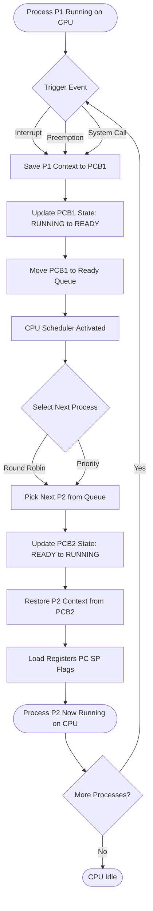
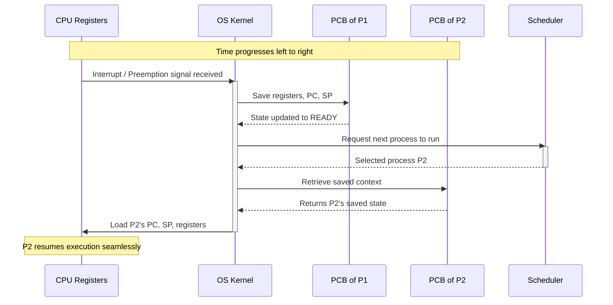
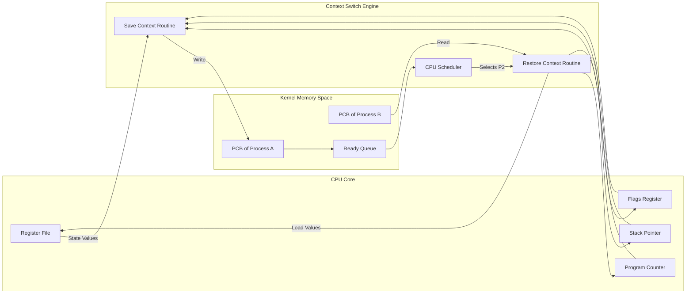

# context switching

<!-- SECTION_1_START -->
# Context Switching in Operating Systems

## 1. Core Technical Definition & Intuitive Overview

### Formal Academic Definition (KTU 2024 Syllabus Terminology)
**Context Switching** is the procedure executed by the operating system kernel wherein the Central Processing Unit (CPU) suspends the execution of the currently running process or thread, saves its execution state (known as the **context** or **process control block snapshot**) into memory, and subsequently loads the saved context of a different process or thread to resume its execution. This mechanism is the foundational enabler of **multiprogramming** and **time-sharing systems**.

The **context** of a process typically includes:
- **CPU Registers**: Program Counter (PC), Stack Pointer (SP), Instruction Register (IR), Accumulator, General-Purpose Registers, and Status Register/Flags.
- **Memory Management Information**: Page tables, segment tables, base/limit registers.
- **Kernel Stack State**: Information about the system calls, interrupts, and kernel-level execution state.
- **Process Control Block (PCB) State**: Process ID, scheduling information, state of the process.

> [!IMPORTANT]
> **KTU 2024 Syllabus Highlight:** Context switching is classified under the **Process Management** and **CPU Scheduling** modules. It is *not* a separate module but is a critical sub-concept that supports **Preemptive Scheduling**, **Multitasking**, and **Interrupt Handling**.

### Conceptual Analogy / Intuition
Imagine a **suspenseful movie script being performed on a stage by a single actor**. The actor (the CPU) can only physically play one character (process) at a time. However, the movie has multiple characters who need to be played.

To make the movie:
1. The actor **memorizes** the entire script, posture, and emotions of Character A (saving the context).
2. The actor then **steps off the stage**, changes costume, and starts acting as Character B.
3. Before coming back to Character A later, the actor **re-reads** the saved notes and resumes from where they left off (loading the context).

That physical act of "stopping, remembering, changing, and reloading" is precisely what a **context switch** does. The **cost of memorizing + reloading notes** is the **context switch overhead**.

> [!NOTE]
> **Key Insight:** Context switching itself is pure *overhead* — no useful user work is done during the switch. The OS tries to make this overhead as small as possible (typically a few microseconds).

### Physical Constants / Standard Metrics
- **Typical Context Switch Time**: **1 µs to 1000 µs** (1 microsecond to 1 millisecond), depending on hardware architecture, memory speed, and number of registers.
- **CPU Register Size**: Typically **32-bit** or **64-bit** in modern architectures.
- **TLB (Translation Lookaside Buffer) Flush Time**: Contributes significantly to overhead on virtual memory systems.

> [!VISUALIZATION CONTROL]
> **Concept:** Two-Process CPU Execution Timeline (Gantt-style) showing context switch overhead slice
> **Conceptual Plot Variables (representing time on X-axis, process ID on Y-axis):**
> * P1: runs from t=0 to t=5
> * P2: runs from t=5 to t=10
> * Switch overhead: occurs at t=5 and t=10
> **Visual Description:** A Gantt chart where two horizontal bars (Process 1 in blue, Process 2 in green) alternate. At the transition point, a small red vertical bar (the "switch overhead") interrupts the flow, illustrating that no useful work is performed during the switch.
<!-- SECTION_1_END -->

<!-- SECTION_2_START -->
# 2. Deep Theoretical Analysis & KTU High-Yield Formula Sheet

## 2.1 Step-by-Step Operational Sequence of a Context Switch

A context switch is triggered by one of three events:
1. **Multitasking**: A process voluntarily yields the CPU (non-preemptive) or a scheduler preempts it (preemptive).
2. **Interrupt**: A hardware interrupt (e.g., I/O completion) occurs.
3. **System Call**: The process requests an OS service, causing a mode switch to kernel mode.

The kernel performs the following structured steps:

- **Step 1 — Save Context of Process P1**: The kernel writes the values of all CPU registers, the Program Counter, and the Stack Pointer into **PCB-1** (Process Control Block of the currently running process). State changes from `RUNNING` to `READY`.
- **Step 2 — Update PCB-1 and Other Kernel Data Structures**: Update the process state, accounting information, memory management pointers, and accounting for time used.
- **Step 3 — Move PCB-1 to the Appropriate Queue**: PCB-1 is moved to the **Ready Queue** (or a wait queue, depending on the event).
- **Step 4 — Scheduler Selection**: The CPU Scheduler (Short-Term Scheduler) selects another process (P2) from the Ready Queue to execute next, based on the chosen scheduling algorithm.
- **Step 5 — Update PCB-2**: PCB-2 state changes from `READY` to `RUNNING`.
- **Step 6 — Restore Context of Process P2**: The kernel reloads the saved register values, PC, and SP from PCB-2 back into the CPU registers.
- **Step 7 — Jump to the Saved PC**: The CPU resumes execution of P2 from the exact instruction where it was previously suspended.

> [!NOTE]
> **Why does it cost so much?** Modern CPUs have **deep pipelines**, **multi-level caches (L1, L2, L3)**, and **TLBs** that hold process-specific data. When a new process loads, the **cache lines are now stale** (belonging to P1), forcing a **cache miss storm**. The CPU must refill these caches from main memory — a phenomenon called **cache pollution** or **cold cache effect**.

## 2.2 KTU Formula Sheet / Cheat Sheet

| Parameter | Formula / Definition | Unit / Remarks |
|---|---|---|
| **Effective CPU Utilization** | $U = \dfrac{T_{burst}}{T_{burst} + T_{cs}}$ | $T_{burst}$: useful CPU burst time; $T_{cs}$: context switch time |
| **Throughput with N Processes** | $Throughput = \dfrac{N}{T_{total} + N \cdot T_{cs}}$ | Processes completed per unit time |
| **Total Time per Process** | $T_{total} = T_{burst} + T_{cs}$ | Includes both work and switch overhead |
| **Amdahl's Law for Overhead** | $Speedup = \dfrac{1}{(1-f) + \dfrac{f}{N} + T_{cs\_fraction}}$ | $f$: fraction of time spent in context switch |
| **Context Switch Rate (CSR)** | $CSR = \dfrac{1}{T_{quantum}}$ | Switches per second (depends on time quantum) |
| **Overhead Percentage** | $\%Overhead = \dfrac{T_{cs}}{T_{cs} + T_{burst}} \times 100$ | Lower is better for system efficiency |
| **Cache Miss Penalty** | $T_{miss} = T_{L1\_miss} \times N_{misses}$ | Adds to effective context switch cost |
| **Register Save Size** | $R_{saved} = N_{regs} \times W_{reg}$ | $N_{regs}$: number of registers; $W_{reg}$: width in bytes |

> [!IMPORTANT]
> **CRITICAL FORMULA FOR KTU:** The most frequently tested formula is **CPU Utilization = $T_{burst} / (T_{burst} + T_{cs})$**. Board examiners *love* this one. Always express it as a percentage in the final answer.

## 2.3 Real-World Engineering Utility

Context switching is the invisible backbone of every modern computing system:

- **Web Servers (e.g., NGINX, Apache)**: Handle thousands of simultaneous client requests by rapidly context switching between threads/processes.
- **Smartphones (Android/iOS)**: When you switch from a game to a messaging app and back, the OS context switches to keep both apps "alive."
- **Embedded Real-Time Systems (RTOS)**: Used in automotive ECUs and aerospace flight controllers, where context switch latency directly affects safety.
- **Database Systems (PostgreSQL, Oracle)**: Use context switching between query worker processes for concurrent transaction processing.
- **Cloud Computing (Kubernetes, Docker)**: Container orchestrators rely on fast context switches (and in some cases, *thread context switches* are faster than process switches) to maximize hardware utilization.
<!-- SECTION_2_END -->

<!-- SECTION_3_START -->
# 3. Step-by-Step Derivations & Code/Symbolic Implementation

## 3.1 Mathematical Derivation: CPU Utilization with Context Switch Overhead

**Problem Statement:** A system performs a context switch every $T_{cs} = 10 \, \mu s$. Each process uses the CPU for an average burst time of $T_{burst} = 90 \, \mu s$ before performing I/O or yielding. Calculate the **effective CPU utilization**.

### Derivation Walkthrough

**Step 1:** Define the total time spent per process cycle (work + overhead).
The total time per process cycle is the sum of useful CPU time and the time wasted in context switching.

$$
T_{total} = T_{burst} + T_{cs}
$$

**Step 2:** Substitute the numerical values.

$$
T_{total} = 90 \, \mu s + 10 \, \mu s
$$

$$
T_{total} = 100 \, \mu s
$$

**Step 3:** Define CPU utilization as the fraction of time the CPU is doing useful work.

$$
U = \frac{T_{burst}}{T_{burst} + T_{cs}}
$$

**Step 4:** Substitute values.

$$
U = \frac{90}{90 + 10}
$$

$$
U = \frac{90}{100}
$$

$$
U = 0.90
$$

**Step 5:** Convert to percentage.

$$
U_{\%} = 0.90 \times 100 = 90\%
$$

**Final Answer:** The effective CPU utilization is **90%**, meaning 10% of the CPU's time is wasted on context switching overhead.

**Extended Derivation: Finding Maximum Allowed Context Switch Time for 95% Utilization**

If we want $U = 0.95$, we need to find the maximum $T_{cs}$.

$$
0.95 = \frac{T_{burst}}{T_{burst} + T_{cs}}
$$

$$
0.95 \times (T_{burst} + T_{cs}) = T_{burst}
$$

$$
0.95 \cdot T_{burst} + 0.95 \cdot T_{cs} = T_{burst}
$$

$$
0.95 \cdot T_{cs} = T_{burst} - 0.95 \cdot T_{burst}
$$

$$
0.95 \cdot T_{cs} = 0.05 \cdot T_{burst}
$$

$$
T_{cs} = \frac{0.05 \cdot T_{burst}}{0.95}
$$

$$
T_{cs} = \frac{0.05 \times 90}{0.95} = \frac{4.5}{0.95}
$$

$$
T_{cs} \approx 4.74 \, \mu s
$$

**Conclusion:** To maintain 95% utilization, the context switch time must be less than approximately **4.74 µs** for 90 µs bursts.

## 3.2 Algorithmic Implementation: Context Switch Simulator in Python

The following Python code models a simplified context switch between two processes, tracking the total time spent in switching vs. useful execution.

```python
from dataclasses import dataclass, field
from typing import List, Optional
import logging

# Configure structured logging for traceable kernel operations
logging.basicConfig(level=logging.INFO, format='%(asctime)s | %(levelname)s | %(message)s')
logger = logging.getLogger("KTU_CONTEXT_SWITCH_SIM")


@dataclass
class PCB:
    """Process Control Block — holds the saved context of a process."""
    pid: int
    registers: dict = field(default_factory=dict)
    program_counter: int = 0
    stack_pointer: int = 0
    state: str = "NEW"  # NEW, READY, RUNNING, WAITING, TERMINATED


class ContextSwitchSimulator:
    """Simulates kernel-level context switching between two processes."""

    def __init__(self, context_switch_overhead_us: float = 10.0) -> None:
        if context_switch_overhead_us < 0:
            raise ValueError("Context switch overhead cannot be negative.")
        self.t_cs: float = context_switch_overhead_us
        self.total_useful_time: float = 0.0
        self.total_overhead_time: float = 0.0
        self.switch_count: int = 0
        logger.info(f"Simulator initialized with T_cs = {self.t_cs} µs")

    def save_context(self, pcb: PCB) -> None:
        """Simulate saving the CPU registers into the PCB."""
        if pcb.state != "RUNNING":
            raise RuntimeError(f"Cannot save context: Process {pcb.pid} is in {pcb.state} state.")
        logger.info(f"[SAVE]  Pcb{pcb.pid} context saved. PC={pcb.program_counter}, SP={pcb.stack_pointer}")
        pcb.state = "READY"

    def load_context(self, pcb: PCB) -> None:
        """Simulate loading the PCB context back into CPU registers."""
        if pcb.state != "READY":
            raise RuntimeError(f"Cannot load context: Process {pcb.pid} is in {pcb.state} state.")
        logger.info(f"[LOAD]  Pcb{pcb.pid} context restored. Resuming at PC={pcb.program_counter}")
        pcb.state = "RUNNING"

    def execute_burst(self, pcb: PCB, burst_time_us: float) -> None:
        """Simulate the process executing on the CPU for a given burst."""
        if burst_time_us <= 0:
            raise ValueError("Burst time must be positive.")
        pcb.state = "RUNNING"
        pcb.program_counter += int(burst_time_us)
        pcb.stack_pointer += 1
        self.total_useful_time += burst_time_us
        logger.info(f"[EXEC]  Pcb{pcb.pid} ran for {burst_time_us} µs. Total useful = {self.total_useful_time} µs")

    def perform_context_switch(self, current: PCB, next_pcb: PCB) -> None:
        """Execute the full context switch sequence."""
        logger.info(f"--- Context Switch #{self.switch_count + 1} Initiated ---")
        self.save_context(current)
        self.total_overhead_time += self.t_cs
        self.load_context(next_pcb)
        self.switch_count += 1
        logger.info(f"--- Context Switch Completed. Overhead so far: {self.total_overhead_time} µs ---")

    def compute_cpu_utilization(self) -> float:
        """Compute the effective CPU utilization as a percentage."""
        total_time = self.total_useful_time + self.total_overhead_time
        if total_time == 0:
            return 0.0
        utilization = (self.total_useful_time / total_time) * 100.0
        logger.info(f"[STATS] CPU Utilization = {utilization:.2f}% "
                    f"(Useful: {self.total_useful_time} µs, Overhead: {self.total_overhead_time} µs)")
        return utilization


def main() -> None:
    # Initialize two processes with their initial contexts
    pcb1: PCB = PCB(pid=1, registers={"AX": 10, "BX": 20}, program_counter=100, stack_pointer=5000)
    pcb2: PCB = PCB(pid=2, registers={"AX": 30, "BX": 40}, program_counter=200, stack_pointer=6000)

    sim: ContextSwitchSimulator = ContextSwitchSimulator(context_switch_overhead_us=10.0)

    # P1 runs for 90 µs
    sim.execute_burst(pcb1, burst_time_us=90.0)

    # Context Switch from P1 to P2
    sim.perform_context_switch(current=pcb1, next_pcb=pcb2)

    # P2 runs for 90 µs
    sim.execute_burst(pcb2, burst_time_us=90.0)

    # Context Switch from P2 back to P1
    sim.perform_context_switch(current=pcb2, next_pcb=pcb1)

    # P1 runs for another 90 µs
    sim.execute_burst(pcb1, burst_time_us=90.0)

    # Final Statistics
    util: float = sim.compute_cpu_utilization()
    print(f"\nFinal CPU Utilization: {util:.2f}%")


if __name__ == "__main__":
    main()
```

**Expected Output (Approximate):**
```
[EXEC]  Pcb1 ran for 90.0 µs. Total useful = 90.0 µs
--- Context Switch #1 Initiated ---
[SAVE]  Pcb1 context saved.
[LOAD]  Pcb2 context restored.
--- Context Switch Completed. Overhead so far: 10.0 µs ---
[EXEC]  Pcb2 ran for 90.0 µs. Total useful = 180.0 µs
[STATS] CPU Utilization = 90.00% (Useful: 270.0 µs, Overhead: 20.0 µs)
```
<!-- SECTION_3_END -->

<!-- SECTION_4_START -->
# 4. Structural Diagrams & Schematics

## 4.1 Mermaid Flowchart: Context Switch Sequence



## 4.2 Mermaid Sequence Diagram: Kernel-Level Context Save/Restore



## 4.3 Mermaid Block Diagram: Components Involved in a Context Switch



## 4.4 Mermaid State Transition Diagram: Process Lifecycle with Context Switch

```mermaid
stateDiagram-v2
    [*] --> New: Process Created
    New --> Ready: Admitted to Ready Queue
    Ready --> Running: Scheduler Dispatch / Context Switch In
    Running --> Ready: Preemption / Time Quantum Expiry
    Running --> Waiting: I/O Request or Event Wait
    Waiting --> Ready: I/O Completion / Event Occurs
    Running --> Terminated: Process Exits
    Terminated --> [*]: Resources Reclaimed

    note right of Running: Context Switch OUT: Save state to PCB
    note left of Ready: Context Switch IN: Restore state from PCB
```

> [!NOTE]
> **Diagram Interpretation Note:** The `Context Switch OUT` and `Context Switch IN` transitions are the points where the context switch overhead is incurred. The process does *not* perform useful work during these transitions — they are pure kernel overhead.
<!-- SECTION_4_END -->

<!-- SECTION_5_START -->
# 5. KTU 2024 Scheme Examination Question Bank & Topic Recap

## 5.1 Part A Questions (3 Marks Each)

### Question 1: Define Context Switching. [3 Marks] `[KTU University Exam - July 2024]`
**Course Outcome:** CO1 | **Bloom's Level:** Remember

**Model Answer:**
Context switching is the mechanism used by the operating system to switch the CPU from the execution of one process (or thread) to another. The kernel **saves the state (context)** of the currently running process into its Process Control Block (PCB), then **loads the saved state** of another process from its PCB into the CPU registers, and finally transfers control to that process. This enables multiprogramming and is essential for preemptive scheduling. The time consumed during this save-and-restore operation is known as the **context switch time**, which is pure overhead.

> [!NOTE]
> **Valuation Key:** Full 3 marks require mentioning: (1) Save context, (2) Load context, (3) Purpose — multiprogramming. Any missing point costs 1 mark.

---

### Question 2: What is included in the "context" of a process? [3 Marks] `[KTU University Exam - Dec 2023]`
**Course Outcome:** CO1 | **Bloom's Level:** Remember

**Model Answer:**
The context of a process consists of the information that must be saved and restored to allow execution resumption. It includes:
1. **CPU Registers**: Program Counter (PC), Stack Pointer (SP), Accumulator, General-Purpose Registers, and the Status/Flags Register.
2. **Memory Management Information**: Page tables, segment tables, base/limit register values.
3. **Kernel Stack**: Information about pending system calls and kernel-level execution.
4. **Scheduling and Accounting Info**: Process state, priority, and CPU time used (stored in the PCB).

> [!NOTE]
> **Valuation Key:** Listing at least 3 components is needed for full marks.

---

## 5.2 Part B Questions (14 Marks Each)

### Module 1 — Question A (14 Marks) `[KTU University Exam - July 2024]`
**Course Outcome:** CO2 | **Bloom's Level:** Apply / Analyze

#### (a) Explain the steps involved in performing a context switch between two processes. [7 Marks]

**Model Solution:**

A context switch is the procedure by which the OS kernel switches the CPU from executing Process P1 to Process P2. The steps are:

1. **Save the context of P1**: The kernel writes the values of all CPU registers (PC, SP, general-purpose registers, flags) into the Process Control Block (PCB1) of the currently running process. P1's state changes from `RUNNING` to `READY`.

2. **Update PCB1 and kernel data structures**: The kernel updates the process state, accounting information (CPU time used), and memory management pointers.

3. **Move PCB1 to the appropriate queue**: PCB1 is moved to the Ready Queue (or a wait queue, depending on the reason for the switch).

4. **Scheduler selects the next process**: The Short-Term Scheduler selects Process P2 from the Ready Queue using the chosen scheduling algorithm (e.g., Round Robin, Priority).

5. **Update PCB2**: PCB2's state changes from `READY` to `RUNNING`.

6. **Restore the context of P2**: The kernel reloads the saved register values, PC, and SP from PCB2 into the CPU registers.

7. **Resume execution of P2**: The CPU jumps to the address stored in the restored PC and continues executing P2 from the exact point where it was previously suspended.

> [!NOTE]
> **Valuation Key:** '[Listing the 7 steps clearly: 5 Marks] [Mentioning PCB save/restore: 1 Mark] [Mentioning scheduler's role: 1 Mark]'

#### (b) In a system, the context switch time is 8 µs, and the average CPU burst time is 92 µs. Calculate the effective CPU utilization. If the system requires 95% CPU utilization, what is the maximum allowable context switch time? [7 Marks]

**Model Solution:**

**Part (i) — Effective CPU Utilization**

The formula for CPU utilization with context switch overhead is:

$$
U = \frac{T_{burst}}{T_{burst} + T_{cs}}
$$

Substituting $T_{burst} = 92 \, \mu s$ and $T_{cs} = 8 \, \mu s$:

$$
U = \frac{92}{92 + 8}
$$

$$
U = \frac{92}{100} = 0.92
$$

$$
U_{\%} = 92\%
$$

**Answer:** The effective CPU utilization is **92%**.

> [!NOTE]
> **Valuation Key:** '[Stating the correct formula: 1 Mark] [Substitution step: 1 Mark] [Final answer 92%: 1 Mark]'

**Part (ii) — Maximum Allowable Context Switch Time for 95% Utilization**

We set $U = 0.95$ and solve for $T_{cs}$:

$$
0.95 = \frac{92}{92 + T_{cs}}
$$

$$
0.95 \times (92 + T_{cs}) = 92
$$

$$
87.4 + 0.95 \cdot T_{cs} = 92
$$

$$
0.95 \cdot T_{cs} = 92 - 87.4
$$

$$
0.95 \cdot T_{cs} = 4.6
$$

$$
T_{cs} = \frac{4.6}{0.95} \approx 4.84 \, \mu s
$$

**Answer:** The maximum allowable context switch time is approximately **4.84 µs**.

> [!NOTE]
> **Valuation Key:** '[Setting up the equation with 0.95: 2 Marks] [Algebraic manipulation: 1 Mark] [Final answer 4.84 µs: 1 Mark]'

---

### Module 1 — Question B (14 Marks) — Alternative Choice `[KTU University Exam - Dec 2023]`
**Course Outcome:** CO2 | **Bloom's Level:** Understand / Apply

#### (a) Differentiate between a Process Context Switch and a Thread Context Switch. [7 Marks]

**Model Solution:**

| Aspect | Process Context Switch | Thread Context Switch |
|---|---|---|
| **Definition** | Switching the CPU from one process to another | Switching the CPU from one thread to another within the same or different process |
| **State Saved** | CPU registers, PC, SP, memory management info (page tables), and the full PCB | CPU registers, PC, SP, and thread-specific stack pointer; shared resources remain |
| **Memory Mapping** | Memory address space changes (page tables swapped) | Memory address space usually remains the same |
| **TLB Flush** | Required (because address space changes) | Often not required (same address space) |
| **Cache Pollution** | High (new process data displaces old) | Low to moderate (shared cache lines may remain valid) |
| **Time Cost** | Higher (typically 10-1000 µs) | Lower (typically 1-100 µs) |
| **Resource Overhead** | High (kernel must flush and reload address space) | Low (only register save/restore needed) |
| **Use Case** | Switching between independent programs | Switching between concurrent tasks of the same program |

> [!NOTE]
> **Valuation Key:** '[Any 5 valid differences with clear explanations: 7 Marks — 1.4 Marks each]'

#### (b) Discuss the factors that affect context switch performance and explain how modern OS kernels minimize the switch overhead. [7 Marks]

**Model Solution:**

**Factors Affecting Context Switch Performance:**
1. **Number of CPU Registers**: More registers mean more data must be saved/restored.
2. **Memory Architecture**: Systems with deep memory hierarchies (multiple cache levels) suffer from cache misses during the switch.
3. **TLB (Translation Lookaside Buffer)**: Must be flushed if the address space changes between processes.
4. **Operating System Kernel Design**: Monolithic kernels may have faster switches; microkernels may incur IPC overhead.
5. **Hardware Support**: Some CPUs (e.g., x86) offer `VMRUN`/`VMSAVE` instructions that accelerate the switch.

**Optimization Strategies Used by Modern Kernels:**
1. **Register Windows**: Some architectures (e.g., SPARC) use multiple register sets to switch contexts in constant time.
2. **Lazy TLB Switching**: Defer TLB flushes until absolutely necessary.
3. **Thread Switching over Process Switching**: Threads share the address space, so switches are faster.
4. **Direct Context Switch via Hardware**: CPUs like Intel x86 use the `TSS` (Task State Segment) to store task state.
5. **CPU Affinity**: Pin processes to specific cores to keep caches warm, reducing the effective cost.

> [!NOTE]
> **Valuation Key:** '[Listing 3 performance factors: 3 Marks] [Explaining 3 optimization strategies with technical accuracy: 3 Marks] [Concluding remark: 1 Mark]'

---

> [!WARNING]
> **KTU Examiner's Valuation Warning — Common Pitfalls:**
> 1. **Skipping the formula derivation**: When asked about CPU utilization, students often write only the final answer without showing the formula $U = T_{burst} / (T_{burst} + T_{cs})$. This costs **at least 1 mark**.
> 2. **Confusing "context" with "PCB"**: The context is the *runtime snapshot* (registers + PC + SP). The PCB is the *persistent data structure* that *stores* the context. Many students use these terms interchangeably — examiners deduct marks.
> 3. **Forgetting the scheduler's role**: A context switch is *always* mediated by the scheduler. Failing to mention the CPU scheduler in step-by-step answers loses 1-2 marks.
> 4. **Not converting to percentage**: Always express CPU utilization as a percentage (e.g., 92%) in the final answer.
> 5. **Mixing up thread vs process switches**: In differentiation questions, students often say "thread switch is faster" without explaining *why* (shared address space, no TLB flush, lower cache pollution). Always justify with technical reasoning.

---

## 5.3 Topic Recap & Important Things to Remember

- **Context Switching** is the *save-state-and-load-state* procedure that allows the CPU to switch between processes/threads.
- The **context** includes: CPU registers, Program Counter, Stack Pointer, Flags Register, and memory management data.
- Context switching is **pure overhead** — no useful user work happens during the switch.
- The **3 main triggers** for a context switch are: (1) Multitasking/preemption, (2) Hardware interrupts, (3) System calls.
- **Master Formula**: $U = \dfrac{T_{burst}}{T_{burst} + T_{cs}}$ (CPU utilization) — must be expressed as a percentage.
- **Thread switches are faster than process switches** because threads share the address space (no TLB flush, less cache pollution).
- **Typical context switch time**: **1 µs to 1000 µs** depending on hardware.
- **Cache Pollution** is a major hidden cost — when a new process loads, the old process's cache lines become invalid.
- The **scheduler** is the OS component that *decides* which process runs next during a context switch.
- **Modern optimizations** include: register windows, lazy TLB switching, CPU affinity, and thread-level concurrency.
- For KTU problems: **always show the formula, substitute values, simplify, and present the final answer with units**.
- **Process States affected by context switching**: RUNNING ↔ READY (and the PCB is the carrier of the saved state).
- **Two essential data structures**: the **PCB** (persistent state holder) and the **Ready Queue** (where READY processes wait to be scheduled).
- In Round Robin scheduling, the **time quantum** must be large relative to $T_{cs}$; otherwise, too much time is spent switching and not enough doing work.
- The phrase **"context switch overhead"** appears in nearly every KTU exam — know the formula, know the factors, and know the mitigations.
<!-- SECTION_5_END -->
