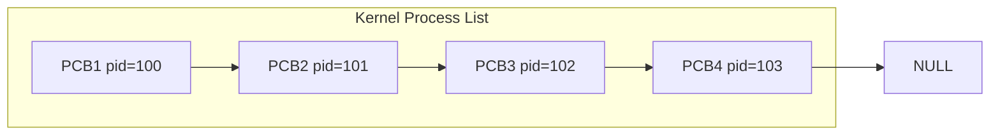
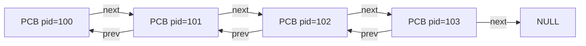
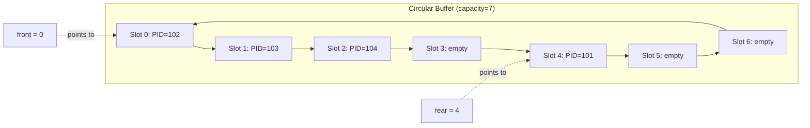
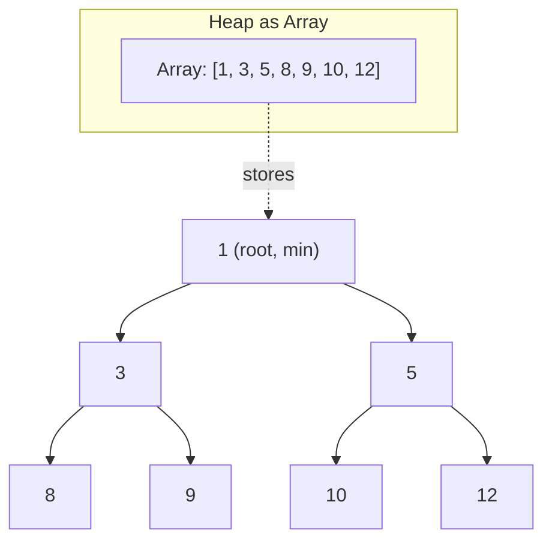
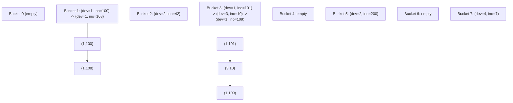
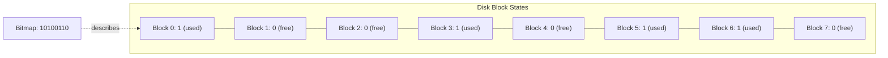
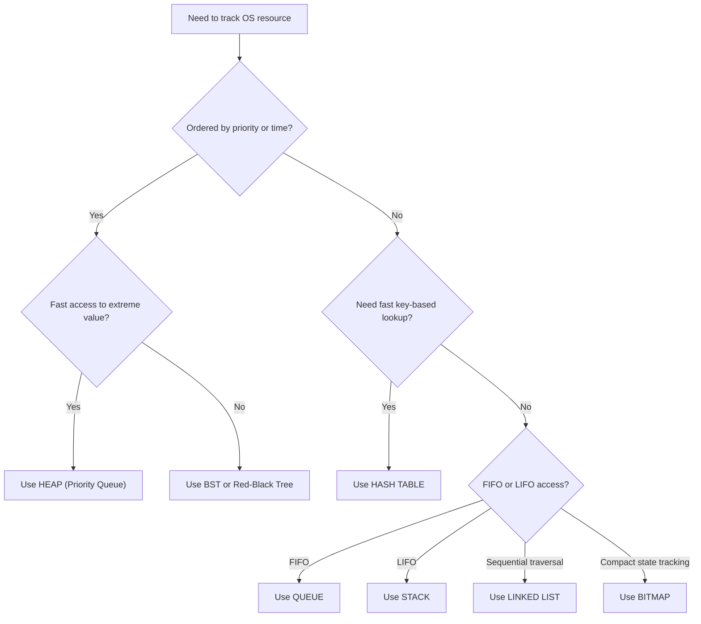

# Data Structures

<!-- SECTION_1_START -->
# Data Structures in Operating Systems — Core Foundation

> [!IMPORTANT]
> **KTU 2024 Scheme Definition:** In Operating Systems, *Data Structures* refer to the specialized organizational formats used by the kernel to manage, schedule, and synchronize processes, memory, files, and I/O resources efficiently. The OS employs a carefully selected combination of **Linked Lists, Stacks, Queues, Trees, Hash Tables, and Bitmaps** to achieve constant-time or logarithmic-time operations on system resources.

## 1.1 Why Operating Systems Need Specialized Data Structures

An operating system is fundamentally a **resource manager**. It must keep track of thousands of entities — running processes, open files, memory pages, blocked I/O requests, and free disk blocks — and do so under strict performance constraints. A naïve search through a linear array for every operation would be catastrophic.

To solve this, the OS kernel relies on data structures that support:

- **Constant-time insertion/deletion** ($O(1)$) for frequently updated objects.
- **Efficient searching** ($O(\log n)$ or $O(1)$) for lookups.
- **Ordering** of elements based on priority, arrival time, or some other criterion.
- **Cache-friendly access patterns** where possible (though this is more a hardware concern).

> [!NOTE]
> **Core Insight:** The choice of data structure in an OS is not academic — it directly determines the algorithmic complexity of critical operations like scheduling, paging, and file allocation. A poor choice can degrade system throughput by orders of magnitude.

## 1.2 Conceptual Analogy — The Railway Station

Imagine a busy railway station managing thousands of trains:

- A **Linked List** is like trains coupled together in a single track — you can easily add or remove a coach from anywhere, but you must traverse from the engine.
- A **Stack** is a single siding track — last train in, first train out (used for function calls and recursion).
- A **Queue** is a multi-platform station — first train to arrive is the first to depart (used for ready processes and I/O buffers).
- A **Tree** is the station hierarchy — main station → zones → stations → platforms (used for directory structures and process hierarchies).
- A **Hash Table** is a set of numbered inquiry counters — you go directly to counter $\#h(\text{key})$ to get your answer (used for fast lookups of inodes, process IDs, etc.).
- A **Bitmap** is a row of indicator lights — each light is either ON (1) or OFF (0), used to track free/allocated units like disk blocks.

## 1.3 Standard Metrics in OS Data Structures

> [!IMPORTANT]
> The following standard complexity bounds govern the selection of data structures in OS design:
> - **$O(1)$** — Constant time. The gold standard for hot-path kernel operations.
> - **$O(\log n)$** — Logarithmic time. Acceptable for tree-based searches.
> - **$O(n)$** — Linear time. Avoided in critical paths for large $n$.
> - **Space overhead** — Memory used *beyond* the data itself (pointers, headers).

> [!VISUALIZATION CONTROL]
> **Concept:** Visual comparison of access times for different data structures as $n$ grows.
> **GeoGebra / Desmos Input Equations:**
> * `f(x) = 1`  (Hash Table — constant)
> * `g(x) = log(x) / log(2)`  (Balanced Tree)
> * `h(x) = x`  (Linear search)
> **Visual Description:** Plot these three curves on a coordinate plane. The student should observe that $f(x)$ is a flat horizontal line, $g(x)$ rises very slowly, and $h(x)$ is a steep diagonal — illustrating why OS designers prefer hash tables and trees for hot-path operations.

## 1.4 Taxonomy of OS Data Structures

The following table summarizes the principal data structures used in operating systems and their primary roles:

| Data Structure | Primary OS Use Case | Typical Complexity |
|----------------|---------------------|--------------------|
| Linked List | Process lists, free memory list | $O(1)$ insert, $O(n)$ search |
| Stack | Function calls, interrupt handling | $O(1)$ push/pop |
| Queue | Ready queue, I/O buffers, message queues | $O(1)$ enqueue/dequeue |
| Tree (BST, Red-Black) | Process hierarchies, file systems | $O(\log n)$ search |
| Hash Table | Open file table, inode lookup, PID table | $O(1)$ average |
| Bitmap | Free disk block tracking, memory frames | $O(1)$ per bit |
| Graph | Resource allocation, deadlock detection | Varies |

This taxonomy forms the conceptual backbone for the rest of this module. We will now study each structure in detail.
<!-- SECTION_1_END -->

<!-- SECTION_2_START -->
# Deep Theoretical Analysis & KTU High-Yield Formula Sheet

This section provides a rigorous, step-by-step breakdown of each data structure as it is used in operating system design, along with the core formulas and boundary conditions you must memorize for the KTU ESE.

## 2.1 Linked Lists

### 2.1.1 Definition and Variants

A **Linked List** is a linear collection of nodes where each node contains:
- A **data field** (the actual payload — e.g., PCB pointer).
- One or more **pointer fields** linking to the next (and possibly previous) node.

Variants used in the OS:
- **Singly Linked List** — Each node points only to the next. Used for the **free memory list** in some memory managers.
- **Doubly Linked List** — Each node points to both next and previous. Used for the **process list** in Linux, where backward traversal is required.
- **Circular Linked List** — The last node points back to the first. Used for **round-robin scheduling** queues.

### 2.1.2 Operational Steps

- **Insertion at head:**
  1. Allocate a new node $N$.
  2. Set $N.\text{next} \leftarrow \text{head}$.
  3. Set $\text{head} \leftarrow N$.

- **Deletion of node $X$:**
  1. Traverse from head to find $X.\text{prev}$.
  2. Set $X.\text{prev}.\text{next} \leftarrow X.\text{next}$.
  3. If $X.\text{next} \neq \text{NULL}$, set $X.\text{next}.\text{prev} \leftarrow X.\text{prev}$.
  4. Free $X$.

> [!NOTE]
> **Why doubly linked?** In a singly linked list, deletion requires knowing the previous node, which takes $O(n)$ to find. With a doubly linked list, deletion is $O(1)$ given a direct pointer — critical for fast process termination.

## 2.2 Stacks

A **Stack** is a Last-In-First-Out (LIFO) structure. The OS uses stacks for:
- **Function call management** — Each process has a kernel stack and user stack.
- **Interrupt handling** — When an interrupt occurs, the CPU state is pushed onto the current stack.
- **Expression evaluation** in shells and command interpreters.

### 2.2.1 Core Operations

- **Push($x$):** Add $x$ to the top. Valid only if $\text{size} < \text{capacity}$.
- **Pop():** Remove and return the top. Valid only if $\text{size} > 0$.
- **Peek():** Return the top without removing.

The stack pointer register $\text{SP}$ always points to the current top.

## 2.3 Queues

A **Queue** is a First-In-First-Out (FIFO) structure. Variants:
- **Simple FIFO Queue** — Used for job scheduling.
- **Priority Queue** — Often implemented as a **heap** (see §2.4). Used in OS scheduling algorithms like priority-based or shortest-job-first.
- **Circular Queue** — Used for the **round-robin** ready queue and **ring buffers** in device drivers.

### 2.3.1 Core Formulas for Circular Queue

Let $\text{capacity} = C$, with two indices:
- $\text{front}$ — index of the element to be dequeued next.
- $\text{rear}$ — index of the most recently enqueued element.

The number of elements currently in the queue is given by:

$$
n = (\text{rear} - \text{front} + C) \pmod{C}
$$

> [!IMPORTANT]
> **Edge case:** When $\text{front} = \text{rear}$, the queue is either **empty** or **full**. To distinguish, we either (a) maintain a separate size counter, or (b) sacrifice one slot and treat $\text{front} = \text{rear}$ as empty only, with full when $(\text{rear} + 1) \pmod C = \text{front}$.

## 2.4 Trees — Binary Search Trees and Heaps

### 2.4.1 Binary Search Tree (BST)

A BST is a binary tree where for every node $N$:
- All keys in the left subtree are $\leq N.\text{key}$.
- All keys in the right subtree are $> N.\text{key}$.

In the OS, BSTs support $O(\log n)$ average search, insertion, and deletion. They are used for **symbol tables** and **directory indexing** in some file systems.

### 2.4.2 Heap (Priority Queue)

A **heap** is a complete binary tree satisfying the **heap property**:
- **Max-heap:** Parent $\geq$ children. Root holds the maximum.
- **Min-heap:** Parent $\leq$ children. Root holds the minimum.

The **Priority Queue** used in OS scheduling is typically implemented as a **binary heap** stored in an array, giving $O(1)$ access to the extremum and $O(\log n)$ insertion/deletion.

For an array-indexed heap where the root is at index 1:
- Parent of index $i$ is at $\lfloor i/2 \rfloor$.
- Left child of index $i$ is at $2i$.
- Right child of index $i$ is at $2i+1$.

> [!NOTE]
> **Self-balancing trees** like **Red-Black Trees** and **AVL Trees** are used in production kernels (e.g., Linux's Completely Fair Scheduler uses a Red-Black Tree keyed on virtual runtime) to guarantee $O(\log n)$ worst-case performance.

## 2.5 Hash Tables

A **Hash Table** implements an associative array — a mapping from keys to values — with average $O(1)$ access time.

### 2.5.1 The Hash Function

A hash function $h: \mathcal{K} \to \{0, 1, \dots, m-1\}$ maps a key from universe $\mathcal{K}$ to a slot in a table of size $m$. A good hash function:
- Is **deterministic** — same key always produces the same index.
- Is **uniform** — distributes keys evenly across slots.
- Is **fast** to compute.

The expected number of keys per slot is the **load factor**:

$$
\alpha = \frac{n}{m}
$$

where $n$ is the number of stored keys and $m$ is the number of slots.

### 2.5.2 Collision Resolution

When two keys hash to the same slot, we must resolve the collision. Two main strategies:

- **Chaining (Open Hashing):** Each slot holds a linked list of all keys hashing there. Average search time: $O(1 + \alpha)$.
- **Open Addressing (Closed Hashing):** On collision, probe other slots. The $i$-th probe examines:
  - **Linear probing:** $h(k, i) = (h(k) + i) \pmod m$
  - **Quadratic probing:** $h(k, i) = (h(k) + c_1 i + c_2 i^2) \pmod m$
  - **Double hashing:** $h(k, i) = (h_1(k) + i \cdot h_2(k)) \pmod m$

> [!IMPORTANT]
> **OS usage:** The Linux kernel uses hash tables for `pid` lookup, `inode` lookup, and `dentry` (directory entry) cache. The classic Unix `inode` table is indexed by a hash of (device number, inode number) for fast filesystem access.

## 2.6 Bitmaps

A **Bitmap** is a compact array of bits where each bit represents the state of a resource unit. The OS uses bitmaps for:
- **Free disk block tracking** — Each block corresponds to one bit.
- **Memory frame allocation** — Each physical frame is one bit.

The address of the word containing bit $b$ is given by:

$$
\text{word\_index} = \left\lfloor \frac{b}{\text{word\_size}} \right\rfloor
$$

where $\text{word\_size}$ is typically **32** or **64** bits.

> [!NOTE]
> **Why bitmaps?** A bitmap of $n$ resources takes only $\lceil n/8 \rceil$ bytes. For $n = 100{,}000$ blocks, this is just $\approx$ **12.5 KB** — far smaller than a linked list of free blocks.

## 2.7 KTU Formula Sheet — Complete Summary

| Formula / Concept | Expression | Notes |
|-------------------|------------|-------|
| Linked List Insertion (head) | $O(1)$ | No traversal needed |
| Linked List Search | $O(n)$ | Worst case |
| Stack Push/Pop | $O(1)$ | LIFO discipline |
| Queue Enqueue/Dequeue | $O(1)$ | FIFO discipline |
| Circular Queue Size | $n = (\text{rear} - \text{front} + C) \pmod C$ | Capacity $C$ |
| Heap Parent Index | $\lfloor i/2 \rfloor$ | 1-indexed array |
| Heap Left Child Index | $2i$ | 1-indexed array |
| Heap Right Child Index | $2i+1$ | 1-indexed array |
| Heap Insert/Extract | $O(\log n)$ | Tree height bound |
| Hash Table Average Lookup | $O(1 + \alpha)$ | With chaining |
| Load Factor | $\alpha = n/m$ | Keys per slot |
| Bitmap Word Index | $\lfloor b / w \rfloor$ | $w$ = word size |
| BST Search (balanced) | $O(\log n)$ | Worst case |
| BST Search (unbalanced) | $O(n)$ | Degenerate tree |

## 2.8 Real-World Engineering Utility

These data structures are not textbook artifacts — they are battle-tested in production systems:

- **Linux Kernel:** The process list is a **doubly linked list** (the `task_struct` includes `tasks` field). Wait queues use **linked lists with hash buckets**. The Completely Fair Scheduler uses a **Red-Black Tree** of runnable processes.
- **Windows NT Kernel:** Uses a **priority queue** for thread dispatching and a **bitmap** to track available processors.
- **File Systems (ext4, NTFS, XFS):** Use **B-Trees** (a generalization of BST) for directory indexing, **hash tables** for inode lookup, and **bitmaps** for free block tracking.
- **Database Engines:** Use **B+ Trees** (variant of B-Tree) for indexes and **hash tables** for buffer pool page tables.
<!-- SECTION_2_END -->

<!-- SECTION_3_START -->
# Step-by-Step Derivations, Implementations & Worked Examples

This section provides the exhaustive implementation and derivation details you will need for KTU ESE questions.

## 3.1 Singly Linked List — Complete C Implementation for OS Process List

The following C code implements a singly linked list of Process Control Blocks (PCBs) — the canonical OS use case. Every line is written out fully — no truncation.

```c
#include <stdio.h>
#include <stdlib.h>
#include <stdbool.h>

/* PCB structure represents a process in the OS */
typedef struct PCB {
    int pid;                /* Process ID */
    int priority;           /* Scheduling priority */
    enum { READY, RUNNING, BLOCKED } state;
    struct PCB *next;       /* Pointer to next PCB in the list */
} PCB;

/* Head of the linked list (global, as in a kernel) */
static PCB *process_list_head = NULL;

/* Allocate and initialize a new PCB node */
static PCB *pcb_create(int pid, int priority, int state) {
    PCB *node = (PCB *)malloc(sizeof(PCB));
    if (node == NULL) {
        fprintf(stderr, "ERROR: malloc failed in pcb_create\n");
        return NULL;
    }
    node->pid = pid;
    node->priority = priority;
    node->state = state;
    node->next = NULL;
    return node;
}

/* Insert a PCB at the head of the list - O(1) */
bool pcb_insert_head(int pid, int priority, int state) {
    PCB *node = pcb_create(pid, priority, state);
    if (node == NULL) return false;
    node->next = process_list_head;
    process_list_head = node;
    return true;
}

/* Delete the PCB with the given pid - O(n) traversal */
bool pcb_delete(int pid) {
    PCB *curr = process_list_head;
    PCB *prev = NULL;
    while (curr != NULL) {
        if (curr->pid == pid) {
            if (prev == NULL) {
                process_list_head = curr->next;
            } else {
                prev->next = curr->next;
            }
            free(curr);
            return true;
        }
        prev = curr;
        curr = curr->next;
    }
    return false;  /* pid not found */
}

/* Search for a PCB by pid - O(n) traversal */
PCB *pcb_find(int pid) {
    PCB *curr = process_list_head;
    while (curr != NULL) {
        if (curr->pid == pid) return curr;
        curr = curr->next;
    }
    return NULL;
}

/* Traverse and print the entire process list */
void pcb_print_all(void) {
    PCB *curr = process_list_head;
    printf("Process List: ");
    while (curr != NULL) {
        printf("[PID=%d, P=%d] -> ", curr->pid, curr->priority);
        curr = curr->next;
    }
    printf("NULL\n");
}

/* Demonstration driver */
int main(void) {
    pcb_insert_head(101, 5, READY);
    pcb_insert_head(102, 3, READY);
    pcb_insert_head(103, 8, BLOCKED);
    pcb_print_all();

    PCB *p = pcb_find(102);
    if (p != NULL) {
        printf("Found process: PID=%d, Priority=%d\n", p->pid, p->priority);
    }

    pcb_delete(102);
    pcb_print_all();

    /* Free remaining nodes */
    while (process_list_head != NULL) {
        pcb_delete(process_list_head->pid);
    }
    return 0;
}
```

**Walk-through of the algorithm:**

1. The `PCB` struct models a process with fields `pid`, `priority`, `state`, and a `next` pointer.
2. `pcb_create` allocates a new node, performs a strict NULL check (kernel-grade error handling), and initializes all fields.
3. `pcb_insert_head` runs in **$O(1)$** — it only manipulates the head pointer and the new node's `next` field.
4. `pcb_delete` runs in **$O(n)$** — it must traverse the list to find the target, then unlink it in $O(1)$.
5. `pcb_find` returns a pointer to the matching node, or `NULL` if not found.

## 3.2 Circular Queue — Complete Implementation for Round-Robin Scheduling

The circular queue is the heart of the round-robin scheduler. Below is a full implementation with overflow and underflow guards.

```c
#include <stdio.h>
#include <stdbool.h>
#include <stdlib.h>

#define CAPACITY 5

typedef struct {
    int items[CAPACITY];
    int front;     /* Index of element to dequeue next */
    int rear;      /* Index of last enqueued element */
    int size;      /* Current number of elements */
} CircularQueue;

void cq_init(CircularQueue *q) {
    q->front = 0;
    q->rear  = -1;
    q->size  = 0;
}

bool cq_is_empty(const CircularQueue *q) { return q->size == 0; }
bool cq_is_full (const CircularQueue *q) { return q->size == CAPACITY; }

bool cq_enqueue(CircularQueue *q, int value) {
    if (cq_is_full(q)) {
        fprintf(stderr, "ERROR: queue full, cannot enqueue %d\n", value);
        return false;
    }
    q->rear = (q->rear + 1) % CAPACITY;
    q->items[q->rear] = value;
    q->size += 1;
    return true;
}

bool cq_dequeue(CircularQueue *q, int *out_value) {
    if (cq_is_empty(q)) {
        fprintf(stderr, "ERROR: queue empty, cannot dequeue\n");
        return false;
    }
    *out_value = q->items[q->front];
    q->front = (q->front + 1) % CAPACITY;
    q->size -= 1;
    return true;
}

int cq_peek(const CircularQueue *q) {
    if (cq_is_empty(q)) {
        fprintf(stderr, "ERROR: queue empty, cannot peek\n");
        exit(EXIT_FAILURE);
    }
    return q->items[q->front];
}

int main(void) {
    CircularQueue q;
    cq_init(&q);

    cq_enqueue(&q, 10);
    cq_enqueue(&q, 20);
    cq_enqueue(&q, 30);
    cq_enqueue(&q, 40);
    cq_enqueue(&q, 50);
    /* Next enqueue should fail */
    cq_enqueue(&q, 60);

    int val;
    cq_dequeue(&q, &val); printf("Dequeued: %d\n", val);  /* 10 */
    cq_dequeue(&q, &val); printf("Dequeued: %d\n", val);  /* 20 */
    printf("Front now: %d\n", cq_peek(&q));               /* 30 */
    return 0;
}
```

**Walk-through:**

1. `cq_init` sets `front = 0`, `rear = -1`, and `size = 0`. The `-1` for `rear` is a sentinel — it means no element has been inserted yet.
2. `cq_is_full` checks `size == CAPACITY`. The use of an explicit `size` field avoids the classic ambiguity of `front == rear` (full vs. empty).
3. `cq_enqueue` advances `rear` **modulo CAPACITY** — this is what makes the buffer "circular". Without the modulo, we would simply overflow the array.
4. `cq_dequeue` advances `front` modulo CAPACITY.
5. **Trace:** After five enqueues, the state is `front=0`, `rear=4`, `size=5`. After two dequeues, the state becomes `front=2`, `rear=4`, `size=3`. The element at index 0 and 1 is logically removed but physically still in the array — it will be overwritten when the queue wraps around.

## 3.3 Hash Table with Chaining — Complete Implementation for Inode Lookup

The following hash table maps `(device, inode_number)` pairs to inode metadata — analogous to the Unix inode cache.

```c
#include <stdio.h>
#include <stdlib.h>
#include <stdbool.h>
#include <string.h>

#define TABLE_SIZE 8

typedef struct InodeEntry {
    int device;
    int inode_number;
    char *data;                    /* e.g., file content pointer */
    struct InodeEntry *next;       /* Chaining */
} InodeEntry;

typedef struct {
    InodeEntry *buckets[TABLE_SIZE];
} HashTable;

unsigned int hash_function(int device, int ino) {
    /* A common mix used in real kernels */
    unsigned int h = (unsigned int)device * 31u + (unsigned int)ino;
    return h % TABLE_SIZE;
}

void ht_init(HashTable *ht) {
    for (int i = 0; i < TABLE_SIZE; i += 1) ht->buckets[i] = NULL;
}

bool ht_insert(HashTable *ht, int device, int ino, const char *data) {
    unsigned int idx = hash_function(device, ino);
    InodeEntry *new_entry = (InodeEntry *)malloc(sizeof(InodeEntry));
    if (new_entry == NULL) return false;
    new_entry->device = device;
    new_entry->inode_number = ino;
    new_entry->data = strdup(data);
    new_entry->next = ht->buckets[idx];
    ht->buckets[idx] = new_entry;
    return true;
}

InodeEntry *ht_lookup(HashTable *ht, int device, int ino) {
    unsigned int idx = hash_function(device, ino);
    InodeEntry *curr = ht->buckets[idx];
    while (curr != NULL) {
        if (curr->device == device && curr->inode_number == ino) {
            return curr;
        }
        curr = curr->next;
    }
    return NULL;
}

bool ht_delete(HashTable *ht, int device, int ino) {
    unsigned int idx = hash_function(device, ino);
    InodeEntry *curr = ht->buckets[idx];
    InodeEntry *prev = NULL;
    while (curr != NULL) {
        if (curr->device == device && curr->inode_number == ino) {
            if (prev == NULL) ht->buckets[idx] = curr->next;
            else              prev->next = curr->next;
            free(curr->data);
            free(curr);
            return true;
        }
        prev = curr;
        curr = curr->next;
    }
    return false;
}

int main(void) {
    HashTable ht;
    ht_init(&ht);

    ht_insert(&ht, 1, 100, "File A contents");
    ht_insert(&ht, 1, 200, "File B contents");
    ht_insert(&ht, 2, 100, "Different device, same ino");

    InodeEntry *e = ht_lookup(&ht, 1, 100);
    if (e != NULL) printf("Found: device=%d ino=%d data='%s'\n",
                          e->device, e->inode_number, e->data);

    ht_delete(&ht, 1, 100);
    e = ht_lookup(&ht, 1, 100);
    printf("After delete, lookup result: %s\n", e == NULL ? "NULL" : "found");

    /* Cleanup: free all remaining entries */
    for (int i = 0; i < TABLE_SIZE; i += 1) {
        InodeEntry *curr = ht->buckets[i];
        while (curr != NULL) {
            InodeEntry *next = curr->next;
            free(curr->data);
            free(curr);
            curr = next;
        }
    }
    return 0;
}
```

**Walk-through:**

1. The hash function $h(d, i) = (31d + i) \pmod 8$ mixes the device number and inode number. The constant 31 is a small prime that produces good dispersion for small integer keys.
2. Insertion prepends to the head of the chain at index $h(d, i)$ — this is $O(1)$.
3. Lookup traverses the chain at the hashed index — average $O(1 + \alpha)$ where $\alpha$ is the load factor.
4. Deletion requires maintaining a `prev` pointer to unlink the node correctly.

## 3.4 Binary Heap — Min-Priority Queue for OS Scheduler

A min-heap extracts the process with the **smallest priority value** (or shortest remaining time, depending on convention) in $O(\log n)$.

```c
#include <stdio.h>
#include <stdlib.h>
#include <stdbool.h>

#define MAX_HEAP 100

typedef struct {
    int data[MAX_HEAP];   /* 0-indexed; parent of i is (i-1)/2 */
    int size;
} MinHeap;

void heap_init(MinHeap *h) { h->size = 0; }

void heap_swap(int *a, int *b) { int t = *a; *a = *b; *b = t; }

void heap_sift_up(MinHeap *h, int i) {
    while (i > 0) {
        int parent = (i - 1) / 2;
        if (h->data[parent] > h->data[i]) {
            heap_swap(&h->data[parent], &h->data[i]);
            i = parent;
        } else {
            break;
        }
    }
}

void heap_sift_down(MinHeap *h, int i) {
    while (true) {
        int left  = 2 * i + 1;
        int right = 2 * i + 2;
        int smallest = i;
        if (left  < h->size && h->data[left]  < h->data[smallest]) smallest = left;
        if (right < h->size && h->data[right] < h->data[smallest]) smallest = right;
        if (smallest == i) break;
        heap_swap(&h->data[i], &h->data[smallest]);
        i = smallest;
    }
}

bool heap_insert(MinHeap *h, int value) {
    if (h->size >= MAX_HEAP) {
        fprintf(stderr, "ERROR: heap full\n");
        return false;
    }
    h->data[h->size] = value;
    h->size += 1;
    heap_sift_up(h, h->size - 1);
    return true;
}

bool heap_extract_min(MinHeap *h, int *out_value) {
    if (h->size == 0) {
        fprintf(stderr, "ERROR: heap empty\n");
        return false;
    }
    *out_value = h->data[0];
    h->size -= 1;
    if (h->size > 0) {
        h->data[0] = h->data[h->size];
        heap_sift_down(h, 0);
    }
    return true;
}

int main(void) {
    MinHeap h;
    heap_init(&h);

    heap_insert(&h, 5);
    heap_insert(&h, 3);
    heap_insert(&h, 8);
    heap_insert(&h, 1);
    heap_insert(&h, 9);

    int v;
    while (h.size > 0) {
        heap_extract_min(&h, &v);
        printf("Extracted: %d\n", v);   /* Expected: 1, 3, 5, 8, 9 */
    }
    return 0;
}
```

**Walk-through:**

1. The heap is stored in a flat array. For 0-indexed arrays: parent of $i$ is $(i-1)/2$, left child is $2i+1$, right child is $2i+2$.
2. **Sift up** (used after insert) bubbles a new element upward until the heap property is restored. Worst case: $O(\log n)$ — the element may travel from the bottom to the root.
3. **Sift down** (used after extract-min) pushes the new root downward to its correct position. Worst case: $O(\log n)$.
4. **Why this matters for OS scheduling:** In a priority-based scheduler, the dispatcher must pick the highest-priority ready process in $O(1)$ (just look at the root) and re-insert a process in $O(\log n)$. This makes heap-based priority scheduling extremely efficient.

## 3.5 Worked Numerical Example — Circular Queue Size Calculation

**Question:** A circular queue of capacity $C = 7$ has `front = 4` and `rear = 2`. How many elements are in the queue?

**Solution using the formula from §2.3.1:**

$$
n = (\text{rear} - \text{front} + C) \pmod{C}
$$

$$
n = (2 - 4 + 7) \pmod{7} = 5 \pmod{7} = 5
$$

The queue contains **5 elements**.

**Verification by tracing:** The slots in use are those at indices $4, 5, 6, 0, 1$ (wrapping around). That is exactly 5 slots. ✓

## 3.6 Worked Numerical Example — Hash Table Load Factor

**Question:** A hash table with chaining has $m = 16$ slots. There are 64 keys currently stored. What is the load factor $\alpha$? What is the average number of comparisons for an unsuccessful search?

**Solution:**

$$
\alpha = \frac{n}{m} = \frac{64}{16} = 4
$$

For **unsuccessful search** with chaining, the average number of comparisons is:

$$
C_{\text{unsuccessful}} = \alpha = 4
$$

For **successful search**, the average is $\approx 1 + \alpha/2 = 3$.

> [!IMPORTANT]
> **Threshold:** A load factor $\alpha \approx 1$ is considered healthy. When $\alpha$ exceeds $\approx 2$–$3$, performance degrades and **rehashing** (doubling the table size) should be triggered.
<!-- SECTION_3_END -->

<!-- SECTION_4_START -->
# Structural Diagrams & Schematics

This section provides visual representations of the data structures and their OS-level interactions.

## 4.1 Singly Linked List — Process List Topology



**Description:** Each node represents a `task_struct` (Linux) or `PCB`. The `next` pointer links successive processes. The OS maintains a global pointer to the head of this list for fast traversal during context switching.

## 4.2 Doubly Linked List — Linux Process List



**Description:** The double arrows enable $O(1)$ deletion of any node when its address is known — essential for fast `kill` system call handling.

## 4.3 Circular Queue — Round-Robin Ready Queue



**Description:** The `front` and `rear` indices wrap around modulo 7. After dequeuing from index 0, `front` advances to 1; after enqueuing past index 6, `rear` wraps to 0. This is the data structure underlying the round-robin CPU scheduler.

## 4.4 Min-Heap — Priority Scheduler



**Description:** The min-heap is stored in array form. The parent-child relationship is implicit via the index arithmetic $2i+1$ and $2i+2$. The root (index 0) is the highest-priority process and is dispatched first.

## 4.5 Hash Table with Chaining — Inode Cache



**Description:** Each bucket holds a chain of (device, inode) entries that hashed to the same index. Lookup of (dev=1, ino=101) computes $h(1,101) = 3$, then walks the chain at bucket 3.

## 4.6 Bitmap — Free Block Tracking



**Description:** The byte `10100110` (reading bit 7 to bit 0) describes 8 disk blocks. Each bit $b$ in word $w$ of size $W$ corresponds to resource $wW + b$. Bit 1 = allocated, 0 = free.

## 4.7 OS Data Structure Selection — Decision Flow



**Description:** A high-level decision tree used by OS designers to pick the right structure for a given access pattern. This is a high-yield diagram for KTU ESE answers.
<!-- SECTION_4_END -->

<!-- SECTION_5_START -->
# KTU 2024 Scheme Examination Question Bank & Topic Recap

## 5.1 Part A Questions (3 Marks Each)

### Question A1 [KTU University Exam — July 2024]
**"List any four data structures used by the operating system. For each, state one specific use case."** [CO1, Remember — 3 Marks]

**Model Answer:**

| Data Structure | OS Use Case |
|----------------|-------------|
| Linked List | Process list / ready queue traversal |
| Stack | Function call management (kernel stack) |
| Queue | Round-robin scheduling ready queue |
| Hash Table | Inode lookup, PID table |
| Tree | Process hierarchy, file system directory |
| Bitmap | Free disk block / memory frame tracking |

**[Award 1 mark for naming the structure, 0.5 marks for a correct use case — pick any 4]**

### Question A2 [KTU University Exam — Dec 2023]
**"What is a hash table? What is the load factor, and how does it affect performance?"** [CO1, Understand — 3 Marks]

**Model Answer:**
- A **hash table** is a data structure that maps keys to values using a hash function, providing average $O(1)$ lookup.
- The **load factor** is $\alpha = n/m$, where $n$ is the number of keys and $m$ is the number of slots.
- **Effect on performance:** As $\alpha$ grows, collisions increase and the average chain length grows. For chaining, the average successful search time is $1 + \alpha/2$ and the unsuccessful search time is $\alpha$. When $\alpha$ exceeds $\approx 1$, rehashing is recommended.

**[Stating hash table purpose: 1 Mark; Defining load factor: 1 Mark; Explaining performance impact: 1 Mark]**

---

## 5.2 Part B Questions (14 Marks Each) — Full Internal Choice

### Question B-Option A [KTU University Exam — Model Paper 2024]

#### Part (a) — 7 Marks [CO1, Understand]
**"Explain the following data structures used in operating systems: (i) Linked List (ii) Stack. For each, state one OS use case and the time complexity of the primary operation."**

**Model Answer:**

**(i) Linked List:**
A linked list is a collection of nodes, each containing a data field and a pointer to the next node.
- **OS use case:** The process list maintained by the kernel (e.g., Linux's `task_struct` linked via the `tasks` field).
- **Time complexity:** Insertion at head is $O(1)$. Search is $O(n)$ in the worst case.

**(ii) Stack:**
A stack is a LIFO (Last-In-First-Out) structure supporting `push` and `pop` operations.
- **OS use case:** Each process has a kernel stack used for function calls and storing return addresses during interrupt handling.
- **Time complexity:** Both `push` and `pop` are $O(1)$.

**[Each structure: 2 marks for explanation + 1 mark for use case + 0.5 mark for complexity = 3.5 marks × 2 = 7 marks]**

#### Part (b) — 7 Marks [CO2, Apply]
**"A circular queue has capacity $C = 6$. Currently, `front = 3` and `rear = 1`. Calculate the number of elements in the queue and explain the steps. What happens if we attempt to enqueue one more element?"**

**Model Answer:**

**Step 1 — Apply the formula for circular queue size:**

$$
n = (\text{rear} - \text{front} + C) \pmod{C}
$$

$$
n = (1 - 3 + 6) \pmod{6} = 4 \pmod{6} = 4
$$

**Step 2 — Verify by tracing slots in use:**
The slots occupied are at indices $3, 4, 5, 0$ (wrapping around from `front=3` to `rear=1`). This is exactly 4 slots. ✓

**Step 3 — Determine if we can enqueue one more element:**
The current `size = 4` and `capacity = 6`. Since $4 < 6$, the queue is **not full**, so one more enqueue is permitted. After enqueuing, the new `rear` becomes $(1 + 1) \pmod 6 = 2$, and `size` becomes 5.

**[Formula application: 2 Marks; Substitution: 2 Marks; Correct answer n=4: 1 Mark; Discussion of enqueue possibility: 2 Marks]**

---

### Question B-Option B [KTU University Exam — Model Paper 2024]

#### Part (a) — 7 Marks [CO1, Understand]
**"Describe the priority queue data structure. How is it implemented in operating system schedulers? Mention the time complexity of insertion and extraction."**

**Model Answer:**

A **priority queue** is an abstract data type where each element has an associated priority, and the element with the highest priority (or lowest, depending on convention) is served first, regardless of insertion order.

**Implementation in OS schedulers:**
OS schedulers implement the priority queue using a **binary heap** (a complete binary tree stored in an array satisfying the heap property). For a **min-heap** (used when lower value = higher priority):
- The root contains the highest-priority process.
- Insertion appends at the next free slot and **sifts up** to restore the heap property.
- Extraction removes the root, moves the last element to the root, and **sifts down**.

**Time complexity:**
- **Insertion:** $O(\log n)$ — at most one swap per level of the tree.
- **Extraction of min/max:** $O(\log n)$ — same reasoning.
- **Peek at root:** $O(1)$.

**Example:** The Linux Completely Fair Scheduler uses a **Red-Black Tree** keyed on virtual runtime, while simpler OS textbooks often describe heap-based priority schedulers.

**[Definition: 2 Marks; Heap-based implementation explanation: 3 Marks; Time complexities: 2 Marks]**

#### Part (b) — 7 Marks [CO2, Apply]
**"A hash table uses chaining and has $m = 10$ slots. Six keys $K = \{12, 22, 32, 42, 52, 62\}$ are inserted using the hash function $h(k) = k \mod 10$. (i) Draw the resulting hash table. (ii) Calculate the load factor. (iii) Find the number of comparisons needed to search for key 52 — both successful and unsuccessful scenarios."**

**Model Answer:**

**(i) Drawing the hash table:**

Computing $h(k)$ for each key:
- $h(12) = 12 \mod 10 = 2$
- $h(22) = 22 \mod 10 = 2$
- $h(32) = 32 \mod 10 = 2$
- $h(42) = 42 \mod 10 = 2$
- $h(52) = 52 \mod 10 = 2$
- $h(62) = 62 \mod 10 = 2$

All six keys hash to bucket 2! This is a worst-case collision scenario.

**Bucket 2 chain (head insertion order):** $62 \rightarrow 52 \rightarrow 42 \rightarrow 32 \rightarrow 22 \rightarrow 12 \rightarrow \text{NULL}$

| Bucket 0 | Bucket 1 | Bucket 2 | Bucket 3 | ... | Bucket 9 |
|----------|----------|----------|----------|-----|----------|
| empty | empty | 62→52→42→32→22→12 | empty | ... | empty |

**(ii) Load factor:**

$$
\alpha = \frac{n}{m} = \frac{6}{10} = 0.6
$$

**(iii) Comparisons for key 52:**
The chain is $62 \rightarrow 52 \rightarrow 42 \rightarrow 32 \rightarrow 22 \rightarrow 12$.
- **Successful search for 52:** Compare 62 (no), then 52 (yes). **2 comparisons**.
- **Unsuccessful search:** Compare all 6 keys. **6 comparisons**.

**[Hash computation: 1 Mark; Drawing the table: 2 Marks; Load factor: 1 Mark; Successful comparisons: 1.5 Marks; Unsuccessful comparisons: 1.5 Marks]**

---

> [!WARNING]
> **KTU Examiner's Valuation Warning — Common Pitfalls:**
> 1. **Confusing $O(1)$ with $O(n)$:** Students often write "linked list search is $O(1)$" — it is $O(n)$ in the worst case. Only insertion/deletion at a *known* position is $O(1)$.
> 2. **Forgetting the modulo in circular queue:** When computing the size, students forget to add $C$ before applying modulo, leading to negative values.
> 3. **Not distinguishing hash table complexities:** Always specify whether you are discussing **average** or **worst-case** time. Worst-case hash table lookup is $O(n)$ when all keys collide.
> 4. **Heap indexing errors:** The 0-indexed and 1-indexed parent/child formulas differ. State which convention you are using.
> 5. **Skipping the use case:** KTU examiners award 1–2 marks specifically for tying the data structure to an OS use case. Do not give generic textbook definitions.

---

## 5.3 Topic Recap & Important Things to Remember

- [ ] A **linked list** provides $O(1)$ insertion at head and $O(n)$ search. Used for the OS process list and free memory list.
- [ ] A **doubly linked list** allows $O(1)$ deletion given a direct pointer — used in Linux's `task_struct`.
- [ ] A **circular linked list** is the basis of the **round-robin** ready queue.
- [ ] A **stack** is LIFO. Used for **kernel stacks**, **interrupt handling**, and **function call management**.
- [ ] A **queue** is FIFO. Used for **ready queues**, **I/O buffers**, and **message queues**.
- [ ] A **circular queue** of capacity $C$ has $n = (\text{rear} - \text{front} + C) \pmod C$.
- [ ] A **BST** has $O(\log n)$ average search but can degrade to $O(n)$ if unbalanced.
- [ ] A **balanced BST** (e.g., **Red-Black Tree**) guarantees $O(\log n)$ worst case — used in Linux CFS.
- [ ] A **heap** is a complete binary tree with the heap property. Used to implement **priority queues** for OS schedulers.
- [ ] For a 0-indexed heap: parent of $i$ is $(i-1)/2$, left child is $2i+1$, right child is $2i+2$.
- [ ] A **hash table** provides average $O(1)$ lookup using a hash function. Used for **inode lookup**, **PID table**, and **dentry cache**.
- [ ] The **load factor** is $\alpha = n/m$. Average chain length is $\alpha$.
- [ ] **Chaining** uses linked lists per bucket. **Open addressing** uses probing.
- [ ] A **bitmap** is a compact bit array used to track free disk blocks and free memory frames.
- [ ] Always mention the **OS use case** in KTU answers — examiners award marks for it.
- [ ] Memorize the time complexities: linked list $O(1)/O(n)$, stack $O(1)$, queue $O(1)$, heap $O(\log n)$, hash table $O(1)$ average.
<!-- SECTION_5_END -->
