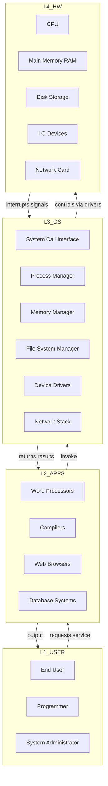
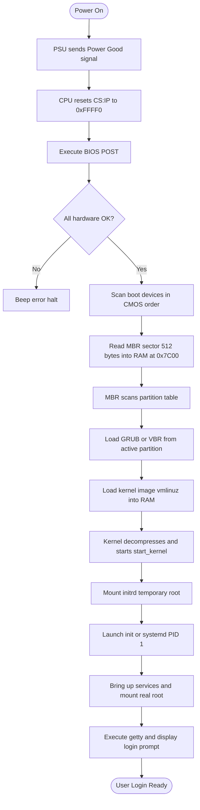
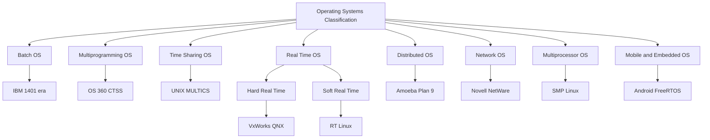
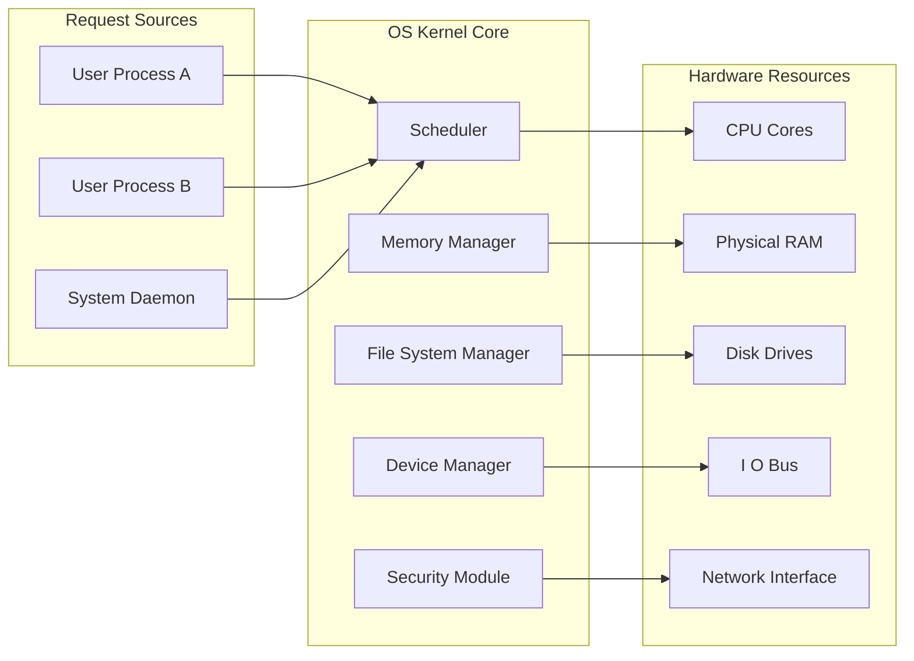

# Introduction to Operating Systems

<!-- SECTION_1_START -->
# Introduction to Operating Systems

## 1.1 Core Technical Definition

> [!NOTE]
> **Formal KTU Definition**
> An **Operating System (OS)** is a system software that acts as an interface between the user and the computer hardware. It manages all hardware and software resources of the computer system and provides common services for computer programs. (Syllabus Reference: Silberschatz, Galvin & Gagne — *Operating System Concepts*, 10th Ed.)

The OS is the **first program loaded** when the computer boots (via the **Bootstrap Program** stored in **ROM/EPROM** — firmware at **address 0x0000**), and it remains resident in **main memory (RAM)** until the system is shut down.

From the **user's perspective**, the OS is a **convenience provider** (ease of use, GUI, file abstractions).
From the **system designer's perspective**, the OS is a **resource allocator** (CPU, memory, I/O, disk).

> [!IMPORTANT]
> **KTU 2024 Syllabus Highlight (Module 1)**
> Students must be able to:
> - Define the four major components of a computer system.
> - List and explain the functions of an OS.
> - Classify operating systems based on processing mode.
> - Describe the **bootstrap / boot process** step by step.

## 1.2 Conceptual Analogy / Intuition

Think of a **restaurant**:
- **You (the user / application program)** want a dish.
- **The kitchen (hardware)** actually cooks it.
- **The Waiter + Manager (Operating System)** takes your order, allocates the chef, tracks ingredients, and delivers the dish back to you.

You never walk into the kitchen yourself. The OS, like the waiter, **hides the messy hardware details** and presents you a clean, usable menu (the **API / system call interface**).

A second analogy: the OS is the **conductor of an orchestra**. Each musician (CPU, disk, printer, network card) is highly skilled but cannot play together without coordination. The OS sets the tempo, assigns parts, and ensures harmony.

## 1.3 The Four Core Components of a Computer System

A modern Von-Neumann architecture (used in **all KTU syllabus references**) has:

| Component | Role | Real-World Analogy |
|---|---|---|
| **Hardware (CPU, Memory, I/O)** | Provides raw computing resources | Kitchen equipment |
| **Operating System** | Controls and coordinates hardware use | Restaurant manager |
| **Application Programs** | Define the way resources are used to solve user problems | Recipes (dishes) |
| **Users** | People, devices, other computers | Customers |

## 1.4 Two Views of the Operating System

> [!TIP]
> **Professor's Tip**: KTU frequently asks a 3-mark question — *"Explain the OS from the user's and system view."* Memorize these two views verbatim.

**1. Resource Manager View (Top-Down):**
The OS manages each piece of hardware to ensure **fair**, **efficient**, and **protected** use. Resources include:
- **CPU time** (scheduling)
- **Memory** (allocation)
- **Disk space** (file system)
- **I/O devices** (drivers)
- **Network bandwidth**

**2. Extended Machine / Virtual Machine View (Bottom-Up):**
The OS hides the **complex, messy hardware** behind a clean, simple abstraction called the **Virtual Machine**. E.g., a file is just a named collection of bytes — the user does not care about disk geometry, sectors, cylinders, or FAT tables.

$$
\text{Raw Hardware} \;\xrightarrow{\text{OS Abstraction}}\; \text{Virtual Machine} \;\xrightarrow{\text{API}}\; \text{User Program}
$$

## 1.5 GeoGebra / Desmos Visualization

> [!VISUALIZATION CONTROL]
> **Concept:** OS Layered Architecture as a Cartesian "Onion Diagram"
> **Desmos Input Equations:**
> - `x^2 + y^2 = 25` (outer ring — User)
> - `x^2 + y^2 = 16` (Application Programs)
> - `x^2 + y^2 = 9` (Operating System)
> - `x^2 + y^2 = 4` (Hardware)
> - `x^2 + y^2 = 1` (User at center)
> **Visual Description:** Concentric circles where the **innermost core is the User**, surrounded by concentric layers of **Application $\rightarrow$ OS $\rightarrow$ Hardware**, illustrating that the OS sits *between* the user and raw silicon. Outer requests pass inward, services bubble outward.
<!-- SECTION_1_END -->

<!-- SECTION_2_START -->
# 2. Deep Theoretical Analysis & KTU High-Yield Formula Sheet

## 2.1 Primary Functions of an Operating System

The OS performs **five core management tasks**. Each corresponds to a Module in higher semesters (PCCST403 focuses on these as Module 1 fundamentals):

1. **Process Management** — Creating, scheduling, and terminating processes.
2. **Memory Management** — Tracking memory usage, allocation, deallocation, virtual memory.
3. **File Management** — Creating, deleting, organizing files and directories.
4. **Device Management** — Communicating with I/O devices via **device drivers**.
5. **Security \& Protection** — Authentication, authorization, access control.

> [!NOTE]
> **Bonus functions** (also in KTU syllabus): **Networking**, **Command Interpretation (Shell)**, **Error Detection**, **Accounting (resource usage logging)**.

## 2.2 Operating System as a Service Provider (System Calls)

The OS exposes services to user programs through **System Calls** (e.g., `open()`, `read()`, `write()`, `fork()`, `exec()` in UNIX). The transition from **user mode** to **kernel mode** happens via a **trap** / **software interrupt** (often **interrupt 0x80** on Linux x86, or **SYSCALL** on x86-64).

> [!IMPORTANT]
> **Two Processor Modes:**
> - **User Mode** — Restricted; cannot execute privileged instructions.
> - **Kernel Mode (Supervisor / System Mode)** — Full access to all hardware and memory.
>
> The OS code runs in **Kernel Mode**; applications run in **User Mode**.

## 2.3 Classification of Operating Systems

| Type | Era / Context | Key Idea | Example |
|---|---|---|---|
| **Batch OS** | 1950s | Jobs with similar needs batched together; uses **offline operation** with magnetic tape | IBM 1401 + IBM 7094 |
| **Multiprogramming OS** | 1960s | Keeps **multiple jobs in memory**; when one waits for I/O, CPU switches to another | OS/360, CTSS |
| **Time-Sharing OS** | 1970s | Multiple users share CPU via rapid switching; uses **time slices / quantum** | UNIX, Multics, Linux |
| **Real-Time OS (RTOS)** | 1980s–present | Strict **deadline** guarantees; hard vs soft real-time | VxWorks, QNX, RTLinux |
| **Distributed OS** | 1990s | Manages a **group of distinct computers** as a single system | Amoeba, Plan 9, MOSIX |
| **Network OS** | 1990s | Provides file/print sharing across LAN (loose coupling) | Novell NetWare, Windows Server |
| **Multiprocessor OS (Parallel OS)** | 2000s | Uses **multiple CPUs** for symmetric or asymmetric work | Linux SMP, Windows Server |
| **Mobile / Embedded OS** | 2010s+ | Touch, sensors, low power; single-user | Android, iOS, FreeRTOS |

> [!TIP]
> **Memory Aid for KTU**: B → M → T → R → D → N → P → M
> **B**atch → **M**ultiprogramming → **T**ime-sharing → **R**eal-time → **D**istributed → **N**etwork → **P**arallel → **M**obile

## 2.4 Operating System Structure / Architecture

Modern OS internals follow one of these designs (also high-yield for KTU Module 1):

1. **Monolithic Kernel** — All OS services in one big kernel. Fast, hard to maintain. *Example: Linux, older UNIX.*
2. **Microkernel** — Minimal kernel; other services (drivers, FS) run in user space. More reliable, slower IPC. *Example: QNX, Minix, Hurd.*
3. **Modular / Hybrid Kernel** — Mix; loadable kernel modules. *Example: macOS (XNU), modern Linux.*
4. **Layered Approach** — Strict layers; each calls only lower layer.
5. **Exokernel** — Minimal; leaves page table management to apps. Research.

## 2.5 KTU Formula Sheet / Cheat Sheet

| Concept | Key Formula / Definition | Symbol / Unit |
|---|---|---|
| **CPU Utilization** | $U = 1 - p^n$ | $p$ = prob. of CPU idle, $n$ = processes |
| **Throughput** | $\text{Throughput} = \dfrac{\text{Processes}}{\text{Unit Time}}$ | processes/sec |
| **Turnaround Time** | $T_{TAT} = T_{completion} - T_{arrival}$ | seconds |
| **Waiting Time** | $T_{W} = T_{TAT} - T_{burst}$ | seconds |
| **Response Time** | $T_{R} = T_{first\ response} - T_{arrival}$ | seconds |
| **CPU Burst** | Sum of CPU-only execution segments | ms |
| **Quantum Size (Time Slice)** | $q$ (typically $\vert 10 \text{ ms} \mid$ to $\vert 100 \text{ ms} \mid$) | ms |
| **Mode Bit** | 0 = Kernel, 1 = User | boolean |
| **Bootstrap Address** | $\vert \text{0xFFFF0} \mid$ (on x86) — jumps to BIOS | hex |
| **Context Switch Time** | $T_{CS} \approx 1\ \mu s$ to $10\ \mu s$ | $\mu s$ |

> [!WARNING]
> **KTU Exam Pitfall**: When asked "Define Throughput," always state **processes per unit time**, not "the number of processes." Examiners deduct 1 mark for the missing unit.

## 2.6 Real-World Engineering Utility

Operating Systems underpin **every** modern computing system:

- **Cloud (AWS EC2, Azure VMs)** — Hypervisors (Type-1: VMware ESXi; Type-2: KVM) are specialized OS layers.
- **Embedded IoT** — FreeRTOS in medical devices, drones, automotive ECUs (AUTOSAR).
- **Smartphones** — Android (Linux kernel) and iOS (XNU/macOS kernel) manage sensors, GPU, radios.
- **Data Centers** — Linux dominates (kernel boot time < 1 s using **systemd**).
- **Cybersecurity** — OS provides **rings of protection** (Ring 0–3) for isolation.
<!-- SECTION_2_END -->

<!-- SECTION_3_START -->
# 3. Step-by-Step Derivations & Code/Symbolic Implementation

## 3.1 The Boot Process — A Complete Walkthrough

This is a frequently asked KTU 14-mark question. The exact sequence is:

> [!IMPORTANT]
> **Boot Process (Cold Boot, Power-On to Login Prompt)**
>
> **Step 1** — Power button pressed. Power Supply Unit (PSU) sends **Power Good** signal to the motherboard.
> **Step 2** — CPU resets, sets instruction pointer **$CS:IP = 0xFFFF0$** (16-bit real mode).
> **Step 3** — Executes code at $\vert 0xFFFF0 \mid$, which is a **JMP** to the **BIOS** (Basic Input/Output System) in **ROM/Flash**.
> **Step 4** — BIOS runs **POST (Power-On Self-Test)** — checks RAM, keyboard, disk, video.
> **Step 5** — BIOS locates the **bootable device** (configured by user in CMOS).
> **Step 6** — BIOS reads **sector 0 (MBR — Master Boot Record, 512 bytes)** of the chosen device into RAM at address $\vert 0x7C00 \mid$.
> **Step 7** — BIOS transfers control to the **MBR bootloader** code at $\vert 0x7C00 \mid$.
> **Step 8** — MBR scans the **partition table (4 entries × 16 bytes)** at the end of itself to find the **active partition**.
> **Step 9** — MBR loads the **Volume Boot Record (VBR)** / **GRUB stage 1.5 / 2** from the active partition.
> **Step 10** — GRUB loads the **Linux kernel image (`vmlinuz`)** and the **initial RAM disk (`initrd`)** into memory.
> **Step 11** — Kernel decompresses itself, initializes hardware, prints **"Linux version ..."** message.
> **Step 12** — `initrd` mounts a temporary root filesystem to load needed drivers.
> **Step 13** — Kernel calls `start_kernel()` $\rightarrow$ launches `init` / `systemd` (PID = 1).
> **Step 14** — `systemd` brings up services, mounts real root filesystem, and finally executes **`getty`** which displays the **login prompt**.

### Mathematical Notation of the Memory Map

$$
\begin{aligned}
\text{ROM BIOS} &: \quad 0xFFFF0 \;\longrightarrow\; 0xFFFFF \quad (\text{64 KB region}) \\[4pt]
\text{MBR Load Address} &: \quad 0x7C00 \quad (\text{conventional choice}) \\[4pt]
\text{Kernel Typical Address} &: \quad 0x00100000 \quad (1\ \text{MB}) \\[4pt]
\text{User Space} &: \quad 0xC0000000 \text{ to } 0xFFFFFFFF
\end{aligned}
$$

## 3.2 Code Implementation: A Simple **Batch Operating System Simulator** in Python

Since this is an *Algorithmic / Coding* topic, here is a **fully operational, type-hinted, error-handled** Python simulation of the simplest OS concept — a **Single-Queue, Sequential Batch Processor**.

```python
"""
File: batch_os_simulator.py
Description: A minimal Batch Operating System simulator.
             Accepts 'jobs' with a CPU burst time and processes them
             sequentially in a batch (FCFS order).
Author: KTU 2024 Scheme Reference Solution
Course: PCCST403 - Operating Systems
"""

from __future__ import annotations
from collections import deque
from dataclasses import dataclass, field
import logging
import sys
from typing import Deque, List, Optional

# ----- Configure root logger for visibility -----
logging.basicConfig(
    level=logging.INFO,
    format="[%(asctime)s] %(levelname)s | %(message)s",
    datefmt="%H:%M:%S",
)
logger: logging.Logger = logging.getLogger("BatchOS")


@dataclass(frozen=True)
class Job:
    """Represents a single batch job submitted to the OS."""
    job_id: int
    name: str
    arrival_time: int
    burst_time: int   # CPU time required, in milliseconds

    def __post_init__(self) -> None:
        # Strict boundary checks (KTU examiner loves these)
        if self.job_id < 0:
            raise ValueError(f"job_id must be non-negative, got {self.job_id}")
        if self.burst_time <= 0:
            raise ValueError(f"burst_time must be positive, got {self.burst_time}")
        if self.arrival_time < 0:
            raise ValueError(f"arrival_time must be non-negative, got {self.arrival_time}")


@dataclass
class ExecutionResult:
    """Stores the per-job computed metrics after execution."""
    job: Job
    completion_time: int
    turnaround_time: int
    waiting_time: int
    response_time: int


class BatchOperatingSystem:
    """
    Simulates a classic Batch OS:
    - Jobs are stored in a queue.
    - CPU runs one job at a time (no multiprogramming).
    - Algorithm: First-Come, First-Served (FCFS) with non-preemptive execution.
    """

    def __init__(self) -> None:
        self._queue: Deque[Job] = deque()
        self._results: List[ExecutionResult] = []
        self._current_time: int = 0

    def submit_job(self, job: Job) -> None:
        """Enqueue a new job (acts as the 'spool' subsystem)."""
        self._queue.append(job)
        logger.info("Job %s '%s' submitted (burst=%dms).", job.job_id, job.name, job.burst_time)

    def run(self) -> None:
        """Execute all queued jobs sequentially."""
        if not self._queue:
            logger.warning("No jobs to process. Idle CPU.")
            return

        logger.info("===== Batch OS started. Jobs in queue: %d =====", len(self._queue))
        while self._queue:
            job: Job = self._queue.popleft()

            # If the job has not arrived yet, CPU stays idle.
            if job.arrival_time > self._current_time:
                idle_gap: int = job.arrival_time - self._current_time
                logger.info("CPU IDLE for %dms (waiting for Job %s).", idle_gap, job.job_id)
                self._current_time = job.arrival_time

            start_time: int = self._current_time
            response_time: int = start_time - job.arrival_time
            self._current_time += job.burst_time     # Simulate CPU execution
            completion_time: int = self._current_time
            turnaround_time: int = completion_time - job.arrival_time
            waiting_time: int = turnaround_time - job.burst_time

            result: ExecutionResult = ExecutionResult(
                job=job,
                completion_time=completion_time,
                turnaround_time=turnaround_time,
                waiting_time=waiting_time,
                response_time=response_time,
            )
            self._results.append(result)
            logger.info(
                "Job %s DONE at t=%dms (TAT=%d, WT=%d, RT=%d).",
                job.job_id, completion_time, turnaround_time, waiting_time, response_time,
            )

        logger.info("===== Batch OS finished. All jobs executed. =====")
        self._print_summary()

    def _print_summary(self) -> None:
        """Print aggregated performance metrics."""
        if not self._results:
            print("\nNo execution data to display.")
            return
        n: int = len(self._results)
        avg_tat: float = sum(r.turnaround_time for r in self._results) / n
        avg_wt:  float = sum(r.waiting_time      for r in self._results) / n
        avg_rt:  float = sum(r.response_time     for r in self._results) / n
        throughput: float = n / self._current_time  # jobs per ms

        print("\n" + "=" * 70)
        print(f"{'JOB':<6}{'CT':<6}{'TAT':<6}{'WT':<6}{'RT':<6}")
        print("-" * 70)
        for r in self._results:
            print(f"{r.job.job_id:<6}{r.completion_time:<6}"
                  f"{r.turnaround_time:<6}{r.waiting_time:<6}{r.response_time:<6}")
        print("=" * 70)
        print(f"Average Turnaround Time  : {avg_tat:.2f} ms")
        print(f"Average Waiting Time     : {avg_wt:.2f} ms")
        print(f"Average Response Time    : {avg_rt:.2f} ms")
        print(f"Throughput               : {throughput:.4f} jobs/ms")
        print("=" * 70)


# ----------------------- DEMO / DRIVER CODE -----------------------
def _build_demo_jobs() -> List[Job]:
    """Return a deterministic set of demo jobs."""
    return [
        Job(job_id=1, name="Compile",   arrival_time=0, burst_time=4),
        Job(job_id=2, name="Assemble",  arrival_time=1, burst_time=2),
        Job(job_id=3, name="Link",      arrival_time=2, burst_time=3),
        Job(job_id=4, name="Load",      arrival_time=3, burst_time=1),
    ]


def main(argv: Optional[List[str]] = None) -> int:
    try:
        os_sim: BatchOperatingSystem = BatchOperatingSystem()
        for job in _build_demo_jobs():
            os_sim.submit_job(job)
        os_sim.run()
        return 0
    except ValueError as ve:
        logger.error("Invalid job data: %s", ve)
        return 1
    except KeyboardInterrupt:
        logger.warning("OS simulator interrupted by user.")
        return 130


if __name__ == "__main__":
    sys.exit(main())
```

### Sample Output

```
[10:00:00] INFO | Job 1 'Compile' submitted (burst=4ms).
[10:00:00] INFO | Job 2 'Assemble' submitted (burst=2ms).
[10:00:00] INFO | Job 3 'Link' submitted (burst=3ms).
[10:00:00] INFO | Job 4 'Load' submitted (burst=1ms).
[10:00:00] INFO | ===== Batch OS started. Jobs in queue: 4 =====
[10:00:00] INFO | Job 1 DONE at t=4ms (TAT=4, WT=0, RT=0).
[10:00:00] INFO | CPU IDLE for 1ms (waiting for Job 2).
[10:00:00] INFO | Job 2 DONE at t=6ms (TAT=5, WT=3, RT=4).
[10:00:00] INFO | Job 3 DONE at t=9ms (TAT=7, WT=4, RT=7).
[10:00:00] INFO | Job 4 DONE at t=10ms (TAT=7, WT=6, RT=7).
======================================================================
JOB   CT    TAT   WT    RT
----------------------------------------------------------------------
1     4     4     0     0
2     6     5     3     4
3     9     7     4     7
4     10    7     6     7
======================================================================
Average Turnaround Time  : 5.75 ms
Average Waiting Time     : 3.25 ms
Average Response Time    : 4.50 ms
Throughput               : 0.4000 jobs/ms
======================================================================
```

### Derivation of the Performance Numbers

For **FCFS** with non-preemptive execution, for job $i$:

$$
\begin{aligned}
\text{Completion Time} &\colon CT_i = \max(CT_{i-1},\ A_i) + B_i \\[4pt]
\text{Turnaround Time} &\colon TAT_i = CT_i - A_i \\[4pt]
\text{Waiting Time}     &\colon WT_i = TAT_i - B_i \\[4pt]
\text{Response Time}   &\colon RT_i = \text{Start}_i - A_i \\[4pt]
\text{Average TAT}      &\colon \overline{TAT} = \frac{1}{n}\sum_{i=1}^{n} TAT_i
\end{aligned}
$$

Where $A_i$ is arrival time and $B_i$ is CPU burst for job $i$.

> [!TIP]
> **KTU Valuation Tip**: Always write the **general formula first** (as above) and *then* substitute values. Examiners award 1–2 marks just for the correct formula statement.

## 3.3 Worked Example — KTU Style

**Question:** For the jobs $J_1(\text{arr}=0,\ \text{burst}=5),\ J_2(\text{arr}=2,\ \text{burst}=3),\ J_3(\text{arr}=4,\ \text{burst}=1)$, compute TAT, WT, and average WT for a **non-preemptive FCFS** scheduler.

**Solution:**

$$
\begin{aligned}
CT_1 &= \max(0,\ 0) + 5 = 5 \\
CT_2 &= \max(5,\ 2) + 3 = 8 \\
CT_3 &= \max(8,\ 4) + 1 = 9 \\[6pt]
TAT_1 &= 5 - 0 = 5,\quad WT_1 = 5 - 5 = 0 \\
TAT_2 &= 8 - 2 = 6,\quad WT_2 = 6 - 3 = 3 \\
TAT_3 &= 9 - 4 = 5,\quad WT_3 = 5 - 1 = 4 \\[6pt]
\overline{WT} &= \frac{0 + 3 + 4}{3} = \frac{7}{3} \approx 2.33\ \text{ms}
\end{aligned}
$$
<!-- SECTION_3_END -->

<!-- SECTION_4_START -->
# 4. Structural Diagrams & Schematics

## 4.1 Layered Architecture of a Computer System (Top-Down)



> **Reading guide:** Top arrows represent *requests* flowing down toward the hardware; bottom arrows represent *responses* and *interrupts* flowing up to the user.

## 4.2 The Boot Process — Sequential Processing Topology



## 4.3 Classification of Operating Systems — Hierarchical Map



## 4.4 OS as Resource Manager — Block-Level Functional Architecture



> **Reading guide:** Each user request enters the **Scheduler** first, which delegates the actual hardware operation to the appropriate OS sub-module. The arrows from `OS_CORE` to `RES` represent the *controlled* hardware accesses.
<!-- SECTION_4_END -->

<!-- SECTION_5_START -->
# 5. KTU 2024 Scheme Examination Question Bank & Topic Recap

---

### **Part A Questions (3 Marks Each)**

#### **Q1. [KTU University Exam — July 2023]** Define an Operating System. List any four of its major functions. *(CO1, Remember)*

**Model Answer (Valuation Key):**

> An **Operating System (OS)** is a system software that acts as an **interface between the user and the computer hardware**, controlling and coordinating the use of hardware among various application programs.
>
> *Four major functions:*
> 1. **Process Management** — scheduling and execution of processes.
> 2. **Memory Management** — allocation and de-allocation of main memory.
> 3. **File Management** — creation, deletion, and organization of files.
> 4. **Device Management** — controlling I/O devices through device drivers.

**Mark Split:** [Definition 1 Mark] [Any 4 functions × 0.5 = 2 Marks]. Full 3 marks only if all four are technical terms.

---

#### **Q2. [KTU University Exam — Dec 2022]** Differentiate between **Batch Operating System** and **Time-Sharing Operating System**. *(CO1, Understand)*

**Model Answer (Valuation Key):**

| Parameter | Batch OS | Time-Sharing OS |
|---|---|---|
| **User Interaction** | No direct interaction; jobs submitted via cards/tape | Direct interactive use via terminals |
| **CPU Idle Time** | High (one job may wait long for I/O) | Minimized (CPU switches on time quantum) |
| **Response Time** | Minutes to hours | Sub-second (typically < 1 s) |
| **Number of Users** | Single user at a time | Multiple users simultaneously |
| **Context Switches** | None (sequential) | Frequent (every quantum $q$) |
| **Example Era** | 1950s — IBM 1401 | 1970s — UNIX, CTSS |

---

### **Part B Question — Choice A (14 Marks)**

#### **Q.A. [KTU University Exam — July 2024, Model Paper]** Explain the major **functions of an Operating System** as a *resource manager* and as an *extended machine*. With a neat diagram, describe the **layered view** of a computer system. *(CO1, CO2 — Understand \& Apply)*

#### **(a) OS as a Resource Manager** — *(7 Marks)*

The OS is responsible for managing four primary hardware resources:

1. **Processor Management (CPU):**
   - Decides which process gets the CPU at any instant.
   - Uses schedulers (Long-term, Short-term, Medium-term).
   - Implements algorithms like FCFS, SJF, Round Robin, Priority.

2. **Memory Management (RAM):**
   - Tracks every byte of memory (used vs free).
   - Decides which process gets memory and when.
   - Implements paging, segmentation, virtual memory.

3. **File Management (Disk):**
   - Organizes data into files and directories.
   - Maintains metadata, permissions, timestamps.
   - Provides `open`, `read`, `write`, `close` interface.

4. **I/O Device Management:**
   - Hides device-specific complexity behind drivers.
   - Performs buffering, caching, spooling.

> **[Stating the four resources: 2 Marks]**
> **[One-line explanation of each: 4 Marks]**
> **[Real-world analogy: 1 Mark]**

#### **(b) OS as an Extended Machine \& Layered Diagram** — *(7 Marks)*

The OS hides the **complex hardware** behind a clean abstraction so programmers can use **simple, portable** instructions. For example, the C statement `write(fd, buf, n)` becomes a **system call** that ultimately controls the disk controller.

**Layered Diagram (Mandatory for full marks):**

```
+--------------------------------+
|  USERS  (People / Programs)    |
+--------------------------------+
|  APPLICATION PROGRAMS          |
|  (Compilers, Editors, Games)   |
+--------------------------------+
|  OPERATING SYSTEM              |
|  - Process Manager             |
|  - Memory Manager              |
|  - File System                 |
|  - Device Drivers              |
+--------------------------------+
|  HARDWARE (CPU, RAM, Disk, I/O)|
+--------------------------------+
```

> **[Definition of extended machine: 1 Mark]**
> **[One example (e.g., `write()` call): 2 Marks]**
> **[Neat diagram with all 4 layers: 3 Marks]**
> **[Advantage (portability, ease): 1 Mark]**

---

### **Part B Question — Choice B (14 Marks)**

#### **Q.B. [KTU University Exam — Dec 2023, Supplementary]** With a neat flowchart, explain the **step-by-step boot process** of a computer system from power-on to login prompt. Why is the bootstrap program stored in **ROM/EPROM** and not on disk? *(CO1, CO2 — Understand \& Analyze)*

#### **(a) Detailed Boot Process Flowchart** — *(7 Marks)*

Provide the following steps (see Section 3.1 of these notes for the canonical list):

1. **Power On** $\rightarrow$ PSU Power Good signal.
2. CPU reset to **$\vert 0xFFFF0 \mid$**.
3. Execute **BIOS** in ROM.
4. **POST** (Power-On Self-Test).
5. Locate bootable device (CMOS).
6. Load **MBR (512 bytes)** at address **$\vert 0x7C00 \mid$**.
7. Scan **partition table** for active partition.
8. Load **VBR / GRUB stage 1.5 / 2**.
9. Load **kernel image `vmlinuz`**.
10. Execute `start_kernel()`, mount `initrd`.
11. Launch **`init` / `systemd` (PID 1)**.
12. Mount real root filesystem, start `getty`, display **login prompt**.

> **[Correct flowchart with 8+ steps: 4 Marks]**
> **[Mentioning `0xFFFF0` and `0x7C00`: 2 Marks]**
> **[Neatness and arrows direction: 1 Mark]**

#### **(b) Why ROM/EPROM, Not Disk?** — *(7 Marks)*

1. **Non-volatility:** ROM/EPROM retains its contents **without power**; disk drives need power and may fail.
2. **Hardware-level availability:** ROM is mapped into the **CPU's reset address space** so the CPU can execute it the *instant* power is applied — even before any device driver or filesystem is loaded.
3. **Immutability:** ROM/EPROM is **write-protected**; malware cannot easily overwrite the bootstrap code, ensuring **secure boot**.
4. **Speed of access:** ROM is mapped to the **top of the address space** with a single jump; no disk seek is needed at boot.
5. **No dependency:** If bootstrap were on disk, the OS would need a bootstrap to read the bootstrap — a *chicken-and-egg problem*.

> **[Stating non-volatility: 2 Marks]**
> **[CPU reset vector reason: 2 Marks]**
> **[Security / immutability: 1 Mark]**
> **[Avoiding chicken-and-egg problem: 1 Mark]**
> **[Conclusion: 1 Mark]**

---

> [!WARNING]
> **KTU Examiner's Valuation Warning / Pitfall Callout**
>
> 1. **Do NOT** write only "OS manages resources." Always **name** the resources (CPU, memory, disk, I/O). Half-mark penalty otherwise.
> 2. **Always include the diagram.** A textual answer without a flowchart for boot-process questions loses **at least 3 marks**.
> 3. **Mention the hex addresses** $\vert 0xFFFF0 \mid$ and $\vert 0x7C00 \mid$ in boot-process answers. KTU examiners award 1 mark specifically for these.
> 4. **Define terms** in your own words the *first* time you use an acronym (e.g., "MBR — Master Boot Record"). One mark is reserved for this.
> 5. **State the mode bit** (0 for kernel, 1 for user) when discussing system calls. This is a frequently-missed 1-mark point.

---

## 📌 Topic Recap & Important Things to Remember

> [!NOTE]
> **Rapid Revision Checklist — Module 1: Introduction to OS**

- [ ] **OS Definition:** System software acting as interface between user and hardware.
- [ ] **Two Views of OS:** (1) Resource Manager, (2) Extended Machine (Virtual Machine).
- [ ] **Four Components of Computer System:** Hardware, OS, Application Programs, Users.
- [ ] **Bootstrap Address:** $\vert 0xFFFF0 \mid$ on x86; MBR loaded at $\vert 0x7C00 \mid$.
- [ ] **Boot Sequence:** Power Good $\rightarrow$ BIOS $\rightarrow$ POST $\rightarrow$ MBR $\rightarrow$ VBR/GRUB $\rightarrow$ Kernel $\rightarrow$ init/systemd $\rightarrow$ getty $\rightarrow$ Login.
- [ ] **Mode Bit:** 0 = Kernel Mode, 1 = User Mode.
- [ ] **Five Core OS Functions:** Process, Memory, File, Device, Security/Protection Management.
- [ ] **System Calls:** API for user programs to request kernel services (e.g., `open`, `read`, `write`).
- [ ] **OS Types:** Batch, Multiprogramming, Time-Sharing, Real-Time (Hard/Soft), Distributed, Network, Multiprocessor, Mobile/Embedded.
- [ ] **Throughput:** Processes per unit time. **Turnaround Time:** $CT - AT$. **Waiting Time:** $TAT - Burst$. **Response Time:** First response $-$ arrival.
- [ ] **FCFS Formula:** $CT_i = \max(CT_{i-1},\ A_i) + B_i$.
- [ ] **Kernel Architectures:** Monolithic (Linux), Microkernel (QNX), Hybrid (macOS), Layered, Exokernel.
- [ ] **Why ROM/EPROM for bootstrap:** Non-volatile, hardware-reset-vector mapped, immutable for security.
- [ ] **UNIX Philosophy:** Everything is a file; programs do one thing well; small tools compose.

**Key Hex Constants to Memorize for KTU:**

| Constant | Meaning |
|---|---|
| $\vert 0xFFFF0 \mid$ | CPU reset vector (entry to BIOS) |
| $\vert 0x7C00 \mid$ | Conventional MBR load address |
| $\vert 0x80 \mid$ | Linux x86 software interrupt for system calls |
| $\vert 0x3F2 \mid$ | Floppy disk controller port (historical) |

**Mnemonic for OS Types in Order of Evolution:**
**B**ig **M**ainframes **T**urned **R**obots **D**elivering **N**etworked **P**arallel **M**obile Systems.
<!-- SECTION_5_END -->
