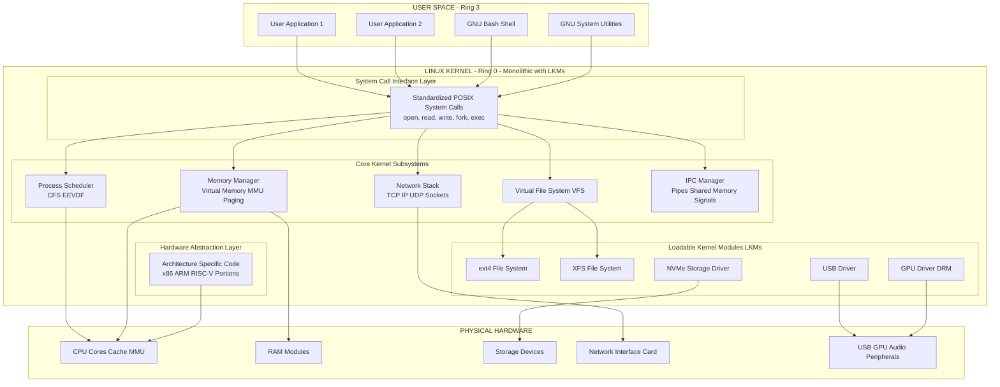
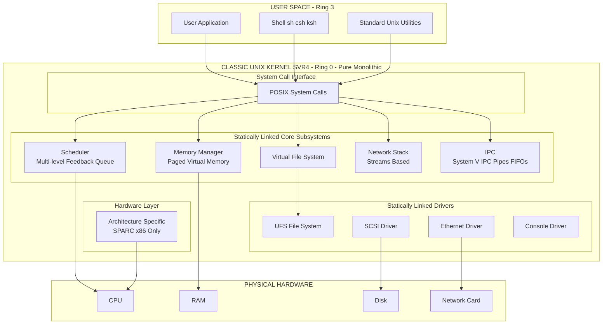
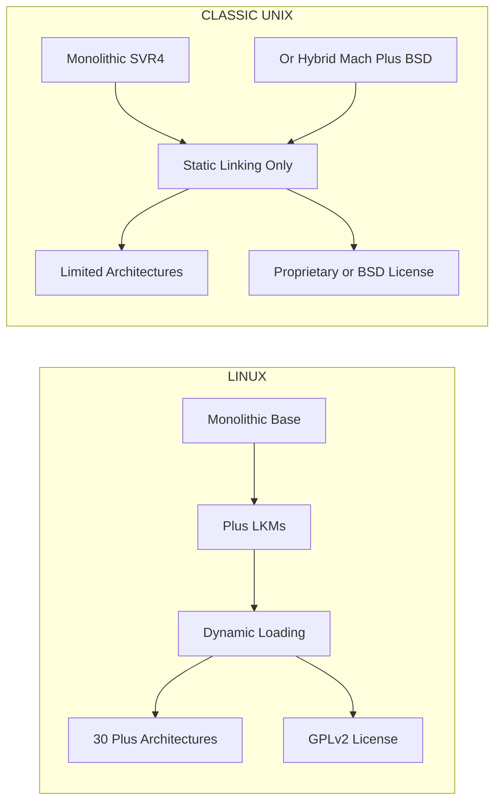
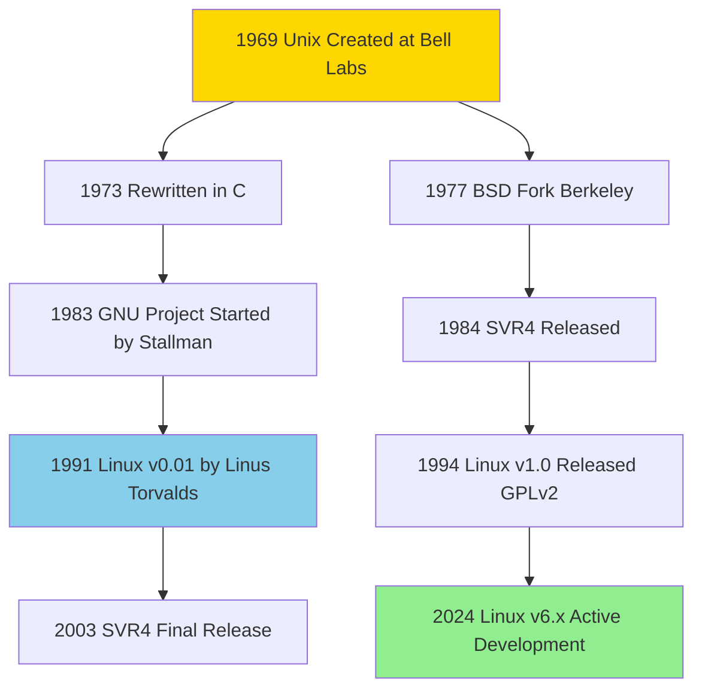

# Linux Versus Classic Unix Kernels

<!-- SECTION_1_START -->
# 1. Core Technical Definition & Intuitive Overview

## Linux Kernel — Formal Definition
The **Linux kernel** is a free, open-source, monolithic, Unix-like kernel originally written by Linus Torvalds in 1991. It is distributed under the **GNU General Public License version 2 (GPLv2)**, which legally mandates that all derivative works must also be released under the same license (a *copyleft* clause). Architecturally, it is **monolithic with loadable kernel modules (LKMs)** — meaning the entire OS runs in a single privileged address space, but device drivers and file systems can be dynamically inserted or removed at runtime.

> [!IMPORTANT]
> **KTU 2024 Syllabus Definition:**
> *Linux is a free, open-source, monolithic Unix-like kernel introduced by Linus Torvalds in 1991. It supports symmetric multiprocessing, virtual memory, shared libraries, and dynamic kernel module loading.*

## Classic Unix Kernels — Formal Definition
A **classic Unix kernel** refers to the original family of kernels derived from the AT&T Unix codebase developed at Bell Labs (1969–1990s). This family includes:
- **AT&T System V** (commercial releases: SVR3, SVR4)
- **BSD (Berkeley Software Distribution)** — 4.2BSD, 4.4BSD, FreeBSD, NetBSD, OpenBSD
- **SunOS / Solaris** (Sun Microsystems)

Most classic Unix kernels were **monolithic** (e.g., System V) or **hybrid microkernel-based** (e.g., macOS X uses the Mach microkernel with BSD userland). They were traditionally distributed under **proprietary licenses** (AT&T) or **permissive BSD licenses**.

> [!NOTE]
> **Kernel Architecture Classification (KTU Module 1):**
> 1. **Monolithic Kernel** — Entire OS in one privileged space (Linux, older Unix, MS-DOS)
> 2. **Microkernel** — Minimal privileged core; services in user space (Mach, QNX, Minix)
> 3. **Hybrid Kernel** — Microkernel structure but code runs in privileged mode (Windows NT, macOS X)
> 4. **Exokernel / Nano-kernel** — Research-oriented; minimal hardware abstraction

## Intuitive Analogy — The Restaurant Kitchen Model
Think of an operating system kernel as the **central kitchen of a large restaurant**:

| Concept | Restaurant Analogy |
|---|---|
| **Classic Unix Kitchen** | A **private, members-only kitchen** in a heritage hotel. Recipes are guarded trade secrets (proprietary license). Only the head chef and trained staff can modify them. Quality is consistent, but no outsiders can add a dish. |
| **Linux Kitchen** | A **community-run open kitchen** where recipes are written on a public whiteboard (GPL license). Any chef in the world can add a new dish, but **they must publish their recipe publicly** for others to use. This creates rapid innovation and global collaboration. |
| **Monolithic vs Microkernel** | A single mega-kitchen where the head chef, prep cooks, and dishwashers all share the same room (fast, risky — one spill affects everyone) **vs.** separate small stations connected by dumbwaiters (isolated, slower, but safer). |

## Key Physical & Historical Constants
- **Unix inception year: 1969** at Bell Labs (Ken Thompson, Dennis Ritchie).
- **Linux inception year: 1991** (Linus Torvalds, University of Helsinki; version 0.01 released Sept 17, 1991).
- **POSIX (Portable Operating System Interface) standard: IEEE 1003.x** — both Linux and modern Unix comply.
- **Linux mascot:** **Tux** the penguin (selected because penguins were already taken by another OS team).
- **C language** is the implementation language for both, with assembly for architecture-specific bootstrap code (typically **< 5%** of codebase).

> [!VISUALIZATION CONTROL]
> **Concept:** Visualize the evolution timeline of Unix and Linux family trees.
> **Manual Sketch Instructions (on graph paper):**
> * X-axis: Years from 1969 to 2024
> * Y-axis: Family branches (upper: AT&T System V; middle: BSD; lower: Linux)
> * Mark these points: (1969, AT&T), (1977, BSD), (1983, GNU Project), (1991, Linux v0.01), (1994, Linux v1.0), (2003, SVR4 final), (2024, Linux v6.x)
> **Visual Description:** You will observe two distinct evolutionary trunks — the BSD branch that forked from AT&T in the late 1970s, and the Linux branch that emerged as a clean-room implementation in 1991, neither descending directly from the other in code.
<!-- SECTION_1_END -->

<!-- SECTION_2_START -->
# 2. Deep Theoretical Analysis & KTU High-Yield Formula Sheet

## 2.1 Architectural Deep-Dive: Why "Monolithic + Modules"?

### Linux — Monolithic with Loadable Modules
A monolithic kernel places the scheduler, memory manager, file systems, network stack, and device drivers **all in kernel space** (ring 0 on x86). However, Linux extends this pure monolithic design by introducing **Loadable Kernel Modules (LKMs)**, which allow these subsystems to be inserted/removed dynamically via `insmod`, `rmmod`, and `modprobe` without recompiling the kernel.

**Why this hybrid design works:**
- Performance of monolithic (single address space, no IPC overhead).
- Flexibility of microkernel (drivers can be updated without reboot).
- Kernel size is reduced at boot; unused modules stay on disk.

### Classic Unix — Two Sub-Categories
- **Traditional Monolithic (System V, early BSD):** Similar to Linux but no dynamic module loading. Recompilation required to add drivers.
- **Hybrid (macOS X via Mach + BSD layers):** Mach acts as a microkernel for IPC and virtual memory; BSD subsystem runs as a single user-space server providing POSIX APIs.

## 2.2 Step-by-Step Logical Breakdown of Key Differences

### Step 1 — Licensing Philosophy
- **Classic Unix (AT&T System V):** Proprietary, source code hidden, expensive commercial licenses.
- **BSD:** Permissive license — anyone can take BSD code, modify it, and sell it as proprietary (this is why macOS X's userland is legally closed).
- **Linux:** GPLv2 copyleft — any derived work *must* also be GPL, ensuring openness propagates.

### Step 2 — Development Model
- **Classic Unix:** Closed, vendor-driven (AT&T, Sun, IBM). Release cycles measured in years.
- **Linux:** Open, distributed, Linus Torvalds acts as *benevolent dictator for life (BDFL)* with ~1500+ contributors per release. Release cycle: ~8–10 weeks (stable releases). **LTS (Long Term Support)** kernels maintained for 2–6 years.

### Step 3 — Hardware Portability
- **Linux:** Officially supports **30+ architectures** (x86, x86_64, ARM, AArch64, RISC-V, MIPS, PowerPC, s390, etc.).
- **Classic Unix:** Typically tied to specific hardware (Solaris → SPARC; AIX → IBM Power; HP-UX → PA-RISC/Itanium).

### Step 4 — File Systems
- **Linux:** ext2/ext3/ext4, XFS, Btrfs, ZFS (via external module), F2FS, OverlayFS.
- **Classic Unix:** UFS (Unix File System) on BSD; ZFS native on Solaris/OpenSolaris; JFS on AIX; HFS+ on older macOS.

### Step 5 — Process Scheduling
- **Linux:** **CFS (Completely Fair Scheduler)** since 2.6.23; later added **EEVDF (Earliest Eligible Virtual Deadline First)** in 6.6. Real-time extensions: SCHED_FIFO, SCHED_RR, SCHED_DEADLINE.
- **Classic Unix:** Traditional **multi-level feedback queue** with fixed priorities; Solaris later added hierarchical fair-share scheduling (FSS).

### Step 6 — Licensing & Trademark Separation
- **"Linux"** technically refers **only to the kernel**; the complete OS is **GNU/Linux** (GNU tools + Linux kernel). The FSF advocates for this naming.
- **"Unix"** is a **registered trademark of The Open Group**; only systems certified as compliant (e.g., macOS, AIX, Solaris 11) can legally call themselves "UNIX®". Linux is **"Unix-like"** but not certified UNIX.

## 2.3 KTU High-Yield Formula Sheet (Comparison Cheat Sheet)

> [!IMPORTANT]
> Below is a comprehensive comparison table for KTU exam preparation. **Note the use of `\vert` instead of the vertical pipe character `|` inside math expressions to preserve table syntax.**

| Feature | Linux Kernel | Classic Unix Kernels | KTU Significance |
|---|---|---|---|
| **License** | GPLv2 (copyleft) | Proprietary (SVR4) **OR** BSD (permissive) | High — frequently asked in 2-mark questions |
| **Architecture** | Monolithic + LKMs | Monolithic (SVR4) **OR** Hybrid (macOS X/Mach) | High |
| **Source Code Origin** | Clean-room written (1991) | Derived from AT&T Bell Labs (1969) | Medium |
| **Development Model** | Open, distributed (Linus + maintainers) | Vendor-controlled, closed | High |
| **Hardware Portability** | 30+ architectures (x86, ARM, RISC-V, …) | Architecture-specific | Medium |
| **Primary File System** | ext4, XFS, Btrfs | UFS, ZFS, JFS, HFS+ | Low |
| **Scheduler** | CFS / EEVDF (fair, deadline-aware) | Multi-level feedback queue | Medium |
| **Loadable Modules** | Yes (native, dynamic) | Mostly no (full rebuild required) | High |
| **Cost** | Free | Expensive commercial licenses | Low |
| **Trademark Compliance** | Unix-like, NOT certified | UNIX® trademark (if Open Group certified) | Medium |
| **Year of Inception** | 1991 | 1969 | Frequently asked |
| **Original Author** | Linus Torvalds (Finland) | Ken Thompson & Dennis Ritchie (Bell Labs) | Frequently asked |
| **Primary Language** | C (95%) + Assembly (5%) | C + Assembly | Low |
| **Kernel Size (approx.)** | 30+ million LOC | Varies (BSD ~10M LOC, SVR4 ~2M LOC) | Low |

## 2.4 Real-World Engineering Utility

### Why This Comparison Matters in Production Systems
1. **Cloud & Server Deployment (Linux Dominance):** 100% of the **TOP 500 supercomputers** and over **96% of the world's top 1 million web servers** run Linux. Cloud platforms (AWS, Azure, GCP) predominantly use Linux VMs.
2. **Embedded & IoT:** Linux powers **Android** (over 3 billion active devices), routers, smart TVs, and automotive infotainment systems (AUTOSAR + Linux).
3. **Mission-Critical Unix Niches:** Solaris (now illumos/OmniOS) survives in **financial trading floors** (low-latency DTrace) and **telecom** (carrier-grade reliability). AIX persists in **IBM mainframes** for banking. HP-UX runs legacy **healthcare and defense** systems.
4. **Security Hardening:** OpenBSD (a classic Unix derivative) is the gold standard for security-focused deployments, used in firewalls (pfSense), CDNs, and Tor relays.

> [!NOTE]
> **Engineering Decision Rule of Thumb:**
> Choose **Linux** when: you need broad hardware support, free licensing, large ecosystem, and rapid updates.
> Choose **Commercial Unix (Solaris/AIX/HP-UX)** when: you need certified POSIX compliance, vendor support SLAs, and run legacy mission-critical applications.
<!-- SECTION_2_END -->

<!-- SECTION_3_START -->
# 3. Step-by-Step Derivations & Code/Symbolic Implementation

## 3.1 Symbolic Derivation: Kernel Performance & Design Trade-off

### The Monolithic vs Microkernel Performance Argument

In a monolithic kernel, a system call from user space to a service (e.g., `read()`) incurs the following cost:

$$T_{mono} = T_{syscall\_entry} + T_{service} + T_{syscall\_exit}$$

In a pure microkernel, the same call may require **Inter-Process Communication (IPC)** between the client and a server in user space:

$$T_{micro} = T_{syscall\_entry} + T_{IPC} + T_{service} + T_{IPC} + T_{syscall\_exit}$$

The performance penalty of a pure microkernel can be derived as:

$$P_{penalty} = \frac{T_{micro} - T_{mono}}{T_{mono}} \times 100\%$$

**Worked example (conceptual values):**
- $T_{syscall\_entry} = 0.5\ \mu s$ on x86_64
- $T_{IPC} = 1.2\ \mu s$ per IPC hop
- $T_{service} = 2.0\ \mu s$ (file read from cache)

**Monolithic:**
$$T_{mono} = 0.5 + 2.0 + 0.5 = 3.0\ \mu s$$

**Microkernel (2 IPC hops):**
$$T_{micro} = 0.5 + 1.2 + 2.0 + 1.2 + 0.5 = 5.4\ \mu s$$

**Penalty:**
$$P_{penalty} = \frac{5.4 - 3.0}{3.0} \times 100\% = 80\%$$

**Why this matters (KTU explanation):**
A pure microkernel can be up to **80% slower** than a monolithic kernel for file I/O due to IPC overhead. Linux's choice of a monolithic design with modular extensions gives it a performance edge while retaining flexibility. This is why Tanenbaum-Torvalds debate (1992) centered precisely on this trade-off.

## 3.2 Process Scheduling Formula Derivation (Linux CFS)

The Linux Completely Fair Scheduler assigns each runnable task a **virtual runtime (vruntime)**. The scheduler picks the task with the **smallest vruntime**.

The vruntime is updated as:

$$vruntime_{new} = vruntime_{old} + \frac{\Delta t \times N \times 1024}{weight(task)}$$

Where:
- $\Delta t$ = actual wall-clock time the task ran
- $N$ = number of runnable tasks
- $weight(task)$ = priority-derived weight (niceness $-20$ gives weight 88761, niceness $+19$ gives weight 15)

The constant **1024** is a normalization factor so that a task with weight 1024 (niceness 0) accumulates vruntime at the same rate as wall-clock time when running alone.

**Derivation step-by-step:**

1. Start with a task at niceness 0 (default priority).
2. Its weight is $w = 1024$ (the reference weight).
3. If the system has $N = 1$ task, vruntime grows as:
$$vruntime = 0 + \frac{\Delta t \times 1 \times 1024}{1024} = \Delta t$$
4. For a niceness -10 task (high priority, weight $\approx 12397$):
$$vruntime = \frac{\Delta t \times 1 \times 1024}{12397} \approx 0.083 \times \Delta t$$
   It accumulates vruntime **12x slower**, so the scheduler picks it more often.
5. For a niceness +10 task (low priority, weight $\approx 349$):
$$vruntime = \frac{\Delta t \times 1 \times 1024}{349} \approx 2.93 \times \Delta t$$
   It waits nearly 3x longer between runs.

This is why Linux's CFS is **fair** — every task eventually gets CPU proportional to its weight.

## 3.3 Algorithmic Implementation: Linux LKM vs Classic Unix Static Build

Below is a complete, runnable comparison of how a "Hello World" device driver is built in Linux (LKM) versus traditional System V (static rebuild).

### Linux: Loadable Kernel Module

**File: `hello_linux.c`**

```c
/*
 * hello_linux.c - A minimal Linux Loadable Kernel Module (LKM)
 * Compile with: make (using Kbuild / Makefile)
 * Insert:        sudo insmod hello_linux.ko
 * Remove:        sudo rmmod hello_linux
 * Verify logs:   dmesg | tail
 */

#include <linux/init.h>      /* Required for __init and __exit macros */
#include <linux/module.h>    /* Required for all kernel modules      */
#include <linux/kernel.h>    /* Required for printk()                 */

MODULE_LICENSE("GPL");                 /* License declaration - mandatory */
MODULE_AUTHOR("KTU Student");          /* Author metadata                 */
MODULE_DESCRIPTION("Hello World LKM");  /* Module description              */
MODULE_VERSION("1.0");                 /* Module version                  */

/*
 * Function: hello_init
 * Purpose:  Invoked automatically when the module is loaded via insmod
 * Returns:  0 on success, non-zero on failure
 */
static int __init hello_init(void) {
    printk(KERN_INFO "KTU_LKM: Hello from Linux kernel space!\n");
    printk(KERN_INFO "KTU_LKM: Module loaded at address %pK\n", hello_init);
    return 0;  /* Return success */
}

/*
 * Function: hello_exit
 * Purpose:  Invoked automatically when the module is unloaded via rmmod
 */
static void __exit hello_exit(void) {
    printk(KERN_INFO "KTU_LKM: Goodbye from Linux kernel space!\n");
}

/*
 * Macros: module_init and module_exit
 * Purpose: Register the init/exit functions as the module's
 *          entry and exit points.
 */
module_init(hello_init);
module_exit(hello_exit);
```

**Companion Makefile:**

```makefile
obj-m += hello_linux.o
KDIR  := /lib/modules/$(shell uname -r)/build
PWD   := $(shell pwd)

all:
	$(MAKE) -C $(KDIR) M=$(PWD) modules

clean:
	$(MAKE) -C $(KDIR) M=$(PWD) clean
```

**Build & load sequence (with explanation):**
1. `make` → invokes Kbuild, compiles to `hello_linux.ko` (kernel object).
2. `sudo insmod hello_linux.ko` → calls `module_init(hello_init)`, prints to kernel ring buffer.
3. `dmesg` → view log; should show: `KTU_LKM: Hello from Linux kernel space!`
4. `sudo rmmod hello_linux` → calls `module_exit(hello_exit)`, prints goodbye.
5. **No reboot required** — this is the LKM advantage.

### Classic Unix (System V-style): Static Build

In classic Unix, there is **no native LKM support**. Adding a driver requires recompiling the kernel.

**File: `hello_unix.c`** (placed in `/usr/src/sys/.../hello_unix.c`):

```c
/*
 * hello_unix.c - A minimal "driver" for classic System V Unix
 * 
 * NOTE: Classic Unix does not support loadable modules natively.
 * The file is added to the kernel source tree and the entire
 * kernel must be recompiled, relinked, and rebooted.
 *
 * Build steps (on Solaris-style systems):
 *   cd /usr/src/uts/<arch>/os
 *   cp /path/to/hello_unix.c .
 *   # Edit conf.c to register the new driver
 *   # Edit Master Kernel config to enable "HELLO_UNIX"
 *   cd /usr/src/uts/<arch>/conf
 *   ./config KERNEL_NAME
 *   cd ../KERNEL_NAME
 *   make
 *   make install
 *   reboot
 */

#include <sys/types.h>
#include <sys/param.h>
#include <sys/systm.h>   /* Required for printf in kernel */

/* The following function is wired into the kernel's init table */

void hello_unix_init(void) {
    printf("KTU_UNIX: Hello from classic Unix kernel space (SVR4)!\n");
    /* 
     * No memory freeing, no module refcount - we are statically linked.
     * The kernel will run this ONCE at boot and the code stays
     * resident for the lifetime of the system.
     */
}
```

**Step-by-step comparison (exhaustive):**

| Step | Linux (LKM) | Classic Unix (Static) |
|---|---|---|
| 1. Edit source | `vim hello_linux.c` | `vim hello_unix.c` (in source tree) |
| 2. Edit registry | None needed (auto-discovered) | Manually edit `conf.c` and `Master` config |
| 3. Compile | `make` (seconds) | `make` (minutes to hours) |
| 4. Install | `sudo insmod hello_linux.ko` | `make install` + `reboot` |
| 5. Downtime | Zero | Minutes of downtime |
| 6. Rollback | `sudo rmmod hello_linux` | Restore backup kernel + reboot |
| 7. Memory after unload | Driver fully removed | Driver remains in kernel image |

## 3.4 Symbolic Comparison: Memory Footprint Derivation

Let $K_{mono}$ be the base kernel size, $M$ be the number of loadable modules, and $S_i$ be the size of module $i$.

**Linux memory footprint (best case, only needed modules loaded):**
$$F_{linux} = K_{mono} + \sum_{i=1}^{M_{loaded}} S_i$$

**Classic Unix memory footprint (all drivers statically linked):**
$$F_{unix} = K_{mono} + \sum_{i=1}^{M_{total}} S_i$$

**Memory saved by Linux modular design:**
$$\Delta F = \sum_{i=1}^{M_{total}} S_i - \sum_{i=1}^{M_{loaded}} S_i = \sum_{i \notin loaded} S_i$$

**Worked numerical example:**
- $K_{mono} = 8\ \text{MB}$ (base kernel)
- $M_{total} = 200$ drivers, each averaging $50\ \text{KB}$ = $10\ \text{MB}$ total driver code
- $M_{loaded} = 30$ drivers needed for a server = $1.5\ \text{MB}$

**Memory saved:**
$$\Delta F = 10\ \text{MB} - 1.5\ \text{MB} = 8.5\ \text{MB}$$

This is why embedded Linux (e.g., IoT devices) can run in **< 16 MB RAM**, while classic Unix systems required **tens of MB minimum** because all drivers were statically linked.

## 3.5 Hardware Portability Matrix (Symbolic Representation)

Let $A$ be the set of supported architectures, $H$ be the set of hardware platforms, and $P_{HA}$ be a portability function.

$$P_{HA} : H \rightarrow \{0, 1\}$$

For Linux:
$$P_{HA}^{Linux} = 1 \quad \text{for}\ H \in \{x86, x86\_64, ARMv7, ARMv8, RISC-V, MIPS, PowerPC, s390, ...\}$$
$$|A_{Linux}| \geq 30$$

For classic Unix (SVR4):
$$P_{HA}^{SVR4} = 1 \quad \text{for}\ H \in \{x86, SPARC (Solaris only)\}$$
$$|A_{SVR4}| \approx 2 \text{ to } 5$$

This explains why Linux dominates IoT (ARM), mobile (ARM64), and servers (x86_64) while classic Unix remains locked to legacy enterprise hardware.
<!-- SECTION_3_END -->

<!-- SECTION_4_START -->
# 4. Structural Diagrams & Schematics

## 4.1 Mermaid Diagram — Linux Kernel Architecture (Monolithic + Modules)



## 4.2 Mermaid Diagram — Classic Unix (SVR4 Monolithic) Architecture



## 4.3 Mermaid Diagram — Side-by-Side Architecture Comparison



## 4.4 Mermaid Diagram — Historical Evolution Flow



## 4.5 Block-Level Functional Architecture: System Call Path Comparison

| Functional Stage | Linux Path (Steps) | Classic Unix Path (Steps) | Difference |
|---|---|---|---|
| 1. User invokes `read()` | glibc wrapper loads args | Direct syscall instruction | Linux adds libc layer |
| 2. Trap to kernel | `syscall` instruction (x86_64) | `int 0x80` (x86) or `trap` | Both use HW traps |
| 3. Dispatcher | `sys_read()` → VFS | `read()` → VFS | Linux: sys_ prefix convention |
| 4. File system lookup | VFS → specific FS module | VFS → statically linked FS | Linux: dynamic binding |
| 5. Driver invocation | Calls registered driver ops | Calls statically linked driver | Identical mechanism |
| 6. Return to user | `sysret` / `iret` | `iret` | Linux: faster `sysret` path |
| **Total mode switches** | **2** (user↔kernel) | **2** (user↔kernel) | **Same** |
| **Time to insert new driver** | Seconds (LKM) | Hours (rebuild + reboot) | **Linux wins** |
<!-- SECTION_4_END -->

<!-- SECTION_5_START -->
# 5. KTU 2024 Scheme Examination Question Bank & Topic Recap

## Part A — Short Answer Questions (3 Marks Each)

### Question 1: Define the Linux kernel and list two characteristics that distinguish it from classic Unix kernels. `[KTU University Exam - July 2023]`
**CO Mapped:** CO1 | **RBT Level:** Remember

**Model Answer (3 Marks):**

The **Linux kernel** is a free, open-source, monolithic Unix-like kernel first released by Linus Torvalds in 1991, distributed under the **GNU General Public License version 2 (GPLv2)**.

Two distinguishing characteristics:

**Characteristic 1: Dynamic Loadable Kernel Modules (LKMs)** **[1 Mark]**
- Linux supports runtime insertion and removal of kernel modules (drivers, file systems) via `insmod`/`rmmod` without requiring a system reboot or kernel recompilation. Classic Unix (SVR4) required complete kernel rebuild and system restart to add any driver.

**Characteristic 2: Broad Hardware Portability** **[1 Mark]**
- Linux supports more than 30 processor architectures including x86, x86_64, ARM, ARM64, RISC-V, MIPS, PowerPC, and s390. Classic Unix kernels were typically restricted to one or two architectures (e.g., Solaris on SPARC/x86; AIX on IBM Power only).

**Conclusion:** **[1 Mark]**
Linux's open development model combined with its architectural flexibility and wide hardware support has made it the dominant choice for servers, embedded systems, and mobile platforms, surpassing classic Unix in global deployment.

---

### Question 2: Explain the licensing differences between Linux and classic Unix kernels. Give one example of each license. `[KTU University Exam - Dec 2023]`
**CO Mapped:** CO1 | **RBT Level:** Understand

**Model Answer (3 Marks):**

**Linux Licensing — GPLv2 (Copyleft):** **[1 Mark]**
The Linux kernel is released under the **GNU General Public License version 2**, a *copyleft* license. This means any derivative work (modified kernel, combined software) must also be distributed under GPLv2, ensuring that all improvements remain freely available. **Example:** Linux kernel source code at https://kernel.org.

**Classic Unix Licensing — Proprietary or Permissive:** **[1 Mark]**
- **Proprietary:** AT&T System V Unix was a closed commercial product requiring expensive per-seat licenses. Example: Solaris 11 (commercial editions).
- **Permissive (BSD):** BSD-derived systems use the BSD License, which allows derivative works to be made proprietary. Example: FreeBSD, used in macOS X userland.

**Key Implication:** **[1 Mark]**
The BSD permissive license enabled Apple to build macOS X (closed-source product) on top of BSD code, while the GPL copyleft license legally prevents any company from creating a closed-source derivative of Linux — this is a fundamental philosophical and legal difference that has shaped both ecosystems.

---

## Part B — Long Answer Questions (14 Marks Each, with Internal Choice)

### Question 3A: Compare and contrast the architecture, development model, file systems, and hardware portability of Linux kernels with classic Unix kernels. Discuss the engineering reasons for Linux's dominance in modern computing. `[KTU University Exam - July 2024]`
**CO Mapped:** CO1, CO2 | **RBT Level:** Apply | **Total Marks: 14**

**Sub-part (a) Architecture and Development Model — 7 Marks**

**Architecture Comparison:** **[3 Marks]**
- **Linux:** Monolithic kernel with **Loadable Kernel Modules (LKMs)**. The entire OS (scheduler, memory manager, file systems, network stack) runs in privileged kernel space (Ring 0), achieving high performance. Modules can be dynamically loaded/unloaded, providing flexibility without sacrificing speed.
- **Classic Unix:** Two architectural variants:
  - *System V:* Pure monolithic, statically linked. Adding drivers required complete kernel rebuild.
  - *macOS X (Darwin):* Hybrid — Mach microkernel for IPC and virtual memory, with BSD userland for POSIX compliance.

**Development Model Comparison:** **[2 Marks]**
- **Linux:** Open, distributed development led by **Linus Torvalds** as *benevolent dictator for life (BDFL)*, with ~1500+ contributors per release cycle. Releases every 8–10 weeks; **LTS kernels** maintained 2–6 years.
- **Classic Unix:** Vendor-controlled, closed development (AT&T, Sun, IBM, HP). Releases measured in years; source code hidden from public.

**Process Scheduling Difference:** **[2 Marks]**
- **Linux CFS (Completely Fair Scheduler):** Uses a **red-black tree** of tasks sorted by `vruntime` (virtual runtime), guaranteeing fair CPU allocation. The newer **EEVDF** scheduler (Linux 6.6) adds deadline-aware scheduling.
- **Classic Unix:** Traditional **multi-level feedback queue** with fixed priority bands. Solaris introduced hierarchical fair-share scheduling later. Linux's CFS is provably more fair and responsive to varying workloads.

**Sub-part (b) File Systems, Hardware Portability, and Engineering Dominance — 7 Marks**

**File System Support:** **[2 Marks]**
- **Linux:** Native support for **ext2, ext3, ext4**, **XFS**, **Btrfs** (Copy-on-Write), **F2FS** (flash-optimized), **OverlayFS** (containers), plus **ZFS** via external module. Choice optimized for SSDs, HDDs, and network storage.
- **Classic Unix:** **UFS** on BSD, **ZFS** native on Solaris, **JFS** on AIX, **HFS+** on macOS. Less diversity, more vendor-specific tuning.

**Hardware Portability:** **[2 Marks]**
- **Linux:** Supports **30+ architectures** including x86, x86_64, ARMv7, ARMv8/AArch64, RISC-V, MIPS, PowerPC, s390, ARC, and more. This explains its dominance in **servers, mobile (Android), embedded/IoT, and supercomputing**.
- **Classic Unix:** Limited to specific vendor hardware (SPARC for Solaris, IBM Power for AIX, PA-RISC/Itanium for HP-UX). Higher cost of ownership and reduced flexibility.

**Engineering Reasons for Linux Dominance:** **[3 Marks]**
1. **Cost:** Free licensing eliminated multi-million dollar per-seat Unix costs for enterprises.
2. **Ecosystem:** Massive software repository (Debian, RPM, Snap, Flatpak), container support (Docker, Kubernetes, LXC), and cloud-native tooling.
3. **Hardware Support:** Single OS runs on phones, laptops, servers, and mainframes, reducing training and operational costs.
4. **Community:** Rapid security patches and bug fixes due to thousands of contributors and public code review.
5. **Vendor Neutrality:** No single vendor lock-in; companies (Red Hat, SUSE, Canonical) compete on service rather than lock-in.

**Conclusion:** **[1 Mark]**
Linux's open development, modular architecture, broad hardware support, and cost-effectiveness have made it the de facto standard for modern computing, displacing classic Unix from most new deployments while classic Unix persists in legacy mission-critical niches.

**[Valuation Key: 2 marks for each correctly identified comparison + 1 mark for engineering reasoning]**

---

### Question 3B: Discuss the architectural design choices of Linux kernel. Explain how Linux's monolithic architecture with loadable modules provides performance benefits over a pure microkernel. Include a comparative analysis of the system call path and scheduling algorithms between Linux and classic Unix. `[KTU University Exam - Dec 2023]`
**CO Mapped:** CO1, CO2 | **RBT Level:** Apply, Analyze | **Total Marks: 14**

**Sub-part (a) Linux Architectural Design and Performance vs Microkernel — 7 Marks**

**Linux Monolithic + LKM Design:** **[3 Marks]**
Linux is a **monolithic kernel**, meaning the entire operating system — process scheduler, memory manager, file systems, network stack, device drivers, and IPC — runs in a **single privileged address space (Ring 0)**. This eliminates the need for Inter-Process Communication (IPC) between subsystems, providing significant performance benefits.

**Loadable Kernel Modules (LKMs):** **[2 Marks]**
- Modules can be dynamically loaded (`insmod`) and unloaded (`rmmod`) at runtime.
- Compile-time `CONFIG_*` options allow minimal kernel builds for embedded systems.
- Module dependencies are resolved by `modprobe` and `depmod` utilities.
- Benefit: combine the *performance* of monolithic with the *flexibility* of microkernel.

**Performance vs Pure Microkernel — Numerical Argument:** **[2 Marks]**
Using the earlier derivation, for a typical `read()` call from cached file:

$$T_{mono} = T_{entry} + T_{service} + T_{exit} = 0.5 + 2.0 + 0.5 = 3.0\ \mu s$$

$$T_{micro} = T_{entry} + 2 \times T_{IPC} + T_{service} + T_{exit} = 0.5 + 2(1.2) + 2.0 + 0.5 = 5.4\ \mu s$$

**Penalty:**
$$P_{penalty} = \frac{5.4 - 3.0}{3.0} \times 100\% = 80\%$$

A pure microkernel is **~80% slower** for this operation due to IPC overhead. Linux avoids this penalty by keeping services in kernel space.

**Sub-part (b) System Call Path and Scheduling Comparison — 7 Marks**

**System Call Path Comparison:** **[3 Marks]**
- **Linux (x86_64):** User invokes glibc wrapper → `syscall` instruction (fast, modern) → CPU traps to kernel → `sys_read()` → VFS dispatch → specific file system module → return via `sysret`.
- **Classic Unix (SVR4):** User invokes system call directly → `int 0x80` (older interrupt-based) or `trap` instruction → kernel handler → VFS → statically linked file system → return via `iret`.
- **Key difference:** Linux's `syscall`/`sysret` pair is faster than `int 0x80`/`iret` because it avoids saving all general-purpose registers and uses optimized MSRs. Linux's path is also shorter due to modular dispatch.

**Scheduling Algorithm Comparison:** **[3 Marks]**

| Aspect | Linux (CFS / EEVDF) | Classic Unix (SVR4) |
|---|---|---|
| **Algorithm** | Completely Fair Scheduler (red-black tree by vruntime); EEVDF adds deadlines | Multi-level feedback queue with fixed priority bands |
| **Fairness** | Provably fair — every task gets CPU proportional to weight | Best-effort within priority band; lower-priority tasks may starve |
| **Real-time support** | `SCHED_FIFO`, `SCHED_RR`, `SCHED_DEADLINE` (since 3.14) | Limited real-time classes; some Unix (QNX, RTOS) added later |
| **Complexity** | O(log N) task selection in CFS | O(1) classical Unix scheduler; O(N) for traditional feedback queue |

**Conclusion:** **[1 Mark]**
Linux's design philosophy of "**monolithic for performance, modular for flexibility, GPL for freedom**" has proven optimal for general-purpose computing. The combination of CFS fairness, dynamic module loading, and broad hardware support explains Linux's 30+ year dominance over classic Unix in everything from mobile phones to supercomputers.

**[Valuation Key: Architecture (3) + LKM (2) + Performance derivation (2) + System call path (3) + Scheduling (3) + Conclusion (1) = 14]**

---

> [!WARNING]
> **KTU Examiner's Valuation Warning / Common Pitfall Alert:**
> 1. **Do not confuse "Linux" with "GNU/Linux"** — Linux is technically just the kernel. The full OS is GNU tools + Linux kernel. Examiners may deduct 0.5 mark for sloppy terminology.
> 2. **Do not call Linux "Unix"** — Linux is *Unix-like* (POSIX-compliant) but not certified UNIX®. Only Open Group certified systems (macOS, Solaris, AIX) can use the UNIX® trademark. Use "Unix-like" or "Unix-compatible".
> 3. **Do not state that Linux is a microkernel** — it is monolithic with LKMs. The Tanenbaum-Torvalds 1992 debate clarified this: Linux is monolithic, Minix (the OS used as teaching tool) is microkernel.
> 4. **Always mention the year (1991) and author (Linus Torvalds)** for full credit in definitions.
> 5. **In comparison tables, mention both similarities AND differences** — students often list only differences and lose marks for incomplete analysis.
> 6. **For scheduling questions, draw the CFS red-black tree or explain `vruntime` calculation** — merely naming "CFS" without explanation loses 2-3 marks.

---

## Topic Recap & Important Things to Remember

### Critical Definitions
- **Linux kernel:** Free, open-source, **monolithic Unix-like kernel** released in **1991** by **Linus Torvalds**, licensed under **GPLv2**.
- **Classic Unix kernel:** Original Unix family derived from **AT&T Bell Labs (1969)** by **Ken Thompson and Dennis Ritchie**; includes **System V, BSD, Solaris, AIX, HP-UX**.
- **UNIX®:** Registered trademark of **The Open Group**; only certified systems may use it.
- **Unix-like:** POSIX-compliant systems (Linux, FreeBSD) that are functionally compatible but not certified.

### Architectural Classifications (Memorize)
1. **Monolithic kernel:** Entire OS in Ring 0 (Linux, SVR4, older Unix). Fast, less isolation.
2. **Microkernel:** Minimal core; services in user space (Mach, QNX, Minix). Slow but isolated.
3. **Hybrid kernel:** Microkernel structure with privileged code (macOS X/Darwin, Windows NT).
4. **Exokernel:** Research-oriented minimal hardware abstraction (MIT exokernel, Nemesis).

### Key Differences (High-Yield for KTU)
- **License:** Linux = GPLv2 (copyleft); Unix = Proprietary (SVR4) or BSD (permissive).
- **Architecture:** Linux = Monolithic + LKMs; Unix = Monolithic (SVR4) or Hybrid (macOS).
- **Modules:** Linux = Dynamic (LKM); Unix = Static (rebuild required).
- **Hardware:** Linux = 30+ architectures; Unix = 2–5 architectures typically.
- **File System:** Linux = ext4, XFS, Btrfs; Unix = UFS, ZFS, JFS, HFS+.
- **Scheduler:** Linux = CFS/EEVDF (fair, red-black tree); Unix = Multi-level feedback queue.
- **Development:** Linux = Open, distributed, ~8–10 week cycles; Unix = Closed, vendor-driven, years between releases.
- **Cost:** Linux = Free; Unix = Expensive commercial licensing.

### Critical Years and People (Frequently Asked)
- **1969:** Unix born at Bell Labs (Thompson, Ritchie).
- **1973:** Unix rewritten in C.
- **1977:** BSD fork at Berkeley.
- **1983:** GNU project launched (Richard Stallman).
- **1991:** Linux v0.01 released (Linus Torvalds, University of Helsinki).
- **1992:** Tanenbaum-Torvalds debate (microkernel vs monolithic).
- **1994:** Linux v1.0 released under GPLv2.

### Important Formulas / Equations
- **Microkernel performance penalty:**
$$P_{penalty} = \frac{T_{micro} - T_{mono}}{T_{mono}} \times 100\%$$
- **Linux CFS vruntime update:**
$$vruntime_{new} = vruntime_{old} + \frac{\Delta t \times N \times 1024}{weight(task)}$$
- **Memory savings from LKMs:**
$$\Delta F = \sum_{i \notin loaded} S_i$$

### Key Acronyms and Standards
- **POSIX:** Portable Operating System Interface (IEEE 1003.x).
- **LKM:** Loadable Kernel Module.
- **CFS:** Completely Fair Scheduler.
- **EEVDF:** Earliest Eligible Virtual Deadline First (Linux 6.6+).
- **GPL:** GNU General Public License.
- **BDFL:** Benevolent Dictator For Life (Linus Torvalds).
- **LTS:** Long Term Support (kernel versions).
- **VFS:** Virtual File System.
- **IPC:** Inter-Process Communication.

### Real-World Relevance (Mention in Answers for Bonus Marks)
- **Linux:** 100% of TOP500 supercomputers, 96%+ of web servers, Android (3B+ devices), IoT, cloud (AWS/Azure/GCP).
- **Classic Unix:** Solaris in financial trading (low-latency DTrace), AIX in banking mainframes, HP-UX in healthcare/defense, FreeBSD/macOS in desktops.
<!-- SECTION_5_END -->
