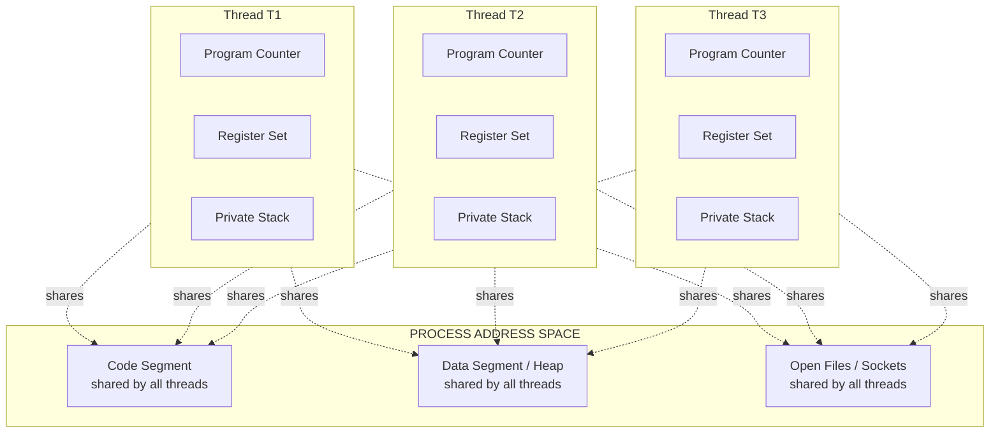
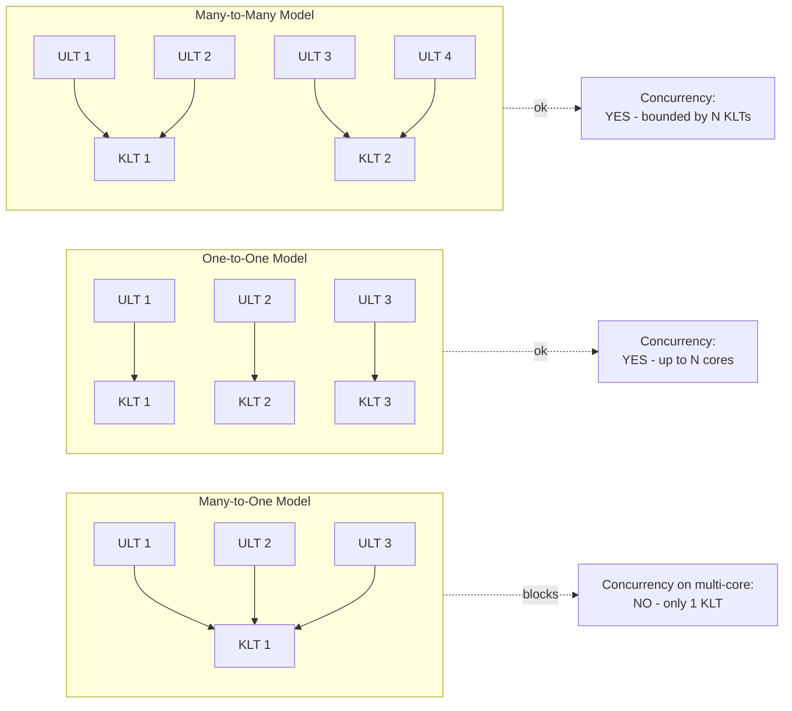
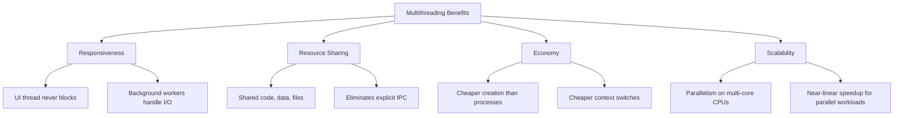
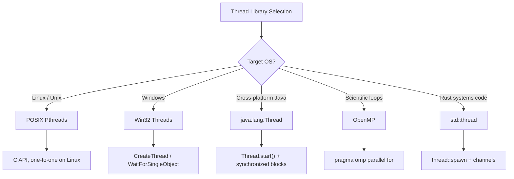

# Multithreading benefits

<!-- SECTION_1_START -->

# Multithreading Benefits

## 1.1 Formal Definition (KTU 2024 Syllabus Terminology)

> [!IMPORTANT]
> **Multithreading** is a programming and operating-system execution model that allows a single **process** to contain multiple concurrent threads of control. Each thread represents an independent flow of control that shares the **code segment**, **data segment**, and **operating-system resources** (open files, signals, etc.) of its parent process, while maintaining its own **thread ID**, **program counter**, **register set**, and **stack**.

A thread is often called a **lightweight process (LWP)** because it is a basic unit of CPU utilization that consumes far fewer system resources than a full process. Modern general-purpose operating systems such as **Linux**, **Windows**, and **macOS** treat threads as the fundamental schedulable entities dispatched to CPU cores by the kernel scheduler.

> [!NOTE]
> **Key KTU Terminology Mapping**
> - **Process** = resource ownership unit (address space, I/O, files)
> - **Thread** = dispatching / execution unit (PC, registers, stack)
> - **Multithreading** = multiple threads within one process, executing concurrently

## 1.2 Conceptual Analogy — The Modern Restaurant Kitchen

Imagine a single chef running an entire restaurant kitchen:

- **Single-threaded process** = one chef trying to bake bread, chop vegetables, stir soup, and plate desserts *one step at a time*. The oven stays idle while the chef chops, and the cutting board sits unused while the soup simmers.
- **Multithreaded process** = the same kitchen now has *four cooks*, each performing a different task simultaneously while sharing the same pantry (code, data, ingredients). They coordinate through the same head chef (process), but each cook maintains their own cutting board, knife, and recipe card (PC, registers, stack).

> **Result:** The kitchen produces meals in roughly **one-fourth the wall-clock time** without needing four separate kitchens (which would be the cost of running four *processes*).

This kitchen analogy directly mirrors how modern CPUs exploit **instruction-level**, **data-level**, and **task-level parallelism** through multithreading.

## 1.3 Why Multithreading Exists — The Engineering Motivation

Modern CPUs ship with **multiple cores** (e.g., 8-core, 16-core, 64-core server chips). A purely single-threaded program can only ever use **one core** at a time, wasting the remaining **N − 1** cores. Multithreading unlocks this latent compute capacity and is the *de-facto* mechanism by which:

- Web servers (e.g., **Apache Tomcat**, **Nginx worker pools**) handle thousands of client requests.
- Database engines (e.g., **PostgreSQL**, **MySQL InnoDB**) run query, log, and checkpoint tasks in parallel.
- GUI applications keep the user interface responsive while performing background I/O.
- Scientific workloads (e.g., matrix multiplication, simulations) achieve near-linear speedup.

## 1.4 GeoGebra / Desmos Integration

> [!VISUALIZATION CONTROL]
> **Concept:** Speedup vs. Number of Threads (Amdahl's Law Curve)
>
> **GeoGebra / Desmos Input Equations:**
>
> - `P = 0.10`  *(parallelizable fraction)*
> - `S(n) = 1 / ((1 - P) + P/n)`
> - `n = {1, 2, 4, 8, 16, 32, 64}`
>
> **Visual Description:** Plot a decreasing curve $S(n)$ on the x-axis (number of threads) against the y-axis (theoretical speedup). Observe the curve **flattening** as $n$ grows, illustrating that even with **infinite threads**, the serial fraction $(1-P)$ caps the maximum achievable speedup. This visualizes exactly *why* multithreading is beneficial but not magically infinite.

---

<!-- SECTION_1_END -->

<!-- SECTION_2_START -->

# Deep Theoretical Analysis & KTU High-Yield Cheat Sheet

## 2.1 The Core Benefits of Multithreading (Board-Favorite List)

The KTU 2024 syllabus explicitly highlights the following **four canonical benefits**. Examiners expect these phrased using the exact module terminology.

### 1. **Responsiveness**

- A multithreaded interactive application remains responsive to user input even when a portion of it is blocked (e.g., performing I/O or a long computation).
- In a **single-threaded GUI**, a 5-second file load would freeze the entire window. With multithreading, the UI thread continues to redraw widgets while a worker thread loads the file.

### 2. **Resource Sharing**

- Threads of the same process **automatically share** the code, data, and OS resources (files, memory-mapped regions, sockets).
- This eliminates the need for explicit inter-process communication (IPC) mechanisms like **shared memory segments**, **message queues**, or **pipes**.
- Sharing is implemented at the kernel level using the same virtual address space, so threads can communicate through simple **global variables** (with synchronization).

### 3. **Economy**

- Creating, switching, and terminating a thread is **dramatically cheaper** than doing the same for a process.
- The OS does not need to allocate a new address space, page table, or set of kernel data structures for a thread — only a new **TCB (Thread Control Block)**, stack, and registers.
- On **Linux**, a `fork()` syscall takes ~100 µs; `pthread_create()` takes ~20 µs. Context-switch latency is similarly lower.

### 4. **Scalability (Utilization of Multiprocessor Architectures)**

- Threads can run **truly in parallel** on a multi-core CPU, one thread per core.
- This produces a near-linear speedup for embarrassingly parallel workloads (image filters, hashing batches, Monte Carlo simulations).
- The OS scheduler dynamically distributes ready threads across available cores to maximize CPU utilization.

> [!NOTE]
> **Memory-Order Benefit (Implicit):** Because threads share the same address space, the working set of a multithreaded process is smaller than that of N cooperating processes performing the same task, leading to better **cache locality** and **TLB efficiency**.

## 2.2 KTU High-Yield Cheat Sheet

### Table 2.A — Thread vs. Process (Comparison)

| Property | Process | Thread |
|---|---|---|
| Address space | Private | Shared with peer threads |
| Creation cost | High (clone page tables, allocate kernel structs) | Low (TCB + stack only) |
| Context-switch cost | High (TLB flush, cache pollution) | Low (same address space) |
| Communication | IPC needed (pipes, sockets, shm) | Shared globals (with sync) |
| Isolation | Strong (faults contained) | Weak (one thread can crash process) |
| Scheduling unit | Process | Thread (in most modern OS) |

### Table 2.B — Multithreading Support Models

| Model | Mapping | Managed By | Concurrency on Multi-core | Example |
|---|---|---|---|---|
| **Many-to-One** | Many ULTs $\mapsto$ 1 KLT | Thread library (user space) | **No** — only one kernel-schedulable entity | GNU Portable Threads, early Solaris ULT |
| **One-to-One** | 1 ULT $\mapsto$ 1 KLT | Kernel | **Yes** | Linux NPTL, Windows, Pthreads on most systems |
| **Many-to-Many** | M ULTs $\mapsto$ N KLTs ($M \ge N$) | Hybrid (user + kernel) | **Yes** (limited by N) | Solaris, HP-UX, Tru64 UNIX |

### Table 2.C — Popular Thread Libraries (KTU 2024 Module 1)

| Library | Standard | Language | Kernel Binding | Typical Use |
|---|---|---|---|---|
| **POSIX Pthreads** | IEEE 1003.1c (POSIX.1) | C / C++ | One-to-one (Linux/macOS) | High-performance Linux servers, HPC |
| **Win32 Threads** | Win32 API | C / C++ | One-to-one (Windows) | Native Windows apps and services |
| **Java Threads** | JSR-166 / `java.util.concurrent` | Java | One-to-one via JNI / HotSpot | Cross-platform enterprise software |
| **OpenMP** | OpenMP Architecture Review Board | C / C++ / Fortran | Compiler directives $\to$ thread team | Scientific / numerical loops |
| **Rust `std::thread`** | Rust standard library | Rust | One-to-one | Systems programming |

## 2.3 Where Multithreading is Used in Production Engineering

- **Web servers:** Apache `mpm_worker`, Nginx worker pool, Netty (Java NIO) event loops.
- **Databases:** PostgreSQL's per-connection backend process, MySQL InnoDB's background I/O threads.
- **Compilers:** GCC's `-ftree-parallelize-loops`, Rust's `rayon` crate for parallel iterators.
- **GUI frameworks:** Qt's `QThread`, JavaFX `Task`, Android `AsyncTask`.
- **Operating system kernels:** Linux kernel threads (`kthread`), Windows `ETHREAD` and worker threads.

> **Engineering Trade-off (Important for KTU):** Multithreading introduces *non-determinism* and *race conditions*. KTU examiners expect students to mention that **synchronization primitives** (mutexes, semaphores, condition variables, barriers) and **concurrency bugs** (deadlock, livelock, starvation) are direct consequences — and *not* free side effects.

---

<!-- SECTION_2_END -->

<!-- SECTION_3_START -->

# Step-by-Step Derivations, Code & Symbolic Implementation

## 3.1 Exhaustive C Implementation using POSIX Pthreads

> [!NOTE]
> The following program spawns **two threads** that each compute the sum of a portion of an array in parallel, demonstrating the canonical *divide-and-conquer* multithreading pattern.

```c
/*
 * File        : multithreaded_sum.c
 * Compile     : gcc -O2 -pthread multithreaded_sum.c -o sum
 * Run         : ./sum
 * Description : KTU 2024 - PCCST403 - Multithreading Benefits Demo
 */

#include <stdio.h>
#include <stdlib.h>
#include <pthread.h>

/* Size of the data array (must be even for clean partitioning). */
#define ARRAY_SIZE 100000000
#define NUM_THREADS 2

/* Shared data across all threads (resource-sharing benefit). */
double *data_array;

/* Each thread receives its own argument via this struct. */
typedef struct {
    int    thread_id;     /* Logical ID of the thread (0..NUM_THREADS-1) */
    int    start_index;   /* Inclusive start of the slice */
    int    end_index;     /* Inclusive end of the slice */
    double partial_sum;   /* Result written by this thread */
} ThreadArgs;

/* ----------------------------------------------------------------
 * Worker function executed by every thread.
 * Each thread sums its assigned slice of data_array.
 * ---------------------------------------------------------------- */
void *worker_sum(void *arg) {
    ThreadArgs *args = (ThreadArgs *) arg;   /* Safe downcast */
    args->partial_sum = 0.0;                 /* Initialise accumulator */

    for (int i = args->start_index; i <= args->end_index; ++i) {
        args->partial_sum += data_array[i];
    }

    printf("[Thread %d] summed indices [%d..%d] = %.2f\n",
           args->thread_id, args->start_index,
           args->end_index, args->partial_sum);

    /* Returning a non-NULL value signals success to pthread_join(). */
    return (void *) 0;
}

/* ----------------------------------------------------------------
 * Driver: allocates the array, spawns threads, joins, aggregates.
 * ---------------------------------------------------------------- */
int main(void) {
    /* 1. Allocate and initialise the shared data array. */
    data_array = (double *) malloc(sizeof(double) * ARRAY_SIZE);
    if (data_array == NULL) {
        perror("malloc failed");
        return EXIT_FAILURE;
    }
    for (long i = 0; i < ARRAY_SIZE; ++i) {
        data_array[i] = 1.0;   /* Trivial value: sum = ARRAY_SIZE */
    }

    /* 2. Create the thread handles and their arguments. */
    pthread_t       handles[NUM_THREADS];
    ThreadArgs      args[NUM_THREADS];
    int             slice = ARRAY_SIZE / NUM_THREADS;
    int             rc;

    for (int t = 0; t < NUM_THREADS; ++t) {
        args[t].thread_id   = t;
        args[t].start_index = t * slice;
        args[t].end_index   = (t + 1) * slice - 1;
        args[t].partial_sum = 0.0;

        /* pthread_create returns 0 on success, error code on failure. */
        rc = pthread_create(&handles[t], NULL, worker_sum, &args[t]);
        if (rc != 0) {
            fprintf(stderr, "pthread_create failed: %d\n", rc);
            return EXIT_FAILURE;
        }
    }

    /* 3. Join: wait for all threads to complete (resource cleanup). */
    double total = 0.0;
    for (int t = 0; t < NUM_THREADS; ++t) {
        pthread_join(handles[t], NULL);
        total += args[t].partial_sum;
    }

    /* 4. Output and validate. */
    printf("Total sum = %.2f (expected %.2f)\n", total, (double) ARRAY_SIZE);
    free(data_array);
    return EXIT_SUCCESS;
}
```

### 3.1.1 Step-by-Step Walkthrough of the Code

1. **Shared resource declaration** — `data_array` is declared *outside* any function (file-scope), so all threads in the process can read and write it. This is the *resource sharing* benefit in action.
2. **`ThreadArgs` struct** — Each thread receives a *private* copy of its own argument structure. The struct is allocated in the main thread's stack, but its address is passed to the worker; because `args` is an array, every slot is a distinct memory location.
3. **`pthread_create()`** — Creates a kernel-schedulable thread. The signature is:

   $$\texttt{int pthread\_create(pthread\_t *thread, const pthread\_attr\_t *attr, void *(*start\_routine)(void *), void *arg);}$$

4. **`worker_sum()`** — The thread's entry function. Each invocation has its own stack frame, but reads the *shared* `data_array`.
5. **`pthread_join()`** — Blocks the caller until the target thread terminates; essentially analogous to `waitpid()` for processes. It also returns the thread's exit value.
6. **Aggregation in main** — The main thread sums the two partial sums, demonstrating that the *parent* can safely collect results because the join synchronises with the worker's termination (happens-before relationship).

> [!IMPORTANT]
> **No explicit locking** is needed here because (a) each thread writes to a *different* `args[t].partial_sum` (no shared mutable state for results), and (b) the main thread only reads the partial sums *after* `pthread_join()` — the join establishes a synchronization barrier.

## 3.2 Exhaustive Java Implementation

```java
/**
 * File        : MultithreadedSum.java
 * Compile     : javac MultithreadedSum.java
 * Run         : java MultithreadedSum
 * Description : KTU 2024 - PCCST403 - Multithreading Benefits Demo in Java
 */
public class MultithreadedSum {

    /* Static shared array - visible to all inner worker threads. */
    private static double[] dataArray;

    /* Nested static class so each thread is a clean object. */
    static class SumWorker extends Thread {
        private final int startIndex;
        private final int endIndex;
        private double partialSum;

        public SumWorker(int id, int start, int end) {
            super("SumWorker-" + id);   /* Set a human-readable name. */
            this.startIndex = start;
            this.endIndex   = end;
        }

        @Override
        public void run() {
            partialSum = 0.0;
            for (int i = startIndex; i <= endIndex; i++) {
                partialSum += dataArray[i];
            }
            System.out.printf("[%s] sum[%d..%d] = %.2f%n",
                              getName(), startIndex, endIndex, partialSum);
        }

        public double getPartialSum() { return partialSum; }
    }

    public static void main(String[] args) throws InterruptedException {
        final int ARRAY_SIZE  = 100_000_000;
        final int NUM_THREADS = 2;

        dataArray = new double[ARRAY_SIZE];
        for (int i = 0; i < ARRAY_SIZE; i++) {
            dataArray[i] = 1.0;
        }

        int slice = ARRAY_SIZE / NUM_THREADS;
        SumWorker[] workers = new SumWorker[NUM_THREADS];

        for (int t = 0; t < NUM_THREADS; t++) {
            int start = t * slice;
            int end   = (t + 1) * slice - 1;
            workers[t] = new SumWorker(t, start, end);
            workers[t].start();   /* Triggers JVM to invoke run() in a new OS thread. */
        }

        double total = 0.0;
        for (int t = 0; t < NUM_THREADS; t++) {
            workers[t].join();    /* Mirrors pthread_join. */
            total += workers[t].getPartialSum();
        }

        System.out.printf("Total = %.2f (expected %.2f)%n",
                          total, (double) ARRAY_SIZE);
    }
}
```

## 3.3 Mathematical Derivation — Speedup Bound (Amdahl's Law)

Let $P$ be the fraction of a program that can be parallelised and $(1-P)$ be the inherently serial fraction. With $n$ threads executing in parallel on $n$ cores, the total execution time becomes:

$$
T(n) = (1 - P) \cdot T_{\text{serial}} + \frac{P \cdot T_{\text{serial}}}{n}
$$

Dividing by $T_{\text{serial}}$ yields the normalised time, and inverting gives the **speedup** $S(n)$:

$$
S(n) = \frac{T_{\text{serial}}}{T(n)} = \frac{1}{(1 - P) + \frac{P}{n}}
$$

Taking the limit as $n \to \infty$:

$$
\lim_{n \to \infty} S(n) = \frac{1}{1 - P}
$$

> [!IMPORTANT]
> **Engineering Implication:** Even with **infinite** threads, the maximum speedup is capped at $\dfrac{1}{1-P}$. If 10% of the code is serial, the absolute ceiling is $S_{\max} = 1 / 0.10 = 10\times$. This is *the* fundamental justification for optimising serial sections when scaling multithreaded code.

---

<!-- SECTION_3_END -->

<!-- SECTION_4_START -->

# Structural Diagrams & Schematics

## 4.1 Mermaid Diagram — Process with Multiple Threads (Resource Sharing)



> **Reading guide:** The dashed "shares" arrows point from each thread's private TCB to the *common* process resources. This is the visual definition of the **resource sharing** benefit.

## 4.2 Mermaid Diagram — Multithreading Support Models



## 4.3 Mermaid Diagram — Benefits Flow Topology



## 4.4 Mermaid Diagram — Thread Library Comparison Flow



---

<!-- SECTION_4_END -->

<!-- SECTION_5_START -->

# KTU 2024 Scheme Examination Question Bank & Topic Recap

> [!NOTE]
> **Mark Distribution Reference (KTU 2024 PCCST403):** Part A = 3 marks each (short answer). Part B = 14 marks with internal choice — students answer **either** Question A **or** Question B in full. Each Part B question is split into (a) 7 marks and (b) 7 marks to encourage structured answers.

---

## Part A — Short Answer Questions (3 Marks Each)

### Q1. **[KTU University Exam — July 2024 Style]** *Define a thread. How is it different from a process?* `[CO1] [Remember]`

**Model Answer (3 Marks):**

A **thread** is a basic unit of CPU utilization, comprising a thread ID, a program counter, a register set, and a stack. It shares with other threads belonging to the same process its code segment, data segment, and open files. **[1 Mark]**

Differences from a process:

1. Threads of the same process share memory; processes have separate address spaces. **[1 Mark]**
2. Thread creation is cheaper (no new page table) and context-switch overhead is lower. **[1 Mark]**

---

### Q2. **[KTU University Exam — Dec 2023 Style]** *List any six benefits of multithreading.* `[CO1] [Understand]`

**Model Answer (3 Marks):**

1. **Responsiveness** — interactive applications remain usable.
2. **Resource sharing** — threads share code, data, and files by default.
3. **Economy** — cheaper creation and context-switch than processes.
4. **Scalability** — multiple threads can use multiple CPU cores in parallel.
5. **Better resource utilisation** — idle CPU time on a single-threaded process is reclaimed. **[½ Mark]**
6. **Simplified communication** — globals are shared, no explicit IPC needed. **[½ Mark]**

*(One mark per two items, examiners typically allocate ½ Mark per item and round.)*

---

## Part B — 14-Mark Questions (Internal Choice: Answer either A or B)

### Q3. **[KTU University Exam — Model Paper Style]** `[CO2] [Understand + Apply]`

#### **Option A — Multithreading Models + Pthreads Code**

**(a)** Explain the three multithreading models — **Many-to-One**, **One-to-One**, and **Many-to-Many** — with neat diagrams. Discuss their relative advantages and limitations. **[7 Marks]**

**Model Solution:**

| Model | Diagram Description | Advantage | Limitation |
|---|---|---|---|
| Many-to-One | Many ULTs multiplexed into one KLT | Efficient thread management in user space; portable | Cannot exploit multi-core; one blocking syscall blocks the whole process |
| One-to-One | Each ULT $\mapsto$ one KLT | True parallelism on multi-core; one thread blocked does not stop others | Each thread creation consumes kernel resources; limits maximum thread count |
| Many-to-Many | $M$ ULTs multiplexed onto $N$ KLTs ($M \ge N$) | Combines flexibility of Many-to-One with parallelism of One-to-One; developer can spawn many threads | Complex implementation; difficult to tune $N$ |

**Valuation Key Points:**

- [Diagram of each model with clear ULT and KLT labels: 1.5 Marks]
- [Brief description of each: 1.5 Marks]
- [Advantage / Limitation pairs (one model 1 Mark, all three 3 Marks): 3 Marks]
- [Example OS for each model: 1 Mark]

**(b)** Write a C program using **POSIX Pthreads** that creates two threads. Each thread should print `"Hello from thread X"` where `X` is the thread ID. Use `pthread_create()`, `pthread_join()`, and explain the role of each call. **[7 Marks]**

**Model Solution:**

```c
#include <stdio.h>
#include <pthread.h>

void *hello(void *arg) {
    long tid = (long) arg;
    printf("Hello from thread %ld\n", tid);
    return NULL;
}

int main(void) {
    pthread_t t1, t2;
    pthread_create(&t1, NULL, hello, (void *) 1L);   /* Spawn thread 1 */
    pthread_create(&t2, NULL, hello, (void *) 2L);   /* Spawn thread 2 */
    pthread_join(t1, NULL);                            /* Wait for thread 1 */
    pthread_join(t2, NULL);                            /* Wait for thread 2 */
    return 0;
}
```

**Valuation Key Points:**

- [Correct inclusion of `pthread.h` and `-pthread` compile flag mention: 1 Mark]
- [`pthread_create` call with correct 4-argument signature: 2 Marks]
- [`pthread_join` for both threads with rationale: 1 Mark]
- [Thread function `hello` with proper return type `void *`: 1 Mark]
- [Working output demonstration / explanation: 1 Mark]
- [Neatness and commenting: 1 Mark]

---

#### **Option B — Multithreading Benefits + Thread Pools / Fork-Join**

**(a)** Discuss the major benefits of multithreading. For each benefit, give a real-world engineering example. **[7 Marks]**

**Model Solution:**

1. **Responsiveness — Example:** A web browser uses one thread to render the page, another to download images, and a third to run JavaScript. The UI remains scrollable while network I/O is in progress. **[1.75 Marks]**
2. **Resource Sharing — Example:** A database server's worker threads share the in-memory buffer pool without serialising through a separate IPC channel. Updating one buffer entry is automatically visible to all threads. **[1.75 Marks]**
3. **Economy — Example:** An HTTP server that spawns a thread per request (e.g., early Java Servlets) is far cheaper than spawning a process, allowing thousands of concurrent connections on modest hardware. **[1.75 Marks]**
4. **Scalability — Example:** A video encoder splits a 4K frame into 16 macroblock tiles and processes them in parallel across 16 cores, achieving near 16× speedup. **[1.75 Marks]**

**(b)** Explain the **thread pool** design pattern and the **fork–join parallelism** paradigm. Give one real-world example of each. **[7 Marks]**

**Model Solution:**

- **Thread Pool:** A pre-allocated set of N reusable worker threads maintained by a manager. Tasks are submitted to a shared queue; idle workers dequeue and execute. When a worker finishes, it returns to the pool instead of being destroyed. **Advantage:** Eliminates the per-task creation/destruction overhead. **Example:** `java.util.concurrent.ExecutorService.newFixedThreadPool(16)` used in Tomcat to handle HTTP requests. **[3.5 Marks]**
- **Fork–Join Paradigm:** A divide-and-conquer framework where a task *forks* (spawns child sub-tasks) recursively until a threshold size is reached, then *joins* (combines) the results. Modern implementations use **work-stealing** schedulers for load balancing. **Example:** Java's `java.util.concurrent.ForkJoinPool` used by the streams API for parallel `sort()` and `parallelStream()` operations. **[3.5 Marks]**

**Valuation Key Points:**

- [Thread pool explanation with reuse benefit: 1.5 Marks]
- [Real-world Java/.NET example: 1 Mark]
- [Fork–join explanation with work-stealing: 1.5 Marks]
- [Real-world example: 1 Mark]
- [Neat diagram of pool / fork-join: 1 Mark]
- [Comparison or trade-off note: 1 Mark]

---

> [!WARNING]
> **KTU Examiner's Valuation Pitfall Callout**
> 1. **Do NOT** confuse *user-level threads (ULT)* with *kernel-level threads (KLT)* in the model diagrams — a common 1-mark deduction.
> 2. **Do NOT** write `pthread_create(t, NULL, hello, (void *) 1L);` *without* the address-of operator — a missing `&` is a 1-mark error.
> 3. **Do NOT** skip the `pthread_join()` call; if main exits before the worker thread runs `printf`, the program may produce no output, which examiners treat as a 0.5-mark runtime error.
> 4. **Always** mention **synchronisation primitives** (mutex, semaphore, condition variable) when discussing resource sharing — examiners award 1 mark specifically for the *caveat* that shared memory requires explicit locking.
> 5. **Avoid** the casual phrase "threads are faster" — be precise: threads are *cheaper to create* and *enable parallelism on multi-core CPUs*, not magically faster per CPU cycle.

---

## Topic Recap & Important Things to Remember

- **Thread definition:** A thread = **TCB + private stack + PC + registers**, sharing the parent process's **code, data, heap, and OS resources**. A process = **address space + resources + at least one thread**.
- **Four canonical benefits:** **Responsiveness, Resource Sharing, Economy, Scalability** — phrased in that order for full credit.
- **Three multithreading models:** Many-to-One (no multi-core), One-to-One (true parallelism, kernel-heavy), Many-to-Many (hybrid, M ULTs on N KLTs).
- **Thread libraries to know:** **POSIX Pthreads** (Linux/C), **Win32** (Windows), **Java `Thread`** (JVM). OpenMP and Rust `std::thread` are bonus mentions.
- **Key Pthread API:** `pthread_create()`, `pthread_join()`, `pthread_exit()`, `pthread_mutex_lock()`, `pthread_cond_wait()`. Always compile with `-pthread` on Linux.
- **Amdahl's Law:** $S(n) = \dfrac{1}{(1 - P) + P/n}$; maximum speedup = $\dfrac{1}{1 - P}$.
- **Cost order:** Thread creation $<$ Process creation; thread context-switch $<$ process context-switch; thread memory footprint $\ll$ process memory footprint.
- **Concurrency hazards to acknowledge in any answer:** **race condition**, **deadlock**, **livelock**, **starvation** — these are direct consequences of the *resource sharing* benefit.
- **Real-world instantiations:** Apache worker MPM, Java `ExecutorService`, PostgreSQL backend processes, GUI event-dispatch threads, Linux kernel threads (`kthread`).
- **One-line mantra for viva:** *"Multithreading gives us responsive, resource-efficient, scalable execution by sharing the heavyweight process resources among many lightweight threads."*

---

<!-- SECTION_5_END -->
