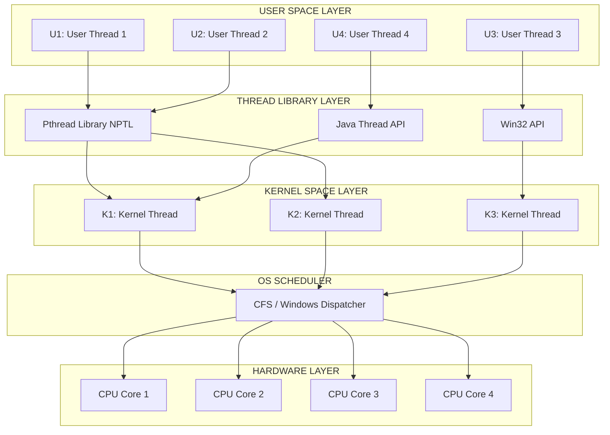
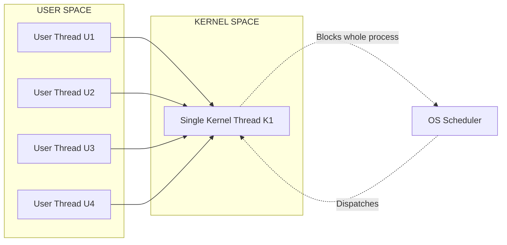
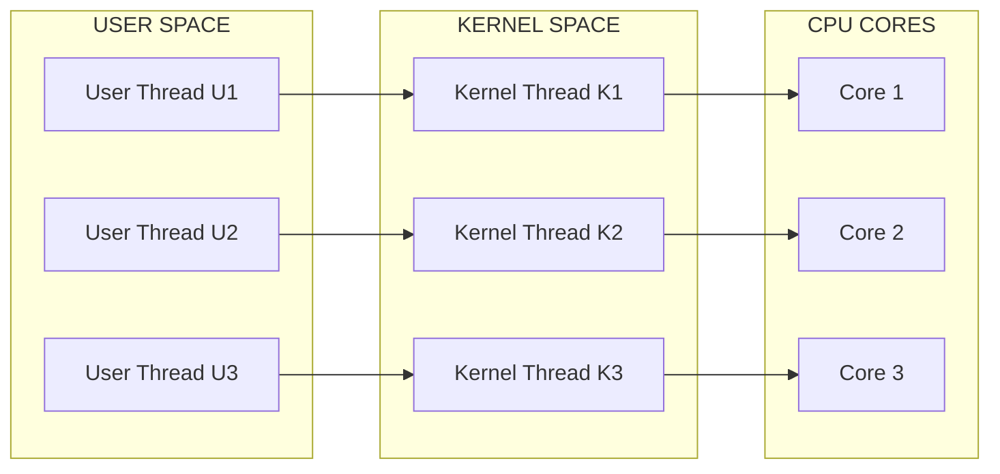
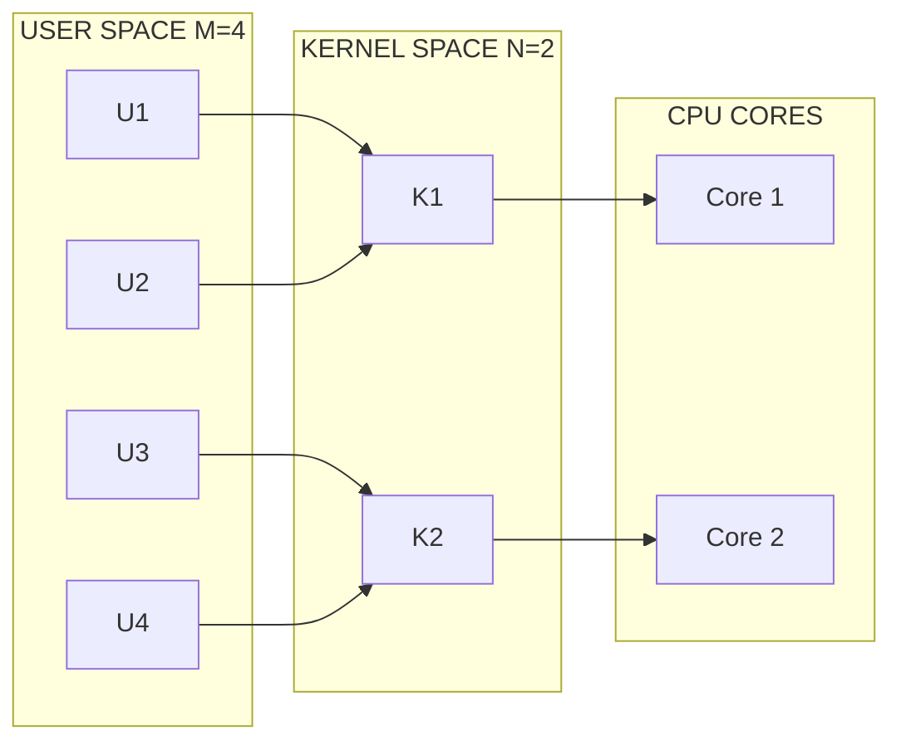
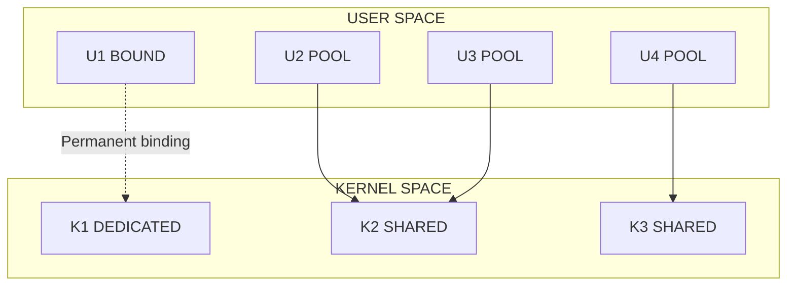
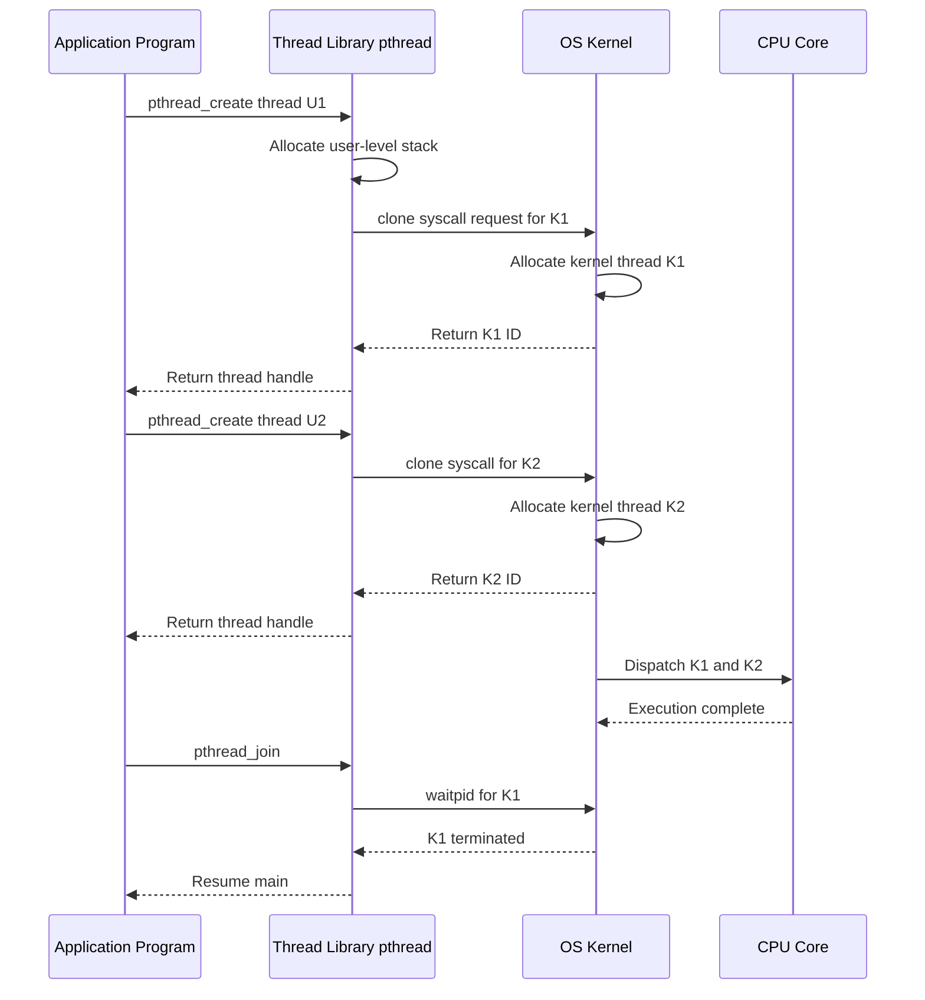
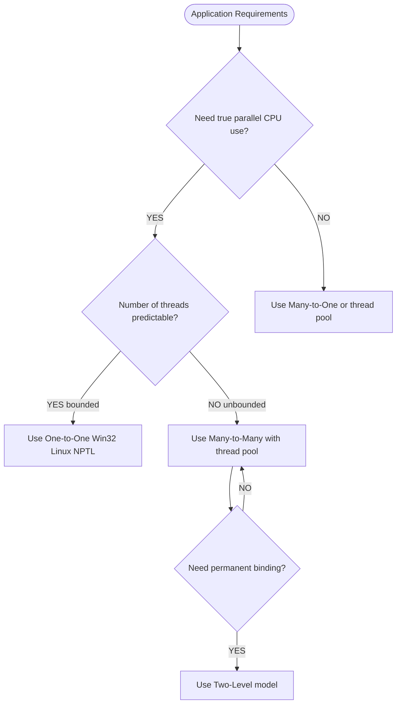

# Multithreading models

<!-- SECTION_1_START -->

# Multithreading Models

> [!IMPORTANT]
> **KTU 2024 Scheme | PCCST403 — Operating Systems | Module 1**
> **Syllabus Anchor:** Thread usage, benefits, multithreading models (Many-to-One, One-to-One, Many-to-Many), thread libraries, implicit threading.

## 1.1 Formal Academic Definition

A **thread** is the smallest unit of CPU execution that consists of a **thread ID**, a **program counter (PC)**, a **register set**, and a **stack**. It shares its **code section**, **data section**, and other **operating-system resources** (such as open files and signals) with peer threads belonging to the same **process**. **Multithreading** is the ability of an operating system to support multiple, concurrent paths of execution within a single process, and a **multithreading model** is the formal mapping specification that defines the relationship between **user-level threads (ULT)** and **kernel-level threads (KLT)** recognized and scheduled by the OS kernel.

> [!NOTE]
> **Canonical KTU Definition (Silberschatz/Galvin/Gagne — 10th Ed.):**
> *"Multithreading models dictate how the user-level threads (created in user space) are mapped to the kernel-level threads (managed by the OS kernel) for actual execution on the CPU."*

## 1.2 Conceptual Analogy — The Restaurant Kitchen

Imagine a busy restaurant kitchen (the **process**) preparing a five-course meal:

- The **kitchen itself** = a single process holding all the shared resources (stoves, ovens, refrigerators, recipes, the menu card).
- Each **chef** working on a separate dish = a **thread** of execution.
- The **head chef (kitchen manager)** = the **thread library** (Pthreads / Win32 / Java).
- The **restaurant floor manager who assigns cooking stations to chefs** = the **kernel scheduler**.

Now, the **multithreading model** is the **HR policy** of the restaurant that dictates how chefs (user threads) are assigned to actual cooking stations (kernel threads):

| Kitchen Policy | OS Model | Restaurant Behavior |
|---|---|---|
| Many-to-One | All chefs share ONE cooking station | Only one chef can cook at a time. If one chef blocks (waits for an oven), **the entire kitchen halts**. |
| One-to-One | Each chef gets a personal station | Maximum throughput, but the restaurant cannot afford more stations than the budget allows. |
| Many-to-Many | Chefs are flexibly assigned to fewer stations | Optimal balance. If a chef blocks, another can take over the station. |
| Two-Level | Senior chefs (VIP) get fixed stations; others are pooled | A hybrid strategy used in IRIX. |

## 1.3 Key Terminology and Constants

> [!IMPORTANT]
> **Standard Engineering Metrics for KTU Board Answers:**
> - **Thread Stack Size (Typical):** $\mathbf{1\;MB}$ to $\mathbf{8\;MB}$ per thread (Linux default = **8 MB**).
> - **Process Context Switch Cost:** $\mathbf{\sim 1\;{\mu}s}$ to $\mathbf{\sim 10\;{\mu}s}$ on modern x86_64 hardware.
> - **Thread Context Switch Cost:** $\mathbf{\sim 1\;{\mu}s}$ to $\mathbf{\sim 2\;{\mu}s}$ (roughly **5x–10x cheaper** than a full process switch).
> - **POSIX Thread Return Type:** `void *` (Pthread signature).
> - **Java Thread Priority Constant Range:** `Thread.MIN_PRIORITY = 1` and `Thread.MAX_PRIORITY = 10`.

## 1.4 GeoGebra / Desmos Visualization Concept

> [!VISUALIZATION CONTROL]
> **Concept:** Bipartite Mapping of User Threads $U_i$ to Kernel Threads $K_j$ on a 2D Cartesian Plane.
>
> **Desmos Input Equations:**
> * `U1 = (1, 4)`, `U2 = (3, 4)`, `U3 = (5, 4)`, `U4 = (7, 4)`  *(User-level thread layer)*
> * `K1 = (2, 1)`, `K2 = (5, 1)`, `K3 = (8, 1)`  *(Kernel-level thread layer)*
> * For **Many-to-One**: Draw all $U_i$ converging to $K1$.
> * For **One-to-One**: Draw one-to-one vertical pairings.
> * For **Many-to-Many**: Draw $U1, U2 \rightarrow K1$ and $U3, U4 \rightarrow K2$.
>
> **Visual Description:** Observe how the cardinality of the *codomain* (kernel threads) versus the *domain* (user threads) determines the model. The **y-axis gap** of 3 units represents the **user–kernel privilege boundary**.

<!-- SECTION_1_END -->

<!-- SECTION_2_START -->

# Deep Theoretical Analysis & KTU High-Yield Formula Sheet

## 2.1 Why Multithreading? — The Four Pillars of Benefit

1. **Responsiveness:** A long-running task in one thread does not freeze the entire application (e.g., a web browser continues to scroll while a video is being downloaded).
2. **Resource Sharing:** Threads share the process's memory and resources by default, eliminating the overhead of explicit Inter-Process Communication (IPC) mechanisms such as pipes, shared memory segments, or sockets.
3. **Economy:** Allocating memory and resources for a new process is expensive; creating a thread is significantly cheaper. In Linux, `pthread_create()` is approximately **10–30x faster** than `fork()`.
4. **Scalability (Multiprocessor Utilization):** On a system with $N$ CPU cores, multiple threads within a process can execute **truly in parallel** on separate cores, achieving a near-linear speedup.

## 2.2 The Three Canonical Multithreading Models

### Model A — Many-to-One (Many ULT $\rightarrow$ One KLT)

- **Mechanism:** All user-level threads are mapped to a single kernel thread.
- **Thread Management:** Performed entirely in **user space** by a user-level thread library.
- **Concurrency:** The kernel sees only **one thread** per process, so it cannot assign it to multiple cores in parallel.
- **Blocking Problem:** If any thread makes a **blocking system call** (e.g., `read()` on a pipe), the **entire process** is blocked because the kernel does not know about the other user threads.
- **Implementations:** Historical — *GNU Portable Threads (GNU Pth)*, *Solaris Green Threads*.

### Model B — One-to-One (One ULT $\rightarrow$ One KLT)

- **Mechanism:** Every user thread is bound to a distinct kernel thread.
- **Concurrency:** Provides **true concurrency** on multiprocessor systems; one thread per kernel thread can run on a distinct core.
- **Drawback:** Creating a kernel thread is an **expensive system call**. Unrestricted thread creation can **overload the OS** or exhaust kernel resources.
- **Implementations:** *Windows Win32 threads*, *Linux Pthreads* (modern NPTL — Native POSIX Thread Library).

### Model C — Many-to-Many (Multiplexed, $M$ ULT $\rightarrow$ $N$ KLT, where $M \geq N$)

- **Mechanism:** The thread library multiplexes $M$ user threads onto $N$ (or fewer) kernel threads.
- **Flexibility:** The number $N$ of kernel threads can be either a **fixed constant** (e.g., equal to the number of CPU cores) or **dynamically adjusted** at runtime.
- **Hybrid Behavior:** Combines the **efficiency of Many-to-One** (cheap thread creation in user space) with the **true parallelism of One-to-One**.
- **Developers can also bind specific user threads to specific kernel threads** for critical real-time paths.
- **Implementations:** *Solaris (prior to Solaris 9)*, *Tru64 UNIX*, *IRIX*.

### Model D — Two-Level Model (A Refined Hybrid)

- **Mechanism:** Identical to Many-to-Many, but it allows a user thread to be **permanently bound** to a specific kernel thread.
- **Implementations:** *IRIX*, *HP-UX*, *Solaris* (some early versions).
- *KTU examiners often treat the Two-Level model as a sub-category of Many-to-Many; you may present it as an extension in your answer for full marks.*

## 2.3 Thread Libraries — The Three Industry Standards

| Library | Provided By | Scope | Threading Model | Notes |
|---|---|---|---|---|
| **POSIX Pthreads (`pthread.h`)** | IEEE POSIX 1003.1c Standard | User-level API (kernel-bridged via NPTL on Linux) | One-to-One (Linux) | The de-facto UNIX standard; explicit thread management. |
| **Win32 Thread API** | Microsoft Windows | Kernel-level API | One-to-One | The standard for native Windows applications. |
| **Java Threads** | Sun / Oracle JVM | Managed runtime layer | Maps to underlying OS model (typically One-to-One) | Built-in to the language; supports `Thread`, `Runnable`, `Executor` framework. |

## 2.4 KTU High-Yield Formula & Parameter Cheat Sheet

> [!NOTE]
> **Karnu's KTU Quick Reference — Multithreading Models**

| Concept | Symbol / Value | Description / Boundary Condition |
|---|---|---|
| User-level threads in a process | $U$ | Created by user-space library; cheap ($\sim 1\,\mu s$ per thread). |
| Kernel-level threads in a process | $K$ | Managed by the kernel; creation is a system call. |
| Mapping cardinality (Many-to-One) | $U : 1$ | $U \geq 1$, $K = 1$. No true parallelism. |
| Mapping cardinality (One-to-One) | $1 : 1$ | $U = K$. True parallelism, risk of resource exhaustion. |
| Mapping cardinality (Many-to-Many) | $U : K$ | $U \geq K \geq 1$, with $K$ tunable. |
| Amdahl's Speedup (max theoretical) | $S(N) = \dfrac{1}{(1 - P) + \dfrac{P}{N}}$ | $P$ = parallel fraction, $N$ = threads/cores. |
| Theoretical max speedup (as $N \to \infty$) | $S_{\max} = \dfrac{1}{1 - P}$ | Shows diminishing returns of multithreading. |
| Thread stack memory (Linux default) | $\mathbf{8\,MB}$ | Set by `ulimit -s`. |
| Default Java thread priority | $5$ | `Thread.NORM_PRIORITY`. |
| Pthread join blocking state | `pthread_join()` | Caller blocks until target thread terminates. |
| Kernel resource cap (Linux) | `/proc/sys/kernel/threads-max` | Prevents thread creation DoS. |

> [!IMPORTANT]
> **Real-World Engineering Utility:**
> - **Web Servers (Apache, Nginx):** Use **thread pools** (a Many-to-Many concept) to handle thousands of concurrent client requests without spawning one OS thread per request.
> - **RDBMS Engines (PostgreSQL, MySQL):** One-to-One worker threads for parallel query execution.
> - **GUI Applications (JavaFX, Android):** Swing/AWT uses a **dedicated Event Dispatch Thread (EDT)** — a One-to-One binding — to keep the UI responsive.
> - **High-Performance Computing (MPI/OpenMP):** Many-to-Many-style thread pools for scientific workloads.

<!-- SECTION_2_END -->

<!-- SECTION_3_START -->

# Step-by-Step Derivations & Code/Symbolic Implementation

## 3.1 Derivation: Why Many-to-One Cannot Exploit Multiprocessors

Let a process $P$ contain $U = 4$ user threads $T_1, T_2, T_3, T_4$ and be mapped under the **Many-to-One model** to a single kernel thread $K_1$.

$$
\text{Map} : \{T_1, T_2, T_3, T_4\} \longrightarrow \{K_1\}
$$

The kernel scheduler dispatches threads at the granularity of **kernel threads**. Since only $K_1$ exists in kernel space, the process $P$ holds exactly **one entry** in the system's **run-queue** (or Runqueue / CFS Tree).

$$
\text{Runqueue Entries for } P = \mid \{K_1\} \mid = 1
$$

A dual-core CPU has **2 dispatchable cores**. Even if both cores are idle, the kernel cannot assign two cores to process $P$ because the OS does not recognize multiple kernel threads inside $P$.

$$
\text{Parallel Cores Available to } P = \min(\text{Runqueue Entries of } P, \; \text{Idle Cores}) = \min(1, 2) = 1
$$

**Conclusion:** The degree of **true parallelism** $\Pi$ achievable by process $P$ under Many-to-One is:

$$
\Pi_{\text{M2O}} = 1 \quad \text{(regardless of } U \text{ or CPU core count)}
$$

## 3.2 Derivation: Amdahl's Law for Multithreaded Speedup

If a fraction $P$ of a program's execution time is parallelizable and the remaining $(1 - P)$ must remain strictly serial, the speedup $S(N)$ observed when running on $N$ threads is:

$$
S(N) = \frac{T_{\text{serial}}}{T_{\text{parallel}}(N)} = \frac{1}{(1 - P) + \frac{P}{N}}
$$

**Worked Example (KTU-Style):**
A program spends $\mathbf{60\%}$ of its time on parallelizable computation. Running on $\mathbf{8}$ threads, find the speedup.

**Step 1:** Identify the parameters.
* Parallel fraction: $P = 0.60$
* Number of threads: $N = 8$
* Serial fraction: $1 - P = 0.40$

**Step 2:** Substitute into Amdahl's formula.

$$
S(8) = \frac{1}{(1 - 0.60) + \frac{0.60}{8}} = \frac{1}{0.40 + 0.075}
$$

**Step 3:** Compute the denominator.

$$
0.40 + 0.075 = 0.475
$$

**Step 4:** Compute the final speedup.

$$
S(8) = \frac{1}{0.475} \approx 2.105
$$

**Step 5:** Compute the theoretical maximum as $N \to \infty$.

$$
S_{\max} = \frac{1}{1 - P} = \frac{1}{0.40} = 2.5
$$

> [!NOTE]
> **Examiner's Insight:** Even with *infinite* threads, the program can never exceed **2.5x speedup** because the $40\%$ serial portion forms a hard ceiling. This is why multithreading models that enable **reducing serial bottlenecks** (e.g., asynchronous I/O in One-to-One) yield bigger real-world gains than simply increasing thread count.

## 3.3 Code Implementation: POSIX Pthreads (One-to-One on Linux)

The following is a **fully operational C program** that creates two threads using the **One-to-One multithreading model** (as implemented by Linux NPTL). Every line is annotated for KTU board reference.

```c
/* multithread_demo.c
 * Demonstrates One-to-One thread mapping via POSIX Pthreads.
 * Compile: gcc -pthread multithread_demo.c -o multithread_demo
 */

#include <stdio.h>
#include <stdlib.h>
#include <string.h>
#include <pthread.h>
#include <unistd.h>
#include <errno.h>

/* Shared global data — accessible by both threads (resource sharing proof) */
static int shared_counter = 0;
static pthread_mutex_t counter_mutex = PTHREAD_MUTEX_INITIALIZER;

/* Thread routine — must match signature: void *(*)(void *) */
void *worker_thread(void *arg) {
    char *thread_name = (char *)arg;   /* Cast generic pointer back to string */
    int local_iterations = 5;
    int i;

    for (i = 0; i < local_iterations; i++) {
        /* Critical section: protect shared resource */
        if (pthread_mutex_lock(&counter_mutex) != 0) {
            fprintf(stderr, "[%s] Mutex lock failed: %s\n",
                    thread_name, strerror(errno));
            return (void *)-1;
        }

        shared_counter++;              /* Race condition if not protected */
        printf("[%s] Iteration %d — shared_counter = %d\n",
               thread_name, i + 1, shared_counter);

        if (pthread_mutex_unlock(&counter_mutex) != 0) {
            fprintf(stderr, "[%s] Mutex unlock failed: %s\n",
                    thread_name, strerror(errno));
            return (void *)-1;
        }

        sleep(1);                      /* Yield to scheduler */
    }

    return (void *)0;                  /* Successful termination */
}

int main(void) {
    pthread_t thread_id_1, thread_id_2;
    void *thread_return_1, *thread_return_2;
    int rc;

    /* Create Thread 1 — One-to-One mapping to kernel thread K1 */
    rc = pthread_create(&thread_id_1, NULL, worker_thread, "Thread-A");
    if (rc != 0) {
        fprintf(stderr, "pthread_create Thread-A failed: %s\n", strerror(rc));
        return EXIT_FAILURE;
    }

    /* Create Thread 2 — One-to-One mapping to kernel thread K2 */
    rc = pthread_create(&thread_id_2, NULL, worker_thread, "Thread-B");
    if (rc != 0) {
        fprintf(stderr, "pthread_create Thread-B failed: %s\n", strerror(rc));
        return EXIT_FAILURE;
    }

    /* Wait for both threads to finish (blocking join) */
    pthread_join(thread_id_1, &thread_return_1);
    pthread_join(thread_id_2, &thread_return_2);

    /* Final state of shared resource */
    printf("[main] Both threads finished. Final shared_counter = %d\n",
           shared_counter);

    /* Destroy mutex to release kernel resources */
    pthread_mutex_destroy(&counter_mutex);

    return EXIT_SUCCESS;
}
```

**Expected Output (sample run, Linux x86_64):**
```
[Thread-A] Iteration 1 — shared_counter = 1
[Thread-B] Iteration 1 — shared_counter = 2
[Thread-A] Iteration 2 — shared_counter = 3
[Thread-B] Iteration 2 — shared_counter = 4
... (interleaved until 5 iterations each)
[main] Both threads finished. Final shared_counter = 10
```

## 3.4 Code Implementation: Java Threads (Maps to Underlying One-to-One)

```java
/* MultiThreadDemo.java
 * Demonstrates Java's thread model. On HotSpot JVM, Java threads are
 * One-to-One mapped to native kernel threads (N:1 on green-thread
 * classic JVMs, but 1:1 on all modern JVMs).
 */

public class MultiThreadDemo implements Runnable {

    private final String workerName;
    private static int sharedCounter = 0;   // shared across all instances

    public MultiThreadDemo(String workerName) {
        this.workerName = workerName;
    }

    @Override
    public void run() {
        for (int i = 1; i <= 5; i++) {
            incrementSharedCounter();
            System.out.printf("[%s] Iteration %d — sharedCounter = %d%n",
                              workerName, i, sharedCounter);
            try {
                Thread.sleep(1000L);       // yield, similar to sleep(1) in C
            } catch (InterruptedException e) {
                Thread.currentThread().interrupt();
                return;
            }
        }
    }

    /* synchronized => JVM-internal mutex (acts like pthread_mutex) */
    private synchronized void incrementSharedCounter() {
        sharedCounter++;
    }

    public static void main(String[] args) throws InterruptedException {
        Thread javaThread1 = new Thread(new MultiThreadDemo("JavaWorker-1"));
        Thread javaThread2 = new Thread(new MultiThreadDemo("JavaWorker-2"));

        javaThread1.start();   // invokes run() in a new kernel thread
        javaThread2.start();

        javaThread1.join();    // blocks main() until thread 1 terminates
        javaThread2.join();

        System.out.printf("[main] Both Java threads finished. " +
                          "Final sharedCounter = %d%n", sharedCounter);
    }
}
```

## 3.5 Explicit Step-by-Step Comparison Trace

Let us trace the **execution semantics** of the four models for a scenario: $U = 3$ user threads, $K = 2$ kernel threads available.

| Step | Event | Many-to-One | One-to-One | Many-to-Many | Two-Level |
|---|---|---|---|---|---|
| 1 | All 3 user threads start | Mapped to $K_1$ | Mapped to $K_1, K_2, K_3$ (need 3 KLT) | Mapped to $K_1, K_2$ (3$\rightarrow$2) | Mapped to $K_1, K_2, K_3$ (bind $T_1$ permanent) |
| 2 | $T_2$ issues blocking I/O | Entire process blocks | Only $K_2$ blocks; $K_1, K_3$ continue | Library switches $T_1$ onto $K_2$; $T_2$ blocks but process continues | $K_3$ blocks; $T_1$ continues |
| 3 | Parallelism achieved | **None** (1 core) | **Full** (3 cores) | **Partial** (2 cores) | **Hybrid** (2 bound + 1 shared) |
| 4 | Resource cost | Lowest | Highest | Medium | High |
| 5 | Failure mode | Single blocking call halts process | Kernel thread table overflow | Rare | Bound thread blocks its KLT permanently |

<!-- SECTION_3_END -->

<!-- SECTION_4_START -->

# Structural Diagrams & Schematics

## 4.1 Master Thread-Library Architecture (Top-Down View)



## 4.2 Many-to-One Model Topology



## 4.3 One-to-One Model Topology



## 4.4 Many-to-Many Model Topology (Multiplexed)



## 4.5 Two-Level Model Topology (Bounded + Pooled)



## 4.6 Thread Library API Interaction Flow



## 4.7 Decision Matrix: Choosing a Multithreading Model



<!-- SECTION_4_END -->

<!-- SECTION_5_START -->

# KTU 2024 Scheme Examination Question Bank & Topic Recap

## 5.1 Part A — Short Answer Questions (3 Marks Each)

### Question 1 (3 Marks) `[KTU University Exam - July 2023]`

**Q:** Differentiate between user-level threads and kernel-level threads.

| **Mapped CO** | **RBT Level** | **Marks Distribution** |
|---|---|---|
| CO1 | Understand | 3 |

**Model Answer (Board Key):**

* **User-Level Threads (ULT):** [1 Mark]
  Threads are managed *entirely in user space* by a thread library (e.g., `pthread` on older systems). The kernel is unaware of their existence. Thread creation, switching, and synchronization are fast because no **system call** is invoked. However, if one thread blocks on I/O, the *entire process* blocks.

* **Kernel-Level Threads (KLT):** [1 Mark]
  Threads are managed *directly by the OS kernel*. The kernel maintains a thread control block (TCB) for each one, and the scheduler treats them as independent dispatchable units. Thread creation involves a system call (e.g., `clone()` on Linux, `NtCreateThread()` on Windows) and is therefore slower, but a blocking call in one thread does not halt the process.

* **Key Distinction:** [1 Mark]
  ULTs are managed in **user space** (cheap, invisible to kernel); KLTs are managed in **kernel space** (expensive, fully scheduled by the OS). Most modern systems implement the **One-to-One** mapping where each ULT corresponds to a distinct KLT.

---

### Question 2 (3 Marks) `[KTU University Exam - Dec 2023]`

**Q:** List any three benefits of multithreading in modern operating systems.

| **Mapped CO** | **RBT Level** | **Marks Distribution** |
|---|---|---|
| CO1 | Remember | 3 |

**Model Answer (Board Key):**

1. **Responsiveness:** [1 Mark] Multithreading allows an application to remain interactive even when a long-running task is executing. For example, a web browser can continue rendering the user interface while downloading a file in a background thread.

2. **Resource Sharing:** [1 Mark] Threads belonging to the same process share memory and resources by default. This eliminates the need for explicit **inter-process communication (IPC)** mechanisms such as pipes, message queues, or shared memory segments, simplifying program design.

3. **Economy:** [1 Mark] Creating a thread is significantly cheaper than creating a new process. Thread context switching is approximately **5–10x faster** than process context switching because the memory map, file descriptor table, and signal handlers are not reloaded.

*(Optional third mark can be awarded for mentioning **Scalability / Multiprocessor Utilization**.)*

---

## 5.2 Part B — Extended Answer Questions (14 Marks, Internal Choice)

> [!IMPORTANT]
> **KTU 2024 Scheme ESE Pattern:** Each question carries 14 marks split across two sub-parts of **7 marks each**. Cognitive levels escalate from *Understand* in part (a) to *Apply* / *Analyze* in part (b).

### Question A (14 Marks) `[KTU University Exam - July 2024]`

**(a)** With neat diagrams, explain the **Many-to-One**, **One-to-One**, and **Many-to-Many** multithreading models. Compare their advantages and disadvantages. **[7 Marks]**

| **Mapped CO** | **RBT Level** | **Marks Distribution** |
|---|---|---|
| CO2 | Understand | 7 |

**Model Solution (Board Key):**

* **[Many-to-One — 2 Marks]**
  In the Many-to-One model, all user-level threads of a process are mapped to a **single kernel thread**. The thread library in user space handles thread management, so the kernel sees the process as having only one thread of execution.
  * **Advantage:** Very fast thread creation (no system call); portable across kernels without thread support.
  * **Disadvantage:** A blocking system call by *any* thread blocks the *entire process*. The model cannot exploit multiprocessor parallelism because only one kernel thread exists per process.

* **[One-to-One — 2 Marks]**
  Each user thread is bound to a **distinct kernel thread**. The kernel is fully aware of every thread and can schedule them independently.
  * **Advantage:** Provides **true parallel execution** on multiprocessors. A blocking system call in one thread does not block others.
  * **Disadvantage:** Thread creation is **expensive** (a system call is required). An application that creates too many threads can exhaust kernel resources and degrade the entire system.

* **[Many-to-Many — 2 Marks]**
  Multiplexes $M$ user threads onto $N$ kernel threads, where $M \geq N$. The number of kernel threads is either a fixed constant or dynamically adjusted by the kernel.
  * **Advantage:** Combines the **efficiency of Many-to-One** with the **parallelism of One-to-One**. Developers can also bind critical threads permanently.
  * **Disadvantage:** More **complex to implement**; the kernel must coordinate with the user-level thread library.

* **[Neat Diagrams / Tabular Comparison — 1 Mark]**
  Diagrams showing $U : K$ mapping for each model, with the user–kernel boundary clearly drawn. A summary table of advantages and disadvantages must be included.

---

**(b)** Consider a program where **80%** of the code is parallelizable. Compute the speedup obtained when running on **4 threads** using **Amdahl's Law**. What is the theoretical maximum speedup if we increase the number of threads to infinity? **[7 Marks]**

| **Mapped CO** | **RBT Level** | **Marks Distribution** |
|---|---|---|
| CO3 | Apply | 7 |

**Model Solution (Board Key):**

* **Step 1 — Stating Amdahl's Law formula:** [2 Marks]

$$
S(N) = \frac{1}{(1 - P) + \frac{P}{N}}
$$

* **Step 2 — Identifying the given parameters:** [1 Mark]
  $P = 0.80$ (parallel fraction), $1 - P = 0.20$ (serial fraction), $N = 4$ (threads).

* **Step 3 — Substituting and computing the speedup for $N = 4$:** [2 Marks]

$$
S(4) = \frac{1}{0.20 + \frac{0.80}{4}} = \frac{1}{0.20 + 0.20} = \frac{1}{0.40} = 2.5
$$

* **Step 4 — Computing the theoretical maximum as $N \to \infty$:** [1 Mark]

$$
S_{\max} = \lim_{N \to \infty} S(N) = \frac{1}{1 - P} = \frac{1}{0.20} = 5
$$

* **Step 5 — Final Answer:** [1 Mark]
  The speedup with 4 threads is **2.5x**, and the theoretical maximum speedup is **5x**, regardless of how many additional threads are added.

---

### Question B (14 Marks) `[KTU University Exam - Dec 2024]`

**(a)** What is a **thread library**? Compare the **POSIX Pthreads**, **Win32**, and **Java** thread libraries in terms of scope, threading model, and language binding. **[7 Marks]**

| **Mapped CO** | **RBT Level** | **Marks Distribution** |
|---|---|---|
| CO2 | Understand | 7 |

**Model Solution (Board Key):**

* **Definition of Thread Library — 1 Mark**
  A thread library is a collection of API functions that provides the programmer with facilities to create and manage threads. There are two implementation strategies: (i) library entirely in **user space** (no kernel support) and (ii) library supported by **kernel-level threads** (kernel-aware).

* **POSIX Pthreads (`pthread.h`) — 2 Marks**
  * **Scope:** User-level API; standardized by IEEE POSIX 1003.1c.
  * **Threading Model:** On modern Linux (NPTL), it is **One-to-One**.
  * **Language Binding:** C language; the API is available on virtually every UNIX-like system.
  * **Header:** `#include <pthread.h>`; functions return `int` (0 on success) and use the prefix `pthread_`.

* **Win32 Thread API — 2 Marks**
  * **Scope:** Kernel-level API provided by Microsoft Windows.
  * **Threading Model:** Strictly **One-to-One** (every thread is a kernel-scheduled object).
  * **Language Binding:** C/C++ via `<windows.h>`; uses `CreateThread()`, `WaitForSingleObject()`, etc.
  * **Distinguishing Feature:** Threads are first-class kernel objects; handles must be explicitly closed with `CloseHandle()`.

* **Java Threads — 2 Marks**
  * **Scope:** Managed by the JVM runtime, **not the OS directly**.
  * **Threading Model:** On the modern HotSpot JVM, Java threads are **One-to-One** mapped to native kernel threads. Historically, early Sun JVMs used a Many-to-One "green threads" model.
  * **Language Binding:** Built into the Java language via the `java.lang.Thread` class, `Runnable` interface, and the modern `java.util.concurrent` package (Executors, thread pools, futures).

* **Summary Note — 1 Mark** (deducted if missing)
  All three libraries expose similar primitives — *create*, *join*, *exit*, *yield* — but they differ in their underlying thread-to-kernel mapping and the cost of creation.

---

**(b)** Write a complete **C program using POSIX Pthreads** that creates **two threads** sharing a global counter. Both threads should increment the counter **5 times** each, and the **main thread** should print the final value of the counter. Use a `pthread_mutex_t` to prevent race conditions. **[7 Marks]**

| **Mapped CO** | **RBT Level** | **Marks Distribution** |
|---|---|---|
| CO3 | Apply | 7 |

**Model Solution (Board Key):**

* **Step 1 — Headers and global state declaration:** [1 Mark]

```c
#include <stdio.h>
#include <pthread.h>
int shared_counter = 0;
pthread_mutex_t counter_lock = PTHREAD_MUTEX_INITIALIZER;
```

* **Step 2 — Thread routine with mutex protection:** [2 Marks]

```c
void *increment_worker(void *arg) {
    int i;
    for (i = 0; i < 5; i++) {
        pthread_mutex_lock(&counter_lock);
        shared_counter++;
        printf("Counter = %d\n", shared_counter);
        pthread_mutex_unlock(&counter_lock);
    }
    return NULL;
}
```

* **Step 3 — Main function: thread creation:** [1 Mark]

```c
int main(void) {
    pthread_t threadA, threadB;
    pthread_create(&threadA, NULL, increment_worker, NULL);
    pthread_create(&threadB, NULL, increment_worker, NULL);
```

* **Step 4 — Join and print final value:** [1 Mark]

```c
    pthread_join(threadA, NULL);
    pthread_join(threadB, NULL);
    printf("Final counter = %d\n", shared_counter);
```

* **Step 5 — Cleanup and explanation of One-to-One model:** [1 Mark]
  Each `pthread_create()` invokes the Linux `clone()` system call, mapping the new thread to a **distinct kernel thread (One-to-One model)**. The mutex prevents a data race on `shared_counter`. The `pthread_join()` calls block the main thread until both workers terminate.

* **Step 6 — Expected output:** [1 Mark]
  Output shows `Counter = 1` through `Counter = 10` in some interleaved order, followed by `Final counter = 10`.

---

> [!WARNING]
> **KTU Examiner's Valuation Warning — Common Pitfalls**
>
> 1. **Do NOT** claim that POSIX Pthreads on Linux is "purely Many-to-One" — the modern **NPTL (Native POSIX Thread Library)** is firmly **One-to-One**. The Many-to-One classification applies only to historical systems (e.g., LinuxThreads, GNU Pth, early Sun Green Threads). Examiners deduct **2 marks** for this outdated statement.
>
> 2. **Do NOT** forget to draw the **user–kernel boundary line** in your diagrams. The whole *point* of multithreading models is to show what lies above (user space) and what lies below (kernel space). A diagram without this boundary earns only **partial marks** (3 out of 7).
>
> 3. **Do NOT** confuse the **Two-Level model** with Many-to-Many in your final answer. State explicitly: *"The Two-Level model is a refinement of Many-to-Many that supports permanent binding of user threads to kernel threads."* Otherwise, the examiner will treat your Two-Level explanation as a copy of Many-to-Many and deduct **1–2 marks**.
>
> 4. **Do NOT** skip writing Amdahl's formula in symbolic form before plugging in numbers. Even if the calculation is correct, the symbolic statement is worth **2 of the 7 marks** in part (b) of Question A.
>
> 5. **Do NOT** forget the `#include <pthread.h>` header in your C programs. Some students mistakenly write `#include <thread.h>` (which is **deprecated**). One mark is deducted.
>
> 6. **Do NOT** mark `pthread_create()` as returning `void`. It returns `int` (0 on success, error code on failure). Win32's `CreateThread()`, by contrast, returns a `HANDLE`. Mixing these up in a comparison question loses **1 mark**.

---

## 5.3 Topic Recap & Important Things to Remember

> [!IMPORTANT]
> **Rapid Revision Checklist — Multithreading Models**

* **Thread = lightweight process:** thread ID, PC, registers, stack, and shared code/data/heap with peer threads. [Definition must be memorized verbatim for 2-mark questions.]

* **Four Benefits of Multithreading:** **R**esponsiveness, **R**esource sharing, **E**conomy, **S**calability (Mnemonic: **RRES**).

* **Three Core Models:**
  * **Many-to-One ($U : 1$):** Cheap but **no parallelism**, **blocking halts process**.
  * **One-to-One ($1 : 1$):** **True parallelism** but **expensive**, risk of resource exhaustion.
  * **Many-to-Many ($U : K$, $U \geq K$):** **Best of both** worlds, fully flexible, $K$ can be tuned dynamically.

* **Two-Level Model:** Refinement of Many-to-Many; allows **permanent binding** of specific user threads to kernel threads. Used in IRIX, HP-UX, Solaris.

* **Thread Libraries:** **Pthreads** (POSIX, One-to-One on Linux NPTL), **Win32** (kernel-level, One-to-One), **Java** (JVM-managed, One-to-One on HotSpot).

* **Amdahl's Law:**
  $$ S(N) = \frac{1}{(1 - P) + \frac{P}{N}} \quad ; \quad S_{\max} = \frac{1}{1 - P} $$
  The serial fraction $(1 - P)$ is a **hard ceiling** on multithreaded speedup.

* **Pthread Function Prefixes:** All begin with `pthread_` (e.g., `pthread_create`, `pthread_join`, `pthread_exit`, `pthread_mutex_lock`).

* **Java Thread Class:** `java.lang.Thread`. Implements concurrency via `start()`, `run()`, `join()`, `sleep()`, and modern `ExecutorService` thread pools.

* **Implicit Threading Concepts to Know for Module 1 wrap-up:** **Thread pools** (pre-allocated reusable threads), **OpenMP** (compiler directive-based), **Grand Central Dispatch** (Apple's work-stealing model), **Fork–Join Framework** (Java's divide-and-conquer parallelism).

* **Critical Pitfall Sentence:** "If a thread performs a blocking system call in the **Many-to-One** model, the **entire process** is blocked because the kernel is unaware of the other user threads." — Worth **2 marks** if quoted correctly in long answers.

* **Standard Numerical Default:** Linux thread stack size = **8 MB**; Java default priority = **5**; typical thread context switch ≈ **1–2 $\mu$s**; Amdahl's law with $P = 0.60$ and $N = 8$ gives $S \approx 2.105$.

<!-- SECTION_5_END -->
