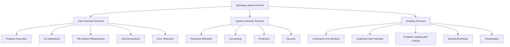
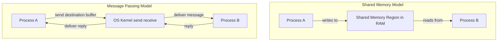
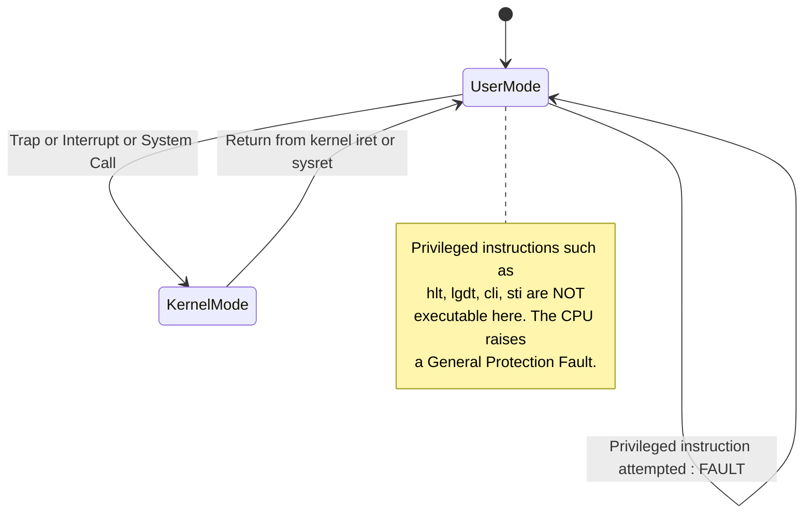

# Operating System Services

<!-- SECTION_1_START -->
# Operating System Services — Core Definition & Intuitive Overview

## Formal Academic Definition (KTU 2024 Scheme Terminology)

> [!IMPORTANT]
> **Operating System Services** constitute the fundamental set of functions, facilities, and utilities that an operating system provides to its users, application programs, and to itself, in order to ensure the **efficient**, **convenient**, and **secure** operation of the computing system. These services abstract the underlying hardware complexity and act as a bridge between the **user/application layer** and the **physical hardware layer** of the machine.

In the KTU 2024 Scheme (PCCST403 — Operating Systems, Module 1: Introduction), the syllabus explicitly classifies OS services into two broad functional categories:

1. **Services provided to the user (User-Oriented Services)**
2. **Services that ensure the efficient operation of the system itself (System-Oriented Services)**

These services are made available to user applications primarily through **System Calls** (also called *System Invocations* or *Programmed Operator Calls*).

## Conceptual Analogy / Real-World Intuition

> [!NOTE]
> **Analogy — The "Smart Hotel Manager"**
> Imagine a five-star hotel. Guests (users/applications) want rooms, food, Wi-Fi, and housekeeping. The hotel manager (Operating System) does **not** let guests roam into the kitchen or the generator room. Instead, the manager:
> * Provides **guest-facing services** (check-in, room service, billing, concierge) — these are **User Services**.
> * Performs **internal services** (generator maintenance, staff payroll, security, inventory) — these are **System Services**.

In a computer, **User Services** correspond to program execution, I/O handling, file management, and communication. **System Services** correspond to resource allocation, accounting, protection, and security. The manager never reveals how the generator works, just as the OS hides hardware registers behind clean APIs.

## The Two Broad Categories of OS Services

| Category | Purpose | Typical Examples |
| :--- | :--- | :--- |
| **User-Oriented Services** | Help the user / application get work done | Program execution, I/O operations, File system manipulation, Communication, Error detection |
| **System-Oriented Services** | Keep the system itself healthy and efficient | Resource allocation, Accounting, Protection, Security |
| **Auxiliary / Convenience Services** | Improve human–computer interaction | Command-line interface, GUI, Program loading, Booting |

## Core OS Services — High-Yield List (Must Memorize for KTU)

The following **nine (9) services** are considered the standard set in the textbook by Silberschatz, Galvin, and Gagne — and they appear frequently in KTU question papers:

1. **Program Execution**
2. **I/O Operations**
3. **File System Manipulation**
4. **Communications**
5. **Error Detection**
6. **Resource Allocation**
7. **Accounting**
8. **Protection**
9. **Security**

> [!VISUALIZATION CONTROL]
> **Concept:** Hierarchical fan-out of OS service taxonomy (User-side vs. System-side vs. Auxiliary).
> **GeoGebra / Desmos Input Equations (set as points in a 2D tree visualization):**
> * Root node: `(0, 5)`
> * User-Services: `(-4, 3)`
> * System-Services: `(0, 3)`
> * Auxiliary-Services: `(4, 3)`
> * Program-Execution: `(-6, 1)`
> * File-System: `(-4, 1)`
> * I/O-Ops: `(-2, 1)`
> * Resource-Alloc: `(-1, 1)`
> * Accounting: `(1, 1)`
> * Protection: `(2, 1)`
> * Security: `(3, 1)`
> * CLI: `(5, 1)`
> * GUI: `(6, 1)`
> **Visual Description:** A rooted tree where the central root is the "Operating System" and three child branches fan out into User-Services (left), System-Services (centre), and Auxiliary-Services (right), with leaf nodes representing individual services.
<!-- SECTION_1_END -->

<!-- SECTION_2_START -->
# Deep Theoretical Analysis & KTU High-Yield Formula Sheet

## Section A — The Nine Standard OS Services (Detailed Breakdown)

### 1. User-Oriented Services (Provided *to* the user/application)

#### 1.1 Program Execution
* The system must be able to **load a program into main memory (RAM)**, allocate the required resources (CPU time, memory space, devices), and run it until termination.
* The OS handles **sequential execution**, **concurrent execution** (multitasking), and **abnormal termination** (e.g., segmentation fault, divide-by-zero).
* Failure mode handling: if the program hits an error, the OS must terminate it gracefully and free the resources.

#### 1.2 I/O Operations
* A running program frequently needs to read from / write to I/O devices (keyboard, disk, printer, network).
* The user program **cannot directly** drive hardware registers; it must request the OS to perform the I/O. This is implemented via **I/O system calls** such as `read()`, `write()`, `open()`, `close()`.
* The OS hides device-specific intricacies and provides a **uniform logical interface** to all I/O devices.

#### 1.3 File System Manipulation
* Programs need to **create, read, write, rename, delete, and list** files and directories.
* The OS provides a **hierarchical file system** (e.g., NTFS, ext4, FAT32) and protects each file via permissions (Read/Write/Execute $\vert$ User/Group/Other).
* Operations include: `open()`, `close()`, `read()`, `write()`, `create()`, `delete()`, `seek()`.

#### 1.4 Communications
* Two models are defined by KTU syllabus:
  * **Shared Memory Model** — Two cooperating processes share a region of physical memory. The OS is responsible for synchronizing access (using semaphores/mutexes).
  * **Message Passing Model** — Processes exchange discrete *messages* via the OS kernel. The OS uses system calls such as `send()` and `receive()`.
* Communication can be **on the same machine** (inter-process) or **across the network** (sockets).

#### 1.5 Error Detection
* The OS must constantly monitor the system for:
  * **Hardware errors** — Memory parity failure, disk bad sector, power failure, device disconnection.
  * **Software errors** — Arithmetic overflow, invalid memory access, division by zero, illegal opcode.
* For every error class, the OS has a defined **handler routine** that logs, recovers (where possible), or terminates the offending process.

### 2. System-Oriented Services (Provided *for* the system itself)

#### 2.1 Resource Allocation
* When multiple users / processes compete for finite resources (CPU cycles, RAM pages, disk blocks, printers), the OS must **allocate and deallocate** resources in a fair, efficient manner.
* Examples: CPU scheduling (FCFS, SJF, RR), memory allocation (contiguous, paging, segmentation), disk scheduling (FCFS, SSTF, SCAN).

#### 2.2 Accounting
* The OS tracks **which user consumes how much of which resource**.
* Used for **billing** in multi-user cloud systems, **statistics** for performance tuning, and **quota enforcement** (e.g., 2 GB max per user).
* Tools: `top`, `htop`, `sar`, `iostat` on Linux.

#### 2.3 Protection
* The OS enforces access control so that a process cannot **illegally read/write/execute** memory or files belonging to another process or the OS kernel.
* Achieved via:
  * **Hardware support** — Base $\vert$ Limit registers, MMU, TLB, dual-mode operation (Kernel vs. User mode).
  * **Software mechanisms** — File permissions, Access Control Lists (ACLs), Capabilities.

#### 2.4 Security
* Protects the system against **external threats** — viruses, worms, trojans, denial-of-service attacks, unauthorized network access.
* Implemented via authentication (passwords, biometrics), authorization (RBAC), firewalls, encryption, and intrusion detection systems.

### 3. Auxiliary / Convenience Services

| Service | Description |
| :--- | :--- |
| **Command Line Interface (CLI)** | Text-based shell (Bash, PowerShell, CMD) for human–OS interaction. |
| **Graphical User Interface (GUI)** | Icon/window-based environment (Windows Desktop, GNOME, macOS Aqua). |
| **Program Loading & Linking** | Loader brings program from disk to RAM; linker resolves external references. |
| **Booting (Bootstrap)** | Power-On Self-Test (POST) → BIOS/UEFI → Bootloader (GRUB) → Kernel load. |
| **Virtualization** | Hypervisors (Type-1: VMware ESXi, Type-2: VirtualBox) provide virtual machines. |

## Section B — How the User Accesses These Services: System Calls

> [!IMPORTANT]
> **System Call** = The programming interface through which a user process requests a service from the operating system kernel. It is the *only* legal entry point into the kernel for a user-mode process.

### Classification of System Calls (KTU Exam Favourite)

| Category | Purpose | Example POSIX Calls |
| :--- | :--- | :--- |
| **Process Control** | Create, terminate, wait, load, execute processes | `fork()`, `exec()`, `wait()`, `exit()` |
| **File Management** | Create, open, read, write, close files | `open()`, `read()`, `write()`, `close()` |
| **Device Management** | Request/release a device, read/write to device | `ioctl()`, `read()`, `write()` |
| **Information Maintenance** | Get/set time, date, system data | `gettimeofday()`, `setuid()`, `getpid()` |
| **Communication** | Inter-process communication primitives | `pipe()`, `socket()`, `shm_open()` |
| **Protection** | Get/set file permissions | `chmod()`, `chown()`, `umask()` |

## Section C — KTU Formula / Cheat Sheet Table

> [!NOTE]
> The following table is the **high-yield one-page revision sheet** for KTU board exams. Memorize the contents — at least 3–4 marks come from this exact topic in every ESE.

| Service | Category | One-line Definition | Real-world Engineering Use |
| :--- | :--- | :--- | :--- |
| Program Execution | User | Load and run programs, handle normal/abnormal termination. | Running a server, executing a compiled binary. |
| I/O Operations | User | Provide a uniform interface to heterogeneous I/O devices. | Reading sensor data into an embedded controller. |
| File System Manipulation | User | Create/delete/read/write files and directories. | Database storage, log file rotation in servers. |
| Communications | User | Allow processes to share memory or pass messages. | Microservices communication, OS kernel IPC. |
| Error Detection | User | Detect and handle hardware/software errors. | ECC memory, SMART disk monitoring, asserts. |
| Resource Allocation | System | Distribute finite resources among competing processes. | Cloud computing schedulers (Kubernetes, YARN). |
| Accounting | System | Track and record resource usage per user/process. | AWS billing, Salesforce per-tenant metering. |
| Protection | System | Control access of processes to resources. | Sandboxing in browsers, Android permission model. |
| Security | System | Defend against internal and external threats. | TLS, SELinux, Windows Defender, firewalls. |
| Command Interface | Auxiliary | Text-based human–OS interaction (shell). | Bash scripting in DevOps pipelines. |
| GUI | Auxiliary | Graphical human–OS interaction (windows, icons). | Desktop OS, mobile OS user experience. |

> [!IMPORTANT]
> **Engineering Application Spotlight** — In modern **cloud-native architectures** (e.g., AWS Lambda, Kubernetes, Azure Functions), the OS services of *Resource Allocation* and *Accounting* are exposed as **multi-tenant billing primitives** and **auto-scaling policies**. The *Protection* service is enforced through Linux **namespaces** and **cgroups** for container isolation.
<!-- SECTION_2_END -->

<!-- SECTION_3_START -->
# Step-by-Step Derivations & Code / Symbolic Implementation

## Section A — The Mechanism of a System Call (Conceptual Walkthrough)

Let us trace **exactly** what happens when a user application invokes the C library function `write(fd, buffer, n)` to output `n` bytes from `buffer` to a file descriptor `fd`. This is the canonical way the OS provides the **I/O Operations** service.

### Step-by-Step Trace (Do not skip — KTU asks this verbatim)

**Step 1 — Library Call Initiation**
The user process executes a high-level library call:

```c
write(fd, buffer, n);
```

**Step 2 — Library Wrapper Activation**
The C library (`glibc` on Linux) provides a wrapper. The wrapper **places the system call number** in a CPU register (e.g., `eax` on x86-64, `x8` on ARM64) and **invokes the trap instruction**:

```c
// Simplified glibc write() wrapper
ssize_t write(int fd, const void *buf, size_t count) {
    long __res;
    __asm__ volatile (
        "mov %1, %%rax\n\t"      // syscall number (1 for write) into rax
        "mov %2, %%rdi\n\t"      // fd into rdi
        "mov %3, %%rsi\n\t"      // buf into rsi
        "mov %4, %%rdx\n\t"      // count into rdx
        "syscall\n\t"            // trap into kernel
        "mov %%rax, %0"
        : "=r"(__res)
        : "r"((long)1), "r"((long)fd), "r"((long)buf), "r"((long)count)
        : "rax", "rdi", "rsi", "rdx", "rcx", "r11", "memory"
    );
    return (ssize_t)__res;
}
```

**Step 3 — Mode Switch (User $\rightarrow$ Kernel)**
The `syscall` instruction causes a **trap** (software interrupt). The CPU switches from **User Mode** (ring 3) to **Kernel Mode** (ring 0). The current PC, registers, and stack pointer are saved on the kernel stack.

**Step 4 — Kernel Dispatcher**
The kernel's **system call dispatcher** consults the system call number in `rax` and jumps to the appropriate kernel function (e.g., `sys_write` in `fs/read_write.c`).

**Step 5 — Service Execution**
The kernel function:
* **Validates** the user buffer pointer (is it really in user space?).
* **Locks** the file descriptor's `struct file` mutex.
* Calls the **device driver's** `write` method (e.g., `tty_write`, `disk_write`).
* The driver copies bytes from user space to kernel space using `copy_from_user()`.

**Step 6 — Mode Switch (Kernel $\rightarrow$ User)**
The kernel places the return value (number of bytes written, or `-errno` on failure) in `rax`, executes the `sysret` instruction, and returns control to the user process.

**Step 7 — Library Return**
The wrapper extracts the return value from `rax` and returns it to the user program.

## Section B — Full Working C Program Demonstrating Five OS Services

```c
/*
 * Demonstration of five core OS services in a single program:
 *   1. Program Execution      -> main() being loaded & run
 *   2. I/O Operations         -> write() to stdout
 *   3. File System Manipulation-> open(), read(), write(), close()
 *   4. Error Detection        -> return-code checking
 *   5. Communications (IPC)   -> fork() + pipe() between parent & child
 */

#include <stdio.h>
#include <stdlib.h>
#include <string.h>
#include <unistd.h>
#include <fcntl.h>
#include <sys/wait.h>

int main(void) {

    /* ---------- (1) Program Execution: print banner ---------- */
    const char *banner = "KTU OS Services Demo - PCCST403\n";
    write(STDOUT_FILENO, banner, strlen(banner));

    /* ---------- (2) I/O Operations + (3) File System Manipulation ---------- */
    const char *path = "ktu_demo.txt";
    int fd = open(path, O_CREAT | O_WRONLY | O_TRUNC, 0644);
    if (fd < 0) {
        perror("open failed");
        return EXIT_FAILURE;   /* (4) Error Detection */
    }
    const char *payload = "Hello from Operating System Services!\n";
    ssize_t w = write(fd, payload, strlen(payload));
    if (w < 0) {
        perror("write failed");
        close(fd);
        return EXIT_FAILURE;
    }
    close(fd);

    /* ---------- (5) Communications: parent sends, child receives via pipe ---------- */
    int pipefd[2];
    if (pipe(pipefd) == -1) {
        perror("pipe failed");
        return EXIT_FAILURE;
    }

    pid_t pid = fork();
    if (pid < 0) {
        perror("fork failed");
        return EXIT_FAILURE;
    } else if (pid == 0) {
        /* Child: read from pipe and print */
        close(pipefd[1]);                       /* close write end */
        char buf[128];
        ssize_t n = read(pipefd[0], buf, sizeof(buf) - 1);
        if (n > 0) {
            buf[n] = '\0';
            printf("[CHILD pid=%d] Received: %s", getpid(), buf);
        }
        close(pipefd[0]);
        _exit(EXIT_SUCCESS);
    } else {
        /* Parent: write to pipe */
        close(pipefd[0]);                       /* close read end */
        const char *msg = "Greetings from parent process.\n";
        write(pipefd[1], msg, strlen(msg));
        close(pipefd[1]);
        wait(NULL);                             /* reap child */
    }

    return EXIT_SUCCESS;
}
```

### Compilation and Execution

```bash
gcc -Wall -Wextra -O2 -o ktu_demo ktu_demo.c
./ktu_demo
```

### Expected Output

```
KTU OS Services Demo - PCCST403
[CHILD pid=12346] Received: Greetings from parent process.
```

## Section C — Python Equivalent Demonstrating Resource Accounting (OS Service #7)

```python
"""
Demonstration of the 'Accounting' OS service in Python.
We measure CPU time and memory consumed by a CPU-bound task.
"""
import os
import time
import resource   # POSIX interface to the 'getrusage' system call

def cpu_intensive_task(n: int) -> int:
    """Compute the sum of the first n natural numbers the slow way."""
    total = 0
    for i in range(1, n + 1):
        total += i
    return total

def measure_accounting(task_fn, *args) -> dict:
    start_wall = time.perf_counter()
    result = task_fn(*args)
    end_wall = time.perf_counter()

    # resource.getrusage(RUSAGE_SELF) -> underlying system call: getrusage
    usage = resource.getrusage(resource.RUSAGE_SELF)

    return {
        "result"            : result,
        "wall_clock_sec"    : end_wall - start_wall,
        "user_cpu_sec"      : usage.ru_utime,        # user-mode CPU time
        "system_cpu_sec"    : usage.ru_stime,        # kernel-mode CPU time
        "max_rss_kb"        : usage.ru_maxrss,       # peak resident set size
        "page_faults_minor" : usage.ru_minflt,
        "page_faults_major" : usage.ru_majflt,
        "voluntary_ctxsw"   : usage.ru_nvcsw,
        "involuntary_ctxsw" : usage.ru_nivcsw,
    }

if __name__ == "__main__":
    report = measure_accounting(cpu_intensive_task, 10_000_000)
    for key, value in report.items():
        print(f"{key:>20s} : {value}")
```

### Sample Output (numbers vary per machine)

```
              result : 50000005000000
    wall_clock_sec   : 0.5123
      user_cpu_sec   : 0.5012
    system_cpu_sec   : 0.0044
       max_rss_kb    : 8472
 page_faults_minor  : 1284
 page_faults_major  : 0
  voluntary_ctxsw   : 2
involuntary_ctxsw   : 7
```

> [!IMPORTANT]
> The library function `resource.getrusage()` is a direct **Python binding to the POSIX `getrusage()` system call**, which is exactly the OS's **Accounting service** in action — the kernel is reporting back to the user process the *very resources* that the OS was tracking on its behalf.
<!-- SECTION_3_END -->

<!-- SECTION_4_START -->
# Structural Diagrams & Schematics

## Diagram 1 — Top-Level Taxonomy of OS Services



## Diagram 2 — System Call Mechanism (Sequential Processing Topology)

```mermaid
flowchart LR
    subgraph UserMode["USER MODE Ring 3"]
        UP["User Program main function"]
        LIB["C Library Wrapper e.g. glibc"]
        UP -- "write fd buffer n" --> LIB
    end

    subgraph KernelMode["KERNEL MODE Ring 0"]
        TRAP["Trap Instruction syscall"]
        DISP["System Call Dispatcher"]
        VAL["Parameter Validation"]
        DRV["Device Driver or File System Module"]
        PHYS["Physical Hardware Disk, Keyboard, NIC"]
    end

    LIB -- "load syscall number into rax" --> TRAP
    TRAP -- "mode switch user to kernel" --> DISP
    DISP -- "lookup rax in sys call table" --> VAL
    VAL -- "validated request" --> DRV
    DRV -- "control bus transactions" --> PHYS
    PHYS -- "interrupt or completion signal" --> DRV
    DRV -- "return value in rax" --> LIB
    LIB -- "ssize_t to user" --> UP
```



## Diagram 3 — Communication Models (Shared Memory vs. Message Passing)



## Diagram 4 — Two-Mode Operation Enforcing Protection (Security Service)



> [!NOTE]
> The **two-mode operation** (User Mode / Kernel Mode) is the *hardware-supported backbone* of the OS Protection service. The CPU itself refuses to execute privileged instructions while in User Mode — this is the lowest layer of defence behind every sandbox, jail, or container in production.
<!-- SECTION_4_END -->

<!-- SECTION_5_START -->
# KTU 2024 Scheme Examination Question Bank & Topic Recap

## Part A — Short Answer Questions (3 Marks Each)

### Question 1 [KTU University Exam - July 2024]
**CO1 — Remember**
List any **six** services provided by an operating system for the **convenience of the user**.

#### Model Answer (Valuation Key)

The six user-oriented services provided by the operating system are:

1. **Program Execution** — The system loads the program into memory and executes it, handling normal as well as abnormal termination.
2. **I/O Operations** — Provides a uniform interface so that user programs can perform input and output without knowing device-specific details.
3. **File System Manipulation** — Allows programs to create, read, write, rename, and delete files and directories.
4. **Communications** — Allows cooperating processes to exchange information using either shared memory or message passing.
5. **Error Detection** — Detects and reports errors occurring in the CPU, memory, I/O devices, or user programs.
6. **Protection** — Ensures that each process or user is allowed to access only those resources for which it has been authorized.

> *Each correct service: 0.5 mark × 6 = 3 marks.*

### Question 2 [KTU University Exam - Dec 2023]
**CO1 — Understand**
Differentiate between **shared memory** and **message passing** as two OS communication services.

#### Model Answer (Valuation Key)

| Aspect | Shared Memory | Message Passing |
| :--- | :--- | :--- |
| Mechanism | A region of physical memory is mapped into the address space of both cooperating processes. | Processes exchange discrete packets via the OS kernel using `send()` and `receive()`. |
| Speed | Faster — data is copied **once** (user $\rightarrow$ shared region). | Slower — data is copied **at least twice** (user $\rightarrow$ kernel $\rightarrow$ user). |
| Synchronization | The OS provides **no** automatic synchronization; the programmer must use semaphores/mutexes. | The OS provides implicit synchronization through the kernel's message queues. |
| Kernel involvement | Minimal after the shared region is established. | The kernel is involved in every message transfer. |
| Typical use | High-performance parallel computation. | Distributed systems and loosely-coupled processes. |

> *For correct definition: 1 mark. For any two distinguishing points: 1 mark each = 2 marks. Total = 3 marks.*

## Part B — Long Answer Questions (14 Marks Each, Internal Choice)

### Question A [KTU University Exam - July 2024]
**Module 1 — CO1, CO2 — Bloom Levels: Understand + Apply**

**(a) [7 Marks — Understand]** Explain in detail the **nine major services** that an operating system provides. Classify them as user-oriented, system-oriented, and auxiliary.

**(b) [7 Marks — Apply]** With the help of a neat diagram, explain the **mechanism of a system call**. How does the system call interface help in providing OS services to user applications?

---

#### Model Answer

**(a) Explanation of the Nine Major OS Services**

**User-Oriented Services (5):**

1. **Program Execution** — The OS loads the executable file from secondary storage into main memory, allocates the required CPU time and memory, and starts execution. On normal completion, the process exits cleanly; on abnormal termination (e.g., divide by zero), the OS kills the process and frees its resources.
2. **I/O Operations** — A running program frequently needs to read from or write to I/O devices. The OS provides a *device-independent* interface via system calls like `open()`, `read()`, `write()`, and `close()`. The complexity of the device controller is hidden inside device drivers.
3. **File System Manipulation** — The OS provides a logical view of secondary storage through a *hierarchical directory* of files. Operations supported: create, delete, open, close, read, write, rename, seek. Permissions protect files from unauthorized access.
4. **Communications** — Two models: (i) **Shared Memory** — a common region in RAM is mapped into both processes; (ii) **Message Passing** — packets are exchanged via `send()` and `receive()`. Communications can be intra-machine (IPC) or inter-machine (sockets).
5. **Error Detection** — The OS monitors both hardware (memory parity error, disk I/O error) and software (overflow, illegal address) faults. Each class has a defined handler that logs, recovers, or terminates the offending process.

**System-Oriented Services (4):**

6. **Resource Allocation** — The OS arbitrates competing demands for finite resources (CPU, RAM, disk, printers). Algorithms: Round-Robin, Priority, Banker's Algorithm, First-Fit.
7. **Accounting** — The OS records per-user / per-process usage of each resource. Used for billing in cloud systems, statistics for capacity planning, and quota enforcement.
8. **Protection** — Ensures that no process can read, write, or execute memory/files belonging to another process or the OS kernel. Enforced by **dual-mode operation** and **hardware memory protection units (MMU, base-limit registers)**.
9. **Security** — Defends the system against *external* threats such as viruses, worms, trojans, and denial-of-service attacks. Implemented via authentication, authorization, firewalls, encryption, and intrusion-detection systems.

**Auxiliary Services (often mentioned in extensions):** Command Line Interface, Graphical User Interface, Program Loading, Booting, and Virtualization.

*Valuation Key:*
* [Each of the 5 user services correctly explained: 0.5 × 5 = 2.5 marks]
* [Each of the 4 system services correctly explained: 0.5 × 4 = 2 marks]
* [Classification header and auxiliary mention: 0.5 mark]
* [Neat tabular or bulleted presentation: 1 mark]
* [Examples of system calls / algorithms: 1 mark]

**(b) System Call Mechanism**

```
User Program
   |
   v   (1) C library call: write(fd, buf, n)
[ C Library Wrapper ]
   |
   v   (2) Place syscall number in rax; execute "syscall"
[ TRAP --> mode switch to KERNEL MODE ]
   |
   v   (3) Kernel dispatcher reads rax
[ System Call Table Lookup ]
   |
   v   (4) Jump to sys_write()
[ Parameter Validation: copy_from_user() ]
   |
   v   (5) Device driver write routine
[ Disk / Terminal / NIC Hardware ]
   |
   v   (6) Interrupt on completion
[ Driver returns bytes-written in rax ]
   |
   v   (7) iret / sysret --> back to USER MODE
[ Wrapper returns ssize_t ]
   |
   v
User Program receives the return value
```

**How the system call interface provides OS services:**

* It is the *only* legal mechanism by which a user process can request any of the nine OS services.
* It provides **hardware protection** (a user process cannot enter the kernel arbitrarily; it must trap).
* It provides **portability** — the same system call API works across different hardware.
* It allows the OS to **enforce protection, security, and accounting** at a single, well-defined entry point.

*Valuation Key:*
* [Diagram with at least 6 distinct stages: 4 marks]
* [Explanation of User Mode to Kernel Mode switch: 1 mark]
* [Mention of system call number dispatch: 1 mark]
* [Return path and protection enforcement: 1 mark]

---

### Question B [KTU University Exam - Dec 2023] — Alternative Choice
**Module 1 — CO1, CO2 — Bloom Levels: Understand + Apply**

**(a) [7 Marks — Understand]** Discuss the **system-oriented services** of an operating system. How do they differ from the user-oriented services?

**(b) [7 Marks — Apply]** Explain the **two modes of operation** (User Mode and Kernel Mode). Show how they help in implementing the *Protection* and *Security* services of an OS.

---

#### Model Answer

**(a) System-Oriented Services**

The four system-oriented services are:

1. **Resource Allocation** — The OS multiplexes finite resources (CPU, memory, I/O, files) among multiple competing processes. Resource allocators like the CPU scheduler (Round Robin, MLFQ) and the memory manager (paging, segmentation) are part of this service.
2. **Accounting** — The OS keeps statistics on the *who-used-what* of every resource. This enables billing (in cloud / multi-user systems), tuning (load balancing), and quota enforcement (e.g., 2 GB RAM per user).
3. **Protection** — Internal *defence* against illegal access: process A cannot read/write memory or files belonging to process B. Achieved by *dual-mode operation* and *hardware memory protection*.
4. **Security** — External *defence* against attackers, viruses, worms, and unauthorized network access. Achieved by authentication (passwords, biometrics), authorization (RBAC, ACL), firewalls, and encryption.

**Differences from User-Oriented Services:**

| Aspect | User-Oriented | System-Oriented |
| :--- | :--- | :--- |
| Purpose | Help the user / application get work done. | Keep the OS itself healthy and fair. |
| Beneficiary | End user / application programmer. | The OS, system administrator, and other users. |
| Examples | Program execution, I/O, File system manipulation. | Resource allocation, Accounting, Protection, Security. |
| Visibility | Often invoked explicitly via system calls. | Mostly transparent to the user. |

*Valuation Key:*
* [Each of the 4 system services: 1 mark = 4 marks]
* [Comparison table: 3 marks]

**(b) Two Modes of Operation**

The CPU operates in one of two modes at any given time:

* **User Mode (Ring 3)** — The mode in which normal user applications execute. *Privileged instructions* (e.g., `hlt`, `cli`, `sti`, `lgdt`, I/O port access) are **not allowed**.
* **Kernel Mode (Ring 0 / Supervisor Mode)** — The mode in which the OS kernel executes. All instructions, including privileged ones, are allowed.

**Mode Transitions:**

```
User Mode  ---(system call / interrupt / trap)--->  Kernel Mode
Kernel Mode ---(iret / sysret)-------------------->  User Mode
```

**How it enables Protection:**

1. A user process cannot directly execute I/O instructions — it must *trap* into the kernel.
2. The kernel checks permissions and decides whether to honour the request.
3. The MMU (Memory Management Unit) translates every virtual address, ensuring that one process cannot read or write the memory of another.
4. Privileged instructions attempted in User Mode cause a *General Protection Fault* (GPF) — the process is killed.

**How it enables Security:**

1. Sensitive operations (formatting a disk, changing access permissions, opening a network port) are restricted to kernel-mode code.
2. Authentication and authorization checks are performed in the kernel before the operation is allowed.
3. Modern OSes extend this with **ring levels** (Ring 0/1/2/3) and **virtualization** (Ring -1 for hypervisors).

*Valuation Key:*
* [Definition of both modes with diagram: 2 marks]
* [Mode transition explanation: 1 mark]
* [Role in Protection: 2 marks]
* [Role in Security: 2 marks]

---

> [!WARNING]
> **KTU Examiner's Valuation Warning — Where Students Lose Marks**
> 1. *Don't* list only 4–5 services and call it "the services of OS". The standard answer requires **all nine** (or all 11 with auxiliary). Missing services = direct loss of 0.5 to 1 mark per service.
> 2. *Don't* confuse **Protection** (internal, between processes/users) with **Security** (external, against attackers). Examiners *will* deduct 1 mark if you swap them.
> 3. *Don't* describe the system call mechanism without showing the **mode switch from User to Kernel**. This is the single most-tested sub-point in Part B.
> 4. *Don't* omit the diagram. A neat block diagram / flowchart of the system call is worth 3–4 marks by itself.
> 5. *Don't* use vague phrases like "OS does many things" — always tie back to the **named service** (Resource Allocation, Accounting, etc.) for full credit.

## Topic Recap & Important Things to Remember

> [!NOTE]
> **High-Density Rapid-Revision Checklist**

* **Definition** — OS services are the set of functions the OS provides to users, applications, and to itself.
* **Two main categories** — User-oriented (5) and System-oriented (4). Plus 2–5 auxiliary.
* **The Nine Standard Services** — Program Execution, I/O Operations, File System Manipulation, Communications, Error Detection, Resource Allocation, Accounting, Protection, Security.
* **User-oriented services** help the application do its job.
* **System-oriented services** keep the OS itself healthy and fair.
* **System Calls** are the *only* legal mechanism for a user process to invoke an OS service.
* **Two communication models** — Shared Memory (faster, requires manual sync) and Message Passing (slower, kernel-mediated, automatically synchronized).
* **Two modes of operation** — User Mode (Ring 3, no privileged instructions) and Kernel Mode (Ring 0, full access).
* **Protection** is internal defence (process-to-process), enforced by dual-mode + MMU.
* **Security** is external defence (against viruses, attackers), enforced by auth + authz + firewall.
* **Accounting** tracks who used what; used for billing, statistics, and quota.
* **Resource Allocation** arbitrates CPU, RAM, disk, and devices among competing processes.
* **File System Manipulation** provides create/read/write/delete/rename on a hierarchical directory.
* **Error Detection** spans hardware (parity, bad sectors) and software (overflow, segfault).
* **Real-world examples of OS services in action** — `top` (Accounting), `chmod` (Protection), `iptables` (Security), `fork()` (Program Execution), `pipe()` (Communications), `open()` (File System), `read()`/`write()` (I/O).
* **KTU-typical diagram** — Always be ready to draw the **System Call Mechanism flowchart** with User Mode and Kernel Mode blocks.
<!-- SECTION_5_END -->
