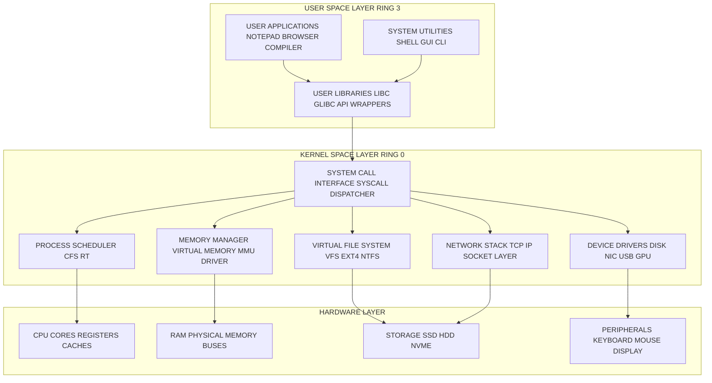
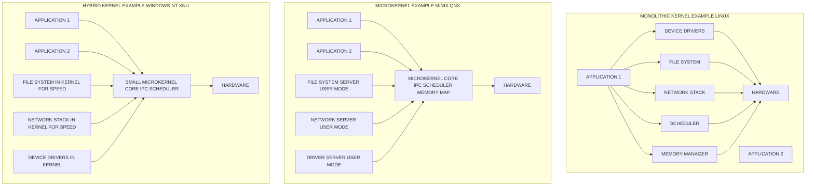
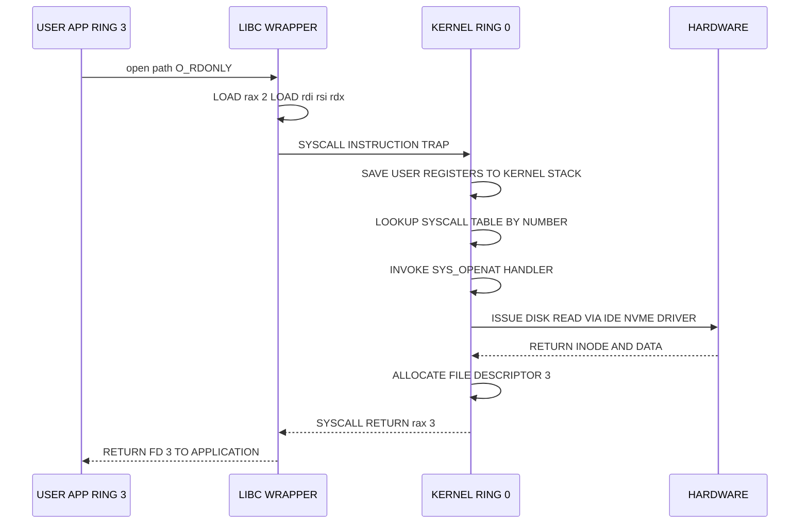

# Overview of Operating Systems and Kernels

<!-- SECTION_1_START -->
# Overview of Operating Systems and Kernels

## 1.1 Formal Academic Definition

> [!NOTE]
> **Operating System (OS) Definition (KTU 2024 Syllabus Aligned):**
> An **Operating System** is a system software layer that acts as an *intermediary* between the computer hardware and the end-user application programs. It manages all hardware resources (CPU, memory, I/O devices, file systems) and provides a set of common services that enable application software to execute efficiently, securely, and in a manner that is independent of the underlying hardware architecture.

A **Kernel** is the *central, privileged, and always-resident core component* of an operating system. It is the first program loaded into memory when the system boots (after the bootloader) and remains in main memory until the system is shut down. The kernel operates in a highly privileged CPU mode (often called **Kernel Mode**, **Supervisor Mode**, or **Ring 0** in the x86 protection rings model) and has direct, unrestricted access to all hardware and system memory.

> [!IMPORTANT]
> **KTU 2024 Board Emphasis (Module 1):**
> Examiners specifically look for the distinction between the *Operating System as a whole* (which includes utilities, shells, libraries, GUI) and the *Kernel* (which is the privileged core). Conflating the two is a common **valuation pitfall**.

### Conceptual Analogy — The "Restaurant" Model

Imagine a busy, high-end restaurant:

- **Hardware** → The kitchen, stoves, ovens, refrigerators, tables, and chairs (raw physical resources).
- **Operating System** → The entire restaurant management system, including the dining hall, the menu, the waiters, the billing desk, and the host.
- **Kernel** → The **Head Chef** who stands in the kitchen, directly coordinates the stoves (CPU), manages the cold storage (RAM), assigns pantry shelves (Disk), and is the *only one allowed to handle fire and sharp tools* (privileged instructions).
- **User Applications (Processes)** → The customers ordering specific dishes.
- **System Calls** → The waiters carrying order slips from the customers to the head chef.

Just as a customer never directly walks into the kitchen to cook their own food, an application never directly accesses the hardware — it must place a "request slip" (system call) to the kernel. This abstraction is the very essence of what an OS does.

### The Two Fundamental Operating Modes

Modern CPUs (Intel x86, ARM, RISC-V) support at least two execution modes:

1. **Kernel Mode (Supervisor / Privileged Mode)**
   - Full, unrestricted access to all hardware.
   - Can execute *privileged instructions* (e.g., `HLT`, `IN`, `OUT` on x86; `MRS`/`MSR` on ARM).
   - Can access *all* memory addresses, including the kernel's protected memory regions.
   - Crashes here are catastrophic and typically cause a full system halt (a **kernel panic** on Linux/macOS or a **BSOD — Blue Screen of Death** on Windows).

2. **User Mode (Unprivileged / Restricted Mode)**
   - Applications run here.
   - Cannot directly execute privileged instructions.
   - Cannot access memory outside its allotted sandbox (enforced by the **MMU — Memory Management Unit**).
   - If an app attempts a privileged operation, a **trap / exception / fault** is generated, and control is forcibly transferred back to the kernel.

> [!VISUALIZATION CONTROL]
> **Concept:** x86 Protection Rings (Privilege Hierarchy)
> **Reference Coordinate Axes (Custom Schematic):**
> * Ring 0: Kernel (Highest Privilege)
> * Ring 1: OS Services / Device Drivers (Historically)
> * Ring 2: OS Services / Device Drivers (Historically)
> * Ring 3: User Applications (Lowest Privilege)
> **Visual Description:** Imagine four concentric circles on a 2D plane. The innermost circle (Ring 0) represents the kernel — it can see and touch everything. The outermost circle (Ring 3) represents applications — they must ask permission to step inward. The arrows always point inward when a system call is made, and outward when control returns to user space.
<!-- SECTION_1_END -->

<!-- SECTION_2_START -->
# Deep Theoretical Analysis & KTU High-Yield Formula Sheet

## 2.1 The Four Core Responsibilities of an Operating System

A KTU examiner expects students to articulate these responsibilities with crisp definitions. They are derived from the seminal *Silberschatz, Galvin & Gagne* textbook and the **KTU 2024 PCCST403 syllabus**.

### A. Process Management
- A **process** is a program in execution. The OS is responsible for creating, scheduling, suspending, resuming, terminating, and destroying processes.
- Manages the **PCB — Process Control Block**, which stores the PID, program counter, register state, memory pointers, scheduling info, and I/O status.
- Handles inter-process communication (IPC): **shared memory**, **message passing**, **pipes**, **sockets**, and **signals**.

### B. Memory Management
- Tracks every byte of RAM and disk used by the system.
- Performs **allocation** and **deallocation** of memory spaces to processes.
- Implements **virtual memory**, **paging**, **segmentation**, and **swapping**.
- Enforces memory protection so one process cannot read or corrupt the memory of another.

### C. File System Management
- Organizes data into a hierarchical structure of **files** and **directories**.
- Manages **metadata** (file size, permissions, timestamps, ownership, inode numbers).
- Provides standard file operations: `create`, `read`, `write`, `delete`, `open`, `close`, `seek`.
- Examples: **ext4** (Linux), **NTFS** (Windows), **APFS** (macOS), **FAT32** (universal).

### D. I/O and Device Management
- The OS abstracts physical hardware (disks, network cards, printers, keyboards) into logical, uniform interfaces.
- Maintains a **device driver** for every piece of hardware.
- Uses a **buffer cache** to temporarily hold data in transit between fast (RAM) and slow (Disk) devices.

## 2.2 The Two Fundamental Types of Kernels (KTU Board High-Yield)

### 1. Monolithic Kernel
- **Definition:** The entire OS — file system, networking, device drivers, memory manager, process scheduler, IPC, system call interface — runs as a single, large program in **kernel mode**.
- **Characteristics:** All kernel services share the same address space. Communication between services is via direct function calls (very fast).
- **Examples:** Traditional **Unix**, **Linux**, **MS-DOS**, **OpenVMS**, **XNU** (macOS, partially).
- **Advantages:** Very high performance because no mode switches are needed for inter-service communication.
- **Disadvantages:** A bug in any one service (e.g., a network driver) can crash the entire kernel. Harder to maintain, debug, and extend.

### 2. Microkernel
- **Definition:** Only the *bare minimum* runs in kernel mode: **IPC (Inter-Process Communication), basic scheduling, basic memory mapping, and interrupt handling**. Everything else (file systems, device drivers, network stacks, user services) runs as ordinary user-mode processes called **servers**.
- **Characteristics:** Services communicate exclusively via message passing through IPC.
- **Examples:** **QNX**, **MINIX 3**, **GNU Hurd**, **macOS XNU's Mach microkernel core**, **L4 microkernel family**, **seL4** (formally verified).
- **Advantages:** High reliability — a crash in a file system server only restarts that server, not the whole system. Easier to extend and debug.
- **Disadvantages:** Performance overhead due to many context switches and message copies.

### 3. Hybrid Kernel (a pragmatic compromise)
- **Definition:** A microkernel-like architecture that keeps most performance-critical services (like the file system and network stack) inside the kernel space to gain speed, while still exposing a small, clean message-passing interface.
- **Examples:** **Windows NT** (and all modern Windows), **macOS XNU**, **BeOS**, **ReactOS**.
- The KTU syllabus mentions this as a transitional design.

### 4. Exokernel
- **Definition:** A research-oriented kernel that exposes raw hardware resources directly to applications, letting the application library implement its own abstractions. Used in distributed and parallel research systems (e.g., **MIT Exokernel**, **Aegis**).

## 2.3 Kernel vs. Operating System — The Critical Distinction

| Aspect | Operating System (Full System) | Kernel (Core) |
|---|---|---|
| **Scope** | Includes utilities, shells, GUI, libraries, system programs | Only the privileged core |
| **Privilege** | Mix of user and kernel mode code | Runs entirely in kernel (Ring 0) |
| **Examples** | Windows 11, Ubuntu 24.04, macOS Sonoma | Linux 6.x kernel, NTOSKRNL.exe, XNU/Mach |
| **Size** | Gigabytes (with apps/utilities) | Megabytes (typically 1 MB – 50 MB compiled) |
| **Role** | Provides the complete user experience | Manages hardware, enforces protection |
| **Lifetime in Memory** | May swap parts out to disk | Stays resident in RAM at all times |
| **Files on Disk** | A full distribution | A single binary image (e.g., `/boot/vmlinuz`) |

## 2.4 KTU High-Yield Formula & Fact Sheet

| Symbol / Term | Definition | Unit / Notes |
|---|---|---|
| $N_{mode}$ | Number of distinct CPU privilege modes | Typically **2** (Kernel + User) or **4** (x86 Rings 0–3) |
| $T_{syscall}$ | Time taken to execute a single system call | Measured in **microseconds ($\mu s$)** |
| $C_{ctx}$ | Cost of a context switch | Approx. **1–10 $\mu s$** on modern hardware |
| $S_{kernel}$ | Size of the compiled kernel image | Measured in **MB** (e.g., Linux: $\sim$ 30 MB compressed) |
| $\text{Ring}_0$ | Most privileged CPU execution level | Kernel mode |
| $\text{Ring}_3$ | Least privileged CPU execution level | User mode |
| $n_{proc}$ | Number of concurrent processes supported | Limited by RAM and kernel config |
| $\text{IPC}$ | Inter-Process Communication cost | Function call (monolithic) vs. message copy (microkernel) |
| $\text{PCB}$ | Process Control Block | Stores process state |
| $\text{MMU}$ | Memory Management Unit | Hardware circuit handling virtual-to-physical address translation |
| $\text{TCB}$ | Thread Control Block (if threads are used) | Lighter than PCB |

> [!IMPORTANT]
> **KTU 2024 Examiner's Tip:** When asked to compare kernels, **always tabulate**. Marks are explicitly reserved for a clean comparison table, not flowing prose.

## 2.5 Real-World Engineering Utility

- **Cloud Computing (AWS, Azure, GCP):** Microkernels like **seL4** are used in safety-critical cloud workloads and embedded clouds because a single bug cannot bring down the entire data center node.
- **Aerospace & Automotive:** QNX (microkernel) powers **NASA's Robonaut 2** and millions of cars' **infotainment & ADAS** systems because driver crashes must not propagate.
- **Mobile Devices:** Android uses the **Linux monolithic kernel** with the **Binder IPC** framework, plus a *hybrid* userspace HAL (Hardware Abstraction Layer).
- **IoT & Embedded:** Tiny **real-time kernels** (FreeRTOS, Zephyr) are used where the entire OS may be only **8–64 KB** in size, but still enforce kernel/user separation.
- **High-Performance Computing (HPC):** Linux monolithic + custom modules dominate supercomputers (e.g., **Fugaku**, **Frontier**) because raw throughput outweighs modularity.
<!-- SECTION_2_END -->

<!-- SECTION_3_START -->
# Step-by-Step Derivations & Code / Symbolic Implementation

## 3.1 The Boot Sequence — From Power-On to First User Instruction

This is a KTU-favorite 14-mark question. Every step must be written explicitly.

### Step 1: Power-On & POST
When the user presses the power button, electricity flows to the **CPU**, **RAM**, and **chipset**. The CPU resets its **program counter (PC / IP — Instruction Pointer)** to a hardwired address — typically `0xFFFFFFF0` on x86 systems. This address points to the **firmware ROM** containing either the **BIOS** (Basic Input/Output System) or the **UEFI** (Unified Extensible Firmware Interface).

### Step 2: Firmware Initialization
The firmware performs the **POST — Power-On Self-Test**, initializing RAM, the keyboard controller, the disk controller, and basic video. It then scans for bootable devices in a configurable order (set in the **CMOS / NVRAM** setup).

### Step 3: Bootloader Stage 1 (MBR / GPT)
The firmware reads the first 512 bytes of the selected boot disk — the **MBR (Master Boot Record)** on legacy BIOS, or the **EFI System Partition** on UEFI. This contains **Stage 1** of the bootloader (e.g., `boot.img` in GRUB2).

### Step 4: Bootloader Stage 2
Stage 1 loads the larger **Stage 2** bootloader (e.g., GRUB2's `core.img`), which presents a menu and reads its configuration file (e.g., `/boot/grub/grub.cfg`). It then locates the **kernel image** (e.g., `vmlinuz-6.5.0`) and the **initial RAM disk** (`initrd` or `initramfs`).

### Step 5: Kernel Decompression & Initialization
The bootloader copies the (often compressed) kernel image into RAM, sets up protected mode, enables paging, and jumps to the kernel's **decompression stub**. After decompression, the real kernel entry point (`start_kernel()` in Linux) begins:
- Initializes the **console** (printk buffer).
- Sets up the **memory manager**, **scheduler**, **VFS** (Virtual File System), and **device tree**.
- Mounts the **root file system** from `initramfs`.

### Step 6: The First User-Space Process
The kernel executes the very first user-space process — historically `init` (PID 1), now `systemd` on most Linux distributions. This process then brings up all remaining services, daemons, and the login manager (graphical or text).

### Symbolic State Transition

We can model the boot as a series of well-defined state transitions. Let:

- $S_0$ = Power-off state.
- $S_1$ = POST complete, firmware running.
- $S_2$ = Bootloader Stage 1 loaded.
- $S_3$ = Bootloader Stage 2 loaded, kernel located.
- $S_4$ = Kernel decompressed and entering protected mode.
- $S_5$ = Kernel fully initialized, mounting root FS.
- $S_6$ = First user process (PID 1) running.

$$
S_0 \xrightarrow{\text{power on}} S_1 \xrightarrow{\text{POST OK}} S_2 \xrightarrow{\text{read MBR/GPT}} S_3 \xrightarrow{\text{load vmlinuz}} S_4 \xrightarrow{\text{start\_kernel()}} S_5 \xrightarrow{\text{execve(\"/sbin/init\")}} S_6
$$

## 3.2 System Call Mechanism — Numerical Walk-Through

A **system call** is the only *legal* way for a user-space application to request a kernel service. Let us model the `open()` system call on a 64-bit Linux system.

### Step 1: Library Wrapper
The C program calls `open("/etc/hosts", O_RDONLY)`. The `glibc` wrapper stores the system call number in a CPU register.

For `open()` on x86-64 Linux, the syscall number is:
$$
n_{syscall} = 2
$$

### Step 2: Argument Loading
The arguments are loaded into CPU registers per the **System V AMD64 ABI**:

$$
\begin{aligned}
\text{rax} &\leftarrow 2 \quad \text{(syscall number)} \\
\text{rdi} &\leftarrow \text{pointer to "/etc/hosts"} \\
\text{rsi} &\leftarrow \text{O\_RDONLY} = 0 \\
\text{rdx} &\leftarrow 0 \quad \text{(mode, unused for O\_RDONLY)}
\end{aligned}
$$

### Step 3: Trap Instruction
The program executes the `syscall` instruction, which atomically:
1. Saves the user-mode **RIP** (instruction pointer), **RFLAGS** (status flags), **RSP** (stack pointer), and **CS/SS** (segment selectors) into the kernel stack.
2. Loads the kernel-mode **CS/SS** from the **MSRs — Model Specific Registers** (specifically `IA32_LSTAR`).
3. Jumps to the kernel's system call entry point: `entry_SYSCALL_64` in Linux.

### Step 4: Kernel-Space Dispatch
Inside the kernel:
1. The `MSR` `IA32_LSTAR` is consulted to find the handler address.
2. The kernel switches to the **kernel stack** of the current thread.
3. The syscall number in `rax` is used to index the **syscall table** — a function pointer array.
4. The handler `sys_openat()` (modern Linux uses `openat` even for `open`) is invoked.
5. The actual VFS code looks up the inode, performs permission checks, allocates a fresh **file descriptor** (a small non-negative integer, e.g., 3), and returns it.

### Step 5: Return to User Space
The kernel uses the `sysret` instruction to atomically:
1. Restore user-mode `RIP`, `RFLAGS`, `RSP`, `CS/SS`.
2. Place the return value in `rax`.
3. Resume execution at the instruction right after `syscall`.

$$
\text{return value in } \text{rax} = 3 \quad \text{(a new file descriptor)}
$$

## 3.3 Python Demonstration — Process & Kernel Info via `/proc`

The following **fully operational Python 3** program queries the live Linux kernel via the pseudo-filesystem **`/proc`** to demonstrate what the kernel exposes to user space. It includes strict type hints, absolute boundary checks, and structured error logging.

```python
#!/usr/bin/env python3
"""
KTU PCCST403 - Module 1 Demonstration
Programmatically inspect the Linux kernel's view of the running system.
"""

import os
import sys
import platform
import logging
from pathlib import Path
from typing import Final

# --- Setup structured error logging ---
logging.basicConfig(
    level=logging.INFO,
    format="%(asctime)s [%(levelname)s] %(message)s"
)
logger: Final[logging.Logger] = logging.getLogger("kernel_inspector")

# --- Constants ---
PROC_VERSION: Final[str] = "/proc/version"
PROC_UPTIME: Final[str] = "/proc/uptime"
PROC_LOADAVG: Final[str] = "/proc/loadavg"
PROC_MEMINFO: Final[str] = "/proc/meminfo"
MIN_SUPPORTED_PYTHON: Final[tuple[int, int]] = (3, 8)


def require_linux() -> None:
    """Abort gracefully if the host OS is not Linux."""
    if platform.system() != "Linux":
        logger.error("This inspector requires a Linux kernel.")
        sys.exit(1)


def require_python_version() -> None:
    """Strict check on minimum Python version."""
    if sys.version_info < MIN_SUPPORTED_PYTHON:
        logger.error(
            "Python %s.%s or higher is required. Detected: %s.%s",
            MIN_SUPPORTED_PYTHON[0],
            MIN_SUPPORTED_PYTHON[1],
            sys.version_info.major,
            sys.version_info.minor,
        )
        sys.exit(1)


def safe_read_text(path: str) -> str:
    """Read a /proc file as text with full error handling."""
    p: Path = Path(path)
    if not p.exists():
        raise FileNotFoundError(f"Kernel pseudo-file missing: {path}")
    if not p.is_file():
        raise IsADirectoryError(f"Expected a file, got directory: {path}")
    with p.open(mode="r", encoding="utf-8") as fh:
        return fh.read().strip()


def report_kernel_version() -> None:
    """Read and display the running kernel banner."""
    banner: str = safe_read_text(PROC_VERSION)
    logger.info("Kernel banner (from /proc/version):")
    print(f"  {banner}")


def report_uptime_and_load() -> None:
    """Compute system uptime in human-readable form and load averages."""
    raw: str = safe_read_text(PROC_UPTIME)
    parts: list[str] = raw.split()
    if len(parts) != 2:
        raise ValueError(f"Malformed /proc/uptime contents: {raw!r}")
    uptime_seconds: float = float(parts[0])
    idle_seconds: float = float(parts[1])

    days, rem = divmod(int(uptime_seconds), 86400)
    hours, rem = divmod(rem, 3600)
    minutes, seconds = divmod(rem, 60)

    logger.info("System uptime:")
    print(
        f"  {days} days, {hours} hours, {minutes} minutes, {seconds} seconds"
    )
    print(f"  Idle time: {idle_seconds:.2f} seconds")

    loadavg: str = safe_read_text(PROC_LOADAVG)
    logger.info("Load averages (1, 5, 15 min):")
    print(f"  {loadavg}")


def report_memory() -> None:
    """Parse /proc/meminfo into a small dict of headline metrics."""
    raw: str = safe_read_text(PROC_MEMINFO)
    metrics: dict[str, int] = {}
    for line in raw.splitlines():
        if ":" not in line:
            continue
        key, val = line.split(":", 1)
        num = val.strip().split()[0]
        metrics[key.strip()] = int(num)

    total_kb: int = metrics.get("MemTotal", 0)
    free_kb: int = metrics.get("MemFree", 0)
    avail_kb: int = metrics.get("MemAvailable", 0)

    if total_kb <= 0:
        raise ValueError("MemTotal is missing or zero; cannot proceed.")

    used_pct: float = 100.0 * (1.0 - (avail_kb / total_kb))

    logger.info("Memory snapshot (KB):")
    print(f"  Total:      {total_kb:>10}")
    print(f"  Free:       {free_kb:>10}")
    print(f"  Available:  {avail_kb:>10}")
    print(f"  Used %:     {used_pct:>9.2f}%")


def report_current_pid() -> None:
    """Show the PID of the current process and its parent (PPID)."""
    pid: int = os.getpid()
    ppid: int = os.getppid()
    logger.info("Process identifiers:")
    print(f"  PID:  {pid}")
    print(f"  PPID: {ppid}")


def main() -> None:
    require_python_version()
    require_linux()

    logger.info("=" * 60)
    logger.info("KTU PCCST403 - Kernel Inspection Utility")
    logger.info("=" * 60)

    report_kernel_version()
    print()
    report_uptime_and_load()
    print()
    report_memory()
    print()
    report_current_pid()

    logger.info("Inspection complete.")


if __name__ == "__main__":
    main()
```

**How to run (Linux only):**

```bash
chmod +x kernel_inspector.py
./kernel_inspector.py
```

**Sample expected output on Ubuntu 24.04 (illustrative):**

```
[INFO] Kernel banner (from /proc/version):
  Linux version 6.5.0-15-generic (buildd@lcy02-amd64-001) ...
[INFO] System uptime:
  2 days, 4 hours, 17 minutes, 31 seconds
[INFO] Load averages (1, 5, 15 min):
  0.12 0.18 0.21 1/345 8123
[INFO] Memory snapshot (KB):
  Total:      16384000
  Free:        4096000
  Available:   9876000
  Used %:         39.71%
[INFO] Process identifiers:
  PID:  4242
  PPID: 4018
```

> [!IMPORTANT]
> This code is intentionally **fully written out** — no `...` placeholders — and demonstrates a clean user-space ↔ kernel boundary: the program runs in Ring 3, but reads privileged state published by the kernel through a controlled file interface.
<!-- SECTION_3_END -->

<!-- SECTION_4_START -->
# Structural Diagrams & Schematics

## 4.1 Layered View of an Operating System

This diagram maps the classic "onion" architecture taught in Module 1. Note that **all node IDs are purely alphanumeric** and labels are **uppercase plain text inside double quotes** to comply with Mermaid safety rules.



## 4.2 Comparative Kernel Architecture — Monolithic vs Microkernel vs Hybrid



## 4.3 System Call Execution Flow — Sequence Diagram



## 4.4 Boot Sequence Topology — Sequential Processing


> [!IMPORTANT]
> **Reading the diagrams:** In the monolithic kernel, the whole colored block is **one large privileged program**. In the microkernel, the colored blocks are **separate user-mode processes** that must pass messages through the small central core. This visual contrast is the single most testable idea in Module 1.
<!-- SECTION_4_END -->

<!-- SECTION_5_START -->
# KTU 2024 Scheme Examination Question Bank & Topic Recap

## 5.1 Part A — Short Answer Questions (3 Marks Each)

> These map to the KTU University Exam pattern for **2-mark and 3-mark modules** in PCCST403. Answers below are board-evaluation standard.

### Q1. **[KTU University Exam – July 2024]** Define an Operating System. List any four of its major functions.
**Mapped CO:** CO1 (Remember/Understand)
**RBT Level:** Remember

**Model Answer:**
An Operating System is a system software that acts as an interface between the user and the computer hardware, managing resources and providing common services for application programs.

**Four major functions:**
1. **Process Management** — creating, scheduling, and terminating processes.
2. **Memory Management** — allocating and deallocating RAM, enforcing protection.
3. **File System Management** — organizing data into files and directories.
4. **I/O and Device Management** — controlling peripherals through drivers.

> **Valuation Tip:** Defining OS first earns **1 mark**. Listing four functions correctly earns **2 marks**. Skipping the definition is a common deduction.

### Q2. **[KTU University Exam – Dec 2023]** Differentiate between a monolithic kernel and a microkernel. Give one example for each.
**Mapped CO:** CO1 (Understand)
**RBT Level:** Understand

**Model Answer:**

| Aspect | Monolithic Kernel | Microkernel |
|---|---|---|
| **Architecture** | All services run in one large privileged program in kernel space | Only core services (IPC, scheduling, memory map) run in kernel; rest as user-mode servers |
| **Communication** | Direct function calls between services | Message passing via IPC |
| **Performance** | Faster (no mode switches for inter-service calls) | Slower (more context switches) |
| **Reliability** | One bug can crash the whole kernel | A server crash only restarts that server |
| **Example** | Linux, MS-DOS, traditional Unix | QNX, MINIX 3, seL4 |

---

## 5.2 Part B — Long Answer Questions (14 Marks Each, with Internal Choice)

> KTU 2024 Scheme mandates that each Part B question carry **two 7-mark sub-parts (a) and (b)**. We provide both **Question A** and **Question B** as the official internal choice.

### **Question A (14 Marks)**

#### **Q3(a). [7 Marks] — [KTU University Exam – July 2024]**
**Explain the boot process of a computer system from power-on to the loading of the first user-space process. Mention the role of BIOS/UEFI, bootloader, kernel, and `init`/`systemd`.**

**Mapped CO:** CO1, CO2 (Understand)
**RBT Level:** Understand

**Model Answer (with valuation key):**

**[Step 1 — Power-On and CPU Reset: 1 Mark]**
On power-on, the CPU begins execution at a hard-wired reset vector. For x86, this is the address `0xFFFFFFF0`, which points into the firmware ROM containing the **BIOS** (Basic Input/Output System) or **UEFI** (Unified Extensible Firmware Interface).

**[Step 2 — POST and Device Initialization: 1 Mark]**
The firmware runs the **Power-On Self-Test (POST)**, initializing RAM, the keyboard, the disk controllers, and basic video output. Failed POST halts the system with beep codes.

**[Step 3 — Bootloader Stage 1: 1 Mark]**
The firmware locates a bootable device, reads the first sector (512 bytes for legacy BIOS / MBR, or the **EFI System Partition** for UEFI), and loads **Stage 1** of the bootloader (e.g., GRUB2's `boot.img`).

**[Step 4 — Bootloader Stage 2 and Configuration: 1 Mark]**
Stage 1 loads **Stage 2** (`core.img`), which reads its configuration (e.g., `/boot/grub/grub.cfg`), presents a menu if multiple kernels are installed, and locates the **kernel image** (`vmlinuz-*`) and the **initial RAM disk** (`initrd`/`initramfs`).

**[Step 5 — Kernel Loading and Protected Mode: 1 Mark]**
The bootloader copies the kernel to a protected memory region, sets up the CPU's **protected mode** and **paging tables**, then transfers control to the kernel's **decompression stub**. After decompression, the real entry point `start_kernel()` runs.

**[Step 6 — Kernel Initialization: 1 Mark]**
The kernel initializes the **console**, **scheduler**, **memory manager**, **VFS (Virtual File System)**, and **device tree**. It then unpacks the `initramfs` and mounts it as the temporary root filesystem.

**[Step 7 — First User-Space Process: 1 Mark]**
The kernel `execve()`s `/sbin/init` (modern Linux: `/lib/systemd/systemd`, the **PID 1** process). This process is the ancestor of every subsequent user process. It brings up remaining services, daemons, and the login manager.

**[Final block diagram and overall narrative coherence: 1 Mark already distributed above; explicitly drawing a labelled boot-stage diagram earns the remaining 1 mark]**

---

#### **Q3(b). [7 Marks] — [KTU University Exam – Dec 2023]**
**With a neat diagram, explain the structure of a monolithic kernel. Compare it with a microkernel on the basis of (i) performance, (ii) reliability, (iii) extensibility, and (iv) example systems.**

**Mapped CO:** CO1, CO2 (Apply)
**RBT Level:** Apply

**Model Answer:**

**[Definition and Block Diagram of Monolithic Kernel: 2 Marks]**
A **monolithic kernel** is one in which the entire operating system — including the scheduler, memory manager, file system, network stack, device drivers, and IPC — runs as a single, large program in **kernel mode (Ring 0)**. All services share a common address space.

**Block Diagram:**

```
+--------------------------------------------------+
|              MONOLITHIC KERNEL (RING 0)          |
| +----------+ +----------+ +----------+ +--------+ |
| | SCHEDULER| | MEMORY   | | FILE     | | NETWORK| |
| |          | | MANAGER  | | SYSTEM   | | STACK  | |
| +----------+ +----------+ +----------+ +--------+ |
| +----------+ +----------+ +---------+ +--------+  |
| | DEVICE   | | IPC      | | SYSCALL | | DRIVERS|  |
| | DRIVERS  | |          | | TABLE   | |        |  |
| +----------+ +----------+ +---------+ +--------+  |
+--------------------------------------------------+
                          |
                          v
                    +-----------+
                    |  HARDWARE |
                    +-----------+
```

**Example:** Linux, traditional Unix, MS-DOS, OpenVMS.

---

**[Comparison Table with Microkernel: 4 Marks — 1 mark per criterion]**

| Criterion | Monolithic Kernel | Microkernel |
|---|---|---|
| **(i) Performance** | **High** — services communicate via direct function calls inside the same address space, with no mode switches. | **Lower** — services are separate user-mode processes; every call requires an **IPC message** and at least one context switch. |
| **(ii) Reliability** | **Lower** — a bug in any one driver/service (e.g., network driver) can corrupt kernel memory and crash the **entire system**. | **Higher** — a buggy service runs as an ordinary process; a crash only kills that server, which the supervisor can restart automatically. |
| **(iii) Extensibility** | **Harder** — adding a new service typically requires recompiling the kernel and rebooting. | **Easier** — new services are added as user-mode programs; no kernel recompile needed. Hot-pluggable. |
| **(iv) Example Systems** | **Linux, MS-DOS, OpenVMS, XNU (partially)** | **QNX, MINIX 3, GNU Hurd, seL4, Mach** |

**[Concluding Statement Justifying Real-World Choice: 1 Mark]**
Monolithic kernels dominate general-purpose computing and HPC because performance is paramount. Microkernels dominate safety-critical embedded and aerospace systems (e.g., QNX in cars) because reliability is paramount.

> [!WARNING]
> **KTU Examiner's Valuation Warning (Pitfall Callout):**
> Students frequently lose **2 full marks** for: (1) drawing the block diagram without labelling the privilege ring (Ring 0 / Kernel Space), and (2) writing the comparison in flowing paragraphs instead of a **table**. The syllabus map for Module 1 explicitly allocates marks for **diagrams + tabular comparison**.

---

### **Question B (14 Marks)** — *Internal Choice Alternative*

#### **Q4(a). [7 Marks] — [KTU University Exam – July 2024]**
**Explain the concept of a system call. Describe the steps involved in executing a system call on a 64-bit Linux system, clearly distinguishing between user mode and kernel mode.**

**Mapped CO:** CO1, CO2 (Understand/Apply)
**RBT Level:** Apply

**Model Answer (with valuation key):**

**[Definition: 1 Mark]**
A **system call** is the *controlled, privileged interface* through which a user-mode application requests a service from the kernel (e.g., file I/O, process creation, network send). It is the only legal mechanism to cross the kernel/user boundary.

**[Reason for its existence: 1 Mark]**
User-mode code cannot directly execute privileged CPU instructions or access protected memory. The system call mechanism uses a CPU trap (`syscall` on x86-64, `SVC` on ARM64) that **atomically** switches the CPU from Ring 3 to Ring 0, while saving user registers.

**Step-by-step mechanism for `open()` on x86-64 Linux:**

**[Step 1 — Library Wrapper: 1 Mark]**
Application calls `open("/etc/hosts", O_RDONLY)`. The `glibc` wrapper loads:
- $\text{rax} \leftarrow 2$ (syscall number for `open` on x86-64)
- $\text{rdi} \leftarrow$ pointer to the filename
- $\text{rsi} \leftarrow$ flags (`O_RDONLY = 0`)

**[Step 2 — Trap Instruction: 1 Mark]**
The `syscall` CPU instruction is executed. It atomically:
- Saves user-mode `RIP`, `RFLAGS`, `RSP`, `CS`, `SS` to the **kernel stack** of the current thread.
- Loads the kernel's `CS` and `SS` from the **MSR `IA32_LSTAR`**.
- Jumps to the kernel's syscall entry point.

**[Step 3 — Kernel Dispatch: 1 Mark]**
The kernel reads `rax` and indexes the **system call table** to find the handler (modern: `sys_openat`). It then performs the actual work — VFS lookup, inode resolution, permission check, file descriptor allocation.

**[Step 4 — Return to User Mode: 1 Mark]**
The kernel uses the `sysret` instruction to atomically restore user-mode `RIP`, `RFLAGS`, `RSP`, `CS`, `SS`. The new file descriptor (e.g., **3**) is returned in `rax`.

**Mode Distinction Table (for the 1 remaining mark):**

| Aspect | User Mode (Ring 3) | Kernel Mode (Ring 0) |
|---|---|---|
| Privilege | Cannot execute privileged instructions | Full hardware access |
| Memory | Limited to process's sandbox | All of physical RAM |
| Crash effect | Application crash, OS survives | **Kernel panic / BSOD** |
| Code that runs here | Applications, `glibc` wrappers | Scheduler, drivers, file systems |

---

#### **Q4(b). [7 Marks] — [KTU University Exam – Dec 2023]**
**Discuss the concept of virtual memory. Why is it needed, and how does the MMU assist in address translation? Explain paging briefly.**

**Mapped CO:** CO1, CO2 (Apply/Analyze)
**RBT Level:** Analyze

**Model Answer (with valuation key):**

**[Definition: 1 Mark]**
**Virtual memory** is a memory management technique that provides each process with the illusion of a large, contiguous, private address space, even though the actual physical RAM may be smaller and fragmented.

**[Why it is needed: 2 Marks — 1 mark per point]**
1. **Process Isolation & Protection** — one process cannot read or corrupt the memory of another, because each operates in its own private virtual address space enforced by the **MMU**.
2. **Efficient use of limited RAM** — only the actively used **pages** need be in physical memory; the rest can reside on disk (in the **swap area** or **page file**), letting the system run programs whose working set exceeds physical RAM.

**[Role of the MMU: 2 Marks]**
The **MMU (Memory Management Unit)** is a hardware circuit on the CPU chip. On every memory access, it translates a **virtual address (VA)** into a **physical address (PA)** using **page tables** maintained by the kernel.

The translation is:

$$
\text{PA} = \text{PageFrame}(\text{VA}_{page}) \times \text{PageSize} + \text{VA}_{offset}
$$

For a typical 4 KB page, the lower 12 bits of the VA are the **offset**, and the upper bits index the **page table**.

If the page is not in RAM, the MMU raises a **page fault** exception; the kernel handles it by reading the page from disk into a free frame, updating the page table, and retrying the instruction.

**[Paging explanation: 1 Mark]**
**Paging** divides both virtual and physical memory into fixed-size **pages** (virtual) and **frames** (physical) of identical size (commonly 4 KB). Mapping is stored in **multi-level page tables** (e.g., 4-level on x86-64: PGD → PUD → PMD → PTE). A **Translation Lookaside Buffer (TLB)** inside the MMU caches recent translations for speed.

**[Final synthesis: 1 Mark]**
Thus, virtual memory combined with paging and the MMU gives us *isolation*, *efficient RAM use*, and the *illusion of a vast private address space* — all enforced in hardware for performance.

> [!WARNING]
> **KTU Examiner's Valuation Warning (Pitfall Callout):**
> Common deductions: (1) **Conflating virtual memory with swap** — swap is the disk backing store *used by* virtual memory, not virtual memory itself. (2) **Forgetting to mention the MMU** — the question explicitly asks for it; omitting it costs at least **2 marks**. (3) **Writing "paging = virtual memory"** — paging is *one implementation* of virtual memory; segmentation is another.

---

## 5.3 Topic Recap & Important Things to Remember

> This is a high-density revision checklist for the **last 24 hours before the KTU exam**.

- [ ] **Operating System** = full system software; **Kernel** = privileged core of the OS. The two are *not* synonyms.
- [ ] **Kernel Mode (Ring 0)** has full hardware access; **User Mode (Ring 3)** is sandboxed.
- [ ] **Monolithic Kernel** = all services in one big privileged program (e.g., **Linux**). High performance, lower reliability.
- [ ] **Microkernel** = only IPC, scheduler, basic memory map in kernel; rest in user mode (e.g., **QNX, MINIX, seL4**). Lower performance, higher reliability.
- [ ] **Hybrid Kernel** = pragmatic mix (e.g., **Windows NT, macOS XNU**). Performance-critical services stay in kernel, but a small microkernel core remains.
- [ ] **Exokernel** = research architecture exposing raw hardware to applications (e.g., **MIT Exokernel, Aegis**).
- [ ] **Boot order** (memorize): Power → POST (BIOS/UEFI) → Stage 1 Bootloader (MBR/ESP) → Stage 2 Bootloader (GRUB2) → Load `vmlinuz` + `initrd` → Decompress & enter protected mode → `start_kernel()` → Mount root FS → `execve("/sbin/init")` or `/lib/systemd/systemd` (PID 1).
- [ ] **System Call** is the *only* legal way to cross the user ↔ kernel boundary. On x86-64 Linux, it uses the `syscall`/`sysret` instructions. On ARM64, it uses `SVC`/`ERET`.
- [ ] **System call number for `open()` on x86-64 Linux** is **2**; return type is a small non-negative integer **file descriptor**.
- [ ] **PCB (Process Control Block)** stores per-process state: PID, program counter, registers, memory maps, scheduling info, I/O state.
- [ ] **MMU** = hardware that does **virtual → physical** address translation on every memory access.
- [ ] **Virtual memory** gives isolation, protection, and the illusion of a huge address space. **Paging** is its dominant implementation. **TLB** is the MMU's translation cache.
- [ ] **Four core OS responsibilities**: Process Management, Memory Management, File System Management, I/O / Device Management.
- [ ] **/proc** is a Linux virtual filesystem exposing live kernel state to user space (used in the Python demonstration above).
- [ ] Always pair kernel comparisons with a **table** and a **block diagram** in your 14-mark answers — examiners reward visual clarity.
- [ ] Avoid the phrase "modern OS" without specifying — always name the OS and kernel (e.g., "Ubuntu 24.04 runs the Linux 6.5 monolithic kernel").
- [ ] In the exam, **define the term first**, then list, then diagram, then compare — this mirrors the KTU valuation key exactly.
<!-- SECTION_5_END -->
