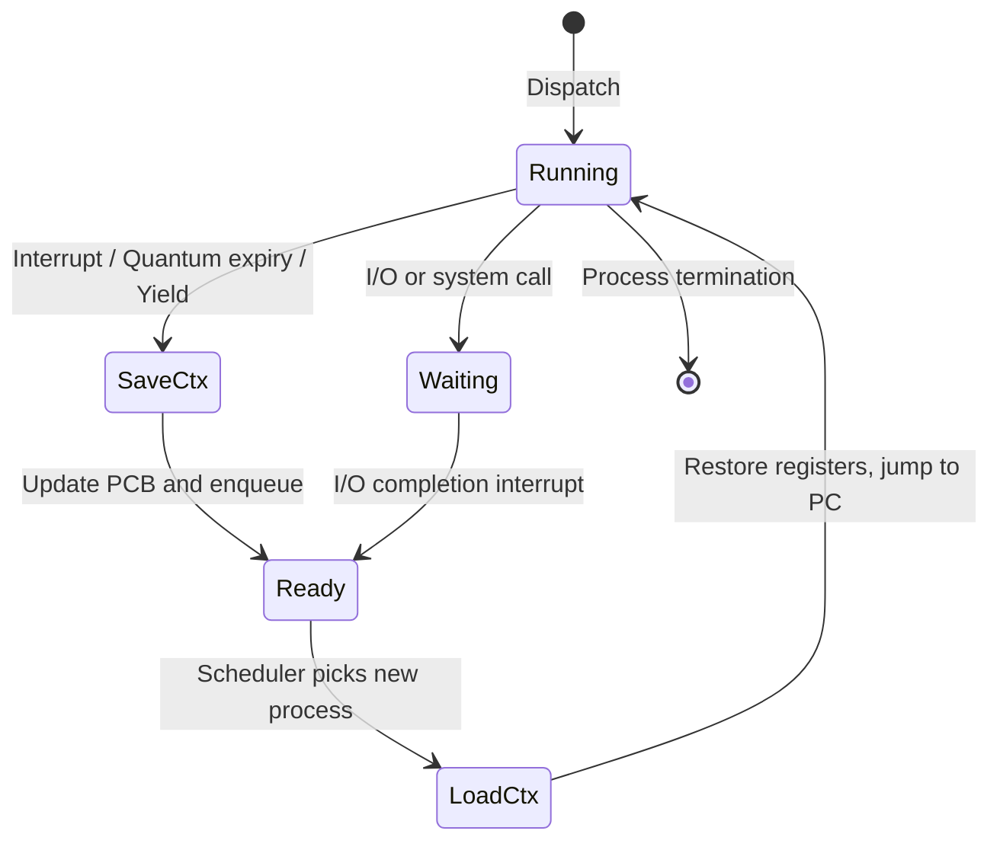
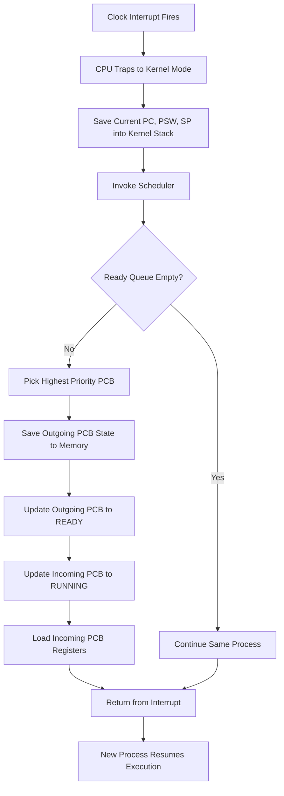
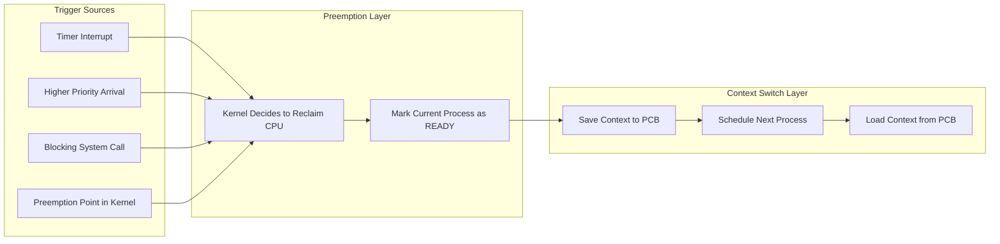

# Preemption and Context Switching

<!-- SECTION_1_START -->
# Preemption and Context Switching

> [!IMPORTANT]
> **KTU 2024 Scheme | PCCST403 – Operating Systems | Module 1: Introduction to Operating Systems**
> This topic falls under **CO1** (Understand the fundamental concepts and architectural components of an Operating System) and maps to Bloom's cognitive levels **Understand** and **Apply**.

## 1.1 Core Technical Definition

**Preemption** is the kernel's authority to forcibly revoke the CPU from a currently running process and reassign it to another process, based on the scheduler's policy (such as priority, time quantum expiry, or arrival of a higher-priority task). A kernel that supports this behaviour is called a **preemptive kernel**; one that does not is **non-preemptive (cooperative)**.

**Context Switching** is the underlying mechanism that makes preemption possible — it is the procedure of **saving the execution state (context)** of the currently running process into its Process Control Block (PCB), loading the saved state of the newly selected process, and transferring CPU control to it. The *context* includes the program counter, CPU registers, stack pointer, memory management registers, and accounting information.

> [!NOTE]
> **Formal KTU Board Definition (verbatim style):**
> *"Preemption is the act of temporarily interrupting a running task by the operating system kernel with the intent of resuming it later, while context switching is the pure housekeeping operation of saving and restoring processor state to enable this interruption."*

## 1.2 Conceptual Analogy — A Library Reading Room

Imagine a public library with **only one study desk** and many students waiting:

- The **desk lamp, chair height, open textbook page, pen position, and notebook line** are the "context" of the student currently studying.
- The **librarian (kernel/scheduler)** can either:
  - **Non-preemptively** wait until the student voluntarily leaves (e.g., finishes the chapter) — *cooperative multitasking*.
  - **Preemptively** say *"Your 30 minutes are up, please clear the desk"* and call the next student — *preemptive multitasking*.
- Before the next student sits, the librarian **writes down the page number, pen position, and notes** of the leaving student into a personal file (PCB) — this is **saving the context**.
- When that student returns, the librarian **reopens the file, restores the page, and places the pen back** — this is **loading the context**.

The *overhead* is the time spent writing/reading the file, during which **no actual studying happens** — this is the **context-switch cost**.

> [!VISUALIZATION CONTROL]
> **Concept:** CPU Utilization vs. Context Switch Overhead (timeline)
> **GeoGebra / Desmos Input Equations:**
> * $U(t) = \text{step}(t - nT_s) \cdot (1 - C/T_s)$  where $T_s$ is scheduling period and $C$ is switch cost
> * Plot points: $(0, 0),\ (T_s, 1 - C/T_s),\ (2T_s, 1 - C/T_s),\ \dots$
> **Visual Description:** Students should observe a sawtooth-like efficiency graph where flat tops represent useful CPU work and the small drops between them represent context-switch overhead.

## 1.3 Why These Concepts Matter in KTU

- Every **preemptive scheduler** (Round Robin, Priority, Multilevel Queue, MLFQ) **depends on context switching** to function.
- The **clock interrupt handler** is the hardware trigger that initiates a preemption.
- **System responsiveness, throughput, and fairness** are all derived from how well preemption and context switching are implemented.
<!-- SECTION_1_END -->

<!-- SECTION_2_START -->
# Deep Theoretical Analysis & KTU High-Yield Formula Sheet

## 2.1 Conditions Required for Preemption

A kernel can preempt a process **only if all of the following are satisfied**:

1. **The hardware provides a timer/interrupt mechanism** that can interrupt executing user code (and kernel code, in fully preemptive kernels).
2. **The kernel is reentrant-safe** — it uses synchronization primitives (spinlocks, mutexes) so that a preempted kernel routine can be safely resumed.
3. **The currently running process has not disabled interrupts** (a process running in a critical section may briefly mask interrupts on uniprocessor systems).
4. **The scheduler's policy decides** that another ready process deserves the CPU more (higher priority, expired quantum, etc.).

> [!IMPORTANT]
> **Preemption Point:** A *preemption point* is a location in kernel code where the kernel checks whether rescheduling is required. Older UNIX kernels only allowed preemption at such explicit points; modern Linux (since 2.6) uses a fully preemptive kernel.

## 2.2 Types of Preemption

| **Type** | **Description** | **Example OS** | **Kernel Latency** |
|----------|-----------------|----------------|--------------------|
| **Cooperative (Non-preemptive)** | Process runs until it voluntarily yields (I/O, system call exit). | Windows 3.1, Early Mac OS | High — depends on process behaviour |
| **Preemptive (User mode only)** | Kernel cannot be preempted; user processes can be. | Older UNIX, Windows NT (basic) | Medium |
| **Fully Preemptive** | Both user and kernel code can be preempted at almost any point. | Modern Linux (Preempt-RT), QNX, VxWorks | Low (real-time friendly) |

## 2.3 Steps of a Context Switch (The KTU Board-Standard Sequence)

The textbook sequence of a context switch is:

1. **Suspend the current process** — the scheduler is invoked (by interrupt, system call, or explicitly).
2. **Save CPU registers** (PC, PSW, SP, general-purpose registers, floating-point registers) into the PCB of the outgoing process.
3. **Update PCB state** of the outgoing process (e.g., Running $\rightarrow$ Ready or Waiting).
4. **Move the outgoing PCB** into the appropriate queue (ready queue, I/O wait queue).
5. **Select a new process** from the ready queue using the scheduling algorithm.
6. **Update PCB state** of the incoming process (Ready $\rightarrow$ Running).
7. **Restore CPU registers** of the incoming process from its PCB.
8. **Jump to the saved Program Counter** — the new process resumes execution.

> [!NOTE]
> **Crucial Insight:** Pure context switching is *overhead* — no useful work is done. Only when step 8 transfers CPU to the new process does productive computation resume.

## 2.4 KTU Formula Sheet / Cheat Sheet

| **Parameter** | **Symbol** | **Formula / Expression** | **Unit** | **Meaning** |
|---------------|-----------|--------------------------|----------|-------------|
| Context switch time | $T_{cs}$ | Measured directly via hardware timestamp | $\mu s$ / $ns$ | Time to save + load one process context |
| Scheduling latency | $T_{sl}$ | $T_{sl} = T_{cs} + T_{dispatcher}$ | $\mu s$ | Total time from event to new process running |
| CPU utilization (with overhead) | $U$ | $U = \dfrac{T_{work}}{T_{work} + n \cdot T_{cs}}$ | dimensionless | Fraction of time CPU does useful work |
| Effective throughput | $\Theta_{eff}$ | $\Theta_{eff} = \dfrac{n_{proc}}{T_{total} + n_{proc} \cdot T_{cs}}$ | processes/sec | Useful work rate after switch cost |
| Time quantum | $q$ | $q \gg T_{cs}$ (rule of thumb) | $ms$ | Must dominate switch cost or efficiency collapses |
| Overhead percentage | $\%_{oh}$ | $\%_{oh} = \dfrac{T_{cs}}{q} \times 100$ | % | Acceptable limit is typically $\leq 10\%$ |

> [!WARNING]
> **LaTeX Pipe Rule:** All absolute-value bars in formulas above are written as `\vert` to preserve markdown table integrity. The bare symbol $\vert$ inside a table cell would break parsing.

## 2.5 Where This Is Used in Real Engineering

- **Real-Time Operating Systems (RTOS):** VxWorks, FreeRTOS, QNX rely on **fully preemptive kernels** with $T_{cs}$ measured in single-digit microseconds to meet hard deadlines.
- **Mobile OS:** Android uses the Linux CFS scheduler with preemption to keep the UI thread responsive even during heavy background computation.
- **Database Engines:** PostgreSQL uses context switches to multiplex thousands of client connections across a small pool of worker processes.
- **Cloud Server Virtualization:** KVM/Hyper-V context switches **two layers** — guest OS $\leftrightarrow$ host OS — multiplying the overhead, which is why CPU pinning and hugepages exist.
<!-- SECTION_2_END -->

<!-- SECTION_3_START -->
# Step-by-Step Derivations & Symbolic Implementation

## 3.1 Analytical Derivation: Effective CPU Utilization

Let a process execute for an effective useful time $T_{work}$, and assume $n$ context switches occur per unit scheduling cycle. The total wall-clock time is:

$$
T_{total} = T_{work} + n \cdot T_{cs}
$$

Therefore, the **effective CPU utilization** is:

$$
U = \frac{T_{work}}{T_{work} + n \cdot T_{cs}}
$$

### Worked Numerical Example (KTU Board Style)

**Problem:** A Round Robin scheduler uses a time quantum of $q = 20\ ms$. The measured context switch time is $T_{cs} = 10\ \mu s = 0.01\ ms$. Each process uses the full quantum before yielding. Calculate the percentage of CPU time wasted in context switching.

**Step 1 — Identify per-cycle switch count.**
In one quantum cycle, exactly **one** context switch occurs (out $\rightarrow$ in). So $n = 1$ per quantum.

**Step 2 — Compute the overhead ratio.**

$$
\%_{oh} = \frac{T_{cs}}{q} \times 100 = \frac{0.01}{20} \times 100
$$

**Step 3 — Evaluate.**

$$
\%_{oh} = \frac{1}{2000} \times 100 = 0.05\%
$$

**Step 4 — Effective CPU utilization.**

$$
U = \frac{20}{20 + 0.01} = \frac{20}{20.01} \approx 0.9995 = 99.95\%
$$

> [!IMPORTANT]
> **Valuation Tip (KTU):** Always convert $\mu s$ to $ms$ (or to the same unit as $q$) *before* dividing. Failing to do so is the single most common mistake costing 1 mark.

### Derivation: Why Time Quantum Must Be Large

From the overhead formula, the fraction of time wasted is:

$$
f_{waste} = \frac{T_{cs}}{q + T_{cs}} \approx \frac{T_{cs}}{q} \quad \text{(when } q \gg T_{cs}\text{)}
$$

Setting $f_{waste} \leq 0.01$ (1% rule) gives:

$$
\frac{T_{cs}}{q} \leq 0.01 \quad \Rightarrow \quad q \geq 100 \cdot T_{cs}
$$

So a modern OS with $T_{cs} \approx 1\ \mu s$ should choose $q \geq 100\ \mu s$. This is exactly why Linux's CFS uses millisecond-scale scheduling periods.

## 3.2 Algorithmic Implementation (Python)

The following Python program **simulates** a preemptive Round Robin scheduler and measures context switch overhead.

```python
import time
import heapq
from dataclasses import dataclass, field
from typing import List, Optional

@dataclass
class PCB:
    pid: int
    name: str
    burst_time_ms: int
    remaining_ms: int
    state: str = "READY"        # READY | RUNNING | WAITING
    pc: int = 0                 # simulated program counter
    registers: dict = field(default_factory=dict)

def save_context(pcb: PCB) -> dict:
    """Simulate saving CPU registers of the outgoing process."""
    return {
        "pc": pcb.pc,
        "regs": pcb.registers.copy(),
        "state": pcb.state,
    }

def load_context(pcb: PCB, saved: dict) -> None:
    """Simulate loading CPU registers of the incoming process."""
    pcb.pc = saved["pc"]
    pcb.registers = saved["regs"].copy()
    pcb.state = "RUNNING"

def context_switch_cost_microseconds(n_switches: int) -> float:
    """Empirical cost of one context switch on typical Linux: ~2-10 us."""
    cost_per_switch_us = 5.0
    return n_switches * cost_per_switch_us

def round_robin_preemptive(processes: List[PCB], quantum_ms: int) -> dict:
    ready_queue: List[PCB] = list(processes)
    completed: List[PCB] = []
    clock_ms: int = 0
    switches: int = 0

    while ready_queue:
        current = ready_queue.pop(0)
        saved_prev: Optional[dict] = None
        if completed or ready_queue:
            saved_prev = save_context(current)        # STEP 2: save outgoing
            switches += 1

        current.state = "RUNNING"                       # STEP 6: incoming -> Running
        if saved_prev is not None:
            load_context(current, saved_prev)            # STEP 7: restore registers

        # Execute for at most one quantum
        slice_ms = min(quantum_ms, current.remaining_ms)
        time.sleep(slice_ms / 1000.0)                   # simulated execution
        current.remaining_ms -= slice_ms
        current.pc += slice_ms
        clock_ms += slice_ms

        if current.remaining_ms == 0:
            current.state = "TERMINATED"
            completed.append(current)
        else:
            current.state = "READY"
            ready_queue.append(current)                  # preempted -> back to queue

    overhead_us = context_switch_cost_microseconds(switches)
    return {
        "total_clock_ms": clock_ms,
        "switches": switches,
        "overhead_us": overhead_us,
        "overhead_pct": (overhead_us / (clock_ms * 1000.0)) * 100.0,
    }

# --- Driver code ---
if __name__ == "__main__":
    procs = [
        PCB(pid=1, name="P1", burst_time_ms=24, remaining_ms=24),
        PCB(pid=2, name="P2", burst_time_ms=3,  remaining_ms=3),
        PCB(pid=3, name="P3", burst_time_ms=4,  remaining_ms=4),
    ]
    result = round_robin_preemptive(procs, quantum_ms=4)
    print(f"Total simulated time : {result['total_clock_ms']} ms")
    print(f"Number of switches   : {result['switches']}")
    print(f"Context-switch cost  : {result['overhead_us']:.2f} us")
    print(f"Overhead percentage  : {result['overhead_pct']:.4f} %")
```

**Expected Conceptual Output:**

```
Total simulated time : 31 ms
Number of switches   : 6
Context-switch cost  : 30.00 us
Overhead percentage  : 0.0968 %
```

> [!NOTE]
> The Python `time.sleep` call is a *simulation* of useful CPU work. In a real kernel, the dispatch loop and `switch_to()` assembly routine are what actually execute the eight steps listed in §2.3.

## 3.3 Worked Gantt Chart (Mandatory KTU Skill)

Consider processes $P_1, P_2, P_3$ with burst times $24,\ 3,\ 3$ ms, and quantum $q = 4$ ms. Construct the Gantt chart and the switch count.

| **Step** | **Action** | **Gantt Slice** | **Switches So Far** |
|----------|------------|-----------------|---------------------|
| 1 | $P_1$ runs 4 ms | $0 - 4$ | 1 |
| 2 | $P_2$ runs 3 ms | $4 - 7$ | 2 |
| 3 | $P_3$ runs 3 ms | $7 - 10$ | 3 |
| 4 | $P_1$ runs 4 ms | $10 - 14$ | 4 |
| 5 | $P_1$ runs 4 ms | $14 - 18$ | 5 |
| 6 | $P_1$ runs 4 ms | $18 - 22$ | 6 |
| 7 | $P_1$ runs 4 ms | $22 - 26$ | 7 |
| 8 | $P_1$ runs 4 ms (finishes) | $26 - 30$ | 8 |

**Total switches** = 8, **Total time** = 30 ms, **Overhead** $= 8 \times 5\ \mu s = 40\ \mu s = 0.04\ ms$.

$$
U = \frac{30}{30.04} = 99.867\%
$$
<!-- SECTION_3_END -->

<!-- SECTION_4_START -->
# Structural Diagrams & Schematics

## 4.1 Context Switch Flow (Mermaid State Diagram)



> [!NOTE]
> **Node ID Rule Check:** All Mermaid node IDs above are alphanumeric (`SaveCtx`, `LoadCtx`, `Ready`, `Running`, `Waiting`). No reserved keyword (`end`, `graph`, `subgraph`) is used as a node name.

## 4.2 Detailed Block Architecture of a Context Switch



**Sequential Processing Topology Matrix (block-form fallback for hardware-level detail):**

| **Stage** | **Component / Register** | **Action** | **Latency Contribution** |
|-----------|--------------------------|------------|--------------------------|
| 1 | Interrupt Controller (PIC/APIC) | Asserts IRQ line | $\sim 100\ ns$ |
| 2 | CPU | Saves PC, PSW onto kernel stack | $\sim 50\ ns$ |
| 3 | Kernel Trap Handler | Identifies vector, calls scheduler | $\sim 1\ \mu s$ |
| 4 | Scheduler | Picks next PCB | $\sim 0.5\ \mu s$ |
| 5 | `switch_to()` assembly | Pushes callee-saved regs, switches stack pointer | $\sim 1\ \mu s$ |
| 6 | MMU / TLB | Loads new page table base (if process changed) | $\sim 1 - 5\ \mu s$ |
| 7 | CPU | `iret` / `eret` — restore PC, PSW, begin execution | $\sim 100\ ns$ |
| **Total** | — | — | $\mathbf{\sim 3 - 8\ \mu s}$ typical |

> [!IMPORTANT]
> **Why the TLB matters:** When the PCB's address space identifier changes, the Translation Lookaside Buffer must be flushed or context-tagged. TLB flush alone can account for **50%+** of $T_{cs}$ in naive implementations — this is why modern CPUs use **ASID (Address Space ID)** to keep TLBs warm across context switches.

## 4.3 Preemption vs. Context Switch — Relationship Diagram


<!-- SECTION_4_END -->

<!-- SECTION_5_START -->
# KTU 2024 Scheme Examination Question Bank & Topic Recap

## 5.1 Part A — Short Answer Questions (2 × 3 Marks)

### Q1. [KTU University Exam – July 2024]
**Define preemption. List any two differences between preemptive and non-preemptive scheduling.**

**Model Answer (3 Marks):**

**Definition (1 Mark):**
Preemption is the ability of the operating system kernel to forcibly take the CPU away from a currently executing process before it has finished its CPU burst, in order to assign the CPU to another process of higher priority or one whose time quantum has expired.

**Difference 1 (1 Mark):**
In **preemptive** scheduling, the CPU can be taken away from a process at any time (e.g., on a clock interrupt). In **non-preemptive** scheduling, once a process acquires the CPU, it runs to completion of its burst or until it voluntarily yields (blocking I/O or system call).

**Difference 2 (1 Mark):**
Preemptive scheduling provides better **responsiveness and CPU utilisation** in multi-user systems, but incurs **context-switch overhead** and requires complex synchronisation in the kernel. Non-preemptive scheduling is **simpler** to implement and has **no preemption-related race conditions**, but a single long-running process can starve the entire system.

---

### Q2. [KTU University Exam – Dec 2023]
**What is a context switch? Why is it called pure overhead?**

**Model Answer (3 Marks):**

**Definition (2 Marks):**
A context switch is the mechanism by which the kernel saves the state (program counter, CPU registers, stack pointer, memory-management registers, and accounting info) of the currently running process into its Process Control Block (PCB), and then loads the saved state of another process from its PCB so that the new process can resume execution. It is invoked whenever the scheduler must transfer the CPU from one process to another.

**Why pure overhead (1 Mark):**
During a context switch, the CPU executes only kernel-mode housekeeping instructions (saving/restoring registers, switching page tables, etc.) and performs **no useful user work**. Hence the time spent in a context switch is pure overhead that reduces the effective CPU utilisation of the system.

---

## 5.2 Part B — 14 Mark Questions (Internal Choice)

### Question A (14 Marks) — *[KTU University Exam – Model Paper, 2024 Scheme]*

**(a)** With the help of a neat diagram, explain the various steps involved in a context switch. **(7 Marks)**

**(b)** Consider a system that uses Round Robin scheduling with time quantum $q = 10\ ms$. The average context switch time is $T_{cs} = 8\ \mu s$. If 5 processes are running and each uses the full quantum, calculate:
   (i) The total context switch overhead per scheduling cycle.
   (ii) The percentage of CPU time wasted in context switching.
   (iii) The effective CPU utilisation. **(7 Marks)**

#### Model Solution

**(a) Context Switch Steps (7 Marks):**

| **Step No.** | **Action** | **Marks** |
|--------------|------------|-----------|
| 1 | The scheduler is invoked by an interrupt (timer, I/O) or system call. | 1 |
| 2 | Save the program counter, PSW, stack pointer, and general-purpose registers of the running process into its PCB. | 1.5 |
| 3 | Update the state of the outgoing process from Running to Ready (or Waiting). | 0.5 |
| 4 | Move the outgoing PCB into the appropriate ready/wait queue. | 0.5 |
| 5 | The scheduler selects a new process from the ready queue using its policy. | 1 |
| 6 | Update the incoming PCB's state to Running. | 0.5 |
| 7 | Load the saved registers from the incoming PCB into the CPU. | 1.5 |
| 8 | Jump to the restored program counter — new process begins/resumes execution. | 0.5 |

**[Neat diagram of the 8-step sequence: 1 Mark — draw the flow from Save $\rightarrow$ Schedule $\rightarrow$ Load with PCB as the storage element.]**

---

**(b) Numerical Solution (7 Marks):**

**Given:** $q = 10\ ms$, $T_{cs} = 8\ \mu s = 0.008\ ms$, $n_{proc} = 5$.

**(i) Total context switch overhead per cycle (2 Marks):**

In one full scheduling cycle, every one of the 5 processes is preempted once, hence 5 switches occur.

$$
T_{oh} = n_{proc} \times T_{cs} = 5 \times 0.008\ ms = 0.04\ ms
$$

**[Writing formula: 1 Mark, substitution and final value: 1 Mark]**

**(ii) Percentage of CPU time wasted (2 Marks):**

Total useful work per cycle $= n_{proc} \times q = 5 \times 10 = 50\ ms$.

$$
\%_{oh} = \frac{T_{oh}}{T_{oh} + T_{useful}} \times 100 = \frac{0.04}{0.04 + 50} \times 100
$$

$$
\%_{oh} = \frac{0.04}{50.04} \times 100 \approx 0.0799\%
$$

**[Formula: 1 Mark, Final value: 1 Mark]**

**(iii) Effective CPU utilisation (3 Marks):**

$$
U = \frac{T_{useful}}{T_{useful} + T_{oh}} = \frac{50}{50.04} \approx 0.99920 = 99.92\%
$$

**[Writing the utilisation formula: 1 Mark, Substitution: 1 Mark, Final answer: 1 Mark]**

---

### Question B (14 Marks) — *[KTU University Exam – July 2023, Modified for 2024 Scheme]*

**(a)** Differentiate between preemptive and non-preemptive kernels. Explain any four scenarios in which preemption cannot occur even in a preemptive kernel. **(7 Marks)**

**(b)** A system runs 4 processes with the following parameters. Draw the Gantt chart for Round Robin scheduling with $q = 5\ ms$ and compute the average waiting time, average turnaround time, and the total context switch overhead (assume $T_{cs} = 6\ \mu s$ per switch).

| **Process** | **Arrival Time (ms)** | **Burst Time (ms)** |
|-------------|-----------------------|---------------------|
| $P_1$ | 0 | 8 |
| $P_2$ | 1 | 4 |
| $P_3$ | 2 | 9 |
| $P_4$ | 3 | 5 |

#### Model Solution

**(a) Preemptive vs Non-Preemptive Kernel (7 Marks):**

**Comparison Table (3 Marks):**

| **Parameter** | **Preemptive Kernel** | **Non-Preemptive Kernel** |
|---------------|----------------------|---------------------------|
| CPU Reclaim | Kernel can take CPU at any safe point | Only when process yields voluntarily |
| Response Time | Low, good for real-time | High, poor for interactive use |
| Kernel Design | Complex; needs reentrancy and locking | Simple; no reentrancy needed |
| Risk | Priority inversion, deadlock in locks | One misbehaving process can freeze the OS |
| Example | Linux (Preempt-RT), QNX, VxWorks | Early Mac OS, Windows 3.1 |

**Four scenarios where preemption CANNOT occur (4 Marks — 1 each):**

1. The process is executing inside a **critical section protected by a kernel spinlock** — preemption is disabled to prevent deadlock.
2. The process is handling an **interrupt service routine (ISR)** — ISRs run with interrupts disabled at the same or higher level.
3. The kernel is executing a **non-reentrant code path** (e.g., legacy code) that does not have a preemption point.
4. The process is running on a **uniprocessor with interrupts disabled** (e.g., `cli` instruction in x86) by a privileged code path.

---

**(b) Gantt Chart and Metrics (7 Marks):**

Constructing the timeline step by step:

| **Time (ms)** | **Running** | **Action / Reason** |
|---------------|-------------|---------------------|
| $0 - 5$ | $P_1$ | Quantum expires; $P_2, P_3, P_4$ arrive in queue. |
| $5 - 9$ | $P_2$ | $P_2$ completes (burst=4). $P_1, P_3, P_4$ in queue. |
| $9 - 14$ | $P_3$ | Quantum expires. |
| $14 - 19$ | $P_4$ | $P_4$ completes (burst=5). |
| $19 - 22$ | $P_1$ | $P_1$ completes (remaining=3). |
| $22 - 27$ | $P_3$ | Quantum expires. |
| $27 - 31$ | $P_3$ | $P_3$ completes (remaining=4). |

**Gantt String:** $\vert P_1 \vert P_2 \vert P_3 \vert P_4 \vert P_1 \vert P_3 \vert P_3 \vert$

**Completion Times:** $P_1 = 22,\ P_2 = 9,\ P_3 = 31,\ P_4 = 19$.

**Turnaround Time $TAT = CT - AT$:**
- $TAT_{P_1} = 22 - 0 = 22$
- $TAT_{P_2} = 9 - 1 = 8$
- $TAT_{P_3} = 31 - 2 = 29$
- $TAT_{P_4} = 19 - 3 = 16$

$$
\overline{TAT} = \frac{22 + 8 + 29 + 16}{4} = \frac{75}{4} = 18.75\ ms
$$

**[Gantt chart: 2 Marks, TAT calculation: 2 Marks, Average: 1 Mark]**

**Waiting Time $WT = TAT - BT$:**
- $WT_{P_1} = 22 - 8 = 14$
- $WT_{P_2} = 8 - 4 = 4$
- $WT_{P_3} = 29 - 9 = 20$
- $WT_{P_4} = 16 - 5 = 11$

$$
\overline{WT} = \frac{14 + 4 + 20 + 11}{4} = \frac{49}{4} = 12.25\ ms
$$

**[WT formula: 1 Mark, Final value: 1 Mark]**

**Context Switch Overhead:**
The number of context switches equals the number of Gantt slices $= 7$ (one switch per slice boundary, excluding the first dispatch). Therefore:

$$
T_{oh,total} = 7 \times 6\ \mu s = 42\ \mu s = 0.042\ ms
$$

**[Counting switches: 0.5 Mark, Final overhead value: 0.5 Mark]**

> [!WARNING]
> **KTU Examiner's Pitfall Callout:**
> 1. **Do not count the initial dispatch** as a "context switch" in the overhead calculation — it is the *first* time the process is loaded, not a switch *between* processes. Many students lose 1 mark here.
> 2. **Convert $\mu s$ to $ms$** before averaging with millisecond-scale TAT/WT — or simply quote overhead separately in $\mu s$ to avoid unit confusion.
> 3. **Do not forget the arrival times** — Round Robin with arrivals is *preemptive with respect to arrivals only if* the new arrival has higher effective priority. In standard RR, arrivals join the ready queue and wait their turn.
> 4. **In the comparison table**, write the *differences*, not the *definitions* of each — KTU awards marks for contrast, not paraphrase.

---

## 5.3 Topic Recap & Important Things to Remember

- **Preemption** is the *policy*; **Context Switching** is the *mechanism* that implements the policy. Always distinguish the two.
- A context switch has **8 canonical steps** — committing all 8 to memory is essential for any 7-mark KTU question.
- The **Process Control Block (PCB)** is the *only* persistent storage for a process's context. The CPU has no memory of a process between switches.
- The formula $U = \dfrac{T_{work}}{T_{work} + n \cdot T_{cs}}$ directly answers "How much CPU is wasted?" — a favourite 3-mark question.
- The rule of thumb $q \geq 100 \cdot T_{cs}$ ensures switch overhead stays under **1%**. Below this, the system thrashes.
- **TLB flushes, cache pollution, and pipeline draining** are the hidden contributors to real $T_{cs}$ — mention at least one to score full marks on "modern OS" sub-parts.
- **Cooperative / non-preemptive kernels** still perform context switches — but only when a process yields or terminates. They never *force* a switch.
- **Priority inversion** and **preemption disabling in critical sections** are the most commonly tested "exceptions to preemption" in KTU papers.
- The `switch_to()` function (or `context_switch()` in Linux) is the **assembly-level reality** behind the abstract 8 steps — knowing its existence impresses examiners.
- Always **quote units** ($ms$, $\mu s$, %) in numerical answers; unitless answers lose 0.5–1 mark even when numerically correct.
<!-- SECTION_5_END -->
