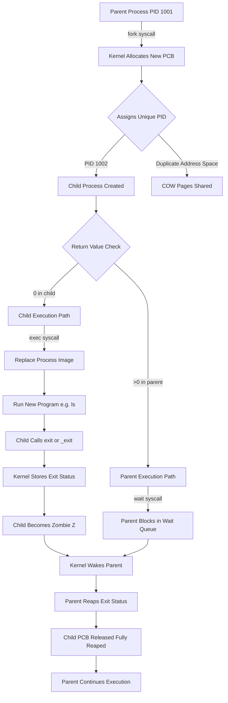
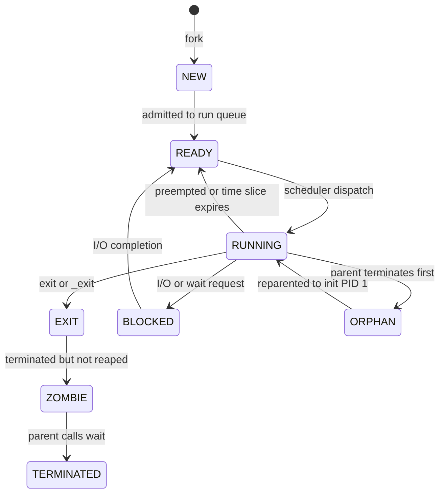
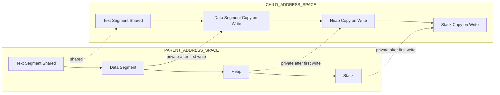
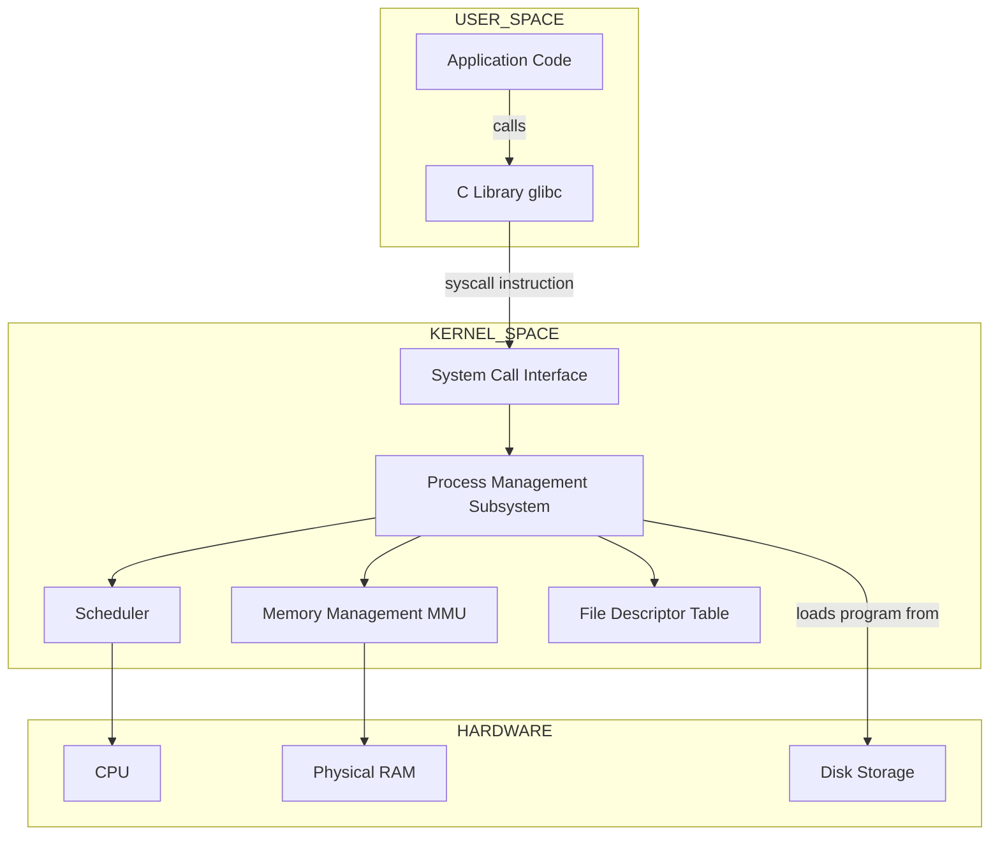
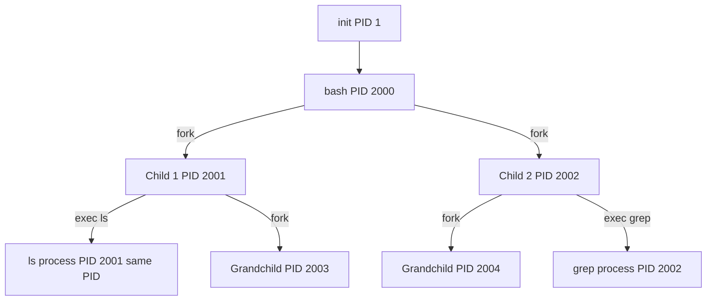
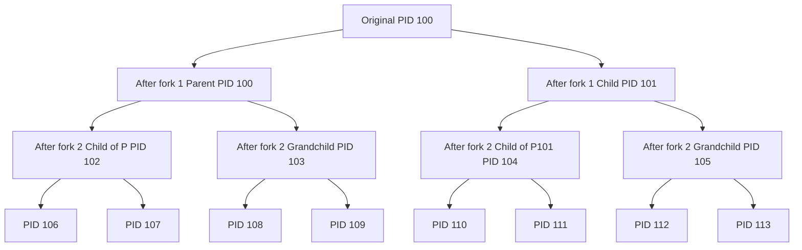

# Process API

<!-- SECTION_1_START -->
# Process API — Core Technical Definition & Intuitive Overview

## Formal Academic Definition (KTU 2024 Syllabus Terminology)

> [!IMPORTANT]
> **Process API (Application Programming Interface)** refers to the set of **system calls** exposed by the operating system kernel that allow user-space programs and applications to **create, manage, terminate, and synchronize processes**. In the UNIX/Linux paradigm, the Process API is the canonical interface through which a running program interacts with the OS scheduler and process control subsystem.

In the **KTU 2024 Scheme (PCCST403 — Operating Systems, Module 1)**, the Process API is specifically studied as the **POSIX/UNIX process management interface** comprising the following primitive operations:

- **Process Creation** → `fork()`, `vfork()`, `clone()`
- **Program Execution / Image Replacement** → `exec()` family (`execl`, `execv`, `execle`, `execve`, `execlp`, `execvp`)
- **Process Termination** → `exit()`, `_exit()`
- **Parent–Child Synchronization** → `wait()`, `waitpid()`
- **Process Identification** → `getpid()`, `getppid()`, `getuid()`, `geteuid()`

---

## Conceptual Analogy / Intuition

> [!NOTE]
> **Real-World Analogy — The Photocopying Office**
>
> Imagine you are filling out an official government form (this is your **process** — a running program with its own memory, registers, and state). When you call `fork()`, the office **photocopies your entire form exactly as it is**, including your pen marks, your signature in progress, and even the page number you are on. Now there are **two identical forms being filled out** — the **parent** (original) and the **child** (photocopy). Both are independent; whatever one writes after the copy moment does **not** affect the other.
>
> However, you don't want two identical forms in the system. So you use `exec()` — this is like **tearing up the photocopy and replacing it with a different, freshly printed form template** (e.g., a passport application instead of a tax form). The paper is still the same, but the content is completely new.
>
> Finally, the original form (parent) uses `wait()` to **stand in a queue** until the new form (child) is fully processed, and the parent's exit code is collected.

---

## Why Process API Exists — The OS Design Rationale

Operating systems needed a **standardized, kernel-mediated way** to spawn new work because:

1. **Process creation is a privileged operation** — only the kernel can allocate a new **Process Control Block (PCB)**, assign a unique **PID**, and set up page tables.
2. **Resource isolation** — child processes need separate virtual address spaces.
3. **Composability** — UNIX philosophy of "small tools that combine" requires one program to launch another.
4. **Concurrency** — modern applications (web servers, shells, compilers) need to run multiple tasks **in parallel** or **pipelined**.

> [!IMPORTANT]
> **Standard Metric Highlighted in KTU Syllabus:**
> - The default **Process ID (PID)** range in Linux is **1 to 32768** (configurable up to **4,194,304** via `/proc/sys/kernel/pid_max`).
> - **PID 1** is reserved for `init` (or `systemd`), the **ancestor of all user processes**.
> - On a 64-bit Linux kernel, PIDs can theoretically scale up to `$2^{22}$` = **4,194,304**.

---

## GeoGebra / Desmos Visualization

> [!VISUALIZATION CONTROL]
> **Concept:** Parent and Child process address space divergence after `fork()`
> **GeoGebra / Desmos Input Equations:**
> - Parent memory at $t = 0$: `P(x) = 100` (constant — same as child at fork moment)
> - Parent memory at $t = 1$: `P(x) = 120` (modified independently)
> - Child memory at $t = 1$: `C(x) = 105` (modified independently)
> - **Visual Description:** On the X-axis plot **time** (0 = before fork, 1 = after fork). On the Y-axis plot **value of a variable `x`**. Before $t=0$, both lines overlap at $y=100$. After $t=0$, the **parent line and child line diverge** — modifications in one do not affect the other. This visualizes the **copy-on-write (COW)** semantics of `fork()`.

---

## The Five Pillars of the Process API (High-Level Map)

| # | System Call | Header File | Primary Purpose |
|---|---|---|---|
| 1 | `pid_t fork(void)` | `<unistd.h>` | Create a child process (duplicate) |
| 2 | `int exec*(...)` | `<unistd.h>` | Replace process image with new program |
| 3 | `pid_t wait(int *status)` | `<sys/wait.h>` | Parent waits for child to terminate |
| 4 | `void exit(int status)` | `<stdlib.h>` | Graceful process termination |
| 5 | `pid_t getpid(void)` | `<unistd.h>` | Retrieve calling process's PID |

<!-- SECTION_1_END -->

<!-- SECTION_2_START -->
# Deep Theoretical Analysis & KTU High-Yield Formula Sheet

## 1. The `fork()` System Call — Process Duplication

### Operational Semantics

The `fork()` system call performs a **near-exact duplication** of the calling process. The kernel performs the following operations atomically:

1. Allocates a new **Process Control Block (PCB)** in kernel memory.
2. Assigns a new, unique **PID** to the child.
3. Sets the child's **PPID (Parent PID)** to the parent's PID.
4. Creates a **virtual address space copy** for the child (logical copy — actual physical pages use **Copy-on-Write (COW)**).
5. Duplicates **open file descriptors** (child inherits the parent's fd table — they share underlying file offsets).
6. Returns **twice**:
   - In the **parent**: returns the **child's PID** (a positive integer $> 0$).
   - In the **child**: returns **0**.
   - On failure: returns **-1** (no child created; `errno` is set).

### Return Value Logic — KTU Exam Favourite

$$
\text{fork()} =
\begin{cases}
-1 & \text{if creation fails (e.g., process table full, RLIMIT\_NPROC exceeded)} \\
0 & \text{in the child process (newly created)} \\
> 0 & \text{in the parent process (returns the child's PID)}
\end{cases}
$$

> [!NOTE]
> **Why two return values from one call?**
> Because after `fork()`, **both processes execute the same code path**. The kernel cannot "tell them apart" structurally — it relies on the return value to let each process branch appropriately. This is why **every textbook C program after `fork()` contains an `if-else`** separating parent and child logic.

### Copy-on-Write (COW) Optimization

Modern UNIX kernels (Linux, BSD) do **not** physically copy all memory pages at `fork()`. Instead:

- Both parent and child initially **share the same physical pages**, marked as **read-only** in their page tables.
- If either process attempts to **write** to a shared page, a **page fault** is triggered.
- The kernel then **allocates a new physical frame**, copies the original page, and updates the faulting process's page table entry to point to the new page (now writable).
- The other process continues to see the original page.

> [!IMPORTANT]
> **Engineering Implication:** COW makes `fork()` extremely fast — a `fork()` of a 1 GB process initially consumes only a few extra KB of kernel memory. This is the foundation of efficient UNIX shells, web servers (Apache prefork model), and OS-level virtualization.

---

## 2. The `exec()` Family — Program Image Replacement

### Operational Semantics

The `exec()` family **replaces the entire process image** — code, data, heap, stack — with a new program loaded from disk. The PID **does not change**; the process itself is the same, but it now runs a different program.

The six standard variants differ in:
- How the arguments and environment are passed (list vs. vector)
- Whether the path is searched (uses `$PATH` or not)

| Variant | Argument Style | Path Search ($PATH) | Spec |
|---|---|---|---|
| `execl` | List (`arg0, arg1, ..., NULL`) | No | POSIX |
| `execlp` | List | **Yes** | POSIX |
| `execle` | List + explicit env | No | POSIX |
| `execv` | Vector (`argv[]`) | No | POSIX |
| `execvp` | Vector | **Yes** | POSIX |
| `execve` | Vector + explicit env | No | **Kernel-level syscall** |

> [!NOTE]
> **Critical KTU Fact:** `execve()` is the **single true system call**. All other `exec*` variants are **C library wrappers** that internally call `execve()` after constructing the appropriate `argv` and `envp` arrays.

### What `exec()` Does NOT Change
- **PID** and **PPID** (process identity preserved)
- **Open file descriptors** (unless marked `FD_CLOEXEC`)
- **Session ID** and **process group ID**
- **Working directory**, **umask**, **signal masks**

### What `exec()` Does Change
- Code segment (text)
- Data segment (initialized/uninitialized)
- Heap
- Stack (reset to a new stack)
- Signal handlers (reset to default for caught signals)

---

## 3. The `wait()` and `waitpid()` System Calls — Synchronization

### Operational Semantics

A parent process that has spawned children via `fork()` may use `wait()` to **block** until one or all children terminate. The kernel:

1. Suspends the parent in the **`TASK_INTERRUPTIBLE`** (or `TASK_UNINTERRUPTIBLE`) state.
2. When a child exits, the kernel reaps its **zombie** state, collects the **exit status**, and wakes the parent.
3. `wait()` returns the **PID of the terminated child** and stores the exit code in the `status` pointer (if non-NULL).

### Macro Helpers to Decode `status`

| Macro | Meaning | Code to Extract |
|---|---|---|
| `WIFEXITED(status)` | Child terminated normally via `exit()` | True if low 8 bits = 0 |
| `WEXITSTATUS(status)` | Exit code passed to `exit()` | `(status >> 8) \& 0xFF` |
| `WIFSIGNALED(status)` | Child killed by an unhandled signal | True if low 7 bits = 0, bit 7 set |
| `WTERMSIG(status)` | Signal number that killed child | `status \& 0x7F` |
| `WIFSTOPPED(status)` | Child stopped (e.g., SIGSTOP) | — |
| `WSTOPSIG(status)` | Signal that stopped the child | — |

---

## 4. The `exit()` and `_exit()` Calls — Termination

| Call | Header | Flushes stdio buffers? | Calls atexit handlers? | Spec |
|---|---|---|---|---|
| `exit(status)` | `<stdlib.h>` | **Yes** | **Yes** | ISO C |
| `_exit(status)` | `<unistd.h>` | **No** | **No** | POSIX |

> [!IMPORTANT]
> **KTU Exam Trap:** Always use `_exit()` (or `_Exit()`) **directly in child processes after `fork()`** when they have no work to do, to avoid flushing the parent's `stdio` buffers twice. Use `exit()` in the parent or in non-forked code paths.

### Exit Status Encoding

The 16-bit `status` word is structured as follows:

$$
\text{status} = \underbrace{0\ldots0}_{\text{normal exit bits}} \;|\; \underbrace{\text{exit\_code}}_{\text{bits 8--15}} \;|\; \underbrace{0}_{\text{core dump}} \;|\; \underbrace{0}_{\text{terminating signal}}_{\text{bits 0--6}}
$$

- Normal exit: `exit_code` is in bits 8–15 (max value **255**).
- Signal termination: signal number is in bits 0–6 (max value **127**); bit 7 indicates core dump.

---

## 5. Process Identification — `getpid()` and `getppid()`

- `getpid()` returns the **PID of the calling process**.
- `getppid()` returns the **PPID — PID of the parent process**.

After `fork()`, the child can call `getppid()` to learn its parent's identity. If the parent terminates before the child, the child is **reparented** to `init` (PID 1) — this prevents orphaned zombie processes.

---

## KTU High-Yield Formula Sheet

| Concept | Formula / Rule | Unit / Boundary |
|---|---|---|
| `fork()` return | parent gets child PID, child gets $0$, error returns $-1$ | PIDs $\in [1, 32768]$ (default Linux) |
| `execve()` final syscall | Only true kernel-level exec | Replaces text/data/heap/stack |
| `wait()` return | PID of reaped child, or $-1$ on error | Blocks in kernel scheduler |
| Exit status encoding | `status = (exit_code << 8) \mid signal_info` | exit_code $\in [0, 255]$ |
| `WEXITSTATUS(s)` | `(s >> 8) \& 0xFF` | Normal exit extraction |
| `WTERMSIG(s)` | `s \& 0x7F` | Signal extraction |
| COW page fault | Triggered on first write to shared page | Lazy copy, near-zero overhead |
| Max processes per user | `RLIMIT_NPROC` (soft/hard) | typically $32768$ on Linux |

---

## Real-World Utility in Engineering and CS

- **UNIX Shells (`bash`, `zsh`):** Every command typed at the prompt is executed using `fork()` + `exec()`. The shell forks a child, the child calls `execvp()` to load the command, and the parent `wait()`s.
- **Web Servers (Apache prefork, NGINX workers):** `fork()` spawns worker processes to handle multiple client connections concurrently.
- **Compilers (`gcc`):** The preprocessor, compiler, assembler, and linker are separate programs chained together via `fork()` + `exec()`.
- **OS Virtualization (Docker, Linux Containers):** `clone()` (a `fork()` variant) is used to create containers with shared namespaces.
- **Parallel Computing (OpenMP, MPI runtimes):** Master process forks workers to distribute computational tasks.

<!-- SECTION_2_END -->

<!-- SECTION_3_START -->
# Step-by-Step Derivations, Code Implementation & Symbolic Execution

## Derivation 1: Counting Number of Processes After N `fork()` Calls

> This is a **KTU exam classic** — students must compute the total number of processes (and print statements) produced by a sequence of `fork()` calls.

### The Cardinal Rule

> [!IMPORTANT]
> **Each call to `fork()` doubles the number of currently active processes.** If $P_n$ is the number of processes after the $n$-th fork, then:
> $$P_n = 2 \cdot P_{n-1}, \quad P_0 = 1$$
> Therefore:
> $$P_n = 2^n$$

### Proof by Induction

**Base case** ($n=0$): There is exactly 1 process initially (the parent).
$$P_0 = 1 = 2^0 \quad \checkmark$$

**Inductive step**: Assume $P_{k} = 2^k$ after $k$ forks. The $(k+1)$-th fork is called by **every** existing process, so each one creates one child, doubling the count:
$$P_{k+1} = 2 \cdot P_k = 2 \cdot 2^k = 2^{k+1} \quad \blacksquare$$

### Worked Example: 3 `fork()` Calls in Sequence

```c
#include <stdio.h>
#include <unistd.h>

int main(void) {
    printf("Before any fork: PID = %d\n", getpid());
    fork();   // Fork #1 → 2 processes
    fork();   // Fork #2 → 4 processes
    fork();   // Fork #3 → 8 processes
    printf("Hello from PID = %d\n", getpid());
    return 0;
}
```

- After **Fork #1**: 2 processes
- After **Fork #2**: 4 processes
- After **Fork #3**: 8 processes
- Number of "Hello" print statements: $\mathbf{2^3 = 8}$

### Branching Case: `fork()` Inside `if`

```c
fork();
if (pid == 0) {        // only the child enters
    fork();            // only ONE process forks here
}
```

- After first `fork()`: 2 processes
- Only the child passes the `if`, so only **1 process** calls the second `fork()`
- Final count: $2 + 1 = \mathbf{3}$ processes

---

## Derivation 2: The Canonical "fork + exec + wait" Program

The following fully-commented C program demonstrates the **standard UNIX pattern** for running a subprocess. Every line is shown; no truncation is used.

```c
/*
 * File: run_ls.c
 * Purpose: Demonstrate fork() + exec() + wait() Pattern
 * KTU Module 1 - Process API
 */

#include <stdio.h>      // For printf, perror
#include <stdlib.h>     // For exit
#include <unistd.h>     // For fork, getpid, getppid, execvp
#include <sys/types.h>  // For pid_t
#include <sys/wait.h>   // For wait, WIFEXITED, WEXITSTATUS

int main(int argc, char *argv[]) {
    pid_t child_pid;          // Will store the return value of fork()
    int   child_status;       // Will store the exit status of the child

    /* ============================================================
     * STEP 1: Create a child process using fork()
     * ============================================================ */
    child_pid = fork();

    /* Handle the three possible return values of fork() */
    if (child_pid < 0) {
        /* ----- ERROR PATH ----- */
        perror("fork failed");
        return EXIT_FAILURE;     // Exit with code 1

    } else if (child_pid == 0) {
        /* ----- CHILD PROCESS PATH ----- */
        printf("[CHILD ] PID = %d, PPID = %d\n",
               getpid(), getppid());
        printf("[CHILD ] About to exec 'ls -l /tmp'\n");

        /* Build the argument vector for execvp() */
        char *args[] = { "ls", "-l", "/tmp", (char *)NULL };

        /* Replace the child process image with 'ls'.
         * If execvp() succeeds, this line never returns. */
        execvp("ls", args);

        /* If we reach this line, execvp() FAILED */
        perror("execvp failed");
        _exit(EXIT_FAILURE);     // Use _exit, not exit (do not flush parent buffers)

    } else {
        /* ----- PARENT PROCESS PATH ----- */
        printf("[PARENT] PID = %d, forked child PID = %d\n",
               getpid(), child_pid);

        /* Block until the child terminates */
        pid_t reaped_pid = wait(&child_status);

        printf("[PARENT] Reaped child PID = %d\n", reaped_pid);

        /* Decode the exit status */
        if (WIFEXITED(child_status)) {
            int code = WEXITSTATUS(child_status);
            printf("[PARENT] Child exited normally with code %d\n", code);
        } else if (WIFSIGNALED(child_status)) {
            int sig = WTERMSIG(child_status);
            printf("[PARENT] Child killed by signal %d\n", sig);
        }
    }

    return EXIT_SUCCESS;     // Parent exits normally
}
```

### Step-by-Step Trace

1. **Line `child_pid = fork();`** — Kernel duplicates the process. Two execution streams now exist.
2. **In the child:** `child_pid == 0`. The child prints its PID, then calls `execvp("ls", args)`. The kernel loads `/usr/bin/ls` into the child's address space. The `printf("...About to exec...")` output may appear before, during, or after the `ls` output (race condition — output is not ordered).
3. **In the parent:** `child_pid > 0`. The parent calls `wait(&child_status)`, which **blocks** the parent in the scheduler's wait queue.
4. When the child eventually exits, the kernel stores its exit code in `child_status` and wakes the parent.
5. The parent reaps the status with `WIFEXITED` / `WEXITSTATUS` and prints the result.

### Sample Output

```
[PARENT] PID = 1001, forked child PID = 1002
[CHILD ] PID = 1002, PPID = 1001
[CHILD ] About to exec 'ls -l /tmp'
total 12
drwxrwxrwt  2 root root  4096 Jan  1 12:00 .
drwxr-xr-x 20 root root  4096 Jan  1 12:00 ..
-rw-r--r--  1 user user    12 Jan  1 12:00 example.txt
[PARENT] Reaped child PID = 1002
[PARENT] Child exited normally with code 0
```

---

## Derivation 3: Orphan vs. Zombie vs. Daemon — State Transitions

### State Derivation

Let $T_{\text{exit}}$ be the time the child process calls `exit()` and $T_{\text{wait}}$ be the time the parent calls `wait()`.

$$
\text{Process State} =
\begin{cases}
\text{ZOMBIE (Z)} & \text{if } T_{\text{exit}} < T_{\text{wait}} \\
\text{TERMINATED} & \text{if } T_{\text{exit}} < T_{\text{wait}} \text{ AND parent has reaped} \\
\text{ORPHAN} & \text{if parent's PID no longer exists; child reparented to init (PID 1)}
\end{cases}
$$

### Explicit Code: Avoiding Zombies with `SIGCHLD`

```c
#include <stdio.h>
#include <stdlib.h>
#include <signal.h>
#include <sys/wait.h>
#include <unistd.h>

/* Signal handler that asynchronously reaps any dead child */
void sigchld_handler(int signum) {
    /* Save errno; waitpid() may overwrite it */
    int saved_errno = errno;

    /* Reap ALL available dead children (WNOHANG = do not block) */
    while (waitpid(-1, NULL, WNOHANG) > 0) {
        /* Keep reaping until no more dead children exist */
    }

    /* Restore errno */
    errno = saved_errno;
}

int main(void) {
    /* Install the SIGCHLD handler */
    struct sigaction sa;
    sa.sa_handler = sigchld_handler;
    sigemptyset(&sa.sa_mask);
    sa.sa_flags = SA_RESTART | SA_NOCLDSTOP;
    if (sigaction(SIGCHLD, &sa, NULL) == -1) {
        perror("sigaction");
        return EXIT_FAILURE;
    }

    /* Fork 5 children in rapid succession */
    for (int i = 0; i < 5; i++) {
        pid_t pid = fork();
        if (pid == 0) {
            /* Child does a tiny amount of work and exits */
            printf("[CHILD %d] PID = %d, exiting\n", i, getpid());
            _exit(i);     // Each child exits with a different code
        }
    }

    /* Parent does other work for 3 seconds while children exit */
    sleep(3);

    /* The handler has already reaped all children by now.
     * No zombies should appear in 'ps' output. */
    printf("[PARENT] All children reaped. Exiting.\n");
    return EXIT_SUCCESS;
}
```

> [!NOTE]
> **Engineering Insight:** A **zombie process** (`Z` state in `ps`) is a terminated process whose PCB still exists in the kernel because the parent has not yet called `wait()`. Zombies consume a small amount of kernel memory (the PCB entry) but no user memory. A **defunct process** whose parent has exited is cleaned up by `init`.

---

## Derivation 4: The `vfork()` Variant — Performance Optimization

`vfork()` was historically used on systems without MMU (Memory Management Unit) to avoid the overhead of duplicating page tables.

```c
#include <stdio.h>
#include <unistd.h>
#include <stdlib.h>

int main(void) {
    pid_t pid = vfork();      // Child shares parent's memory; parent is suspended

    if (pid < 0) {
        perror("vfork");
        return EXIT_FAILURE;

    } else if (pid == 0) {
        /* CHILD: shares the parent's address space */
        printf("[VFORK CHILD] PID = %d\n", getpid());

        /* CRITICAL: must call _exit() (not exit()) to avoid flushing
         * the parent's stdio buffers and clobbering its stack frame. */
        _exit(0);

    } else {
        /* PARENT: resumes only after child calls _exit() or exec() */
        printf("[VFORK PARENT] Resumed after child exit. PID = %d\n", getpid());
    }

    return EXIT_SUCCESS;
}
```

> [!WARNING]
> **Do NOT** modify variables in the child after `vfork()` — this corrupts the parent's memory. The child should **only** call `exec()` or `_exit()`. Modern Linux with COW-optimized `fork()` has made `vfork()` mostly obsolete.

<!-- SECTION_3_END -->

<!-- SECTION_4_START -->
# Structural Diagrams & Schematics — Process Lifecycle Architecture

## Diagram 1: Process Creation Flow — `fork()` + `exec()` + `wait()`



## Diagram 2: Process State Transition Diagram — With Zombie and Orphan



## Diagram 3: Address Space Layout — Parent vs. Child After `fork()`



## Diagram 4: Modular Functional Architecture — POSIX Process API Stack



## Diagram 5: Process Tree Visualization — Shell, Parent, Children, Grandchildren



<!-- SECTION_4_END -->

<!-- SECTION_5_START -->
# KTU 2024 Scheme Examination Question Bank & Topic Recap

---

## Part A — Short Answer Questions (3 Marks Each)

### Question A1
**[KTU University Exam — July 2023]**
**CO1, Remember Level**
*Explain the three possible return values of the `fork()` system call and the conditions under which each is returned.*

**Model Answer (3 Marks — Board Evaluation Key):**

The `fork()` system call returns an integer value of type `pid_t` with three possible outcomes:

1. **Negative value (-1) [1 Mark]:** Returned when the process creation fails. Common failure reasons include:
   - The process table is full (system-wide `RLIMIT_NPROC` exceeded).
   - The user has already reached their per-user process limit.
   - Insufficient kernel memory.
   - The `errno` variable is set to indicate the specific error.

2. **Zero (0) [1 Mark]:** Returned **only in the newly created child process**. The kernel returns $0$ to the child so that it can identify itself and execute child-specific code paths.

3. **Positive value (> 0) [1 Mark]:** Returned **only in the parent (calling) process**. The value is the **PID of the newly created child**, allowing the parent to track, signal, or `wait()` for that specific child.

---

### Question A2
**[KTU University Exam — December 2022]**
**CO1, Understand Level**
*Differentiate between `exit()` and `_exit()` in C. Why is `_exit()` preferred in the child process immediately after `fork()`?*

**Model Answer (3 Marks — Board Evaluation Key):**

| Feature | `exit()` | `_exit()` |
|---|---|---|
| Header | `<stdlib.h>` | `<unistd.h>` |
| Flushes stdio buffers | **Yes** | **No** |
| Calls atexit handlers | **Yes** | **No** |
| Closes stdio streams | **Yes** | **No** |
| Spec | ISO C library | POSIX system call |

**Why `_exit()` is preferred after `fork()` [1 Mark]:**
After `fork()`, the **child inherits copies of the parent's stdio buffers** (any unflushed data in `printf` buffers, for example). If the child calls `exit()` and then flushes those buffers, the parent's data will be **printed twice** — once by the child and once by the parent. Using `_exit()` skips buffer flushing, preventing this duplication and ensuring the child terminates cleanly without touching the parent's I/O state.

---

## Part B — Long Answer Questions (14 Marks Each, with Internal Choice)

---

### Question B1 — Choice A
**[KTU University Exam — July 2024]**
**CO2, Apply Level**

**(a) [7 Marks]** *Write a C program that uses the Process API to create a child process. The child process should execute the `ls -la /home` command using the `exec` family of system calls. The parent should wait for the child to complete and print the exit status of the child using appropriate macros.*

**(b) [7 Marks]** *What are zombie processes? Explain with a code snippet how a parent process can avoid zombie processes by handling the `SIGCHLD` signal.*

---

#### Model Solution — Part (a) [7 Marks]

```c
/*
 * Program: Run_ls_home.c
 * Purpose: fork + execvp + wait pattern
 */
#include <stdio.h>
#include <stdlib.h>
#include <unistd.h>
#include <sys/types.h>
#include <sys/wait.h>

int main(void) {
    pid_t pid;
    int   status;

    /* [fork call and error handling: 1 Mark] */
    pid = fork();
    if (pid < 0) {
        perror("fork failed");
        return EXIT_FAILURE;
    }

    if (pid == 0) {
        /* CHILD: [preparing exec arguments: 1 Mark] */
        char *args[] = { "ls", "-la", "/home", (char *)NULL };

        printf("[CHILD %d] Executing ls -la /home ...\n", getpid());

        /* [execvp call: 1 Mark] */
        execvp("ls", args);

        /* [Error handling after exec: 1 Mark] */
        perror("execvp failed");
        _exit(127);
    }

    /* PARENT: [wait call: 1 Mark] */
    pid_t waited = wait(&status);

    /* [Decoding status with WIFEXITED and WEXITSTATUS: 2 Marks] */
    if (WIFEXITED(status)) {
        int code = WEXITSTATUS(status);
        printf("[PARENT] Child %d exited normally with code %d\n",
               waited, code);
    } else if (WIFSIGNALED(status)) {
        int sig = WTERMSIG(status);
        printf("[PARENT] Child %d killed by signal %d\n", waited, sig);
    }

    return EXIT_SUCCESS;
}
```

**Valuation Key Points:**
- Correct header inclusion: 0.5 Marks
- `fork()` return value handling (3 cases): 1 Mark
- `execvp()` call with proper argument vector ending in `NULL`: 1 Mark
- `_exit()` (not `exit()`) in child: 0.5 Marks
- `wait()` call in parent: 1 Mark
- Correct use of `WIFEXITED` and `WEXITSTATUS` macros: 1 Mark
- Clean output formatting: 0.5 Marks
- Error handling with `perror`: 0.5 Marks
- **Total: 7 Marks**

---

#### Model Solution — Part (b) [7 Marks]

**Definition [2 Marks]:**
A **zombie process** is a process that has **completed execution** (terminated via `exit()` or returning from `main()`) but whose **Process Control Block (PCB) and exit status still remain in the kernel's process table** because the parent has not yet called `wait()` or `waitpid()` to read the exit status.

Zombies are visible in `ps` output with state `Z`. They hold:
- One entry in the process table
- Minimal kernel memory (just the PCB)
- **No user-space memory**

**How SIGCHLD helps [1 Mark]:**
When a child terminates, the kernel sends the `SIGCHLD` signal to the parent. By installing a handler for `SIGCHLD` that calls `waitpid()` in a loop (with `WNOHANG`), the parent can **asynchronously reap** dead children without blocking its main execution flow.

**Code Implementation [4 Marks]:**

```c
#include <stdio.h>
#include <stdlib.h>
#include <signal.h>
#include <sys/wait.h>
#include <unistd.h>
#include <errno.h>

/* SIGCHLD handler: reaps all dead children non-blockingly */
static void reaper(int sig) {
    int saved = errno;                  /* [Saving errno: 0.5 Mark] */
    while (waitpid(-1, NULL, WNOHANG) > 0) {  /* [waitpid loop: 1.5 Marks] */
        /* keep reaping */
    }
    errno = saved;                      /* [Restoring errno: 0.5 Mark] */
}

int main(void) {
    struct sigaction sa;
    sa.sa_handler = reaper;             /* [Handler function: 0.5 Mark] */
    sigemptyset(&sa.sa_mask);
    sa.sa_flags = SA_RESTART | SA_NOCLDSTOP;   /* [Flags: 0.5 Mark] */

    if (sigaction(SIGCHLD, &sa, NULL) == -1) { /* [sigaction install: 0.5 Mark] */
        perror("sigaction");
        return EXIT_FAILURE;
    }

    /* Fork 3 children; they exit quickly */
    for (int i = 0; i < 3; i++) {
        if (fork() == 0) {
            printf("[CHILD %d] exiting\n", getpid());
            _exit(0);
        }
    }

    /* Parent does work; handler reaps children in the background */
    sleep(2);
    printf("[PARENT] done; no zombies should exist\n");
    return EXIT_SUCCESS;
}
```

---

### Question B1 — Choice B (Alternative)
**[KTU University Exam — December 2023]**
**CO2, Apply Level**

**(a) [7 Marks]** *Explain the `exec()` family of system calls in detail. List the six variants and describe how they differ in terms of argument passing and `$PATH` search behavior.*

**(b) [7 Marks]** *Consider the following C code snippet. How many processes (including the original) will be created? Justify your answer with a process tree diagram.*

```c
#include <stdio.h>
#include <unistd.h>

int main(void) {
    fork();
    fork();
    fork();
    return 0;
}
```

---

#### Model Solution — Part (a) [7 Marks]

**Introduction [1 Mark]:**
The `exec()` family of system calls **replaces the current process image with a new program**. The calling process is preserved (same PID, same environment, same file descriptors), but its code, data, heap, and stack are completely overwritten by the new program loaded from an executable file.

**The Six Variants [4 Marks — 0.5 Mark per correct cell]:**

| Variant | Argument Style | Path Search via `$PATH` |
|---|---|---|
| `execl(path, arg0, arg1, ..., NULL)` | Variadic list | **No** |
| `execlp(file, arg0, arg1, ..., NULL)` | Variadic list | **Yes** |
| `execle(path, arg0, arg1, ..., NULL, envp[])` | List + env | **No** |
| `execv(path, argv[])` | Vector array | **No** |
| `execvp(file, argv[])` | Vector array | **Yes** |
| `execve(path, argv[], envp[])` | Vector + env | **No** |

**Key Distinctions [2 Marks]:**
- The **l-suffix** variants take arguments as a **variadic list** (one per argument), ending in a `NULL` sentinel.
- The **v-suffix** variants take arguments as a **null-terminated array** (`char *argv[]`).
- The **p-suffix** variants search the directories listed in the `$PATH` environment variable to locate the executable. Non-p variants require a full path (e.g., `/bin/ls`).
- The **e-suffix** variants allow the caller to pass an explicit environment block; non-e variants inherit the current environment.
- **Only `execve()` is a true kernel system call** [1 Mark]; all others are C library wrappers around it.

---

#### Model Solution — Part (b) [7 Marks]

**Step-by-step process count derivation [5 Marks]:**

- **Initially:** $P_0 = 1$ process (the original parent)
- **After `fork()` #1:** $P_1 = 2 \cdot P_0 = 2$ processes
- **After `fork()` #2:** $P_2 = 2 \cdot P_1 = 4$ processes
- **After `fork()` #3:** $P_3 = 2 \cdot P_2 = 8$ processes

**Final Answer:** $\mathbf{P_3 = 2^3 = 8}$ processes are created (including the original).

**Process Tree Diagram [2 Marks]:**



The diagram shows the **binary tree of duplication** — 8 leaf processes at the end.

---

> [!WARNING]
> **KTU Examiner's Valuation Warning — Common Pitfalls:**
>
> 1. **Confusing PIDs and process count:** Students often forget to count the original parent. Always include the parent in your count.
> 2. **Using `exit()` in forked child:** This causes **double-flushing of stdio buffers** and garbled output. Always use `_exit()` in the child unless the child has done significant independent I/O setup.
> 3. **Forgetting to check `fork()` return value:** If you skip the error check, a failed fork will cause both parent and child code paths to execute, leading to undefined behavior.
> 4. **Not calling `wait()` in the parent:** This leaves **zombie processes** in the process table. In KTU viva, expect a follow-up question on "How do you prevent zombies?"
> 5. **Confusing `WEXITSTATUS` with `WTERMSIG`:** The former extracts the exit code from a normal exit; the latter extracts the signal number from a signal-terminated process. Using the wrong macro yields garbage values.
> 6. **Omitting the trailing `NULL` in `execl`/`execv` argument list:** Without the `NULL` sentinel, the kernel cannot find the end of the argument list and may pass garbage as the first argument (`argv[0]`) of the new program.
> 7. **Mixing up `vfork()` with `fork()`:** `vfork()` does **not** create a separate address space — the child shares memory with the parent until `exec()` or `_exit()`. Writing to memory in the child will corrupt the parent.

---

## Topic Recap & Important Things to Remember

- [x] **Process API = set of POSIX system calls** for creating, executing, and terminating processes.
- [x] **`fork()`** duplicates the calling process; returns child PID to parent, $0$ to child, $-1$ on error.
- [x] **`fork()` is followed by branching `if-else`** to differentiate parent and child code paths.
- [x] **Copy-on-Write (COW)** makes `fork()` efficient — physical pages are shared until a write occurs.
- [x] **`exec()` family replaces the process image** — the PID is preserved but the program changes.
- [x] **Only `execve()` is a true kernel system call**; all other `exec*` variants are glibc wrappers.
- [x] **l-suffix = list, v-suffix = vector, p-suffix = `$PATH` search, e-suffix = explicit env**.
- [x] **`wait()` blocks the parent** until a child terminates; returns the reaped child's PID.
- [x] **Status macros** — `WIFEXITED`, `WEXITSTATUS`, `WIFSIGNALED`, `WTERMSIG` decode the exit status word.
- [x] **Exit status encoding** — exit code in bits $8$–$15$ (max $255$); signal number in bits $0$–$6$ (max $127$).
- [x] **`exit()` flushes stdio buffers and calls atexit handlers; `_exit()` does neither.**
- [x] **Always use `_exit()` in a forked child** that has not done independent I/O setup.
- [x] **Zombie process** = terminated but not yet reaped by parent; visible as state `Z` in `ps`.
- [x] **SIGCHLD handler with `waitpid(-1, NULL, WNOHANG)`** prevents zombie accumulation.
- [x] **Orphan process** = child whose parent has terminated; reparented to `init` (PID $1$).
- [x] **Process count after N `fork()`s in sequence = $2^N$** (including the original parent).
- [x] **PID range in Linux** = $1$ to $32768$ by default; up to $4,194,304$ with `pid_max`.
- [x] **PID $1$ = `init`/`systemd`** — ancestor of all user-space processes.
- [x] **`vfork()` shares address space** with the parent (no COW); child must call `exec()` or `_exit()` immediately.
- [x] **Headers required** — `<unistd.h>` for `fork`/`exec`/`getpid`; `<sys/wait.h>` for `wait`; `<stdlib.h>` for `exit`.
- [x] **File descriptors are inherited** across `fork()` and preserved across `exec()` (unless `FD_CLOEXEC` is set).
- [x] **`getpid()` returns the current PID; `getppid()` returns the parent PID.**
- [x] **Real-world pattern** — UNIX shells use `fork()` + `exec()` + `wait()` for every command execution.

<!-- SECTION_5_END -->
