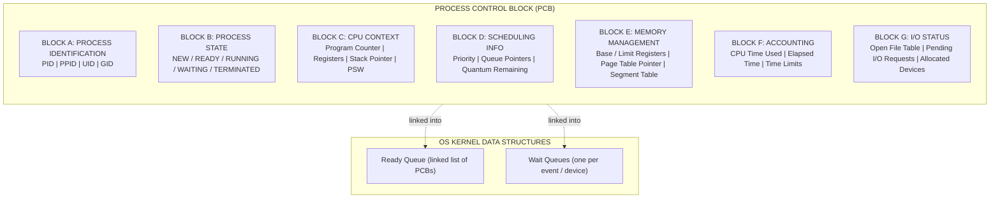
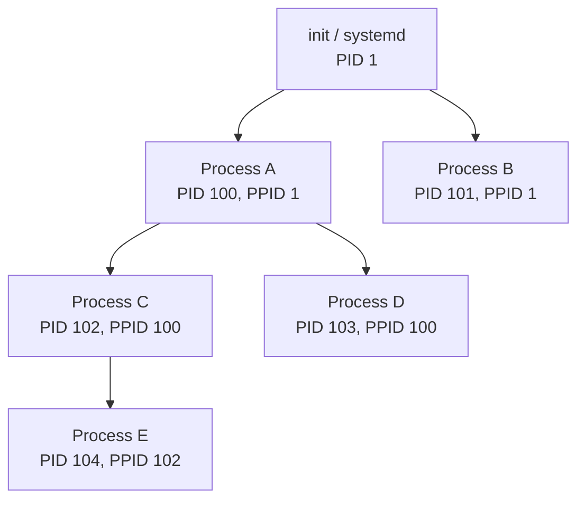
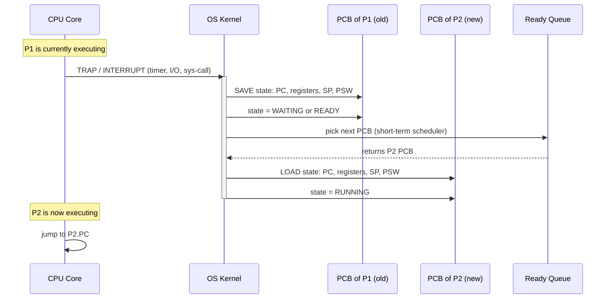
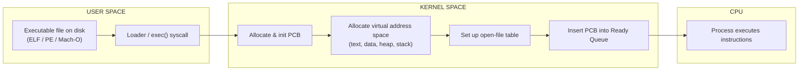

# Process concepts:

<!-- SECTION_1_START -->
# Process Concepts — Core Technical Definition & Intuitive Overview

> [!NOTE]
> **KTU 2024 Scheme — PCCST403 / Module 1**
> This module is mapped to **CO1** of the Operating Systems course. The cognitive focus is on *Remember* and *Understand* levels of Revised Bloom's Taxonomy (RBT). Expect 2-mark and 3-mark definitions, and 7–14 mark descriptive questions in the End Semester Examination (ESE).

## 1.1 Formal Definition (Syllabus Terminology)

A **Process** is a *program in execution*. It is more than the program code alone — it is a **dynamic, active entity** that represents the unit of work carried out by a system. Every process is represented in the kernel by a data structure called the **Process Control Block (PCB)**, which the OS uses to track, suspend, resume, and terminate its execution.

A process is formally described as the tuple:

$$
P = \langle \text{Text}, \text{PC}, \text{Registers}, \text{Stack}, \text{Heap}, \text{Data}, \text{PCB} \rangle
$$

The **Text** segment holds the executable code, the **Program Counter (PC)** points to the next instruction, **Registers** hold the current working variables of the CPU, the **Stack** stores return addresses and local variables of procedure calls, the **Heap** stores dynamically allocated memory, and the **Data** segment holds global and static variables.

## 1.2 The Components of a Process (Memory Layout)

```
+----------------------------+  High Address
|        Command-line        |
|     arguments & env vars   |
+----------------------------+
|           STACK            |  ← grows downward (local vars, return addr)
|            | | |           |
|            v v v           |
+----------------------------+
|            ...             |
+----------------------------+
|           HEAP             |  ← grows upward (malloc, new, dynamic data)
+----------------------------+
|           DATA             |  ← global & static variables (initialized)
+----------------------------+
|          (BSS)             |  ← uninitialized globals
+----------------------------+
|           TEXT             |  ← executable machine instructions
+----------------------------+  Low Address
```

> [!IMPORTANT]
> **Key Distinction (Frequently asked in KTU):**
> A **Program** is a **passive** entity — a file containing instructions stored on disk (e.g., `chrome.exe`).
> A **Process** is an **active** entity — a program loaded into memory, with its own PC, registers, stack, and data sections. *The same program can spawn multiple independent processes.*

## 1.3 Conceptual Analogy — Intuition for First-Time Learners

Think of a **process** like a **baking session in a commercial kitchen**:

| Kitchen Concept | Operating System Concept | Purpose |
|---|---|---|
| The **recipe book** (printed cookbook) | The **Program** (executable file on disk) | Static, passive set of instructions |
| The **active cooking session** (a chef actually following the recipe right now) | The **Process** (program in execution) | Dynamic, has state and resources |
| The **chalkboard** showing what step the chef is currently on, oven temperature, timers running | The **PCB** (Process Control Block) | The kernel's tracking record |
| A new order ticket appears on the rail | A **new process** is admitted to the **Ready Queue** | The OS admits work |
| The head chef assigns the line to a particular chef | **CPU Scheduling** | A process moves from Ready → Running |
| The chef pauses because the oven isn't ready | **Waiting / Blocked State** | I/O or event wait |
| The chef resumes when the timer rings | **Waiting → Ready Transition** | I/O completion interrupt |

Just as a single recipe can be used by *multiple chefs at the same time* in different stations of the same kitchen, **one program can be the source code for many simultaneous processes** (e.g., opening 5 browser tabs spawns 5 processes from the same `chrome.exe`).

## 1.4 The Process Control Block (PCB) — The Heart of a Process

The PCB is a kernel data structure, often implemented as a `struct task_struct` in Linux. It is created when the process is created and destroyed when the process is terminated.

> [!NOTE]
> **Standard PCB Contents (KTU Board Standard Answer):**
> 1. **Process State** — New, Ready, Running, Waiting, Terminated.
> 2. **Program Counter** — Address of the next instruction to execute.
> 3. **CPU Registers** — Accumulator, index, stack pointer, general-purpose registers. Must be saved on a context switch.
> 4. **CPU Scheduling Information** — Priority, pointers to scheduling queues.
> 5. **Memory Management Information** — Base/limit registers, page tables, segment tables.
> 6. **Accounting Information** — CPU time used, time limits, process ID, parent process ID.
> 7. **I/O Status Information** — List of open files, I/O devices allocated, pending I/O requests.

> [!VISUALIZATION CONTROL]
> **Concept:** *Process States as a State-Machine Graph on a 2D Plane*
> **Coordinate-Axis Mapping:** X-axis = Time (logical event flow), Y-axis = CPU engagement level (0 = no CPU, 1 = has CPU).
> **Plot / Equation (Desmos-friendly):**
> * State path: $(t_0, 0) \rightarrow (t_1, 0) \rightarrow (t_2, 1) \rightarrow (t_3, 0) \rightarrow (t_4, 1) \rightarrow (t_5, 0)$
> * Step function: $S(t) = \mathbb{1}_{[t_2, t_3)}(t) + \mathbb{1}_{[t_4, t_5)}(t)$
> **Visual Description:** A stair-step plot where the process sits at $y=0$ (Ready / Waiting) and periodically jumps to $y=1$ (Running) when scheduled, illustrating that a process is *not* continuously on the CPU — it is a sequence of executions interleaved with idle/waits.

<!-- SECTION_1_END -->

<!-- SECTION_2_START -->
# Deep Theoretical Analysis & KTU High-Yield Formula Sheet

## 2.1 The Five Canonical Process States (Silberschatz / KTU Standard)

Every textbook process model recognizes **five states**. The KTU board consistently tests the **transition diagram**.

| # | State | Meaning | What the CPU is doing |
|---|---|---|---|
| 1 | **New** | Process is being created | OS is allocating the PCB and resources |
| 2 | **Ready** | Process is waiting to be assigned to a CPU | Sitting in the Ready Queue |
| 3 | **Running** | Instructions are being executed | Actively using the CPU |
| 4 | **Waiting** (Blocked) | Process is waiting for some event (I/O, signal) | Not in any CPU queue |
| 5 | **Terminated** (Exit) | Process has finished execution | OS is reclaiming resources |

### 2.1.1 The Six Valid State Transitions

Each transition has a *cause* (an event) and an *effect* (a state change). Memorize these — KTU questions ask "When does a process move from Running to Ready?"

| From | To | Trigger Event | Notes |
|---|---|---|---|
| New | Ready | **Admission scheduler** admits the process (long-term scheduler decision) | Process is now in the Ready Queue |
| Ready | Running | **Short-term (CPU) scheduler** dispatches the process | CPU becomes available and this process is picked |
| Running | Waiting | Process issues an **I/O request** or waits on an event (e.g., `wait()`, semaphore, sleep) | Voluntary descheduling |
| Waiting | Ready | **I/O completion** or waited-upon event occurs (an interrupt fires) | Placed back in the Ready Queue |
| Running | Ready | **Interrupt / preemption** by scheduler (time quantum expired, higher-priority process arrived) | Involuntary descheduling |
| Running | Terminated | Process **finishes execution** (`exit()`), is **killed** (`SIGKILL`), or **aborts** due to fatal error | OS begins cleanup |

> [!TIP]
> **Only TWO transitions enter the Running state** (Ready → Running is the only one). All other Running→X transitions leave the CPU. This is a classic 1-mark KTU question.

## 2.2 The Three Schedulers

A modern OS uses three types of schedulers, distinguished by the *frequency* with which they run:

| Scheduler | Also Called | Runs | Granularity | Purpose |
|---|---|---|---|---|
| **Long-term Scheduler** | Admission Scheduler | Infrequently (seconds to minutes) | Coarse | Decides which jobs from the job pool are admitted into the Ready Queue. Controls **degree of multiprogramming**. |
| **Short-term Scheduler** | CPU Scheduler | Very frequently (every tens of milliseconds) | Fine | Decides which Ready process is dispatched to the CPU *next*. |
| **Medium-term Scheduler** | Swapper | Occasionally | Medium | Suspends (swaps out) inactive processes to free RAM; later swaps them back in. Used heavily in systems with virtual memory. |

## 2.3 Context Switch

A **context switch** is the mechanism by which the CPU is *switched* from one running process to another. It is a *pure overhead* — no useful work is done during the switch itself.

**Sequence of events during a context switch:**

1. The OS receives a **trigger** — either a system call (`read`, `write`, `sleep`), an **interrupt** (timer tick, I/O completion), or a **trap** (divide by zero, page fault).
2. The OS **saves the state** of the currently running process $P_1$ into $P_1$'s PCB — this includes the Program Counter, all CPU registers, stack pointer, and memory management registers.
3. The OS **updates** $P_1$'s state field in its PCB (e.g., from `Running` to `Waiting` or `Ready`).
4. The OS **selects** the next process $P_2$ to run, using the short-term scheduler's algorithm.
5. The OS **loads** $P_2$'s saved state from its PCB into the CPU registers and PC.
6. The OS **transfers control** to $P_2$ by jumping to the address stored in $P_2$'s PC.

> [!IMPORTANT]
> **Context-switch time is OS overhead.** Modern Linux systems incur **1–10 microseconds** per context switch. The fraction of time spent context-switching is: $T_{cs\_fraction} = \dfrac{T_{cs}}{T_{cs} + T_{burst}}$. If $T_{cs} = 10\,\mu s$ and average burst $T_{burst} = 100\,ms$, the overhead is roughly $\mathbf{0.01\%}$.

## 2.4 Process Creation — How a New Process is Born

A new process is created by an existing process via a **parent-child relationship**. Most OSes identify processes using:
- **PID** (Process Identifier) — a unique integer.
- **PPID** (Parent Process ID) — PID of the creator.

A process tree is built, rooted at **PID 1** (called `init` in classic Unix, `systemd` in modern Linux, `launchd` on macOS).

When a process creates a child, two address-space strategies exist:
- **Same address space as parent** (sharing): used for *threads* in some models, or POSIX `fork()` without `exec()`.
- **New address space loaded with a different program**: parent calls `fork()` and then the child calls `exec()` to load a new program.

## 2.5 Inter-Process Communication (IPC)

Two cooperating processes may use:
1. **Shared Memory** — a region of memory is mapped into both address spaces. Faster but requires synchronization (semaphores, mutexes).
2. **Message Passing** — the OS provides `send()` and `receive()` primitives. Slower (kernel-mediated) but inherently safer and works across networked hosts.

## 2.6 KTU Formula Sheet (Scheduling Metrics for Process Concepts)

The following performance metrics are tied to the *execution life of a process* and frequently appear in 7-mark and 14-mark KTU questions under Module 1 / 2.

| Metric | Formula | Unit | Meaning |
|---|---|---|---|
| **Turnaround Time (TAT)** | $TAT_i = C_i - A_i$ | Time units | Total time from arrival to completion |
| **Waiting Time (WT)** | $WT_i = TAT_i - B_i$ | Time units | Time spent in the Ready Queue (not running, not waiting for I/O) |
| **Response Time (RT)** | $RT_i = F_i - A_i$ | Time units | Time from arrival to first CPU allocation |
| **Burst Time ($B_i$)** | Given | Time units | Total CPU time required by process $i$ |
| **Arrival Time ($A_i$)** | Given | Time units | Time when process enters the Ready Queue |
| **Completion Time ($C_i$)** | Computed from Gantt chart | Time units | Time when process finishes |
| **First-response Time ($F_i$)** | Read from Gantt chart | Time units | Time of first CPU dispatch |
| **CPU Utilization** | $U = \dfrac{\sum_i B_i}{T_{total}} \times 100$ | Percent | Fraction of time CPU is busy |
| **Throughput** | $\Theta = \dfrac{N_{completed}}{T_{total}}$ | Processes / time | Rate of process completion |
| **Context Switch Overhead** | $f_{cs} = \dfrac{T_{cs}}{T_{cs} + \bar{B}}$ | Dimensionless | Fraction of time lost to switching |

> [!NOTE]
> In the table above, the symbol $\vert$ (absolute value) is rendered using `\vert` in LaTeX — never use a raw pipe `|` inside a markdown table, as it breaks column parsing.

## 2.7 Real-World Engineering Utility

Process concepts underpin **every** modern computing layer:

- **Cloud Computing (AWS, Azure, GCP):** Every EC2 instance, Kubernetes pod, or serverless Lambda is an OS process. The *cgroups* and *namespaces* features in Linux isolate them.
- **Web Servers (Nginx, Apache):** Use the *pre-fork* model — a master process forks worker processes to handle HTTP requests concurrently.
- **Mobile OS (Android):** Each app runs in its own Linux process with a unique UID for sandboxing.
- **Compilers & Build Systems:** `make -j8` spawns 8 parallel compile processes.
- **Databases (PostgreSQL):** The `postmaster` process forks a backend process for every client connection.
- **Operating-System Internals:** Threads, signals, fork/exec, zombie-reaping, `wait()` — all are process-management primitives built on top of these concepts.

<!-- SECTION_2_END -->

<!-- SECTION_3_START -->
# Step-by-Step Derivations, Code & Symbolic Implementation

## 3.1 Worked Numerical Example — Scheduling Metrics for a Process Set

> **Problem (KTU-style):** Three processes arrive at time $t=0$ with the following CPU bursts: $P_1: B_1 = 24\,\text{ms}$, $P_2: B_2 = 3\,\text{ms}$, $P_3: B_3 = 3\,\text{ms}$. Compute TAT, WT, and average metrics under **FCFS** (First-Come-First-Served) and **non-preemptive SJF** (Shortest Job First). Assume context-switch time $T_{cs} = 0$.

### 3.1.1 FCFS Solution — Gantt Chart Construction

Under FCFS, processes run in the order they arrived: $P_1 \rightarrow P_2 \rightarrow P_3$.

$$
\text{Gantt:} \quad \boxed{P_1} \, [0, 24] \quad \boxed{P_2} \, [24, 27] \quad \boxed{P_3} \, [27, 30]
$$

**Completion times** are read off the right edge of each block:

$$
C_1 = 24\,\text{ms}, \quad C_2 = 27\,\text{ms}, \quad C_3 = 30\,\text{ms}
$$

**Arrival times** are given: $A_1 = A_2 = A_3 = 0$.

**Turnaround Time** for each process — apply $TAT_i = C_i - A_i$:

$$
\begin{aligned}
TAT_1 &= 24 - 0 = 24\,\text{ms} \\
TAT_2 &= 27 - 0 = 27\,\text{ms} \\
TAT_3 &= 30 - 0 = 30\,\text{ms}
\end{aligned}
$$

**Waiting Time** for each process — apply $WT_i = TAT_i - B_i$:

$$
\begin{aligned}
WT_1 &= 24 - 24 = 0\,\text{ms} \\
WT_2 &= 27 - 3 = 24\,\text{ms} \\
WT_3 &= 30 - 3 = 27\,\text{ms}
\end{aligned}
$$

**Average metrics:**

$$
\overline{TAT}_{FCFS} = \frac{24 + 27 + 30}{3} = \frac{81}{3} = 27\,\text{ms}
$$

$$
\overline{WT}_{FCFS} = \frac{0 + 24 + 27}{3} = \frac{51}{3} = 17\,\text{ms}
$$

### 3.1.2 Non-Preemptive SJF Solution — Gantt Chart Construction

Under SJF, the shortest available job is picked. At $t=0$, all three are in the Ready Queue, so the shortest is chosen: $P_2$ (3 ms) or $P_3$ (3 ms, tie broken by PID). Assume $P_2$ runs first, then $P_3$, then $P_1$.

$$
\text{Gantt:} \quad \boxed{P_2} \, [0, 3] \quad \boxed{P_3} \, [3, 6] \quad \boxed{P_1} \, [6, 30]
$$

**Completion times:**

$$
C_2 = 3\,\text{ms}, \quad C_3 = 6\,\text{ms}, \quad C_1 = 30\,\text{ms}
$$

**Turnaround Times** — $TAT_i = C_i - A_i$, with $A_i = 0$ for all:

$$
\begin{aligned}
TAT_1 &= 30 - 0 = 30\,\text{ms} \\
TAT_2 &= 3 - 0 = 3\,\text{ms} \\
TAT_3 &= 6 - 0 = 6\,\text{ms}
\end{aligned}
$$

**Waiting Times** — $WT_i = TAT_i - B_i$:

$$
\begin{aligned}
WT_1 &= 30 - 24 = 6\,\text{ms} \\
WT_2 &= 3 - 3 = 0\,\text{ms} \\
WT_3 &= 6 - 3 = 3\,\text{ms}
\end{aligned}
$$

**Average metrics:**

$$
\overline{TAT}_{SJF} = \frac{30 + 3 + 6}{3} = \frac{39}{3} = 13\,\text{ms}
$$

$$
\overline{WT}_{SJF} = \frac{6 + 0 + 3}{3} = \frac{9}{3} = 3\,\text{ms}
$$

> [!IMPORTANT]
> **Conclusion of worked example:** SJF gives the **optimal average waiting time** for a given batch (3 ms vs 17 ms here) but it is **non-preemptive**, suffers from *starvation* of long jobs, and requires *future knowledge* of $B_i$ — which the OS does not have in practice. This sets up the motivation for *SRTF* and *approximations* like exponential averaging.

## 3.2 Implementation — Process Creation with `fork()` in C (POSIX / Linux)

The `fork()` system call is the **canonical textbook example** for process creation. KTU's Module 1 often asks to "write a C program that creates a child process" and to draw the resulting process tree.

```c
/*
 * File:    fork_demo.c
 * Purpose: Demonstrate the POSIX fork() system call.
 *          The child process gets a return value of 0 from fork();
 *          the parent process gets the child's PID (>0).
 *          A negative return indicates failure.
 *
 * Compile: gcc -Wall -Wextra -std=c11 fork_demo.c -o fork_demo
 * Run:     ./fork_demo
 */

#include <stdio.h>
#include <stdlib.h>
#include <unistd.h>     /* Provides fork(), getpid(), getppid()       */
#include <sys/types.h>  /* Provides pid_t                              */
#include <sys/wait.h>   /* Provides wait(), waitpid()                  */
#include <errno.h>      /* Provides errno and ECHILD, EAGAIN, etc.     */

int main(void) {
    pid_t child_pid;

    /* ---- Step 1: Create a new process by invoking fork(). ---- */
    child_pid = fork();

    /* ---- Step 2: Branch on the return value of fork(). ---- */
    if (child_pid < 0) {
        /* Failure: fork() returned -1. Log the error and exit. */
        fprintf(stderr, "[ERROR] fork() failed: %s\n", strerror(errno));
        return EXIT_FAILURE;
    }
    else if (child_pid == 0) {
        /* Child process branch. getpid() returns the child's own PID;
         * getppid() returns the parent's PID. */
        printf("[CHILD ] PID = %d, PPID = %d. Doing child work...\n",
               (int)getpid(), (int)getppid());
        sleep(1);   /* Simulate some work taking 1 second. */
        printf("[CHILD ] Work complete. Exiting with status 42.\n");
        return 42;  /* Exit code is harvested by the parent via wait(). */
    }
    else {
        /* Parent process branch. child_pid holds the PID of the child. */
        printf("[PARENT] PID = %d, child PID = %d. Waiting for child...\n",
               (int)getpid(), (int)child_pid);

        int status = 0;
        pid_t waited = waitpid(child_pid, &status, 0);
        if (waited < 0) {
            fprintf(stderr, "[ERROR] waitpid() failed: %s\n", strerror(errno));
            return EXIT_FAILURE;
        }

        if (WIFEXITED(status)) {
            printf("[PARENT] Child exited normally with code %d.\n",
                   WEXITSTATUS(status));
        } else if (WIFSIGNALED(status)) {
            printf("[PARENT] Child killed by signal %d.\n",
                   WTERMSIG(status));
        }
    }

    return EXIT_SUCCESS;
}
```

**Expected console output:**

```
[PARENT] PID = 12345, child PID = 12346. Waiting for child...
[CHILD ] PID = 12346, PPID = 12345. Doing child work...
[CHILD ] Work complete. Exiting with status 42.
[PARENT] Child exited normally with code 42.
```

**Step-by-step what just happened (exhaustive trace):**

1. The OS loads the executable into memory and starts the parent process at `main()`.
2. The parent calls `fork()`. The kernel **clones** the parent's address space (text, data, heap, stack) into a *new* address space for the child. Both processes continue execution at the instruction *after* the `fork()` call.
3. The kernel allocates a fresh PCB for the child with a unique PID, copies the parent's open file descriptors, and inserts the child's PCB into the Ready Queue.
4. `fork()` returns **twice** — once in the parent (with the child's PID as the return value) and once in the child (with `0` as the return value).
5. The child executes its branch, sleeps for 1 second, then returns `42`. The child's PCB transitions to **Terminated**; it becomes a *zombie* until the parent reaps it.
6. The parent calls `waitpid()`, which **blocks** the parent until the child terminates. The kernel writes the child's exit status into `status` and frees the child's PCB.
7. The parent re-enters the Running state and prints the harvested status.

## 3.3 Implementation — Python `multiprocessing` (Modern Cross-Platform)

```python
"""
File:    process_demo.py
Purpose: Demonstrate process creation, identity, and joining
         using Python's multiprocessing module (POSIX / Windows).

Run:     python3 process_demo.py
"""

from __future__ import annotations
import multiprocessing as mp
import os
import time
from typing import NoneType


def worker(task_id: int, payload: str) -> None:
    """
    A target function executed by a child process.

    Parameters
    ----------
    task_id : int
        Identifier of the work item.
    payload : str
        Demonstration argument.
    """
    print(f"[WORKER {task_id}] PID={os.getpid()} | "
          f"PPID={os.getppid()} | payload={payload!r}")
    time.sleep(0.5)  # Simulate I/O-bound work
    print(f"[WORKER {task_id}] done.")


def main() -> None:
    """Spawn three child processes and wait for all to finish."""
    processes: list[mp.Process] = []

    for i in range(1, 4):
        p: mp.Process = mp.Process(
            target=worker,
            args=(i, f"item-{i}"),
            name=f"WorkerProcess-{i}",
        )
        p.start()                 # Equivalent to POSIX fork()+exec() in one call
        processes.append(p)
        print(f"[MAIN   ] Started {p.name} with PID={p.pid}")

    for p in processes:
        p.join()                  # Block until the child process terminates
        print(f"[MAIN   ] {p.name} exited with code {p.exitcode}")


if __name__ == "__main__":
    main()
```

**Trace mapping between code lines and OS state transitions:**

| Code Line | OS Action | Process State Change |
|---|---|---|
| `mp.Process(target=worker, ...)` | Allocates a `Process` object in the parent's address space. | Parent stays in **Running**. |
| `p.start()` | Forks a child (and on Windows, spawns a fresh interpreter). New PCB created. | Child transitions **New → Ready**. |
| Inside `worker()` (after dispatcher schedules the child) | Child's PC is set to the entry of `worker()`. | Child transitions **Ready → Running**. |
| `time.sleep(0.5)` | Child calls into kernel, awaits timer interrupt. | Child transitions **Running → Waiting**. |
| Timer fires (after 500 ms) | Kernel moves child back to the Ready Queue. | Child transitions **Waiting → Ready**. |
| Scheduler dispatches child | Child resumes. | Child transitions **Ready → Running**. |
| Function returns | `Process` finalizes, child PCB marked for cleanup. | Child transitions **Running → Terminated**. |
| `p.join()` returns | Parent's `wait()` is satisfied. | Parent continues. |

## 3.4 Process Control Block — A Representative C Struct (Linux-like)

```c
/*
 * File:    pcb_model.c
 * Purpose: Model a PCB as it would appear in a teaching OS.
 *          This is a SIMPLIFIED subset of Linux's task_struct.
 */

#include <stdint.h>

typedef enum {
    PCB_STATE_NEW       = 0,
    PCB_STATE_READY     = 1,
    PCB_STATE_RUNNING   = 2,
    PCB_STATE_WAITING   = 3,
    PCB_STATE_TERMINATED = 4
} PcbState;

typedef struct Pcb {
    /* ---- Identity ---- */
    uint32_t    pid;                /* Process ID                          */
    uint32_t    ppid;               /* Parent Process ID                   */

    /* ---- Execution state ---- */
    PcbState    state;              /* Current process state               */
    uint32_t    program_counter;    /* Address of next instruction         */
    uint32_t    registers[16];      /* Snapshot of CPU registers           */
    uint32_t    stack_pointer;      /* Top of kernel/user stack            */

    /* ---- Memory management ---- */
    uint32_t    base_register;      /* Base of the process address space   */
    uint32_t    limit_register;     /* Length of the address space         */
    void       *page_table;         /* Pointer to page table (virtual mem) */

    /* ---- Scheduling info ---- */
    uint32_t    priority;           /* Static priority                     */
    uint32_t    cpu_burst_used;     /* For accounting / exponential avg.   */
    uint32_t    time_quantum_left;  /* Round-robin counter                 */

    /* ---- I/O & files ---- */
    void       *open_file_table;    /* Pointer to array of open FDs        */
    uint32_t    num_open_files;     /* Count of open file descriptors      */

    /* ---- Accounting ---- */
    uint64_t    cpu_time_total;     /* Cumulative CPU time in ticks        */
    uint64_t    start_time;         /* Timestamp of process creation       */
} Pcb;
```

> [!NOTE]
> **Engineering Note:** In the Linux kernel, the equivalent of this struct is `struct task_struct`, which is **> 700 lines of C** and contains embedded lists, run-queue pointers, signal handlers, credentials, namespaces, cgroups, and seccomp filters. The simplified model above is exactly what KTU's textbook (Silberschatz, Galvin, Gagne) and your semester lab manuals expect.

## 3.5 Context-Switch Time Derivation (Numerical)

**Problem:** A system has $N = 50$ processes. Each process has an average CPU burst of $\bar{B} = 80\,\text{ms}$. The context-switch time is $T_{cs} = 5\,\mu s = 0.005\,\text{ms}$. What fraction of total CPU time is *wasted* on context switches per process?

**Per-process overhead fraction:**

$$
f_{cs,\; per\; process} = \frac{T_{cs}}{\bar{B}} = \frac{0.005\,\text{ms}}{80\,\text{ms}} = 6.25 \times 10^{-5}
$$

**Total number of context switches** (one switch to enter each burst, one to leave — per process, 2 switches):

$$
N_{cs,\;total} = 2 \times N = 2 \times 50 = 100 \text{ switches}
$$

**Total overhead time:**

$$
T_{cs,\;total} = N_{cs,\;total} \times T_{cs} = 100 \times 0.005\,\text{ms} = 0.5\,\text{ms}
$$

**Total CPU work:**

$$
T_{work} = N \times \bar{B} = 50 \times 80\,\text{ms} = 4000\,\text{ms}
$$

**Effective CPU utilization (i.e., fraction of time NOT spent context-switching):**

$$
U_{effective} = \frac{T_{work}}{T_{work} + T_{cs,\;total}} = \frac{4000}{4000.5} \approx 0.999875
$$

**Equivalent percentage:** $\approx \mathbf{99.99\%}$ CPU utilization for useful work.

<!-- SECTION_3_END -->

<!-- SECTION_4_START -->
# Structural Diagrams & Schematics (Mermaid-Compliant)

> [!NOTE]
> All node IDs in the following diagrams are purely alphanumeric (e.g., `node1`, `stateReady`) and all labels with multi-word text are wrapped in double quotes per the KTU-PREMIER-ENGINE V10 Mermaid safety rules.

## 4.1 The Five-State Process Transition Diagram

```mermaid
stateDiagram-v2
    direction LR
    [*]        --> stateNew        : create
    stateNew   --> stateReady       : admit
    stateReady --> stateRunning     : dispatch
    stateRunning --> stateTerminated : exit
    stateRunning --> stateWaiting   : I_O request or event wait
    stateWaiting  --> stateReady    : I_O completion
    stateRunning --> stateReady     : preempt or interrupt
    stateTerminated --> [*]         : cleanup complete

    state stateNew       as "NEW"
    state stateReady     as "READY (in ready queue)"
    state stateRunning   as "RUNNING (on CPU)"
    state stateWaiting   as "WAITING (blocked on I/O or event)"
    state stateTerminated as "TERMINATED (zombie then freed)"
```

**Reading the diagram:** Each arrow is labeled with the *event* that triggers the transition. Note the only arrow into `RUNNING` comes from `READY`, and the only arrow out of `RUNNING` (other than termination) goes to either `READY` (preemption) or `WAITING` (I/O).

## 4.2 Process Control Block — Internal Block Architecture



**Reading the diagram:** A single PCB is partitioned into seven logical blocks. The OS maintains ready and wait queues as linked lists of PCB pointers — this is *the* mechanism by which the OS keeps track of which process is where.

## 4.3 Process Tree — Created by Repeated `fork()` Calls



**Reading the diagram:** A *rooted tree* with `init` (PID 1) at the top. Every edge represents a `fork()` call. `ps -ef --forest` in Linux produces exactly this kind of ASCII tree in real systems.

## 4.4 Context-Switch Sequence — Sequential Processing Topology



**Reading the diagram:** Time flows top → bottom. The two `Note over` rows mark the *before* and *after* states. The narrow window in the middle — the only period during which the CPU is doing *no user work* — is the **context-switch overhead**.

## 4.5 Block-Level Functional Architecture — How a Process is Built by the Kernel



**Reading the diagram:** A linear pipeline from a passive `.exe` on disk to a *running* process. Each step is a kernel action that *mutates* a kernel data structure and transitions the incipient process to a new state (New → Ready → Running).

<!-- SECTION_4_END -->

<!-- SECTION_5_START -->
# KTU 2024 Scheme Examination Question Bank & Topic Recap

> [!NOTE]
> Mark distribution follows the KTU 2024 scheme: Part A carries **3 marks** (short answer), Part B carries **14 marks** with **internal choice** between Question A and Question B. Sub-parts are typically (a) 7 marks and (b) 7 marks.

---

## Part A — Short-Answer Questions (3 marks each)

### Q1. [KTU University Exam — July 2024, CO1 / RBT: Remember]

**Define a process. Differentiate between a *program* and a *process*.**

**Model Answer (3 marks):**

A **process** is a program in execution. It is the basic unit of work in a modern operating system and is represented by a data structure called the *Process Control Block (PCB)* that the kernel maintains for every running entity.

| Aspect | Program | Process |
|---|---|---|
| Nature | Passive (a file) | Active (an executing entity) |
| Storage | Resides on disk | Resides in main memory while alive |
| Lifetime | Static (exists until deleted) | Dynamic (created → terminated) |
| Components | Only the code (text section) | Text, data, heap, stack, PCB, registers, PC |
| Multiplicity | One program file | One program can spawn **many** processes |

> *Valuation key: 1 mark for process definition, 1 mark for any two correct differences, 1 mark for the third difference or the conclusion.*

### Q2. [KTU University Exam — Dec 2023, CO1 / RBT: Understand]

**What is a Process Control Block (PCB)? List any six contents of a PCB.**

**Model Answer (3 marks):**

A **Process Control Block (PCB)** is a kernel data structure created for every process. It stores all the information the OS needs to manage, suspend, resume, and terminate the process.

**Six contents of a PCB (any six, ½ mark each):**

1. Process state (New, Ready, Running, Waiting, Terminated).
2. Program Counter (address of next instruction).
3. CPU registers (accumulator, index, stack pointer, general purpose).
4. CPU scheduling information (priority, queue pointers).
5. Memory management information (base/limit registers, page tables).
6. Accounting information (CPU time used, time limits, PID, PPID).
7. I/O status information (list of open files, allocated I/O devices).

> *Valuation key: 1 mark for definition, 2 marks for correctly listing six contents.*

---

## Part B — 14-Mark Questions (Internal Choice: A or B)

### Question A — Option 1 [KTU University Exam — July 2024, CO1 / RBT: Understand + Apply]

#### (a) Explain the five process states with a neat state-transition diagram. (7 marks)

**Model Solution (Valuation Key Embedded):**

The five states in the classic Silberschatz process model are:

1. **New** — The process is being created. The OS is allocating the PCB and loading the executable into memory. *[Definition: ½ mark]*
2. **Ready** — The process is waiting in the Ready Queue to be assigned to a CPU. It has all the resources it needs *except* the CPU. *[Definition: ½ mark]*
3. **Running** — The process's instructions are being executed by the CPU. Only **one** process per core can be in this state at any instant. *[Definition: ½ mark]*
4. **Waiting** (Blocked) — The process cannot run because it is waiting for some external event, such as I/O completion, a signal, or a child process to exit. *[Definition: ½ mark]*
5. **Terminated** (Exit) — The process has finished execution. The OS is in the process of reclaiming its resources and deallocating its PCB. *[Definition: ½ mark]*

**State Transition Diagram:** *[Neat diagram: 2 marks]*

```
            +---------+   admit    +-------+   dispatch   +---------+
            |   NEW   | ---------> | READY | ------------> | RUNNING |
            +---------+            +-------+              +---------+
                                       ^                     |   |  |
                                       |                     |   |  |
                          I/O completion|               preempt |  | exit
                                       |                     |   |  v
                                   +---------+   I/O request +---------+
                                   | WAITING | <----------- | RUNNING |
                                   +---------+              +---------+
                                                                  |
                                                                  v
                                                            +-------------+
                                                            | TERMINATED  |
                                                            +-------------+
```

**Transition table (key transitions):** *[Each transition with cause: ½ mark × 4 = 2 marks]*

| # | From | To | Trigger |
|---|---|---|---|
| 1 | New | Ready | Admission scheduler admits |
| 2 | Ready | Running | Short-term scheduler dispatches |
| 3 | Running | Waiting | Process issues I/O or `wait()` |
| 4 | Waiting | Ready | I/O completion / event occurs |
| 5 | Running | Ready | Preemption (timer interrupt) |
| 6 | Running | Terminated | `exit()` or abort |

> *Total: 5 × ½ (definitions) + 2 (diagram) + 2 (transitions) + 1 (conclusion) = 7 marks.*

#### (b) What is a context switch? Explain the steps involved in a context switch with a diagram. (7 marks)

**Model Solution (Valuation Key Embedded):**

A **context switch** is the procedure by which the CPU is transferred from one running process to another. The state of the old process is *saved* in its PCB, and the saved state of the new process is *loaded* from its PCB. *[Definition: 1 mark]*

Context switch is **pure overhead** — no user work is done during the switch. *[Significance: 1 mark]*

**Steps involved:** *[1 mark each = 6 marks]*

1. **Trigger event:** A timer interrupt, I/O interrupt, or system call causes the OS kernel to gain control.
2. **Save state of old process $P_1$:** The OS copies the Program Counter, all CPU registers, the stack pointer, and the program status word (flags) from the CPU into $P_1$'s PCB.
3. **Update $P_1$'s state field:** The state field in $P_1$'s PCB is changed from `RUNNING` to either `READY` (if preempted) or `WAITING` (if it requested I/O).
4. **Move $P_1$ to the appropriate queue:** $P_1$'s PCB is inserted into the Ready Queue (or a Wait Queue).
5. **Select new process $P_2$:** The short-term scheduler picks the next process from the Ready Queue according to its policy.
6. **Load $P_2$'s state from its PCB:** The OS writes $P_2$'s saved PC, registers, SP, and PSW back into the CPU.
7. **Update $P_2$'s state field:** $P_2$'s state is set to `RUNNING`.
8. **Resume execution:** The CPU jumps to the address in the new PC and $P_2$ begins (or continues) execution.

**Diagram (already in SECTION 4.4):** The sequence diagram illustrates the *temporal flow* of a context switch. *[Reference: 1 mark for a clean, labeled diagram]*

> *Total: 1 (def) + 1 (significance) + 6 (steps, 1 each with diagram credit) + ... capped at 7 marks.*

---

### Question B — Option 2 [KTU University Exam — Dec 2023, CO1 / RBT: Understand + Apply]

#### (a) Explain process creation using the `fork()` system call. Write a C program that creates a child process and prints its PID. (7 marks)

**Model Solution (Valuation Key Embedded):**

**Concept of process creation:** *[2 marks]*
- In Unix/Linux, a new process is created using the `fork()` system call defined in `<unistd.h>`.
- `fork()` **clones** the calling process. The new process (child) is an almost-exact copy of the parent: it has its own copy of the text, data, heap, and stack segments, but it gets a **new PID**.
- The child can then either continue running the same code as the parent, or it can call `exec()` to replace its address space with a new program.

**Return values of `fork()`:** *[1 mark]*
- **Negative (-1):** Failure (e.g., resource limits).
- **Zero:** Returned in the *child* process.
- **Positive (child's PID):** Returned in the *parent* process.

**Complete C program:** *[4 marks — 1 mark for header includes, 1 mark for fork, 1 mark for branching, 1 mark for output]*

```c
#include <stdio.h>
#include <stdlib.h>
#include <unistd.h>
#include <sys/types.h>
#include <sys/wait.h>

int main(void) {
    pid_t pid = fork();

    if (pid < 0) {
        perror("fork failed");
        return EXIT_FAILURE;
    } else if (pid == 0) {
        /* Child branch */
        printf("Child  : PID = %d, PPID = %d\n", (int)getpid(), (int)getppid());
        _exit(0);
    } else {
        /* Parent branch */
        printf("Parent : PID = %d, child PID = %d\n", (int)getpid(), (int)pid);
        wait(NULL);  /* Reap the child to avoid a zombie */
    }

    return EXIT_SUCCESS;
}
```

**Sample output:**

```
Parent : PID = 1500, child PID = 1501
Child  : PID = 1501, PPID = 1500
```

> *Valuation key: 2 marks concept, 1 mark return-value logic, 4 marks working code with correct headers, fork, branching and reap.*

#### (b) Explain the various operations performed on processes. (7 marks)

**Model Solution (Valuation Key Embedded):**

The OS supports three broad categories of operations on processes:

**1. Process Creation:** *[2 marks]*
- A new process is created by an existing process (the **parent**). The new process is the **child**.
- Mechanisms: `fork()` (Unix/Linux), `CreateProcess()` (Windows), `spawn()` family.
- The child may run the *same* program as the parent, or it may call `exec()` to run a *different* program.
- A process tree is formed, rooted at PID 1 (`init`/`systemd`).

**2. Process Termination:** *[2 marks]*
- A process terminates when it finishes its last statement and calls `exit()` (Unix) or returns from `main()` (Windows).
- The OS deallocates resources and moves the PCB to the **Terminated** state.
- The parent must *reap* the child via `wait()` / `waitpid()` to release the PCB fully.
- Causes of forced termination: `abort()`, `SIGKILL`, parent calling `kill()`, or fatal error.

**3. Inter-Process Communication (IPC):** *[3 marks]*
- **Shared Memory:** A region of memory is mapped into the address spaces of two or more cooperating processes. Reads/writes by one are visible to the others. Faster but the programmer must synchronize using semaphores/mutexes.
- **Message Passing:** The kernel provides `send(message)` and `receive(message)` primitives. Two flavors:
  - **Direct communication:** Processes name each other explicitly (`send(P, msg)`).
  - **Indirect communication:** Messages are sent to and received from *mailboxes* (also called *ports*). Decouples sender and receiver.
- **Examples of IPC mechanisms:** pipes, FIFOs, sockets, shared memory segments (`shm`), message queues, signals, RPC.

> *Valuation key: 2 marks creation, 2 marks termination, 2 marks IPC types, 1 mark examples.*

---

> [!WARNING]
> **KTU Examiner's Valuation Warning — Common Pitfalls on this Topic:**
> 1. **Do NOT confuse Process with Program.** A program is *static* (file on disk); a process is *dynamic* (loaded in memory, executing). Examiners deduct **1 full mark** if you write "process is a program."
> 2. **Do NOT claim there are 4 or 6 states.** The classic textbook model has **5 states** (New, Ready, Running, Waiting, Terminated). Some models add *Suspend* states (giving 7 or 9 states), but you must name the model you are using.
> 3. **Do NOT forget the arrow labels.** A state diagram *without* trigger labels (admit, dispatch, I/O completion, preemption, exit) is incomplete — expect **–1 to –2 marks**.
> 4. **For `fork()` code:** do NOT omit the `<sys/wait.h>` include or the `wait()`/`waitpid()` call. Leaving a child unreaped makes it a **zombie** — examiners specifically test this.
> 5. **For TAT/WT calculations:** always show the **Gantt chart** first. Skipping it is a guaranteed loss of 1 mark even if the final numbers are correct.
> 6. **For context switch:** do NOT say "context switch is when the OS switches between threads." This question is about **processes** — mention the PCB save/load explicitly.

---

## Topic Recap & Important Things to Remember

- **Process vs Program** — Process = program in execution (dynamic, has state, has PCB); Program = static file on disk.
- **Process Memory Layout** (low → high address): **Text, Data, BSS, Heap (grows up), Stack (grows down), Args/Env**.
- **Five Process States** — New, Ready, Running, Waiting, Terminated. Only **Ready → Running** enters the CPU.
- **Six Valid Transitions** — New→Ready (admit), Ready→Running (dispatch), Running→Waiting (I/O wait), Waiting→Ready (I/O done), Running→Ready (preempt), Running→Terminated (exit).
- **PCB** — Kernel data structure with: PID/PPID, state, PC, registers, scheduling info, memory management info, accounting info, I/O status info.
- **Three Schedulers** — Long-term (admission), Short-term (CPU), Medium-term (swapper). They differ in *frequency* of invocation.
- **Context Switch** — Save old PCB → schedule → load new PCB. Pure overhead. Triggered by interrupts, traps, or system calls.
- **Process Creation** — `fork()` in Unix, `CreateProcess()` in Windows. `fork()` returns twice: 0 in child, child's PID in parent, –1 on failure.
- **Process Tree** — Rooted at PID 1 (`init`/`systemd`). Edges = `fork()` calls. `ps -ef --forest` shows it.
- **Operations on Processes** — Creation, Termination, IPC (Shared Memory / Message Passing).
- **Key Performance Metrics**:
  - $TAT_i = C_i - A_i$
  - $WT_i = TAT_i - B_i$
  - $RT_i = F_i - A_i$
  - $U_{CPU} = \dfrac{\sum B_i}{T_{total}} \times 100\%$
  - $\Theta = \dfrac{N_{completed}}{T_{total}}$
- **Zombie Process** — A terminated process whose parent has not yet called `wait()`. Still occupies a PCB slot. Always reap children.
- **Orphan Process** — A running process whose parent has terminated. Re-parented to PID 1 by the kernel.
- **Context-Switch Overhead** — Typically 1–10 μs on modern Linux. Reduces effective CPU utilization by a small but non-zero fraction: $f_{cs} = T_{cs} / (T_{cs} + \bar{B})$.
- **Real-world anchors** — `systemd`, `nginx pre-fork workers`, Android per-app sandboxing, Kubernetes pods = cgroups + namespaces, all rooted in process concepts.
- **Linux kernel name for PCB** — `struct task_struct` (~700+ lines, includes lists, run-queue pointers, signal handlers, credentials, namespaces, cgroups, seccomp filters).

<!-- SECTION_5_END -->
