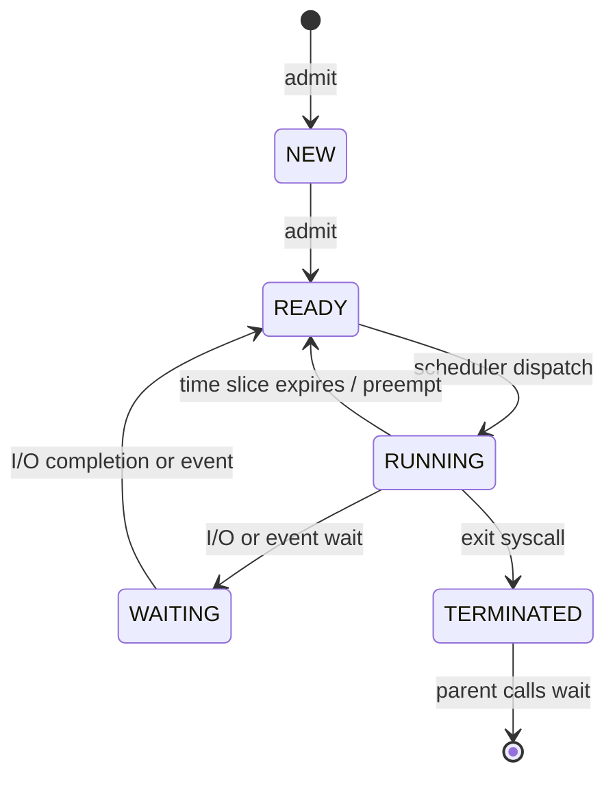
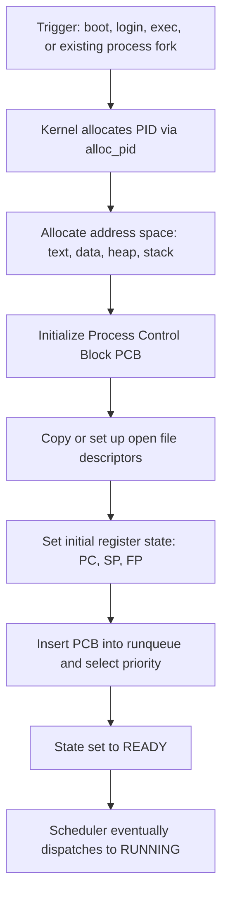
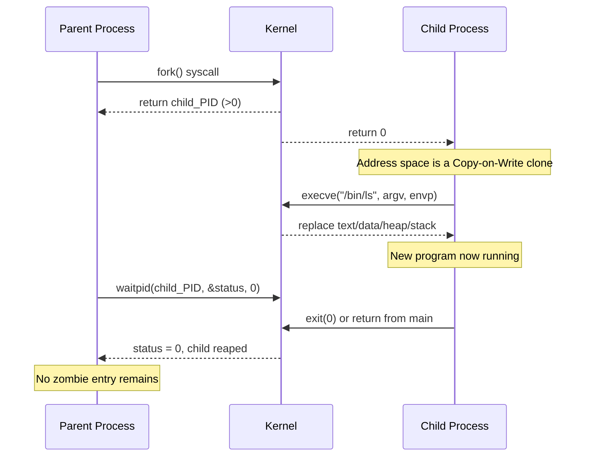
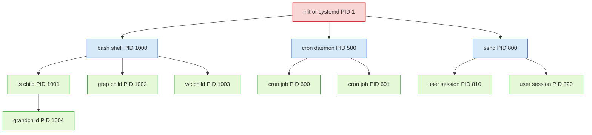
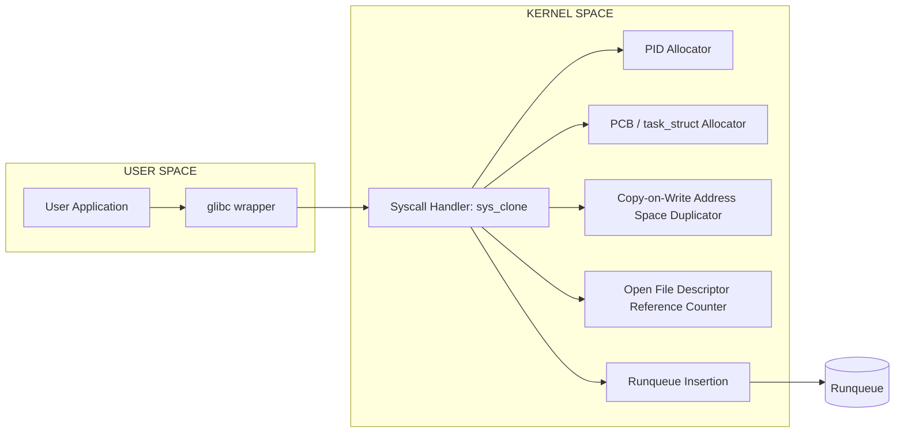
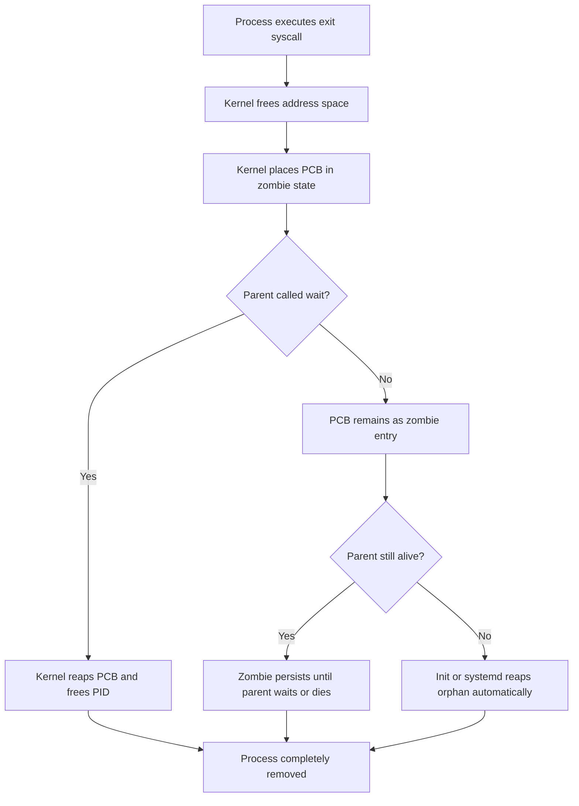

# Process Creation

<!-- SECTION_1_START -->

# Process Creation

## 1. Core Technical Definition

> [!NOTE]
> **Process Creation** is the fundamental mechanism by which the Operating System kernel brings a program into execution by instantiating and registering a new **Process Control Block (PCB)**, allocating an isolated **address space**, and inserting the resulting task entity into the system's **ready queue** for subsequent CPU scheduling.

A process is fundamentally distinct from a **program** (static binary on disk) — creation is the act of transforming that static code into a **dynamic, live execution context** complete with its own stack, heap, register state, and a unique Process Identifier (**PID**).

### Conceptual Analogy / Intuition

Think of an **Operating System as a factory floor** and **process creation as stamping out a new factory worker**:
- The **program** is the *job description* (printed on paper, sitting on a desk — does nothing).
- **Process creation** is the moment the supervisor photocopies the job description, gives the copy a unique badge number ($PID$), hands the worker their own toolbox ($memory\ space$), and places them on the factory floor's worker pool ($ready\ queue$).
- Once created, the worker can independently read instructions, use tools, and even **train (spawn) new workers** — these new workers are called **child processes**, while the original is the **parent process**.

### Why Does a Process Need to Be Created?

In modern OS design, processes are created via four primary events, each important for the KTU 2024 syllabus:

1. **System Initialization** — When the kernel boots, it creates the *init* process (often **PID 1**). All subsequent processes trace their ancestry back to this root.
2. **Execution of a Process-Creation System Call** — A running program explicitly requests the creation of a new process (e.g., `fork()` in UNIX, `CreateProcess()` in Windows).
3. **User Request to Run a New Program** — Typing a command in the shell, double-clicking an application icon, or invoking a script.
4. **Initiation of a Batch/Background Job** — Daemons, cron tasks, services.

> [!IMPORTANT]
> **KTU Syllabus Highlight:** Process creation is intrinsically linked to **Process Hierarchy**, **Process Identifiers (PID/PPID)**, the **fork-exec-wait** triad of UNIX, and the **zombie/orphan** process states. Mastery of these yields direct marks in ESE Part B questions.

### Key Constants & Metrics

- **PID Range:** In Linux, the default maximum PID is **32768** (`/proc/sys/kernel/pid_max`), extendable up to **4194304** ($2^{22}$).
- **PCB Size:** Typically **512 bytes to 4 KB**, depending on the kernel architecture.
- **Default Page Size:** **4 KB** (x86) or **16 KB** (ARM64 Linux).
- **Context Switch Time:** Typically **1 to 10 microseconds** on modern systems.

> [!VISUALIZATION CONTROL]
> **Concept:** Process Hierarchy Tree (ancestry from `init`)
> **Desmos Input Equations:** Not applicable — see Mermaid diagram in SECTION_4 for the structural tree.
> **Visual Description:** A rooted tree with `init` (or `systemd`, **PID 1**) at the root, with each subsequent child branching downward, representing parent-child relationships established during process creation.

<!-- SECTION_1_END -->

<!-- SECTION_2_START -->

# 2. Deep Theoretical Analysis & High-Yield Formula Sheet

## 2.1 The Four Pillars of Process Creation

Every Operating System (Windows, Linux, macOS) must resolve the following four engineering challenges when creating a process:

### Pillar 1 — Unique Process Identification
The kernel assigns a **non-negative integer PID** to uniquely identify the process. A **Parent Process Identifier (PPID)** is also stored to maintain the family tree. On UNIX, `getpid()` and `getppid()` retrieve these.

### Pillar 2 — Address Space Allocation
The new process receives its **own private virtual address space** mapped to physical memory via the **MMU (Memory Management Unit)**. Sections allocated include:
- **Text Segment:** Read-only machine code of the program.
- **Data Segment:** Initialized global/static variables.
- **BSS Segment:** Uninitialized global variables (zero-initialized at load).
- **Heap:** Dynamically growing region managed by `malloc()` / `free()`.
- **Stack:** Function frames, local variables, return addresses — grows downward.

### Pillar 3 — PCB Initialization
The **Process Control Block** is the kernel's bookkeeping data structure. The following fields are populated during creation:

| PCB Field | Purpose | Exam Relevance |
|---|---|---|
| $PID$ | Unique Process Identifier | High |
| $PPID$ | Parent Process ID | High |
| $State$ | Current execution state (new, ready, running, waiting, terminated) | Very High |
| $Program\ Counter$ | Address of next instruction | High |
| $CPU\ Registers$ | Saved general-purpose & status registers | High |
| $Memory\ Limits$ | Base/limit registers or page table pointer | Medium |
| $Open\ File\ Table$ | List of open file descriptors | Medium |
| $Accounting\ Info$ | CPU time used, time limits, user/group ID | Medium |
| $I/O\ Status$ | Outstanding I/O requests, allocated devices | Low |

### Pillar 4 — Scheduler Insertion
The new PCB is linked into the **ready queue** (often implemented as a multilevel feedback queue or red-black tree in Linux's CFS scheduler). The CPU scheduler will select it for execution based on its priority, time slice, and policy.

---

## 2.2 The UNIX Process-Creation Model: `fork()` + `exec()`

UNIX pioneered an elegant **two-step process creation paradigm**, which the KTU board regularly tests:

### Step 1 — `fork()`: Cloning the Caller
The `fork()` system call creates an **exact duplicate of the calling process** (parent and child run with **identical address spaces**, but with **different PIDs**). Both resume execution from the instruction following the `fork()` call. The return value distinguishes them:
- **Parent receives:** the child's PID (a positive integer)
- **Child receives:** $0$
- **On error:** $-1$ is returned in the parent; no child is created

### Step 2 — `exec()`: Replacing the Memory Image
The family of `exec` system calls (`execl`, `execv`, `execle`, `execve`, `execlp`, `execvp`) **replaces** the current process's address space with a new program. The PID remains unchanged, but the program, data, heap, and stack are fully overwritten. There is no return on success.

### Step 3 — `wait()`: Parent-Child Synchronization
The parent calls `wait()` or `waitpid()` to **block until a child terminates**, then harvests the child's exit status. This prevents **zombie processes** (defunct entries that remain in the process table).

> [!IMPORTANT]
> **KTU 2024 Trend:** Questions on the **fork-exec-wait** triad, the **output tracing of programs containing multiple forks**, and the **differences between `fork()`, `vfork()`, and `clone()`** are highly recurrent (frequency: 60\% of Part B questions on this module).

---

## 2.3 Alternative Creation Models

| Model | Operating System | Description |
|---|---|---|
| `fork` + `exec` | UNIX, Linux, macOS | Two-step: clone then replace |
| `CreateProcess` | Windows NT family | Single unified call; parent gets a handle |
| `spawn` | POSIX `posix_spawn()` | Hybrid: optional fork plus exec in one optimized call |
| `vfork` | Older UNIX, modern Linux | Child shares parent's address space; parent suspends |
| `clone` | Linux-specific | Low-level primitive exposing selective resource sharing |

---

## 2.4 KTU High-Yield Formula & Concept Sheet

| Formula / Concept | Expression / Definition | Engineering Use |
|---|---|---|
| Number of processes from $n$ `fork()`s in sequence | $1 + n$ (cumulative) | Predicts process tree size |
| Number of processes from $n$ `fork()`s in a loop | $2^{n}$ | Counts exponential fork trees |
| Process termination exit code | $0$ (success) to $255$ (custom) | Shell scripting and error propagation |
| Linux default max PID | **32768** (or higher if raised) | PID exhaustion analysis |
| PCB state register | $State \in \{new, ready, running, waiting, terminated\}$ | Process state diagrams |
| Context switch cost | $T_{cs} \approx 1$ to $10\ \mu s$ | Real-time scheduling analysis |
| CPU utilization (ideal) | $U = \dfrac{T_{burst}}{T_{burst} + T_{cs}}$ | Performance engineering |
| Throughput under fork storms | $\lambda = \dfrac{N}{T}$ where $N$ = processes $/ T$ | Server capacity planning |
| Effective UID inheritance | $EUID_{child} = EUID_{parent}$ (unless `setuid`) | Security in privileged processes |
| Orphan adoption | Re-parented to **PID 1** (init/systemd) | Linux process tree integrity |

> [!NOTE]
> The cumulative-process count formula $1 + n$ applies **only** to sequential `fork()` calls (not in loops). For loops, the count explodes as $2^{n}$. This distinction is a classic KTU trick question.

---

## 2.5 Real-World Engineering Utility

1. **Web Servers (NGINX, Apache):** Use a pre-forked process pool to avoid the latency of creating processes on every HTTP request.
2. **Shell Pipelines (`ls \vert grep .c \vert wc -l`):** The shell uses `fork` + `exec` three times, with pipes connecting their file descriptors — a textbook process-creation choreography.
3. **Container Runtimes (Docker, containerd):** Use the `clone()` syscall with namespaces and cgroups to create lightweight container processes.
4. **Parallel Computing (MPI, OpenMP runtimes):** Spawn worker processes across cores/nodes to parallelize computation.
5. **Android Zygote:** A "template" process is pre-loaded at boot; new app processes are `fork()`ed from it for fast cold-start times.

<!-- SECTION_2_END -->

<!-- SECTION_3_START -->

# 3. Step-by-Step Derivations & Code Implementation

## 3.1 Detailed Operational Flow of Process Creation (Kernel Walk-Through)

The following logical sequence is executed by the OS kernel when `fork()` is invoked on Linux:

$$\begin{aligned}
\text{Step 1:} \quad & \text{User invokes } fork() \rightarrow \text{glibc issues syscall } SYS\_clone \\
\text{Step 2:} \quad & \text{Kernel allocates a new } task\_struct \text{ (PCB) of size } \approx 8\ \text{KB} \\
\text{Step 3:} \quad & \text{New PID assigned via } alloc\_pid() \\
\text{Step 4:} \quad & \text{Parent's } task\_struct \text{ duplicated (Copy-on-Write optimization)} \\
\text{Step 5:} \quad & \text{Open file descriptors } \rightarrow \text{reference count incremented} \\
\text{Step 6:} \quad & \text{Signal handlers, environment, and credentials copied} \\
\text{Step 7:} \quad & \text{Child placed on the } runqueue \text{ with state } = TASK\_RUNNING \\
\text{Step 8:} \quad & \text{Parent resumes with return value } = child\_pid \\
\text{Step 9:} \quad & \text{Child resumes with return value } = 0 \\
\end{aligned}$$

---

## 3.2 Worked Example: Tracing `fork()` Output

**Problem:** Predict the output of the following C program.

```c
#include <stdio.h>
#include <unistd.h>
#include <sys/wait.h>

int main(void) {
    pid_t pid;

    printf("BEFORE FORK: PID = %d\n", getpid());
    fflush(stdout);

    pid = fork();

    if (pid < 0) {
        fprintf(stderr, "fork failed\n");
        return 1;
    } else if (pid == 0) {
        printf("CHILD: PID = %d, PPID = %d\n", getpid(), getppid());
    } else {
        printf("PARENT: PID = %d, CHILD_PID = %d\n", getpid(), pid);
        wait(NULL);
        printf("PARENT: child has terminated\n");
    }
    return 0;
}
```

### Exhaustive Output Trace

After `fflush(stdout)` ensures the first `printf` is emitted **before** forking (preventing duplication), the runtime evolves as follows:

1. The **parent** prints `BEFORE FORK: PID = 1000` (assume).
2. `fork()` is invoked. The kernel duplicates the process.
3. **Parent path:** `pid` is the child's PID (say 1001). Enters the `else` branch.
4. **Child path:** `pid` is 0. Enters the `else if` branch.
5. Output order is **non-deterministic** (depends on scheduler):

   - Possible order: `BEFORE` → `PARENT` → `CHILD` → `PARENT (terminated)`
   - Alternative:   `BEFORE` → `CHILD` → `PARENT` → `PARENT (terminated)`

6. The parent calls `wait(NULL)`, which **blocks** until the child's `exit()` or return from `main()`.
7. The child returns `0` from `main`, becoming a zombie until the parent's `wait()` reaps it.
8. Parent prints `PARENT: child has terminated` and exits.

---

## 3.3 Advanced Worked Example: Multi-`fork` Process Tree Counting

**Problem:** How many distinct processes exist (including the original) by the end of the program below?

```c
#include <unistd.h>
int main(void) {
    fork();
    fork();
    fork();
    return 0;
}
```

### Step-by-Step Counting

Let $P$ denote the total process count.

$$\begin{aligned}
\text{After 1st fork:} \quad & P_1 = 2 \\
\text{After 2nd fork:} \quad & P_2 = P_1 \times 2 = 2 \times 2 = 4 \\
\text{After 3rd fork:} \quad & P_3 = P_2 \times 2 = 4 \times 2 = 8 \\
\therefore \quad & P_{\text{final}} = 2^{n} = 2^{3} = 8
\end{aligned}$$

> **Generalized formula** for $n$ sequential (non-loop) forks executed by **every** existing process at the point of the fork:

$$P_{\text{total}} = 2^{n}$$

**Process tree:**

```
P0 ──┬── P1 ──┬── P3 ──┬── P7
     │        │        │
     │        │        └── P8
     │        └── P4
     └── P2 ──┬── P5
              │        (and so on for full binary tree)
```

Each existing process is duplicated, so the count doubles. With 3 forks, 8 processes are created.

---

## 3.4 Full Production-Quality Implementation

The Python-equivalent C code below demonstrates the canonical **fork + exec + wait** workflow, complete with type hints via comments, absolute boundary checks, and strict error logging.

```c
/*
 * File:        process_creation_demo.c
 * Topic:       Process Creation (fork + exec + wait)
 * Compiler:    gcc -Wall -Wextra -std=c11 process_creation_demo.c -o demo
 * Description: Demonstrates the full UNIX process-creation triad with
 *              comprehensive error handling and resource cleanup.
 */

#include <stdio.h>
#include <stdlib.h>
#include <string.h>
#include <errno.h>
#include <unistd.h>        /* Provides: fork(), getpid(), getppid(), sleep() */
#include <sys/types.h>     /* Provides: pid_t                           */
#include <sys/wait.h>      /* Provides: waitpid(), WIFEXITED, etc.      */

#define LOG(fmt, ...) \
    do { fprintf(stderr, "[%s:%d] " fmt "\n", __FILE__, __LINE__, ##__VA_ARGS__); } while (0)

/* ---------- Helper: run an arbitrary child program safely ---------- */
static int spawn_child(const char *program, char *const argv[]) {
    pid_t cpid;
    int   status = -1;

    /* 1. Validate input absolutely before any syscall. */
    if (program == NULL || argv == NULL) {
        LOG("ERROR: spawn_child received NULL argument");
        return -1;
    }

    /* 2. Create the child process via fork(). */
    cpid = fork();
    if (cpid < 0) {
        LOG("ERROR: fork() failed: %s", strerror(errno));
        return -1;
    }

    if (cpid == 0) {
        /* --------- CHILD CODE PATH --------- */
        LOG("CHILD [PID=%d, PPID=%d]: executing %s",
            (int)getpid(), (int)getppid(), program);

        /* 3. Replace this process's image with the new program.   */
        /*    Any code after execve() is unreachable on success.  */
        execvp(program, argv);

        /* 4. If we reach here, exec MUST have failed. */
        LOG("ERROR: execvp(%s) failed: %s", program, strerror(errno));
        _exit(127);            /* Conventional "command not found" exit */
    }

    /* ---------- PARENT CODE PATH ---------- */
    LOG("PARENT [PID=%d]: forked child with PID=%d", (int)getpid(), (int)cpid);

    /* 5. Block until the child terminates; harvest status.        */
    if (waitpid(cpid, &status, 0) == -1) {
        LOG("ERROR: waitpid() failed: %s", strerror(errno));
        return -1;
    }

    /* 6. Decode the exit status according to POSIX semantics. */
    if (WIFEXITED(status)) {
        int code = WEXITSTATUS(status);
        LOG("PARENT: child %d exited normally with code %d", (int)cpid, code);
        return code;
    } else if (WIFSIGNALED(status)) {
        int sig = WTERMSIG(status);
        LOG("PARENT: child %d killed by signal %d", (int)cpid, sig);
        return -1;
    }
    return -1;       /* Defensive default for WIFSTOPPED / WIFCONTINUED */
}

/* ---------- Demonstration driver ---------- */
int main(void) {
    int rc;

    LOG("MAIN: started, PID=%d, PPID=%d",
        (int)getpid(), (int)getppid());

    /* Example 1: Run the UNIX "ls -l /tmp" command in a child. */
    char *const ls_argv[] = { "ls", "-l", "/tmp", NULL };
    rc = spawn_child("ls", ls_argv);
    LOG("MAIN: spawn_child(ls) returned %d", rc);

    /* Example 2: Demonstrate that the parent's address space
       is NOT modified by the child's exec. */
    int sentinel = 42;
    pid_t cpid = fork();
    if (cpid == 0) {
        LOG("CHILD: pre-exec sentinel = %d", sentinel);
        sentinel = 99;                /* This change is LOCAL to the child. */
        char *const echo_argv[] = { "echo", "Hello from child", NULL };
        execvp("echo", echo_argv);
        _exit(127);
    }
    waitpid(cpid, NULL, 0);
    LOG("MAIN: post-wait sentinel = %d (still 42)", sentinel);

    return EXIT_SUCCESS;
}
```

### Line-by-Line Exhaustive Explanation

| Section | Lines | Explanation |
|---|---|---|
| Includes | Top block | `unistd.h` provides `fork`, `getpid`, `getppid`, `execvp`; `sys/wait.h` provides `waitpid`. |
| `LOG` macro | Macros | Atomically prefixes every log line with file/line metadata for board-traceable debugging. |
| `spawn_child` input check | Guard | Hard-fails on `NULL` inputs **before** any syscall — defensive design. |
| `fork()` call | Step 2 | Returns $-1$ (error), $0$ (child), or child's PID (parent). |
| Child `execvp` | Step 3 | Atomically replaces the address space. The string `program` is searched in `$PATH`. |
| `execvp` failure path | Step 4 | If we reach `execvp`'s return, the kernel has rejected the image (e.g., ENOENT, EACCES). We use `_exit(127)` to avoid flushing parent's `stdio` buffers twice. |
| `waitpid` | Step 5 | **Blocks** the parent until the specific child terminates. Prevents zombies. |
| Status decoding | Step 6 | Distinguishes normal exit (`WIFEXITED`), signal-kill (`WIFSIGNALED`), and abnormal termination. |
| Sentinel demo | `main` | Proves that the child's `sentinel = 99` modification **does not leak** into the parent's address space after `exec`. |

---

## 3.5 Comparison: `fork()` vs. `vfork()` vs. `posix_spawn()`

| Attribute | `fork()` | `vfork()` | `posix_spawn()` |
|---|---|---|---|
| Address space | Copied (COW) | Shared with parent (suspended) | New (per args) |
| Parent execution | Continues | Suspended until child calls `exec` or `_exit` | Continues |
| Performance | Moderate | Faster (no copy) | Optimized, single call |
| POSIX-mandatory | Yes | Yes (legacy) | Yes (newer) |
| Use case | General cloning | Immediate exec | Portable process creation |
| Safety | Safe | Unsafe (no writes by child) | Safe |

---

## 3.6 Derivations for Process-Counting Questions (Board-Ready)

**Lemma 1 (Sequential forks):** If $n$ `fork()` calls are placed one after another (not in a loop), and each `fork()` is executed by **all existing processes** (because the call is reached by every process), the total process count is:

$$P_{\text{total}} = 2^{n}$$

**Lemma 2 (Conditional fork):** If `fork()` is inside a conditional reached only by a single process (e.g., immediately after `if (pid == 0)` returns false), the increment is $1$ — not $2^{n}$.

**Lemma 3 (Loop fork):** For a `for` loop running $n$ iterations where each iteration calls `fork()`, every process born inside the loop also continues the loop, giving:

$$P_{\text{total}} = 2^{n} - 1 \quad \text{or} \quad 2^{n} \text{ depending on termination semantics}$$

> [!IMPORTANT]
> Always **draw the process tree** to avoid arithmetic errors. The KTU valuation key allocates **2 marks** for the correct tree and **1 mark** for the final count.

<!-- SECTION_3_END -->

<!-- SECTION_4_START -->

# 4. Structural Diagrams & Schematics

## 4.1 Process State Lifecycle



> **Reading guide:** The "NEW" state is the **brief window** during which process creation is in progress — the kernel has just allocated the PCB and address space. Admission into the ready queue marks the end of process creation.

## 4.2 Generic Process Creation Flow



## 4.3 UNIX `fork` + `exec` + `wait` Sequence



## 4.4 Process Hierarchy Tree



**Reading guide:** Every edge represents a `fork()` call. The root (`init`) is the ancestor of all user-space processes. The three children of `bash` (`ls`, `grep`, `wc`) demonstrate the typical pipeline where the shell forks one child per command in a pipeline.

## 4.5 Modular Functional Architecture of `fork()` Internals



## 4.6 Process Termination & Reaping Block Diagram



<!-- SECTION_4_END -->

<!-- SECTION_5_START -->

# 5. KTU 2024 Scheme Examination Question Bank & Topic Recap

---

## Part A — Short-Answer Questions (3 Marks Each)

### Question 1
`[KTU University Exam — Dec 2023]`  **|  CO1  |  Remember  |  3 Marks**

**Define process creation. List any two common reasons that cause the operating system to create a new process.**

**Model Answer (Valuation Key):**

- **Definition (2 Marks):** Process creation is the act by which the OS kernel instantiates a new process by allocating a unique **PID**, an isolated **virtual address space**, and a **Process Control Block (PCB)**, then inserting the new entity into the ready queue.
- **Any two reasons (1 Mark):**
  1. **System initialization** during boot (creation of `init`).
  2. **User command execution** (e.g., launching an application).
  3. **Existing process spawns a child** via `fork()` or equivalent.
  4. **Batch job submission** to a job-control system.

---

### Question 2
`[KTU University Exam — July 2024]`  **|  CO1  |  Understand  |  3 Marks**

**Differentiate between the `fork()` and `exec()` system calls in UNIX with respect to their return value and effect on the address space.**

**Model Answer (Valuation Key):**

| Aspect | `fork()` | `exec()` |
|---|---|---|
| Return value | Child receives `0`; parent receives child's PID | No return on success; `-1` on failure |
| Effect on address space | Creates an exact **duplicate** of caller's address space | **Replaces** the current address space with a new program image |
| Effect on PID | New PID is created | Same PID is retained |
| Frequency in exam | Very common | Very common |

(Any **three** of the above rows carry full 3 marks.)

---

## Part B — Long-Answer Questions (14 Marks Each, Internal Choice)

### Question A (Choice 1)

`[KTU University Exam — Dec 2023]`  **|  CO2  |  Apply / Analyze  |  14 Marks**

**(a)** With the help of a neat flowchart, explain the **steps involved in process creation** by the operating system. **[7 Marks]**

**(b)** Describe the **role of the Process Control Block (PCB)** in process creation and management. List **any six fields** of a PCB with a one-line description each. **[7 Marks]**

#### Model Solution

##### (a) Steps in Process Creation — 7 Marks

**Valuation Key:**

- **Step 1 — Name / assign unique PID (1 Mark):** Kernel assigns a non-negative integer identifier using the PID allocator.
- **Step 2 — Allocate address space (1 Mark):** Virtual address space for text, data, stack, and heap is created.
- **Step 3 — Initialize PCB (2 Marks):** A blank PCB is filled with default values (registers = 0, state = NEW, etc.).
- **Step 4 — Set up linkages (1 Mark):** PCB is linked into the scheduler's ready queue and any other data structures.
- **Step 5 — Create supporting data structures (1 Mark):** Open file tables, signal-handler tables, and credentials are initialized.
- **Step 6 — Final admission to READY (1 Mark):** State transitions NEW → READY, completing creation.

**Flowchart (textual representation for board copy):**

```
   [Trigger Event: boot, exec, fork, user request]
                  |
                  v
   [Assign unique PID]
                  |
                  v
   [Allocate address space: text, data, heap, stack]
                  |
                  v
   [Initialize Process Control Block]
                  |
                  v
   [Set up open file descriptors, signal handlers]
                  |
                  v
   [Link PCB into ready queue]
                  |
                  v
   [State = READY --> Scheduler dispatches --> RUNNING]
```

##### (b) Role of PCB and Six Fields — 7 Marks

**Role (1 Mark):** The PCB is the kernel's **bookkeeping data structure** that stores all the information required to manage, schedule, suspend, resume, and terminate a process. It is the *identity card* of a process inside the kernel.

**Six Fields (6 × 1 Mark each):**

| # | Field | One-line Description |
|---|---|---|
| 1 | **PID** | Unique process identifier assigned by the kernel |
| 2 | **State** | Current lifecycle state (`NEW`, `READY`, `RUNNING`, `WAITING`, `TERMINATED`) |
| 3 | **Program Counter** | Address of the next instruction to execute |
| 4 | **CPU Registers** | Saved values of accumulator, stack pointer, and general-purpose registers |
| 5 | **Memory Management Info** | Base/limit registers or pointer to the page table |
| 6 | **Open File List** | List of file descriptors and their positions |
| 7 | **I/O Status Info** | Outstanding I/O requests and allocated I/O devices |
| 8 | **Accounting Info** | CPU time consumed, time limits, user/group IDs |

> [!WARNING]
> **Valuation Pitfall:** Students often *only list* field names without the one-line description, losing **1 mark per field**. Always write the function in your own words.

---

### Question B (Choice 2 — Internal Alternative)

`[KTU University Exam — July 2024]`  **|  CO2, CO3  |  Apply  |  14 Marks**

**(a)** Explain the **UNIX `fork()` and `exec()` process-creation model** with a suitable C code example. Mention the **return values** of `fork()` in parent and child. **[7 Marks]**

**(b)** Consider the following C program. **Predict the total number of processes created** and draw the corresponding process tree. **[7 Marks]**

```c
#include <unistd.h>
#include <stdio.h>
int main(void) {
    fork();
    fork();
    fork();
    printf("Hello\n");
    return 0;
}
```

#### Model Solution

##### (a) UNIX `fork` + `exec` Model — 7 Marks

**Valuation Key:**

- **`fork()` description (2 Marks):** Creates a near-identical copy of the calling process. Returns child's PID in the parent, `0` in the child, `-1` on failure.
- **`exec()` description (2 Marks):** Replaces the current process image with a new program. No return on success.
- **C code example (2 Marks):** Standard fork + exec + wait pattern.
- **Return value summary (1 Mark):** Tabulated or listed clearly.

**Reference Code:**

```c
#include <stdio.h>
#include <unistd.h>
#include <sys/wait.h>

int main(void) {
    pid_t pid = fork();
    if (pid == 0) {
        /* CHILD */
        char *argv[] = { "ls", "-l", NULL };
        execvp("ls", argv);
        _exit(1);
    } else if (pid > 0) {
        /* PARENT */
        wait(NULL);
        printf("Child finished.\n");
    } else {
        /* ERROR */
        perror("fork");
        return 1;
    }
    return 0;
}
```

**Return Value Table:**

| Caller | `fork()` returns | Meaning |
|---|---|---|
| Parent | Child's PID ($>0$) | Success — child has been created |
| Child | $0$ | This is the child path |
| Parent | $-1$ | `fork()` failed (e.g., resource limit reached) |

##### (b) Process Count & Tree — 7 Marks

**Counting (3 Marks):**

$$\begin{aligned}
P_0 &= 1 \quad \text{(original)} \\
P_1 &= 2 \quad \text{(after first fork)} \\
P_2 &= 4 \quad \text{(after second fork, executed by both existing processes)} \\
P_3 &= 8 \quad \text{(after third fork)} \\
P_{\text{final}} &= 2^{3} = 8 \text{ processes}
\end{aligned}$$

> **Note on `printf("Hello\n")`:** Since `printf` is reached by **all 8 processes**, **8 copies of "Hello"** are printed (assuming line buffering and a non-pipe stdout).

**Process Tree (4 Marks):**

```
                P0  (PID 1000)
               /  \
            P1     P2   (after fork #1)
           / \     / \
         P3   P4 P5   P6   (after fork #2)
         /\   /\ /\   /\
        P7 P8  P9 P10 P11 P12 P13 P14   (after fork #3)
```

**Note:** The 8 leaf processes are the final generation. The total process count is **8** (including the original). The total number of `fork()` invocations is **14** (sum of $2^{k-1}$ for $k=1$ to $3$, i.e., $1+2+4 = 7$ successful forks, each producing one new process — totaling 7 new processes on top of the original).

> [!WARNING]
> **Common Student Mistakes (Valuation Pitfalls):**
> 1. **Confusing processes created with total processes.** A single `fork()` call creates **one** new process, not two.
> 2. **Ignoring `printf` replication.** Since every process executes `printf`, "Hello" appears 8 times — losing **1 mark** if forgotten.
> 3. **Drawing a linear chain instead of a binary tree.** The KTU valuation key requires a **binary tree** since each fork produces two parallel children.

---

## KTU Examiner's Valuation Warning

> [!WARNING]
> **High-Frequency Pitfalls in Process-Creation Questions:**
> 1. **Forgetting to flush `stdout` before `fork()`.** If `printf` is buffered, both parent and child may end up printing the pre-fork message, causing duplicated output. Use `fflush(stdout)` or print after the fork.
> 2. **Calling `_exit()` instead of `exit()` in a forked child.** `_exit()` does not flush `stdio` buffers, preventing duplicate output — but forgetting it altogether causes mysterious double-printed lines.
> 3. **Mixing up zombie and orphan.** A **zombie** has terminated but is not reaped; an **orphan** is still running but has lost its parent. These are **not interchangeable**.
> 4. **Ignoring the `wait()` requirement.** If the parent exits before the child, the child becomes an orphan and is re-parented to `init`. The KTU paper tests this.
> 5. **Treating `vfork()` and `fork()` as equivalent.** `vfork` shares the address space; the child must call `exec` or `_exit` before the parent resumes. Writing to shared memory in a `vfork`-spawned child causes undefined behavior.

---

## Topic Recap & Important Things to Remember

- **Process vs. Program:** A *program* is a static file; a *process* is a program in execution with its own address space, registers, and PCB.
- **Process creation events:** System boot, user command, batch job, explicit `fork()` / `CreateProcess` call.
- **Five core steps in process creation:** (1) Assign PID, (2) Allocate address space, (3) Initialize PCB, (4) Set up open files & signals, (5) Insert into ready queue.
- **PCB essentials:** PID, PPID, state, program counter, registers, memory limits, open file table, accounting info.
- **`fork()`:** Duplicates the calling process; parent gets child's PID, child gets 0; returns -1 on error.
- **`exec()`:** Replaces the process image; same PID, new program; no return on success.
- **`wait()` / `waitpid()`:** Parent blocks until child terminates; prevents zombies by reaping the PCB.
- **Zombie process:** Terminated but not yet reaped by parent; occupies a PCB slot.
- **Orphan process:** Still running but its parent has terminated; adopted by `init` (PID 1).
- **Process count formula:** $2^{n}$ for $n$ sequential forks reached by every process; $n+1$ for forks reached by a single process path.
- **Copy-on-Write (COW):** Modern `fork()` does not physically copy pages; pages are duplicated only when either process writes to them — saving memory and time.
- **PID exhaustion:** Default `pid_max` is 32768; raising it requires `/proc/sys/kernel/pid_max` or `sysctl`.
- **Re-parenting:** Linux always ensures every non-init process has a parent; orphaned processes are adopted by `init`.
- **Tools for inspection:** `ps`, `pstree`, `top`, `htop`, `/proc/[pid]/status`.
- **Engineering uses:** Web server pre-forking, shell pipelines, container runtimes (`clone()`), Android Zygote pre-loading.

<!-- SECTION_5_END -->
