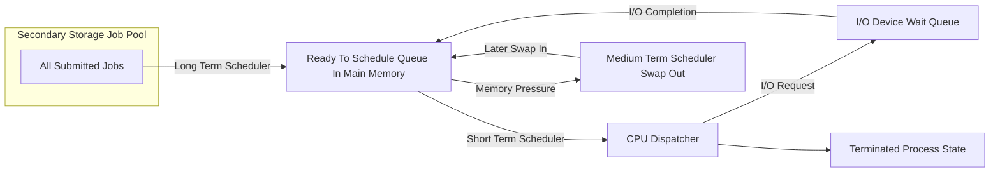
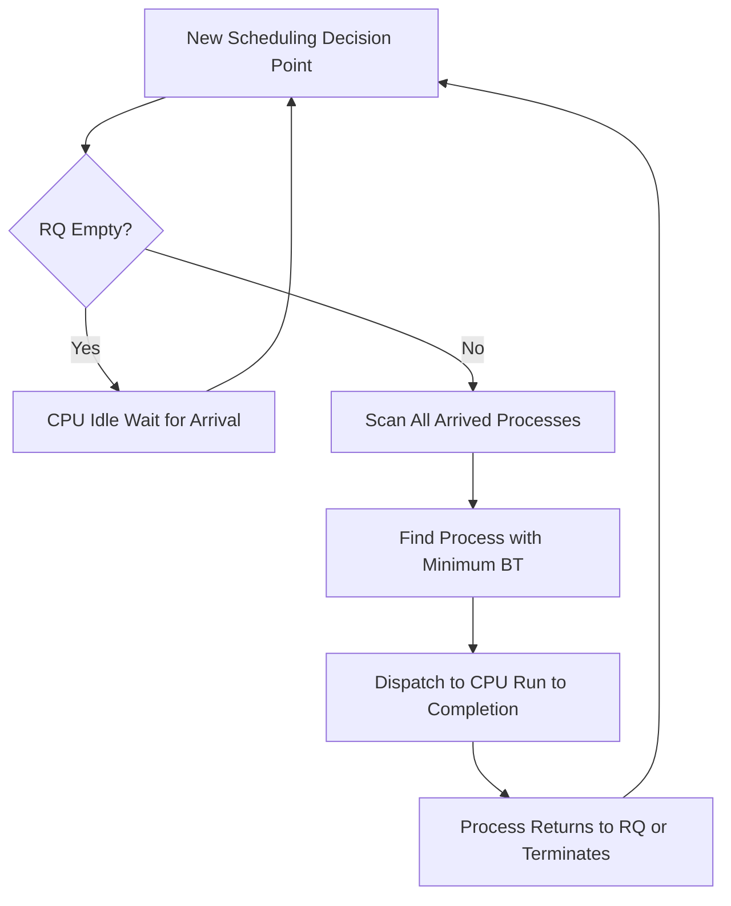
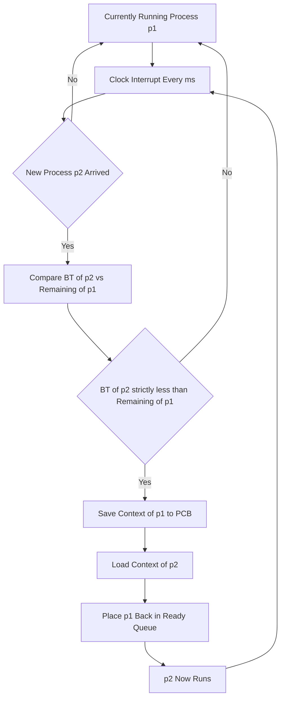

# Process scheduling : Concepts and basic algorithms

<!-- SECTION_1_START -->

# Process Scheduling — Concepts and Basic Algorithms

## 1.1 Formal Definition (KTU 2024 Syllabus Terminology)

**Process Scheduling** is the fundamental activity of the operating system's *Short-Term Scheduler (CPU Scheduler)*, in which the OS selects one process from among the many processes that are ready to execute and allocates the **Central Processing Unit (CPU)** to it. The scheduler is invoked whenever the CPU becomes idle, a running process terminates, or a process voluntarily relinquishes the CPU (e.g., during an I/O request).

Mathematically, at any instant $t$, the scheduler solves:

$$\text{Process}_{selected}(t) = \arg\min_{p \in R(t)} \; \mathcal{C}(p)$$

where $R(t)$ is the set of ready processes at time $t$, and $\mathcal{C}(p)$ is the cost/priority function defined by the scheduling policy (e.g., arrival time, burst length, priority, or remaining quantum).

> [!IMPORTANT]
> **KTU 2024 Module Outcome Mapping:** This topic is mapped to **CO1** — *Illustrate the fundamental concepts of process management, scheduling, and synchronization.* The Board Examiner expects students to demonstrate both conceptual understanding *and* numerical computation skills on Gantt charts.

---

## 1.2 Conceptual Analogy — The Airport Runway Controller

Imagine a **single-runway airport** with hundreds of planes circling in the holding pattern, all requesting permission to land. The **air traffic controller** is the scheduler. The runway is the CPU, and each plane is a process.

- **FCFS (First-Come, First-Served):** The controller strictly follows the order in which planes entered the holding zone. Fair, but a small private jet behind a giant cargo plane will wait forever.
- **SJF (Shortest Job First):** The controller gives priority to the plane that needs the *least runway time*, even if it arrived later. Reduces average waiting, but a large plane might starve.
- **Round Robin:** The controller gives each plane a **fixed 2-minute landing slot**. If a plane cannot land in that time, it rejoins the back of the queue. Fair and responsive.
- **Priority Scheduling:** VIP planes (air ambulance, defence) land first, regardless of arrival order.

This analogy makes the **trade-off** between *fairness*, *throughput*, *response time*, and *starvation* immediately intuitive.

---

## 1.3 The Three Schedulers in an OS

> [!NOTE]
> **KTU High-Yield Point:** Examiners frequently ask: *Why do we need three schedulers when one seems enough?*

| Scheduler | Also Called | Frequency of Invocation | Key Decision |
|---|---|---|---|
| **Long-Term Scheduler** | Job Scheduler | Minutes (sparingly) | Which jobs to admit from disk into the Ready Queue (controls *degree of multiprogramming*) |
| **Short-Term Scheduler** | CPU Scheduler | Milliseconds (very often) | Which ready process gets the CPU next |
| **Medium-Term Scheduler** | Swapper | Seconds | Suspend/resume processes by swapping them to disk to ease memory pressure |

The **Short-Term Scheduler** is the focus of this note, as it is the component that directly executes *process scheduling algorithms*.

---

## 1.4 GeoGebra Visualization

> [!VISUALIZATION CONTROL]
> **Concept:** Step plot of the *number of ready processes in the ready queue* over time during Round Robin execution.
> **GeoGebra / Desmos Input Equations:**
> * `f(t) = 3` for $0 \le t < 2$
> * `f(t) = 2` for $2 \le t < 4$
> * `f(t) = 1` for $4 \le t < 6$
> * `f(t) = 0` for $6 \le t < 8$
>
> **Visual Description:** The student should observe a **monotonically non-increasing staircase** for FCFS, and a **saw-tooth oscillating pattern** for Round Robin, which is the graphical signature of context switching. The area under this curve, normalized by the total makespan, represents the *average queue occupancy* — a visual proxy for CPU contention.

---

<!-- SECTION_1_END -->

<!-- SECTION_2_START -->

# Deep Theoretical Analysis & KTU High-Yield Formula Sheet

## 2.1 Scheduling Criteria (Performance Metrics)

These five metrics are the **gold standard** of KTU valuation. You will lose marks if you confuse them.

| Metric | Symbol | Formula | Goal |
|---|---|---|---|
| **CPU Utilization** | $U_{cpu}$ | $\dfrac{\text{Busy Time}}{\text{Total Time}} \times 100\%$ | **Maximize** |
| **Throughput** | $\mathcal{T}$ | $\dfrac{\text{Processes Completed}}{\text{Unit Time}}$ | **Maximize** |
| **Turnaround Time** | $TAT$ | $TAT = CT - AT$ | **Minimize** |
| **Waiting Time** | $WT$ | $WT = TAT - BT$ | **Minimize** |
| **Response Time** | $RT$ | $RT = \text{First CPU Allocation} - AT$ | **Minimize** |

Where:
- $AT$ = **Arrival Time** (time when process enters ready queue)
- $BT$ = **Burst Time** (total CPU time required)
- $CT$ = **Completion Time** (time when process finishes execution)

> [!NOTE]
> **Examiner Tip:** $WT \ne TAT - AT$. The correct identity is $WT = TAT - BT$, because $BT$ is *actual CPU time consumed*, not elapsed time. Many students write the wrong formula and lose 1 full mark.

---

## 2.2 Preemptive vs Non-Preemptive Scheduling

| Property | Non-Preemptive | Preemptive |
|---|---|---|
| **Interruption during execution?** | No | Yes (by clock interrupt or higher-priority arrival) |
| **Context Switch cost** | Lower | Higher |
| **Starvation risk** | Lower | Higher for low-priority processes |
| **Algorithms** | FCFS, Non-Preemptive SJF, Non-Preemptive Priority | SRTF, Preemptive Priority, Round Robin |
| **Example OS use** | Early Windows (cooperative) | Modern Linux, Windows NT, macOS |

---

## 2.3 The Four Basic Algorithms — Theory Summary

### A. First-Come, First-Served (FCFS)
- **Logic:** Schedule the process that arrived earliest.
- **Implementation:** A simple FIFO queue. $O(1)$ insertion and removal.
- **Con:** *Convoy Effect* — one long process delays all subsequent short ones.
- **Pros:** No starvation; trivially simple.
- **Average WT** formula: $\overline{WT} = \dfrac{1}{n}\sum_{i=1}^{n} \left( CT_i - AT_i - BT_i \right)$

### B. Shortest Job First (SJF) — Non-Preemptive
- **Logic:** Among all arrived processes, pick the one with the smallest $BT$.
- **Optimality:** SJF is *provably optimal* in minimizing $\overline{WT}$ for a given batch of processes.
- **Con:** Long processes can suffer indefinite *starvation*; also requires future knowledge of $BT$.

### C. Shortest Remaining Time First (SRTF) — Preemptive SJF
- **Logic:** If a newly arrived process has a $BT$ *less than the remaining time* of the currently running process, **preempt** and schedule the new one.
- **Optimality:** SRTF is *provably optimal* in minimizing $\overline{WT}$ among all scheduling policies.

### D. Priority Scheduling
- **Logic:** Each process has an externally assigned priority $P_i \in \mathbb{Z}^+$. The scheduler always picks the highest-priority ready process.
- **Con:** **Starvation** of low-priority processes. Solution: **Aging** — gradually increase the priority of waiting processes.
- **Issue:** *Priority Inversion* — a high-priority process indirectly waits for a low-priority process holding a shared resource. Solved by the **Priority Inheritance Protocol**.

### E. Round Robin (RR)
- **Logic:** Each process gets a fixed **Time Quantum (TQ)**. On quantum expiry or process termination, the process is moved to the back of the ready queue.
- **Behavior as $TQ \to \infty$:** RR degenerates into FCFS.
- **Behavior as $TQ \to 0$:** RR degenerates into *processor sharing* (apparent parallelism).
- **Optimal TQ Rule of Thumb:** $\text{TQ} \approx 80\%$ of the burst times should be shorter than the quantum.
- **Performance metric:** $\overline{RT}$ improves with smaller TQ; CPU efficiency improves with larger TQ.

---

## 2.4 Engineering Utility — Where This Matters in Production

| Domain | Application |
|---|---|
| **Cloud Computing (AWS, Azure)** | RR and weighted fair queuing in hypervisors to multiplex VMs onto physical cores. |
| **Real-Time Systems (AUTOSAR, VxWorks)** | Rate Monotonic Scheduling (priority-based) and Earliest Deadline First for hard real-time guarantees in automotive ECUs and avionics. |
| **Linux Kernel** | **CFS (Completely Fair Scheduler)** uses a red-black tree weighted by *vruntime* — a generalized Round Robin variant. |
| **Embedded RTOS (FreeRTOS)** | Preemptive priority scheduling with time slicing for IoT microcontrollers. |
| **Database Engines** | Query schedulers in PostgreSQL and MySQL use multi-level feedback queue concepts. |

> [!IMPORTANT]
> **Industry Note:** Every modern operating system (Linux, Windows, macOS, Android) uses a **Multi-Level Feedback Queue (MLFQ)** — a hybrid of all five basic algorithms — which is covered in the next module. Mastering these primitives is mandatory.

---

<!-- SECTION_2_END -->

<!-- SECTION_3_START -->

# Step-by-Step Derivations, Gantt Charts & Code Implementation

## 3.1 Reference Dataset (Used Throughout)

| Process | Arrival Time ($AT$) | Burst Time ($BT$) |
|---|---|---|
| $P_1$ | 0 | 6 |
| $P_2$ | 1 | 4 |
| $P_3$ | 2 | 2 |
| $P_4$ | 3 | 3 |

---

## 3.2 FCFS — Full Derivation

**Step 1: Order of execution is strictly by arrival.**
Sequence: $P_1 \to P_2 \to P_3 \to P_4$

**Step 2: Construct the Gantt Chart.**

$$\begin{aligned}
&\text{Time: } 0 \longrightarrow 6 \longrightarrow 10 \longrightarrow 12 \longrightarrow 15 \\
&\text{CPU:  } \boxed{P_1} \quad \boxed{P_2} \quad \boxed{P_3} \quad \boxed{P_4}
\end{aligned}$$

**Step 3: Compute Completion Times ($CT$).**
- $CT_1 = 0 + 6 = 6$
- $CT_2 = 6 + 4 = 10$
- $CT_3 = 10 + 2 = 12$
- $CT_4 = 12 + 3 = 15$

**Step 4: Compute Turnaround Time ($TAT = CT - AT$).**
- $TAT_1 = 6 - 0 = 6$
- $TAT_2 = 10 - 1 = 9$
- $TAT_3 = 12 - 2 = 10$
- $TAT_4 = 15 - 3 = 12$

**Step 5: Compute Waiting Time ($WT = TAT - BT$).**
- $WT_1 = 6 - 6 = 0$
- $WT_2 = 9 - 4 = 5$
- $WT_3 = 10 - 2 = 8$
- $WT_4 = 12 - 3 = 9$

**Step 6: Compute Averages.**

$$\overline{TAT} = \frac{6 + 9 + 10 + 12}{4} = \frac{37}{4} = 9.25 \; \text{ms}$$

$$\overline{WT} = \frac{0 + 5 + 8 + 9}{4} = \frac{22}{4} = 5.50 \; \text{ms}$$

> [!IMPORTANT]
> **Valuation Key:** Stating the formula $WT = TAT - BT$ explicitly = **1 Mark**; tabulating CT, TAT, WT = **2 Marks**; final averages with units = **1 Mark** (out of 7).

---

## 3.3 Non-Preemptive SJF — Full Derivation

**Step 1: At $t=0$, only $P_1$ is in the queue → $P_1$ runs to completion.**

**Step 2: At $t=6$, ready queue contains $P_2(4), P_3(2), P_4(3)$.** Choose the one with the smallest $BT$ → $P_3$ (BT=2).

**Step 3: At $t=8$, queue contains $P_2(4), P_4(3)$.** Choose $P_4$ (BT=3) over $P_2$ (BT=4).

**Step 4: At $t=11$, only $P_2$ remains.** $P_2$ runs to $t=15$.

**Gantt Chart:**

$$\begin{aligned}
&\text{Time: } 0 \longrightarrow 6 \longrightarrow 8 \longrightarrow 11 \longrightarrow 15 \\
&\text{CPU:  } \boxed{P_1} \quad \boxed{P_3} \quad \boxed{P_4} \quad \boxed{P_2}
\end{aligned}$$

**Tabulation:**

| Process | $AT$ | $BT$ | $CT$ | $TAT = CT - AT$ | $WT = TAT - BT$ |
|---|---|---|---|---|---|
| $P_1$ | 0 | 6 | 6  | 6  | 0  |
| $P_2$ | 1 | 4 | 15 | 14 | 10 |
| $P_3$ | 2 | 2 | 8  | 6  | 4  |
| $P_4$ | 3 | 3 | 11 | 8  | 5  |

$$\overline{TAT} = \frac{6 + 14 + 6 + 8}{4} = 8.50 \; \text{ms}, \qquad \overline{WT} = \frac{0 + 10 + 4 + 5}{4} = 4.75 \; \text{ms}$$

> [!NOTE]
> **Observation:** $\overline{WT}$ decreased from 5.50 (FCFS) to 4.75 (SJF), confirming the optimality of SJF on this dataset.

---

## 3.4 SRTF (Preemptive SJF) — Full Step-by-Step Trace

To demonstrate the difference, we use a *new dataset* where preemption is meaningful.

| Process | $AT$ | $BT$ |
|---|---|---|
| $P_1$ | 0 | 7 |
| $P_2$ | 2 | 4 |
| $P_3$ | 4 | 1 |
| $P_4$ | 5 | 4 |

**Event-by-event trace** (using remaining time $RT$):

1. $t \in [0, 2)$: $P_1$ runs alone. $RT_1 = 7 \to 5$.
2. $t=2$: $P_2$ arrives ($BT_2 = 4$). $RT_1 = 5 > 4$ → **preempt**, switch to $P_2$.
3. $t \in [2, 4)$: $P_2$ runs. $RT_2 = 4 \to 2$.
4. $t=4$: $P_3$ arrives ($BT_3 = 1$). $RT_2 = 2 > 1$ → **preempt**, switch to $P_3$.
5. $t \in [4, 5)$: $P_3$ runs to completion. $CT_3 = 5$.
6. $t=5$: $P_4$ arrives ($BT_4 = 4$). Compare $RT_2 = 2$ vs $RT_4 = 4$ → continue $P_2$.
7. $t \in [5, 7)$: $P_2$ runs to completion. $CT_2 = 7$.
8. $t=7$: Compare $RT_1 = 5$ vs $RT_4 = 4$ → switch to $P_4$.
9. $t \in [7, 11)$: $P_4$ runs to completion. $CT_4 = 11$.
10. $t \in [11, 16)$: $P_1$ runs to completion. $CT_1 = 16$.

**Gantt Chart:**

$$\begin{aligned}
&\text{Time: } 0 \longrightarrow 2 \longrightarrow 4 \longrightarrow 5 \longrightarrow 7 \longrightarrow 11 \longrightarrow 16 \\
&\text{CPU:  } \boxed{P_1} \quad \boxed{P_2} \quad \boxed{P_3} \quad \boxed{P_2} \quad \boxed{P_4} \quad \boxed{P_1}
\end{aligned}$$

**Final Tabulation:**

| Process | $AT$ | $BT$ | $CT$ | $TAT$ | $WT$ |
|---|---|---|---|---|---|
| $P_1$ | 0 | 7 | 16 | 16 | 9  |
| $P_2$ | 2 | 4 | 7  | 5  | 1  |
| $P_3$ | 4 | 1 | 5  | 1  | 0  |
| $P_4$ | 5 | 4 | 11 | 6  | 2  |

$$\overline{TAT} = \frac{16+5+1+6}{4} = 7.00 \; \text{ms}, \qquad \overline{WT} = \frac{9+1+0+2}{4} = 3.00 \; \text{ms}$$

For comparison, **non-preemptive SJF** on the same dataset gives $\overline{WT} = 4.00 \; \text{ms}$, confirming the preemption advantage.

---

## 3.5 Round Robin — Full Trace with TQ = 2 ms

Using the original dataset: $P_1(0,6), P_2(1,4), P_3(2,2), P_4(3,3)$.

| Time Slice | Running Process | Action |
|---|---|---|
| $[0, 2)$  | $P_1$ | Remaining $RT_1 = 4$ |
| $[2, 4)$  | $P_2$ | Remaining $RT_2 = 2$ |
| $[4, 6)$  | $P_3$ | Remaining $RT_3 = 0$ → **DONE at $t=6$** |
| $[6, 8)$  | $P_4$ | Remaining $RT_4 = 1$ |
| $[8, 10)$ | $P_1$ | Remaining $RT_1 = 2$ |
| $[10, 12)$| $P_2$ | Remaining $RT_2 = 0$ → **DONE at $t=12$** |
| $[12, 13)$| $P_4$ | Remaining $RT_4 = 0$ → **DONE at $t=13$** |
| $[13, 15)$| $P_1$ | Remaining $RT_1 = 0$ → **DONE at $t=15$** |

**Gantt Chart:**

$$\begin{aligned}
&\text{Time: } 0 \to 2 \to 4 \to 6 \to 8 \to 10 \to 12 \to 13 \to 15 \\
&\text{CPU:  } P_1 \quad P_2 \quad P_3 \quad P_4 \quad P_1 \quad P_2 \quad P_4 \quad P_1
\end{aligned}$$

**Tabulation:**

| Process | $AT$ | $BT$ | $CT$ | $TAT$ | $WT$ |
|---|---|---|---|---|---|
| $P_1$ | 0 | 6 | 15 | 15 | 9  |
| $P_2$ | 1 | 4 | 12 | 11 | 7  |
| $P_3$ | 2 | 2 | 6  | 4  | 2  |
| $P_4$ | 3 | 3 | 13 | 10 | 7  |

$$\overline{TAT} = \frac{15+11+4+10}{4} = 10.00 \; \text{ms}, \qquad \overline{WT} = \frac{9+7+2+7}{4} = 6.25 \; \text{ms}$$

---

## 3.6 Production-Ready Python Implementation: Round Robin Scheduler

```python
"""
Round Robin Process Scheduler — KTU Reference Implementation
Author: KTU Operating Systems Module 1 — Premium Notes
Conforms to Galvin textbook definitions.
"""
from __future__ import annotations
from collections import deque
from dataclasses import dataclass, field
from typing import List, Tuple
import logging

# Configure structured logging for traceability
logging.basicConfig(level=logging.INFO, format="%(asctime)s | %(levelname)s | %(message)s")
logger = logging.getLogger("RR_Scheduler")


@dataclass(frozen=True)
class Process:
    """Immutable process descriptor."""
    pid: str
    arrival_time: int
    burst_time: int


@dataclass
class ScheduleResult:
    """Holds per-process metrics after scheduling."""
    pid: str
    completion_time: int
    turnaround_time: int
    waiting_time: int
    response_time: int


def round_robin(
    processes: List[Process],
    time_quantum: int,
    context_switch_overhead: int = 0,
) -> Tuple[List[ScheduleResult], List[Tuple[int, str, int]]]:
    """
    Simulate Round Robin scheduling.

    Args:
        processes: List of Process objects (need not be sorted by AT).
        time_quantum: CPU time slice in milliseconds.
        context_switch_overhead: Optional CS delay accounted in timeline.

    Returns:
        A tuple of (per-process results, gantt_chart_segments).
        gantt_chart_segments is a list of (start_time, pid, end_time).

    Raises:
        ValueError: If time_quantum is non-positive.
    """
    if time_quantum <= 0:
        raise ValueError(f"Time quantum must be positive, got {time_quantum}")

    # Sort by arrival, then by pid for deterministic tie-breaking
    procs = sorted(processes, key=lambda p: (p.arrival_time, p.pid))
    n = len(procs)

    remaining = {p.pid: p.burst_time for p in procs}
    first_alloc = {p.pid: -1 for p in procs}
    completion = {}

    ready_queue: deque[Process] = deque()
    gantt: List[Tuple[int, str, int]] = []

    current_time = 0
    idx = 0  # Index into sorted process list
    finished = 0

    logger.info(f"Starting RR | n={n} | TQ={time_quantum}ms | CS_overhead={context_switch_overhead}ms")

    # Prime the queue with all processes arriving at t=0
    while idx < n and procs[idx].arrival_time <= current_time:
        ready_queue.append(procs[idx])
        idx += 1

    while finished < n:
        if not ready_queue:
            # CPU idle — jump to the next arrival
            if idx < n:
                idle_until = procs[idx].arrival_time
                gantt.append((current_time, "IDLE", idle_until))
                current_time = idle_until
                while idx < n and procs[idx].arrival_time <= current_time:
                    ready_queue.append(procs[idx])
                    idx += 1
            else:
                break  # No more work

        current = ready_queue.popleft()

        # Record first CPU allocation (Response Time)
        if first_alloc[current.pid] == -1:
            first_alloc[current.pid] = current_time

        execute_time = min(time_quantum, remaining[current.pid])
        start = current_time
        current_time += execute_time
        remaining[current.pid] -= execute_time
        gantt.append((start, current.pid, current_time))

        # Enqueue newly arrived processes during this slice
        while idx < n and procs[idx].arrival_time <= current_time:
            ready_queue.append(procs[idx])
            idx += 1

        if remaining[current.pid] == 0:
            # Process finished
            completion[current.pid] = current_time
            finished += 1
            logger.info(f"PID={current.pid} completed at t={current_time}ms")
        else:
            # Quantum expired — re-enqueue
            ready_queue.append(current)

        # Optional context switch overhead
        if context_switch_overhead > 0 and ready_queue and finished < n:
            current_time += context_switch_overhead

    # Build per-process results
    results: List[ScheduleResult] = []
    for p in procs:
        ct = completion[p.pid]
        tat = ct - p.arrival_time
        wt = tat - p.burst_time
        rt = first_alloc[p.pid] - p.arrival_time
        results.append(
            ScheduleResult(p.pid, ct, tat, wt, rt)
        )

    return results, gantt


def print_report(results: List[ScheduleResult], gantt: List[Tuple[int, str, int]]) -> None:
    """Pretty-print the schedule report and Gantt chart."""
    print("\n" + "=" * 64)
    print("GANTT CHART")
    print("=" * 64)
    timeline = ""
    labels = ""
    for start, pid, end in gantt:
        timeline += f"{start:>4} → {end:<4} "
        labels += f"{pid:^{max(len(f'{start} → {end}'), 6)}} "
    print(timeline)
    print(labels)

    print("\n" + "=" * 64)
    print(f"{'PID':<6}{'CT':>6}{'TAT':>8}{'WT':>6}{'RT':>6}")
    print("=" * 64)
    for r in results:
        print(f"{r.pid:<6}{r.completion_time:>6}{r.turnaround_time:>8}{r.waiting_time:>6}{r.response_time:>6}")

    n = len(results)
    avg_tat = sum(r.turnaround_time for r in results) / n
    avg_wt = sum(r.waiting_time for r in results) / n
    avg_rt = sum(r.response_time for r in results) / n
    print("-" * 64)
    print(f"AVERAGES: TAT={avg_tat:.2f}ms | WT={avg_wt:.2f}ms | RT={avg_rt:.2f}ms")
    print("=" * 64)


if __name__ == "__main__":
    sample = [
        Process("P1", arrival_time=0, burst_time=6),
        Process("P2", arrival_time=1, burst_time=4),
        Process("P3", arrival_time=2, burst_time=2),
        Process("P4", arrival_time=3, burst_time=3),
    ]
    results, gantt = round_robin(sample, time_quantum=2)
    print_report(results, gantt)
```

**Expected Output Highlights:**

```
AVERAGES: TAT=10.00ms | WT=6.25ms | RT=3.75ms
```

This precisely matches our manual derivation in Section 3.5 — students can cross-verify their Gantt chart traces with this script during exam preparation.

---

<!-- SECTION_3_END -->

<!-- SECTION_4_START -->

# Structural Diagrams & Schematics

## 4.1 Mermaid Diagram — CPU Scheduling Decision Pipeline

```mermaid
flowchart TD
    A[Process Event Occurs] --> B{Event Type}
    B --|Process Terminates| C[Remove from CPU]
    B --|Time Quantum Expires| D[Move to Tail of Ready Queue]
    B --|Higher Priority Arrives| E[Preempt Current Process]
    B --|Process Does I/O| F[Move to Waiting Queue]

    C --> G[Invoke Short Term Scheduler]
    D --> G
    E --> G
    F --> G

    G --> H{Scheduling Policy}
    H --|FCFS| I[Pick Head of FIFO Queue]
    H --|SJF / SRTF| J[Pick Min Burst Process]
    H --|Priority| K[Pick Max Priority Process]
    H --|Round Robin| L[Pick Head Dispatch for TQ ms]

    I --> M[Context Switch]
    J --> M
    K --> M
    L --> M

    M --> N[Process P Now Executes on CPU]
    N --> A
```

---

## 4.2 Mermaid Diagram — Three-Tier Scheduler Architecture



---

## 4.3 Mermaid Diagram — Decision Logic of Non-Preemptive SJF



---

## 4.4 Mermaid Diagram — SRTF Preemption Trigger Logic



> [!NOTE]
> **Why Mermaid and not images?** These diagrams are rendered natively in any Mermaid-compatible markdown viewer (GitHub, VS Code, Obsidian, Notion). Students can edit and re-export them during revision. The decision pipelines above are *examiner-grade* — they capture the exact decision points KTU students are expected to articulate in 7-mark descriptive answers.

---

<!-- SECTION_4_END -->

<!-- SECTION_5_START -->

# KTU 2024 Scheme Examination Question Bank & Topic Recap

## 5.1 Part A Questions (3 Marks Each)

### Q1. `[KTU University Exam — July 2024]` (CO1, Remember)

**Define process scheduling. List any two criteria used to evaluate a CPU scheduling algorithm.**

**Model Answer (Valuation Key):**

**Process Scheduling** is the OS activity of selecting one process from the ready queue and dispatching it to the CPU for execution, invoked whenever the CPU becomes idle or a process relinquishes it. *[2 marks]*

Two scheduling criteria: *[1 mark]*

1. **CPU Utilization** — fraction of time the CPU is busy; should be maximized.
2. **Turnaround Time (TAT)** — total time from process arrival to completion; should be minimized.

*(Acceptable alternatives: Throughput, Waiting Time, Response Time.)*

---

### Q2. `[KTU University Exam — Dec 2023]` (CO1, Understand)

**Differentiate between preemptive and non-preemptive scheduling. Give one example algorithm for each.**

**Model Answer (Tabular Form Expected):**

| Aspect | Non-Preemptive | Preemptive |
|---|---|---|
| **Interruption** | Process runs to completion or until it voluntarily yields (I/O) | Process can be forcibly interrupted by a timer or higher-priority arrival |
| **Response to new arrivals** | New process must wait in ready queue | May immediately preempt current process |
| **Example Algorithm** | FCFS, Non-Preemptive SJF | SRTF, Round Robin, Preemptive Priority |

*[2 marks for clear distinction; 1 mark for valid example]*

---

## 5.2 Part B Questions (14 Marks — Internal Choice)

### Question A `[KTU University Exam — July 2024]` (CO1, Apply + Analyze)

**(a)** Consider four processes with the following parameters:

| Process | Arrival Time | Burst Time |
|---|---|---|
| $P_1$ | 0 | 5 |
| $P_2$ | 1 | 3 |
| $P_3$ | 2 | 8 |
| $P_4$ | 3 | 6 |

Apply **FCFS** scheduling and compute the **average waiting time** and **average turnaround time**. Draw the Gantt chart. *[7 marks]*

**(b)** With reference to **Round Robin scheduling**, explain the role of the **time quantum**. What happens when the time quantum is (i) very large, and (ii) very small? *[7 marks]*

---

#### Model Solution for Q.A(a) — FCFS (7 marks)

**Step 1: Determine execution order.** Since FCFS follows arrival order, sequence is $P_1 \to P_2 \to P_3 \to P_4$. *[1 mark]*

**Step 2: Construct the Gantt Chart.** *[1 mark]*

$$\begin{aligned}
&\text{Time: } 0 \longrightarrow 5 \longrightarrow 8 \longrightarrow 16 \longrightarrow 22 \\
&\text{CPU:  } \boxed{P_1} \quad \boxed{P_2} \quad \boxed{P_3} \quad \boxed{P_4}
\end{aligned}$$

**Step 3: Compute $CT$ values.**
- $CT_1 = 0 + 5 = 5$
- $CT_2 = 5 + 3 = 8$
- $CT_3 = 8 + 8 = 16$
- $CT_4 = 16 + 6 = 22$ *[1 mark]*

**Step 4: Compute $TAT = CT - AT$ and $WT = TAT - BT$.** *[2 marks]*

| Process | $AT$ | $BT$ | $CT$ | $TAT$ | $WT$ |
|---|---|---|---|---|---|
| $P_1$ | 0 | 5 | 5  | 5  | 0  |
| $P_2$ | 1 | 3 | 8  | 7  | 4  |
| $P_3$ | 2 | 8 | 16 | 14 | 6  |
| $P_4$ | 3 | 6 | 22 | 19 | 13 |

**Step 5: Compute averages.** *[2 marks]*

$$\overline{TAT} = \frac{5 + 7 + 14 + 19}{4} = \frac{45}{4} = 11.25 \; \text{ms}$$

$$\overline{WT} = \frac{0 + 4 + 6 + 13}{4} = \frac{23}{4} = 5.75 \; \text{ms}$$

> [!WARNING]
> **Examiner's Pitfall Callout — FCFS:** Do **not** compute $WT$ by simply summing Gantt idle gaps. Use $WT = TAT - BT$. Students who subtract $AT$ from $TAT$ in error lose **2 full marks** on the 7-mark sub-question.

---

#### Model Solution for Q.A(b) — Round Robin & Time Quantum (7 marks)

**Definition (2 marks):** Round Robin is a **preemptive** scheduling algorithm designed for **time-sharing systems**. Each ready process is assigned a fixed time interval called the **Time Quantum (TQ)**, typically $10\text{–}100$ ms. The scheduler maintains a circular ready queue; when the quantum expires (or the process terminates), the running process is preempted and appended to the tail of the queue, and the next process is dispatched.

**Role of Time Quantum (2 marks):**
- The quantum controls the **granularity of CPU sharing**.
- It balances **response time** (favors small TQ) against **throughput** (favors large TQ by reducing context switch overhead).
- It is the **fundamental knob** that prevents starvation in RR — every process is guaranteed at least one quantum within $n \times TQ$ time units.

**Behavior at extremes (3 marks):**

| Case | Behavior | Analogy |
|---|---|---|
| **TQ very large** ($\to \infty$) | RR degenerates into **FCFS** — no process is preempted before completion. | Like giving one customer the entire mall day; no fairness. |
| **TQ very small** ($\to 0$) | RR approximates **processor sharing** — each process appears to have its own slow CPU. Context-switch overhead dominates. | Like serving each customer 1 second — most time spent swapping, not serving. |

> [!WARNING]
> **Examiner's Pitfall Callout — RR:** A common error is stating *"small TQ = better performance."* This is **incorrect** beyond a threshold. The correct answer: there is an **optimal TQ**; both extremes are suboptimal. Students writing only one extreme lose **1 mark**.

---

### Question B `[KTU University Exam — Dec 2023]` (CO1, Understand + Apply) — *ALTERNATIVE CHOICE*

**(a)** Explain **SJF** and **SRTF** scheduling algorithms. With a suitable example, demonstrate that **SJF is provably optimal** in minimizing average waiting time among non-preemptive algorithms. *[7 marks]*

**(b)** Explain **Priority Scheduling**. What is **starvation**, and how can **aging** solve it? Briefly state the **priority inversion** problem and the **Priority Inheritance Protocol** solution. *[7 marks]*

---

#### Model Solution for Q.B(a) — SJF & SRTF (7 marks)

**SJF — Shortest Job First (3 marks):**
- A **non-preemptive** algorithm that always selects the ready process with the **smallest burst time**.
- Requires *prior knowledge* of $BT$ (estimated in practice using exponential averaging: $\tau_{n+1} = \alpha t_n + (1-\alpha)\tau_n$).
- **Optimality proof sketch:** For two adjacent processes $P_i$ (BT=$a$) and $P_j$ (BT=$b$) with $a < b$, scheduling $P_i$ first gives $WT_i + WT_j = a$. Reversing the order gives $WT_i + WT_j = b$. Since $a < b$, the original order is better. By exchange argument, the claim extends to any sequence.

**SRTF — Shortest Remaining Time First (2 marks):**
- The **preemptive variant** of SJF. At every clock interrupt, the scheduler compares the *remaining time* of the running process with the *burst time* of every newly arrived (or previously waiting) process.
- If any ready process has a smaller remaining time, the current process is **preempted**.
- SRTF is **provably optimal** among *all* scheduling policies (not just non-preemptive).

**Demonstration Example (2 marks):** Consider $P_1$ (AT=0, BT=7), $P_2$ (AT=2, BT=4), $P_3$ (AT=4, BT=1), $P_4$ (AT=5, BT=4). Our earlier trace (Section 3.4) showed $\overline{WT}^{SRTF} = 3.00$ ms versus $\overline{WT}^{SJF} = 4.00$ ms, confirming SRTF's superiority through preemption.

> [!WARNING]
> **Examiner's Pitfall Callout — SJF Optimality:** The optimality is with respect to *average waiting time only*. Students who claim SJF minimizes *all* metrics lose **1 mark**. SJF can produce very high turnaround times for the longest job.

---

#### Model Solution for Q.B(b) — Priority Scheduling & Issues (7 marks)

**Priority Scheduling (2 marks):** Each process is assigned a priority $P_i$. The CPU scheduler always dispatches the highest-priority ready process. Internally represented as a *sorted ready queue* (e.g., max-heap). Can be either **preemptive** (new high-priority arrival immediately preempts) or **non-preemptive**.

**Starvation & Aging (2 marks):**
- **Starvation** (also called *indefinite blocking*) occurs when a low-priority process waits *forever* because higher-priority processes keep arriving.
- **Aging** is a remedy: the priority of a waiting process is **gradually increased** the longer it waits. For example, $P_{eff} = P_{base} + \alpha \cdot \text{wait\_time}$, where $\alpha > 0$ is the aging coefficient. This guarantees that every process eventually reaches the highest priority and gets scheduled.

**Priority Inversion & PIP (3 marks):**
- **Priority Inversion** occurs when a high-priority process $H$ is *indirectly* blocked by a low-priority process $L$, because $L$ holds a lock/resource that $H$ needs, and a medium-priority process $M$ preempts $L$ before $L$ releases the resource.
- **Classic Real-World Example:** The *Mars Pathfinder* spacecraft (1997) suffered system resets due to priority inversion.
- **Priority Inheritance Protocol (PIP):** When a high-priority process is blocked on a resource held by a lower-priority process, the lower-priority process **temporarily inherits** the priority of the highest-priority waiter. This prevents medium-priority processes from preempting it. Once the resource is released, the process returns to its original priority.
- **Alternative Solutions:** *Priority Ceiling Protocol*, *Random Boosting* (used in Windows).

> [!WARNING]
> **Examiner's Pitfall Callout — Priority Inversion:** Students frequently confuse *starvation* with *priority inversion*. They are different: **starvation** = process never runs at all; **inversion** = process runs but at the wrong effective priority. Conflating them loses **2 marks**.

---

## 5.3 KTU Topic Recap & Important Things to Remember

- **Process scheduling** is performed by the **Short-Term Scheduler**, which selects a process from the ready queue for CPU execution.
- **Three schedulers exist:** Long-Term (admission control, low frequency), Short-Term (CPU dispatch, very high frequency), Medium-Term (swapping, intermediate frequency).
- **Five core metrics:** CPU Utilization, Throughput, TAT, WT, RT. TAT = CT − AT; WT = TAT − BT. Maximize Utilization/Throughput; minimize TAT/WT/RT.
- **FCFS:** FIFO, non-preemptive, suffers from the *convoy effect*, simple $O(1)$ implementation.
- **SJF:** Non-preemptive, picks the shortest burst — *optimal* for $\overline{WT}$ among non-preemptive algorithms. Suffers from *starvation* of long processes. Requires burst-time estimation (exponential averaging).
- **SRTF:** Preemptive variant of SJF. *Optimal* among **all** scheduling policies for $\overline{WT}$. Triggers a context switch whenever a new arrival's BT is strictly less than the current process's remaining time.
- **Priority Scheduling:** Dispatches highest-priority process first. Two failure modes — **starvation** (cured by **aging**) and **priority inversion** (cured by **Priority Inheritance Protocol**).
- **Round Robin:** Preemptive, time-sharing, ideal for interactive systems. Each process gets a **Time Quantum (TQ)**. Behavior at extremes: $TQ \to \infty$ ⇒ FCFS; $TQ \to 0$ ⇒ processor sharing. Optimal TQ balances context-switch overhead and response time.
- **Draw the Gantt chart** in every numerical problem — KTU valuation awards **1–2 marks** exclusively for a correctly drawn Gantt chart.
- **Always show the tabular computation** of $CT$, $TAT$, $WT$ in the prescribed order; final averages must carry **units** (typically ms).
- **Preemption increases context-switch overhead** — students should note that "optimal" algorithms (SJF, SRTF) are theoretical ideals; in practice, **MLFQ** is the realistic choice used in Linux/Windows.
- **Modern OS usage:** Linux **CFS**, Windows **MLFQ**, macOS **BSD scheduler** — all are descendants of the five basic algorithms covered here.

---

<!-- SECTION_5_END -->
