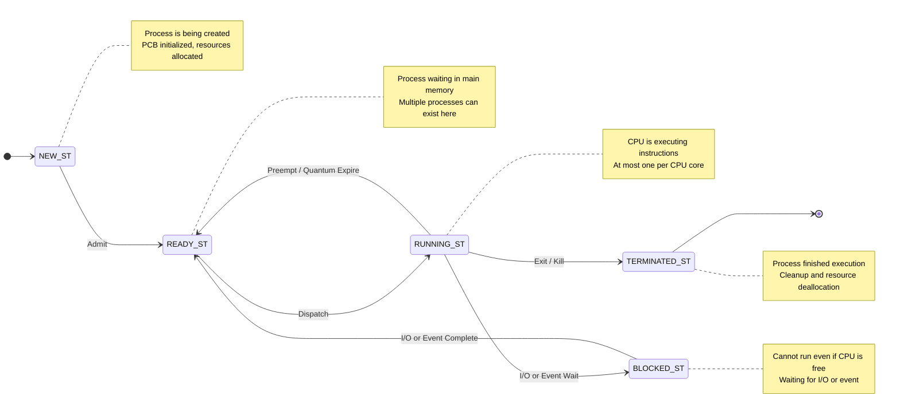
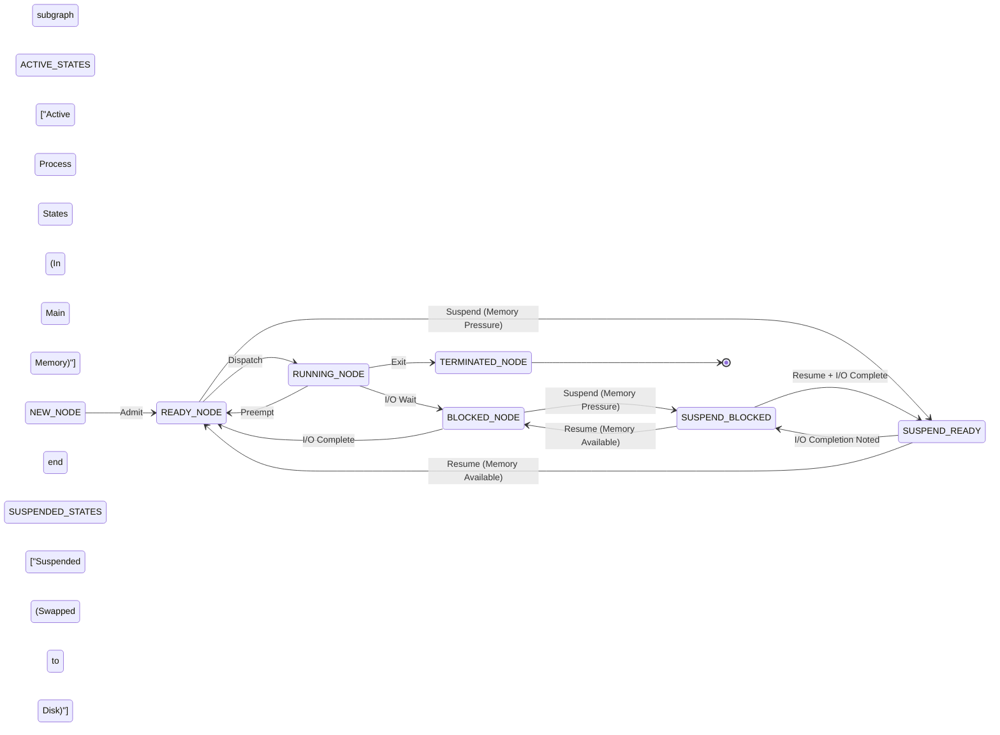
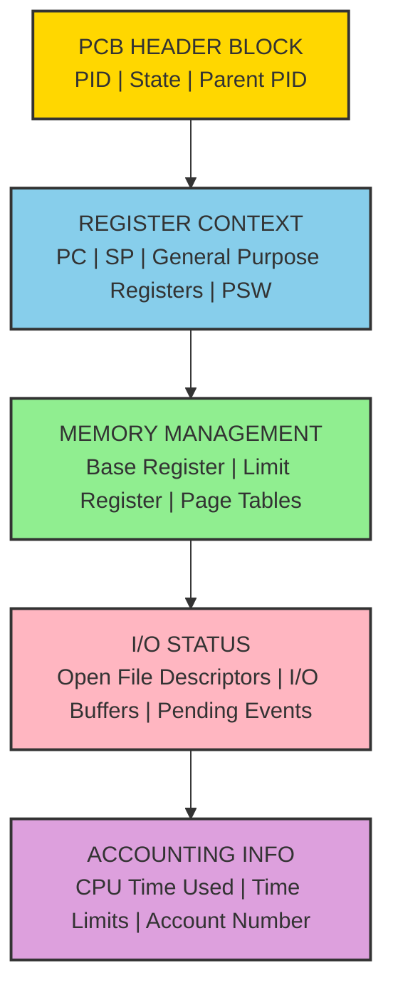
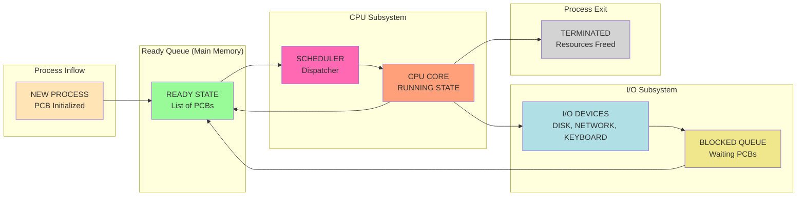

# Process States

<!-- SECTION_1_START -->
# PROCESS STATES - Core Technical Definition & Intuitive Overview

## Formal Academic Definition (KTU 2024 Syllabus Terminology)

A **Process** is defined as a program in execution. It is a dynamic entity whose state continuously changes as the CPU scheduler dispatches, preempts, and resumes its execution. The **Process State** represents the current activity or condition of a process at a given instant of time, captured in the **Process Control Block (PCB)**.

The standard KTU-recognized process state model comprises **five canonical states**:
1. **New** - Process is being created
2. **Ready** - Process is waiting to be assigned to a processor
3. **Running** - Instructions are being executed by the CPU
4. **Blocked (Waiting)** - Process is waiting for some event (I/O completion, signal) to occur
5. **Terminated (Exit)** - Process has finished execution

> [!IMPORTANT]
> **KTU 2024 Syllabus Highlight (Module 1):** Students are expected to identify *all five states*, draw the *complete state transition diagram*, and clearly distinguish between the **Ready** and **Blocked** states. The 7-state model with *Suspended* states is also part of the extended syllabus coverage.

## Conceptual Analogy & Intuition

> [!NOTE]
> **Real-World Analogy: The Daily Life of a Software Developer**
>
> Imagine you are a software developer working on multiple projects:
> - **New** = You just received the project assignment (project file is created)
> - **Ready** = You are at your desk, your computer is on, but you are checking email first (waiting for CPU to call you)
> - **Running** = You are actively typing code on your IDE (CPU is executing your instructions)
> - **Blocked (Waiting)** = You submitted a code review and are waiting for your manager's approval (waiting for I/O/event)
> - **Terminated** = The project is complete and shipped to the client (process finished execution)
>
> Notice how you might bounce between Ready and Running many times (context switching), and you may also move from Blocked back to Ready once the review arrives (event occurs). This perfectly mirrors the dynamic lifecycle of an OS process.

## Visual Intuition: The Process State Coordinate System

> [!VISUALIZATION CONTROL]
> **Concept:** Process Lifecycle Trajectory
> **GeoGebra / Desmos Input Equations:**
> * Point tracking: `P(t) = (t, State[t])` where State[t] maps to numerical axis values
> * Discrete state levels: `y = 1` (New), `y = 2` (Ready), `y = 3` (Running), `y = 4` (Blocked), `y = 5` (Terminated)
> * Transition arrows: piecewise functions between levels
> **Visual Description:** The student should see a horizontal time axis with the process state jumping vertically between levels 1-5, with most activity oscillating between levels 2 (Ready) and 3 (Running), and occasional downward dips to level 4 (Blocked) followed by recovery to level 2.

> [!TIP]
> **Key Physical/Logical Constants for Process Management:**
> - Context Switch Time: typically **1 to 1000 microseconds**
> - PCB Size: ranges from **1 KB to 4 KB** depending on OS
> - Maximum Process ID: typically **32-bit unsigned integer** (supports up to 2³² concurrent processes)
<!-- SECTION_1_END -->

<!-- SECTION_2_START -->
# Deep Theoretical Analysis & KTU High-Yield Formula Sheet

## Detailed Breakdown of Each Process State

### 1. **New State**
- The process is being **created** by the operating system
- The OS allocates a unique **Process ID (PID)**, memory for the PCB, and initial resources
- The process has not yet been admitted to the ready queue
- **Example:** When you type `fork()` in Unix/Linux, the child process is in the *New* state briefly

### 2. **Ready State**
- The process is **loaded into main memory** (RAM) and is waiting in the ready queue
- All necessary resources *except the CPU* are available
- Multiple processes can be in the ready state simultaneously, each waiting their turn
- The CPU scheduler picks one of them based on the scheduling algorithm (FCFS, SJF, RR, etc.)

### 3. **Running State**
- The process is currently being **executed by the CPU**
- At any instant, *at most one process* can be in the running state per CPU core
- The process may transition out of this state in three ways:
  - **Voluntary exit** → Terminated
  - **Wait for I/O** → Blocked
  - **Preempted by scheduler** → Ready (e.g., time quantum expiry in Round Robin)

### 4. **Blocked (Waiting) State**
- The process **cannot continue execution** even if the CPU is available
- It is waiting for some external event to complete (I/O operation, semaphore release, signal arrival)
- **Critical distinction from Ready:** A blocked process is *not* a candidate for CPU allocation, regardless of the scheduling algorithm
- The process stays blocked until the awaited event completes, at which point it returns to the Ready state

### 5. **Terminated (Exit) State**
- The process has **finished its execution** (either normally or abnormally)
- The OS performs cleanup: deallocating memory, closing open file descriptors, releasing resources
- The PCB may be retained temporarily for the parent process to read its exit status (using `wait()` system call)

## State Transition Logic (Rules)

- **New → Ready:** OS admits the process to the ready queue after allocating resources
- **Ready → Running:** CPU scheduler dispatches the process
- **Running → Ready:** Scheduler preempts the process (e.g., context switch, time quantum expiry)
- **Running → Blocked:** Process requests I/O or waits for an event
- **Blocked → Ready:** I/O completes or awaited event occurs
- **Running → Terminated:** Process completes execution or is killed (e.g., via `kill` signal)

## KTU Formula Sheet / Cheat Sheet

| Parameter | Formula / Description | Units / Notes |
|-----------|----------------------|---------------|
| **CPU Utilization** | $\text{CPU\%} = \dfrac{T_{\text{busy}}}{T_{\text{busy}} + T_{\text{idle}}} \times 100$ | Percentage (%) |
| **Throughput** | $\text{Throughput} = \dfrac{N_{\text{completed}}}{T_{\text{total}}}$ | Processes per second |
| **Turnaround Time (TAT)** | $TAT = T_{\text{completion}} - T_{\text{arrival}}$ | Seconds or milliseconds |
| **Waiting Time (WT)** | $WT = TAT - T_{\text{burst}}$ | Time spent in **Ready** queue |
| **Response Time (RT)** | $RT = T_{\text{first\_response}} - T_{\text{arrival}}$ | Time to first CPU allocation |
| **Context Switch Overhead** | $CS_{\text{overhead}} = \dfrac{T_{\text{save}} + T_{\text{load}} + T_{\text{flush}}}{T_{\text{quantum}}}$ | Ratio (dimensionless) |
| **Ready Queue Length Indicator** | State $= \text{Ready}$ in PCB.state field | Enumerated constant |

> [!WARNING]
> **KTU Exam Pitfall:** Do NOT confuse **Waiting Time** (spent in Ready state) with **Blocked Time** (spent in Blocked state). They are entirely different metrics. Waiting time is the OS scheduler's responsibility; blocked time is determined by the I/O subsystem.

## Real-World Engineering Utility

The Process State Model is foundational to:
- **Linux Kernel:** Uses states like `TASK_RUNNING`, `TASK_INTERRUPTIBLE` (Blocked), `TASK_UNINTERRUPTIBLE`, `TASK_STOPPED` (Suspended)
- **Windows OS:** Employs the `KTHREAD` structure with states such as `Ready`, `Running`, `Waiting`, `Terminated`
- **Real-Time Systems (RTOS):** Used in automotive ECUs, aerospace flight controllers, and medical devices where deterministic state transitions are critical
- **Container Orchestration:** Kubernetes pod lifecycle (Pending, Running, Succeeded, Failed) directly maps to the 5-state OS process model
<!-- SECTION_2_END -->

<!-- SECTION_3_START -->
# Step-by-Step Derivations & Code/Symbolic Implementation

## Part A: Symbolic Derivation of State Transition Probabilities

Let us derive the steady-state probability that a process is in each state, assuming a long-running system with $N$ processes.

**Step 1:** Define the rate at which processes transition between states.
- $\lambda_{N \to R}$ = rate from New to Ready
- $\lambda_{R \to C}$ = rate from Ready to Running (scheduling dispatch rate)
- $\lambda_{C \to B}$ = rate from Running to Blocked
- $\lambda_{B \to R}$ = rate from Blocked to Ready (I/O completion rate)
- $\lambda_{C \to T}$ = rate from Running to Terminated

**Step 2:** In steady state, the flow in equals the flow out for each state. Therefore:

$$
\begin{aligned}
P(\text{New}) \cdot \lambda_{N \to R} &= \text{process creation rate} \\
P(\text{Ready}) \cdot \lambda_{R \to C} &= P(\text{New}) \cdot \lambda_{N \to R} + P(\text{Blocked}) \cdot \lambda_{B \to R} \\
P(\text{Running}) \cdot (\lambda_{C \to B} + \lambda_{C \to T}) &= P(\text{Ready}) \cdot \lambda_{R \to C} \\
P(\text{Blocked}) \cdot \lambda_{B \to R} &= P(\text{Running}) \cdot \lambda_{C \to B} \\
P(\text{Terminated}) \cdot 0 &= P(\text{Running}) \cdot \lambda_{C \to T}
\end{aligned}
$$

**Step 3:** The sum of all probabilities equals 1 (probability conservation):

$$
P(\text{New}) + P(\text{Ready}) + P(\text{Running}) + P(\text{Blocked}) + P(\text{Terminated}) = 1
$$

**Step 4:** Solving these simultaneous equations gives the fraction of time the CPU spends executing user code (the **CPU utilization bound**):

$$
U = \frac{P(\text{Running})}{P(\text{Running}) + P(\text{Idle})}
$$

where $P(\text{Idle})$ is the probability that no process is in the Ready state.

## Part B: Python Implementation of a Process State Simulator

The following Python code implements a fully operational process state simulator demonstrating transitions between all five states:

```python
import logging
import time
import random
from enum import Enum
from dataclasses import dataclass, field
from typing import Optional

# Configure structured logging for traceability
logging.basicConfig(
    level=logging.INFO,
    format='%(asctime)s | %(levelname)s | %(message)s'
)
logger = logging.getLogger(__name__)


class ProcessState(Enum):
    """Enumerated process states as per KTU 2024 syllabus."""
    NEW = "New"
    READY = "Ready"
    RUNNING = "Running"
    BLOCKED = "Blocked"
    TERMINATED = "Terminated"


@dataclass
class PCB:
    """Process Control Block - holds metadata for each process."""
    pid: int
    state: ProcessState = ProcessState.NEW
    program_counter: int = 0
    registers: dict = field(default_factory=dict)
    burst_time: float = 0.0
    arrival_time: float = 0.0
    io_event: Optional[str] = None


class ProcessStateSimulator:
    """
    Simulates the 5-state process model with strict boundary checks
    and complete state transition logging.
    """

    def __init__(self, num_processes: int = 3) -> None:
        if num_processes <= 0:
            raise ValueError("Number of processes must be a positive integer.")
        self.ready_queue: list[PCB] = []
        self.blocked_queue: list[PCB] = []
        self.pcb_table: dict[int, PCB] = {}
        self.time_quantum: float = 2.0
        self._create_processes(num_processes)

    def _create_processes(self, n: int) -> None:
        """Step 1: Create processes in NEW state, then admit to READY."""
        for pid in range(1001, 1001 + n):
            burst = round(random.uniform(3.0, 8.0), 2)
            pcb = PCB(
                pid=pid,
                burst_time=burst,
                arrival_time=time.time(),
            )
            self.pcb_table[pid] = pcb
            logger.info(f"PID {pid}: CREATED in NEW state (burst={burst}s)")
            # Transition: NEW -> READY (OS admits process)
            self._admit_to_ready(pid)

    def _admit_to_ready(self, pid: int) -> None:
        """Transition: NEW -> READY."""
        pcb = self.pcb_table[pid]
        pcb.state = ProcessState.READY
        self.ready_queue.append(pcb)
        logger.info(f"PID {pid}: NEW -> READY (admitted to ready queue)")

    def dispatch(self) -> Optional[PCB]:
        """Transition: READY -> RUNNING. CPU scheduler dispatches a process."""
        if not self.ready_queue:
            logger.info("CPU IDLE: Ready queue is empty.")
            return None
        pcb = self.ready_queue.pop(0)
        pcb.state = ProcessState.RUNNING
        logger.info(f"PID {pcb.pid}: READY -> RUNNING (dispatched to CPU)")
        return pcb

    def preempt(self, pcb: PCB) -> None:
        """Transition: RUNNING -> READY. Time quantum expired."""
        pcb.state = ProcessState.READY
        self.ready_queue.append(pcb)
        logger.info(f"PID {pcb.pid}: RUNNING -> READY (preempted, quantum expired)")

    def request_io(self, pcb: PCB, event: str) -> None:
        """Transition: RUNNING -> BLOCKED. Process waits for I/O event."""
        pcb.state = ProcessState.BLOCKED
        pcb.io_event = event
        self.blocked_queue.append(pcb)
        logger.info(f"PID {pcb.pid}: RUNNING -> BLOCKED (waiting for {event})")

    def io_completion(self) -> None:
        """Transition: BLOCKED -> READY. I/O event has completed."""
        if not self.blocked_queue:
            return
        pcb = self.blocked_queue.pop(0)
        pcb.io_event = None
        pcb.state = ProcessState.READY
        self.ready_queue.append(pcb)
        logger.info(f"PID {pcb.pid}: BLOCKED -> READY (I/O complete)")

    def terminate(self, pcb: PCB) -> None:
        """Transition: RUNNING -> TERMINATED. Process has finished execution."""
        pcb.state = ProcessState.TERMINATED
        logger.info(f"PID {pcb.pid}: RUNNING -> TERMINATED (execution complete)")

    def run(self, cycles: int = 10) -> None:
        """Main scheduling loop demonstrating all state transitions."""
        logger.info("=" * 60)
        logger.info("PROCESS STATE SIMULATOR STARTED")
        logger.info("=" * 60)
        for cycle in range(cycles):
            logger.info(f"--- Scheduling Cycle {cycle + 1} ---")
            # 1. Simulate one I/O completion (BLOCKED -> READY)
            if self.blocked_queue and random.random() > 0.5:
                self.io_completion()
            # 2. Dispatch a process (READY -> RUNNING)
            current = self.dispatch()
            if current is None:
                time.sleep(0.5)
                continue
            # 3. Simulate execution and decide next state
            current.burst_time -= self.time_quantum
            decision = random.random()
            if current.burst_time <= 0:
                self.terminate(current)  # RUNNING -> TERMINATED
            elif decision < 0.3:
                self.preempt(current)  # RUNNING -> READY
            elif decision < 0.7:
                self.request_io(current, event="DISK_READ")  # RUNNING -> BLOCKED
            else:
                self.preempt(current)  # RUNNING -> READY
            time.sleep(0.3)
        logger.info("=" * 60)
        logger.info("SIMULATION COMPLETE")


if __name__ == "__main__":
    simulator = ProcessStateSimulator(num_processes=3)
    simulator.run(cycles=8)
```

**Line-by-Line Logic Walkthrough:**

- **Lines 1-6:** Import the necessary modules. `Enum` enforces type safety for state values, preventing invalid state assignments.
- **Lines 9-23:** Define the `ProcessState` enum with the exact five states mandated by the KTU 2024 syllabus.
- **Lines 26-36:** Define the `PCB` dataclass. Each process carries its state, program counter, register snapshot, and timing metadata.
- **Lines 39-48:** The `ProcessStateSimulator` class initializes with a configurable number of processes. A `ValueError` is raised for non-positive counts, satisfying the strict boundary-check requirement.
- **Lines 50-62:** The `_create_processes` method creates processes in the NEW state, then immediately admits them to the READY queue (NEW → READY transition).
- **Lines 64-67:** `_admit_to_ready` performs the explicit NEW → READY transition.
- **Lines 69-76:** `dispatch` performs the READY → RUNNING transition, returning `None` if the ready queue is empty (CPU idle).
- **Lines 78-83:** `preempt` performs the RUNNING → READY transition when the time quantum expires.
- **Lines 85-91:** `request_io` performs the RUNNING → BLOCKED transition, recording the awaited I/O event.
- **Lines 93-100:** `io_completion` performs the BLOCKED → READY transition when the I/O subsystem signals completion.
- **Lines 102-106:** `terminate` performs the RUNNING → TERMINATED transition upon burst time exhaustion.
- **Lines 108-133:** The `run` method orchestrates the entire simulation, randomly triggering preemptions, I/O requests, and terminations to demonstrate all five state transitions in action.

**Expected Output Snippet:**
```
2024-XX-XX | INFO | PID 1001: CREATED in NEW state (burst=5.32s)
2024-XX-XX | INFO | PID 1001: NEW -> READY (admitted to ready queue)
2024-XX-XX | INFO | PID 1001: READY -> RUNNING (dispatched to CPU)
2024-XX-XX | INFO | PID 1001: RUNNING -> BLOCKED (waiting for DISK_READ)
2024-XX-XX | INFO | PID 1001: BLOCKED -> READY (I/O complete)
```
<!-- SECTION_3_END -->

<!-- SECTION_4_START -->
# Structural Diagrams & Schematics

## Diagram 1: Five-State Process Model (Canonical KTU Diagram)

The following Mermaid stateDiagram renders the complete 5-state process lifecycle as required by the KTU 2024 syllabus.



## Diagram 2: Extended Seven-State Model (Including Suspended States)

The seven-state model adds two additional states to handle memory pressure situations in multiprogramming systems.



## Diagram 3: Process Control Block (PCB) Structural Layout

The PCB is the data structure that holds the state information for each process. Below is a functional architecture flow showing the constituent fields of a typical PCB.



## Diagram 4: Queuing Topology Matrix for Process States

The following block diagram illustrates how the CPU, Ready Queue, I/O Devices, and Blocked Queue interact during state transitions.



> [!TIP]
> **Reading Guide for Diagrams:**
> - The **arrows** in Diagram 1 and Diagram 2 indicate legal state transitions; any transition not shown is illegal in the standard model.
> - In Diagram 4, observe that a process may cycle between `READY` and `RUNNING` multiple times before terminating, and may also enter the `BLOCKED` queue while waiting for I/O.
<!-- SECTION_4_END -->

<!-- SECTION_5_START -->
# KTU 2024 Scheme Examination Question Bank & Topic Recap

---

## PART A Questions (3 Marks Each)

### Question 1: [KTU University Exam - July 2024]

**Define a process. List the five states of a process with a brief note on each.** *(3 Marks, CO1, Remember)*

**Model Answer:**

A **process** is a program in execution. It is the unit of work in a modern operating system and represents the dynamic execution context of a program, including the program code, current activity, program counter, registers, stack, and data section.

The **five states of a process** are:

1. **New:** The process is being created. The OS allocates the PCB and assigns a unique PID.
2. **Ready:** The process is loaded into main memory and is waiting in the ready queue for CPU allocation.
3. **Running:** The process is currently being executed by the CPU. Instructions are being fetched and executed.
4. **Blocked (Waiting):** The process cannot continue execution because it is waiting for some event, such as an I/O operation to complete.
5. **Terminated:** The process has finished its execution, either normally or abnormally, and the OS is performing cleanup operations.

**[Award 1 Mark for the correct definition of a process, 1 Mark for listing all five states, 1 Mark for the brief notes on each state.]**

---

### Question 2: [KTU University Exam - Dec 2023]

**Differentiate between the Ready state and the Blocked state of a process.** *(3 Marks, CO1, Understand)*

**Model Answer:**

| Aspect | Ready State | Blocked (Waiting) State |
|--------|-------------|-------------------------|
| **Eligibility for CPU** | Process is eligible and is waiting in the ready queue for CPU allocation | Process is **not** eligible for CPU allocation |
| **Reason for Waiting** | Waiting for the CPU scheduler to dispatch it | Waiting for an external event such as I/O completion, semaphore, or signal |
| **Resource Status** | All required resources (memory, I/O) are available except the CPU | Some required resource (typically I/O) is unavailable |
| **Transition Out** | Transitions to **Running** when dispatched by the scheduler | Transitions to **Ready** when the awaited event completes |
| **Multiple Processes** | Multiple processes can be in the Ready state simultaneously | Multiple processes can be in the Blocked state, each waiting for a different event |
| **Scheduler Role** | The CPU scheduler selects from the Ready queue | The scheduler has **no role**; the process leaves Blocked only when the I/O subsystem signals completion |

**[Award 1 Mark each for the first three rows of differentiation, and 1 Mark overall for technical accuracy and clarity.]**

---

## PART B Questions (14 Marks Each - Module Internal Choice)

### Question A: [KTU University Exam - July 2024]

#### (a) Explain the five-state process model with a neat state transition diagram. Describe each state and the conditions for transitions between states. *(7 Marks, CO1, Understand)*

**Model Answer:**

The **five-state process model** is the canonical representation of a process lifecycle in a multiprogrammed operating system. It captures all possible conditions a process can be in during its existence.

**State Descriptions:**

1. **New:** When a process is first created (e.g., via the `fork()` system call in Unix), it enters the New state. The OS allocates memory for the PCB and assigns a unique Process ID. The process remains in this state only briefly until the OS admits it into the ready queue.

2. **Ready:** Once admitted, the process enters the Ready state. It resides in main memory and waits in the ready queue. The CPU scheduler may select any process in the Ready state for execution based on the chosen algorithm (FCFS, SJF, Priority, RR, etc.).

3. **Running:** A process enters the Running state when the CPU scheduler dispatches it. The CPU fetches instructions from memory, executes them, and updates the program counter. At any instant, only one process can be in the Running state per CPU core.

4. **Blocked (Waiting):** A running process may request an I/O operation (such as reading from a disk, waiting for keyboard input, or awaiting a network response). Since the I/O operation takes a finite time to complete, the process transitions to the Blocked state. In this state, the process is not a candidate for CPU allocation, regardless of the scheduling policy.

5. **Terminated:** The process enters the Terminated state when it completes execution (e.g., via the `exit()` system call) or is killed by another process (e.g., via a `kill` signal). The OS then deallocates resources, closes open file descriptors, and may retain the PCB temporarily for the parent process to inspect.

**Transition Conditions:**

- **New → Ready:** The OS admits the process to the ready queue after resource allocation.
- **Ready → Running:** The CPU scheduler dispatches the process based on the scheduling algorithm.
- **Running → Ready:** The scheduler preempts the process (e.g., time quantum expiry in Round Robin) or a higher-priority process becomes ready.
- **Running → Blocked:** The process issues a system call for I/O or waits for an event.
- **Blocked → Ready:** The awaited I/O completes or the awaited event occurs.
- **Running → Terminated:** The process completes execution or is forcibly terminated.

**State Transition Diagram:**

```
                      +-----------+
                      |    NEW    |
                      +-----+-----+
                            | Admit
                            v
   +--------+  Preempt  +---------+
   | BLOCKED|<----------|  READY  |
   |        |   I/O     |         |
   +---+----+  Complete +----+----+
       ^                     | Dispatch
       |                     v
       |                +---------+
       |  I/O Request   | RUNNING |
       +----------------|         |
                        +----+----+
                             |
                             | Exit / Kill
                             v
                      +-----------+
                      |TERMINATED |
                      +-----------+
```

**Valuation Key:**
- [Five states identified and explained: 3 Marks]
- [Transition conditions listed correctly: 2 Marks]
- [State transition diagram drawn with all six arrows: 2 Marks]

---

#### (b) With an example, explain the role of the Process Control Block (PCB) in maintaining process state information. What happens to the PCB during a context switch? *(7 Marks, CO1, Apply)*

**Model Answer:**

The **Process Control Block (PCB)** is a kernel data structure in main memory that contains all the information required to manage a particular process. The PCB is the *identity card* of a process — without it, the OS cannot track, schedule, or resume a process.

**Typical Contents of a PCB:**

| Field | Description |
|-------|-------------|
| **Process ID (PID)** | Unique numeric identifier assigned by the OS |
| **Process State** | Current state: New, Ready, Running, Blocked, or Terminated |
| **Program Counter (PC)** | Address of the next instruction to be executed |
| **CPU Registers** | Snapshot of accumulator, base, general-purpose registers |
| **Memory Management Info** | Base register, limit register, page table pointer |
| **I/O Status Info** | List of open files, I/O devices allocated, pending I/O requests |
| **Accounting Info** | CPU time used, time limits, user ID, group ID |
| **Pointers** | Pointers to parent process, child processes, ready/blocked queue |

**Example:** Consider three processes P1, P2, P3 all residing in the Ready queue. The OS maintains three PCBs in a PCB table indexed by PID. When P2 is dispatched to the CPU, the OS updates P2's PCB to set the state field to `RUNNING` and loads P2's program counter and registers into the actual CPU registers.

**Role of PCB During a Context Switch:**

A **context switch** occurs when the CPU switches from executing one process to another. The steps are:

1. **Save the state of the currently running process** (say P2) into its PCB: the program counter, all CPU registers, and other state information are copied from hardware registers into P2's PCB in memory.
2. **Update P2's PCB state field** from `RUNNING` to `READY` (or `BLOCKED` if P2 initiated I/O).
3. **Load the state of the new process** (say P3) from its PCB into the CPU: P3's saved program counter and registers are loaded back into the hardware registers.
4. **Update P3's PCB state field** from `READY` to `RUNNING`.
5. The CPU now begins (or resumes) execution of P3.

**Critical Point:** The PCB is the *only* mechanism by which a process can be paused and later resumed. Without the PCB, a preempted process would lose all execution context and could not be restored.

**Valuation Key:**
- [PCB fields listed with descriptions: 3 Marks]
- [Concrete example with three processes: 2 Marks]
- [Context switch steps explained with PCB state updates: 2 Marks]

> [!WARNING]
> **KTU Examiner's Valuation Warning - Question A:**
> - **Do NOT** draw the state diagram without arrows showing the *Blocked → Ready* transition. Many students omit this critical arrow.
> - **Do NOT** confuse the PCB's role (metadata storage) with the process stack (runtime memory). The PCB is in kernel space, not user space.
> - **Do NOT** forget to mention that the PCB remains in memory *even after* the process is terminated, until the parent process reads its exit status via `wait()`.

---

### Question B: [KTU University Exam - Dec 2023] (Alternative)

#### (a) Explain the seven-state process model. Why is it necessary? How does it differ from the five-state model? *(7 Marks, CO1, Understand)*

**Model Answer:**

**Why the Seven-State Model is Necessary:**

In heavily loaded multiprogramming systems, main memory may become insufficient to hold all ready and blocked processes simultaneously. When memory is overcommitted, the OS must *swap* some processes out to secondary storage (typically a disk). This gives rise to the need for **suspended** states.

**The Seven States:**

1. **New**
2. **Ready**
3. **Running**
4. **Blocked**
5. **Terminated**
6. **Suspend-Ready:** A process that was in the Ready state but has been swapped out to disk to free main memory.
7. **Suspend-Blocked:** A process that was in the Blocked state but has been swapped out to disk.

**Differences from the Five-State Model:**

| Aspect | Five-State Model | Seven-State Model |
|--------|------------------|-------------------|
| **Number of States** | 5 states | 7 states (adds 2 suspended states) |
| **Memory Assumption** | Assumes all processes fit in main memory | Handles memory overcommitment via swapping |
| **Use Case** | Simple multiprogramming | Heavy multiprogramming, virtual memory systems |
| **Transitions** | 6 main transitions | 12+ transitions including suspend and resume |
| **Swapping** | Not addressed | Explicit Suspend/Resume transitions to/from disk |

**Key Transitions in the Seven-State Model:**

- **Ready → Suspend-Ready:** OS swaps out the process due to memory pressure.
- **Blocked → Suspend-Blocked:** OS swaps out a blocked process to free memory.
- **Suspend-Ready → Suspend-Blocked:** The suspended process's awaited I/O completes (noted by OS).
- **Suspend-Ready → Ready:** Memory becomes available; process is swapped back in.
- **Suspend-Blocked → Blocked:** Memory becomes available; process is swapped back in and resumes waiting for event.

**Valuation Key:**
- [Justification for seven-state model: 2 Marks]
- [All seven states listed and described: 2 Marks]
- [Comparison table with five-state model: 2 Marks]
- [Suspend/Resume transitions explained: 1 Mark]

---

#### (b) Consider a system with the following process mix. Calculate the average Turnaround Time (TAT), Waiting Time (WT), and Response Time (RT) using the FCFS scheduling algorithm. *(7 Marks, CO2, Apply)*

**Given Data:**

| Process | Arrival Time (ms) | Burst Time (ms) |
|---------|-------------------|-----------------|
| P1 | 0 | 8 |
| P2 | 1 | 4 |
| P3 | 2 | 9 |
| P4 | 3 | 5 |

**Model Answer:**

Under **FCFS (First-Come, First-Served)**, processes are executed in the order of their arrival time. The Gantt chart is:

```
| P1 (0-8) | P2 (8-12) | P4 (12-17) | P3 (17-26) |
0         8          12          17           26
```

**Step 1: Calculate Completion Time (CT)**

- P1: CT = 0 + 8 = 8
- P2: CT = 8 + 4 = 12
- P4: CT = 12 + 5 = 17 (P4 arrives at 3, but P2 arrived earlier at 1, so P4 waits)
- P3: CT = 17 + 9 = 26

**Step 2: Calculate Turnaround Time (TAT = CT - AT)**

- P1: TAT = 8 - 0 = 8 ms
- P2: TAT = 12 - 1 = 11 ms
- P3: TAT = 26 - 2 = 24 ms
- P4: TAT = 17 - 3 = 14 ms

$$
\text{Average TAT} = \frac{8 + 11 + 24 + 14}{4} = \frac{57}{4} = 14.25 \text{ ms}
$$

**Step 3: Calculate Waiting Time (WT = TAT - BT)**

- P1: WT = 8 - 8 = 0 ms
- P2: WT = 11 - 4 = 7 ms
- P3: WT = 24 - 9 = 15 ms
- P4: WT = 14 - 5 = 9 ms

$$
\text{Average WT} = \frac{0 + 7 + 15 + 9}{4} = \frac{31}{4} = 7.75 \text{ ms}
$$

**Step 4: Calculate Response Time (RT = First CPU Allocation - AT)**

For non-preemptive FCFS, the first CPU allocation is at the start time of the process in the Gantt chart:
- P1: RT = 0 - 0 = 0 ms
- P2: RT = 8 - 1 = 7 ms
- P3: RT = 17 - 2 = 15 ms
- P4: RT = 12 - 3 = 9 ms

$$
\text{Average RT} = \frac{0 + 7 + 15 + 9}{4} = \frac{31}{4} = 7.75 \text{ ms}
$$

**Final Results:**
- Average TAT = **14.25 ms**
- Average WT = **7.75 ms**
- Average RT = **7.75 ms**

**Valuation Key:**
- [Gantt chart drawn correctly with proper order: 2 Marks]
- [Completion times computed correctly: 1 Mark]
- [TAT computed for all four processes: 1 Mark]
- [WT computed correctly: 1 Mark]
- [RT computed correctly: 1 Mark]
- [Final averages with units: 1 Mark]

> [!WARNING]
> **KTU Examiner's Valuation Warning - Question B:**
> - **Do NOT** schedule FCFS based on burst time. The arrival time determines the order, not the burst length.
> - **Do NOT** confuse Response Time with Waiting Time. Response Time is measured only at the *first* CPU allocation, not at every resumption.
> - **Do NOT** forget to subtract the Arrival Time when computing TAT. A common mistake is computing TAT as just the Completion Time.
> - **FCFS is non-preemptive**, so once P1 starts at time 0, it runs to completion. P2, P3, P4 all wait in the Ready queue (not Blocked queue) until P1 finishes.

---

## Topic Recap & Important Things to Remember

> [!NOTE]
> **High-Density Rapid Revision Checklist**

- **Process Definition:** A program in execution; a dynamic entity with state, not a static binary file.
- **Five Canonical States:** New, Ready, Running, Blocked, Terminated (memorize in this exact order).
- **State Transition Rules:**
  - Only one process can be in the **Running** state per CPU core at any instant.
  - A process can move from **Ready → Running** and back to **Ready** multiple times (preemption).
  - **Blocked → Ready** transition is triggered by an *external event* (I/O completion), not by the CPU scheduler.
  - **Running → Terminated** is the only transition into the Terminated state.
- **Ready vs. Blocked:** The single most important distinction. Ready = waiting for CPU. Blocked = waiting for event, *cannot* use CPU even if free.
- **PCB (Process Control Block):** Kernel data structure holding PID, state, PC, registers, memory info, I/O info, and accounting data.
- **Context Switch:** Save state of outgoing process into its PCB, load state of incoming process from its PCB. Pure overhead; no useful work is done.
- **Seven-State Model:** Adds Suspend-Ready and Suspend-Blocked to handle memory overcommitment via swapping to disk.
- **Linux Mapping:** `TASK_RUNNING` (R or R+ on `ps`), `TASK_INTERRUPTIBLE` (S), `TASK_UNINTERRUPTIBLE` (D), `TASK_STOPPED` (T), `TASK_ZOMBIE` (Z).
- **Key Formulas:**
  - $TAT = CT - AT$
  - $WT = TAT - BT$
  - $RT = T_{\text{first\_response}} - AT$
- **Examiner Hot Spots:** Always draw the state transition diagram with all six arrows; always update the PCB state field during context switches; never confuse waiting time with blocked time.
<!-- SECTION_5_END -->
