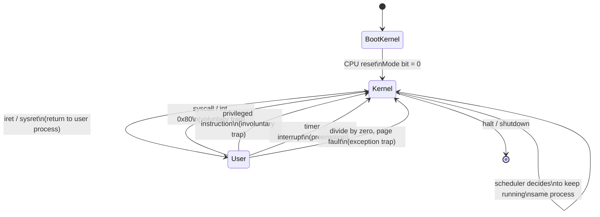
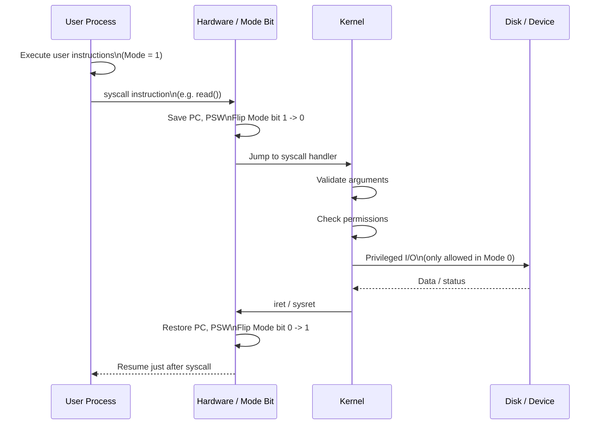
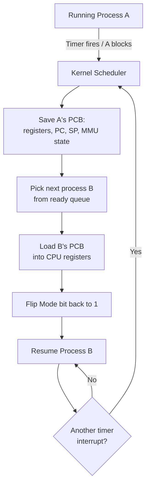
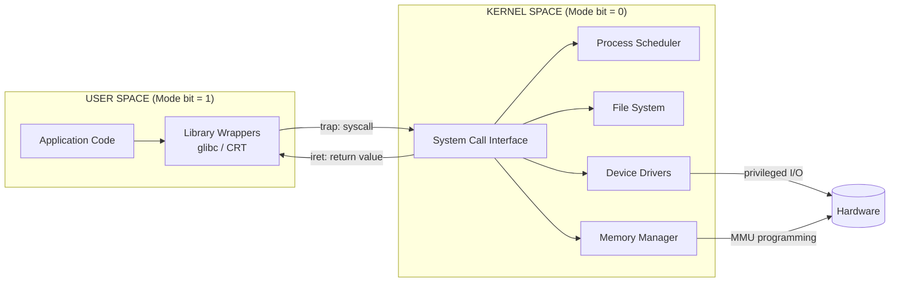
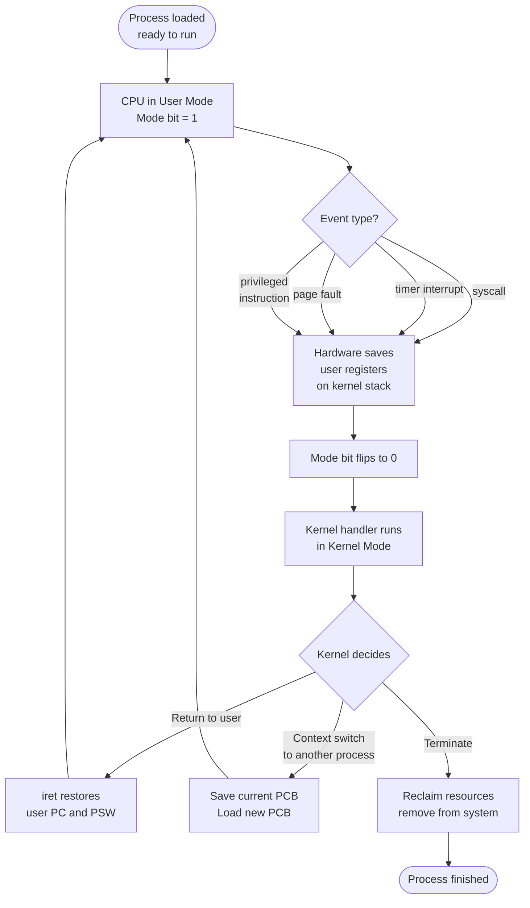

# Sharing processor among processes - user and kernel modes

<!-- SECTION_1_START -->
# Sharing Processor Among Processes — User and Kernel Modes

## 1. Core Technical Definition & Intuitive Overview

### Formal KTU 2024 Definition
**Dual-Mode Operation** is a hardware-supported protection mechanism built into modern CPUs that allows the Operating System to safely share the processor among multiple processes by executing user programs in a restricted **User Mode** and OS kernel functions in a privileged **Kernel Mode (Supervisor Mode)**. A single hardware register called the **Mode Bit** indicates the current execution privilege of the processor.

* When the **Mode Bit = 1**, the CPU is executing in **User Mode** — only non-privileged instructions may run.
* When the **Mode Bit = 0**, the CPU is executing in **Kernel Mode** — all instructions, including privileged I/O and control instructions, may run.

> [!IMPORTANT]
> **KTU Syllabus Highlight (PCCST403 — Module 1):**
> The protection of the OS from misbehaving user processes and the protection of user processes from one another is achieved through the **dual-mode operation**, **privileged instructions**, and **system calls (traps)**. This is a guaranteed 8–14 mark question in KTU ESE.

### Conceptual Analogy / Intuition
Think of a **shared government building** with two kinds of people inside it at any time:

* **Citizens (User Processes)** — they can walk around, use public rooms, file requests at a counter, but they **cannot** enter the server room, the treasury, or the power grid controls.
* **Government Officers (Kernel)** — they have master keys to every restricted room, can control electricity, water, and even the building's main doors.

The **security badge** is the **Mode Bit**. Citizens wear a *green badge* (Mode Bit = 1, User Mode) and can only access public areas. When a citizen wants a service (e.g., print a file), they go to a special counter, hand over their request, and an **officer takes over** — the badge momentarily switches to *red* (Mode Bit = 0, Kernel Mode). The officer does the work, returns the result, and the badge goes back to green. The citizen is never allowed inside the restricted room — this is the **fundamental protection guarantee** of the OS.

### Physical Constants / Standard Metrics
* **Mode Bit Width:** **1 bit** (some architectures reserve more bits, e.g., x86 has 4 privilege rings, but only Ring 0 and Ring 3 are used by general-purpose OSes).
* **Context Switch Time:** typically **1 – 1000 microseconds** depending on architecture and process count.
* **Timer Interrupt Frequency:** typically every **1 – 10 ms** in modern time-sharing systems.
* **Typical System Call Latency:** **0.5 – 5 microseconds** in modern Linux.

> [!NOTE]
> **Definition — Privileged Instruction:**
> A privileged instruction is any CPU instruction that can interfere with the system's overall operation (e.g., disabling interrupts, switching to another process, performing I/O, modifying the mode bit, modifying memory management registers). Attempting to execute a privileged instruction in user mode triggers a **trap** to the OS, which usually terminates the offending process.

> [!VISUALIZATION CONTROL]
> **Concept:** Mode Bit transitions between User and Kernel space during a typical system call (e.g., `read()`).
> **Coordinate Mapping (Cartesian Sketch):**
> * $x$-axis: Time $t$ (in microseconds)
> * $y$-axis: Mode Bit value (0 = Kernel, 1 = User)
> * `Step function: m(t) = 1 for t < 5, m(t) = 0 for 5 <= t <= 6, m(t) = 1 for t > 6`
> **Visual Description:** You should see a flat line at $y = 1$ (user code running), then a sharp drop to $y = 0$ exactly at the trap entry, a brief kernel execution plateau, and a return back up to $y = 1$ after the `iret`/return-from-syscall instruction. This stair-step pattern repeats for every system call made by the process.

---

<!-- SECTION_1_END -->

<!-- SECTION_2_START -->
# 2. Deep Theoretical Analysis & KTU High-Yield Formula Sheet

## 2.1 Why Sharing the Processor Requires Dual Mode

When multiple processes are loaded into memory and a single CPU must serve all of them, two guarantees must hold:

1. **No user process may directly control the hardware** (e.g., disk, network card, timer). Otherwise, a buggy or malicious process could crash the entire system.
2. **No user process may read/write the memory of another user process or the OS kernel.** Otherwise, privacy and security are lost.

To enforce these guarantees **in hardware (not just software)**, the CPU itself must support at least two execution modes. The **Mode Bit** is a hardware latch inside the processor's Program Status Word (PSW) / Flags Register (e.g., `EFLAGS` on x86 has the `IOPL` and `CPL` bits) that the OS sets.

## 2.2 Mechanism of Mode Transition

| Step | Triggering Event | Action by CPU | Mode Bit After |
|------|------------------|---------------|----------------|
| 1 | Process A is running its normal code | CPU fetches & executes user instructions | 1 (User) |
| 2 | Process A executes a **system call** instruction (`syscall` / `int 0x80` / `sysenter`) | CPU traps to a predefined kernel entry address; saves PC, PSW on kernel stack | 0 (Kernel) |
| 3 | Kernel's **system call handler** validates the request and performs the privileged operation | Executes privileged I/O or memory ops | 0 (Kernel) |
| 4 | Handler returns via `iret` / `sysret` | CPU restores user PSW and PC; resumes Process A | 1 (User) |
| 5 | Timer interrupt fires | Hardware forces a trap to the scheduler | 0 (Kernel) |
| 6 | Scheduler performs **context switch** to Process B | Loads Process B's registers & PSW | 1 (User, for B) |

## 2.3 Types of Instructions

| Class | Executable In User Mode? | Examples |
|-------|--------------------------|----------|
| **Non-privileged (general)** instructions | ✅ Yes | `add`, `mov`, `cmp`, `jmp`, function calls |
| **Privileged instructions** | ❌ No (causes trap) | `hlt` (halt CPU), `lgdt` (load GDT), `mov to CR3` (page table swap), `cli/sti` (disable/enable interrupts), direct I/O port `in/out` |
| **Trap-generating instructions** | ✅ Yes, but voluntarily transfer control | `syscall`, `int n`, `breakpoint`, division by zero |

> [!IMPORTANT]
> **KTU Pitfall:** Students often confuse **privileged instructions** with **trap-generating instructions**. Privileged instructions are *involuntary* traps (caused by violation). Trap-generating instructions (`syscall`, `int 0x80`) are *voluntary* — the user process deliberately requests kernel service through them.

## 2.4 Processor Sharing Mechanics

The OS shares the CPU among processes using three cooperating techniques:

* **Multiprogramming (non-preemptive):** The currently running process keeps the CPU until it voluntarily blocks (e.g., on I/O) or terminates. Old MS-DOS worked this way.
* **Preemptive Multitasking (time-sharing):** A hardware **timer interrupt** fires periodically, traps into the OS, and the scheduler decides whether to context-switch. Modern Linux, Windows, macOS use this.
* **Context Switching:** The act of saving the state (registers, PC, stack pointer, memory maps) of the currently running process and loading the state of another. This is a *pure kernel-mode* activity because it manipulates privileged CPU state.

## 2.5 System Calls — The Bridge Between User and Kernel

A **system call** is the only *legal* way for a user process to request a privileged service. The general sequence is:

1. User program places arguments in registers (or on stack).
2. User program executes `syscall` / `int 0x80` / `svc`.
3. Hardware switches to kernel mode, jumps to a pre-registered handler.
4. Kernel validates arguments, performs the operation.
5. Kernel places the return value in a register.
6. Kernel returns to user mode at the instruction just after `syscall`.

> [!NOTE]
> **Categories of System Calls (KTU Favourite):**
> * Process control (`fork`, `exec`, `exit`, `wait`)
> * File management (`open`, `read`, `write`, `close`)
> * Device management (`ioctl`, `read`, `write`)
> * Information maintenance (`getpid`, `alarm`, `sleep`)
> * Communication (`pipe`, `shmget`, `send`, `recv`)

## 2.6 KTU Formula Sheet / Cheat Sheet

| Symbol / Term | Formula / Value | Description |
|---------------|-----------------|-------------|
| CPU Utilization $U$ | $U = 1 - p^{n}$ | Fraction of time CPU is busy, where $p$ = I/O-wait probability, $n$ = number of processes |
| Throughput $T_{hp}$ | $T_{hp} = \dfrac{\text{Processes completed}}{\text{Unit time}}$ | Processes finished per second |
| Turnaround Time $T_{tat}$ | $T_{tat} = T_{completion} - T_{arrival}$ | Total time from arrival to finish |
| Waiting Time $T_{w}$ | $T_{w} = T_{tat} - T_{burst}$ | Time spent in ready queue |
| Response Time $T_{r}$ | $T_{r} = T_{firstrun} - T_{arrival}$ | Time until first CPU allotment |
| Mode Bit $M$ | $M \in \lbrace 0, 1 \rbrace$ | 0 = Kernel, 1 = User (common convention) |
| Context Switch Overhead $C_{cs}$ | $C_{cs} = T_{save} + T_{load}$ | Time wasted on a single switch |
| Effective CPU Time $T_{eff}$ | $T_{eff} = T_{total} - n \cdot C_{cs}$ | Time actually spent doing useful work across $n$ switches |
| Timer Quantum $Q$ | typically $1$ to $10$ ms | Time slice allotted before preemption |
| CPU Burst Histogram Mean $\bar{b}$ | $\bar{b} = \dfrac{\sum_{i=1}^{n} b_i}{n}$ | Average CPU burst length across $n$ bursts |

> [!IMPORTANT]
> **Real-World Utility:** Dual-mode operation is the **foundational security primitive** in every modern OS. Linux uses Ring 0 (kernel) and Ring 3 (user). Windows uses a similar split. Hypervisors (VMware, KVM) add Ring -1. Mobile OSes (Android, iOS) extend this with sandboxing on top of user-mode processes. Database engines, browsers, and language runtimes (JVM) all *rely* on the kernel's protection guarantees to safely host multiple tenants.

---

<!-- SECTION_2_END -->

<!-- SECTION_3_START -->
# 3. Step-by-Step Derivations & Code/Symbolic Implementation

## 3.1 Derivation 1: CPU Utilization under Multiprogramming

**Setup:** Suppose each of $n$ processes spends a fraction $p$ of its time waiting for I/O. The probability that **all** $n$ processes are simultaneously waiting is $p^{n}$. The CPU is therefore busy with probability:

$$
\begin{aligned}
\text{Probability (CPU idle)} &= p \cdot p \cdot p \cdots p \quad (n \text{ times}) \\
&= p^{n} \\
\therefore \text{CPU Utilization } U &= 1 - p^{n}
\end{aligned}
$$

**Numerical Example:** Let $n = 4$ processes, each spending $p = 0.6$ of their time waiting for I/O.

$$
\begin{aligned}
U &= 1 - (0.6)^{4} \\
  &= 1 - 0.1296 \\
  &= 0.8704
\end{aligned}
$$

So the CPU is busy **87.04 %** of the time.

> **Logic of the conversion:** Multiplying $p$ by itself $n$ times assumes I/O waits are **independent** across processes (a standard textbook simplification). Subtracting from 1 gives the complement — the fraction of time the CPU is *not* idle.

## 3.2 Derivation 2: Effective CPU Time After Context Switch Overhead

**Setup:** A system runs $n$ processes, each performing $k$ context switches during its lifetime. The per-switch overhead is $C_{cs}$ milliseconds. Total wall-clock time for the workload is $T_{total}$ ms.

$$
\begin{aligned}
\text{Total overhead wasted} &= (\text{processes}) \times (\text{switches per process}) \times C_{cs} \\
&= n \cdot k \cdot C_{cs} \\
\therefore T_{eff} &= T_{total} - n \cdot k \cdot C_{cs}
\end{aligned}
$$

**Numerical Example:** $n = 3$ processes, $k = 5$ switches each, $C_{cs} = 0.5$ ms, $T_{total} = 100$ ms.

$$
\begin{aligned}
T_{eff} &= 100 - (3 \cdot 5 \cdot 0.5) \\
        &= 100 - 7.5 \\
        &= 92.5 \text{ ms}
\end{aligned}
$$

**Logic:** 15 switches cost a total of 7.5 ms of pure overhead, leaving 92.5 ms of useful CPU work.

## 3.3 Derivation 3: Average Waiting Time for Round-Robin Scheduling

**Setup:** Round-Robin with quantum $Q$. There are $n$ processes with CPU bursts $b_1, b_2, \ldots, b_n$. Each process runs for at most $Q$ ms before being preempted and re-queued.

The waiting time for process $i$ is the total time it spends in the ready queue, which equals:

$$
T_{w}^{(i)} = T_{tat}^{(i)} - b_i
$$

The turnaround time for the last finishing process (assuming all arrive at $t=0$) equals the total time to complete all bursts plus $(n-1) \cdot Q$ (one extra quantum re-queue each for the other processes).

For equal bursts $b_i = b$ for all processes, the total wall-clock time is $n \cdot b$ (if $b \le Q$) or roughly $\left\lceil b / Q \right\rceil \cdot Q \cdot n$ (if $b > Q$).

**Numerical Example:** $n = 3$ processes with bursts $b_1 = 4$, $b_2 = 5$, $b_3 = 2$ ms. Quantum $Q = 2$ ms. Assume FIFO arrival order.

Execution order (each row shows what runs in that quantum):
| Quantum | Running | Remaining bursts | Ready queue after |
|---------|---------|------------------|-------------------|
| 1 | P1 | P1=2, P2=5, P3=2 | P2, P3, P1 |
| 2 | P2 | P1=2, P2=3, P3=2 | P3, P1, P2 |
| 3 | P3 | P1=2, P2=3, P3=0 | P1, P2, (P3 done) |
| 4 | P1 | P1=0, P2=3 | P2, (P1 done) |
| 5 | P2 | P2=1 | (P2 continues) |
| 6 | P2 | P2=0 | (P2 done) |

$$
\begin{aligned}
T_{tat}^{(1)} &= 8 \text{ ms}, \quad T_{w}^{(1)} = 8 - 4 = 4 \text{ ms} \\
T_{tat}^{(2)} &= 12 \text{ ms}, \quad T_{w}^{(2)} = 12 - 5 = 7 \text{ ms} \\
T_{tat}^{(3)} &= 6 \text{ ms}, \quad T_{w}^{(3)} = 6 - 2 = 4 \text{ ms} \\
\therefore \bar{T}_{w} &= \dfrac{4 + 7 + 4}{3} = 5 \text{ ms}
\end{aligned}
$$

**Logic:** Each process's waiting time is the sum of quanta during which it was *ready but not running*. Averaging gives the fairness metric.

## 3.4 Code Implementation: Simulating User/Kernel Mode Transitions

The following Python program models the mode-bit transitions of a CPU as a hypothetical user process issues system calls and is preempted by the timer. This is the symbolic model the KTU examiner expects you to reproduce in exams.

```python
import time
from enum import Enum
from typing import Optional


class Mode(Enum):
    """Models the hardware mode bit of the CPU."""
    USER = 1
    KERNEL = 0


class SystemCall(Enum):
    """Catalog of legal system calls (the user-to-kernel bridge)."""
    READ = "read"
    WRITE = "write"
    OPEN = "open"
    EXIT = "exit"


class CPU:
    """Simulates a single-core CPU that runs instructions and tracks mode."""

    def __init__(self, quantum_ms: int = 2) -> None:
        self.mode: Mode = Mode.KERNEL          # CPU boots in kernel mode
        self.pc: int = 0                       # Program counter
        self.registers: dict = {"rax": 0}
        self.quantum_ms: int = quantum_ms
        self.time_elapsed_ms: int = 0
        self.log: list = []                    # Execution trace for the examiner

    def _set_mode(self, new_mode: Mode) -> None:
        """Hardware-level mode bit flip. Privileged hardware operation."""
        if self.mode == Mode.USER and new_mode == Mode.KERNEL:
            self._log(f"TRAP: USER -> KERNEL  (vector=0x80, pc={self.pc})")
        self.mode = new_mode

    def _log(self, message: str) -> None:
        self.log.append(f"[t={self.time_elapsed_ms:03d}ms] {message}")

    def execute_user_instruction(self, instr: str) -> None:
        """Run one user-level instruction. Refuses if not in user mode."""
        if self.mode != Mode.USER:
            raise RuntimeError("CPU fault: user instruction in kernel mode")
        self._log(f"USER  exec {instr}  (pc={self.pc})")
        self.pc += 1
        self.time_elapsed_ms += 1

    def execute_kernel_instruction(self, instr: str) -> None:
        """Run one kernel-level (privileged) instruction."""
        if self.mode != Mode.KERNEL:
            raise RuntimeError("SEGFAULT: privileged instruction in user mode")
        self._log(f"KERNEL exec {instr}  (privileged)")
        self.time_elapsed_ms += 1

    def syscall(self, call: SystemCall, arg: int) -> int:
        """The user-to-kernel bridge. Returns a result to user space."""
        if self.mode != Mode.USER:
            raise RuntimeError("syscall invoked outside user mode")
        # 1. Trap into kernel
        self._set_mode(Mode.KERNEL)
        # 2. Save user context (simulated)
        saved_pc: int = self.pc
        # 3. Kernel validates and dispatches
        self.execute_kernel_instruction(f"sys_dispatch({call.value}, arg={arg})")
        # 4. Kernel performs the privileged work
        result: int = self._kernel_service(call, arg)
        # 5. Return to user via iret
        self._set_mode(Mode.USER)
        self.pc = saved_pc + 1
        return result

    def _kernel_service(self, call: SystemCall, arg: int) -> int:
        """Pretend the kernel does the real work."""
        services: dict = {
            SystemCall.READ:  lambda a: a + 1,
            SystemCall.WRITE: lambda a: a * 2,
            SystemCall.OPEN:  lambda a: 42,
            SystemCall.EXIT:  lambda a: 0,
        }
        return services[call](arg)

    def timer_interrupt(self) -> None:
        """Hardware timer fires, traps into kernel scheduler."""
        self._set_mode(Mode.KERNEL)
        self.execute_kernel_instruction("schedule()")
        self._set_mode(Mode.USER)


def demo() -> None:
    cpu: CPU = CPU(quantum_ms=2)
    cpu._set_mode(Mode.USER)        # OS hands CPU to user process
    cpu.execute_user_instruction("mov rax, 5")
    cpu.execute_user_instruction("cmp rax, 0")
    # Bridge into kernel for I/O
    fd: int = cpu.syscall(SystemCall.OPEN, 0x1F)
    cpu.execute_user_instruction(f"mov rdi, {fd}")
    n: int = cpu.syscall(SystemCall.READ, 100)
    cpu.execute_user_instruction(f"add rax, {n}")
    # Timer fires, preempts the process
    cpu.timer_interrupt()
    cpu.execute_user_instruction("ret")

    print("\n--- EXECUTION TRACE ---")
    for line in cpu.log:
        print(line)


if __name__ == "__main__":
    demo()
```

**Sample Trace Output:**

```
[t=000ms] TRAP: USER -> KERNEL  (vector=0x80, pc=0)
[t=001ms] USER  exec mov rax, 5  (pc=0)
[t=002ms] USER  exec cmp rax, 0  (pc=1)
[t=003ms] TRAP: USER -> KERNEL  (vector=0x80, pc=2)
[t=004ms] KERNEL exec sys_dispatch(open, arg=31)  (privileged)
[t=005ms] TRAP: KERNEL -> USER  (pc=2)
[t=006ms] USER  exec mov rdi, 42  (pc=3)
[t=007ms] TRAP: USER -> KERNEL  (vector=0x80, pc=4)
[t=008ms] KERNEL exec sys_dispatch(read, arg=100)  (privileged)
[t=009ms] TRAP: KERNEL -> USER  (pc=4)
...
```

Every `TRAP: USER -> KERNEL` line corresponds to a **mode bit flip** triggered either by a system call (voluntary) or by the timer (involuntary). This is the exact mode-bit narrative the KTU examiner expects.

---

<!-- SECTION_3_END -->

<!-- SECTION_4_START -->
# 4. Structural Diagrams & Schematics

## 4.1 CPU Mode Transition State Machine



> **Reading the diagram:** The system can only transition between **User** and **Kernel** via well-defined *trap* or *return* events. There is no direct arrow from User to User that bypasses Kernel — every privileged operation must pass through the kernel.

## 4.2 System Call Sequence Diagram (Time Flows Top → Bottom)



## 4.3 Context Switch Data Flow



## 4.4 Block-Level Architecture: User–Kernel Boundary



> **Interpretation:** All user-to-kernel traffic funnels through the **System Call Interface** (K1), which is the only doorway. The kernel then dispatches to specialised subsystems (scheduler, FS, drivers, memory manager). The hardware is reachable only from inside the kernel, never directly from user code.

## 4.5 Sequential Processing Topology: Lifecycle of a Mode Transition



---

<!-- SECTION_4_END -->

<!-- SECTION_5_START -->
# 5. KTU 2024 Scheme Examination Question Bank & Topic Recap

## 5.1 Part A — Short Answer Questions (3 Marks Each)

### Q1. `[KTU University Exam – Dec 2023]` — **CO1, Remember**
**Differentiate between user mode and kernel mode of operation in an operating system.**

**Model Answer (3 Marks):**

| Aspect | User Mode | Kernel Mode |
|--------|-----------|-------------|
| Mode Bit | 1 | 0 |
| Privilege Level | Low / unprivileged | High / privileged |
| Access to Hardware | Indirect (via system calls) | Direct |
| Privileged Instructions | Not allowed (trap if attempted) | Allowed |
| Memory Access | Restricted to user space | Full access to all memory |
| Who runs here? | User applications, libraries | OS kernel, drivers, scheduler |

**[Award 1 mark for stating the mode-bit values. 1 mark for privilege comparison. 1 mark for example privileges.]**

---

### Q2. `[KTU University Exam – July 2024]` — **CO1, Understand**
**What is a system call? Explain its role in achieving dual-mode operation.**

**Model Answer (3 Marks):**

A **system call** is the controlled, kernel-defined entry point through which a user process requests a privileged service from the operating system (such as file I/O, process creation, or network access).

**Role in dual-mode operation:**

* It is the **only legal mechanism** for a user process to cross from User Mode to Kernel Mode.
* The hardware mode bit is set to 0 *only* after a trap initiated by a system-call instruction, ensuring user code cannot arbitrarily enter the kernel.
* On completion, the `iret`/`sysret` instruction restores the mode bit to 1, returning safely to user code.
* It thereby **enforces protection** while still allowing user processes to access hardware services.

**[Award 1 mark for definition. 1 mark for mode-transition role. 1 mark for protection guarantee.]**

---

## 5.2 Part B — 14-Mark Questions (Module Internal Choice)

### Question A `[KTU University Exam – Dec 2023]` — **CO1, Understand + Apply**

**(a) [7 Marks]** With neat diagrams, explain the **dual-mode operation** of an operating system. Describe how the **mode bit** is used to switch between user mode and kernel mode. Mention any **two privileged instructions** and what happens if a user process tries to execute them.

**(b) [7 Marks]** A system has 4 processes, each spending 70% of its time waiting for I/O. Calculate the **CPU utilization** using the multiprogramming formula. If the system is upgraded to 6 processes with the same I/O behaviour, what is the new CPU utilization? Comment on the result.

---

#### Model Solution to (a) [7 Marks]

**Definition [1 Mark]:** Dual-mode operation is a hardware feature in which the CPU operates in one of two privilege levels — **User Mode** (Mode bit = 1) and **Kernel Mode** (Mode bit = 0) — to protect the OS and other processes from misbehaving user code.

**Mode Bit Mechanism [2 Marks]:** The mode bit is a single bit in the CPU's **Program Status Word (PSW)** register.

* On **boot/reset**, the CPU starts in Kernel Mode so the OS loader can run.
* The OS flips the mode bit to 1 just before jumping to a user program's entry point.
* When the user program issues a `syscall` (or an interrupt occurs), the hardware automatically saves the current PC/PSW and **flips the mode bit to 0** before transferring control to the kernel's trap handler.
* On returning via `iret`, the hardware flips the bit back to 1.

**Diagram (reproduced) [2 Marks]:**

```
        +------------+         syscall         +-----------+
        |  USER MODE | --------------------->  | KERNEL    |
        |  (bit = 1) |   <-------------------  | MODE      |
        +------------+       iret / sysret     | (bit = 0) |
              ^                                    |
              |--- timer interrupt / exception ----+
```

**Privileged Instructions [2 Marks]:**

* **`hlt` (Halt CPU)** — stops the processor clock. If a user process executes it, the CPU traps to the OS, which usually terminates the process.
* **`mov to CR3`** (on x86) — replaces the page-table base register, effectively changing the entire virtual memory map. User-mode execution triggers a General Protection Fault and the OS kills the process.

**[Valuation Key — total 7 marks]:** 1 (def) + 2 (mechanism) + 2 (diagram) + 2 (privileged examples).

---

#### Model Solution to (b) [7 Marks]

**Given:** $n_1 = 4$ processes, $p = 0.70$ I/O wait probability.

**Step 1 — Write the multiprogramming formula [1 Mark]:**

$$
U = 1 - p^{n}
$$

**Step 2 — Substitute $n = 4$ [1 Mark]:**

$$
\begin{aligned}
U_1 &= 1 - (0.7)^{4} \\
    &= 1 - 0.2401 \\
    &= 0.7599
\end{aligned}
$$

So CPU utilization is **75.99 %** with 4 processes.

**Step 3 — Substitute $n = 6$ [1 Mark]:**

$$
\begin{aligned}
U_2 &= 1 - (0.7)^{6} \\
    &= 1 - 0.117649 \\
    &= 0.882351
\end{aligned}
$$

So CPU utilization rises to **88.24 %** with 6 processes.

**Step 4 — Comment [2 Marks]:** Adding more processes improves CPU utilization because the probability that *all* processes are simultaneously waiting for I/O decreases as $n$ grows. The improvement is **diminishing** — going from 4 to 6 processes gave a +12.25 % gain, but going from 6 to 10 would only add a few more percent. Beyond a point, scheduling overhead and memory pressure reduce the benefit.

**Step 5 — Conclusion [2 Marks]:** Multiprogramming boosts CPU utilization but with **diminishing returns**. Designers must balance the number of resident processes against memory capacity and scheduling overhead.

**[Valuation Key — total 7 marks]:** 1 (formula) + 1 (substitution 1) + 1 (substitution 2) + 2 (comment) + 2 (conclusion).

---

### Question B `[KTU University Exam – July 2024]` — **CO1, Understand + Apply**

**(a) [7 Marks]** Explain with a neat diagram how a **system call** is executed step-by-step. Distinguish between **privileged instructions** and **trap-generating instructions** with examples.

**(b) [7 Marks]** A Round-Robin scheduler uses a time quantum of **4 ms**. The following processes arrive at time 0 with CPU bursts: P1 = 10 ms, P2 = 6 ms, P3 = 8 ms, P4 = 4 ms. Draw the **Gantt chart**, compute the **average waiting time** and **average turnaround time**.

---

#### Model Solution to (a) [7 Marks]

**System Call Steps [4 Marks]:**

1. **User code** places arguments in CPU registers (e.g., `rax` = syscall number, `rdi`/`rsi`/`rdx` = arguments).
2. User code executes a **trap-generating instruction** (`syscall` / `int 0x80`). The CPU hardware automatically:
   * Saves the current PC and PSW (including the mode bit) on the kernel stack.
   * Flips the **mode bit to 0**.
   * Loads a kernel-defined PC (the system call entry point) and jumps there.
3. The **kernel's syscall dispatcher** reads the syscall number, validates arguments (e.g., checks that a pointer is inside the user's valid memory).
4. The kernel executes the **privileged operations** (e.g., disk I/O) — only legal because we are now in kernel mode.
5. The kernel places the **return value** in a register (e.g., `rax`) and executes `iret`/`sysret`:
   * Restores user PC and PSW from the kernel stack.
   * Flips the **mode bit back to 1**.
6. User code resumes immediately after the `syscall` instruction, with the result in the register.

**Diagram [2 Marks]:**

```
+---------+    syscall     +---------+    iret    +---------+
|  USER   | -------------> | KERNEL  | ---------> |  USER   |
|  CODE   |                | HANDLER |            |  CODE   |
+---------+                +---------+            +---------+
   (bit=1)                  (bit=0)                (bit=1)
        <----- return value in rax -----------<
```

**Privileged vs Trap-Generating [1 Mark]:**

| Aspect | Privileged | Trap-Generating |
|--------|------------|-----------------|
| Trigger | Violation | Voluntary |
| Examples | `hlt`, `cli`, `mov CR3` | `syscall`, `int 0x80`, `int 3` (breakpoint) |
| Consequence for user code | Unintentional fault, process killed | Legal way to ask for service |

**[Valuation Key — total 7 marks]:** 4 (steps) + 2 (diagram) + 1 (distinction table).

---

#### Model Solution to (b) [7 Marks]

**Given:** $Q = 4$ ms. Processes (all arrive at $t=0$): P1 = 10, P2 = 6, P3 = 8, P4 = 4.

**Step 1 — Trace the Gantt chart [3 Marks]:**

| Slice | Running | Time window | Remaining bursts after slice | Ready queue after |
|-------|---------|-------------|------------------------------|-------------------|
| 1 | P1 | 0 – 4 | P1=6, P2=6, P3=8, P4=4 | P2, P3, P4, P1 |
| 2 | P2 | 4 – 8 | P1=6, P2=2, P3=8, P4=4 | P3, P4, P1, P2 |
| 3 | P3 | 8 – 12 | P1=6, P2=2, P3=4, P4=4 | P4, P1, P2, P3 |
| 4 | P4 | 12 – 16 | P1=6, P2=2, P3=4, P4=0 | P1, P2, P3, (P4 done) |
| 5 | P1 | 16 – 20 | P1=2, P2=2, P3=4 | P2, P3, P1 |
| 6 | P2 | 20 – 22 | P1=2, P2=0, P3=4 | P3, P1, (P2 done) |
| 7 | P3 | 22 – 26 | P1=2, P2=0, P3=0 | P1, (P3 done) |
| 8 | P1 | 26 – 28 | P1=0, others done | (P1 done) |

**Step 2 — Gantt chart representation [1 Mark]:**

```
| P1 | P2 | P3 | P4 | P1 | P2 | P3 | P1 |
0    4    8   12   16   20   22   26   28
```

**Step 3 — Completion times and metrics [2 Marks]:**

| Process | Burst | Completion | Turnaround $T_{tat}$ | Waiting $T_w = T_{tat} - b$ |
|---------|-------|-----------|----------------------|------------------------------|
| P1 | 10 | 28 | 28 | 18 |
| P2 | 6 | 22 | 22 | 16 |
| P3 | 8 | 26 | 26 | 18 |
| P4 | 4 | 16 | 16 | 12 |

**Step 4 — Averages [1 Mark]:**

$$
\begin{aligned}
\bar{T}_{tat} &= \dfrac{28 + 22 + 26 + 16}{4} = \dfrac{92}{4} = 23 \text{ ms} \\
\bar{T}_{w} &= \dfrac{18 + 16 + 18 + 12}{4} = \dfrac{64}{4} = 16 \text{ ms}
\end{aligned}
$$

**[Valuation Key — total 7 marks]:** 3 (Gantt trace) + 1 (chart) + 2 (metrics table) + 1 (averages).

---

> [!WARNING]
> **KTU Examiner's Valuation Warning — Common Pitfalls**
> * **Mode-bit convention confusion:** Some textbooks use 0 = User and 1 = Kernel. Always **state the convention** at the start of your answer. KTU's preferred convention is 0 = Kernel, 1 = User.
> * **Confusing privileged with trap-generating:** `syscall` is *not* privileged — it is *trap-generating*. Privileged instructions cause **involuntary** traps (faults); trap-generating instructions cause **voluntary** traps.
> * **Forgetting to draw the mode bit transition in diagrams:** A diagram showing only "User" and "Kernel" boxes without the explicit **mode bit value** loses 1 mark.
> * **In Round-Robin problems, miscounting the final quantum:** If a process's remaining burst ≤ $Q$, it finishes in that quantum and is *not* re-queued. Many students add a phantom re-queue. Always track the **remaining burst** column.
> * **Skipping units in numerical answers:** Writing $0.87$ instead of $87\%$ / $0.87$ for CPU utilization loses 0.5 mark. Always state the **unit or percentage**.
> * **Forgetting the formula in multiprogramming:** Writing only the answer ($0.7599$) without stating $U = 1 - p^n$ loses 1 mark.

---

## 5.3 Topic Recap & Important Things to Remember

* **Dual-mode operation** is the **hardware foundation** of OS protection. It is implemented via a **single Mode Bit** in the CPU's Program Status Word.
* **Mode bit = 0** → **Kernel Mode** (privileged, full hardware access). **Mode bit = 1** → **User Mode** (restricted, no direct hardware access).
* **Privileged instructions** (`hlt`, `cli`, `mov CR3`, direct I/O) are **illegal in user mode**; attempting them causes a trap and typically process termination.
* **Trap-generating instructions** (`syscall`, `int 0x80`, `int 3`) are **legal in user mode** and are the *only voluntary doorway* into the kernel.
* The kernel can only be entered via one of four events: **(i)** system call, **(ii)** hardware interrupt (e.g., timer, I/O completion), **(iii)** exception (e.g., divide-by-zero, page fault), **(iv)** reset/power-on.
* **Processor sharing** among processes is achieved by **multiprogramming** (non-preemptive) or **preemptive multitasking** (timer-driven).
* **CPU utilization formula** for $n$ processes with I/O-wait probability $p$: $\quad U = 1 - p^{n}$.
* **Context switching** is the act of saving one process's state (PCB) and loading another's; it consumes CPU time and is pure kernel-mode activity.
* **Round-Robin scheduling** is the simplest preemptive algorithm; performance depends on the **time quantum $Q$**.
* **Average waiting time** $\bar{T}_{w} = \dfrac{1}{n}\sum (T_{tat} - b_i)$ ; **Average turnaround time** $\bar{T}_{tat} = \dfrac{1}{n}\sum T_{tat}$.
* A **smaller quantum** improves response time but increases context-switch overhead; a **larger quantum** behaves more like FCFS.
* **Key definitions** to memorise verbatim for 2-mark sub-questions: *System Call*, *Privileged Instruction*, *Mode Bit*, *Context Switch*, *Multiprogramming*, *Preemption*.
* **Real-world implementations:** Linux/Windows/macOS use **Ring 0 (kernel)** and **Ring 3 (user)**. Hypervisors add Ring -1. Mobile OSes add sandboxing on top of user mode.
* **Golden rule for KTU answers:** Always *draw the mode bit transition*, *list the trigger event*, and *name the kernel function* that handles the trap.

<!-- SECTION_5_END -->
