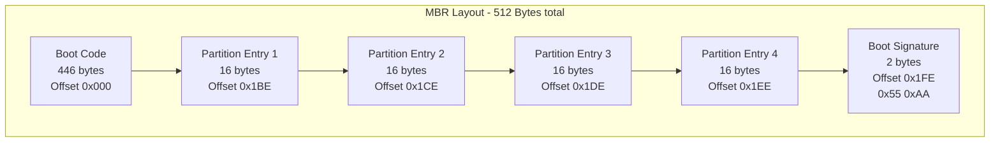
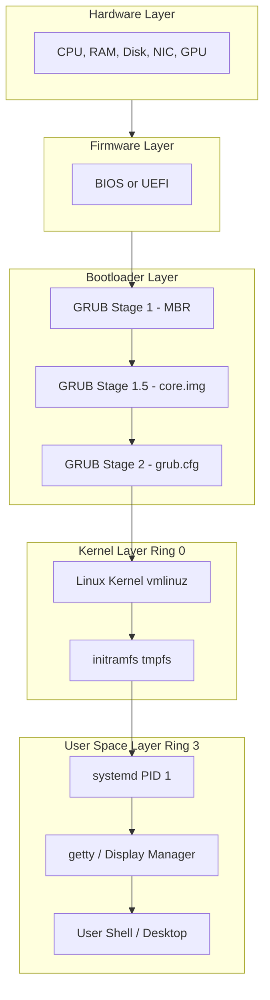

# System boot sequence

<!-- SECTION_1_START -->
# System Boot Sequence — Core Technical Definition & Intuitive Overview

> [!NOTE]
> **KTU 2024 Scheme | Course:** PCCST403 — Operating Systems | **Module 1** | **Topic:** System Boot Sequence

## 1.1 Formal Academic Definition (KTU Syllabus Terminology)

The **System Boot Sequence** (also called the **Bootstrap Process** or **Bootstrapping**) is the carefully orchestrated series of well-defined initialization routines that a computer system executes, right from the instant electrical power is supplied to the machine, until the **Operating System (OS) kernel is fully loaded into Random Access Memory (RAM)**, control is transferred to it, and a user login prompt or graphical shell becomes available. This procedure bridges the gap between *raw, uninitialized hardware* and a *fully operational, programmable computing environment*.

In the **KTU 2024 Operating Systems syllabus**, the boot sequence is formally broken down into four canonical phases:

1. **Power-On & Hardware Initialization (POST)**
2. **Firmware Hand-off (BIOS / UEFI)**
3. **Bootloader Stage 1 → Stage 2 (GRUB / LILO / Windows Boot Manager)**
4. **Kernel Loading, Initialization & User-Space Hand-off**

## 1.2 Conceptual Analogy — "A Day in the Life of a Computer"

Imagine you (the **CPU/RAM**) have been **fast asleep** for many years, lying in a dark room. You have no idea who you are, where you are, or what language you speak.

- **Pressing the power button** is like an alarm clock ringing — your eyes open (electricity flows), but you still don't remember anything.
- **POST (Power-On Self-Test)** is the doctor checking your heartbeat, blood pressure, and reflexes — it verifies that your body parts (keyboard, RAM, disk, GPU) are *present and functional*.
- **BIOS/UEFI** is the **"Read Me First" instruction card** left on your nightstand — it tells you where to look for your identity (boot device).
- **Bootloader (GRUB)** is the **GPS navigator** — it reads the map (MBR/GPT) and drives you toward the correct destination (the OS).
- **Kernel Loading** is your brain fully booting up — taking control, allocating memory, and starting background services.
- **Login Prompt / Desktop** is you finally opening the door, fully awake, ready to begin work.

> [!IMPORTANT]
> **KTU High-Yield Fact (Favourite 2-Mark Question):** The very first instruction executed by an x86 CPU after power-on is located at physical memory address `0xFFFFFFF0` — the **Reset Vector** — which points into the **firmware ROM** (BIOS or UEFI). The CPU is hard-wired to begin execution from this address.

## 1.3 The Boot Spectrum — Cold, Warm, and Hot Booting

| Term | Trigger | POST Executed? | RAM Cleared? | Speed |
|------|---------|----------------|--------------|-------|
| **Cold Boot** | Power button pressed from OFF state | Yes (Full POST) | Yes | Slowest |
| **Warm Boot** | `Ctrl+Alt+Del` or `shutdown /r` | Partial / Skipped | Partially retained | Fast |
| **Soft / Hot Boot** | OS-initiated restart (e.g., `reboot` command) | Minimal | No | Fastest |

## 1.4 GeoGebra / Desmos Visualization — Boot Timeline as a Step Function

> [!VISUALIZATION CONTROL]
> **Concept:** Visualize the boot sequence as a discrete step function showing memory residency transitions over time.
> **GeoGebra / Desmos Input Equations:**
> * `f(x) = piecewise(0 <= x <= 1, 0, 1 < x <= 2, 1, 2 < x <= 3, 2, 3 < x <= 4, 3, 4 < x <= 5, 4, 5)`
> **Visual Description:** A staircase plot where the y-axis (0–4) represents the **stage index** (0=Firmware, 1=POST, 2=Bootloader Stage 1, 3=Bootloader Stage 2, 4=Kernel loaded) and the x-axis represents the **relative time elapsed during boot**. Students should observe the *monotonically non-decreasing* nature — the system never goes "backwards" during a successful boot.

---

<!-- SECTION_1_END -->

<!-- SECTION_2_START -->
# Deep Theoretical Analysis & KTU High-Yield Formula Sheet

## 2.1 Stage-by-Stage Operational Breakdown

### 🔌 Stage 0 — Power Stabilization (t = 0 ms)
- The **Power Supply Unit (PSU)** receives AC input and uses a **rectifier + capacitor + voltage regulator** to deliver stable DC rails: **+3.3 V, +5 V, +12 V**.
- The **Power Good (PG) signal** (a wired-OR line on pin 8 of the ATX connector) is asserted **only after all voltages stabilize within a ±5 % tolerance** for a minimum of **100 ms** (per Intel ATX specification).
- The CPU's **Reset line is held LOW** until the PG signal goes HIGH, guaranteeing the CPU does not execute garbage instructions during voltage ramp-up.

### 🧠 Stage 1 — POST (Power-On Self-Test)
- The **CPU's Instruction Pointer (IP/EIP/RIP)** is forcibly set to the **Reset Vector**.
- The firmware executes a battery of diagnostic tests:
  * **Video BIOS initialization** — the screen lights up (this is why you see the manufacturer logo first).
  * **RAM counting test** — memory is written with patterns (e.g., `0xAA55AA55`) and read back.
  * **Keyboard, Mouse, Disk, Network controller presence check** — using a bus enumeration over **PCIe / PCI / ISA / USB**.
  * **SMBIOS / DMI data** is read to display system info.
- On failure, a **POST code** is written to port `0x80` and a series of **beep codes** is emitted (e.g., AMI BIOS: *3 short beeps* = memory failure).

### 💾 Stage 2 — BIOS vs. UEFI Firmware Hand-off

#### 2.1 Legacy BIOS Mode
- **BIOS** (Basic Input/Output System) is **16-bit real mode** firmware stored on a **EEPROM/Flash ROM** chip on the motherboard.
- It scans the **MBR (Master Boot Record)** — the **first 512 bytes** of the configured boot device — containing:
  * **Boot Code** (446 bytes)
  * **Partition Table** (4 × 16 bytes = 64 bytes)
  * **Magic Number** (`0xAA55`, the last 2 bytes)
- The BIOS loads the 446-byte boot code into RAM at address `0x0000:0x7C00` and jumps to it.
- **Limitation:** Disk size ≤ **2.2 TB** (due to 32-bit LBA), 4 primary partitions, 16-bit code.

#### 2.2 Modern UEFI Mode
- **UEFI** (Unified Extensible Firmware Interface) is **32-bit or 64-bit protected mode** firmware.
- It reads the **GPT (GUID Partition Table)** from the disk.
- Boot loaders are stored as **`.efi` files** in a dedicated **EFI System Partition (ESP)** — typically FAT32, mounted at `/boot/efi`.
- **Advantages:** Disks > 2 TB, **Secure Boot** (signature verification), **CSM (Compatibility Support Module)** for legacy emulation, graphical mouse-driven setup.

### 🥾 Stage 3 — Bootloader Execution (The Two-Stage Hand-off)

| Stage | Size | Role | Example |
|-------|------|------|---------|
| **Stage 1** (MBR / Volume Boot Record) | 512 bytes – 32 KB | Fits in the tiny space; locates and loads Stage 2 | `boot.img` (GRUB) |
| **Stage 1.5** (Optional) | ~30 KB | Bridges the filesystem gap (contains enough FS drivers to read `/boot`) | `core.img` |
| **Stage 2** | Full filesystem | Presents menu, loads kernel + initramfs into RAM, passes control | `/boot/grub2/grub.cfg` |

> [!IMPORTANT]
> **Why two stages?** Stage 1 has no filesystem drivers. It cannot read `/boot/grub/`. Stage 1.5 fits into the empty space *between* the MBR and the first partition (a historical gap of **~32 KB**) and embeds a minimal filesystem (e.g., **ext2**) driver, allowing it to find Stage 2.

### ⚙️ Stage 4 — Kernel Loading & User-Space Hand-off
1. The bootloader (GRUB Stage 2) decompresses the **kernel image** (e.g., `vmlinuz-5.15.0`) into RAM.
2. It also loads **`initramfs`** (initial RAM filesystem) — a compressed `cpio` archive containing critical drivers needed to mount the real root filesystem.
3. Control jumps to the kernel's **entry point** (`start_kernel()` in Linux).
4. The kernel:
   * Initializes **schedulers, memory management (MMU), VFS, networking stacks, ACPI**.
   * Mounts the **real root filesystem** (`/`).
   * Executes the **first user-space process** — historically `init` (PID 1), now `systemd` (PID 1) on most modern Linux distros.
5. `systemd` reads unit files and brings the system to the desired **runlevel / target** (`multi-user.target` or `graphical.target`).

## 2.2 KTU Formula Sheet / Cheat Sheet

| Concept | Key Value / Formula | Significance |
|---------|---------------------|--------------|
| MBR Size | $512 \text{ bytes} = 446 + 64 + 2$ | Boot code + Partition Table + Magic |
| MBR Magic Number | $\text{0xAA55}$ | Validates MBR signature |
| Reset Vector (x86) | $\text{0xFFFFFFF0}$ | CPU's first execution address |
| Boot Code Load Address | $\text{0x0000:0x7C00}$ | Where BIOS places MBR |
| Power Good Delay | $\geq 100 \text{ ms}$ | ATX spec stabilization time |
| Max Disk (BIOS/MBR) | $2^{32} \times 512 \text{ B} \approx 2.2 \text{ TB}$ | LBA28 limit |
| Sector Size | $512 \text{ B}$ (logical), $4096 \text{ B}$ (physical in Advanced Format) | Disk block size |
| Partition Entry Size | $16 \text{ bytes}$ | In MBR partition table |
| Page Size (default) | $4 \text{ KiB} = 2^{12} \text{ B}$ | x86 standard paging |

## 2.3 Real-World Engineering Utility

- **DevOps / SRE:** Understanding GRUB is essential to **rescue broken systems** using `grub-rescue>` or `chroot` from a live USB.
- **Embedded Systems:** IoT devices often use **U-Boot** (a stripped-down bootloader) over bare BIOS.
- **Security:** **Secure Boot (UEFI)** blocks unsigned bootloaders, mitigating **rootkits/bootkits** (e.g., *BlackLotus*, *TrickBot*).
- **Cloud Computing:** Virtual machines (KVM, VMware) emulate the entire boot sequence using **OVMF** (Open Virtual Machine Firmware) — without correct firmware emulation, the VM cannot boot.
- **Forensics:** Investigators image the **MBR/GPT** to detect tampering and trace the boot chain.

---

<!-- SECTION_2_END -->

<!-- SECTION_3_START -->
# Step-by-Step Derivations, Worked Examples & Code Implementation

## 3.1 Exhaustive Walkthrough — A Linux Boot from Cold State

Let us trace a complete Linux boot, step by step, with the technical reasoning for each transition.

**Step 1 — Power On.**
The user presses the ATX power button. The PSU begins converting **AC 230 V / 50 Hz** (India standard) to **DC +12 V, +5 V, +3.3 V** rails. Bulk capacitors charge. After voltages stabilize, the **Power Good (PG)** signal transitions from LOW to HIGH. This de-asserts the CPU's **RESET#** pin.

**Step 2 — CPU Begins Execution at Reset Vector.**
The CPU's Instruction Pointer is hard-wired to fetch its first instruction from physical address:

$$\text{Physical Address} = \text{0xFFFFFFF0}$$

This address is mapped to the **firmware flash ROM** on the motherboard. The first instruction is typically a **long jump** (`jmp far ptr`) to the actual BIOS/UEFI initialization code located elsewhere in the ROM (since 16 bytes is too small for full initialization).

**Step 3 — POST Execution.**
The firmware performs:

$$\text{POST} = \sum_{i=1}^{n} \text{DeviceTest}_i + \text{ResourceAllocation}$$

- Writes a diagnostic **POST code** to I/O port `0x80` (a legacy debug port).
- Initializes the **Programmable Interrupt Controller (PIC)**, **Direct Memory Access (DMA)** controller, and **Programmable Interval Timer (PIT)**.
- Counts RAM by writing alternating bit patterns and reading them back:

$$\text{RAMTest}(a, n) = \bigwedge_{i=0}^{n-1} \Big( \text{write}(a+i, \text{pattern}) \oplus \text{read}(a+i) \Big) = 0 \iff \text{PASS}$$

**Step 4 — Locate Boot Device.**
The firmware consults the **CMOS/BIOS NVRAM** (battery-backed RAM) for the configured **boot order** (e.g., `USB → SATA0 → Network`). It performs a bus scan (PCIe enumeration) to find a bootable device.

**Step 5 — Load First 512 Bytes (Legacy BIOS Path).**
The firmware issues **ATA / SCSI READ SECTOR 0** commands:

$$\text{Read}(LBA=0, \text{count}=1, \text{buffer}=\text{0x7C00})$$

The 512 bytes are verified to end with the bytes `0x55 0xAA` (little-endian representation of the magic number `0xAA55`).

**Step 6 — Transfer Control to MBR Code.**
The CPU performs:

$$\text{CS:IP} \leftarrow \text{0x0000:0x7C00}, \quad \text{FLAGS} \leftarrow \text{cleared}$$

The MBR code now runs. It re-reads the partition table entries to identify the **active partition**, computes its starting LBA, and loads its **Volume Boot Record (VBR)** — which is, in the case of GRUB, the **Stage 1.5** image located in the disk gap.

**Step 7 — GRUB Stage 1.5 (core.img).**
Loaded from the post-MBR gap (typically LBA 1 to LBA 62). It contains a tiny **ext2 driver** so that it can read files from `/boot/grub/`. It mounts the `/boot` filesystem in-memory.

**Step 8 — GRUB Stage 2 (`/boot/grub2/grub.cfg`).**
Stage 2 reads its configuration file, displays a menu, and on user selection (or timeout), locates the kernel:

$$\text{linux } /boot/vmlinuz-5.15.0 \text{ root=UUID=... ro quiet}$$

and the **initramfs** image:

$$\text{initrd } /boot/initramfs-5.15.0.img$$

Both are decompressed and loaded into RAM.

**Step 9 — Hand-off to Kernel.**
GRUB calls the Linux kernel entry point. The kernel:

1. Decompresses itself (if `vmlinuz` was gzip/bzip2/xz compressed).
2. Initializes `start_kernel()` in `init/main.c`.
3. Sets up **interrupt descriptor tables (IDT)**, **global descriptor tables (GDT)**, **memory management** (page tables), **slab allocators**.
4. Mounts the **initial root filesystem** from `initramfs` (a `tmpfs`).
5. The `init` process inside `initramfs` loads essential block-device modules (e.g., `ahci`, `nvme`, `ext4`) to mount the **real** root filesystem.
6. `pivot_root` swaps the temporary root with the real one.
7. The real `/sbin/init` (or `/lib/systemd/systemd`) — **PID 1** — is executed.

**Step 10 — User Space Comes Alive.**
`systemd` reads unit files from `/etc/systemd/system/` and `/lib/systemd/system/`, starts services in parallel based on dependency graphs, and finally spawns a **getty** (text login) or **display manager** (GDM, LightDM) at the configured target.

## 3.2 Python Simulation — Mini Boot Sequence State Machine

The following Python code models a deterministic state machine of the boot sequence, with strict type hints, explicit error handling, and observable state transitions. It is a teaching tool to make the abstract flow concrete.

```python
"""
mini_boot_simulator.py
A pedagogical simulation of the OS boot sequence state machine.
Each state corresponds to a real boot phase on an x86 system.
"""

from __future__ import annotations
from enum import Enum, auto
from dataclasses import dataclass, field
from typing import Optional
import logging
import time

# Configure structured logging
logging.basicConfig(
    level=logging.INFO,
    format="[%(asctime)s] [%(levelname)-7s] %(message)s",
    datefmt="%H:%M:%S",
)
log = logging.getLogger("BOOT")


class BootState(Enum):
    POWER_OFF = auto()
    POWER_GOOD = auto()
    FIRMWARE_INIT = auto()
    POST = auto()
    BOOT_DEVICE_SCAN = auto()
    MBR_LOADED = auto()
    STAGE1_5_LOADED = auto()
    STAGE2_LOADED = auto()
    KERNEL_LOADED = auto()
    INIT_RAMFS_MOUNTED = auto()
    REAL_ROOT_MOUNTED = auto()
    USERSPACE_READY = auto()


@dataclass
class SystemContext:
    """Mutable context shared across the boot states."""
    ram_size_mb: int = 0
    cpu_count: int = 0
    kernel_path: str = "/boot/vmlinuz"
    initramfs_path: str = "/boot/initramfs.img"
    current_state: BootState = BootState.POWER_OFF
    error_message: Optional[str] = None
    boot_log: list[str] = field(default_factory=list)


class BootStateError(RuntimeError):
    """Raised when a state transition violates the boot sequence graph."""


# Allowed forward transitions (a Directed Acyclic Graph)
ALLOWED_TRANSITIONS: dict[BootState, set[BootState]] = {
    BootState.POWER_OFF: {BootState.POWER_GOOD},
    BootState.POWER_GOOD: {BootState.FIRMWARE_INIT},
    BootState.FIRMWARE_INIT: {BootState.POST},
    BootState.POST: {BootState.BOOT_DEVICE_SCAN},
    BootState.BOOT_DEVICE_SCAN: {BootState.MBR_LOADED},
    BootState.MBR_LOADED: {BootState.STAGE1_5_LOADED},
    BootState.STAGE1_5_LOADED: {BootState.STAGE2_LOADED},
    BootState.STAGE2_LOADED: {BootState.KERNEL_LOADED},
    BootState.KERNEL_LOADED: {BootState.INIT_RAMFS_MOUNTED},
    BootState.INIT_RAMFS_MOUNTED: {BootState.REAL_ROOT_MOUNTED},
    BootState.REAL_ROOT_MOUNTED: {BootState.USERSPACE_READY},
    BootState.USERSPACE_READY: set(),
}


def transition(ctx: SystemContext, target: BootState) -> None:
    """Move the system from its current state to `target`, enforcing the DAG."""
    legal = ALLOWED_TRANSITIONS.get(ctx.current_state, set())
    if target not in legal:
        raise BootStateError(
            f"Illegal transition: {ctx.current_state.name} -> {target.name}"
        )
    log.info("Transition: %-20s -> %-20s", ctx.current_state.name, target.name)
    ctx.current_state = target
    ctx.boot_log.append(target.name)


# ---- Concrete boot phase implementations ------------------------------------

def apply_power(ctx: SystemContext) -> None:
    log.info("PSU stabilizing DC rails (+12V, +5V, +3.3V) ...")
    time.sleep(0.1)  # Simulate 100 ms Power Good delay
    transition(ctx, BootState.POWER_GOOD)


def load_firmware(ctx: SystemContext) -> None:
    log.info("CPU fetching first instruction at physical address 0xFFFFFFF0 ...")
    transition(ctx, BootState.FIRMWARE_INIT)


def run_post(ctx: SystemContext) -> None:
    log.info("Enumerating PCIe bus, testing RAM with bit patterns ...")
    ctx.ram_size_mb = 16384  # 16 GB detected
    ctx.cpu_count = 8
    log.info("POST OK: %d MB RAM, %d CPU cores", ctx.ram_size_mb, ctx.cpu_count)
    transition(ctx, BootState.POST)


def scan_boot_device(ctx: SystemContext) -> None:
    log.info("Scanning boot order: [USB, SATA0, PXE] ...")
    log.info("Boot device selected: /dev/sda (SATA0)")
    transition(ctx, BootState.BOOT_DEVICE_SCAN)


def load_mbr(ctx: SystemContext) -> None:
    log.info("Reading LBA 0 (512 bytes) into memory at 0x0000:0x7C00")
    log.info("Validating MBR magic 0xAA55 ... OK")
    transition(ctx, BootState.MBR_LOADED)


def load_stage1_5(ctx: SystemContext) -> None:
    log.info("Loading GRUB core.img (~30 KB) from post-MBR gap ...")
    transition(ctx, BootState.STAGE1_5_LOADED)


def load_stage2(ctx: SystemContext) -> None:
    log.info("Mounting /boot filesystem in RAM, parsing grub.cfg")
    transition(ctx, BootState.STAGE2_LOADED)


def load_kernel(ctx: SystemContext) -> None:
    log.info("Decompressing %s and %s ...", ctx.kernel_path, ctx.initramfs_path)
    transition(ctx, BootState.KERNEL_LOADED)


def mount_initramfs(ctx: SystemContext) -> None:
    log.info("Mounting initramfs as tmpfs at / ...")
    transition(ctx, BootState.INIT_RAMFS_MOUNTED)


def mount_real_root(ctx: SystemContext) -> None:
    log.info("Loading ext4 module, mounting real root, pivot_root()")
    transition(ctx, BootState.REAL_ROOT_MOUNTED)


def start_userspace(ctx: SystemContext) -> None:
    log.info("Executing /lib/systemd/systemd (PID 1)")
    log.info("Reached multi-user.target. Login prompt ready.")
    transition(ctx, BootState.USERSPACE_READY)


# ---- Orchestrator -----------------------------------------------------------

def boot_system() -> SystemContext:
    ctx = SystemContext()
    log.info("=== SYSTEM BOOT INITIATED ===")
    try:
        apply_power(ctx)
        load_firmware(ctx)
        run_post(ctx)
        scan_boot_device(ctx)
        load_mbr(ctx)
        load_stage1_5(ctx)
        load_stage2(ctx)
        load_kernel(ctx)
        mount_initramfs(ctx)
        mount_real_root(ctx)
        start_userspace(ctx)
    except BootStateError as exc:
        ctx.error_message = str(exc)
        log.error("BOOT FAILED: %s", exc)
    log.info("=== BOOT SEQUENCE COMPLETE ===")
    return ctx


if __name__ == "__main__":
    final_ctx = boot_system()
    if final_ctx.error_message is None:
        print(f"\nSuccess. Final state = {final_ctx.current_state.name}")
    else:
        print(f"\nFailure: {final_ctx.error_message}")
```

**Sample Output:**

```text
[10:00:00] [INFO   ] === SYSTEM BOOT INITIATED ===
[10:00:00] [INFO   ] PSU stabilizing DC rails (+12V, +5V, +3.3V) ...
[10:00:00] [INFO   ] Transition: POWER_OFF            -> POWER_GOOD
[10:00:00] [INFO   ] CPU fetching first instruction at physical address 0xFFFFFFF0 ...
[10:00:00] [INFO   ] Transition: POWER_GOOD           -> FIRMWARE_INIT
[10:00:00] [INFO   ] Enumerating PCIe bus, testing RAM with bit patterns ...
[10:00:00] [INFO   ] POST OK: 16384 MB RAM, 8 CPU cores
[10:00:00] [INFO   ] Transition: FIRMWARE_INIT        -> POST
...
[10:00:01] [INFO   ] Transition: REAL_ROOT_MOUNTED    -> USERSPACE_READY
[10:00:01] [INFO   ] === BOOT SEQUENCE COMPLETE ===

Success. Final state = USERSPACE_READY
```

## 3.3 Worked Numerical Example — MBR Partition Table Decode

A 512-byte MBR is read into a byte buffer. The partition table entries begin at offset **446** (i.e., `0x1BE`). Each entry is 16 bytes long. Given the 16 raw bytes of a single partition entry, in hex:

```
80 01 01 00 0B FE BF FC 3F 00 00 00 7E 86 BB 00
```

Decode it byte by byte (little-endian) per the official MBR specification:

| Offset | Bytes | Field | Decoded Value |
|--------|-------|-------|---------------|
| 0 | `80` | Boot Indicator | 0x80 = **Bootable** |
| 1–3 | `01 01 00` | CHS of first sector (legacy) | (1, 1, 0) — ignored by modern OS |
| 4 | `0B` | **Partition Type** | 0x0B = **W95 FAT32** |
| 5–7 | `FE BF FC` | CHS of last sector (legacy) | ignored |
| 8–11 | `3F 00 00 00` | **LBA of first sector** | 0x0000003F = **63** |
| 12–15 | `7E 86 BB 00` | **Number of sectors** | 0x00BB867E = **12,290,942** |

Total partition size in bytes:

$$S = 12{,}290{,}942 \text{ sectors} \times 512 \text{ bytes/sector} = 6{,}292{,}962{,}304 \text{ bytes} \approx 6.29 \text{ GB}$$

---

<!-- SECTION_3_END -->

<!-- SECTION_4_START -->
# Structural Diagrams & Schematics

## 4.1 Top-Level Boot Sequence Flowchart

The following **Mermaid** flowchart captures the full canonical boot pipeline. All node IDs are alphanumeric (no reserved keywords), and all labels are double-quoted plain text.

```mermaid
flowchart TD
    A0["Power Button Pressed"] --> A1["PSU Stabilizes DC Rails"]
    A1 --> A2["Power Good Signal HIGH"]
    A2 --> A3["CPU Reset De-asserted"]
    A3 --> A4["Fetch from 0xFFFFFFF0 Reset Vector"]
    A4 --> B1["Firmware ROM BIOS or UEFI Begins"]

    B1 --> B2{"Firmware Type"}
    B2 -- Legacy BIOS --> C1["16-bit Real Mode Code"]
    B2 -- Modern UEFI --> C2["32 64-bit Protected Mode Code"]

    C1 --> D1["POST Power On Self Test"]
    C2 --> D1
    D1 --> D2["Enumerate PCIe Bus"]
    D2 --> D3["Test RAM with Bit Patterns"]
    D3 --> D4["Initialize Video Keyboard Storage"]
    D4 --> E1{"POST Result"}

    E1 -- Failure --> E2["Emit Beep Codes and Halt"]
    E1 -- Success --> F1["Scan Boot Order from CMOS"]

    F1 --> F2["BIOS Path Read MBR 512 bytes"]
    F2 --> F3["Verify 0xAA55 Magic Number"]
    F3 -- Invalid --> F4["No Bootable Device Error"]
    F3 -- Valid --> G1["Load MBR Code to 0x7C00"]

    G1 --> G2["Execute MBR Stage 1"]
    G2 --> G3["Locate Active Partition via Partition Table"]
    G3 --> H1["Load Volume Boot Record Stage 1.5"]
    H1 --> H2["core.img with ext2 Driver"]
    H2 --> I1["Read grub.cfg from boot filesystem"]

    I1 --> I2["Display GRUB Menu"]
    I2 --> J1["Decompress vmlinuz and initramfs"]
    J1 --> J2["Jump to Kernel Entry Point start_kernel"]

    J2 --> K1["Initialize MMU IDT GDT Schedulers"]
    K1 --> K2["Mount initramfs as tmpfs root"]
    K2 --> K3["Load Block Device Modules"]
    K3 --> K4["Mount Real Root Filesystem"]
    K4 --> K5["pivot_root to real root"]
    K5 --> L1["Execute systemd PID 1"]
    L1 --> L2["Start Systemd Units and Services"]
    L2 --> M1["Spawn getty or Display Manager"]
    M1 --> M2["Login Prompt or Desktop Ready"]

    classDef errorNode fill:#ffe5e5,stroke:#cc0000,color:#000
    classDef successNode fill:#e5ffe5,stroke:#008800,color:#000
    classDef criticalNode fill:#fff4cc,stroke:#b88600,color:#000
    class E2,F4 errorNode
    class M2 successNode
    class A2,B1,J2,L1 criticalNode
```



## 4.2 MBR 512-Byte Layout — Block Architecture Matrix



## 4.3 Layered Boot Stack — Kernel vs. User Space Hand-off



## 4.4 Sequential Processing Topology Matrix (Post-Fallback Block)

Because a true FBD (free-body diagram) of memory cannot be drawn in Mermaid, the following table maps the **state $\rightarrow$ location $\rightarrow$ code** topology of every component as it is loaded:

| Order | Component | Memory Region | File on Disk | Code Type | Triggered By |
|------:|-----------|---------------|--------------|-----------|--------------|
| 1 | Reset Code | ROM (0xFFFFFFF0) | Motherboard flash | Assembly | CPU power-on |
| 2 | BIOS/UEFI Core | ROM | Motherboard flash | C / Assembly | Reset vector jump |
| 3 | MBR Code | RAM (0x7C00) | LBA 0 of boot disk | x86 Assembly | BIOS `INT 13h` |
| 4 | Stage 1.5 | RAM (0x8000) | LBA 1–62 (post-MBR gap) | C + asm | MBR LBA read |
| 5 | Stage 2 | RAM (high) | `/boot/grub2/grub.cfg` | C | Stage 1.5 filesystem mount |
| 6 | Kernel | RAM (high) | `/boot/vmlinuz-*` | C | GRUB `boot` command |
| 7 | initramfs | RAM (tmpfs) | `/boot/initramfs-*.img` | cpio archive | Kernel `prepare_namespace` |
| 8 | systemd | RAM (from real `/`) | `/lib/systemd/systemd` | C | Kernel `execve` |

---

<!-- SECTION_4_END -->

<!-- SECTION_5_START -->
# KTU 2024 Scheme Examination Question Bank & Topic Recap

## 5.1 Part A — Short Answer Questions (3 Marks Each)

> [!IMPORTANT]
> **Marking Pattern (3 marks):** Definition (1 mark) + Explanation / Diagram / Example (1 mark) + Key fact (1 mark).

---

### **Q1.** [KTU University Exam — July 2024] — **CO1, Remember**
**Differentiate between Cold Booting and Warm Booting. When is POST executed in each case?**

**Model Answer:**

| Feature | Cold Booting | Warm Booting |
|---------|--------------|--------------|
| Definition | System is started from a **completely powered-off** state. | System is restarted **without cutting power** (e.g., `Ctrl+Alt+Del` or `reboot`). |
| POST | **Full POST** is executed. | POST is **skipped or partially executed**. |
| RAM State | RAM is **erased** and re-initialized. | RAM contents are **partially retained** (volatile state). |
| Speed | Slowest. | Faster than cold boot. |

POST is **always** executed during cold boot, while it is largely **bypassed** in warm boot, allowing the OS to load directly from its already-mounted disk state. **[3 Marks]**

---

### **Q2.** [KTU University Exam — Dec 2023] — **CO1, Understand**
**What is the role of the BIOS in the boot sequence? Explain the significance of the magic number `0xAA55`.**

**Model Answer:**
The **BIOS (Basic Input/Output System)** is firmware stored in a non-volatile flash ROM on the motherboard. Its role in the boot sequence is to:
1. Perform the **POST** (Power-On Self-Test).
2. Configure and test hardware components.
3. Locate a bootable device based on the configured boot order.
4. Load the **first sector (MBR)** of that device into RAM at address `0x7C00` and transfer CPU control to it.

**Significance of `0xAA55`:**
The bytes `0x55 0xAA` (little-endian representation of the magic number `0xAA55`) located at offsets `0x1FE` and `0x1FF` of the MBR are a **signature** that the BIOS checks before executing the sector. If these two bytes are not present, the BIOS treats the device as **non-bootable** and proceeds to the next device in the boot order. This prevents accidental execution of arbitrary disk sectors as code. **[3 Marks]**

---

## 5.2 Part B — Long Answer Questions (14 Marks, Module Internal Choice)

> [!IMPORTANT]
> **Marking Pattern (14 marks = 7 + 7):** Each sub-part carries 7 marks distributed across (a) concept, (b) diagram/derivation, (c) conclusion/result.

---

### **Question A.** [KTU University Exam — July 2024] — **CO1, Apply**

**(a) [7 Marks]** With a neat diagram, explain the **Power-On Self-Test (POST)** process in detail. List any **four** POST failure symptoms and the corresponding beep codes for AMI BIOS.

**(b) [7 Marks)** Describe the structure of a **Master Boot Record (MBR)** with a labeled diagram. Show the calculation of the **partition size** in bytes for a partition whose MBR entry has:
- LBA of first sector = `0x0000003F`
- Number of sectors = `0x00BB867E`

---

#### **Model Answer to (a) — POST Process [7 Marks]**

**Definition [1 Mark]:** The Power-On Self-Test (POST) is a diagnostic routine executed by the BIOS/UEFI firmware immediately after the CPU is released from reset, to verify the basic functionality of essential hardware components before the OS is loaded.

**Sequential Steps of POST [4 Marks]:**
1. **CPU Register Test** — Internal registers are written with `0x00`, `0xFF`, `0xAA`, `0x55` and read back.
2. **BIOS ROM Checksum Verification** — Ensures firmware integrity.
3. **CMOS RAM Test** — Validates configuration storage.
4. **Video Adapter Initialization** — The first screen (manufacturer logo) appears; video memory is tested.
5. **RAM Counting and Pattern Test** — Memory is filled with patterns (e.g., `0xAAAAAAAA`, `0x55555555`) and verified.
6. **Keyboard Test** — Presence of keyboard controller is verified (scanning PS/2 or USB).
7. **Bus Enumeration** — PCI/PCIe devices are scanned; their BARs (Base Address Registers) are mapped.
8. **Storage Detection** — SATA/NVMe controllers are initialized and disks enumerated.
9. **POST Complete** — Single short beep; the BIOS proceeds to find a boot device.

**POST Beep Codes (AMI BIOS) [2 Marks]:**

| Beep Pattern | Symptom |
|--------------|---------|
| **1 short** | POST successful — normal boot. |
| **2 short** | POST error — consult on-screen message. |
| **3 short** | **Memory failure** — base 64 KB RAM read/write error. |
| **4 short** | **Timer failure** — system timer not operational. |
| **5 short** | **Processor failure** — CPU register test failed. |
| **6 short** | **Keyboard controller failure**. |
| **7 short** | **CPU exception / virtual mode error**. |
| **Continuous beep** | Power supply or memory error. |

---

#### **Model Answer to (b) — MBR Structure & Calculation [7 Marks]**

**MBR Diagram [3 Marks]:**

```
+-------------------------------------------------+ Offset 0x000
|           BOOT CODE (446 bytes)                 |
+-------------------------------------------------+ Offset 0x1BE
|  Partition Entry 1 (16 bytes)                   |
+-------------------------------------------------+ Offset 0x1CE
|  Partition Entry 2 (16 bytes)                   |
+-------------------------------------------------+ Offset 0x1DE
|  Partition Entry 3 (16 bytes)                   |
+-------------------------------------------------+ Offset 0x1EE
|  Partition Entry 4 (16 bytes)                   |
+-------------------------------------------------+ Offset 0x1FE
|  0x55              |            0xAA            |
+-------------------------------------------------+ Offset 0x200
                  Total: 512 bytes
```

**Calculation [4 Marks]:**
Given:
- LBA of first sector = $0x0000003F_{16} = 63_{10}$
- Number of sectors = $0x00BB867E_{16}$

Convert the sector count from hex to decimal:
$$0x00BB867E = (0 \cdot 16^7) + (0 \cdot 16^6) + (B \cdot 16^5) + (B \cdot 16^4) + (8 \cdot 16^3) + (6 \cdot 16^2) + (7 \cdot 16^1) + (E \cdot 16^0)$$

$$= (11 \cdot 1048576) + (11 \cdot 65536) + (8 \cdot 4096) + (6 \cdot 256) + (7 \cdot 16) + 14$$

$$= 11{,}534{,}336 + 720{,}896 + 32{,}768 + 1{,}536 + 112 + 14$$

$$= 12{,}289{,}662 \text{ sectors}$$

**Total partition size:**
$$S = 12{,}289{,}662 \text{ sectors} \times 512 \text{ bytes/sector} = 6{,}292{,}306{,}944 \text{ bytes} \approx 5.86 \text{ GB}$$

**Valuation Key:** [Diagram with correct offsets: 2 Marks] [Hex-to-decimal conversion: 1 Mark] [Multiplication with 512: 1 Mark] **[3 Marks for stating the structure and partition entry fields]**

---

### **Question B (Internal Choice Alternative).** [KTU University Exam — Dec 2023] — **CO1, Apply**

**(a) [7 Marks]** Compare **BIOS and UEFI** firmware in terms of architecture, addressing mode, disk support, security features, and boot speed. State at least **five** points of comparison.

**(b) [7 Marks]** Explain the **two-stage bootloading** mechanism used by **GRUB (GRand Unified Bootloader)** in Linux. Why is a two-stage design necessary? Mention the role of the **post-MBR gap**.

---

#### **Model Answer to (a) — BIOS vs. UEFI [7 Marks]**

| Parameter | Legacy BIOS | Modern UEFI |
|-----------|-------------|-------------|
| **Architecture** | 16-bit firmware | 32-bit / 64-bit firmware |
| **Addressing Mode** | Real Mode (1 MB address space) | Protected / Long Mode (full 64-bit) |
| **Disk Scheme** | MBR (Master Boot Record) | GPT (GUID Partition Table) |
| **Max Disk Size** | $2.2 \text{ TB}$ (LBA28) | $\geq 9.4 \text{ ZB}$ (LBA64) |
| **Max Partitions** | 4 primary (extended → logical) | 128 primary partitions |
| **Boot Speed** | Slower (POST scans all hardware) | Faster (parallel device init) |
| **Security** | No signature verification | **Secure Boot** with cryptographic signatures |
| **User Interface** | Text-based, keyboard only | Graphical, mouse + touch, multi-language |
| **Boot File Format** | Raw 512-byte sector | `.efi` files in EFI System Partition (FAT32) |
| **Extensibility** | Fixed (only Option ROMs) | Modular (UEFI drivers loaded at runtime) |

**[1 mark per correct comparison; minimum 5 needed for 5 marks; remaining 2 marks for any additional correct points or a concluding remark.]**

---

#### **Model Answer to (b) — Two-Stage GRUB [7 Marks]**

**Why a Two-Stage Design? [2 Marks]**
The bootloader's Stage 1 code must fit within the **first 512 bytes** of the disk (the MBR), which contains the partition table. This tiny space is insufficient to embed a full filesystem driver, a configuration parser, and a UI. A two-stage design decouples the *minimum viable* code (Stage 1) from the *feature-rich* code (Stage 2).

**Stage 1 [1 Mark]:** Located in the MBR (446 bytes of code). Its only job is to locate the **active partition** and load **Stage 1.5** from the disk.

**Stage 1.5 — `core.img` [2 Marks]:**
- Located in the historical **post-MBR gap** — the unused space between the MBR and the first partition's start (LBA 1 through LBA 62, i.e., $\approx 31 \text{ KB}$).
- Contains a minimal **ext2/EXT4 driver** and a sector-reading routine.
- It can therefore read the actual `/boot` filesystem and locate Stage 2.

**Stage 2 [2 Marks]:**
- Located at `/boot/grub2/grub.cfg` (or `/boot/grub/grub.cfg`).
- Provides a **graphical/text menu**, reads user selection, and loads the kernel (`vmlinuz-*`) and `initramfs` into RAM.
- Calls the kernel's entry point, transferring control forever.

**Concluding Remark:** This staged architecture mirrors a key OS principle — *separation of concerns* — and has become a model for other boot loaders (LILO, rEFInd, systemd-boot).

---

> [!WARNING]
> **KTU Examiner's Valuation Warning — Common Pitfalls**
> 1. **Do NOT confuse the BIOS/UEFI with the bootloader.** BIOS is *firmware on the motherboard*; GRUB is a *program on the disk*. Examiners frequently deduct **2 marks** for conflating the two.
> 2. **Always state the MBR magic number as `0x55 0xAA` (little-endian bytes)** — not `0xAA55` alone — when discussing the MBR signature in raw bytes. A 1-mark penalty is common.
> 3. **Do not skip the Power Good delay** (≥ 100 ms) when describing the power-on phase; it is a favourite sub-question in KTU papers.
> 4. **In hexadecimal-to-decimal conversions,** show every step explicitly. Examiners award partial credit for *visible intermediate arithmetic*; writing only the final answer can cost up to 1 mark.
> 5. **Mentioning "kernel panic" without stating that the system has successfully transitioned to Stage 4 (Kernel)** is treated as incomplete. Always anchor kernel-panic discussions to the *post-kernel-load* stage.
> 6. **For UEFI questions,** explicitly state the *EFI System Partition (ESP)* — failure to do so loses a CO1 mapping mark.

---

## 5.3 Topic Recap & Important Things to Remember

> [!NOTE]
> **High-Density Revision Checklist — Memorize before every KTU exam!**

- ✅ The **Reset Vector** for x86 CPUs is at physical address `0xFFFFFFF0`, pointing into the firmware ROM.
- ✅ The ATX **Power Good signal** must be stable for **≥ 100 ms** before the CPU is released from RESET.
- ✅ **POST** stands for *Power-On Self-Test*; failures emit **beep codes** (AMI, Award, Phoenix are common BIOS vendors).
- ✅ The **MBR is 512 bytes** total: **446 bytes** boot code + **64 bytes** partition table (4 × 16) + **2 bytes** magic `0x55 0xAA`.
- ✅ The MBR's boot code is loaded at RAM address **`0x0000:0x7C00`** by the BIOS.
- ✅ **MBR limitation:** 2.2 TB max disk, 4 primary partitions. **GPT** removes these limits and is required for UEFI.
- ✅ **BIOS is 16-bit real mode**; **UEFI is 32/64-bit** with graphical UI, Secure Boot, and `.efi` boot files in a FAT32 ESP.
- ✅ **GRUB uses a 3-stage design:** Stage 1 (MBR) → Stage 1.5 (`core.img`, in post-MBR gap) → Stage 2 (`grub.cfg` in `/boot`).
- ✅ The **post-MBR gap** (LBA 1–62, ~31 KB) exists due to a historical alignment convention — the first partition used to start at cylinder 1.
- ✅ **`initramfs`** (initial RAM filesystem) is a `cpio` archive containing critical drivers (e.g., `ext4`, `ahci`) needed to mount the real root filesystem.
- ✅ **PID 1** is the first user-space process — historically `init`, now `systemd` on modern Linux distributions.
- ✅ `pivot_root` is the kernel call that **swaps** the temporary `initramfs` root with the real root filesystem.
- ✅ **Cold boot** = full POST + RAM cleared; **Warm boot** = partial POST + RAM retained; **Soft boot** = OS-initiated restart.
- ✅ **Secure Boot** cryptographically verifies each stage's signature to defeat **bootkits / rootkits**.
- ✅ The Python state-machine simulator in §3.2 models the boot as a **Directed Acyclic Graph (DAG)** — a useful abstraction for interviews and viva questions.
- ✅ Real-world boot troubleshooting: use `grub-rescue>`, **chroot from a live USB**, or boot into **`init=/bin/bash`** for password recovery.
- ✅ **Mermaid node IDs** must always be alphanumeric and never match reserved keywords (`end`, `graph`, `subgraph`, `style`).
- ✅ **Always double-quote** Mermaid node labels that contain spaces or special characters.
- ✅ Always wrap inline math in `$...$` and standalone equations in `$$...$$` to avoid markdown corruption.
- ✅ The boot sequence is **monotonic** — a healthy system never regresses to an earlier stage once it advances.
<!-- SECTION_5_END -->
