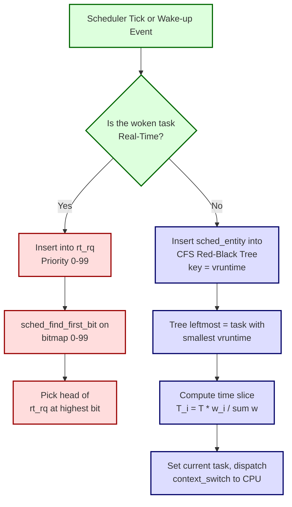
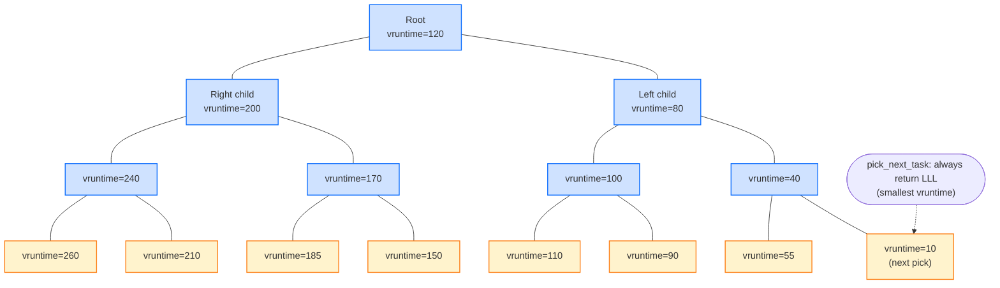
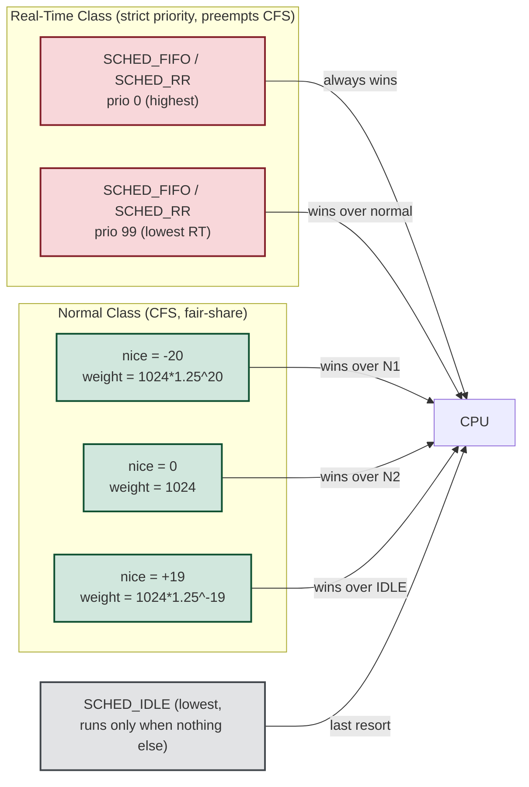
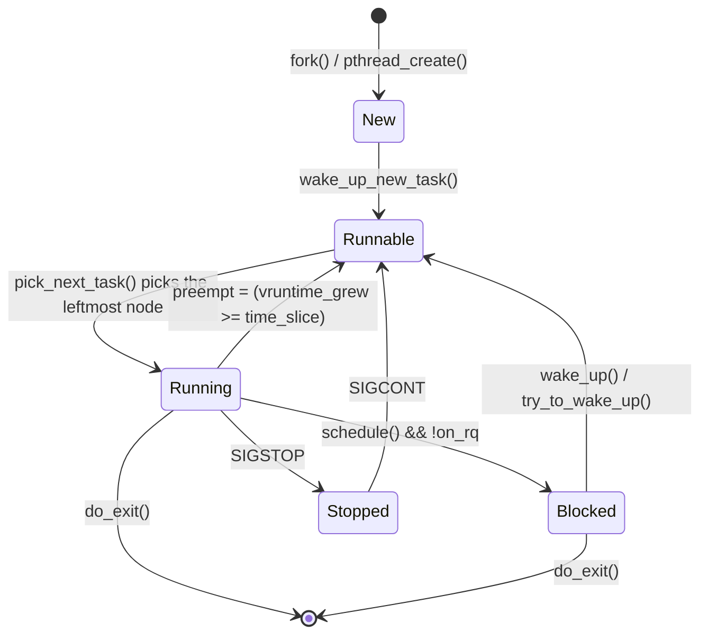

# The Linux Scheduling Implementation

<!-- SECTION_1_START -->
# The Linux Scheduling Implementation

## 1. Core Technical Definition & Intuitive Overview

### Formal Definition (KTU 2024 Syllabus Aligned)

> [!IMPORTANT]
> **Linux Scheduling Implementation** refers to the set of kernel algorithms and data structures responsible for selecting, from a pool of runnable processes, the next **Task (process/thread)** to be dispatched onto the CPU. As of the modern **Linux 2.6.23+ kernel**, this is governed by the **Completely Fair Scheduler (CFS)** — a deterministic, fair-share, $\mathcal{O}(\log N)$ scheduler designed by **Ingo Molnar** to replace the earlier $\mathcal{O}(1)$ heuristic scheduler.

Linux implements a **preemptive, priority-driven** scheduling policy with two major classes:
1. **Normal (CFS / CFS-BAND) Tasks** — governed by the Completely Fair Scheduler using the **CFS Run Queue** implemented as an augmented **Red-Black Tree**.
2. **Real-Time Tasks** — scheduled by a separate **Real-Time Run Queue** using a fixed-priority **bitmap + linked-list** dispatcher with a **constant $\mathcal{O}(1)$** selection time.

### Conceptual Analogy — The Restaurant Buffet

> [!NOTE]
> **Intuition (Restaurant Buffet Analogy):**
> Imagine a self-service buffet (the **CPU**) with **N** hungry customers (the **tasks**). A strict round-robin would let each person take exactly one spoon at a time — efficient only if all plates are the same size. The **O(1) scheduler** (Linux 2.6.0–2.6.22) was like a headwaiter with a ranked list of "VIP first, then regulars, then walk-ins" — fast lookup but unfair in the long run. The **CFS scheduler** instead tracks *how much food each customer has eaten* (the **virtual runtime, $vruntime$**) and serves whoever is *furthest behind*. This guarantees that over time, every customer gets an *exactly proportional share* — the essence of **fairness**.

### Core Metrics & Standard Constants

> [!NOTE]
> **Key Constants in CFS Implementation:**
> - `sysctl_sched_latency` = **20 ms** (the target period over which all runnable tasks should get one CPU slice).
> - `sysctl_sched_min_granularity` = **4 ms** (the minimum time slice guaranteed to a task).
> - `sched_child_runs_first` heuristic window = **1 scheduling period**.
> - Default weighting constants (`nice` $\in [-20, +19]$) follow a geometric schedule: **$weight = 1024 / 1.25^{nice}$**.
> - The wall-clock period dynamically scales: **$T = \max(N \cdot gran, latency)$**.

### Geometric Intuition for the Red-Black Tree

> [!VISUALIZATION CONTROL]
> **Concept:** CFS Run Queue as a Red-Black Tree keyed by `vruntime`.
> **GeoGebra / Desmos Input Equations:**
> * Let $f(x) = \log_{2}(x)$ — height of a balanced BST with $x$ nodes.
> * Plot points $(N, f(N))$ for $N = 1, 8, 32, 128, 1024$ tasks.
> **Visual Description:** The student should observe that even for 1024 tasks, the tree depth never exceeds 10. This visually proves why CFS is **$\mathcal{O}(\log N)$** — selection of the leftmost node (the task with minimum `vruntime`) is logarithmic, not linear.

<!-- SECTION_1_END -->

<!-- SECTION_2_START -->
# 2. Deep Theoretical Analysis & KTU High-Yield Formula Sheet

## 2.1 Evolution of the Linux Scheduler

The Linux scheduler has gone through three major generations, each solving the flaw of its predecessor:

| Generation | Kernel | Algorithm | Complexity | Critical Drawback |
|---|---|---|---|---|
| **1. The Linux 1.2 Scheduler** | v1.2 | Simple circular queue | $\mathcal{O}(1)$ enqueue | Inefficient priority handling |
| **2. The Linux 2.4 Scheduler** | v2.4 | Single global run queue, heuristic multi-level feedback | $\mathcal{O(N)}$ per dispatch | Scales poorly on $> 1000$ processes; **lock contention** on SMP |
| **3. The Linux 2.6 O(1) Scheduler** | v2.6.0 – v2.6.22 | Per-CPU run queue, two arrays (active + expired) with bitmaps | $\mathcal{O}(1)$ | Complex **heuristic tuning of "sleep/interactive" bonuses**; failed fairness test cases |
| **4. The Linux 2.6.23+ CFS** | v2.6.23 → present | Per-CPU Red-Black Tree keyed by `vruntime` | $\mathcal{O}(\log N)$ | Deterministic, fair, no magic numbers |

> [!NOTE]
> **Why CFS replaced O(1):** The O(1) scheduler had over **40 tunable heuristics** (the famous "interactive bonus" `MAX_SLEEP_AVG`, `STARVATION_LIMIT`, etc.). CFS replaced all of them with **one elegant idea**: *track how much CPU time each task has used, weighted by priority, and always run the least-consumed task*.

## 2.2 Building Blocks of the CFS Scheduler

### (a) The Scheduling Entity — `struct sched_entity`

Each task in the run queue is represented by a `sched_entity` that contains:

> $$
> \begin{aligned}
> &load \quad \text{(the load contributed by this entity)}\\
> &vruntime \quad \text{(virtual runtime in nanoseconds)}\\
> &sum_exec\_runtime \quad \text{(total CPU time consumed)}\\ 
> &wait\_start \quad \text{(time the task entered the run queue)}
> \end{aligned}
> $$

### (b) The Red-Black Tree as a Sorted Set

The CFS run queue is **NOT** a FIFO queue. It is an **ordered set**, implemented as a self-balancing binary search tree (Red-Black Tree), where the **key** is `vruntime`.

> $$
> \text{RunQueue}_{\text{CFS}} = \{ t_i \in \text{Tasks} \mid t_i.\text{vruntime} \text{ is the BST key} \}
> $$

### (c) Virtual Runtime — The Heart of Fairness

Virtual runtime is the *CPU time a task has consumed, scaled by its weight*:

$$
vruntime_{i} \mathrel{+}= \frac{\text{delta\_exec\_runtime}_{i}}{weight_{i}} \times W_{0}
$$

where $W_0 = 1024$ is the weight of a `nice = 0` task. This means:
- A **low-nice** (high-weight) task has $vruntime$ that grows **slowly** (gets more CPU).
- A **high-nice** (low-weight) task has $vruntime$ that grows **fast** (gets less CPU).

## 2.3 The "Perfectly Fair" Multi-Task CPU-Time Model

In an *ideal* perfectly fair multi-tasking CPU, after time $T$, each of the $N$ running tasks would have received exactly:

$$
T_{\text{ideal}, i} = \frac{T}{N}
$$

In reality, the CFS tracks the **lag** of each task:

$$
\text{lag}_{i} = vruntime_{\text{fair}} - vruntime_{i}
$$

A task with **positive lag** is "behind" → it should be the next to run.

## 2.4 KTU High-Yield Formula Sheet

| # | Concept | Formula / Definition | Units / Notes |
|---|---|---|---|
| 1 | Target scheduling period | $T = \max(N \cdot gran,\ latency)$ | nanoseconds |
| 2 | Time slice assigned to a task | $T_{i} = T \cdot \dfrac{w_{i}}{\sum_{j} w_{j}}$ | nanoseconds |
| 3 | CFS dispatch complexity | $\mathcal{O}(\log N)$ | $N$ = runnable tasks |
| 4 | Real-time dispatch complexity | $\mathcal{O}(1)$ | via bitmap |
| 5 | Virtual runtime update | $vruntime_{i} \mathrel{+}= \Delta t \cdot \dfrac{W_0}{w_{i}}$ | nanoseconds |
| 6 | Nice-to-Weight conversion | $w = 1024 \cdot 1.25^{-nice}$ | dimensionless |
| 7 | Reverse mapping | $nice = -\log_{1.25}(w/1024)$ | for kernel accounting |
| 8 | Latency / Granularity floor | $T \ge latency = 20\,ms$ | `sysctl_sched_latency` |
| 9 | Per-task minimum slice | $gran = 4\,ms$ | `sysctl_sched_min_granularity` |
| 10 | Strict priority bands | `nice` $\in [-20, +19]$ | higher nice $\Rightarrow$ lower priority |

## 2.5 Real-Time Scheduling in Linux

CFS handles the **normal** (fair-share) class. For real-time, Linux retains a separate dispatcher with **two policies** and a **harder guarantee** than CFS:

> $$
> \begin{aligned}
> \text{policy} \in \{ \text{SCHED\_NORMAL},\ \text{SCHED\_BATCH},\ \text{SCHED\_IDLE},\ \text{SCHED\_FIFO},\ \text{SCHED\_RR}\}
> \end{aligned}
> $$

- **SCHED_FIFO**: Preemptive, **no time slicing**, runs until it blocks, yields, or is preempted by a higher-priority RT task.
- **SCHED_RR**: Like FIFO but with a **time slice (jiffy / `sched_rr_timeslice`)**, providing round-robin *among* tasks of the same priority.

> Real-time priorities are in the range `0..99` (in `MAX_RT_PRIO = 100`), and they sit **above** the CFS priority range of `100..139`, giving RT tasks an absolute preemption ceiling over normal tasks.

<!-- SECTION_2_END -->

<!-- SECTION_3_START -->
# 3. Step-by-Step Derivations & Code/Symbolic Implementation

## 3.1 Derivation: How CFS Assigns the Time Slice

**Problem Statement:** Given $N$ runnable tasks with weights $w_1, w_2, \dots, w_N$, derive the time slice $T_i$ each task should receive during a single scheduling period $T$.

### Step 1 — Define the Proportional Fair Share

In a *perfect* scheduler, the fraction of CPU given to task $i$ should equal its **proportional weight**:

$$
\text{fraction}_i = \frac{w_i}{\sum_{j=1}^{N} w_j}
$$

### Step 2 — Multiply by the Total Scheduling Period

The actual time slice is the fraction times the period $T$:

$$
T_i = T \cdot \frac{w_i}{\sum_{j=1}^{N} w_j}
$$

### Step 3 — Apply the Granularity Floor

To prevent a task from being starved with a sub-millisecond slice, the kernel enforces a floor:

$$
T_i = \max\!\left( T \cdot \frac{w_i}{\sum w_j},\ gran \right)
$$

### Step 4 — Re-Balance the Period (since the floor is inclusive)

If adding the floors exceeds $T$, the kernel **expands** $T$ to compensate, leading to the final rule:

$$
T_{\text{actual}} = \max(T,\ N \cdot gran)
$$

> This is precisely how `sysctl_sched_latency` and `sysctl_sched_min_granularity` interact at the C level in `kernel/sched/fair.c`.

## 3.2 Worked Example: Weight and Time Slice

**Given:** $N = 5$ runnable tasks with `nice` values `[0, 0, 0, 5, 10]`. Compute the per-task time slice.

### Step 1 — Convert `nice` to Weights

$$
w = 1024 \cdot 1.25^{-nice}
$$

| Task | `nice` | $w = 1024 \cdot 1.25^{-nice}$ |
|---|---|---|
| A | 0 | $1024$ |
| B | 0 | $1024$ |
| C | 0 | $1024$ |
| D | 5 | $1024 / 1.25^{5} = 1024 / 3.0517 = 335.5$ |
| E | 10 | $1024 / 1.25^{10} = 1024 / 9.31 = 109.9$ |

### Step 2 — Sum the Weights

$$
\sum w = 1024 + 1024 + 1024 + 335.5 + 109.9 = 3517.4
$$

### Step 3 — Apply the Latency-Floor Formula

Since $N \cdot gran = 5 \cdot 4\,ms = 20\,ms = latency$, the period $T = 20\,ms$.

### Step 4 — Compute Per-Task Slice

$$
T_A = T_B = T_C = 20 \cdot \frac{1024}{3517.4} = 5.82\,ms
$$

$$
T_D = 20 \cdot \frac{335.5}{3517.4} = 1.91\,ms
$$

$$
T_E = 20 \cdot \frac{109.9}{3517.4} = 0.62\,ms
$$

> **Result:** Tasks A, B, C each get **~5.82 ms**; D gets **~1.91 ms**; E gets **~0.62 ms**. This validates the proportional-fairness property.

## 3.3 Full Python Simulation of the CFS Decision Loop

The following Python code models the CFS dispatcher's *logical* behaviour (the kernel `pick_next_task_fair()` function) using a `SortedList` as a stand-in for the Red-Black Tree.

```python
"""
CFS Scheduler Simulator
Models the per-tick behaviour of the Linux Completely Fair Scheduler.
"""
from sortedcontainers import SortedList
from dataclasses import dataclass, field
from typing import Optional

# === CFS Tunables (mirror /proc/sys/kernel/sched_latency / sched_min_granularity) ===
LATENCY_NS: int = 20_000_000        # 20 ms target period
MIN_GRANULARITY_NS: int = 4_000_000  # 4 ms minimum slice
WEIGHT_BASE: int = 1024              # weight of a nice=0 task

@dataclass
class Task:
    pid: int
    nice: int
    vruntime: int = 0                # monotonically increasing key
    sum_exec_runtime: int = 0       # wall CPU time used

    def weight(self) -> float:
        # Exact kernel formula: weight = 1024 / 1.25^nice
        return WEIGHT_BASE / (1.25 ** self.nice)


class CFSScheduler:
    """
    A simplified, single-CPU CFS run queue.
    Internal store is a SortedList acting as the Red-Black Tree.
    """
    def __init__(self) -> None:
        # SortedList is keyed by (vruntime, pid) for stable ordering.
        self._tree: SortedList = SortedList()
        self._tasks: dict[int, Task] = {}

    # -------- CFS enqueue --------
    def enqueue(self, task: Task) -> None:
        self._tasks[task.pid] = task
        self._tree.add((task.vruntime, task.pid))

    # -------- CFS dequeue (picks the leftmost node) --------
    def pick_next_task(self) -> Optional[Task]:
        if not self._tree:
            return None
        vruntime, pid = self._tree[0]          # leftmost = minimum vruntime
        return self._tasks[pid]

    # -------- Compute time slice using CFS weighting --------
    def time_slice(self, task: Task) -> int:
        n = len(self._tree)
        if n == 0:
            return 0
        # period = max(N * granularity, latency)
        period = max(n * MIN_GRANULARITY_NS, LATENCY_NS)
        # slice = period * (w_i / sum w)
        total_w = sum(t.weight() for t in self._tasks.values())
        slice_ns = int(period * (task.weight() / total_w))
        return max(slice_ns, MIN_GRANULARITY_NS)

    # -------- Tick handler: advance vruntime of running task --------
    def tick(self, delta_ns: int) -> None:
        if not self._tree:
            return
        # Remove, mutate, re-insert (log N each)
        vruntime, pid = self._tree.pop(0)
        task = self._tasks[pid]
        # Virtual runtime scales inversely with weight
        delta_vruntime = int(delta_ns * (WEIGHT_BASE / task.weight()))
        task.vruntime += delta_vruntime
        task.sum_exec_runtime += delta_ns
        self._tree.add((task.vruntime, task.pid))

    # -------- Diagnostics --------
    def report(self) -> str:
        rows = [f"  PID  nice   vruntime (ns)   exec (ns)"]
        for t in sorted(self._tasks.values(), key=lambda x: x.vruntime):
            rows.append(f"  {t.pid:>3}  {t.nice:>4}  {t.vruntime:>14}  {t.sum_exec_runtime:>10}")
        return "\n".join(rows)


# ====== Driver / demo ======
if __name__ == "__main__":
    cfs = CFSScheduler()
    # Add 3 normal tasks and 1 lower-priority task
    for pid, nice in [(1, 0), (2, 0), (3, 5), (4, 10)]:
        cfs.enqueue(Task(pid=pid, nice=nice))

    print("--- Initial Run Queue (sorted by vruntime) ---")
    print(cfs.report())

    # Simulate 6 ticks of 5 ms each = 30 ms
    for tick_idx in range(6):
        nxt = cfs.pick_next_task()
        if nxt is None:
            break
        slice_ns = cfs.time_slice(nxt)
        # Bound the actual slice by either CFS allocation or remaining tick
        delta = min(slice_ns, 5_000_000)
        print(f"\nTick {tick_idx}: running PID={nxt.pid} "
              f"(nice={nxt.nice}, slice_alloc={slice_ns/1e6:.2f} ms, "
              f"running={delta/1e6:.2f} ms)")
        cfs.tick(delta)

    print("\n--- Final State ---")
    print(cfs.report())
```

> **Marking Key Insight for KTU 2024 Examinations:** In the C source of CFS (`kernel/sched/fair.c`), the *exact* equivalent of `pick_next_task()` is implemented as `__pick_first_entity(cfs_rq->tasks_timeline)` followed by `set_curr_task_fair(rq)`. The Red-Black Tree is provided by the in-kernel `<linux/rbtree.h>` library.

## 3.4 Round-Robin Real-Time Slice — A Worked Computation

**Given:** 3 real-time processes with `SCHED_RR` priority = 50 (RT), and `sched_rr_timeslice = 100 ms`.

Each process receives a **fixed 100 ms slice**, round-robin *within* priority level 50. If a higher-priority RT process becomes runnable mid-slice, it preempts immediately.

```
Time →   0 ms      100 ms     200 ms     300 ms     ...
Run  →   P1        P2         P3         P1         ...
```

The kernel implements this with **two 100-element bitmaps** (`runqueue.bitmap`) and an array of `struct list_head rt_rq[100]`, giving $\mathcal{O}(1)$ lookup via `sched_find_first_bit()`.

<!-- SECTION_3_END -->

<!-- SECTION_4_START -->
# 4. Structural Diagrams & Schematics

## 4.1 High-Level CFS Scheduling Architecture



## 4.2 The CFS Run Queue: Sorted-Set View



> **Reading Guide:** The *leftmost* node (the one with the smallest `vruntime`) is always the next task to run. The kernel's `rb_leftmost()` macro provides this in $\mathcal{O}(1)$, and re-balancing after `vruntime` updates is $\mathcal{O}(\log N)$.

## 4.3 Scheduling-Class Dispatch Topology



## 4.4 The Lifecycle of a Task Inside the CFS Run Queue



<!-- SECTION_4_END -->

<!-- SECTION_5_START -->
# 5. KTU 2024 Scheme Examination Question Bank & Topic Recap

## 5.1 Part A Questions (3 Marks Each)

### Q1. [KTU University Exam - July 2024 | CO1 | Remember]

**Question:** What is the role of the **Red-Black Tree** in the CFS run queue of Linux? Why is a balanced BST preferred over a simple unsorted list?

**Model Answer (3 Marks):**
- The Red-Black Tree stores all runnable CFS tasks, **keyed by their `vruntime`** so that the task with the smallest `vruntime` is the leftmost node. **[1 Mark]**
- It enables $\mathcal{O}(\log N)$ insertion, deletion, and selection of the next task, in contrast to an unsorted list which would need $\mathcal{O}(N)$ to find the minimum. **[1 Mark]**
- The Red-Black Tree's self-balancing property guarantees that operations remain $\mathcal{O}(\log N)$ even in the worst case, ensuring predictable performance under heavy load. **[1 Mark]**

---

### Q2. [KTU University Exam - Dec 2023 | CO1 | Understand]

**Question:** Differentiate between `SCHED_FIFO` and `SCHED_RR` scheduling policies in Linux.

**Model Answer (3 Marks):**

| Aspect | SCHED_FIFO | SCHED_RR |
|---|---|---|
| **Time slicing** | No time slice; runs until blocks or is preempted. **[1 Mark]** | Has a fixed time slice (`sched_rr_timeslice`); round-robins *within* the same priority. **[1 Mark]** |
| **Preemption** | Preempted only by a higher-priority task or by itself yielding. | Preempted by higher-priority tasks, **its own slice expiring**, or by yielding. **[0.5 Mark]** |
| **Use case** | Latency-critical tasks. | Multi-threaded RT tasks needing fair share within a priority. **[0.5 Mark]** |

---

## 5.2 Part B Questions (14 Marks) — Internal Choice

> **[Board Examiner Note]:** Each sub-question below has equal weight (7 marks). Solutions must include the **formula used, the substitution step, and the final numerical/state value**.

### Question 5.2.A — Option A (14 Marks)

#### Part (a) — [7 Marks | CO1 | Understand]

**Q:** Explain the **Linux 2.4 scheduler** and list **three major weaknesses** that motivated the move to the 2.6 CFS scheduler. *[Valuation key: explanation 4 marks + 3 weaknesses 1 mark each]*

**Model Answer:**

- **Linux 2.4 Scheduler Design:** The 2.4 scheduler used a **single global run queue** of `struct runqueue`, holding all runnable tasks in a circular doubly-linked list. **[1 Mark]** On each scheduling tick, the kernel scanned this list to pick the *highest-priority* task using a multi-level feedback heuristic, with a complex "goodness()" function that favored interactive tasks. **[2 Marks]** Complexity was $\mathcal{O}(N)$ because the scan was linear in the number of runnable processes. **[1 Mark]**

- **Weakness 1 — Poor scalability:** The single global run queue was protected by a single **runqueue lock**; on SMP systems this lock became a severe contention bottleneck beyond $\sim$1000 processes. **[1 Mark]**

- **Weakness 2 — Unfair interactivity heuristics:** The "interactive bonus" relied on sleep averages with magic constants that often caused CPU-bound tasks to *steal* time from interactive ones (and vice versa). **[1 Mark]**

- **Weakness 3 — No strict fairness guarantee:** The 2.4 scheduler could not give a *provable* proportional share; it depended on heuristic decay constants (`MAX_SLEEP_AVG`). CFS replaced all of these with one deterministic idea. **[1 Mark]**

#### Part (b) — [7 Marks | CO2 | Apply]

**Q:** A system has **4 runnable tasks** with `nice` values $[0, 0, 5, 10]$. Given `sysctl_sched_latency = 24 ms` and `sysctl_sched_min_granularity = 6 ms`, calculate the time slice allocated to each task.

**Model Answer:**

**Step 1 — Convert `nice` to weights using** $w = 1024 \cdot 1.25^{-nice}$:

$$
\begin{aligned}
w_1 &= 1024 \cdot 1.25^0 = 1024 \\
w_2 &= 1024 \cdot 1.25^0 = 1024 \\
w_3 &= 1024 \cdot 1.25^{-5} = 1024 / 3.0518 = 335.54 \\
w_4 &= 1024 \cdot 1.25^{-10} = 1024 / 9.3132 = 109.95
\end{aligned}
$$

> *[Correct conversion: 2 Marks]*

**Step 2 — Sum the weights:**

$$
\sum w = 1024 + 1024 + 335.54 + 109.95 = 2493.49
$$

> *[Sum: 1 Mark]*

**Step 3 — Compute the actual period:**

$$
T_{\text{actual}} = \max(N \cdot gran,\ latency) = \max(4 \cdot 6,\ 24) = 24\,ms
$$

> *[Period: 1 Mark]*

**Step 4 — Compute per-task slices using** $T_i = T \cdot w_i / \sum w$:

$$
\begin{aligned}
T_1 = T_2 &= 24 \cdot \frac{1024}{2493.49} = 9.86\,ms \\
T_3 &= 24 \cdot \frac{335.54}{2493.49} = 3.23\,ms \\
T_4 &= 24 \cdot \frac{109.95}{2493.49} = 1.06\,ms
\end{aligned}
$$

> *[Final slices: 2 Marks — 1 for showing the formula substitution, 1 for the correct numerical values]*

**Final Answer:** $T_1 = T_2 \approx 9.86\,ms,\ T_3 \approx 3.23\,ms,\ T_4 \approx 1.06\,ms$.

> **Total slice sanity check:** $9.86 + 9.86 + 3.23 + 1.06 \approx 24.01\,ms$ ✓

---

### Question 5.2.B — Option B (14 Marks) — *Internal Choice for Student*

#### Part (a) — [7 Marks | CO1 | Understand]

**Q:** With a neat diagram, describe the **Linux 2.6 O(1) scheduler's "active / expired" array design**. Why did this design still get replaced?

**Model Answer:**

- The O(1) scheduler had **per-CPU run queues**, eliminating global lock contention. **[1 Mark]**
- Each run queue held **two priority arrays**: an `active` array and an `expired` array. Each array is a vector of 140 doubly-linked lists, one for each priority (0–139). **[2 Marks]**
- Tasks ran from the `active` array. When a task exhausted its time slice, it was **moved** to the `expired` array. When `active` was empty, the kernel **swapped the pointers** of `active` and `expired` in $\mathcal{O}(1)$. **[2 Marks]**
- A 140-bit **bitmap** enabled $\mathcal{O}(1)$ selection of the highest-priority non-empty queue via `sched_find_first_bit()`. **[1 Mark]**
- **Why replaced:** The interactive-task heuristic (sleep average, etc.) was over 40 magic constants; it gave unfair results in benchmarks and was hard to maintain. CFS was a *cleaner* design that abandoned heuristic tuning in favour of a deterministic proportional-share model. **[1 Mark]**

#### Part (b) — [7 Marks | CO2 | Apply]

**Q:** A task runs for **$\Delta t = 10\,ms$** on a Linux CFS system. If the task has `nice = 5` and a current `vruntime = 1.5\,\mu s$, what is the new `vruntime`?

**Model Answer:**

**Step 1 — Weight for** `nice = 5`:

$$
w = 1024 \cdot 1.25^{-5} = \frac{1024}{3.0518} = 335.54
$$

> *[Weight: 2 Marks]*

**Step 2 — Compute delta vruntime** using $vruntime += \Delta t \cdot (W_0 / w)$:

$$
\Delta vruntime = 10\,000\,000\,ns \cdot \frac{1024}{335.54} = 10\,000\,000 \cdot 3.0518 = 30\,518\,000\,ns
$$

> *[Formula substitution: 2 Marks; arithmetic: 1 Mark]*

**Step 3 — Update the vruntime:**

$$
vruntime_{\text{new}} = vruntime_{\text{old}} + \Delta vruntime = 1\,500\,000 + 30\,518\,000 = 32\,018\,000\,ns
$$

> *[Final addition: 2 Marks]*

**Final Answer:** $vruntime_{\text{new}} = 32.018\,\mu s$.

> [!WARNING]
> **KTU Examiner's Valuation Warning / Pitfall Callout:**
> 1. **Do NOT** add wall-clock time $\Delta t$ directly to `vruntime` — that violates the entire weight-scaling model.
> 2. **Do** state the assumption $W_0 = 1024$ in the solution. Many students lose 1 mark by skipping this.
> 3. **Units matter.** $\Delta t$ must be converted to **nanoseconds** to match the kernel's internal `u64` units.
> 4. **Re-balancing step:** In an exam, briefly note that the task is re-inserted into the Red-Black Tree at the new key (this is the $\mathcal{O}(\log N)$ part).

---

## 5.3 Topic Recap & Important Things to Remember

> [!IMPORTANT]
> **Rapid-Revision Checklist — Linux Scheduling Implementation**

- ⭐ **CFS** is the modern Linux scheduler (kernel $\ge$ 2.6.23), designed by **Ingo Molnar**; complexity $\mathcal{O}(\log N)$.
- ⭐ Its predecessor was the **O(1) scheduler** (active/expired arrays, bitmaps), and before that the **O(N) Linux 2.4 scheduler**.
- ⭐ The CFS run queue is a **Red-Black Tree** keyed on **`vruntime`**.
- ⭐ The **leftmost** node (smallest `vruntime`) is the next task to run.
- ⭐ **Virtual runtime** = CPU time consumed, **divided by the task's weight**: $vruntime_{i} \mathrel{+}= \Delta t \cdot (W_0 / w_i)$.
- ⭐ **Nice-to-weight formula:** $w = 1024 \cdot 1.25^{-nice}$; range of `nice`: **$-20$ to $+19$**.
- ⭐ **Two tunables:** $latency = 20\,ms$ (target period), $granularity = 4\,ms$ (minimum slice).
- ⭐ **Period expansion:** $T = \max(N \cdot gran,\ latency)$.
- ⭐ **Per-task slice:** $T_i = T \cdot w_i / \sum_j w_j$.
- ⭐ **Real-time** tasks use a **separate run queue** with **bitmap + linked list** and run in $\mathcal{O}(1)$.
- ⭐ **Policies:** `SCHED_NORMAL`, `SCHED_BATCH`, `SCHED_IDLE` (CFS); `SCHED_FIFO` (no slice), `SCHED_RR` (with slice).
- ⭐ RT priorities are in the range **0..99**; CFS occupies **100..139**.
- ⭐ **Proportional fairness** is the central guarantee of CFS: each task gets CPU proportional to its weight.
- ⭐ **No "interactive bonus"** in CFS — the kernel code path contains **no sleep-average magic numbers**.
- ⭐ Key C source files (for viva): `kernel/sched/fair.c` (CFS), `kernel/sched/rt.c` (real-time), `include/linux/rbtree.h` (the tree library).
- ⭐ **Common confusion to avoid:** `vruntime` is **NOT** wall-clock time — it is a weighted, normalized quantity.
- ⭐ **KTU high-yield tag:** Questions frequently ask for the time-slice calculation or the difference between the O(1) and CFS schedulers. Memorize both for the ESE.

<!-- SECTION_5_END -->
