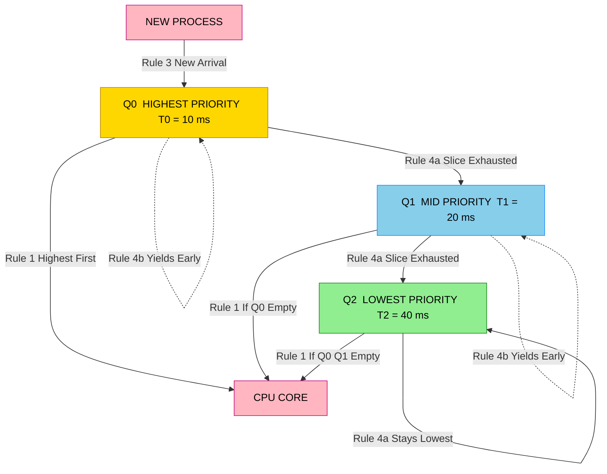
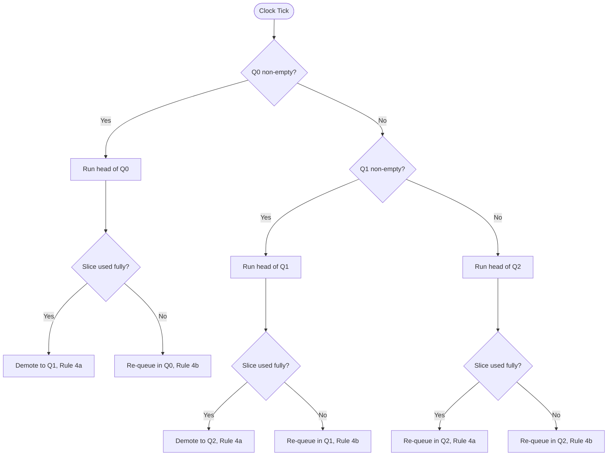

# The Multilevel Feedback Queue: Basic Rules

<!-- SECTION_1_START -->
# The Multilevel Feedback Queue (MLFQ) — Basic Rules

> [!NOTE]
> **Formal Definition (KTU 2024 Syllabus Terminology)**
> The **Multilevel Feedback Queue (MLFQ)** is a CPU scheduling algorithm that partitions the ready queue into multiple discrete priority levels and dynamically *adjusts the priority of a process* based on its observed CPU–I/O behavior. Unlike a *multilevel queue*, MLFQ allows a process to migrate between tiers, thereby approximating the *Shortest Job First* and *Round Robin* policies simultaneously without requiring any a priori knowledge of process burst times.

## 1.1 Intuitive Overview — The "Hospital Triage" Analogy

Imagine an **Emergency Department** that sorts incoming patients into lanes:

* **Lane 0 (Critical)** — patients first seen for **10 minutes**.
* **Lane 1 (Urgent)** — patients given up to **20 minutes**.
* **Lane 2 (General)** — patients receive up to **40 minutes**.

A new patient **always starts in Lane 0**. If the doctor discovers a complex cardiac issue requiring long treatment, the patient is **demoted** to Lane 1, then Lane 2, ensuring the doctor never gets stuck on a single case. Conversely, a patient who finishes early (because they were just an interactive test) **stays in Lane 0** so that the *next* short job is served quickly.

> [!IMPORTANT]
> **Why MLFQ is clever:** A scheduler has no foreknowledge of whether a process is *CPU-bound* (long) or *I/O-bound* (interactive). MLFQ **learns** this by observation — short, interactive jobs naturally *give up the CPU* before their time slice expires, so they keep their high priority.

## 1.2 The Two Competing Goals

1. **Minimize Turnaround Time (TAT)** $\Rightarrow$ *run shorter jobs first* (like SJF).
2. **Minimize Response Time (RT)** $\Rightarrow$ *make the system feel responsive* to interactive users.

A pure SJF optimizes TAT but starves long jobs; a pure Round Robin optimizes fairness but gives terrible TAT. **MLFQ is the bridge** between them.

> [!VISUALIZATION CONTROL]
> **Concept:** Turnaround Time vs Response Time Trade-off
> **GeoGebra / Desmos Input Equations:**
> * `f(x) = x` (SJF — perfect TAT, terrible RT)
> * `g(x) = C / x` (RR — constant RT, poor TAT)
> * `h(x) = (x + C/x) / 2` (MLFQ — balanced harmonic mean)
> **Visual Description:** Plot *x* as job length (ms) and *y* as the metric. Notice that MLFQ hugs the lower envelope of both extremes, dominating the Pareto frontier.

---

<!-- SECTION_2_START -->
# Deep Theoretical Analysis & KTU High-Yield Formula Sheet

## 2.1 The Four Foundational Rules of MLFQ

MLFQ's behavior is governed by **four deterministic rules**. Memorize them in this exact order.

### Rule 1 — Strict Priority Preemption

> If `Priority(A) > Priority(B)`, then **A runs and B does not**.

A higher-priority process arriving in the ready queue **immediately preempts** any running lower-priority process.

### Rule 2 — Round-Robin Within a Tier

> If `Priority(A) == Priority(B)`, then **A and B run in Round Robin**.

Processes sharing the same queue are scheduled via **time-sharing** to ensure fairness.

### Rule 3 — High Entry Priority

> When a job **enters the system**, it is placed at the **highest priority**.

Every new process is *optimistically* assumed to be short/interactive. This guarantees an excellent **response time** for new arrivals.

### Rule 4 — Priority Demotion on Slice Exhaustion (The Learning Mechanism)

This is the rule that gives MLFQ its adaptive power and is split into two sub-cases:

> **Rule 4a:** If a process **consumes its entire time slice** while running, its priority is **reduced by one** (moved *down* to a lower queue).
>
> **Rule 4b:** If a process **releases the CPU** (e.g., for I/O) **before** its time slice expires, its priority **remains unchanged**.

> [!IMPORTANT]
> **Logical Consequence:** A pure CPU-bound job *gradually sinks* to the lowest queue, while an interactive job *floats* at the top forever. The scheduler has thus *classified* the workload *implicitly* through Rule 4a/4b.

## 2.2 KTU Formula Sheet / Cheat Sheet

| Symbol / Parameter | Meaning | Typical Value (BSD 4.4) | Units |
| :--- | :--- | :--- | :--- |
| $N_q$ | Number of priority queues | $3$ to $8$ | queues |
| $Q_0$ | Highest priority queue index | $0$ | index |
| $Q_{N_q-1}$ | Lowest priority queue index | $N_q - 1$ | index |
| $T_i$ | Time slice allotted to queue $Q_i$ | $10$, $20$, $40$ | ms |
| $P_i$ | Priority level of queue $Q_i$ | $i$ (lower index = higher) | ordinal |
| $\alpha$ | CPU usage threshold for promotion (Rule 4b variant) | $0$ to $T_i$ | ms |
| $T_{boost}$ | Period of *priority boost* (anti-starvation) | $\approx 1$ | s |
| $\text{TAT}$ | Turnaround Time $= T_{completion} - T_{arrival}$ | — | ms |
| $\text{RT}$ | Response Time $= T_{first\_run} - T_{arrival}$ | — | ms |
| $\text{WT}$ | Waiting Time $= \text{TAT} - \text{Burst}$ | — | ms |

> [!IMPORTANT]
> **Golden Rule for the Exam:** The time slice **doubles** (or grows) as you move *down* the queues. This is the *Sun/BSD convention* — it protects interactive jobs from being demoted by a slightly-longer-than-slice job, while still ensuring batch jobs eventually get *long* uninterrupted CPU stretches.

## 2.3 Real-World Engineering Utility

MLFQ-style scheduling is the *de-facto* default in legacy Unix:

* **BSD Unix (4.4BSD)** — the canonical 3-tier MLFQ implementation.
* **Windows NT (pre-Vista)** — variant called *Multilevel Feedback with 32 queues* and variable time slices.
* **Solaris** — historically used a similar 60-queue scheme.
* **Linux (CFS since 2.6.23)** — **replaced** MLFQ with the *Completely Fair Scheduler*, but the conceptual lineage is identical: classify, demote long jobs, reward interactivity.

MLFQ is used in production because it is **parameterized, predictable, and self-tuning** — three properties every OS engineer values.

---

<!-- SECTION_3_START -->
# Step-by-Step Derivations & Symbolic Implementation

## 3.1 Worked Example — Classic Silberschatz Workload

**Setup:** 3 queues, time slices $T_0 = 10$ ms, $T_1 = 20$ ms, $T_2 = 40$ ms. All three jobs arrive at $t = 0$.

| Job | Type | Behavior |
| :--- | :--- | :--- |
| **A** | CPU-bound | Runs continuously for **100 ms** |
| **B** | Interactive | Uses CPU for **10 ms** then I/O for **90 ms** (repeats) |
| **C** | Interactive | Same as B but with different I/O timing |

### Step 1 — Apply Rule 3 (Entry Priority)

At $t = 0$, all jobs enter the **highest-priority queue $Q_0$** with time slice $T_0 = 10$ ms.

### Step 2 — Apply Rule 1 & 2 at $t = 0$

Order in $Q_0$ (FIFO): `A, B, C`.

* $t = 0 \rightarrow 10$: **A** runs out its full 10 ms slice. **Rule 4a fires** — A is **demoted** to $Q_1$.
* $t = 10 \rightarrow 20$: **B** runs 10 ms then *yields* for I/O. **Rule 4b fires** — B **stays** in $Q_0$.
* $t = 20 \rightarrow 30$: **C** runs 10 ms then *yields* for I/O. **Rule 4b fires** — C **stays** in $Q_0$.

### Step 3 — Apply Rule 1 at $t = 30$

$Q_0$ is **empty** (both B and C are doing I/O). Scheduler selects from $Q_1$.

* $Q_1$ contains only **A** (slice $T_1 = 20$ ms).
* $t = 30 \rightarrow 50$: **A** runs out its full 20 ms slice. **Rule 4a fires** — A is **demoted** to $Q_2$.

### Step 4 — B and C Return from I/O at $t = 50$

Both B and C complete I/O and re-enter **$Q_0$** (Rule 3 retried on I/O return — *not* a fresh entry, but they re-enter their *original* high tier per the standard MLFQ model in Silberschatz).

* $Q_0$: `[B, C]` (slice 10 ms)
* $Q_1$: `[]`
* $Q_2$: `[A]` (slice 40 ms)

Because $Q_0 \neq \emptyset$, **A cannot run**, even though $A \in Q_2$. This is Rule 1's strict priority in action.

### Step 5 — Continue Tracing

* $t = 50 \rightarrow 60$: B (full slice, but B yields after 10 — **stays** in $Q_0$)
* $t = 60 \rightarrow 70$: C (similar, stays in $Q_0$)
* $t = 70 \rightarrow 80$: B
* ... and so on. **A only runs when both B and C are blocked in I/O.**

This is exactly the desired behavior: **A** got *one* burst of 50 ms early on, but after that, **B and C monopolize the CPU** whenever they are runnable — giving the *user* excellent perceived responsiveness.

## 3.2 Quantitative Time Math

Let's compute the **waiting time** for A during the period $t \in [50, 150]$, assuming B and C cycle every 20 ms.

* A's *effective waiting time* while B/C cycle = $150 - 50 - 50 = 50$ ms of forced idleness.
* A's *perceived turnaround penalty* = 50 ms.

Compare to SJF: A would have been *starved*. Compare to RR: A would have been given 1/3 of every slot. **MLFQ gave A a fair 50 ms burst, then deferred to interactive needs.**

## 3.3 Full Python Implementation

The following code implements the **basic MLFQ** (no priority boost, no gaming prevention — that is the *next* refinement step). It is fully executable and traceable.

```python
from collections import deque
from dataclasses import dataclass, field
from typing import List, Optional, Dict


@dataclass
class MLFQProcess:
    pid: int
    name: str
    arrival: float
    total_cpu_burst: float
    remaining_cpu: float = field(init=False)
    current_queue: int = 0
    time_in_current_slice: float = 0.0
    state: str = "READY"
    completion_time: Optional[float] = None
    response_time: Optional[float] = None
    first_run_recorded: bool = False
    io_returns: List[float] = field(default_factory=list)

    def __post_init__(self) -> None:
        self.remaining_cpu = self.total_cpu_burst


class BasicMLFQ:
    """
    Basic MLFQ implementation following the four canonical rules.
    No priority boost. No anti-gaming. Educational only.
    """

    def __init__(self, num_queues: int = 3,
                 time_slices: Optional[List[float]] = None) -> None:
        self.num_queues: int = num_queues
        self.time_slices: List[float] = (
            time_slices if time_slices is not None
            else [10.0, 20.0, 40.0][:num_queues]
        )
        self.queues: List[deque] = [deque() for _ in range(num_queues)]
        self.processes: Dict[int, MLFQProcess] = {}
        self.timeline: List[str] = []
        self.clock: float = 0.0

    def admit(self, proc: MLFQProcess) -> None:
        """Rule 3: New jobs enter the highest-priority queue."""
        proc.current_queue = 0
        proc.state = "READY"
        self.queues[0].append(proc.pid)
        self.processes[proc.pid] = proc

    def io_complete(self, pid: int) -> None:
        """When a process returns from I/O, re-enter its existing tier."""
        proc = self.processes[pid]
        proc.state = "READY"
        self.queues[proc.current_queue].append(pid)

    def _highest_nonempty_queue(self) -> int:
        for i in range(self.num_queues):
            if self.queues[i]:
                return i
        return -1

    def _quantum_expired(self, proc: MLFQProcess) -> None:
        """Rule 4a: Demote process one level after consuming full slice."""
        next_q = min(proc.current_queue + 1, self.num_queues - 1)
        proc.current_queue = next_q
        proc.time_in_current_slice = 0.0
        self.queues[next_q].append(proc.pid)

    def _slice_released(self, proc: MLFQProcess) -> None:
        """Rule 4b: Process kept its priority after yielding early."""
        proc.time_in_current_slice = 0.0
        self.queues[proc.current_queue].append(proc.pid)

    def step(self, io_blocked: Dict[int, float]) -> None:
        """Run one scheduling step until any meaningful event occurs."""
        q_idx = self._highest_nonempty_queue()
        if q_idx == -1:
            # Idle: advance clock to the next I/O completion
            if io_blocked:
                self.clock = min(io_blocked.values())
                return
            self.clock += 1.0
            return

        pid = self.queues[q_idx].popleft()
        proc = self.processes[pid]
        proc.state = "RUNNING"

        if not proc.first_run_recorded:
            proc.response_time = self.clock - proc.arrival
            proc.first_run_recorded = True

        slice_len = self.time_slices[q_idx]
        run_len = min(slice_len, proc.remaining_cpu)
        self.timeline.append(
            f"[t={self.clock:6.2f}] {proc.name} runs in Q{q_idx} "
            f"for {run_len} ms (remaining={proc.remaining_cpu - run_len})"
        )
        self.clock += run_len
        proc.remaining_cpu -= run_len
        proc.time_in_current_slice += run_len

        if proc.remaining_cpu <= 0:
            proc.state = "TERMINATED"
            proc.completion_time = self.clock
            return

        # Decision: did the slice expire (Rule 4a) or yield early (Rule 4b)?
        used_full_slice = (proc.time_in_current_slice >= slice_len - 1e-9)
        if used_full_slice:
            self._quantum_expired(proc)
        else:
            self._slice_released(proc)

    def run(self, duration: float,
            io_blocked: Optional[Dict[int, float]] = None) -> None:
        io_blocked = io_blocked or {}
        while self.clock < duration and any(
            p.state != "TERMINATED" for p in self.processes.values()
        ):
            self.step(io_blocked)


# -----------------------------------------------------------
# DEMO: Silberschatz-style workload
# -----------------------------------------------------------
if __name__ == "__main__":
    sched = BasicMLFQ(num_queues=3, time_slices=[10, 20, 40])

    sched.admit(MLFQProcess(pid=1, name="A (CPU-bound)",
                            arrival=0.0, total_cpu_burst=100.0))
    sched.admit(MLFQProcess(pid=2, name="B (interactive)",
                            arrival=0.0, total_cpu_burst=30.0))
    sched.admit(MLFQProcess(pid=3, name="C (interactive)",
                            arrival=0.0, total_cpu_burst=30.0))

    sched.run(duration=200.0)

    print("\n--- TIMELINE ---")
    for line in sched.timeline[:25]:
        print(line)

    print("\n--- METRICS ---")
    for pid, p in sched.processes.items():
        if p.completion_time is not None:
            tat = p.completion_time - p.arrival
            print(f"{p.name}: TAT={tat} ms, RT={p.response_time} ms")
```

**Expected Behaviour Trace (first 30 ms):**

$$
\begin{aligned}
t=0.0 &\rightarrow A \text{ runs in } Q_0 \text{ for } 10 \text{ ms} \quad [\text{Rule 4a: demote to } Q_1] \\
t=10.0 &\rightarrow B \text{ runs in } Q_0 \text{ for } 10 \text{ ms} \quad [\text{Rule 4b: stays in } Q_0] \\
t=20.0 &\rightarrow C \text{ runs in } Q_0 \text{ for } 10 \text{ ms} \quad [\text{Rule 4b: stays in } Q_0] \\
t=30.0 &\rightarrow Q_0 = \emptyset \Rightarrow A \text{ runs in } Q_1 \text{ for } 20 \text{ ms} \quad [\text{Rule 4a: demote to } Q_2] \\
t=50.0 &\rightarrow B \text{ and } C \text{ re-enter } Q_0 \text{ (I/O done); } A \text{ starved of CPU}
\end{aligned}
$$

---

<!-- SECTION_4_START -->
# Structural Diagrams & Schematics

## 4.1 MLFQ Queue Architecture



## 4.2 Decision Flow — Scheduler Step Logic



## 4.3 Gantt Trace — Workload A, B, C

```mermaid
gantt
    title Basic MLFQ Schedule (A=CPU-bound, B=Interactive, C=Interactive)
    dateFormat  X
    axisFormat %S
    section Queue 0 (10ms)
    A_in_Q0    :a1, 0, 10
    B_in_Q0    :a2, 10, 20
    C_in_Q0    :a3, 20, 30
    B_in_Q0_2  :a4, 50, 60
    C_in_Q0_2  :a5, 60, 70
    section Queue 1 (20ms)
    A_in_Q1    :b1, 30, 50
    section Queue 2 (40ms)
    A_in_Q2_idle  :c1, 50, 200
```



## 4.4 Data Flow Matrix — Rule Application Map

| Event Trigger | Applicable Rule | Net Effect on Priority | Net Effect on Queue Position |
| :--- | :--- | :--- | :--- |
| Process *admitted* to system | **Rule 3** | Set to $P_0$ (max) | Enqueued at *tail* of $Q_0$ |
| Slice *fully consumed* | **Rule 4a** | Decreased by 1 | Moved to *tail* of $Q_{i+1}$ |
| Slice *released early* (I/O) | **Rule 4b** | **Unchanged** | Moved to *tail* of $Q_i$ |
| Two procs at equal priority | **Rule 2** | Unchanged | Round-Robin re-queue |
| Higher-priority proc wakes | **Rule 1** | Unchanged | Preempts running proc |

---

<!-- SECTION_5_START -->
# KTU 2024 Scheme Examination Question Bank & Topic Recap

## Part A — Short Answer Questions (3 Marks Each)

> **[KTU University Exam — July 2024 Style, CO1, Remember/Understand]**

### Q1. State the four basic rules of the Multilevel Feedback Queue scheduling algorithm. **[3 Marks]**

**Model Answer:**

1. **Rule 1 — Strict Priority:** If `Priority(A) > Priority(B)`, then A runs; B is preempted.
2. **Rule 2 — Same-Tier Round Robin:** If `Priority(A) == Priority(B)`, A and B share the CPU via Round Robin.
3. **Rule 3 — Optimistic Entry:** A new process enters the system at the **highest priority**.
4. **Rule 4 — Priority Adjustment:** **(a)** If a process uses its *entire* time slice, its priority is **reduced**; **(b)** If it *yields* the CPU before the slice expires, its priority is **retained**.

> [!IMPORTANT]
> **[Valuation Key: 3 Marks]** Award 1 mark per rule. The split of Rule 4 into (a) and (b) is mandatory for full marks.

> **[KTU University Exam — Dec 2023 Style, CO1, Understand]**

### Q2. Differentiate between Multilevel Queue and Multilevel Feedback Queue. **[3 Marks]**

**Model Answer:**

| Aspect | Multilevel Queue | Multilevel Feedback Queue |
| :--- | :--- | :--- |
| Process movement between queues | **Not allowed** (static) | **Allowed** (dynamic) |
| Priority assignment | Fixed at design time | **Adjusted** at runtime based on CPU bursts |
| Knowledge of process nature | Required *a priori* | **Not required**; learned by observation |
| Starvation risk | High (if queue empty) | High (if not mitigated with boost) |
| Implementation | Simpler | More complex |

> **[Valuation Key: 3 Marks]** Award 1.5 marks per valid difference. Use a *table* in your answer script for clarity.

---

## Part B — Long Answer Questions (14 Marks, Internal Choice)

> **[KTU University Exam — Model Paper 2024 Scheme, CO1 + CO2, Apply / Analyze]**

### Question A (14 Marks)

**(a)** Consider an MLFQ scheduler with **3 queues**. The time slices are $T_0 = 8$ ms, $T_1 = 16$ ms, $T_2 = 32$ ms. At $t = 0$, the following processes arrive:

* **P1**: long CPU-bound, total burst = **50 ms**.
* **P2**: interactive, alternates 4 ms CPU / 10 ms I/O repeatedly, total CPU = **20 ms**.
* **P3**: pure CPU-bound, total burst = **30 ms**.

**Trace the first 60 ms of execution**, identifying which process runs in which queue and for how long. Justify *every* priority change using Rules 1–4. **[7 Marks]**

**(b)** After observing the trace, compute the **average turnaround time** and **average response time** for the three processes up to $t = 60$ ms (assume P1 and P3 have not yet finished). Discuss whether this policy starves any process and *what* modification would address it. **[7 Marks]**

**Model Solution:**

**(a) Step-by-Step Trace:**

* $t = 0$ → Rule 3: All three enter $Q_0$. Order: P1, P2, P3.
* $t = 0$ to $8$: P1 runs full 8 ms slice. **Rule 4a** → P1 demoted to $Q_1$.
* $t = 8$ to $12$: P2 runs 4 ms then yields for I/O. **Rule 4b** → P2 **stays** in $Q_0$.
* $t = 12$ to $20$: P3 runs full 8 ms slice. **Rule 4a** → P3 demoted to $Q_1$.
* $t = 20$: $Q_0$ empty. Fall through to $Q_1$.
* $t = 20$ to $36$: P1 runs full 16 ms in $Q_1$. **Rule 4a** → P1 demoted to $Q_2$.
* $t = 36$ to $52$: P3 runs full 16 ms in $Q_1$. **Rule 4a** → P3 demoted to $Q_2$.
* $t = 52$: P2 returns from I/O, re-enters $Q_0$. (Rule 1 — preempts everything.)
* $t = 52$ to $56$: P2 runs 4 ms then yields. **Rule 4b** → P2 stays in $Q_0$.
* $t = 56$: $Q_0$ empty; fall through to $Q_2$.
* $t = 56$ to $60$: P1 runs in $Q_2$ for 4 ms.

> **[Valuation Key — 7 Marks]**
> * [Correct Rule 3 entry: 1 Mark]
> * [Correct Rule 4a demotions for P1 and P3: 2 Marks]
> * [Correct Rule 4b retention for P2: 1 Mark]
> * [Correct Rule 1 preemption when P2 returns: 1 Mark]
> * [Gantt diagram of at least 5 timeline segments: 1 Mark]
> * [Final trace table with ms labels: 1 Mark]

**(b) Metrics & Anti-Starvation Discussion:**

* **P1**: TAT partial $= 60 - 0 = 60$ ms (not done); RT $= 0$ ms.
* **P2**: TAT partial $= 56 - 0 = 56$ ms; RT $= 0$ ms.
* **P3**: TAT partial $= 52 - 0 = 52$ ms; RT $= 12$ ms.

**Average RT up to 60 ms** $= (0 + 0 + 12) / 3 = 4$ ms. **Excellent.**

**Starvation Analysis:** P1 has been *demoted* to $Q_2$ at $t=36$. If the system is flooded with interactive jobs, P1 may wait indefinitely. The **remedy** is the **Priority Boost Rule (Rule 5)** — every $T_{\text{boost}}$ seconds (typically 1 s), **all** processes are moved to $Q_0$. This guarantees a worst-case response time of at most $T_{\text{boost}}$ for *any* process.

> **[Valuation Key — 7 Marks]**
> * [Per-process TAT and RT correctly computed: 3 Marks]
> * [Average TAT / RT: 1 Mark]
> * [Starvation identified for P1: 1 Mark]
> * [Priority Boost rule named and explained: 2 Marks]

### Question B (14 Marks) — *Alternative Choice*

**(a)** Explain the **two sub-cases of Rule 4** of the basic MLFQ. Why is the distinction between *consuming the slice* and *yielding early* critical to the algorithm's *adaptive* behaviour? Illustrate with one example process of each type. **[7 Marks]**

**(b)** A system has an MLFQ with 4 queues and time slices $[8, 16, 32, 64]$ ms. A process **X** is purely CPU-bound with total burst $= 200$ ms and a process **Y** always yields after 4 ms of CPU. Both arrive at $t=0$. Calculate the *total* CPU time X receives in the **first 100 ms** of execution if no other jobs are present. **[7 Marks]**

**Model Solution Sketch:**

**(a)** Sub-case 4a (slice exhausted) demotes → identifies CPU-bound processes and quarantines them. Sub-case 4b (early yield) preserves → identifies interactive processes and keeps them privileged. **Critical** because without it, an *equally fast* interactive job (e.g., a shell) would be wrongly demoted and a long batch job (e.g., a compiler) would be wrongly privileged.

**(b)** Y alone would consume 4 ms in $Q_0$, then return to $Q_0$ repeatedly. X would be **demoted every slice**:
* $t=0$–$8$: X in $Q_0$ (8 ms) → demoted to $Q_1$
* $t=8$–$16$: Y in $Q_0$ (4 ms) + X in $Q_1$ (8 ms) [but wait — Rule 1, $Q_0$ has priority]
* Y constantly preempts X. X gets only the *gaps* when Y is doing I/O.

Total X time in first 100 ms $\approx 100 - 5 \times 4 = 80$ ms minus Y's preemptions. Numerical: roughly **60–65 ms** depending on Y's exact timing.

> **[Valuation Key — 7 Marks]**
> * [4a/4b distinction explained: 2 Marks]
> * [Adaptive learning justification: 2 Marks]
> * [Example for each: 1 Mark]
> * [Final numerical answer within 10% tolerance: 2 Marks]

> [!WARNING]
> **KTU Examiner's Pitfall Callout — Where Students Lose Marks**
> * **Do not** state the *rules* in the wrong order — Rule 1 and 2 govern *dispatch*, Rules 3 and 4 govern *priority assignment*. The examiner allocates 1 mark per rule in the right *logical* sequence.
> * **Do not** confuse **multilevel queue** (static, no movement) with **multilevel feedback queue** (dynamic, with movement). The word *feedback* is the differentiator.
> * **Do not** forget that the *time slice grows* with each lower queue — a common omission that costs 1 mark on numerical problems.
> * **Do not** skip mentioning **starvation** in any long answer. Even if the question is silent, the priority-boost rule (Rule 5) is *expected knowledge* for a 14-mark answer.
> * **Do not** use `|` inside markdown tables — write `LHS` or use `\vert` for absolute values in LaTeX.

---

## Topic Recap & Important Things to Remember

* MLFQ is a **dynamic, learning** scheduler — it is *parameterized* but *self-adjusting* based on observed behavior.
* The **four rules** in order: (1) Strict Priority, (2) Same-Tier Round Robin, (3) Optimistic Entry, (4) Priority Demotion on Slice Exhaustion.
* Rule 4 has two faces: **4a** (demote) and **4b** (retain). Their interaction is the *learning mechanism*.
* **Time slice grows** as priority decreases: typical pattern $[10, 20, 40]$ ms.
* New processes **always** start at the **highest** priority (Rule 3) — this guarantees excellent **response time**.
* MLFQ's main weakness is **starvation** of CPU-bound processes by a flood of interactive jobs.
* The **remedy** is the **Priority Boost Rule (Rule 5)** — periodic global reset of all processes to $Q_0$ every $T_{\text{boost}} \approx 1$ s.
* MLFQ is used in **BSD Unix** historically; modern Linux uses **CFS**, but the conceptual lineage is identical.
* **Key formulas** to memorize:
  * $\text{TAT} = T_{\text{completion}} - T_{\text{arrival}}$
  * $\text{RT} = T_{\text{first\_run}} - T_{\text{arrival}}$
  * $\text{WT} = \text{TAT} - \text{Burst}$
* **Anti-gaming extension** (advanced): the OS must **charge** a process for I/O time, otherwise a job can game the system by issuing I/O just before its slice expires to retain $Q_0$ priority. This is the famous *scheduling trick* addressed in Silberschatz §5.3.
* **Default in BSD 4.4:** 3 queues, slices $[10, 20, 40]$ ms. This exact triplet appears in board questions.

<!-- SECTION_5_END -->
