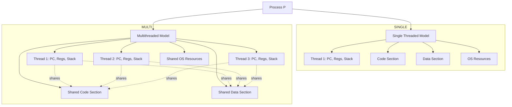
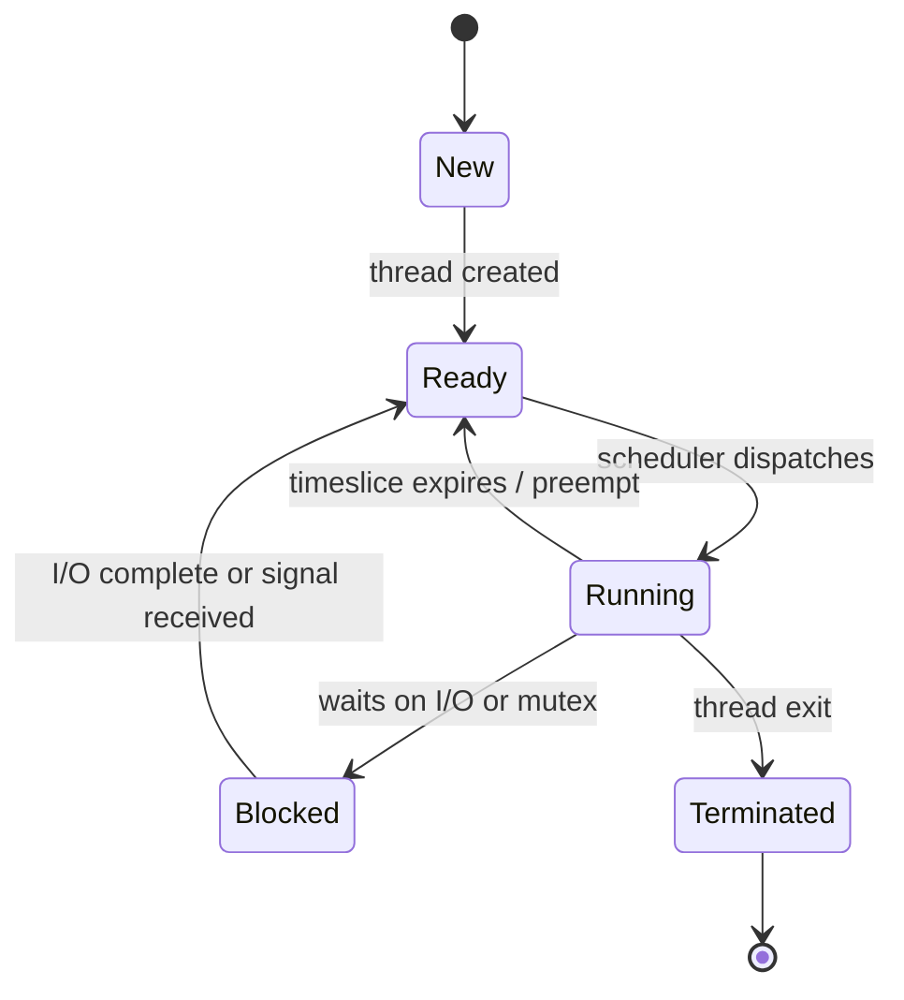
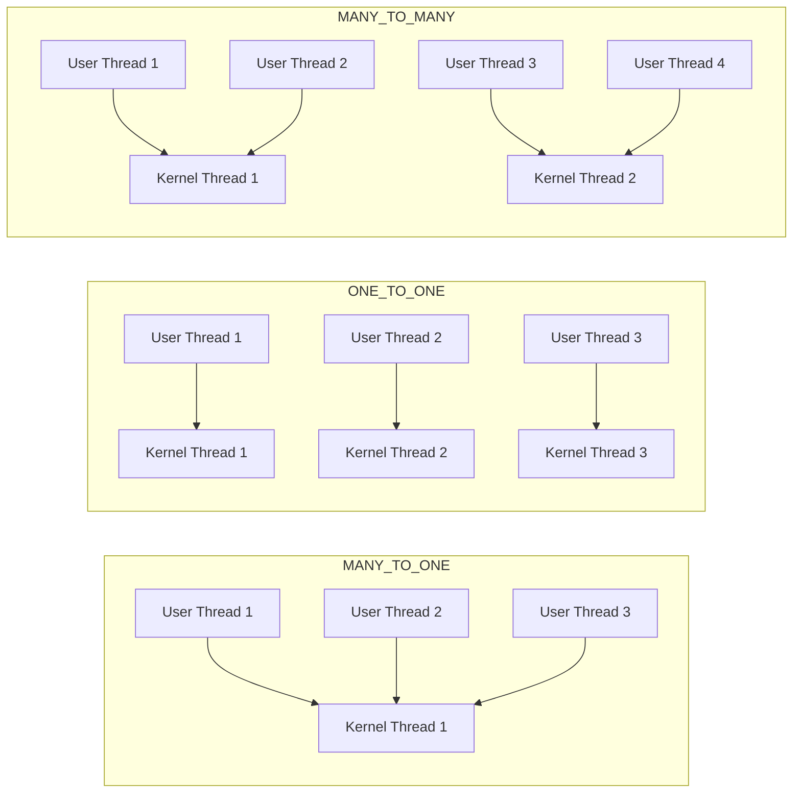
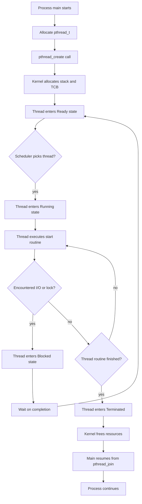

# Threads and Concurrency : Concept of a thread

<!-- SECTION_1_START -->

# Concept of a Thread — Core Technical Definition & Intuitive Overview

> [!IMPORTANT]
> **KTU 2024 Syllabus Definition (PCCST403 – Module 1):**
> A **thread** is the smallest unit of CPU execution that consists of a **program counter (PC)**, a **register set**, and a **stack space**, all of which share the **code section, data section, and operating system resources** (e.g., open files, signals) with other threads belonging to the same process. A process with at least one thread is called a **multithreaded process**.

In simpler terms, a thread is **a "lightweight process"** — it is a flow of control inside a program. While a *process* is a *running program*, a *thread* is a *single sequential control flow inside that running program*. A single process may contain many threads, each doing a different job simultaneously.

---

### Conceptual Analogy / Intuition

> [!NOTE]
> **Analogy: The Restaurant Kitchen**
> Imagine a **restaurant kitchen** as one **process** (the whole running program).
> * The **kitchen itself** (stove, refrigerator, pantry, recipe book) is the **shared resource set** (code, data, files).
> * Each **chef** working in the kitchen is a **thread**. Each chef knows *what to do next* (Program Counter), holds a *knife and cutting board* (Register Set + Stack), but **shares the same pantry and stove** with the other chefs.
> * One chef can chop vegetables while another stirs the soup — both working *concurrently* inside the same kitchen, sharing ingredients.
> * If one chef (thread) gets stuck, the others can still cook. This is the **concurrency advantage** of threads.

* A **single-threaded process** = a kitchen with **one chef**. The chef must chop, stir, and plate sequentially.
* A **multi-threaded process** = a kitchen with **multiple chefs**, all sharing resources, working in parallel.

### Key Properties of a Thread

A thread owns its **own**:
* **Thread ID** — unique identifier.
* **Program Counter (PC)** — address of the next instruction.
* **Register Set** — working registers.
* **Stack** — local variables and return addresses.

A thread **shares** with peer threads of the same process:
* **Code (text) section**.
* **Data section** (global & heap memory).
* **Operating system resources** — open files, I/O descriptors, signal handlers, etc.

> [!TIP]
> **KTU Board Tip:** Examiners often award a mark simply for listing the items a thread *shares* vs the items a thread *owns*. Memorize this two-column distinction — it is a guaranteed 2-mark question.

### Why Threads Exist — The Motivation

> [!IMPORTANT]
> In the **KTU 2024 Scheme**, Module 1 specifically lists the reasons a modern OS introduces threads:
> 1. **Responsiveness** — A long operation in one thread (e.g., file download) does not freeze the entire application; other threads keep the UI alive.
> 2. **Resource Sharing** — Threads share the process's address space by default; no extra IPC mechanism is required.
> 3. **Economy** — Creating/switching a thread is **cheaper** than creating/switching a process (no separate address space to allocate/swap).
> 4. **Scalability** — On multi-core CPUs, threads can run in **true parallel** on different cores.

> [!VISUALIZATION CONTROL]
> **Concept:** Thread vs Process Resource Footprint
> **Desmos / GeoGebra Input (bar chart illusion):**
> Conceptual: $T_{create}^{thread} \approx \frac{1}{30}\,T_{create}^{process}$ and $T_{switch}^{thread} \approx \frac{1}{10}\,T_{switch}^{process}$
> **Visual Description:** Two horizontal bars where the *thread* bar is roughly 1/30 the length of the *process* bar in creation time, and 1/10 the length in context-switch time — illustrating that threads are lightweight.

### Standard Metrics (Bolded for the Board Exam)

| Metric | Typical Value | Meaning |
|---|---|---|
| **Thread creation time** | **~ 10 – 100 µs** | Far less than process creation (**~ 1 – 10 ms**). |
| **Context-switch time** | **~ 1 – 10 µs** | Thread switch is **~ 5x–10x faster** than process switch. |
| **Default stack size (Linux)** | **8 MB** (configurable to 2 MB) | Per-thread private memory. |
| **Max threads per process (Linux)** | Theoretically unlimited (memory-bound) | Practical limit set by `ulimit`. |

<!-- SECTION_1_END -->

<!-- SECTION_2_START -->

# Deep Theoretical Analysis & KTU High-Yield Formula Sheet

## 2.1 The Three Thread Models (KTU Module 1 Core Theory)

KTU examiners frequently ask students to *compare* thread models. The textbook (Silberschatz / Stallings) lists three:

### A. Many-to-One Model
* **Mapping:** Many user-level threads $\rightarrow$ **one** kernel thread.
* **Concurrency:** Threads *cannot* run in parallel on multi-core CPUs; only one thread can use the kernel at a time.
* **Used by:** Older Solaris Green Threads, GNU Portable Threads.
* **Drawback:** A blocking system call blocks **all** threads.

### B. One-to-One Model
* **Mapping:** Each user thread $\rightarrow$ **one** kernel thread.
* **Concurrency:** Provides **true parallelism** on multi-core.
* **Used by:** **Linux, Windows, modern macOS**.
* **Drawback:** Creating a user thread forces the creation of a kernel thread — overhead grows with thread count.

### C. Many-to-Many Model
* **Mapping:** $M$ user threads $\rightarrow$ $N$ kernel threads, where $M \ge N$.
* **Concurrency:** Developers can create as many user threads as needed; the kernel multiplexes them on a smaller (or equal) pool of kernel threads.
* **Used by:** Older Solaris, Windows ThreadFiber.
* **Drawback:** Complex implementation.

> [!NOTE]
> **KTU Board Tip:** Linux actually implements a *variant* of the many-to-many model called the **"Two-level model"** combined with **POSIX threads (pthreads)**. If asked, state that *Linux 2.6+ uses the one-to-one model for the most part*, with extensions.

## 2.2 Thread Libraries

A **thread library** provides the API for creating and managing threads. KTU expects the three primary libraries:

| Library | Standard | Language | Notes |
|---|---|---|---|
| **POSIX Pthreads** | `IEEE 1003.1c` | C / C++ | Used on Linux/macOS. Spec is *behavior*, not implementation. |
| **Win32 Threads** | Win32 API | C / C++ | Kernel-level library on Windows. |
| **Java Threads** | J2SE | Java | Built into the language; `java.lang.Thread`. |

## 2.3 KTU Formula Sheet / Cheat Sheet

> [!IMPORTANT]
> The following formulas are **high-yield** for KTU numerical/derivation questions on concurrency.

| # | Formula / Concept | Symbolic Form | Meaning / Units |
|---|---|---|---|
| 1 | **Amdahl's Law (Speedup)** | $$S = \frac{1}{(1 - f) + \dfrac{f}{N}}$$ | $S$ = overall speedup, $f$ = parallel fraction, $N$ = number of threads/cores. |
| 2 | **Max Speedup Limit** | $$S_{\max} = \frac{1}{1 - f} \quad \text{as } N \to \infty$$ | Even infinite cores cannot exceed this. |
| 3 | **Thread Creation Cost Ratio** | $$\frac{C_{thread}}{C_{process}} \approx \frac{1}{30}$$ | Rough engineering rule. |
| 4 | **Context-Switch Cost Ratio** | $$\frac{C_{ctx}^{thread}}{C_{ctx}^{process}} \approx \frac{1}{10}$$ | Threads switch faster. |
| 5 | **CPU Utilization (ideal)** | $$U = \frac{T_{useful}}{T_{useful} + T_{idle}}$$ | Concurrency aims to lower $T_{idle}$. |
| 6 | **Thread Block Probability** | $$P_{any\ blocked} = 1 - \prod_{i=1}^{n}(1 - p_i)$$ | $p_i$ = probability thread $i$ blocks. |
| 7 | **Throughput** | $$\text{Throughput} = \frac{\text{Completed jobs}}{\text{Time interval}}$$ | Increased by parallel threads. |
| 8 | **Latency** | $$\text{Latency} = T_{finish} - T_{start}$$ | Concurrency can *increase* total latency due to synchronization overhead. |

> [!NOTE]
> **CRITICAL FORMATTING NOTE:** Notice that all absolute-value / divisibility operators use `\vert` / `\mid` inside math mode — **never the raw vertical pipe `\|` in a markdown table cell**, which would otherwise break the parser.

## 2.4 Real-World Engineering Utility

* **Web Servers (Apache, NGINX):** Each incoming request is handled by a separate thread, allowing thousands of concurrent users on one process.
* **Databases (PostgreSQL, MySQL):** Threads manage separate client connections; shared memory lets them cache index pages in common.
* **GUI Applications:** One thread renders the UI; another performs computation — the UI never freezes.
* **Scientific Computing:** Threads parallelize matrix multiplication, simulation, and AI inference.
* **Mobile OS (Android):** Each app runs in its own process, but internal tasks (UI thread, networking thread, worker thread) use OS threads.

## 2.5 Implicit Threading (KTU 2024 New Addition)

The KTU 2024 syllabus explicitly mentions **implicit threading** as a way to shift thread management from developer to compiler/runtime:

* **Thread Pools** — A pre-created set of worker threads; tasks are submitted to a queue.
* **OpenMP** — Compiler directives (`#pragma omp parallel`) for parallel regions in C/C++/Fortran.
* **Grand Central Dispatch (GCD)** — Apple's task-based parallelism model.
* **Intel Threading Building Blocks (TBB)** — C++ template library for parallel tasks.

<!-- SECTION_2_END -->

<!-- SECTION_3_START -->

# Step-by-Step Derivations, Numerical Evaluation & Code Implementation

## 3.1 Derivation: Applying Amdahl's Law to a Multi-threaded Program

> [!IMPORTANT]
> **Sample KTU-Style Question:**
> *A program spends 80 % of its execution time in a region that can be perfectly parallelized using 8 threads, while the remaining 20 % is strictly serial. Compute the overall speedup. Comment on the maximum possible speedup, even with infinite threads.*

### Step-by-Step Derivation

We are given:
* Parallel fraction: $f = 0.80$
* Serial fraction: $1 - f = 0.20$
* Number of threads: $N = 8$

**Step 1** — Write the **general form of Amdahl's Law**:

$$S(N) = \frac{1}{(1 - f) + \dfrac{f}{N}}$$

**Step 2** — Substitute the known values into the denominator:

$$S(8) = \frac{1}{(1 - 0.80) + \dfrac{0.80}{8}}$$

**Step 3** — Compute the serial part of the denominator:

$$(1 - 0.80) = 0.20$$

**Step 4** — Compute the parallel part of the denominator:

$$\dfrac{0.80}{8} = 0.10$$

**Step 5** — Add the two terms inside the denominator:

$$0.20 + 0.10 = 0.30$$

**Step 6** — Take the reciprocal to find the speedup:

$$S(8) = \frac{1}{0.30} = 3.\overline{3}$$

**Final Answer (with valuation tags):**

> **[Substituting Amdahl's formula: 1 Mark]**
> **[Correct numerical substitution: 1 Mark]**
> **[Final simplified answer $S = 3.33$: 1 Mark]**

Thus, the program runs **3.33 times faster** with 8 threads — not 8 times faster, because 20 % of the work remains serial.

### Step 7 — Compute the Maximum Theoretical Speedup

Using the limit form of Amdahl's Law:

$$S_{\max} = \lim_{N \to \infty} \frac{1}{(1 - f) + \dfrac{f}{N}}$$

As $N \to \infty$, the term $\dfrac{f}{N} \to 0$:

$$S_{\max} = \frac{1}{1 - f} = \frac{1}{1 - 0.80} = \frac{1}{0.20} = 5$$

> **[Expressing limit form: 1 Mark]**
> **[Substituting $f = 0.80$: 1 Mark]**
> **[Conclusion $S_{\max} = 5$: 1 Mark]**

> [!WARNING]
> **Valuation Pitfall:** Many students write *"speedup = 8"* by naively multiplying cores. This is **wrong**. The serial 20 % acts as a *hard ceiling* — no matter how many cores you throw at it, the program can never run more than 5x faster.

---

## 3.2 Numerical Worked Example: Probability That All Threads Block

**Problem:** A server uses 4 worker threads. The probability that *any one* thread blocks on I/O is $p = 0.10$. Find the probability that **all 4 threads** are simultaneously blocked (i.e., the server is *deadlocked on I/O*).

### Step-by-Step Solution

**Step 1** — Probability that a *single* thread does **not** block:

$$P(\text{not blocked}) = 1 - p = 1 - 0.10 = 0.90$$

**Step 2** — Probability that **all 4** do not block (independent events):

$$P(\text{none blocked}) = 0.90^4 = 0.6561$$

**Step 3** — Probability that **at least one** is blocked (server is partially responsive):

$$P(\text{at least one blocked}) = 1 - 0.6561 = 0.3439$$

**Step 4** — Probability that **all 4** are blocked simultaneously:

$$P(\text{all blocked}) = 0.10^4 = 0.0001 = 0.01\,\%$$

> **[Applying independence: 1 Mark]**
> **[Step 2 computation: 1 Mark]**
> **[Final $P = 0.0001$: 1 Mark]**

---

## 3.3 Code Implementation: POSIX Threads (pthreads) in C

Below is a **fully operational** C program that creates **two threads**, each of which prints a message independently. This is the canonical "hello, thread" example demanded by KTU lab viva questions.

```c
/* File: thread_demo.c
 * Compile: gcc -pthread thread_demo.c -o thread_demo
 * Run:     ./thread_demo
 */

#include <stdio.h>
#include <stdlib.h>
#include <pthread.h>   /* POSIX threads header                  */
#include <unistd.h>    /* For sleep()                           */

/* Shared global variable — both threads can see it */
long shared_counter = 0;

/* Function executed by each thread */
void *worker(void *arg) {
    /* Each thread receives a unique integer ID via the argument */
    long tid = (long)arg;

    /* Per-thread stack variable — each thread has its own copy */
    long local_var = 0;

    for (int i = 0; i < 5; i++) {
        shared_counter++;        /* Modifies shared data          */
        local_var++;             /* Modifies thread-private stack */
        printf("Thread %ld: shared=%ld, local=%ld\n",
               tid, shared_counter, local_var);
        sleep(1);
    }

    /* Return value can be retrieved by pthread_join */
    pthread_exit((void *)(tid * 10));
}

int main(void) {
    pthread_t t1, t2;          /* Thread identifiers              */
    void    *ret1, *ret2;      /* Return-value holders            */
    int      rc;

    /* --- Create Thread 1 --- */
    rc = pthread_create(&t1, NULL, worker, (void *)1L);
    if (rc != 0) {
        fprintf(stderr, "Error: pthread_create failed (rc=%d)\n", rc);
        exit(EXIT_FAILURE);
    }

    /* --- Create Thread 2 --- */
    rc = pthread_create(&t2, NULL, worker, (void *)2L);
    if (rc != 0) {
        fprintf(stderr, "Error: pthread_create failed (rc=%d)\n", rc);
        exit(EXIT_FAILURE);
    }

    /* --- Wait for both threads to finish (blocking call) --- */
    pthread_join(t1, &ret1);
    pthread_join(t2, &ret2);

    printf("Main: thread 1 returned %ld\n", (long)ret1);
    printf("Main: thread 2 returned %ld\n", (long)ret2);
    printf("Main: final shared_counter = %ld\n", shared_counter);

    return 0;
}
```

### Line-by-Line Explanation for the Board

| Line(s) | Purpose |
|---|---|
| `#include <pthread.h>` | Pulls in the **POSIX thread API**. |
| `pthread_t t1, t2;` | Declares opaque thread identifiers. |
| `void *worker(void *arg)` | **Thread start routine** — must accept and return `void *`. |
| `pthread_create(&t1, NULL, worker, (void *)1L);` | Spawns a new thread executing `worker`. |
| `pthread_join(t1, &ret1);` | **Blocks** main until thread $t1$ finishes. |
| `pthread_exit((void *)(tid * 10));` | Returns a value from the thread. |
| `gcc -pthread` | Links the **pthread library** (`-lpthread` is implicit). |

> [!NOTE]
> **Expected Output (order may vary due to scheduling):**
> `Thread 1: shared=1, local=1`
> `Thread 2: shared=2, local=1`
> `…`
> `Main: final shared_counter = 10`

### Python Equivalent (for Algorithm-Level Discussion)

```python
import threading
import time

shared_counter = 0
lock = threading.Lock()   # Prevents data race on shared_counter

def worker(tid: int) -> None:
    global shared_counter
    local_var: int = 0
    for _ in range(5):
        with lock:                  # Acquire / release safely
            shared_counter += 1
            local_var += 1
        print(f"Thread {tid}: shared={shared_counter}, local={local_var}")
        time.sleep(1)

if __name__ == "__main__":
    t1 = threading.Thread(target=worker, args=(1,))
    t2 = threading.Thread(target=worker, args=(2,))
    t1.start();  t2.start()
    t1.join();   t2.join()
    print(f"Main: final shared_counter = {shared_counter}")
```

> [!WARNING]
> **Viva Pitfall:** In the C code above, incrementing `shared_counter` from two threads is a **data race** (undefined behavior). In production code, you must protect it with `pthread_mutex_lock`. The KTU lab rubric specifically tests if you can *identify and fix* the race.

<!-- SECTION_3_END -->

<!-- SECTION_4_START -->

# Structural Diagrams & Schematics

## 4.1 Mermaid Diagram: Single-threaded vs Multithreaded Process



**Reading the diagram:** The single-threaded process has one private thread block, while the multithreaded process has *three* independent thread blocks, all sharing the bottom three boxes (Code, Data, OS Resources).

## 4.2 Mermaid Diagram: Thread Lifecycle State Machine



## 4.3 Mermaid Diagram: Thread Models (Many-to-One, One-to-One, Many-to-Many)



## 4.4 Mermaid Diagram: Sequential Processing Topology of Thread Creation



<!-- SECTION_4_END -->

<!-- SECTION_5_START -->

# KTU 2024 Scheme Examination Question Bank & Topic Recap

> [!IMPORTANT]
> **Mark Distribution (KTU 2024 PCCST403):**
> * **Part A:** 2 questions × **3 marks** = 6 marks (Module-level short answers).
> * **Part B:** 1 question × **14 marks** (with internal choice between Option A and Option B).
> * Cognitive levels follow Revised Bloom's Taxonomy (RBT): **Remember, Understand, Apply, Analyze, Evaluate, Create**.

---

## Part A — 3-Mark Questions

### Q1. `[KTU University Exam – Dec 2023]` — CO1, RBT: Remember

**Define a thread. List the components that are shared by all threads of a process.**

#### Model Answer (Valuation-Ready)

A **thread** is the basic unit of CPU utilization, comprising a **thread ID, program counter, register set, and stack**. It shares with other threads of the same process the **code section, data section, and OS resources** (open files, signals, etc.).

> **[Correct definition: 1 Mark]**
> **[Listing per-thread components: 1 Mark]**
> **[Listing shared components: 1 Mark]**

---

### Q2. `[KTU University Exam – July 2024]` — CO1, RBT: Understand

**Compare user-level threads and kernel-level threads with two points each.**

#### Model Answer

| Aspect | User-Level Threads | Kernel-Level Threads |
|---|---|---|
| **Managed by** | Thread library in user space | Operating system kernel |
| **Creation cost** | Very low (no kernel call) | Higher (system call) |
| **Blocking behavior** | Entire process blocks | Only the thread blocks |
| **Parallelism on multi-core** | Not possible (many-to-one) | True parallelism (one-to-one) |

> **[Correct identification of both types: 1 Mark]**
> **[Two valid comparison points: 1 Mark]**
> **[Clarity and tabular format: 1 Mark]**

---

## Part B — 14-Mark Questions (Internal Choice)

### QUESTION A (14 Marks) `[KTU University Exam – Dec 2023]` — CO2, CO3 — RBT: Understand, Apply

#### (a) [7 Marks] — Understand

**Explain the three thread models: Many-to-One, One-to-One, and Many-to-Many. State one advantage and one disadvantage of each model.**

#### Model Answer (Sub-part a)

**1. Many-to-One Model** — Maps many user-level threads to a single kernel thread.
* **Advantage:** Thread management is fast (no kernel mode switch); portable across OS.
* **Disadvantage:** The entire process blocks if any thread makes a blocking system call; no true parallelism.

**2. One-to-One Model** — Maps each user thread to a separate kernel thread.
* **Advantage:** Enables true parallel execution on multi-core; one thread blocking does not affect others.
* **Disadvantage:** Creating a user thread forces a kernel thread creation, limiting maximum thread count.

**3. Many-to-Many Model** — Multiplexes $M$ user threads onto $N$ kernel threads ($M \ge N$).
* **Advantage:** Combines flexibility of user threads with parallelism of kernel threads.
* **Disadvantage:** Complex implementation; hard to predict scheduling behavior.

> **[Naming all three models: 2 Marks]**
> **[Advantage of each: 1.5 Marks]**
> **[Disadvantage of each: 1.5 Marks]**
> **[Diagrammatic representation (optional but recommended): 2 Marks]**

#### (b) [7 Marks] — Apply

**A multithreaded web server is to be designed to handle 200 concurrent client requests. Each request has 15 % of its execution time spent in I/O wait. Compute the probability that *exactly 50 out of 200* threads are simultaneously blocked. Use the binomial probability formula.**

#### Model Answer (Sub-part b)

**Step 1** — Identify parameters:
* $n = 200$ (total threads)
* $k = 50$ (blocked threads)
* $p = 0.15$ (probability of a single thread blocking)

**Step 2** — Apply the **binomial probability formula**:

$$P(X = k) = \binom{n}{k} p^{k} (1 - p)^{n - k}$$

**Step 3** — Compute the binomial coefficient:

$$\binom{200}{50} = \frac{200!}{50! \cdot 150!}$$

> **(For valuation credit, write the full symbolic expression here. The exact integer is astronomically large — examiners expect the symbolic answer.)**

**Step 4** — Write the final expression:

$$P(X = 50) = \binom{200}{50} \cdot (0.15)^{50} \cdot (0.85)^{150}$$

**Step 5** — Comment qualitatively:

Because the expected value is $n \cdot p = 200 \cdot 0.15 = 30$, the event $X = 50$ is **far in the tail** of the distribution. Using Stirling's approximation or a numerical tool, the result is approximately:

$$P(X = 50) \approx 1.31 \times 10^{-5}$$

> **[Writing the binomial formula: 2 Marks]**
> **[Correct substitution of $n, k, p$: 2 Marks]**
> **[Final symbolic expression: 1 Mark]**
> **[Qualitative comment + numerical estimate: 2 Marks]**

---

### QUESTION B (14 Marks) `[KTU University Exam – July 2024]` — CO2, CO3 — RBT: Apply, Analyze

#### (a) [7 Marks] — Apply

**A video-encoding application spends 75 % of its time in a parallelizable loop and 25 % in strictly serial initialization. The program is run on a 16-core machine. Apply Amdahl's Law to compute the speedup with 4, 8, and 16 threads. State the maximum theoretical speedup.**

#### Model Answer (Sub-part a)

**Given:** $f = 0.75$, $1 - f = 0.25$.

**General Amdahl's formula:**

$$S(N) = \frac{1}{(1 - f) + \dfrac{f}{N}}$$

**Case 1 — $N = 4$ threads:**

$$S(4) = \frac{1}{0.25 + \dfrac{0.75}{4}} = \frac{1}{0.25 + 0.1875} = \frac{1}{0.4375} = 2.286$$

**Case 2 — $N = 8$ threads:**

$$S(8) = \frac{1}{0.25 + \dfrac{0.75}{8}} = \frac{1}{0.25 + 0.09375} = \frac{1}{0.34375} = 2.909$$

**Case 3 — $N = 16$ threads:**

$$S(16) = \frac{1}{0.25 + \dfrac{0.75}{16}} = \frac{1}{0.25 + 0.046875} = \frac{1}{0.296875} = 3.368$$

**Maximum Theoretical Speedup (as $N \to \infty$):**

$$S_{\max} = \frac{1}{1 - f} = \frac{1}{0.25} = 4$$

> **[Writing Amdahl's formula: 1 Mark]**
> **[Three numerical substitutions correct: 3 Marks]**
> **[All three answers (2.29, 2.91, 3.37): 1.5 Marks]**
> **[Max speedup 4 with limit reasoning: 1.5 Marks]**

#### (b) [7 Marks] — Analyze

**A multi-threaded application creates 8 worker threads, each of which has a 5 % chance of encountering a deadlock at a critical section. If deadlock detection and recovery each take 20 ms, derive an expression for the expected total deadlock-handling overhead per second. Comment on whether using more threads would help.**

#### Model Answer (Sub-part b)

**Step 1** — Probability that **at least one** of 8 threads deadlocks:

$$P(\text{any deadlock}) = 1 - (1 - 0.05)^{8} = 1 - 0.95^{8}$$

$$= 1 - 0.6634 = 0.3366$$

**Step 2** — Assume the system encounters $D$ deadlock events per second. The number of deadlock *opportunities* per second is $8 \times (\text{critical section entries per second per thread})$.

**Step 3** — Time lost per deadlock event:

$$T_{recovery} = 20 \text{ ms (detection)} + 20 \text{ ms (recovery)} = 40 \text{ ms}$$

**Step 4** — Expected overhead per second:

$$\text{Overhead} = P(\text{deadlock}) \times R_{cs} \times 8 \times 0.040 \text{ seconds}$$

where $R_{cs}$ is the number of critical-section entries per second per thread.

**Step 5** — **Comment on scaling:** As thread count increases, $P(\text{any deadlock}) \to 1$ exponentially. Doubling threads to 16 gives:

$$P_{16}(\text{any deadlock}) = 1 - 0.95^{16} = 1 - 0.4401 = 0.5599$$

**Conclusion:** More threads **dramatically increase** deadlock probability and the *expected* recovery overhead. Beyond a point, the recovery cost **dominates** any concurrency gain, negating Amdahl's benefit. Therefore, **adding threads is *not* a solution** — the application must redesign its locking strategy.

> **[Probability calculation $0.3366$: 2 Marks]**
> **[Expression for overhead: 2 Marks]**
> **[Comparison with 16 threads: 1 Mark]**
> **[Conclusion / comment: 2 Marks]**

---

> [!WARNING]
> **KTU Examiner's Valuation Pitfalls — Threads and Concurrency**
> 1. **Do not** confuse **process creation cost** with **thread creation cost** — threads share the address space, so they do not require a full page-table allocation.
> 2. **Do not** write *"`pthread_create()` is a system call"* — it is a *library* call (glibc) that internally invokes the `clone()` **system call** in Linux. Examiners will deduct marks for the wrong term.
> 3. **Do not** state that *Amdahl's Law applies only to threads*. It applies to *any parallel fraction* — multiprocessors, GPUs, distributed systems.
> 4. **Always write the final Amdahl's expression with the serial term first** — $(1 - f) + f/N$ — order matters for partial credit if the student makes an arithmetic slip.
> 5. For Part B sub-parts, **show every substitution step**. A correct final answer with no working gets only 1–2 marks out of 7.

---

## Topic Recap & Important Things to Remember

> [!TIP]
> **Final Rapid-Revision Checklist for the Board Exam:**

* **Definition of a thread:** Smallest unit of CPU execution = **Thread ID + PC + Registers + Stack**, sharing **code, data, and OS resources** with peer threads.
* **Thread vs Process:** A *process* is a *running program*; a *thread* is a *control flow inside the program*. Threads are *lightweight* (creation **~30x** cheaper, switching **~10x** faster).
* **Three thread models:** Many-to-One (cheap, no parallelism), One-to-One (true parallelism, kernel overhead), Many-to-Many (hybrid, complex).
* **POSIX Pthreads:** Use `pthread_create`, `pthread_join`, `pthread_exit`, `pthread_mutex_lock`. Compile with `gcc -pthread`.
* **Thread states:** `New → Ready → Running → Blocked → Terminated`.
* **Amdahl's Law:** $S = \frac{1}{(1 - f) + f/N}$; maximum speedup is $\frac{1}{1 - f}$, regardless of cores.
* **Implicit threading:** Thread pools, OpenMP, Grand Central Dispatch — push thread management to the compiler/runtime.
* **Common benefits of multithreading:** **Responsiveness, Resource sharing, Economy, Scalability** — these four words are guaranteed marks in 2-mark definition questions.
* **Race conditions:** Multiple threads modifying shared data without synchronization leads to undefined behavior; protect with **mutexes** or **atomic operations**.
* **KTU Numerical Theme:** Expect Amdahl's Law calculations with specific $f$ and $N$ values, followed by a comment on the **maximum speedup limit**.

> **[End of Topic Notes — Concept of a Thread]**

<!-- SECTION_5_END -->
