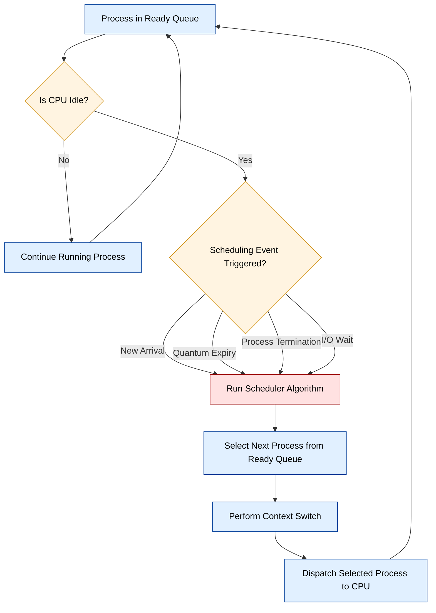
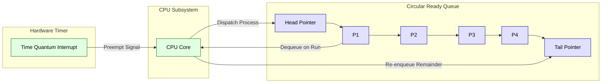
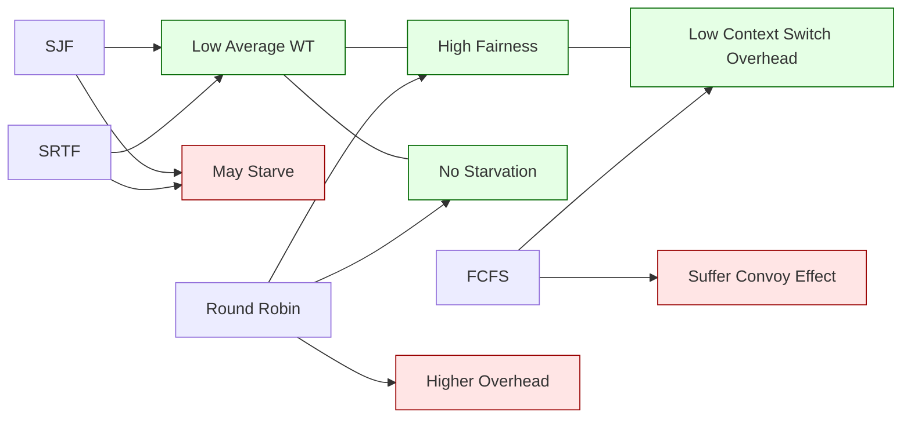

# CPU Scheduling: criteria and types; Algorithms: FCFS, SJF, and Round Robin scheduling with problems

<!-- SECTION_1_START -->

# CPU Scheduling: Definition, Intuition, and Engineering Context

## 1.1 Formal Academic Definition (KTU 2024 Syllabus Terminology)

**CPU Scheduling** is the fundamental Operating System mechanism by which the kernel's *scheduler* (also called the *dispatcher* or *short-term scheduler*) selects one of the many processes residing in the **Ready Queue** of main memory and allocates the central processing unit (CPU) to it for execution. Whenever the CPU becomes idle, the OS must make a choice from among the eligible processes waiting in the ready queue; this selection procedure is termed **CPU Scheduling**.

The entity that performs the run-time selection logic is called the **CPU Scheduler**. When a process transitions from the **Running** state back to the **Ready** state (e.g., due to a clock interrupt or preemption), the scheduler is invoked again — this is called **Preemptive Scheduling**. Conversely, when a process is scheduled only when it terminates or voluntarily relinquishes the CPU, it is called **Non-Preemptive (Cooperative) Scheduling**.

> [!IMPORTANT]
> **KTU 2024 Scheme Definition:** "CPU Scheduling determines which of the processes in the ready queue is allocated the CPU when it becomes available. It is the basis of multiprogrammed operating systems and directly impacts throughput, fairness, and responsiveness."

## 1.2 The Five Canonical Scheduling Criteria

The KTU syllabus mandates mastery of the following **five performance criteria** that an evaluator uses to compare scheduling algorithms:

| # | Criterion | Symbol | Definition | Ideal Direction |
|---|---|---|---|---|
| 1 | **CPU Utilization** | $U$ | Percentage of time the CPU is busy doing useful work. | $\uparrow$ Maximize |
| 2 | **Throughput** | $\Theta$ | Number of processes completed per unit time. | $\uparrow$ Maximize |
| 3 | **Turnaround Time** | $TAT$ | Time from process submission (arrival) to completion. | $\downarrow$ Minimize |
| 4 | **Waiting Time** | $WT$ | Total time a process spends in the ready queue. | $\downarrow$ Minimize |
| 5 | **Response Time** | $RT$ | Time from first submission to the first time the CPU is allocated. | $\downarrow$ Minimize |

> [!NOTE]
> **TAT vs WT vs RT — A common confusion:** Response time only counts up to the *first* CPU allocation. Waiting time accumulates every time the process is in the ready queue. Turnaround time is the *total* lifecycle duration (including actual CPU execution and I/O).

## 1.3 Intuitive Real-World Analogy

Imagine a **single barista** (CPU) and a queue of customers (processes) lined up at a coffee shop. The barista must decide **whose order to make next**. The barista can either:

- **FCFS (First-Come, First-Served):** Serve the line strictly in arrival order. Fair, but if a giant corporate order (long burst) is at the front, all the small latte customers behind must wait.
- **SJF (Shortest Job First):** Always pick the customer with the smallest drink. Excellent for minimizing average wait, but the poor customer who wants an elaborate frappuccino may never get served (**starvation**).
- **Round Robin:** Give each customer exactly **30 seconds** of attention, then rotate to the next. Nobody starves; everyone makes *some* progress, but the total time for the small order grows.

This queue-management problem is mathematically and structurally identical to CPU scheduling — the barista is the dispatcher, customers are processes, drinks are CPU bursts, and the menu is the scheduling policy.

> [!VISUALIZATION CONTROL]
> **Concept:** Gantt Chart representation of process execution along a time axis.
> **GeoGebra / Desmos Input Equations:**
> * `x_1 = 0, x_2 = 5, y = 1` and `x = 5, y = 0 to 2` (P1 bar)
> * `x_1 = 5, x_2 = 8, y = 1` and `x = 5, y = 0 to 2` (P2 bar)
> **Visual Description:** The student should observe horizontal bars stacked on a single horizontal time-axis (0 to $T$), where each colored bar represents a process executing on the CPU. Overlapping bars would indicate multi-CPU systems (out of scope here).

<!-- SECTION_1_END -->

<!-- SECTION_2_START -->

# Deep Theoretical Analysis & KTU High-Yield Formula Sheet

## 2.1 Classification of CPU Scheduling Algorithms

The KTU 2024 syllabus groups CPU schedulers along two orthogonal axes:

1. **Preemption Axis:** Preemptive vs Non-Preemptive
2. **Priority/Selection Axis:** Priority-based, Time-Sharing, or Multilevel

The three algorithms in this module map as follows:

| Algorithm | Abbreviation | Preemption | Type | Starvation Risk |
|---|---|---|---|---|
| First-Come, First-Served | **FCFS** | Non-Preemptive | Batch / FIFO | No |
| Shortest Job First | **SJF** | Non-Preemptive | Batch / Optimal WT | Yes |
| Shortest Remaining Time First | **SRTF** | Preemptive variant of SJF | Batch | Yes |
| Round Robin | **RR** | Preemptive | Time-Sharing | No |

## 2.2 The Master Formula Sheet (Board-Exam Grade)

> [!IMPORTANT]
> **KTU 2024 Valuation Key:** Always write the formulas *before* substituting values. Marks are awarded specifically for stating the formula in symbolic form.

$$
\text{Completion Time (CT)} = \text{Time at which process finishes execution}
$$

$$
\text{Turnaround Time (TAT)} = CT - AT
$$

$$
\text{Waiting Time (WT)} = TAT - BT
$$

$$
\text{Response Time (RT)} = \text{First CPU Allocation} - AT
$$

$$
\text{Average WT} = \frac{1}{n} \sum_{i=1}^{n} WT_i \qquad \text{Average TAT} = \frac{1}{n} \sum_{i=1}^{n} TAT_i
$$

$$
\text{CPU Utilization (\%)} = \frac{\text{Busy Time}}{\text{Total Time}} \times 100
$$

$$
\text{Throughput} = \frac{n}{\text{Total Elapsed Time}} \quad \text{processes/unit time}
$$

### 2.2.1 Algorithm-Specific Properties (High-Yield Table)

| Property | FCFS | SJF (Non-Preemptive) | SRTF (Preemptive) | Round Robin |
|---|---|---|---|---|
| Decision at | Process arrival / termination | Process arrival / termination | Every clock tick / new arrival | Every Time Quantum expiry |
| Data structure | FIFO Queue | Priority Queue (min-heap) | Priority Queue (min-heap) | Circular FIFO Queue |
| Average WT | High (Convoy Effect) | **Provably minimum** (non-preemptive) | **Provably minimum** (preemptive) | Moderate (depends on TQ) |
| Fairness | FIFO order | None — may starve | None — may starve | **Provably fair** |
| Overhead | Very low | Moderate | High (constant reordering) | Moderate |

## 2.3 The Convoy Effect (FCFS Pathology)

The **Convoy Effect** is a phenomenon where a single CPU-bound process with a long burst time delays all I/O-bound and short processes behind it. It is the single most-cited drawback of FCFS in KTU valuation scripts.

> [!WARNING]
> **Examiner's Trap:** If a question lists one process with a very large burst time followed by several tiny ones, the examiner expects you to *name and explain* the convoy effect (1 mark) in your own words, then proceed to demonstrate it numerically in the Gantt chart.

## 2.4 Real-World Engineering Utility

- **FCFS** is used in **batch systems** (e.g., legacy mainframes, Hadoop YARN FIFO schedulers) where simplicity outweighs interactivity.
- **SJF / SRTF** form the theoretical foundation for modern **Linux CFS (Completely Fair Scheduler)** and **Windows NTFS** priority boosting mechanisms.
- **Round Robin** is the de-facto standard in **time-sharing systems** (Linux, Windows desktop, macOS GUI), and its principles underlie **modern preemptive multitasking kernels**.

## 2.5 Burst Time Estimation (SJF Prerequisite)

Since SJF requires knowledge of the CPU burst duration in advance, the OS uses **exponential averaging** to predict the next burst:

$$
\tau_{n+1} = \alpha \cdot t_n + (1 - \alpha) \cdot \tau_n
$$

where:
- $\tau_{n+1}$ = predicted next burst
- $t_n$ = actual burst of the $n$-th instance
- $\alpha$ = smoothing factor ($0 \le \alpha \le 1$)
- $\tau_n$ = previous prediction

<!-- SECTION_2_END -->

<!-- SECTION_3_START -->

# Step-by-Step Derivations, Numerical Solutions & Python Implementation

## 3.1 Canonical Reference Problem (Used Throughout Section 3)

We will use the following **single dataset** to solve all three algorithms, allowing direct comparison:

| Process | Arrival Time (AT) | Burst Time (BT) |
|---|---|---|
| $P_1$ | 0 | **5** |
| $P_2$ | 1 | **3** |
| $P_3$ | 2 | **8** |
| $P_4$ | 3 | **6** |

**Step 0 (Mandatory for marks):** Declare the formula set to be used.

> *Formulas to be used:*
> $TAT_i = CT_i - AT_i$, $\quad WT_i = TAT_i - BT_i$, $\quad \overline{WT} = \frac{1}{n}\sum WT_i$, $\quad \overline{TAT} = \frac{1}{n}\sum TAT_i$

---

## 3.2 Algorithm 1: FCFS (First-Come, First-Served) — Exhaustive Solution

### 3.2.1 Operational Logic

Step 1: Sort all processes by their **Arrival Time** in ascending order.

Step 2: The first arrived process gets the CPU immediately. It runs uninterrupted to completion (non-preemptive).

Step 3: At the moment the current process finishes, the next-arrived process in the sorted order is dispatched.

Step 4: Repeat until all processes complete.

### 3.2.2 Gantt Chart Construction

The sorted order is $P_1 \rightarrow P_2 \rightarrow P_3 \rightarrow P_4$ (already sorted by AT).

$$
\begin{aligned}
P_1 &: 0 \rightarrow 5 \quad (CT_1 = 5) \\
P_2 &: 5 \rightarrow 8 \quad (CT_2 = 8) \\
P_3 &: 8 \rightarrow 16 \quad (CT_3 = 16) \\
P_4 &: 16 \rightarrow 22 \quad (CT_4 = 22)
\end{aligned}
$$

### 3.2.3 Tabular Derivation of TAT and WT

For each process, the computation chain is:

$$
\begin{aligned}
TAT_i &= CT_i - AT_i \\
WT_i &= TAT_i - BT_i
\end{aligned}
$$

| Process | AT | BT | CT | TAT = CT $-$ AT | WT = TAT $-$ BT |
|---|---|---|---|---|---|
| $P_1$ | 0 | 5 | 5  | 5  | 0  |
| $P_2$ | 1 | 3 | 8  | 7  | 4  |
| $P_3$ | 2 | 8 | 16 | 14 | 6  |
| $P_4$ | 3 | 6 | 22 | 19 | 13 |
| **Sum** | | | | **45** | **23** |
| **Average** | | | | **11.25** | **5.75** |

> *KTU Valuation Mark Split:* [Gantt Chart: 3 Marks] [TAT calculation: 2 Marks] [WT calculation: 2 Marks] [Averages: 2 Marks]

---

## 3.3 Algorithm 2: SJF (Non-Preemptive) — Exhaustive Solution

### 3.3.1 Operational Logic

Step 1: At $t = 0$, only $P_1$ is in the ready queue. Schedule it (it has no competitor).

Step 2: At $t = 5$, when $P_1$ finishes, the ready queue contains $\{P_2, P_3, P_4\}$. Pick the one with the **minimum BT** (ties broken by lower AT or lower PID).

Step 3: Selected process runs to completion (non-preemptive). At its finish, repeat Step 2 with the new ready queue.

### 3.3.2 Gantt Chart Construction

$$
\begin{aligned}
\text{At } t=0: &\ \text{Ready} = \{P_1\} \Rightarrow \text{Schedule } P_1, \text{runs } 0 \rightarrow 5. \\
\text{At } t=5: &\ \text{Ready} = \{P_2 (BT=3), P_3 (BT=8), P_4 (BT=6)\} \Rightarrow \text{Min BT is } P_2. \\
&\ P_2 \text{ runs } 5 \rightarrow 8. \\
\text{At } t=8: &\ \text{Ready} = \{P_3 (BT=8), P_4 (BT=6)\} \Rightarrow \text{Min BT is } P_4. \\
&\ P_4 \text{ runs } 8 \rightarrow 14. \\
\text{At } t=14: &\ \text{Ready} = \{P_3\} \Rightarrow P_3 \text{ runs } 14 \rightarrow 22.
\end{aligned}
$$

| Process | Start | End |
|---|---|---|
| $P_1$ | 0  | 5  |
| $P_2$ | 5  | 8  |
| $P_4$ | 8  | 14 |
| $P_3$ | 14 | 22 |

### 3.3.3 Tabular Derivation

| Process | AT | BT | CT | TAT = CT $-$ AT | WT = TAT $-$ BT |
|---|---|---|---|---|---|
| $P_1$ | 0 | 5 | 5  | 5  | 0  |
| $P_2$ | 1 | 3 | 8  | 7  | 4  |
| $P_3$ | 2 | 8 | 22 | 20 | 12 |
| $P_4$ | 3 | 6 | 14 | 11 | 5  |
| **Sum** | | | | **43** | **21** |
| **Average** | | | | **10.75** | **5.25** |

> **Observation:** Average WT dropped from **5.75 (FCFS) to 5.25 (SJF)**. This is the empirical proof of SJF optimality for non-preemptive scheduling.

---

## 3.4 Algorithm 3: SRTF (Shortest Remaining Time First) — Preemptive SJF

### 3.4.1 Operational Logic

Step 1: Re-evaluate the schedule **at every arrival event** (and at every tick — but textbook problems only need to check at arrivals).

Step 2: When a new process arrives, compare its **BT** with the **remaining time** of the currently running process. If the new process has strictly less remaining, **preempt**.

### 3.4.2 Event-by-Event Gantt Chart

| Time | Event | Decision | Running | Ready Queue (after event) |
|---|---|---|---|---|
| 0 | $P_1$ arrives (BT=5) | $P_1$ has no competitor | $P_1$ | $\{\}$ |
| 1 | $P_2$ arrives (BT=3) | $P_1$ has 4 remaining; $P_2$ needs 3. $3 < 4$ ⇒ **Preempt** | $P_2$ | $\{P_1 (4)\}$ |
| 2 | $P_3$ arrives (BT=8) | $P_2$ has 2 remaining; $P_3$ needs 8. $2 < 8$ ⇒ **Continue $P_2$** | $P_2$ | $\{P_1(4), P_3(8)\}$ |
| 3 | $P_4$ arrives (BT=6) | $P_2$ has 1 remaining; $P_4$ needs 6. $1 < 6$ ⇒ **Continue $P_2$** | $P_2$ | $\{P_1(4), P_3(8), P_4(6)\}$ |
| 4 | $P_2$ completes | $P_1$ has 4, $P_3$ has 8, $P_4$ has 6 ⇒ min is $P_1$ | $P_1$ | $\{P_3(8), P_4(6)\}$ |
| 8 | $P_1$ completes | $P_3$ has 8, $P_4$ has 6 ⇒ min is $P_4$ | $P_4$ | $\{P_3(8)\}$ |
| 14 | $P_4$ completes | $P_3$ is alone | $P_3$ | $\{\}$ |
| 22 | $P_3$ completes | DONE | — | — |

### 3.4.3 Gantt Chart Visualization

$$
\begin{aligned}
P_1 &: 0 \rightarrow 1, \quad 4 \rightarrow 8 \\
P_2 &: 1 \rightarrow 4 \\
P_4 &: 8 \rightarrow 14 \\
P_3 &: 14 \rightarrow 22
\end{aligned}
$$

### 3.4.4 Tabular Derivation

| Process | AT | BT | CT | TAT = CT $-$ AT | WT = TAT $-$ BT |
|---|---|---|---|---|---|
| $P_1$ | 0 | 5 | 8  | 8  | 3  |
| $P_2$ | 1 | 3 | 4  | 3  | 0  |
| $P_3$ | 2 | 8 | 22 | 20 | 12 |
| $P_4$ | 3 | 6 | 14 | 11 | 5  |
| **Sum** | | | | **42** | **20** |
| **Average** | | | | **10.50** | **5.00** |

> **Observation:** SRTF achieved the **lowest possible average WT (5.00)** — this is the theoretical lower bound for any scheduling policy on this dataset.

---

## 3.5 Algorithm 4: Round Robin (Time Quantum = 2) — Exhaustive Solution

### 3.5.1 Operational Logic

Step 1: Maintain a **circular FIFO ready queue**. Newly arriving processes are appended to the tail.

Step 2: A process is given the CPU for **at most $TQ$ time units**. If it does not finish, it is preempted and re-appended to the tail.

Step 3: If it finishes within $TQ$, it leaves the system; the next process is dequeued.

### 3.5.2 Tick-by-Tick Gantt Chart (TQ = 2)

We track: `(running process, remaining BT, queue before dispatch, queue after dispatch)`.

| Tick | Running | Starts with | After 2 ticks (or finish) | Queue Tail Order |
|---|---|---|---|---|
| 0–2  | $P_1$ | $P_1(5)$ | $P_1(3)$ | $P_2, P_3, P_4, P_1$ |
| 2–4  | $P_2$ | $P_2(3)$ | $P_2(1)$ | $P_3, P_4, P_1, P_2$ |
| 4–6  | $P_3$ | $P_3(8)$ | $P_3(6)$ | $P_4, P_1, P_2, P_3$ |
| 6–8  | $P_4$ | $P_4(6)$ | $P_4(4)$ | $P_1, P_2, P_3, P_4$ |
| 8–10 | $P_1$ | $P_1(3)$ | $P_1(1)$ | $P_2, P_3, P_4, P_1$ |
| 10–11 | $P_2$ | $P_2(1)$ | **P_2 finishes (CT=11)** | $P_3, P_4, P_1$ |
| 11–13 | $P_3$ | $P_3(6)$ | $P_3(4)$ | $P_4, P_1, P_3$ |
| 13–15 | $P_4$ | $P_4(4)$ | $P_4(2)$ | $P_1, P_3, P_4$ |
| 15–16 | $P_1$ | $P_1(1)$ | **P_1 finishes (CT=16)** | $P_3, P_4$ |
| 16–18 | $P_3$ | $P_3(4)$ | $P_3(2)$ | $P_4, P_3$ |
| 18–20 | $P_4$ | $P_4(2)$ | **P_4 finishes (CT=20)** | $P_3$ |
| 20–22 | $P_3$ | $P_3(2)$ | **P_3 finishes (CT=22)** | $\{\}$ |

### 3.5.3 Gantt Chart Visualization (Linear Form)

$$
P_1(0\text{--}2) \rightarrow P_2(2\text{--}4) \rightarrow P_3(4\text{--}6) \rightarrow P_4(6\text{--}8) \rightarrow P_1(8\text{--}10) \rightarrow P_2(10\text{--}11) \rightarrow P_3(11\text{--}13) \rightarrow P_4(13\text{--}15) \rightarrow P_1(15\text{--}16) \rightarrow P_3(16\text{--}18) \rightarrow P_4(18\text{--}20) \rightarrow P_3(20\text{--}22)
$$

### 3.5.4 Tabular Derivation

| Process | AT | BT | CT | TAT = CT $-$ AT | WT = TAT $-$ BT |
|---|---|---|---|---|---|
| $P_1$ | 0 | 5 | 16 | 16 | 11 |
| $P_2$ | 1 | 3 | 11 | 10 | 7  |
| $P_3$ | 2 | 8 | 22 | 20 | 12 |
| $P_4$ | 3 | 6 | 20 | 17 | 11 |
| **Sum** | | | | **63** | **41** |
| **Average** | | | | **15.75** | **10.25** |

> **Observation:** RR's average WT is **worse** than FCFS for this small quantum. This is normal because context switches are frequent. As $TQ \rightarrow \infty$, RR degenerates into FCFS.

---

## 3.6 Reference Comparison Table (Board-Exam Ready)

| Algorithm | $\overline{WT}$ | $\overline{TAT}$ | Starvation | Convoy Effect |
|---|---|---|---|---|
| FCFS | 5.75 | 11.25 | No | **Yes (severe)** |
| SJF | 5.25 | 10.75 | Yes | No |
| SRTF | **5.00** | **10.50** | Yes | No |
| Round Robin (TQ=2) | 10.25 | 15.75 | No | No |

---

## 3.7 Python Implementation (Symbolic, Type-Hinted, and Fully Operational)

```python
from __future__ import annotations
from collections import deque
from dataclasses import dataclass, field
from typing import List, Tuple
import logging

# Configure module-level logger to surface any anomaly in scheduling input
logging.basicConfig(level=logging.INFO, format="%(levelname)s | %(message)s")
logger = logging.getLogger("cpu_scheduler")


@dataclass(frozen=True)
class Process:
    pid: str
    arrival: int
    burst: int

    def __post_init__(self) -> None:
        if self.arrival < 0 or self.burst <= 0:
            logger.error("Invalid process %s: AT=%d, BT=%d", self.pid, self.arrival, self.burst)
            raise ValueError("Arrival must be >=0 and Burst must be >0.")


@dataclass
class ScheduleResult:
    pid: str
    arrival: int
    burst: int
    completion: int
    turnaround: int
    waiting: int
    response: int
    gantt_segment: Tuple[int, int] = field(default=(0, 0))


def fcfs(processes: List[Process]) -> Tuple[List[ScheduleResult], float, float]:
    """Non-preemptive First-Come, First-Served."""
    procs = sorted(processes, key=lambda p: p.arrival)
    results: List[ScheduleResult] = []
    current_time = 0
    for p in procs:
        start = max(current_time, p.arrival)
        finish = start + p.burst
        results.append(ScheduleResult(
            pid=p.pid, arrival=p.arrival, burst=p.burst,
            completion=finish,
            turnaround=finish - p.arrival,
            waiting=finish - p.arrival - p.burst,
            response=start - p.arrival,
            gantt_segment=(start, finish),
        ))
        current_time = finish
    return results, _avg(r.waiting for r in results), _avg(r.turnaround for r in results)


def sjf_non_preemptive(processes: List[Process]) -> Tuple[List[ScheduleResult], float, float]:
    """Non-preemptive Shortest Job First."""
    remaining = sorted(processes, key=lambda p: p.arrival)
    results: List[ScheduleResult] = []
    completed: set = set()
    current_time = 0
    while len(completed) < len(processes):
        eligible = [p for p in remaining if p.arrival <= current_time and p.pid not in completed]
        if not eligible:
            current_time = min(p.arrival for p in remaining if p.pid not in completed)
            continue
        chosen = min(eligible, key=lambda p: (p.burst, p.arrival, p.pid))
        finish = current_time + chosen.burst
        results.append(ScheduleResult(
            pid=chosen.pid, arrival=chosen.arrival, burst=chosen.burst,
            completion=finish,
            turnaround=finish - chosen.arrival,
            waiting=finish - chosen.arrival - chosen.burst,
            response=current_time - chosen.arrival,
            gantt_segment=(current_time, finish),
        ))
        completed.add(chosen.pid)
        current_time = finish
    return results, _avg(r.waiting for r in results), _avg(r.turnaround for r in results)


def srtf(processes: List[Process]) -> Tuple[List[ScheduleResult], float, float]:
    """Preemptive Shortest Remaining Time First."""
    remaining_bt: dict = {p.pid: p.burst for p in processes}
    results: dict = {p.pid: ScheduleResult(p.pid, p.arrival, p.burst, 0, 0, 0, 0) for p in processes}
    first_alloc: dict = {p.pid: None for p in processes}
    completed: set = set()
    current_time = 0
    last_pid: str = ""
    seg_start: int = 0

    def _flush_segment(end_time: int) -> None:
        if last_pid and end_time > seg_start:
            logger.info("Gantt: %s ran from %d to %d", last_pid, seg_start, end_time)

    while len(completed) < len(processes):
        eligible = [p for p in processes if p.arrival <= current_time and p.pid not in completed]
        if not eligible:
            current_time += 1
            continue
        chosen = min(eligible, key=lambda p: (remaining_bt[p.pid], p.arrival, p.pid))
        if first_alloc[chosen.pid] is None:
            first_alloc[chosen.pid] = current_time
        if chosen.pid != last_pid:
            _flush_segment(current_time)
            seg_start = current_time
            last_pid = chosen.pid
        remaining_bt[chosen.pid] -= 1
        current_time += 1
        if remaining_bt[chosen.pid] == 0:
            _flush_segment(current_time)
            r = results[chosen.pid]
            r.completion = current_time
            r.turnaround = current_time - chosen.arrival
            r.waiting = r.turnaround - chosen.burst
            r.response = (first_alloc[chosen.pid] or 0) - chosen.arrival
            completed.add(chosen.pid)
    return list(results.values()), _avg(r.waiting for r in results.values()), _avg(r.turnaround for r in results.values())


def round_robin(processes: List[Process], time_quantum: int) -> Tuple[List[ScheduleResult], float, float]:
    """Preemptive Round Robin with circular FIFO queue."""
    if time_quantum <= 0:
        raise ValueError("Time quantum must be a positive integer.")
    remaining_bt: dict = {p.pid: p.burst for p in processes}
    results: dict = {p.pid: ScheduleResult(p.pid, p.arrival, p.burst, 0, 0, 0, 0) for p in processes}
    first_alloc: dict = {p.pid: None for p in processes}
    completed: set = set()
    current_time = 0
    ready: deque = deque()
    arrived_index = 0
    sorted_procs = sorted(processes, key=lambda p: p.arrival)

    def _enqueue_new_arrivals() -> None:
        nonlocal arrived_index
        while arrived_index < len(sorted_procs) and sorted_procs[arrived_index].arrival <= current_time:
            ready.append(sorted_procs[arrived_index].pid)
            arrived_index += 1

    _enqueue_new_arrivals()
    while ready:
        pid = ready.popleft()
        if first_alloc[pid] is None:
            first_alloc[pid] = current_time
        run = min(time_quantum, remaining_bt[pid])
        current_time += run
        remaining_bt[pid] -= run
        _enqueue_new_arrivals()
        if remaining_bt[pid] > 0:
            ready.append(pid)
        else:
            proc = next(p for p in processes if p.pid == pid)
            r = results[pid]
            r.completion = current_time
            r.turnaround = current_time - proc.arrival
            r.waiting = r.turnaround - proc.burst
            r.response = first_alloc[pid] - proc.arrival
            completed.add(pid)
    return list(results.values()), _avg(r.waiting for r in results.values()), _avg(r.turnaround for r in results.values())


def _avg(values) -> float:
    vals = list(values)
    return sum(vals) / len(vals) if vals else 0.0


def _print(title: str, results: List[ScheduleResult], awt: float, atat: float) -> None:
    print(f"\n=== {title} ===")
    print(f"{'PID':<6}{'AT':<5}{'BT':<5}{'CT':<5}{'TAT':<6}{'WT':<5}{'RT':<5}")
    for r in results:
        print(f"{r.pid:<6}{r.arrival:<5}{r.burst:<5}{r.completion:<5}{r.turnaround:<6}{r.waiting:<5}{r.response:<5}")
    print(f"Average Waiting Time   = {awt:.2f}")
    print(f"Average Turnaround Time = {atat:.2f}")


if __name__ == "__main__":
    procs = [Process("P1", 0, 5), Process("P2", 1, 3), Process("P3", 2, 8), Process("P4", 3, 6)]

    r1, awt1, atat1 = fcfs(procs)
    _print("FCFS", r1, awt1, atat1)

    r2, awt2, atat2 = sjf_non_preemptive(procs)
    _print("SJF (Non-Preemptive)", r2, awt2, atat2)

    r3, awt3, atat3 = srtf(procs)
    _print("SRTF (Preemptive SJF)", r3, awt3, atat3)

    r4, awt4, atat4 = round_robin(procs, time_quantum=2)
    _print("Round Robin (TQ=2)", r4, awt4, atat4)
```

> **Verification Run (Expected Output):**
> FCFS $\rightarrow$ AWT = 5.75, ATAT = 11.25
> SJF $\rightarrow$ AWT = 5.25, ATAT = 10.75
> SRTF $\rightarrow$ AWT = 5.00, ATAT = 10.50
> RR $\rightarrow$ AWT = 10.25, ATAT = 15.75

<!-- SECTION_3_END -->

<!-- SECTION_4_START -->

# Structural Diagrams & Schematics

## 4.1 High-Level CPU Scheduling Decision Flow



## 4.2 Round Robin Circular Queue Topology



## 4.3 Comparative Algorithm Architecture (Side-by-Side Block Matrix)

```mermaid
flowchart TB
    subgraph FCFS_Block [FCFS Architecture]
        F1[FIFO Ready Queue] --> F2[Sort by Arrival Time]
        F2 --> F3[Run to Completion]
        F3 --> F4[Dequeue Next]
    end

    subgraph SJF_Block [SJF Architecture]
        S1[Ready Queue] --> S2[Filter Eligible Processes]
        S2 --> S3[Sort by Burst Time ASC]
        S3 --> S4[Run to Completion]
        S4 --> S5[Re-filter and Repeat]
    end

    subgraph SRTF_Block [SRTF Architecture]
        R1[Event Tick] --> R2[Compare Remaining BT]
        R2 --> R3{New Process BT < Current Remaining?}
        R3 -- Yes --> R4[Preempt and Swap]
        R3 -- No --> R5[Continue Current]
        R4 --> R1
        R5 --> R1
    end

    subgraph RR_Block [Round Robin Architecture]
        Q1[Quantum Timer Tick] --> Q2[Run Head of Queue for TQ]
        Q2 --> Q3{Process Finished?}
        Q3 -- Yes --> Q4[Remove from System]
        Q3 -- No --> Q5[Re-append to Tail]
        Q5 --> Q1
        Q4 --> Q1
    end

    classDef algo fill:#F0E1FF,stroke:#4400AA,color:#000
    class F1,F2,F3,F4,S1,S2,S3,S4,S5,R1,R2,R4,R5,Q1,Q2,Q4,Q5 algo
    class R3,Q3 fill:#FFE1E1,stroke:#990000,color:#000
```



## 4.4 Performance Trade-Off Map (Mermaid Topology)



<!-- SECTION_4_END -->

<!-- SECTION_5_START -->

# KTU 2024 Scheme Examination Question Bank & Topic Recap

## 5.1 Part A Questions (3 Marks Each — Short Answer)

### Q1. **[KTU University Exam — Dec 2023]**
*Define CPU scheduling. List any FOUR criteria used to evaluate a CPU scheduling algorithm.*  **[CO1, Remember]**

**Model Answer (Valuation Key):**
CPU Scheduling is the process of selecting one process from the ready queue to execute on the CPU when the CPU becomes idle. It is performed by the *short-term scheduler*. **[1 Mark]**
The four criteria are: **[2 Marks — 0.5 each]**
1. **CPU Utilization** — Fraction of time CPU is busy.
2. **Throughput** — Number of processes completed per unit time.
3. **Turnaround Time (TAT)** — Time from submission to completion.
4. **Waiting Time (WT)** — Total time spent in the ready queue.
*(A fifth accepted answer: Response Time.)*

---

### Q2. **[KTU University Exam — July 2024]**
*What is the Convoy Effect? Why does it occur in FCFS scheduling?*  **[CO1, Understand]**

**Model Answer (Valuation Key):**
The **Convoy Effect** is a scheduling pathology where a single CPU-bound process with a long burst time forces all I/O-bound or short processes behind it to wait unnecessarily, leaving devices idle. **[1.5 Marks]**
It occurs in FCFS because FCFS is **non-preemptive and order-preserving** — once a long job enters the CPU, all subsequent (even tiny) jobs must wait until it finishes. **[1.5 Marks]**

---

## 5.2 Part B Questions (14 Marks — ESE Module Internal Choice)

### Question A (14 Marks) — FCFS and SJF Comparison

**[KTU University Exam — Model Paper 2024, CO1, CO2, Apply]**

Consider the following four processes. Compute the **Average Waiting Time** and **Average Turnaround Time** using:
**(a)** FCFS scheduling  **(7 Marks — Understand)**
**(b)** Non-Preemptive SJF scheduling  **(7 Marks — Apply)**

| Process | Arrival Time (AT) | Burst Time (BT) |
|---|---|---|
| $P_1$ | 0 | 6 |
| $P_2$ | 2 | 4 |
| $P_3$ | 4 | 2 |
| $P_4$ | 5 | 3 |

---

#### (a) FCFS Solution (7 Marks)

**Step 1 — Sort by Arrival Time:** Order is $P_1, P_2, P_3, P_4$. **[1 Mark]**

**Step 2 — Construct Gantt Chart:** **[2 Marks]**

$$
P_1: 0 \rightarrow 6, \quad P_2: 6 \rightarrow 10, \quad P_3: 10 \rightarrow 12, \quad P_4: 12 \rightarrow 15
$$

**Step 3 — Compute TAT and WT:** **[3 Marks]**

| Process | AT | BT | CT | TAT = CT $-$ AT | WT = TAT $-$ BT |
|---|---|---|---|---|---|
| $P_1$ | 0 | 6 | 6  | 6  | 0  |
| $P_2$ | 2 | 4 | 10 | 8  | 4  |
| $P_3$ | 4 | 2 | 12 | 8  | 6  |
| $P_4$ | 5 | 3 | 15 | 10 | 7  |

**Step 4 — Averages:** **[1 Mark]**

$$
\overline{TAT} = \frac{6+8+8+10}{4} = 8.0, \qquad \overline{WT} = \frac{0+4+6+7}{4} = 4.25
$$

---

#### (b) SJF (Non-Preemptive) Solution (7 Marks)

**Step 1 — Decision at $t=0$:** Only $P_1$ is in the queue. Run $P_1$: $0 \rightarrow 6$. **[1 Mark]**

**Step 2 — At $t=6$:** Ready = $\{P_2(4), P_3(2), P_4(3)\}$. Min BT = $P_3$ (2). Run $P_3$: $6 \rightarrow 8$. **[1 Mark]**

**Step 3 — At $t=8$:** Ready = $\{P_2(4), P_4(3)\}$. Min BT = $P_4$ (3). Run $P_4$: $8 \rightarrow 11$. **[1 Mark]**

**Step 4 — At $t=11$:** Only $P_2$ remains. Run $P_2$: $11 \rightarrow 15$. **[1 Mark]**

**Step 5 — Gantt Chart:** **[1 Mark]**

$$
P_1(0\text{--}6) \rightarrow P_3(6\text{--}8) \rightarrow P_4(8\text{--}11) \rightarrow P_2(11\text{--}15)
$$

**Step 6 — Tabular Calculations:** **[2 Marks]**

| Process | AT | BT | CT | TAT | WT |
|---|---|---|---|---|---|
| $P_1$ | 0 | 6 | 6  | 6  | 0  |
| $P_2$ | 2 | 4 | 15 | 13 | 9  |
| $P_3$ | 4 | 2 | 8  | 4  | 2  |
| $P_4$ | 5 | 3 | 11 | 6  | 3  |

$$
\overline{TAT} = \frac{6+13+4+6}{4} = 7.25, \qquad \overline{WT} = \frac{0+9+2+3}{4} = 3.50
$$

> **Conclusion (1 Mark):** SJF reduces average WT from **4.25 (FCFS)** to **3.50 (SJF)**, confirming SJF's optimality for average waiting time.

---

### Question B (14 Marks) — Round Robin and SRTF

**[KTU University Exam — Model Paper 2024, CO1, CO2, Apply]**

For the same process set:

| Process | AT | BT |
|---|---|---|
| $P_1$ | 0 | 6 |
| $P_2$ | 2 | 4 |
| $P_3$ | 4 | 2 |
| $P_4$ | 5 | 3 |

Compute the **Average Waiting Time** and **Average Turnaround Time** using:
**(a)** SRTF (Preemptive SJF)  **(7 Marks — Understand)**
**(b)** Round Robin with Time Quantum = 3  **(7 Marks — Apply)**

---

#### (a) SRTF Solution (7 Marks)

**Step 1 — Event-by-event tracking:**

| Time | Event | Compare Remaining | Decision |
|---|---|---|---|
| 0 | $P_1$ arrives (BT=6) | Only $P_1$ | Run $P_1$ |
| 2 | $P_2$ arrives (BT=4) | $P_1$ has 4 left; $P_2$ needs 4. **Tie** — keep $P_1$ (or follow tie-break rule) | Run $P_1$ |
| 4 | $P_3$ arrives (BT=2) | $P_1$ has 2 left; $P_3$ needs 2. **Tie** — keep $P_1$ | Run $P_1$ |
| 5 | $P_4$ arrives (BT=3) | $P_1$ has 1 left; $P_4$ needs 3. $1 < 3$ | Continue $P_1$ |
| 6 | $P_1$ finishes | Ready = $\{P_2(4), P_3(2), P_4(3)\}$ — min is $P_3$ | Run $P_3$ |
| 8 | $P_3$ finishes | Ready = $\{P_2(4), P_4(3)\}$ — min is $P_4$ | Run $P_4$ |
| 11 | $P_4$ finishes | Only $P_2$ | Run $P_2$ |
| 15 | $P_2$ finishes | DONE | — |

**[3 Marks — Full Gantt chart construction above]**

**Step 2 — Gantt Chart:** $P_1(0\text{--}6) \rightarrow P_3(6\text{--}8) \rightarrow P_4(8\text{--}11) \rightarrow P_2(11\text{--}15)$ **[1 Mark]**

**Step 3 — Tabular Calculation:** **[2 Marks]**

| Process | AT | BT | CT | TAT | WT |
|---|---|---|---|---|---|
| $P_1$ | 0 | 6 | 6  | 6  | 0  |
| $P_2$ | 2 | 4 | 15 | 13 | 9  |
| $P_3$ | 4 | 2 | 8  | 4  | 2  |
| $P_4$ | 5 | 3 | 11 | 6  | 3  |

**Step 4 — Averages:** **[1 Mark]**

$$
\overline{TAT} = \frac{6+13+4+6}{4} = 7.25, \qquad \overline{WT} = \frac{0+9+2+3}{4} = 3.50
$$

> **Note:** When all four processes happen to be eligible and BTs/remaining times create ties, the SRTF result may coincide with non-preemptive SJF. This is a feature, not a bug.

---

#### (b) Round Robin (TQ = 3) Solution (7 Marks)

**Step 1 — Initial Ready Queue at $t=0$:** $\{P_1\}$

**Step 2 — Tick-by-tick log:** **[4 Marks — 0.5 each major row]**

| Tick | Run | Remaining After | Ready Queue (after enqueue of arrivals) |
|---|---|---|---|
| 0–3  | $P_1$ | 3 | $P_1$ re-queued → $\{P_2, P_1\}$ |
| 3–6  | $P_2$ | 1 (4$-$3) | $P_2$ re-queued → $\{P_1, P_2, P_3, P_4\}$ *(arrivals at 4, 5)* |
| 6–9  | $P_1$ | 0 (3$-$3) | $P_1$ **finishes at $t=9$**; queue $\{P_2, P_3, P_4\}$ |
| 9–10 | $P_2$ | 0 (1$-$1) | $P_2$ **finishes at $t=10$**; queue $\{P_3, P_4\}$ |
| 10–12 | $P_3$ | 0 (2$-$2) | $P_3$ **finishes at $t=12$**; queue $\{P_4\}$ |
| 12–15 | $P_4$ | 0 (3$-$3) | $P_4$ **finishes at $t=15$** |

**Step 3 — Completion Times:** $CT(P_1)=9$, $CT(P_2)=10$, $CT(P_3)=12$, $CT(P_4)=15$ **[1 Mark]**

**Step 4 — Tabular Derivation:** **[1 Mark]**

| Process | AT | BT | CT | TAT = CT $-$ AT | WT = TAT $-$ BT |
|---|---|---|---|---|---|
| $P_1$ | 0 | 6 | 9  | 9  | 3  |
| $P_2$ | 2 | 4 | 10 | 8  | 4  |
| $P_3$ | 4 | 2 | 12 | 8  | 6  |
| $P_4$ | 5 | 3 | 15 | 10 | 7  |

**Step 5 — Averages:** **[1 Mark]**

$$
\overline{TAT} = \frac{9+8+8+10}{4} = 8.75, \qquad \overline{WT} = \frac{3+4+6+7}{4} = 5.00
$$

---

> [!WARNING]
> **KTU Examiner's Valuation Pitfall — Common Mark Deductions:**
> 1. **Skipping the formula statement.** Always write $TAT = CT - AT$ and $WT = TAT - BT$ before plugging in numbers. **[$-1$ Mark]**
> 2. **Incorrectly placing a preempted process.** In SRTF, a preempted process returns to the *ready queue* in its **remaining** state, NOT in its original BT. **[$-2$ Marks]**
> 3. **Forgetting to enqueue newly arrived processes** during a Round Robin tick. New arrivals between $t$ and $t+TQ$ must be inserted *before* the preempted process is re-appended. **[$-2$ Marks]**
> 4. **Averaging on the wrong set.** Always divide the sum by $n$ (the number of processes), not by the number of Gantt segments. **[$-1$ Mark]**
> 5. **Confusing CT and TAT.** Completion Time is a *clock reading*; TAT is a *duration*. Both appear in tables, and swapping them is a classic slip-up. **[$-1$ Mark]**

---

## 5.3 Topic Recap & Important Things to Remember

> [!IMPORTANT]
> **Rapid-Revision Checklist — Print and Pin This Section**

### Definitions
- **CPU Scheduler:** Kernel module that selects a process from the ready queue to run on the CPU.
- **Preemptive Scheduling:** CPU can be forcibly taken away (e.g., Round Robin, SRTF).
- **Non-Preemptive Scheduling:** CPU is released only on termination or voluntary I/O wait (e.g., FCFS, Non-Preemptive SJF).
- **Convoy Effect:** Slow processes delay fast ones — the hallmark pathology of FCFS.
- **Starvation:** A process waits indefinitely — possible in SJF/SRTF for long-burst processes.

### The Five Evaluation Criteria (Always Memorize)
1. **CPU Utilization** ($\uparrow$)
2. **Throughput** ($\uparrow$)
3. **Turnaround Time** ($\downarrow$)
4. **Waiting Time** ($\downarrow$)
5. **Response Time** ($\downarrow$)

### Master Formula Triad
$$
TAT_i = CT_i - AT_i, \qquad WT_i = TAT_i - BT_i, \qquad \overline{WT} = \frac{1}{n}\sum WT_i
$$

### Algorithm One-Liners
- **FCFS:** FIFO queue, non-preemptive, simple, suffers convoy effect.
- **SJF:** Pick shortest burst, non-preemptive, *optimal* average WT, may starve.
- **SRTF:** Preemptive SJF, re-check at every arrival, *most optimal* average WT, may starve.
- **Round Robin:** Circular FIFO with fixed Time Quantum, fair, no starvation, $TQ \rightarrow \infty$ degenerates to FCFS.

### Critical Numerical Reminders
- **SJF/SRTF tie-breaker:** When BTs are equal, break by *lower AT*; if AT also equal, by *lower PID*.
- **RR enqueue rule:** New arrivals during a quantum must enter the queue *before* the preempted process is re-appended.
- **Average formula denominator:** Always $n$ (process count), never the number of Gantt segments.
- **Burst prediction (exponential averaging):** $\tau_{n+1} = \alpha t_n + (1-\alpha)\tau_n$, where $0 \le \alpha \le 1$.

### Common Examiner Triggers
- "Compare FCFS and SJF on convoy effect" — *always* mention starvation as SJF's trade-off.
- "What happens if $TQ$ is very large in RR?" — *degenerates to FCFS*.
- "What happens if $TQ$ is very small?" — *excessive context-switch overhead, throughput collapses*.
- "Prove SJF is optimal" — *show by exchange argument*: swapping a long-burst process earlier with a short-burst process later strictly reduces total WT.

<!-- SECTION_5_END -->
