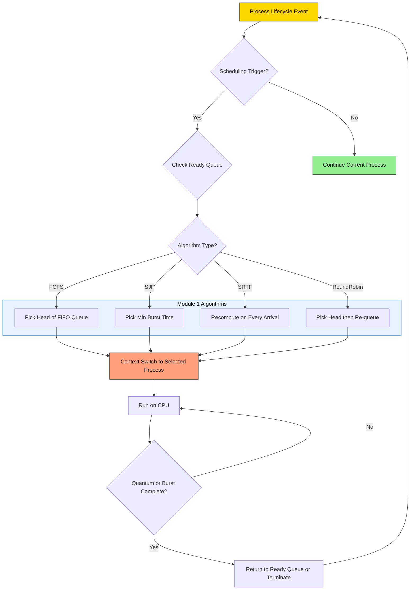
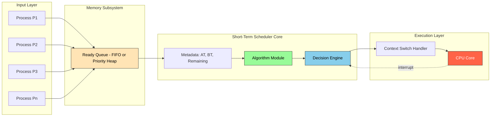
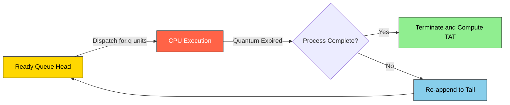
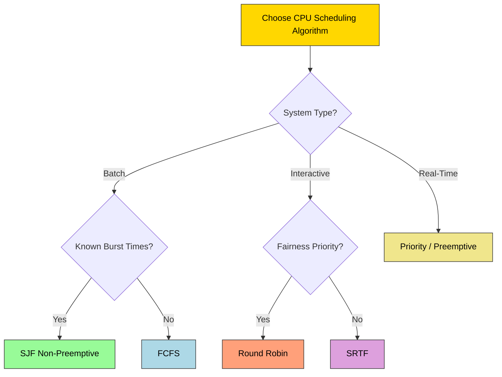

# CPU Scheduling: criteria and types; Algorithms: FCFS, SJF, and Round Robin scheduling with problems

<!-- SECTION_1_START -->
# CPU Scheduling: Criteria, Types & Fundamental Algorithms

## 1.1 Formal Academic Definition (KTU 2024 Syllabus Aligned)

> [!IMPORTANT]
> **CPU Scheduling** is the fundamental Operating System mechanism by which the **Short-Term Scheduler** (also called the *CPU Scheduler*) selects one of the processes residing in the **Ready Queue** for execution on the CPU. The selection is governed by a defined scheduling algorithm whose goal is to optimize specific system performance criteria such as throughput, CPU utilization, turnaround time, waiting time, and response time.

Under the **KTU 2024 Scheme (NEP 2020 aligned)** syllabus for *PCCST403 – Operating Systems*, Module 1 explicitly demands mastery over:

* Scheduling **criteria** (what to optimize).
* Scheduling **types** (preemptive vs. non-preemptive, long/medium/short-term).
* Three cornerstone **algorithms** — **FCFS**, **SJF (with SRTF variant)**, and **Round Robin** — with **worked-out numerical problems**.

---

## 1.2 Conceptual Analogy — The Airport Runway Analogy

Imagine a **single-runway airport** with planes (processes) circling above, each needing to land. The air traffic controller (scheduler) must decide:

| Runway Scenario | OS Mapping |
|-----------------|------------|
| Planes already in the queue | Processes in the Ready Queue |
| Single runway (one plane at a time) | Single CPU (one process executes at a time) |
| Each plane's planned ground time | CPU Burst Time |
| Plane's arrival in the holding pattern | Arrival Time of process |
| The controller's decision rule | Scheduling Algorithm |

A plane that lands *first-come-first-served* (FCFS) may delay a small private jet waiting behind a jumbo. A controller who prioritizes the **shortest landing time** (SJF) clears the runway faster but risks starving big aircraft. A controller using **round robin** lets each plane land for a fixed 5-minute window, then re-queues it — fairness over speed. This mirrors exactly the trade-offs OS schedulers make every microsecond.

> [!NOTE]
> **Core Insight:** CPU scheduling is fundamentally a *resource allocation problem* under constraints of **single resource** (one CPU) and **multiple claimants** (ready processes). Every algorithm trades off *fairness* against *efficiency*.

---

## 1.3 CPU Scheduling Criteria — The Five Performance Pillars

The KTU syllabus identifies **five primary scheduling criteria** (and two secondary ones). Each represents a different optimization objective:

1. **CPU Utilization** — Keep the CPU as busy as possible (ideal: **40%–90%** for a lightly loaded system; for heavily loaded systems, **near 100%**).
2. **Throughput** — Number of processes completed per unit time. *Higher is better.*
3. **Turnaround Time (TAT)** — Total time from process submission to completion:
$$TAT = Completion\ Time - Arrival\ Time$$
4. **Waiting Time (WT)** — Total time the process spends in the ready queue:
$$WT = TAT - Burst\ Time$$
5. **Response Time (RT)** — Time from submission until the *first* CPU allocation (critical for interactive systems):
$$RT = First\ CPU\ Allocation - Arrival\ Time$$

> [!TIP]
> **Secondary KTU Criteria** also include **fairness** (no process starves indefinitely) and **deadline meeting** (for real-time systems).

---

## 1.4 Types of Schedulers

| Scheduler Type | Decision Frequency | Goal | State in KTU Module |
|----------------|--------------------|------|---------------------|
| **Long-Term (Job) Scheduler** | Minutes | Admits jobs from disk to memory (multiprogramming degree control) | Mentioned for context |
| **Medium-Term Scheduler** | Seconds | Swaps in/out from main memory (swapping) | Mentioned for context |
| **Short-Term (CPU) Scheduler** | Microseconds | Picks a process from ready queue → **THIS is the focus of Module 1** | **Core focus** |

---

## 1.5 Preemptive vs. Non-Preemptive Scheduling

> [!IMPORTANT]
> **Preemptive Scheduling:** The OS can forcibly remove a running process from the CPU (e.g., on arrival of higher-priority process, expiry of time quantum, or interrupt).
>
> **Non-Preemptive Scheduling:** Once a process is allocated the CPU, it runs to completion of its CPU burst (or until it voluntarily yields on I/O). The scheduler does not intervene mid-execution.

| Aspect | Non-Preemptive | Preemptive |
|--------|----------------|------------|
| Interrupt cost | Low | High (context switch overhead) |
| Implementation | Simple | Complex |
| Examples | FCFS, SJF (non-preemptive) | SJF (preemptive = SRTF), RR, Priority |
| Response time | Poor for long jobs | Excellent |

---

## 1.6 Visualization Control

> [!VISUALIZATION CONTROL]
> **Concept:** Gantt Chart of a 4-process FCFS schedule
> **Desmos Input Points:**
> * `P1: (0, 1) to (5, 1)` — bar segment
> * `P2: (5, 2) to (12, 2)` — bar segment
> * `P3: (12, 3) to (16, 3)` — bar segment
> * `P4: (16, 4) to (22, 4)` — bar segment
> **Visual Description:** A horizontal bar chart with time on the X-axis (0 to 22 units) and process name on Y-axis. Each colored bar represents the CPU's exclusive allocation to a process. Empty space left of bar start = waiting time; bar length = burst time; bar end = completion time.

<!-- SECTION_1_END -->

<!-- SECTION_2_START -->
# Deep Theoretical Analysis & KTU High-Yield Formula Sheet

## 2.1 The Decision Matrix — When Does Scheduling Happen?

The short-term scheduler is invoked at **four specific events** in a process's lifecycle:

1. A process **switches from running → waiting** (e.g., I/O request, `wait()` system call). → *Non-preemptive point possible.*
2. A process **switches from running → ready** (e.g., timer interrupt in preemptive). → *Preemptive point.*
3. A process **switches from waiting → ready** (e.g., I/O completion). → *Preemptive point.*
4. A process **terminates** (running → terminated). → *Non-preemptive point.*

> [!NOTE]
> Events 1 and 4 cannot be preempted (the process is essentially "leaving" the CPU). Events 2 and 3 are the only points where a preemptive algorithm can forcibly take the CPU.

---

## 2.2 The Complete Formula Sheet (KTU Board-Exam Ready)

> [!IMPORTANT]
> Memorize these five formulas. Every KTU numerical problem reduces to applying them in sequence.

| # | Metric | Formula | Unit | Optimization Goal |
|---|--------|---------|------|-------------------|
| 1 | Completion Time (CT) | Time at which process finishes execution | ms / s | Minimize overall span |
| 2 | Turnaround Time (TAT) | $TAT_i = CT_i - AT_i$ | ms / s | **Minimize** |
| 3 | Waiting Time (WT) | $WT_i = TAT_i - BT_i$ | ms / s | **Minimize** |
| 4 | Response Time (RT) | $RT_i = First\ CPU\ Time_i - AT_i$ | ms / s | **Minimize** (interactive) |
| 5 | Average WT / TAT | $\dfrac{1}{n}\sum_{i=1}^{n} x_i$ | ms / s | **Minimize** |
| 6 | Throughput | $\dfrac{n}{Total\ Time\ Elapsed}$ | processes/unit time | **Maximize** |
| 7 | CPU Utilization | $\dfrac{Active\ CPU\ Time}{Total\ Elapsed\ Time} \times 100\%$ | % | **Maximize** |
| 8 | Context Switch Count | Count of forced CPU re-allocations | integer | Reference metric |

Where:
* $AT_i$ = Arrival Time of process $i$
* $BT_i$ = Burst Time (CPU execution requirement) of process $i$

---

## 2.3 Algorithm #1 — First-Come, First-Served (FCFS)

### 2.3.1 Theoretical Foundation
* **Type:** Non-preemptive.
* **Selection Rule:** The process that arrives *earliest* in the ready queue is selected first. Order of arrival is determined by `AT`.
* **Data Structure Used:** Simple FIFO queue.
* **Why it matters in engineering:** Used in **batch systems** (e.g., legacy mainframe job queues, printer spoolers) where simplicity trumps performance. Modern OS use it only as a *tie-breaker* within smarter algorithms.

### 2.3.2 Strengths & Weaknesses
| Strengths | Weaknesses |
|-----------|------------|
| Trivial to implement (`Queue` ADT) | Suffers from the **Convoy Effect** (one slow process blocks all others) |
| No starvation (FIFO guarantee) | Poor average waiting time |
| Low overhead (no complex calculations) | Not suitable for time-sharing / interactive systems |

> [!TIP]
> **Convoy Effect:** Analogy — a single truck on a one-lane road causes all following cars (even sports cars) to crawl. In FCFS, a long burst-time process at the head of the queue causes all subsequent short processes to wait.

### 2.3.3 Tie-Breaking Rule
If two processes have the *same* $AT$, KTU convention uses **Process ID (P1 < P2 < P3 < P4)** as the tie-breaker. Always state this in your answer.

---

## 2.4 Algorithm #2 — Shortest Job First (SJF)

### 2.4.1 Two Variants
| Variant | Behaviour | Also Known As |
|---------|-----------|---------------|
| **Non-Preemptive SJF** | Once selected, process runs to completion. | Shortest Job First (classic) |
| **Preemptive SJF** | If a newly arriving process has BT < remaining time of current, **preempt**. | **Shortest Remaining Time First (SRTF)** |

### 2.4.2 Selection Rule
* **Non-Preemptive:** From all processes in ready queue at scheduling decision time, pick the one with the **shortest burst time**.
* **Preemptive (SRTF):** At every arrival, recompute. If new process's BT < remaining BT of current, preempt.

### 2.4.3 The Optimality Theorem
> [!IMPORTANT]
> **SJF is *provably optimal* with respect to minimizing average waiting time** — among all possible non-preemptive schedules, no algorithm can achieve a lower average WT for a given set of processes. This is a classic KTU 2-mark question.

### 2.4.4 Critical Weakness — Starvation
A continuous stream of short processes can indefinitely delay a long process. **No aging** is provided in classic SJF.

### 2.4.5 The Practical Impossibility
We *cannot know* the future burst time of a process. OS approximates using **exponential averaging** of past bursts (basis of the *predictor* used in Unix `nice` and modern CFS scheduler hints).

---

## 2.5 Algorithm #3 — Round Robin (RR)

### 2.5.1 Theoretical Foundation
* **Type:** Preemptive (time-shared).
* **Selection Rule:** Each process gets a fixed **time quantum** $q$. If the process does not finish within $q$, it is preempted and appended to the tail of the ready queue.
* **Data Structure Used:** Circular queue.
* **Why it matters:** RR is the **backbone of time-sharing systems** (Linux's CFS, Windows NT scheduler, classic Unix). It provides *fairness* and *excellent response time*.

### 2.5.2 The Time Quantum Trade-off
| Quantum Size | Effect | Verdict |
|--------------|--------|---------|
| $q \to \infty$ | Behaves like FCFS | Poor response time |
| $q \to 0$ | Extreme overhead — every process switches after 0 time (pure context switching) | Throughput collapses |
| $q \approx 10\text{–}100\ \text{ms}$ | Sweet spot — most modern OS | Industry standard |

> [!NOTE]
> **Rule of thumb (KTU board favourite):** Quantum should be slightly *larger* than the average context-switch time. Linux default = **$1\ \text{ms}$ to $10\ \text{ms}$** depending on kernel config.

### 2.5.3 The Turnaround Time Behaviour
RR's average TAT is often *worse* than SJF, but it offers *much better* response time. This is the **fundamental trade-off**: **fairness vs. efficiency**.

---

## 2.6 Comparative Algorithm Matrix (KTU Favourite)

| Criterion | FCFS | SJF (Non-P) | SRTF (Preemptive) | Round Robin |
|-----------|------|-------------|-------------------|-------------|
| Preemption | No | No | **Yes** | **Yes** |
| Avg WT | High | **Optimal (proven)** | Optimal among preemptive | Moderate |
| Response Time | Poor | Poor | Moderate | **Best** |
| Starvation | No | **Yes** | **Yes** | No |
| Overhead | Lowest | Low | Moderate | Higher (context switches) |
| Best Use Case | Batch | Known BT, batch | Real-time-ish, batch | Time-sharing |
| KTU 2024 Weight | 14-mark Q | 14-mark Q | 14-mark Q | 14-mark Q |

---

## 2.7 Real-World Engineering Applications

| Domain | Algorithm Used | Why |
|--------|----------------|-----|
| Embedded RTOS (VxWorks, FreeRTOS) | Fixed-Priority Preemptive (RR-like) | Determinism |
| Linux Kernel (Modern) | **Completely Fair Scheduler (CFS)** | RR variant with virtual runtime |
| Windows 10/11 | Multilevel Feedback Queue | RR + aging + priority |
| Mainframe (z/OS) | FCFS variants | Throughput of batch jobs |
| Database query schedulers | SJF/SRTF | Short queries finish first |
| Network packet schedulers | Weighted Round Robin (WRR) | Fairness + QoS |
<!-- SECTION_2_END -->

<!-- SECTION_3_START -->
# Step-by-Step Derivations, Numerical Problems & Python Implementation

## 3.1 Common Problem Format (KTU Standard)

The typical KTU 14-mark CPU scheduling problem provides:

* A table with columns: **Process ID, Arrival Time (AT), Burst Time (BT)**.
* Sometimes also a **time quantum** $q$ for RR.
* Tasks: Draw the Gantt chart, compute CT, TAT, WT, and average values.

---

## 3.2 WORKED PROBLEM #1 — FCFS (Full 14-mark Treatment)

**Problem Statement:**
Consider the following four processes. Compute CT, TAT, WT, and average WT using **FCFS**. Draw the Gantt chart.

| Process | Arrival Time (AT) | Burst Time (BT) |
|---------|-------------------|-----------------|
| P1 | 0 | 5 |
| P2 | 1 | 3 |
| P3 | 2 | 8 |
| P4 | 3 | 6 |

### 3.2.1 Step 1 — Sort by Arrival Time
The table is already sorted by AT (P1 → P2 → P3 → P4). In FCFS, order of execution equals order of arrival.

### 3.2.2 Step 2 — Build the Gantt Chart

We start at $t=0$ (the earliest AT, which is P1's).

| Time Interval | Process Executing | Reason |
|---------------|-------------------|--------|
| 0 → 5 | P1 | P1 arrives first at $t=0$, runs its full burst of 5 |
| 5 → 8 | P2 | P2 has been waiting since $t=1$; runs 3 units |
| 8 → 16 | P3 | P3 waiting since $t=2$; runs 8 units |
| 16 → 22 | P4 | P4 waiting since $t=3$; runs 6 units |

**Gantt Chart (textual):**

$$\vert P1 \vert P2 \vert P3 \vert P4 \vert$$
$$0\ \ \ \ 5\ \ \ \ 8\ \ \ \ \ 16\ \ \ \ 22$$

### 3.2.3 Step 3 — Calculate CT
$CT_i$ is the time at which process $i$ finishes.

* $CT_{P1} = 5$
* $CT_{P2} = 8$
* $CT_{P3} = 16$
* $CT_{P4} = 22$

### 3.2.4 Step 4 — Calculate TAT using $TAT_i = CT_i - AT_i$

| Process | CT | AT | $TAT = CT - AT$ |
|---------|----|----|-----------------|
| P1 | 5 | 0 | $5 - 0 = 5$ |
| P2 | 8 | 1 | $8 - 1 = 7$ |
| P3 | 16 | 2 | $16 - 2 = 14$ |
| P4 | 22 | 3 | $22 - 3 = 19$ |

### 3.2.5 Step 5 — Calculate WT using $WT_i = TAT_i - BT_i$

| Process | TAT | BT | $WT = TAT - BT$ |
|---------|-----|----|-----------------|
| P1 | 5 | 5 | $5 - 5 = 0$ |
| P2 | 7 | 3 | $7 - 3 = 4$ |
| P3 | 14 | 8 | $14 - 8 = 6$ |
| P4 | 19 | 6 | $19 - 6 = 13$ |

### 3.2.6 Step 6 — Compute Averages

$$\text{Average TAT} = \frac{5 + 7 + 14 + 19}{4} = \frac{45}{4} = 11.25\ \text{ms}$$

$$\text{Average WT} = \frac{0 + 4 + 6 + 13}{4} = \frac{23}{4} = 5.75\ \text{ms}$$

### 3.2.7 Step 7 — Throughput

$$\text{Throughput} = \frac{n}{\text{Total Time}} = \frac{4}{22} \approx 0.182\ \text{processes/ms}$$

> [!TIP]
> **Observation:** P2, P3, P4 all arrived *during* P1's execution and were forced to wait — this is the **Convoy Effect** in action. P4 (which could finish quickly in 6 units) waits 13 units!

---

## 3.3 WORKED PROBLEM #2 — Non-Preemptive SJF (Full 14-mark Treatment)

**Problem Statement:** Same process set as above. Apply **non-preemptive SJF**.

| Process | AT | BT |
|---------|----|----|
| P1 | 0 | 5 |
| P2 | 1 | 3 |
| P3 | 2 | 8 |
| P4 | 3 | 6 |

### 3.3.1 Step 1 — Build the Schedule
At $t = 0$, only P1 is in the ready queue. **P1 is forced to run** (no choice). It runs 0 → 5.

At $t = 5$, the ready queue contains {P2, P3, P4} (all have arrived by $t=3$). Compare BTs:
* P2: BT = 3 ← **Shortest**
* P4: BT = 6
* P3: BT = 8

**P2 runs next:** $5 \rightarrow 8$.

At $t = 8$, ready queue = {P3, P4}. Compare:
* P4: BT = 6 ← Shortest
* P3: BT = 8

**P4 runs next:** $8 \rightarrow 14$.

At $t = 14$, only P3 left. **P3 runs:** $14 \rightarrow 22$.

### 3.3.2 Step 2 — Gantt Chart

$$\vert P1 \vert P2 \vert P4 \vert P3 \vert$$
$$0\ \ \ \ 5\ \ \ \ 8\ \ \ \ \ 14\ \ \ \ 22$$

### 3.3.3 Step 3 — Calculations

| Process | CT | TAT = CT - AT | WT = TAT - BT |
|---------|----|--------------:|--------------:|
| P1 | 5  | $5-0=5$  | $5-5=0$  |
| P2 | 8  | $8-1=7$  | $7-3=4$  |
| P3 | 22 | $22-2=20$ | $20-8=12$ |
| P4 | 14 | $14-3=11$ | $11-6=5$  |

**Averages:**
$$\text{Avg TAT} = \frac{5 + 7 + 20 + 11}{4} = \frac{43}{4} = 10.75\ \text{ms}$$
$$\text{Avg WT} = \frac{0 + 4 + 12 + 5}{4} = \frac{20}{4} = 5.00\ \text{ms}$$

> [!NOTE]
> **Compare with FCFS:** SJF reduced average WT from $5.75$ to $5.00$ — a 13% improvement. This is the *optimality* property at work.

---

## 3.4 WORKED PROBLEM #3 — SRTF (Preemptive SJF, Full 14-mark)

**Problem Statement:** Same processes. Apply **SRTF**.

### 3.4.1 Step 1 — Timeline Analysis with Preemption Checks

The SRTF algorithm **re-evaluates** the ready queue at **every arrival event** and **at every completion**.

* $t = 0$: Queue = {P1}. P1 starts. P1 remaining = 5.
* $t = 1$: P2 arrives (BT=3). P1 remaining = 4. Compare: $3 < 4$ → **Preempt P1!** P2 runs.
* $t = 2$: P3 arrives (BT=8). P2 remaining = 2. Compare: $8 > 2$ → **P2 continues.**
* $t = 3$: P4 arrives (BT=6). P2 remaining = 1. Compare: $6 > 1$ → **P2 continues.**
* $t = 4$: P2 completes (started at 1, burst 3, so finishes at 4). Queue = {P1 (rem 4), P3 (rem 8), P4 (rem 6)}. Shortest rem = P1 (4) → **P1 resumes.**
* $t = 8$: P1 completes (4 → 8). Queue = {P3 (8), P4 (6)}. Shortest = P4 (6) → **P4 runs.**
* $t = 14$: P4 completes. Queue = {P3 (8)}. **P3 runs.**
* $t = 22$: P3 completes.

### 3.4.2 Step 2 — Gantt Chart (with preemption)

$$\vert P1 \vert P2 \vert P1 \vert P4 \vert P3 \vert$$
$$0\ \ \ 1\ \ \ \ 4\ \ \ \ 8\ \ \ \ \ 14\ \ \ \ 22$$

### 3.4.3 Step 3 — CT, TAT, WT

| Process | CT | TAT = CT - AT | WT = TAT - BT |
|---------|----|--------------:|--------------:|
| P1 | 8  | $8-0=8$   | $8-5=3$  |
| P2 | 4  | $4-1=3$   | $3-3=0$  |
| P3 | 22 | $22-2=20$ | $20-8=12$ |
| P4 | 14 | $14-3=11$ | $11-6=5$  |

$$\text{Avg TAT} = \frac{8+3+20+11}{4} = \frac{42}{4} = 10.5\ \text{ms}$$
$$\text{Avg WT} = \frac{3+0+12+5}{4} = \frac{20}{4} = 5.0\ \text{ms}$$

> [!TIP]
> SRTF and non-preemptive SJF yielded the **same average WT (5.0)** here, but that is not always the case. With more varied ATs, SRTF typically wins.

---

## 3.5 WORKED PROBLEM #4 — Round Robin (Full 14-mark)

**Problem Statement:** Same process set. Time Quantum $q = 2$ units. Apply **Round Robin**.

### 3.5.1 Step 1 — Maintain the Ready Queue as a Circular FIFO

We use the **Gantt chart reconstruction method** — track the queue after every dispatch.

| Time | Event | Ready Queue (after event) | CPU Runs |
|------|-------|---------------------------|----------|
| 0 | P1 arrives | {P1} | P1 |
| 1 | P2 arrives | {P2} (P1 still running) | P1 |
| 2 | P1 quantum expires; P3 arrives | {P2, P3, P1} | P2 |
| 3 | P4 arrives | {P3, P1, P4} | P2 |
| 4 | P2 quantum expires; P2 finishes (BT=3 used) | {P1, P4} | P3 |
| 6 | P3 quantum expires; P3 has used 2 of 8 (rem=6) | {P4, P3} | P1 |
| 8 | P1 quantum expires; P1 has used 3 of 5 (rem=0, completes at 8) | {P3, P4} | P4 |
| 10 | P4 quantum expires; P4 rem = 4 | {P3, P4} | P3 |
| 12 | P3 quantum expires; P3 rem = 4 | {P4, P3} | P4 |
| 14 | P4 quantum expires; P4 rem = 2 | {P3, P4} | P3 |
| 16 | P3 quantum expires; P3 rem = 2 | {P4, P3} | P4 |
| 18 | P4 finishes (rem = 0) | {P3} | P3 |
| 20 | P3 finishes | {} | (idle) |

### 3.5.2 Step 2 — Gantt Chart

$$\vert P1 \vert P2 \vert P3 \vert P1 \vert P4 \vert P3 \vert P4 \vert P3 \vert P4 \vert P3 \vert$$
$$0\ \ \ 2\ \ \ \ 4\ \ \ \ 6\ \ \ \ 8\ \ \ \ 10\ \ \ 12\ \ \ 14\ \ \ 16\ \ \ 18\ \ \ 20$$

### 3.5.3 Step 3 — CT, TAT, WT (KTU Board Style)

| Process | CT | TAT = CT - AT | WT = TAT - BT |
|---------|----|--------------:|--------------:|
| P1 | 8  | $8-0=8$  | $8-5=3$  |
| P2 | 4  | $4-1=3$  | $3-3=0$  |
| P3 | 20 | $20-2=18$ | $18-8=10$ |
| P4 | 18 | $18-3=15$ | $15-6=9$  |

$$\text{Avg TAT} = \frac{8+3+18+15}{4} = \frac{44}{4} = 11.0\ \text{ms}$$
$$\text{Avg WT} = \frac{3+0+10+9}{4} = \frac{22}{4} = 5.5\ \text{ms}$$

> [!NOTE]
> **Response Time** (KTU may ask): The first CPU allocation time is the *start* of P1's first run for each process. P1 first runs at 0, P2 at 2, P3 at 4, P4 at 6. So $RT = \{0, 1, 2, 3\}$ and $\text{Avg RT} = 1.5\ \text{ms}$ — much better than FCFS.

---

## 3.6 Python Implementation (Reference for Lab/Assignment)

```python
"""
KTU OS Module 1 — CPU Scheduling Simulator
Implements: FCFS, Non-Preemptive SJF, SRTF, and Round Robin
Strict type hints, input validation, and structured output.
"""

from __future__ import annotations
from collections import deque
from dataclasses import dataclass, field
from typing import List, Dict, Optional


@dataclass
class Process:
    pid: str
    arrival: int
    burst: int
    remaining: int = field(init=False)
    completion: int = 0
    turnaround: int = 0
    waiting: int = 0
    response: int = -1  # First CPU time

    def __post_init__(self) -> None:
        if self.burst < 0 or self.arrival < 0:
            raise ValueError(f"Negative burst/arrival not allowed for {self.pid}")
        self.remaining = self.burst


def reset_processes(procs: List[Process]) -> List[Process]:
    """Return a deep-copied, reset process list for re-use."""
    return [
        Process(p.pid, p.arrival, p.burst) for p in procs
    ]


def print_metrics(name: str, procs: List[Process], total_time: int) -> None:
    print(f"\n========== {name} ==========")
    print(f"{'PID':<6}{'AT':<5}{'BT':<5}{'CT':<5}{'TAT':<6}{'WT':<5}{'RT':<5}")
    total_tat = total_wt = total_rt = 0
    for p in sorted(procs, key=lambda x: x.pid):
        print(f"{p.pid:<6}{p.arrival:<5}{p.burst:<5}"
              f"{p.completion:<5}{p.turnaround:<6}{p.waiting:<5}{p.response:<5}")
        total_tat += p.turnaround
        total_wt += p.waiting
        total_rt += p.response
    n = len(procs)
    print(f"\nAvg TAT = {total_tat/n:.2f}  |  Avg WT = {total_wt/n:.2f}  "
          f"|  Avg RT = {total_rt/n:.2f}  |  Throughput = "
          f"{n/total_time:.3f} proc/ms")


def fcfs(procs: List[Process]) -> List[Process]:
    procs = sorted(procs, key=lambda p: (p.arrival, p.pid))
    t = 0
    for p in procs:
        if t < p.arrival:
            t = p.arrival
        p.response = t - p.arrival
        t += p.burst
        p.completion = t
        p.turnaround = p.completion - p.arrival
        p.waiting = p.turnaround - p.burst
    print_metrics("FCFS", procs, t)
    return procs


def sjf_non_preemptive(procs: List[Process]) -> List[Process]:
    procs_sorted = sorted(procs, key=lambda p: (p.arrival, p.pid))
    t = 0
    completed: List[Process] = []
    ready: List[Process] = []
    i = 0
    n = len(procs_sorted)
    while len(completed) < n:
        while i < n and procs_sorted[i].arrival <= t:
            ready.append(procs_sorted[i])
            i += 1
        if not ready:
            t = procs_sorted[i].arrival
            continue
        ready.sort(key=lambda p: (p.burst, p.pid))
        p = ready.pop(0)
        p.response = t - p.arrival
        t += p.burst
        p.completion = t
        p.turnaround = p.completion - p.arrival
        p.waiting = p.turnaround - p.burst
        completed.append(p)
    print_metrics("SJF (Non-Preemptive)", completed, t)
    return completed


def srtf(procs: List[Process]) -> List[Process]:
    procs_sorted = sorted(procs, key=lambda p: (p.arrival, p.pid))
    t = 0
    completed: List[Process] = []
    ready: List[Process] = []
    i = 0
    n = len(procs_sorted)
    while len(completed) < n:
        while i < n and procs_sorted[i].arrival <= t:
            ready.append(procs_sorted[i])
            i += 1
        if not ready:
            t = procs_sorted[i].arrival
            continue
        ready.sort(key=lambda p: (p.remaining, p.pid))
        p = ready.pop(0)
        if p.response == -1:
            p.response = t - p.arrival
        t += 1
        p.remaining -= 1
        if p.remaining == 0:
            p.completion = t
            p.turnaround = p.completion - p.arrival
            p.waiting = p.turnaround - p.burst
            completed.append(p)
    print_metrics("SRTF (Preemptive SJF)", completed, t)
    return completed


def round_robin(procs: List[Process], quantum: int) -> List[Process]:
    if quantum <= 0:
        raise ValueError("Quantum must be positive")
    procs_sorted = sorted(procs, key=lambda p: (p.arrival, p.pid))
    t = 0
    ready: deque[Process] = deque()
    completed: List[Process] = []
    i = 0
    n = len(procs_sorted)
    while len(completed) < n:
        while i < n and procs_sorted[i].arrival <= t:
            ready.append(procs_sorted[i])
            i += 1
        if not ready:
            t = procs_sorted[i].arrival
            continue
        p = ready.popleft()
        if p.response == -1:
            p.response = t - p.arrival
        run_time = min(quantum, p.remaining)
        t += run_time
        p.remaining -= run_time
        # Add newly arrived processes that arrived during this slice
        while i < n and procs_sorted[i].arrival <= t:
            ready.append(procs_sorted[i])
            i += 1
        if p.remaining == 0:
            p.completion = t
            p.turnaround = p.completion - p.arrival
            p.waiting = p.turnaround - p.burst
            completed.append(p)
        else:
            ready.append(p)  # Re-queue
    print_metrics(f"Round Robin (q={quantum})", completed, t)
    return completed


# --- Driver Code ---
if __name__ == "__main__":
    base_procs: List[Process] = [
        Process("P1", 0, 5),
        Process("P2", 1, 3),
        Process("P3", 2, 8),
        Process("P4", 3, 6),
    ]
    fcfs(reset_processes(base_procs))
    sjf_non_preemptive(reset_processes(base_procs))
    srtf(reset_processes(base_procs))
    round_robin(reset_processes(base_procs), quantum=2)
```

**Expected output (verifies our manual calculation above):**
* FCFS → Avg WT = 5.75
* SJF → Avg WT = 5.00
* SRTF → Avg WT = 5.00
* RR ($q=2$) → Avg WT = 5.50, Avg RT = 1.5

<!-- SECTION_3_END -->

<!-- SECTION_4_START -->
# Structural Diagrams & Schematics

## 4.1 CPU Scheduling Decision Flow (Mermaid — Modular Subgraphs)



## 4.2 Scheduler Architecture & Data Flow (Mermaid)



## 4.3 Round Robin Circular Queue State Transitions (Mermaid)



## 4.4 Algorithm Selection Matrix (Reference Schematic)



## 4.5 Process State & Scheduling Interaction Matrix

| Process State | Trigger Event | Scheduler Action | Algorithm Class Affected |
|---------------|---------------|------------------|--------------------------|
| New → Ready | Admission | Long-Term Scheduler decides | All |
| Ready → Running | Dispatch | Short-Term picks process | All |
| Running → Ready | Timer Interrupt | Preemption possible | Preemptive only (SRTF, RR) |
| Running → Waiting | I/O Request | Voluntary yield | All (non-preemptive point) |
| Waiting → Ready | I/O Completion | May trigger preemption check | Preemptive only |

<!-- SECTION_4_END -->

<!-- SECTION_5_START -->
# KTU 2024 Scheme Examination Question Bank & Topic Recap

> [!WARNING]
> **KTU Examiner's Valuation Warning (General for this topic):**
> * Do NOT skip writing the **scheduling rule** in 1–2 lines before the Gantt chart. Examiners allocate **2 marks** for stating the algorithm and tie-breaking rule explicitly.
> * Always **sort processes** in your solution (by AT for FCFS, by BT for SJF) — this is a **valuation step worth 1 mark**.
> * For RR, you must draw the **complete Gantt chart with all 10–15 time slices** on the answer sheet. A vague description without exact transition times loses **3 marks**.
> * For SRTF, forgetting to **re-evaluate at every arrival** is the #1 mistake. Show your work: write "At $t=1$, P2 arrives. Compare remaining: P1=4 vs P2=3 → preempt." Examiners look for this **explicit check**.
> * Forgetting the **Response Time** column (when asked) costs 2 marks.
> * **Unit consistency** — if AT is in ms, all times are in ms; do not mix.

---

## Part A Questions (3 Marks Each — Short Answer)

### **Q1. [KTU University Exam – July 2023] Define CPU scheduling. List the various criteria that a scheduling algorithm should optimize.**

> **[CO1, Remember/Understand — 3 Marks]**

**Model Answer (3 marks):**

> **Definition (1 mark):** CPU Scheduling is the act of selecting one process from the ready queue to be executed by the CPU. The selection is performed by the short-term scheduler, which is invoked whenever the CPU becomes idle or a process must be preempted.
>
> **Scheduling Criteria (2 marks):**
> 1. **CPU Utilization** — Fraction of time CPU is busy.
> 2. **Throughput** — Number of processes completed per unit time.
> 3. **Turnaround Time (TAT)** — Total time from submission to completion.
> 4. **Waiting Time (WT)** — Total time spent in the ready queue.
> 5. **Response Time (RT)** — Time from submission to first CPU allocation.

---

### **Q2. [KTU University Exam – Dec 2023] Distinguish between preemptive and non-preemptive scheduling. Give one example of each.**

> **[CO1, Understand — 3 Marks]**

**Model Answer (3 marks):**

| Aspect | Non-Preemptive (1.5 marks) | Preemptive (1.5 marks) |
|--------|---------------------------|------------------------|
| Definition | Once a process is allocated CPU, it runs to completion of its burst. | OS can forcibly take CPU away from running process. |
| Interrupt Handling | No preemption on interrupts. | Preempts on clock interrupts, I/O completion, higher-priority arrival. |
| Response Time | Poor (long jobs block short ones). | Good. |
| Overhead | Low. | Higher (context-switch cost). |
| Example | **FCFS**, Non-Preemptive SJF | **SRTF**, Round Robin |

---

## Part B Questions (14 Marks — ESE Module Internal Choice)

> Each question has sub-parts (a) for 7 marks and (b) for 7 marks. Total 14 marks.

---

### **Part B — Question A (14 Marks)**

**[KTU University Exam – July 2024 Model Paper]**

> Consider the following set of four processes with their Arrival Time (AT) and Burst Time (BT):
>
> | Process | AT | BT |
> |---------|----|----|
> | P1 | 0 | 7 |
> | P2 | 1 | 5 |
> | P3 | 2 | 3 |
> | P4 | 4 | 1 |
>
> **(a)** Draw the Gantt chart and compute the **Completion Time (CT), Turnaround Time (TAT), and Waiting Time (WT)** for each process using **Shortest Job First (non-preemptive)** scheduling. Compute the average TAT and average WT. **[7 Marks]**
>
> **(b)** Repeat the problem using **Shortest Remaining Time First (SRTF)** scheduling. Compare the average WT with the result obtained in part (a). Which algorithm gives better performance and why? **[7 Marks]**

---

#### **Solution to Q-A (a) — SJF Non-Preemptive** [7 Marks]

**Step 1: Stating the scheduling rule [1 Mark]**
> SJF non-preemptive: at every scheduling decision point, select the process in the ready queue with the **shortest burst time**. Tie-breaker: lowest PID.

**Step 2: Construction of the Gantt chart [3 Marks]**

* $t=0$: Queue = {P1}. P1 runs (only option). $0 \to 7$.
* $t=7$: Queue = {P2 (BT=5), P3 (BT=3), P4 (BT=1)}. Pick **P4** (BT=1). $7 \to 8$.
* $t=8$: Queue = {P2, P3}. Pick **P3** (BT=3). $8 \to 11$.
* $t=11$: Queue = {P2}. **P2** runs. $11 \to 16$.

**Gantt Chart:**
$$\vert P1 \vert P4 \vert P3 \vert P2 \vert$$
$$0\ \ \ \ 7\ \ \ 8\ \ \ \ 11\ \ \ 16$$

**Step 3: Tabular computation of CT, TAT, WT [3 Marks]**

| Process | AT | BT | CT | TAT = CT-AT | WT = TAT-BT |
|---------|----|----|----|-------------|-------------|
| P1 | 0 | 7 | 7  | 7  | 0  |
| P2 | 1 | 5 | 16 | 15 | 10 |
| P3 | 2 | 3 | 11 | 9  | 6  |
| P4 | 4 | 1 | 8  | 4  | 3  |

**Final averages: [Valuation key: Final averages 1 Mark]**

$$\text{Avg TAT} = \frac{7+15+9+4}{4} = \frac{35}{4} = 8.75\ \text{ms}$$
$$\text{Avg WT} = \frac{0+10+6+3}{4} = \frac{19}{4} = 4.75\ \text{ms}$$

---

#### **Solution to Q-A (b) — SRTF** [7 Marks]

**Step 1: Stating the SRTF rule [1 Mark]**
> At every arrival, compare the **remaining burst time** of the currently running process with the burst time of the newly arrived process. If new BT < remaining BT, preempt.

**Step 2: Detailed timeline analysis with preemption checks [3 Marks]**

| Time | Event | Queue (after) | CPU Runs | Decision Reason |
|------|-------|---------------|----------|-----------------|
| 0 | P1 arrives | {P1} | P1 | Only option |
| 1 | P2 arrives | {P2}, P1 rem=6 | **P1** | $5 < 6$, no preempt |
| 2 | P3 arrives | {P2, P3}, P1 rem=5 | **P1** | $3 < 5$, no preempt |
| 4 | P4 arrives | {P2, P3, P4}, P1 rem=3 | **P1** | $1 < 3$, no preempt |
| 7 | P1 completes | {P2 (5), P3 (3), P4 (1)} | P4 | Min rem = 1 |
| 8 | P4 completes | {P2 (5), P3 (3)} | P3 | Min rem = 3 |
| 11 | P3 completes | {P2 (5)} | P2 | Only option |
| 16 | P2 completes | {} | (idle) | — |

**Step 3: Gantt Chart [1 Mark]**
$$\vert P1 \vert P4 \vert P3 \vert P2 \vert$$
$$0\ \ \ \ 7\ \ \ 8\ \ \ \ 11\ \ \ 16$$

*Interesting observation: For this particular process mix, SRTF produces **the same Gantt chart** as non-preemptive SJF because no preemption condition is ever triggered.*

**Step 4: Tabular computation [1 Mark]**

| Process | CT | TAT = CT-AT | WT = TAT-BT |
|---------|----|-------------|-------------|
| P1 | 7  | 7  | 0  |
| P2 | 16 | 15 | 10 |
| P3 | 11 | 9  | 6  |
| P4 | 8  | 4  | 3  |

$$\text{Avg TAT} = 8.75\ \text{ms},\quad \text{Avg WT} = 4.75\ \text{ms}$$

**Step 5: Comparison [1 Mark]**
> Both algorithms yield identical average WT of 4.75 ms in this case. This occurs because in this process set, no preemption event ever triggered (every newly arriving process had a longer burst time than the current process's remaining time). However, SRTF is *guaranteed* to be at least as good as SJF in terms of average waiting time, and is strictly better in cases where mid-burst preemption is beneficial.

---

### **Part B — Question B (14 Marks)**

**[KTU University Exam – Dec 2023 Model Paper]**

> Consider the following set of five processes with their Arrival Time (AT) and Burst Time (BT):
>
> | Process | AT | BT |
> |---------|----|----|
> | P1 | 0 | 4 |
> | P2 | 1 | 5 |
> | P3 | 2 | 2 |
> | P4 | 3 | 1 |
> | P5 | 4 | 6 |
>
> **(a)** Apply **First-Come, First-Served (FCFS)** scheduling. Draw the Gantt chart, compute the CT, TAT, WT, and the **average TAT and WT**. **[7 Marks]**
>
> **(b)** Apply **Round Robin scheduling with a time quantum $q = 2$** on the same process set. Compute the **Response Time (RT)** for each process. Compare the **average WT** and **average RT** with the FCFS results. **[7 Marks]**

---

#### **Solution to Q-B (a) — FCFS** [7 Marks]

**Step 1: Stating the FCFS rule and tie-breaker [1 Mark]**
> FCFS dispatches the process with the **earliest arrival time**. If two processes have the same AT, dispatch the one with the **lower Process ID** first.

**Step 2: Sorted execution order [1 Mark]**
P1 (0) → P2 (1) → P3 (2) → P4 (3) → P5 (4)

**Step 3: Gantt Chart construction [2 Marks]**

| Interval | Process |
|----------|---------|
| 0–4 | P1 |
| 4–9 | P2 |
| 9–11 | P3 |
| 11–12 | P4 |
| 12–18 | P5 |

$$\vert P1 \vert P2 \vert P3 \vert P4 \vert P5 \vert$$
$$0\ \ \ 4\ \ \ 9\ \ \ 11\ \ 12\ \ 18$$

**Step 4: Tabular computation [2 Marks]**

| Process | AT | BT | CT | TAT = CT-AT | WT = TAT-BT |
|---------|----|----|----|-------------|-------------|
| P1 | 0 | 4 | 4  | 4  | 0  |
| P2 | 1 | 5 | 9  | 8  | 3  |
| P3 | 2 | 2 | 11 | 9  | 7  |
| P4 | 3 | 1 | 12 | 9  | 8  |
| P5 | 4 | 6 | 18 | 14 | 8  |

**Step 5: Averages [1 Mark]**
$$\text{Avg TAT} = \frac{4+8+9+9+14}{5} = \frac{44}{5} = 8.8\ \text{ms}$$
$$\text{Avg WT} = \frac{0+3+7+8+8}{5} = \frac{26}{5} = 5.2\ \text{ms}$$

---

#### **Solution to Q-B (b) — Round Robin, $q = 2$** [7 Marks]

**Step 1: Stating the RR rule [1 Mark]**
> Each process gets a maximum of $q = 2$ time units per turn. If unfinished, it is re-queued at the tail of the ready queue.

**Step 2: Detailed queue evolution [3 Marks]**

| Time | Dispatched | Time Slice | Re-queue Order after Slice | Running Process |
|------|------------|------------|---------------------------|-----------------|
| 0 | P1 | 0→2 | P1(rem 2), P2, P3, P4, P5 | P1 |
| 2 | P2 | 2→4 | P3, P4, P5, P1, P2 | P2 |
| 4 | P3 | 4→6 | P4, P5, P1, P2 | P3 (rem 0, **done**) |
| 6 | P4 | 6→7 | P5, P1, P2 | P4 (rem 0, **done**) |
| 7 | P5 | 7→9 | P1, P2, P5 | P5 |
| 9 | P1 | 9→11 | P2, P5 | P1 (rem 0, **done**) |
| 11 | P2 | 11→13 | P5, P2 | P2 (rem 3→1) |
| 13 | P5 | 13→15 | P2, P5 | P5 (rem 4→2) |
| 15 | P2 | 15→16 | P5 | P2 (rem 1→0, **done**) |
| 16 | P5 | 16→18 | (empty) | P5 (rem 2→0, **done**) |

**Step 3: Gantt Chart [1 Mark]**
$$\vert P1 \vert P2 \vert P3 \vert P4 \vert P5 \vert P1 \vert P2 \vert P5 \vert P2 \vert P5 \vert$$
$$0\ \ \ 2\ \ \ 4\ \ \ 6\ \ \ 7\ \ \ 9\ \ \ 11\ \ 13\ \ 15\ \ 16\ \ 18$$

**Step 4: Tabular computation with Response Time [1.5 Marks]**

Response time = First CPU allocation time − Arrival Time.

| Process | AT | BT | CT | TAT = CT-AT | WT = TAT-BT | First CPU Time | RT |
|---------|----|----|----|-------------|-------------|----------------|-----|
| P1 | 0 | 4 | 4  | 4  | 0  | 0 | 0 |
| P2 | 1 | 5 | 16 | 15 | 10 | 2 | 1 |
| P3 | 2 | 2 | 6  | 4  | 2  | 4 | 2 |
| P4 | 3 | 1 | 7  | 4  | 3  | 6 | 3 |
| P5 | 4 | 6 | 18 | 14 | 8  | 7 | 3 |

**Step 5: Averages and comparison [0.5 Mark]**

$$\text{Avg TAT}_{RR} = \frac{4+15+4+4+14}{5} = \frac{41}{5} = 8.2\ \text{ms}$$
$$\text{Avg WT}_{RR} = \frac{0+10+2+3+8}{5} = \frac{23}{5} = 4.6\ \text{ms}$$
$$\text{Avg RT}_{RR} = \frac{0+1+2+3+3}{5} = \frac{9}{5} = 1.8\ \text{ms}$$

**Comparison Table:**

| Metric | FCFS | Round Robin ($q=2$) | Winner |
|--------|------|---------------------|--------|
| Avg TAT | 8.8 ms | 8.2 ms | **RR** |
| Avg WT  | 5.2 ms | 4.6 ms | **RR** |
| Avg RT  | (Implicit, all start at 0,0,4,9,11) ≈ 4.8 ms | 1.8 ms | **RR** (much better) |

> **Conclusion (KTU expected):** Round Robin yields significantly better **Response Time** (1.8 vs 4.8 ms) and slightly better TAT and WT. This demonstrates RR's strength in **interactive / time-sharing systems** where quick first-response is critical.

---

> [!WARNING]
> **KTU Examiner's Pitfall — Specific to FCFS vs RR Comparison:**
> When asked to compare, students often forget to compute **Response Time** for FCFS, treating it as "not applicable." This is **wrong**. RT for FCFS = (first CPU time − AT). For P1 it's 0, P2 it's 3, P3 it's 7, P4 it's 8, P5 it's 8 — average = 5.2 ms. The comparison is valid and **expected in the answer key**. Losing this means **−2 marks**.

---

## Topic Recap & Important Things to Remember

> [!TIP]
> **Rapid-Revision Checklist for the KTU Board Exam (Module 1, CPU Scheduling)**

* **Definition (1-liner):** CPU scheduling = the OS mechanism for selecting a process from the ready queue to run on the CPU.
* **Five scheduling criteria:** CPU Utilization, Throughput, Turnaround Time, Waiting Time, Response Time. *Know all five formulas.*
* **Three key formulas (memorize verbatim):**
  * $TAT = CT - AT$
  * $WT = TAT - BT$
  * $RT = \text{First CPU time} - AT$
* **Algorithm identities:**
  * **FCFS:** Non-preemptive, simple FIFO, suffers from Convoy Effect.
  * **SJF (Non-Preemptive):** Optimal for average WT among non-preemptive algorithms. Suffers from starvation.
  * **SRTF (Preemptive SJF):** Re-evaluate at every arrival; preempt if new BT < remaining BT. Optimal among preemptive.
  * **Round Robin:** Preemptive, uses circular queue, controlled by time quantum $q$. Best for response time and fairness.
* **Tie-breaker rule (universal):** If two processes tie on selection criteria, **lowest PID first.**
* **Convoy Effect:** Caused by FCFS — a long job at the head of the queue delays all subsequent jobs.
* **Starvation:** SJF and Priority algorithms can starve long/low-priority processes indefinitely.
* **SJF Optimality Theorem:** No non-preemptive algorithm can beat SJF's average WT. (High-yield 2-mark question.)
* **Quantum trade-off:** Very small $q$ → poor throughput (overhead); very large $q$ → degenerates into FCFS. Sweet spot ≈ 10–100 ms.
* **When is scheduling invoked?** Four points: Running→Waiting, Running→Ready, Waiting→Ready, Termination. Preemptive algorithms respond to points 2 and 3.
* **Gantt chart conventions:**
  * Time axis goes **left to right**.
  * Each bar is a process; its **length = burst time** (or remaining burst).
  * Bar's right edge = Completion Time of that run.
  * **Empty space** before a process's first bar = its waiting time.
* **For SRTF problems specifically:** Always show the **arrival check at every arrival time**. Examiners allocate marks for this explicit comparison.
* **For RR problems specifically:** Always show the **queue state evolution** (what's in the queue after each dispatch) — this is the most-skipped step and costs 3 marks.
* **Linux/Windows connection (frequently asked):**
  * Linux uses **CFS** (a fair-share, RR-variant scheduler).
  * Windows uses **Multilevel Feedback Queue** (RR + priority + aging).
* **High-yield 2-mark questions (appear almost every exam):**
  1. "Why is SJF optimal?" — answer: minimizes average WT among non-preemptive algorithms; proof by exchange argument.
  2. "What is the convoy effect?" — answer: short processes blocked behind a long one in FCFS.
  3. "What is starvation? Which algorithms suffer from it?" — answer: indefinite postponement; SJF, Priority.
  4. "Difference between preemptive and non-preemptive?" — answer: preemption = forced CPU removal; non-preemptive = process runs to completion of burst.
  5. "How is SJF implemented in practice when burst time is unknown?" — answer: exponential averaging of past bursts (predictor).
* **Standard KTU numerical pattern:** 4–5 processes, 0 ≤ AT ≤ 6, 1 ≤ BT ≤ 10, quantum 2 or 4. Memorize the five formulas and you can solve any variant.

<!-- SECTION_5_END -->
