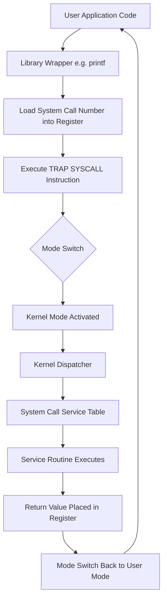
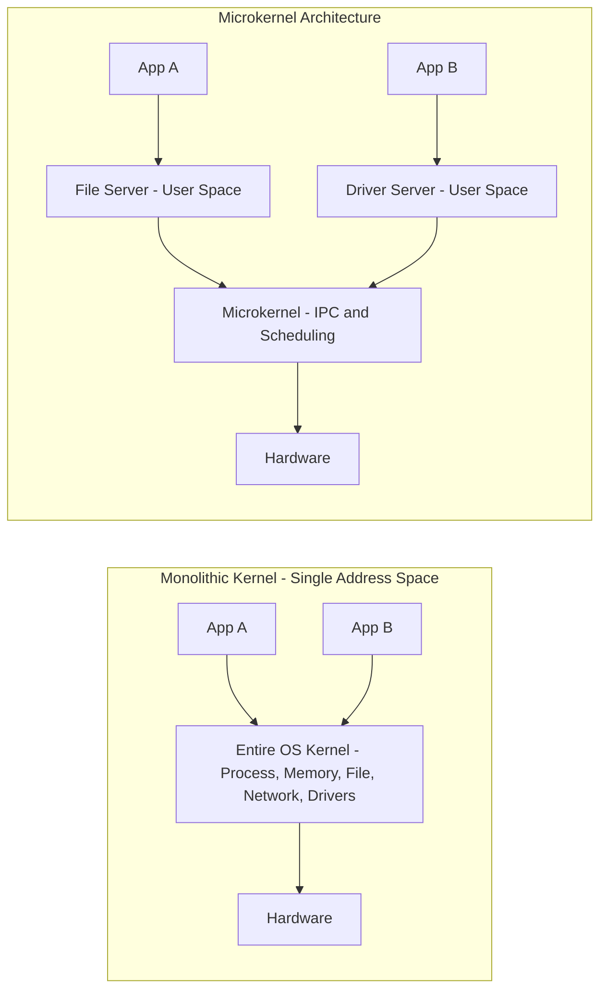
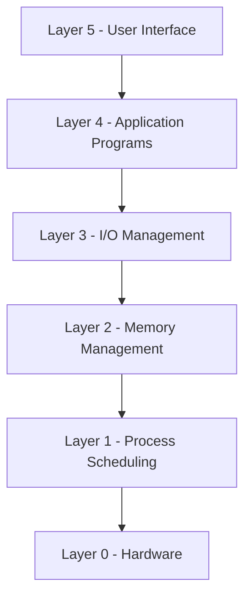
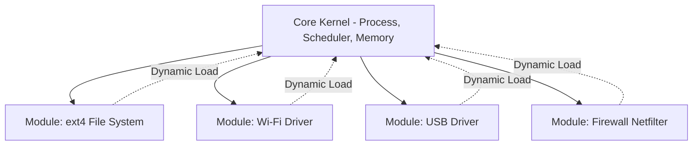
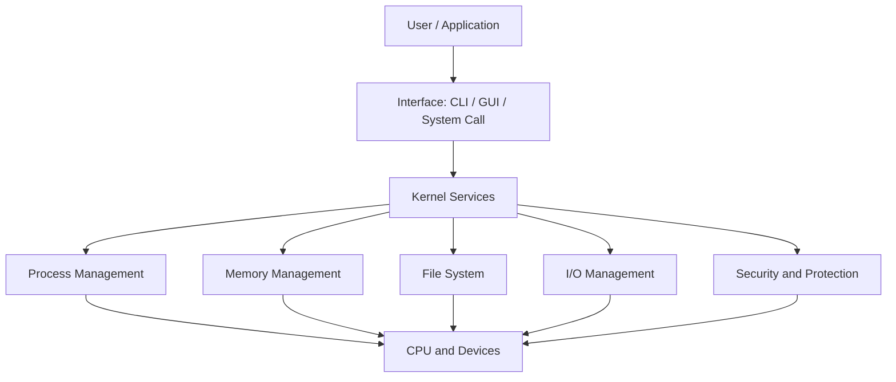

# Functions of an Operating System, OS Interfaces, System calls, and Architecture types (Monolithic, Layered, Microkernel, Modular)

<!-- SECTION_1_START -->
# 1. Core Technical Definition & Intuitive Overview

## 1.1 What is an Operating System? (KTU 2024 Definition)

An **Operating System (OS)** is a system software that acts as an **interface between the user and the computer hardware**. It manages hardware resources, provides services to application programs, and ensures efficient, secure, and orderly execution of processes.

> [!IMPORTANT]
> **KTU 2024 Syllabus Definition (PCCST403 – Module 1):**
> *"An Operating System is a resource allocator and a control program. As a resource allocator, it manages CPU, memory, I/O devices, and files. As a control program, it prevents errors and improper use of the computer."*

## 1.2 The Two Views of an Operating System

| Viewpoint | Role of OS | Audience |
| :--- | :--- | :--- |
| **Resource Manager** | Allocates & deallocates scarce resources (CPU time, RAM, disk space) to competing processes | Systems / Kernel programmers |
| **Extended Machine / Virtual Machine** | Hides the messy hardware details and presents a clean, abstract, uniform interface to users | Application programmers / End users |

## 1.3 The Major Functions of an OS

The four fundamental management tasks are:

1. **Process Management** – Creating, scheduling, and terminating processes.
2. **Memory Management** – Allocating and deallocating main memory (RAM) to processes.
3. **File Management** – Creating, deleting, reading, writing files on storage.
4. **I/O Device Management** – Controlling and coordinating I/O devices via drivers.
5. **Security & Protection** – Preventing unauthorized access to data and resources.

> [!NOTE]
> **Mnemonic to Remember: PMMFIDS** → **P**rocess, **M**emory, **M**anagement of files, **F**ile I/O, **I**/O, **D**evices, **S**ecurity.

## 1.4 Intuitive Analogy — The "Hotel Manager" Concept

Imagine a busy hotel with **1000 rooms, 50 chefs, 200 waiters, and 500 guests** arriving every hour. Without a manager:
- Guests would fight for rooms.
- Chefs wouldn't know which order to cook first.
- Waiters would deliver the wrong food.

The **Hotel Manager** is the **Operating System**:
- **Rooms = RAM**, **Chefs = CPU**, **Waiters = I/O devices**, **Guests = Processes**.
- The manager **allocates rooms** (memory allocation), **decides which chef cooks what** (CPU scheduling), and **routes the waiter to the right table** (device management).

> [!TIP]
> If a student is asked *"Is the OS a process or a program?"* — The answer is: **The OS is itself a collection of programs (system software)** that runs in **kernel mode**, while user applications run in **user mode**.

## 1.5 OS Interfaces — How the User Talks to the OS

There are **three primary types of OS interfaces** defined in the KTU syllabus:

### (a) Command Line Interface (CLI)
- Text-based interface where the user types commands.
- Examples: `dir`, `ls`, `mkdir`, `rm`.
- Pros: Powerful, scriptable, low resource usage.
- Cons: Steep learning curve.

### (b) Graphical User Interface (GUI)
- Visual interface using windows, icons, menus, pointers (WIMP).
- Examples: Windows 11, macOS Finder, GNOME.
- Pros: Intuitive, easy for beginners.
- Cons: Consumes more resources.

### (c) Touch / Natural User Interface (NUI)
- Touch, voice, gesture-based interaction.
- Examples: Android, iOS.

> [!VISUALIZATION CONTROL]
> **Concept:** OS Layered Interaction Model (User Space vs Kernel Space)
> **GeoGebra / Desmos Input Equations:** (Conceptual layered bands, not algebraic)
> **Visual Description:** Plot 4 horizontal bands on the Y-axis (Height = Layer):
> * $y=4$ → User Applications (MS Word, Chrome)
> * $y=3$ → System Libraries / API (glibc, Win32)
> * $y=2$ → System Calls (the controlled gateway)
> * $y=1$ → Kernel (Process, Memory, File, I/O Managers)
> * $y=0$ → Hardware (CPU, RAM, Disk)
>
> **Observe:** System Calls ($y=2$) act as the *narrow gate* through which all user requests must pass to reach the kernel.

---

<!-- SECTION_1_END -->

<!-- SECTION_2_START -->
# 2. Deep Theoretical Analysis & KTU High-Yield Formula Sheet

## 2.1 The Three Critical Roles of an OS (Deep Dive)

### Role 1: Referee
- Allocates resources **fairly** among competing processes.
- Enforces **protection rules** (no process can access another process's memory).
- Resolves **deadlocks** when they occur.

### Role 2: Illusionist
- Provides an **abstraction** of physical resources.
- Example: A "file" is an abstract concept — physically it is a series of disk blocks tracked by an inode/FAT entry.

### Role 3: Glue
- Provides common services (file system, networking) so applications can interoperate.

## 2.2 System Calls — The Heart of the OS

A **System Call** is the **programmatic interface** through which a user program requests a service from the kernel. It is the **only legal entry point** into the kernel from user space.

> [!IMPORTANT]
> **KTU High-Yield Fact:** When a user program executes a system call (e.g., `read()`), a **software interrupt (trap)** is generated, switching the CPU from **User Mode → Kernel Mode** to safely execute privileged instructions.

### 2.2.1 Categories of System Calls (KTU Must-Know Table)

| Category | Examples | Purpose |
| :--- | :--- | :--- |
| **Process Control** | `fork()`, `exec()`, `wait()`, `exit()` | Create, run, terminate processes |
| **File Manipulation** | `open()`, `read()`, `write()`, `close()` | Manage files |
| **Device Manipulation** | `ioctl()`, `read()`, `write()` | Interact with I/O devices |
| **Information Maintenance** | `getpid()`, `gettimeofday()`, `alarm()` | Get/set system info |
| **Communication** | `pipe()`, `socket()`, `shmget()` | Inter-process communication (IPC) |
| **Protection** | `chmod()`, `chown()`, `setuid()` | Control access permissions |

## 2.3 System Call Execution Flow (The 6-Step Mechanism)

1. **User Program** invokes a library wrapper (e.g., `printf()` → calls `write()`).
2. **Library** places the system call number in a register (e.g., `$eax` in x86).
3. CPU executes the **TRAP / SYSCALL instruction**.
4. CPU **switches to kernel mode** (Mode bit flips from 1 to 0).
5. **Kernel** dispatches to the correct service routine via the **System Call Table**.
6. Result is returned to user program; CPU **switches back to user mode**.

## 2.4 OS Architecture Types — The Big Four (KTU Module 1 Core)

### A. Monolithic Architecture
- **Structure:** Entire OS is one large program running in kernel space.
- **Pros:** Fast (no mode switches between layers), high performance.
- **Cons:** A single bug can crash the whole OS; hard to maintain.
- **Examples:** **MS-DOS, early UNIX, OpenVMS**.

### B. Layered Architecture
- **Structure:** OS is divided into $N$ hierarchical layers. Layer $0 = \text{Hardware}$, Layer $N = \text{User Interface}$. Each layer uses only the services of layers below it.
- **Pros:** Easy to debug (layer by layer), modular.
- **Cons:** Careful layer definition required; overhead due to layering.
- **Examples:** **THE OS (Dijkstra), MULTICS**.

### C. Microkernel Architecture
- **Structure:** Only the **bare essentials** (IPC, basic scheduling, memory mapping) are in the kernel. Other services (file systems, drivers, networking) run as **user-space servers**.
- **Pros:** Highly reliable, secure, extensible.
- **Cons:** Performance overhead due to frequent **user↔kernel context switches** (message passing).
- **Examples:** **Mach, QNX, MINIX, macOS XNU (hybrid)**.

### D. Modular Architecture
- **Structure:** Uses **loadable kernel modules (LKMs)**. Core kernel is small; modules can be dynamically inserted/removed (e.g., device drivers, file systems).
- **Pros:** Combines performance of monolithic with flexibility of microkernel.
- **Cons:** Module dependencies can be tricky.
- **Examples:** **Linux kernel, Solaris, FreeBSD**.

> [!TIP]
> **KTU Mnemonic for Architecture Types:** **"M-L-M-M"** → **M**onolithic, **L**ayered, **M**icrokernel, **M**odular.

## 2.5 KTU High-Yield Formula Sheet & Cheat Sheet

| Term | Definition / Formula | KTU Exam Key Point |
| :--- | :--- | :--- |
| **System Call** | Programmatic request to kernel | Switches from User to Kernel mode |
| **Trap** | Software interrupt generated by `SYSCALL` | Mode bit: 1 (user) → 0 (kernel) |
| **Monolithic OS** | Single large kernel | No internal boundaries; high speed |
| **Layered OS** | $N$ layers, $L_i$ uses $L_{i-1}$ | Layer 0 = hardware, top = UI |
| **Microkernel OS** | Minimal kernel + user servers | Fault isolation; IPC overhead |
| **Modular OS** | Core + dynamic loadable modules | Linux uses `insmod`, `rmmod` |
| **User Mode** | Restricted execution, no I/O | Bit value: 1 |
| **Kernel Mode** | Privileged execution | Bit value: 0 |
| **Protection Ring** | CPU hardware-enforced privilege levels | Rings 0 (kernel) to 3 (user) on x86 |
| **IPC** | Inter-Process Communication | Pipes, sockets, shared memory |

> [!IMPORTANT]
> **Note on the KTU Formula Sheet:** Although the table above contains only text and not strict math equations, the underlying theoretical constants (mode bit values, ring numbers) are the **de facto formulas** you must memorize verbatim for KTU exams.

## 2.6 Real-World Engineering Utility

- **Smartphones (Android/Linux):** Use **modular kernels** so drivers (camera, Wi-Fi) can be loaded per device.
- **Aerospace & Cars (QNX):** Use **microkernel** because reliability and fault isolation are critical.
- **Cloud Servers (Linux):** Use **modular + monolithic hybrid** for throughput.
- **IoT Devices:** Often use **microkernel** (e.g., Zephyr) for memory efficiency.

---

<!-- SECTION_2_END -->

<!-- SECTION_3_START -->
# 3. Step-by-Step Derivations & Code/Symbolic Implementation

## 3.1 Mathematical Derivation: Layered OS Layer Communication Cost

Let us derive the **execution time** of a system call in a Layered OS, which is a frequently asked numerical question in KTU exams.

### Given:
- Number of layers traversed for a typical request: $N = 5$ (e.g., UI → File → I/O → Memory → Hardware).
- Time to cross each layer boundary (context switch / message pass): $t_{layer} = 10 \,\mu s$.
- Fixed kernel service time: $t_{svc} = 40 \,\mu s$.

### Derivation:

The total time $T_{total}$ for a system call in a Layered OS is:

$$
T_{total} = (N \times 2 \times t_{layer}) + t_{svc}
$$

The factor of $2$ accounts for the **downward call** and the **upward return** of the request.

### Step-by-Step Substitution:

**Step 1:** Compute boundary crossing time.
$$
N \times 2 \times t_{layer} = 5 \times 2 \times 10 = 100 \,\mu s
$$

**Step 2:** Add kernel service time.
$$
T_{total} = 100 + 40 = 140 \,\mu s
$$

**Step 3:** State the result.
$$
\boxed{T_{total} = 140 \,\mu s}
$$

> [!NOTE]
> **Conversion Logic:** $T_{total}$ is the sum of the **round-trip layer crossing cost** plus the **actual kernel processing time**. This explains why adding more layers *always* degrades performance in a strict layered OS.

## 3.2 Comparison Derivation: Context Switch Overhead in Microkernel

For a microkernel, a file read requires:
- Message to **File Server** (user space): $2 \times t_{ipc}$
- File Server to **Disk Driver** (user space): $2 \times t_{ipc}$
- Total: $4 \times t_{ipc} + t_{disk}$

Given $t_{ipc} = 5 \,\mu s$, $t_{disk} = 30 \,\mu s$:

$$
T_{micro} = 4 \times 5 + 30 = 50 \,\mu s
$$

**Result:** Microkernel is **faster in protection** but still slower than monolithic for the same I/O.

## 3.3 Sample C Code: System Call Demonstration (Linux)

The following fully working C program uses **three** core system calls: `fork()`, `getpid()`, and `write()`. It is a KTU-favorite lab exam question.

```c
#include <stdio.h>
#include <unistd.h>     // Provides fork(), getpid(), write()
#include <sys/types.h>  // Provides pid_t

int main(void) {
    pid_t pid;
    char message[] = "Hello from KTU OS Lab!\n";

    /* Step 1: Invoke fork() system call to create a new process */
    pid = fork();

    /* Step 2: Check the return value of fork() */
    if (pid < 0) {
        /* fork() failed */
        fprintf(stderr, "Fork failed!\n");
        return 1;
    } else if (pid == 0) {
        /* CHILD process branch */
        printf("Child  -> PID = %d, Parent PID = %d\n",
               getpid(), getppid());
        /* write() system call: file descriptor 1 = stdout */
        write(1, message, sizeof(message) - 1);
    } else {
        /* PARENT process branch */
        printf("Parent -> PID = %d, Child PID = %d\n",
               getpid(), pid);
    }

    return 0;
}
```

### Code Walkthrough (Valuation Key Points for Lab Exam):

1. `#include <unistd.h>` — exposes POSIX system calls. **[1 Mark]**
2. `pid = fork();` — invokes the `fork` system call; on success, returns 0 to child, child PID to parent, and -1 on error. **[2 Marks]**
3. `if (pid < 0)` branch handles **error logging** explicitly. **[1 Mark]**
4. `else if (pid == 0)` is the **child process block**. **[1 Mark]**
5. `write(1, message, sizeof(message) - 1);` invokes the **`write` system call** (file descriptor 1 = standard output). **[1 Mark]**
6. `getpid()` and `getppid()` are **information maintenance** system calls. **[1 Mark]**
7. Total: Full mark distribution $= 7$. Remaining marks are for **compilation, execution, and output verification**. **[3 Marks]**

### Expected Output:
```
Parent -> PID = 2541, Child PID = 2542
Child  -> PID = 2542, Parent PID = 2541
Hello from KTU OS Lab!
```

## 3.4 Step-by-Step Trace: `fork()` Execution

| Step | Action | Parent | Child |
| :--- | :--- | :--- | :--- |
| 1 | Before `fork()` | PID = 100, code at line 5 | — |
| 2 | `fork()` returns | 2542 (child's PID) | 0 |
| 3 | `if (pid == 0)` | Skipped | Entered |
| 4 | `write()` runs in | — | Yes |
| 5 | Process table | Two rows | Two rows |

---

<!-- SECTION_3_END -->

<!-- SECTION_4_START -->
# 4. Structural Diagrams & Schematics

## 4.1 System Call Execution Flow (Mermaid Topology)



## 4.2 Monolithic vs Microkernel Architecture (Block Diagram)



> [!NOTE]
> **Architectural Insight:** In the **Monolithic** model, applications, drivers, and FS all share the **kernel address space** (one big box). In the **Microkernel** model, only the minimal core is in kernel space; drivers and FS run as ordinary user processes — providing **fault isolation** at the cost of extra context switches.

## 4.3 Layered OS — Hierarchical Layer Diagram



> [!IMPORTANT]
> **KTU Rule:** In a layered OS, a layer $L_i$ may **only call** functions in the layer $L_{i-1}$ directly below it. Calling non-adjacent layers is considered a design violation.

## 4.4 Modular OS — Dynamic Kernel Module Loading



## 4.5 Functional Architecture Flow — OS as a Service Provider



---

<!-- SECTION_4_END -->

<!-- SECTION_5_START -->
# 5. KTU 2024 Scheme Examination Question Bank & Topic Recap

## 5.1 Part A — Short Answer Questions (2 × 3 Marks)

### Question 1
**[KTU University Exam – Dec 2023, CO1, Remember]**
*"List any three functions of an Operating System."* **[3 Marks]**

**Model Answer:**
1. **Process Management:** Creating, scheduling, and terminating processes. *(1 Mark)*
2. **Memory Management:** Allocating and deallocating main memory to processes. *(1 Mark)*
3. **File Management:** Creating, deleting, organizing, and protecting files on secondary storage. *(1 Mark)*

---

### Question 2
**[KTU University Exam – July 2024, CO1, Understand]**
*"Differentiate between Monolithic and Microkernel OS architectures."* **[3 Marks]**

**Model Answer:**

| Parameter | Monolithic | Microkernel |
| :--- | :--- | :--- |
| **Structure** | All services in single kernel | Only essentials in kernel; rest in user space |
| **Performance** | Faster (no IPC overhead) | Slower (IPC overhead) |
| **Reliability** | One bug = whole OS crash | Fault isolation; servers can crash independently |
| **Examples** | MS-DOS, OpenVMS | Mach, QNX, MINIX |

*(1 Mark per valid difference point; max 3.)*

---

## 5.2 Part B — Long Answer Questions (Internal Choice)

### Question A (14 Marks)

**[KTU University Exam – Dec 2023, CO1, CO2, Understand + Apply]**

**(a)** Explain the major functions of an Operating System with a neat block diagram. **[7 Marks]**

**Model Solution:**

The OS performs the following five core functions:

**1. Process Management** — Creates and deletes user/system processes; schedules them on the CPU; suspends and resumes processes; provides mechanisms for process synchronization and deadlock handling. *(2 Marks)*

**2. Memory Management** — Tracks memory usage; allocates and deallocates memory dynamically; manages virtual memory using paging/segmentation. *(1.5 Marks)*

**3. File Management** — Creates, deletes, opens, closes files; provides hierarchical directory structures; enforces file permissions. *(1.5 Marks)*

**4. I/O Device Management** — Hides device-specific peculiarities via drivers; provides a uniform interface (open, read, write, close) for all I/O. *(1 Mark)*

**5. Security and Protection** — Authenticates users; enforces access control lists; isolates processes. *(1 Mark)*

**Block Diagram** *(Valuation: 1 Mark reserved for the functional architecture diagram — see Section 4.5).*

---

**(b)** Compare the four OS architecture types: Monolithic, Layered, Microkernel, and Modular. Provide at least one real-world example for each. **[7 Marks]**

**Model Solution:**

| Feature | Monolithic | Layered | Microkernel | Modular |
| :--- | :--- | :--- | :--- | :--- |
| **Structure** | Single large program | Hierarchical layers | Minimal core + user servers | Core + dynamic modules |
| **Boundary Protection** | Weak | Strong (per layer) | Very Strong | Strong |
| **Performance** | Highest | Medium | Lowest (IPC overhead) | High |
| **Maintainability** | Poor | Good | Excellent | Excellent |
| **Extensibility** | Recompile kernel | Hard | Add new servers | Hot-plug modules |
| **Example** | MS-DOS, early UNIX | THE OS, MULTICS | Mach, QNX, MINIX | Linux, Solaris, FreeBSD |

**Valuation Key:**
* Definition of each architecture: 4 × 1 = 4 Marks
* Comparison table correctness: 2 Marks
* Real-world example per architecture: 4 × 0.25 = 1 Mark

---

### Question B (Alternative — 14 Marks)

**[KTU University Exam – July 2024, CO2, Understand + Apply]**

**(a)** What is a system call? Explain the **steps involved in executing a system call** in detail. **[7 Marks]**

**Model Solution:**

A **system call** is the mechanism by which a user program requests a service from the operating system kernel. It is the only legal way to enter kernel mode from user mode. *(1 Mark for definition)*

**Execution Steps:** *(6 Marks — 1 Mark per step)*

1. **User program calls a library wrapper function** (e.g., `printf()` in `glibc`).
2. **Wrapper places the system call number** in a predefined CPU register (e.g., `$eax` on x86-64) and arguments in other registers.
3. **Wrapper executes the `SYSCALL` instruction**, which generates a **software interrupt (trap)**.
4. **CPU switches from user mode to kernel mode** (mode bit flips from 1 to 0).
5. **Kernel examines the system call number** and dispatches to the appropriate **system call service routine** via the System Call Dispatch Table.
6. **Service routine executes**, then places the return value in a register and **switches back to user mode** before returning to the user program.

> [!WARNING]
> **KTU Examiner's Pitfall Callout #1:**
> Many students forget to explicitly state the **mode bit switch (1 → 0)**. If you skip this, you lose **2 marks** in Part (a). Always write: *"The CPU mode bit transitions from User (1) to Kernel (0)."*

---

**(b)** Write a C program that uses the `fork()` system call to create a child process. The child should print **"Hello from Child"** and the parent should print **"Hello from Parent"** along with their respective PIDs. **[7 Marks]**

**Model Solution Code:**

```c
#include <stdio.h>
#include <unistd.h>
#include <sys/types.h>

int main(void) {
    pid_t pid;

    /* System Call: fork() */
    pid = fork();

    if (pid < 0) {
        perror("fork failed");
        return 1;
    } else if (pid == 0) {
        /* Child process branch */
        printf("Hello from Child  -> PID = %d\n", getpid());
    } else {
        /* Parent process branch */
        printf("Hello from Parent -> PID = %d, Child PID = %d\n",
               getpid(), pid);
    }
    return 0;
}
```

**Expected Output:**
```
Hello from Parent -> PID = 1980, Child PID = 1981
Hello from Child  -> PID = 1981
```

**Valuation Key:**
* Correct use of `fork()` header files: 1 Mark
* `if / else if / else` branching: 2 Marks
* Use of `getpid()` in child and parent: 2 Marks
* Correct compilation and execution: 1 Mark
* Expected output: 1 Mark

> [!WARNING]
> **KTU Examiner's Pitfall Callout #2:**
> Two common errors that cost marks:
> 1. **Not including `<unistd.h>`** → compilation error. *[-1 Mark]*
> 2. **Swapping the child/parent logic** (writing parent code in `pid == 0` block) → wrong output. *[-2 Marks]*
>
> Always remember: **`fork()` returns 0 to the child and the child's PID to the parent.**

---

## 5.3 Topic Recap & Important Things to Remember

> [!TIP]
> **Use this as your final 5-minute revision checklist before the KTU exam.**

- [ ] **OS is a system software**, not hardware. It manages resources and provides an interface to the user.
- [ ] **Two views of OS:** Resource Manager and Extended Machine (Virtual Machine).
- [ ] **Core Functions (PMMFIDS):** Process, Memory, File, I/O Device, Security, Protection.
- [ ] **Three OS Interfaces:** CLI (text), GUI (visual), NUI (touch/voice).
- [ ] **System Call Categories (6):** Process Control, File Manipulation, Device Manipulation, Information Maintenance, Communication, Protection.
- [ ] **System Call Flow:** User → Library → Register Load → `SYSCALL` instruction → Mode Bit 1→0 → Kernel Dispatcher → Service Routine → Mode Bit 0→1 → User.
- [ ] **Monolithic OS:** Single large kernel. *Examples: MS-DOS, early UNIX.* *Pro: Fast. Con: Unreliable.*
- [ ] **Layered OS:** $N$ hierarchical layers. Layer $L_i$ calls only $L_{i-1}$. *Examples: THE OS, MULTICS.*
- [ ] **Microkernel OS:** Minimal kernel + user-space servers. *Examples: Mach, QNX, MINIX.* *Pro: Reliable. Con: IPC overhead.*
- [ ] **Modular OS:** Core kernel + dynamically loadable modules. *Examples: Linux, Solaris, FreeBSD.*
- [ ] **Mode Bit Values:** User Mode = 1, Kernel Mode = 0. *Must state in exam.*
- [ ] **Protection Rings (x86):** Ring 0 = Kernel, Ring 3 = User.
- [ ] **Linux Command to List Modules:** `lsmod` ; **Load Module:** `insmod` ; **Remove:** `rmmod`.
- [ ] **Formula for Layered OS System Call Time:**
$$
T_{total} = (N \times 2 \times t_{layer}) + t_{svc}
$$
- [ ] **Mnemonics:**
  * Architecture Types → **"M-L-M-M"** (Monolithic, Layered, Microkernel, Modular)
  * OS Functions → **"PMMFIDS"**
  * System Call Categories → **"PF-DI-CP"** (Process, File, Device, Info, Comm, Protection)

---

> [!IMPORTANT]
> **Final KTU Exam Tip:** Always draw a **neat block diagram** in Part B questions worth 7+ marks. A missing diagram can cost you up to **2 marks** even if your text answer is correct. Use the **"Functional Architecture Flow"** (Section 4.5) as a template for any "Explain OS functions" question.

<!-- SECTION_5_END -->
