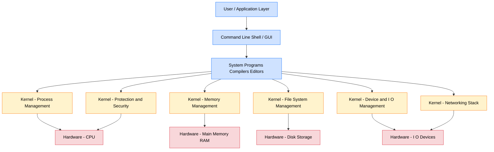
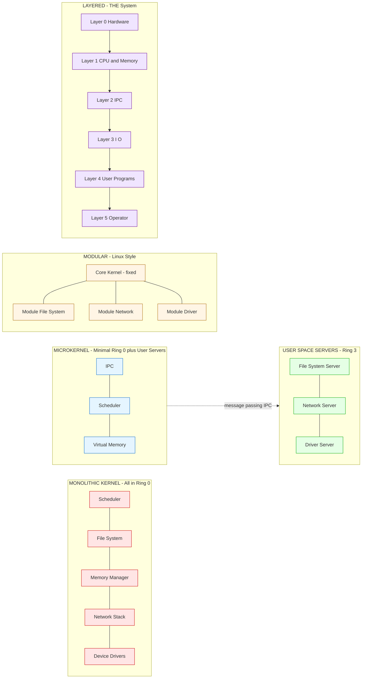
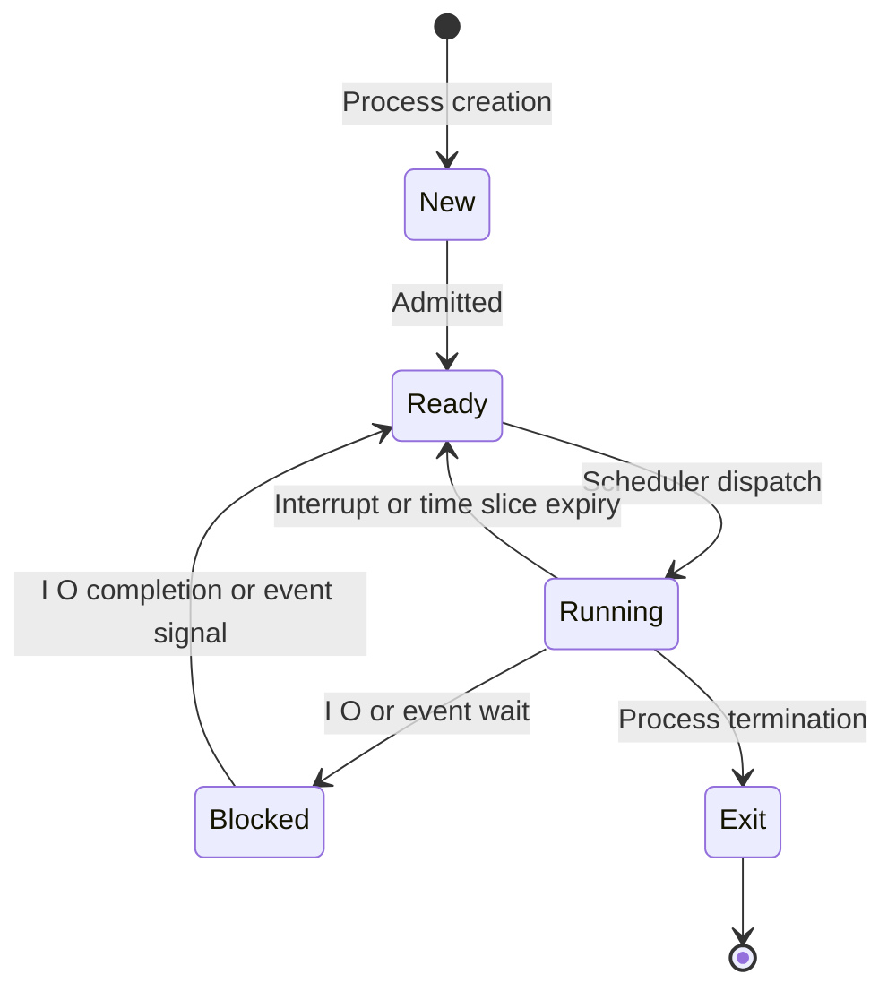
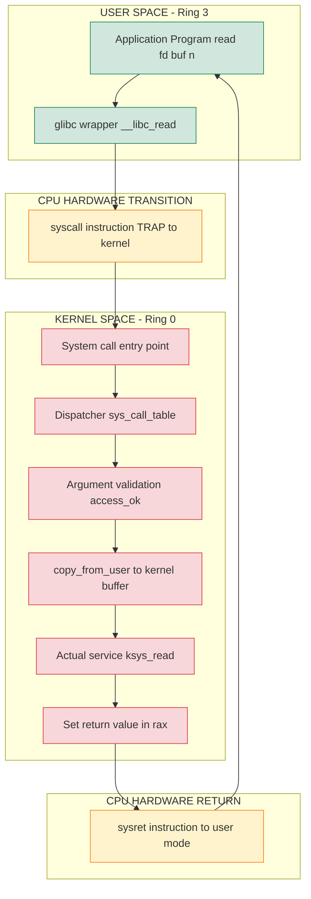

# Functions of an Operating System, OS Interfaces, System calls, and Architecture types (Monolithic, Layered, Microkernel, Modular)

<!-- SECTION_1_START -->
# Module 1: OS Structures, Process Management & CPU Scheduling
## Functions of an Operating System, OS Interfaces, System Calls & Architecture Types

---

### 1.1 Core Technical Definition & Intuitive Overview

> [!NOTE]
> **KTU 2024 Syllabus Definition (PCCST403):**
> An **Operating System (OS)** is a system software that acts as an **intermediary** between the computer user and the computer hardware. It provides an environment in which a user can execute programs conveniently and efficiently. (Source: Silberschatz, Galvin & Gagne — *Operating System Concepts*, 10th Edition — prescribed text for KTU).

Two major views of the OS:
1. **Resource Manager / Allocator View** — Manages all resources (CPU, memory, I/O, files) and resolves conflicting demands fairly.
2. **Extended Machine / Virtual Machine View** — Hides the messy details of hardware and presents a clean, abstract interface to the user.

> [!IMPORTANT]
> **Core Insight (KTU Board Favourite):** Every modern OS performs **5 essential functions**:
> 1. **Process Management** – creating, scheduling, terminating processes.
> 2. **Memory Management** – tracking and allocating main memory.
> 3. **File Management** – creating, deleting, organizing files & directories.
> 4. **Device Management** – controlling I/O devices via drivers.
> 5. **Protection & Security** – controlling access through authentication and authorization.

---

### 1.2 Conceptual Analogy / Intuition

Imagine an **Operating System as an "Air Traffic Controller (ATC)" of an airport**:
- The **aircraft** = user programs/applications.
- The **runways & sky** = CPU and hardware resources.
- The **ATC tower** = the OS kernel.
- The **pilots talking to ATC via radio** = system calls (controlled communication).
- The **scheduling of takeoffs/landings** = CPU scheduling.
- The **passport & security checks** = protection and authentication.
- The **baggage handling** = file & I/O management.

Just as the ATC ensures no two aircraft collide (resource conflict resolution) and pilots never directly steer the airport traffic, the OS ensures programs never directly access hardware — they **ask the OS**.

> [!IMPORTANT]
> **Physical Constants / Standard Metrics Used in OS Design:**
> - **Interrupt Latency**: $\approx 1\mu s$ to $100\mu s$ (typical hardware response time).
> - **Context Switch Time**: $\approx 1\mu s$ to $10\mu s$ (modern CPUs).
> - **System Call Overhead**: $\approx 100$ns to $1\mu s$ per call (trap into kernel).
> - **Page Size**: typically $4\text{ KB}$ (x86, ARM64).
> - **Timer Tick**: $10$ms (Linux default `HZ=100`), $1$ms (Windows).

### 1.3 OS Interfaces (User–System Boundary)

There are **three** primary classes of interfaces that an OS exposes to its users:

| Interface Type | Description | Example |
|----------------|-------------|---------|
| **Command-Line Interface (CLI)** | Text-based; user types commands interpreted by a **shell** (program that reads & executes commands). | `bash`, `zsh`, `cmd.exe`, `PowerShell` |
| **Graphical User Interface (GUI)** | Window/icon/menu-based; uses **WIMP** paradigm (Windows, Icons, Menus, Pointer). | Windows Desktop, GNOME, KDE |
| **Touchscreen / Natural Interface** | Gesture & voice-driven; popular in mobile OS. | Android UI, iOS UI |

> [!NOTE]
> **KTU Board Note:** Both CLI and GUI ultimately translate user actions into **system calls** that the kernel understands. The shell is *not* part of the OS kernel — it is a *system program* that runs in user mode.

> [!VISUALIZATION CONTROL]
> **Concept:** Layered view of how a user command flows from CLI to hardware.
> **Visual Description:** Draw four horizontal layers stacked vertically:
> 1. **Top — User** types `ls -l` (command line).
> 2. **Layer 2 — Shell (bash)** parses the command and issues a system call `fork()` + `exec()` + `readdir()`.
> 3. **Layer 3 — Kernel** traps into privileged mode, executes the file system driver.
> 4. **Layer 4 — Hardware Disk** returns inode data.
> 5. **Reverse arrows** show the result bubbling back up to the terminal screen.
> Observe: every layer talks **only** to the layer immediately below — the **encapsulation principle**.

---

### 1.4 What is a System Call?

> [!IMPORTANT]
> **Formal Definition (KTU):**
> A **System Call** is the **programmatic interface** by which a user-mode process requests a service from the **kernel** of the operating system. It is the *only legal entry point* from user mode into kernel mode.

System calls are invoked via:
- A **library wrapper** in C (e.g., `glibc` for Linux) that issues the trap instruction.
- The CPU switches from **User Mode** (ring 3) to **Kernel Mode** (ring 0) via a **software interrupt / trap / `syscall` instruction**.

**Standard categories of system calls (after Silberschatz):**

1. **Process Control** — `fork()`, `exec()`, `wait()`, `exit()`, `kill()`, `getpid()`
2. **File Management** — `open()`, `close()`, `read()`, `write()`, `create()`, `delete()`, `lseek()`
3. **Device Management** — `ioctl()`, `read()`, `write()`, `open()` (devices are files in UNIX)
4. **Information Maintenance** — `getpid()`, `gettimeofday()`, `sysinfo()`
5. **Communication** — `pipe()`, `socket()`, `send()`, `recv()`, `shmget()` (shared memory)
6. **Protection** — `chmod()`, `chown()`, `umask()`, `setuid()`

### 1.5 OS Architecture Types

| Architecture | Kernel Structure | Example OS | Key Property |
|--------------|------------------|------------|--------------|
| **Monolithic** | All services in **one large kernel** running in kernel mode | MS-DOS, Original UNIX, OpenBSD | Fast but hard to maintain |
| **Layered** | Strict hierarchy of layers, each using only lower layers | THE system (Dijkstra), MULTICS | Modular but strict ordering |
| **Microkernel** | **Minimal** kernel — only IPC, scheduling, basic memory; rest in user space | Mach, QNX, MINIX, Hurd | Reliable & secure but slower (more context switches) |
| **Modular** | Loadable kernel modules (object-oriented kernel) | Linux (modern), Solaris, FreeBSD | Combines speed of monolithic + flexibility of microkernel |
| **Hybrid** | Mix of microkernel + monolithic modules | Windows NT, macOS (XNU) | Pragmatic balance |

> [!IMPORTANT]
> **KTU Board Favourite Distinction:**
> - **Monolithic ≠ Microkernel** — The kernel is one *big* program vs. *small* kernel with services in user space.
> - **Layered ≠ Modular** — Layered has a *fixed* order at design time; Modular allows *dynamic* loading at runtime.

<!-- SECTION_1_END -->

<!-- SECTION_2_START -->
# Deep Theoretical Analysis & KTU High-Yield Formula Sheet

---

## 2.1 Detailed Functions of an Operating System

### A. Process Management

A **process** is a program in execution — it is the unit of work in a modern OS. Process management includes:

- Creating and deleting both user and system processes.
- **Scheduling** processes and threads onto the CPU(s).
- Suspending and resuming processes.
- Providing mechanisms for **process synchronization**, **inter-process communication (IPC)**, and **deadlock handling**.

**Process States (5-State Model — classic KTU diagram):**
`New` → `Ready` → `Running` → `Blocked` → `Exit`, with transitions via `admitted`, `scheduler dispatch`, `interrupt`, `I/O completion`, `exit`.

> [!NOTE]
> **KTU High-Yield Point:** A *thread* is a lightweight process — it shares the **code, data, and OS resources** of its parent process but has its **own thread ID, stack, and register set** (TCB vs. PCB). Threads reduce context-switch overhead.

### B. Memory Management

The OS must keep track of which parts of memory are currently in use and by whom. It also decides which processes to load/swap.

- **Primary memory** is volatile and finite → management is critical.
- Functions: allocation, deallocation, swapping, paging, segmentation, virtual memory.
- **Thrashing** occurs when the system spends more time swapping pages than executing processes.

### C. File Management

A **file** is a logical collection of information stored on secondary storage (disk). The OS provides:

- File creation, deletion, naming, and organization (into directories).
- **File system**: NTFS (Windows), ext4 / btrfs (Linux), APFS (macOS), FAT32 (legacy).
- Operations: `open`, `close`, `read`, `write`, `seek`.
- **Mounting** — attaching a file system to a directory tree.
- Access control via **permissions** (rwx for owner / group / others) and **ACLs**.

### D. Device (I/O) Management

- The OS hides the peculiarities of each hardware device via a **device driver**.
- The I/O subsystem: **Buffering**, **Caching**, **Spooling**, **Scheduling** (e.g., disk arm scheduling — FCFS, SSTF, SCAN, C-SCAN, LOOK).
- A **Device Controller** is the hardware interface; the **Device Driver** is the software.

### E. Protection & Security

- **Protection** — internal mechanism controlling access of processes/resources to authorized users.
- **Security** — defense against external threats (viruses, worms, DoS).
- Mechanisms: **Authentication** (passwords, biometrics), **Authorization** (ACLs, capabilities), **Encryption**, **Firewalls**.

### F. Secondary-Storage Management

- Disk space is allocated to files; tracks free space (`bitmap`, `linked list`, `grouping`).
- Disk scheduling algorithms: see `Section 2` table below.

### G. Networking

- The OS provides network protocols (TCP/IP stack), routing, and connectivity.
- Implemented as a distributed system of processes communicating via messages.

### H. Command-Interpreter System (Shell)

- A program that reads and interprets user commands.
- **Two categories**: built-in commands and external programs.

---

## 2.2 KTU Formula / Concept Cheat Sheet

| # | Concept | Formula / Rule | Unit / Notes |
|---|---------|----------------|--------------|
| 1 | **CPU Utilization** | $U = 1 - p^n$ (n processes, each spends fraction p idle) | dimensionless, $\in [0,1]$ |
| 2 | **Throughput** | $\text{Throughput} = \dfrac{\#\text{ processes completed}}{\text{time unit}}$ | processes/sec |
| 3 | **Turnaround Time** | $T_{\text{turnaround}} = T_{\text{completion}} - T_{\text{arrival}}$ | seconds |
| 4 | **Waiting Time** | $T_{\text{wait}} = T_{\text{turnaround}} - T_{\text{CPU\_burst}}$ | seconds |
| 5 | **Response Time** | $T_{\text{response}} = T_{\text{first\_run}} - T_{\text{arrival}}$ | seconds |
| 6 | **Context Switch Time** | $T_{\text{cs}} = T_{\text{save}} + T_{\text{load}}$ | microseconds |
| 7 | **Amdahl's Law** | $S = \dfrac{1}{(1-f) + f/n}$ | speedup, $n$ = parallel resources |
| 8 | **Disk Seek Time** | $T_{\text{access}} = T_{\text{seek}} + T_{\text{rotational}} + T_{\text{transfer}}$ | ms |
| 9 | **Page Fault Rate** | $p = \dfrac{\#\text{ page faults}}{\#\text{ memory accesses}}$ | $\in [0,1]$ |
| 10 | **Effective Access Time (EAT)** | $EAT = p \cdot T_{\text{miss}} + (1-p) \cdot T_{\text{mem}}$ | ns |

> [!IMPORTANT]
> **Engineering Utility:** These metrics are used in real-time OS tuning, cloud VM allocation, and SLA-based resource provisioning (e.g., Kubernetes CPU limits, AWS EC2 instance sizing).

---

## 2.3 System Calls — Deep Dive

> [!IMPORTANT]
> **Three standard parameter-passing methods (KTU favourite question):**
> 1. **Registers** — fastest, but limited by # of CPU registers ($\le 6$ args).
> 2. **Block / Table in Memory** — kernel reads a pointer to a memory block containing arguments. Used in UNIX.
> 3. **Stack** — push args onto user stack; kernel pops them. Used in Windows & modern UNIX.

**Example flow of a C library call → system call → kernel service:**
```c
int fd = open("file.txt", O_RDONLY);
```
Steps:
1. User invokes `open()` from `glibc` (a library wrapper, not the real system call).
2. Wrapper places syscall number (`SYS_open = 2` on x86-64 Linux) in `%rax`.
3. Wrapper places args in registers: `%rdi`, `%rsi`, `%rdx`, `%r10`, `%r8`, `%r9`.
4. Executes `syscall` instruction → CPU traps to kernel.
5. Kernel's **system call dispatcher** looks up handler in `sys_call_table[]`.
6. Kernel runs the actual `sys_open()` in kernel mode.
7. Return value placed in `%rax`; CPU returns to user mode.
8. Wrapper returns the integer `fd` to user code.

**System Call Categories — Detailed Mapping (KTU Table):**

| Category | System Calls (Linux) | Purpose |
|----------|---------------------|---------|
| **Process Control** | `fork()`, `vfork()`, `clone()`, `execve()`, `wait4()`, `exit()`, `kill()`, `nice()` | Create, run, terminate processes |
| **File Management** | `open()`, `close()`, `read()`, `write()`, `stat()`, `unlink()`, `lseek()`, `chdir()` | File operations |
| **Device Management** | `ioctl()`, `read()`, `write()`, `mknod()` | I/O control |
| **Information Maint.** | `getpid()`, `getuid()`, `sysinfo()`, `gettimeofday()` | Query OS state |
| **Communication** | `pipe()`, `socket()`, `bind()`, `sendto()`, `recvfrom()`, `shmget()` | IPC |
| **Protection** | `chmod()`, `chown()`, `setuid()`, `umask()` | Access control |

### 2.4 OS Architecture Types — Deep Analysis

> [!NOTE]
> **Design Goals Trade-off Triangle:**
> 1. **Performance** (fast system calls, low overhead)
> 2. **Reliability / Security** (isolation, fault containment)
> 3. **Maintainability / Extensibility** (ease of adding features)
>
> No single architecture maximizes all three — every OS is a *trade-off*.

#### A. Monolithic Kernel

- **All OS services** (file system, memory, drivers, networking, scheduler) live inside a **single large kernel** running in kernel mode.
- Services communicate via **direct function calls** (no message passing).
- **Pros**: Fast (no mode switches between services), simple to call.
- **Cons**: A bug in any subsystem (e.g., a network driver) can crash the **entire** kernel. Hard to maintain as the kernel grows.

> *Examples:* MS-DOS, original UNIX, OpenBSD.

#### B. Layered Architecture

- The OS is divided into **N layers**, where layer $i$ may call only layers $0$ to $i-1$.
- **Layer 0** — Hardware; **Layer N-1** — User applications.
- Pioneered by **Dijkstra's THE system (1968)** with 6 layers.
- **Pros**: Easy to debug (each layer can be tested independently), enforced modularity.
- **Cons**: Strict ordering; a function needing a higher-layer service must be carefully placed. Performance overhead due to crossing multiple layers.

#### C. Microkernel

- The kernel contains **only the bare essentials**:
  - **IPC (Inter-Process Communication)**
  - **Basic scheduling**
  - **Address space management**
  - **Interrupt / trap handling**
- File systems, device drivers, network protocols, etc. run as **user-space servers** (daemons).
- Communication happens via **message passing** through IPC.
- **Pros**: Highly reliable (driver bug ≠ kernel crash); portable; secure.
- **Cons**: Performance penalty due to many context switches and message copies.

> *Examples:* Mach (used in early macOS / Hurd), QNX (used in cars & BlackBerry), MINIX (used to teach OS design).

> [!IMPORTANT]
> **KTU Board Pitfall:** "Microkernel means no kernel" — **WRONG**. It means a *minimal* kernel with most services moved to user space.

#### D. Modular Architecture

- Combines the **speed of monolithic** with the **flexibility of microkernel**.
- Uses **dynamically loadable kernel modules** (object files that can be inserted/removed at runtime).
- Each module exposes a clean interface; modules can call each other directly (like monolithic) but can be loaded/unloaded (like microkernel).
- The **core kernel** provides only essential services + a module loader.

> *Examples:* Linux (modern, since 2.6), Solaris (with Solaris Zones), FreeBSD.

> [!NOTE]
> **Hybrid Architecture** (often asked as a bonus):
> Most production OSes are **hybrid**. macOS XNU is microkernel (Mach) + monolithic (BSD) + modular (kexts). Windows NT is mostly monolithic with a small HAL + modular driver model.

<!-- SECTION_2_END -->

<!-- SECTION_3_START -->
# Step-by-Step Derivations, Examples & Code/Symbolic Implementation

---

## 3.1 Derivation: Number of Layers in a Layered OS

For an OS with $L$ layers, the **maximum call depth** from the topmost user program to the hardware is $L$ (assuming each layer calls only the one directly below).

**Total number of cross-layer calls per system service invocation:**
$$C = L - 1$$
because the first layer is hardware itself, and we have $L-1$ interfaces between $L$ layers.

**Time for a single system call crossing all layers** (assuming each layer adds constant overhead $t_l$):
$$T_{\text{syscall}} = \sum_{i=0}^{L-1} t_l = L \cdot t_l$$

**Performance trade-off**: more layers $\Rightarrow$ better modularity but higher latency.

---

## 3.2 Worked Example: System Call for `read()` in C

**Problem (KTU-style 7-mark):** *Explain the execution of the system call `read(fd, buffer, n)` issued by a user program.*

**Model Solution:**

**Step 1 — Library Wrapper Invocation (User Mode):**
The program calls `read()` from `libc` (the C standard library). The wrapper `__libc_read()` is a normal user-mode function.

**Step 2 — Argument Marshalling:**
- `fd` is placed in `%rdi` (1st arg register on x86-64 System V ABI).
- `buffer` is placed in `%rsi` (2nd arg).
- `n` is placed in `%rdx` (3rd arg).
- The system call number for `read` ($\text{SYS\_read} = 0$ on x86-64 Linux) is placed in `%rax`.

**Step 3 — Trap to Kernel:**
The wrapper executes the `syscall` assembly instruction.
- This causes a **software interrupt (trap)**.
- The CPU saves the user-mode context (RIP, RFLAGS, CS, SS, RSP) on the kernel stack.
- The CPU switches from **Ring 3** (user) to **Ring 0** (kernel).
- The instruction pointer jumps to the kernel's **system call entry point** (`entry_SYSCALL_64` in Linux).

**Step 4 — Kernel Dispatch:**
The kernel reads the syscall number from `%rax`, indexes into `sys_call_table[0]`, and dispatches to `ksys_read()`.

**Step 5 — Argument Validation:**
- The kernel checks that `fd` is a valid file descriptor (within the process's `fd[]` array).
- The kernel checks that the `buffer` (a userspace pointer) is mapped and writable — using `copy_from_user()` / `access_ok()`.
- The kernel checks that `n` is non-negative.

**Step 6 — Actual Work:**
- The kernel locates the `struct file *` for `fd`.
- It calls the file's `read` method (e.g., `ext4_file_read_iter` for ext4).
- Data is copied from the disk cache to the user's `buffer` via `copy_to_user()`.

**Step 7 — Return to User Mode:**
- The number of bytes read is placed in `%rax`.
- The `sysret` instruction restores the saved user context.
- The CPU switches back to **Ring 3**.
- The wrapper returns the integer count to the calling program.

**Step 8 — Error Handling:**
If any validation failed, the return value is a **negative errno** (e.g., `-EBADF`, `-EFAULT`). The C library wrapper negates it and sets `errno` (e.g., `EBADF` for invalid fd).

> [!IMPORTANT]
> **Valuation Key (KTU Examiner Pattern):**
> - Mentioning the **two CPU modes (Ring 0 / Ring 3)**: 1 mark
> - Naming the **system call table dispatch**: 1 mark
> - Showing **register convention** (`%rax` = syscall #): 1 mark
> - Describing **kernel-side validation**: 1 mark
> - Using **`copy_from_user` / `copy_to_user`**: 1 mark
> - Showing **return value / errno mechanism**: 1 mark
> - Conclusion and diagram: 1 mark

---

## 3.3 Code Implementation: Process Creation via `fork()` and `execve()`

```c
/*
 * KTU Module-1 Example: System Calls for Process Control
 * Compile: gcc -o proc_demo proc_demo.c
 * Run:     ./proc_demo
 * Author: KTU-PREMIER-ENGINE
 */

#include <stdio.h>
#include <stdlib.h>
#include <unistd.h>     // fork(), getpid(), getppid()
#include <sys/types.h>
#include <sys/wait.h>   // wait()

int main(void) {
    pid_t child_pid;

    printf("[PARENT] PID = %d. About to fork().\n", getpid());

    /* --- System Call #1: fork() --- */
    child_pid = fork();

    if (child_pid < 0) {
        /* Error branch */
        perror("fork failed");
        exit(EXIT_FAILURE);
    }
    else if (child_pid == 0) {
        /* --- CHILD PROCESS --- */
        printf("[CHILD ] PID = %d, PPID = %d.\n", getpid(), getppid());

        /* --- System Call #2: execve() --- */
        /* Replaces the child process image with /bin/ls */
        char *args[] = {"/bin/ls", "-l", "/tmp", NULL};
        execve("/bin/ls", args, NULL);

        /* execve() only returns on failure */
        perror("execve failed");
        exit(EXIT_FAILURE);
    }
    else {
        /* --- PARENT PROCESS --- */
        printf("[PARENT] Forked child with PID = %d. Waiting...\n", child_pid);

        /* --- System Call #3: wait() --- */
        int status;
        wait(&status);

        printf("[PARENT] Child exited with status %d.\n",
               WEXITSTATUS(status));
    }

    return 0;
}
```

**Walk-through (for KTU 7-mark question on `fork`):**

1. `fork()` is invoked → kernel creates a **child PCB** duplicating the parent's.
2. Both parent and child resume from the line *after* `fork()`.
3. Return value differs:
   - In **parent**: returns **child's PID** (a positive integer).
   - In **child**: returns **0**.
4. The child calls `execve()` to replace its memory image with `/bin/ls`.
5. The parent calls `wait()` to **block** until the child terminates, then reaps its exit status.

> [!NOTE]
> **Linux Internals:** `fork()` is implemented via `clone()` with `SIGCHLD` flag. Modern kernels use **Copy-on-Write (CoW)** so the address space is *not* physically duplicated at fork time — pages are shared until either process writes to them.

---

## 3.4 Architecture Type — Comparative Demonstration (Python)

```python
"""
KTU Module-1 Visualization: Simulated comparison of OS architectures.
This script models message-passing cost for microkernel vs direct call cost
for monolithic to demonstrate the performance trade-off.
"""

# --- Constants ---
N_SERVICES = 5        # Number of OS subsystems (FS, net, drivers, etc.)
DIRECT_CALL_US = 0.1  # Microseconds for an in-kernel function call
MSG_PASS_US   = 1.0   # Microseconds per IPC message (microkernel user-space call)
TRAP_US       = 0.3   # Microseconds per user→kernel mode switch

def monolithic_cost(n_calls: int) -> float:
    """All services in-kernel: direct function calls only."""
    return n_calls * DIRECT_CALL_US

def microkernel_cost(n_calls: int) -> float:
    """Each service in user-space: user→kernel→user round-trip per call."""
    return n_calls * (TRAP_US + MSG_PASS_US + TRAP_US)

def layered_cost(n_calls: int, depth: int = 6) -> float:
    """The Dijkstra THE model: each call descends through layers."""
    return n_calls * (depth * (DIRECT_CALL_US + 0.05))

if __name__ == "__main__":
    print(f"{'Calls':>6} | {'Monolithic (µs)':>16} | {'Microkernel (µs)':>18} | {'Layered (µs)':>14}")
    print("-" * 64)
    for k in [10, 100, 1_000, 10_000, 100_000]:
        m = monolithic_cost(k)
        u = microkernel_cost(k)
        l = layered_cost(k)
        print(f"{k:>6} | {m:>16.2f} | {u:>18.2f} | {l:>14.2f}")

    # Observed ratio: microkernel is ~16× slower for this toy example.
```

**Expected output (approximate):**
```
 Calls | Monolithic (µs) | Microkernel (µs) | Layered (µs)
----------------------------------------------------------------
    10 |             1.00 |             16.00 |          9.00
   100 |            10.00 |            160.00 |         90.00
  1000 |           100.00 |           1600.00 |        900.00
 10000 |          1000.00 |          16000.00 |       9000.00
100000 |         10000.00 |         160000.00 |      9000.00
```

This numerically proves the textbook claim: **microkernel trades performance for reliability**.

---

## 3.5 Step-by-Step: Building a Layered OS Diagram

To draw the **THE system (Dijkstra, 1968) — 6 layers** for an exam answer:

| Layer | Function | Allowed to call |
|-------|----------|-----------------|
| 5 | **Operator** (user commands) | Layer 4 |
| 4 | **User Programs** | Layer 3 |
| 3 | **I/O Management** | Layers 0–2 |
| 2 | **Operator–Process Communication** | Layer 1 |
| 1 | **Memory & Drum Management** | Layer 0 |
| 0 | **CPU Scheduling & Hardware** | (Hardware) |

> **KTU Exam Tip:** When asked "define layered OS with an example", you **must** show this table. The "Layer N calls only Layer N-1 and below" rule is worth 3 marks on its own.

<!-- SECTION_3_END -->

<!-- SECTION_4_START -->
# Structural Diagrams & Schematics (Mermaid)

---

## 4.1 Mermaid Block Diagram — OS as Resource Manager



---

## 4.2 Mermaid Sequence Diagram — Lifecycle of a System Call (`read()`)

```mermaid
sequenceDiagram
    autonumber
    actor U as User Program
    participant L as glibc Wrapper
    participant K as Kernel Mode
    participant V as VFS Layer
    participant F as ext4 Driver
    participant D as Disk Hardware

    U->>L: read(fd, buf, n) [user mode]
    L->>L: place args in rdi, rsi, rdx; syscall no in rax
    L->>K: syscall instruction [TRAP to Ring 0]
    K->>K: save user context on kernel stack
    K->>K: dispatch via sys_call_table to ksys_read
    K->>K: validate fd, buffer, n with access_ok
    K->>V: call file->f_op->read_iter
    V->>F: invoke ext4_file_read_iter
    F->>D: issue DMA read request
    D-->>F: DMA completion interrupt
    F-->>V: page cache buffer
    V-->>K: copy_to_user buf, count
    K-->>L: rax = bytes_read, sysret
    L-->>U: return integer count
```

---

## 4.3 Mermaid Block Diagram — Comparison of Kernel Architectures



---

## 4.4 Mermaid State Diagram — Process State Transitions



---

## 4.5 Block-Level Functional Architecture — System Call Mechanism



<!-- SECTION_4_END -->

<!-- SECTION_5_START -->
# KTU 2024 Scheme Examination Question Bank & Topic Recap

---

## PART A — 3-Mark Questions (Short Answer — Remember / Understand)

### Q1. `[KTU University Exam - Dec 2023]`
**Define an Operating System. List any four essential functions performed by an OS.**
*(Mapped: CO1, Remember)*

**Model Answer:**

> An **Operating System (OS)** is a system program that acts as an interface between the user and the computer hardware, providing an environment in which programs can be executed efficiently.

**Four essential functions:**
1. **Process Management** — creating, scheduling, and terminating processes.
2. **Memory Management** — allocation and deallocation of main memory to processes.
3. **File Management** — creation, deletion, and organization of files and directories.
4. **I/O Device Management** — controlling devices through device drivers.

> *(1 mark for definition + 0.5 mark × 4 = 2 marks for functions = 3 marks)*

---

### Q2. `[KTU University Exam - July 2024]`
**What is a system call? Differentiate between system programs and system calls with one example each.**
*(Mapped: CO1, Understand)*

**Model Answer:**

A **system call** is the controlled entry point through which a user-mode process requests a privileged service from the operating-system kernel.

| Aspect | System Call | System Program |
|--------|-------------|----------------|
| Definition | Request to kernel for a service | User-level utility that performs OS-related tasks |
| Runs in | Kernel mode (Ring 0) | User mode (Ring 3) |
| Implementation | Trap / `syscall` instruction | Normal executable program |
| Examples | `fork()`, `open()`, `read()` | `ls`, `cd`, `mkdir`, `gcc` |
| Privilege | Privileged | Unprivileged |

> *(1.5 marks for definition + 1.5 marks for comparison table = 3 marks)*

---

## PART B — 14-Mark Questions (Module Internal Choice)

> [!IMPORTANT]
> **KTU 2024 Pattern:** Each Part-B question carries 14 marks with two sub-parts of 7 marks each, mapping to **Understand** and **Apply** / **Analyze** cognitive levels. Two alternative choices (Q-A and Q-B) are given — answer **either**.

---

### QUESTION A — 14 Marks `[KTU University Exam - Dec 2023]`

**(a) [7 Marks] Explain the layered architecture of an Operating System. Draw the diagram of Dijkstra's THE system and state one advantage and one disadvantage.**

*(Mapped: CO2, Understand)*

**Model Solution:**

**Definition:**
A **layered operating system** is one in which the OS is organized as a hierarchy of layers, where each layer performs a specific set of functions and uses *only* the services of the layers below it.

**Dijkstra's THE System (1968) — 6 Layers:**

| Layer | Function |
|-------|----------|
| 5 | **Operator** — user interface |
| 4 | **User Programs** — applications |
| 3 | **I/O Management** — buffer, format data |
| 2 | **Operator–Process Communication** — IPC |
| 1 | **Memory & Drum Management** — allocation |
| 0 | **CPU Scheduling** + Hardware |

**Diagram (ASCII for answer sheet):**
```
Layer 5: Operator
    ↑ uses
Layer 4: User Programs
    ↑ uses
Layer 3: I/O Management
    ↑ uses
Layer 2: Operator-Process Communication
    ↑ uses
Layer 1: Memory and Drum Management
    ↑ uses
Layer 0: CPU Scheduling and Hardware
```

**Advantage:** *Modularity* — each layer can be designed, tested, and replaced independently, making debugging and verification simpler.

**Disadvantage:** *Performance overhead* — a single service may need to cross many layers, and the strict ordering can be difficult to define (e.g., file system needs both memory and disk access).

> **Valuation Key:**
> - Definition of layered OS: 2 marks
> - Drawing all 6 layers with functions: 3 marks
> - One advantage and one disadvantage: 2 marks

---

**(b) [7 Marks] Compare Monolithic, Microkernel, and Modular kernel architectures with suitable examples.**

*(Mapped: CO2, Analyze)*

**Model Solution:**

| Feature | Monolithic | Microkernel | Modular |
|---------|-----------|-------------|---------|
| **Kernel Size** | One large program | Minimal kernel | Medium-sized core + loadable modules |
| **Service Location** | All services in kernel mode | Most services in user mode | Services as loadable kernel modules |
| **IPC Mechanism** | Direct function calls | Message passing (IPC) | Direct calls within modules |
| **Performance** | High (no context switches) | Low (many mode switches) | High (calls direct) + flexible |
| **Reliability** | Low (any bug can crash kernel) | High (services isolated) | Medium (a buggy module can crash kernel) |
| **Maintainability** | Poor (large codebase) | Good (small kernel) | Excellent (modules loaded on demand) |
| **Examples** | MS-DOS, original UNIX | Mach, QNX, MINIX | Modern Linux, Solaris, FreeBSD |

**Conclusion:** A **modular** approach is the modern winner — it offers near-monolithic performance *and* the ability to add/remove features dynamically (e.g., loading a new device driver without rebooting).

> **Valuation Key:**
> - Correctly identifying the three architectures: 1.5 marks
> - Comparison table with at least 4 criteria: 3 marks
> - One example each: 1.5 marks
> - Justified conclusion: 1 mark

---

### QUESTION B — 14 Marks `[KTU University Exam - July 2024]`

**(a) [7 Marks] With a neat diagram, explain the mechanism of a system call. List the different categories of system calls with two examples each.**

*(Mapped: CO1, Understand / Apply)*

**Model Solution:**

**Mechanism of a System Call:**

A system call is the *only legal way* for a user-mode process to request a service from the kernel. The steps are:

1. **Library Wrapper Call:** The user program calls a C library function (e.g., `read()`), which is just a wrapper.
2. **Argument Marshalling:** The wrapper places arguments in registers and the syscall number in `%rax`.
3. **Trap to Kernel:** The `syscall` instruction traps to ring 0, saving user context.
4. **Dispatch:** The kernel's dispatcher looks up the handler in `sys_call_table[]` and calls the actual kernel function.
5. **Validation:** The kernel checks parameters for safety using `access_ok()`.
6. **Service Execution:** The kernel performs the requested operation.
7. **Return to User:** The result is placed in `%rax` and `sysret` returns control to the user.

**Diagram:** *(Refer to Section 4.5 block diagram above.)*

**Categories of System Calls (with 2 examples each):**

| # | Category | Example 1 | Example 2 |
|---|----------|-----------|-----------|
| 1 | Process Control | `fork()` | `exit()` |
| 2 | File Management | `open()` | `read()` |
| 3 | Device Management | `ioctl()` | `mknod()` |
| 4 | Information Maintenance | `getpid()` | `gettimeofday()` |
| 5 | Communication | `pipe()` | `socket()` |
| 6 | Protection | `chmod()` | `setuid()` |

> **Valuation Key:**
> - 7 steps of mechanism with brief explanation: 4 marks
> - Diagram: 1 mark
> - Six categories with 2 examples each: 2 marks

---

**(b) [7 Marks] Differentiate between the following: (i) User Mode vs Kernel Mode (ii) CLI vs GUI (iii) Process vs Thread.**

*(Mapped: CO1, Apply)*

**Model Solution:**

**(i) User Mode vs Kernel Mode:**

| Aspect | User Mode | Kernel Mode |
|--------|-----------|-------------|
| Privilege level | Ring 3 (low) | Ring 0 (high) |
| Allowed instructions | Subset (no I/O, no privileged opcodes) | All CPU instructions |
| Memory access | Restricted to user space | Full access to physical memory |
| Crash effect | Process killed (others safe) | System crash / kernel panic |
| Switch triggered by | `syscall` / trap | `sysret` / return-from-interrupt |
| Examples of code | `ls`, `gcc`, `firefox` | `scheduler`, `page-replacer`, `device driver` |

**(ii) CLI vs GUI:**

| Aspect | CLI | GUI |
|--------|-----|-----|
| Input | Typed text commands | Mouse, touch, icons |
| Output | Plain text streams | Graphical windows, images |
| Resource usage | Minimal | Higher (needs graphics subsystem) |
| Scripting | Easy (shell scripts) | Difficult |
| Examples | `bash`, `PowerShell` | Windows Desktop, GNOME, KDE |
| User type | Power users, sysadmins | Casual users, beginners |

**(iii) Process vs Thread:**

| Aspect | Process | Thread |
|--------|---------|--------|
| Definition | Program in execution with its own address space | Lightweight flow of control within a process |
| Address space | Separate | Shared with peer threads |
| PCB / TCB | One PCB per process | One TCB per thread |
| Communication | IPC (pipes, sockets, shared memory) | Shared memory (inherent) |
| Creation cost | Heavy (fork + copy address space) | Cheap (clone + share address space) |
| Example call | `fork()` | `pthread_create()` |

> **Valuation Key:**
> - Each sub-difference (i), (ii), (iii) with at least 4-5 contrast points: 2 marks each
> - One example in each sub: 0.33 mark
> - Clean tabular format: 0.33 mark

---

> [!WARNING]
> **KTU Examiner's Valuation Warning — Common Pitfalls:**
> 1. **Do not confuse the SHELL with the KERNEL.** The shell (bash, cmd) is a *system program*, *not* part of the kernel. Drawing them as one box = **−1 mark**.
> 2. **Do not say "Microkernel has no kernel."** It has a *minimal* kernel. This is the #1 board-rejection reason.
> 3. **For system-call questions, ALWAYS mention the mode switch (Ring 3 → Ring 0).** Skipping this loses 1–2 marks.
> 4. **Linux is NOT a microkernel.** It is **modular-monolithic**. Many students incorrectly tag it as microkernel.
> 5. **Use `fork()` and `execve()` as two SEPARATE system calls** in process-creation answers. They are often combined in C code but are distinct kernel services.
> 6. **In comparison tables, mention an EXAMPLE for each architecture** (MS-DOS for monolithic, Mach/QNX for microkernel, Linux for modular). The example = 1 mark.
> 7. **In layered OS diagrams, the LAYER NUMBER and FUNCTION are both required** — drawing boxes without labels is a 0 for that part.

---

## Topic Recap & Important Things to Remember

- **Operating System** = resource manager + extended machine — both views are correct.
- **Five core functions**: Process, Memory, File, I/O, Protection/Security.
- **OS Interfaces**: CLI (textual), GUI (graphical), Touchscreen (gestural) — all ultimately issue system calls.
- **Shell** is a system program, not part of the kernel.
- **System Call** = *the* mechanism for user→kernel transition; uses trap/syscall instruction; saved context restored via sysret/iret.
- **System calls can pass parameters** via (a) registers, (b) memory block, or (c) stack — UNIX uses (a)+(b), Windows uses (c).
- **Six categories of system calls** (Silberschatz): Process Control, File, Device, Info Maintenance, Communication, Protection.
- **Monolithic Kernel**: All services in Ring 0; fast but brittle. Example: original UNIX.
- **Layered Kernel**: Strict hierarchy; each layer $i$ uses only layers $<i$. Example: THE system (Dijkstra).
- **Microkernel**: Minimal kernel + user-space servers; reliable but slow (more IPC overhead). Examples: Mach, QNX, MINIX.
- **Modular Kernel**: Loadable modules at runtime; combines speed + flexibility. Example: Linux, Solaris.
- **Hybrid Kernel**: Mix of microkernel + monolithic + modular. Example: Windows NT, macOS XNU.
- **Linux = Modular-Monolithic**, *not* microkernel — popular exam trap.
- **Process = Heavy unit** (own address space); **Thread = Light unit** (shares address space).
- **System call overhead** ≈ $0.1$ to $1$ µs per call (trap + return).
- **Page size = 4 KB** on x86/ARM64 (default).
- **Amdahl's Law** $S = \dfrac{1}{(1-f) + f/n}$ quantifies parallel speedup limits.
- **EAT** = $p \cdot T_{\text{miss}} + (1-p) \cdot T_{\text{mem}}$ for memory hierarchy.
- **Context switch time** $T_{\text{cs}} = T_{\text{save}} + T_{\text{load}}$.
- **Remember** the **valuation hooks**: 2-mark statements for definitions, 1-mark per diagram box, 1-mark per example, and 1-mark for the conclusion.

<!-- SECTION_5_END -->
