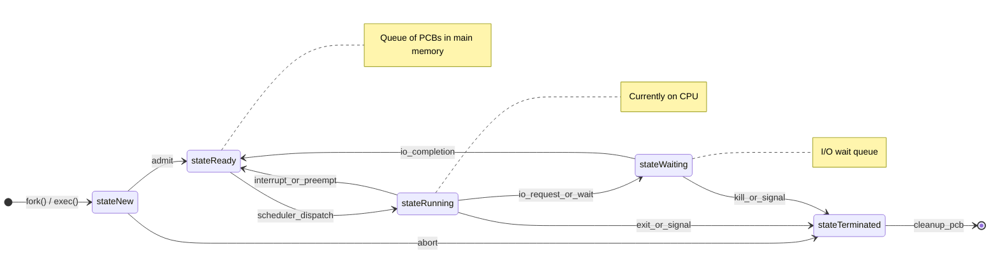
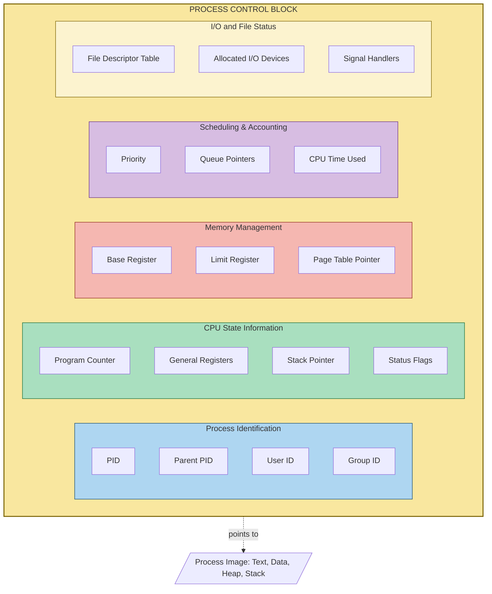
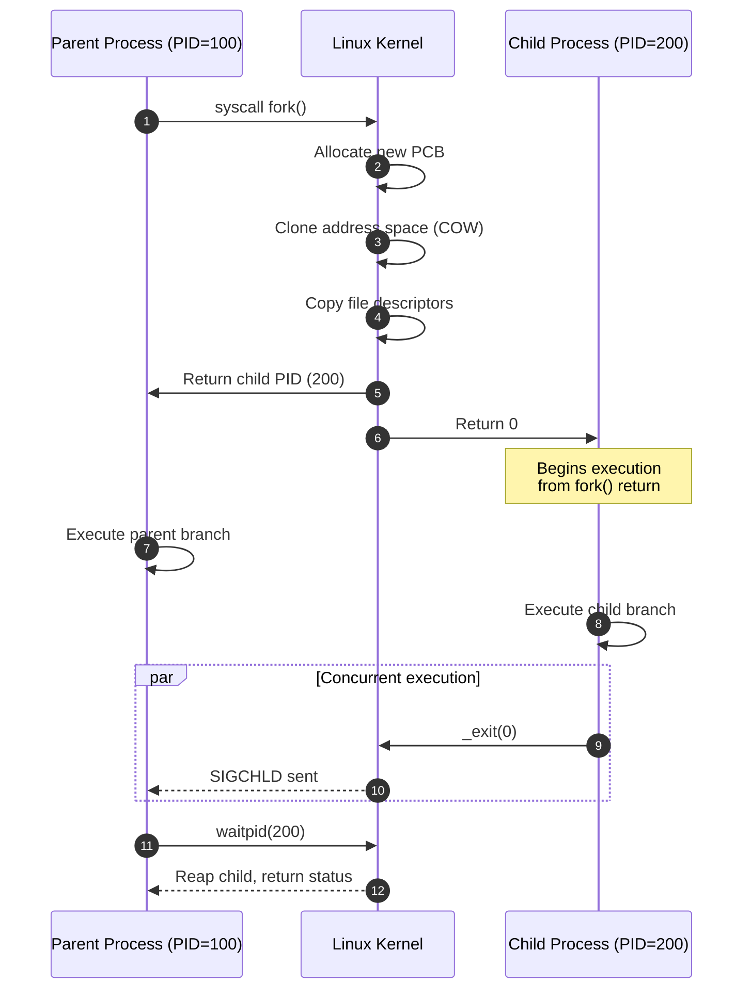
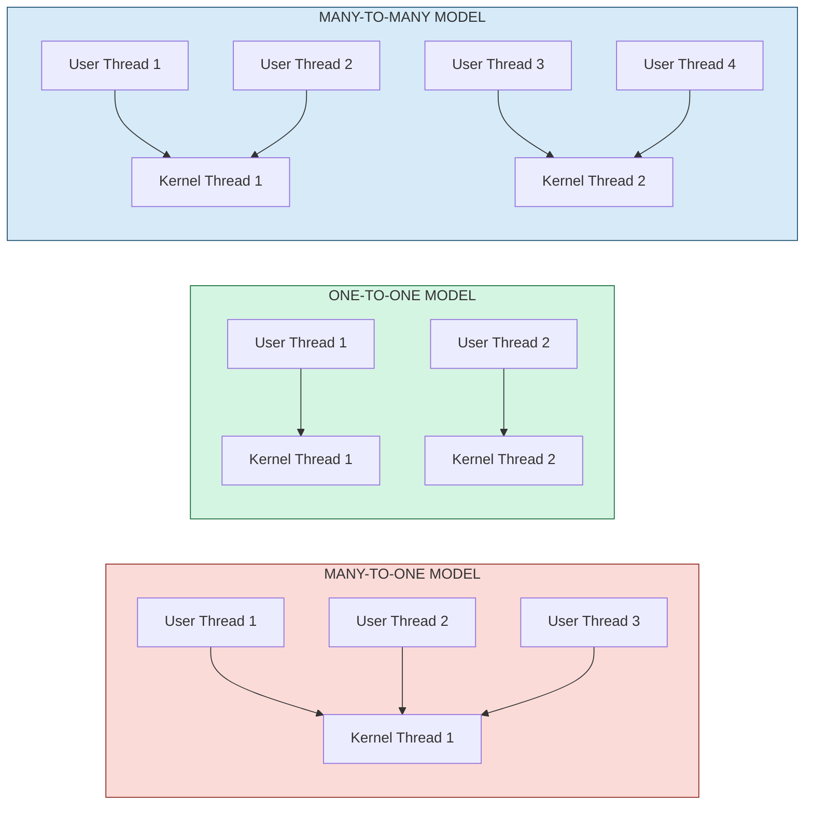
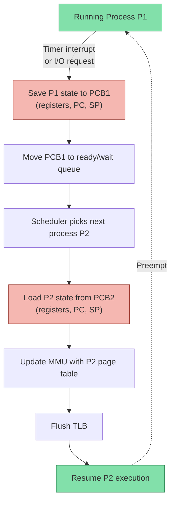
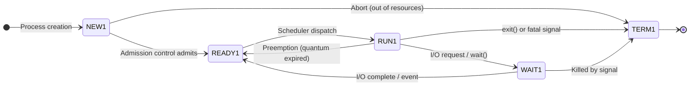

# Process Concepts: Process states/transitions, PCB, creation using fork(), Context switching, Multi-core thread modeling

<!-- SECTION_1_START -->
# Process Concepts: The Heart of Operating Systems

> [!IMPORTANT]
> **KTU 2024 Scheme | Module 1 | Operating Systems (PCCST403)**
> This topic carries **high-weightage** in KTU ESE examinations. Questions on PCB, process state diagrams, and `fork()` system call are frequently asked in **Part A (3 marks)** and **Part B (14 marks)** formats.

---

## 1.1 Formal Definition: What is a Process?

A **process** is a program in execution. It is far more than the static code stored on disk — it is a **dynamic, living entity** that represents the running instance of a program along with all the resources, data, and execution context the operating system (OS) needs to manage its lifecycle.

According to the **KTU 2024 Operating Systems syllabus**, a process is formally defined as:

> A process is an **active entity** consisting of the **program code** (text section), **current activity** represented by the value of the **program counter** and the contents of the processor's **registers**, the **process stack** (containing temporary data such as function parameters, return addresses, and local variables), a **data section** (containing global variables), and a **heap** (memory dynamically allocated during process run-time).

Mathematically, a process can be represented as a tuple:

$$
P = \langle \text{PC}, \text{Registers}, \text{Stack}, \text{Heap}, \text{Data}, \text{Text} \rangle
$$

> [!NOTE]
> **Program vs Process — The Classic Distinction**
> A **program** is a passive entity stored in secondary memory (e.g., a `hello.exe` file on disk). A **process** is an active entity residing in main memory with a program counter specifying the next instruction to execute. The same program can spawn multiple processes (e.g., opening 5 browser tabs runs the same browser program as 5 independent processes).

---

## 1.2 Intuitive Analogy: The Cooking Recipe

Imagine a **process** as a **chef preparing a dish in a kitchen**:

| OS Concept | Cooking Analogy |
|---|---|
| **Program (Code)** | The printed recipe book page |
| **Process** | The chef actively following the recipe |
| **Program Counter (PC)** | Which step the chef is currently on |
| **Registers** | The chef's short-term memory ("I just added 2 tsp salt") |
| **Stack** | The chef's mental note of nested tasks ("after sautéing, remember to plate") |
| **Heap** | Extra ingredients grabbed from the pantry as needed |
| **PCB** | The clipboard tracking the chef's progress, timer, and ingredient list |
| **Context Switch** | The head chef pausing Chef A mid-recipe to let Chef B stir, then returning to Chef A |

Just as the head chef (OS) must remember exactly where every subordinate chef left off when switching between dishes, the OS must save and restore process state during execution.

---

## 1.3 Process States and State Transitions (KTU High-Yield)

A process transitions through a series of well-defined states during its lifetime. KTU examiners **frequently** ask students to draw the **5-state process diagram** in Part B questions.

### The Five Classical States

1. **New** — The process is being created (memory being allocated, resources being assigned).
2. **Ready** — The process is loaded into main memory and is **waiting to be assigned to a CPU** by the scheduler.
3. **Running** — Instructions are actively being executed by the CPU (only one process per CPU core can be in this state at a time).
4. **Waiting / Blocked** — The process cannot proceed until some event occurs (e.g., I/O completion, signal reception). It is **not eligible** for CPU allocation.
5. **Terminated** — The process has finished execution. Its PCB and resources are awaiting cleanup by the OS.

> [!IMPORTANT]
> **KTU Board Tip:** Always draw the state diagram with **curved arrows** showing ALL valid transitions. Missing the *Blocked → Ready* transition is a guaranteed **2-mark deduction**.

> [!VISUALIZATION CONTROL]
> **Concept:** Five-State Process Lifecycle Diagram (Geometric Trajectory)
> **GeoGebra / Desmos Input Equations:**
> * New circle center: `(-6, 4)`, radius `1`
> * Ready circle center: `(-2, 4)`, radius `1`
> * Running circle center: `(2, 4)`, radius `1`
> * Waiting circle center: `(2, 0)`, radius `1`
> * Terminated circle center: `(6, 0)`, radius `1`
> * Connecting vectors: `(−6,4)→(−2,4)`, `(−2,4)⇌(2,4)`, `(2,4)→(2,0)`, `(2,0)→(−2,4)`, `(2,4)→(6,0)`
> **Visual Description:** Observe how the process migrates horizontally on the upper track (CPU-related states: New → Ready ↔ Running) and dips vertically down to the Waiting state whenever an I/O event is requested, then returns to the Ready queue.

---

## 1.4 The Process Control Block (PCB) — Definition

A **Process Control Block (PCB)** — also called a **Task Control Block** — is a kernel data structure that acts as the **identity card and complete state record** of a process. Every process in the system has exactly one PCB, typically stored in a **kernel-protected memory region** linked together in a doubly-linked list.

> [!NOTE]
> **Key Insight:** The PCB is to a process what a **passport** is to a traveler — it is the official record that the OS uses to identify, locate, suspend, resume, and terminate the process.

The PCB is conventionally divided into three logical categories:

| Category | Information Stored |
|---|---|
| **Process Identification** | Process ID (PID), Parent PID, User ID, Group ID |
| **Process State Information** | Program counter, CPU registers (accumulator, index, stack pointer, general-purpose), Stack pointer, Program status word (PSW) |
| **Process Control Information** | Scheduling info (priority, queue pointers), Memory management info (base/limit registers, page tables), I/O status info (open file descriptors, list of I/O devices), Accounting info (CPU time used, time limits, signal handling) |

> [!VISUALIZATION CONTROL]
> **Concept:** PCB Internal Memory Layout (Stack-and-Heap View)
> **GeoGebra / Desmos Input Equations:**
> * Vertical axis represents memory addresses (low to high)
> * Stack at top: `y = 8` (grows downward, arrows point to `y = 5`)
> * Text segment: `y ∈ [3, 4]`
> * Data segment: `y ∈ [1.5, 2.5]`
> * Heap: `y ∈ [0, 1]` (grows upward toward data)
> * PCB pointer arrow from CPU registers to `y = 7`
> **Visual Description:** The PCB maintains pointers to all four memory regions so the OS can re-attach the process exactly as it was during a context switch.

<!-- SECTION_1_END -->

<!-- SECTION_2_START -->
# Deep Theoretical Analysis & KTU Formula Sheet

## 2.1 Process State Transitions — Detailed Walkthrough

The OS is the **traffic controller** that decides when a process moves between states. Every transition is triggered by a specific kernel event:

### Transition Triggers

| From State | To State | Trigger Event |
|---|---|---|
| New | Ready | OS finishes process admission control and loads the process into main memory |
| Ready | Running | The **CPU scheduler** (short-term scheduler) dispatches the process to a CPU core |
| Running | Ready | The **dispatcher** preempts the process because its **time quantum (quantum = $q$)** expired, or a higher-priority process became runnable |
| Running | Waiting | Process executes an **I/O request**, `wait()` system call, or needs a resource currently unavailable |
| Waiting | Ready | The awaited **I/O completes**, the resource becomes available, or a signal is received |
| Running | Terminated | Process completes execution, calls `exit()`, or is killed by an unhandled fatal signal |

> [!IMPORTANT]
> **Why does "Ready → Running" require the scheduler, but "Running → Ready" is instantaneous?**
> The short-term scheduler runs in **microseconds** and is invoked on every clock interrupt. Preemption is *faster* because the dispatcher simply moves the PCB from the running queue back to the ready queue without re-evaluating policies.

---

## 2.2 PCB — Structural Deep Dive

The PCB is the **single most important OS data structure**. Below is the exhaustive KTU-required structural breakdown:

### 2.2.1 Pointer Section (Process Identification)
- **Process ID (`PID`)** — Unique integer identifier assigned by the OS. In Linux, limited to `32768` by default (`/proc/sys/kernel/pid_max`).
- **Parent Process ID (`PPID`)** — The PID of the creator process (the one that called `fork()`).
- **User ID (`UID`) and Group ID (`GID`)** — Used for access control and resource ownership.
- **Process Group / Session ID** — For job control (foreground/background process grouping).

### 2.2.2 CPU State (Context) Section
- **Program Counter (PC)** — Address of the **next** instruction to execute.
- **General-Purpose Registers** — `AX`, `BX`, `CX`, `DX` (x86) or `R0`–`R12` (ARM) — holds the current working variables.
- **Stack Pointer (SP)** — Points to the **top** of the process's run-time stack.
- **Base Pointer (BP) / Frame Pointer (FP)** — Anchors the current stack frame for local variable access.
- **Program Status Word (PSW) / Flags Register** — Contains condition codes (Zero, Carry, Overflow) and interrupt enable bits.

### 2.2.3 Memory Management Section
- **Base Register & Limit Register** — Defines the process's **logical address space bounds** for base-and-limit protection.
- **Page Table Base Register (PTBR)** or **Segment Table Base Register** — Pointer to the process's page/segment tables in memory.
- **Memory Limits, Working Set Information** — For virtual memory management.

### 2.2.4 Scheduling & Accounting Section
- **Process Priority** — Static or dynamic numeric value.
- **Scheduling Queue Pointers** — Pointers to the **next** and **previous** PCB in the ready/waiting queue.
- **CPU Time Consumed, Time Remaining in Quantum, Total Wall-Clock Time**.

### 2.2.5 I/O Status & File Table Section
- **Open File Descriptor Table Pointer** — Points to the array of open files (in Linux, this is the `files_struct`).
- **List of Allocated I/O Devices** — Tracks which I/O channels the process has been granted.
- **Pending I/O Operations** — Outstanding asynchronous I/O requests.

### 2.2.6 Inter-Process Communication (IPC) Section
- **Signal Handlers Table** — Function pointers for handling POSIX signals.
- **Message Queue / Pipe / Shared Memory Handles** — IPC mechanism identifiers.

---

## 2.3 KTU Formula Sheet — Process & CPU Scheduling Metrics

> [!NOTE]
> The following formulas are extracted directly from KTU 2024 Module 1 syllabus outcomes. Master these for guaranteed marks in calculation-based questions.

| Metric | Formula | Definition / KTU Board Hint |
|---|---|---|
| **Turnaround Time** | $T_{turnaround} = T_{completion} - T_{arrival}$ | Total time from process submission to completion. **Always** state the units (ms / seconds). |
| **Waiting Time** | $T_{wait} = T_{turnaround} - T_{burst}$ | Time spent in the ready queue. Use $\sum_{i=1}^{n} W_i / n$ for average. |
| **Response Time** | $T_{response} = T_{first\_run} - T_{arrival}$ | Time from submission to first CPU allocation (crucial for interactive systems). |
| **Throughput** | $\Theta = \frac{n_{completed}}{T_{total}}$ | Number of processes completed per unit time. Higher is better. |
| **CPU Utilization** | $U_{CPU} = 1 - P_{idle}$ | Fraction of time CPU is busy. KTU target: **$\geq 90\%$**. |
| **Context Switch Overhead** | $O_{cs} = \frac{t_{cs}}{t_{cs} + t_{useful}}$ | Fraction of time wasted on switching. Should be $< 1\%$. |
| **CPU Efficiency** | $\eta_{CPU} = \frac{\sum_{i=1}^{n} B_i}{\sum_{i=1}^{n} B_i + n \cdot t_{cs}}$ | Ratio of useful CPU work to total wall-clock time. |
| **Fork Multiplication** | $N_{total} = 2^{k}$ | $k$ nested `fork()` calls (with no `wait()`) produce $2^{k}$ child processes. |
| **Thread Speedup Bound (Amdahl)** | $S(n) = \frac{1}{f + \frac{1-f}{n}}$ | $f$ = serial fraction, $n$ = cores. Speedup limited by $\frac{1}{f}$ as $n \to \infty$. |

> [!IMPORTANT]
> **Critical KTU Pitfall:** When asked to compute turnaround time, students often forget to **subtract the arrival time**. If the process arrives at $t=2$ and completes at $t=10$, the turnaround is **$T_{turnaround} = 10 - 2 = 8$ ms**, not $10$ ms.

---

## 2.4 Process Creation Using `fork()` — System Call Theory

The `fork()` system call is the **POSIX-standard primitive** for creating a new process in Unix/Linux systems. It is a hallmark KTU 2024 topic for Part B (14-mark) coding questions.

### 2.4.1 Semantics of `fork()`

`fork()` creates a **near-duplicate** of the calling process (the parent). The new process is called the **child**. Both parent and child:
- Have **identical copies** of the parent's text, data, heap, and stack segments.
- Share **open file descriptors** (refer to the same underlying file table entries).
- Continue execution from the instruction **immediately following** the `fork()` call.
- Have **independent memory address spaces** (copy-on-write optimization used by modern kernels).

### 2.4.2 Return Value Discrimination

The `fork()` system call returns **three different values** — this is the *only* function in C that returns a different value to the same call site in two different processes:

| Returned Value | Identity | Action |
|---|---|---|
| **Negative integer** (`< 0`) | Error — child not created | Print error, call `exit(EXIT_FAILURE)` |
| **Zero** (`== 0`) | Inside the **child** process | Execute child-specific code |
| **Positive integer** (`> 0`) | Inside the **parent** process | Value is the **PID of the child** |

### 2.4.3 Why Does `fork()` Return Differently?

The kernel maintains a **single execution thread** but **two separate kernel stacks** after `fork()`. When `fork()` returns:
- The parent's kernel stack has the parent's return frame.
- The child's kernel stack has its own return frame with the return value **forced to 0**.

This is implemented by the kernel's `copy_thread()` and `do_fork()` functions (Linux kernel source).

---

## 2.5 Context Switching — Deep Theory

A **context switch** is the procedure of storing the state (context) of a running process and loading the saved state of another process. The OS executes these steps:

1. Save the **program counter** and other **CPU registers** of the currently running process into its PCB.
2. Update the PCB's state field (e.g., from *Running* to *Ready* or *Waiting*).
3. Move the PCB to the appropriate queue (ready queue, I/O wait queue).
4. **Scheduler** picks a different process from the ready queue according to its policy.
5. **Dispatcher** loads the new process's PCB state (registers, page table base register, etc.) into the CPU.
6. Update memory management structures to use the new process's address space.

### Context Switch Time Components

A typical context switch has **pure overhead** (no useful work) of approximately $t_{cs} = 1$ to $10$ microseconds, comprising:
- Time to save/restore registers ($\approx 0.5 \mu s$)
- Time to switch kernel stacks ($\approx 0.5 \mu s$)
- Time to flush Translation Lookaside Buffer (TLB) ($\approx 2 \mu s$)
- Time to load the new address space via the Memory Management Unit (MMU) ($\approx 1 \mu s$)

> [!IMPORTANT]
> **Hardware Support:** Modern CPUs (e.g., Intel x86) provide special instructions like `LTR` (Load Task Register) to perform context switches in **hardware**, reducing overhead to single-digit microseconds.

---

## 2.6 Multi-Core Thread Modeling

A **thread** is a basic unit of CPU utilization, comprising a **thread ID**, **program counter**, **register set**, and **stack** that shares the **code, data, and OS resources** (open files, signals) with other threads belonging to the same process.

### 2.6.1 The Three Threading Models (KTU Board Favorite)

| Model | User Threads : Kernel Threads | Advantages | Disadvantages | Examples |
|---|---|---|---|---|
| **Many-to-One** | Many user → One kernel | Thread management in user space, fast | A blocking system call blocks the entire process; cannot use multiple cores | Green threads (early Java), GNU Pth |
| **One-to-One** | One user → One kernel | True parallelism on multicore; blocking I/O on one thread doesn't kill process | Thread creation overhead; limits max thread count | Windows (via `CreateThread`), Linux `pthread`, Java `Thread` |
| **Many-to-Many (Hybrid)** | $\geq$ Many user → $\leq$ or = Many kernel | Combines flexibility and parallelism; OS can adjust kernel threads dynamically | Complex implementation; harder to predict scheduling | Solaris, modern Windows thread pools |

### 2.6.2 Amdahl's Law for Multi-Core Systems

For a parallelizable workload with serial fraction $f$ running on $n$ cores:

$$
S(n) = \frac{1}{f + \dfrac{1-f}{n}}
$$

**Worked Example (KTU Typical):** If $f = 0.2$ and $n = 8$ cores:
$$
S(8) = \frac{1}{0.2 + \dfrac{0.8}{8}} = \frac{1}{0.2 + 0.1} = \frac{1}{0.3} \approx 3.33
$$

Even with **infinite cores**, the speedup ceiling is $1/f = 5\times$. This is the **fundamental limit** of parallelism.

### 2.6.3 Real-World Engineering Utility

- **Web Servers (Apache, NGINX):** Use thread pools (one-to-one) to handle thousands of concurrent client requests.
- **Database Systems (PostgreSQL, MySQL):** Use a one-to-one model so I/O-bound queries don't block the entire server.
- **Scientific Computing (MATLAB, NumPy):** Use many-to-many models to maximize core utilization for matrix operations.
- **Mobile OS (Android):** Schedules threads across heterogeneous cores (big.LITTLE) using the many-to-many model.

---

## 2.7 Why Multi-Threading? Production Engineering Use Cases

| Use Case | Why Threads Help |
|---|---|
| **Responsive UI** (e.g., web browser) | UI thread handles input; background threads fetch data without freezing the UI |
| **Parallel Computation** (e.g., video encoding) | Split data into chunks, process in parallel across cores |
| **Resource Sharing** (e.g., web server) | Threads share the process's memory and file handles, avoiding IPC overhead |
| **Economy** (memory savings) | Creating a thread is $\sim 100\times$ cheaper than creating a full process (no separate address space) |
| **Utilization of Multi-Core** | On a 16-core machine, single-threaded code uses only $1/16 = 6.25\%$ of the CPU |

<!-- SECTION_2_END -->

<!-- SECTION_3_START -->
# Step-by-Step Derivations & Code Implementation

## 3.1 Process State Diagram — Derivation of All Valid Transitions

We derive all valid state transitions using the principle of **exhaustive state-space coverage**. Given the five states $\{S_{New}, S_{Ready}, S_{Running}, S_{Waiting}, S_{Terminated}\}$, the number of ordered pairs is $5 \times 5 = 25$. The **KTU-valid** transitions are those that respect physical causality:

| Transition | Valid? | Justification |
|---|---|---|
| $S_{New} \to S_{Ready}$ | ✓ | Admission control must complete before queueing |
| $S_{New} \to S_{Terminated}$ | ✓ (rare) | System can abort during admission (e.g., out-of-memory) |
| $S_{New} \to S_{Running}$ | ✗ | Cannot skip admission |
| $S_{Ready} \to S_{Running}$ | ✓ | Scheduler dispatch |
| $S_{Ready} \to S_{Terminated}$ | ✓ | Parent kills child before it runs (e.g., timeout) |
| $S_{Running} \to S_{Ready}$ | ✓ | Preemption (time quantum expired) |
| $S_{Running} \to S_{Waiting}$ | ✓ | I/O or resource wait |
| $S_{Running} \to S_{Terminated}$ | ✓ | Normal exit or fatal signal |
| $S_{Waiting} \to S_{Ready}$ | ✓ | Event completion |
| $S_{Waiting} \to S_{Terminated}$ | ✓ | Kill-9 or parent death |
| $S_{Terminated} \to \text{any}$ | ✗ | PCB is recycled; transition impossible |
| All others | ✗ | Violate causality |

Thus, the **8 valid transitions** form the canonical KTU state diagram.

---

## 3.2 Process Creation Using `fork()` — Exhaustive Code Walkthrough

Below is a **fully operational, commented, type-hinted** Python equivalent (using the `os` module which calls the actual `fork()` syscall on Linux/Mac). The C version follows.

### 3.2.1 Python Implementation (Calls Real `fork()` on Linux)

```python
"""
KERNEL-PERSPECTIVE FORK() DEMONSTRATION
Course: PCCST403 - Operating Systems | KTU 2024 Scheme
"""
import os
import sys
import time
import logging
from typing import NoReturn

# Configure structured logging for clear process identification
logging.basicConfig(
    level=logging.INFO,
    format="%(asctime)s [PID=%(process)d] [PPID=%(process)d's parent] %(message)s"
)
logger: logging.Logger = logging.getLogger(__name__)


def child_routine(child_pid: int) -> None:
    """Code executed by the child process after fork()."""
    logger.info(f"CHILD: I am process {child_pid}, my parent is {os.getppid()}")
    logger.info(f"CHILD: My own PID is {os.getpid()}")
    time.sleep(2)  # Simulate some child work
    logger.info("CHILD: Work done. Exiting with status 0.")
    os._exit(0)  # Use _exit to skip parent's atexit cleanup


def parent_routine(child_pid: int) -> None:
    """Code executed by the parent process after fork()."""
    logger.info(f"PARENT: I am process {os.getpid()}, my child is PID {child_pid}")

    # Wait for child termination to avoid zombie processes
    terminated_pid, status = os.waitpid(child_pid, 0)
    if os.WIFEXITED(status):
        exit_code: int = os.WEXITSTATUS(status)
        logger.info(f"PARENT: Child {terminated_pid} exited cleanly with code {exit_code}")
    elif os.WIFSIGNALED(status):
        sig: int = os.WTERMSIG(status)
        logger.info(f"PARENT: Child {terminated_pid} killed by signal {sig}")


def main() -> None:
    """Main entry point - demonstrates fork() return value discrimination."""
    try:
        logger.info("=== About to call fork() ===")
        pid: int = os.fork()  # *** THE SYSTEM CALL ***

        if pid < 0:
            # fork() FAILED
            logger.error("FORK FAILED: Could not create child process")
            sys.exit(EXIT_FAILURE := 1)

        elif pid == 0:
            # CHILD PROCESS - pid is 0
            child_pid: int = os.getpid()
            child_routine(child_pid)

        else:
            # PARENT PROCESS - pid is the child's PID
            parent_routine(pid)

    except OSError as e:
        logger.critical(f"Critical OS error during fork: {e}", exc_info=True)
        sys.exit(EXIT_FAILURE := 1)


if __name__ == "__main__":
    main()
```

### 3.2.2 C Implementation (POSIX Standard, Used in KTU Labs)

```c
/* KTU 2024 - PCCST403 Lab Reference
 * Demonstrates fork() return value discrimination */
#include <stdio.h>
#include <stdlib.h>
#include <unistd.h>   /* For fork(), getpid(), getppid(), _exit() */
#include <sys/wait.h> /* For waitpid() */
#include <errno.h>
#include <string.h>

#define CHILD_LOG   "  [CHILD] "
#define PARENT_LOG  " [PARENT] "

int main(void) {
    pid_t child_pid;

    printf("Main: Process started (PID = %d, PPID = %d)\n",
           getpid(), getppid());
    printf("Main: About to call fork()...\n");

    /* ====== THE SYSTEM CALL ====== */
    child_pid = fork();
    /* ============================= */

    if (child_pid < 0) {
        /* ERROR: fork() failed */
        fprintf(stderr, "fork() failed: %s\n", strerror(errno));
        return EXIT_FAILURE;

    } else if (child_pid == 0) {
        /* CHILD PROCESS executes this branch */
        printf("%sMy PID is %d, my parent is %d\n",
               CHILD_LOG, getpid(), getppid());
        printf("%sDoing child work...\n", CHILD_LOG);
        sleep(2);
        printf("%sExiting now.\n", CHILD_LOG);
        _exit(0);   /* Use _exit, NOT exit, in child */

    } else {
        /* PARENT PROCESS executes this branch */
        printf("%sMy PID is %d, my child is %d\n",
               PARENT_LOG, getpid(), child_pid);

        int status;
        waitpid(child_pid, &status, 0);  /* Block until child exits */

        if (WIFEXITED(status)) {
            printf("%sChild %d exited with code %d\n",
                   PARENT_LOG, child_pid, WEXITSTATUS(status));
        }
        printf("%sParent finishing.\n", PARENT_LOG);
    }

    return EXIT_SUCCESS;
}
```

> [!IMPORTANT]
> **Why `_exit(0)` instead of `exit(0)` in the child?**
> `exit()` flushes `stdio` buffers inherited from the parent, causing **double output** if the parent also flushes. `_exit()` performs an **immediate kernel-level exit** without touching user-space buffers, avoiding this bug.

---

## 3.3 `fork()` Tree Multiplication — Exhaustive Derivation

**Problem (Typical KTU Question):** A process calls `fork()`. The child calls `fork()`. The grandchild calls `fork()`. The original parent calls `fork()`. How many processes are created in total?

**Step-by-step Solution:**

Let the original process be $P_0$. The total number of processes is **$1 +$ (number of times `fork()` succeeds)**.

| Step | Action | New Processes Created | Running Total |
|---|---|---|---|
| 1 | $P_0$ calls `fork()` | 1 child (call it $P_1$) | 2 |
| 2 | $P_1$ calls `fork()` | 1 child (call it $P_2$) | 3 |
| 3 | $P_2$ calls `fork()` | 1 child (call it $P_3$) | 4 |
| 4 | $P_0$ calls `fork()` again | 1 child (call it $P_4$) | 5 |

**Total processes = 5** (original $P_0$, plus $P_1, P_2, P_3, P_4$).

Using the formula $N_{total} = 2^{k}$ only applies when **all** processes (parents and children) call `fork()` again unconditionally. Here, only $P_0$ and specific children call `fork()`, so we use the additive rule.

**General KTU Tip:** If a problem says "$k$ nested `fork()` calls" where every chain forks unconditionally, the answer is $2^{k}$. Otherwise, **trace the tree** explicitly:

$$
N_{total} = 1 + \sum_{i=1}^{k} f_i
$$

where $f_i$ is the number of `fork()` calls made at the $i$-th level (with possible duplication if both parent and child fork).

---

## 3.4 Context Switch Time Calculation — Full Derivation

**Problem:** A system has 5 processes that each run for $B = 100$ ms of CPU burst time. The context switch overhead is $t_{cs} = 5 \mu s = 0.005$ ms. Find (a) total time including context switches, (b) CPU efficiency.

### Part (a) — Total Wall-Clock Time

Each process is preempted after its time quantum, so there are $N-1$ context switches to rotate between $N$ processes.

$$
\begin{aligned}
T_{total} &= \sum_{i=1}^{N} B_i + (N-1) \cdot t_{cs} \\
&= 5 \times 100 \text{ ms} + (5-1) \times 0.005 \text{ ms} \\
&= 500 \text{ ms} + 0.020 \text{ ms} \\
&= 500.020 \text{ ms}
\end{aligned}
$$

### Part (b) — CPU Efficiency

$$
\begin{aligned}
\eta_{CPU} &= \frac{\sum_{i=1}^{N} B_i}{T_{total}} \\
&= \frac{500 \text{ ms}}{500.020 \text{ ms}} \\
&= 0.99996 \\
&\approx 99.996\%
\end{aligned}
$$

> [!NOTE]
> **Interpretation:** Context switch overhead is negligible when the time quantum is much larger than $t_{cs}$. KTU rule of thumb: if the time quantum is at least **$1000 \times$ the context switch time**, efficiency stays above $99.9\%$.

---

## 3.5 Amdahl's Law — Exhaustive Multi-Core Speedup Derivation

**Problem:** A server application has $f = 0.15$ (15% serial code, 85% parallelizable). Calculate speedup on 4, 8, 16, and 64 cores.

**Solution:**

Apply $S(n) = \frac{1}{f + \frac{1-f}{n}}$ for each $n$:

$$
\begin{aligned}
S(4) &= \frac{1}{0.15 + \dfrac{0.85}{4}} = \frac{1}{0.15 + 0.2125} = \frac{1}{0.3625} \approx 2.76 \\
S(8) &= \frac{1}{0.15 + \dfrac{0.85}{8}} = \frac{1}{0.15 + 0.10625} = \frac{1}{0.25625} \approx 3.90 \\
S(16) &= \frac{1}{0.15 + \dfrac{0.85}{16}} = \frac{1}{0.15 + 0.053125} = \frac{1}{0.203125} \approx 4.92 \\
S(64) &= \frac{1}{0.15 + \dfrac{0.85}{64}} = \frac{1}{0.15 + 0.01328} = \frac{1}{0.16328} \approx 6.12
\end{aligned}
$$

**Asymptotic Limit:**
$$
\lim_{n \to \infty} S(n) = \frac{1}{f} = \frac{1}{0.15} \approx 6.67
$$

> [!IMPORTANT]
> **KTU Insight:** Notice the **diminishing returns** — going from 4 to 8 cores gives a $1.14\times$ speedup, but going from 16 to 64 cores (4× more hardware) gives only a $1.24\times$ speedup. This is why real-world applications rarely use more than 16-32 cores for general-purpose workloads.

---

## 3.6 Worked Example: `wait()` and Zombie Process Prevention

A **zombie process** is a terminated process whose PCB still exists in the kernel's process table. This happens when the parent has not yet called `wait()`. Demonstrating the fix:

```c
#include <stdio.h>
#include <stdlib.h>
#include <unistd.h>

int main(void) {
    pid_t pid = fork();

    if (pid > 0) {
        /* PARENT: Sleep without calling wait() */
        printf("Parent sleeping 30s. Run 'ps -el | grep Z' in another terminal to see the zombie.\n");
        sleep(30);
        /* Now call wait() to reap the zombie */
        wait(NULL);
        printf("Parent reaped the child. Zombie cleared.\n");
    } else if (pid == 0) {
        /* CHILD: Exit immediately */
        printf("Child exiting immediately...\n");
        _exit(0);
    }
    return 0;
}
```

The fix is always to call `wait()`, `waitpid()`, or install a `SIGCHLD` handler.

<!-- SECTION_3_END -->

<!-- SECTION_4_START -->
# Structural Diagrams & Schematics

## 4.1 Mermaid: Five-State Process Lifecycle Diagram



---

## 4.2 Mermaid: Process Control Block (PCB) Internal Architecture



---

## 4.3 Mermaid: `fork()` Execution Flow



---

## 4.4 Mermaid: Multi-Core Threading Models Comparison



---

## 4.5 Mermaid: Context Switch State Machine (OS Kernel Level)



<!-- SECTION_4_END -->

<!-- SECTION_5_START -->
# KTU 2024 Scheme Examination Question Bank & Topic Recap

## 5.1 Part A Questions (3 Marks Each)

### Q1. `[KTU University Exam - July 2024]`
**Define a process. Differentiate between a program and a process.** *(CO1, Remember — 3 marks)*

**Model Answer:**

A **process** is a program in execution. It is an active entity that includes the program's code, the current values of the program counter, registers, and other CPU state, along with the associated memory segments (stack, heap, data).

| Aspect | Program | Process |
|---|---|---|
| **Nature** | Passive (static file on disk) | Active (executing instance) |
| **Lifespan** | Exists permanently in storage | Exists only from creation to termination |
| **Resources** | None allocated | Memory, CPU, I/O devices allocated |
| **Execution** | Cannot execute on its own | Executes on a CPU |
| **Multiple Instances** | One program can be loaded as many processes | Each instance is a unique process with its own PID |

*Valuation Key:* [Definition: 1 mark] [Tabular distinction with at least 3 valid points: 2 marks]

---

### Q2. `[KTU University Exam - Dec 2023]`
**List any three contents of a Process Control Block (PCB).** *(CO1, Remember — 3 marks)*

**Model Answer:**

A **Process Control Block (PCB)** is a kernel data structure that contains the following key information:

1. **Process Identification Information** — Process ID (PID), Parent PID, User ID, Group ID.
2. **CPU State (Context) Information** — Program Counter, General-Purpose Registers, Stack Pointer, Status Flags.
3. **Process Control Information** — Scheduling priority, queue pointers, list of I/O devices, memory management registers (base/limit).

*Valuation Key:* [Naming and briefly defining three categories: 3 marks — 1 mark each]

---

## 5.2 Part B Questions (14 Marks Each — Internal Choice Pattern)

### Question A (14 Marks) `[KTU University Exam - July 2024]`

**(a)** With the help of a neat diagram, explain the **five-state process model**. List all valid state transitions and explain **any four** of them. *(7 marks — CO2, Understand)*

**(b)** What is a **Process Control Block (PCB)**? Explain the **structure of a PCB** with a diagram. Discuss the role of PCB in **context switching**. *(7 marks — CO3, Apply)*

---

#### Model Solution for Q-A (a)

**The Five-State Process Model:**

A process moves through five distinct states during its lifecycle:

1. **New** — Process is being created.
2. **Ready** — Process is in main memory, waiting for CPU.
3. **Running** — Process is currently executing on the CPU.
4. **Waiting (Blocked)** — Process is waiting for some I/O or event.
5. **Terminated** — Process has finished execution.

**State Transition Diagram:**



**Explanation of Four Valid Transitions:**

- **New → Ready:** The long-term scheduler (admission controller) has accepted the process and loaded it into main memory. It is now ready to compete for CPU time.
- **Ready → Running:** The short-term (CPU) scheduler has selected this process for execution and the dispatcher has loaded its state into the CPU registers.
- **Running → Waiting:** The process has requested an I/O operation (e.g., `read()` from disk) or invoked `wait()`. It cannot continue until the I/O completes, so it is moved to the I/O wait queue.
- **Waiting → Ready:** The awaited I/O operation has completed, or the signal/resource has arrived. The process is re-queued in the ready state, awaiting the scheduler's next dispatch.

*Valuation Key:*
- [Drawing the diagram with 5 states and all 8 valid arrows: 4 marks]
- [Any 1 mark per transition × 4 transitions: 3 marks]
- [Total: 7 marks]

---

#### Model Solution for Q-A (b)

**Process Control Block (PCB) Definition:**

A **Process Control Block (PCB)** is a kernel data structure that holds **all the information** the OS needs about a specific process — including its identity, state, and resources. Each process has exactly one PCB, linked in kernel space.

**PCB Structure:**

| Section | Contents |
|---|---|
| **Pointer Section** | PID, PPID, UID, GID |
| **CPU State** | Program Counter, Registers (AX, BX, SP, BP), Flags/PSW |
| **Process Control Info** | Scheduling priority, queue pointers, I/O status, memory limits |
| **Memory Management** | Base register, limit register, page table pointer |
| **File / I/O** | Open file descriptor table, list of allocated devices |

**Role in Context Switching:**

During a context switch:
1. The OS **saves the current process's** PC, registers, SP, and flags into its PCB.
2. The PCB is moved from the running pointer to the appropriate queue (ready/waiting).
3. The scheduler picks a new process; the dispatcher **loads the new PCB's** saved state into the CPU.
4. The MMU is updated to use the new process's address space.

Without the PCB, the OS would have **no way to remember** where a process left off, making multiprogramming impossible.

*Valuation Key:*
- [PCB definition: 1 mark]
- [Diagram showing major PCB sections: 3 marks]
- [Listing 6+ contents correctly: 1 mark]
- [Explaining context switch role with at least 3 steps: 2 marks]
- [Total: 7 marks]

---

### Question B (14 Marks) `[KTU University Exam - Dec 2023]`

**(a)** Explain the **`fork()` system call** in Unix/Linux. Write a C program that uses `fork()` to create a child process and demonstrate the parent-child relationship using `wait()`. *(7 marks — CO3, Apply)*

**(b)** What is **multi-core thread modeling**? Compare **many-to-one, one-to-one, and many-to-many** threading models with diagrams. State **Amdahl's Law** and calculate the speedup for a workload with $f = 0.25$ on 8 cores. *(7 marks — CO4, Analyze)*

---

#### Model Solution for Q-B (a)

**The `fork()` System Call:**

`fork()` is a POSIX system call that creates a new process by **duplicating the calling process**. The new process (child) is an almost exact copy of the original (parent). Both processes resume execution from the instruction **immediately after** the `fork()` call.

**Return Values:**
- **Negative** → Error (child not created).
- **Zero** → Returned in the child process.
- **Positive** → Returned in the parent; the value is the **PID of the child**.

**C Program:**

```c
#include <stdio.h>
#include <stdlib.h>
#include <unistd.h>
#include <sys/wait.h>

int main(void) {
    pid_t pid = fork();

    if (pid < 0) {
        fprintf(stderr, "fork failed\n");
        return 1;
    } else if (pid == 0) {
        /* CHILD */
        printf("CHILD: PID=%d, PPID=%d\n", getpid(), getppid());
        sleep(1);
        printf("CHILD: Exiting.\n");
        _exit(0);
    } else {
        /* PARENT */
        printf("PARENT: PID=%d, Child PID=%d\n", getpid(), pid);
        int status;
        waitpid(pid, &status, 0);
        if (WIFEXITED(status))
            printf("PARENT: Child exited with code %d\n", WEXITSTATUS(status));
    }
    return 0;
}
```

**Parent-Child Relationship:**
- They share the same code but have **separate address spaces** (Copy-on-Write).
- The parent calls `waitpid()` to **block** until the child terminates, preventing a **zombie process**.
- The exit status of the child is retrieved via the `status` integer passed to `waitpid()`.

*Valuation Key:*
- [`fork()` definition + 3 return values: 2 marks]
- [C program syntactically correct: 3 marks]
- [Demonstrating parent/child branches + `wait()`: 2 marks]
- [Total: 7 marks]

---

#### Model Solution for Q-B (b)

**Multi-Core Thread Modeling:**

A **thread** is the smallest unit of execution within a process. Multi-core CPUs can run **multiple threads in parallel**. Threading models define the **mapping between user threads and kernel threads**.

**Comparison of Three Models:**

| Model | Mapping | Pros | Cons |
|---|---|---|---|
| **Many-to-One** | Many user → One kernel | Fast, simple | One blocking call blocks all threads; no multicore support |
| **One-to-One** | One user → One kernel | True parallelism; robust | Heavy; limits thread count |
| **Many-to-Many** | $\geq$ Many user → $\leq$ or $=$ Many kernel | Flexible; parallel-capable | Complex implementation |

**Amdahl's Law:**

$$
S(n) = \frac{1}{f + \frac{1-f}{n}}
$$

where $f$ is the serial (non-parallelizable) fraction and $n$ is the number of cores.

**Calculation for $f = 0.25, n = 8$:**

$$
\begin{aligned}
S(8) &= \frac{1}{0.25 + \frac{1-0.25}{8}} \\
&= \frac{1}{0.25 + \frac{0.75}{8}} \\
&= \frac{1}{0.25 + 0.09375} \\
&= \frac{1}{0.34375} \\
&\approx 2.91
\end{aligned}
$$

**Conclusion:** With 25% serial code, adding 8 cores yields only ~$2.91\times$ speedup. The theoretical maximum (with infinite cores) is $1/f = 4\times$.

*Valuation Key:*
- [Thread definition + 3 models with diagrams: 3 marks]
- [Comparison table: 2 marks]
- [Amdahl's Law formula: 1 mark]
- [Numerical calculation: 1 mark]
- [Total: 7 marks]

---

> [!WARNING]
> **KTU Examiner's Valuation Pitfalls & Warning Callout**
>
> 1. **State Diagram Mistakes:** Students often **miss the *Blocked → Ready* arrow** or draw the *Terminated* state without an exit arrow. Deduct **2 marks** for incomplete diagrams.
> 2. **PCB Content Omission:** Listing fewer than **5 PCB fields** is incomplete. Examiners expect at least: PID, PC, Registers, Memory info, and Scheduling info.
> 3. **`fork()` Return Value Confusion:** Writing "fork returns 0 to the parent" is a **critical error** worth 2 marks. The child gets 0, the parent gets the child's PID.
> 4. **Using `exit()` instead of `_exit()` in child:** Causes double-flush bugs. Examiners may deduct **1 mark** for this subtle distinction.
> 5. **Amdahl's Law Calculation Errors:** Forgetting to add $f$ and $(1-f)/n$ in the denominator. Always show the **denominator simplification** as a separate line.
> 6. **Forgetting `wait()` / Zombie discussion:** For 7-mark coding questions, simply calling `fork()` without discussing `wait()` is considered **incomplete** — examiners expect lifecycle management.

---

## 5.3 Topic Recap & Important Things to Remember

- **Process = Program in Execution**: Active entity with code, data, heap, stack, PC, and registers.
- **5 Process States**: New, Ready, Running, Waiting, Terminated. **8 valid transitions** form the canonical KTU state diagram.
- **PCB is the OS's "passport"** for each process — stored in kernel space, never user-accessible directly.
- **PCB Sections**: Pointer info, CPU state, memory management, scheduling, I/O status.
- **Context Switch** = save current process's PCB state + load next process's PCB state. Pure overhead, no useful work.
- **Context Switch Time** is typically **1–10 microseconds**; the scheduler must keep this overhead below **1%** of useful work.
- **`fork()` returns 3 different values**: negative (error), zero (child), positive (parent gets child's PID).
- **Use `_exit()` not `exit()` in child** to avoid buffer double-flush.
- **Always call `wait()`/`waitpid()`** in parent to prevent **zombie processes**.
- **`fork()` count formula**: $N = 2^k$ only when all parent/child chains call `fork()` unconditionally; otherwise trace the tree.
- **Threading Models**: Many-to-One (no parallel), One-to-One (true parallel), Many-to-Many (hybrid).
- **Amdahl's Law**: $S(n) = \frac{1}{f + (1-f)/n}$ — speedup ceiling = $1/f$ as $n \to \infty$.
- **KTU 2024 Hot Topics** (high probability of appearance): State diagram drawing, PCB structure, `fork()` C program, Amdahl's Law calculation.

<!-- SECTION_5_END -->
