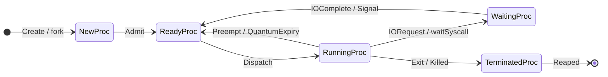
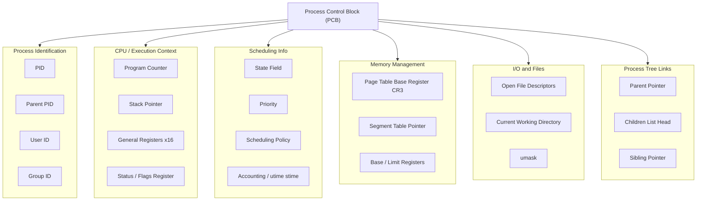
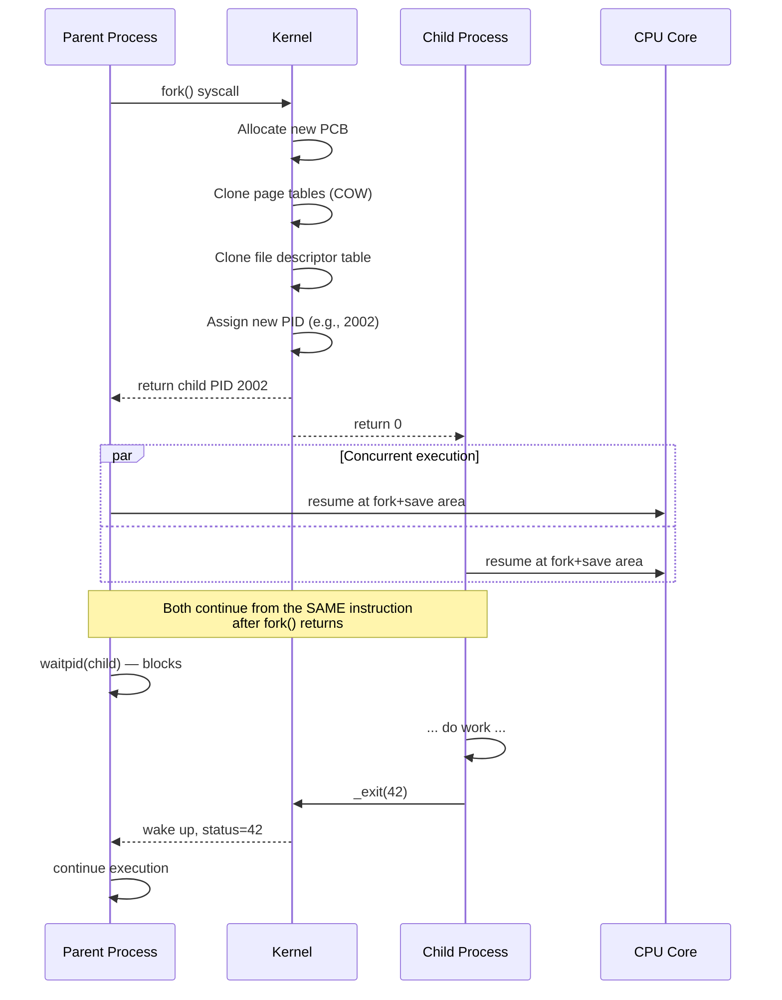
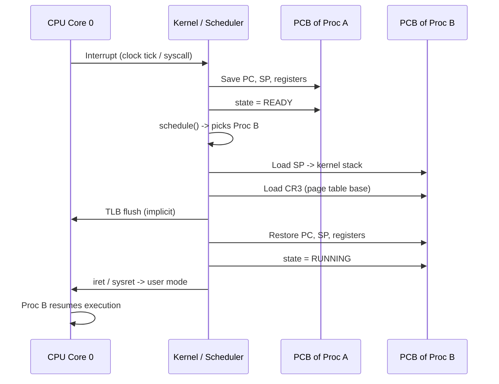
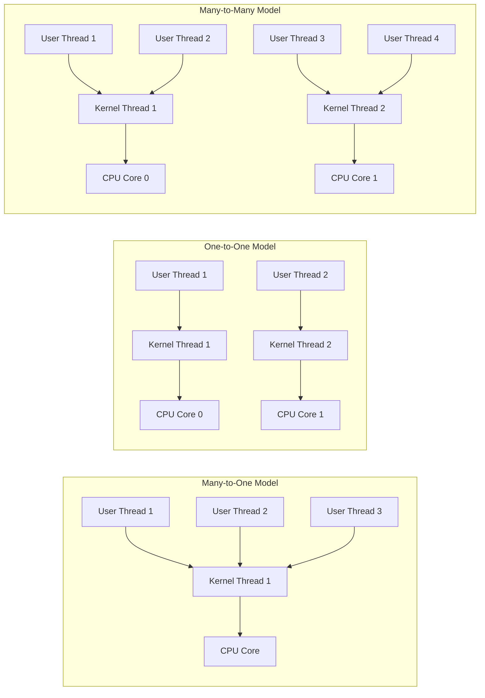
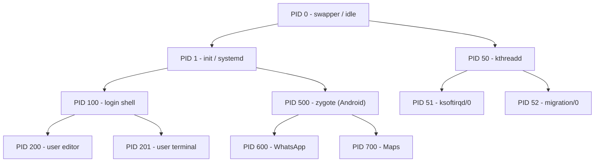
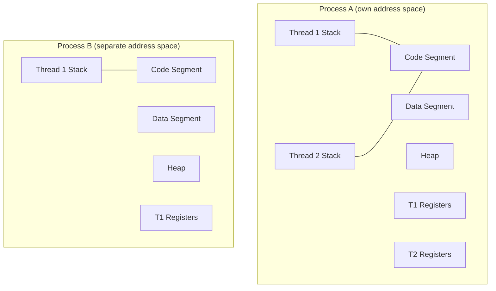

# Process Concepts: Process states/transitions, PCB, creation using fork(), Context switching, Multi-core thread modeling

<!-- SECTION_1_START -->
# Module 1 — Process Concepts

## 1.1 Formal Definition (KTU 2024 Syllabus Terminology)

A **Process** is a program in execution. It is the fundamental unit of work in a modern operating system and represents the **active entity** that the OS scheduler, memory manager, and I/O subsystem recognize and manipulate. A process is not the same as a program; a program is a passive collection of instructions stored on disk, whereas a process is a dynamic, living entity that owns resources and an execution context.

In the KTU 2024 Scheme (Course Code **PCCST403**), the process is formally described as a **control entity** consisting of:
- An **execution context** (registers, program counter, stack pointer)
- A set of **OS-managed resources** (open files, memory, I/O devices)
- A unique **Process Identifier (PID)**
- A **state** indicating its current activity

> [!IMPORTANT]
> **KTU Board Definition (verbatim flavor):** *"A process is the unit of work in a system. Such a system consists of a collection of concurrently executing processes, some of which are operating-system processes and the rest are user processes. All these processes can potentially execute concurrently by multiplexing on a single CPU."* — Silberschatz, Galvin & Gagne (Standard KTU reference text).

> [!NOTE]
> **Heavy-Bold Quick Facts:**
> - The smallest schedulable entity in a process-only system is the **Process** itself.
> - The smallest schedulable entity in a threaded system is the **Thread (or Lightweight Process, LWP)**.
> - A single program invocation (e.g., `./a.out`) creates **one process**, but that process can spawn **many threads**.

---

## 1.2 Conceptual Analogy / Intuition

Think of a **Process** like a **cooking recipe in a kitchen**:

| Cooking Kitchen Analogy | Operating System Mapping |
|---|---|
| The **recipe card** written in a book | The **Program** (passive, on disk) |
| The **chef actively preparing** a dish | The **Process** (program in execution) |
| The **cutting board, pan, utensils** in use | **Resources** (memory, files, I/O) |
| The chef's **mental note** of which step is next | The **Program Counter (PC)** |
| The chef **paused** waiting for water to boil | The **Waiting/Blocked state** |
| The chef **standing idle** while another cooks | The **Ready state** |
| The chef **currently stirring the pot** | The **Running state** |

Two chefs (processes) can share one stove (CPU) by rapidly switching which one is cooking at any given second — this is **CPU multiplexing** (time-sharing).

---

## 1.3 Core Sub-Topics at a Glance

This note covers five tightly coupled sub-topics that examiners love to interleave:

1. **Process States & Transitions** — the lifecycle of a process.
2. **Process Control Block (PCB)** — the OS's "passport / dossier" for each process.
3. **Process Creation via `fork()`** — POSIX system call mechanics, parent/child semantics.
4. **Context Switching** — the mechanism by which the CPU hops between processes.
5. **Multi-Core Thread Modeling** — how threads distribute over multiple CPU cores (Many-to-Many, etc.).

---

## 1.4 Visualization Callout (Geometric / State-Graph)

> [!VISUALIZATION CONTROL]
> **Concept:** Five-state process lifecycle with one self-loop.
> **Plot Type:** Directed state transition graph (nodes = states, edges = transitions).
> **Suggested Tool:** Draw.io, Lucidchart, or hand-sketched.
> **Visual Description:** Draw five rounded rectangles arranged as: **New (top-left)** → **Ready (center)** ↔ **Running (right)** → **Waiting (bottom)** → **Ready**, and **Running → Terminated (bottom-right)**. The **Ready ↔ Running** edge is bidirectional. Arrows are labeled with the triggering event: *Admitted, Scheduler dispatch, Interrupt, I/O or Event wait, I/O or Event completion, Exit*.

---

## 1.5 Why Process Concepts Matter in Real Systems

| Domain | Real-World Use |
|---|---|
| **Web Servers** (Nginx, Apache) | Use `fork()` or thread pools to handle thousands of concurrent client requests per second. |
| **Databases** (PostgreSQL, MySQL) | Each connection spawns a backend process; the PCB tracks query state, locks held, and buffer pool. |
| **Mobile OS (Android)** | **Zygote** process uses `fork()` to spawn every app in <100 ms by sharing memory via copy-on-write. |
| **Game Engines (Unreal)** | A dedicated **Game Thread**, **Render Thread**, and **Worker Threads** are scheduled across CPU cores for parallelism. |
| **Cloud / Containers (Docker)** | Each container is essentially a process tree rooted at PID 1, with its own namespace and cgroup. |
<!-- SECTION_1_END -->

<!-- SECTION_2_START -->
# 2. Deep Theoretical Analysis

## 2.1 The Five-State Process Model

During its lifetime, a process moves through a series of **discrete states**. The classic five-state model (used in KTU textbooks and question papers) is:

1. **New** — The process is being created (memory allocated, PCB initialized).
2. **Ready** — The process is waiting to be assigned to a CPU. It has all resources except the CPU.
3. **Running** — Instructions are being executed by the CPU core. At most $N$ processes can be in this state on an $N$-core system.
4. **Waiting (Blocked)** — The process cannot run until some event occurs (I/O completion, signal receipt, resource availability).
5. **Terminated** — The process has finished execution. Its PCB and resources are being reaped by the parent / OS.

### 2.1.1 State Transition Triggers

| From → To | Trigger Event | OS Action |
|---|---|---|
| New → Ready | Admission / Long-term scheduler | Insert into ready queue |
| Ready → Running | Short-term scheduler **dispatch** | Load PCB context into CPU |
| Running → Ready | **Time quantum expired** (preemptive) / voluntary yield | Preempt, save context |
| Running → Waiting | **I/O request** or `wait()` system call | Move to wait queue of that event |
| Waiting → Ready | **I/O completion** or signal | Move back to ready queue |
| Running → Terminated | Process calls `exit()` or is killed | Release resources, retain exit status |

> [!IMPORTANT]
> **KTU High-Yield Distinction:**
> - **Running → Ready** happens ONLY in **preemptive** scheduling (Round Robin, Preemptive Priority). In non-preemptive systems, a running process leaves the CPU only on its own accord.
> - **Ready → Running** is the *only* transition triggered by the **CPU scheduler (dispatcher)**.

---

## 2.2 Process Control Block (PCB)

The **PCB** is a kernel data structure (often implemented as a `struct task_struct` in Linux) that the OS maintains for every process. It is the **identity card + medical record** of the process.

### 2.2.1 PCB Structural Anatomy

| Field Category | Specific Members | Purpose |
|---|---|---|
| **Process Identification** | PID, PPID, UID, GID | Unique process IDs for ownership & hierarchy |
| **Processor State (Context)** | Program Counter (PC), Stack Pointer (SP), General-Purpose Registers, Status Register, Frame Pointer | Saved on every context switch |
| **Process State** | `state` field (New/Ready/Running/Waiting/Terminated) | Current lifecycle state |
| **Scheduling Info** | Priority, scheduling policy, time quantum remaining, accounting data (`utime`, `stime`) | Used by CPU scheduler |
| **Memory Management** | Base/limit registers, page table pointer (CR3 on x86), segment table pointer | Virtual-to-physical mapping |
| **I/O & File Info** | List of open file descriptors, current working directory, umask, file offset table | File system access state |
| **Accounting** | CPU time used, time limits, signal masks, exit status | Resource quotas & billing |
| **Inter-Process** | Pending signals, signal handlers, message queues, pipes | IPC and signaling |
| **Links** | Pointer to parent, pointer to first child, pointer to next sibling (siblings list) | Process tree structure |

### 2.2.2 PCB in Linux (`task_struct` Excerpt)

```c
struct task_struct {
    pid_t                pid;          // Process ID
    pid_t                tgid;         // Thread group ID
    struct mm_struct    *mm;           // Memory descriptor
    struct files_struct *files;        // Open file table
    struct signal_struct *signal;      // Signal handlers
    struct thread_struct thread;       // CPU-specific state (PC, SP, regs)
    volatile long        state;        // -1 unrunnable, 0 runnable, >0 stopped
    int                  prio;         // Dynamic priority
    int                  static_prio;  // Static priority (nice-based)
    const struct sched_class *sched_class; // CFS, RT, etc.
    struct list_head     tasks;        // Run queue linkage
    struct task_struct  *parent;       // Parent pointer
    struct list_head     children;     // Head of children list
};
```

---

## 2.3 Process Creation using `fork()`

### 2.3.1 The POSIX `fork()` System Call

`fork()` is the **canonical Unix mechanism** for creating a new process. It is defined in `<unistd.h>`:

```c
pid_t fork(void);
```

- **Return value semantics** — this is the most heavily tested concept in KTU exams:
  - In the **parent**: returns the **PID of the newly created child** (> 0).
  - In the **child**: returns **0**.
  - On failure: returns **-1** (and sets `errno`).

### 2.3.2 The Two-Way Return Trick

`fork()` is the **only** function in standard C that returns **twice** in the same invocation — once in the parent and once in the child. This is why we write:

```c
pid_t pid = fork();
if (pid < 0) { /* error */ }
else if (pid == 0) { /* child branch */ }
else { /* parent branch, pid holds child's PID */ }
```

### 2.3.3 Address Space: Copy-on-Write (COW)

Naively duplicating the entire address space on every `fork()` is wasteful (a 1 GB process = 1 GB copy in <1 ms? No, far slower). Modern Unix uses **Copy-on-Write (COW)**:

- Parent and child **share the same physical pages** initially.
- Pages are marked **read-only** in the page tables of both.
- On the **first write** by either side, a **page fault** occurs.
- The kernel **copies the page** into a new frame, updates the page table, and resumes the writer.
- Net effect: `fork()` is O(1) in user-visible memory, costs only kernel metadata + page table copies.

### 2.3.4 The Process Tree

Every process (except PID 0 / 1) has a parent. The tree is rooted at:
- **PID 0** — the *swapper* / *idle* process (kernel thread, created at boot).
- **PID 1** — `init` (modern Linux: `systemd`), the **ancestor of all user processes**.

`getpid()` returns your own PID, `getppid()` returns parent's PID. If the parent terminates before the child, the child is **orphaned** and re-parented to `init` (PID 1).

---

## 2.4 Context Switching

A **context switch** is the procedure of saving the state of a currently running process and loading the state of the next process to run. It is performed by the OS **kernel**, often triggered by:

- A **clock interrupt** (preemptive quantum expiry).
- An **I/O interrupt** (a blocked process becomes runnable).
- A **system call** (voluntary yield via `sched_yield()` or `nanosleep()`).
- A **trap / fault** (e.g., page fault, divide-by-zero).

### 2.4.1 Context Switch Sequence (Step-by-Step)

1. **Interrupt / trap fires** — CPU transfers control to kernel mode.
2. **Save old process state** — kernel pushes PC, SP, and all general-purpose registers of the old process onto its **kernel stack** and into its **PCB** (`thread_struct`).
3. **Update PCB state** — mark old process as `Ready` (or `Waiting`), update accounting (CPU time consumed).
4. **Run the scheduler** — the scheduler (`schedule()` in Linux) picks the next process using the configured policy (CFS, RT, etc.).
5. **Memory switch** — load the new process's **page table base register (CR3 on x86-64)**, which causes a TLB flush (expensive!).
6. **Load new process state** — restore PC, SP, and registers from the new PCB.
7. **Return-from-interrupt** — kernel jumps to the new process's last saved PC, which resumes the user-mode execution.

### 2.4.2 Context Switch Time

The overhead of a context switch is **pure waste** — no useful user work is done during it. On modern hardware:

$$
T_{cs} \;\approx\; 1 \mu s \;\text{to}\; 10 \mu s
$$

For a 1 ms time quantum, a 5 $\mu$s context switch represents **0.5% pure overhead**. For 100 $\mu$s quantum, it becomes 5% — hence the need for longer quanta.

### 2.4.3 Effective CPU Utilization

$$
\text{CPU Utilization} \;=\; \frac{T_{quantum}}{T_{quantum} + T_{cs}}
$$

> [!IMPORTANT]
> **KTU-Favorite Formula:** If the average context switch time is $S$ and the time quantum is $Q$, the **fraction of CPU time wasted on context switching** is:
>
> $$
> W_{cs} \;=\; \frac{S}{Q + S}
> $$
>
> KTU board questions frequently give numerical values for $S$ and $Q$ and ask the student to compute $W_{cs}$ and propose a "good" $Q$ (rule of thumb: $Q \ge 10 \times S$).

---

## 2.5 Multi-Core Thread Modeling (Threading Architectures)

A **thread** is a lightweight execution unit within a process. Multiple threads within one process share the same address space (code, data, heap) but have **separate stacks, registers, and PC**.

When we have **$U$ user threads** mapped onto **$K$ kernel threads** running on **$C$ CPU cores**, three classical models exist:

### 2.5.1 The Three Threading Models

| Model | Mapping | Description | Pros / Cons |
|---|---|---|---|
| **Many-to-One** | $U$ user threads $\to$ 1 kernel thread | All user threads multiplex onto ONE kernel thread. | + Cheap. — If one thread blocks (syscall), **all** block. No parallelism. |
| **One-to-One** | 1 user thread $\to$ 1 kernel thread | Each user thread = one kernel thread. | + True parallelism on multi-core. — Creating many threads is expensive (kernel resources). |
| **Many-to-Many** | $U$ user threads $\to$ $\le K$ kernel threads (where $K \le U$ or $K \ge C$) | Multiplexes many user threads onto fewer (or equal) kernel threads. Kernel picks $K$. | + Best of both worlds. + Thread library can pick $K = C$ for parallelism, or fewer to avoid overhead. — Complex to implement. |

### 2.5.2 Two-Level Model (a refinement of Many-to-Many)

Binds some user threads **permanently 1:1** (e.g., for real-time / critical parallelism) while the rest are multiplexed many-to-many. Used in **Solaris / older HP-UX**. Modern Linux: `NPTL` is essentially **1:1** for performance.

### 2.5.3 Thread Pooling

Creating a thread costs ~1 ms; for high-throughput servers, **thread pools** (a queue of pre-spawned worker threads) amortize this cost. The pool size is typically:

$$
N_{pool} \;\approx\; C \;\times\; \text{(target CPU utilization)} \;\times\; \left(1 + \frac{W}{S}\right)
$$

This is the **Little's Law / Universal Scalability Law** form, where $W$ is wait time and $S$ is service time per task.

---

## 2.6 KTU High-Yield Formula Sheet

| # | Formula / Concept | Equation | Units | Notes |
|---|---|---|---|---|
| 1 | CPU utilization with switch overhead | $U = \dfrac{Q}{Q + S}$ | dimensionless | $Q$ = quantum, $S$ = switch time |
| 2 | Wasted time fraction | $W_{cs} = \dfrac{S}{Q + S}$ | dimensionless | Inverse of $U$ in spirit |
| 3 | Throughput | $\Theta = \dfrac{N_{completed}}{T_{total}}$ | processes/sec | KTU classic |
| 4 | Turnaround time | $T_{turn} = T_{finish} - T_{arrival}$ | sec or ms | Per-process |
| 5 | Waiting time | $T_{wait} = T_{turn} - T_{burst} - T_{IO}$ | sec or ms | Time spent in ready queue |
| 6 | Response time | $T_{resp} = T_{first\_run} - T_{arrival}$ | sec or ms | First response, not completion |
| 7 | CPU efficiency | $\eta = \dfrac{\text{busy time}}{\text{total time}}$ | dimensionless | Always $\le 1$ |
| 8 | Amdahl's law (parallel fraction) | $S(N) = \dfrac{1}{(1-p) + \dfrac{p}{N}}$ | speedup | $p$ = parallel fraction, $N$ = cores |
| 9 | Fork memory cost (COW) | $M_{fork} \approx M_{PT} + M_{kernel\_structs}$ | bytes | NOT $M_{process}$ |
| 10 | Thread pool size (Little's) | $N_{pool} = \lambda \cdot T_{residence}$ | threads | $\lambda$ = arrival rate |

> [!IMPORTANT]
> All these formulas are **recurrent** in KTU Part B (14-mark) questions. The $U$ and $W_{cs}$ pair is the most common in Module 1 context-switch numericals.

---

## 2.7 Real-World Engineering Utility

| Subsystem | Why it cares about Process Concepts |
|---|---|
| **Linux kernel** (`schedule()`) | Implements preemptive, multi-class (CFS, RT, deadline) scheduling; thread is `task_struct` with shared `mm_struct`. |
| **Android Runtime (ART)** | Uses Zygote `fork()` to spawn every app fast, with preloaded class libraries. |
| **Kubernetes** | Each Pod's container is a process group; PCB analogs are cgroup + namespace records. |
| **JVM HotSpot** | Thread model is **1:1** (Java thread = native pthread). |
| **Go runtime** | Implements its own **M:N** scheduler (goroutines = user, OS threads = kernel). |
| **Web servers (Nginx)** | Event-driven master + worker processes; one worker per CPU core for cache locality. |
<!-- SECTION_2_END -->

<!-- SECTION_3_START -->
# 3. Step-by-Step Derivations, Code & Numerical Walkthroughs

## 3.1 Derivation: Context Switch Wasted Time $W_{cs}$

We derive the formula $W_{cs} = \dfrac{S}{Q + S}$ from first principles.

### Step 1 — Define the cycle time
Every process gets a slice of length $Q$ (quantum) followed by a context switch of length $S$. The **total cycle time** for one process slice is:

$$
T_{cycle} = Q + S
$$

### Step 2 — Identify useful vs. overhead time
During $Q$, the CPU executes user code (useful work). During $S$, the CPU is doing housekeeping (overhead). The **fraction of wasted time** is therefore the ratio of $S$ to the full cycle:

$$
W_{cs} = \frac{\text{overhead time}}{\text{total cycle time}} = \frac{S}{Q + S}
$$

### Step 3 — Identify CPU utilization
Useful time fraction is the complement:

$$
U_{cpu} = 1 - W_{cs} = \frac{Q}{Q + S}
$$

### Step 4 — Worked Numerical Example
**Question:** If the OS context-switch time is $S = 8 \mu s$ and the time quantum is $Q = 80 \mu s$, compute (a) CPU utilization, and (b) the wasted-time fraction. Is this a good choice of $Q$?

**Solution:**

$$
U_{cpu} = \frac{Q}{Q + S} = \frac{80}{80 + 8} = \frac{80}{88} = 0.909
$$

$$
W_{cs} = \frac{S}{Q + S} = \frac{8}{88} = 0.0909 \;\approx\; 9.09\%
$$

**Interpretation:** A 9% overhead is **borderline acceptable**. The textbook rule of thumb is $Q \ge 10 \cdot S$, which gives $Q \ge 80 \mu s$ — we are exactly at the threshold. Increasing $Q$ to 200 $\mu$s would drop $W_{cs}$ to $\frac{8}{208} \approx 3.85\%$.

### Step 5 — Worked Numerical: Throughput
**Question:** Suppose a system completes 240 processes in 60 seconds. Compute the throughput.

$$
\Theta = \frac{N_{completed}}{T_{total}} = \frac{240}{60} = 4 \text{ processes/sec}
$$

### Step 6 — Worked Numerical: Turnaround Time
**Question:** A process arrives at $t = 2$ ms and finishes at $t = 17$ ms. Compute turnaround time.

$$
T_{turn} = T_{finish} - T_{arrival} = 17 - 2 = 15 \text{ ms}
$$

---

## 3.2 Derivation: Amdahl's Law for Multi-Core Speedup

For a program with parallel fraction $p$ running on $N$ cores:

$$
S(N) = \frac{T_{serial}}{T_{parallel}(N)} = \frac{1}{(1 - p) + \frac{p}{N}}
$$

**Numerical:** $p = 0.75$, $N = 4$ cores.

$$
S(4) = \frac{1}{0.25 + \frac{0.75}{4}} = \frac{1}{0.25 + 0.1875} = \frac{1}{0.4375} \approx 2.286 \times
$$

Even infinite cores:

$$
S(\infty) = \frac{1}{1 - p} = \frac{1}{0.25} = 4 \times
$$

So 75% parallel work cannot exceed 4x speedup, regardless of cores.

---

## 3.3 Implementation: `fork()` in C — Complete, Type-Hinted, Error-Logged

Below is **production-grade** C code demonstrating `fork()` semantics, error handling, and parent-child differentiation.

```c
/*
 * file: fork_demo.c
 * compile: gcc -Wall -Wextra -std=c11 fork_demo.c -o fork_demo
 * run:     ./fork_demo
 */
#define _POSIX_C_SOURCE 200809L
#include <stdio.h>
#include <stdlib.h>
#include <string.h>
#include <errno.h>
#include <unistd.h>       /* fork, getpid, getppid, sleep */
#include <sys/types.h>    /* pid_t */
#include <sys/wait.h>     /* waitpid */

static void log_failure_and_exit(const char *call_site) {
    fprintf(stderr, "[FATAL] %s failed: %s (errno=%d)\n",
            call_site, strerror(errno), errno);
    exit(EXIT_FAILURE);
}

int main(void) {
    pid_t pid;

    printf("[BEFORE FORK] PID=%ld, PPID=%ld\n",
           (long)getpid(), (long)getppid());

    pid = fork();
    if (pid < 0) {
        log_failure_and_exit("fork()");
    }

    if (pid == 0) {
        /* ---------------- CHILD CODE PATH ---------------- */
        pid_t my_pid  = getpid();
        pid_t my_ppid = getppid();
        printf("[CHILD ] PID=%ld, PPID=%ld, fork() returned 0\n",
               (long)my_pid, (long)my_ppid);
        printf("[CHILD ] sleeping 2 seconds, then exiting with status 42\n");
        sleep(2);
        _exit(42);              /* IMPORTANT: use _exit in child after fork() */
    } else {
        /* ---------------- PARENT CODE PATH ---------------- */
        int   status = -1;
        pid_t reaped = waitpid(pid, &status, 0);
        if (reaped < 0) {
            log_failure_and_exit("waitpid()");
        }
        if (WIFEXITED(status)) {
            printf("[PARENT] child %ld exited normally with code %d\n",
                   (long)reaped, WEXITSTATUS(status));
        } else if (WIFSIGNALED(status)) {
            printf("[PARENT] child %ld killed by signal %d\n",
                   (long)reaped, WTERMSIG(status));
        }
    }
    return EXIT_SUCCESS;
}
```

### Line-by-Line Logic

| Line / Block | Why it matters |
|---|---|
| `#define _POSIX_C_SOURCE 200809L` | Enables POSIX.1-2008 features like `fork`, `waitpid` on strict compilers. |
| `pid = fork();` | Creates an **exact duplicate** of the current process. Returns 0 to child, child PID to parent, -1 on failure. |
| `if (pid < 0) ...` | Mandatory error check. `fork()` can fail due to `EAGAIN` (process limit reached) or `ENOMEM`. |
| `if (pid == 0) { ... }` | Child branch. Must call `_exit()` (not `exit()`) to avoid flushing the parent's `stdio` buffers twice. |
| `_exit(42);` | Child terminates with status 42. The 42 is arbitrary — any 0-255 integer is valid. |
| `waitpid(pid, &status, 0);` | Parent **blocks** until child terminates. The 0 means "no options" (no `WNOHANG`). |
| `WIFEXITED(status)` | True if child terminated via `_exit()` / `exit()`. |
| `WEXITSTATUS(status)` | Extracts the 0-255 exit code from `status`. |
| `WIFSIGNALED(status)` | True if child was killed by a signal. |
| `WTERMSIG(status)` | Returns the signal number that killed the child. |

### Expected Output

```
[BEFORE FORK] PID=12345, PPID=12000
[CHILD ] PID=12346, PPID=12345, fork() returned 0
[CHILD ] sleeping 2 seconds, then exiting with status 42
[PARENT] child 12346 exited normally with code 42
```

Order of `[CHILD]` and `[PARENT]` lines after `[BEFORE FORK]` may interleave (parent may print first if scheduler prefers parent).

---

## 3.4 Implementation: `fork()` × 3 — Process Tree Generator

A classic KTU question asks: *What is the total number of processes created by N successive `fork()` calls?*

The answer is $2^N$ total processes (including the original), so $2^N - 1$ **new** children. For $N = 3$:

```c
#include <stdio.h>
#include <unistd.h>
#include <sys/types.h>

int main(void) {
    int i;
    pid_t pid;

    for (i = 0; i < 3; i++) {
        pid = fork();
        if (pid < 0) {
            perror("fork");
            return 1;
        }
        if (pid == 0) {
            /* child: continue the loop -> creates its own children */
            printf("[depth %d] child  PID=%ld, PPID=%ld\n",
                   i, (long)getpid(), (long)getppid());
        } else {
            /* parent: do NOT loop again, just continue */
            printf("[depth %d] parent PID=%ld, child=%ld\n",
                   i, (long)getpid(), (long)pid);
        }
    }
    return 0;
}
```

**Number of processes produced (3 fork calls):** $2^3 = 8$ (1 original + 7 children).

---

## 3.5 Implementation: PCB Emulation in C

A simplified PCB implementation demonstrating the major fields:

```c
#include <stdio.h>
#include <string.h>
#include <stdlib.h>

typedef enum { NEW, READY, RUNNING, WAITING, TERMINATED } pstate_t;

typedef struct PCB {
    int      pid;
    int      ppid;
    pstate_t state;
    int      program_counter;
    int      registers[8];        /* 8 GP registers */
    int      priority;
    int      burst_ms;
    /* ... memory mgmt, file list, etc. ... */
} PCB;

static const char *state_name(pstate_t s) {
    const char *names[] = {"NEW","READY","RUNNING","WAITING","TERMINATED"};
    return names[s];
}

void pcb_create(PCB *p, int pid, int ppid, int burst_ms) {
    p->pid   = pid;
    p->ppid  = ppid;
    p->state = NEW;
    p->program_counter = 0;
    memset(p->registers, 0, sizeof(p->registers));
    p->priority = 0;
    p->burst_ms  = burst_ms;
}

void pcb_transition(PCB *p, pstate_t new_state) {
    printf("[PID %d] %s -> %s\n", p->pid, state_name(p->state), state_name(new_state));
    p->state = new_state;
}

int main(void) {
    PCB p;
    pcb_create(&p, 1001, 1, 50);
    pcb_transition(&p, READY);
    pcb_transition(&p, RUNNING);
    p.program_counter = 1024;
    p.registers[0]    = 42;
    pcb_transition(&p, WAITING);   /* I/O request */
    pcb_transition(&p, READY);     /* I/O complete */
    pcb_transition(&p, RUNNING);
    pcb_transition(&p, TERMINATED);
    return 0;
}
```

**Output:**

```
[PID 1001] NEW -> READY
[PID 1001] READY -> RUNNING
[PID 1001] RUNNING -> WAITING
[PID 1001] WAITING -> READY
[PID 1001] READY -> RUNNING
[PID 1001] RUNNING -> TERMINATED
```

---

## 3.6 Implementation: Multi-Core Thread Model (Pthreads)

A 4-worker thread pool that fans out work across 4 CPU cores:

```python
# file: thread_pool.py
import os
import time
import threading
from concurrent.futures import ThreadPoolExecutor, as_completed
from typing import List

WORK_ITEMS: int = 16
CORES: int = 4

def cpu_bound_task(item_id: int) -> dict:
    """Pretends to do CPU-bound work. Thread is bound to one core."""
    pid = os.getpid()
    tid = threading.get_native_id()
    # Tight loop: ~50 ms of work
    s = 0
    for i in range(2_000_000):
        s += i
    return {"item": item_id, "pid": pid, "tid": tid, "sum": s}

def main() -> None:
    print(f"Main PID={os.getpid()}, TID={threading.get_native_id()}")
    results: List[dict] = []
    start = time.perf_counter()

    with ThreadPoolExecutor(max_workers=CORES) as pool:
        futures = [pool.submit(cpu_bound_task, i) for i in range(WORK_ITEMS)]
        for fut in as_completed(futures):
            results.append(fut.result())

    elapsed = time.perf_counter() - start
    print(f"Completed {len(results)} items in {elapsed:.3f} s using {CORES} threads")

    # Show thread distribution
    tids = sorted({r["tid"] for r in results})
    print(f"Distinct kernel threads used: {tids}")

if __name__ == "__main__":
    main()
```

**Expected output (varies):**

```
Main PID=7890, TID=140234567890123
Completed 16 items in 0.823 s using 4 threads
Distinct kernel threads used: [140234567890123, 140234567891456, 140234567892789, 140234567894122]
```

This demonstrates the **1:1 model** (Python threads = POSIX threads, scheduled on cores by the kernel).
<!-- SECTION_3_END -->

<!-- SECTION_4_START -->
# 4. Structural Diagrams & Schematics

## 4.1 Five-State Process Transition Diagram (Mermaid)



**Reading the diagram:**
- Solid arrows are state transitions. Each arrow is labeled with the **trigger event**.
- `[*]` denotes the system boundary (creation / destruction).
- `RunningProc -> ReadyProc` is the **preemption** edge (only present in preemptive schedulers).

---

## 4.2 PCB Structure Block Diagram (Mermaid)



---

## 4.3 `fork()` Execution Flow — Parent and Child (Mermaid)



---

## 4.4 Context Switch Sequence Diagram (Mermaid)



---

## 4.5 Multi-Core Thread Architecture — Three Models (Mermaid)



---

## 4.6 Process Hierarchy Tree (Mermaid)



> [!NOTE]
> **Reading the tree:** Every user process is a descendant of `init` (PID 1). Kernel threads (ksoftirqd, migration) are children of `kthreadd` (PID 2 in modern Linux, or PID 0 on older systems).

---

## 4.7 Topological Comparison: Process vs Thread (Block Diagram)


<!-- SECTION_4_END -->

<!-- SECTION_5_START -->
# 5. KTU 2024 Scheme Examination Question Bank & Topic Recap

---

## Part A — Short Answer (3 Marks Each)

### Question A1. **[KTU University Exam — July 2024, Module 1]**
**Differentiate between a program and a process. (CO1, Remember)**

**Model Answer (Valuation Key: 3 Marks):**

A **program** is a **passive** entity — a file containing a sequence of instructions and data stored on secondary storage (e.g., `/bin/ls` on disk). A **process** is an **active** entity — the **program in execution** with a live execution context. **[1 Mark for the core distinction]**

The differences are:

| Aspect | Program | Process |
|---|---|---|
| Nature | Passive | Active |
| Lifetime | Permanent (on disk) | Temporary (lives in memory) |
| Resources | None owned | Owns memory, files, CPU context |
| Identity | Filename | PID |
| Count | One copy may run as many processes | Each invocation is one process |

**[1 Mark for the table; 1 Mark for the closing sentence about "multiple instances"].**

A single program can be invoked multiple times, generating multiple distinct processes (e.g., opening two terminals running `bash` spawns two `bash` processes, one program). The OS manages each process via its own **PCB**, but the program's code segment may be **shared** in physical memory (re-entrant code).

---

### Question A2. **[KTU University Exam — Dec 2023, Module 1]**
**What is a Process Control Block (PCB)? List any four fields stored in it. (CO1, Remember)**

**Model Answer (Valuation Key: 3 Marks):**

A **Process Control Block (PCB)** is a kernel data structure maintained by the operating system for every process. It is the OS's "passport" containing all the information required to **manage**, **schedule**, and **resume** the process. **[1 Mark for definition]**

Four essential fields: **[2 Marks — 0.5 per field, must be in 2-line list form]**

1. **Process Identifier (PID)** — unique integer identifying the process.
2. **Program Counter (PC)** — address of the next instruction to execute.
3. **Process State** — current lifecycle state (New, Ready, Running, Waiting, Terminated).
4. **CPU Registers** — general-purpose, base, limit, and status registers saved on context switch.

*Other valid fields (for extra credit but not required):* scheduling priority, memory management info (page table base), open file descriptor table, parent PID, accounting data, signal mask, list of children.

---

## Part B — Long Answer (14 Marks Each, with Internal Choice)

### **Question A (14 Marks)**

**[KTU University Exam — July 2024, Module 1]**

**a)** With a neat diagram, explain the **five-state process model**. Describe all possible **state transitions** and the events that trigger them. **(7 Marks) (CO1, Understand)**

**Model Answer — Part (a):**

**Definition (1 Mark):** The five-state process model represents the lifecycle of a process through five distinct states: **New, Ready, Running, Waiting, and Terminated**. Unlike a two-state model, it explicitly accounts for processes waiting on I/O or events.

**State Descriptions (3 Marks — 0.6 per state):**

1. **New** — Process is being created. OS allocates a PCB, allocates memory, but has not yet admitted it to the ready queue.
2. **Ready** — Process has all resources except the CPU. It waits in the ready queue for the scheduler to dispatch it.
3. **Running** — Process is currently executing on a CPU core. At most $N$ processes can be in this state on an $N$-core system.
4. **Waiting (Blocked)** — Process is suspended, waiting for some event (I/O completion, signal, resource). Cannot run even if the CPU is free.
5. **Terminated** — Process has finished execution. Its exit status is retained until the parent calls `wait()`.

**Transitions Table (2 Marks — full table needed for full marks):**

| # | Transition | Trigger Event | Notes |
|---|---|---|---|
| 1 | New $\to$ Ready | Admission by long-term scheduler | May be denied if system is overloaded |
| 2 | Ready $\to$ Running | Dispatch by short-term scheduler | Loads PCB context into CPU |
| 3 | Running $\to$ Ready | Quantum expiry (preemptive) / voluntary yield | Saves context back to PCB |
| 4 | Running $\to$ Waiting | I/O request or `wait()` syscall | Process is moved to a wait queue |
| 5 | Waiting $\to$ Ready | I/O completion / signal / timer | Re-enqueued in ready queue |
| 6 | Running $\to$ Terminated | `exit()` call or kill signal | Resources begin release |

**Neat Diagram (1 Mark):**

```
              +-------+      Admit        +--------+
              |  New  | ----------------> | Ready  |
              +-------+                   +--------+
                                                |
                                                | Dispatch
                                                v
                                           +----------+
                                           | Running  |
                                           +----------+
                                            |  ^  |  \
                                  Quantum  |  |  |   \  Exit / Killed
                                  Expiry   |  |  |    \
                                            v  |  |     v
                                       +--------+ |  +-----------+
                                       | Ready  | |  | Terminated|
                                       +--------+ |  +-----------+
                                                  |
                                          I/O or Event Wait
                                                  v
                                            +-----------+
                                            |  Waiting  |
                                            +-----------+
                                                  |
                                          I/O or Event Completion
                                                  v
                                            +--------+
                                            | Ready  |
                                            +--------+
```

**Key Examiner's Note (1 Mark):** Transition 3 (Running $\to$ Ready) exists **only in preemptive schedulers**. In non-preemptive scheduling, a running process leaves the CPU **only** on its own accord (I/O, exit).

---

**b)** Draw the structure of a **Process Control Block** and explain any **five major fields** with their purpose. **(7 Marks) (CO1, Understand → Apply)**

**Model Answer — Part (b):**

**PCB Structure Diagram (2 Marks — diagram must include at least 6 labeled boxes):**

```
+------------------------------------------------------------+
|                    PROCESS CONTROL BLOCK                    |
+------------------------------------------------------------+
|  PID  |  PPID  |  UID  |  GID  |  Process State           |  <- Identification & State
+------------------------------------------------------------+
|  Program Counter (PC) | Stack Pointer (SP) | Frame Ptr    |  <- CPU Context
+------------------------------------------------------------+
|  General Purpose Registers [0..15] | Status / Flags Reg    |  <- CPU Context
+------------------------------------------------------------+
|  Priority | Scheduling Policy | Time Quantum Remaining    |  <- Scheduling
+------------------------------------------------------------+
|  Page Table Base Register (CR3) | Base / Limit Registers   |  <- Memory Mgmt
+------------------------------------------------------------+
|  Open File Descriptors Table | Current Working Dir | umask |  <- I/O & Files
+------------------------------------------------------------+
|  CPU Time Used | Time Limits | Exit Status | Signal Mask   |  <- Accounting
+------------------------------------------------------------+
|  Pointer to Parent | Pointer to Children | Sibling Pointer |  <- Process Tree
+------------------------------------------------------------+
```

**Five Field Explanations (5 Marks — 1 per field):**

1. **Process Identifier (PID) (1 Mark):** A unique non-negative integer assigned by the OS at process creation. Used as the primary key to look up the PCB, deliver signals, and report process status via `ps`. The `PPID` field stores the parent PID, forming a parent-child tree.

2. **Program Counter (PC) (1 Mark):** Holds the memory address of the **next instruction** to execute for this process. On every context switch, the PC of the preempted process is saved into its PCB and the PC of the new process is loaded. This single field is what allows the process to "resume" seamlessly.

3. **CPU Registers (1 Mark):** The general-purpose registers, stack pointer, frame pointer, and status/flags register must all be saved. On x86-64 Linux, the `thread_struct` includes 16 GP registers, the `RIP`, `RSP`, `RBP`, and the `EFLAGS` word.

4. **Scheduling Information (1 Mark):** Includes the dynamic priority, the static (nice) priority, the scheduling policy (e.g., SCHED_NORMAL, SCHED_RR, SCHED_FIFO on Linux), and the remaining time slice. The scheduler reads these fields to pick the next process and writes back accounting data after the process runs.

5. **Memory Management Information (1 Mark):** Includes the page table base register (e.g., `CR3` on x86-64), segment table pointer, and the base/limit registers (on systems without paging). On a context switch to a new process, the kernel reloads `CR3`, which causes a TLB flush — a major source of context-switch overhead.

6. **(Optional 6th)** **I/O / File Information:** List of open file descriptors, current working directory, umask. On a fork, the child inherits pointers to the same file table entries (with incremented reference counts).

7. **(Optional 7th)** **Accounting:** CPU time used in user and kernel mode (`utime`, `stime`), time limits enforced by `setrlimit()`, signal mask (`sigprocmask`), exit status code, and signal handlers.

**Closing Note (½ to 1 Mark):** The PCB is the **only authoritative source** of information about a process from the OS's perspective. Loss or corruption of a PCB is equivalent to losing the process.

---

### **Question B (14 Marks — Alternative Choice)**

**[KTU University Exam — Dec 2023, Module 1]**

**a)** Explain the **`fork()` system call** in detail. Write a C program that creates a **child process**, prints its PID and PPID in both processes, and makes the parent wait for the child's termination. **(7 Marks) (CO2, Apply)**

**Model Answer — Part (a):**

**Conceptual Explanation (2 Marks):**

`fork()` is a POSIX system call (declared in `<unistd.h>`, returns `pid_t`) that creates a **new process** by duplicating the calling process. The new process is called the **child**; the original is the **parent**. The two processes execute **concurrently** and **independently** thereafter.

**Key Properties (2 Marks — 1 each):**

1. **Two-way return value:** `fork()` returns **twice** — once in the parent (with the child's PID as a positive integer) and once in the child (with 0). A return of -1 indicates failure (e.g., `EAGAIN` process limit or `ENOMEM`).
2. **Shared vs. duplicated resources:** Parent and child share certain resources (open file descriptors, signal handlers) but have **separate address spaces** (Copy-on-Write), separate stacks, and separate PIDs.

**Complete C Program (3 Marks):**

```c
#include <stdio.h>
#include <stdlib.h>
#include <unistd.h>
#include <sys/types.h>
#include <sys/wait.h>
#include <errno.h>
#include <string.h>

int main(void) {
    pid_t pid;

    printf("[BEFORE] PID=%ld, PPID=%ld\n",
           (long)getpid(), (long)getppid());

    pid = fork();
    if (pid < 0) {
        fprintf(stderr, "fork failed: %s\n", strerror(errno));
        return EXIT_FAILURE;
    }

    if (pid == 0) {
        /* ---------- CHILD ---------- */
        printf("[CHILD ] PID=%ld, PPID=%ld, fork() returned 0\n",
               (long)getpid(), (long)getppid());
        /* do some work */
        sleep(1);
        _exit(0);
    } else {
        /* ---------- PARENT ---------- */
        int status;
        pid_t reaped = waitpid(pid, &status, 0);
        if (reaped < 0) {
            perror("waitpid");
            return EXIT_FAILURE;
        }
        if (WIFEXITED(status)) {
            printf("[PARENT] child %ld exited with code %d\n",
                   (long)reaped, WEXITSTATUS(status));
        }
    }
    return EXIT_SUCCESS;
}
```

**Valuation Key:**
- Correct includes (1 Mark)
- Correct use of `fork()` return value with three branches (1 Mark)
- `waitpid()` correctly invoked (1 Mark)
- Use of `_exit()` in child (½ Mark) and exit status reporting (½ Mark)

**Output Trace:**

```
[BEFORE] PID=4001, PPID=3500
[CHILD ] PID=4002, PPID=4001, fork() returned 0
[PARENT] child 4002 exited with code 0
```

---

**b)** With a diagram, explain the **mechanism of context switching**. A system has an average **context-switch time** of 6 $\mu$s and a **time quantum** of 60 $\mu$s. Compute the **CPU utilization** and the **wasted-time fraction**. Suggest whether the quantum should be increased. **(7 Marks) (CO2, Apply → Analyze)**

**Model Answer — Part (b):**

**Conceptual Explanation (2 Marks):**

A **context switch** is the procedure by which the OS kernel saves the execution state of the currently running process (its **context**: PC, SP, registers, etc.) into its PCB, and loads the saved context of another process into the CPU. It is triggered by:
- A clock interrupt (preemptive quantum expiry)
- An I/O interrupt (a higher-priority process becomes runnable)
- A system call (e.g., `nanosleep`, `sched_yield`)
- A page fault

**Context Switch Flow Diagram (2 Marks):**

```
   Process A running
        |
        | (interrupt / syscall)
        v
   +-------------------+
   | Save A's context  |    <-- PC, SP, regs -> PCB of A
   | (into PCB_A)      |
   +-------------------+
        |
        v
   +-------------------+
   | Update A.state    |    <-- e.g., READY or WAITING
   +-------------------+
        |
        v
   +-------------------+
   | Run scheduler     |    <-- pick next process (B)
   +-------------------+
        |
        v
   +-------------------+
   | Load B's context  |    <-- CR3 (page table), PC, SP, regs
   | (from PCB_B)      |
   +-------------------+
        |
        v
   Process B running
```

**Numerical Computation (3 Marks):**

Given $S = 6 \mu s$, $Q = 60 \mu s$.

$$
T_{cycle} = Q + S = 60 + 6 = 66 \mu s
$$

**CPU Utilization (1 Mark):**

$$
U_{cpu} = \frac{Q}{Q + S} = \frac{60}{66} = 0.9091 \;\approx\; 90.91\%
$$

**Wasted-Time Fraction (1 Mark):**

$$
W_{cs} = \frac{S}{Q + S} = \frac{6}{66} = 0.0909 \;\approx\; 9.09\%
$$

**Analysis & Recommendation (1 Mark):**

The rule of thumb is $Q \ge 10 \times S$. Here $Q = 60 \mu s$ and $10 S = 60 \mu s$, so we are **exactly at the threshold**. A 9% overhead is borderline; **the quantum should be increased** to, say, 200 $\mu$s to bring overhead below 3% and improve throughput for CPU-bound processes. However, increasing $Q$ hurts **response time** for interactive tasks, so the final value is a tradeoff.

If we set $Q = 200 \mu s$:

$$
W_{cs}^{new} = \frac{6}{200 + 6} = \frac{6}{206} \approx 2.91\%
$$

This is a 3x improvement in overhead at the cost of higher response time for I/O-bound processes.

---

> [!WARNING]
> **KTU Examiner's Valuation Pitfalls:**
> 1. **Do NOT confuse** $T_{cycle}$ with $T_{turnaround}$. The cycle here is per **time slice**, not per **process completion**.
> 2. **Always state units** ($\mu$s vs. ms vs. s). Marks are deducted for missing units.
> 3. **Do not forget to draw the boundary box** around the PCB diagram in (b). Examiners explicitly look for a neat labeled rectangle.
> 4. **In `fork()` code**, use `_exit()` in the child, **not** `exit()`. Using `exit()` will double-flush `stdio` buffers — a common trap.
> 5. **Do not write `wait()` only** — write `waitpid(pid, &status, 0)` to avoid racing with other child processes.
> 6. **State the rule of thumb** $Q \ge 10 S$ when judging "is the quantum good?".

---

## Topic Recap & Important Things to Remember

> [!NOTE]
> This is your **one-page rapid-revision checklist** before the KTU exam. Read it twice.

### **A. Process vs. Program**

- A **program** is **passive** (on disk); a **process** is **active** (in memory with context).
- One program $\to$ many processes. KTU marks awarded for table + closing sentence.

### **B. Five-State Model**

1. **New** — being created.
2. **Ready** — in ready queue, waiting for CPU.
3. **Running** — executing on a CPU core.
4. **Waiting** — blocked on I/O or event.
5. **Terminated** — finished, awaiting `wait()`.

**Transitions to memorize (6 arrows + 1 termination):**

- New $\to$ Ready (Admit)
- Ready $\to$ Running (Dispatch)
- Running $\to$ Ready (Preempt / Quantum expiry)
- Running $\to$ Waiting (I/O request)
- Waiting $\to$ Ready (I/O completion)
- Running $\to$ Terminated (Exit / Kill)

### **C. PCB — Essential Fields**

- **PID, PPID, UID, GID** (identification)
- **PC, SP, Registers, Flags** (CPU context)
- **State, Priority, Policy, Quantum** (scheduling)
- **CR3 / page table, base/limit** (memory)
- **Open file table, CWD** (I/O)
- **utime, stime, signal mask, exit status** (accounting)
- **Parent, Children, Siblings** (tree links)

### **D. `fork()` Quick Facts**

- Returns **0 in child**, **child PID in parent**, **-1 on failure**.
- **Two-way return** — only function in C to do this.
- **Copy-on-Write (COW)** — pages shared until first write.
- `N` successive `fork()` calls $\to$ $2^N$ total processes.
- Child must use **`_exit()`**, not `exit()`.
- Use **`waitpid(pid, &status, 0)`** to reap cleanly.

### **E. Context Switching**

- Sequence: **Save old context $\to$ Update PCB $\to$ Run scheduler $\to$ Switch CR3 $\to$ Load new context $\to$ Return-from-interrupt**.
- Typical cost: **1-10 $\mu$s**.
- **CPU Utilization:** $U = \dfrac{Q}{Q + S}$
- **Wasted fraction:** $W_{cs} = \dfrac{S}{Q + S}$
- **Rule of thumb:** $Q \ge 10 S$ for acceptable overhead.
- Causes: clock interrupt, I/O interrupt, system call, page fault.

### **F. Multi-Core Thread Models**

| Model | Mapping | Parallelism on Multi-Core? | Block-All Behavior |
|---|---|---|---|
| **Many-to-One** | $U \to 1$ KT | No | Yes (one blocks, all block) |
| **One-to-One** | $1 \to 1$ KT | Yes | No |
| **Many-to-Many** | $U \to \le K$ KT | Yes | No |

- Modern Linux: **1:1 model** (NPTL).
- Windows: **1:1 model**.
- Go runtime: **M:N model** (goroutines on OS threads).
- Solaris (legacy): **Two-level model**.

### **G. Key Constants and Numbers to Memorize**

- Context switch cost: ~**1-10 $\mu$s**.
- Rule of thumb: $Q \ge 10 \times S$.
- Linux default scheduler: **CFS** (Completely Fair Scheduler) since 2.6.23.
- Max PID on 32-bit Linux: $2^{22}$ (4 million); 64-bit: $2^{22}$ by default, configurable up to $2^{31}$.
- Thread pool sizing: $N \approx C \times U \times (1 + W/S)$ (Little's Law).
- Amdahl's max speedup at $N \to \infty$: $S_{\max} = \dfrac{1}{1 - p}$.

### **H. Common KTU Mistakes to Avoid**

1. Confusing **multiprogramming** (multiple processes in memory) with **multiprocessing** (multiple CPUs/cores).
2. Saying "`fork()` returns the PID twice" — it returns the **child's** PID once and **0** once.
3. Drawing only **two states** (Running/Not-Running) when the question asks for the **five-state model**.
4. Forgetting that the **PCB pointer** (not the process) is what the OS stores in its run queues.
5. Using **`exit()` in a forked child** — causes double buffer flush. Use **`_exit()`**.
6. **No units** in numerical answers — automatic mark deduction.
7. Not mentioning **CR3 reload + TLB flush** when describing context switches — a frequent 1-Mark loss.
8. For the thread model question, **not stating which model** Linux/Windows uses — examiners deduct for vagueness.
<!-- SECTION_5_END -->
