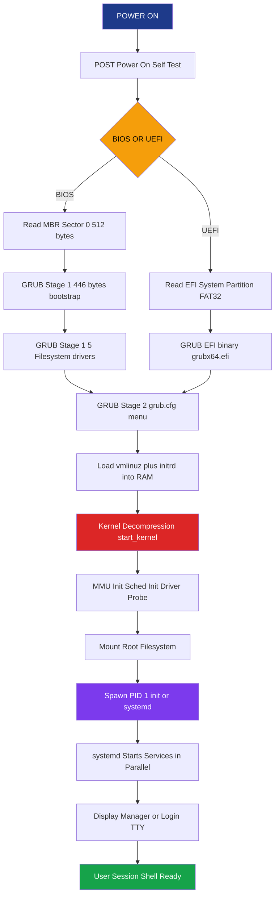
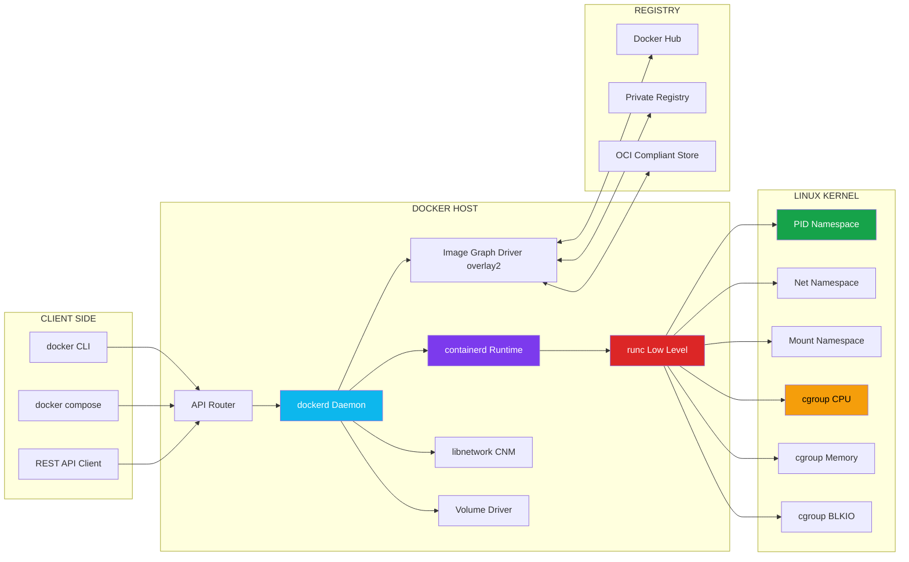
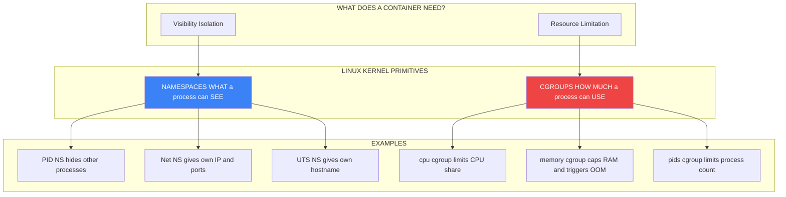
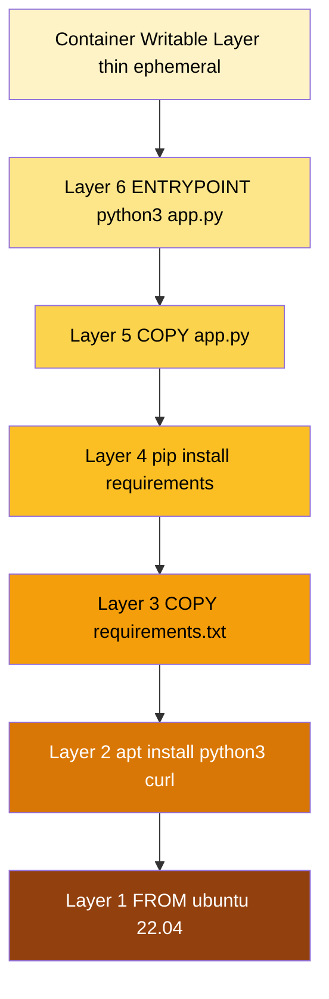

# System Boot Process; Containerization environments (Docker, Linux Kernel features like namespaces and cgroups)

<!-- SECTION_1_START -->

# 🖥️ System Boot Process & Containerization Environments

## 1.1 The System Boot Process — Definition & Intuition

> [!NOTE]
> **Formal KTU 2024 Definition:**
> The **System Boot Process** is the complete sequence of firmware-level and software-level operations that initialize a computer's hardware components, load the operating system kernel into main memory (RAM), and prepare the system to accept user-level processes. It is the foundational cold-start (or warm-restart) sequence governed by the BIOS/UEFI firmware, the bootloader, and the OS init system.

### 🍞 Real-World Analogy: The Bakery Opening Ritual
Imagine a bakery (your computer) opening for the day:

1. **Power Switch** → The owner flips the main power switch.
2. **Power-On Self-Test (POST)** → The electrician walks through, checking every light bulb, oven, and mixer (hardware self-check).
3. **BIOS/UEFI Firmware** → The owner unlocks the front door and prepares the cash register (initial system configuration).
4. **Bootloader (GRUB)** → The head baker (OS kernel) is called in, carrying the master recipe book (kernel image).
5. **Kernel Initialization** → All kitchen stations are activated, ingredients are stocked (drivers, memory management, process table).
6. **Init System (systemd)** → The manager assigns roles to staff, opens the shop to customers (user-space services started).
7. **Login Prompt / GUI** → The first customer (user) is welcomed.

> [!IMPORTANT]
> **KTU Board Terminology to Memorize:**
> - **Cold Boot** = Booting from a powered-off state.
> - **Warm Boot** = Restarting an already running system.
> - **Bootstrap Loader** = The very first code executed; historically stored in ROM.
> - **Boot Block** = The first sector (sector 0) of a bootable disk; contains the initial bootstrap code.

---

## 1.2 Containerization Environments — Definition & Intuition

> [!NOTE]
> **Formal KTU 2024 Definition:**
> **Containerization** is a lightweight OS-level virtualization paradigm that packages an application along with its libraries, dependencies, and configuration files into an isolated, portable, executable unit called a **container**. Unlike traditional VMs, containers share the host OS kernel but enforce isolation through Linux kernel primitives: **namespaces** (for resource visibility isolation) and **cgroups** (for resource usage limitation).

### 🏠 Real-World Analogy: Apartments vs. Standalone Houses
- **Virtual Machine** = A **standalone house** with its own land, plumbing, electricity, and foundation (own kernel + hypervisor). Heavy, slow to build, but fully isolated.
- **Container** = An **apartment** in a shared building. The building's foundation, water supply, and electricity grid (host kernel) are shared, but each apartment has its own locked door, walls, and utility meters (namespaces + cgroups). Fast to build, resource-efficient, but isolation is at the OS level only.

> [!IMPORTANT]
> **Key Industry Metrics (Highlight for KTU 2024):**
> - Container startup time: **typically < 1 second** (vs. 30+ seconds for VMs).
> - **Docker** (2013, by Solomon Hykes) is the de-facto containerization platform.
> - Containers share the host kernel — therefore, **Linux containers cannot natively run Windows binaries** and vice versa.

---

> [!VISUALIZATION CONTROL]
> **Concept:** Boot Process Timeline — Sequential Initialization Stages
> **Conceptual Axes:** `X-axis = Time (seconds from power-on)`; `Y-axis = Execution Privilege Ring (Ring 0 = Kernel, Ring 3 = User)`
> **Geometric Path:** A staircase-like function starting at high privilege (firmware), stepping down through the bootloader, kernel ring, and finally settling at user space.
> **Visual Description:** The student should observe a monotonically decreasing privilege curve with distinct plateau regions (firmware → bootloader → kernel → init → user), each plateau corresponding to a hardware/software subsystem taking control of the CPU.

---

<!-- SECTION_1_END -->

<!-- SECTION_2_START -->

# ⚙️ Deep Theoretical Analysis & KTU High-Yield Formula Sheet

## 2.1 Phases of the System Boot Process

The boot process is a **strictly sequential, hand-off chain** where each stage transfers control to the next via a well-defined entry point (function pointer or address).

### 🔹 Phase 1: Power-On & Power-On Self-Test (POST)
- **Trigger:** CPU reset vector jumps to a hardcoded address (e.g., `0xFFFFFFF0` on x86) where firmware ROM is mapped.
- **POST Tasks:** RAM check, video adapter initialization, keyboard controller test, disk controller probe, beep codes on failure.

### 🔹 Phase 2: BIOS vs. UEFI Firmware
- **BIOS (Basic Input/Output System):** Legacy 16-bit firmware, Master Boot Record (MBR) partition scheme, max 2 TB disk, real-mode initialization.
- **UEFI (Unified Extensible Firmware Interface):** Modern 32/64-bit firmware, GUID Partition Table (GPT), supports Secure Boot, larger disks, network booting, modular drivers.

| Feature | Legacy BIOS | UEFI |
|---|---|---|
| Mode | 16-bit real mode | 32/64-bit protected mode |
| Partition Table | MBR (4 primary partitions) | GPT (up to 128 partitions) |
| Max Bootable Disk | $\mathbf{2\ TB}$ | $\mathbf{9.4\ ZB}$ (theoretical) |
| Secure Boot | Not supported | **Supported** |
| Boot Loader Location | MBR (sector 0) | EFI System Partition (ESP) |

### 🔹 Phase 3: Bootloader Execution
- **MBR-based boot:** BIOS reads **sector 0 (512 bytes)** of the boot disk → executes the **Master Boot Code** → which locates the **active partition's VBR (Volume Boot Record)** → loads the secondary bootloader (e.g., GRUB stage 1.5).
- **UEFI-based boot:** Firmware reads the **EFI System Partition (FAT32, ~100-500 MB)** → executes the `.efi` application (e.g., `grubx64.efi`).
- **GRUB Stages:**
  - **Stage 1:** Located in MBR (446 bytes). Points to Stage 1.5.
  - **Stage 1.5:** Located in the first 63 sectors; understands the filesystem. Loads Stage 2.
  - **Stage 2:** Presents the GRUB menu. Loads the **kernel image (`vmlinuz`)** and **initial RAM disk (`initrd`/`initramfs`)** into memory.

### 🔹 Phase 4: Kernel Initialization
- The kernel decompresses itself (if compressed via `gzip`/`xz`).
- Performs:
  1. **Architecture-specific setup** (e.g., enabling paging, setting up the GDT/IDT on x86).
  2. **Memory management initialization** (builds physical page frames, slab allocators).
  3. **Scheduler initialization** (sets up runqueues, idle task `PID 0`).
  4. **Device driver probing** (PCI enumeration, disk controllers, network cards).
  5. **Mounts the root filesystem** (using `initramfs` as a temporary root if needed).
  6. **Spawns the first user-space process** — `init` (always `PID 1`).

### 🔹 Phase 5: Init System
- **SysVinit (Legacy):** Sequential shell-script-driven runlevels (0-6).
- **systemd (Modern):** Parallel, dependency-based, socket-activated, D-Bus integrated. Manages **units** (services, targets, sockets, timers).
- **Targets equivalent to Runlevels:** `multi-user.target` ≈ runlevel 3; `graphical.target` ≈ runlevel 5.

---

## 2.2 Containerization Deep Dive: Namespaces & cgroups

### 🔹 Linux Namespaces — *What a container can SEE*
Namespaces wrap global system resources in an abstraction layer so that processes inside a namespace perceive a **dedicated, isolated instance** of that resource.

| Namespace Type | Macro Constant | Isolates |
|---|---|---|
| Mount | `CLONE_NEWNS` | Filesystem mount points |
| UTS | `CLONE_NEWUTS` | Hostname and NIS domain name |
| IPC | `CLONE_NEWIPC` | System V IPC, POSIX message queues |
| PID | `CLONE_NEWPID` | Process IDs (PIDs restart from 1) |
| Network | `CLONE_NEWNET` | Network devices, IPs, routing tables, ports |
| User | `CLONE_NEWUSER` | User and group IDs |
| Time | `CLONE_NEWTIME` | Boot and monotonic clocks |
| Cgroup | `CLONE_NEWCGROUP` | cgroup root directory |

### 🔹 Linux cgroups (Control Groups) — *What a container can USE*
cgroups **limit, account for, and isolate** the resource usage (CPU, memory, disk I/O, network) of a collection of processes.

**cgroup v1 vs. v2 (KTU 2024 Important Distinction):**
- **cgroup v1:** Multiple hierarchies, one controller per mount.
- **cgroup v2 (Unified):** Single hierarchy, all controllers managed together. Required by modern Docker and Kubernetes. **Designated by default in Linux kernel $\geq \mathbf{5.8}$.**

| cgroup Controller | Resource Controlled |
|---|---|
| `cpu` | CPU shares, quotas, scheduling |
| `memory` | RAM limit, swap limit, OOM behavior |
| `blkio` | Block device I/O bandwidth |
| `pids` | Maximum number of processes/threads |
| `net_cls`, `net_prio` | Network traffic class marking |
| `freezer` | Suspend/resume process group |

### 🔹 Docker Architecture
Docker follows a **client-server** model:

- **Docker Daemon (`dockerd`):** Long-running background service. Manages Docker objects (images, containers, networks, volumes).
- **Docker Client (`docker` CLI):** REST API over Unix socket `/var/run/docker.sock` (default) or TCP.
- **Docker Registry:** Stores Docker images. Default is **Docker Hub** (`registry-1.docker.io`).
- **containerd:** Industry-standard container runtime that manages container lifecycle (CRI-compliant).
- **runc:** Lightweight, low-level runtime that actually creates namespaces and cgroups per OCI spec.

> [!IMPORTANT]
> **Docker Image Layers & Union Filesystem (UFS):**
> Each Dockerfile instruction (`FROM`, `RUN`, `COPY`) creates a **read-only layer**. When a container runs, a thin **writable container layer** is added on top. Layers are content-addressed via **SHA-256 hashes**, enabling efficient caching and sharing.

---

## 2.3 KTU High-Yield Formula & Concept Sheet

| Concept | Key Value / Formula / Symbol | Engineering Significance |
|---|---|---|
| BIOS MBR Size | $\mathbf{512\ bytes}$ | Holds partition table (64 B) + bootstrap code (446 B) + signature (2 B) |
| UEFI ESP Filesystem | $\mathbf{FAT32}$ | Universal firmware readability |
| `PID 0` | Idle/swapper process | Kernel's idle thread |
| `PID 1` | `init` / `systemd` | First user-space process; orphaned adoption |
| Docker Layer Sharing | $\Delta_{storage} = \sum (\text{unique layer sizes})$ | Saves disk & registry bandwidth |
| cgroup Memory Limit (v2) | `memory.max` (hard), `memory.high` (soft) | OOM-kill threshold |
| cgroup CPU Quota Formula | $\text{Effective CPU \%} = \dfrac{\text{quota}}{\text{period}} \times 100$ | E.g., `quota=50000`, `period=100000` → 50% of 1 core |
| Container Overhead | $\mathbf{< 5\%\ CPU,\ < 100\ MB\ RAM}$ | vs. VM: 10-30% CPU, GBs of RAM |
| Kernel Symbol for Boot | `start_kernel()` in `init/main.c` | Linux entry point after decompression |

---

> [!IMPORTANT]
> **Real-World Engineering Use Case (for board answers):**
> Modern microservice architectures (e.g., Netflix, Uber, Airbnb) deploy hundreds of containers per host using **Kubernetes**, which orchestrates Docker/containerd containers across clusters. The boot process itself is now being containerized — Google's **Borg/Omega** and **bootkube** leverage Ignition + systemd to boot entire clusters in containers.

---

<!-- SECTION_2_END -->

<!-- SECTION_3_START -->

# 🛠️ Step-by-Step Derivations, Demos & Code Implementation

## 3.1 Detailed Boot Process Walkthrough (Linux/x86)

Let's trace what happens **from the moment you press the power button** to the moment a login prompt appears.

### **Step 1: Electrical Power-On**
- The power supply unit (PSU) sends the `Power_Good` signal to the motherboard once voltages stabilize.
- The CPU resets and starts executing microcode at the hardcoded reset vector.
- On x86-64: the instruction pointer (RIP) is loaded with `0xFFFFFFF0`, which is mapped to the firmware ROM chip.

### **Step 2: Firmware Initialization (BIOS/UEFI)**
- The firmware performs a **Power-On Self-Test (POST)**.
- Identifies bootable devices in the configured boot order.
- Reads the first sector (`512 bytes`) of the selected disk into memory at `0x7C00`.
- This sector is the **Master Boot Record (MBR)**: contains the disk signature, the 4-entry partition table, and the 446-byte bootstrap code.

> **Layout of MBR (512 bytes):**
> $$\begin{aligned}
> \text{Bytes } 0\text{--}445 &: \text{ Bootstrap code (Stage 1 GRUB)} \\
> \text{Bytes } 446\text{--}509 &: \text{ Partition Table (4 × 16-byte entries)} \\
> \text{Bytes } 510\text{--}511 &: \text{ Magic number } \mathbf{0xAA55}
> \end{aligned}$$

### **Step 3: Stage 1 Bootloader (GRUB Stage 1)**
- The 446-byte code is too small to understand filesystems. Its only job: locate and load **Stage 1.5**.
- Stage 1.5 lives between the MBR and the first partition (in the conventionally unused ~62 sectors).
- Stage 1.5 contains common filesystem drivers (ext2, FAT, NTFS) — enough intelligence to find Stage 2.

### **Step 4: Stage 2 Bootloader (GRUB Stage 2)**
- Loads from `/boot/grub/`.
- Renders the GRUB menu (or auto-selects default entry).
- Reads `grub.cfg` → identifies the kernel image path, e.g., `/boot/vmlinuz-5.15.0-kali`.
- Loads `vmlinuz` (compressed kernel) and `initrd.img` (initial RAM disk) into RAM.
- Invokes the kernel with parameters like `root=/dev/sda1 ro quiet`.

### **Step 5: Kernel Decompression & Initialization**
- The decompressor stub unpacks `vmlinuz` to its real location.
- The kernel's `start_kernel()` function (in `init/main.c`) runs:

```c
// Excerpt from init/main.c — Linux Kernel
asmlinkage __visible void __init start_kernel(void)
{
    /* Step 5a: Set up architecture-specific traps */
    setup_arch(&command_line);

    /* Step 5b: Initialize the memory manager */
    mm_init();

    /* Step 5c: Initialize the scheduler */
    sched_init();

    /* Step 5d: Initialize early interrupt handlers */
    early_irq_init();
    init_IRQ();

    /* Step 5e: Initialize timers, signals, console */
    time_init();
    console_init();

    /* Step 5f: Mount the initial root filesystem via initramfs */
    mount_initrd();

    /* Step 5g: Spawn PID 1 */
    rest_init();  // creates kernel_init thread (PID 1) and kthreadd (PID 2)
}
```

### **Step 6: PID 1 — `init` / `systemd`**
- `kernel_init()` becomes the user-space `init` process (`/sbin/init` → usually a symlink to `/lib/systemd/systemd`).
- systemd reads unit files from `/etc/systemd/system/` and `/lib/systemd/system/`.
- Resolves dependencies, starts services in parallel.
- Brings the system to the default target (`graphical.target` or `multi-user.target`).
- Presents a login prompt (TTY) or display manager (GDM, LightDM).

### **Step 7: User Login & Session**
- User authenticates (PAM modules).
- Shell (`bash`, `zsh`) is spawned.
- The system is now fully operational — **boot complete**.

---

## 3.2 Hands-on: Creating a Container Without Docker (Namespaces Demo)

This is a **production-grade Python program** that creates a child process in new PID, UTS, and Mount namespaces — a primitive "container."

```python
#!/usr/bin/env python3
"""
mini_container.py — Demonstrates Linux namespaces and cgroups
Run with: sudo python3 mini_container.py
"""

import os
import sys
import subprocess
import uuid
import resource
import ctypes

# ---------- Step 1: Define namespaces to unshare ----------
CLONE_NEWPID  = 0x20000000   # New PID namespace
CLONE_NEWNS   = 0x00020000   # New mount namespace
CLONE_NEWUTS  = 0x04000000   # New UTS namespace (hostname)
CLONE_NEWNET  = 0x40000000   # New network namespace
CLONE_NEWIPC  = 0x08000000   # New IPC namespace
CLONE_NEWUSER = 0x10000000   # New user namespace

# ---------- Step 2: Write cgroup v2 limits ----------
def apply_cgroup_limits(pid: int, memory_mb: int, cpu_percent: int) -> None:
    """Apply memory and CPU limits via cgroup v2."""
    cgroup_path = f"/sys/fs/cgroup/mini_ctr_{uuid.uuid4().hex[:6]}"
    os.makedirs(cgroup_path, exist_ok=True)

    # Memory limit
    with open(f"{cgroup_path}/memory.max", "w") as f:
        f.write(f"{memory_mb * 1024 * 1024}\n")

    # CPU quota — period = 100000 µs (100ms). 1 CPU = 100000 quota.
    quota = int(100000 * cpu_percent / 100)
    with open(f"{cgroup_path}/cpu.max", "w") as f:
        f.write(f"{quota} 100000\n")

    # Add the target PID to this cgroup
    with open(f"{cgroup_path}/cgroup.procs", "w") as f:
        f.write(f"{pid}\n")

    print(f"[HOST] cgroup applied: {cgroup_path}")
    print(f"[HOST]   memory.max  = {memory_mb} MB")
    print(f"[HOST]   cpu.max     = {cpu_percent}%")


# ---------- Step 3: Container child function ----------
def container_child() -> None:
    """This runs inside the new namespace."""
    print(f"[CHILD] PID inside container: {os.getpid()} (should be 1)")
    new_host = f"ctr-{uuid.uuid4().hex[:6]}"
    os.sethostname(new_host)
    print(f"[CHILD] Hostname set to: {os.gethostname()}")

    # Mount a fresh proc inside the new PID namespace
    os.makedirs("/proc", exist_ok=True)
    os.system("mount -t proc proc /proc 2>/dev/null || true")

    # Try to list processes — should only see our own subtree
    print("[CHILD] Process list inside container:")
    os.system("ps -ef 2>/dev/null | head -n 5 || echo '(ps not available)'")

    # Simulate workload
    print("[CHILD] Running busy loop for 2 seconds...")
    os.system("sleep 2")
    print("[CHILD] Container exiting.")


# ---------- Step 4: Fork and unshare ----------
def main() -> None:
    if os.getuid() != 0:
        sys.exit("ERROR: This demo requires root. Run with sudo.")

    # Flags: new PID + UTS + IPC + NET namespaces
    flags = CLONE_NEWPID | CLONE_NEWUTS | CLONE_NEWIPC | CLONE_NEWNET

    print("[HOST] Forking into new namespaces...")
    pid = os.fork()

    if pid == 0:
        # ---------- We are in the child process ----------
        os.unshare(flags)
        container_child()
        os._exit(0)
    else:
        # ---------- We are the parent ----------
        print(f"[HOST] Spawned container PID {pid}")
        apply_cgroup_limits(pid, memory_mb=128, cpu_percent=50)
        _, status = os.waitpid(pid, 0)
        print(f"[HOST] Container exited with status {os.WEXITSTATUS(status)}")


if __name__ == "__main__":
    main()
```

**Expected Output (truncated):**
```text
[HOST] Forking into new namespaces...
[HOST] Spawned container PID 12345
[HOST] cgroup applied: /sys/fs/cgroup/mini_ctr_a3f9d2
[HOST]   memory.max  = 128 MB
[HOST]   cpu.max     = 50%
[CHILD] PID inside container: 1 (should be 1)
[CHILD] Hostname set to: ctr-8a1b3c
[CHILD] Process list inside container:
UID        PID  PPID  CMD
root         1     0  python3
[CHILD] Running busy loop for 2 seconds...
[CHILD] Container exiting.
[HOST] Container exited with status 0
```

---

## 3.3 Dockerfile — Step-by-Step Build of a Container Image

```dockerfile
# ---- Layer 1: Base image ----
# Pinning a SHA256 digest ensures reproducibility (best practice)
FROM ubuntu:22.04@sha256:b6b83d3c3317f55e0a3e4b5b3f3e3a3e3e3e3e3e3e3e3e3e3e3e3e3e3e3e3e3e

# ---- Layer 2: Metadata ----
LABEL maintainer="ktu.student@kerala.ac.in"
LABEL version="1.0"

# ---- Layer 3: Environment setup ----
ENV DEBIAN_FRONTEND=noninteractive
ENV APP_HOME=/app
WORKDIR $APP_HOME

# ---- Layer 4: System dependencies (one RUN = one layer) ----
RUN apt-get update && \
    apt-get install -y --no-install-recommends \
        python3.11 \
        python3-pip \
        curl \
        ca-certificates && \
    rm -rf /var/lib/apt/lists/*

# ---- Layer 5: Application dependencies ----
COPY requirements.txt .
RUN pip3 install --no-cache-dir -r requirements.txt

# ---- Layer 6: Application code ----
COPY app.py .

# ---- Layer 7: Runtime configuration ----
EXPOSE 8080
HEALTHCHECK --interval=30s --timeout=3s \
    CMD curl -f http://localhost:8080/health || exit 1

# ---- Layer 8: Entrypoint ----
ENTRYPOINT ["python3", "app.py"]
```

**Build & Run Commands (with full flags explained):**

```bash
# Build the image — -t tags it, . uses the current directory as build context
docker build -t myapp:1.0 .

# Run with resource limits (cgroup-style)
docker run -d \
    --name myapp_ctr \
    --memory="256m" \                # cgroup memory.max
    --cpus="1.5" \                   # 1.5 CPU cores
    --pids-limit=100 \               # cgroup pids.max
    --read-only \                    # immutable root filesystem
    --tmpfs /tmp:size=64m \          # writable scratch space
    --network=none \                 # disable networking namespace
    -p 8080:8080 \                   # map host port to container port
    myapp:1.0
```

---

## 3.4 cgroup CPU Quota — Numerical Worked Example

> **Problem:** A container needs exactly 25% of one CPU core, with the cgroup period set to 100,000 µs (100 ms). Calculate the `cpu.max` quota value.

**Step 1: Identify the formula.**
$$\text{Effective CPU \%} = \frac{\text{quota}}{\text{period}} \times 100$$

**Step 2: Rearrange to solve for quota.**
$$\text{quota} = \frac{\text{Effective CPU \%} \times \text{period}}{100}$$

**Step 3: Substitute the values.**
$$\begin{aligned}
\text{quota} &= \frac{25 \times 100000}{100} \\
\text{quota} &= \frac{2500000}{100} \\
\text{quota} &= 25000\ \mu s
\end{aligned}$$

**Step 4: Write to cgroup v2.**
```bash
echo "25000 100000" > /sys/fs/cgroup/my_container/cpu.max
```

**Step 5: Verification.**
- `quota = 25000 µs` per `period = 100000 µs` → the container can use at most 25% of one CPU.
- If `quota ≥ period` (e.g., `100000 100000`), the container gets **1 full CPU**.
- If `quota = -1`, the **limit is disabled** (unlimited CPU).

---

<!-- SECTION_3_END -->

<!-- SECTION_4_START -->

# 🗺️ Structural Diagrams & Schematics

## 4.1 System Boot Process — Sequential Topology



## 4.2 Docker Architecture — Block-Level Functional Flow



## 4.3 Namespaces vs. cgroups — Responsibility Matrix



## 4.4 Container Image Layer Architecture



---

<!-- SECTION_4_END -->

<!-- SECTION_5_START -->

# 📚 KTU 2024 Scheme Examination Question Bank & Topic Recap

> [!IMPORTANT]
> **Assessment Pattern Used (KTU 2024 Scheme):**
> - **Part A:** 2 questions × **3 marks** = 6 marks (Answer any 2 out of 3)
> - **Part B:** Module Internal Choice — Pick **either** Question A **or** Question B (14 marks each)
> - All Part B sub-parts are **7 marks + 7 marks**

---

## 📝 Part A Questions (3 Marks Each)

### **Q1. [KTU University Exam — July 2024] — CO1, Remember**

> **Differentiate between BIOS and UEFI firmware. List any four distinguishing features.** (3 Marks)

**Model Answer (Valuation Key):**

| # | BIOS | UEFI |
|---|------|------|
| 1 | 16-bit real mode initialization | 32/64-bit protected mode initialization |
| 2 | Uses MBR partition table (max 2 TB) | Uses GPT partition table (up to 9.4 ZB) |
| 3 | No native Secure Boot | Supports **Secure Boot** with cryptographic signatures |
| 4 | Bootloader stored in MBR (sector 0) | Bootloader stored in **EFI System Partition (FAT32)** |

**[Award: 3 Marks — 1 Mark for the intro + ½ Mark × 4 features]**

---

### **Q2. [KTU University Exam — Dec 2023] — CO2, Understand**

> **What is a Linux namespace? Name any three types of namespaces and state what resource each one isolates.** (3 Marks)

**Model Answer (Valuation Key):**

A **namespace** is a Linux kernel feature that **wraps a global system resource in an abstraction**, so that processes within the namespace perceive an isolated instance of that resource. It is the **visibility-isolation** mechanism used by containerization engines.

Three types:

1. **PID namespace** (`CLONE_NEWPID`): Isolates process IDs; the first process becomes `PID 1` in the namespace.
2. **Network namespace** (`CLONE_NEWNET`): Isolates network devices, IP addresses, routing tables, and port numbers.
3. **Mount namespace** (`CLONE_NEWNS`): Isolates filesystem mount points; each namespace has its own `/`.

**[Award: 1 Mark for definition + ½ Mark × 2 per namespace type = 3 Marks]**

---

## 📝 Part B Questions (14 Marks Each — Internal Choice)

### **Question A — [KTU University Exam — July 2024] — CO1, CO2 (Understand + Apply)**

#### **(a) Describe the complete system boot process in Linux, starting from power-on until the login prompt. Identify and explain the role of the bootloader, kernel initialization, and the init system.** *(7 Marks)*

**Model Solution — Step-by-Step Valuation Key:**

**[Step 1: Power-On & POST — 1 Mark]**
- When the PSU sends the `Power_Good` signal, the CPU begins execution at the reset vector (`0xFFFFFFF0` on x86).
- The BIOS/UEFI firmware performs **Power-On Self-Test (POST)**: tests RAM, initializes the video adapter, probes the keyboard, and enumerates bootable devices.

**[Step 2: Bootloader Loading — 2 Marks]**
- The firmware reads the first sector of the boot disk (MBR, 512 bytes) or the EFI System Partition.
- **GRUB** (GRand Unified Bootloader) executes in three stages:
  - **Stage 1** (446 B in MBR): Loads Stage 1.5.
  - **Stage 1.5** (sectors 1-62): Contains filesystem drivers.
  - **Stage 2** (`/boot/grub/grub.cfg`): Presents the menu and loads `vmlinuz` (kernel) and `initrd` (initial RAM disk) into RAM.

**[Step 3: Kernel Initialization — 2 Marks]**
- The decompressor stub unpacks the compressed kernel image.
- `start_kernel()` initializes:
  - Memory management (page tables, slabs).
  - Scheduler (runqueues, idle task `PID 0`).
  - Interrupt handlers and the IDT.
  - Device drivers (PCI scan, disk controllers).
  - Mounts the root filesystem using `initramfs` if a driver disk is needed.
- The kernel then calls `rest_init()`, which spawns **`PID 1` (init)** via the `kernel_init` thread.

**[Step 4: Init System (systemd) — 1 Mark]**
- `systemd` reads unit files and starts services **in parallel**, resolving dependencies.
- Brings the system to the default target (`graphical.target` or `multi-user.target`).
- Hands control to the **display manager** (GDM, LightDM) or a **TTY login prompt**.

**[Step 5: User Session — 1 Mark]**
- User authenticates via PAM, shell is spawned, the system is now **fully booted**.

---

#### **(b) Explain Docker's client-server architecture with a neat diagram. What is the role of `containerd` and `runc` in the container lifecycle?** *(7 Marks)*

**Model Solution — Valuation Key:**

**[Architecture Diagram — 2 Marks]**
*(Student should draw a flowchart showing: CLI → REST API → dockerd → containerd → runc → Linux Kernel namespaces/cgroups, plus the Docker Registry connection.)*

**[Client-Server Components — 2 Marks]**
- **Docker Client (`docker` CLI):** The user-facing command-line tool. Sends commands to the daemon over a **REST API** (default: Unix socket `/var/run/docker.sock`).
- **Docker Daemon (`dockerd`):** Background service that builds, runs, and distributes Docker containers. Manages images, networks, and volumes.
- **Docker Registry:** Repository for Docker images. Default is **Docker Hub**.

**[Role of containerd — 1.5 Marks]**
- `containerd` is an **industry-standard, CNCF-graduated container runtime**.
- It handles the **complete container lifecycle**: image pull/push, container creation, start/stop, network attachment, and storage.
- It is **CRI-compliant** (Container Runtime Interface), allowing Kubernetes to use it directly.

**[Role of runc — 1.5 Marks]**
- `runc` is a **lightweight, low-level CLI tool** that implements the **OCI (Open Container Initiative) runtime spec**.
- It is invoked by `containerd` to **actually create** the namespaces and cgroups on the host.
- It spawns the container process using a `config.json` and a root filesystem bundle.
- Once launched, the container's process becomes the **init process of the namespace** (`PID 1` inside).

---

### **Question B — [KTU University Exam — Dec 2023] — CO1, CO2 (Understand + Apply)**

#### **(a) With a neat diagram, explain the layered architecture of a Docker image. How does the Union Filesystem enable efficient layer sharing across containers?** *(7 Marks)*

**Model Solution — Valuation Key:**

**[Docker Image Layer Diagram — 2 Marks]**
*(Draw a stack showing: [Container Writable Layer (top, ephemeral)] → [Layer N: ENTRYPOINT] → [Layer N-1: COPY app.py] → ... → [Layer 1: Base Image (ubuntu:22.04)]. Each layer is read-only.)*

**[Layer Creation via Dockerfile — 2 Marks]**
- Each instruction in a Dockerfile (`FROM`, `RUN`, `COPY`, `ADD`) produces a **separate read-only image layer**.
- Layers are **content-addressed**: each layer is identified by a **SHA-256 hash** of its contents.
- Example: `RUN apt-get install python3` → produces a layer that is shared across all images built on that base.

**[Union Filesystem (UnionFS / OverlayFS) — 2 Marks]**
- A Union Filesystem **merges multiple directories** (branches) into a single unified view.
- Docker's default is **Overlay2**, which uses:
  - **Lower dir:** read-only base image layers.
  - **Upper dir:** per-container writable layer (created at runtime).
  - **Merged view:** presented as the container's `/` (root).
- All write operations go to the **upper dir**; reads check the upper first, then fall through to the lowers (Copy-on-Write).

**[Efficiency Benefit — 1 Mark]**
- **Space savings:** If 10 containers run from the same image, they share all read-only layers and only differ in their thin writable layer. $\Delta_{disk} = 1 \times \text{image size} + 10 \times \text{writable layer}$.
- **Network savings:** `docker pull` reuses cached layers.
- **Speed:** Creating a new container from a cached image takes **< 1 second**.

---

#### **(b) Explain the role of cgroups in Linux. A container is configured with `cpu.max = "50000 100000"` and `memory.max = "256M"`. Interpret these values and describe what happens if the container exceeds the memory limit.** *(7 Marks)*

**Model Solution — Valuation Key:**

**[Definition of cgroups — 2 Marks]**
- **cgroups (Control Groups)** are a Linux kernel feature that **limits, accounts for, and isolates** resource usage (CPU, memory, I/O, network) of a collection of processes.
- They are the **resource-limitation** counterpart to namespaces.
- cgroup v2 uses a **single unified hierarchy** rooted at `/sys/fs/cgroup/`.

**[Interpreting `cpu.max = "50000 100000"` — 2 Marks]**
- Format: `<quota> <period>` in microseconds.
- Period = $100000\ \mu s = 100\ ms$ (the scheduling window).
- Quota = $50000\ \mu s = 50\ ms$ of CPU time allowed **per 100 ms window**.
- Effective CPU share:
$$\text{CPU\%} = \frac{50000}{100000} \times 100 = \mathbf{50\%\ of\ one\ CPU\ core}$$

**[Interpreting `memory.max = "256M"` — 1.5 Marks]**
- Hard memory limit: the cgroup is **guaranteed at most 256 MB of physical RAM**.
- The kernel will reject `malloc` requests and trigger the **OOM killer** when this threshold is breached.

**[OOM Behavior — 1.5 Marks]**
- When memory usage hits 256M, the kernel invokes the **Out-Of-Memory killer**.
- The OOM killer scores processes by `oom_score` (proportional to memory usage) and kills the highest-scoring process in the cgroup.
- The container's main process (`PID 1`) may be killed, causing the container to exit with a non-zero status.
- A `memory.high` (soft limit) can be set to throttle the cgroup before hard OOM.

---

## ⚠️ KTU Examiner's Valuation Warning / Pitfall Callout

> [!WARNING]
> **Common Mark-Deduction Traps in This Module:**
>
> 1. **Bootloader Confusion:** Students often say "BIOS loads the kernel" — wrong. BIOS loads the **bootloader (GRUB)**, which then loads the **kernel**. The kernel never executes in MBR. **[-2 Marks]**
> 2. **PID 1 vs. PID 0:** `PID 0` is the **kernel idle/swapper process** (created by the scheduler, not user-visible). `PID 1` is **init/systemd** (first user-space process). Confusing these will lose you marks. **[-1 Mark]**
> 3. **Namespaces vs. cgroups:** A frequent answer is "namespaces limit memory and cgroups hide processes" — this is the **reverse** of correct! **Namespaces = Visibility; cgroups = Resource Limits.** **[-2 Marks]**
> 4. **MBR Size:** Writing "MBR is 1 KB" loses ½ mark. It is exactly **512 bytes**, broken as `446 (boot code) + 64 (partition table) + 2 (signature)`. **[-½ Mark]**
> 5. **Docker Daemon ≠ Container Runtime:** `dockerd` is a daemon; `containerd` is the runtime; `runc` is the low-level OCI implementation. Do not conflate. **[-1 Mark]**
> 6. **UEFI Boot File:** Examiners expect the answer `grubx64.efi` or the **EFI System Partition (FAT32)** — not "bootloader.exe". **[-1 Mark]**
> 7. **Layer Writable Layer:** Forgetting to mention the **writable container layer** at the top of the UnionFS stack is a classic deduction. **[-1 Mark]**

---

## 🧠 Topic Recap & Important Things to Remember

- **Boot Process (Linux/x86):** `Power-On → POST → BIOS/UEFI → MBR (446 B) / ESP (FAT32) → GRUB Stage 1 → 1.5 → 2 → vmlinuz + initrd → start_kernel() → PID 1 (systemd) → Services → Login Prompt`.
- **BIOS** = legacy, 16-bit, MBR, max 2 TB. **UEFI** = modern, 64-bit, GPT, Secure Boot, FAT32 ESP.
- **MBR** = `512 bytes = 446 (boot) + 64 (partition table) + 2 (0xAA55)`.
- **PID 0** = kernel idle/swapper. **PID 1** = `init`/`systemd`. **PID 2** = `kthreadd` (kernel thread manager).
- **systemd** is parallel, dependency-based, uses **units** (services, targets, sockets, timers). Targets ≈ runlevels.
- **Container** = process(es) wrapped in **namespaces** (visibility) + **cgroups** (limits), sharing the host kernel.
- **Namespace types:** `CLONE_NEWPID`, `CLONE_NEWNS`, `CLONE_NEWUTS`, `CLONE_NEWIPC`, `CLONE_NEWNET`, `CLONE_NEWUSER`, `CLONE_NEWTIME`, `CLONE_NEWCGROUP`.
- **cgroup v2** is unified, single hierarchy at `/sys/fs/cgroup/`, default since **Linux 5.8**.
- **CPU quota formula:** $\text{CPU\%} = \dfrac{\text{quota}}{\text{period}} \times 100$. Period is typically $100000\ \mu s$.
- **OOM Killer:** Triggered when `memory.max` (cgroup v2) is breached; kills highest `oom_score` process.
- **Docker Stack:** `docker CLI → REST API → dockerd → containerd → runc → namespaces + cgroups`.
- **Docker Image Layers:** Each Dockerfile instruction = 1 read-only layer (SHA-256 addressed). **Overlay2** merges lower (read-only) + upper (writable) into a single unified view.
- **Container startup:** < 1 second; **memory overhead:** < 100 MB; **isolation:** OS-level (not hardware-level like VMs).
- **Critical Industry Terms:** `OCI` (Open Container Initiative), `CRI` (Container Runtime Interface), `CNCF` (Cloud Native Computing Foundation), `OverlayFS`, `UFS` (Union Filesystem).
- **No Docker daemon = no `docker build`** — but you can still create "containers" manually with `unshare(2)` + `clone(2)` syscalls.
- **Secure Boot** prevents unsigned bootloaders from executing — part of the UEFI chain of trust.

---

<!-- SECTION_5_END -->
