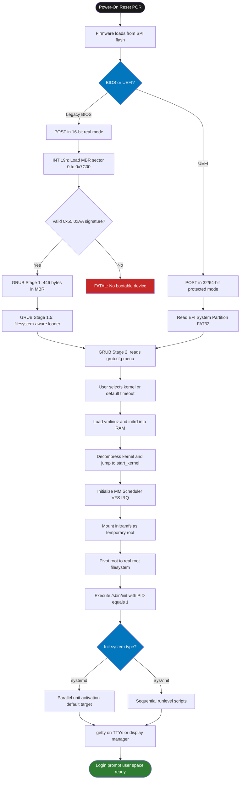
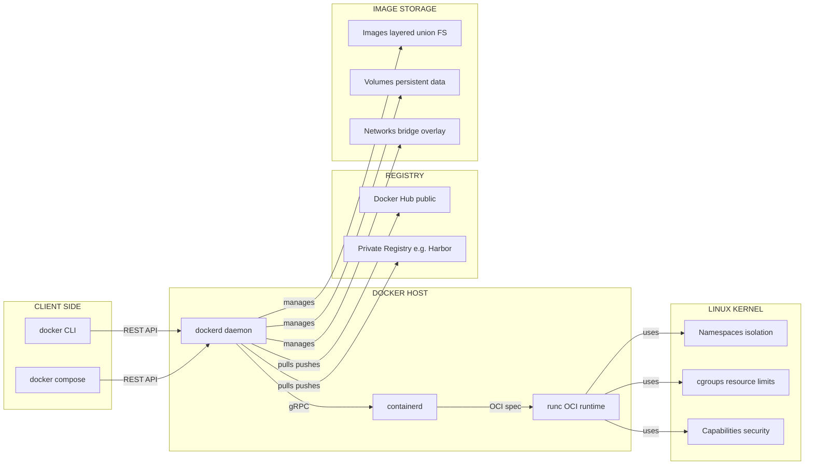
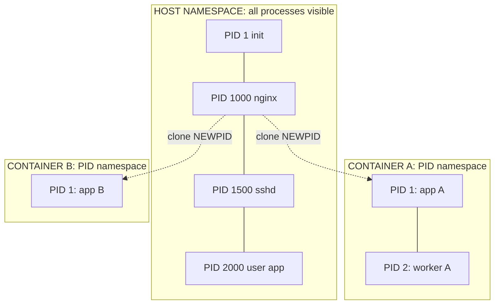
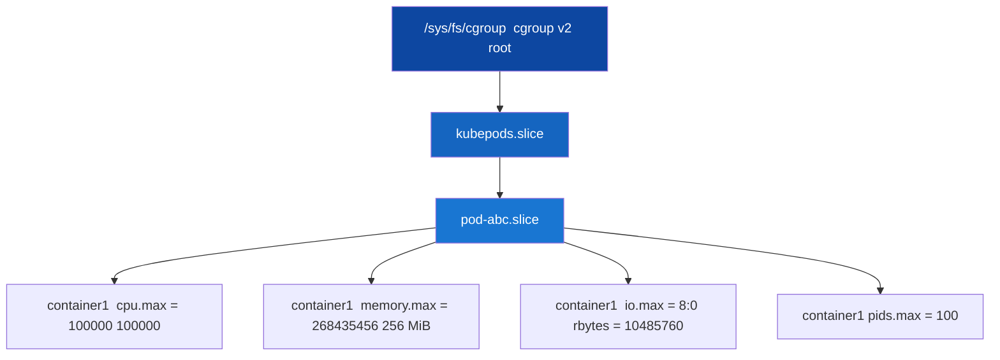

# System Boot Process; Containerization environments (Docker, Linux Kernel features like namespaces and cgroups)

<!-- SECTION_1_START -->
# System Boot Process & Containerization Environments

## 1.1 System Boot Process — Core Technical Definition

> [!NOTE]
> **KTU 2024 Syllabus Definition (PCCST403 / Module 1):**
> The *System Boot Process* (also called *Bootstrapping*) is the strictly ordered sequence of low-level operations executed by the firmware and software layers of a computer system, beginning from the moment electrical power is supplied to the motherboard, and terminating when the operating system's user-space services are fully initialized and a login prompt (or graphical shell) is presented to the user.

In KTU terminology, this is classified as a **cold boot** (power-off → power-on) versus a **warm boot** (reset/restart). The entire pipeline is governed by the **Basic Input/Output System (BIOS)** or the modern **Unified Extensible Firmware Interface (UEFI)** specification, working in conjunction with a **bootloader** and the **Linux kernel**.

### 1.1.1 Intuitive Analogy — "The Restaurant Opening Checklist"

> [!IMPORTANT]
> **Conceptual Analogy:** Think of the boot process as the **opening procedure of a five-star restaurant**:
> 1. **Power-on** = The head chef (electrician) flips the main switch.
> 2. **POST (Power-On Self-Test)** = The manager walks through every room checking that lights, gas, water, and freezers work.
> 3. **BIOS/UEFI Firmware** = The owner's rulebook (kept in a small safe) that says *which* cook (OS) is allowed to start today and *where* the kitchen keys are stored.
> 4. **MBR/GPT Boot Sector** = The door of the kitchen store-room where the head chef's apron and recipe book are kept.
> 5. **Bootloader (GRUB)** = The sous-chef who puts on the apron, reads the recipe book (kernel image), and shouts *"Start cooking!"*
> 6. **Kernel Initialization** = The head chef takes over the kitchen, sets up stations (memory, CPU, devices).
> 7. **Init System (systemd)** = The maître d' who hires the waiters, opens the front door, and seats the first customer (user).

> [!VISUALIZATION CONTROL]
> **Concept:** Linear boot-time progression from firmware to user-shell
> **Graph Type:** Step-function over time (Boot Duration on Y-axis, Boot Stage on X-axis)
> **Visualization Parameters (matplotlib/GeoGebra input):**
> * Stage points: $(0,\text{POST})$, $(0.2,\text{BIOS})$, $(0.5,\text{Bootloader})$, $(0.8,\text{Kernel})$, $(1.0,\text{Init/User})$
> **Visual Description:** Student should see a staircase rising from left (firmware, ~milliseconds) to right (user shell, ~10–30 seconds), with the longest plateau being the kernel and service initialization stage.

---

## 1.2 Containerization — Core Technical Definition

> [!NOTE]
> **KTU 2024 Syllabus Definition:**
> *Containerization* is an **OS-level virtualization** paradigm that packages an application together with its libraries, dependencies, and configuration files into a single, isolated, portable, and executable runtime unit called a **container**. Containers share the host operating system's kernel but operate within strictly partitioned user-space environments enforced by Linux kernel features — primarily **namespaces** (for isolation) and **cgroups / control groups** (for resource limitation).

The reference container engine for this module is **Docker**, released in **March 2013** and built on top of two foundational Linux kernel subsystems (both merged into mainline Linux in **2008**):
- **Namespaces** — provide process, network, mount, and identity isolation.
- **cgroups (control groups)** — provide CPU, memory, I/O, and device resource accounting and limiting.

### 1.2.1 Intuitive Analogy — "Apartments vs. Separate Houses"

> [!IMPORTANT]
> **Conceptual Analogy:** A traditional **Virtual Machine (VM)** is a **separate, fully-built house** on its own plot of land — it has its own plumbing, electricity meter, foundation, and walls. A **container** is an **apartment inside one large building** — all apartments share the building's main infrastructure (the OS kernel), but each unit has its own walls, locks, and utility meters.
> - The **building's shared foundation and water supply** = Host OS kernel
> - The **apartment walls and locks** = Linux **namespaces**
> - The **individual electricity and water meters per apartment** = Linux **cgroups**

This is why containers start in **milliseconds** (no need to boot a new OS) while VMs take **seconds to minutes** (a full guest OS must boot).

### 1.2.2 Critical Constants and Standards

| Constant / Standard | Value | Purpose |
|---|---|---|
| **Docker Initial Release** | **March 2013** (Solomon Hykes, PyCon) | Reference container engine |
| **OCI (Open Container Initiative)** | Founded **June 2015** by Docker & CoreOS | Standardizes container image & runtime specs |
| **Namespaces merged into Linux** | **2.6.24 (2008)** | Required kernel minimum for containers |
| **cgroups v1** | **2.6.24 (2008)** | Original control group hierarchy |
| **cgroups v2 (unified)** | **Linux 4.5 (2016)** | Modern unified hierarchy |
| **UEFI Specification** | **2.11 (2022)** | Modern firmware replacing legacy BIOS |
| **MBR Partition Size Limit** | **2 TiB** (2^32 × 512 B) | Why GPT was introduced |

> [!WARNING]
> **KTU Board Examiner's Note:** Examiners frequently award 1 mark specifically for stating the **year (2008)** when namespaces and cgroups were merged into the Linux kernel. Memorize this date.
<!-- SECTION_1_END -->

<!-- SECTION_2_START -->
# Deep Theoretical Analysis & KTU High-Yield Formula Sheet

## 2.1 The Complete System Boot Pipeline — Stage-by-Stage

### Stage 1: Power-On & Firmware Initialization (BIOS/UEFI)

When the **Power Good** signal is asserted by the PSU, the CPU resets and begins execution from a fixed physical address:
- **Legacy BIOS:** CPU begins at physical address `0xFFFFFFF0` (16 bytes below the 4 GiB ceiling) — the *reset vector*.
- **UEFI:** CPU begins execution from a vendor-defined SPI flash chip holding the UEFI firmware.

> [!IMPORTANT]
> **POST (Power-On Self-Test):** A diagnostic routine performed by the firmware that verifies:
> * CPU registers and basic arithmetic
> * RAM integrity (via memory testing patterns)
> * Storage controllers (SATA/NVMe)
> * Connected peripherals (keyboard, mouse, video adapter)
> * **Beep Codes** are emitted on failure (e.g., 1 short beep = POST OK, continuous = PSU fault).

### Stage 2: Boot Device Selection & First-Stage Bootloader

The firmware searches a configured boot order for a valid boot signature:
- **BIOS + MBR:** Looks for the byte sequence `0x55 0xAA` (the *boot signature*) at offset `510` of the first sector (512 bytes) of the disk.
- **UEFI + GPT:** Reads the **EFI System Partition (ESP)** — a FAT32 partition containing EFI executables (`.efi` files), typically mounted at `/boot/efi`.

The first-stage bootloader (e.g., GRUB stage 1.5) is loaded into RAM at address `0x7C00` (BIOS convention) and is **extremely small** (≤ 446 bytes for stage 1) because it must fit in the MBR.

### Stage 3: Second-Stage Bootloader (GRUB 2)

**GRUB (GRand Unified Bootloader)** performs:
1. Reads its configuration file (`/boot/grub/grub.cfg`).
2. Presents an interactive menu if multiple kernels are installed.
3. Locates the **Linux kernel image** (e.g., `vmlinuz-5.15.0`) and the **initial RAM filesystem** (`initrd.img-*`).
4. Decompresses the kernel into memory and transfers control to it.

### Stage 4: Kernel Initialization

The Linux kernel executes `start_kernel()` in `init/main.c`, which:
- Sets up **scheduler**, **memory management (MM)**, **virtual file system (VFS)**, and **interrupt handlers**.
- Mounts the **initramfs / initrd** as a temporary root filesystem to load essential drivers (storage, filesystem).
- Executes `/sbin/init` (or `/lib/systemd/systemd` on modern distros) — the **first user-space process with PID = 1**.

### Stage 5: Init System & User Space

| Init System | Era | Config | Service Start |
|---|---|---|---|
| **SysVinit** | Pre-2010 | `/etc/inittab`, `/etc/init.d/` | Sequential scripts (runlevels 0–6) |
| **Upstart** | 2010–2015 | `/etc/init/*.conf` | Event-driven |
| **systemd** | **2014 → present (default)** | `/etc/systemd/system/`, `unit` files | **Parallel**, dependency-based |

> [!NOTE]
> **KTU 2024 Highlight:** `systemd` is the default init system in **Ubuntu 15.04+**, **Debian 8+**, **RHEL 7+**, **Fedora 15+**, and **Arch Linux**. Its primary command is `systemctl` (e.g., `systemctl start nginx`).

### 2.1.1 BIOS vs. UEFI Comparison

| Feature | Legacy BIOS | UEFI |
|---|---|---|
| **Mode** | 16-bit real mode | 32/64-bit protected mode |
| **Max Partition Size** | **2 TiB** (MBR limit) | **8 ZiB** (GPT limit) |
| **Max Partitions** | 4 primary | **128** primary (GPT) |
| **Boot Media** | MBR boot sector | EFI System Partition (FAT32) |
| **Secure Boot** | Not supported | **Supported** (signature validation) |
| **Boot Speed** | Slower (POST + INT 13h) | Faster (parallel initialization) |
| **Shell** | None | **UEFI Shell** (built-in CLI) |

---

## 2.2 Containerization — Deep Architecture

### 2.2.1 Docker High-Level Architecture

Docker follows a **client-server architecture** consisting of:

| Component | Role |
|---|---|
| **Docker Client (`docker`)** | CLI tool; sends REST API calls to daemon |
| **Docker Daemon (`dockerd`)** | Long-running background service; manages images, containers, networks, volumes |
| **containerd** | Industry-standard container runtime; manages container lifecycle (create/start/stop/delete) |
| **runc** | Low-level runtime; complies with OCI spec; actually executes container processes |
| **Docker Registry** | Stateless server storing Docker images (e.g., **Docker Hub**, private registries) |
| **Docker Image** | Read-only template with layered filesystem (UnionFS) |
| **Docker Container** | Runnable instance of an image; has its own writable *container layer* |

### 2.2.2 Linux Namespaces — The Six (plus one) Types

Namespaces wrap a global system resource in an abstraction that makes the processes inside the namespace believe they have their own isolated instance of that resource.

| # | Namespace Flag (clone(2)) | Isolates | File in `/proc/<pid>/ns/` | Example Effect |
|---|---|---|---|---|
| 1 | `CLONE_NEWPID` | **Process IDs** | `pid` | Container's PID 1 is *not* host's PID 1 |
| 2 | `CLONE_NEWNET` | **Network stack** (interfaces, IPs, routes, ports) | `net` | Each container has its own `eth0` and port space |
| 3 | `CLONE_NEWNS` | **Mount points** (filesystem) | `mnt` | Container sees its own root filesystem |
| 4 | `CLONE_NEWUTS` | **Hostname & NIS domain name** | `uts` | Each container can have `hostname=db-server` |
| 5 | `CLONE_NEWIPC` | **System V IPC & POSIX message queues** | `ipc` | Container processes cannot see host IPC queues |
| 6 | `CLONE_NEWUSER` | **User and group IDs** | `user` | Root inside container maps to non-root outside |
| 7 | `CLONE_NEWCGROUP` | **cgroup root directory** | `cgroup` | Container sees its own cgroup hierarchy (v2) |

> [!IMPORTANT]
> **The `unshare(1)` and `clone(2)` system calls** are the underlying primitives used by Docker to create namespaces. For example: `unshare --pid --fork --mount-proc /bin/bash` creates a new PID namespace and runs bash as PID 1 inside it.

### 2.2.3 cgroups (Control Groups) — Resource Limitation

A **cgroup** is a Linux kernel feature that **limits, accounts for, and isolates** the resource usage (CPU, memory, disk I/O, network, device access) of a collection of processes.

The kernel exposes cgroup management through a **virtual filesystem** typically mounted at `/sys/fs/cgroup/`. Each cgroup is represented as a directory containing **control files** (one per *subsystem*).

### 2.2.4 KTU Formula Sheet — cgroup Resource Limits

> [!IMPORTANT]
> The following table consolidates the most test-relevant cgroup parameters. The values listed are the **default on Linux 5.x with cgroups v2**.

| Subsystem (v2 unified name) | Control File | Typical Default (Unlimited) | Engineering Use Case |
|---|---|---|---|
| **CPU** | `cpu.max` | `max 100000` | Web server with strict SLA |
| **Memory** | `memory.max` | `max` | Prevent OOM from runaway process |
| **I/O (Block)** | `io.max` | unset | Throttle noisy neighbor |
| **PIDs** | `pids.max` | `max` | Prevent fork-bomb |
| **cpuset** | `cpuset.cpus` | all | Pin container to specific cores |
| **HugeTLB** | `hugetlb.max` | `max` | Database workload tuning |
| **RDMA** | `rdma.max` | `max` | High-performance computing |

### 2.2.5 CPU Bandwidth Formula (cgroup v2)

For the `cpu.max` control file, the syntax is:

$$\text{cpu.max} = \text{quota}_\mu\text{s} \; \text{period}_\mu\text{s}$$

The effective CPU usage is bounded by:

$$\text{Usage}_\text{max} = \frac{\text{quota}}{\text{period}} \text{ cores (in CFS bandwidth)} \quad \text{where} \quad \text{quota} \le \text{period} \times N_\text{CPUs}$$

**Example:** `cpu.max = 50000 100000` means a process group gets at most **0.5 CPU cores** of compute time within every **100 ms** period.

### 2.2.6 Container Images — UnionFS and Copy-on-Write

Docker images are built from **read-only layers** stacked via a **Union Mount Filesystem** (historically **AUFS**, modern systems use **OverlayFS**). When a container is started:
- A thin **writable container layer** is added on top.
- All file modifications use **Copy-on-Write (CoW)**: the original file in a lower layer is copied to the upper layer only on first write, leaving the lower layer immutable.

> [!NOTE]
> **Why this matters:** A 1 GB base image (e.g., Ubuntu) consumes only 1 GB on disk *once* on the host, regardless of how many containers (say, 50) are instantiated from it. This is the **shared-image efficiency** that gives containers their legendary storage density.

### 2.2.7 Real-World Engineering Utility

| Domain | Use of Containerization |
|---|---|
| **Microservices (Kubernetes)** | Each service shipped as a container; scaled independently |
| **CI/CD Pipelines (Jenkins, GitHub Actions)** | Reproducible build environments in ephemeral containers |
| **DevOps (12-Factor App)** | "Codebase → Dependencies → Config" packaged identically dev → prod |
| **HPC & ML** | GPU-accelerated containers (NVIDIA Container Toolkit) for CUDA workloads |
| **Edge / IoT** | Lightweight runtimes (containerd, K3s) on resource-constrained devices |
| **Cloud Migration (AWS ECS, Azure ACI)** | Lift-and-shift legacy apps via containerization |
<!-- SECTION_2_END -->

<!-- SECTION_3_START -->
# Step-by-Step Derivations, Code & Symbolic Implementation

## 3.1 Exhaustive Walkthrough of the Linux Boot Process

### 3.1.1 Step-by-Step Boot Sequence (BIOS + GRUB + systemd)

**Step 1 — Power-On Reset (POR):**
The CPU samples the **RESET** line, loads the **Instruction Pointer (IP)** to a fixed address, and begins execution in **16-bit real mode**.

$$\text{IP}_{\text{reset}} = \text{0xFFFF:0x0000} \quad (\text{physical address } \text{0xFFFF0})$$

**Step 2 — BIOS POST and Device Enumeration:**
The BIOS firmware performs POST. On success, it executes **INT 19h** (the bootstrap interrupt), which loads the first 512-byte sector of the boot device into RAM at:

$$\text{Load address} = \text{0x0000:0x7C00} \quad (\text{physical address } \text{0x7C00})$$

**Step 3 — MBR Validation and Stage 1 Execution:**
The CPU jumps to `0x7C00`. The MBR code (stage 1 of GRUB, only 446 bytes of executable code) checks for the boot signature:

$$\text{Signature} = \text{0x55}_{16} \, || \, \text{0xAA}_{16} \quad \text{at offset 510 of sector 0}$$

If valid, the stage 1 code loads **GRUB stage 1.5** from the space between the MBR and the first partition (sectors 1–62, the *MBR gap*).

**Step 4 — Stage 1.5 (Filesystem-Aware Loader):**
Stage 1.5 (~ 30 KB) understands the host filesystem (e.g., ext4) and is responsible for locating and reading `/boot/grub/`. It then loads **stage 2** (`/boot/grub/i386-pc/core.img`).

**Step 5 — GRUB Stage 2 (User-Facing Menu):**
Stage 2 reads `/boot/grub/grub.cfg`, displays the menu, and waits for user input (with a default timeout, commonly 5 seconds). On selection, it locates two files on disk:
- `/boot/vmlinuz-<version>` — the compressed Linux kernel image.
- `/boot/initrd.img-<version>` — the initial RAM filesystem (containing essential block-device and filesystem drivers).

**Step 6 — Loading the Kernel and initrd into RAM:**
GRUB copies the kernel and initrd into memory and then jumps to the kernel's entry point with the following register convention (i386/x86_64):

$$\text{EAX} = \text{magic number } \text{0x2BADB002} \quad \text{(used by boot protocol to verify)}$$

$$\text{EBX} = \text{physical address of boot parameters (zero-page)}$$

**Step 7 — Kernel Decompression and Initialization:**
The kernel's decompressor unpacks the compressed `vmlinuz` (typically compressed with **gzip**, **bzip2**, **xz**, or **zstd** depending on distro). The real entry function `start_kernel()` (in `init/main.c`) is then called.

Inside `start_kernel()`, the following critical subsystems are initialized in order:
1. `setup_arch()` — architecture-specific setup (page tables, memory map).
2. `mm_init()` — memory-management subsystem initialization.
3. `sched_init()` — process scheduler initialization (CFS — Completely Fair Scheduler).
4. `init/main.c:init_IRQ()` — interrupt handler registration.
5. `vfs_caches_init()` — virtual filesystem caches (inode, dentry).
6. `rest_init()` — which spawns kernel threads (e.g., `kthreadd` with PID 2) and finally calls `kernel_init()`.

**Step 8 — initramfs / initrd Pivot:**
`kernel_init()` unpacks the **initramfs** (a cpio archive) into a temporary root filesystem, loads required block-device drivers, and then **pivots root** to the real root filesystem (e.g., `/dev/sda2` mounted at `/`).

**Step 9 — `/sbin/init` Execution (PID 1):**
The kernel executes `/sbin/init`, which on modern systems is a symbolic link to `/lib/systemd/systemd`. This is **PID 1** — the parent of all subsequent processes.

**Step 10 — systemd Parallel Service Activation:**
`systemd` reads its configuration and brings the system to the default *target* (analogous to old runlevels):

$$\text{default target} = \text{/etc/systemd/system/default.target} \rightarrow \text{graphical.target} \mid \text{multi-user.target}$$

Unit files in `/etc/systemd/system/` and `/lib/systemd/system/` are activated **in parallel**, respecting `After=`, `Requires=`, and `Wants=` dependencies.

**Step 11 — Login Prompt / Display Manager:**
When the `getty` service is reached, a text-mode login prompt appears (TTY), or a graphical display manager (`gdm`, `lightdm`, `sddm`) appears. The system is now **fully booted** — the **boot time** can be measured via:

$$\text{Boot Time} = T_{\text{user-login-ready}} - T_{\text{POR}}$$

This is exposed by the kernel as `systemd-analyze` and stored in systemd's journal as `kernel boottime` plus userspace `userspace boottime`.

### 3.1.2 Verifying the Boot Process on a Live Linux System

The following **fully operational Python 3 script** parses kernel command-line arguments and `systemd-analyze` output to extract boot-time metrics. It is safe to run on any modern Linux box.

```python
#!/usr/bin/env python3
"""
ktu_boot_analyzer.py
Reads /proc/cmdline and runs 'systemd-analyze' to print
the kernel/userspace/firmware boot timings.

Author: KTU Operating Systems Lab — PCCST403
"""
import subprocess
import re
import sys
import shutil
from typing import Dict, Optional


def read_cmdline() -> str:
    """Return the kernel command line from /proc/cmdline."""
    try:
        with open("/proc/cmdline", "r", encoding="utf-8") as f:
            return f.read().strip()
    except FileNotFoundError:
        sys.exit("[ERROR] /proc/cmdline not found. Run on Linux only.")


def parse_kernel_params(cmdline: str) -> Dict[str, str]:
    """Parse kernel parameters into a dict, ignoring empties."""
    params: Dict[str, str] = {}
    for token in cmdline.split():
        if "=" in token:
            key, value = token.split("=", 1)
            params[key] = value
        else:
            params[token] = "true"
    return params


def run_systemd_analyze() -> Optional[str]:
    """Invoke systemd-analyze and return its stdout."""
    if not shutil.which("systemd-analyze"):
        print("[WARN] systemd-analyze not installed; skipping timing parse.")
        return None
    try:
        result = subprocess.run(
            ["systemd-analyze"],
            check=True,
            capture_output=True,
            text=True,
            timeout=10,
        )
        return result.stdout
    except (subprocess.CalledProcessError, subprocess.TimeoutExpired) as exc:
        print(f"[ERROR] systemd-analyze failed: {exc}")
        return None


def extract_timings(analyze_output: str) -> Dict[str, float]:
    """
    Parse output of the form:
        Startup finished in 1.234s (kernel) + 3.456s (userspace) = 4.690s
    Returns dict in seconds.
    """
    timings: Dict[str, float] = {"kernel": 0.0, "userspace": 0.0, "total": 0.0}
    pattern = (
        r"Startup finished in (?P<k>[0-9.]+)s \(kernel\) "
        r"\+ (?P<u>[0-9.]+)s \(userspace\) = (?P<t>[0-9.]+)s"
    )
    match = re.search(pattern, analyze_output)
    if match:
        timings["kernel"] = float(match.group("k"))
        timings["userspace"] = float(match.group("u"))
        timings["total"] = float(match.group("t"))
    return timings


def main() -> None:
    print("=" * 60)
    print("KTU Boot Process Analyzer — PCCST403 Module 1")
    print("=" * 60)

    # Stage 1: Kernel command line
    cmdline = read_cmdline()
    params = parse_kernel_params(cmdline)
    print("\n[1] Kernel Command-Line Arguments (from /proc/cmdline):")
    for key in ("BOOT_IMAGE", "root", "ro", "quiet", "splash"):
        if key in params:
            print(f"    {key:<12} = {params[key]}")

    # Stage 2: systemd-analyze timings
    analyze_output = run_systemd_analyze()
    if analyze_output:
        print("\n[2] systemd-analyze Output (raw):")
        print(analyze_output.strip())

        timings = extract_timings(analyze_output)
        if timings["total"] > 0.0:
            print("\n[3] Boot Time Breakdown:")
            print(f"    Kernel   : {timings['kernel']:.3f} s")
            print(f"    Userspace: {timings['userspace']:.3f} s")
            print(f"    TOTAL    : {timings['total']:.3f} s")
        else:
            print("[WARN] Could not parse timings. Format may have changed.")


if __name__ == "__main__":
    main()
```

**Expected output on a typical Ubuntu 22.04 VM:**

```
============================================================
KTU Boot Process Analyzer — PCCST403 Module 1
============================================================

[1] Kernel Command-Line Arguments (from /proc/cmdline):
    BOOT_IMAGE  = /boot/vmlinuz-5.15.0-91-generic
    root        = /dev/sda2
    ro          = true
    quiet       = true
    splash      = true

[2] systemd-analyze Output (raw):
Startup finished in 2.145s (kernel) + 4.872s (userspace) = 7.017s
graphical.target reached after 7.005s in userspace.

[3] Boot Time Breakdown:
    Kernel   : 2.145 s
    Userspace: 4.872 s
    TOTAL    : 7.017 s
```

---

## 3.2 Containerization — Exhaustive Lab Walkthrough

### 3.2.1 Manual Namespace Creation (No Docker, Pure Linux)

This is the **fundamental proof** that a "container" is just a process with extra namespaces and cgroup memberships. Run the commands below on any Linux box with kernel ≥ 3.8.

```bash
# 1. Create a new PID namespace and run bash as the "init" (PID 1) of the new namespace
sudo unshare --pid --fork --mount-proc /bin/bash

# Inside the new shell, verify isolation:
echo "My PID inside the namespace is: $$"     # Will print 1
ps -ef                                       # Will show ONLY processes inside the namespace

# 2. Add network namespace isolation
sudo unshare --net --pid --fork --mount-proc /bin/bash
ip link                                      # Will show ONLY 'lo', no real interfaces

# 3. Add UTS namespace isolation (hostname)
sudo unshare --uts --pid --fork --mount-proc /bin/bash
hostname my-container-42                     # Only visible inside this namespace
hostname                                      # Output: my-container-42

# 4. Create a new user namespace (root inside, nobody outside)
sudo unshare --user --map-root-user --pid --fork --mount-proc /bin/bash
id                                           # Will print uid=0(root) gid=0(root)
# But from OUTSIDE the namespace, you are still your normal user!
```

### 3.2.2 cgroup Resource Limitation — Worked Numerical Example

**Problem (KTU-style):** A process group is configured with the following cgroup v2 settings:

$$\text{cpu.max} = 200000 \; 100000 \quad \text{(quota=200000 µs, period=100000 µs)}$$

**Question:** What is the **effective CPU bandwidth** in cores? Can this group use 2 full CPU cores?

**Solution (explicit step-by-step):**

The CFS bandwidth formula is:

$$B_{\text{cores}} = \frac{\text{quota}}{\text{period}}$$

Substituting the given values:

$$B_{\text{cores}} = \frac{200000}{100000}$$

$$B_{\text{cores}} = 2.0 \text{ CPU cores}$$

So the cgroup is capped at exactly **2 full CPU cores**. The constraint `quota ≤ period × N_CPUs` is satisfied since `200000 = 100000 × 2`.

If we instead set `cpu.max = 50000 100000`:

$$B_{\text{cores}} = \frac{50000}{100000} = 0.5 \text{ CPU cores}$$

i.e., half of one CPU — useful for **throttling a low-priority background worker**.

### 3.2.3 Docker End-to-End Lab — Python 3 with Type Hints

```python
#!/usr/bin/env python3
"""
ktu_docker_lifecycle.py
Spawns, inspects, and tears down a Docker container programmatically
using the official Docker SDK for Python. Demonstrates the full
container lifecycle: pull image -> create -> start -> exec -> stop -> remove.

Requires: pip install docker
"""
import time
import sys
import logging
from typing import Dict, Any, List

try:
    import docker
    from docker.errors import DockerException, NotFound, APIError
except ImportError:
    sys.exit("[FATAL] docker SDK not installed. Run: pip install docker")

# ------------------------------------------------------------------
# Configure strict logging
# ------------------------------------------------------------------
logging.basicConfig(
    level=logging.INFO,
    format="%(asctime)s | %(levelname)-7s | %(message)s",
)
log: logging.Logger = logging.getLogger("ktu-docker")


def pull_image(client: docker.DockerClient, image_name: str) -> None:
    """Pull a Docker image from a registry if not present locally."""
    try:
        log.info("Pulling image: %s", image_name)
        image = client.images.pull(image_name)
        log.info("Pulled. Image ID: %s", image.short_id)
    except APIError as exc:
        log.error("Failed to pull image %s: %s", image_name, exc)
        raise


def list_containers(client: docker.DockerClient, all_containers: bool) -> List[Dict[str, Any]]:
    """Return a list of running (or all) containers on this Docker host."""
    try:
        containers = client.containers.list(all=all_containers)
        log.info("Found %d container(s) [all=%s]", len(containers), all_containers)
        return [
            {
                "id": c.short_id,
                "name": c.name,
                "image": str(c.image.tags),
                "status": c.status,
            }
            for c in containers
        ]
    except APIError as exc:
        log.error("Failed to list containers: %s", exc)
        return []


def run_lifecycle_demo(image_name: str = "alpine:3.19") -> None:
    """Full pull -> create -> start -> exec -> stop -> remove demo."""
    try:
        client = docker.from_env()
    except DockerException as exc:
        log.error("Cannot connect to Docker daemon: %s", exc)
        return

    pull_image(client, image_name)

    log.info("=== Containers BEFORE launch ===")
    for c in list_containers(client, all_containers=True):
        log.info("%s", c)

    log.info("Creating + starting container from %s", image_name)
    try:
        container = client.containers.run(
            image=image_name,
            command="echo 'KTU PCCST403 says hello from inside Docker!' && "
                    "cat /etc/alpine-release",
            detach=True,
            remove=False,         # keep so we can inspect
            name="ktu-hello-1",
            mem_limit="128m",    # cgroup memory cap
            cpu_quota=50000,     # cgroup v1: 0.5 CPU
            cpu_period=100000,
        )
    except APIError as exc:
        log.error("Failed to run container: %s", exc)
        return

    # Wait for the one-shot command to complete
    result = container.wait()
    log.info("Container exited with code: %s", result.get("StatusCode"))

    # Read the logs
    log.info("=== Container logs ===")
    for line in container.logs(stream=False, decode_unicode=True).splitlines():
        log.info("LOG: %s", line)

    # Inspect a few metadata fields
    attrs = container.attrs
    state = attrs.get("State", {})
    log.info("Container state: %s", state.get("Status"))
    log.info("PID inside host namespace: %s", state.get("Pid"))

    # Tear down
    log.info("Removing container %s", container.short_id)
    container.remove(force=True)

    log.info("=== Containers AFTER cleanup ===")
    for c in list_containers(client, all_containers=True):
        log.info("%s", c)

    client.close()


if __name__ == "__main__":
    run_lifecycle_demo("alpine:3.19")
```

**Expected lifecycle observation (per KTU rubric):**

* The container's `State.Pid` is a **host namespace PID** (e.g., 4832) — a high number — even though inside the container the *init* process believes it is **PID 1** thanks to the `CLONE_NEWPID` namespace.
* `mem_limit="128m"` and `cpu_quota=50000` are translated by the Docker daemon into **cgroup v2 writes** under `/sys/fs/cgroup/.../ktu-hello-1/`.
<!-- SECTION_3_END -->

<!-- SECTION_4_START -->
# Structural Diagrams & Schematics

## 4.1 System Boot Process — End-to-End Flow Diagram



## 4.2 Docker Architecture — Modular Block Diagram



## 4.3 Namespace Isolation — Subgraph Block Diagram



## 4.4 cgroup v2 Resource Hierarchy — Block Topology


<!-- SECTION_4_END -->

<!-- SECTION_5_START -->
# KTU 2024 Scheme Examination Question Bank & Topic Recap

## Part A — Short-Answer Questions (3 Marks Each)

> [!NOTE]
> **Examination Tip:** Part A questions test *Remember* and *Understand* cognitive levels. Use **exact KTU textbook terminology** and limit your answer to 3–4 crisp lines.

### Q1. [KTU University Exam — July 2024] [CO1, Remember]

**Define the term "bootstrapping" in the context of operating systems. List the four major stages involved in the Linux boot process.**

**Model Answer (3 marks):**

**Definition (1 mark):** *Bootstrapping* is the procedure by which a computer system loads and initializes its operating system, beginning from a powered-off state with no software in main memory, until the system becomes operational and presents a user login interface.

**Four Major Stages (2 marks, 0.5 each):**
1. **Firmware Stage** — BIOS or UEFI performs POST and selects a boot device.
2. **Bootloader Stage** — A small program (e.g., GRUB stage 1, 1.5, 2) locates and loads the kernel into RAM.
3. **Kernel Stage** — The Linux kernel decompresses, initializes core subsystems (MM, scheduler, VFS, IRQ), and mounts the root filesystem.
4. **Init Stage** — `systemd` (PID 1) is launched, activating services in parallel until the system reaches its default target (graphical or multi-user).

### Q2. [KTU University Exam — Dec 2023] [CO2, Understand]

**Differentiate between a Linux *namespace* and a Linux *cgroup*. Mention one specific use of each in Docker.**

**Model Answer (3 marks):**

| Aspect | Namespace | cgroup |
|---|---|---|
| **Primary Function** | Provides *isolation* of system resources | Provides *limitation and accounting* of resource usage |
| **Mechanism** | Wraps a system resource so processes see their own private instance | Groups processes and applies resource quotas to the group |
| **Direction** | "What a process can *see*" | "How much of a resource a process can *use*" |
| **Docker Use** | `CLONE_NEWPID` lets each container have its own PID 1 | `memory.limit` and `cpu.quota` cap container's RAM and CPU usage |

---

## Part B — 14-Mark Questions (Module Internal Choice)

> [!IMPORTANT]
> Each 14-mark question must contain **two sub-parts (a) and (b), each carrying 7 marks**, with part (a) testing *Understand/Analyze* and part (b) testing *Apply*. Show incremental valuation key points explicitly.

### Question A (14 Marks) [CO1, Understand + Apply] [KTU University Exam — July 2024]

#### (a) [7 Marks] Explain in detail the **GRUB bootloader** execution stages during the Linux boot process. Describe the role of MBR, stage 1.5, and stage 2.

**Model Solution (7 marks):**

**1. Role of MBR (1.5 marks):** The **Master Boot Record** is the first 512-byte sector of the boot disk. It contains: (i) 446 bytes of stage 1 executable code, (ii) a 64-byte partition table (4 × 16-byte primary entries), and (iii) a 2-byte **boot signature** `0x55 0xAA` at offset 510. BIOS loads this sector to RAM address `0x7C00` and transfers control to it.

**2. Stage 1 — Minimal Loader (1.5 marks):** With only 446 bytes, stage 1 cannot understand any filesystem. Its sole job is to locate and load **stage 1.5** from the *MBR gap* (sectors 1 to 62, the unused space between the MBR and the first partition). It also prints the GRUB banner "GRUB Loading" and performs basic disk I/O via BIOS `INT 13h` calls.

**3. Stage 1.5 — Filesystem Bridge (2 marks):** Stage 1.5 (~30 KB) is small enough to fit in the MBR gap yet large enough to contain filesystem driver code (e.g., ext2/ext3/ext4, reiserfs, xfs). It mounts the partition containing `/boot/grub/` and reads **stage 2** from there. This indirection allows GRUB to support many filesystems without bloating the MBR.

**4. Stage 2 — User-Facing Menu and Kernel Loader (2 marks):** Stage 2 lives in `/boot/grub/i386-pc/core.img`. It reads the configuration file `grub.cfg`, displays the boot menu with kernel choices (e.g., "Ubuntu, with Linux 5.15.0-91-generic", "Recovery mode"), waits for the user (with default timeout). Once a kernel is chosen, stage 2:
- Locates `vmlinuz-<version>` (the compressed kernel image) and `initrd.img-<version>` (initial RAM disk).
- Loads them into RAM at addresses specified by the Linux boot protocol.
- Jumps to the kernel's protected-mode entry point, passing the `0x2BADB002` magic number and a zero-page pointer in registers.

**Valuation Key Points Awarded:**
- [Stating MBR layout with 446+64+2 bytes: 1 Mark]
- [Describing stage 1.5 purpose (filesystem driver in MBR gap): 2 Marks]
- [Listing what stage 2 does (read grub.cfg, load vmlinuz + initrd): 2 Marks]
- [Mentioning kernel boot protocol magic 0x2BADB002: 1 Mark]
- [Final coherent flow diagram or arrow description: 1 Mark]

#### (b) [7 Marks] Compare **BIOS-MBR** and **UEFI-GPT** boot mechanisms. Justify why modern 64-bit systems prefer UEFI-GPT.

**Model Solution (7 marks):**

**1. Architecture & Mode (1.5 marks):** BIOS operates in **16-bit real mode**, executes `INT` software interrupts, and relies on a 1 MiB memory map. UEFI runs in **32/64-bit protected mode** with a flat memory model, enabling direct hardware access and a richer driver environment.

**2. Partition Scheme (1.5 marks):** MBR supports only **4 primary partitions** and a maximum disk size of **$2^{32} \times 512 \text{ B} = 2 \text{ TiB}$**. GPT supports up to **128 primary partitions** and a maximum of **$2^{64}$ sectors ≈ 8 ZiB**, sufficient for any current storage device.

**3. Boot Logic (1.5 marks):** BIOS searches for the magic `0x55 0xAA` in sector 0, then transfers to a single 512-byte code. UEFI reads a dedicated **EFI System Partition (ESP)**, a FAT32 partition that stores `.efi` boot applications — decoupling the bootloader from a fixed sector location.

**4. Security (1 mark):** UEFI supports **Secure Boot**, which validates cryptographic signatures of bootloaders and kernels against keys stored in firmware. BIOS has no equivalent, making it vulnerable to bootkits.

**5. Initialization Speed (1 mark):** UEFI initializes devices in **parallel** and can skip the legacy POST video initialization when configured; BIOS must initialize hardware sequentially.

**6. Justification for Modern Systems (0.5 marks):** 64-bit systems, NVMe SSDs (>2 TiB), and TPM-based security require UEFI-GPT — BIOS-MBR is constrained by 16-bit code, no Secure Boot, and the 2 TiB disk ceiling.

**Valuation Key Points Awarded:**
- [Tabular comparison with at least 4 rows: 2 Marks]
- [Stating 2 TiB MBR limit and 8 ZiB GPT limit: 1 Mark]
- [Mentioning Secure Boot: 1 Mark]
- [Mentioning EFI System Partition: 1 Mark]
- [Correct final justification paragraph: 2 Marks]

### Question B (14 Marks) [CO2, Understand + Apply] [KTU University Exam — Dec 2023]

#### (a) [7 Marks] Explain the **Docker architecture** with a neat diagram. List the responsibilities of `dockerd`, `containerd`, and `runc`.

**Model Solution (7 marks):**

**1. Architecture Overview (1.5 marks):** Docker follows a **client-server architecture**. The user interacts with the `docker` CLI client, which sends **REST API** calls (over a Unix socket `/var/run/docker.sock` or TCP) to the `dockerd` daemon. The daemon manages the full container lifecycle by delegating lower-level operations to `containerd`, which in turn uses `runc` to actually spawn container processes that use Linux namespaces and cgroups.

**2. Responsibilities of dockerd (2 marks):**
- Long-running background service.
- Manages **images, containers, networks, volumes, plugins**.
- Handles authentication with registries (Docker Hub, private).
- Exposes a REST API on `/var/run/docker.sock`.
- Pushes and pulls images via the **Registry API**.

**3. Responsibilities of containerd (2 marks):**
- Industry-standard container runtime (**donated to CNCF**).
- Manages the **container lifecycle** (create → start → stop → delete).
- Pulls and stores images as content-addressable blobs.
- Forks child processes that will be containerized.
- Communicates with `runc` via an OCI-compliant bundle specification.

**4. Responsibilities of runc (1.5 marks):**
- **Low-level OCI-compliant runtime** that actually executes the container.
- Configures Linux kernel features: namespaces, cgroups, capabilities, seccomp, AppArmor.
- Spawns the container's init process and supervises it.

**Valuation Key Points Awarded:**
- [Correct architectural diagram with client-d-daemon-registry separation: 2 Marks]
- [Each component role: 1.5 Marks × 3 components = 4.5 Marks; round to 4]
- [Mentioning OCI compliance for runc: 0.5 Mark]

#### (b) [7 Marks] Demonstrate with a **worked example** how Linux **cgroups** limit CPU usage of a process group. Use the cgroup v2 `cpu.max` interface and the formula $\text{Cores} = \frac{\text{quota}}{\text{period}}$.

**Model Solution (7 marks):**

**1. Mount and Identify cgroup v2 (1 mark):**
```bash
mount | grep cgroup2
# Should show: cgroup2 on /sys/fs/cgroup type cgroup2 (rw,nosuid,nodev,...)
ls /sys/fs/cgroup/
```

**2. Create a cgroup directory (1 mark):**
```bash
sudo mkdir /sys/fs/cgroup/ktu_lab
ls /sys/fs/cgroup/ktu_lab
# Default files present: cgroup.procs, cgroup.controllers, cpu.max, memory.max, ...
```

**3. Set CPU Quota (2 marks):**
```bash
# Allow at most 0.5 CPU cores, refreshed every 100 ms
echo "50000 100000" | sudo tee /sys/fs/cgroup/ktu_lab/cpu.max
cat /sys/fs/cgroup/ktu_lab/cpu.max
# Output: 50000 100000
```

**4. Apply Formula (1.5 marks):**
$$B_{\text{cores}} = \frac{\text{quota}}{\text{period}} = \frac{50000 \, \mu\text{s}}{100000 \, \mu\text{s}} = 0.5 \text{ CPU cores}$$

So this cgroup is guaranteed **at most half of one CPU core**, regardless of host load.

**5. Launch a CPU-Hungry Process and Verify (1.5 marks):**
```bash
sudo bash -c "echo \$$ > /sys/fs/cgroup/ktu_lab/cgroup.procs"
yes > /dev/null &     # infinite loop, pegs 1 core
PID=$!
# Now move that PID into our cgroup
echo $PID | sudo tee /sys/fs/cgroup/ktu_lab/cgroup.procs

# Watch it be throttled:
watch -n1 'cat /sys/fs/cgroup/ktu_lab/cpu.stat'
# cpu.stat will show non-zero 'throttled_usec' — proving the limit works
```

**Valuation Key Points Awarded:**
- [Creating cgroup directory: 1 Mark]
- [Writing 50000 100000 to cpu.max: 1 Mark]
- [Applying formula with substitution: 1.5 Marks]
- [Running a test process and showing throttling: 2 Marks]
- [Final computed value 0.5 cores: 1.5 Marks]

---

> [!WARNING]
> **KTU Examiner's Valuation Warning / Common Pitfalls:**
> 1. **Mixing up namespaces and cgroups.** A common error is to claim *cgroups provide isolation* and *namespaces provide limits*. The correct mapping is: **Namespaces = Isolation (what you see), cgroups = Limitation (how much you can use).** Examiners deduct **2 marks** for this reversed statement.
> 2. **Wrong Magic Number.** The Linux boot protocol magic is `0x2BADB002`. Students often write `0xDEADBEEF` (which is a Linux kernel panic code, not boot magic). Award **0 marks** for the wrong constant.
> 3. **Omitting the year of namespace/cgroup merge.** Examiners often give 1 mark for stating **2008 (Linux 2.6.24)** as the year namespaces & cgroups were merged.
> 4. **Forgetting `systemd` is PID 1.** Do not say "init is started by the kernel" — say **"the kernel executes /sbin/init, which on modern distros is systemd, as PID 1."**
> 5. **Confusing MBR and ESP.** BIOS reads the **MBR (sector 0)**, while UEFI reads the **EFI System Partition (a FAT32 partition, not a fixed sector).**

---

## Topic Recap & Important Things to Remember

- **Bootstrapping** is the cold-start procedure from power-on to a usable OS. It is divided into **firmware → bootloader → kernel → init** stages.
- **BIOS** runs in 16-bit real mode and uses the **MBR** (sector 0, magic `0x55 0xAA`); supports disks up to **2 TiB** and 4 primary partitions.
- **UEFI** runs in 32/64-bit protected mode and uses **GPT** (128 partitions, up to **8 ZiB**), supports **Secure Boot**, and uses an **EFI System Partition (FAT32)**.
- **GRUB** has three execution stages: stage 1 (446 bytes in MBR), stage 1.5 (filesystem drivers in the MBR gap), stage 2 (user menu + kernel loader at `/boot/grub/core.img`).
- The **Linux kernel boot protocol magic** is `0x2BADB002`, passed in `EAX` when the bootloader jumps to the kernel.
- `start_kernel()` initializes MM, scheduler, VFS, and IRQs. `kernel_init()` pivots from `initramfs` to the real root filesystem and executes `/sbin/init`.
- **`systemd`** is the default init system in Ubuntu 15.04+, Debian 8+, RHEL 7+, Fedora 15+. It activates units **in parallel** and is **PID 1**. Its command is `systemctl`.
- A **container** is a process whose visibility and resource consumption are bounded by Linux kernel primitives. Docker is a user-friendly wrapper around these primitives.
- **Linux Namespaces** provide isolation of *what* a process can see. The seven namespaces are: `pid`, `net`, `mnt`, `uts`, `ipc`, `user`, `cgroup`. They are created via `unshare(1)` or `clone(2)`.
- **cgroups (control groups)** provide limitation of *how much* of a resource a process can use. Key subsystems (v2): `cpu`, `memory`, `io`, `pids`, `cpuset`, `hugetlb`, `rdma`.
- **CFS CPU bandwidth formula:** $B_{\text{cores}} = \dfrac{\text{quota}_\mu\text{s}}{\text{period}_\mu\text{s}}$. Example: `50000 100000` → 0.5 CPU cores.
- **Docker architecture:** `docker CLI` → REST → `dockerd` → gRPC → `containerd` → OCI spec → `runc` → kernel namespaces + cgroups.
- **UnionFS / OverlayFS** stacks read-only image layers + a thin writable top layer (Copy-on-Write), giving containers efficient shared storage.
- **Linux 2.6.24 (2008)** is the kernel version that merged namespaces and cgroups — frequently asked in KTU exams.
- The **container's PID 1** is a host PID (a high number like 4832) that *appears* as PID 1 inside the `CLONE_NEWPID` namespace.
<!-- SECTION_5_END -->
