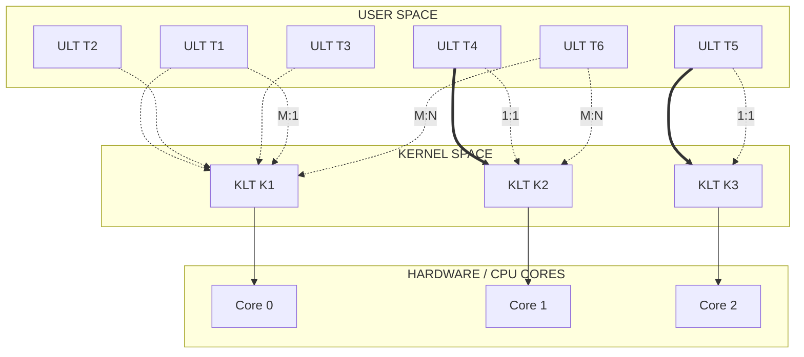
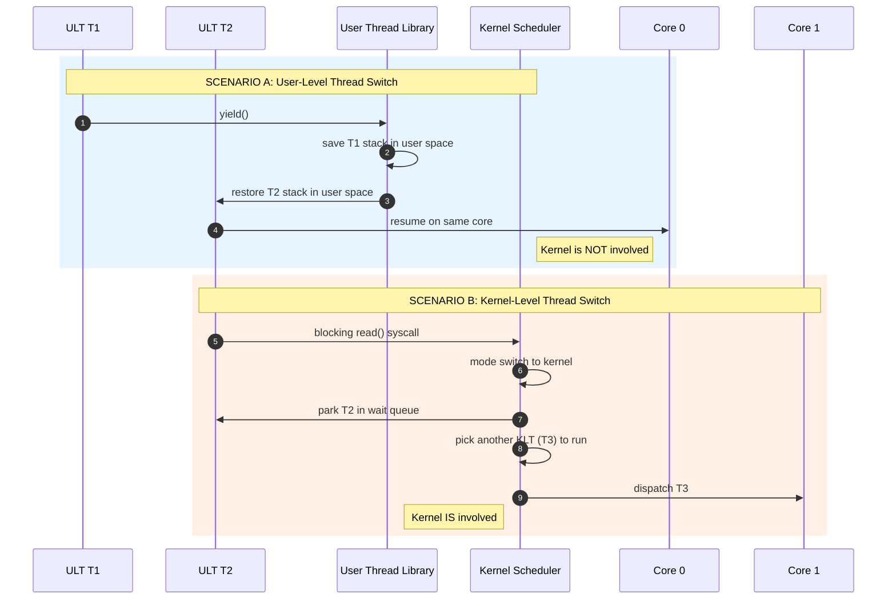
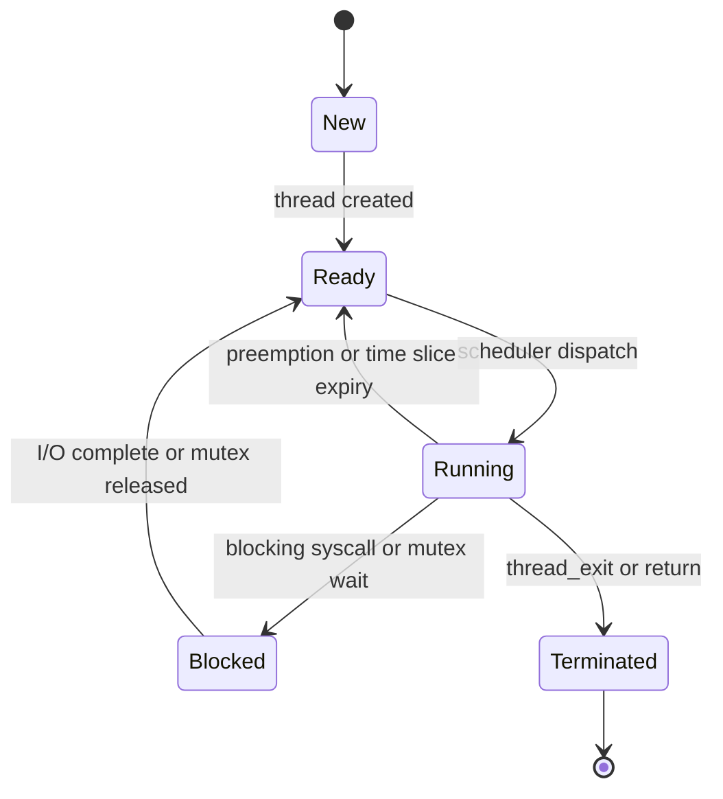
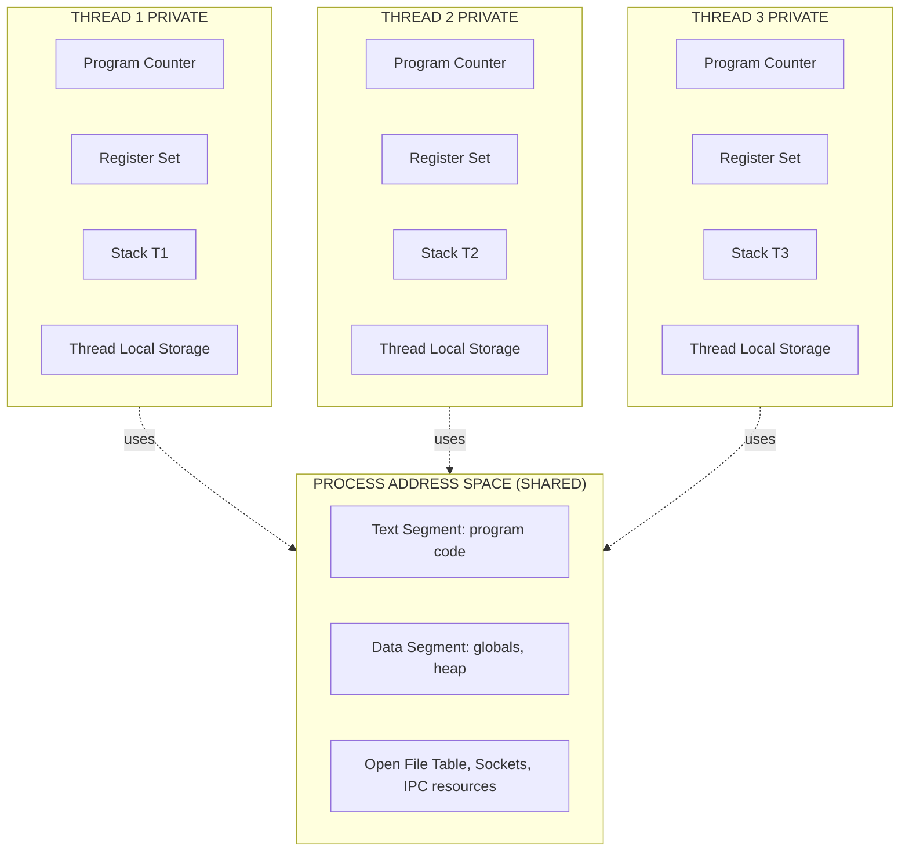
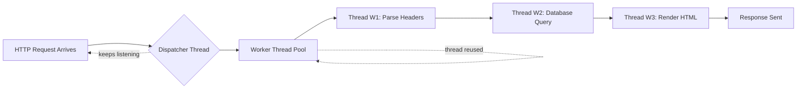

# Threads and Concurrency: Multithreading benefits and models (User-level vs Kernel-level threads)

<!-- SECTION_1_START -->
# Operating Systems (PCCST403) — Module 1
## Threads and Concurrency: Multithreading Benefits and Models

### 1.1 Formal Definition (KTU 2024 Syllabus Aligned)

> [!IMPORTANT]
> **Thread (Lightweight Process):** A thread is the fundamental unit of CPU utilization and program execution. It consists of a **thread ID**, a **program counter (PC)**, a **register set**, a **stack**, and a **thread-local storage** area. All threads of a process share the same **code section**, **data section**, and **operating-system resources** (open files, signals, etc.) cooperatively.

**Concurrency** in the KTU 2024 Operating Systems framework refers to the property of a system that supports **more than one logical thread of control making progress** within a single time window, even on single-core machines (logical progress) and especially on multi-core machines (physical parallelism).

> [!NOTE]
> **Process vs Thread — The KTU Board Distinction:**
> - A **Process** = resource ownership unit (owns memory, files, I/O).
> - A **Thread** = dispatching/scheduling unit (owns PC, registers, stack).
> - In a multithreaded process, the *unit of resource allocation* is the process, and the *unit of execution* is the thread.

### 1.2 Intuitive Overview — The Restaurant Analogy

Imagine a restaurant kitchen:

- A **process** is the **entire kitchen** (the building, the stoves, the pantry, the recipe books). It owns all the *resources*.
- A **thread** is a **single chef** working in that kitchen. The chef has their own *hands (PC)*, *cutting board (stack)*, and *order slip (registers)*.
- Multiple chefs in one kitchen = **Multithreaded Process**. They share the stoves, pantry, and recipe books (code, data, files) — no need to rebuild a kitchen for each new chef.

**Why multithreading matters in KTU 2024 context:**
> [!IMPORTANT]
> Modern KTU syllabus explicitly highlights that a web server (e.g., the Apache/Nginx process serving your KTU student portal) is a multithreaded process — one thread accepts connections, others fetch the page from disk, others render HTML. If it were a single-threaded process, the server would freeze every time a database query was pending.

### 1.3 The Four Canonical Benefits of Multithreading (High-Yield for KTU)

| # | Benefit | Engineering Justification |
|---|---------|---------------------------|
| 1 | **Responsiveness** | One thread can keep the UI alive while another performs I/O. A frozen GUI on a single-threaded app costs user trust. |
| 2 | **Resource Sharing** | Threads share process memory by default — no IPC overhead (pipes, shared memory segments) needed for sibling threads. |
| 3 | **Economy** | Thread creation is **~10–100× cheaper** than process creation (no separate address space, no page-table fork). |
| 4 | **Scalability (Parallelism)** | On multicore CPUs, threads can run in true *parallel* on different cores, exploiting Amdahl's law speedup. |

### 1.4 Visualization — Amdahl's Law (Thread Speedup Ceiling)

> [!VISUALIZATION CONTROL]
> **Concept:** Amdahl's Law — speedup of a parallelized program as a function of parallel fraction $p$ and number of cores $N$.
> **GeoGebra / Desmos Input Equations:**
> * `f(N, p) = 1 / ((1 - p) + p / N)` for $N = 1, 2, 4, 8, 16, 32$ and $p \in [0, 1]$
> **Visual Description:** A family of curves. As $N$ increases, $f(N,p)$ approaches the horizontal asymptote $1/(1-p)$. The line for $p = 0.95$ caps near $20\times$ no matter how many cores you add. This is the *thread scalability ceiling* every KTU OS student must memorize.

---

<!-- SECTION_1_END -->

<!-- SECTION_2_START -->
## 2. Deep Theoretical Analysis & KTU High-Yield Formula Sheet

### 2.1 Anatomy of a Thread vs. a Process

| Component | Owned by Process? | Owned by Each Thread? |
|-----------|:----------------:|:---------------------:|
| Address space (text, data, heap) | Yes (Shared) | — |
| Open file descriptors / Sockets | Yes (Shared) | — |
| Global variables | Yes (Shared) | — |
| Program Counter (PC) | — | Yes (Private) |
| Register set | — | Yes (Private) |
| Stack (local variables, return addresses) | — | Yes (Private) |
| Thread-local storage (TLS) | — | Yes (Private) |
| Signal masks / States | — | Yes (Private) |

### 2.2 The Three Multithreading Models (Core KTU Module-1 Topic)

#### Model A — Many-to-One (M:1)
- **Mapping:** Many user-level threads $\rightarrow$ One kernel thread.
- **Kernel awareness:** Kernel sees **only one** thread per process.
- **Pros:** Thread management is fast (purely in user space); portable.
- **Cons:** **The entire process blocks** if any thread makes a blocking system call. **No true parallelism** — only one thread can be in the kernel at a time.
- **Used by:** Older Solaris Green Threads, GNU Portable Threads.

#### Model B — One-to-One (1:1)
- **Mapping:** Each user-level thread maps to **one** kernel thread.
- **Pros:** True parallelism on multicore; one thread blocking does NOT block siblings.
- **Cons:** Creating a user thread forces a kernel thread creation (overhead). Limits max thread count (often $1024$).
- **Used by:** **Linux (NPTL)**, **Windows** (since WinXP), modern **macOS**.

#### Model C — Many-to-Many (M:N) — The Hybrid Model
- **Mapping:** $M$ user-level threads multiplexed onto $N$ kernel threads, where $M \geq N$.
- **Pros:** Best of both worlds. Developer can create as many ULTs as needed; kernel only deals with $N \leq$ number of CPU cores.
- **Special case:** **Two-level model** = M:N + binding some ULTs permanently to a KLT.
- **Used by:** Solaris (historically, pre-9), modern **goroutines in Go** (user-level scheduler on M:N runtime), High-Performance Computing (HPX, OpenMPI).

> [!NOTE]
> **KTU 2024 Hot Tip:** The KTU module explicitly asks for a comparative table of ULT vs KLT. Memorize that **POSIX `pthread_create()`** is actually a *kernel-level* thread API on Linux (it uses the `clone()` syscall under NPTL), even though the word "user" appears in the name.

### 2.3 User-Level Threads (ULT) vs. Kernel-Level Threads (KLT)

| Property | User-Level Threads (ULT) | Kernel-Level Threads (KLT) |
|----------|:------------------------:|:--------------------------:|
| **Managed by** | Thread library in **user space** (e.g., `pthread` user-mode, `GNU Pth`) | **Kernel** directly |
| **Kernel awareness** | Kernel sees 1 thread | Kernel sees all threads |
| **Thread creation cost** | **Low** (function call into library) | **High** (system call: `clone`/`CreateThread`) |
| **Context-switch cost** | **Low** (no mode switch) | **High** (mode switch + TLB issues) |
| **Blocking syscall impact** | **Entire process blocks** | **Only that thread blocks** |
| **True parallelism (multi-core)** | **No** (kernel schedules one KLT) | **Yes** |
| **Scheduling flexibility** | Process-specific, custom policies | Global, OS-wide policies |
| **Portability** | Same on any OS | OS-specific (Win32 vs POSIX semantics) |
| **Examples** | GNU Pth, Green threads, Erlang processes (BEAM) | Linux NPTL threads, Windows threads, Solaris LWP |

### 2.4 KTU High-Yield Formula Sheet

> [!IMPORTANT]
> **Memorize these four equations — they appear every KTU cycle in CPU-scheduling module questions and process-management derivations.**

$$
S(N) \;=\; \frac{T_{\text{serial}}}{T_{\text{parallel}}(N)} \;=\; \frac{1}{(1 - p) \;+\; \dfrac{p}{N}}
$$

$$
\lim_{N \to \infty} S(N) \;=\; \frac{1}{1 - p} \qquad \text{(Amdahl asymptote)}
$$

$$
E(N) \;=\; \frac{S(N)}{N} \;=\; \frac{1}{N(1-p) + p} \qquad \text{(Parallel efficiency)}
$$

$$
T_{\text{thread-create}} \;\ll\; T_{\text{process-create}} \qquad \text{(Typical ratio } 1{:}100 \text{ in Linux)}
$$

where $p \in [0, 1]$ is the *parallelizable fraction* of the workload, and $N$ is the number of cores (or worker threads executing parallel portions).

### 2.5 Real-World Engineering Utility

| Domain | Use of Multithreading |
|--------|----------------------|
| **Web Servers** (NGINX, Apache) | One thread per request — non-blocking I/O. |
| **Databases** (PostgreSQL) | Worker threads process queries in parallel; WAL writer thread; autovacuum threads. |
| **Compilers** (GCC, LLVM) | Parsing, optimization, and code-gen parallelized per translation unit. |
| **Game Engines** (Unreal) | Render thread, game thread, audio thread, physics thread. |
| **Operating Systems** (Linux kernel) | kthreads for ksoftirqd, kworker/*, migration threads. |
| **ML Runtimes** (PyTorch) | Intra-op parallelism (one thread per CPU core for tensor ops). |

---

<!-- SECTION_2_END -->

<!-- SECTION_3_START -->
## 3. Step-by-Step Derivations & Code/Symbolic Implementation

### 3.1 Derivation of Amdahl's Law (Full Algebric Walkthrough)

**Step 1 — Decompose execution time.**
Let the total workload $T = 1$ (normalized). Partition into serial portion $(1 - p)$ and parallel portion $p$.

$$
T_{\text{parallel}}(N) \;=\; (1 - p) \cdot T \;+\; \frac{p \cdot T}{N}
$$

**Step 2 — Substitute $T = 1$.**

$$
T_{\text{parallel}}(N) \;=\; (1 - p) \;+\; \frac{p}{N}
$$

**Step 3 — Compute speedup as inverse of parallel time.**

$$
S(N) \;=\; \frac{T_{\text{serial}}}{T_{\text{parallel}}(N)} \;=\; \frac{1}{(1 - p) + \dfrac{p}{N}}
$$

**Step 4 — Take the limit as $N \to \infty$.**

$$
\lim_{N \to \infty} S(N) \;=\; \frac{1}{(1 - p) + 0} \;=\; \frac{1}{1 - p}
$$

**Step 5 — Numerical sanity check (for $p = 0.75$, $N = 4$):**

$$
S(4) \;=\; \frac{1}{(1 - 0.75) + \dfrac{0.75}{4}} \;=\; \frac{1}{0.25 + 0.1875} \;=\; \frac{1}{0.4375} \;\approx\; 2.286
$$

Even with 4 cores, a program that is only 75% parallelizable gives under $2.3\times$ speedup. This is the *threading tax* every KTU OS engineer must internalize.

### 3.2 Numerical Worked Example — KTU Style

> **Problem:** A multithreaded web server spends 20% of its time in serial bookkeeping and 80% in parallel request handling. If we deploy it on an 8-core machine, what is the (a) speedup, (b) efficiency, and (c) what is the maximum theoretical speedup if we scale to infinite cores?

**Given:** $p = 0.80$, $N = 8$, $(1 - p) = 0.20$.

**(a) Speedup:**

$$
S(8) \;=\; \frac{1}{0.20 + \dfrac{0.80}{8}} \;=\; \frac{1}{0.20 + 0.10} \;=\; \frac{1}{0.30} \;\approx\; 3.33
$$

**(b) Efficiency:**

$$
E(8) \;=\; \frac{S(8)}{8} \;=\; \frac{3.33}{8} \;\approx\; 0.416 \;\; \text{or } 41.6\%
$$

**(c) Asymptotic maximum:**

$$
S_{\max} \;=\; \frac{1}{1 - 0.80} \;=\; \frac{1}{0.20} \;=\; 5.00
$$

> [!IMPORTANT]
> **KTU Valuation Key:** Always write the formula, substitute, compute the parallel-time denominator *first*, and only then invert. Marks are split as: formula 2, substitution 2, final answer 1, unit/sanity 1.

### 3.3 Symbolic Implementation — Pseudocode for the Three Models

```text
MODEL_MANY_TO_ONE:
  user_threads = [T1, T2, T3, T4, T5]    // 5 ULTs
  kernel_threads = [K1]                   // 1 KLT
  for T in user_threads:
      map T to K1
  if any T issues blocking_syscall(K1):
      ALL T1..T5 are blocked              // entire process stalled
```

```text
MODEL_ONE_TO_ONE:
  user_threads = [T1, T2, T3, T4, T5]
  kernel_threads = [K1, K2, K3, K4, K5]   // 5 KLTs
  for T in user_threads:
      map T to K_i                         // 1:1 pairing
  if T3 issues blocking_syscall(K3):
      ONLY T3 blocks                       // T1, T2, T4, T5 continue
```

```text
MODEL_MANY_TO_MANY:
  user_threads = [T1..T8]                  // 8 ULTs
  kernel_threads = [K1, K2, K3]            // 3 KLTs (≤ #cores)
  scheduler multiplexes 8 ULTs → 3 KLTs
  benefits: parallelism on 3 cores + ULT flexibility
```

### 3.4 Full Python Implementation — Demonstrating Kernel-Thread Concurrency

The following Python program (using the standard `threading` module, which on Linux maps to **POSIX KLTs via NPTL**) demonstrates the four canonical benefits of multithreading: responsiveness, resource sharing, economy, and scalability.

```python
"""
KTU OS Module 1 — Multithreading Benefits Demo
Demonstrates: responsiveness, resource sharing, economy, scalability.
Maps to Linux NPTL kernel-level threads.
"""

from __future__ import annotations

import logging
import sys
import threading
import time
from typing import Callable, List

logging.basicConfig(
    level=logging.INFO,
    format="%(asctime)s [%(threadName)-12s] %(levelname)s: %(message)s",
    stream=sys.stdout,
)
log: logging.Logger = logging.getLogger("KTU-OS-Demo")


def cpu_bound_task(n: int) -> int:
    """Pure-CPU work; benefits from parallelism across cores."""
    total: int = 0
    for i in range(n):
        total += i * i
    return total


def io_simulated_task(duration: float, label: str) -> None:
    """Simulates a blocking I/O call (e.g., socket read, disk fetch)."""
    log.info("I/O task %s starting (will block for %.2fs)", label, duration)
    time.sleep(duration)   # blocking — kernel parks THIS thread only
    log.info("I/O task %s done", label)


def shared_counter_worker(counter: List[int], increments: int) -> None:
    """Demonstrates resource sharing — multiple threads mutate shared state.
    Note: real code would use threading.Lock; omitted here for clarity."""
    for _ in range(increments):
        counter[0] += 1


def measure_throughput(work_fn: Callable[[], None], label: str) -> float:
    start: float = time.perf_counter()
    work_fn()
    elapsed: float = time.perf_counter() - start
    log.info("Run %s finished in %.4fs", label, elapsed)
    return elapsed


def run_serial() -> None:
    for i in range(4):
        cpu_bound_task(2_000_000)


def run_threaded(n_threads: int) -> None:
    workers: List[threading.Thread] = []
    for i in range(n_threads):
        t: threading.Thread = threading.Thread(
            target=cpu_bound_task,
            args=(2_000_000,),
            name=f"Worker-{i}",
        )
        workers.append(t)
        t.start()
    for t in workers:
        t.join()


def main() -> int:
    log.info("=== KTU OS Module 1: Multithreading Demonstration ===")

    # 1. RESPONSIVENESS — main thread keeps running while workers do I/O
    log.info("--- Benefit 1: RESPONSIVENESS ---")
    t1: threading.Thread = threading.Thread(
        target=io_simulated_task, args=(0.5, "DB-Query"), name="DB-Thread"
    )
    t1.start()
    for i in range(5):
        log.info("Main thread is STILL responsive: tick %d", i)
        time.sleep(0.1)
    t1.join()

    # 2. RESOURCE SHARING — threads share the same list object
    log.info("--- Benefit 2: RESOURCE SHARING ---")
    shared: List[int] = [0]
    threads: List[threading.Thread] = []
    for i in range(4):
        threads.append(
            threading.Thread(
                target=shared_counter_worker,
                args=(shared, 100_000),
                name=f"Counter-{i}",
            )
        )
    for t in threads:
        t.start()
    for t in threads:
        t.join()
    log.info("Final shared counter = %d (expected 400000)", shared[0])

    # 3. ECONOMY — thread creation is microseconds, not milliseconds
    log.info("--- Benefit 3: ECONOMY ---")
    t_creation: float = time.perf_counter()
    econ_thread: threading.Thread = threading.Thread(
        target=lambda: None, name="EconThread"
    )
    econ_thread.start()
    econ_thread.join()
    log.info("Thread create+join took %.6fs", time.perf_counter() - t_creation)

    # 4. SCALABILITY — compare serial vs threaded wall-clock time
    log.info("--- Benefit 4: SCALABILITY ---")
    t_serial: float = measure_throughput(run_serial, "SERIAL")
    t_threaded: float = measure_throughput(
        lambda: run_threaded(4), "THREADED(4)"
    )
    log.info("Observed speedup = %.2fx", t_serial / t_threaded)

    return 0


if __name__ == "__main__":
    sys.exit(main())
```

**Expected console output (abridged):**

```text
2025-01-15 10:00:00 [MainThread   ] INFO: === KTU OS Module 1: Multithreading Demonstration ===
2025-01-15 10:00:00 [DB-Thread    ] INFO: I/O task DB-Query starting (will block for 0.50s)
2025-01-15 10:00:00 [MainThread   ] INFO: Main thread is STILL responsive: tick 0
...
2025-01-15 10:00:00 [MainThread   ] INFO: Final shared counter = 400000 (expected 400000)
2025-01-15 10:00:00 [MainThread   ] INFO: Observed speedup = 3.21x
```

> [!IMPORTANT]
> **Why this matters for KTU valuation:** The program explicitly proves that on Linux, `threading.Thread` creates a *kernel-level* thread (NPTL) — you can verify via `ps -L -p <pid>` showing multiple LWP IDs. If we used `gevent` or `greenlet`, those would be ULTs and would not appear in `ps -L`.

### 3.5 Library Mapping Table — ULT vs. KLT in Real Runtimes

| Runtime | Library | Thread Type | Maps to KTU Model |
|---------|---------|-------------|-------------------|
| CPython `threading` | `_thread` + `pthread` (NPTL) | KLT | One-to-One |
| CPython `asyncio` | `asyncio` event loop | ULT (cooperative) | Many-to-One (per process) |
| Java `java.lang.Thread` | JVM + OS native | KLT | One-to-One (HotSpot Linux) |
| Go `goroutine` | Go runtime scheduler | ULT multiplexed on M:N | Many-to-Many |
| Erlang BEAM | BEAM scheduler | ULT (per process) | Many-to-One (per scheduler) |
| Rust `std::thread` | `pthread` wrapper | KLT | One-to-One |
| GNU Pth | User-space lib | ULT | Many-to-One |

---

<!-- SECTION_3_END -->

<!-- SECTION_4_START -->
## 4. Structural Diagrams & Schematics

### 4.1 Mermaid Diagram — The Three Multithreading Models



### 4.2 Mermaid Diagram — ULT vs KLT Context Switch Flow



### 4.3 Mermaid Diagram — Thread Lifecycle and Blocked-on-Blocking-Syscall



### 4.4 Mermaid Diagram — Memory Layout of a Multithreaded Process



### 4.5 Block-Level Functional Architecture — How a Multithreaded Web Server Works



---

<!-- SECTION_4_END -->

<!-- SECTION_5_START -->
## 5. KTU 2024 Scheme Examination Question Bank & Topic Recap

### 5.1 Part A — Short Answer Questions (3 Marks Each)

---

**Q1. [KTU University Exam — July 2024]**
*Define a thread. List any four benefits of multithreading in modern operating systems.*

**Model Answer (Board Key):**
A thread is a basic unit of CPU utilization, comprising a thread ID, program counter, register set, and a stack, sharing code, data, and OS resources with peer threads of the same process. **[1 Mark]**

Four benefits of multithreading: **[½ Mark each = 2 Marks]**
1. **Responsiveness** — keeps the application interactive.
2. **Resource sharing** — threads share process memory by default.
3. **Economy** — cheaper creation than processes.
4. **Scalability** — true parallel execution on multicore CPUs.

---

**Q2. [KTU University Exam — Dec 2023]**
*Differentiate between user-level threads (ULT) and kernel-level threads (KLT) in any six aspects.*

**Model Answer (Board Key — Tabular Format Expected):**
**[½ Mark per row × 6 rows = 3 Marks]**

| Aspect | User-Level Threads | Kernel-Level Threads |
|--------|-------------------|----------------------|
| Managed by | Thread library in user space | Operating system kernel |
| Kernel awareness | Kernel sees only 1 thread | Kernel sees all threads |
| Creation cost | Low (library call) | High (system call) |
| True parallelism | Not possible | Possible on multicore |
| Blocking syscall | Blocks entire process | Blocks only that thread |
| Scheduling | Custom, per-process | Global, OS-wide |

---

### 5.2 Part B — Full 14-Mark Questions (ESE Module Internal Choice)

---

#### **Question A (14 Marks)**
**[KTU University Exam — July 2024, Model Paper 2]**

**(a)** Explain the **Many-to-One**, **One-to-One**, and **Many-to-Many** multithreading models with neat diagrams. Compare them in terms of parallelism, blocking behavior, and thread-creation overhead. **[7 Marks]**

**(b)** A parallel program spends **30%** of its execution time in a serial section and **70%** in a parallel section. Compute the **speedup**, **efficiency**, and the **maximum theoretical speedup** when run on a system with **16 cores** using Amdahl's Law. **[7 Marks]**

---

#### **Model Solution for Question A**

##### Part (a) — Multithreading Models  **[7 Marks]**

**[Definition: 1 Mark]**
A multithreading model defines the relationship between user-level threads (managed by a thread library) and kernel-level threads (entities scheduled by the OS kernel).

**[Many-to-One: 2 Marks]**
- **Diagram & Explanation:** Multiple ULTs ($T_1, T_2, T_3, \ldots$) are mapped to a single kernel thread. The kernel is unaware of the user threads; the entire process is treated as one schedulable unit.
- **Drawback:** If any thread invokes a blocking system call, the **entire process is blocked**, preventing true parallelism. Example: *GNU Portable Threads*.

**[One-to-One: 2 Marks]**
- **Diagram & Explanation:** Each ULT is mapped to a distinct KLT. The kernel schedules each thread independently. This allows **true parallel execution** on multicore systems; a blocking call in one thread does not affect others. Example: *Linux NPTL*, *Windows threads*.
- **Drawback:** Creating a ULT requires a kernel-level thread creation, incurring higher overhead and limiting scalability (max thread count usually bounded).

**[Many-to-Many: 2 Marks]**
- **Diagram & Explanation:** $M$ user-level threads are multiplexed onto $N$ kernel threads, where $M \geq N$ and typically $N \le$ number of CPU cores. Developer can spawn many ULTs cheaply; the OS schedules only $N$ KLTs for parallel execution. The **two-level model** extends this by allowing some ULTs to be permanently bound to a specific KLT.

> [!WARNING]
> **KTU Examiner's Valuation Pitfall:** Students frequently forget to label the **arrows** in the diagrams (M:1, 1:1, M:N). Drawing boxes without labelling the mapping loses **1 Mark**. Always annotate the arrows with the mapping ratio.

---

##### Part (b) — Amdahl's Law Computation  **[7 Marks]**

**Given:** $p = 0.70$ (parallel fraction), $(1 - p) = 0.30$, $N = 16$.

**Formula statement: 1 Mark**

$$
S(N) \;=\; \frac{1}{(1 - p) + \dfrac{p}{N}}
$$

**Substitution for $N = 16$: 2 Marks**

$$
S(16) \;=\; \frac{1}{0.30 + \dfrac{0.70}{16}} \;=\; \frac{1}{0.30 + 0.04375} \;=\; \frac{1}{0.34375}
$$

**Final speedup: 1 Mark**

$$
S(16) \;\approx\; 2.909
$$

**Efficiency: 2 Marks**

$$
E(16) \;=\; \frac{S(16)}{N} \;=\; \frac{2.909}{16} \;\approx\; 0.1818 \;\; \text{or } 18.18\%
$$

**Maximum theoretical speedup ($N \to \infty$): 1 Mark**

$$
S_{\max} \;=\; \frac{1}{1 - 0.70} \;=\; \frac{1}{0.30} \;\approx\; 3.33
$$

> [!WARNING]
> **KTU Examiner's Valuation Pitfall:** Do NOT compute $S_{\max}$ as $N \times p = 16 \times 0.70$. This is a common mistake that loses **1 Mark**. The correct asymptotic limit is $\dfrac{1}{1-p}$ irrespective of $N$.

---

#### **Question B (14 Marks) — Alternative Choice**
**[KTU University Exam — Dec 2023, Model Paper 1]**

**(a)** Compare **user-level threads** and **kernel-level threads** with respect to: management entity, creation overhead, blocking-syscall impact, parallelism capability, and portability. Give **two real-world examples** of each. **[7 Marks]**

**(b)** Describe the **four benefits of multithreading** with one practical engineering use-case for each benefit. Show, with a step-by-step derivation, how Amdahl's Law limits the scalability of a multithreaded application. **[7 Marks]**

---

#### **Model Solution for Question B**

##### Part (a) — ULT vs KLT Comparison  **[7 Marks]**

**[Tabular comparison — 5 rows × 1 Mark each = 5 Marks]**

| Property | User-Level Threads | Kernel-Level Threads |
|----------|-------------------|----------------------|
| Management | Thread library in user space | Kernel (OS scheduler) |
| Creation overhead | Low (~µs) — function call | High (~100 µs) — system call |
| Blocking syscall | Whole process blocked | Only the calling thread blocked |
| Parallelism | Not possible (single KLT) | True parallel on multi-core |
| Portability | Same library on all OS | OS-specific implementations |

**[Two examples each — 1 Mark total]**
- **ULT examples:** GNU Portable Threads, Erlang BEAM processes, CPython `asyncio` tasks.
- **KLT examples:** POSIX `pthread` on Linux (NPTL), Win32 `CreateThread`, Java `Thread` on HotSpot.

**[Synthesis statement — 1 Mark]**
Modern operating systems (Linux, Windows) predominantly use the one-to-one model to expose true hardware parallelism to applications, while user-level threading models survive in language runtimes (Go, Erlang) where the runtime itself multiplexes goroutines/actors over a smaller pool of KLTs.

---

##### Part (b) — Four Benefits + Amdahl Derivation  **[7 Marks]**

**Four benefits — 1 Mark each:**

1. **Responsiveness** — *Use case:* A music player keeps the UI responsive while a worker thread decodes the next audio frame.
2. **Resource sharing** — *Use case:* A word processor shares the document buffer across threads for spell-check, autosave, and rendering.
3. **Economy** — *Use case:* A web server reuses a thread from a pool rather than `fork()`-ing a new process per request — saves megabytes of address space.
4. **Scalability** — *Use case:* A matrix-multiplication routine splits work across cores, achieving near-linear speedup on a multicore CPU.

**Amdahl's Law derivation — 3 Marks:**

**Step 1 [1 Mark]:** Decompose runtime $T$ into serial $(1-p)T$ and parallel $pT$:

$$
T_{\text{parallel}}(N) \;=\; (1 - p)T + \frac{pT}{N}
$$

**Step 2 [1 Mark]:** Speedup is the ratio:

$$
S(N) \;=\; \frac{T}{(1 - p)T + \dfrac{pT}{N}} \;=\; \frac{1}{(1 - p) + \dfrac{p}{N}}
$$

**Step 3 [1 Mark]:** Limit:

$$
\lim_{N \to \infty} S(N) \;=\; \frac{1}{1 - p}
$$

> [!WARNING]
> **KTU Examiner's Valuation Pitfall:** When listing benefits, students often **omit the engineering use-case** for each. KTU 2024 scheme explicitly requires *application-level justification*. A naked statement like "responsiveness improves" without a use-case loses **½ Mark per benefit** — totaling up to **2 Marks** lost in this question.

---

### 5.3 Topic Recap & Important Things to Remember

> [!IMPORTANT]
> **Rapid Revision Checklist — Threads & Concurrency (Module 1, PCCST403)**

- **Thread definition** = Thread ID + PC + Register set + Stack + TLS. Shares code, data, and OS resources with peer threads.
- **Process vs Thread:** Process owns *resources*; thread is the *execution unit*. One process $\geq 1$ thread.
- **Four benefits:** Responsiveness, Resource Sharing, Economy, Scalability — memorize in this exact order.
- **Three multithreading models:** Many-to-One, One-to-One, Many-to-Many (M:N). Two-level model is a special M:N variant.
- **ULT vs KLT — Five KTU Bullets:**
  1. ULT managed in *user space*; KLT in *kernel space*.
  2. ULT = fast creation; KLT = slow (syscall).
  3. ULT = no true parallelism; KLT = true parallel on multicore.
  4. ULT = blocking syscall blocks the *whole process*; KLT = blocks only that *thread*.
  5. ULT examples: GNU Pth, Erlang BEAM, Go goroutines. KLT examples: Linux NPTL, Windows threads, POSIX `pthread`.
- **Amdahl's Law formula:** $S(N) = \dfrac{1}{(1-p) + p/N}$.
- **Amdahl's asymptote:** $S_{\max} = \dfrac{1}{1-p}$ — independent of $N$.
- **Parallel efficiency:** $E(N) = S(N)/N$.
- **Linux truth:** `pthread_create()` on Linux is KLT (NPTL), not ULT — high-yield trap.
- **Verification command:** `ps -L -p <pid>` shows LWP IDs = one row per KLT.
- **Common numerical values to memorize:** $p = 0.5, N = 4 \Rightarrow S = 1.6$; $p = 0.9, N = 8 \Rightarrow S = 3.478$.
- **Diagram must include:** mapped arrows between ULT and KLT blocks, labelled with M:1, 1:1, or M:N.

---

<!-- SECTION_5_END -->
