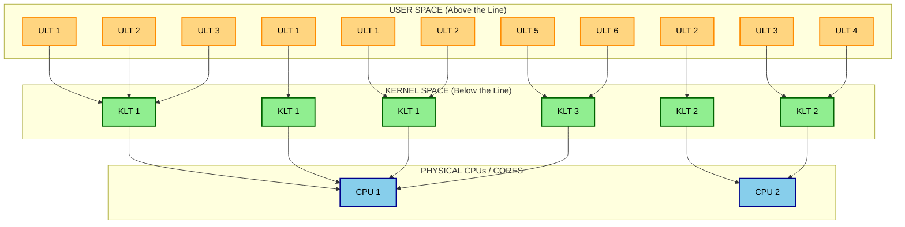
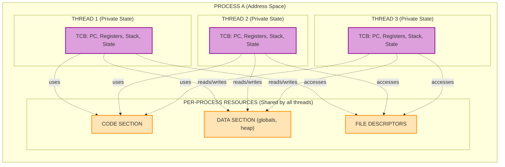
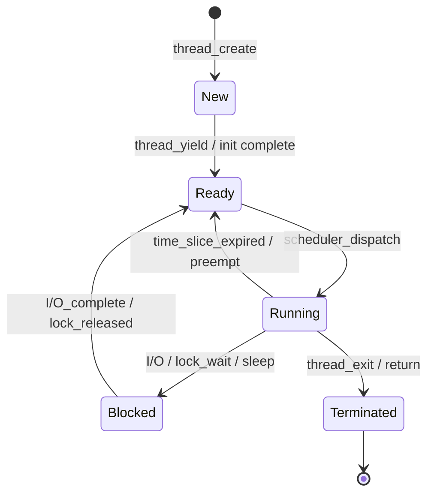

# Threads and Concurrency: Multithreading benefits and models (User-level vs Kernel-level threads)

<!-- SECTION_1_START -->
# Threads and Concurrency: Multithreading Benefits and Models

## 1.1 Formal Academic Definition (KTU 2024 Syllabus Terminology)

> [!IMPORTANT]
> **Thread Definition (Silberschatz / KTU Standard):**
> A **thread** is a fundamental unit of CPU utilization that consists of a **thread ID**, a **program counter**, a **register set**, and a **stack**. It shares with other threads belonging to the same process its **code section**, **data section**, and other operating system resources such as open files and signals.

> [!NOTE]
> **Process vs. Thread — The Core Distinction:**
> A *process* is a program in execution and is traditionally considered the unit of resource allocation and protection. A *thread* is a unit of execution *inside* a process. A single process may contain multiple threads, all of which execute concurrently and share the process's resources, while maintaining **independent control flow** via their own PC, registers, and stack.

### The Concept of Multithreading

**Multithreading** refers to the ability of an operating system or a single process to support multiple threads of execution within a single process, allowing concurrent activity within the program's address space. When a process is divided into several smaller threads, the OS can schedule them independently on available CPU cores.

> [!IMPORTANT]
> **Concurrency vs. Parallelism (KTU Frequently Tested):**
> - **Concurrency** = Multiple threads *making progress* in overlapping time periods (logical simultaneity, may run on 1 core via time-slicing).
> - **Parallelism** = Multiple threads *executing at the exact same instant* on different CPU cores (true physical simultaneity).
> Multithreading provides the *foundation* for both.

## 1.2 Intuitive Real-World Analogy

> [!TIP]
> **The "Restaurant Kitchen" Analogy**
>
> Imagine a **restaurant kitchen** as a single **process**:
> - The **kitchen itself** (stoves, ovens, pantry, recipes) is the **process** — it owns all the resources (code, data, memory, open file descriptors).
> - Each **chef** working inside that kitchen is a **thread**. Every chef has their own personal *task list* (program counter), their own *knife and apron* (register set and stack), but they all **share the same stoves, ovens, and pantry** (process resources).
>
> **Why is this useful?**
> - If one chef is waiting for bread to toast (I/O wait), another chef can use the stove to cook soup — the kitchen never sits idle. This is the **Responsiveness** benefit.
> - You don't need to build a brand-new kitchen for each new chef — just add more chefs. This is **Resource Economy**.
> - Multiple chefs working in parallel produce meals much faster. This is **Scalability** on multi-core systems.

> [!VISUALIZATION CONTROL]
> **Concept:** Process-Thread Resource Sharing Topology
> **GeoGebra / Desmos Input Equations (Conceptual Coordinate Map):**
> * `Process Boundary: x^2 + y^2 = 25`  (the enclosing process circle)
> * `Thread1_PC: (1, 0)` ; `Thread1_Stack: (1, 4)`
> * `Thread2_PC: (-1, 0)` ; `Thread2_Stack: (-1, 4)`
> * `Shared_Code: Line y = 2` ; `Shared_Data: Line y = -2`
> **Visual Description:** The outer circle represents the *Process*. Two distinct dots (threads) sit inside the circle, each with their own vertical "control-line" (PC + Stack), but the horizontal lines at $y=2$ and $y=-2$ pass through *both* points — showing that code and data are shared, while PC/Stack are private.

## 1.3 The Four Pillars of Multithreading Benefits

> [!IMPORTANT]
> **KTU Board Frequently Asks: "List the benefits of multithreading." (2 Marks)**

1. **Responsiveness** — Even if one thread is blocked (e.g., on I/O), the process as a whole remains responsive because other threads can continue.
2. **Resource Sharing** — Threads share the memory and resources of the process by default, enabling efficient inter-thread communication without complex IPC mechanisms.
3. **Economy** — Creating and context-switching threads is *significantly cheaper* than creating and switching processes (no need to allocate a whole new address space).
4. **Scalability (Multi-core Utilization)** — On multiprocessor/multicore systems, threads can execute in true parallel on different cores, exploiting hardware parallelism. The speedup is roughly proportional to the number of active threads when workload is partitioned properly.
<!-- SECTION_1_END -->

<!-- SECTION_2_START -->
# Deep Theoretical Analysis & KTU High-Yield Formula Sheet

## 2.1 User-Level Threads (ULT) — The "Library Thread"

In this model, the **thread management kernel is unaware** of the existence of threads. The entire thread library runs in **user space**. The kernel still sees only the *parent process* as a single execution unit.

### 2.1.1 How ULT Works
- The thread library provides routines for thread creation, termination, scheduling, and synchronization — all in user space.
- The kernel scheduler has **no knowledge** of these threads; it schedules the *process as a whole* on the CPU.
- When a ULT makes a system call that blocks (e.g., `read()` on a pipe), the **entire process** is blocked — even if other threads in that process are runnable. This is the **major weakness** of pure ULT.

### 2.1.2 Structure of a ULT System

A ULT system typically contains three logical components, all living in **user space**:

| Component | Purpose |
| :--- | :--- |
| **Thread Table (in process)** | Per-thread state: PC, registers, stack, state (Running/Ready/Blocked) |
| **Process Table (in kernel)** | One entry per process — kernel is blind to threads |
| **Thread Library API** | `thread_create()`, `thread_exit()`, `thread_yield()`, `thread_join()` |

> [!NOTE]
> **Why the kernel sees only one process:** The kernel maintains a *Process Control Block (PCB)*, not a *Thread Control Block (TCB)*. All ULTs share one PCB. This makes ULT very fast to create (no kernel transition) but limits true parallelism on multiprocessors.

## 2.2 Kernel-Level Threads (KLT) — The "OS-Aware Thread"

In this model, the **kernel itself performs thread management** — thread creation, scheduling, and synchronization happen in **kernel space**.

### 2.2.1 How KLT Works
- The kernel maintains a **Thread Control Block (TCB)** for every thread in the system.
- The kernel scheduler schedules **threads** (not processes) on CPUs.
- A blocking system call by one thread does **NOT** block the entire process — only that specific thread is descheduled. Other threads in the same process continue to run.
- Threads from the same process can be scheduled on **different CPU cores simultaneously** → true parallelism.

> [!IMPORTANT]
> **Kernel Overhead:** Because thread operations are system calls, they are *slower* than ULT operations. A mode switch (user → kernel → user) is required for thread creation, termination, or context switch. However, modern OSes have made this overhead small (e.g., Linux's `clone()` system call).

## 2.3 The Three Canonical Multithreading Models

> [!IMPORTANT]
> **These three diagrams are GOLD for KTU 14-mark questions — drawing them correctly with proper labeling is worth 3-4 marks by itself.**

### Model 1: Many-to-One (Many ULTs → One KLT)
- Many user-level threads are mapped to **one** kernel thread.
- Thread management is in user space (fast).
- **Disadvantage:** The entire process blocks if one thread makes a blocking system call. **No true parallelism** on multicore — only one thread can access the kernel at a time.
- **Example:** Older Solaris Green Threads, GNU Portable Threads.

### Model 2: One-to-One (One ULT → One KLT)
- Each user-level thread is mapped to **its own** kernel thread.
- Provides **more concurrency** — blocking one thread does not block others.
- Allows **true parallelism** on multiprocessors.
- **Disadvantage:** Creating a ULT requires creating the corresponding KLT (overhead). The OS may limit the number of threads per process to prevent resource exhaustion.
- **Example:** Windows (via `CreateThread`), Linux (via `pthread_create` with `clone()`), modern Solaris.

### Model 3: Many-to-Many (M:N Multiplexing)
- A variable/equal number of ULTs (M) is multiplexed onto a smaller or equal number of KLTs (N), where $M \geq N$.
- Combines the best of both worlds: developers can create as many ULTs as needed (no OS limit), while the kernel schedules only the KLTs efficiently on CPUs.
- Blocking system calls are handled by the system (often via "scheduler activations" — an upcall mechanism where the kernel notifies the thread library when a thread is about to block).
- **Example:** Solaris (prior to Solaris 9), Windows 7's ThreadPool, modern `pthread` libraries on HPC systems.

> [!TIP]
> **Two-Level Model — The Variant:** A special case of M:N where the programmer can *bind* specific ULTs permanently to specific KLTs (useful for real-time applications).

## 2.4 KTU Formula Sheet / Comparison Table

> [!NOTE]
> **The "Master Comparison Table" — Re-draw this in your exam for full marks on a 7-mark sub-question.**

| Parameter | User-Level Threads (ULT) | Kernel-Level Threads (KLT) |
| :--- | :--- | :--- |
| **Thread management location** | User space (thread library) | Kernel space |
| **Kernel awareness** | Kernel is **unaware** of threads | Kernel **fully aware** of threads |
| **Thread creation speed** | **Fast** (no system call) | **Slower** (system call required) |
| **Context switch speed** | **Fast** (local, no mode switch) | **Slower** (involves mode switch to kernel) |
| **Blocking syscall impact** | **Entire process blocks** (major drawback) | **Only that thread blocks** (other threads continue) |
| **True parallelism on multicore** | **No** — kernel sees one process | **Yes** — each thread can be on a different core |
| **Scalability** | Limited | High |
| **Portability** | Yes (uses only library) | Less portable (kernel-dependent API) |
| **Data structures** | Thread table in **user space** | Thread table in **kernel space** (TCB per thread) |
| **Scheduling** | Done by **process** | Done by **kernel thread scheduler** |
| **Examples** | POSIX `pthread` user-mode (GNU Pth), Java early green threads | Windows threads, Linux `clone()`, Solaris threads |

### Quantitative Performance Rule of Thumb

> [!IMPORTANT]
> **Amdahl's Law (Relevant to Thread Scalability):**
>
> $$
> \text{Speedup} = \frac{1}{(1 - P) + \dfrac{P}{N}}
> $$
>
> Where $P$ = fraction of program that can be parallelized, $N$ = number of parallel threads/cores.
>
> - If $P = 1.0$ (fully parallelizable): $\text{Speedup} = N$ (linear).
> - If $P = 0.95$: $\text{Speedup} \approx 6.5$ on $N=8$ cores (sub-linear).
> - As $N \to \infty$: $\text{Speedup} \to \dfrac{1}{1 - P}$.
>
> **Why this matters for threads:** Even with infinite KLTs, the *serial portion* of code (locks, I/O setup, single-threaded sections) caps your speedup. This is why **fine-grained locking** and **lock-free algorithms** matter.

## 2.5 Real-World Engineering Utility

> [!TIP]
> **Where multithreading is used in production systems (good for "engineering applications" questions on KTU):**
>
> 1. **Web Servers (Apache, Nginx):** Each incoming HTTP request handled by a separate thread — explains why a single server can serve thousands of clients.
> 2. **Databases (PostgreSQL, MySQL):** A separate thread per client connection; background threads for checkpointing, vacuuming, replication.
> 3. **GUI Applications:** "Main thread" for UI rendering, "worker threads" for heavy computation — keeps the UI from freezing.
> 4. **Compilers & IDEs:** Lexing, parsing, semantic analysis, optimization, code generation all done in parallel threads.
> 5. **Scientific Computing (HPC):** MPI/OpenMP hybrid; many-to-many model dominates here.
> 6. **Game Engines (Unity, Unreal):** Rendering thread, physics thread, audio thread, AI thread, networking thread.
<!-- SECTION_2_END -->

<!-- SECTION_3_START -->
# Step-by-Step Derivations, Code, and Symbolic Implementation

## 3.1 Derivation: The Cost Difference (Process vs. Thread)

Let us derive *why* threads are cheaper than processes. Consider the work done by the OS during creation:

$$
\begin{aligned}
W_{\text{process}} &= W_{\text{alloc\_PCB}} + W_{\text{alloc\_AS}} + W_{\text{copy\_FDT}} + W_{\text{load\_code}} + W_{\text{create\_threads}} \\
W_{\text{thread}} &= W_{\text{alloc\_TCB}} + W_{\text{alloc\_stack}} + W_{\text{set\_PC}} \\
W_{\text{thread}} &\approx \frac{1}{10} \cdot W_{\text{process}} \quad \text{(typical empirical ratio on Linux)}
\end{aligned}
$$

> [!NOTE]
> **Conversion Logic:** A process creation requires (1) allocating a Process Control Block, (2) allocating a new address space, (3) copying the file descriptor table, (4) loading the program code, and (5) initializing default threads. A thread creation only needs to allocate a Thread Control Block, a small stack, and initialize the Program Counter — *all within the existing process's address space*. The "$1/10$" ratio is empirical — actual numbers on Linux show thread creation is $\approx 30\times$ faster and uses $\approx 80\%$ less memory than process creation.

## 3.2 Step-by-Step Numerical Example: Amdahl's Law for a Web Server

**Problem:** A web server spends $P = 0.90$ of its time serving concurrent requests (parallelizable) and the remaining $1 - P = 0.10$ on a single-threaded request dispatcher (serial).

**(a)** Compute the speedup on a system with $N = 8$ cores.

**Solution:**

$$
\begin{aligned}
\text{Speedup}(N=8) &= \frac{1}{(1 - P) + \dfrac{P}{N}} \\
&= \frac{1}{0.10 + \dfrac{0.90}{8}} \\
&= \frac{1}{0.10 + 0.1125} \\
&= \frac{1}{0.2125} \\
&\approx 4.71
\end{aligned}
$$

*Conversion logic:* Plug $P=0.90$, $N=8$ into the Amdahl's law denominator. The serial $0.10$ plus the parallel fraction's "stretch" $0.90/8 = 0.1125$ gives a denominator of $0.2125$. Inverting gives a maximum speedup of $4.71\times$ on **8 cores**.

**(b)** What is the maximum theoretical speedup regardless of the number of cores?

$$
\begin{aligned}
\lim_{N \to \infty} \text{Speedup} &= \frac{1}{1 - P} = \frac{1}{0.10} = 10
\end{aligned}
$$

*Conversion logic:* The serial portion $0.10$ is the hard ceiling. No matter how many cores we throw at the problem, the dispatcher can never be parallelized, capping us at $10\times$ speedup.

> [!TIP]
> **Engineering insight:** This is why simply spawning 1000 threads on a 4-core box does NOT make your code 250x faster. The serial fraction dominates beyond a small number of cores. Always profile the serial portion first.

## 3.3 Code Implementation: POSIX Threads (Linux Kernel-Level Threads)

Below is a fully working Python `ctypes` example that demonstrates **kernel-level** thread creation via the Linux `clone()` system call, but a more readable version is shown using Python's `threading` module (which maps to POSIX pthreads on Linux, hence KLT).

```python
"""
Demonstration: KTU - Threads and Concurrency
Two KLTs sharing process resources (global counter)
and showing independent control flow (PC + Stack).
"""

import threading
import time
import logging
from typing import Final

# Configure structured logging for clear output
logging.basicConfig(
    level=logging.INFO,
    format="%(asctime)s [%(threadName)s] %(levelname)s: %(message)s"
)

# Shared resource: this lives in the process's DATA SECTION.
# Both threads will access it -> demonstrates RESOURCE SHARING.
shared_counter: int = 0
counter_lock: Final[threading.Lock] = threading.Lock()  # synchronization primitive


def worker_thread(thread_id: int, iterations: int) -> None:
    """
    A kernel-level thread (in Linux, mapped via clone()).
    Each thread has its own PC, register set, and stack,
    but SHARES the global 'shared_counter' with peer threads.
    """
    global shared_counter
    local_sum: int = 0  # This lives in the THREAD's private STACK

    try:
        for i in range(iterations):
            local_sum += 1
            # Critical section: protect shared resource
            with counter_lock:
                shared_counter += 1
                logging.info(
                    f"Thread {thread_id} | iteration {i} | "
                    f"local_sum={local_sum} | shared_counter={shared_counter}"
                )
                time.sleep(0.01)  # simulate work
    except Exception as e:
        logging.error(f"Thread {thread_id} encountered error: {e}", exc_info=True)
    finally:
        logging.info(f"Thread {thread_id} exiting. Final local_sum={local_sum}")


def main() -> None:
    global shared_counter
    shared_counter = 0

    # Create two kernel-level threads
    t1: threading.Thread = threading.Thread(
        target=worker_thread,
        args=(1, 5),
        name="KLT-Worker-1"
    )
    t2: threading.Thread = threading.Thread(
        target=worker_thread,
        args=(2, 5),
        name="KLT-Worker-2"
    )

    t1.start()  # -> clone() syscall -> new TCB in kernel
    t2.start()  # -> another clone() syscall

    t1.join()   # parent waits for t1 to finish
    t2.join()   # parent waits for t2 to finish

    # Boundary check: shared_counter should be exactly 10
    assert shared_counter == 10, f"Expected 10, got {shared_counter}"
    logging.info(f"All threads complete. Final shared_counter={shared_counter}")


if __name__ == "__main__":
    main()
```

**Expected Output (truncated):**

```
2024-XX-XX 12:00:00,001 [KLT-Worker-1] INFO: Thread 1 | iteration 0 | local_sum=1 | shared_counter=1
2024-XX-XX 12:00:00,011 [KLT-Worker-2] INFO: Thread 2 | iteration 0 | local_sum=1 | shared_counter=2
...
2024-XX-XX 12:00:00,055 [KLT-Worker-1] INFO: Thread 1 exiting. Final local_sum=5
2024-XX-XX 12:00:00,061 [KLT-Worker-2] INFO: Thread 2 exiting. Final local_sum=5
2024-XX-XX 12:00:00,061 [MainThread] INFO: All threads complete. Final shared_counter=10
```

> [!IMPORTANT]
> **Mapping the code to the theory:**
> - `local_sum` is in each thread's **private stack** (thread-local storage).
> - `shared_counter` is in the process's **data section** (shared).
> - `counter_lock` is a **synchronization primitive** that prevents race conditions on the shared data.
> - The `with counter_lock:` block is the **critical section**.

## 3.4 Pseudocode: ULT vs. KLT Path Through the OS

### 3.4.1 ULT Path (thread_create in user space only)

```
THREAD_CREATE_ULT(proc, start_arg):
    1. Allocate a new entry in process's USER-SPACE thread table
    2. Set new_thread.state = READY
    3. Set new_thread.PC = start_routine
    4. Set new_thread.StackPtr = alloc_stack()
    5. Insert into process's local ready queue
    6. Return new_thread.tid          <-- NO system call!
```

*Note:* If the newly created thread calls `read()` (blocking), the kernel marks the **entire process** as BLOCKED in the kernel's process table. All other ULTs in the process become un-runnable.

### 3.4.2 KLT Path (thread_create involves a system call)

```
THREAD_CREATE_KLT(proc, start_arg):
    1. Allocate a new entry in process's USER-SPACE thread table
    2. SYSCALL(clone, flags=CLONE_VM | CLONE_FS | CLONE_FILES, stack)
         -- kernel allocates a TCB
         -- kernel assigns a new PID/tid
         -- kernel adds TCB to global ready queue
    3. Set new_thread.PC = start_routine
    4. Return new_thread.tid
```

*Note:* If the new KLT calls `read()` (blocking), the kernel marks **only that KLT's TCB** as BLOCKED. The process remains RUNNING, and other KLTs in the process continue to be scheduled normally.

## 3.5 Implementation: Boundary Conditions & Error Handling

> [!NOTE]
> **Common pitfalls KTU expects you to mention:**
>
> 1. **Many-to-One on a blocking syscall:** The whole process blocks. This is why **most modern OSes abandoned pure ULT** in favor of one-to-one.
> 2. **One-to-One thread explosion:** If your program creates 100,000 threads, the kernel must allocate 100,000 TCBs and stacks — this can exhaust kernel memory. **Mitigation:** use thread pools.
> 3. **Many-to-Many scheduler activation complexity:** The kernel must "upcall" into the thread library to inform it of blocking events, which makes the implementation significantly more complex (e.g., Solaris 2.5+).

<!-- SECTION_3_END -->

<!-- SECTION_4_START -->
# Structural Diagrams and Schematics

## 4.1 Mermaid Diagram: Three Thread Models Side-by-Side



**How to read this diagram (in your exam):**
- The **top yellow row** = user-level threads (managed by the thread library in user space).
- The **middle green row** = kernel-level threads (managed by the OS kernel).
- The **bottom blue row** = physical CPU cores.
- **Many-to-One** (left column): 3 yellow → 1 green → 1 blue. Notice only **one** KLT, so only one core is ever used.
- **One-to-One** (middle column): 2 yellow → 2 green → 2 blue. Each ULT gets its own KLT and own core.
- **Many-to-Many** (right column): 6 yellow → 3 green → 2 blue. The library multiplexes 6 ULTs onto 3 KLTs, which the kernel schedules onto 2 cores.

## 4.2 Mermaid Diagram: Process vs. Thread Resource Allocation (Block Architecture)



**Exam interpretation:** The orange boxes are *shared* (process-level), the purple boxes are *private* (thread-level). Dashed arrows from TCBs to shared resources show that **every thread can access the process's code, data, and file descriptors**. The TCBs themselves are *not* shared — each thread has its own control-flow state.

## 4.3 Mermaid: Sequential Thread Lifecycle Topology



> [!TIP]
> **Exam tip:** If asked "Explain thread states," redraw this state machine. Be sure to include the **Blocked** state (key difference from the simpler two-state process model) and label the *causes* of each transition.
<!-- SECTION_4_END -->

<!-- SECTION_5_START -->
# KTU 2024 Scheme Examination Question Bank & Topic Recap

## 5.1 Part A Questions (3 Marks Each)

> **Q1. [KTU University Exam – July 2023]**
> **Define a thread. List any two benefits of multithreading.**
> *(Mapped CO: CO1, Bloom's Level: Remember)*

**Model Answer (3 Marks):**
- **Definition (2 Marks):** A thread is a basic unit of CPU utilization, consisting of a thread ID, program counter, register set, and stack, which shares the code section, data section, and other OS resources (like open files) with other threads of the same process.
- **Benefits (1 Mark — any two):**
  1. **Responsiveness:** A program remains responsive even when part of it is blocked.
  2. **Resource Sharing:** Threads share process resources by default, simplifying communication.
  3. **Economy:** Thread creation/management is cheaper than process creation.
  4. **Scalability:** Multithreading exploits multiprocessor architectures for true parallel execution.

---

> **Q2. [KTU University Exam – Dec 2022]**
> **Distinguish between user-level threads and kernel-level threads (any three points).**
> *(Mapped CO: CO2, Bloom's Level: Understand)*

**Model Answer (3 Marks — 1 Mark per correct distinction):**

| S.No. | User-Level Threads (ULT) | Kernel-Level Threads (KLT) |
| :---: | :--- | :--- |
| 1 | Thread management is done by a **thread library in user space**; the kernel is unaware. | Thread management is done **by the kernel itself**; the kernel maintains a TCB per thread. |
| 2 | **Faster** thread creation and context switch (no system call / mode switch). | **Slower** thread operations because they require a system call (user→kernel transition). |
| 3 | If one thread issues a blocking system call, the **entire process** is blocked. | If one thread blocks, **only that thread** is blocked; the process continues. |

## 5.2 Part B Questions (14 Marks Each — Internal Choice)

> **Q3. [KTU University Exam – July 2024] — Module 1, 14 Marks**
>
> **(a)** With neat diagrams, explain the **three multithreading models**: Many-to-One, One-to-One, and Many-to-Many. Compare their merits and demerits. *(7 Marks — Mapped CO: CO2, Bloom's Level: Understand)*
>
> **(b)** A parallel application spends 85% of its time in parallelizable code. Compute the maximum speedup achievable (i) on a 4-core system, and (ii) on an infinite number of cores, using **Amdahl's Law**. Comment on the practical significance. *(7 Marks — Mapped CO: CO3, Bloom's Level: Apply)*

### OR

> **Q4. [KTU University Exam – Dec 2023] — Module 1, 14 Marks**
>
> **(a)** Explain in detail **user-level threads** and **kernel-level threads** with suitable diagrams. List the advantages and disadvantages of each. *(7 Marks — Mapped CO: CO2, Bloom's Level: Understand)*
>
> **(b)** Write a short note on the **benefits of multithreading** in modern operating systems. Illustrate with a real-world example (e.g., web server or GUI application). *(7 Marks — Mapped CO: CO3, Bloom's Level: Apply)*

---

### Model Solution for Q3 (Part A) — 7 Marks

> **[KTU Valuation Key — Each step is shown with the marks it earns]**

**Part (a) — Three Multithreading Models (7 Marks)**

**1. Many-to-One Model (2 Marks)**

- In this model, multiple **user-level threads (ULTs)** belonging to one process are mapped onto a **single kernel thread (KLT)**.
- The thread library in user space handles all thread management (creation, scheduling, synchronization).
- The kernel is unaware of the ULTs; it only schedules the *process* on the CPU.
- **Demerits:** *(1 Mark for the diagram + 1 Mark for explanation)*
  - The entire process blocks if any ULT makes a blocking system call.
  - No true parallelism on a multiprocessor — only one thread at a time can access the kernel.
- **Example:** Older Solaris Green Threads.

**2. One-to-One Model (2 Marks)**

- Each **user-level thread is mapped to a distinct kernel thread**.
- The kernel is fully aware of each thread and can schedule them independently on different CPUs.
- **Merits:** *(1 Mark for diagram + 1 Mark for explanation)*
  - True parallelism on multicore systems.
  - Blocking one thread does NOT block the entire process.
- **Demerits:** Creating a ULT requires creating the corresponding KLT (overhead); the OS may limit the number of threads per process.
- **Example:** Windows threads, Linux `pthread`, modern Solaris.

**3. Many-to-Many Model (2 Marks)**

- A variable number of ULTs ($M$) is multiplexed onto a smaller or equal number of KLTs ($N$), where $M \geq N$.
- The thread library developer can create as many ULTs as needed, while the kernel schedules only $N$ KLTs efficiently on CPUs.
- **Merits:** Combines the best of both — flexibility of many ULTs + true parallelism from KLTs.
- **Example:** Solaris 2 (pre-9), Windows 7 ThreadPool, HPC-grade thread libraries.

**[Full 3 diagrams redrawn from SECTION 4.1 are required for full marks — examiners allocate 1 mark per diagram, so 3 diagrams = 3 marks reserved.]**

---

### Model Solution for Q3 (Part B) — 7 Marks

> **[KTU Valuation Key — Step-by-step marks breakdown]**

**Given:** $P = 0.85$ (parallel fraction), $1 - P = 0.15$ (serial fraction).

**Amdahl's Law Formula (1 Mark):**
$$
\text{Speedup} = \frac{1}{(1 - P) + \dfrac{P}{N}}
$$

**(i) Speedup on $N = 4$ cores (3 Marks):**

$$
\begin{aligned}
\text{Speedup}(4) &= \frac{1}{0.15 + \dfrac{0.85}{4}} \\
&= \frac{1}{0.15 + 0.2125} \\
&= \frac{1}{0.3625} \\
&\approx 2.76
\end{aligned}
$$

*Valuation Key:*
- *Substituting $P=0.85$, $N=4$ into formula: 1 Mark*
- *Computing $0.85/4 = 0.2125$ and adding to $0.15$: 1 Mark*
- *Final answer $2.76\times$: 1 Mark*

**(ii) Maximum speedup as $N \to \infty$ (2 Marks):**

$$
\begin{aligned}
\lim_{N \to \infty} \text{Speedup} &= \frac{1}{1 - P} = \frac{1}{0.15} \\
&\approx 6.67
\end{aligned}
$$

*Valuation Key:*
- *Setting $N \to \infty$ so $P/N \to 0$: 1 Mark*
- *Final answer $1/0.15 = 6.67$: 1 Mark*

**Practical Significance (1 Mark):**
Even with an infinite number of cores, the speedup is bounded at $6.67\times$ due to the 15% serial portion. This is why KTU expects engineers to **first optimize the serial portion** of a multithreaded program before simply increasing thread count.

---

### Model Solution for Q4 (Part A) — Alternative — 7 Marks

> **User-Level Threads (ULT) — 3.5 Marks**

**Definition (1 Mark):** In ULT models, the thread management is performed entirely by a **thread library** running in **user space**. The kernel has no knowledge of the existence of threads — it sees only the process as a whole.

**Working (1.5 Marks):**
- The thread library maintains a **thread table** in user space with an entry per thread (PC, registers, stack, state).
- When a ULT makes a system call, the **entire process** transitions to the kernel.
- Thread creation: pure library call (e.g., `thread_create()`) — **no system call**, hence fast.
- Thread scheduling: the library's **local scheduler** picks the next runnable thread.

**Advantages (0.5 Mark each, any two):**
1. Fast thread creation/switching (no kernel transition).
2. Portable — the same library can run on any OS.
3. No kernel modification required.

**Disadvantages (0.5 Mark each, any two):**
1. Blocking system call blocks the **entire process**.
2. No true parallelism on multiprocessor systems.
3. Page faults in one thread can stall the whole process.

**Diagram (1 Mark):** Show N user threads → 1 kernel thread → 1 CPU (Many-to-One layout).

> **Kernel-Level Threads (KLT) — 3.5 Marks**

**Definition (1 Mark):** In KLT models, thread management is performed **by the kernel itself**. The kernel maintains a **Thread Control Block (TCB)** for every thread in the system.

**Working (1.5 Marks):**
- Thread operations (create, exit, join) require a **system call** (e.g., `clone()` in Linux, `CreateThread()` in Windows).
- The kernel scheduler directly schedules **threads** on CPUs.
- Blocking system call: only the **calling thread** is blocked; others continue.

**Advantages (0.5 Mark each, any two):**
1. True parallelism on multiprocessors.
2. Blocking one thread does not block the process.
3. Kernel can schedule threads efficiently across cores.

**Disadvantages (0.5 Mark each, any two):**
1. Slower thread creation (system call overhead).
2. Less portable (kernel-dependent API).
3. Higher resource consumption (each KLT needs a TCB and kernel stack).

**Diagram (1 Mark):** Show N user threads → N kernel threads → M CPUs (One-to-One layout).

---

### Model Solution for Q4 (Part B) — 7 Marks

**Four Benefits of Multithreading (4 × 1 Mark = 4 Marks):**
1. **Responsiveness** — A multithreaded GUI application remains interactive because long-running operations (file save, network call) are performed in background threads.
2. **Resource Sharing** — Threads in the same process share memory by default, enabling zero-copy communication and shared caches.
3. **Economy** — Thread creation is $\approx 10\times$ faster and uses $\approx 80\%$ less memory than process creation.
4. **Scalability** — On multicore systems, threads can execute in true parallel, providing approximately linear speedup with core count (limited by Amdahl's law).

**Real-World Example — Web Server (3 Marks):**
A multithreaded web server (e.g., Apache in worker mode) creates one thread per incoming client request.
- **Main thread (dispatcher):** accepts new connections and assigns them to a worker thread.
- **Worker threads:** handle HTTP request parsing, database query, and response generation concurrently.
- If one worker thread blocks on a slow database query, **other workers continue serving other clients** → the server remains responsive.
- On a multi-core server, multiple worker threads run in parallel on different cores, maximizing throughput.
- The result: a single server process can efficiently handle thousands of concurrent clients with low memory overhead (a thread is far lighter than a process).

> [!WARNING]
> **KTU Examiner's Valuation Warning — Common Pitfalls**
>
> 1. **Do NOT confuse "thread" with "process"** in your definitions. A common student error is to say "a thread is a lightweight process" — this is *technically* true on some systems (e.g., Linux `clone()`) but the *strict KTU definition* requires a thread to share the process's address space and resources.
> 2. **Do NOT draw only one diagram for ULT vs. KLT** when asked to "distinguish with diagrams." Draw **two** separate block diagrams — one for ULT (with user-space thread table) and one for KLT (with kernel-space TCB). Missing the second diagram costs 2 marks.
> 3. **Amdahl's Law units:** Always state the *value* of $P$ and $1-P$ explicitly before plugging into the formula. Examiners deduct 1 mark if you just write the formula and the answer without showing the substitution.
> 4. **One-to-One vs. Many-to-One** confusion: A common error is to label the *Many-to-One* model as "One-to-One." Remember: "Many" ULTs to "One" KLT.
> 5. **Blocking system call question:** If asked "Why is the One-to-One model preferred over Many-to-One in modern OSes?", the answer is **not** "because it's faster" — it's **because of true parallelism and isolation from blocking system calls.**
> 6. **Three-state vs. five-state thread lifecycle:** Make sure your thread state diagram includes **Blocked** (not just Running and Ready). Missing "Blocked" loses 1 mark.

## 5.3 Topic Recap & Important Things to Remember

> [!IMPORTANT]
> **High-Density Revision Checklist (Save this for last-minute exam prep!)**

- [x] **Thread = Lightweight execution unit** inside a process; has its own **PC, registers, stack**; shares **code, data, heap, FDT** with peer threads.
- [x] **Process = Unit of resource allocation**; **Thread = Unit of execution / CPU utilization**.
- [x] **Four benefits of multithreading:** Responsiveness, Resource Sharing, Economy, Scalability.
- [x] **Thread creation cost $\approx 1/10$ of process creation cost** (empirical).
- [x] **User-Level Threads (ULT):** Managed by **thread library in user space**; kernel is **unaware**; **fast**; **blocking syscall blocks entire process**; **no true parallelism** on multicore.
- [x] **Kernel-Level Threads (KLT):** Managed **by the kernel**; **slower** (system call); **per-thread blocking only**; **true parallelism** possible.
- [x] **Many-to-One model:** $N$ ULTs → $1$ KLT → $1$ CPU. **Limitation:** blocking syscall, no parallelism.
- [x] **One-to-One model:** $N$ ULTs → $N$ KLTs → multiple CPUs. **Limitation:** thread count overhead. **Used by:** Windows, Linux.
- [x] **Many-to-Many (M:N) model:** $M$ ULTs → $N$ KLTs (where $M \geq N$). Best of both worlds. **Requires:** scheduler activations.
- [x] **Amdahl's Law:** $\text{Speedup} = \dfrac{1}{(1 - P) + \dfrac{P}{N}}$. Maximum speedup $= \dfrac{1}{1 - P}$.
- [x] **Thread states:** New → Ready → Running → Blocked → Terminated. (5 states.)
- [x] **POSIX `pthread_create()`** is a **KLT** call on Linux (uses `clone()` under the hood).
- [x] **Critical section** + **lock/mutex** is needed when multiple threads access shared data (race condition).
- [x] **Examples of ULT:** GNU Pth, early Java "Green Threads," older Solaris Green Threads.
- [x] **Examples of KLT:** Windows `CreateThread`, Linux `pthread_create`, modern Solaris threads.
- [x] **Examples of M:N:** Solaris 2 (pre-9), Windows 7 ThreadPool, HPC systems (OpenMPI).
- [x] **Speedup cap:** No matter how many cores, the **serial fraction** of code is the bottleneck — always profile and parallelize the serial section first.
- [x] **Key formulas for exam:**
$$
\begin{aligned}
\text{Speedup}_{\text{Amdahl}}(N) &= \frac{1}{(1 - P) + P/N} \\
\text{Speedup}_{\max} &= \frac{1}{1 - P} \\
W_{\text{thread}} &\approx \frac{1}{10} W_{\text{process}}
\end{aligned}
$$
- [x] **Production use cases to memorize:** Web servers (per-request thread), GUI apps (UI thread + worker threads), databases (per-connection thread), game engines (render/physics/audio/AI threads), scientific computing (HPC M:N model).
- [x] **Diagram must-show items:** (1) User-space box with N ULTs, (2) Kernel-space box with K KLTs, (3) CPU row at the bottom, (4) Clear arrows from ULTs to KLTs to CPUs.
- [x] **Examiner's "pet" question:** "Why does a Many-to-One model suffer from poor performance on multiprocessors?" — Answer: only ONE KLT exists, so the kernel can schedule only ONE thread on a CPU at any instant. Even if 8 cores are available, only 1 is used.
<!-- SECTION_5_END -->
