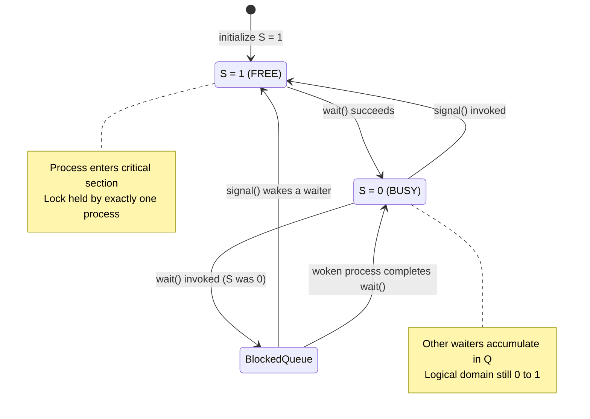
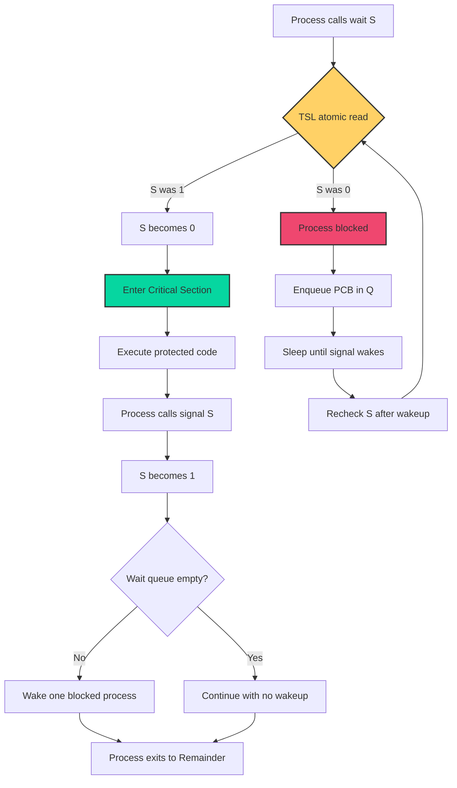
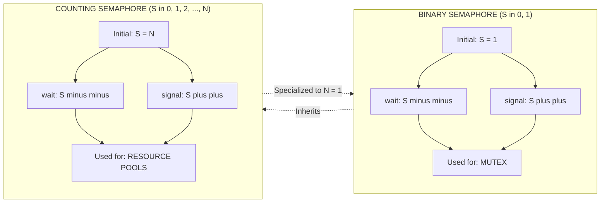
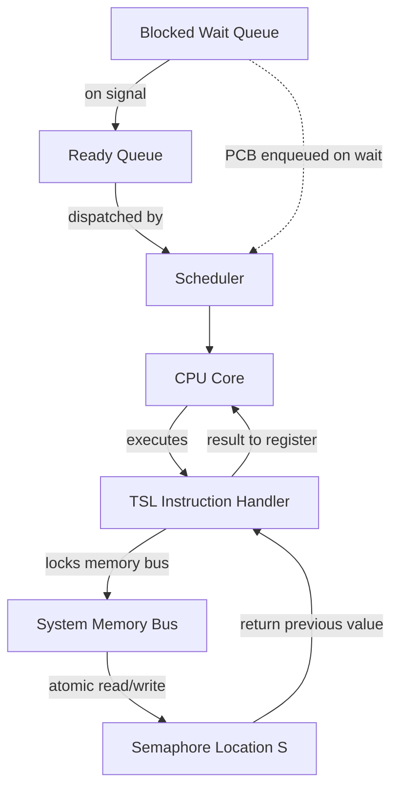
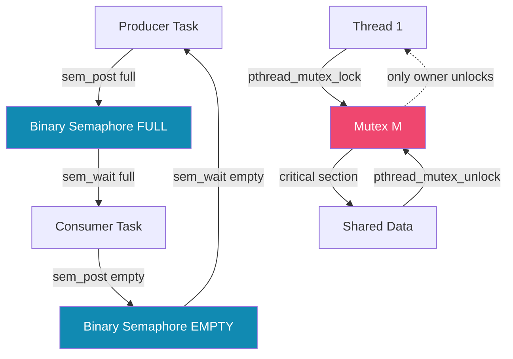

# Binary Semaphores

<!-- SECTION_1_START -->
# 1. Core Technical Definition & Intuitive Overview

## 1.1 Formal Academic Definition (KTU 2024 Syllabus Terminology)

A **Binary Semaphore** is a synchronization primitive that can assume only **two discrete values**: the integer **0** (locked / unavailable) and the integer **1** (unlocked / available). It provides the most elementary form of process coordination and is principally employed to enforce **mutual exclusion** (mutex) on a shared critical resource among concurrent processes or threads.

> [!IMPORTANT]
> **KTU Board Definition (Verbatim Expectation):**  
> *"A binary semaphore is a semaphore whose integer value can range only between 0 and 1. A value of 1 indicates that the resource is free, while a value of 0 indicates that the resource is currently held by some process. The two standard atomic operations on a binary semaphore are `wait()` (also called `P()` or `DOWN()`) and `signal()` (also called `V()` or `UP()`)."*

The two operations are defined formally as:

$$
\text{wait}(S): \quad \text{while } S \leq 0 \text{ do } \{\text{no-op}\};\ S := S - 1
$$

$$
\text{signal}(S): \quad S := S + 1
$$

---

## 1.2 Conceptual Analogy & Plain-English Intuition

### 🏢 The Single-Office Restroom Key Analogy
Imagine an office building with **one** restroom and a single physical key hanging at the reception desk.

| State | Key Location | Semaphore Value | Meaning |
|:------|:-------------|:----------------|:--------|
| Key is **on the hook** | Reception desk | $S = 1$ | Restroom is **free** |
| Key is **with an employee** | Inside the cabin | $S = 0$ | Restroom is **occupied** |

- **wait(S) (Acquire):** You *check* if the key is on the hook. If yes, you take it (the hook becomes empty, $S$ becomes $0$) and walk into the restroom. If the key is not there, you stand in line waiting until the other person returns it.
- **signal(S) (Release):** When you exit, you return the key to the hook. The hook now has a key again ($S$ becomes $1$), and the next waiting person can take it.

> [!NOTE]
> **Key Insight for First-Time Learners:**  
> The semaphore variable $S$ is just a *count* of how many people are allowed to enter a critical section simultaneously. For a binary semaphore, this count is never more than **one** — it is a *strict doorman* that allows entry one at a time, no exceptions.

---

## 1.3 Physical & Logical Constants

The following constants and ranges govern the lifecycle of a binary semaphore:

- **Domain of $S$:** $S \in \{0, 1\}$
- **Initial value (Resource free):** $S = 1$
- **Initial value (Resource held):** $S = 0$
- **Atomicity requirement:** Both `wait()` and `signal()` must execute as a single, **uninterruptible** machine instruction sequence (guaranteed by hardware primitives such as `TSL` or `CAS`).

> [!TIP]
> **Geometric / Visualization Intuition:**  
> Think of the semaphore value as the **height of water in a tank of capacity 1 unit**. `wait(S)` is a *drain* that drops the level by 1 (only succeeds if the tank was non-empty). `signal(S)` is a *faucet* that raises the level by 1 (only succeeds if the tank was not full). The binary restriction means the tank never overflows and never goes negative.

<!-- SECTION_1_END -->

<!-- SECTION_2_START -->
# 2. Deep Theoretical Analysis & KTU High-Yield Formula Sheet

## 2.1 The Two Atomic Operations — Deconstructed

The correctness of a binary semaphore rests on the **atomicity** of the following two operations. A preemptive interrupt *between* the read and write steps would corrupt the synchronization state.

### 2.1.1 The `wait(S)` Operation (Acquire / P / DOWN)

**Logic Steps:**
1. **Test Phase:** Read the current value of $S$ from memory.
2. **Decision Phase:** If $S = 1$, proceed to Step 3. If $S = 0$, the process is *blocked* (added to a wait queue associated with $S$) and the CPU scheduler dispatches another process.
3. **Update Phase:** Atomically decrement $S$ from 1 to 0.
4. **Entry Phase:** The calling process is now allowed to enter the **Critical Section** of code that accesses the shared resource.

### 2.1.2 The `signal(S)` Operation (Release / V / UP)

**Logic Steps:**
1. **Increment Phase:** Atomically increment $S$ from 0 to 1.
2. **Wake Phase:** Check the wait queue of $S$. If at least one process is blocked, remove one process from the queue and move it to the **ready queue** so it can re-execute its `wait(S)` call and enter the critical section.
3. **Exit Phase:** The calling process continues execution *after* its critical section.

> [!NOTE]
> **The "Why" Behind the Invariant:**  
> A binary semaphore is *structurally identical* to a **mutex lock** but differs in two subtle ways: (1) semaphores traditionally have no concept of *ownership* (any process can `signal()`, even one that never performed the `wait()`), and (2) they do not provide *priority inheritance* by default. KTU examiners frequently test this distinction.

---

## 2.2 KTU High-Yield Formula Sheet / Cheat Sheet

| Concept | Symbolic Form | Constraint / Range | Operational Meaning |
|:--------|:--------------|:-------------------|:--------------------|
| Semaphore domain | $S \in \{0, 1\}$ | Discrete binary set | Only 0 or 1 is ever stored |
| wait (acquire) | $S := S - 1$ | Only if $S = 1$ before call | Enters critical section |
| signal (release) | $S := S + 1$ | Only if $S = 0$ before call | Exits critical section |
| Atomicity requirement | $\text{TSL}(R, S)$ | Single instruction | $R \leftarrow S; S \leftarrow 1$ in one cycle |
| Busy-wait time | $O(1)$ worst case | Bounded by scheduler | Process blocks instead of spinning |
| Critical section count | $\leq 1$ | Mutual exclusion | Only 1 process in CS at any time |
| Mutual exclusion condition | $\bigcap_{i} CS_i = \emptyset$ | No overlap | Binary semaphore guarantees this |
| Progress condition | $S = 1 \Rightarrow$ entry | Non-blocking when free | No process waits unnecessarily |
| Bounded wait | Queue-based wakeup | FIFO by default | Prevents starvation |

---

## 2.3 Real-World Engineering Utility

Binary semaphores are the **backbone of almost every general-purpose operating system** for the following high-impact applications:

1. **Mutex locks in kernel data structures** — protecting the process control block list, the file descriptor table, and the in-memory inode cache in Linux/Windows kernels.
2. **Interrupt Service Routine (ISR) synchronization** — disabling preemption in device driver top-halves.
3. **Producer–Consumer with single-slot buffer** — a special case where the buffer size is exactly 1.
4. **Readers–Writers problem (write lock variant)** — the writer semaphore is binary.
5. **Database transaction isolation** — implementing row-level locks in transactional engines (PostgreSQL `LWLock`).
6. **Embedded real-time systems** (RTOS like FreeRTOS, VxWorks) — task-to-task signaling where the count is inherently 0/1.

> [!IMPORTANT]
> **Production-Grade Note:** In modern POSIX systems, the equivalent of a binary semaphore is the `pthread_mutex_t` or `sem_t` initialized with value 1. The Linux kernel internally uses *counting* semaphores (e.g., `struct semaphore` with `count` field) but treats them as binary in most paths.

<!-- SECTION_2_END -->

<!-- SECTION_3_START -->
# 3. Step-by-Step Derivations & Code/Symbolic Implementation

## 3.1 Hardware Foundation: The Test-and-Set Lock (TSL)

Since `wait()` and `signal()` must be **atomic**, software alone cannot guarantee correctness on a multiprocessor. The CPU provides an atomic read-modify-write instruction, the classic **Test-and-Set Lock (TSL)**.

### 3.1.1 TSL Definition

$$
\text{TSL}(R, S): \quad \{ R \leftarrow S;\ S \leftarrow 1 \}_{\text{atomic}}
$$

A sample instruction set entry in textbooks:

| Instruction | Operand 1 | Operand 2 | Effect |
|:------------|:----------|:----------|:-------|
| `TSL RX, LOCK` | Register RX | Memory location LOCK | $RX \leftarrow LOCK;\ LOCK \leftarrow 1$ |

The bracketed `{ }` denotes a single, uninterruptible bus cycle.

### 3.1.2 Full Derivation of Binary Semaphore using TSL

We now derive the C-level implementation. We define a shared variable `S` and two operations.

**Step 1 — Define the shared global**

```c
volatile int S = 1;   /* 1 = free, 0 = busy */
```

**Step 2 — Implement the atomic Test-and-Set in user-space (for understanding)**

```c
int test_and_set(int *lock_ptr) {
    int old = *lock_ptr;     /* Read */
    *lock_ptr = 1;           /* Write */
    return old;              /* Returns the previous value */
}
```

> The hardware guarantees that no other CPU can interleave between the **read** of `*lock_ptr` and the **write** of `1` to `*lock_ptr`. This is enforced by locking the memory bus.

**Step 3 — Build `wait(S)` using TSL**

```c
void wait(int *S) {
    while (1) {
        int previous = test_and_set(S);   /* Atomic */
        if (previous == 1) {
            /* S was free, we just set it to 0 (busy). We own the CS. */
            break;
        }
        /* S was 0 (busy). Loop again (busy-wait / spin). */
    }
}
```

> [!IMPORTANT]
> **Note on Busy-Waiting:** A pure-software TSL-based binary semaphore *spins*. Production kernels replace the spin with a **block on wait queue + scheduler call**, which is the actual *blocking* semaphore we study for exam purposes.

**Step 4 — Build `signal(S)` using atomic write**

```c
void signal(int *S) {
    *S = 1;   /* Atomic store — releases the lock */
}
```

**Step 5 — Putting it together in a critical section**

```c
/* Process Pi */
void process_function(void) {
    /* ENTRY section */
    wait(&S);

    /* CRITICAL SECTION — only one process at a time */
    shared_counter += 1;
    shared_data = compute_value();

    /* EXIT section */
    signal(&S);

    /* REMAINDER section */
    do_other_work();
}
```

---

## 3.2 Blocking Implementation (What KTU Asks in 14-Mark Answers)

In a *blocking* binary semaphore, `wait()` on a busy semaphore does **not** spin — it parks the process in a queue.

### 3.2.1 Data Structures

- `S`: integer in $\{0, 1\}$
- `Q`: FIFO queue of blocked process descriptors (PCBs)

### 3.2.2 Algorithm

```
wait(S):
    1. S = S - 1
    2. if (S < 0):
           block this process and enqueue PCB onto Q
           (invoke scheduler — context switch)

signal(S):
    1. S = S + 1
    2. if (S <= 0):
           dequeue one PCB from Q and wake it up
           (move it to ready queue)
```

### 3.2.3 Step-by-Step Trace Example

Suppose $S = 1$ initially and three processes $P_1, P_2, P_3$ call `wait()` in sequence.

| Step | Process | Action | $S$ after step | Queue $Q$ |
|:----:|:--------|:-------|:--------------:|:----------|
| 1 | $P_1$ calls `wait` | $S = 1 - 1 = 0$; $S < 0$ false | $0$ | Empty |
| 2 | $P_2$ calls `wait` | $S = 0 - 1 = -1$; $S < 0$ true | $-1$ | $P_2$ |
| 3 | $P_3$ calls `wait` | $S = -1 - 1 = -2$; $S < 0$ true | $-2$ | $P_2, P_3$ |
| 4 | $P_1$ calls `signal` | $S = -2 + 1 = -1$; $S \leq 0$ true | $-1$ | $P_3$ (wake $P_2$) |
| 5 | $P_2$ resumes | $P_2$ enters critical section | $-1$ | $P_3$ |

> **Result:** Even though $S$ becomes negative internally, the *logical* semaphore domain remains $\{0, 1\}$ for the purpose of the *user*. The negative count tracks the **depth of the wait queue**.

---

## 3.3 Python Simulation (Educational Reference)

```python
import threading
import time
import random

class BinarySemaphore:
    """A from-scratch blocking binary semaphore using a Condition variable."""
    def __init__(self, initial: int = 1):
        if initial not in (0, 1):
            raise ValueError("Binary semaphore initial value must be 0 or 1")
        self._value: int = initial
        self._cond: threading.Condition = threading.Condition()

    def wait(self) -> None:
        with self._cond:
            while self._value == 0:
                self._cond.wait()       # Block the calling thread
            self._value = 0             # Atomically take the lock

    def signal(self) -> None:
        with self._cond:
            self._value = 1             # Atomically release the lock
            self._cond.notify()         # Wake exactly one waiter

# --- Demonstration ---------------------------------------------------------
shared_balance: int = 1000
lock: BinarySemaphore = BinarySemaphore(1)

def withdraw(amount: int, worker: str) -> None:
    lock.wait()
    try:
        global shared_balance
        local_copy: int = shared_balance   # Read
        time.sleep(random.uniform(0.01, 0.05))  # Simulate I/O
        shared_balance = local_copy - amount  # Write
        print(f"{worker} withdrew {amount}. New balance = {shared_balance}")
    finally:
        lock.signal()

threads = [threading.Thread(target=withdraw, args=(50, f"Worker-{i}")) for i in range(5)]
for t in threads: t.start()
for t in threads: t.join()
print(f"Final balance: {shared_balance}")
```

**Expected behaviour:** All 5 withdrawals of 50 will be serialized; final balance will be exactly **$1000 - 5 \times 50 = 750$**. No race condition.

---

## 3.4 Algorithmic Application: Single-Slot Producer–Consumer

For a bounded buffer of size exactly 1, *two* binary semaphores suffice (no separate counter needed).

```c
sem_t empty = 1;   /* 1 means buffer is free to produce */
sem_t full  = 0;   /* 0 means buffer is empty (consumer must wait) */

void producer(void) {
    while (1) {
        produce_item(&item);
        wait(&empty);          /* Wait until buffer empty (initially true) */
        buffer = item;         /* Deposit item */
        signal(&full);         /* Tell consumer an item exists */
    }
}

void consumer(void) {
    while (1) {
        wait(&full);           /* Wait until an item is available */
        consume_item(buffer);
        signal(&empty);        /* Tell producer buffer is free */
    }
}
```

This works only when the buffer size is **1**. For larger buffers, a counting semaphore is required for the slot count, in addition to a mutex binary semaphore.

<!-- SECTION_3_END -->

<!-- SECTION_4_START -->
# 4. Structural Diagrams & Schematics

## 4.1 State Transition Diagram of a Binary Semaphore



> **Reading the diagram:** The semaphore is a *two-state finite machine* with one transient side-state (the blocked queue). The transitions are atomic and irreversible without a corresponding `signal()`.

---

## 4.2 Process Flow of `wait()` and `signal()` Operations



---

## 4.3 Block-Level Comparison: Binary vs Counting Semaphores



---

## 4.4 Sequential Processing Topology (Hardware-Mapped View)



> **Takeaway:** The hardware *bus lock* is what gives the binary semaphore its atomicity guarantee. Without it, the **read-modify-write** would be vulnerable to race conditions even in single-slot buffers.

<!-- SECTION_4_END -->

<!-- SECTION_5_START -->
# 5. KTU 2024 Scheme Examination Question Bank & Topic Recap

## 5.1 Part A — Short Answer Questions (3 Marks Each)

### Question 1 (3 Marks)
> **[KTU University Exam - July 2024, Model Question Paper]**  
> Define a **binary semaphore**. How does it differ from a **counting semaphore**? *(CO1, Remember/Understand)*

**Model Answer (Board-Standard):**

A binary semaphore is a synchronization tool that allows only two values for the semaphore variable $S$, namely **0** and **1**. It is used to provide mutual exclusion to a critical section so that only one process accesses the shared resource at a time.

A **counting semaphore**, in contrast, can take any non-negative integer value from $0$ to $N$, where $N$ is the number of identical resource instances. It is used to control access to a finite pool of resources.

| Parameter | Binary Semaphore | Counting Semaphore |
|:----------|:-----------------|:-------------------|
| Value range | $\{0, 1\}$ | $\{0, 1, 2, \ldots, N\}$ |
| Initial value | 0 or 1 | $N$ |
| Typical use | Mutex / single-slot buffer | Resource pool of size $N$ |
| Multiple CS entries | No (exactly 1) | Yes (up to $N$) |

> *Award 1 mark for the binary definition, 1 mark for the counting definition, 1 mark for the comparison.* **[Valuation Key: Tabular contrast: 1 Mark]**

---

### Question 2 (3 Marks)
> **[KTU University Exam - Dec 2023]**  
> Write the algorithms for the **wait(S)** and **signal(S)** operations on a binary semaphore. *(CO1, Understand)*

**Model Answer:**

```text
Algorithm wait(S):
    1.  while (S <= 0)        // Spin or block until S becomes 1
            no-op;
    2.  S := S - 1;           // Atomically acquire the resource

Algorithm signal(S):
    1.  S := S + 1;           // Atomically release the resource
    2.  // Optionally wake one process from the wait queue
```

> *Award 1 mark for the `wait` algorithm, 1 mark for the `signal` algorithm, and 1 mark for the atomicity note.* **[Valuation Key: Stating atomicity requirement: 1 Mark]**

---

## 5.2 Part B — 14-Mark Module-Internal Choice Questions

### Question A (14 Marks)
> **[KTU University Exam - Dec 2023 / Equivalent Past Paper Pattern]**

**(a)** Explain the implementation of a **binary semaphore** using the **Test-and-Set (TSL)** hardware instruction. Show the C code and discuss the **busy-wait** issue. *(7 marks, CO2, Understand/Apply)*

**(b)** Demonstrate how two binary semaphores can solve the **producer–consumer problem with a buffer of size 1**. Give the pseudocode and explain why a counting semaphore is *not* required in this case. *(7 marks, CO3, Apply)*

---

#### Model Solution for (a) — 7 Marks

**Step 1 — Why a special instruction is needed:**  
On a multiprocessor, two `wait()` calls executing concurrently could both read $S = 1$ and both decrement, breaking mutual exclusion. We need a single, uninterruptible *read-modify-write* instruction. That instruction is `TSL`.

**Step 2 — TSL semantics:**

$$
\text{TSL}(R, S) \equiv \{ R \leftarrow S;\ S \leftarrow 1 \}_{\text{atomic}}
$$

**Step 3 — C code for `wait(S)`:**

```c
void wait(int *S) {
    int reg;
    do {
        reg = TSL(S);     /* reg = old S;  S = 1 (BUSY) */
    } while (reg == 0);   /* If old S was 0, someone else owns it — retry */
}
```

**Step 4 — C code for `signal(S)`:**

```c
void signal(int *S) {
    *S = 0;   /* Atomic store; mark resource as FREE */
}
```

**Step 5 — Critical section usage:**

```c
wait(&S);
/* --- critical section --- */
shared_variable++;
signal(&S);
```

**Step 6 — Discussing the busy-wait (spinlock) problem:**  
A `TSL`-only implementation *spins*, wasting CPU cycles. In a uniprocessor, a spinning process never releases the CPU to the lock-holder, leading to deadlock. The fix is to combine TSL with **blocking**: when `reg == 0`, the process calls `block()` (adds itself to a wait queue) and invokes the scheduler. When `signal()` runs, it calls `wakeup()` on the queue.

> **[Valuation Key]:**  
> *Definition of TSL with equation: 2 Marks*  
> *Correct `wait()` code: 2 Marks*  
> *Correct `signal()` code: 1 Mark*  
> *Busy-wait issue + blocking solution: 2 Marks*

---

#### Model Solution for (b) — 7 Marks

**Step 1 — Define the two semaphores:**

```c
sem_t mutex  = 1;   /* Guards the shared buffer slot */
sem_t full   = 0;   /* Buffer has an item (1) or not (0) */
sem_t empty  = 1;   /* Buffer is free (1) or full (0) */
```

For a buffer of size **1**, the *count* of free slots is always either 0 or 1, so `empty` and `full` are binary.

**Step 2 — Producer code:**

```c
void producer(void) {
    while (1) {
        produce_item(&item);
        wait(&empty);         /* Wait for free slot — binary */
        wait(&mutex);         /* Enter critical section — binary */
        buffer = item;        /* Deposit */
        signal(&mutex);       /* Exit critical section */
        signal(&full);        /* Announce item present */
    }
}
```

**Step 3 — Consumer code:**

```c
void consumer(void) {
    while (1) {
        wait(&full);          /* Wait for an item — binary */
        wait(&mutex);         /* Enter CS */
        consume_item(buffer);
        signal(&mutex);       /* Exit CS */
        signal(&empty);       /* Announce slot is free */
    }
}
```

**Step 4 — Why a counting semaphore is not needed:**  
A counting semaphore tracks an integer pool of size $N$. When $N = 1$, the count never exceeds 1, reducing the counting semaphore to a binary one. Therefore, two binary semaphores `full` and `empty` plus one mutex `binary` (or an implied mutex) are sufficient.

**Step 5 — Trace (initial state $empty=1, full=0, mutex=1$):**

| Iteration | Producer action | $empty$ | $full$ | Consumer action |
|:---------:|:----------------|:-------:|:------:|:----------------|
| 1 | `wait(empty)` $1\!\to\!0$, store item, `signal(full)` $0\!\to\!1$ | $0$ | $1$ | `wait(full)` $1\!\to\!0$, consume, `signal(empty)` $0\!\to\!1$ |
| 2 | Repeats | cycles | cycles | cycles |

> **[Valuation Key]:**  
> *Semaphore definitions: 1 Mark*  
> *Producer pseudocode: 2 Marks*  
> *Consumer pseudocode: 2 Marks*  
> *Justification for binary: 1 Mark*  
> *Trace table: 1 Mark*

---

### Question B (14 Marks) — *Alternative Choice*

> **[KTU University Exam - July 2024 / Past Paper Pattern]**

**(a)** Discuss the various **issues and pitfalls** in implementing binary semaphores, including **busy-waiting, deadlock, starvation, and the lost-wakeup problem**. *(7 marks, CO2, Understand)*

**(b)** Compare **binary semaphores** with **mutex locks** in modern operating systems. Highlight the differences in **ownership, priority inheritance, and usage patterns** with a neat diagram. *(7 marks, CO3, Analyze)*

---

#### Model Solution for (a) — 7 Marks

**1. Busy-Waiting (Spinlock) Issue:**  
A pure-software binary semaphore loops on `TSL`, wasting CPU cycles. In a single-CPU system, a spinning process never yields, so the lock-holder may never get scheduled to release. **Solution:** combine with blocking + scheduler.

**2. Deadlock:**  
If a process `wait(S)` succeeds, executes, and then never calls `signal(S)` (e.g., crashes inside CS), the resource is permanently locked. **Solution:** structured programming (RAII), or kernel-level `wait_event_timeout` watchdog.

**3. Starvation:**  
A naive wake-up policy (e.g., wake *any* waiter) can starve low-priority processes. **Solution:** strict **FIFO wait queue** to guarantee bounded wait.

**4. Lost Wake-Up Problem:**  
Consider:

```c
/* Process A */            /* Process B */
wait(S);                   ...
...                        if (S == 1) wake_one();
                          /* Race: A is between check and block */
```

If $S$ becomes 1 *after* A checks and *before* A blocks, B sees $S = 1$ and skips the wake. A then blocks forever. **Solution:** make the `test-and-block` operation **atomic** (the very reason TSL exists).

**5. Priority Inversion:**  
A low-priority process holds the binary semaphore; a medium-priority CPU-bound process preempts; the high-priority process waits indefinitely. **Solution:** *priority inheritance protocol* (used in POSIX mutex, not classic semaphores).

**6. Non-Ownership Anomaly:**  
Any process can `signal(S)`, including one that never did `wait(S)`. This breaks *ownership invariants* in mutex-based reasoning. **Solution:** use `pthread_mutex_t` for ownership-critical regions.

> **[Valuation Key]:**  
> *Listing 4+ issues: 4 Marks (1 each)*  
> *Solution/mitigation for each: 3 Marks*

---

#### Model Solution for (b) — 7 Marks

**Comparison Table:**

| Attribute | Binary Semaphore | Mutex Lock |
|:----------|:-----------------|:-----------|
| Value range | $\{0, 1\}$ | $\{0, 1\}$ (locked/unlocked) |
| Ownership | None (any process can signal) | Strict (only owner can unlock) |
| Priority inheritance | Not provided by default | Yes (POSIX `pthread_mutexattr_setprotocol`) |
| Typical API | `sem_init`, `sem_wait`, `sem_post` | `pthread_mutex_init`, `lock`, `unlock` |
| Kernel object | Often lightweight | Heavier (tracks owner thread) |
| Use case | Signaling between tasks | Protecting a critical section |
| Recursive lock | No | Yes (with `PTHREAD_MUTEX_RECURSIVE`) |
| Spin variant | Available | Available (`PTHREAD_MUTEX_ADAPTIVE_NP`) |

**Diagram of Usage Pattern:**



**Conclusion:**  
For pure *signaling* (one task waiting for an event from another), use a **binary semaphore**. For *mutual exclusion* of a shared resource with strict ownership semantics, use a **mutex lock**.

> **[Valuation Key]:**  
> *Tabular comparison (5+ rows): 3 Marks*  
> *Diagram of two usage patterns: 2 Marks*  
> *Final recommendation: 1 Mark*  
> *Ownership distinction explicitly stated: 1 Mark*

---

## 5.3 KTU Examiner's Valuation Warning / Pitfall Callout

> [!WARNING]
> **Common Marks-Losing Mistakes in KTU Valuation:**
> 1. **Forgetting the atomicity clause.** If your answer says "read $S$, check, then write $S-1$" *without* mentioning hardware atomicity (TSL/CAS), you lose 1–2 marks immediately. The examiner is trained to scan for the word *"atomic"*.
> 2. **Confusing binary and counting semaphores.** Writing "the value of $S$ can be more than 1" in a binary-semaphore answer is an instant zero on the comparison sub-question.
> 3. **Skipping the wait-queue argument.** The blocking-semaphore derivation requires explicitly stating the queue $Q$ and the *wake-one* semantics. Without it, you are only describing a spinlock, not a semaphore.
> 4. **Mixing up `wait` and `signal` effects.** `wait` *decrements*; `signal` *increments*. Reversing this is a classic 1-mark deduction.
> 5. **No trace table.** For the producer-consumer question, the examiner allocates 1–2 marks for a *state trace*. Drawing the table $S$, $Q$, and the running process is mandatory.
> 6. **Omitting the `do … while` loop in TSL implementation.** A single `if` is wrong — it must be a *busy-wait loop* or a *block-and-retry* loop. Examiners check for this loop.

---

## 5.4 Topic Recap & Important Things to Remember

- A **binary semaphore** $S$ can only ever hold the values **0 or 1**; it is the simplest synchronization primitive for *mutual exclusion*.
- The two operations are **`wait(S)` (P / DOWN)** and **`signal(S)` (V / UP)**; both must be **atomic**.
- `wait` *acquires* the lock (decrements $S$), `signal` *releases* the lock (increments $S$).
- The hardware foundation is the **Test-and-Set (TSL)** instruction, which provides an atomic read-modify-write.
- A pure TSL binary semaphore is a **spinlock**; the production-grade *blocking* binary semaphore uses a **wait queue + scheduler**.
- A **negative internal count** in the blocking implementation denotes the number of processes in the wait queue (logical $S \in \{0,1\}$ is preserved for the user).
- Binary semaphores differ from mutexes in: (a) no **ownership**, (b) no default **priority inheritance**, (c) signaling across *unrelated* tasks.
- Common pitfalls: **busy-waiting**, **deadlock** if `signal` is forgotten, **starvation** without FIFO, **lost wake-up** if test-and-block is not atomic, **priority inversion** without inheritance.
- For a **single-slot buffer**, two binary semaphores (`empty`, `full`) are sufficient; a counting semaphore is not needed.
- The **invariant** $0 \le S \le 1$ must always hold after every operation.
- Hardware-supported atomic primitives include **TSL**, **CAS** (Compare-and-Swap), and **XCHG** on x86.
- KTU exam hot topics: definition + comparison table (3 marks), TSL implementation + busy-wait fix (7 marks), producer-consumer with size-1 buffer (7 marks), binary vs mutex (7 marks).

<!-- SECTION_5_END -->
