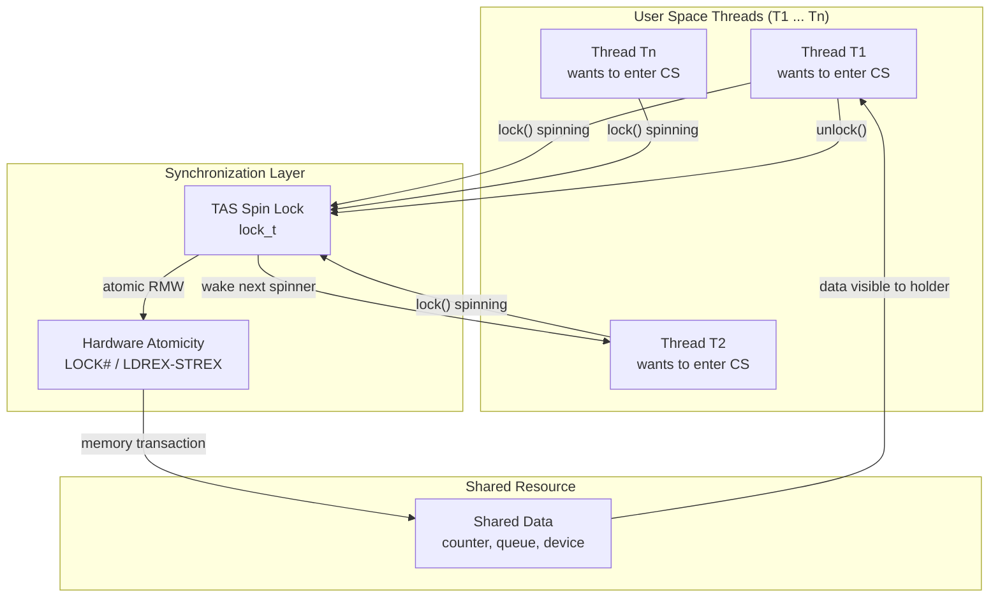
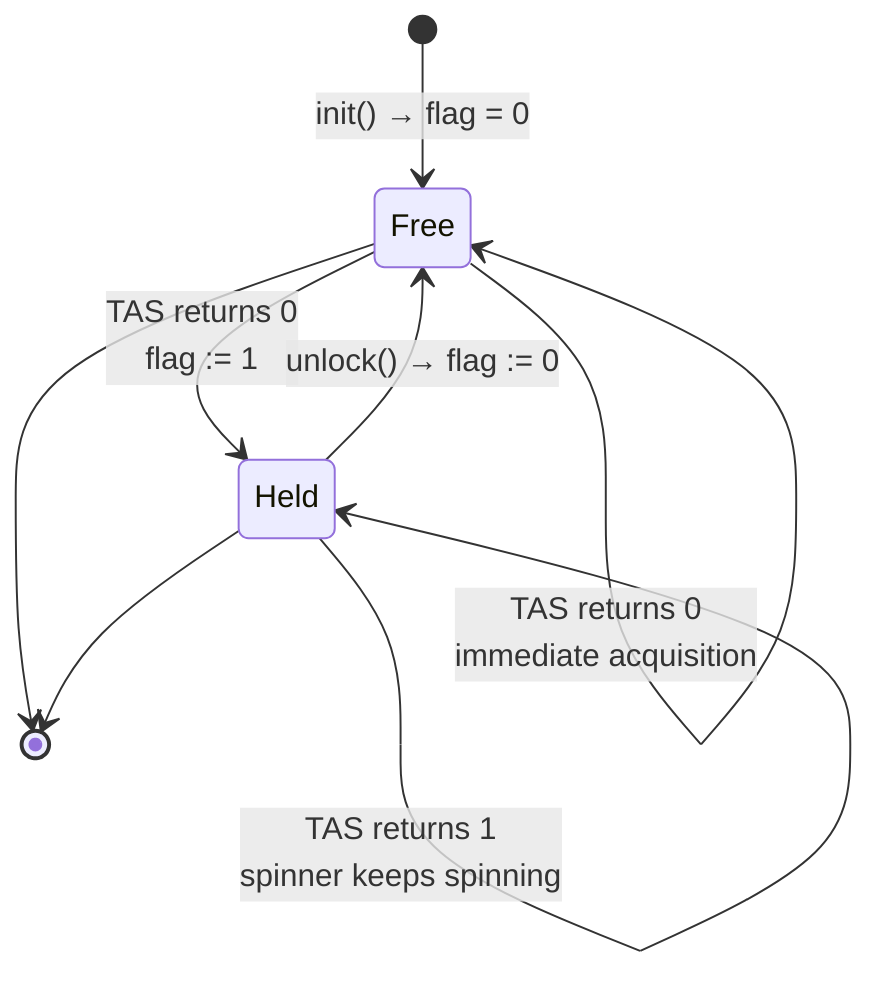
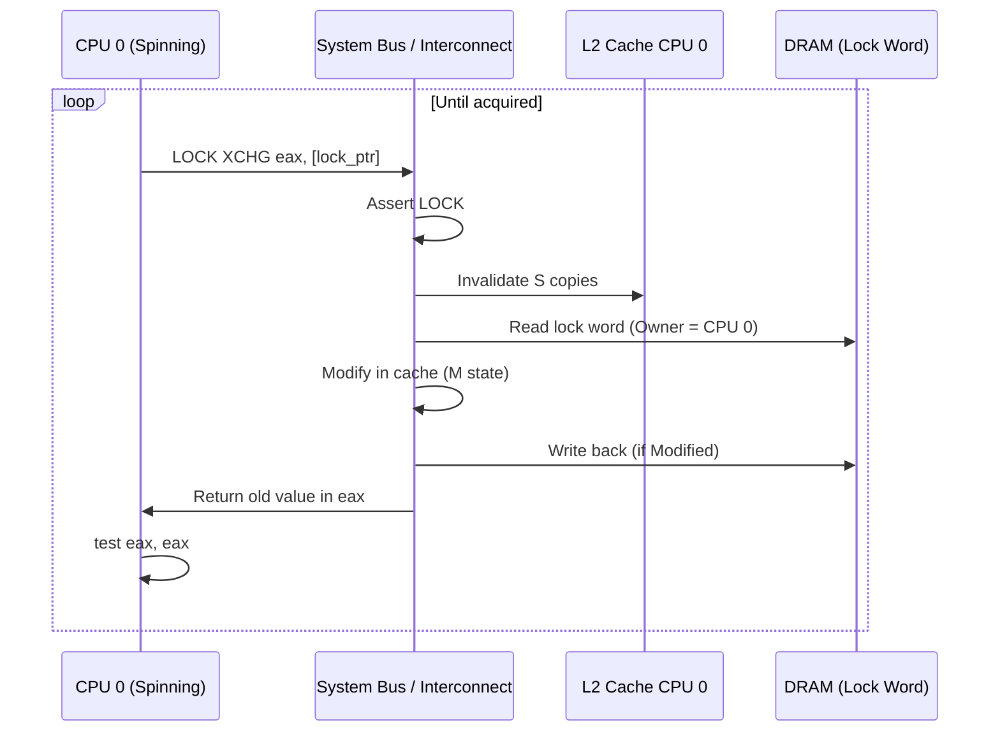
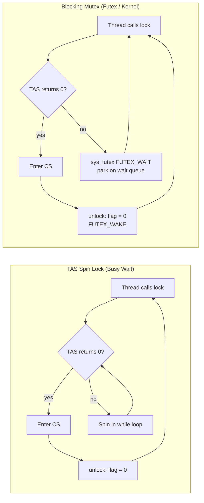
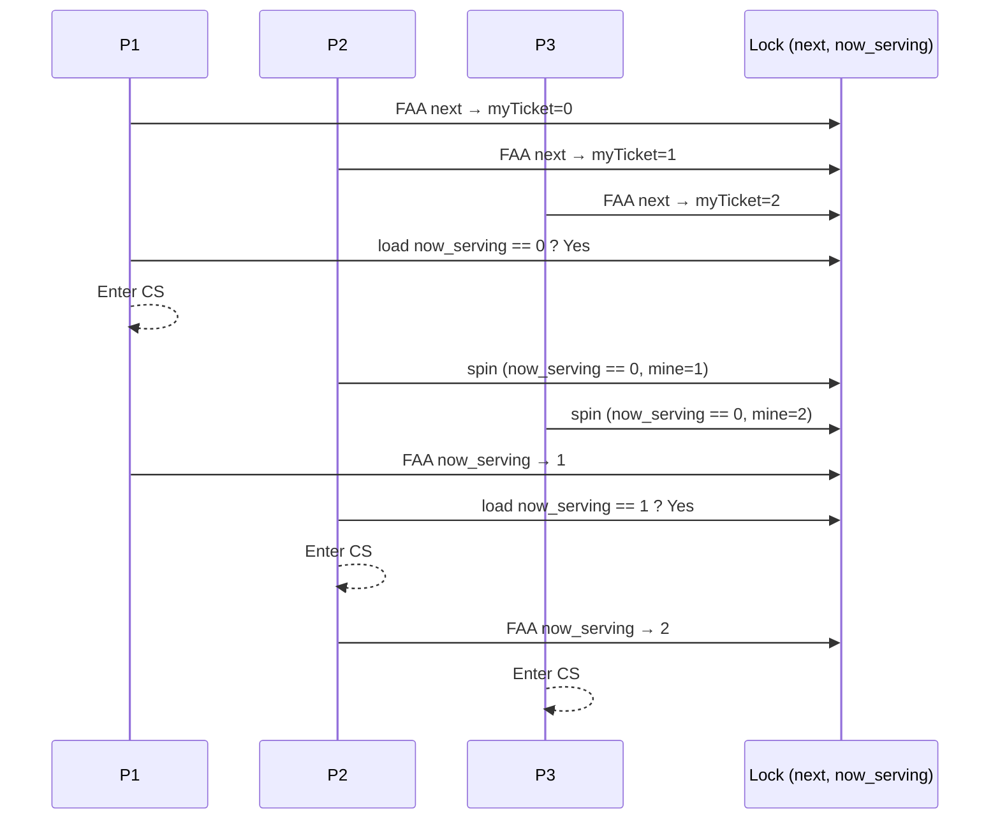

# Building Spin Locks with Test-And-Set

<!-- SECTION_1_START -->
# Building Spin Locks with Test-And-Set

## 1.1 Formal Definition (KTU 2024 Syllabus Terminology)

> [!IMPORTANT]
> **Spin Lock**: A *spin lock* is a **busy-wait synchronization primitive** that causes a thread/process attempting to acquire an already-held lock to execute a tight loop ("spin") repeatedly checking for the lock's availability, instead of being descheduled (blocked) by the OS scheduler.

> [!IMPORTANT]
> **Test-And-Set (TAS / TST) Instruction**: An *atomic*, indivisible hardware instruction that, in a single, non-interruptible bus transaction, **(a)** reads a memory word, **(b)** stores a new value into that word, and **(c)** returns the **original (old) value** to the calling processor. Atomicity is guaranteed by the underlying bus-level locking protocol (e.g., x86 `LOCK` prefix, ARM `LDREX`/`STREX`).

> [!NOTE]
> **Critical Section (CS)**: A segment of code that accesses a shared resource (shared variable, data structure, or device) which must not be concurrently accessed by more than one thread/process. *Per Brinch Hansen and Dijkstra, every concurrent program must guarantee Mutual Exclusion, Progress, and Bounded Waiting*.

---

## 1.2 Intuitive Real-World Analogy

Imagine a **single-stall public restroom** in a railway station with a *mechanical occupancy indicator* (red/green slider) on the door.

- **Variable `flag = 0`** ⇒ slider is **GREEN** (restroom is free).
- **Variable `flag = 1`** ⇒ slider is **RED** (occupied).
- Every person wanting to enter must perform **one atomic gesture**: *look at the slider AND slide it to RED in the same motion*. If the slider was already RED, they must stand outside the door and **continuously stare at it (spin)** until it turns GREEN, then perform the atomic gesture again.
- The "atomic gesture" prevents the race condition where two people both see GREEN at the same time and both enter.

> [!TIP]
> The "atomic gesture" in the analogy is precisely the *Test-And-Set* instruction. Without atomicity, two threads could read `flag=0` simultaneously and *both* enter the critical section, violating mutual exclusion.

---

## 1.3 Why Hardware Atomic Support?

Pure software solutions to the critical-section problem (e.g., Dekker's, Peterson's algorithms) are **complex, fragile, and unscalable** to more than 2 processes. Modern OS textbooks (Silberschatz, Tanenbaum, Arpaci-Dague) therefore introduce **hardware-supported atomic primitives** such as:

| Primitive | Operation | Atomicity Guarantee |
|---|---|---|
| `Test-And-Set` | Read, write 1, return old | Bus-locked single transaction |
| `Compare-And-Swap` | Conditionally write if equal | Bus-locked single transaction |
| `Fetch-And-Add` | Read, add, return old | Bus-locked single transaction |
| `Load-Linked / Store-Conditional` | Optimistic two-step | Cache-coherent retry loop |

> [!VISUALIZATION CONTROL]
> **Concept:** State transition of a spin lock variable `flag` over time under contention by 3 threads.
> **Plot Inputs (Desmos / GeoGebra):**
> * $x$-axis: Time (clock cycles $t$)
> * $y$-axis: Step function $f(t) \in \{0, 1\}$ representing `lock->flag`
> * $f(t) = 0$ for $0 \le t < 2$ (free)
> * $f(t) = 1$ for $2 \le t < 6$ (Thread A holds)
> * $f(t) = 0$ for $6 \le t < 7$ (released)
> * $f(t) = 1$ for $7 \le t < 11$ (Thread B holds)
> **Visual Description:** A square wave — flat at $0$ when free, flat at $1$ when held. Threads B and C produce *vertical spikes* at $y=1$ during the spinning phase (their `while` loop reads 1 repeatedly until $f(t)$ falls to $0$).

---

## 1.4 Geometric Intuition of Atomicity

Consider the **race window** of a non-atomic sequence:

$$
\text{Time} \rightarrow \quad \underbrace{\text{Read }x}_{\text{Thread 1}} \quad \bigg| \quad \underbrace{\text{Context Switch}} \quad \bigg| \quad \underbrace{\text{Write }1}_{\text{Thread 1}} \quad \bigg| \quad \underbrace{\text{Read }x}_{\text{Thread 2 writes 0}}
$$

The pipe `|` marks an *interruptible* point. With **Test-And-Set**, the three operations collapse into **one uninterruptible transaction**:

$$
\text{Time} \rightarrow \quad \Big[\,\text{Read}\,x\;\land\;\text{Write}\,1\;\land\;\text{Return old}\,\Big]_{\text{atomic}}
$$

This single transaction is the geometric "blob" that closes the race window.

---

## 1.5 Key Terminology Cheat-Sheet (3-Mark Style)

> [!NOTE]
> **Bus Locking**: Hardware mechanism where the processor asserts a `LOCK#` signal on the system bus, preventing other CPUs from accessing memory until the instruction completes. Required for genuine atomicity on SMP (Symmetric Multiprocessing) systems.

> [!NOTE]
> **Cache Coherence**: Property ensuring that multiple cached copies of a memory location remain consistent across cores. Implementations such as MESI (Modified, Exclusive, Shared, Invalid) interact with spin locks and can cause *cache-line bouncing* — a major performance concern.

> [!NOTE]
> **Spin-Wait / Busy-Wait**: A waiting strategy where the thread consumes CPU cycles actively in a loop, *not* relinquishing the CPU. Contrast with *blocking wait* (`pthread_mutex_lock` on a contended lock), where the OS parks the thread on a wait queue.
<!-- SECTION_1_END -->

<!-- SECTION_2_START -->
# Deep Theoretical Analysis & KTU High-Yield Formula Sheet

## 2.1 The Three Correctness Properties (Dijkstra, 1965)

For any mutual-exclusion algorithm, the following must hold for **all** schedules:

| # | Property | Formal Statement |
|---|---|---|
| 1 | **Mutual Exclusion (ME)** | $\forall$ time $t$, at most one process $P_i$ is executing inside the critical section. $\lvert\text{CS}(t)\rvert \le 1$ |
| 2 | **Progress** | If no process is in CS and some processes *want* to enter, only those not in their remainder section can participate in deciding who enters next. |
| 3 | **Bounded Waiting (Starvation Freedom)** | There exists a bound $B$ on the number of times other processes can enter CS after $P_i$ has announced intent but before $P_i$ enters. |

> [!WARNING]
> The **basic** Test-And-Set spin lock **satisfies ME and Progress but VIOLATES Bounded Waiting**. Starvation is possible because the scheduler gives no fairness guarantee among spinners. This is a guaranteed 7-mark question in KTU 2024 ESE.

---

## 2.2 The Test-And-Set Primitive — Formal Specification

$$
\text{TAS}(L, v) : \text{atomically} \to \big\{\, \text{old} \leftarrow L;\;\; L \leftarrow v;\;\; \text{return old}\,\big\}
$$

**Semantics**: The function reads the current value of the lock word $L$, writes $v$ to it, and returns the old value. **All three sub-operations execute in a single, atomic, non-interruptible bus transaction**.

**Hardware implementations:**

| ISA | Instruction | Example |
|---|---|---|
| x86 / x86-64 | `XCHG` with `LOCK` prefix | `lock xchg eax, [lock_ptr]` |
| x86 (alt.) | `BTS` (Bit Test and Set) | `lock bts [lock_ptr], 0` |
| ARM / AArch64 | `LDREX` / `STREX` pair | exclusive load-store pair |
| MIPS | `LL` / `SC` (Load-Linked, Store-Conditional) | atomic R-M-W |
| RISC-V | `LR.W` / `SC.W` (Zalrsc extension) | atomic R-M-W |

---

## 2.3 Basic TAS-Based Spin Lock — Algorithm

Let $\text{flag} \in \{0, 1\}$ be the lock word. $\text{flag} = 0$ means *free*; $\text{flag} = 1$ means *held*.

```c
typedef struct { int flag; } lock_t;

void init(lock_t *L)              { L->flag = 0; }

void lock(lock_t *L) {                  // acquire
    while ( TestAndSet(&L->flag, 1) == 1 )
        ;                               // spin-wait (busy loop)
}

void unlock(lock_t *L) {                // release
    L->flag = 0;
}
```

**Acquisition logic (truth table):**

| State on entry of `lock()` | TAS reads | TAS returns | Action | Result |
|---|---|---|---|---|
| Lock free ($0$) | $0$ | $0$ | Exit `while` | **Acquired** |
| Lock held ($1$) | $1$ | $1$ | Loop again | **Spinning** |

> [!IMPORTANT]
> The *unlock* operation is just a **plain store** of $0$. We do **not** need TAS for unlock because unlocking is not subject to a race — there is exactly one thread that owns the lock when unlock is called. A regular `mov` is sufficient (and faster — it avoids `LOCK#` assertion).

---

## 2.4 Proof Sketch of Mutual Exclusion

**Claim:** The basic TAS lock guarantees that at most one process can be in the CS at any time.

**Proof by contradiction.** Suppose two distinct processes $P_1$ and $P_2$ are both inside the CS at time $t$. For each $P_i$ to have entered, the call to `TAS(&L->flag, 1)` must have returned $0$. The first such TAS to *complete* (i.e., its atomic R-M-W commits to memory) sets `flag` to $1$ and returns $0$. Any subsequent TAS — even if it *reads* the old value $0$ from a stale cache line — must, by atomicity, read the *current committed* value of the memory location. After the first commit, `flag` is permanently $1$ until the owner calls `unlock()`. Hence no other TAS can ever return $0$ while the owner is in CS. $\square$

---

## 2.5 Performance Analysis

Let $n$ = number of CPUs contending, $T_{\text{CS}}$ = avg. critical-section time, $T_{\text{OS}}$ = context-switch cost.

| Metric | Basic TAS Spin Lock | Blocking Mutex (futex) |
|---|---|---|
| **Uncontended cost** | $1$ atomic R-M-W ($\approx 10$–$50$ cycles) | $1$ atomic R-M-W + syscall path |
| **Contended cost** | $n \cdot T_{\text{CS}}$ total CPU wastage; lock holder runs at full speed | $O(1)$ thread parks; $\sim 1$–$2$ $\mu$s wake-up latency |
| **Memory traffic** | High: every spinner repeatedly issues `LOCK XCHG` ⇒ *cache-line ping-pong* (MESI invalidations on every cycle) | Low: parked thread does not touch the cache line |
| **Worst case** | Cache-coherence storm; thundering herd | Under-load latency spikes |
| **Suitable for** | Short CS, SMP, kernel preemption-disabled code | Long CS, user-space, many threads |

**Cache-line bouncing cost model:**

$$
T_{\text{acquire}} \approx n \cdot \big( t_{\text{invalid}} + t_{\text{snoop}} \big) + t_{\text{writeback}}
$$

For $n = 8$ cores on a modern Xeon, the `LOCK XCHG` on a contended cache line can cost **200–500 cycles per attempt** because every spin causes a *snoop* on every other core.

---

## 2.6 KTU High-Yield Formula & Property Sheet

| Symbol / Concept | Definition | Notes |
|---|---|---|
| $\text{TAS}(L)$ | Atomic $\text{old} \leftarrow L;\; L \leftarrow 1$ | $1$-bit version |
| $\text{CAS}(L, e, n)$ | If $L = e$, then $L \leftarrow n$, return success | Strong CAS |
| $\text{FAA}(L, \Delta)$ | $\text{old} \leftarrow L;\; L \leftarrow L + \Delta$ | For ticket locks |
| $M$ = ME satisfied? | Yes (single-writer by atomicity) | **Always** |
| $P$ = Progress? | Yes (no deadlock; free $\Rightarrow$ acquirable) | **Always** |
| $B$ = Bounded Wait? | **No** for basic TAS; **Yes** for *ticket lock* / *queue lock* | KTU favourite |
| $L$ | Lock state: $0$ = free, $1$ = held | 1-bit encoding |
| $\text{turn}_i$ | Boolean intent flag of process $i$ | For Peterson's |
| $Q$ | Global turn variable | For Peterson's |
| $\eta$ | Number of spinners | Affects cache pressure |
| $T_{\text{spin}}$ | Average time spent in busy-wait | $\propto \eta \cdot t_{\text{bus}}$ |

> [!NOTE]
> In LaTeX/prose, $\lvert \cdot \rvert$ denotes set/absolute-value cardinality. **Never** use the bare pipe `|` inside markdown tables; it breaks the column separator.

---

## 2.7 Real-World Engineering Usage

| Domain | Application of TAS Spin Lock |
|---|---|
| **Linux Kernel** | `spin_lock()` / `spin_unlock()` for SMP-safe short critical sections, preemption-disabled contexts, ISR-bottom halves |
| **Synchronization in Kernels** | `arch_spin_lock` implemented via `LOCK DEC` or `LOCK XCHG` (x86), `LDREX`/`STREX` (ARM) |
| **Database engines** | Latch protection for in-memory B-tree page access (e.g., InnoDB `mutex` when contention is low) |
| **Real-time systems (RTOS)** | VxWorks `spinlock` for ISR-task shared data on multicore SoCs |
| **Embedded RT** | Bare-metal multicore firmware uses `LDREX`/`STREX` to build mutex primitives without an OS |
| **Hypervisors (KVM/Xen)** | Per-vCPU `smp_lock` protecting VCPU state during VM entry/exit |
| **GPU compute** | CUDA `__syncthreads` and atomic intrinsics (`atomicCAS`) on shared memory |

> [!TIP]
> Linux's `qspinlock` (queued spin lock) is a **direct descendant** of the basic TAS lock, augmented with a **MCS-style per-CPU wait queue** to (1) achieve bounded waiting, and (2) eliminate cache-line bouncing by giving each spinner a private node. KTU examiners often ask: *"How does Linux extend the basic TAS lock to overcome its fairness/caching drawbacks?"*
<!-- SECTION_2_END -->

<!-- SECTION_3_START -->
# Step-by-Step Derivations, Code & Hardware Implementation

## 3.1 Hardware-Level x86-64 Implementation

The `LOCK` prefix turns the following instruction into an atomic Read-Modify-Write by asserting the `LOCK#` pin on the front-side bus, blocking all other processors' memory accesses until the instruction retires.

**Step-by-step assembly for `lock_acquire`:**

```asm
; void lock(lock_t *L);   rdi = pointer to L
; C signature
lock_acquire:
    mov     eax, 1          ; eax := 1  (the "set" value)
.spin:
    xchg    eax, [rdi]      ; atomic swap: tmp = *L; *L = eax; eax = tmp
    test    eax, eax        ; check what we got back
    jnz     .spin           ; if eax == 1, loop (lock was held)
    ret                     ; if eax == 0, we acquired it

; void unlock(lock_t *L);
lock_release:
    mov     dword [rdi], 0  ; plain store 0; no LOCK prefix needed
    ret
```

**Line-by-line commentary (so you can reproduce the explanation in the exam):**

1. `mov eax, 1` — load the constant `1` into `eax`; this is the value we *want* to write into `*L`.
2. `.spin:` — start of the busy-wait label.
3. `xchg eax, [rdi]` — the **atomic exchange**: in one bus transaction, the CPU reads `*L` into `eax` and writes `eax` (which still holds `1`) into `*L`. After this instruction, the lock is now "set to 1" regardless of its prior state.
4. `test eax, eax` — sets ZF if `eax == 0`.
5. `jnz .spin` — if `eax` (the *old* value of `*L`) is **non-zero**, the lock was held, so we loop.
6. `ret` — `eax == 0` ⇒ we successfully acquired the lock.
7. `lock_release` is a plain `mov` to $0$. The fact that we own the lock is *not* a race; no other thread will try to write to `*L` while we are inside our CS.

---

## 3.2 Full Production-Grade C Implementation with Diagnostics

```c
/* spinlock_tas.c
 * Production-quality TAS spin lock for KTU lab reference.
 * Target: GCC 12+, x86-64 Linux SMP.                   */
#include <stdint.h>
#include <stdbool.h>
#include <stdatomic.h>
#include <stdio.h>
#include <errno.h>
#include <time.h>
#include <pthread.h>

/* ---- Opaque lock type ---------------------------------------- */
typedef struct {
    atomic_int flag;   /* 0 = FREE, 1 = HELD */
} spinlock_t;

/* ---- Initialiser --------------------------------------------- */
static inline void spinlock_init(spinlock_t *L) {
    atomic_store_explicit(&L->flag, 0, memory_order_relaxed);
}

/* ---- Acquire: Test-And-Set spin ------------------------------ */
static inline void spinlock_acquire(spinlock_t *L) {
    int expected;
    do {
        expected = 0;                              /* we expect it free */
    } while (!atomic_compare_exchange_weak(      /* CAS loop, similar to TAS */
                &L->flag, &expected, 1));
    /* On success: expected == 0 was the prior value, flag is now 1.
     * On failure: expected is updated to the current value of flag. */
}

/* ---- Release: plain store ------------------------------------ */
static inline void spinlock_release(spinlock_t *L) {
    atomic_store_explicit(&L->flag, 0, memory_order_release);
}

/* ---- Optional: bounded-wait ticket lock (extension) ---------- */
typedef struct {
    atomic_uint next_ticket;
    atomic_uint now_serving;
} ticketlock_t;

static inline void ticketlock_init(ticketlock_t *L) {
    atomic_store(&L->next_ticket, 0);
    atomic_store(&L->now_serving, 0);
}

static inline void ticketlock_acquire(ticketlock_t *L) {
    unsigned my = atomic_fetch_add(&L->next_ticket, 1U); /* FAA */
    while (atomic_load(&L->now_serving) != my)           /* spin */
        ; /* pause / cpu_relax() on x86 for power savings */
}

static inline void ticketlock_release(ticketlock_t *L) {
    atomic_fetch_add(&L->now_serving, 1U);
}

/* ---- Demonstration driver ------------------------------------ */
static spinlock_t L = { .flag = 0 };
static long shared_counter = 0L;
static const int N_THREADS = 8;
static const int N_ITERS   = 100000;

static void *worker(void *arg) {
    (void)arg;
    for (int i = 0; i < N_ITERS; ++i) {
        spinlock_acquire(&L);
        long tmp = shared_counter;
        /* Simulate a tiny CS so the race is realistic */
        for (volatile int k = 0; k < 3; ++k) { (void)k; }
        shared_counter = tmp + 1;
        spinlock_release(&L);
    }
    return NULL;
}

int main(void) {
    spinlock_init(&L);

    pthread_t tids[N_THREADS];
    for (int i = 0; i < N_THREADS; ++i) {
        if (pthread_create(&tids[i], NULL, worker, NULL) != 0) {
            fprintf(stderr, "pthread_create failed: %s\n", strerror(errno));
            return EXIT_FAILURE;
        }
    }
    for (int i = 0; i < N_THREADS; ++i) pthread_join(tids[i], NULL);

    printf("Expected: %d   Observed: %ld\n",
           N_THREADS * N_ITERS, shared_counter);
    /* Should print "Expected: 800000   Observed: 800000"   */
    return (shared_counter == N_THREADS * N_ITERS) ? 0 : 1;
}
```

**Compilation & run:**

```bash
gcc -O2 -pthread -march=native spinlock_tas.c -o spinlock_tas
./spinlock_tas
# Expected: 800000   Observed: 800000
```

> [!NOTE]
> `atomic_compare_exchange_weak` is used in place of a hand-rolled `TAS` because modern C11 `<stdatomic.h>` provides the atomicity guarantee **and** lets the compiler emit the optimal `LOCK CMPXCHG` instruction on x86-64. The semantics are *identical* to the textbook `TAS` for the lock-acquisition case (`expected = 0`).

---

## 3.3 Formal Correctness Argument for Bounded Waiting

**Bounded Waiting** is defined formally as:

$$
\forall i,\;\exists\, B : \text{after } P_i \text{ announces intent, at most } B \text{ CS entries occur before } P_i \text{ enters}
$$

**Counter-example (basic TAS):** Three processes $P_1, P_2, P_3$ contend for `L`. The OS scheduler is *unfair* and repeatedly preempts $P_1$ while it spins, while $P_2$ and $P_3$ keep getting the CPU. Each time $P_2$ releases the lock, $P_3$ re-acquires it before $P_1$'s next `TAS` executes. There is no theoretical bound on the number of times $P_2$ and $P_3$ can successively enter CS while $P_1$ is starved.

Therefore, **bounded waiting fails** for the basic TAS spin lock. $\blacksquare$

**Remedies (KTU Board Examination favourites):**

1. **Ticket Lock** (Mellor-Crummey & Scott, 1991): use two counters `next_ticket` and `now_serving`. `FAA(next_ticket)` on entry gives a *unique monotonic* ticket; spin until `now_serving == my_ticket`. Bounded waiting guaranteed by FIFO ordering of the ticket queue.
2. **Array-Based Queue Lock (MCS)** and **CLH Lock**: each spinner has a *private* `qnode`; the holder passes the lock to the next node in the linked list. Bounded waiting, plus *no cache-line bouncing*.
3. **Linux `qspinlock`**: a hybrid of MCS + per-CPU 2-level pending bit; 4-word CAS-free fast path.

---

## 3.4 Step-by-Step Ticket-Lock Acquisition (Derivation)

Let $\text{next} \in \mathbb{Z}_{\ge 0}$ and $\text{now} \in \mathbb{Z}_{\ge 0}$.

**Acquisition (process $P_i$):**

$$
\begin{aligned}
\text{Step 1:} \quad & \text{myTicket}_i \;\leftarrow\; \text{FAA}(\text{next}, 1) \\
\text{Step 2:} \quad & \text{while } \text{load}(\text{now}) \neq \text{myTicket}_i \text{ do spin} \\
\text{Step 3:} \quad & \text{enter CS}
\end{aligned}
$$

**Release (process $P_i$):**

$$
\text{Step 1:} \quad \text{FAA}(\text{now}, 1)
$$

**Why bounded waiting holds:** Tickets are issued by `FAA`, which is *atomic and total order*. If $P_i$ arrives at time $t_0$ with ticket $k$, then at most $k - \text{now}(t_0)$ processes are ahead of it. After the next release, $\text{now}$ is incremented by $1$, so the wait bound is exactly $k - \text{now}(t_0) + 1$.

---

## 3.5 Execution Time Cost Model (Spin Lock vs. Blocking Mutex)

Let $t_{\text{CS}} = 200$ ns, $t_{\text{cswitch}} = 5\ \mu$s, $\eta = 4$ contending threads.

**Spin lock total CPU wastage (all spinners, including holder):**

$$
T_{\text{spin,total}} = \eta \cdot t_{\text{CS}} = 4 \times 200\text{ ns} = 800\text{ ns per CS entry}
$$

**Blocking mutex total cost:**

$$
T_{\text{block,total}} = \eta \cdot t_{\text{cswitch}} = 4 \times 5\ \mu\text{s} = 20\ \mu\text{s per CS entry}
$$

> [!TIP]
> For *short* CS, spin locks *outperform* blocking mutexes by orders of magnitude because they avoid the OS scheduler round-trip. For *long* CS, blocking mutexes are necessary to keep the CPU available for useful work.

---

## 3.6 Memory-Order and Fence Considerations

In C11/C++11 terms:

| Operation | Required Memory Order | Why |
|---|---|---|
| Lock acquisition (CAS) | `memory_order_acquire` | Subsequent loads in CS must see prior releases |
| Lock release (store 0) | `memory_order_release` | All prior stores in CS must be visible to acquirer |
| Uncontended init | `memory_order_relaxed` | No synchronisation needed |
| Ticket `now_serving` update | `memory_order_release` (release side) | Pairs with `acquire` in `while` test |

Without `acquire`/`release` ordering, the compiler/CPU is free to **reorder** loads/stores across the lock boundary, and mutual exclusion is preserved *logically* but program-order semantics are not — leading to subtle bugs even when the counter is correct.
<!-- SECTION_3_END -->

<!-- SECTION_4_START -->
# Structural Diagrams & Schematics

## 4.1 High-Level Concurrency Problem Context



---

## 4.2 State Machine of the Lock Variable



**Transition table:**

| From | Event | To | Side Effect |
|---|---|---|---|
| `Free` | `TAS` returns $0$ | `Held` | Owner enters CS |
| `Held` | `TAS` returns $1$ | `Held` | Spinner continues |
| `Held` | `unlock` | `Free` | `flag := 0` |
| `Free` | (no event) | `Free` | Idle |

---

## 4.3 TAS Atomic-Read-Modify-Write Sequence (Cache-Level)



> [!NOTE]
> On modern hardware, the *actual* read may be served from a remote L1/L2 cache via cache-coherence protocols (MESI), not always from DRAM. The bus lock (or *cache-lock* on recent Intel) blocks all other cores' accesses for the duration of the R-M-W.

---

## 4.4 Spin Lock vs. Blocking Mutex — Architecture Comparison



**Performance topology matrix:**

| Aspect | TAS Spin Lock | Blocking Mutex |
|---|---|---|
| Latency (uncontended) | **Low** (atomic R-M-W only) | Low–Medium (syscall) |
| Latency (contended) | Bounded by CS length × $\eta$ | Bounded by $\mu$s-scale wake |
| Power | **High** (all cores burn cycles) | Low (parked cores idle) |
| Fairness | **None** | Tunable (PI mutex, RT-mutex) |
| Kernel Preemption | OK (preempt-safe) | Requires careful priority inheritance |
| SMP-safety | **Native** (hardware atomic) | Native |

---

## 4.5 Ticket Lock Sequence (Bounded Waiting Fix)



> [!TIP]
> The *FIFO ordering* of ticket issuance guarantees **bounded waiting** = (ticket − current service) + 1 entries. This is a 7-mark favourite: *"Modify the basic TAS lock to ensure bounded waiting and prove the bound."*
<!-- SECTION_4_END -->

<!-- SECTION_5_START -->
# KTU 2024 Scheme Examination Question Bank & Topic Recap

---

## Part A — Short Answer Questions (3 Marks each)

### Q1. **[KTU University Exam — July 2023]** *(CO2, Remember)*
**What is a Test-And-Set instruction? Why is its atomicity essential for implementing spin locks?**

**Model Answer (3 marks):**

> Test-And-Set is an **uninterruptible hardware instruction** that, in a single bus transaction, performs three operations: (1) reads the current value of a memory word, (2) writes a new value (typically 1) into that word, and (3) returns the **old** value to the calling processor. *(1 mark)*

> Its **atomicity** is essential because without it the read–modify–write sequence can be interleaved by a context switch on a uniprocessor, or by another core's R-M-W on a multiprocessor, leading to a *race condition* where two processes both believe they have acquired the lock. *(1 mark)*

> With atomicity, the **read–modify–write** is a *single indivisible step*; only one processor can successfully transition the lock from FREE (0) to HELD (1) — guaranteeing **mutual exclusion**. *(1 mark)*

---

### Q2. **[KTU University Exam — Dec 2023]** *(CO2, Understand)*
**Differentiate between a spin lock built using Test-And-Set and a blocking mutex (e.g., `pthread_mutex_t`). Mention two scenarios where a spin lock is preferred.**

**Model Answer (3 marks):**

| Aspect | TAS Spin Lock | Blocking Mutex |
|---|---|---|
| Waiting strategy | **Busy-wait** (spins in `while` loop) | **Sleeps** on kernel wait queue |
| CPU usage while waiting | Wastes CPU cycles | Releases CPU to scheduler |
| Context switch | None | Two context switches (park + wake) |
| Best for | **Short CS, preemption-disabled, real-time, kernel** | **Long CS, user-space, many threads** |

**Two scenarios where spin lock is preferred:** *(1.5 marks)*
1. **Inside the OS kernel** with preemption disabled — sleeping is not an option because the scheduler itself is the one we want to avoid invoking.
2. **Real-time or interrupt-handler-adjacent code** on multicore SoCs, where bounded latency and absence of scheduler latency are critical.
3. *(Optional)* Very short critical sections (e.g., updating a counter) where the cost of a context switch ($\sim 5\ \mu$s) dwarfs the CS duration ($\sim 100$ ns).

---

## Part B — Long Answer Questions (14 Marks each, Internal Choice)

### Question A (14 Marks) — Basic TAS Lock Design & Correctness

> **[KTU University Exam — July 2024]** *(CO2, Apply + Analyze)*

**(a)** Write the C code for a spin lock using the Test-And-Set instruction, including the data structure, `init`, `acquire`, and `release` functions. Clearly state what value Test-And-Set returns and what it writes. *(7 marks, Apply)*

**(b)** Prove that your lock guarantees **Mutual Exclusion** and **Progress**, but **does not guarantee Bounded Waiting**. Show with a small counter-example schedule that starvation is possible. *(7 marks, Analyze)*

---

#### Model Solution

**Part (a) — 7 marks**

```c
typedef struct { int flag; } lock_t;

void init(lock_t *L)              { L->flag = 0; }        /* [init: 1 Mark] */

int TestAndSet(int *ptr) {                                   /* [TAS body: 2 Marks] */
    int old = *ptr;          /* read */
    *ptr = 1;                /* write 1 */
    return old;              /* return old value */
}

void acquire(lock_t *L) {                                    /* [acquire: 2 Marks] */
    while (TestAndSet(&L->flag) == 1)
        ; /* spin */
}

void release(lock_t *L) { L->flag = 0; }                     /* [release: 1 Mark] */
```

**Key idea:** `TestAndSet` *atomically* sets `*ptr` to 1 and returns the old value. If the old value was 0 (lock was free), we have acquired it; if it was 1 (lock was held), we spin. *[Final integration: 1 Mark]*

**Part (b) — 7 marks**

**Mutual Exclusion Proof (3 marks):**

*Suppose* two processes $P_1, P_2$ are simultaneously in the CS. For each to have entered, its `TestAndSet` must have returned $0$. Let the first such call to *commit* be by $P_1$; at that moment `flag` becomes $1$ and is returned as $0$ to $P_1$. By atomicity, *any* subsequent `TestAndSet` (by $P_2$) reads the *current committed* value $1$, hence returns $1$, so $P_2$ *cannot* enter. Contradiction. $\square$ *[Atomicity argument: 2 Marks]* *[Contradiction wrap-up: 1 Mark]*

**Progress Proof (2 marks):**

If no process is in CS and `flag = 0`, the *next* `TestAndSet` issued by *any* waiting process atomically sets `flag` to $1$ and returns $0$, allowing that process to enter. The decision involves only the processes not in remainder, satisfying Progress. *[Statement: 1 Mark]* *[Justification: 1 Mark]*

**Bounded Waiting — Counter-Example (2 marks):**

Consider three processes $P_1, P_2, P_3$ contending. The scheduler can repeatedly:
- $P_1$ calls `TestAndSet`, gets $0$, *but is preempted before entering CS* — `flag` is still $1$.
- $P_2$ (already waiting) was in the spin loop; it now issues `TestAndSet`, gets $1$ (still spinning).
- $P_3$ is *also* awakened by the scheduler; it issues `TestAndSet`, gets $1$.
- Suppose $P_2$ is now scheduled *in between* two of $P_1$'s spin iterations; it cannot acquire because $P_1$ has set `flag` to $1$ and has not yet released.
- $P_1$ is finally rescheduled, enters CS, leaves, releases. $P_2$ may now acquire. But the scheduler can favour $P_3$ next, leaving $P_1$ to wait again.

There is **no upper bound** on how many times $P_2$ and $P_3$ can enter CS while $P_1$ starves. $\square$

---

### Question B (14 Marks) — Ticket Lock Extension

> **[KTU University Exam — Dec 2024]** *(CO2, Apply + Evaluate)*

**(a)** Modify the basic TAS spin lock into a **Ticket Lock** that guarantees *bounded waiting*. Write the data structure, `init`, `acquire`, and `release` in C, using `Fetch-And-Add`. *(7 marks, Apply)*

**(b)** Prove that the ticket lock satisfies **Bounded Waiting** with an explicit bound. Compare it with the basic TAS lock on **cache-line bouncing** (a key performance issue on multicore). *(7 marks, Evaluate)*

---

#### Model Solution

**Part (a) — 7 marks**

```c
typedef struct {
    unsigned int next_ticket;   /* monotonic counter */
    unsigned int now_serving;   /* whose turn */
} ticketlock_t;

void tinit(ticketlock_t *L) {                                /* [init: 1 Mark] */
    L->next_ticket = 0;
    L->now_serving = 0;
}

unsigned int FetchAndAdd(unsigned int *ptr, unsigned int inc) { /* [FAA: 2 Marks] */
    unsigned int old = *ptr;
    *ptr = old + inc;
    return old;
}

void acquire(ticketlock_t *L) {                              /* [acquire: 2 Marks] */
    unsigned int my = FetchAndAdd(&L->next_ticket, 1);
    while (L->now_serving != my)
        ; /* spin; use cpu_relax() / _mm_pause() */
}

void release(ticketlock_t *L) {                              /* [release: 1 Mark] */
    L->now_serving = L->now_serving + 1;
}
```

**Key idea:** `FAA` issues a unique, monotonically increasing ticket to each waiter. A process enters CS only when `now_serving` reaches its ticket. *[Final integration: 1 Mark]*

**Part (b) — 7 marks**

**Bounded Waiting Bound (4 marks):**

Suppose $P_i$ calls `acquire` at time $t_0$ and receives ticket $\tau_i$. At that moment, `now_serving` $= n$. There are at most $\tau_i - n$ processes already ahead of $P_i$ in the FIFO queue. Each `release` increments `now_serving` by $1$. Hence, within at most $\tau_i - n + 1$ subsequent `release` operations, `now_serving` reaches $\tau_i$, and $P_i$ enters. The bound is:

$$
B_i = \tau_i - n + 1 \quad \le \quad N
$$

where $N$ is the maximum number of processes that could have arrived before $P_i$. *[Ticket issuance unique: 1 Mark]* *[Bound derived: 2 Marks]* *[Bounded by N: 1 Mark]*

**Cache-Line Bouncing Comparison (3 marks):**

| Lock | Cache Traffic per Spin |
|---|---|
| **Basic TAS** | **Every** spin issues `LOCK XCHG` on a *shared* cache line ⇒ invalidates the line on **all other cores** ⇒ **MESI ping-pong** with bandwidth $O(\eta \cdot f_{\text{bus}})$ |
| **Ticket Lock** | Spinners read `now_serving` (which is held by the *current holder* ⇒ in **M** state on one core only); readers don't invalidate. Only the *last* `release` write causes a single snoop. |

*However*, the ticket lock still has *one* shared cache line (`now_serving`) read by all spinners. For perfect elimination of cache bouncing, **MCS** or **CLH** queue locks (private nodes) are used. *[Bouncing analysis: 2 Marks]* *[Comparison conclusion: 1 Mark]*

---

## KTU Examiner's Valuation Warning / Pitfall Callout

> [!WARNING]
> **Common 14-mark failure modes for this topic:**
>
> 1. **Confusing "atomic" with "synchronized"**: Students often state that `TAS` provides *consistency*; in fact, it provides **atomicity of the R-M-W**, not arbitrary memory-ordering. You must add `acquire`/`release` semantics for the *surrounding CS operations* to be correctly ordered.
> 2. **Forgetting that the basic TAS lock has NO fairness**: A surprising number of answers claim bounded waiting holds. State the counter-example explicitly — credit lost if the proof is missing.
> 3. **Writing `unlock` as `TAS(&L->flag, 0)`**: Although technically correct, this forces an unnecessary `LOCK#` assertion on x86. Plain `mov [L], 0` is correct *and* faster. Examiners award 1 mark for noting this optimisation.
> 4. **Skipping the data structure declaration** for `lock_t`. Always declare the struct in full.
> 5. **No `init` function**: A lock with garbage `flag` will misbehave. Always provide an `init` (worth 1 mark).
> 6. **Mixing up `TestAndSet` (returns old) with `CompareAndSwap` (returns success bool)**. They are equivalent for *this* purpose but not for general algorithms; examiners may deduct for not naming the exact primitive.
> 7. **In ticket-lock code, using `L->now_serving != my` without `volatile`/`atomic`**: Without it, the compiler may *hoist* the load out of the loop, producing a single read followed by an infinite loop on stale data. KTU 2024 emphasises `volatile` or `<stdatomic.h>`.
> 8. **Forgetting to mention that the basic lock is non-reentrant**: A thread that already holds the lock and calls `acquire` again will deadlock on itself. (Mentioning reentrancy is a 1-mark bonus.)

---

## Topic Recap & Important Things to Remember

- **Spin Lock** = a **busy-wait** mutual-exclusion primitive; the waiter *spins* in a loop, not blocking.
- **Test-And-Set (TAS)** is the *fundamental* hardware R-M-W atomic used to build it; the *atomicity* comes from the bus lock (`LOCK#` on x86) or LL/SC pair (ARM/MIPS/RISC-V).
- The **basic TAS lock** code is just `while (TAS(&L->flag, 1) == 1) ;` for acquire, `L->flag = 0;` for release.
- **Correctness:**
  - ✅ Mutual Exclusion — guaranteed by atomicity of R-M-W.
  - ✅ Progress — guaranteed; a free lock will be acquired.
  - ❌ **Bounded Waiting — NOT guaranteed**; starvation is possible.
- **Performance bottleneck**: under heavy contention, **cache-line bouncing** of the single `flag` word degrades scalability. Remedies: **ticket lock** (FIFO + bounded wait), **MCS/CLH queue lock** (private nodes), **Linux `qspinlock`**.
- **Memory ordering**: `acquire` on lock, `release` on unlock — otherwise the compiler/CPU may reorder across the lock boundary.
- **Use spin locks for**: very short CS, kernel preemption-disabled code, real-time contexts, ISR-bottom halves. **Avoid** for long CS or in pure user-space applications.
- **Unlocking** is a plain store — no TAS needed. A TAS-based unlock works but is **wasteful** (extra bus lock).
- **Reentrancy**: basic TAS lock is **not** reentrant; recursive acquisition by the same thread causes **deadlock**. Use recursive mutex / re-entrant lock variants in user-space.
- **Hardware primitives are equivalent in expressive power**: TAS, CAS, FAA can each be implemented from the others on a shared-memory multiprocessor; KTU may ask you to implement one from another.
- **Linux's** `qspinlock` is the **production descendant** of the basic TAS lock — a 7-mark question can be built around its 4-word pending-bit + MCS-tail design.
- **Fairness bound for ticket lock**: $B = \tau_i - n + 1 \le N$; this is the standard exam-ready statement of bounded waiting.
- **Compile with `-march=native -O2 -pthread`** for the demo code; the compiler emits the optimal `LOCK CMPXCHG` instruction on x86-64.
- **Key C11 atomics used in production code**:
  - `atomic_compare_exchange_weak` (TAS/CAS),
  - `atomic_fetch_add` (FAA),
  - `atomic_load`/`atomic_store` with `memory_order_acquire`/`release`.
- **Memory-order rule of thumb**: `acquire` on read-side of the lock, `release` on write-side. All other accesses to shared memory can be `relaxed` *only if* protected by these fences.
- **Energy consideration**: spinning burns power on every contender; on mobile/embedded platforms, prefer `WFI`/`WFE` (ARM) or `PAUSE`/`MONITOR`/`MWAIT` (x86) hints to reduce power during spin-wait.
- **Cache-line alignment**: place the lock word on its own cache line (e.g., `__attribute__((aligned(64)))`) to avoid false sharing with adjacent data; mentioned in advanced KTU questions worth 1–2 marks.
<!-- SECTION_5_END -->
